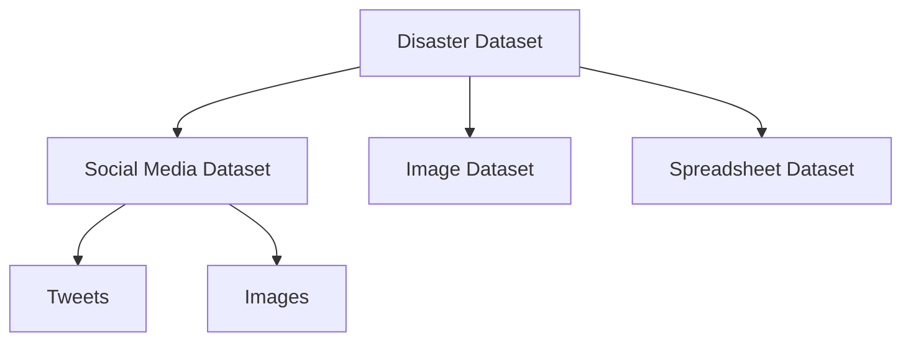
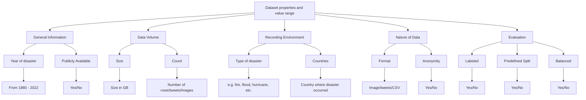

# A survey of disaster management datasets

Sohail Abbas, Manar Abu Talib, Qasim Nasir, Omar Belal, Mohammed Emad Al-Haidary & Ibtihal Ahmed

To cite this article: Sohail Abbas, Manar Abu Talib, Qasim Nasir, Omar Belal, Mohammed Emad Al-Haidary & Ibtihal Ahmed (2025) A survey of disaster management datasets, Journal of Information and Telecommunication, 9:4, 574-596, DOI: 10.1080/24751839.2025.2509452

To link to this article: https://doi.org/10.1080/24751839.2025.2509452

© 2025 The Author(s). Published by Informa UK Limited, trading as Taylor & Francis Group

Published online: 30 May 2025.

Submit your article to this journal

Article views: 2848

View related articles

View Crossmark data

Citing articles: 1 View citing articles

∂ OPEN ACCESS

Check for updates

# A survey of disaster management datasets

Sohail Abbasa, Manar Abu Talib a, Qasim Nasirb, Omar Belalb, Mohammed Emad Al-Haidaryb and Ibtihal Ahmeda

aDepartment of Computer Science, College of Computing and Informatics, University of Sharjah, Sharjah, UAE; bDepartment of Computer Engineering, College of Computing and Informatics, University of Sharjah, Sharjah, UAE

## ABSTRACT

Natural disasters are characterized as a combination of natural hazards and vulnerabilities that endanger communities and result in significant financial and human losses. The uncertain occurrence of these events and the limited resources in afected regions constitute their core attributes. Leveraging information technology to assess, forecast, and depict these occurrences can improve handling such disasters. Artificial Intelligence (AI) technology has recently been employed practically in various disciplines for various applications, and disaster management applications are among the most critical areas. The dataset is essential to any AI system and must be corrected to deliver reliable results. Disaster datasets are presented and described in literature. This study examines the datasets available for disaster evaluation and detection frameworks. A general framework consisting of five main dataset properties is designed for the presentation of the datasets. Some features include general information, data volume, recording environment, data nature, and evaluation. There are two or three sub-properties under each of the five main properties. Each dataset is examined in comparison to the listed attributes.

## ARTICLE HISTORY

Received 29 April 2024

Accepted 17 May 2025

## KEYWORDS

Natural disasters; Artificial Intelligence; datasets properties; image dataset; social media dataset

## 1. Introduction

Natural disasters happen when a community is exposed to too much danger, causing significant morbidity and mortality. Over 300 natural catastrophes have occurred annually during the past ten years, afecting millions and causing billions of dollars in damage (Prasad & Francescutti, 2016). Earthquakes, floods, hurricanes, typhoons, volcanoes, and storms significantly impact society. Catastrophic losses in human life and economic consequences can result from disasters. A significant increase from 166 billion USD in damages from 860 natural disasters in 2019 to 210 billion USD from 980 natural catastrophes worldwide in 2020, according to Munich Re (Facts + Statistics: Global catastrophes & III, 2024).

The most cutting-edge tool is needed by emergency responders to combat environmental threats and hazards. State and municipal governments may benefit from using Artificial Intelligence (AI) technology to estimate the likelihood of future catastrophes, detect disasters early, identify risks to foresee disaster outcomes and assess damage after disasters have occurred (Zolkafli et al., 2024). It is critical to engage AI to assist governments in preparing for disasters in advance so that rescue crews are ready, and the resulting harm is reduced to the most minor extent possible. AI technologies (Abid et al., 2021; Sun et al., 2020; Zolkafli et al., 2024) are thought to have the most significant promise for catastrophe preparedness and response. Sun et al. (2020) presented a thorough survey into how AI is now being used in diferent stages of disaster management, including mitigation, preparedness, response, and recovery. Their study illustrates instances where diverse AI methods are employed, outlining their advantages in aiding disaster management across these distinct phases.

Moreover, they present practical tools for decision support rooted in AI technology. According to N. Kankanamge et al. (2021), there is limited empirical investigation and understanding of public perceptions concerning AI for disaster management.

In the present literature, many initiatives have been made to mitigate the impact of disasters, which are briefly discussed. K. S. Ochoa (2020) ofered an experiment that combined knowledge from 8,364 scholarly abstracts on disasters with mission statements from 1,930 humanitarian groups from an online index. Their experiment employs AI in the form of a neural network for word embedding (Word2Vec) and an unsupervised machine learning technique for clustering (Self Organizing Maps). It also uses human intelligence for information selection and decision-making (Kanth et al., 2019). Proposed an AI-based real-time disaster response system to help volunteers understand victim needs, either in terms of rescue or donated funds, by identifying relevant tweets and classifying them by either rescue or donation. Furthermore, research has examined the role of AI, data science, and big data in disaster management. A summary of the research studies on Machine Learning (ML) and Deep Learning (DL) created approaches for disaster management is given in (Linardos et al., 2022). Particularly the disciplines of catastrophe and hazard forecasting, risk and vulnerability analysis, disaster detection, and damage assessment. Also, (Aboualola et al., 2023) examines recent research on diferent phases of disaster management, emergency prediction, detection, management, and response systems.

To the best of our knowledge, no survey paper exists that gathers and compares diferent disaster datasets. Benchmarking datasets will aid in comparing and evaluating the performance of varying disaster recovery systems. When datasets label each data point, such as injured people, deaths, location, disaster type, and level of damage, this helps governments and rescue teams make better decisions during disasters. In this work, a survey of existing disaster datasets in the literature has been provided. The paper collects and analyzes many forms of datasets connected to disaster occurrences, including images, social media, and spreadsheet datasets. The main contribution of this paper can be summarized as follows:

. Conduct a thorough survey of open-source disaster management datasets, categorizing them as image, social media, and spreadsheet datasets.  
. Provide a comparison of data sets regarding their categorization tasks, disaster type, and standard features to provide valuable insights for data set selection.

The rest of the article is organized as follows. In Section 2, we present the taxonomy of the research domain. The dataset collection process is described in section 3. The dataset properties often used in the literature to evaluate the quality of disaster recovery datasets are described in 4. Section 5 provides a comprehensive list of image datasets. Section 6 details social media datasets classified into imagery and textual datasets. Spreadsheet datasets are discussed in Section 7. Section 8 examines further sources for disaster recovery datasets. Discussion and analysis are discussed in Section 9. In Section 10, we present the future directions and challenges of this work. Finally, the paper is concluded in Section 11.

## 2. Taxonomy

When considering machine learning, most data may be classified into four distinct categories: numerical data, categorical data, time-series data, and text. The datasets surveyed in the paper are classified into three categories: (a) images dataset, (b) social media dataset, and (c) spreadsheet dataset. Social media data is further categorized into textual and image datasets, as presented in Figure 1.

The first dataset type is the image dataset, which can be qualitative or quantitative. In qualitative image analysis, materials or phenomena are diferentiated or discriminated against. Quantitative analysis involves quantifying picture properties and applying probabilistic claims to identify cations, such as error rates (Oberholzer et al., 1996).

The second data category considers social media (Facebook and Twitter) content about global events. It’s further divided into textual and imagery datasets. Due to Twitter’s immediate access to timely multi-modal information (text and photos), research studies have placed a greater emphasis on its content. The enormous amount of information on Twitter is thought to be highly helpful for training machine learning or deep learning models created for disaster recovery applications.

The final dataset class in this paper is spreadsheets, in which the rows represent data points, and the columns represent features. Since a disaster will involve several specifics and figures, such as the number of deaths or injuries, CSV data is helpful in disaster recovery scenarios. While working with massive datasets or complicated methods isn’t optimal for this approach, it can help with the presentation and interpretation of smaller datasets. It is typical for this type of data to be pre-processed and filtered before being fed into ML algorithms. Additionally, feature selection strategies should be applied to identify the most crucial and valuable features to improve overall performance.

flowchart

Figure 1. Disaster management dataset classification.

## 3. Datasets collection

We gathered datasets from diverse sources to ensure comprehensive coverage for diferent research purposes. Initially, we searched extensively for disaster-related datasets on well-known platforms such as Kaggle. These Kaggle datasets are particularly useful for training and benchmarking machine learning models because they are structured and well-documented. For instance, the ‘Disaster Response Messages’ dataset contains messages sent during disaster events, which can be used to train models for classifying and prioritizing emergency responses.

In addition to online platforms, we explored publicly available datasets from various governmental organizations. These datasets ofer reliable data for policymakers to plan and implement disaster management strategies. Moreover, they often include historical data, crucial for analyzing trends and improving future disaster preparedness. An example of such a dataset is the US Natural Disaster Declarations, which includes information on disaster declarations in the United States and can be used to study the frequency and impact of various types of disasters over time.

We also included datasets derived from social media platforms, which provide realtime data that can be analyzed to understand public sentiment and the spread of information during disaster events. These datasets are valuable for real-time monitoring, sentiment analysis, and studying crisis communication. For instance, the Twitter Data During Natural Disasters dataset contains tweets from users during natural disasters, ofering insights into disseminating information and public reactions in real-time.

The collected datasets varied in their state of preprocessing; some had undergone preprocessing, while others were raw and unprocessed. Preprocessing typically depends on the specific application and can include steps such as data cleaning, normalization, and transformation to ensure the data’s suitability for analysis. However, it is important to note that in this study, our primary objective was to provide a comprehensive survey of the available datasets rather than to utilize them in specific experiments. As a result, we did not engage in any preprocessing. Instead, we focused on documenting and analyzing these datasets’ characteristics and potential applications to ofer a valuable resource for future disaster management and analysis research. By surveying these datasets, we aim to provide researchers and practitioners with a detailed understanding of the available data, its potential uses, and the considerations required for preprocessing, ultimately facilitating more efective and informed disaster management strategies.

## 4. Dataset proprieties

It is vital to specify common attributes as evaluation criteria to evaluate diferent disaster datasets and to guide researchers in finding relevant datasets for their particular model. Therefore, various datasets are analyzed to specify the most important properties for dataset comparison. Some datasets include unique properties not in the other datasets; such properties are discussed separately in the unique properties section. For example, the Canadian disaster database (CDD, 2024) focuses on disaster-related costs, which are not included in the other datasets. We aim to define general and common properties to enable us to compare large datasets.

The characteristics of datasets fall into five classes: context, data volume, recording environment, data type, and evaluation. Figure 2 shows the five categories and their properties with a brief description for each value. The general information category includes two properties: the year of the disaster and the public availability of data. In the data volume class, two properties are analyzed related to the size of datasets size and data count. The locations of the disasters and their type are grouped under the recording environment. The anonymity category is mainly related to the datasets composed of tweets and specifies whether the tweets are shown or hidden.

Hidden tweets are replaced with a tweet ID, and the original content can be extracted using special software and tools. In ML, data splitting is widely used to divide data into training, testing, and validation sets. Methods are used to discover the model’s hyper-parameters and to measure generalization performance. Moreover, data labelling is a crucial aspect of data preparation for ML, especially in the case of supervised learning, where input and output data are labelled for classification to give a learning basis for future data processing. One more aspect to take into consideration is the class imbalance problem.

flowchart

Figure 2. Dataset properties.

## 5. Image datasets

Images are commonly used in training ML algorithms. They ofer visually appealing data that people can classify and utilize. Image processing involves translating a picture into a digital format and performing operations to extract pertinent information. Image processing can be used to segment an object or area of interest. For example, in the case of a disaster like a wildfire, image processing can be used to segment out the fire area from the image. When specialized signal processing techniques are implemented, the image processing system will typically interpret all photographs as two-dimensional signals (Gupta et al., 2019). Image processing has five subfields: visualization, recognition, sharpening and restoration, pattern recognition, and retrieval. With suitable datasets, it is possible even to classify the level of damage from an image.

Direct picture dataset collection during or after a disaster to evaluate the damage is frequently tricky. Even though disaster detection in satellite imagery has received significant attention from the scientific community and several solutions have been proposed, a suitable dataset for evaluation and comparison is still lacking. The commercial use of satellite images and the low temporal frequency of satellite imagery (Said et al., 2019) are some of the satellite challenges.

Recently, NASA made the data from Landsat available. Landsat is essential for risk assessment, damage mapping, and post-disaster recovery planning since it records the state of the Earth’s land surfaces before and after disasters (Myint et al., 2008). The literature demonstrates the use of satellite imagery from Landsat archives in several studies for disaster analysis (Fisher et al., 2016; Kansas et al., 2016). Also, (Chen et al., 2018; Foulser-Piggott et al., 2012; Fujita et al., 2017) developed imagery datasets to automatically identify damaged buildings from photographs captured by the airborne and satellite. These datasets, however, are restricted to a specific disaster type and do not have standard criteria that can be applied across many disasters.

To tackle the previously mentioned limitations, a large-scale XBD dataset of satellite imagery is presented in (Gupta et al., 2019) for building damage assessment. It includes a wide range of catastrophes and locations. XBD is a comprehensive building damage assessment collection to date, with 850,736 building annotations dispersed throughout 45,362 square kilometres of photos. Out of 19 disaster occurrences initially included in Open Data Programs, the XBD dataset chose eleven. Annotators use a multi-step procedure to build polygons and damage classifications using a web-based annotation tool created in-house by CrowdAI. The Joint Damage Scale, which assigns one of four categories of damage, is developed by the authors as an alternative to merely labelling a building as ‘damaged’ or ‘undamaged’. Similarly, the Ida-BD dataset (Kaur et al., 2023) uses polygons to represent building segments and assign four damage categories. In contrast, the dataset focused only on Hurricane Ida 2021 in Louisiana, USA, to detect its impact in the afected area. The dataset comprises 87 high-resolution pre- and post-disaster satellite imagery pairs (0.5 m/pixel).

## 6. Social media datasets

People use social media during disasters to share feelings, ofer support, and draw attention to essential needs. Humanitarian organizations can use these details to make prompt decisions and plan and carry out relief eforts. Processing social media information presents multiple challenges, for example, parsing noisy, brief, and informal messages and learning information categories from the incoming stream of messages. Diferent natural language processing (NLP) techniques can be applied to process social media messages, such as automatic summarization, information classification, and information extraction (Imran et al., 2016).

Information on social media is mainly shared in textual messages and image forms. Earlier research in crisis informatics has been on textual content analysis. However, there has been a recent increase in interest in the study of imagery content. In this section, the two categories are surveyed. The two categories of social media datasets are discussed below.

## 6.1. Textual social media dataset

Twitter is a social media platform that people use to post about global events. Disasters are one of the important events that a community may tweet about. Analyzing tweets for early detection of disaster event(s) without physically witnessing the actual disaster location(s) is very useful. Moreover, the Twitter platform ofers a massive amount of information, which is quite helpful for training ML or deep learning models built for disaster recovery applications. The tweets in the datasets are not provided as written tweets but as tweet IDs. Special tools and applications can be used to obtain the text of the tweets from the tweet IDs.

According to N. Algiriyage et al. (2022), practical disaster response activities mainly depend on textual information, such as situation reports and email content. Other media’s benefits are often not realized. Kabir and Madria (2019) state that every activity in disaster management demands accurate and up-to-date information to allow a quick, easy, and cost-efective response to reduce possible loss of life and destruction of property.

Obtaining timely information from various parts of a disaster-stricken region is a challenging and complex task. According to A, the widespread use and availability of platforms like Twitter and other social networks enable individuals to promptly share information as events in real-time. Sadri et al. (2018), many people use social media to communicate with limited or no access to traditional information sources. Using machine learning techniques, this study explored the evolution of various communication patterns and determined user concerns that emerged throughout Hurricane Sandy.

CrisisLex is one of the most extensive publicly available datasets; it ofers a platform for sharing crisis-related data collections and other tools to evaluate social media data for disasters. It consists of two subsets, i.e., CrisisLexT6 and CrisisLexT26. CrisisLexT6 (Olteanu et al., 2014) covers data from six crises between October 2012 and July 2013. It contains 60,000 tweets annotated based on relatedness, related vs. not-related binary classification. CrisisLexT26 (Olteanu et al., 2015), on the other hand, includes 250,000 tweets collected from 26 crisis events that occurred in 2012 and 2013 with annotations for classification tasks involving humanitarian categories (six classes), informative vs. notinformative classification, and more.

In Crisisnlp (Imran et al., 2016), the authors provide a dataset of 52,000 human-labelled tweets collected from 19 distinct disasters between 2013 and 2015. Each dataset contains tweet IDs and human-labelled tweets of the event. Moreover, it includes a dictionary of out-of-vocabulary (OOV) words, a word2vec model, and a tweet download tool. These tweets have been annotated using various schemes, including classes for humanitarian disaster response and some courses for health emergencies.

Another textual dataset is Human-Annotated Disaster Incidents Data (HUMAID) (Alam, Qazi, et al., 2021) crisis informatics research contains over 77,000 labelled tweets and is sampled from 24 million tweets collected during 19 major real-world disasters between 2016 and 2019. Challenge SMERP dataset (Ghosh et al., 2017) is used for extracting and summarizing data related to practical information needs (themes) crucial to post-disaster relief activities, such as resource shortages and availability, infrastructure damage, and restoration. The Data Challenge track was created using a dataset of tweets and microblogs posted following the earthquake in central Italy in August 2016. The dataset includes only one disaster type, which is the earthquake that took place in central Italy in August 2016.

## 6.2. Imagery social media dataset

Most studies and systems mainly focused on using textual content to aid disaster response. In addition to textual messages, recent images users share in media during and after a crisis can support disaster management. Images datasets that are available online include the multimodal dataset (CrisisMMD) (Alam et al., 2018), the damage severity assessment dataset (DAD) (Nguyen et al., 2017), and the damage identification Multimodal dataset (DMD) (Mouzannar et al., 2018). The DAD dataset only contains images, while the other datasets combine text and images.

CrisisMMD (Alam et al., 2018) is a sizeable multi-modal dataset gathered from Twitter during various natural disasters. It comprises hundreds of thousands of hand-annotated tweets and photographs taken during seven major natural disasters in 2017 across the globe. The complete dataset contains 16,058 texts and 18,082 photos sourced from Twitter. Three annotation tasks are done manually for the dataset, including damage severity, Humanitarian categories, and message information. (Niloy et al., 2020) accumulated a relatively challenging dataset containing images for various disaster events, including natural and man-made disasters from diferent geographical areas. A novel dataset with 13,720 images across six disaster categories and ten subcategories. The main categories include damaged infrastructure, fire disaster, human damage, water disaster, land disaster, and no damage.

To develop a robust model with a large amount of data, data consolidation from diferent datasets is suggested. Combining datasets will aid in training more complex models. However, consolidating datasets has dificulties, such as dealing with duplicate content and conflicting class labels across diferent data sources. Authors in (Alam et al., 2019) investigated the possibility of consolidating social media disaster response data. A significant limitation is that duplicate content has not been considered while combining the diferent datasets, which may result in an overlap between the train and test datasets. The authors continued their work by developing a large social media disaster image classification dataset (Alam et al., 2020), a consolidated version of DAD, CrisisMMD, DMD, and additional labelled images. Classification of new datasets includes disaster type detection, informativeness classification, and damage severity assessment. They further extended their work in (Alam, Sajjad, et al., 2021) by consolidating eight human-annotated datasets (CrisisLex [Olteanu et al., 2014], CrisisNLP [Imran et al., 2016], ISCRAM, damage severity assessment dataset (DRD), Disasters on Social Media (DSM), CrisisMMD (Alam et al., 2018) Artificial Intelligence for Disaster Response (AIDR) (Imran et al., 2014)) and 166.1k and 141.5k tweets have been provided for informativeness and humanitarian classification tasks, respectively. Additionally, binary and multiclass classification task benchmarks are presented using several deep learning architectures, including CNN, fastText, and transformers. Various forms of duplicate are carefully considered, and a language tag is assigned as the dataset contains multiple tweets.

In addition to the already annotated labels in (Alam et al., 2020), the study is expanded in (Alam et al., 2023), and 155,899 more labels are added. A Multi-Task Learning Dataset for Disaster Image Classification (MEDIC) is a manually annotated multi-task learning dataset designed primarily for multi-task learning research and disaster response image classification. Multi-task learning assists in enhancing performance by reducing computational complexities and inference time. For instance, an image posted might reveal information about the disaster type, show infrastructure damage, and whether it is severe. The four classification tasks include disaster types, informativeness, humanitarian, and damage severity are considered. This dataset has great cpotential to support research on multi-task learning, which has recently drawn a lot of interest from the machine learning community and is a significant characteristic.

The multi-labelled dataset is also discussed in (Weber et al., 2023). Incidents1M is a large-scale multi-label dataset that contains 977,088 images, with 43 incidents and 49 place categories. They extended their work (Weber et al., 2020) from 446,684 to 977,088 images and obtained multiple labels per image instead of a single label assumption. Additionally, depending on the URL used to download each image, they performed a simple geographic analysis using each image’s latitude and longitude coordinates.

## 7. Spreadsheets dataset

In Excel spreadsheets, data are presented in rows and columns using Microsoft spreadsheets. This dataset type isn’t ideal for extensive data or complex algorithms; few papers consider this category.

US Natural Disaster Declarations have been maintained since 1953 (US Natural Disaster Declarations., 2024). This summary dataset contains a high-level overview of all federally designated catastrophes. The author grabbed it from the FEMA website (FEMA, 2024), cleaned it, and formatted it using simple tools. For each data point, 22 columns can be considered labels for the dataset. The disaster is classified into three categories: significant disasters, emergency management, and fire management. The Canadian Disaster Database (CDD) (CDD, 2024) ofers extensive disaster information on over 1000 natural, technical, and conflict-related (excluding war) disasters in Canada since 1900, along with many that took place overseas but have impacted Canadians directly. The database lists the location and date of each catastrophe, the number of injuries, evacuations, and fatalities, and a preliminary cost estimate. Another proposed CSV dataset is the Multilingual Disaster Response Messages dataset (Multilingual Disaster Response Messages, 2024), which Comprises 30,000 messages originating from instances of disasters. The dataset has been labelled with 36 unique categories related to disaster response. Additionally, any messages containing sensitive details have been removed from the dataset.

In contrast to previous CSV datasets that considered diferent disaster types, the historical data of the earthquake dataset (Historical data of Earthquakes [1800–2021], 2024) only focused on earthquake data from as long ago as 1800 and has been updated until 2021. There are 38 columns, but only 26 are valid and include information, while the rest are empty. The columns include several metrics such as the date, the damage resulting from the earthquake, and other related information. The data is contained in 4,824 rows.

## 8. Other dataset sources

Other valuable sources can also be accessed for disaster datasets. The following websites serve as gateways to datasets on natural disasters and risks. While most sites focus on the United States, several provide statistics on severe weather occurrences worldwide. Most can be accessed directly using a web browser, whereas others require the formation of an account to download the datasets.

The Centre for Research on the Epidemiology of Disasters (Donatti et al., 2024) has created EM-DAT: The international disaster database. As a global partnership between organizations and government agencies, this database could be searched by disaster type, nation of origin, and information source. Another source is the DATA.GOV Data Catalog, where users can search thousands of US government databases on several areas, including agriculture, ecosystems, climate, and the ocean. The International Research Institute for Climate and Society has built the Climate Data Library (I. Ministerio de Agrícultura, UNESCO, FAO, 2024), which provides access to datasets focusing on climate-related data. The Socioeconomic Data and Applications Centre has compiled the Hazards and Disaster Risk Datasets (Güneralp et al., 2015), containing hundreds of datasets on natural hazards and disasters, maps, and other tools.

Another helpful source (National Centers for Environmental Information [NCEI]), the National Centers for Environmental Information developed a tool called Severe Weather Data. It includes the Storm Events Database, Severe Weather Data Inventory, and various lightning strike data products. In addition, the National Hurricane Center (NHC, 2024) has a publicly accessible Data Archive that can access reports, advisories, maps, and historical storm information. Finally, the website of the National Oceanic and Atmospheric Administration (NOAAClimate, 2023) contains a Dataset Gallery with hundreds of NOAA-curated datasets spanning historical weather records, average temperatures, and severe weather

## 9. Discussion

Evaluation criteria must be selected to analyze and compare the datasets. It is vital to highlight that no single data set can be ideal in all applications. This section analyzes and compares the datasets regarding common properties and characteristics. Details of each category are summarized in Tables 2–4. Table 2 shows the properties of each dataset. Table 3 outlines disaster management datasets, including pros, cons, and potential remedies. Image datasets are visually appealing and versatile, aiding detailed analysis and various machine learning tasks, but face challenges like data collection risks, limited availability, and processing complexity, which can be mitigated by using satellite data, drone imagery, and advanced image processing techniques. Social media datasets ofer timely, large-volume insights capturing public sentiment but sufer from noise, brief informal texts, and privacy issues; these can be addressed with advanced NLP techniques, data preprocessing, and anonymization tools. Imagery social media datasets combine visual and textual data for richer context and real-time visuals but face quality variability, data duplication, and high processing overheads; solutions include image quality assessment, duplicate detection, and eficient storage solutions. Spreadsheet datasets are structured, easy to manipulate, and widely adopted, facilitating quantitative analysis but lacking detail and real-time analysis capabilities, and integration with unstructured data can be challenging; potential remedies include augmenting with other data types, automating updates, and developing data integration frameworks. Finally, Table 3 shows the dataset type and the region from which this dataset is gathered.

## 9.1. Common properties

Comparing general information properties, all datasets are available online and quickly accessed. Most datasets are gathered over time, except for (Nguyen et al., 2017; Mouzannar et al., 2018), which only considered disasters that occurred in one year. Furthermore, (CDD, 2024; Historical data of Earthquakes [1800–2021], 2024; US Natural Disaster Declarations., 2024) collected data over decades, while the maximum study period for the remaining datasets is nine years. Data count and size are the two analyzed properties related to the size of datasets. Figure 3 depicts the data count for each dataset per category.

For region classification, some datasets focus only on one region, such as the (CDD, 2024; Ghosh et al., 2017; US Natural Disaster Declarations., 2024), whereas other datasets include events from many areas.

bar

| Category | Dataset | Data Count |
| :--- | :--- | :--- |
| Image | MEDIC | 71,198 |
| Image | Incidents1M | 977,088 |
| Image | Novel dataset | 13,720 |
| Image | Deep Learning Dataset | 71,198 |
| Image | XBD | 22,068 |
| Tweets | Crisisbench | 307,600 |
| Tweets | HUMAIS | 77,000 |
| Tweets | CrisisMMD | 34,140 |
| Tweets | CrisisNLP | 52,000 |
| Tweets | SMERP | 72,000 |
| CSV | US Natural Dataset | 5,116 |
| CSV | Canadian Dataset | 1,025 |
| CSV | Multilingual Dataset | 30,000 |
| CSV | Historical Earthquakes | 4,824 |

Figure 3. Data count per category.

Number of dataset  

bar

| Category | Value |
| --- | --- |
| Date | 3 |
| State/place | 4 |
| Incident type | 7 |
| Displaced people and evacuations | 7 |
| Donation/volunteering services | 7 |
| Missing, trapped, or found people | 8 |
| Infrastructure and utilities damage | 9 |
| Injured or dead people | 9 |

Figure 4. Common features.

Machine learning algorithms grow over time by learning from their mistakes. Today, three significant methodologies are utilized to train ML algorithms: supervised, unsupervised, and reinforcement learning. The data in supervised learning must be labelled. Only the SMER dataset is unlabelled, whereas all other image and social media datasets are labelled. There is no labelling for CSV, but features are included.

It was also noticed that some standard features among several datasets will help researchers understand the most significant aspects of disaster-related training for AI applications. Figure 4 presents the most frequently utilized common characteristics across datasets. Infrastructure, utility damage, and injured or deceased people are the most regularly used features. These are rational facts to collect in catastrophe scenarios since, after a disaster, humans care about other people and seek to preserve the lives of those afected and maintain infrastructure, which is directly tied to human and economic losses. Missing, trapped, or found persons, as well as displaced people and evacuations, are also frequently utilized because they have a direct relationship to human casualties. The Donation / Volunteering Services feature is beneficial for disaster recovery because the recovery process is usually initiated by volunteers using donated monies. Moving on to Incident type, State/location, and Date, these features can be employed in disaster prediction apps to anticipate a disaster before it happens.

Another suggested comparative analysis for datasets is classification tasks, as presented in Table 1. Only MEDIC (Alam et al., 2023) and deep learning task (Alam et al., 2020) datasets considered the four classification tasks: informative, humanitarian, damage severity, and disaster type.

## 9.2. Dataset analysis

The CrisisNLP dataset (Imran et al., 2016) is a well-documented collection designed for analyzing social media reactions to disaster events, comprising around 52,000 rows and approximately 15 columns. Each row includes detailed attributes such as tweet ID, user information, timestamp, tweet text, language, disaster type, and various labelled categories related to disaster impact and response. The dataset is dense, with minimal missing values, and has undergone a rigorous supervised annotation process to ensure high-quality and accurate labelling. It is balanced across diferent disaster types, covering events such as earthquakes, floods, and hurricanes, providing a broad spectrum of disaster-related social media data. The dataset also addresses initial class imbalances by rebalancing the data before release. Additionally, it includes supplementary resources such as a dictionary of out-of-vocabulary words, a word2vec model, and a tweet downloader tool.

Table 1. Classification tasks.

<table><tr><td>Dataset</td><td>Informative</td><td>Humanitarian</td><td>Damage severity</td><td>Disaster type</td></tr><tr><td>MEDIC</td><td>✓</td><td>✓</td><td>✓</td><td>✓</td></tr><tr><td>Incidents1M</td><td>✓</td><td></td><td></td><td>✓</td></tr><tr><td>A Novel Disaster Dataset</td><td>✓</td><td></td><td>✓</td><td>✓</td></tr><tr><td>CrisisBench</td><td>✓</td><td>✓</td><td></td><td></td></tr><tr><td>HumAID</td><td>✓</td><td>✓</td><td></td><td>✓</td></tr><tr><td>Deep Learning Benchmarks Datasets</td><td>✓</td><td>✓</td><td>✓</td><td>✓</td></tr><tr><td>CrisisMMD</td><td>✓</td><td>✓</td><td>✓</td><td></td></tr><tr><td>CrisisNLP</td><td></td><td>✓</td><td></td><td></td></tr><tr><td>xBD Dataset</td><td></td><td>✓</td><td>✓</td><td></td></tr></table>

In the CrisisMMD dataset (Alam et al., 2018), professionals perform the annotation process manually, and the annotation tasks are clear and well-organized. This dataset is considered ideal for machine learning training research because it contains two types of data (tweets and images) within a reasonable size. It includes around 18,000 rows and approximately 12 columns, capturing attributes such as tweet ID, user information, timestamp, tweet text, image links, and disaster type. The dense dataset, with most fields populated, has undergone thorough preprocessing and filtering to remove duplicate entries and noisy data. Professionals manually perform the annotation process, ensuring highquality and well-organized labelled data. The dataset is reasonably balanced across diferent disaster types, providing a diverse range of disaster events for comprehensive analysis. It includes labelled categories for diferent aspects of disasters, such as damage severity and humanitarian needs, making it highly suitable for supervised learning tasks.

The SMERP dataset (Ghosh et al., 2017) is a focused collection of approximately 5,000 tweets related to a major earthquake event, ofering valuable insights into public reactions and information dissemination during the disaster. It includes around 10 columns, capturing metadata such as the tweet ID, timestamp, user information, and tweet text. The dataset is reasonably dense, with most fields populated, although not labelled, making it less suitable for supervised learning tasks. The data structure includes essentia details like timestamps and user information, but it has not undergone preprocessing or filtering, meaning it contains duplicate entries and potentially noisy data. Despite this, the dataset’s manageable size and specific focus on a single disaster event make it useful for unsupervised learning, exploratory data analysis, and studying public response during an earthquake. However, its application is limited by the lack of multiple disaster types and the need for additional preprocessing to clean the data.

US Natural Disaster Declarations (US Natural Disaster Declarations., 2024) is an excellent and well-organized dataset. It is a dense and comprehensive collection of approximately 60,000 rows and around 20 columns detailing natural disaster events declared in the United States since 1953. Each row represents a unique disaster declaration and includes key attributes such as disaster number, state, declaration date, disaster type, incident begin and end dates, afected counties, and assistance programmes activated. The dataset is well-annotated, with high data density and few missing values, ensuring reliability for analysis. While it is relatively balanced across diferent disaster types and regions, certain more frequent disaster types like hurricanes and floods may have more entries. This dataset’s detailed and consistently populated structure makes it highly suitable for longitudinal studies, disaster prediction, policy analysis, and machine learning applications to improve disaster response and resilience.

The Canadian Disaster Database (CDD, 2024) is a dense and comprehensive resource comprising over 1,000 rows and around 15 columns, each representing distinct disaster events in Canada since 1900. This dataset includes key attributes such as disaster ID, type, event date, location (with latitude and longitude), detailed descriptions, impact metrics (including the number of people afected, injuries, fatalities, and economic losses), and response actions. With high data density and minimal missing values, it ensures reliability and completeness for thorough analysis. The dataset is relatively balanced, covering a wide variety of disaster types, including natural, technological, and conflict-related events, though more frequent disasters like floods and storms have more entries. Its structured and detailed nature makes it highly suitable for research on disaster trends, predictive modelling, and informing policy decisions to enhance disaster preparedness and response in Canada.

The Multilingual Disaster Response Messages (Multilingual Disaster Response Messages, 2024) is a comprehensive collection designed for training and evaluating machine learning models in the context of disaster response across diferent languages. It comprises around 26,000 rows and 40 columns, each capturing detailed attributes such as message ID, original message, translated message, genre (e.g., social, news, direct), and various categories indicating the nature of the message (e.g., medical help, water, food, shelter). The dense dataset, with most fields populated, ensures high quality and completeness. Each message is labelled with binary values (0 or 1) for the 40 categories, making it suitable for multi-label classification tasks. The data is relatively balanced across these categories, allowing for robust model training and evaluation. The dataset is structured into three files: one for training, one for validation, and one for testing, facilitating immediate use for machine learning applications. However, a noted drawback is that the features are not clearly defined in some instances.

Historical Data of Earthquakes (Historical data of Earthquakes [1800–2021], 2024) is a comprehensive collection that records earthquake events from 1800 to 2021, comprising around 38,000 rows and 38 columns. Each row represents a unique earthquake event and includes detailed attributes such as event ID, date, time, latitude, longitude, depth, magnitude, location description, and various impact metrics (e.g., fatalities, injuries, economic losses). The dataset is sparse, with numerous missing values, particularly in impact metrics, which can afect the completeness and reliability of certain analyses. Of the 38 columns, only 26 are consistently populated, with the rest containing substantial missing data. Additionally, the dataset requires significant preprocessing and filtering to handle redundant features and missing values, making it less immediately ready for machine learning tasks without further cleaning. Despite these challenges, the dataset’s extensive temporal coverage and detailed event descriptions make it valuable for historical analysis, earthquake trend studies, and the development of predictive models, provided that appropriate data cleaning and preprocessing steps are applied.

XBD (Gupta et al., 2019) is an extensive and well-organized collection tailored for machine learning research in disaster management, specifically building damage assessment. It includes around 1 million images, capturing pre- and post-disaster satellite imagery with detailed annotations. Each image is associated with attributes such as disaster type, geographic coordinates, damage level, and building polygons, totalling about 10 metadata columns. The dataset is dense, with a high degree of completeness in its annotations and metadata. It is particularly balanced across diferent disaster types, including hurricanes, wildfires, earthquakes, and floods, ensuring diverse training data for machine learning models.

In the HUMAID dataset (Alam, Qazi, et al., 2021), is a carefully curated collection designed to aid in developing and evaluating machine learning models for disaster management, particularly in humanitarian contexts. The dataset comprises around 77,000 rows and approximately 12 columns, each representing a tweet about disaster events. Key attributes include tweet ID, timestamp, user information, tweet text, disaster type, location, and multiple labelled categories indicating the nature of the tweet (e.g., needs, ofers of help, infrastructure damage). The dense dataset, with most fields populated and minimal missing values, ensures high data quality and completeness. The dataset is balanced across four disaster types and various geographic regions, providing a diverse and representative sample of disaster-related social media data.

MEDIC (Alam et al., 2023) is a large-scale, manually annotated dataset specifically designed for multi-task learning in disaster management. It consists of approximately 200,000 rows and around 20 columns, capturing various aspects of disaster-related information. Each row represents a piece of data (e.g., a tweet or a text snippet) and includes attributes such as ID, timestamp, source, text, and multiple labelled categories relevant to disaster response (e.g., damage assessment, humanitarian needs, and disaster type). The dataset is dense, with most fields consistently populated, ensuring high data quality and reliability. It is balanced across diferent disaster types and geographic regions, providing a comprehensive and representative sample of disaster-related data.

Incidents1M (Weber et al., 2023) is a large-scale, multi-label disaster management research dataset comprising around 1 million images. Each image is annotated with metadata, including incident type, geographic coordinates, and multiple labels related to disaster characteristics and impacts. The dataset includes approximately 15 columns capturing these attributes. The dense dataset, with most fields populated, ensures high data completeness and reliability. It is balanced across diferent disaster types, including natural disasters such as earthquakes, floods, and wildfires, providing a diverse and representative sample of disaster-related imagery.

Tables 2 – 4 presents a comparison of all the listed datasets, focusing their properties, advantages, disadvantages, the type of disaster considered and the region covered. Selecting an appropriate dataset primarily depends on the study object; despite the standard features and properties, we can consider Incidents1M (Weber et al., 2023), MEDIC (Alam et al., 2023), deep learning (Alam et al., 2020), and XBD (Gupta et al., 2019) are the recommended datasets for research purposes due to several aspects. First, these datasets are the most well-defined and the clearest. Second, the annotation and labelling process for these datasets is detailed, organized, and well-monitored by experts. Third, their sizes are conducive to training ML algorithms. Finally, they address three or four diferent tasks.

Ta ble 2 . Co m pa ri n g co m m o n p ro p ri eti es of d isaste r d atasets.

<table><tr><td rowspan="2">Dataset</td><td colspan="2">General information</td><td colspan="2">Nature of data</td><td colspan="2">Data volume</td><td colspan="3">Evaluation</td><td rowspan="2">Multimodality</td></tr><tr><td>Year</td><td>Available</td><td>Format</td><td>Anonymity</td><td>Size</td><td>Count</td><td>Labelled</td><td>Balanced</td><td>Split</td></tr><tr><td>MEDIC (Alam et al., 2023)</td><td>2014–2017</td><td>Yes</td><td>Images</td><td>-</td><td>11GB</td><td>71,198</td><td>Yes</td><td>Yes</td><td>Yes</td><td>No</td></tr><tr><td>Incidents1M (Weber et al., 2023)</td><td>2015–2018</td><td>Yes</td><td>Images</td><td>-</td><td></td><td>977,088</td><td>Yes</td><td>Not given</td><td>Yes</td><td>No</td></tr><tr><td>Novel dataset (Niloy et al., 2020)</td><td>-</td><td>Yes</td><td>Images</td><td>-</td><td>1.5 GB</td><td>13,720</td><td>Yes</td><td>Not given</td><td>Yes</td><td>No</td></tr><tr><td>Deep learning dataset (Alam et al., 2020)</td><td>-</td><td>Yes</td><td>Images</td><td>-</td><td></td><td>71,198</td><td>Yes</td><td>Yes</td><td>Yes</td><td>No</td></tr><tr><td>XBD (Gupta et al., 2019)</td><td>2011–2019</td><td>Yes</td><td>Images</td><td>-</td><td>51 GB</td><td>22,068</td><td>Yes</td><td>Yes</td><td>Yes</td><td>No</td></tr><tr><td>Crisisbench (Alam, Sajjad, et al., 2021)</td><td>-</td><td>Yes</td><td>Tweets</td><td>Yes</td><td>124 MB</td><td>307.6 K</td><td>Yes</td><td>No</td><td>Yes</td><td>No</td></tr><tr><td>HUMAIS (Alam, Qazi, et al., 2021)</td><td>2016–2019</td><td>Yes</td><td>Tweets</td><td>Yes</td><td>76.5 MB</td><td>77 K</td><td>Yes</td><td>Yes</td><td>Yes</td><td>No</td></tr><tr><td>CrisisNLP (Imran et al., 2016)</td><td>2013–2015</td><td>Yes</td><td>Tweets</td><td>Yes</td><td>13.8 MB</td><td>52,000</td><td>No</td><td>Yes</td><td>No</td><td>No</td></tr><tr><td>SMERP (Ghosh et al., 2017)</td><td>2016</td><td>Yes</td><td>Tweets</td><td>Yes</td><td>1.38 MB</td><td>72,220 tweets</td><td>Yes</td><td>Not given</td><td>No</td><td>No</td></tr><tr><td>CrisisMMD (Alam et al., 2018)</td><td>2017</td><td>Yes</td><td>Tweets and images</td><td>Yes</td><td>1.9 GB</td><td>16,058 tweets and 18,082 images</td><td>No</td><td>Yes</td><td>No</td><td>Yes</td></tr><tr><td>US Natural Dataset (US Natural Disaster Declarations, 2024)</td><td>1953–2022</td><td>Yes</td><td>CSV</td><td>-</td><td>16.2 MB</td><td>5116 rows</td><td>No</td><td>Not given</td><td>No</td><td>No</td></tr><tr><td>Canadian Dataset (CDD, 2024)</td><td>1900–2022</td><td>Yes</td><td>CSV</td><td>-</td><td>541 kB</td><td>1025 rows</td><td>No</td><td>Not given</td><td>No</td><td>No</td></tr><tr><td>Multilingual Dataset (Multilingual Disaster Response Messages, 2024)</td><td>2010–2012</td><td>Yes</td><td>CSV</td><td>-</td><td>6.86 MB</td><td>30,000 messages</td><td>No</td><td>Yes</td><td>Yes</td><td>No</td></tr><tr><td>Historical Earthquakes (Historical data of Earthquakes [1800–2021], 2024)</td><td>1800–2021</td><td>Yes</td><td>CSV</td><td>-</td><td>472 KB</td><td>4824 rows</td><td>No</td><td>Not given</td><td>No</td><td>No</td></tr></table>

Table 3. Pros, cons, and potential remedies for diferent types of disaster management datasets.

<table><tr><td>Dataset</td><td>Pros.</td><td>Cons.</td><td>Potential remedies</td></tr><tr><td>Image Datasets</td><td>High Visual Appeal: Image data is easy for people to understand and visually intuitive.Detailed Analysis: During disasters, images may offer comprehensive information on the kind and level of damage.Versatility: Good for various machine learning applications, including segmentation, classification, and object identification.</td><td>Data Collection Risks: Directly taking pictures during or following a tragedy might be hazardous.Limited Availability: It is possible that high-resolution satellite photos aren’t constantly accessible.Processing Complexity: Processing and analysis demand much computer power.</td><td>Use of Satellite Data: For secure and all-encompassing coverage, use publicly accessible satellite data, such as Landsat.Automated Drone Imagery: Reduce human risk by using drones to take pictures in dangerous situations.Advanced Image Processing Techniques: To lessen the computing burden, create and apply more effective algorithms.</td></tr><tr><td>Social Media Datasets</td><td>Timeliness: Offers up-to-date details about calamity incidents.Large Volume: Twitter and other networks provide a wealth of data.Diverse Insights: Gathers information about current events, public opinion, and urgent requirements.</td><td>Noise: An abundance of unrelated or false information.Short and Informal Texts: Short and informal messages might make natural language processing more difficult.Data Privacy: Concerns about social media users’ privacy and anonymity.</td><td>Advanced NLP Techniques: More complex NLP techniques separate important information from noise.Data Preprocessing: To standardize and purify the textual data, preprocessing procedures are put into place.Anonymization Tools: These tools are used to maintain important information for analysis while anonymizing user data.</td></tr><tr><td>Imagery Social Media Datasets</td><td>Multimodal Information: Combining textual and visual data provides a fuller context.Real-Time Visuals: Provides instantaneous visual proof of the effects of a tragedy.Public Contribution: The availability of data is increased via crowdsourced photos.</td><td>Quality Variability: The relevancy and quality of images might differ greatly.Data Duplication: Danger of redundant or duplicate picturesProcessing Overheads: Exorbitant computing expenses while managing substantial picture data.</td><td>Image Quality Assessment: Apply algorithms to evaluate and filter images automatically.Duplicate Detection: To find and remove duplicate photos, apply sophisticated algorithms.Efficient Storage Solutions: To handle big datasets, create better data storage options.</td></tr><tr><td>Spreadsheet Datasets</td><td>Structured Data: Well-organized and easy to manipulate.Quantitative Analysis: Facilitates detailed statistical and numerical analysis.Wide Adoption: Commonly used and understood across various fields.</td><td>Limited Detail: Lacks the depth and context of images or social media data.Static Nature: Not suitable for real-time analysis.Data Integration: Integrating with unstructured data sources can be challenging.</td><td>Augment with Other Data Types: Combine spreadsheet data with images and social media data for comprehensive analysis.Automated Updates: Use tools to automate the update of spreadsheet data for more timely information.Data Integration Frameworks: Develop frameworks to facilitate the integration of structured and unstructured data.</td></tr></table>

Table 4. Comparing disaster type and region of datasets.

<table><tr><td rowspan="2">Dataset</td><td colspan="2">Recording environment</td></tr><tr><td>Disaster</td><td>Region</td></tr><tr><td>MEDIC (Alam et al., 2023)</td><td>Different Disasters</td><td>Multi-Region</td></tr><tr><td>Incidents1M (Weber et al., 2023)</td><td>Burned, Collapsed, Earthquake, Flooded, Rainfall, Landslide, Fire, Snowstorm, Traffic Jam, Veh. Accident</td><td>Multi-Region</td></tr><tr><td>Novel dataset (Niloy et al., 2020)</td><td>Fire Disaster, Water Disaster, Land Disaster</td><td>Multi-Region</td></tr><tr><td>Deep learning dataset (Alam et al., 2020)</td><td>Earthquake, Fire, Flood, Hurricane, Landslide</td><td>Multi-Region</td></tr><tr><td>XBD (Gupta et al., 2019)</td><td>Earthquake, Tsunami, Flood, Volcanic Eruption, Wildfire, Wind</td><td>Multi-Region</td></tr><tr><td>Crisisbench (Alam, Sajjad, et al., 2021)</td><td>Different Disasters (Consolidate Dataset)</td><td>Multi-Region</td></tr><tr><td>HUMAIS (Alam, Qazi, et al., 2021)</td><td>Hurricanes, Earthquakes, Wildfires, Floods</td><td>Ecuador, Canada, Italy, Kaikoura, Matthew, Sri Lanka Harvey, Irma, Midwestern Us, Mexico, Maryland, Greece, Kerala, Florence, California, Dorian, Maria, Pakistan</td></tr><tr><td>CrisisMMD (Alam et al., 2018)</td><td>Hurricane, Wildfire, Earthquake, Flood</td><td>Irma, Harvey, Maria, Mexico, California, Iran, Iraq</td></tr><tr><td>CrisisNLP (Imran et al., 2016)</td><td>Earthquakes, Typhoon, Volcanoes, Landslide, Floods, War Conflict, Biological Infectious Diseases, Airline Accidents</td><td>Nepal, Chile, USA, Pakistan, Vanuatu, Philippines, Mexico, Iceland, India, Palestine, Malaysia</td></tr><tr><td>SMERP (Ghosh et al., 2017)</td><td>Earthquake</td><td>Italy</td></tr><tr><td>US Natural Dataset (US Natural Disaster Declarations., 2024)</td><td>Tornadoes, Floods, Fire, Earthquake, Hurricane, Wi Severe Hardship, Volcanoes, Toxic Substances, Typhoons, Drought, Levee Break, Snow, Storm, Fishing Losses, Landslide, Freezing, Biological</td><td>Ca, Tx</td></tr><tr><td>Canadian Dataset (CDD, 2024)</td><td>Storm, Flood, Earthquake, Wildfire, Chemical Leak Tornado, Hurricane, Terrorist, Shooting, Terrorist, Kidnapping, Manufacturing Failure, Typhoon</td><td>Canada</td></tr><tr><td>Multilingual Dataset (Multilingual Disaster Response Messages, 2024)</td><td>Earthquakes, Superstorms, Floods</td><td>Haiti, Chile, Pakistan</td></tr><tr><td>Historical Earthquakes (Historical data of Earthquakes [1800–2021], 2024)</td><td>Earthquake</td><td>Multi-Region</td></tr></table>

## 10. Challenges and future direction

Efective dataset utilization is essential for prompt and precise response eforts in the field of disaster management. In the recent era, natural disasters are becoming more severe and frequent. By utilizing comprehensive datasets, situational awareness and decisionmaking can be greatly improved in the event of a disaster. However, this comes with diverse challenges, such as the acquisition of high-quality and multimodal data, the integration of diverse data sources, real-time processing of data, and development of generalized models. In this section, some of the most important challenges and directions are given below.

Challenges related to data collection and quality: Ensuring high data quality and using reliable data collection techniques are essential for efective disaster management. As Yu et al. (2018) pointed out that there are a lot of dificulties in maintaining data completeness and quality. Real-time, high-resolution data collection from afected areas is greatly aided by advanced sensing technology, such as Internet of Things devices and Unmanned Aerial Vehicles. A comprehensive picture of the disaster’s efects is provided by integrating various data sources, including social media feeds, satellite imagery, and ground sensors. But because of data formats, accessibility problems, and noise in social media, gathering high-quality data during an emergency is extremely dificult. AIpowered automated data annotation can speed up the labelling process; however, in order to preserve accuracy and consistency, it needs to be used in conjunction with strict quality control measures. Data integration can be made easier, and the overall dependability of datasets used in disaster response and management can be increased by standardizing communication protocols and data formats amongst various organizations.

Challenges related to multimodal data integration: Since multimodal data integration combines information from multiple sources, including text, photos, videos, and sensor readings, it is crucial for developing a coherent understanding of disaster scenarios. The variety of data formats, structures, and scales makes this integration extremely dificult. To efectively combine and fuse these various data types, sophisticated data fusion methods and machine learning models are required, allowing for improved situational awareness and better decision-making. Accurate geospatial context and a cohesive timeline of the disaster’s efects depend on the temporal and spatial synchronization of multimodal data. For timely and useful insights, it is essential to develop eficient algorithms that can tackle real-time data streams and guarantee seamless integration. Furthermore, the implementation of uniform data formats and protocols can enhance the eficiency of the integration procedure, thereby promoting cooperation among diverse stakeholders engaged in disaster management.

Challenges related to models’ development: One major challenge in disaster management is developing models that generalize well across various disaster scenarios and geographic regions. To address this, cross-domain transfer learning research will be worth investigating, as a future direction. Transfer learning adapts knowledge and models that are trained on a particular disaster dataset to be used in diferent contexts. However, to account for variations in disaster types, environmental conditions, and regional characteristics, pre-trained models must be fine-tuned. Creating benchmark datasets with a range of disaster events included will help train more resilient models that can adapt to diferent situations. Furthermore, promoting interdisciplinary research can result in creative solutions and better model generalization by bringing together knowledge from computer science, geospatial science, and emergency management.

In conclusion, although this study ofers a strong basis for investigating disaster management datasets, it is crucial to tackle the integration of multimodal datasets to progress the area. Future research can greatly improve disaster prevention, response, and recovery eforts by addressing these issues and investigating multimodal data, resulting in more sensible and efective disaster management plans.

## 11. Conclusion

This paper addresses a critical gap in the literature by thoroughly surveying existing disaster recovery datasets, which are crucial yet underexplored resources in disaster management research. We have meticulously gathered and analyzed diverse datasets, systematically evaluating each according to a structured framework comprising five key properties and associated sub-properties. Through this analysis, we have provided detailed descriptions of dataset contents, insights into annotation methodologies, coverage of specific disaster events, and details on the preprocessing steps undertaken. Comparative analyses across these datasets have comprehensively assessed their strengths and limitations in supporting disaster management eforts. Looking forward, several challenging yet promising avenues for further research emerge that could significantly advance the field of disaster management and enhance dataset utilization. These include integrating multimodal data types such as text, images, and sensor data to improve decision-making during disasters, developing scalable systems for real-time data analytics to enable timely responses, and enhancing predictive models to forecast disaster occurrences and impacts accurately. Additionally, expanding datasets to include comprehensive assessments of humanitarian impacts, addressing privacy and security concerns in dataset usage, conducting longitudinal studies on climate change impacts, and fostering interdisciplinary collaborations are essential steps forward. By addressing these challenges, researchers can harness the potential of existing datasets like Incidents1M (Weber et al., 2023), MEDIC (Alam et al., 2023), deep learning (Alam et al., 2020), and XBD (Gupta et al., 2019), which are noted for their robust annotations and suitability for advanced disaster management research. These datasets support current research endeavours and lay the groundwork for future innovations to understand better and mitigate the impact of disasters on communities worldwide.

## Disclosure statement

No potential conflict of interest was reported by the author(s).

## Funding

This research work is supported by the University of Sharjah, UAE, under Grant No. 2102150210.

## ORCID

Manar Abu Talib http://orcid.org/0000-0003-3001-0077

## References

Abid, S. K., Sulaiman, N., Chan, S. W., Nazir, U., Abid, M., Han, H., Ariza-Montes, A., & Vega-Muñoz, A. (2021). Toward an integrated disaster management approach: How artificial intelligence can boost disaster management. Sustainability, 13(22), 12560. https://doi.org/10.3390/su132212560  
Aboualola, M., Abualsaud, K., Khattab, T., Zorba, N., & Hassanein, H. S. (2023). Edge technologies for disaster management: A survey of social media and artificial intelligence integration. IEEE Access, 11, 73782–73802. https://doi.org/10.1109/ACCESS.2023.3293035  
Alam, F., Alam, T., Hasan, M. A., Hasnat, A., Imran, M., & Ofli, F. (2023). MEDIC: A multi-task learning dataset for disaster image classification. Neural Computing and Applications, 35(3), 2609–2632. https://doi.org/10.1007/s00521-022-07717-0  
Alam, F., Imran, M., & Ofli, F. (2019). CRISISDPs: Crisis data processing services. In Proceedings of the International ISCRAM Conference (pp. 719–733).  
Alam, F., Ofli, F., & Imran, M. (2018). CrisisMMD: Multimodal twitter datasets from natural disasters. In 12th International AAAI Conference on Web and Social Media, ICWSM 2018 (pp. 465–473). https:// doi.org/10.1609/icwsm.v12i1.14983.  
Alam, F., Ofli, F., Imran, M., Alam, T., & Qazi, U. (2020). Deep learning benchmarks and datasets for social media image classification for disaster response. In Proceedings of the 2020 IEEE/ACM International Conference on Advances in Social Networks Analysis and Mining, ASONAM 2020 (pp. 151–158). https://doi.org/10.1109/ASONAM49781.2020.9381294.  
Alam, F., Qazi, U., Imran, M., & Ofli, F. (2021). HumAID: Human-annotated disaster incidents data from twitter with deep learning benchmarks. Proceedings of the International AAAI Conference on Web and Social Media, 15, 933–942. https://doi.org/10.1609/icwsm.v15i1.18116  
Alam, F., Sajjad, H., Imran, M., & Ofli, F. (2021). Crisisbench: Benchmarking crisis-related social media datasets for humanitarian information processing. Proceedings of the International AAA Conference on Web and Social Media, 15(1), 923–932. https://doi.org/10.1609/icwsm.v15i1.18115  
Algiriyage, N., Prasanna, R., Stock, K., Doyle, E. E. H., & Johnston, D. (2022). Multi-source multimodal data and deep learning for disaster response: A systematic review. SN Computer Science, 3(1), 92. https://doi.org/10.1007/s42979-021-00971-4  
CDD. (2024). Canadian Disaster Database. Public Safety Canada. Retrieved July 13, 2024. https:// www.kaggle.com/datasets/criticalhits/canadian-disaster-database.  
Chen, S. A., Escay, A., Haberland, C., Schneider, T., Staneva, V., & Choe, Y. (2018). Benchmark dataset for automatic damaged building detection from post-hurricane remotely sensed imagery. arXiv preprint arXiv:1812.05581.  
Donatti, C. I., Nicholas, K., Fedele, G., Delforge, D., Speybroeck, N., Moraga, P., Blatter, J., Below, R., & Zvolef, A. (2024). Global hotspots of climate-related disasters. International Journal of Disaster Risk Reduction, 108, 104488. https://doi.org/10.1016/j.ijdrr.2024.104488  
Facts + Statistics: Global catastrophes | III. (2024). Insurance Information Institute. Retrieved July 13, 2024, from https://www.iii.org/fact-statistic/facts-statistics-global-catastrophes.  
FEMA. (2024). Home | FEMA.gov. Retrieved July 13, 2024, from https://www.fema.gov/.  
Fisher, A., Flood, N., & Danaher, T. (2016). Comparing Landsat water index methods for automated water classification in eastern Australia. Remote Sensing of Environment, 175, 167–182. https://doi. org/10.1016/j.rse.2015.12.055  
Foulser-Piggott, R., Spence, R., Saito, K., & Brown, D. M. (2012). The use of remote sensing for postearthquake damage assessment: Lessons from recent events, and future prospects. Proceedings of the 15th World Conference on Earthquake Engineering (pp. 24–28).  
Fujita, A., Sakurada, K., Imaizumi, T., Ito, R., Hikosaka, S., & Nakamura, R. (2017). Damage detection from aerial images via convolutional neural networks. In Proceedings of the 15th IAPR International Conference on Machine Vision Applications, MVA 2017 (pp. 5–8). https://doi.org/10. 23919/MVA.2017.7986759.  
Ghosh, S., Ghosh, K., Ganguly, D., Chakraborty, T., Jones, G. J. F., & Moens, M.-F. (2017). ECIR 2017 workshop on exploitation of social media for emergency relief and preparedness (SMERP 2017). ACM SIGIR Forum, 51(1), 36–41. https://doi.org/10.1145/3130332.3130338  
Güneralp, B., Güneralp, I., & Liu, Y. (2015). Changing global patterns of urban exposure to flood and drought hazards. Global Environmental Change, 31, 217–225. https://doi.org/10.1016/j.gloenvcha. 2015.01.002  
Gupta, R., Hosfelt, R., Sajeev, S., Patel, N., Goodman, B., Doshi, J., Heim, E., Choset, H., & Gaston, M. (2019). xBD: A dataset for assessing building damage from satellite imagery. arXiv preprint arXiv:1911.09296. https://doi.org/10.48550/arXiv.1911.09296  
Historical data of Earthquakes (1800-2021). (2024). Retrieved July 13, 2024, from https://www. kaggle.com/datasets/ramjasmaurya/historical-data-of-earthquakes18002021.  
I. Ministerio de Agrícultura, UNESCO, FAO. (2024). Climate data library. Retrieved July 13, 2024, from https://iridl.ldeo.columbia.edu/index.html?Set-Language=en.  
Imran, M., Castillo, C., Lucas, J., Meier, P., & Vieweg, S. (2014). AIDR: Artificial intelligence for disaster response, In WWW 2014 Companion - Proceedinas of the 23rd International Conference on World Wide Web (pp. 159–162). Association for Computing Machinery, Inc. https://doi.org/10.1145/ 2567948.2577034  
Imran, M., Mitra, P., & Castillo, C. (2016). Twitter as a lifeline: Human-annotated Twitter corpora for NLP of crisis-related messages. In Proceedings of the 10th International Conference on Language Resources and Evaluation, LREC 2016 (pp. 1638–1643). European Language Resources Association (ELRA).  
Kabir, M. Y., & Madria, S. (2019). A deep learning approach for tweet classification and rescue scheduling for efective disaster management. In GIS: Proceedings of the ACM International Symposium on Advances in Geographic Information Systems (pp. 269–278). Association for Computing Machinery. https://doi.org/10.1145/3347146.3359097.  
Kankanamge, N., Yigitcanlar, T., & Goonetilleke, A. (2021). Public perceptions on artificial intelligence driven disaster management: Evidence from Sydney, Melbourne and Brisbane. Telematics and Informatics, 65, 101729. https://doi.org/10.1016/j.tele.2021.101729  
Kansas, J., Vargas, J., Skatter, H. G., Balicki, B., & McCullum, K. (2016). Using Landsat imagery to backcast fire and post-fire residuals in the Boreal Shield of Saskatchewan: Implications for woodland caribou management. International Journal of Wildland Fire, 25(5), 597–607. https://doi.org/10. 1071/WF15170  
Kanth, K. A., Abirami, S., Chitra, P., & Sowmya, G. G. (2019). Real time twitter based disaster response system for indian scenarios. In Proceedings - 26th IEEE International Conference on High Performance Computing Workshops, HiPCW 2019 (pp. 82–86). https://doi.org/10.1109/HiPCW. 2019.00029.  
Kaur, N., Lee, C. C., Mostafavi, A., & Mahdavi-Amiri, A. (2023). Large-scale building damage assessment using a novel hierarchical transformer architecture on satellite images. Computer-Aided Civil and Infrastructure Engineering, 38(15), 2072–2091. https://doi.org/10.1111/mice.12981  
Linardos, V., Drakaki, M., Tzionas, P., & Karnavas, Y. L. (2022). Machine learning in disaster management: Recent developments in methods and applications. Machine Learning and Knowledge Extraction, 4(2), 446–473. https://doi.org/10.3390/make4020020  
Mouzannar, H., Rizk, Y., & Awad, M. (2018). Damage identification in social media posts using multimodal deep learning. In Proceedings of the International ISCRAM Conference (pp. 529–543).  
Multilingual Disaster Response Messages. (2024). Retrieved July 13, 2024, from https://www.kaggle. com/datasets/landlord/multilingual-disaster-response-messages.  
Myint, S. W., Yuan, M., Cerveny, R. S., & Giri, C. (2008). Categorizing natural disaster damage assessment using satellite-based geospatial techniques. Natural Hazards and Earth System Sciences, 8(4), 707–719. https://doi.org/10.5194/nhess-8-707-2008  
National Centers for Environmental Information (NCEI). Severe Weather. https://www.ncei.noaa. gov/products/severe-weather.  
Nguyen, D. T., Ofli, F., Imran, M., & Mitra, P. (2017). Damage assessment from social media imagery data during disasters. In Proceedings of the 2017 IEEE/ACM International Conference on Advances in Social Networks Analysis and Mining, ASONAM 2017 (pp. 569–576). Association for Computing Machinery, Inc. https://doi.org/10.1145/3110025.3110109.  
NHC. (2024). NHC Data Archive. NOAA. Retrieved July 13, 2024, from https://www.nhc.noaa.gov/ data/.  
Niloy, F. F., Nayem, A. B. S., Sarker, A., Paul, O., Amin, M. A., Ali, A. A., Zaber, M. I., & Rahman, A. M. (2020). A novel disaster image data-set and characteristics analysis using attention model. In Proceedings - International Conference on Pattern Recognition (pp. 5115–5122). https://doi.org/ 10.1109/ICPR48806.2021.9412504.  
NOAAClimate. (2023). Maps & Data | NOAA Climate.gov.  
Oberholzer, M., Östreicher, M., Christen, H., & Brühlmann, M. (1996). Methods in quantitative image analysis. Histochemistry and Cell Biology, 105(5), 333–355. https://doi.org/10.1007/BF01463655  
Ochoa, K. S. (2020). Enhancing disaster response with architectonic capabilities by leveraging machine and human intelligence interplay. In 30th European Safety and Reliability Conference, ESREL 2020 and 15th Probabilistic Safety Assessment and Management Conference, PSAM 2020 (pp. 2125–2132).  
Olteanu, A., Castillo, C., Diaz, F., & Vieweg, S. (2014). CrisisLex: A lexicon for collecting and filtering Microblogged communications in crises. In Proceedings of the 8th International Conference on Weblogs and Social Media, ICWSM 2014. https://doi.org/10.1609/icwsm.v8i1.14538.  
Olteanu, A., Vieweg, S., & Castillo, C. (2015). What to expect when the unexpected happens: Social media communications across crises. In CSCW 2015 – Proceedings of the 2015 ACM International Conference on Computer-Supported Cooperative Work and Social Computing (pp. 994–1009). Association for Computing Machinery, Inc. https://doi.org/10.1145/2675133.2675242.  
Prasad, A. S., & Francescutti, L. H. (2016). Natural disasters. In S. R. Quah (Ed.), International encyclopedia of public health (pp. 215–222). Elsevier. https://doi.org/10.1016/B978-0-12-803678- 5.00519-1  
Sadri, A. M., Hasan, S., Ukkusuri, S. V., & Cebrian, M. (2018). Crisis communication patterns in socia media during hurricane sandy. Transportation Research Record: Journal of the Transportation Research Board, 2672(1), 125–137. https://doi.org/10.1177/0361198118773896  
Said, N., Ahmad, K., Riegler, M., Pogorelov, K., Hassan, L., Ahmad, N., & Conci, N. (2019). Natural disasters detection in social media and satellite imagery: A survey. Multimedia Tools and Applications, 78(22), 31267–31302. https://doi.org/10.1007/s11042-019-07942-1  
Sun, W., Bocchini, P., & Davison, B. D. (2020). Applications of artificial intelligence for disaster management. Natural Hazards, 103(3), 2631–2689. https://doi.org/10.1007/s11069-020-04124-3  
US Natural Disaster Declarations. (2024). Retrieved July 13, 2024, from https://www.kaggle.com/ datasets/headsortails/us-natural-disaster-declarations.  
Weber, E., Marzo, N., Papadopoulos, D. P., Biswas, A., Lapedriza, A., Ofli, F., Imran, M., & Torralba, A. (2020). Detecting natural disasters, damage, and incidents in the wild. In A. Vedaldi, H. Bischof, T. Brox, & J.-M. Frahm (Eds.), Lecture notes in computer science (including subseries lecture notes in artificial intelligence and lecture notes in bioinformatics) (pp. 331–350). Springer Science and Business Media Deutschland GmbH. https://doi.org/10.1007/978-3-030-58529-7\_20  
Weber, E., Papadopoulos, D. P., Lapedriza, A., Ofli, F., Imran, M., & Torralba, A. (2023). Incidents1M: A large-scale dataset of images with natural disasters, damage, and incidents. IEEE Transactions on Pattern Analysis and Machine Intelligence, 45(4), 4768–4781. https://doi.org/10.1109/TPAMI.2022. 3191996  
Yu, M., Yang, C., & Li, Y. (2018). Big data in natural disaster management: A review. Geosciences, 8(5), 165. https://doi.org/10.3390/GEOSCIENCES8050165  
Zolkafli, A., Mansor, N. S., Omar, M., Ahmad, M., Ibrahim, H., & Yasin, A. (2024). AI for smart disaster resilience among communities. In S. A. Abdul Karim (Ed.), Intelligent systems modeling and simulation III: Artificial intelligent, machine learning, intelligent functions and cyber security (pp. 369– 395). Springer Nature Switzerland. doi:10.1007/978-3-031-67317-7\_22.