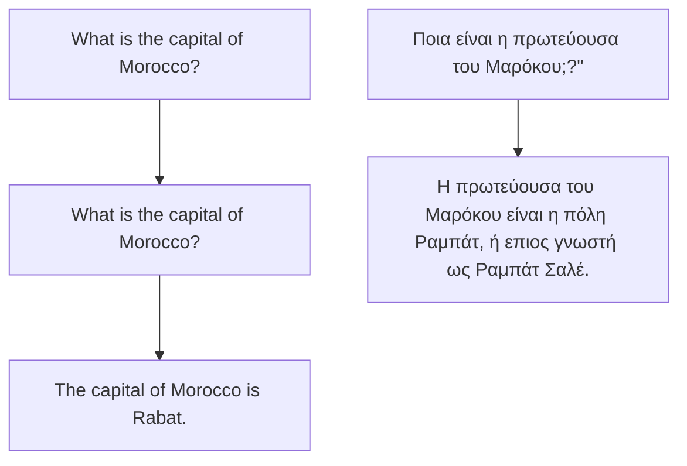

# Do All Languages Cost the Same?

# Tokenization in the Era of Commercial Language Models

Orevaoghene Ahia♢ Sachin Kumar♠ Hila Gonen♢ Jungo Kasai♢

David R. Mortensen♠ Noah A. Smith♢♡ Yulia Tsvetkov

Paul G. Allen School of Computer Science & Engineering, University of Washington

♠Language Technologies Institute, Carnegie Mellon University

Allen Institute for Artificial Intelligence

## Abstract

Language models have graduated from being research prototypes to commercialized products offered as web APIs, and recent works have highlighted the multilingual capabilities of these products. The API vendors charge their users based on usage, more specifically on the number of “tokens” processed or generated by the underlying language models. What constitutes a token, however, is training data and model dependent with a large variance in the number of tokens required to convey the same information in different languages. In this work, we analyze the effect of this nonuniformity on the fairness of an API’s pricing policy across languages. We conduct a system atic analysis of the cost and utility of OpenAI’s language model API on multilingual benchmarks in 22 typologically diverse languages. We show evidence that speakers of a large number of the supported languages are overcharged while obtaining poorer results. These speakers tend to also come from regions where the APIs are less affordable to begin with. Through these analyses, we aim to increase transparency around language model APIs’ pricing policies and encourage the vendors to make them more equitable.

## 1 Introduction

Language models (LMs) have come to be known as general-purpose solutions capable of performing many tasks by following natural language instructions (Brown et al., 2020; Ouyang et al., 2022; Chung et al., 2022), and generalizing to new tasks at test time using a handful of demonstrations (Brown et al., 2020; Su et al., 2023). Motivated by their potential for commercial use, many industrial research institutions have moved away from openly releasing them (Abdalla et al., 2023). Instead, a new business model of LM as a Service (Sun et al., 2022) has emerged where LMs can be accessed for inference using (paid) web APIs. The majority of these models (Ouyang et al., 2022) offer multilingual capabilities, and the API providers charge the users proportionally to the number of tokens processed or generated.

flowchart

Figure 1: We investigate the effects of subword tokenization in LLMs across languages with different writing systems. Our findings highlight disparities in the utility of LLMs, as well as socio-economic disparities and increased costs in using commercial APIs for speakers of underrepresented languages.

In this work, we examine the fairness of this pricing model for different languages, based on how a “token” is defined in practice. Most LMs rely on tokenizers that split text strings into chunks (subwords). Subword tokenizers (Mielke et al., 2021; Sennrich et al., 2016; Kudo, 2018; Song et al., 2020) are typically data-driven and learn to split text based on frequency patterns of characters or bytes in some corpus.

Prior work has argued that, in multilingual settings, subword tokenizers lead to disproportionate fragmentation rates for different languages and writing scripts (Zhang et al., 2022a; Rust et al., 2021; Muller et al., 2021). Many commercial language models are multilingual, and text from languages that suffer from excessive fragmentation will be represented using more tokens. This directly increases cost of API usage for certain language speakers, even if they convey the same information as others.

We highlight this unfairness through three stages of systematic analyses. First, we show evidence that tokenizers of popular LMs indeed overfragment texts in certain languages and scripts. We quantify the API cost disparity that this issue causes. We discover that this disparity is not caused just by data imbalance, but is rooted in inherent properties of the languages or the ways they are represented in Unicode. Second, we show that languages that have longer token lengths as a result of greater fragmentation derive less model utility with in-context learning (Brown et al., 2020).

Finally, we find that languages that cost more and perform worse are often associated with populations of speakers for whom the APIs are less affordable on average, exacerbating the economic divide in the accessibility of NLP technology.

Through these analyses, we argue that commercial LM API vendors should revisit their processing and pricing strategies to be more equitable. In addition, we encourage the NLP community to pay better attention to tokenizers, an often neglected part of the LLM pipeline.

## 2 Do All Languages Cost the Same?

## 2.1 Background

Language Model APIs Autoregressive language models are trained to predict the next “token” given a previous context. Following the success of such models, many commercial LM web APIs have emerged and allow users to interface with the models using natural language instructions to perform various tasks with little to no exposure to the underlying workings of the models. The API providers often support dozens of languages and ber of input and generated tokens.3

What constitutes a “token,” however, is not a universally accepted definition but a design choice that the model developers make. The total token count is also not immediately obvious to users except through a tokenizer interface4 separate from the chat interface.

Tokenization in LMs Tokenization— segmenting text into atomic units—is an active research area. Proposed approaches range from defining tokens as whitespace-delimited words (for languages that use whitespace) which makes the vocabulary extremely large, to defining tokens as characters or even bytes, which makes the tokenized sequences extremely long in terms of number of tokens; see Mielke et al. (2021) for a detailed survey. A commonly-used solution now is to tokenize text into subword chunks (Sennrich et al., 2016; Kudo, 2018; Song et al., 2021). With Sennrich et al. (2016), one starts with a base vocabulary of only characters and adds new vocabulary items by recursively merging existing ones based on their frequency statistics in a training corpus. Other approaches judge subword candidates to be included into the vocabulary using a language model (Kudo, 2018; Song et al., 2021). For multilingual models containing data in a variety of scripts, even the base vocabulary of only characters (based on Unicode symbols) can be very large with over 130K types. Radford et al. (2019) instead proposed using a byte-level base vocabulary with only 256 tokens. Termed byte-level byte pair encoding (BBPE), this approach has become the de facto standard used in most modern language modeling efforts (Brown et al., 2020; Muennighoff et al., 2022; Scao et al., 2022; Black et al., 2022; Rae et al., 2022; Zhang et al., 2022b; Dey et al., 2023; Nagoudi et al., 2022; Zhang et al., 2022b).

In this work, we investigate the impact this tokenization strategy has on LM API cost disparity as well as downstream task performance (i.e., utility) across different languages.

## 2.2 Investigating the Impact of Byte-level Subword Segmentation

There are hundreds of distinct writing systems in the world. BBPE, by design, makes vocabulary construction script-agnostic, even allowing (in principle) new scripts to be supported later on without modifying the vocabulary. However, not only are different scripts encoded differently, their distribution in the training corpora varies widely. To investigate the effects of this variation, we propose the following research questions as the main focus of this work.

RQ1 (number of tokens): do all languages convey the same information with the same number of tokens? We analyze the fragmentation of sequences in different languages with different tokenizers. We find that among the supported languages in popular LLMs, there is a large variance in the average number of tokens required to convey the same information with some languages requiring 5 times as many tokens than others. Previous work has shown that tokenization in multilingual models is usually biased towards high-resourced languages in the pretraining data (Ács, 2019; Rust et al., 2021); we observe that this is not always the case, but it could also be dependent on linguistic features or properties of language scripts.

RQ2 (cost): do non-uniform tokenization rates lead to LM API cost disparity for speakers of different languages? LM APIs like ChatGPT are available worldwide and have been widely claimed to have multilingual capabilities (Kasai et al., 2023; Lai et al., 2023).5 We show that disparate fragmentation rates in different languages can lead to significantly high usage costs for less represented languages and argue for a more equitable API pricing system.

RQ3 (model utility): do non-uniform tokenization rates affect the models’ utility? LMs have exhibited in-context learning capabilities, performing new tasks with a few demonstrations as input (without parameter finetuning). This is a highly desirable property in any LM API as it avoids computational, annotation (and thus financial) costs. We show that the high fragmentation rate of a language can negatively affect the in-context learning performance in that language, resulting in reduced model utility.

RQ4 (socio-economic aspects): what are the socio-economic implications of the API’s crosslingual cost and performance disparity? Our analysis shows evidence that not only are LMs more expensive for certain languages, they are also less effective for them. To highlight the implications of these findings, we correlate those measurements with the socio-economic indicators of language speakers as a proxy for affordability of the APIs. This analysis indicates that users who likely cannot afford high API costs are charged morefor poorer service, hindering uniform accessibility of this technology.

## 3 Experimental Setup

## 3.1 Models

Throughout this work, we focus on two language models: ChatGPT (Ouyang et al., 2022; Brown et al., 2020) (gpt-3.5-turbo) and BLOOMZ (Muennighoff et al., 2022). Both of these models are trained and advertised as general-purpose models capable of following instructions and performing a wide range of tasks (Bang et al., 2023; Qin et al., 2023; Zhu et al., 2023b; Ahuja et al., 2023; Huang et al., 2023; Zhu et al., 2023a).

ChatGPT (Ouyang et al., 2022) is a closed model only accessible through an API (with a premium tier) provided by OpenAI. Studies report that it supports as many as 90 languages (Ahuja et al., 2023). ChatGPT can handle a maximum sequence length of 4096 tokens (including both the prompt and generated tokens).

BLOOMZ (Muennighoff et al., 2022) is an opensource multilingual model trained on 46 natural languages and 13 programming languages. The bestperforming version of this model has 175B parameters and is not feasible to be loaded on our academic servers; hence we rely on a free API of BLOOMZ hosted by Huggingface.6 Although BLOOMZ was trained with ALiBi positional embeddings (Press et al., 2022) which allows the model to extrapolate to any length sequences during inference, the Huggingface API has a context limit of 1000 tokens.

## 3.2 Tasks and Datasets

To answer RQ1—whether the same information is conveyed with similar numbers of tokens in different languages—we use a subset of FLORES-200 (Goyal et al., 2022), a multilingual parallel cor-7 pus containing examples in over 200 languages. We tokenize each sentence in the FLORES-200 subset with ChatGPT’s tokenizer8 and compute the average number of tokens per sentence for each language. Using parallel data controls for the same information across languages. We consider that language A is more efficiently tokenized than language B if it uses fewer tokens per sentence on average. While previous studies have computed fragmentation rates with fertility (Ács, 2019), we instead define it as the average number of tokens in a sequence for two reasons. First, our goal is to compare LLM API costs across languages that charge users based on the number of tokens. To control for content, we use a parallel corpus for this analysis. Second, many languages we analyze are understudied and do not have word tokenizers available which are required to compute fertility.

For RQ2 and RQ3, to clearly highlight the cost and utility disparities, we evaluate the models on NLP tasks that involve long-form texts either at input or output. We evaluate the models on diverse, challenging natural language generation and classification tasks on the following benchmarks:

Classification We evaluate on (1) XNLI (Conneau et al., 2018): a cross-lingual inference benchmark comprising of 11 typologically diverse languages. It involves two sub-tasks, passage selection and minimum answer span (Gold-P). We focus on the latter task in our experiments. (2) XFACT (Gupta and Srikumar, 2021): a multilingual fact verification dataset of naturally existing real-world claims covering 25 languages.

Span Prediction We use XQUAD (Artetxe et al., 2019): a crosslingual question-answering dataset where each example consists of a paragraph, a question, and the answer as a span in the paragraph.

Generation We evaluate on (1) Cross Sum (Hasan et al., 2021a): a cross-lingual abstractive summarization dataset comprising 1.7 million article-summary samples in 1500+ language pairs, and, (2) XLSUM (Hasan et al., 2021b): a summarization dataset covering 44 typologically diverse languages. The dataset comprises news articles and summaries in the same language as the article.

## 3.3 Prompting Formulation

We evaluate both models in a k-shot in-context learning setup where we also provide task instructions. We experiment with $0 \leq k \leq X$ , where X is the maximum number of in-context examples that can be provided. Note that X is not a fixed value, but is determined by the language model API’s limit on the number of input tokens and the fragmentation rate of the language.

For all tasks, we provide the instructions in English following Ahuja et al. (2023), who show that on several multilingual benchmarks, English instructions outperform the in-language prompts (see

bar

| Language Script | Average number of tokens |
| --- | --- |
| Latin | 122 |
| Japanese | 1 |
| Hangul | 1 |
| Cyrillic | 12 |
| Arabic | 21 |
| Thai | 1 |
| Hebrew | 2 |
| Devanagari | 8 |
| Greek | 1 |
| Bengali | 3 |
| Tamil | 1 |
| Telugu | 1 |
| Georgian | 1 |
| Tibetan | 2 |

Figure 2: Average number of tokens by script after tokenizing the Flores dataset. The fragmentation rate is lower for Latin script languages and higher for other scripts. Number of languages per language group is indicated at the top of each bar.

Table 2 in the Appendix for the prompting format for all tasks). For each task, we randomly sample at most 500 test examples for evaluation.

## 4 Results and Analysis

## 4.1 RQ1 (number of tokens): do all languages convey the same information with the same number of tokens?

In Figure 2 we show that Latin-script languages are represented with substantially fewer tokens compared to languages in other scripts. While Cyrillic and Japanese script languages come close to the Latin script, languages that have their own script, e.g. Telugu and Georgian, require up to 5× more tokens to convey the same information. We hypothesize that this disparity is due to training data imbalance since ChatGPT’s tokenizer was primarily trained with Latin-script languages, mainly English. The training details of ChatGPT are not available. However, we make a reasonable assumption that its training dataset has a similar proportion of languages as the publicly available large corpus CC100 (Wenzek et al., 2020). If we sort languages shown in Figure 2 based on their data size in CC100 (see Figure 14 in the Appendix), lowresourced languages of Latin script appear to be less fragmented compared to other mid-resourced languages of non-Latin scripts. In Figure 15 in the Appendix, we present a similar analysis for BLOOMZ’s tokenizer. We sort the languages based on their size in the pretraining data (ROOTS corpus; Laurençon et al., 2023). We observe that languages with fewer resources generally have a higher average token length. Arabic is an outlier here as it appears to be have more tokens than some other mid-resourced languages.

What influences the non-uniformity of a tokenizer across languages? From our analysis above, we identify two influential factors: (1) the proportion of the language in the pretraining data, and (2) inherent properties of the language and its writing script. While we see some correlation between pretraining data size and fragmentation rate in BLOOMZ, with ChatGPT it is quite different as higher-resourced non-Latin script languages still get excessively tokenized.

To disentangle the effects of factors (1) and (2) we train BBPE tokenizers on a variety of languages with diverse scripts with vocabulary sizes ranging from 5,000 to 50,000, while controlling for content and data size. Specifically, we train the tokenizers on parallel corpora and include one language per script. We then use these tokenizers to tokenize the text they were trained on, and compute the average number of tokens per sentence.

line

| Vocab size | Myanmar | Khmer | Tibetan | Hangul | Latin | Cyrillic | Japanese | Arabic |
| --- | --- | --- | --- | --- | --- | --- | --- | --- |
| 200 | 400 | 330 | 365 | 150 | 125 | 255 | 160 | 190 |
| 500 | 215 | 215 | 180 | 140 | 125 | 170 | 120 | 120 |
| 1000 | 165 | 165 | 165 | 110 | 110 | 135 | 110 | 95 |
| 5000 | 130 | 130 | 125 | 75 | 75 | 75 | 65 | 60 |
| 10000 | 125 | 125 | 120 | 60 | 60 | 65 | 55 | 50 |
| 25000 | 120 | 120 | 115 | 45 | 45 | 45 | 45 | 40 |
| 50000 | 115 | 115 | 115 | 35 | 35 | 35 | 35 | 30 |

Figure 3: BBPE tokenizer trained on parallel text from different language scripts with varying vocabulary sizes We display a larger version with 21 more scripts in Figure 18 in the Appendix.

As shown in Figure 3 , even when controlling for the content, there is still a disparity in the tokeniza tion rate at different vocabulary sizes. In particular, most scripts are very sensitive to smaller vocabu lary sizes compared to Latin and Hangul scripts. We could not achieve uniform fragmentation rate across all language scripts even with large vocabulary sizes. We, therefore, conclude that uniformity of BBPE tokenizers across languages is not just determined by the proportion of text from language in the pretraining data but also by language/script properties.

## 4.2 RQ2 (cost): how do non-uniform tokenization rates affect LM API costs for different languages?

LM APIs charge users a fixed amount for a given number of input and generated tokens. Since the same information is expressed using different num ber of tokens in different languages, we aim to investigate the disparity in what users pay to use the API for different languages. From the results of our analysis in §4.1, we compute the estimated cost of API use per language as a function of the average sequence length derived in Figure 2. We report this on a subset of languages in Figure 16 in the Appendix and present a granular analysis of languages that share family and script in Figure 4.

Languages that are more heavily segmented have predictably higher costs of usage. Overall, we see that the API costs are biased towards (i.e., cheaper for) Indo-European and Latin script lan guages and against many non-Latin script languages. In most mid-resourced Indic languages with non-Latin scripts, we see close to a 5× in crease in cost compared to English.

bar

| Language Family and Script | Cost relative to English |
| --- | --- |
| (IE, Latin) | ~2.0 |
| (ST, Latin) | ~2.2 |
| (AA, Latin) | ~2.4 |
| (AC, Latin) | ~2.5 |
| (AA, Arabic) | ~3.0 |
| (IE, Cyrillic) | ~3.1 |
| (AA, Hebrew) | ~3.7 |
| (IE, Arabic) | ~4.0 |
| (IE, Devanagari) | ~4.8 |
| (IE, Greek) | ~5.1 |
| (IE, Hebrew) | ~5.5 |
| (IE, Bengali) | ~6.0 |
| (ST, Bengali) | ~6.6 |
| (DR, Tamil) | ~7.7 |
| (DR, Telugu) | ~8.3 |
| (KA, Georgian) | ~9.8 |
| (ST, Tibetan) | ~12.0 |

Figure 4: Estimated cost per language family/script, rel ative to English. The language families are abbreviated as follows: IE: Indo-European, ST: Sino-Tibetan, AC: Atlantic-Congo, AA: Afro-Asiatic, DR: Dravidian, KA: Kartvelian.

Next, we report the costs of running experiments relative to English. We report costs based on our zero-shot experiments across all tasks listed in §3.2. This is due to excessive tokenization in some languages for which we can only do zero-shot evaluations. For XLSUM, we show in Figure 5 that we spend up to 4× more for both prompting and generation in Telugu and Amharic. We observe similar findings in XFACT and CROSSUM, as displayed in Figure 11 in the Appendix.

While the majority of the commercial LMs are perhaps being optimized to perform well in many languages, we show that there is less focus on the individual experiences of speakers of languages other than English. While a language model like ChatGPT might perform tasks in Telugu, for example, a user in Andhra Pradesh might have to pay 5× more than an English user in the US would pay for an equivalent use of the model.

bar

| Language | Experiment Cost relative to English |
| --- | --- |
| en | ~1.0 |
| fr | ~1.1 |
| pt | ~1.4 |
| sw | ~1.6 |
| es | ~2.0 |
| vi | ~2.2 |
| ar | ~2.5 |
| ko | ~2.7 |
| ru | ~2.7 |
| ja | ~2.8 |
| hi | ~3.1 |
| th | ~3.8 |
| te | ~4.4 |
| am | ~4.6 |

Figure 5: Average cost of prompt + generated tokens for XLSUM evaluations relative to English.

## 4.3 RQ3 – Model utility: do non-uniform tokenization rates affect the models’ utility?

line

| In-context examples | Arabic (%) | Japanese (%) | French (%) | Korean (%) | Telugu (%) | Swahili (%) | Spanish (%) | Russian (%) | English (%) | Amharic (%) | Vietnamese (%) | Thai (%) | Hindi (%) | Portuguese (%) |
| --- | --- | --- | --- | --- | --- | --- | --- | --- | --- | --- | --- | --- | --- | --- |
| 0 | ~35 | ~35 | ~35 | ~35 | ~75 | ~35 | ~35 | ~12 | ~12 | ~40 | ~35 | ~35 | ~12 | 0 |
| 1 | ~68 | ~8 | ~18 | ~18 | ~90 | ~18 | ~18 | ~35 | ~35 | 100 | ~30 | ~55 | ~35 | 0 |
| 2 | 100 | ~28 | 0 | ~55 | 100 | ~8 | ~65 | 100 | 100 | 100 | 100 | 100 | 100 | ~3 |
| 3 | 100 | 80 | 0 | 100 | 100 | ~64 | 100 | 100 | 100 | 100 | 100 | 100 | 100 | ~12 |
| 5 | 100 | 100 | 100 | 100 | 100 | 100 | 100 | 100 | 100 | 100 | 100 | 100 | 100 | 100 |
| 8 | 100 | 100 | 100 | 100 | 100 | 100 | 100 | 100 | 100 | 100 | 100 | 100 | 100 | 100 |
| 10 | 100 | 100 | 100 | 100 | 100 | 100 | 100 | 100 | 100 | 100 | 100 | 100 | 100 | 100 |

Figure 6: Percentage of test examples per language in XLSUM that do not successfully fit into the context length of ChatGPT. We can fit more few-shot examples in Latin script languages than in other languages.

LM APIs typically have an upper bound of the number of tokens they can handle, e.g., ChatGPT can process a maximum of 4,096 tokens. Hence, due to non-uniform fragmentation rates across languages, there is a disparity in the amount of information the models can process in different languages. As an illustration, in Figure 6 we plot the percentage of XLSUM test examples against the minimum number of in-context examples those test examples can be accompanied with.

For example, we find that Telugu and Amharic struggle to fit even one in-context example for the majority of their test set. As a result, the model is only capable of zero-shot prompting for these two

languages.

To measure the impact of this issue on task performance, we evaluate ChatGPT and BLOOMZ with a k-shot learning setup on the 5 tasks on diverse languages as described in §3.2. Figure 7 shows ChatGPT’s performance according to standard automatic metrics of all tasks. Note that the focus of this experiment is to illustrate the impact of tokenization in in-context learning settings. Therefore, we are interested not in the absolute value of the metrics or comparisons among languages but the relative improvement within the test sets of the same language as we increase the number of incontext examples. For all tasks and most languages, we see consistent performance improvements as we increase the number of in-context examples, from zero-shot to k (even for k = 1). For many languages such as Telugu and Thai , due to their high fragmentation rates, we were unable to fit even one complete demonstration and hence, only report zero-shot results. Based on trends from other languages, we suspect that these languages could also have benefitted from more demonstrations. Hence, as a result of unfair tokenization, ChatGPT’s utility is much lower for speakers of those languages compared to better represented languages like English.

Figure 9 reports the results of the same experiment for BLOOMZ. Here, across all tasks we find that adding in-context examples does not help at all. In fact, in some cases, there is a drastic drop in performance even with one in-context example. Upon manual inspection of the model generated outputs from the one-shot experiments, the model has a tendency to copy spans from the in-context example, presenting that as output and thus not successfully utilize demonstrations. Our hypothesis here is that BLOOMZ is better optimized for zeroshot prompting and is not suitable for in-context learning.

Due to the limited number of tokens that the BLOOMZ’s inference API accepts, some examples in some languages cannot fit the 1000 token context length when doing zero-shot prompting. We experienced this with the XLSUM dataset as we couldn’t fully fit news articles for some languages. Understandably, some of these languages are not even present in its pretraining data, and hence we do not expect them to be tokenized efficiently. For these examples that do not fit the context length, we feed in truncated news articles into the model. We therefore evaluate the generations for the fraction of examples that fit context and ones that do not fit the context separately. Figure 8 shows the performance comparison when we use truncated summaries in the prompt and when we use the full articles. While the performance drop is expected, our focus here is to highlight a consequence of differentiated tokenization in language models.

line

| Number of in-context examples | ar | ja | fr | ko | te | sw | es | ru | en | vi | th | hi | pt | am |
| --- | --- | --- | --- | --- | --- | --- | --- | --- | --- | --- | --- | --- | --- | --- |
| 0 | ~17.5 | ~6.5 | ~19.5 | ~12.5 | ~19.5 | ~18.5 | ~10.0 | ~17.5 | ~10.0 | ~16.5 | ~14.0 | ~16.5 | ~16.5 | ~37.0 |
| 1 | 30.0 | 27.0 | 23.0 | 22.0 | 23.0 | 23.0 | 13.0 | 21.0 | 18.5 | 22.0 | 19.0 | 19.0 | 19.0 | — |
| 2 | — | 30.0 | — | — | — | 24.0 | — | — | — | 23.0 | — | 20.0 | — | — |
| 3 | — | 30.0 | — | — | — | 24.0 | — | — | — | 23.0 | — | 20.0 | — | — |
| 5 | — | — | — | — | — | — | — | — | — | — | — | — | — | — |

(a) XLSUM

line

| Number of in-context examples | pt | it | hi | pl | ar | de | ka | id | ro | tr | es |
| --- | --- | --- | --- | --- | --- | --- | --- | --- | --- | --- | --- |
| 0 | ~15.5 | ~18.2 | ~7.2 | ~10.2 | ~12.0 | ~15.5 | ~15.5 | ~8.5 | ~15.5 | ~15.5 | ~22.5 |
| 1 | ~14.8 | ~20.2 | ~10.8 | ~16.2 | ~16.5 | ~23.0 | ~12.8 | ~7.8 | ~18.8 | ~16.5 | ~29.2 |
| 2 | ~16.8 | ~20.2 | ~13.2 | ~13.2 | ~16.5 | ~21.5 | ~10.0 | ~7.8 | ~15.0 | ~17.2 | ~27.0 |
| 3 | ~16.5 | ~21.2 | ~15.2 | ~15.2 | ~16.8 | ~23.2 | — | — | ~19.8 | ~18.8 | ~28.2 |
| 5 | ~18.2 | ~18.5 | ~15.0 | — | — | ~22.5 | — | — | ~21.5 | ~17.2 | ~29.8 |
| 8 | ~17.0 | — | — | — | — | ~21.2 | — | — | — | — | ~31.5 |
| 10 | — | — | — | — | — | ~23.5 | — | — | — | — | ~32.5 |

(b) XFACT

line

| Number of in-context examples | ta | am | hi | ar | pt | ja | fr | ko | te | id | sw | es | ru | en |
| --- | --- | --- | --- | --- | --- | --- | --- | --- | --- | --- | --- | --- | --- | --- |
| 0 | ~21.5 | ~12.5 | ~23.0 | ~21.0 | ~19.5 | ~21.0 | ~20.5 | ~18.5 | ~20.5 | ~21.5 | ~21.0 | ~18.5 | ~21.5 | ~19.5 |
| 1 | ~26.0 | ~21.5 | ~24.0 | ~23.0 | ~21.5 | ~23.0 | ~23.0 | ~21.5 | ~23.0 | ~24.0 | ~24.0 | ~21.5 | ~24.0 | ~21.5 |
| 2 | ~29.0 | — | — | — | — | — | — | — | — | — | — | ~24.0 | ~25.5 | ~22.5 |
| 3 | — | — | — | — | — | — | — | — | — | — | — | ~27.0 | ~28.0 | ~22.0 |
| 5 | — | — | — | — | — | — | — | — | — | — | — | ~30.0 | ~30.0 | ~28.0 |

(c) CROSS-SUM

Figure 7: Results from ChatGPT few-shot evaluations. In most tasks, we see a significant increase in performance as we increase the number of in-context examples.  

bar

| Languages | truncated article | full article |
| :--- | :--- | :--- |
| ta | ~22 | ~25 |
| id | ~19 | ~33 |
| hi | ~29 | ~39 |
| ar | ~21 | ~28 |
| pt | ~20 | ~29 |
| ja | ~19 | ~22 |
| fr | ~19 | ~29 |
| ko | ~17 | ~20 |
| te | ~21 | ~20 |
| sw | ~22 | ~26 |
| es | ~20 | ~27 |
| ru | ~12 | ~16 |
| en | ~29 | ~31 |
| am | ~17 | ~15 |
| vi | ~22 | ~29 |
| th | ~12 | ~16 |
| ne | ~26 | ~35 |
| mr | ~22 | ~18 |
| ky | ~13 | ~16 |
| uk | ~15 | ~16 |
| ur | ~19 | ~33 |

Figure 8: Zero-shot evaluation of BLOOMz on XL-SUM. Since, we cannot fit the full article in the context length for some languages, we compare results on evaluating full articles vs. truncated articles.

## 4.4 RQ4 – Socio-economic aspects: what are the socio-economic implications of the API’s cross-lingual cost and performance disparity?

In Figure 10, we plot the fragmentation rate per language against the Human Development Index in the top country where the language is spoken.9 We find a strong negative correlation, showing that in most cases, the lower the HDI index, the higher the fragmentation rate and vice versa. Evidently, the model’s vocabulary is biased towards users of more developed countries.

This bias is further validated by results shown in Table 1 where we mostly find negative correlations between pairs of each of the following variables: average financial cost of experiments, model utility (performance), and human development index of the country in which each language is spoken. We term this doubled unfairness as people from less economically developed countries are overcharged at a fixed rate per-token due to excessive tokenization, but often derive lesser utility from the model.

<table><tr><td rowspan="2">Task</td><td colspan="2">Cost-HDI</td><td colspan="2">HDI-Utility</td><td colspan="2">Cost-Utility</td></tr><tr><td>Spearman</td><td>Pearson</td><td>Spearman</td><td>Pearson</td><td>Spearman</td><td>Pearson</td></tr><tr><td>XFACT</td><td>**–0.41</td><td>**–0.60</td><td>*0.34</td><td>**0.38</td><td>**–0.61</td><td>**–0.55</td></tr><tr><td>XLSUM</td><td>**–0.42</td><td>**–0.43</td><td>**–0.44</td><td>**–0.57</td><td>*–0.23</td><td>*0.21</td></tr><tr><td>CROSS SUM</td><td>**–0.41</td><td>**–0.45</td><td>*–0.18</td><td>*0.24</td><td>*0.27</td><td>*–0.17</td></tr></table>

Table 1: Correlation between model utility, cost of API access and Human Development Index for each task. We mark correlations with $p < 0 . 0 5$ with \* and also mark correlations with $p < 0 . 0 0 5 6$ (according to Bonferroni correction for multiple hypotheses) with \*\*.

## 5 What is the Way Forward?

Transparency in API limitations While the NLP community is aware of many of the issues we point out in this work, LM APIs are advertised to a general audience. Much like the policy of adding limitations to research papers, LM API providers ought to be more transparent about the flaws and biases in their models, especially when describing their multilingual capabilities. Many users are not privy to the inner workings of these models and can thereby be unfairly charged higher prices if they use the model in their native languages.

Rethinking the API pricing models Higher API costs for certain languages in underprivileged communities risks excluding many populations from using language technologies. A potential solution is to develop pricing policies based on languages/regions while also accounting for model performance on language-specific benchmarks. An alternative is to not charge by tokens at all. A recently released beta of PaLM 2 API, for example, further analysis is needed to assess the fairness of character-based pricing. Huggingface also offers 1 an inference service for their enterprise customers relying on AWS instances and charging them at an hourly rate. Future work may compare this with a per-token rate we study in this work.

line

| Number of in-context examples | ar | es | th | bg | fr | tr | de | hi | ur | el | ru | vi | en | zh |
| --- | --- | --- | --- | --- | --- | --- | --- | --- | --- | --- | --- | --- | --- | --- |
| 0 | ~41 | ~48 | ~30 | ~34 | ~46 | ~37 | ~29 | ~30 | ~31 | ~29 | ~30 | ~31 | ~29 | ~31 |
| 1 | ~23 | ~25 | ~20 | ~25 | ~24 | ~25 | ~24 | ~23 | ~25 | ~24 | ~23 | ~24 | ~24 | ~23 |
| 2 | ~20 | ~26 | ~19 | ~31 | ~33 | ~26 | ~26 | ~23 | ~26 | ~25 | ~25 | ~26 | ~25 | ~25 |
| 3 | ~27 | ~38 | ~18 | ~30 | ~36 | ~30 | ~30 | ~36 | ~27 | ~27 | ~30 | ~30 | ~30 | ~30 |
| 5 | ~27 | ~38 | ~18 | ~31 | ~36 | ~34 | ~31 | ~36 | ~27 | ~22 | ~34 | ~34 | ~34 | ~34 |
| 8 | ~25 | ~36 | — | ~21 | ~33 | ~31 | — | — | ~20 | — | — | — | — | — |
| 10 | ~29 | ~37 | — | — | ~18 | ~32 | — | — | — | — | — | — | — | — |
| 15 | — | — | — | — | — | — | — | — | — | — | — | — | — | — |

(a) XNLI

line

| Language | 0 | 1 |
| --- | --- | --- |
| ta | ~32 | ~16 |
| id | ~32 | ~15 |
| hi | ~32 | ~14 |
| ar | ~27 | ~14 |
| pt | ~24 | ~14 |
| ja | ~24 | ~14 |
| fr | ~24 | ~9 |
| ko | ~24 | ~9 |
| te | ~24 | ~14 |
| sw | ~24 | ~14 |
| es | ~24 | ~14 |
| ru | ~24 | ~14 |
| en | ~24 | ~14 |
| am | ~13 | ~14 |
| vi | ~15 | ~14 |
| th | ~15 | ~14 |
| ne | ~15 | ~14 |
| mr | ~15 | ~14 |
| ky | ~15 | ~8 |
| uk | ~15 | ~8 |
| ur | ~15 | ~8 |

(b) XLSUM

line

| Number of in-context examples | ar | en | th | de | es | tr | zh | hi | ru | vi | el | ro |
| --- | --- | --- | --- | --- | --- | --- | --- | --- | --- | --- | --- | --- |
| 0 | ~69 | ~78 | ~24 | ~69 | ~73 | ~47 | ~64 | ~42 | ~62 | ~77 | ~75 | ~62 |
| 1 | ~64 | ~77 | — | ~65 | ~69 | ~39 | ~58 | — | ~51 | ~73 | ~66 | — |
| 2 | ~64 | ~76 | — | ~64 | ~66 | — | ~57 | — | — | ~74 | ~64 | — |
| 3 | — | ~76 | — | — | — | — | — | — | — | ~75 | — | — |

(c) XQUAD

Figure 9: Results from BLOOMz few-shot evaluations. The BLOOMz model is clearly better at zero-shot prompting than few-shot.  

scatter

| Language | Human Development Index | Average number of tokens |
| --- | --- | --- |
| Somali | ~0.38 | ~65 |
| Urdu | ~0.57 | ~120 |
| Burmese | ~0.61 | ~305 |
| Khmer | ~0.62 | ~235 |
| Kannada | ~0.63 | ~230 |
| Telugu | ~0.64 | ~210 |
| Tamil | ~0.65 | ~205 |
| Panjabi | ~0.66 | ~205 |
| Assamese | ~0.67 | ~165 |
| Bengali | ~0.68 | ~160 |
| Marathi | ~0.69 | ~140 |
| Hindi | ~0.69 | ~135 |
| Kyrgyz | ~0.71 | ~105 |
| Vietnamese | ~0.72 | ~75 |
| Lagoa | ~0.73 | ~65 |
| Sankano | ~0.74 | ~60 |
| Spanish | ~0.75 | ~55 |
| Armenian | ~0.78 | ~265 |
| Georgian | ~0.79 | ~260 |
| Sin Mali | ~0.80 | ~235 |
| Malayalam | ~0.81 | ~235 |
| Uyghur | ~0.81 | ~140 |
| Thai | ~0.82 | ~125 |
| Kazakh | ~0.83 | ~115 |
| Belarosljan | ~0.84 | ~110 |
| Ukrainian | ~0.84 | ~95 |
| Russian | ~0.85 | ~95 |
| Hungarian | ~0.86 | ~85 |
| Portuguese | ~0.87 | ~75 |
| Korean | ~0.88 | ~75 |
| Estonian | ~0.89 | ~75 |
| English | ~0.91 | ~75 |
| Greek | ~0.92 | ~140 |
| Hebrew | ~0.93 | ~105 |
| Japanese | ~0.94 | ~75 |
| Finnish | ~0.95 | ~75 |
| German | ~0.96 | ~75 |
| Italian | ~0.97 | ~75 |
| Portuguese (lower) | ~0.98 | ~65 |
| English (lower) | ~0.99 | ~65 |

Figure 10: Fragmentation rate per language against the Human Development Index in the top country where the language is spoken.

Open-source models vs. paid APIs Given issues with paid APIs, the natural next question might be: should the API users move to open-source models or train their own? In fact, in our experiments, we find BLOOMZ, an open-source model, to perform better in the zero-shot setting than ChatGPT performs in the few-shot setting, in most cases. However, first, most open-source models are distributed under an academic license whereas most developers are interested in integrating these technologies into their products for commercial use, which may incur licensing costs. Second, barring licensing issues, language models tend to be large and resource-intensive to train and deploy and require dedicated expensive hardware to run at a commercial scale, which again might not be possible for most developers and users, even exceeding the cost of using the APIs. Research on reducing such hardware requirements (Dettmers et al., 2022; Park et al., 2023; Yao et al., 2022) could increase accessibility. Still, this would require a considerable level of technical expertise from developers and users which might be infeasible.

Technological improvements in language models Several solutions proposed in recent work to improve language modeling performance can help alleviate the cost and utility issues we highlight. Tokenization is an active area of research and various solutions based on data balancing (Johnson et al., 2017; Conneau and Lample, 2019), optimal transport (Xu et al., 2021), fuzzy subwords (Provilkov et al., 2020) , and many more (Chung et al., 2020; Tay et al., 2022) have been proposed. BLOOMZ, for instance, relies on data balancing to improve fragmentation rates across languages. Some work has also focused on increasing the context lengths of language models (Bulatov et al., 2023; Press et al., 2022; Ainslie et al., 2023) which can help alleviate issues with utility by allowing more incontext examples as input.

## 6 Related Work

Analyzing Tokenization methods The impact of tokenization on model performance has been widely studied (Ács, 2019; Rust et al., 2021; Zhang et al., 2022a; Klein and Tsarfaty, 2020; Bostrom and Durrett, 2020; Kamali et al., 2022). Prior works have also investigated the role of tokenization in inference speed and memory usage of LMs in practical settings (Sun et al., 2023; Hofmann et al., 2022). Ács (2019) analyzes mBERT’s to kenizer (Devlin et al., 2019) and discover that Indo-European languages largely dominate its vo cabulary. Rust et al. (2021) find that monolin gual models perform better than mBERT (Devlin et al., 2019) because some languages suffer from over-fragmentation. Zhang et al. (2022a) find that sentence-level MT models are not particularly sen sitive to language imbalance in their tokenizer train ing data. Sun et al. (2023) analyze multilingual tokenizer-free and subword-based models and find that subword-based models achieve better perfor mance while reducing inference latency and mem ory usage. In contrast to prior work, our focus is on the cost and performance analysis of multi lingual LM APIs across languages with regard to over-fragmentation and in-context learning.

Socio-Economic Impacts of Language Models Prior research has shown that unfairness in LMs can be a consequence of different stages in the model’s development pipeline (Cao and Daumé III, 2020; Talat et al., 2021). Many efforts have been di rected towards identifying social biases in language model generations (Wolfe and Caliskan, 2021; Dev et al., 2022; Sheng et al., 2021; Chen et al., 2021; Hutchinson et al., 2020). Other works have sur faced the cultural and language disparity beyond and within multilingual language models (Guru rangan et al., 2022; Kreutzer et al., 2022; Virtanen et al., 2019). Talat et al. (2022) discuss various challenges that impact bias evaluation in multilin gual settings. They also examine the power dynam ics and consequences of training language models emphasizing the importance for researchers to be mindful of the implications associated with the ad vancement of such technologies. In this work, we study the economic unfairness of LMs across dif ferent communities. The most closely related to our work is Kasai et al. (2023) which also report unfair API costs as a result of tokenization differ ences between English and Japanese. We extend this analysis to 21 more languages highlighting the pervasiveness of this issue.

## 7 Conclusion

By analyzing popular language model APIs on challenging multilingual benchmarks, we find that (a) API tokenizers disproportionately favor Latin scripted languages and over-fragment less repre sented languages and scripts, (b) the API pricing policy of charging based on the number of tokens is flawed and extremely unfair towards speakers of the over-fragmented languages, and (c) the API performs poorly on such languages compared to the less-fragmented counterparts. In the current NLP research landscape, where more and more in dustrial labs are building their own APIs, this is a concerning trend that may reduce the accessibility of these technologies to already marginalized com munities. Hence, we encourage the vendors to be more transparent about their models’ limitations and rethink their pricing policy.

## Ethics Statement

This work sheds light on the consequences of unfair tokenization to users of commercial LM APIs that speak languages with scripts less represented in the pretraining data. With the recent widespread use of commercial LMs, we believe that our work is crucial to ensuring that language technologies are accessible to diverse users irrespective of the languages they speak.

There are different factors that contribute to nonuniform tokenization across languages. Whilst our analysis touches on the size of pretraining data and language writing systems we suspect that there might be other factors not yet uncovered; we leave that for future work. The lack of access to Ope nAI’s training data prevents us from making solid claims about all the languages that ChatGPT is optimized for; however, their models have been advertised and shown to work well in many lan guages. More work on large multilingual models should include the release of (details of) training data to further enable this kind of research.

## Limitations

Translationese We conduct the analysis to answer RQ1 using a parallel corpus, FLORES-200 (Team et al., 2022), in order to control for the same information. This corpus consists of many examples that have been professionally translated. Prior studies have shown that translated texts in any language (referred to as translationese) may differ from original written text in many ways (Laviosa, 2002). These may have caused the information conveyed in different languages to not be exactly the same. We do not have a way to measure these differences. However, we expect them not to be significantly large so as to meaningfully affect the trend of fragmentation rates.

Language statistics of ChatGPT training data ChatGPT is a closed model developed by OpenAI who have not released the training details of the model including any information of the languages it supports 12. Hence, we cannot ascertain the actual statistics of all the languages in their training data. We use CC100 (Wenzek et al., 2020), a large multilingual corpus, to estimate these statistics.

## Acknowledgements

We thank the members of the Tsvetshop Lab and Noah’s Ark Lab at the University of Washington for the valuable discussions and useful feedback. We thank Lucille Njoo for help with our illustrations.

We gratefully acknowledge support from NSF CAREER Grant No. IIS2142739, the Alfred P. Sloan Foundation Fellowship, and NSF grants No. IIS2125201, IIS2203097, and IIS2040926. Any opinions, findings and conclusions or recommendations expressed in this material are those of the authors and do not necessarily state or reflect those of the United States Government or any agency thereof.

## References

Mohamed Abdalla, Jan Philip Wahle, Terry Ruas, Aurélie Névéol, Fanny Ducel, Saif M Mohammad, and Karën Fort. 2023. The elephant in the room: Analyzing the presence of big tech in natural language processing research. In Proceedings ofACL.  
Kabir Ahuja, Rishav Hada, Millicent Ochieng, Prachi Jain, Harshita Diddee, Samuel Maina, Tanuja Ganu, Sameer Segal, Maxamed Axmed, Kalika Bali, and Sunayana Sitaram. 2023. Mega: Multilingual evaluation of generative ai.  
Joshua Ainslie, Tao Lei, Michiel de Jong, Santiago Ontan’on, Siddhartha Brahma, Yury Zemlyanskiy, David C. Uthus, Mandy Guo, James Lee-Thorp, Yi Tay, Yun-Hsuan Sung, and Sumit K. Sanghai. 2023. Colt5: Faster long-range transformers with conditional computation. ArXiv, abs/2303.09752.  
Farhad Akhbardeh, Arkady Arkhangorodsky, Magdalena Biesialska, Ondˇrej Bojar, Rajen Chatterjee, Vishrav Chaudhary, Marta R. Costa-jussa, Cristina España-Bonet, Angela Fan, Christian Federmann, Markus Freitag, Yvette Graham, Roman Grundkiewicz, Barry Haddow, Leonie Harter, Kenneth Heafield, Christopher Homan, Matthias Huck, Kwabena Amponsah-Kaakyire, Jungo Kasai, Daniel Khashabi, Kevin Knight, Tom Kocmi, Philipp Koehn, Nicholas Lourie, Christof Monz, Makoto Morishita, Masaaki Nagata, Ajay Nagesh, Toshiaki Nakazawa, Matteo Negri, Santanu Pal, Allahsera Auguste Tapo, Marco Turchi, Valentin Vydrin, and Marcos Zampieri. 2021. Findings of the 2021 conference on machine translation (WMT21). In Proceedings of the Sixth Conference on Machine Translation, pages 1–88, Online. Association for Computational Linguistics.  
Mikel Artetxe, Sebastian Ruder, and Dani Yogatama. 2019. On the cross-lingual transferability of monolingual representations. In Annual Meeting of the Associationfor Computational Linguistics.  
Yejin Bang, Samuel Cahyawijaya, Nayeon Lee, Wenliang Dai, Dan Su, Bryan Wilie, Holy Lovenia, Ziwei Ji, Tiezheng Yu, Willy Chung, Quyet V. Do, Yan Xu, and Pascale Fung. 2023. A multitask, multilingual, multimodal evaluation of chatgpt on reasoning, hallucination, and interactivity.  
Sidney Black, Stella Biderman, Eric Hallahan, Quentin Anthony, Leo Gao, Laurence Golding, Horace He, Connor Leahy, Kyle McDonell, Jason Phang, Michael Pieler, Usvsn Sai Prashanth, Shivanshu Purohit, Laria Reynolds, Jonathan Tow, Ben Wang, and Samuel Weinbach. 2022. GPT-NeoX-20B: An opensource autoregressive language model. In Proceedings ofBigScience Episode #5 – Workshop on Challenges & Perspectives in Creating Large Language Models, pages 95–136, virtual+Dublin. Association for Computational Linguistics.  
Kaj Bostrom and Greg Durrett. 2020. Byte pair encoding is suboptimal for language model pretraining. In  
Findings of the Association for Computational Linguistics: EMNLP 2020, pages 4617–4624, Online. Association for Computational Linguistics.  
Tom Brown, Benjamin Mann, Nick Ryder, Melanie Subbiah, Jared D Kaplan, Prafulla Dhariwal, Arvind Neelakantan, Pranav Shyam, Girish Sastry, Amanda Askell, Sandhini Agarwal, Ariel Herbert-Voss, Gretchen Krueger, Tom Henighan, Rewon Child, Aditya Ramesh, Daniel Ziegler, Jeffrey Wu, Clemens Winter, Chris Hesse, Mark Chen, Eric Sigler, Mateusz Litwin, Scott Gray, Benjamin Chess, Jack Clark, Christopher Berner, Sam McCandlish, Alec Radford, Ilya Sutskever, and Dario Amodei. 2020. Language models are few-shot learners. In Advances in Neural Information Processing Systems, volume 33, pages 1877–1901. Curran Associates, Inc.  
Aydar Bulatov, Yuri Kuratov, and Mikhail S. Burtsev. 2023. Scaling transformer to 1m tokens and beyond with rmt.  
Yang Trista Cao and Hal Daumé III. 2020. Toward gender-inclusive coreference resolution. In Proceed ings ofthe 58th Annual Meeting ofthe Association for Computational Linguistics, pages 4568–4595, Online. Association for Computational Linguistics.  
Yan Chen, Christopher Mahoney, Isabella Grasso, Esma Wali, Abigail Matthews, Thomas Middleton, Mariama Njie, and Jeanna Matthews. 2021. Gender bias and under-representation in natural language processing across human languages. In Proceedings of the 2021 AAAI/ACM Conference on AI, Ethics, and Society, AIES ’21, page 24–34, New York, NY, USA. Association for Computing Machinery.  
Hyung Won Chung, Dan Garrette, Kiat Chuan Tan, and Jason Riesa. 2020. Improving multilingual models with language-clustered vocabularies. In Proceed ings ofthe 2020 Conference on Empirical Methods in Natural Language Processing (EMNLP), pages 4536–4546, Online. Association for Computational Linguistics.  
Hyung Won Chung, Le Hou, Shayne Longpre, Barret Zoph, Yi Tay, William Fedus, Yunxuan Li, Xuezhi Wang, Mostafa Dehghani, Siddhartha Brahma, Albert Webson, Shixiang Shane Gu, Zhuyun Dai, Mirac Suzgun, Xinyun Chen, Aakanksha Chowdhery, Alex Castro-Ros, Marie Pellat, Kevin Robinson, Dasha Valter, Sharan Narang, Gaurav Mishra, Adams Yu, Vincent Zhao, Yanping Huang, Andrew Dai, Hongkun Yu, Slav Petrov, Ed H. Chi, Jeff Dean, Jacob Devlin, Adam Roberts, Denny Zhou, Quoc V. Le, and Jason Wei. 2022. Scaling instruction-finetuned language models.  
Alexis Conneau and Guillaume Lample. 2019. Crosslingual language model pretraining. In Advances in Neural Information Processing Systems, volume 32. Curran Associates, Inc.  
Alexis Conneau, Ruty Rinott, Guillaume Lample, Ad ina Williams, Samuel R. Bowman, Holger Schwenk,  
and Veselin Stoyanov. 2018. Xnli: Evaluating crosslingual sentence representations. In Proceedings of the 2018 Conference on Empirical Methods in Natural Language Processing. Association for Computational Linguistics.  
Tim Dettmers, Mike Lewis, Younes Belkada, and Luke Zettlemoyer. 2022. GPT3.int8(): 8-bit matrix multiplication for transformers at scale. In Advances in Neural Information Processing Systems.  
Sunipa Dev, Emily Sheng, Jieyu Zhao, Aubrie Amstutz, Jiao Sun, Yu Hou, Mattie Sanseverino, Jiin Kim, Akihiro Nishi, Nanyun Peng, and Kai-Wei Chang. 2022. On measures of biases and harms in NLP. In Findings of the Association for Computational Linguistics: AACL-IJCNLP 2022, pages 246–267, Online only. Association for Computational Linguistics.  
Jacob Devlin, Ming-Wei Chang, Kenton Lee, and Kristina Toutanova. 2019. BERT: Pre-training of deep bidirectional transformers for language understanding. In Proceedings ofthe 2019 Conference of the North American Chapter ofthe Associationfor Computational Linguistics: Human Language Technologies, Volume 1 (Long and Short Papers), pages 4171–4186, Minneapolis, Minnesota. Association for Computational Linguistics.  
Nolan Dey, Gurpreet Gosal, Zhiming, Chen, Hemant Khachane, William Marshall, Ribhu Pathria, Marvin Tom, and Joel Hestness. 2023. Cerebras-gpt: Open compute-optimal language models trained on the cerebras wafer-scale cluster.  
Peter Farb. 1974. Word play : what happens when people talk.  
Naman Goyal, Cynthia Gao, Vishrav Chaudhary, Peng-Jen Chen, Guillaume Wenzek, Da Ju, Sanjana Krishnan, Marc’Aurelio Ranzato, Francisco Guzmán, and Angela Fan. 2022. The Flores-101 evaluation benchmark for low-resource and multilingual machine translation. Transactions ofthe Associationfor Computational Linguistics, 10:522–538.  
Ashim Gupta and Vivek Srikumar. 2021. X-fact: A new benchmark dataset for multilingual fact checking. In Annual Meeting ofthe Associationfor Computational Linguistics.  
Suchin Gururangan, Dallas Card, Sarah Dreier, Emily Gade, Leroy Wang, Zeyu Wang, Luke Zettlemoyer, and Noah A. Smith. 2022. Whose language counts as high quality? measuring language ideologies in text data selection. In Proceedings ofthe 2022 Conference on Empirical Methods in Natural Language Processing, pages 2562–2580, Abu Dhabi, United Arab Emirates. Association for Computational Linguistics.  
Tahmid Hasan, Abhik Bhattacharjee, Wasi Uddin Ahmad, Yuan-Fang Li, Yong-Bin Kang, and Rifat Shahriyar. 2021a. Crosssum: Beyond englishcentric cross-lingual abstractive text summarization for 1500+ language pairs. ArXiv, abs/2112.08804.  
Tahmid Hasan, Abhik Bhattacharjee, Md. Saiful Islam, Kazi Samin, Yuan-Fang Li, Yong-Bin Kang, M. Sohel Rahman, and Rifat Shahriyar. 2021b. Xl-sum: Large-scale multilingual abstractive summarization for 44 languages. In Findings.  
Valentin Hofmann, Hinrich Schuetze, and Janet Pierrehumbert. 2022. An embarrassingly simple method to mitigate undesirable properties of pretrained language model tokenizers. In Proceedings ofthe 60th Annual Meeting ofthe Associationfor Computational Linguistics (Volume 2: Short Papers), pages 385–393, Dublin, Ireland. Association for Computational Linguistics.  
Haoyang Huang, Tianyi Tang, Dongdong Zhang, Wayne Xin Zhao, Ting Song, Yan Xia, and Furu Wei. 2023. Not all languages are created equal in llms: Improving multilingual capability by cross-lingualthought prompting.  
Ben Hutchinson, Vinodkumar Prabhakaran, Emily Denton, Kellie Webster, Yu Zhong, and Stephen Denuyl. 2020. Social biases in NLP models as barriers for persons with disabilities. In Proceedings of the 58th Annual Meeting ofthe Associationfor Computational Linguistics, pages 5491–5501, Online. Association for Computational Linguistics.  
Melvin Johnson, Mike Schuster, Quoc V. Le, Maxim Krikun, Yonghui Wu, Zhifeng Chen, Nikhil Thorat, Fernanda Viégas, Martin Wattenberg, Greg Corrado, Macduff Hughes, and Jeffrey Dean. 2017. Google’s multilingual neural machine translation system: Enabling zero-shot translation. Transactions ofthe Associationfor Computational Linguistics, 5:339–351.  
Danial Kamali, Behrooz Janfada, Mohammad Ebrahim Shenasa, and Behrouz Minaei-Bidgoli. 2022. Evaluating persian tokenizers.  
Jungo Kasai, Yuhei Kasai, Keisuke Sakaguchi, Yutaro Yamada, and Dragomir R. Radev. 2023. Evaluating GPT-4 and ChatGPT on Japanese medical licensing examinations.  
Stav Klein and Reut Tsarfaty. 2020. Getting the ##life out of living: How adequate are word-pieces for mod elling complex morphology? In Proceedings ofthe 17th SIGMORPHON Workshop on Computational Research in Phonetics, Phonology, and Morphology, pages 204–209, Online. Association for Computational Linguistics.  
Julia Kreutzer, Isaac Caswell, Lisa Wang, Ahsan Wahab, Daan van Esch, Nasanbayar Ulzii-Orshikh, Allahsera Tapo, Nishant Subramani, Artem Sokolov, Claytone Sikasote, Monang Setyawan, Supheakmungkol Sarin, Sokhar Samb, Benoî t Sagot, Clara Rivera, Annette Rios, Isabel Papadimitriou, Salomey Osei, Pedro Ortiz Suarez, Iroro Orife, Kelechi Ogueji, Andre Niyongabo Rubungo, Toan Q. Nguyen, Mathias Müller, André Müller, Shamsuddeen Hassan Muhammad, Nanda Muhammad, Ayanda Mnyakeni, Jamshidbek Mirzakhalov, Tapiwanashe Matangira, Colin Leong, Nze Lawson, Sneha Kudugunta,  
Yacine Jernite, Mathias Jenny, Orhan Firat, Bonaventure F. P. Dossou, Sakhile Dlamini, Nisansa de Silva, Sakine Çabuk Ballı, Stella Biderman, Alessia Battisti, Ahmed Baruwa, Ankur Bapna, Pallavi Baljekar, Israel Abebe Azime, Ayodele Awokoya, Duygu Ataman, Orevaoghene Ahia, Oghenefego Ahia, Sweta Agrawal, and Mofetoluwa Adeyemi. 2022. Quality at a glance: An audit of web-crawled multilingua datasets. Transactions ofthe Associationfor Computational Linguistics, 10:50–72.  
Taku Kudo. 2018. Subword regularization: Improving neural network translation models with multiple subword candidates. In Proceedings ofthe 56th Annual Meeting ofthe Associationfor Computational Linguistics (Volume 1: Long Papers), pages 66–75, Melbourne, Australia. Association for Computational Linguistics.  
Viet Dac Lai, Nghia Trung Ngo, Amir Pouran Ben Veyseh, Hieu Man, Franck Dernoncourt, Trung Bui, and Thien Huu Nguyen. 2023. ChatGPT beyond English: Towards a comprehensive evaluation of large language models in multilingual learning.  
Hugo Laurençon, Lucile Saulnier, Thomas Wang, Christopher Akiki, Albert Villanova del Moral, Teven Le Scao, Leandro Von Werra, Chenghao Mou, Eduardo González Ponferrada, Huu Nguyen, Jörg Frohberg, Mario Šaško, Quentin Lhoest, Angelina McMillan-Major, Gerard Dupont, Stella Biderman, Anna Rogers, Loubna Ben allal, Francesco De Toni, Giada Pistilli, Olivier Nguyen, Somaieh Nikpoor, Maraim Masoud, Pierre Colombo, Javier de la Rosa, Paulo Villegas, Tristan Thrush, Shayne Longpre, Sebastian Nagel, Leon Weber, Manuel Muñoz, Jian Zhu, Daniel Van Strien, Zaid Alyafeai, Khalid Almubarak, Minh Chien Vu, Itziar Gonzalez-Dios, Aitor Soroa, Kyle Lo, Manan Dey, Pedro Ortiz Suarez, Aaron Gokaslan, Shamik Bose, David Adelani, Long Phan, Hieu Tran, Ian Yu, Suhas Pai, Jenny Chim, Violette Lepercq, Suzana Ilic, Margaret Mitchell, Sasha Alexandra Luccioni, and Yacine Jernite. 2023. The bigscience roots corpus: A 1.6tb composite multilingual dataset.  
Sara Laviosa. 2002. Corpus-based translation studies: Theory, findings, applications.  
Sabrina J. Mielke, Zaid Alyafeai, Elizabeth Salesky, Colin Raffel, Manan Dey, Matthias Gallé, Arun Raja, Chenglei Si, Wilson Y. Lee, Benoît Sagot, and Samson Tan. 2021. Between words and characters: A brief history of open-vocabulary modeling and tokenization in nlp.  
Niklas Muennighoff, Thomas Wang, Lintang Sutawika, Adam Roberts, Stella Rose Biderman, Teven Le Scao, M Saiful Bari, Sheng Shen, Zheng Xin Yong, Hailey Schoelkopf, Xiangru Tang, Dragomir R. Radev, Alham Fikri Aji, Khalid Almubarak, Samuel Albanie, Zaid Alyafeai, Albert Webson, Edward Raff, and Colin Raffel. 2022. Crosslingual generalization through multitask finetuning. ArXiv, abs/2211.01786.  
Benjamin Muller, Antonios Anastasopoulos, Benoît Sagot, and Djamé Seddah. 2021. When being unseen from mBERT is just the beginning: Handling new languages with multilingual language models. In Proceedings ofthe 2021 Conference ofthe North American Chapter of the Association for Computa tional Linguistics: Human Language Technologies, pages 448–462, Online. Association for Computational Linguistics.  
El Moatez Billah Nagoudi, Muhammad Abdul-Mageed, AbdelRahim Elmadany, Alcides Alcoba Inciarte, and Md. Tawkat Islam Khondaker. 2022. Jasmine: Arabic gpt models for few-shot learning. ArXiv, abs/2212.10755.  
Graham Neubig and Kevin Duh. 2013. How much is said in a tweet? a multilingual, information-theoretic perspective. In AAAI Spring Symposium: Analyzing Microtext.  
Long Ouyang, Jeffrey Wu, Xu Jiang, Diogo Almeida, Carroll Wainwright, Pamela Mishkin, Chong Zhang, Sandhini Agarwal, Katarina Slama, Alex Ray, John Schulman, Jacob Hilton, Fraser Kelton, Luke Miller, Maddie Simens, Amanda Askell, Peter Welinder, Paul F Christiano, Jan Leike, and Ryan Lowe. 2022. Training language models to follow instructions with human feedback. In Advances in Neural Information Processing Systems, volume 35, pages 27730–27744. Curran Associates, Inc.  
Gunho Park, Baeseong Park, Minsub Kim, Sungjae Lee, Jeonghoon Kim, Beomseok Kwon, Se Jung Kwon, Byeongwook Kim, Youngjoo Lee, and Dongsoo Lee. 2023. Lut-gemm: Quantized matrix multiplication based on luts for efficient inference in large-scale generative language models.  
Ofir Press, Noah Smith, and Mike Lewis. 2022. Train short, test long: Attention with linear biases enables input length extrapolation. In International Confer ence on Learning Representations.  
Ivan Provilkov, Dmitrii Emelianenko, and Elena Voita. 2020. BPE-dropout: Simple and effective subword regularization. In Proceedings of the 58th Annual Meeting of the Association for Computational Linguistics, pages 1882–1892, Online. Association for Computational Linguistics.  
Chengwei Qin, Aston Zhang, Zhuosheng Zhang, Jiaao Chen, Michihiro Yasunaga, and Diyi Yang. 2023. Is chatgpt a general-purpose natural language processing task solver?  
Alec Radford, Jeff Wu, Rewon Child, David Luan, Dario Amodei, and Ilya Sutskever. 2019. Language models are unsupervised multitask learners.  
Jack W. Rae, Sebastian Borgeaud, Trevor Cai, Katie Millican, Jordan Hoffmann, Francis Song, John Aslanides, Sarah Henderson, Roman Ring, Susannah Young, Eliza Rutherford, Tom Hennigan, Jacob Menick, Albin Cassirer, Richard Powell, George

van den Driessche, Lisa Anne Hendricks, Maribeth Rauh, Po-Sen Huang, Amelia Glaese, Johannes Welbl, Sumanth Dathathri, Saffron Huang, Jonathan Uesato, John Mellor, Irina Higgins, Antonia Creswell, Nat McAleese, Amy Wu, Erich Elsen, Siddhant Jayakumar, Elena Buchatskaya, David Budden, Esme Sutherland, Karen Simonyan, Michela Paganini, Laurent Sifre, Lena Martens, Xiang Lorraine Li, Adhiguna Kuncoro, Aida Nematzadeh, Elena Gribovskaya, Domenic Donato, Angeliki Lazaridou, Arthur Mensch, Jean-Baptiste Lespiau, Maria Tsimpoukelli, Nikolai Grigorev, Doug Fritz, Thibault Sottiaux, Mantas Pajarskas, Toby Pohlen, Zhitao Gong, Daniel Toyama, Cyprien de Masson d’Autume, Yujia Li, Tayfun Terzi, Vladimir Mikulik, Igor Babuschkin, Aidan Clark, Diego de Las Casas, Aurelia Guy, Chris Jones, James Bradbury, Matthew Johnson, Blake Hechtman, Laura Weidinger, Iason Gabriel, William Isaac, Ed Lockhart, Simon Osindero, Laura Rimell, Chris Dyer, Oriol Vinyals, Kareem Ayoub, Jeff Stanway, Lorrayne Bennett, Demis Hassabis, Koray Kavukcuoglu, and Geoffrey Irving. 2022. Scaling language models: Methods, analysis & insights from training gopher.

Phillip Rust, Jonas Pfeiffer, Ivan Vulic, Sebastian Ruder,´ and Iryna Gurevych. 2021. How good is your tokenizer? on the monolingual performance of multilingual language models. In Proceedings of the 59th Annual Meeting of the Association for Computational Linguistics and the 11th International Joint Conference on Natural Language Processing (Volume 1: Long Papers), pages 3118–3135, Online. Association for Computational Linguistics.

Teven Le Scao, Angela Fan, Christopher Akiki, Elizabeth-Jane Pavlick, Suzana Ili’c, Daniel Hesslow, Roman Castagn’e, Alexandra Sasha Luccioni, Franccois Yvon, Matthias Gallé, Jonathan Tow, Alexander M. Rush, Stella Rose Biderman, Albert Webson, Pawan Sasanka Ammanamanchi, Thomas Wang, Benoît Sagot, Niklas Muennighoff, Albert Villanova del Moral, Olatunji Ruwase, Rachel Bawden, Stas Bekman, Angelina McMillan-Major, Iz Beltagy, Huu Nguyen, Lucile Saulnier, Samson Tan, Pedro Ortiz Suarez, Victor Sanh, Hugo Laurenccon, Yacine Jernite, Julien Launay, Margaret Mitchell, Colin Raffel, Aaron Gokaslan, Adi Simhi, Aitor Soroa Etxabe, Alham Fikri Aji, Amit Alfassy, Anna Rogers, Ariel Kreisberg Nitzav, Canwen Xu, Chenghao Mou, Chris C. Emezue, Christopher Klamm, Colin Leong, Daniel Alexander van Strien, David Ifeoluwa Adelani, Dragomir R. Radev, Eduardo Gonz’alez Ponferrada, Efrat Levkovizh, Ethan Kim, Eyal Bar Natan, Francesco De Toni, Gérard Dupont, Germán Kruszewski, Giada Pistilli, Hady ElSahar, Hamza Benyamina, Hieu Trung Tran, Ian Yu, Idris Abdulmumin, Isaac Johnson, Itziar Gonzalez-Dios, Javier de la Rosa, Jenny Chim, Jesse Dodge, Jian Zhu, Jonathan Chang, Jorg Frohberg, Josephine L. Tobing, Joydeep Bhattacharjee, Khalid Almubarak, Kimbo Chen, Kyle Lo, Leandro von Werra, Leon Weber, Long Phan, Loubna Ben Allal, Ludovic Tanguy, Manan Dey, Manuel Romero Muñoz, Maraim

Masoud, Mar’ia Grandury, Mario vSavsko, Max Huang, Maximin Coavoux, Mayank Singh, Mike Tian-Jian Jiang, Minh Chien Vu, Mohammad Al Jauhar, Mustafa Ghaleb, Nishant Subramani, Nora Kassner, Nurulaqilla Khamis, Olivier Nguyen, Oma Espejel, Ona de Gibert, Paulo Villegas, Peter Hen derson, Pierre Colombo, Priscilla Amuok, Quentin Lhoest, Rheza Harliman, Rishi Bommasani, Roberto L’opez, Rui Ribeiro, Salomey Osei, Sampo Pyysalo, Sebastian Nagel, Shamik Bose, Shamsuddeen Has san Muhammad, Shanya Sharma, S. Longpre, So maieh Nikpoor, Stanislav Silberberg, Suhas Pai, Syd ney Zink, Tiago Timponi Torrent, Timo Schick, Tris tan Thrush, Valentin Danchev, Vassilina Nikoulina Veronika Laippala, Violette Lepercq, Vrinda Prabhu, Zaid Alyafeai, Zeerak Talat, Arun Raja, Benjamin Heinzerling. Chenglei Si. Elizabeth Šalesky. Sab rina J. Mielke, Wilson Y. Lee, Abheesht Sharma, An drea Santilli. Antoine Chaffin. Arnaud Stiegler. Deba jyoti Datta, Eliza Szczechla, Gunjan Chhablani, Han Wang, Harshit Pandey. Hendrik Strobelt. Jason Alan Fries, Jos Rozen, Leo Gao, Lintang Sutawika, M Sai ful Bari, Maged S. Al-shaibani, Matteo Manica, Ni hal V. Nayak, Ryan Teehan, Samuel Albanie, Sheng Shen, Srulik Ben-David, Stephen H. Bach, Taewoon Kim, Tali Bers, Thibault Févry, Trishala Neeraj, Ur mish Thakker, Vikas Raunak, Xiang Tang, Zheng Xin Yong, Zhiqing Sun, Shaked Brody, Y Uri, Hadar Tojarieh, Adam Roberts, Hyung Won Chung, Jae sung Tae, Jason Phang, Ofir Press, Conglong Li, Deepak Narayanan, Hatim Bourfoune, Jared Casper, Jeff Rasley, Max Ryabinin, Mayank Mishra, Minjia Zhang, Mohammad Shoeybi, Myriam Peyrounette, Nicolas Patry, Nouamane Tazi, Omar Sanseviero, Patrick von Platen, Pierre Cornette, Pierre Franc cois Lavall’ee, Rémi Lacroix, Samyam Rajbhan dari, Sanchit Gandhi, Shaden Smith, Stéphane Re quena, Suraj Patil, Tim Dettmers, Ahmed Baruwa, Amanpreet Singh Anastasia Cheveleva Anne-Laure Ligozat, Arjun Subramonian, Aur’elie N’ev’eol, Charles Lovering Daniel H Garrette Deepak R Tunuguntla, Ehud Reiter, Ekaterina Taktasheva, Eka terina Voloshina Eli Bogdanov Genta Indra Winata Hailey Schoelkopf, Jan-Christoph Kalo, Jekate rina Novikova, Jessica Zosa Forde, Xiangru Tang, Jungo Kasai, Ken Kawamura, Liam Hazan, Ma rine Carpuat, Miruna Clinciu, Najoung Kim, New ton Cheng, Oleg Serikov, Omer Antverg, Oskar van der Wal, Rui Zhang, Ruochen Zhang, Sebastian Gehrmann, S. Osher Pais, Tatiana Shavrina, Thomas Scialom, Tian Yun, Tomasz Limisiewicz, Verena Rieser, Vitaly Protasov, Vladislav Mikhailov, Yada Pruksachatkun, Yonatan Belinkov, Zachary Bam berger Zdenvek Kasner, Alice Rueda Amanda Pes tana, Amir Feizpour, Ammar Khan, Amy Faranak, Ananda Santa Rosa Santos, Anthony Hevia, Antig ona Unldreaj, Arash Aghagol, Arezoo Abdollahi, Aycha Tammour, Azadeh HajiHosseini, Bahareh Behroozi, Benjamin Olusola Ajibade, Bharat Kumar Saxena, Carlos Muñoz Ferrandis, Danish Contrac tor, David M. Lansky, Davis David, Douwe Kiela, Duong Anh Nguyen, Edward Tan, Emily Baylor, Ez inwanne Ozoani, Fatim T Mirza, Frankline Onon iwu, Habib Rezanejad, H.A. Jones, Indrani Bhattacharya, Irene Solaiman, Irina Sedenko, Isar Ne jadgholi, Jan Passmore, Joshua Seltzer, Julio Bonis Sanz, Karen Fort, Lívia Macedo Dutra, Mairon Sama gaio, Maraim Elbadri, Margot Mieskes, Marissa Gerchick, Martha Akinlolu, Michael McKenna, Mike Qiu, M. K. K. Ghauri, Mykola Burynok, Nafis Abrar, Nazneen Rajani, Nour Elkott, Nourhan Fahmy, Olanrewaju Samuel, Ran An, R. P. Kromann, Ryan Hao, Samira Alizadeh, Sarmad Shubber, Silas L. Wang, Sourav Roy, Sylvain Viguier, Thanh-Cong Le, Tobi Oyebade, Trieu Nguyen Hai Le, Yoyo Yang, Zachary Kyle Nguyen, Abhinav Ramesh Kashyap, Alfredo Palasciano, Alison Callahan, Anima Shukla, Antonio Miranda-Escalada, Ayush Kumar Singh, Benjamin Beilharz, Bo Wang, Caio Matheus Fon seca de Brito, Chenxi Zhou, Chirag Jain, Chuxin Xu, Clémentine Fourrier, Daniel Le’on Perin’an, Daniel Molano, Dian Yu, Enrique Manjavacas, Fabio Barth, Florian Fuhrimann, Gabriel Altay, Giyased din Bayrak, Gully A. Burns, Helena U. Vrabec, Iman I.B. Bello, Isha Dash, Ji Soo Kang, John Giorgi, Jonas Golde, Jose David Posada, Karth Sivaraman, Lokesh Bulchandani, Lu Liu, Luisa Shinzato, Madeleine Hahn de Bykhovetz, Maiko Takeuchi, Marc Pàmies, María Andrea Castillo, Mar ianna Nezhurina, Mario Sanger, Matthias Samwald, Michael Cullan, Michael Weinberg, M Wolf, Mina Mihaljcic, Minna Liu, Moritz Freidank, Myung sun Kang, Natasha Seelam, Nathan Dahlberg, Nicholas Michio Broad, Nikolaus Muellner, Pascale Fung, Patricia Haller, R. Chandrasekhar, R. Eisen berg, Robert Martin, Rodrigo L. Canalli, Rosaline Su, Ruisi Su, Samuel Cahyawijaya, Samuele Garda, Shlok S Deshmukh, Shubhanshu Mishra, Sid Ki blawi, Simon Ott, Sinee Sang-aroonsiri, Srishti Ku mar, Stefan Schweter, Sushil Pratap Bharati, T. A. Laud, Th’eo Gigant, Tomoya Kainuma, Wojciech Kusa, Yanis Labrak, Yashasvi Bajaj, Y. Venkatra man, Yifan Xu, Ying Xu, Yun chao Xu, Zhee Xao Tan, Zhongli Xie, Zifan Ye, Mathilde Bras, Younes Belkada and Thomas Wolf 2022 Bloom: A 176bparameter open-access multilingual language model. ArXiv, abs/2211.05100.

Rico Sennrich, Barry Haddow, and Alexandra Birch. 2016. Neural machine translation of rare words with subword units. In Proceedings of the 54th Annual Meeting of the Association for Computational Linguistics (Volume 1: Long Papers), pages 1715–1725, Berlin, Germany. Association for Computational Linguistics.

Emily Sheng, Kai-Wei Chang, Prem Natarajan, and Nanyun Peng. 2021. Societal biases in language generation: Progress and challenges. In Proceedings of the 59th Annual Meeting of the Association for Computational Linguistics and the 11th International Joint Conference on Natural Language Processing (Volume 1: Long Papers), pages 4275–4293, Online. Association for Computational Linguistics.

Xinying Song, Alex Salcianu, Yang Song, Dave Dopson, and Denny Zhou. 2021. Fast WordPiece tokenization.

In Proceedings of the 2021 Conference on Empirical Methods in Natural Language Processing, pages 2089–2103, Online and Punta Cana, Dominican Republic. Association for Computational Linguistics.  
Xinying Song, Alexandru Salcianu, Yang Song, Dave Dopson, and Denny Zhou. 2020. Fast wordpiece tokenization. In Conference on Empirical Methods in Natural Language Processing.  
Hongjin Su, Jungo Kasai, Chen Henry Wu, Weijia Shi, Tianlu Wang, Jiayi Xin, Rui Zhang, Mari Ostendorf, Luke Zettlemoyer, Noah A. Smith, and Tao Yu. 2023. Selective annotation makes language models better few-shot learners. In Proc. ofICLR.  
Jimin Sun, Patrick Fernandes, Xinyi Wang, and Graham Neubig. 2023. A multi-dimensional evaluation of tokenizer-free multilingual pretrained models. In Findings ofthe Associationfor Computational Lin guistics: EACL 2023, pages 1725–1735, Dubrovnik, Croatia. Association for Computational Linguistics.  
Tianxiang Sun, Yunfan Shao, Hong Qian, Xuanjing Huang, and Xipeng Qiu. 2022. Black-box tuning for language-model-as-a-service. In Proceedings of ICML.  
Zeerak Talat, Joachim Bingel, and Isabelle Augenstein. 2021. Disembodied machine learning: On the illusion of objectivity in nlp. ArXiv, abs/2101.11974.  
Zeerak Talat, Aurélie Névéol, Stella Biderman, Miruna Clinciu, Manan Dey, Shayne Longpre, Sasha Luccioni, Maraim Masoud, Margaret Mitchell, Dragomir Radev, Shanya Sharma, Arjun Subramonian, Jaesung Tae, Samson Tan, Deepak Tunuguntla, and Oskar Van Der Wal. 2022. You reap what you sow: On the challenges of bias evaluation under multilingual settings. In Proceedings ofBigScience Episode #5 – Workshop on Challenges & Perspectives in Creating Large Language Models, pages 26–41, virtual+Dublin. Association for Computational Linguistics.  
Yi Tay, Vinh Q. Tran, Sebastian Ruder, Jai Gupta, Hyung Won Chung, Dara Bahri, Zhen Qin, Simon Baumgartner, Cong Yu, and Donald Metzler. 2022. Charformer: Fast character transformers via gradientbased subword tokenization. In International Conference on Learning Representations.  
NLLB Team, Marta R. Costa-jussà, James Cross, Onur Çelebi, Maha Elbayad, Kenneth Heafield, Kevin Heffernan, Elahe Kalbassi, Janice Lam, Daniel Licht, Jean Maillard, Anna Sun, Skyler Wang, Guillaume Wenzek, Al Youngblood, Bapi Akula, Loic Barrault, Gabriel Mejia Gonzalez, Prangthip Hansanti, John Hoffman, Semarley Jarrett, Kaushik Ram Sadagopan, Dirk Rowe, Shannon Spruit, Chau Tran, Pierre Andrews, Necip Fazil Ayan, Shruti Bhosale, Sergey Edunov, Angela Fan, Cynthia Gao, Vedanuj Goswami, Francisco Guzmán, Philipp Koehn, Alexandre Mourachko, Christophe Ropers, Safiyyah Saleem, Holger Schwenk, and Jeff Wang. 2022. No language left behind: Scaling humancentered machine translation.  
Antti Virtanen, Jenna Kanerva, Rami Ilo, Jouni Luoma, Juhani Luotolahti, Tapio Salakoski, Filip Ginter, and Sampo Pyysalo. 2019. Multilingual is not enough: Bert for finnish.  
Guillaume Wenzek, Marie-Anne Lachaux, Alexis Conneau, Vishrav Chaudhary, Francisco Guzmán, Armand Joulin, and Edouard Grave. 2020. CCNet: Extracting high quality monolingual datasets from web crawl data. In Proceedings of the Twelfth Language Resources and Evaluation Conference, pages 4003–4012, Marseille, France. European Language Resources Association.  
Robert Wolfe and Aylin Caliskan. 2021. Low frequency names exhibit bias and overfitting in contextualizing language models. In Proceedings ofthe 2021 Con ference on Empirical Methods in Natural Language Processing, pages 518–532, Online and Punta Cana, Dominican Republic. Association for Computational Linguistics.  
Jingjing Xu, Hao Zhou, Chun Gan, Zaixiang Zheng, and Lei Li. 2021. Vocabulary learning via optimal transport for neural machine translation. In Proceedings ofthe 59th Annual Meeting ofthe Associationfor Computational Linguistics and the 11th International Joint Conference on Natural Language Processing (Volume 1: Long Papers), pages 7361–7373, Online. Association for Computational Linguistics.  
Zhewei Yao, Reza Yazdani Aminabadi, Minjia Zhang, Xiaoxia Wu, Conglong Li, and Yuxiong He. 2022. Zeroquant: Efficient and affordable post-training quantization for large-scale transformers. In Advances in Neural Information Processing Systems.  
Shiyue Zhang, Vishrav Chaudhary, Naman Goyal, James Cross, Guillaume Wenzek, Mohit Bansal, and Francisco Guzman. 2022a. How robust is neural machine translation to language imbalance in multilingual tokenizer training? In Proceedings ofthe 15th biennial conference ofthe Associationfor Machine Translation in the Americas (Volume 1: Research Track), pages 97–116, Orlando, USA. Association for Machine Translation in the Americas.  
Susan Zhang, Stephen Roller, Naman Goyal, Mikel Artetxe, Moya Chen, Shuohui Chen, Christopher Dewan, Mona Diab, Xian Li, Xi Victoria Lin, Todor Mihaylov, Myle Ott, Sam Shleifer, Kurt Shuster, Daniel Simig, Punit Singh Koura, Anjali Sridhar, Tianlu Wang, and Luke Zettlemoyer. 2022b. Opt: Open pre-trained transformer language models.  
Wenhao Zhu, Hongyi Liu, Qingxiu Dong, Jingjing Xu, Shujian Huang, Lingpeng Kong, Jiajun Chen, and Lei Li. 2023a. Multilingual machine translation with large language models: Empirical results and analysis.  
Yiming Zhu, Peixian Zhang, Ehsan-Ul Haq, Pan Hui, and Gareth Tyson. 2023b. Can chatgpt reproduce human-generated labels? a study of social computing tasks.

Judit Ács. 2019. Exploring BERT’s vocabulary. http: //juditacs.github.io/2019/02/19/bert-tok enization-stats.html.

## A Appendix

<table><tr><td>Task</td><td>Prompt Template</td></tr><tr><td>XLSUM</td><td>Write a short summary sentence of the following text in {language} Article: { article } Summary:</td></tr><tr><td>XQUAD</td><td>Context: context Question: question Answer: Template</td></tr><tr><td>XNLI</td><td>{Premise} Question : {hypothesis} True, False, or Neither?Answer:</td></tr><tr><td>CROSSUM</td><td>Write a short summary sentence of the following text in English. Article: { article } Summary:</td></tr><tr><td>XFACT</td><td>Tell me whether the following claim is {label 1 } or {label 2 } or {label 3 } ... given evidence {evidence 1 }, {evidence 2 }, {evidence 3 }</td></tr></table>

Table 2: Prompt template used for each dataset

bar

| Language | Experiment Cost relative to Spanish |
| --- | --- |
| es | ~1.0 |
| id | ~1.05 |
| de | ~1.15 |
| pt | ~1.3 |
| it | ~1.35 |
| ro | ~1.55 |
| sr | ~1.6 |
| pl | ~1.7 |
| tr | ~1.75 |
| ar | ~2.65 |
| hi | ~3.65 |
| ka | ~4.15 |
| ta | ~4.35 |

(a) XFACT

bar

| Language | Experiment Cost relative to English |
| --- | --- |
| en | 1.0 |
| id | ~1.35 |
| sw | ~1.7 |
| pt | ~1.85 |
| fr | ~1.9 |
| es | ~1.9 |
| ru | ~2.2 |
| vi | ~2.4 |
| ko | ~2.6 |
| ar | ~2.7 |
| ja | ~2.9 |
| hi | ~3.3 |
| ta | ~4.1 |
| am | ~4.4 |
| te | ~4.7 |

(b) CROSSUM  
Figure 11: Relative cost of prompt + generated tokens for XFACT and CROSS-SUM evaluations.

bar

| Language Family | Average number of token |
| --- | --- |
| Afro-Asiatic | ~95 |
| Atlantic-Congo | ~60 |
| Austroasiatic | ~210 |
| Austronesian | ~60 |
| Aymaran | ~55 |
| Basque | ~50 |
| Common Turkic | ~85 |
| Constructed | ~50 |
| Dravidian | ~220 |
| Indo-European | ~80 |
| Japonic | ~60 |
| Kartvelian | ~260 |
| Koreanic | ~60 |
| Mande | ~60 |
| Mongolic-Khitan | ~100 |
| Nilotic | ~70 |
| Quechuan | ~55 |
| Saharan | ~95 |
| Sino-Tibetan | ~165 |
| Tai-Kadai | ~260 |
| Tupian | ~55 |
| Turkic | ~80 |
| Uralic | ~50 |

Figure 12: Average number of tokens per language family after tokenizing Flores dataset with GPT3.5 tok enizer. The fragmentation rate is lower for Latin script languages and higher for other scripts.

bar

| Language Script | Average number of tokens |
| --- | --- |
| Han (Simplified) | ~24.5 |
| Devanagari | ~33 |
| Arabic | ~33 |
| Tamil | ~33.5 |
| Bengali | ~34 |
| Kannada | ~35 |
| Telugu | ~35.5 |
| Gujarati | ~35.5 |
| Malayalam | ~36.5 |
| Gurmukhi | ~38 |
| Latin | ~43 |

Figure 13: Average number of tokens per language script after tokenizing Flores dataset with BLOOM tokenizer. The fragmentation rate is higher on average for Latin script languages. This is because majority of the low-resourced languages are latin-script and have higher fragmentation rate.

bar

| Language | Average number of tokens |
| :--- | :--- |
| eng | ~25 |
| rug | ~65 |
| ind | ~40 |
| vie | ~65 |
| ukr | ~80 |
| swe | ~40 |
| tha | ~110 |
| lpn | ~60 |
| deu | ~40 |
| ron | ~50 |
| hun | ~55 |
| bu | ~70 |
| tra | ~40 |
| fin | ~50 |
| kor | ~60 |
| spa | ~40 |
| por | ~35 |
| ell | ~130 |
| zho | ~50 |
| dan | ~40 |
| pol | ~50 |
| heb | ~95 |
| ita | ~40 |
| nd | ~40 |
| slk | ~55 |
| hin | ~125 |
| hrv | ~50 |
| tur | ~50 |
| ces | ~55 |
| lit | ~60 |
| tam | ~200 |
| cat | ~45 |
| slv | ~50 |
| kat | ~255 |
| srp | ~75 |
| beh | ~150 |
| mal | ~230 |
| kaz | ~100 |
| est | ~50 |
| urd | ~115 |
| hye | ~260 |
| mkq | ~70 |
| te | ~215 |
| bel | ~95 |
| sin | ~230 |
| isl | ~55 |
| kan | ~230 |
| tgi | ~55 |
| grg | ~40 |
| mar | ~130 |
| eus | ~50 |
| guj | ~200 |
| khm | ~230 |
| atr | ~45 |
| kir | ~90 |
| epp | ~50 |
| arhh | ~200 |
| pan | ~205 |
| cym | ~55 |
| gle | ~60 |
| mya | 300 |
| som | ~55 |
| uig | ~135 |
| san | ~130 |
| jav | ~45 |
| gla | ~65 |
| bos | ~50 |
| asm | ~160 |
| sun | ~45 |

Figure 14: Average number of tokens per language after tokenizing FLORES with GPT3.5 tokenizer. Languages are arranged in descending order based on the size of pretraining data in Commoncrawl.

bar

| Language | Average number of tokens |
| :--- | :--- |
| eng | ~26 |
| zho | ~24 |
| fra | ~31 |
| spa | ~31 |
| por | ~29 |
| arb | ~43 |
| vie | ~33 |
| hin | ~34 |
| ind | ~25 |
| ben | ~30 |
| cat | ~30 |
| tam | ~33 |
| ma | ~36 |
| te | ~35 |
| urd | ~36 |
| eus | ~30 |
| kan | ~35 |
| mar | ~31 |
| pan | ~38 |
| guj | ~35 |
| asm | ~37 |
| swh | ~32 |
| yor | ~43 |
| kin | ~41 |
| xho | ~43 |
| ibo | ~44 |
| zul | ~45 |
| sna | ~47 |
| lug | ~43 |
| wol | ~43 |
| run | ~42 |
| fon | ~57 |
| nso | ~50 |
| lin | ~43 |
| tsn | ~53 |
| twi | ~47 |
| nya | ~46 |
| sot | ~51 |
| tso | ~52 |
| aka | ~53 |
| bam | ~49 |
| kik | ~64 |
| tum | ~57 |

Figure 15: Average number of tokens per language after tokenizing FLORES with BLOOM tokenizer. Languages are arranged in descending order based on the size of pretraining data in the ROOTS corpus.

bar

| Language | Relative cost to English |
| :--- | :--- |
| eng | ~1.0 |
| por | ~1.3 |
| spa | ~1.4 |
| ind | ~1.4 |
| gic | ~1.4 |
| deb | ~1.4 |
| swe | ~1.4 |
| tha | ~1.4 |
| nld | ~1.4 |
| dan | ~1.4 |
| ita | ~1.4 |
| afr | ~1.5 |
| cat | ~1.5 |
| lav | ~1.5 |
| sun | ~1.6 |
| hry | ~1.6 |
| est | ~1.6 |
| ron | ~1.6 |
| epo | ~1.6 |
| bos | ~1.6 |
| slv | ~1.6 |
| zho | ~1.6 |
| eus | ~1.6 |
| tur | ~1.6 |
| pol | ~1.6 |
| tun | ~1.7 |
| tg | ~1.7 |
| ces | ~1.7 |
| gym | ~1.8 |
| hun | ~1.8 |
| isk | ~1.8 |
| isl | ~1.8 |
| som | ~1.8 |
| lit | ~1.9 |
| jpn | ~1.9 |
| gle | ~2.0 |
| kor | ~2.0 |
| gla | ~2.0 |
| vie | ~2.0 |
| rus | ~2.1 |
| gul | ~2.2 |
| mkd | ~2.3 |
| srp | ~2.4 |
| ukr | ~2.5 |
| klr | ~3.5 |
| bel | ~3.6 |
| heb | ~3.7 |
| kaz | ~3.8 |
| tha | ~4.3 |
| urd | ~4.4 |
| hin | ~4.9 |
| san | ~5.0 |
| mar | ~5.0 |
| ell | ~5.0 |
| uig | ~5.0 |
| beh | ~5.9 |
| asm | ~6.3 |
| tam | ~7.6 |
| gul | ~7.7 |
| pan | ~7.8 |
| tel | ~8.3 |
| sin | ~8.7 |
| kan | ~8.7 |
| khm | ~8.7 |
| mal | ~8.7 |
| kat | ~9.8 |
| hye | ~9.9 |
| mya | ~11.7 |

Figure 16: Estimated cost of API access to relative to English

scatter

| Language | Human Development Index | Average number of tokens |
| :--- | :--- | :--- |
| Burmese | ~0.62 | ~310 |
| Khmer | ~0.64 | ~235 |
| Kannada | ~0.65 | ~230 |
| Telugu | ~0.66 | ~220 |
| Tamil | ~0.67 | ~210 |
| Eastern | ~0.68 | ~205 |
| Panjabi | ~0.69 | ~205 |
| Assamese | ~0.68 | ~165 |
| Bengali | ~0.70 | ~155 |
| Marathi | ~0.67 | ~140 |
| Hindi | ~0.68 | ~135 |
| Urdu | ~0.58 | ~120 |
| Somali | ~0.40 | ~60 |
| Kyrgyz | ~0.71 | ~95 |
| Vietnamese | ~0.72 | ~70 |
| Tagalog | ~0.73 | ~60 |
| Sundanese | ~0.74 | ~55 |
| Spanish | ~0.76 | ~50 |
| Armenian | ~0.78 | ~260 |
| Georgian | ~0.81 | ~255 |
| Sinna | ~0.81 | ~235 |
| Malayalam | ~0.82 | ~235 |
| Uyghur | ~0.81 | ~140 |
| Thai | ~0.82 | ~125 |
| Kazakh | ~0.83 | ~115 |
| Belarusian | ~0.84 | ~110 |
| Russian | ~0.85 | ~95 |
| Hungarian | ~0.86 | ~85 |
| Catalan | ~0.87 | ~75 |
| Portuguese | ~0.88 | ~65 |
| Catarat | ~0.89 | ~60 |
| Estonian | ~0.90 | ~55 |
| French | ~0.91 | ~50 |
| German | ~0.92 | ~45 |
| English | ~0.93 | ~40 |
| Hebrew | ~0.94 | ~100 |
| Japanese | ~0.95 | ~65 |
| Finnish | ~0.96 | ~60 |

Figure 17: Fragmentation rate per language against the Human Development Index in the top country where the language is spoken.

line

| 200 | ~190 | ~260 | ~300 | ~285 | ~245 | ~265 | ~255 | ~260 | ~330 | ~315 | ~290 | ~260 | ~275 | ~260 | ~245 | ~220 | ~360 | ~330 | ~315 | ~400 | ~160 | ~150 | ~160 | ~160 | ~160 | ~160 | ~160 | ~125 |
| --- | --- | --- | --- | --- | --- | --- | --- | --- | --- | --- | --- | --- | --- | --- | --- | --- | --- | --- | --- | --- | --- | --- | --- | --- | --- | --- | --- | --- |
| 500 | ~125 | ~175 | ~175 | ~170 | ~175 | ~175 | ~175 | ~175 | ~210 | ~175 | ~175 | ~175 | ~175 | ~175 | ~175 | ~175 | ~175 | ~175 | ~175 | ~210 | ~175 | ~175 | ~180 | ~180 | ~180 | ~180 | ~180 | ~115 |
| 1000 | ~95 | ~130 | ~130 | ~130 | ~130 | ~130 | ~130 | ~130 | ~165 | ~130 | ~130 | ~130 | ~130 | ~130 | ~130 | ~130 | ~130 | ~130 | ~130 | ~165 | ~130 | ~130 | ~140 | ~140 | ~140 | ~140 | ~140 | ~95 |
| 5000 | ~65 | ~90 | ~90 | ~90 | ~90 | ~90 | ~90 | ~90 | ~135 | ~90 | ~90 | ~90 | ~90 | ~90 | ~90 | ~90 | ~90 | ~90 | ~90 | ~135 | ~90 | ~90 | ~95 | ~95 | ~95 | ~95 | ~95 | ~65 |
| 10000 | ~55 | ~80 | ~80 | ~80 | ~80 | ~80 | ~80 | ~80 | ~125 | ~80 | ~80 | ~80 | ~80 | ~80 | ~80 | ~80 | ~80 | ~80 | ~80 | ~125 | ~80 | ~80 | ~95 | ~95 | ~95 | ~95 | ~95 | ~55 |

Figure 18: BBPE tokenizer trained on parallel text from 30 language scripts with varying vocabulary sizes. It is impossible to achieve uniform fragmnatation rate even when we have equal pretraining data sizes across all language scripts.