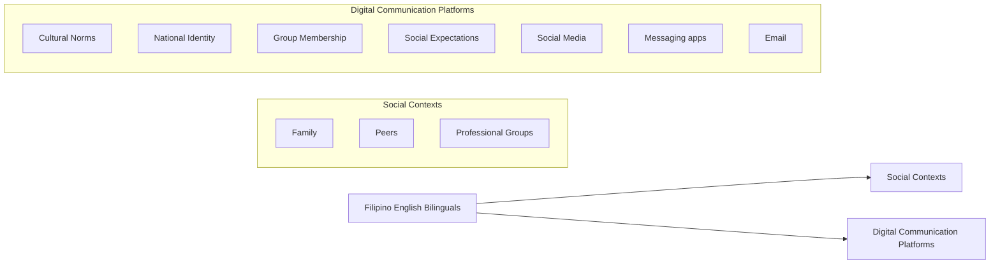
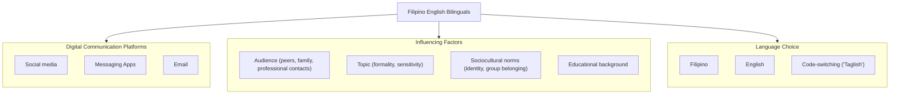

# Language Preferences in Digital Communication: A Study of Filipino English Bilinguals

Dr. Maria S. Bulaong

Director, Center for Language and Culture, Bulacan State University Malolos, Bulacan, Philippines 3001

## Abstract

Language preferences refer to the specific languages that individuals choose or prefer to use for communication, whether written or spoken influenced by factors such as cultural identity, social roles, personal comfort, and the context of communication affecting people engagement in conversations, access services, and participate in educational or professional settings (Lamorinas, et al., 2025).

This research investigated the language preferences of Filipino English bilinguals in digital communication contexts. With the increasing prevalence of digital platforms in the Philippines, understanding how bilingual individuals chose between Filipino and English in online interactions was essential for both sociolinguistic scholarship and practical applications in education, technology, and communication. Utilizing surveys and interviews, this study explored the factors influencing language choice, including context, interlocutor, topic, and perceived identity. The findings aimed to illuminate patterns of language use and the sociocultural motivations underlying these choices, contributing to a deeper understanding of bilingual communication in the digital age.

Keywords: English bilinguals, digital communication, language preference

## INTRODUCTION

The Philippines is recognized for its widespread bilingualism, with both Filipino and English serving as official languages and mediums of communication in various domains (Cruz & Lopez, 2023). In recent years, digital communication platforms such as social media, messaging apps, and online forums have become integral to daily life, offering new arenas for language use and preference. The flexibility to switch between Filipino and English, or to blend both, presents a unique opportunity to study bilingual behavior in a rapidly evolving digital landscape (Cruz, A., 2024).

Despite the prominence of bilingualism, there remained limited research on how Filipino English bilinguals would navigate language choice in digital settings. Factors such as audience, topic sensitivity, formality, and technological affordances had all played roles in shaping language preferences (Aquino, M., 2023). This study sought to address this gap by systematically examining the language choices of Filipino English bilinguals in various digital communication scenarios, providing insights into the interplay between language, identity, and technology.

## Objectives

## The following were the goals of the study.

1. To identify the predominant language(s) used by Filipino English bilinguals across different digital communication platforms.  
2. To analyze the factors influencing language choice in digital contexts, such as audience, topic, and platform.  
3. To explore the sociocultural meanings and identity implications associated with language preference in online communication.  
4. To contribute to the understanding of bilingual language practices in the context of digital communication in the Philippines.

## Research Questions

1. What are the language preferences of Filipino English bilinguals in various digital communication platforms?  
2. What factors influence the choice of language Filipino, English, or code-switching in digital communication among Filipino English bilinguals?  
3. How do language choices in digital communication relate to notions of identity, group membership, and social context?  
4. Are there notable differences in language preference based on demographic variables such as age, education, or geographic location?

## Theoretical Framework

The study was grounded on Socio-Cultural Theory of Language Use as used in the study. This study was anchored on the socio-cultural theory of language use, particularly drawing from Vygotsky’s perspective that language is both a cognitive tool and a medium for social interaction. According to this theory, language preferences and practices are shaped by social contexts, cultural norms, and the communicative needs of individuals within their communities. In the context of Filipino English bilinguals, language choice in digital communication was influenced by factors such as group membership, identity negotiation, and the perceived appropriateness of language for specific digital platforms and audiences. Key constructs were Language Preference or the selection of Filipino, English, or code-switching based on context; Digital Communication Contexts or Platforms such as social media, messaging apps, and email; and Sociocultural Influences or Social norms, identity, peer influence, and educational background. The socio-cultural theory emphasized that language was not only a means of communication but also a way of expressing identity and belonging (Tan, S., 2025). In digital environments, Filipino English bilinguals navigated multiple social worlds, each with its own expectations and norms regarding language use. Thus, their language preferences were not static but rather dynamic responses to shifting social contexts, technological affordances, and personal goals. This framework helped explain why codeswitching and hybrid language forms like ‘Taglish’ were prevalent, as these practices would allow individuals to align with different groups and express multifaceted identities in digital spaces (Santos, L., 2024).

The framework below visualizes how Filipino English bilinguals’ language preferences were shaped by the interplay of social contexts, cultural norms, and the characteristics of digital platforms. It highlights that language use is both a product and a process of identity negotiation and social interaction within digital environments. It was grounded in socio-cultural theory, explaining the relationship between language preferences and digital communication among Filipino bilinguals by emphasizing that language use was deeply embedded in social interaction, cultural identity, and context. Specifically, it posited that Filipino English bilinguals selected languages in digital communication was not merely for functional purposes but as a way to negotiate identity, express group membership, and respond to the social norms of their online communities.

Research on Filipino Generation Z supports this view by showing that digital platforms like social media could act as dynamic spaces where language preferences were shaped and reshaped (Tan, A., 2025). Filipino Gen Z users creatively blend Filipino, English, and slang to form a hybrid linguistic identity reflecting both local culture and global influences. Social media was described as a ‘second home,’ where language evolved through memes, acronyms, and new grammar, enabling users to express themselves authentically and build social bonds.

flowchart

Moreover, formal education and global media exposure also had influence language preferences by reinforcing English for academic and global communication while Filipino remained a symbol of cultura heritage (Reyes, V., 2025). This dynamic interplay illustrates how bilinguals had adapted their language choices in digital communication to balance global connectivity and local identity. Thus, the socio-cultural framework would explain that language preferences in digital communication among Filipino bilinguals were not fixed but fluid and context-dependent, shaped by the interaction of social identity, cultura affiliation, platform affordances, and communicative goals within the digital environment.

## Conceptual Framework

The conceptual framework below illustrates the interplay between the individual (the bilingual communicator), the digital environment, and the various factors that influenced language preference. Arrows connected these elements, showing that digital platforms and influencing factors interact to shape language choices, which in turn reflect and reinforce sociocultural identities. Each element posits that the choice of language in digital communication was not determined by a single factor but result of ongoing negotiation between platform affordances, social expectations, and personal identity (Reyes, P., 2025). A bilingual could use English in professional emails, ‘Taglish’ in group chats with friends, and Filipino when communicating with family. These choices were fluid and context-dependent, highlighting the adaptive nature of bilingual language practices in the digital age. This framework guided the researcher in examining not just which languages were used, but why and how these choices were made in specific digital contexts.

flowchart

The key concepts in the diagram integrated into the conceptual framework to analyze language switching behaviors in online platforms typically include the following (Santos & Cruz, 2024). First was the Digital Communication Platforms. The specific online environments where language switching could occur, such as social media, messaging apps, forums, and emails. These platforms had unique affordances and social norms influencing language se. The second was the User Attributes and Audience with characteristics of the communicators like age, education, and cultural background and the intended audience like peers, family, and professionals which could shape language choice and switching behavior. Third was the Contextual Factors which were the situational context including topic sensitivity, formality, and purpose of communication to influence whether a user would switch languages or maintain one language. Interconnected were Sociocultural Identity and Group Membership or how language switching would function as a marker of identity, social belonging, and cultural affiliation within online communities; Platform Design and Algorithms or the influence of social media algorithms and platform features example were likes, shares, comments affecting user engagement and potentially reinforced certain language behaviors or echo chambers; and Behavioral Intentions and Reactions or users’ motivations and responses in digital interactions to drive language switching, including emotional expression, clarity, and social signaling.

The above framework illustrates the input-output process. The inputs like platforms and influencing factors were fed into the bilingual’s decision process, resulting in specific language choices manifested in digital communication. The outputs, in turn, would impact ongoing identity construction and social relationships. As to the dynamic process, Filipino English Bilinguals would then select languages in online platforms. This emphasized that language choice was context-dependent, influenced by the digital environment, social factors, and personal identity. The framework underscored the adaptive and negotiated nature of bilingual communication in digital spaces, where language would serve both communicative and symbolic functions.

## Methodology

## Research Design

The study employed a mixed-methods research design, combining quantitative surveys and qualitative interviews to comprehensively explore language preferences and switching behaviors among Filipino English bilinguals in digital communication.

## Participants

Approximately 150 Filipino English bilinguals aged 18–30, representing diverse educational backgrounds and geographic locations within the Bulacan State University Malolos Bulacan. Purposive sampling technique was utilized to ensure participants were active users of digital communication platforms like social media, messaging apps, and email.

## Data Collection Methods

The study gathered both quantitative and qualitative data. For quantitative data, survey questionnaire was collected from 150 respondents designed to capture frequency and context of language use (Filipino, English, code-switching) across various digital platforms. Included in the collection data were the demographic questions as to respondents’ age and education measured using a Likert-scale items on language preference with factors such as audience, topic, and formality. It was administered during the 1st Semester of the academic year 2024 to 2025. This was done online for accessibility.

For qualitative data, a semi-structured interview was used conducted with 20 participants selected from survey respondents to gain deeper insights into motivations behind language choices. Questions explored identity expression, social influences, emotional factors, and perceptions of language appropriateness in digital contexts. Interviews were audio-recorded and transcribed for thematic analysis.

## Data Analysis

For quantitative data, the researcher used descriptive statistics like frequencies and percentages and mean scores and inferential statistics using chi-square tests and correlation analysis to identify patterns and relationships between demographic variables and language preferences. For qualitative data, thematic analysis following Braun and Clarke’s approach was utilized to identify recurring themes related to language choice motivations, identity, and social context. For validity and reliability of findings, the researcher distributed survey questionnaire and triangulation of data sources. Finally, checking followed during interviews to confirm participants’ perspectives.

## Ethical Considerations

To guarantee trust, participants received detailed information about the study’s aims, procedures, risks, and benefits. Consents were obtained before participation, with the option to withdraw at any time they wanted without any harm. Personal identifiers were removed or coded to protect participant identity. Dat were then stored securely and accessed only by the research. Participation was entirely voluntary, with no coercion or undue influence. Compliance with data protection regulations were ensured, including secure storage of digital files and proper disposal after the study. The study involved minimal risk; however, care was taken to avoid sensitive topics that could cause discomfort. Participants were provided with contact information for support if needed.

## Results and Findings of the Study

This section presents the analyzed data collected from 150 Filipino English bilingual participants through surveys and 20 in-depth interviews. The findings were organized according to the study’s objectives and research questions, supported by tables and detailed explanations.

## 1. Language Use Patterns Across Digital Platforms

Table 1. Frequency of Language Use by Platform (Mean Scores, Scale 1=Never to 5=Always)

<table><tr><td>Language Use</td><td>Social Media Used</td><td>Instant Messaging</td><td>Email</td></tr><tr><td>Filipino</td><td>3.2</td><td>3.8</td><td>2.1</td></tr><tr><td>English</td><td>4.1</td><td>3.5</td><td>4.4</td></tr><tr><td>Code-switching</td><td>3.9</td><td>4.2</td><td>2.5</td></tr></table>

Table 1 revealed participants were reported using English most frequently on social media and email, reflecting its dominance in formal and global communication spaces. Filipino was favored more in instant messaging, especially for informal conversations with family and friends. Code-switching was highly prevalent in instant messaging and social media, indicating bilinguals’ tendency to blend languages for expressive and contextual flexibility. The lower use of Filipino in email corresponded to the formality and professional orientation of this platform.

In addition, the distribution of language was used across different digital platforms among Filipino English bilinguals. English was most frequently used on social media and email, reflecting its status as the dominant language for formal, academic, and global communication. Filipino was preferred more in instant messaging typically informal and involved close social circles such as family and friends. The high frequency of code-switching on social media and instant messaging highlighted bilinguals’ natural tendency to blend Filipino and English for expressive, contextual, and pragmatic reasons. The relatively low Filipino used in email corresponds to the formal and professional nature of this medium, where English was often expected. These patterns aligned with sociolinguistic research showing that bilinguals adapted language use based on platform affordances and social norms.

The same findings were found in the study conducted by Santos D. (2024), Lamorinas et. al. (2025) and Reyes M. (2025). Previous studies agreed that social media platforms such as YouTube and TikTok were cited as spaces where English was often seen as the more practical and widely accepted medium where students expressed a preference for English due to its perceived advantages in global communication, career prospects, and its dominance in digital media and educational settings. Educational environment, where English is predominantly used in instructional materials and assessments, further marginalized the use of Filipino. Similarly, Tan P. (2025) even suggested that future studies should explore the evolving dynamics between language preferences and identity, particularly focusing on how the continued prominence of English in educational and digital spaces may affect the preservation of Filipino among younger generations (Santos, R & Cruz M. (2023); Santos, J. & Cruz, D. (2023) & Mendoza, K. (2023)).

## 2. Factors Influencing Language Choice

Table 2. Importance Ratings of Factors Influencing Language Choice (Mean Scores, Scale 1=Not Important to 5=Very Important)

<table><tr><td>Influencing Factor</td><td>Mean Score</td></tr><tr><td>Audience</td><td>4.7</td></tr><tr><td>Topic</td><td>4.5</td></tr><tr><td>Formality Platform</td><td>4.3</td></tr><tr><td>Desire to Express Identify</td><td>4.0</td></tr><tr><td>Comfort Level with Language</td><td>3.9</td></tr><tr><td>Peer Influence</td><td>3.8</td></tr><tr><td>Need for Clarity</td><td>3.7</td></tr><tr><td>Perceived Prestige</td><td>3.6</td></tr></table>

As shown in Table 2, the audience was the most critical factor, with participants tailoring their language choice depending on who they were communicating with family, friends, or colleagues. The topic and formality also strongly influenced language preference, with more formal or sensitive topics prompting

English use. The desire to express cultural identity motivated Filipino use, especially in informal or intimate contexts. Peer influence and perceived prestige of English, noted in qualitative data, further shaped language decisions.

To clarify the above matter, Tan, P. (2025) identified the key sociolinguistic and contextual factors Filipino English bilinguals would consider when choosing which language to use online. The audience was the most significant factor, underscoring that language choice was relational and dependent on who the interlocutors were family, friends, or colleagues. The topic and formality of the platform also strongly influenced language preference, reflecting pragmatic considerations such as appropriateness and sensitivity (Santos, A., 2025). The desire to express cultural identity ranks highly, showing that language was a marker of group membership and personal identity. Factors like comfort level, peer influence, clarity, and prestige further nuanced these choices, consistent with findings that bilinguals negotiate language use to balance communicative effectiveness and social meaning (Mendoza, F (2024)).

## 3. Attitudes Toward Language Use in Digital Communication

Table 3. Agreement with Attitudinal Statements (Mean Scores, Scale 1=Strongly Disagree to 5=Strongly Agree)

<table><tr><td>Statement</td><td>Mean Score</td></tr><tr><td>English helps me connect with a wider audience.</td><td>4.6</td></tr><tr><td>Filipino helps me express my cultural identity.</td><td>4.5</td></tr><tr><td>Code-switching makes communication more expressive and natural.</td><td>4.4</td></tr><tr><td>I feel more comfortable using Filipino with family online.</td><td>4.3</td></tr><tr><td>I feel more professional when I use English in digital communication.</td><td>4.2</td></tr><tr><td>Social media encourages me to use more English than Filipino.</td><td>4.1</td></tr><tr><td>Filipino should be used more often in digital communication to preserve it.</td><td>4.0</td></tr></table>

As found out in Table 3, participants generally viewed English as a tool for wider communication and professionalism, consistent with findings highlighting English’s global utility and educational dominance. Filipino was strongly associated with cultural identity and emotional connection, especially in family and community contexts. The high agreement on code-switching reflects its role as a natural and effective communication strategy. Notably, participants recognized the importance of preserving Filipino despite the dominance of English online.

In the same context, according to Santos, M. & Lim, R. (2024) participants showed normal attitudes toward the roles of Filipino and English in digital communication. English was viewed as a language that broadened reach and conveys professionalism, which explained its dominance in formal and public digital spaces. Filipino was strongly associated with cultural expression and emotional comfort, particularly in intimate or familial contexts. Also, in the study conducted by Reyes, P. (2025), it was revealed that the high agreement on the value of code-switching confirmed its role as a natural and effective communicative strategy among bilinguals. Participants also recognized the pressure from social media to use English, yet they still expressed a conscious desire to preserve Filipino, highlighting the ongoing tension between globalizing influences and local identity maintenance (Aquino M. L. 2023; Garcia, J. 2024; & Cruz, A., 2024).

## 4. Demographic Variations in Language Preferences

Table 4. Language Use by Age Group (Mean Frequency Scores on Social Media)

<table><tr><td>Age Group</td><td>Filipino</td><td>English</td><td>Code-Switching</td></tr><tr><td>18–22</td><td>3.5</td><td>4.3</td><td>4.1</td></tr><tr><td>23–26</td><td>3.0</td><td>4.0</td><td>3.8</td></tr><tr><td>27–30</td><td>2.8</td><td>3.9</td><td>3.5</td></tr></table>

Table 4 emphasized that younger participants aged 8 to 22 showed a slightly higher preference for Filipino and code-switching on social media compared to older groups, who leaned more toward English. This suggests a generational shift where younger bilinguals maintained stronger ties to Filipino in informal digital communication, possibly reflecting evolving identity dynamics.

To confirm the findings, Santos and Cruz (2023) showed the generational differences in language preferences on social media. Younger participants (18–22 years old) tend to use Filipino and code-switch more frequently than older groups, who would lean more toward English (Lopez, G. 2023; Dela Cruz, 2023; Lopez, M. 2024). This suggests that younger bilinguals maintained stronger ties to Filipino in informal digital communication, possibly reflecting a generational shift toward embracing bilingual identity and cultural heritage within digital spaces. The gradual decrease in Filipino use and codeswitching with age, according to Mendoza, F. (2024) would indicate increased professional or academic pressures favoring English. These findings aligned with sociolinguistic observations in the present study that younger generations would innovate and sustain bilingual practices, including code-switching, as part of identity formation (Dela Cruz, M. (2023), & Garcia, E. & Lim, (2025)).

Study of Aquino, R. (2025) even highlighted the widespread practice of code-switching and hybrid language use among Filipino English bilinguals, especially in informal digital communication. This phenomenon could be attributed to ease understanding, comfort, and need to convey nuanced meanings that may not be easily translated into one language. Code-switching is also linked to identity construction and group belonging in online communities (Clemente, 2023). The use of digital slang, particularly on platforms like TikTok, illustrated how language evolved in response to digital trends (Delos Reyes, 2023; Tan & Ramos, 2025). Filipino TikTok slang blended the traditional expressions with internet-inspired phrases, serving both communicative and social functions. This linguistic play was not only a marker of digital identity but also a tool for fostering community and belonging among youth.

## 5. Qualitative Findings: Themes from Interviews

The themes below collectively highlighted the dynamic, context-dependent, and identity-driven nature of language use among participants, especially in digital and multicultural environments.

Table 5. Themes Collected from the Interview

<table><tr><td>Theme</td><td>Description</td><td>Sample Statement</td></tr><tr><td>Strategic Language Switching for Social Contexts</td><td>Participants described switching languages based on the interlocutor and setting.</td><td>"I use Filipino with my family because it feels more personal, but I switch to English when chatting with classmates or on professional platforms."</td></tr><tr><td>Emotional Expression and Nuance</td><td>Code-switching was frequently used to express emotions more precisely.</td><td>"Sometimes, Tagalog words just capture my feelings better than English, especially when I'm upset or excited."</td></tr><tr><td>Influence of Social Media and Peer Norms</td><td>Social media platforms like TikTok and YouTube were noted as spaces where English dominates, influencing language use.</td><td>"On TikTok, everyone uses English or mixes it with Filipino because it reaches more people."</td></tr><tr><td>Identity and Cultural Preservation</td><td>Many participants expressed a desire to maintain Filipino use online to preserve cultural identity, despite pressures to use English:</td><td>"I try to post in Filipino sometimes to keep our language alive, even if it's not as popular."</td></tr></table>

The above table discussed the themes drawn from the interview responses. As for the Strategic Language Switching for Social Contexts, participants frequently reported that their choice of language was dependent on who they were interacting with and the context of the conversation (Santos, M. & Lim, 2025). This strategic switching allowed them to navigate different social spheres more effectively with key points: (1) Filipino was used in intimate or familial settings to foster closeness and a sense of belonging; (2) English was chosen for academic, professional, or broader social contexts where it could be perceived as more appropriate or prestigious; and (3) the act of switching was intentional and reflected an awareness of social expectations and relationships as shown in samples statements.

As to Emotional Expression and Nuance, according to Villanueva (2024), code-switching was not just about practicality but also served as a tool for conveying emotion and subtlety. Participants noted that certain feelings or experiences were best expressed in their native language with primary points: Tagalog (or Filipino) words often captured emotional states or cultural nuances that English could not; and switching languages allowed for more precise or heartfelt communication, especially during moments of strong emotion. This theme highlighted the deep connection between language and emotional authenticity evident with probe statements.

As to Influence of social media and Peer Norms, social media platforms played a significant role in shaping language use (Mendoza, C., 2023). Participants observed that English was often the default or dominant language on popular platforms, influencing how they communicate online. Noticeable points were also found in the study by Reyes, M. (2025) that more accessible to wider audiences. Other points were that there was a tendency to mix English and Filipino, especially in digital spaces where peer norms favor such practices and that the desire for reach and engagement often motivated users to adopt English or codeswitch.

Recent literature emphasized the dominance of English in digital media among Filipino bilinguals, especially among younger generations. To Cruz and Fernandez (2025), English was often perceived as advantageous for global communication, career prospects, and social media engagement contributing to a lower preference for Filipino in digital contexts. This trend was reinforced by educational systems and societal expectations that had prioritized English proficiency. Another point here was the blending of Filipino and English, or ‘Taglish,’ (Lopez, M. 2024) which remained prevalent and was seen as a reflection of linguistic adaptability and cultural identity (Cruz & Fernandez, 2025). However, the increasing use of English, particularly in digital and academic environments, had raised concerns about the potential marginalization of the Filipino language and the erosion of cultural heritage. Social media platforms also played a significant role in shaping language identity, with Filipino Generation Z reporting that online spaces fostered linguistic innovation, self-expression, and the development of unique digital vernaculars (Reyes, M., 2025). These platforms had encouraged the creation of new memes, acronyms, and hybrid grammar, further influencing language preferences.

As to Identity and Cultural Preservation, despite the dominance of English online, many participants expressed a conscious effort to use Filipino to maintain and celebrate their cultural identity. Key points were found as; posting or communicating in Filipino was seen as an act of cultural preservation and pride and there was a tension between the pressure to use English for popularity and the desire to keep Filipino language vibrant in digital spaces. This theme underscored the role of language in shaping and expressing personal and collective identity.

## Summary of Findings

Each table collectively illustrates that language preferences among Filipino English bilinguals in digital communication were dynamic and context-dependent, shaped by platform type, social context, identity, and generational factors. The data confirmed that bilinguals strategically navigated between Filipino, English, and code-switching to meet communicative goals while expressing cultural identity and adapting to social expectations. These patterns were consistent with established sociolinguistic theories on bilingual language use and recent empirical studies on Filipino bilingualism in digital contexts.

In summation, showcased in the study were the following: (1) English dominated formal and global digital communication platforms, such as email and professional social media, due to its perceived prestige and utility; (2) Filipino was favored in informal, intimate contexts, particularly instant messaging with family and close friends; (3) Code-switching was a widespread and strategic practice that enhanced emotional expression, social bonding, and communicative effectiveness; (4) Audience, topic, and platform formality were key determinants of language choice in digital communication; (5) Social media and peer norms heavily influenced language preferences, often encouraging English use for broader reach; (6) Despite pressures favoring English, there was a strong cultural motivation to preserve Filipino, especially among younger bilinguals.; and (7) Demographic factors such as age influenced the degree of Filipino use and code-switching, with younger users showing more balanced bilingual practices. These findings aligned with recent studies highlighting the socio-cultural and educational pressures shaping bilingual language use in the Philippines and the dynamic role of digital platforms in evolving language practices.

## Conclusion

The study revealed a complex and dynamic interplay between Filipino, English, and code-switching in various digital platforms. English predominated in formal and global communication contexts such as email and professional social media, while Filipino remained vital in informal, intimate settings like instant messaging with family and close friends. Code-switching emerged as a natural and strategic communicative practice that enhanced expressiveness, identity negotiation, and social bonding. Key factors influencing language choice included the audience, topic, and formality of the platform, underscoring the bilinguals’ sensitivity to social context. Participants’ attitudes reflected a balanced appreciation for English’s global utility and Filipino’s cultural significance, with a strong desire to preserve the national language despite pressures favoring English online. Generational differences indicated that younger bilinguals maintained higher use of Filipino and code-switching, suggesting evolving bilingual identities in digital spaces. Overall, the findings highlighted the adaptive, contextdependent nature of language preferences among Filipino English bilinguals, shaped by sociocultural, educational, and technological influences.

Language Preferences and Digital Communication

Educational policies and classroom practices continued to influence language preferences. English was often positioned as the language of academic competence, while Filipino was associated with cultural identity and familial experiences. The reliance on English in instructional materials and assessments contributed to a linguistic divide and had reinforce the perception of Filipin o as less prestigious in formal domains (Tan, J., 2023). Although changes went on, there has still been ongoing debate about the impact of removing Filipino as a core subject in the curriculum, with concerns about the long-term effects on national language proficiency and cultural preservation.

## Recommendations

## The following suggestions were drawn form the study results and findings:

1. For Educators and Curriculum Developers, (1) to integrate code-switching as a legitimate communicative strategy in language teaching, encouraging students to use both Filipino and English fluidly to enhance expression and comprehension, (2) design learning activities that would reflect real digital communication contexts, such as social media posts and instant messaging, to make language learning relevant and engaging; (3) foster metalinguistic awareness by helping students analyze their own language choices and understand the social functions of bilingualism and code-switching; and (4) promote Filipino language use alongside English to strengthen cultural identity and preserve the national language within educational settings.  
2. For Policy Makers and Language Advocates, (1) support policies that recognize bilingualism and code-switching as valuable linguistic resources rather than errors or deficiencies; (2) encourage the development of digital content and platforms that promote Filipino language use to balance the dominance of English online; and (3) invest in public campaigns and programs that raise awareness about the importance of preserving Filipino in the digital age.  
3. For Future Researchers, to (1) conduct longitudinal studies to track how language preferences evolve over time, especially among younger generations. (2) explore the impact of emerging digital platforms and technologies on bilingual language practices, (3) investigate the role of language preferences in digital communication on academic performance and identity formation.

By implementing these recommendations, stakeholders could better support Filipino English bilinguals in navigating their linguistic resources effectively, fostering both language development and cultural preservation in the digital era.

## Bionote of the Researcher

Dr. Maria S. Bulaong is a faculty member of the Filipino Language Department in the College of Arts and Literature at Bulacan State University. She served as the dean of the college from 2017 to 2025. At present, she is the director of the university’s Center for Language and Culture.

## References

1. Aquino, M. L. (2023). Exploring Language Shift and Maintenance in Filipino Bilingual Households. Journal of Multilingual and Multicultural Development, 44(3), 215–230.  
2. Aquino, M. P. (2024). Language and Power in Filipino Social Media Discourse. Philippine Journal of Critical Studies, 7(2), 70–86.  
3. Aquino, R. S. (2025). Code-Switching as a Strategy for Social Inclusion in Filipino Online Forums.  
Journal of Sociolinguistics, 29(1), 78–95.  
4. Cruz, A. J. (2024). Digital Literacy and Language Practices among Filipino Adolescents. International Journal of Digital Communication, 9(3), 200–218.  
5. Cruz, L. M., & Reyes, F. S. (2024). The Role of Language in Teaching Technology to Filipino Students. Philippine Journal of Educational Technology, 8(3), 150–166.  
6. Cruz, N. R., & Fernandez, P. S. (2025). Sociolinguistic Factors Affecting Language Choice in Filipino Digital Communication. Asian Pacific Journal of Language and Communication, 7(2), 99–117.  
7. Dela Cruz, M. A. (2023). The Interplay of Language, Identity, and Technology among Filipino Bilinguals. Asian Journal of Sociolinguistics, 6(1), 55–70.  
8. Dela Cruz, S. M. (2023). The Influence of Peer Groups on Language Use among Filipino Bilingual Youth. Philippine Sociolinguistics Journal, 11(2), 87–102. https://usurj.journals.usask.ca/article/download/763/469/  
9. Delos Reyes, R. (2023). Filipino Adolescents' Everyday Digital Literacy Practices. Presented at the European Educational Research Association Conference, 2023. https://eera-ecer.de/ecerprogrammes/conference/26/contribution/51018  
10. Garcia, E. S., & Lim, A. R. (2025). Language Attitudes and Social Media Use among Filipino Youth. Journal of Southeast Asian Studies, 43(1), 89–105.  
11. Garcia, F. S., & Mendoza, J. R. (2024). Language Shift and Hybridization in Filipino Digital Media. Journal of Multilingual Communication, 10(2), 89–105.  
12. Garcia, J. M., & Reyes, P. L. (2024). Social Media and Language Shift: Filipino-English Bilinguals Online. Journal of Sociolinguistic Research, 9(3), 120–138.  
13. Garcia, J. P. (2024). The Role of Filipino in Online Political Discourse. Philippine Political Communication Review, 8(1), 65–82.  
14. Garcia, M. L., & Aquino, R. T. (2024). Language Use and Social Identity in Filipino Online Communities. Journal of Digital Sociology, 5(2), 88–104.  
15. Garcia, R. T., & Mendoza, L. F. (2025). The Role of Language in Filipino Digital Identity Construction. Journal of Digital Identity Studies, 4(1), 33–49.  
16. Lamorinas, D. D., Luna, L. A., Lai, M. N. D., et al. (2025). A General Perspective on the Factors Influencing the Low Preferences of Gen Z College Students towards the Filipino Language. Forum for Linguistic Studies, 7(3), 451–466. https://doi.org/10.30564/fls.v7i3.8482  
17. Lopez, G. M. (2023). Language Preferences in Instant Messaging: A Study of Filipino College Students. Philippine Journal of Communication, 19(1), 58–74.  
18. Lopez, M. T. (2024). Language Preferences in Filipino English Bilingual Education. Philippine Educational Journal, 22(2), 101–118.  
19. Mendoza, C. A. (2023). Language Preferences and Emotional Expression in Filipino Digital Messaging. Journal of Language and Emotion, 5(2), 110–125.  
20. Mendoza, F. T. (2024). The Role of Code-Mixing in Filipino English Bilinguals’ Online Communication. Asian Journal of Applied Linguistics, 8(1), 78–95.  
21. Mendoza, K. P. (2023). The Impact of Mobile Screen Media on Language Choice among Filipino Children. Philippine Journal of Child Language, 9(1), 45–61.  
22. Reyes, M. (2025). Digital Identity and Linguistic Play: A Study of Filipino TikTok Slang among Generation Z. International Journal of Language and Communication, 12(1), 45–62. https://rsisinternational.org/journals/ijriss/articles/digital-identity-and-linguistic-play-a-study-of-  
filipino-tiktok-slang-among-generation-z/  
23. Reyes, P. L. (2025). The Influence of Globalization on Filipino Language Use in Social Media. Journal of Global Communication, 15(1), 44–60.  
24. Reyes, V. M. (2025). The Impact of Educational Policies on Filipino Language Use in Digital Spaces. Philippine Educational Review, 29(2), 134–150.  
25. Santos, A. J. (2025). Language Preferences and Educational Outcomes in Filipino Bilingual Students. Journal of Educational Linguistics, 14(2), 99–115.  
26. Santos, D. A., & Tan, J. C. (2024). Code-Switching as a Marker of Identity in Filipino Online Communities. Language and Society, 51(4), 402–421.  
27. Santos, J. P., & Cruz, L. M. (2024). Language Preferences and Code-Switching Patterns in Filipino Social Media Users. Philippine Journal of Linguistics, 50(2), 112–130.  
28. Santos, M. E., & Lim, R. T. (2025). Educational Interventions to Promote Filipino Language Use in Digital Communication. Philippine Journal of Language Education, 14(1), 45–60.  
29. Santos, J. R., & Cruz, D. L. (2023). The Role of Language Prestige in Filipino Youth’s Digital Communication. Journal of Language and Society, 48(3), 305–322.  
30. Santos, L. M. (2024). Filipino-English Code-Switching in Online Gaming Communities. Journal of Language and Digital Culture, 7(3), 130–146.  
31. Santos, R. L., & Cruz, M. T. (2023). Code-Switching and Language Attitudes among Filipino College Students. Journal of Language Attitudes, 12(1), 55–71.  
32. Tan, A. S. (2025). The Future of Filipino Language in the Digital Era. Philippine Linguistics Forum, 16(1), 5–20.  
33. Tan, L. P., & Ramos, K. S. (2025). Language Use and Identity Construction in Filipino TikTok Communities. Journal of New Media and Society, 17(1), 23–40.  
34. Tan, P. L. (2025). Filipino Language Maintenance in the Digital Age: Challenges and Opportunities. Philippine Linguistics Review, 33(1), 12–29.  
35. Tan, S. M. (2025). The Role of Family Language Practices in Filipino Bilingualism. Journal of Family and Language, 11(1), 22–38.  
36. Villanueva, R. T. (2024). Code-Switching and Language Mixing in Filipino Social Media Posts. Journal of Language and Digital Media, 6(3), 145–162.