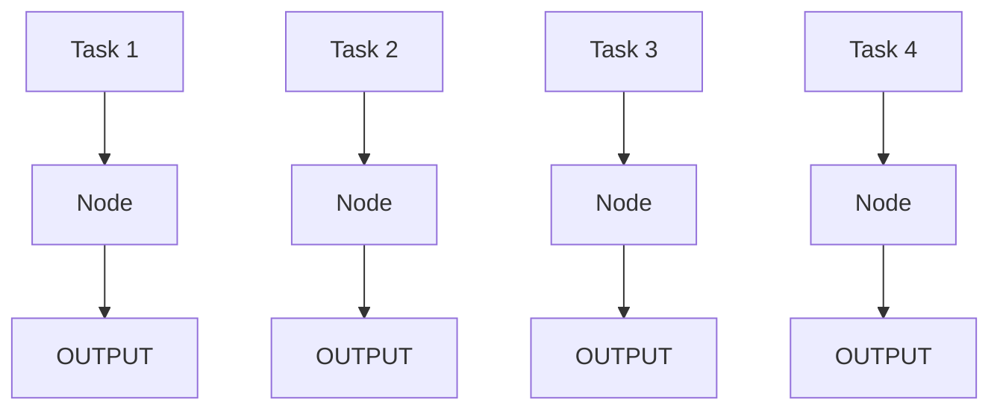
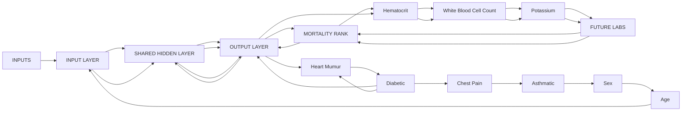
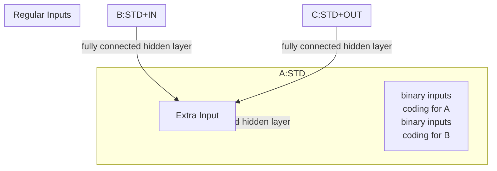

# Multitask Learning\*

RICH CARUANA

caruana@cs.cmu.edu

School ofComputer Science, Carnegie Mellon University, Pittsburgh, PA 15213

Editors: Lorien Pratt and Sebastian Thrun

Abstract. Multitask Learning is an approach to inductive transfer that improves generalization by using the domain information contained in the training signals of related tasks as an inductive bias. It does this by learning tasks in parallel while using a shared representation; what is learned for each task can help other tasks be learned better. This paper reviews prior work on MTL, presents new evidence that MTL in backprop nets discovers task relatedness without the need of supervisory signals, and presents new results for MTL with k-nearest neighbor and kernel regression. In this paper we demonstrate multitask learning in three domains. We explain how multitask learning works, and show that there are many opportunities for multitask learning in real domains. We present an algorithm and results for multitask learning with case-based methods like k-nearest neighbor and kernel regression, and sketch an algorithm for multitask learning in decision trees. Because multitask learning works, can be applied to many different kinds of domains, and can be used with different learning algorithms, we conjecture there will be many opportunities for its use on real-world problems.

Keywords: inductive transfer, parallel transfer, multitask learning, backpropagation, k-nearest neighbor, kernel regression, supervised learning, generalization

## 1. Introduction

## 1.1. Overview

Multitask Learning (MTL) is an inductive transfer mechanism whose principle goal is to improve generalization performance. MTL improves generalization by leveraging the domain-specific information contained in the training signals of related tasks. It does this by training tasks in parallel while using a shared representation. In effect, the training signals for the extra tasks serve as an inductive bias. Section 1.2 argues that inductive transfer is important if we wish to scale tabula rasa learning to complex, real-world tasks. Section 1.3 presents the simplest method we know for doing multitask inductive transfer, adding extra tasks (i.e., extra outputs) to a backpropagation net. Because the MTL net uses a shared hidden layer trained in parallel on all the tasks, what is learned for each task can help other tasks be learned better. Section 1.4 argues that it is reasonable to view training signals as an inductive bias when they are used this way.

Section 2 demonstrates that MTL works. We compare the performance of single task learning (STL—learning just one task at a time) and multitask learning in backpropagation on three problems. One of these problems is a real-world problem created by researchers other than the author who did not consider using MTL when they collected the data.

Section 3 explains how MTL in backprop nets works. Section 3.1 suggests mechanisms that could improve generalization even if the extra tasks’ training signals are not relevant to the main task. We present an empirical test that rules out these mechanisms and thus ensures that the benefit from MTL is due to the information in the extra tasks. In section 3.2 we present mechanisms that explain how MTL leverages the information in the extra training signals to improve generalization. In section 3.3 we show that MTL in backprop nets is able to determine how tasks are related without being given an explicit training signal for task relatedness.

Section 4 may be the most important part of this paper. It shows that there are many opportunities for MTL (and for inductive transfer in general) on real-world problems. At first glance most of the problems one sees in machine learning today do not look like multitask problems. We believe most current problems in machine learning appear to be single task because of the way we have been trained. Many—in fact, we believe most— real-world problems are multitask problems and performance is being sacrificed when we treat them as single task problems.

Sections 1-4 use the simplest MTL algorithm we know of, a backprop net with multiple outputs sharing a single, fully connected hidden layer. But MTL is a collection of ideas, techniques, and algorithms, not one algorithm. In Section 5 we present MTL algorithms for k-nearest neighbor and decision trees. While these algorithms look rather different from MTL in backprop nets, there is strong overlap of mechanisms and issues; all MTL algorithms must address essentially the same set of problems, even if the specific mechanism in each algorithm is different.

Inductive transfer is not new, and many backprop nets used multiple outputs before MTL came along. Related work is presented in Section 6. Section 7 discusses many issues that arise in MTL and briefly mentions future work. Section 8 is a summary.

## 1.2. Motivation

The standard methodology in machine learning is to learn one task at a time. Large problems are broken into small, reasonably independent subproblems that are learned separately and then recombined (see, for example, Waibel’s excellent work on connectionist glue (Waibel 1989)). This paper argues that sometimes this methodology is counterproductive because it ignores a potentially rich source of information available in many real-world problems: the information contained in the training signals of other tasks drawn from the same domain.

An artificial neural network (or a decision tree, or a ...) trained tabula rasa on a single, isolated, very difficult task is unlikely to learn it well. For example, a net with a 1000x 1000-pixel input retina is unlikely to learn to recognize complex objects in real-world scenes given the number of training patterns and training time likely to be available. Might it be better to require the learner to learn many things simultaneously? Yes. If the tasks can share what they learn, the learner may find it is easier to learn them together than in isolation. Thus, if we simultaneously train a net to recognize object outlines, shapes, edges, regions, subregions, textures, reflections, highlights, shadows, text, orientation, size, distance, etc., it may learn better to recognize complex objects in the real world. This approach is Multitask Learning.

## 1.3. MTL in Backpropagation Nets

Figure 1 shows four separate artificial neural nets (ANNs). Each net is a function of the same inputs, and has one output. Backpropagation is applied to these nets by training each net in isolation. Because the four nets are not connected, it is not possible for what one net learns to help another net. We call this approach Single Task Learning (STL).

  
Figure 1. Single Task Backpropagation (STL) of four tasks with the same inputs.

Figure 2 shows a single net with the same inputs as the four nets in Figure 1, but which has four outputs, one for each task the nets in Figure 1 were being trained on. Note that these four outputs are fully connected to a hidden layer that they share.<sup>1</sup> Backpropagation is done in parallel on the four outputs in the MTL net. Because the four outputs share a common hidden layer, it is possible for internal representations that arise in the hidden layer for one task to be used by other tasks. Sharing what is learned by different tasks while tasks are trained in parallel is the central idea in multitask learning (Suddarth & Kergosien 1990; Dietterich, Hild & Bakiri 1990, 1995; Suddarth & Holden 1991; Caruana 1993, 1994, 1995; Baxter 1994, 1995, 1996; Caruana & de Sa 1996).

MTL is an inductive transfer method that uses the domain specific information contained in the training signals of related tasks. It does this by learning the multiple tasks in parallel while using a shared representation. In backpropagation, MTL allows features developed in the hidden layer for one task to be used by other tasks. It also allows features to be developed to support several tasks that would not have been developed in any STL net trained on the tasks in isolation. Importantly, MTL also allows some hidden units to become specialized for just one or a few tasks; other tasks can ignore hidden units they do not find useful by keeping the weights connected to them small.

## 1.4. Training Signals as an Inductive Bias

MTL is one way of achieving inductive transfer between tasks. The goal of inductive transfer is to leverage additional sources of information to improve the performance of learning on the current task. Inductive transfer can be used to improve generalization accuracy, the speed of learning, and the intelligibility of learned models. In this paper we focus solely on improving accuracy. We are not concerned about the computational cost of learning nor the intelligibility of what is learned. One way transfer improves generalization is by providing a stronger inductive bias than would be available without the extra knowledge. This can yield better generalization with a fixed training set, or reduce the number of training patterns needed to achieve some fixed level of performance.


<details>
<summary>flowchart</summary>


</details>

Figure 2. Multitask Backpropagation (MTL) of four tasks with the same inputs.

Inductive bias is anything that causes an inductive learner to prefer some hypotheses over other hypotheses. Bias-free learning is impossible; much ofthe power ofan inductive learner follows directly from the power of its inductive bias (Mitchell 1980). Multitask learning uses the training signals for related tasks as an inductive bias to improve generalization. One does not usually think of training signals as a bias; but when the training signals are for tasks other than the main task, it is easy to see that, from the point of view of the main task, the other tasks may serve as a bias. The multitask bias causes the inductive learner to prefer hypotheses that explain more than one task. For this multitask bias to exist, the inductive learner must be biased to prefer hypotheses that have utility across multiple tasks.

## 2. Does MTL Work?

Before jumping into how multitask learning works and when to use it, we first demonstrate that it does work. We do this not only to convince the reader that multitask learning is worthwhile, but because the examples will help the reader develop intuitions about how multitask learning works and where it is applicable.

In this section we present three applications of MTL in backprop nets. The first uses simulated data for an ALVINN-like road-following domain. The second uses real data collected with a robot-mounted camera. This data was collected specifically to demonstrate

MTL. The third domain applies MTL to a medical decision-making domain. The data in this domain was collected by other researchers who did not consider using MTL when collecting the data.

## 2.1. 1D-ALVINN

1D-ALVINN uses a road image simulator first developed by Pomerleau to permit rapid testing of learning ideas for road-following domains (Pomerleau 1992). The original simulator generates synthetic road images based on a number of user-defined parameters such as the road width, number of lanes, angle and field of view of the camera. We modified the simulator to generate 1-D road images comprised of a single 32-pixel horizontal scan line instead of the original 2-D 30x32-pixel image. We did this to speed learning so more thorough experimentation could be done—training moderate sized nets with the full 2-D retina was computationally too expensive to allow many replications. Nevertheless, 1D-ALVINN retains much of the complexity of the original 2-D domain; the main complexity lost is that road curvature is no longer visible, and the smaller input (960 pixels vs. 32 pixels) makes learning easier.

The principle task in both 1D-ALVINN and 2D-ALVINN is to predict steering direction. For our MTL experiments, eight additional tasks were used:

whether the road is one or two lanes  
location of left edge of road  
location of road center  
intensity of region bordering road

location of centerline (2-lane roads only)  
location of right edge of road  
intensity of road surface  
intensity of centerline (2-lane roads only)

These additional tasks are all computable from the internal variables in the simulator. We modified the simulator so that the training signals for these extra tasks were added to the synthetic data along with the training signal for the main steering task.

Table 1 shows the performance often runs ofsingle and multitask learning on 1D-ALVINN using nets with one hidden layer. The MTL net has 32 inputs, 16 hidden units, and 9 outputs. The 36 STL nets have 32 inputs, 2, 4, 8 or 16 hidden units, and 1 output each.<sup>2</sup> Note that the size of the MTL nets was not optimized.

The entries under the STL and MTL headings are the generalization error for nets of the specified size when early stopping is used to halt training. The bold STL entries are the STL runs that yielded best performance. The last two columns compare STL and MTL. The first column is the percent reduction in error of MTL over the best STL run. Negative percentages indicate MTL performs better. This test is biased in favor of STL because it compares single runs of MTL on an unoptimized net size with several independent runs of STL that use different random seeds and are able to find near-optimal net size. The last column is the percent improvement of MTL over the average STL performance. Differences marked with an “\*” are statistically significant at 0.05 or better. Note that on the important steering task MTL outperforms STL 15–30%. It does this without having access to any extra training patterns: exactly the same training patterns are used for both STL and MTL. The only difference is that the MTL training patterns have the training signals for all nine tasks, whereas the STL training patterns have training signals for only one task at a time.

Table 1. Performance of STL and MTL with one hidden layer on tasks in the 1D-ALVINN domain. The bold entries in the STL columns are the STL runs that performed best. Differences statistically significant at 0.05 or better are marked with an \*.

<table><tr><td colspan="8">ROOT-MEAN SQUARED ERROR ON TEST SET</td></tr><tr><td rowspan="2">TASK</td><td colspan="4">Single Task Backprop (STL)</td><td rowspan="2">MTL16HU</td><td rowspan="2">Change MTLto Best STL</td><td rowspan="2">Change MTLto Mean STL</td></tr><tr><td>2HU</td><td>4HU</td><td>8HU</td><td>16HU</td></tr><tr><td>1 or 2 Lanes</td><td>.201</td><td>.209</td><td>.207</td><td>.178</td><td>.156</td><td>-12.4% *</td><td>-21.5% *</td></tr><tr><td>Left Edge</td><td>.069</td><td>.071</td><td>.073</td><td>.073</td><td>.062</td><td>-10.1% *</td><td>-13.3% *</td></tr><tr><td>Right Edge</td><td>.076</td><td>.062</td><td>.058</td><td>.056</td><td>.051</td><td>-8.9% *</td><td>-19.0% *</td></tr><tr><td>Line Center</td><td>.153</td><td>.152</td><td>.152</td><td>.152</td><td>.151</td><td>-0.7%</td><td>-0.8%</td></tr><tr><td>Road Center</td><td>.038</td><td>.037</td><td>.039</td><td>.042</td><td>.034</td><td>-8.1% *</td><td>-12.8% *</td></tr><tr><td>Road Greylevel</td><td>.054</td><td>.055</td><td>.055</td><td>.054</td><td>.038</td><td>-29.6% *</td><td>-30.3% *</td></tr><tr><td>Edge Greylevel</td><td>.037</td><td>.038</td><td>.039</td><td>.038</td><td>.038</td><td>2.7%</td><td>0.0%</td></tr><tr><td>Line Greylevel</td><td>.054</td><td>.054</td><td>.054</td><td>.054</td><td>.054</td><td>0.0%</td><td>0.0%</td></tr><tr><td>Steering</td><td>.093</td><td>.069</td><td>.087</td><td>.072</td><td>.058</td><td>-15.9% *</td><td>-27.7% *</td></tr></table>

## 2.2. 1D-DOORS

1D-ALVINN is not a real domain; the data is generated with a simulator. To test MTL on a more realistic problem, we created an object recognition domain similar in some respects to 1D-ALVINN. In 1D-DOORS, the main tasks are to locate doorknobs and to recognize door types (single or double) in images of doors collected with a robot-mounted color camera. Figure 3 shows several door images from the database. As with 1D-ALVINN, the problem was simplified by using horizontal stripes from the images, one for the green channel and one for the blue channel. Each stripe is 30 pixels wide (accomplished by applying Gaussian smoothing to the original 150 pixel-wide image) and occurs at the vertical height in the image where the doorknob is located. Ten tasks were used. These are:

horizontal location of doorknob  
horizontal location of doorway center  
horizontal location of left door jamb  
width of left door jamb  
horizontal location of left edge of door

single or double door  
width of doorway  
horizontal location of right door jamb  
width of right door jamb  
horizontal location of right edge of door

As this is a real domain, the training signals for these tasks had to be acquired manually. We used a mouse to click on the appropriate features in each image in the training and test sets. Since it was necessary to process each image manually to acquire the training signals for the two main tasks, it was not that difficult to acquire the training signals for the extra tasks.

The difficulty of 1D-DOORS precludes running as exhaustive a set of experiments as with 1D-ALVINN; comparison could be done only for the two tasks we considered most important: doorknob location and door type. STL was tested on nets using 6, 24, and 96 hidden units. MTL was tested on nets with 120 hidden units. The results of ten trials with STL and MTL are in Table 2.

MTL generalizes 20–30% better than STL on these tasks, even when compared to the best of three different runs of STL. Once again, note that the training patterns used for STL and MTL are identical except that the MTL training patterns contain additional training signals. It is the information contained in these extra training signals that helps the hidden layer learn a better internal representation for the door recognition domain, and this better representation in turn helps the net better learn to recognize door types and the location of the doorknobs.

  
Figure 3. Sample single and double doors from the 1D-DOORS domain.

Table 2. Performance of STL and MTL on the two main tasks in 1D-DOORS. The bold entries in the STL columns are the STL runs that performed best. Differences statistically significant at 0.05 or better are marked with an \*.

<table><tr><td colspan="6">ROOT-MEAN SQUARED ERROR ON TEST SET</td></tr><tr><td rowspan="2">TASK</td><td colspan="3">Single Task Backprop (STL)</td><td>MTL</td><td rowspan="2">Change MTL to Best STL</td></tr><tr><td>6HU</td><td>24HU</td><td>96HU</td><td>120HU</td></tr><tr><td>Doorknob Loc</td><td>.085</td><td>.082</td><td>.081</td><td>.062</td><td>-23.5% *</td></tr><tr><td>Door Type</td><td>.129</td><td>.086</td><td>.096</td><td>.059</td><td>-31.4% *</td></tr></table>

The 1D-ALVINN domain used simulated data. Although the simulator was not built with MTL in mind, it was modified to make extra task signals available in the training data. The 1D-DOORS domain used real data collected from a real camera on a real robot wandering around a real hallway. Although every attempt was made to keep this domain challenging (e.g., the robot was not kept parallel to the hallway and the distance to the doors and illumination was allowed to vary), it is still a domain contrived specifically to demonstrate MTL. How well will MTL work on a real domain which was not customized for it?

## 2.3. Pneumonia Prediction

Of the 3,000,000 cases of pneumonia each year in the U.S., 900,000 are admitted to the hospital for treatment and testing. Most pneumonia patients recover given appropriate treatment, and many can be treated effectively without hospitalization. Nonetheless, pneumonia is serious: 100,000 of those hospitalized for pneumonia die from it, and many more are at elevated risk if not hospitalized.

A primary goal in medical decision making is to accurately, swiftly, and economically identify patients at high risk from diseases like pneumonia so they may be hospitalized to receive aggressive testing and treatment; patients at low risk may be more comfortably, safely, and economically treated at home. In this problem the diagnosis of pneumonia has already been made. The goal is not to diagnose if the patient has pneumonia, but to determine how much risk the illness poses to the patient.

Because some of the most useful tests for predicting pneumonia risk are usually measured after one is hospitalized, they will be available only if preliminary assessment indicates hospitalization and further testing is warranted. But low-risk patients can often be identified using measurements made prior to admission to the hospital. We have a database in which all patients were hospitalized. It is the extra lab tests made once these patients are admitted to the hospital that we will use as extra tasks for MTL; they cannot be used as inputs because they usually will not be available for future patients when the decision to hospitalize or not must be made.

The Medis Pneumonia Database (Fine et al. 1993) contains 14,199 pneumonia cases collected from 78 hospitals in 1989. Each patient in the database was diagnosed with pneumonia and hospitalized. 65 measurements are available for most patients. These include 30 basic measurements acquired prior to hospitalization, such as age, sex, and pulse, and 35 lab results, such as blood counts or blood gases, usually not available until after hospitalization. The database indicates how long each patient was hospitalized and whether the patient lived or died. 1,542 (10.9%) of the patients died. The most useful decision aid for this problem would predict which patients will live or die. But this is too difficult. In practice, the best that can be achieved is to estimate a probability of death (POD) from the observed symptoms. In fact, it is sufficient to learn to rank patients by their POD so lower-risk patients can be discriminated from higher-risk patients; patients at least risk may then be considered for outpatient care.

The performance criteria used by others working with the Medis database (Cooper et al. 1997) is the accuracy with which one can select prespecified fractions of the patient population who will live. For example, given a population of 10,000 patients, find the 20% of this population at least risk. To do this we learn a risk model and a threshold for this model that allows 20% of the population (2,000 patients) to fall below it. If 30 of the 2,000 patients below this threshold die, the error rate is 30/2000 = 0.015. We say that the error rate for FOP 0.20 is 0.015 (FOP stands for “fraction of population”). In this paper we consider FOPs 0.1, 0.2, 0.3, 0.4, and 0.5. Our goal is to learn models and model thresholds, such that the error rate at each FOP is minimized.

The Medis database contains results from 35 lab tests that usually will be available only after patients are hospitalized. These results typically will not be available when the model is used because the patients will not yet have been admitted. We use MTL to benefit from the future lab results. The extra lab values are used as extra backprop outputs, as shown in Figure 4. The hope is that the extra outputs will bias the shared hidden layer towards representations that better capture important features of each patient’s condition.<sup>3</sup>

We developed a method called Rankprop that learns to rank patients without learning to predict mortality. “Rankprop” is short for “backpropagation using sum-of-squares errors on repeatedly re-estimated ranks”. Rankprop outperforms traditional backprop using sumof-squares errors (SSE) on targets 0=lives,1=dies by 10% – 40% on this domain, depending on which FOP is used for comparison. It is the best performer we know of on this database. See (Caruana, Baluja & Mitchell 1996) for details about rankprop and why it outperforms SSE on this domain.


<details>
<summary>flowchart</summary>


</details>

Figure 4. Using future lab results as extra outputs to bias learning for the main rankprop risk prediction task. The lab tests would help most if they could be used as inputs, but will not yet have been measured when risk must be predicted, so we use them as extra MTL outputs instead.

The STL net has 32 hidden units and one output for the rankprop risk prediction. The MTL net has 64 hidden units. (Preliminary experiments suggested 32 hidden units was near optimal for STL, and that MTL would perform somewhat better with nets as large as 512 hidden units.) Table 3 shows the mean performance of ten runs of rankprop using STL and MTL. The bottom row shows the improvement over STL with rankprop. Although MTL lowers the error at each FOP compared with STL, only the differences at FOP 0.3, 0.4, and 0.5 are statistically significant with ten trials.

Table 3. Error Rates (fraction deaths) for STL with Rankprop and MTL with Rankprop on Fractions of the Population (FOP) predicted to be at low risk between 0.0 and 0.5. MTL makes 5–10% fewer errors than STL.

<table><tr><td>FOP</td><td>0.1</td><td>0.2</td><td>0.3</td><td>0.4</td><td>0.5</td></tr><tr><td>STL Rankprop</td><td>.0083</td><td>.0144</td><td>.0210</td><td>.0289</td><td>.0386</td></tr><tr><td>MTL Rankprop</td><td>.0074</td><td>.0127</td><td>.0197</td><td>.0269</td><td>.0364</td></tr><tr><td>% Change</td><td>-10.8%</td><td>-11.8%</td><td>-6.2% *</td><td>-6.9% *</td><td>-5.7% *</td></tr></table>

We also tried using feature nets on this problem. Feature nets (Davis & Stentz 1995) is a competing approach that trains nets to predict the missing future measurements and uses the predictions, or the hidden layers learned for these predictions, as extra inputs. On this pneumonia problem feature nets did not yield benefits comparable to MTL.

## 3. How Does MTL Work?

Why are tasks learned better when trained on a net that learns other related tasks at the same time? Is it because information in the extra tasks is helping the hidden layer learn a better internal representation, or is something else less interesting happening? And, if multitask learning is exploiting the information in the training signals of related tasks, how does it do this? This section addresses these questions.

## 3.1. Ruling Out Alternate Explanations

There are many potential reasons why adding extra outputs to a backprop net might improve generalization performance. For example, adding noise to backpropagation sometimes improves generalization (Holmstrom & Koistinen 1992). To the extent that tasks are uncorrelated, their contribution to the aggregate gradient (the gradient that sums the error fed back from each layer’s outputs) can appear as noise to other tasks. Thus uncorrelated tasks might improve generalization by acting as a source of noise. Another possibility is that adding tasks might change weight updating dynamics to somehow favor nets with more tasks. For example, adding extra tasks increases the effective learning rate on the input-to-hidden layer weights relative to the hidden layer-to-output weights. Maybe larger learning rates on the first layer improves learning. A third possibility is net capacity; MTL nets share the hidden layer between all tasks. Perhaps reduced capacity improves generalization on these problems.

It is possible to devise experiments to disprove each of these explanations, but the number of possible explanations that would have to be ruled out is not small. It would be better to show the benefits of MTL depend on the training signals for the extra tasks being related to the main task, as the following experiment does: Take an MTL training set. For each case in the training set, there is a set of input features, the main task training signal, and a set of extra task training signals. Shuffle the extra task training signals among all the cases in the training set, i.e., randomly reassign the training signals for the extra tasks among the cases. This breaks the relationship between the main task and the extra tasks without altering other properties of the extra tasks; the distributions of the extra tasks remains unchanged. If MTL depends on the extra information in the training signals being meaningfully related to the main task, shuffling will eliminate that relationship, and thus should eliminate the benefits of MTL. If the benefits from MTL depend on some other property of having multiple outputs, shuffling will not affect this and the benefits should remain after shuffling. This shuffle test is similar to the heuristic used in (Valdes-Perez & Simon 1994) to discover complex patterns in data.

We’ve run the shuffle test on the problems in Section 2. In each case, shuffling the extra tasks reduces the performance of MTL to performance comparable to STL. We conclude that the benefits observed with MTL are due to the information in the extra training signals serving as a domain-specific inductive bias for these problems, not to some other benefit achievable with unrelated extra outputs.

The shuffle test does not completely rule out the possibility that the benefit of MTL is due to restricting net capacity—extra tasks can consume net capacity even after they have been shuffled. To rule out net capacity as the possible explanation for MTL, we always compare MTL with STL run at many different net sizes, or are careful to optimize the net size for STL before running the experiments. Usually, we do not optimize the net size for MTL. We’ve also done experiments using MTL nets larger than the sum of all the STL nets combined. In these experiments, the MTL nets still outperform STL. It is clear that the extra tasks are not improving performance merely by restricting net capacity.

## 3.2. MTL Mechanisms

Knowing that the performance improvement from MTL is due to the extra information in the training signals of related tasks is different from knowing how that benefit occurs. This section summarizes several mechanisms that help MTL backprop nets to generalize better. The mechanisms all derive from the summing of error gradient terms at the hidden layer for the different tasks. Each, however, exploits a different relationship between tasks. We have discovered additional mechanisms (some of which are special cases of the ones presented here) and have run tests on carefully contrived problems to verify that each mechanism actually works. More detail can be found in (Caruana 1994, 1997).

## 3.2.1. Statistical Data Amplification

Data amplification is an effective increase in sample size due to extra information in the training signals of related tasks. Amplification occurs when there is noise in the training signals. Consider two tasks, $T$ and $T ^ { \prime }$ , with independent noise added to their training signals, that both benefit from computing a hidden layer feature $F$ of the inputs. A net learning both $T$ and $T ^ { \prime }$ can, if it recognizes that the two tasks share $F ,$ use the two training signals to learn $F$ better by averaging $F$ through the different noise processes.

## 3.2.2. Attribute Selection

Consider two tasks, $T$ and $T ^ { \prime }$ , that use a common hidden layer feature $F .$ Suppose there are many inputs to the net. A net learning $T$ will, if there is limited training data or significant noise, sometimes have difficulty distinguishing inputs relevant to $F$ from those irrelevant to it. A net learning both $T$ and $T ^ { \prime }$ , however, will better select the attributes relevant to $F$ because data amplification provides better training signals for $F .$ , allowing it to better determine which inputs to use to compute $F .$ . Attribute selection is a consequence of data amplification.

## 3.2.3. Eavesdropping

Consider a hidden layer feature $F ,$ useful to tasks $T$ and $T ^ { \prime }$ , that is easy to learn when learning $T ,$ but difficult to learn when learning $T ^ { \prime }$ (either because $T ^ { \prime }$ uses $F$ in a more complex way, or because the residual error in $T ^ { \prime }$ learned without $F$ is noisier). A net learning $T$ will learn $F ,$ , but a net learning just $T ^ { \prime }$ may not. If the net learning $T ^ { \prime }$ also learns $T , T ^ { \prime }$ can eavesdrop on the hidden layer learned for $T \left( \mathbf { e . g . , } F \right)$ and thus learn better. Once the connection is made between $T ^ { \prime }$ and the evolving representation for $F ,$ , the extra information from $T ^ { \prime }$ about $F$ will help the net learn $F$ better via the other mechanisms. The simplest case of eavesdropping is what Abu-Mostafa calls catalytic hints where $T = F$ $\mathrm { i . e . }$ , the net is being told explicitly to learn a feature $F$ that is useful to the main task (Abu-Mostafa 1990).

## 3.2.4. Representation Bias

Because nets are initialized with random weights, backprop is a stochastic search procedure; multiple runs rarely yield identical nets. Suppose there are two local minima, $A$ and $B ,$ a net can find for task $T .$ . Suppose a net learning task $T ^ { \prime }$ also has two minima, $A$ and $C .$ . Both share the minima at $A$ (i.e., both would perform well if the net entered that region of weight space), but do not overlap at $B$ and $C .$ We ran two experiments. In the first, we selected the minima so that nets trained on $T$ alone are equally likely to find A or $B ,$ and nets trained on $T ^ { \prime }$ alone are equally likely to find A or $C .$ . Nets trained on both $T$ and $T ^ { \prime }$ usually fall into $A$ for both tasks.<sup>4</sup> This shows that MTL tasks prefer hidden layer representations that other tasks prefer. Search is biased towards representations in the intersection of what would be learned for $T$ or $T ^ { \prime }$ alone.


<details>
<summary>text_image</summary>

Representations Findable by Backprop
T
T'
Best Reps
</details>

In the second experiment we selected the minima so that $T$ has a strong preference for $B$ over A: a net trained on $T$ always falls into $B , T ^ { \prime }$ , however, still has no preference between $A$ or $C .$ . When both $T$ and $T ^ { \prime }$ are trained on one net, $T$ falls into $B$ as expected: the bias from $T ^ { \prime }$ is unable to pull it to A. Surprisingly, $T ^ { \prime }$ usually falls into $C ,$ , the minima it does not share with $T ! T$ creates $\mathrm { a \ ^ { 6 6 } t i d e ^ { 7 } }$ in the hidden layer representation towards $B$ that flows away from A. $T ^ { \prime }$ has no preference for A or $C ,$ , but is subject to the tide created by $T .$ . Thus

T0 usually falls into C; it would have to fight the tide from T to fall into A. MTL tasks prefer NOT to use hidden layer representations that other tasks prefer NOT to use.

## 3.3. Backprop MTL Discovers How Tasks Are Related

Section 3.2 presents mechanisms that allow MTL to exploit different kinds of relationships between tasks. But MTL nets are not told how tasks are related. Do MTL backprop nets discover how tasks are related? Yes. Backprop nets, though primarily used for supervised learning, perform a limited kind of unsupervised learning on the hidden layer features learned for different tasks (different outputs). The details of how this unsupervised learning occurs and how well it works are not yet fully understood. It is worthwhile, however, to demonstrate here that backprop does discover task relatedness.

We devised a set of test problems called the Peaks Functions. Each peak function is of the form:

```txt
IF (?1 > 1/2), THEN ?2, ELSE ?3
```

where ?1, ?2, and ?3 are instantiated from the alphabet {A,B,C,D,E,F} without duplication. There are 120 such functions:

```txt
P001 = IF (A > 1/2) THEN B, ELSE C
P002 = IF (A > 1/2) THEN B, ELSE D
...
P014 = IF (A > 1/2) THEN E, ELSE C
...
P024 = IF (B > 1/2) THEN A, ELSE F
...
P120 = IF (F > 1/2) THEN E, ELSE D
```

The variables A–F are defined on the real interval [0,1]. A–F are provided as inputs to a backprop net learning peaks functions. The values for A–F are given to the net via an encoding, rather than as simple continuous inputs. A net learning peaks functions must not only learn the functions, but must learn to properly decode the input encodings. The details of the encoding we used are not particularly interesting; nearly any learnable encoding will work. The encoding we used has ten inputs for each of the six inputs A–F, so there are 60 inputs altogether.

We trained one MTL net on all 120 peaks functions. This net has 60 inputs and 120 outputs, one for each of the 120 peaks functions. We “opened” the net to see how much different outputs shared the hidden layer. We did a sensitivity analysis for each output with each hidden unit. There are 120 outputs and 64 hidden units, so we did 15,360 separate sensitivity analyses. By comparing the sensitivity of output P001 to each hidden unit with that of output P002 to each hidden unit, we were able to measure how much outputs P001 and P002 shared the hidden layer. We used a non-parametric rank correlation test to measure sharing because we were uncertain of the distributions of sensitivities.

The relatedness of two peaks functions depends on how many variables they have in common, and whether they use those variables in the same way. For example, P001 does not share any variables with P120, so it is not related to P120 (see above). P001 shares two variables with P024, though neither of these are used in the same way; P001 is moderately related to P024. P001 also shares two variables with P014, and both variables are used the same way. Thus P001 is more related to P014 than to P024.

Figure 5 shows the rank correlation of hidden unit sensitivities between tasks as a function of how related they are. In the graph, the data point at “0 features in common” compares how much tasks having no features in common share the hidden layer. The two data points at “3 features in common” show the degree of hidden unit sharing between tasks that use the same three features (though these features are not necessarily in the same places in the tasks). The line labelled “any feature” disregards the position of the features in the tasks. Tasks that have one feature in common might or might not use that common feature the same way. The line labelled “test must match”, however, requires that the feature in the conditional test be the same. Thus if two tasks have one feature in common, this feature must be the feature used in the conditional.


<details>
<summary>line</summary>

| Number of Features In Common | "any_feature" | "test_must_match" |
| --- | --- | --- |
| 0 | ~-0.03 | — |
| 1 | ~0.03 | ~0.12 |
| 2 | ~0.11 | ~0.22 |
| 3 | ~0.19 | ~0.48 |
</details>

Figure 5. Sharing in the hidden layer as a function of the similarity between tasks. Tasks that are more related share more hidden units.

The general trend of both lines is that tasks share hidden units more if they are more related. The small negative correlation for tasks that do not share any variables suggests that a complete lack of relatedness between functions leads to anticorrelated sharing, i.e., outputs for unrelated functions tend to use different hidden units. The correlations for the “test must match” line is higher than the correlations for the “any feature” line. This suggests that overlap in the conditional IF test is more important for hidden layer sharing than overlap in the THEN or ELSE part of the tasks.

There are other relationships between peaks functions we could examine. For every relationship between peaks functions we examined, relatedness was positively correlated with hidden unit sharing. This suggests that, for the peaks functions at least, backpropagation using a shared hidden layer is able to discover how tasks are related on hidden layer features without being given explicit training signals about task relatedness.

## 4. Is MTL Broadly Applicable?

Section 2 demonstrated the benefits of MTL. Section 3 showed these benefits are due to the domain knowledge contained in the extra training signals. How often will training data be available for extra tasks that are usefully related to the main task? This section presents nine kinds of domains where training signals for useful extra tasks will often be available. We believe most real-world problems fall into one or more of these kinds of domains. This claim might sound surprising given that few of the test problems in machine learning repositories are multitask problems. We believe that most problems traditionally used in machine learning have been preprocessed to fit STL, thus eliminating the opportunities for MTL before learning was applied.

## 4.1. Using the Future to Predict the Present

Often valuable features become available after predictions must be made. These features cannot be used as inputs because they will not be available at run time. If learning is done offline, however, they can be collected for the training set and used as extra MTL tasks. The predictions the learner makes for these extra tasks will probably be ignored when the system is used; their main function is to provide extra information to the learner during training.

One application of learning from the future is medical risk prediction, such as the pneumonia risk problem from Section 2.3. In that problem, we used lab tests that were available in the training set—but which would not be available when making predictions for patients— as extra output tasks. The valuable information contained in those future measurements helped bias the net towards a hidden layer representation that better supported risk prediction from the features that would be available at run time.

Future measurements are available in many offline learning problems. As a very different example, a robot or autonomous vehicle can more accurately measure the size, location, and identity of objects in the future if it passes near them. For example, road stripes can be detected reliably as a vehicle passes alongside them, but detecting them far ahead of a vehicle is beyond the current state-of-the-art. Since driving brings future road closer to the car, stripes can be measured accurately when passed and added to the training set. They can’t be used as inputs because they will not be available in time when driving autonomously. As MTL outputs, though, they provide extra information that helps learning without requiring they be available at run time.

## 4.2. Multiple Representations and Metrics

Sometimes capturing everything that is important in one error metric or in one output representation is difficult. When alternate metrics or output representations capture different, but useful, aspects of a problem, MTL can be used to benefit from them.

An example of using MTL with different metrics is again the pneumonia domain from Section 2.3. There we used the rankprop error metric (Caruana, Baluja & Mitchell 1996) designed specifically for this domain. Rankprop outperforms backprop using traditional SSE by 10% – 40% on this problem. Rankprop, however, can have trouble learning to rank cases at such low risk that virtually all patients survive. Rankprop still outperforms SSE on these low-risk patients, but this is where it has the most difficulty learning a stable rank. Interestingly, SSE is at its best in regions of the space with high purity, as in regions where most cases have low risk. Suppose we add an additional SSE output to a network learning to predict risk using rankprop?

Adding an extra SSE output to the rankprop MTL net has the expected effect. It lowers error at the rankprop output for the low-risk FOPs, while slightly increasing error at the higher-risk FOPs. Table 4 shows the results with rankprop before and after adding the extra SSE output. Note that the extra SSE output is completely ignored when predicting patient risk. It has been added solely because it provides a useful bias to the net during training.

Table 4. Adding an extra SSE task to MTL with rankprop improves MTL performance where SSE performs well (FOPs near 0.0 or 1.0) but hurts MTL performance where SSE performs poorly (FOPs near 0.5).

<table><tr><td>FOP</td><td>0.1</td><td>0.2</td><td>0.3</td><td>0.4</td><td>0.5</td></tr><tr><td>w/o SSE</td><td>.0074</td><td>.0127</td><td>.0197</td><td>.0269</td><td>.0364</td></tr><tr><td>with SSE</td><td>.0066</td><td>.0116</td><td>.0188</td><td>.0272</td><td>.0371</td></tr><tr><td>% Change</td><td>-10.8% *</td><td>-8.7% *</td><td>-4.6% *</td><td>+1.1%</td><td>+1.9%</td></tr></table>

Similarly, it is not always apparent what output encoding will work best. Alternate codings of the main task can be used as extra outputs the same way alternate error metrics were used above. For example, distributed output representations often help parts of a problem be learned better because the parts have separate error gradients. But if prediction requires all outputs in the distributed representation to be correct at the same time, a nondistributed representation can be more accurate. MTL is one way to merge these conflicting requirements and obtain both benefits by using both output representations.

## 4.3. Time Series Prediction

Applications of this type are a subclass of using the future to predict the present where future tasks are identical to the current task except that they occur at a later time. This is a large enough subclass to warrant special attention.

The simplest way to use MTL for time series prediction is to use a single net with multiple outputs, each output corresponding to the same task at a different time. Figure 2 showed an MTL net with four outputs. If output k referred to the prediction for the time series task at time T<sub>k</sub>, this net makes predictions for the same task at four different times. Often, the output used for prediction would be the middle one (temporally) so that there are tasks earlier and later than it trained on the net. Or, as input features temporally “slide” across the inputs, one can collect the outputs from a sequence of predictions and combine them.

We tested MTL on time sequence data in a robot domain where the goal is to predict future sensory states from the current sensed state and the planned action. For example, we were interested in predicting the sonar readings and camera image that would be sensed N meters in the future given the current sonar and camera readings, for N between 1 and 8 meters. As the robot moves, it collects a stream of sense data. (Strictly speaking, this sense data is a time series only if the robot moves at constant speed. We use dead reckoning to determine the distance the robot travelled, so our data might be described as a spatial series.)

We used a backprop net with four sets of outputs. Each set predicts the sonar and camera image that will be sensed at a future distance. Output set 1 is the prediction for 1 meter, set 2 is for 2 meters, set 3 is for 4 meters, and set 4 for 8 meters. The performance of this net on each prediction distance is compared in Table 5 with separate STL nets learning to predict each distance separately. Each entry is the SSE averaged over all sense predictions. Error increases with distance, and MTL outperforms STL at all distances except 1 meter.

Table 5. STL and MTL on robot sensory prediction tasks. The tasks are to predict what the robot will sense 1, 2, 4, and 8 meters in the future. The harder 4 and 8 meter prediction tasks are helped the most by MTL, while the easier 1 meter task may be hurt by MTL.

<table><tr><td>METERS</td><td>1</td><td>2</td><td>4</td><td>8</td></tr><tr><td>STL</td><td>.074</td><td>.098</td><td>.145</td><td>.183</td></tr><tr><td>MTL</td><td>.076</td><td>.094</td><td>.131</td><td>.165</td></tr><tr><td>% Change</td><td>+2.7%</td><td>-4.1%</td><td>-9.7% *</td><td>-10.9% *</td></tr></table>

The loss of accuracy at 1 meter is not statistically significant, but there is an interesting trend in MTL improvement as a function of distance: MTL seems to help the harder, longrange prediction tasks more. We conjecture that this may not be uncommon. That is, MTL may help harder tasks most, possibly at the expense of easier tasks, because there is more room for improvement with harder tasks and more to loose with easy tasks. Where possible, one should use STL for the tasks on which it works best, and use MTL for the tasks on which it works best. But it is important to include tasks best trained with STL on the MTL net to help the MTL tasks.

Why does MTL provide a benefit with time series data? One explanation is that predictions at different time scales (or different distance scales) often partially depend on different processes. When learning a task with a short time scale, the learner may find it difficult to recognize the longer-term processes, and vice-versa. Training both scales on a single net improves the chances that both short- and long-term processes will be learned and combined to make predictions.

## 4.4. Using Non-Operational Features

Some features are impractical to use at run time because they are too expensive to compute, or because they need human expertise that won’t be around or that will be too slow. Training sets, however, are often small, and we usually have the luxury to spend more time preparing them. Where it is practical to compute non-operational feature values for the training set, these may be used as extra MTL outputs.

A good example of this is in scene analysis where human expertise is often required to label important features. Usually the human will not be in the loop when the learned system is used. Does this mean features labelled by humans cannot be used for learning? No. If the labels can be acquired for the training set, they can be used as extra tasks for the learner; as extra tasks they will not be required later when the system is used. A good example of this is the 1D-DOORS domain, where we used a mouse to define features in the images of doorways collected from a robot-mounted camera. A human had to process each image to capture the training signals for the two main tasks, the doorknob location and doorway center, so it was easy to collect the additional features at the same time. Using the extra features as extra tasks improved performance considerably on the two main tasks.

## 4.5. Using Extra Tasks to Focus Attention

Learners often learn to use large, ubiquitous patterns in the inputs, while ignoring small or less common inputs that are useful. MTL can be used to coerce the learner to attend to patterns in the input it would otherwise ignore. This is done by forcing it to learn internal representations to support tasks that depend critically on input patterns it might otherwise ignore. A good example of this is the road-following domain in Section 2.1. Here, STL nets often ignore lane markings when learning to steer because lane markings are usually a small part of the image, are not always present, and frequently change appearance (e.g., single vs. double centerlines and solid vs. dashed centerlines).

If a net learning to steer is also required to learn to recognize road stripes as an extra output task, the net will learn to attend to those parts of the image where stripes occur. To the extent that the stripe tasks are learnable, the net will develop internal representations to support them. Since the net is also learning to steer using the same hidden layer, the steering task can use whatever parts of the stripe hidden representation are useful for steering.

## 4.6. Sequential Transfer

Sometimes we already have a domain theory for related tasks from prior learning. The data used to train these models, however, may no longer be available. Can MTL benefit from the prior learned models without the training data? Yes. One can use the model to generate synthetic data and use the training signals in the synthetic data as extra MTL tasks. This approach to sequential transfer elegantly sidesteps the catastrophic interference problem (forgetting old tasks while learning new ones), and is applicable even where the analytic methods of evaluating domain theories used by other serial transfer methods are not available. For example, EBNN (Thrun & Mitchell 1994; Thrun 1996) requires that the domain theory be differentiable, but the MTL approach to sequential transfer does not. This approach is most effective when the prior learned models are accurate. If the prior models are poor, they can be a poor source of inductive bias. Some serial transfer mechanisms have explicit mechanisms for reducing transfer when prior learning does not appear to be accurate for the task at hand (Thrun & Mitchell 1995; Thrun 1996).

An issue that arises when synthesizing data from prior models is what distribution to sample from. One approach is to use the distribution of the training patterns for the current task. Pass the current training patterns through the prior learned models and use the predictions those models make as extra MTL outputs when learning the new main task. This sampling may not always be satisfactory. If the models are complex (suggesting a large or carefully constructed sample would be needed to represent them with high fidelity), but the new sample of training data is small, it is beneficial to sample the prior model at more points than the current sample. See (Craven & Shavlik 1994) for a thorough discussion of synthetic data sampling.

## 4.7. Multiple Tasks Arise Naturally

Often the world gives us sets of related tasks to learn. The traditional approach to separate these into independent problems trained in isolation is counterproductive; related tasks can benefit each other if trained together. An early, almost accidental, use of multitask transfer in backprop nets is NETtalk (Sejnowski & Rosenberg 1986). NETtalk learns the phonemes and stresses to give a speech synthesizer to pronounce the words given it as inputs. NETtalk used one net with many outputs, partly because the goal was to control a synthesizer that needed both phonemes and stresses at the same time. Although they never analyzed the contribution of multitask transfer to NETtalk, there is evidence that NETtalk is harder to learn using separate nets (Dietterich, Hild & Bakiri 1990, 1995).

A more recent example of multiple tasks arising naturally is Mitchell’s Calendar Apprentice System (CAP) (Dent et al. 1992; Mitchell et al. 1994). In CAP, the goal is to learn to predict the Location, $T i m e \_ O f \_ D a y , D a y \_ O f \_ W e e k .$ , and Duration of the meetings it schedules. These tasks are functions of the same data and can share many common features. Early results using MTL decision trees (see Section 5.2) on this domain suggest that training these four tasks together yields better performance than training them in isolation, as is done in the CAP system.

## 4.8. Quantization Smoothing

Often the world gives us quantized information. For example, the training signal may result from human assessment into one of several categorical variables (e.g., poor, medium, good), or it may result from a natural process that quantizes some underlying smoother function (e.g., physical measurements made with limited precision, or patient outcomes such as lives or dies). Although quantization sometimes makes problems easier to learn, usually it makes learning harder.

If there are extra training signals available that are less quantized than the main task, or that are quantized differently, these may be useful as extra tasks. What is learned for less quantized extra tasks is helpful because it sometimes can be learned more easily due to its greater smoothness. Extra tasks that are not smoother, but which result from a different quantization process, sometimes also help because, together with the main task, it may be possible to better interpolate the coarse quantization of both tasks. In effect, each task can serve to fill in some of the gaps created by quantization in the other.

One example of quantization smoothing occurs in the pneumonia domain. In this domain, the main task—mortality probability—is heavily and stochastically quantized: a patient either lives or dies. But one of the extra features in the database is the length of stay in the hospital. If length of stay is related to risk and the severity of illness, then it is clear that the length of stay extra task can help the net better interpolate risk between the crudely quantized values lives or dies. In this case, the relationship between length of stay and risk may be complex. For example, patients at very high risk might have short stays in the hospital because they do not live long. While the potential complexity of the relationship between a quantized task and some related, less quantized task can make benefitting from the less quantized task more difficult, some benefit will often arise.

## 4.9. Some Inputs Work Better as Outputs

Many domains where MTL is useful are domains where it is impractical to use some features as inputs. MTL provides a way of benefitting from these features (instead of just ignoring them) by using them as extra tasks. Might some features that can be used as inputs be better used as outputs? Surprisingly, yes. It is possible to construct problems with features that are more useful when used as outputs than as inputs.

Consider the following function:

$$
\mathrm{F1} (\mathrm{A}, \mathrm{B}) = \text {SIGMOID} (\mathrm{A} + \mathrm{B}), \quad \text {SIGMOID} (\mathrm{x}) = 1 / (1 + e ^ {(- x)})
$$

Consider the backprop net shown in Figure 6a with 20 inputs, 16 hidden units, and one output trained to learn F1(A,B). Data for F1(A,B) is generated by randomly sampling values A and B uniformly from the interval [-5,5]. The net input is 10-bit binary codes for A and B. The first 10 inputs receive the coding for A and the second 10 that for B. The target output is the unary real (unencoded) value F1(A,B).

Table 6 shows the mean performance of 50 trials of Net 1a with backpropagation and early stopping. For each trial, we generate new random training, halt, and test sets. Training sets contain 50 patterns—enough for good performance, but not so much that there is not room for improvement. The halt and test sets contain 1000 cases each to minimize the effect of sampling error.

Now consider the related function:

$$
\mathrm{F2(A,B)=SIGMOID(A-B)}.
$$

Suppose, in addition to the 10-bit binary codings for A and B, the net is given the unencoded value F2(A,B) as an extra input feature. Will this extra input help it learn F1(A,B) better? Probably not. A+B and A-B do not correlate for random A and B. (The absolute value of the correlation coefficients for our training sets is typically less than 0.01.) This hurts backprop’s ability to learn to use F2(A,B) to predict F1(A,B). The net in Figure 6b has 21 inputs – 20 for the binary codes for A and B, and an extra input for F2(A,B). The 2nd line in Table 6 shows the performance of STL with the extra input for the same training, halting, and test sets. Performance is not significantly different—the extra information contained in the feature F2(A,B) does not help backpropagation learn F1(A,B) when used as an extra input.


<details>
<summary>flowchart</summary>


</details>

Figure 6. Three net architectures for learning F1. A:STD is a standard net that does not use the extra feature. B:STD+IN is a net that uses the extra feature as an extra input. C:STD+OUT is MTL, the extra feature is used as an extra output, not as an input.

Table 6. Performance of STL, STL with an extra input, and MTL (STL with an extra output) on F1. Using the extra feature as an MTL output works better than using it as an extra input.

<table><tr><td>Network</td><td>Trials</td><td>Mean RMSE</td><td>Significance</td></tr><tr><td>STD (STL w/o extra input)</td><td>50</td><td>0.0648</td><td>-</td></tr><tr><td>STD+IN (STL with extra input)</td><td>50</td><td>0.0647</td><td>ns</td></tr><tr><td>MTL (STD with extra output)</td><td>50</td><td>0.0631</td><td>0.013 *</td></tr></table>

If using F2(A,B) as an extra input does not help backpropagation learn F1(A,B), should we ignore F2(A,B)? No. F1(A,B) and F2(A,B) are strongly related. They both need to compute the same subfeatures, A and B. If, instead of using F2(A,B) as an extra input, it is used as an extra output that must be learned, it will bias the shared hidden layer to learn A and B better, and this will help the net better learn to predict F1(A,B).

Figure 6c shows a net with 20 inputs for A and B, and 2 outputs, one for F1(A,B) and one for F2(A,B). The performance of this net is evaluated only on the output for F1(A,B), but backpropagation is done on both outputs. The 3rd line in Table 6 shows the mean performance of the MTL net on F1(A,B). Using F2(A,B) as an extra output improves performance on F1(A,B). Using the extra feature as an extra output is better than using it as an extra input.

F1(A,B) and F2(A,B) were carefully contrived. We have devised less contrived functions that demonstrate similar effects, and have seen evidence of this behavior in real-world problems (Caruana & de Sa 1997). One particularly interesting class of problems where some features are more useful as outputs than as inputs is when there is noise present in the features; noise in extra outputs is often less harmful than noise in extra inputs.

## 5. Is MTL Just for Backprop Nets?

In MTL with backprop nets, the representation used for multitask transfer is a hidden layer shared by all tasks. Many learning methods do not have a representation naturally shared between tasks. Can MTL be used with these methods? Yes. This section presents an algorithm and results for MTL with case-based methods such as k-nearest neighbor and kernel regression, and sketches an algorithm for MTL in decision tree induction.

## 5.1. MTL in KNN and Kernel Regression

K-nearest neighbor (KNN) and kernel regression (also called locally weighted averaging (LCWA)) use a distance metric defined on attributes to find training cases close to the new case:

$$
D i s t a n c e (c a s e) = \sqrt {\sum_ {i = 1} ^ {N O _ {-} A T T S} w e i g h t _ {i} * (\Delta a t t r i b u t e _ {i}) ^ {2}}
$$

The principle difference between KNN and LCWA is the kernel used for prediction. Whereas KNN uses a kernel that is uniform for the K closest neighbors and drops to 0 for cases further away, LCWA uses a kernel that decreases smoothly (and usually rapidly) with increasing distance.

The performance ofKNN and LCWA depends on the quality ofthe distance metric. Search for good attribute weights can be cast as an optimization problem using cross validation to judge the performance of different sets of weights. We use gradient descent and leave-oneout cross validation, which is particularly efficient with case-based methods like KNN and LCWA.

Finding good attribute weights is essential to good performance with KNN and LCWA. MTL can be used to find better weights. The basic approach is to find attribute weights that yield good performance not just on the main task, but also on a set of related tasks drawn from the domain.

$$
\text {Eval\_Metric} = \text {Perf\_Main\_Task} + \sum_ {i = 1} ^ {\text {NO\_TASKS}} \lambda_ {i} * \text {Perf\_Extra\_Task} _ {i}
$$

$\lambda _ { i } = 0$ causes learning to ignore the extra task, $\lambda _ { i } \approx 1$ causes learning to give as much weight to performance on the extra task as on the main task, and $\lambda _ { i } \gg 1$ causes learning to pay more attention to performance on the extra task than on the main task.

We applied MTL LCWA to the pneumonia domain from Section 2.3. As before, the main task is to predict a fraction of the population at least risk, and the extra tasks are to predict the results of lab tests available on the training set but that will not be available for future patients.


<details>
<summary>line</summary>

| Weight of Extra Tasks Compared with Main Task | Mortality At FOP = 0.3 |
| --- | --- |
| 0 | ~0.0285 |
| 0.25 | ~0.0284 |
| 0.5 | ~0.0260 |
| 0.75 | ~0.0260 |
| 1 | ~0.0259 |
| 1.25 | ~0.0259 |
| 1.5 | ~0.0269 |
| 2 | ~0.0269 |
</details>

Figure 7. Error rate at FOP 0.3 as a function of λ, the parameter that controls how sensitive learning is to extra tasks. λ = 0 is STL; the extra tasks are ignored. λ = 1 is MTL with the same weight given to the main task and each extra task. λ = 2 is MTL with most weight given to the extra tasks instead of the main task.

Figure 7 shows the error rates for FOP 0.3 as a function of λ (for simplicity, we present results here where each $\lambda _ { i }$ takes on the same value). $\lambda = 0$ is STL; all extra tasks are ignored. $\lambda = 1 . 0$ is MTL giving equal weight to each extra task and to the main task; the feature weights attempt to perform well on all the tasks. Note that the error rate is lowest when learning pays comparable attention to the main task and to the extra tasks.<sup>5</sup> Similar graphs were obtained for other FOPs. Table 7 summarizes the performance of LCWA with STL $( \lambda = 0 )$ and MTL (with λ = 1.0) for the five FOPs. As with backpropagation, MTL performs 5–10% better than STL on risk prediction.

Figure 8 shows the performance of STL $( \lambda = 0 )$ and MTL (with $\lambda = 1 . 0 )$ as a function of the size of the training set. The error bars are the standard errors of the estimates. The error rates for MTL are lower than STL for all training set sizes. For smaller training set sizes, MTL yields performance comparable to STL given 25% to 75% more data.

Table 7. Error rates of STL LCWA and MTL LCWA (λ = 1) on the pneumonia problem using training sets with 1000 cases.

<table><tr><td>FOP</td><td>0.1</td><td>0.2</td><td>0.3</td><td>0.4</td><td>0.5</td></tr><tr><td>STL LCWA</td><td>.0147</td><td>.0216</td><td>.0285</td><td>.0364</td><td>.0386</td></tr><tr><td>MTL LCWA</td><td>.0141</td><td>.0196</td><td>.0259</td><td>.0340</td><td>.0364</td></tr><tr><td>% Change</td><td>-4.3%</td><td>-9.3%</td><td>-9.1% *</td><td>-6.6% *</td><td>-5.7% *</td></tr></table>


<details>
<summary>line</summary>

| Number of Training Patterns | STL (Error Rate) | MTL (Error Rate) |
| --- | --- | --- |
| 100 | ~0.066 | ~0.061 |
| 200 | ~0.054 | ~0.047 |
| 400 | ~0.041 | ~0.037 |
| 800 | ~0.031 | ~0.028 |
| 1600 | ~0.023 | ~0.023 |
</details>

Figure 8. Performance of STL (λ = 0) and MTL (with λ = 1) as the number of training patterns varies. For 100–800 training patterns, STL needs about 50% more data to perform as well as MTL.

## 5.2. MTL Decision Tree Induction

Traditional decision trees are single task: leaves denote a class (or class probabilities) for only one task. Multitask decision trees, where each leaf denotes classes for more than one task, are possible, but why use them? Just as it was important to find good feature weights in KNN/LCWA, in top-down induction of decision trees (TDIDT) it is important to find good splits. In STL TDIDT, the only information available to judge splits is how well they separate classes on a single task. In MTL TDIDT splits can be evaluated by how well they perform on multiple tasks. If tasks are related, preferring splits that have utility to multiple tasks will improve the quality of the selected splits.

The basic recursive step in TDIDT (Quinlan 1986, 1992) is to determine what split to add at the current node in a growing decision tree. Typically this is done using an information gain metric that measures how much class purity is improved by the available splits. The basic approach in MTL TDIDT is to compute the information gain of each split for each task individually, combine the gains, and select the split with the best aggregate performance. As in MTL KNN/LCWA, λ parameters are introduced to control how much emphasis is given to the extra tasks. Weighting the extra tasks this way yields better performance than the simpler approach presented in (Caruana 1993), which combined task gains by averaging them; recursive splitting algorithms often suffer when the data becomes sparse low in the tree, so it is important early splits are sensitive to performance on the main task. See (Caruana 1997) for more detail about how the λ parameters can be learned efficiently in MTL TDIDT. See (Dietterich, Hild & Bakiri 1990, 1995) for the earliest discussion we know of the potential benefits of MTL in decision trees.

## 6. Related Work

It is common to train neural nets with multiple outputs. Usually these outputs encode a single task. For example, in classification tasks it is common to use one output for each class (see, for example, (Le Cun et al. 1989)). But using one net for a few strongly related tasks is also not new. The classic NETtalk (Sejnowski & Rosenberg 1986) application uses one net to learn both phonemes and their stresses. Using one net is natural for NETtalk because the goal is to learn to control a synthesizer that needs both phoneme and stress commands at the same time. NETtalk is an early example of MTL. But the builders of NETtalk viewed the multiple outputs as codings for a single problem, not as independent tasks that benefited by being trained together. If one graphs the NETtalk learning curves for the phoneme and stress tasks separately, one observes that the stress tasks begin to overtrain long before the phoneme tasks reach peak performance. Better performance could easily been obtained in NETtalk by doing early stopping on each output individually, or by balancing the learning rates of the different outputs so they all reach peak performance at roughly the same time. (Dietterich, Hild & Bakiri 1990, 1995) performed a thorough comparison of NETtalk and ID3 on the NETtalk text-to-speech domain. One explanation they considered as to why backpropagation outperformed ID3 on this problem is that backpropagation benefits from sharing hidden units between different outputs, something ID3 does not do. They conclude that although hidden unit sharing (i.e., MTL) does help, it is not the largest difference between the two learning methods, and suggest that adding sharing to ID3 probably would not be worthwhile.

Transferring learned structure between related tasks is not new. The early work on sequential transfer of learned structure between neural nets (Pratt et al. 1991; Pratt 1992; Sharkey & Sharkey 1992) clearly demonstrates that what is learned for one task can be used as a bias for other tasks. Unfortunately, this work failed to find improvements in generalization performance; the focus was on speeding up learning. More recently, Mitchell and Thrun devised a serial transfer method called Explanation-Based Neural Nets (EBNN) (Thrun & Mitchell 1994; Thrun 1995, 1996) based on tangent prop (Simard et al. 1992) that yields improved generalization on sequences of learned tasks. (O’Sullivan & Thrun 1996) devised a serial transfer mechanism for KNN that clusters previously learned tasks into sets of related tasks. KNN attribute weights learned for previous tasks in the cluster most similar to the new task are used for the new task when the number of training patterns for the new task is too small to support accurate learning. Both of these approaches differ from MTL, where the goal is to learn a better model for one task by learning all available extra tasks in parallel. O’Sullivan is currently exploring a thesis that combines sequential transfer and MTL.

Some approaches to inductive transfer have both parallel and sequential components. (Breiman & Friedman 1995) present a method called Curds & Whey that takes advantage of correlations between different prediction tasks. Models for different tasks are trained separately (i.e., via STL), but predictions from the separately learned models are combined before making the final predictions. This sharing of the predictions of the models instead of the internal structure learned by the models is quite different from MTL; combining the two methods is straightforward and might be advantageous in some domains. Omohundro presents algorithms for “Family Discovery” where the goal is to learn a parameterizedfamily of stochastic models (Omohundro 1996). By interleaving learning of different functions drawn from the family of functions, the algorithms learn the structure of the function family and can make better predictions.

(Hinton 1986) suggested that generalization in artificial neural nets would improve if nets learned to better represent underlying regularities of the domain. Suddarth and Abu-Mostafa were among the first to recognize that this might be accomplished by providing extra information at the outputs of a net. (Suddarth & Kergosien 1990; Suddarth & Holden 1991) used extra outputs to inject rule hints into networks about what they should learn. This is MTL where the extra tasks are carefully engineered to coerce the net to learn specific internal representations. The centerline extra tasks in the 1D-ALVINN domain in Section 2.1 are examples of rule-injection hints. (Abu-Mostafa 1990, 1993, 1995) provides hints to backprop nets via extra terms in the error signal backpropagated for the main task output. The extra error terms constrain what is learned to satisfy desired properties of main task such as monotonicity (Sill & Abu-Mostafa 1997), symmetry, or transitivity with respect to certain sets of inputs. MTL, which does not use extra error terms on the main task output, could easily be used in concert with Abu-Mostafa’s hints.

MTL is similar in some ways to clustering and unsupervised learning. For example, small changes to the indices in COBWEB’s (Fisher 1987) probabilistic information metric yields a metric suitable for judging splits in multitask decision trees. Whereas COBWEB considers all features as tasks to predict, MTL decision trees allow the user to specify which signals are inputs and which are training signals. This not only makes it easier to create additional tasks without committing to extra training information being available at run time, but makes learning simpler in domains where some features cannot reasonably be predicted. (Martin 1994, Martin & Billman 1994) explore how concept formation systems such as COBWEB can be extended to acquire overlapping concept descriptions. Their OLOC system is an incremental concept learner that learns overlapping probabilistic descriptions that improve predictive accuracy. de Sa’s Minimizing Disagreement Algorithm (de Sa 1994) is an unsupervised learning method similar in spirit to MTL. In MDA, multiple unsupervised learning tasks are trained in parallel and bias each other via supervisory signals from the other unsupervised tasks.

Attempts have been made to develop theories of parallel transfer in artificial neural nets (Abu-Mostafa 1993; Baxter 1994, 1995, 1996).<sup>6</sup> Unfortunately, it is difficult to use the theory developed so far to draw conclusions about real-world uses of MTL. Limitations of the current theory include:

it yields worst-case bounds that are too loose to insure extra tasks will help. For example, it is possible to create synthetic problems where increasing the number of tasks hurts performance instead of helping it. Results with these problems are consistent with the theory, but only because the bounds are loose enough to allow it.  
it lacks a well-defined notion of task relatedness and makes assumptions about sharing in the hidden layer that often are not satisfied. For example, we usually find that optimal performance requires increasing the number of units in the shared hidden layer as the number of tasks increases. This conflicts with assumptions made by the theory that the hidden layer size remain constant as the number of tasks increases.  
it is unable to account for behaviors of the search procedure that are critical in practice. As one example, if early stopping is not done correctly, MTL often hurts performance instead of helping it. The current theory is unable to account for important phenomena like this.

Developing a theory of MTL that better agrees with what is observed in practice may be difficult. Perhaps the hardest obstacle standing in the way of better MTL theory is the difficulty of defining task relatedness. An improved theory of MTL in artificial neural nets also would need to address open questions about the effective capacity of neural nets and take into account important behaviors of training procedures like backprop, such as their susceptibility to local minima, pressure towards sharing, etc.

(Munro & Parmanto 1997) use extra tasks to improve the generalization performance of a committee machine that combines the predictions of multiple learned experts. Because committee machines work better if the errors made by different committee members are decorrelated, they use a different extra task for each committee member to bias how it learns the main task. Each committee member learns the main task in a slightly different way, and the performance of the committee as a whole improves. Committee machines trained with extra tasks can be viewed as MTL with architectures more complex than the simple, fully connected MTL architectures presented here. One interesting feature of committee MTL architectures is that multiple copies of the main task are used, and this improves performance on the main task. Sometimes this same effect is observed with simpler, fully connected MTL nets, too (Caruana 1993). (Dietterich & Bakiri 1995) examine a much more sophisticated approach to benefitting from multiple copies of the main task by using multi-bit error-correcting codes as the output representation.

One application of MTL is to take features that will be missing at run time but that are available for the training set, and use them as outputs instead of inputs. There are other ways to handle missing values. One approach is to treat each missing feature as a separate learning problem, and use predictions for missing values as inputs. (We tried this on the pneumonia problem and did not achieve performance comparable to MTL, but in some domains this works well.) Other approaches to missing data include marginalizing over the missing values in learned probabilistic models (Little & Rubin 1987; Tresp, Ahmad & Neuneier 1994), and using EM to iteratively reestimate missing values from current estimates of the data density (Ghahramani & Jordan 1994, 1997). Of particular interest in this direction is work on learning Bayesian Networks (Cooper & Herskovits 1992; Spirtes, Glymour, & Scheines 1993; Jordan & Jacobs, 1994). Because Bayes nets have sound statistical semantics (which makes handling missing values easier) and usually are more comprehensive models than those learned with STL, Bayes nets also are able to benefit from extra tasks like those used by MTL. It is not clear yet if Bayes nets represent a competitive approach to MTL, the main issue being that the extra complexity inherent in many Bayes net models may increase the number of training samples required to achieve good performance.

## 7. Discussion and Future Work

## 7.1. Predictions for Multiple Tasks

MTL trains many tasks in parallel on one learner, but this does not mean one learned model should be used to make predictions for many tasks. The reason for training multiple tasks on one learner is so one task can benefit from the information contained in the training signals of other tasks, not to reduce the number of models that must be learned. Where tradeoffs can be made between mediocre performance on all tasks and optimal performance on any one task, usually it is best to optimize performance on tasks one at a time, and allow performance on the extra tasks to degrade. The task weights in MTL KNN/LCWA and MTL TDIDT make this tradeoff explicit; the learner can even ignore some tasks to achieve better performance on the main task.

Where predictions for several tasks are required (as in CAP, Section 4.7), it may be important to train a separate MTL model for each required task. With backprop MTL, however, using an architecture that treats all tasks equally, and that has sufficient capacity in the shared hidden layer to allow parts of the hidden layer to become dedicated to single tasks, often allows models to be learned for all tasks during one training run. If early stopping is used, it is important to apply it to each task individually; not all tasks train—or overtrain—at the same rate. The easiest way to do this is to take snapshots of the network when performance on each task is best, instead of trying to halt training on some tasks while other tasks are still being trained. If some tasks train much faster than others, reducing the learning rate on tasks that have already achieved their best performance is one way to prevent them from overtraining so much that they drag the other slower tasks into overtraining.

## 7.2. Learning Rate in Backprop MTL

Usually better performance is obtained in backprop MTL when all tasks learn at similar rates and reach best performance at roughly the same time. If the main task trains long before the extra tasks, it cannot benefit from what has not yet been learned for the extra tasks. If the main task trains long after the extra tasks, it cannot shape what is learned for the extra tasks. Moreover, if the extra tasks begin to overtrain, they may cause the main task to overtrain too because of the overlap in hidden layer representation.

The easiest way to control the rate at which different tasks learn is to adjust the learning rate on each output task. One way to do this is to train a net using equal learning rates for all tasks, and then train again a second time, reducing the learning rate for tasks that learned fastest. A few iterations of this process usually suffice to bring most tasks to peak performance at roughly the same time. Early stopping on tasks individually is then used to pick the optimal stopping point for each task. We are currently testing an algorithm that automates this tuning of learning rates. Instead of using a learning rate for each task that is constant throughout training, it adaptively adjusts each task’s learning rate during training based on how much progress that task has made. Tasks ahead of schedule have their learning rate reduced until slower tasks catch up. This method still requires at least one prior training run to estimate how far each task will get before it begins to overtrain.

## 7.3. Parallel vs. Sequential Transfer

MTL is parallel transfer. It might seem that sequential transfer (Pratt & Mostow 1991; Pratt 1992; Sharkey & Sharkey 1992; Thrun & Mitchell 1994; Thrun 1995) would be easier. This may not be the case. The advantages of parallel transfer are:

The full detail of what is being learned for all tasks is available to all tasks because all tasks are being learned at the same time.  
In many applications, the extra tasks are available in time to be learned in parallel with the main task(s). Parallel transfer does not require one to define a training sequence—the order in which tasks are trained often makes a difference in serial transfer.  
Tasks often benefit each other mutually, something a linear sequence cannot capture. For example, if task 1 is learned before task 2, task 2 can’t help task 1. This not only reduces performance on task 1, but can also reduce task 1’s ability to help task 2.

When tasks naturally arise serially, it is straightforward to use parallel transfer for sequential transfer. If the training data can be stored, perform MTL using whatever tasks have become available, re-learning as new tasks arise. If training data cannot be stored, synthetic data can be generated from prior learned models (see Section 4.6). Interestingly, while it is easy to use parallel transfer to do serial transfer, it is not so easy to use serial transfer to do parallel transfer. Note that it is possible to combine serial and parallel transfer; O’Sullivan is currently exploring a thesis at Carnegie Mellon to combine MTL and EBNN for life-long learning in robots.

## 7.4. Computational Cost

The main goal of multitask learning is to improve generalization. But what effect does MTL have on training time? In backprop nets, an MTL net is usually larger than an STL net and thus requires more computation per backprop pass. If all tasks eventually need to be learned, training the MTL net often requires less computation than training the individual STL nets. If most of the extra tasks are being trained just to help one or a few main tasks, then the

MTL net will require more computation. However, we often find that tasks trained with MTL need fewer epochs than the same tasks trained alone, which partially compensates for the extra computational cost of each MTL epoch.

In k-nearest neighbor, kernel regression, and decision trees, MTL adds little to the cost of training the models. The only extra cost is the computation needed to evaluate performance on multiple tasks instead of just one task. This small constant factor is easily dominated by other more expensive steps, such as computing distances between cases, finding nearest neighbors, finding the best threshold for splits of continuous attributes in decision trees, etc. The main additional cost of using MTL with these algorithms is cross-validating the λ parameters the control the relative weight of the main and extra tasks.

## 7.5. Architecture

The applications of MTL backprop presented in Section 2 use a single fully connected hidden layer shared equally by all tasks. Sometimes, more complex net architectures work better. For example, sometimes it is beneficial to have a small private hidden layer for the main task, and a larger hidden layer shared by both the main task and extra tasks. But too many private hidden layers (e.g., a private hidden layer for each task) reduce sharing and the benefits of MTL. We do not currently have principled ways to determine what architecture is best for each problem. Fortunately, simple architectures often work well, even if not optimally. (Ghosn & Bengio 1997) experiment with several different architectures for MTL in backprop nets.

Regularization methods such as weight decay can be used with MTL. By reducing the effective number of free parameters in the model, regularization promotes sharing. Too strong a bias for sharing, however, can hurt performance. If tasks are more different than they are alike (the usual case), it is important to allow tasks to learn fairly independent models and overlap only where there is common hidden structure. This is one reason why MTL performance often drops if the size of the shared hidden layer is much smaller than the sum of the sizes of the STL hidden layers that would provide good performance on the tasks when trained separately.

## 7.6. What Are Related Tasks?

One of the most important open problems in inductive transfer is to better characterize, either formally or heuristically, what related tasks are. The lack of an adequate definition of task relatedness is one of the obstacles preventing the development of more useful theories of inductive transfer. Some of the characteristics of a theory of relatedness are already clear. For example, if two tasks are the same function of the inputs, but with independent noise processes added to the task signals, clearly the two tasks are related. As another example, if two tasks are to predict different aspects of the health of the same individual, these tasks are more related than two tasks to predict different aspects of the health of different individuals. Finally, just because two tasks help each other when trained together does not necessarily mean they are related: sometimes injecting noise through an extra output on a backprop net improves generalization on other outputs by acting as a regularizer at the hidden layer, but this does not mean the noise task is related to the other tasks.

We may never have a theory of relatedness that allows us to reliably predict which tasks will help or hurt each other when used for inductive transfer. Because of this, we are now focussing part of our effort on ways of efficiently determining which tasks are beneficially related to each other. Of particular interest is recent work on feature selection that shows generalization performance sometimes improves if as many as half of the input features available on some of the large problems in the UCI repository are ignored, i.e., not used as inputs (Koller & Sahami, 1996; Liu & Setiono 1996). It would be interesting to test those problems to see if some of the “ignored” features might be well used as extra outputs (as was done in Section 4.9).

## 7.7. When Inductive Transfer Hurts

MTL does not always improve performance. In the pneumonia domain, performance dropped for high-risk cases when an extra SSE output was added to the rankprop net (see Section 4.2). This was consistent with our model of the relative strengths and weaknesses of the main and extra task on this problem. MTL is a source of inductive bias. Some inductive biases help. Some inductive biases hurt. It depends on the problem. For now, the safest approach is to treat MTL as a tool that must be tested on each problem. Fortunately, on most problems where we have tried MTL, it helps. Algorithms that automatically adjust the MTL bias using cross-validation, such as those used for TDIDT and KNN, are important steps for making MTL useful in practice.

## 7.8. MTL Thrives on Complexity

Perhaps the most important lesson we have learned from applying MTL to real problems is that the MTL practitioner must get involved before the problem and data have been sanitized. MTL benefits from extra information that often would be engineered away because traditional STL techniques would not be able to use it. The opportunities for MTL often decrease as one gets further removed from the raw data or from the data collection process. MTL provides new ways of using information that may not be obvious from the traditional STL point-of-view.

## 8. Summary

Acquiring domain-specific inductive bias is subject to the usual knowledge acquisition bottleneck. Multitask learning allows inductive bias to be acquired via the training signals for related additional tasks drawn from the same domain. This paper demonstrates that the benefit of using extra tasks can be substantial. Through careful experiments, we are able to show that the benefits of multitask learning are due to the extra information contained in the training signals for the extra tasks, not due to some other property of backpropagation nets that might be achieved in another way. We are also able to elucidate a number of mechanisms that explain how multitask learning improves generalization.

Most of the work presented in this paper uses multitask learning in backprop nets. We have, however, developed algorithms for multitask learning in k-nearest neighbor and decision trees. The ability to use multitask learning with inductive methods as different as artificial neural nets, decision trees, and k-nearest neighbor speaks to the generality of the basic idea. Perhaps more importantly, we have been able to identify a number of situations that commonly arise in real-world domains where multitask learning should be applicable. This is surprising—few of the standard test problems used in machine learning today are multitask problems. We conjecture that as machine learning is applied to unsanitized, real-world problems, the opportunities for multitask learning will increase.

## Acknowledgments

We thank Greg Cooper, Michael Fine, and other members of the Pitt/CMU Cost-Effective Health Care group for help with the Medis Pneumonia Database; Dean Pomerleau for the use of his road simulator; Tom Mitchell, Reid Simmons, Joseph O’Sullivan, and other members of the Xavier Robot Project for help with Xavier the robot; and Tom Mitchell, David Zabowski, and other members of the Calendar Apprentice Project for help in collecting and using the CAP data. The work to characterize which features are more useful as inputs or as outputs is joint work with Virginia de Sa. Rankprop was developed with Shumeet Baluja. This work has benefitted from discussions with many people, most notably Tom Mitchell, Herb Simon, Dean Pomerleau, Tom Dietterich, Shumeet Baluja, Jonathan Baxter, Virginia de Sa, Scott Fahlman, Andrew Moore, Sebastian Thrun, and Dave Touretzky. We also thank the anonymous reviewers for their thorough reviews and excellent suggestions.

## Notes

1. More complex architectures than a fully connected hidden layer sometimes work better. See Section 7.5  
2. A similar experiment using nets with 2 hidden layers containing 2, 4, 8, 16, or 32 hidden units per layer for STL and 32 hidden units per layer for MTL yielded similar results.  
3. It is interesting to note that other researchers who tackled this problem using this database ignored the extra lab tests because they knew the lab tests would not be available at run time and did not see ways to use them other than as inputs.  
4. In these experiments the nets have sufficient capacity to find independent minima for the tasks. They are not forced to share the hidden layer representations.  
5. If separate λ<sub>i</sub> are learned for each extra task, some λ may be near 0 while others may be larger than 1.  
6. Baxter’s theory does not exactly apply to the backprop MTL described in this paper because it assumes each task has independent training patterns. In MTL, the extra training signals are usually, though not always, available for the same training patterns as the main task.

## References

Abu-Mostafa, Y. S. (1990). “Learning from Hints in Neural Networks,” Journal ofComplexity, 6(2), pp. 192–198.  
Abu-Mostafa, Y. S. (1993). “Hints and the VC Dimension,” Neural Computation, 5(2).  
Abu-Mostafa, Y. S. (1995). “Hints,” Neural Computation, 7, pp. 639-671.  
Baluja, S. & Pomerleau, D. A. (1995). “Using the Representation in a Neural Network’s Hidden Layer for Task-Specific Focus of Attention,” Proceedings ofthe International Joint Conference on Artificial Intelligence 1995, IJCAI-95, Montreal, Canada, pp. 133-139.  
Baxter, J. (1994). “Learning Internal Representations,” Ph.D. Thesis, The Flinders Univeristy of South Australia.  
Baxter, J. (1995). “Learning Internal Representations,” Proceedings ofthe 8th ACM Conference on Computational Learning Theory, (COLT-95), Santa Cruz, CA.  
Baxter, J. (1996). “A Bayesian/Information Theoretic Model of Bias Learning,” Proceedings of the 9th Interna tional Conference on Computational Learning Theory, (COLT-96), Desenzano del Gardo, Italy.  
Breiman, L. & Friedman, J. H. (1995). “Predicting Multivariate Responses in Multiple Linear Regression,” ftp://ftp.stat.berkeley.edu/pub/users/breiman/curds-whey-all.ps.Z.  
Caruana, R. (1993). “Multitask Learning: A Knowledge-Based Source of Inductive Bias,” Proceedings of the 10th International Conference on Machine Learning, ML-93, University of Massachusetts, Amherst, pp. 41-48.  
Caruana, R. (1994).“Multitask Connectionist Learning,” Proceedings ofthe 1993 Connectionist Models Summer School, pp. 372-379.  
Caruana, R. (1995). “Learning Many Related Tasks at the Same Time with Backpropagation,” Advances in Neural Information Processing Systems 7 (Proceedings of NIPS-94), pp. 656-664.  
Caruana, R., Baluja, S., & Mitchell, T. (1996). “Using the Future to “Sort Out” the Present: Rankprop and Multitask Learning for Medical Risk Prediction,” Advances in Neural Information Processing Systems 8 (Proceedings of NIPS-95), pp. 959-965.  
Caruana, R. & de Sa, V. R. (1997). “Promoting Poor Features to Supervisors: Some Inputs Work Better as Outputs,” to appear in Advances in Neural Information Processing Systems 9 (Proceedings of NIPS-96).  
Caruana, R. (1997). “Multitask Learning,” Ph.D. Thesis, School of Computer Science, Carnegie Mellon University.  
Cooper, G. F. & Herskovits, E. (1992). “A Bayesian Method for the Induction of Probabilistic Networks from Data,” Machine Learning, 9, pp. 309-347.  
Cooper, G. F., Aliferis, C. F., Ambrosino, R., Aronis, J., Buchanan, B. G., Caruana, R., Fine, M. J., Glymour, C., Gordon, G., Hanusa, B. H., Janosky, J. E., Meek, C., Mitchell, T., Richardson, T., and Spirtes, P. (1997). “An Evaluation of Machine Learning Methods for Predicting Pneumonia Mortality,” Artificial Intelligence in Medicine 9, pp. 107-138.  
Craven, M. & Shavlik, J. (1994). “Using Sampling and Queries to Extract Rules from Trained Neural Networks,” Proceedings of the 11th International Conference on Machine Learning, ML-94, Rutgers University, New Jersey, pp. 37-45.  
Davis, I. & Stentz, A. (1995). “Sensor Fusion for Autonomous Outdoor Navigation Using Neural Networks,” Proceedings ofIEEE’s Intelligent Robots and Systems Conference.  
Dent, L., Boticario, J., McDermott, J., Mitchell, T., & Zabowski, D. (1992). “A Personal Learning Apprentice,” Proceedings of1992 National Conference on Artificial Intelligence.  
de Sa, V. R. (1994). “Learning Classification with Unlabelled Data,” Advances in Neural Information Processing Systems 6, (Proceedings of NIPS-93), pp. 112-119.  
Dietterich, T. G., Hild, H., & Bakiri, G. (1990). “A Comparative Study of ID3 and Backpropagation for English Text-to-speech Mapping,” Proceedings of the Seventh International Conference on Artificial Intelligence, pp. 24-31.  
Dietterich, T. G., Hild, H., & Bakiri, G. (1995). “A Comparison of ID3 and Backpropagation for English Text-tospeech Mapping,” Machine Learning, 18(1), pp. 51-80.  
Dietterich, T. G. & Bakiri, G. (1995). “Solving Multiclass Learning Problems via Error-Correcting Output Codes,” Journal of Artificial Intelligence Research, 2, pp. 263-286.  
Fine, M. J., Singer, D., Hanusa, B. H., Lave, J., & Kapoor, W. (1993). “Validation of a Pneumonia Prognostic Index Using the MedisGroups Comparative Hospital Database,” American Journal ofMedicine.  
Fisher, D. H. (1987). “Conceptual Clustering, Learning from Examples, and Inference,” Proceedings of the 4th International Workshop on Machine Learning.  
Ghahramani, Z. & Jordan, M. I. (1994). “Supervised Learning from Incomplete Data Using an EM Approach,” Advances in Neural Information Processing Systems 6, (Proceedings of NIPS-93,) pp. 120-127.  
Ghahramani, Z. & Jordan, M. I. (1997). “Mixture Models for Learning from Incomplete Data,” Computational Learning Theory and Natural Learning Systems, Vol. IV, R. Greiner, T. Petsche and S.J. Hanson (eds.), Cambridge, MA, MIT Press, pp. 67-85.  
Ghosn, J. & Bengio, Y. (1997). “Multi-Task Learning for Stock Selection,” to appear in Advances in Neural Information Processing Systems 9, (Proceedings of NIPS-96).  
Hinton, G. E. (1986). “Learning Distributed Representations of Concepts,” Proceedings of the 8th International Conference of the Cognitive Science Society, pp. 1-12.  
Holmstrom, L. & Koistinen, P. (1992). “Using Additive Noise in Back-propagation Training,” IEEE Transactions on Neural Networks, 3(1), pp. 24-38.  
Jordan, M. & Jacobs, R. (1994). “Hierarchical Mixtures of Experts and the EM Algorithm,” Neural Computation, 6, pp. 181-214.  
Koller, D. & Sahami, M. (1996). “Toward Optimal Feature Selection,” Proceedings of the 13th International Conference on Machine Learning, ICML-96, Bari, Italy, pp. 284-292.  
Le Cun, Y., Boser, B., Denker, J. S., Henderson, D., Howard, R. E., Hubbard, W., & Jackal, L. D. (1989). “Backpropagation Applied to Handwritten Zip-Code Recognition,” Neural Computation, 1, pp. 541-551.  
Little, R. J. A. & Rubin, D. B. (1987). Statistical Analysis with Missing Data, Wiley, New York.  
Liu, H. & Setiono, R. (1996). “A Probibilistic Approach to Feature Selection—A Filter Solution,” Proceedings ofthe 13th International Conference on Machine Learning, ICML-96, Bari, Italy, pp. 319-327.  
Martin, J. D. (1994). “Goal-directed Clustering,” Proceedings of the 1994 AAAI Spring Symposium on Goaldirected Learning.  
Martin, J. D. & Billman, D. O. (1994). “Acquiring and Combining Overlapping Concepts,” Machine Learning, 16, pp. 1-37.  
Mitchell, T. (1980). “The Need for Biases in Learning Generalizations,” Rutgers University: CBM-TR-117.  
Mitchell, T., Caruana, R., Freitag, D., McDermott, J., & Zabowski, D. (1994). “Experience with a Learning Personal Assistant,” Communications ofthe ACM: Special Issue on Agents, 37(7), pp. 80-91.  
Munro, P. W. & Parmanto, B. (1997). “Competition Among Networks Improves Committee Performance,” to appear in Advances in Neural Information Processing Systems 9 (Proceedings of NIPS-96).  
Omohundro, S. M. (1996). “Family Discovery,” Advances in Neural Information Processing Systems 8, (Proceedings of NIPS-95), pp. 402-408.  
O’Sullivan, J. & Thrun, S. (1996). “Discovering Structure in Multiple Learning Tasks: The TC Algorithm,” Proceedings of the 13th International Conference on Machine Learning, ICML-96, Bari, Italy, pp. 489-497.  
Pomerleau, D. A. (1992). “Neural Network Perception for Mobile Robot Guidance,” Carnegie Mellon University: CMU-CS-92-115.  
Pratt, L. Y., Mostow, J., & Kamm, C. A. (1991). “Direct Transfer of Learned Information Among Neural Networks,” Proceedings of AAAI-91.  
Pratt, L. Y. (1992). “Non-literal Transfer Among Neural Network Learners,” Colorado School of Mines: MCS-92-04.  
Quinlan, J. R. (1986). “Induction of Decision Trees,” Machine Learning, 1, pp. 81-106.  
Quinlan, J. R. (1992). C4.5: Programsfor Machine Learning, Morgan Kaufman Publishers.  
Rumelhart, D. E., Hinton, G. E., & Williams, R. J. (1986). “Learning Representations by Back-propagating Errors,” Nature, 323, pp. 533-536.  
Sejnowski, T. J. & Rosenberg, C. R. (1986). “NETtalk: A Parallel Network that Learns to Read Aloud,” John Hopkins: JHU/EECS-86/01.  
Sharkey, N. E. & Sharkey, A. J. C. (1992). “Adaptive Generalisation and the Transfer of Knowledge,” University of Exeter: R257.  
Sill, J. & Abu-Mostafa, Y. (1997). “Monotonicity Hints,” to appear in Neural Information Processing Systems 9 (Proceedings of NIPS-96).  
Simard, P., Victorri, B., LeCun, Y., & Denker, J. (1992). “Tangent Prop—A Formalism for Specifying Selected Invariances in an Adaptive Neural Network,” Advances in Neural Information Processing Systems 4 (Proceedings of NIPS-91), pp. 895-903.  
Spirtes, P., Glymour, C., & Scheines, R. (1993). Causation, Prediction, and Search, Springer-Verlag, New York.  
Suddarth, S. C. & Kergosien, Y. L. (1990). “Rule-injection Hints as a Means of Improving Network Performance and Learning Time,” Proceedings of the 1990 EURASIP Workshop on Neural Networks, pp. 120-129.  
Suddarth, S. C. & Holden, A. D. C. (1991). “Symbolic-neural Systems and the Use of Hints for Developing Complex Systems,” International Journal ofMan-Machine Studies, 35(3), pp. 291-311.  
Thrun, S. & Mitchell, T. (1994). “Learning One More Thing,” Carnegie Mellon University: CS-94-184.  
Thrun, S. (1995). “Lifelong Learning: A Case Study,” Carnegie Mellon University: CS-95-208.  
Thrun, S. (1996a). “Is Learning the N-th Thing Any Easier Than Learning the First?,” Advances in Neural Information Processing Systems 8 (Proceedings of NIPS-95), pp. 640-646.  
Thrun, S. (1996b). Explanation-Based Neural Network Learning: A Lifelong Learning Approach, Kluwer Academic Publisher.  
Tresp, V., Ahmad, S., & Neuneier, R. (1994). “Training Neural Networks with Deficient Data,” Advances in Neural Information Processing Systems 6 (Proceedings of NIPS-93), pp. 128-135.  
Valdes-Perez, R., & Simon, H. (1994). “A Powerful Heuristic for the Discovery of Complex Patterned Behavior,” Proceedings ofthe 11th International Conference on Machine Learning, ML-94, Rutgers University, New Jersey, pp. 326-334.  
Waibel, A., Sawai, H., & Shikano, K. (1989). “Modularity and Scaling in Large Phonemic Neural Networks,” IEEE Transactions on Acoustics, Speech and Signal Processing, 37(12), pp. 1888-1898.