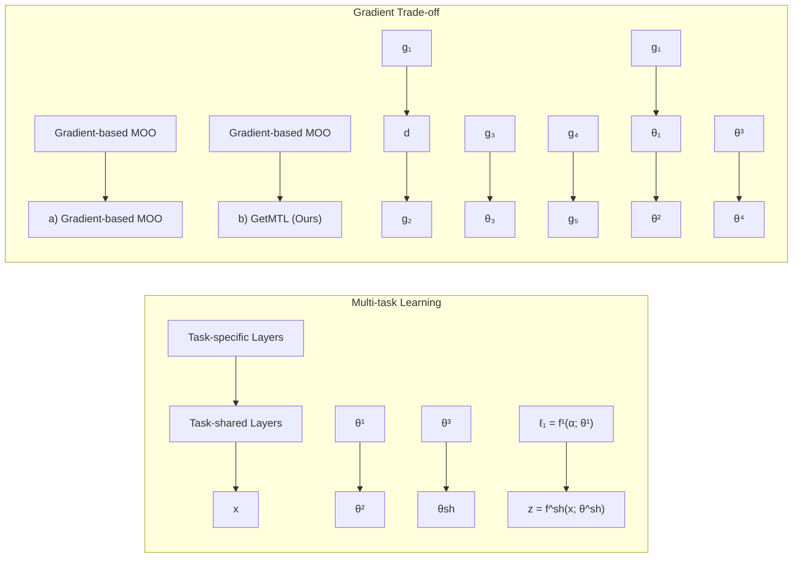

# Improving Gradient Trade-offs between Tasks in Multi-task Text Classification

Heyan Chai1, Jinhao Cui1, Ye Wang2, Min Zhang1, Binxing Fang1,3 and Qing Liao1,3∗

1 Harbin Institute of Technology, Shenzhen, China

2 National University of Defense Technology, China

3 Peng Cheng Laboratory, Shenzhen, China

{chaiheyan,cuijinhao}@stu.hit.edu.cn, ye.wang@nudt.edu.cn

zhangmin2021@hit.edu.cn, fangbx@cae.cn, liaoqing@hit.edu.cn

## Abstract

Multi-task learning (MTL) has emerged as a promising approach for sharing inductive bias across multiple tasks to enable more efficient learning in text classification. However, training all tasks simultaneously often yields degraded performance of each task than learning them independently, since different tasks might conflict with each other. Existing MTL methods for alleviating this issue is to leverage heuristics or gradient-based algorithm to achieve an arbitrary Pareto optimal trade-off among different tasks. In this paper, we present a novel gradient trade-off approach to mitigate the task conflict problem, dubbed GetMTL, which can achieve a specific tradeoff among different tasks nearby the main objective of multi-task text classification (MTC), so as to improve the performance of each task simultaneously. The results of extensive experiments on two benchmark datasets back up our theoretical analysis and validate the superiority of our proposed GetMTL.

## 1 Introduction

Multi-task Learning (MTL), which aims to learn a single model that can tackle multiple correlated but different tasks simultaneously, makes multiple tasks benefit from each other and obtain superior performance over learning each task independently (Caruana, 1997; Ruder, 2017; Liu et al., 2015; Mao et al., 2020). By discovering shared information/structure across the tasks, it has gained attention in many areas of research and industrial communities, such as computer vision (Misra et al., 2016; Gao et al., 2019; Yogamani et al., 2019; Sun et al., 2020) and text classification (Liu et al., 2017; Xiao et al., 2018; Mao et al., 2021, 2022).

However, it is observed in multi-task text classification (MTC) scenarios that some tasks could conflict with each other, which may be reflected via conflicting gradients or dominating gradients (Yu et al., 2020; Vandenhende et al., 2022), leading to the degraded performance of MTL due to poor training. How to make a proper trade-off among jointing different tasks in MTC is a difficult problem. Recently, several methods have been proposed to mitigate gradient conflicts issue via both loss balance (linear weighted scalarization) such as homoscedastic uncertainty (Kendall et al., 2018) and task variance regularization (Mao et al., 2021), and gradient balance like Pareto optimality (Sener and Koltun, 2018; Mao et al., 2020). Existing methods devote to finding an arbitrary Pareto optimality solution in the Pareto set, which achieve a single arbitrary trade-off among all tasks. However, they can only satisfy the improved performance on part of tasks, not all tasks simultaneously. This means that these methods can not converge to a minimum average loss of all objectives.

scatter

| Feature | Description |
| --- | --- |
| X-axis | Task 1 Error |
| Y-axis | Task 2 Error |
| Region | Pareto Solutions (shaded area) |
| Point 1 | Leftmost point on the curve |
| Point 2 | Rightmost point on the curve |
| Point 3 | Intermediate point on the curve |
| Point 4 | Intermediate point on the curve |
| Point 5 | Intermediate point on the curve |
| Point 6 | Intermediate point on the curve |
| Point 7 | Intermediate point on the curve |
| Point 8 | Intermediate point on the curve |
| Point 9 | Intermediate point on the curve |
| Point 10 | Intermediate point on the curve |
| Point 11 | Intermediate point on the curve |
| Point 12 | Intermediate point on the curve |
| Point 13 | Intermediate point on the curve |
| Point 14 | Intermediate point on the curve |
| Point 15 | Intermediate point on the curve |
| Point 16 | Intermediate point on the curve |
| Point 17 | Intermediate point on the curve |
| Point 18 | Intermediate point on the curve |
| Point 19 | Intermediate point on the curve |
| Point 20 | Intermediate point on the curve |
| Point 21 | Intermediate point on the curve |
| Point 22 | Intermediate point on the curve |
| Point 23 | Intermediate point on the curve |
| Point 24 | Intermediate point on the curve |
| Point 25 | Intermediate point on the curve |
| Point 26 | Intermediate point on the curve |
| Point 27 | Intermediate point on the curve |
| Point 28 | Intermediate point on the curve |
| Point 29 | Intermediate point on the curve |
| Point 30 | Intermediate point on the curve |
| Point 31 | Intermediate point on the curve |
| Point 32 | Intermediate point on the curve |
| Point 33 | Intermediate point on the curve |
| Point 34 | Intermediate point on the curve |
| Point 35 | Intermediate point on the curve |
| Point 36 | Intermediate point on the curve |
| Point 37 | Intermediate point on the curve |
| Point 38 | Intermediate point on the curve |
| Point 39 | Intermediate point on the curve |
| Point 40 | Intermediate point on the curve |
| Point 41 | Intermediate point on the curve |
| Point 42 | Intermediate point on the curve |
| Point 43 | Intermediate point on the curve |
| Point 44 | Intermediate point on the curve |
| Point 45 | Intermediate point on the curve |
| Point 46 | Intermediate point on the curve |
| Point 47 | Intermediate point on the curve |
| Point 48 | Intermediate point on the curve |
| Point 49 | Intermediate point on the curve |
| Point 50 | Intermediate point on the curve |

(a) Pareto Optimality

scatter

| Series | Description |
| --- | --- |
| Grey Area | Pareto Front (shaded region) |
| Blue Dashed Line | Average Loss (dashed line) |
| Red Dotted Lines | Our Solutions (red dots) |

(b) GetMTL (Ours)  
Figure 1: Graphical interpretation of existing Pareto multi-task learning methods for a two-task learning problem. (a) Pareto optimal solutions are arbitrary and uncontrollable. (b) Our GetMTL can find the specific solutions nearby the main objective (Average loss).

To illustrate our idea, we give a two-task learning example shown in Figure 1. As shown in Figure (1a), it is observed that Pareto optimality-based methods can generate a set of Pareto solutions for a given two-task learning problem. However, some of Pareto solutions can increase the task 1 error while decreasing task 2 error, leading to unsatisfactory overall performance for MTL model. This implies that not all Pareto solutions always satisfy the goal of mitigating the tasks conflicts in MTL, and thus failing to achieve a better trade-off between tasks. Therefore, it is necessary to find a specific trade-off between tasks that is beyond what only using Pareto optimality can achieve.

To address this issue, inspired by multi-objective optimization (Sener and Koltun, 2018), we argue that a more efficient way to mitigate task conflicts is to find a gradient trade-off between tasks in the neighborhood of the average loss rather than exhaustively searching for a proper solution from the set of Pareto solutions. As shown in Figure 1b, the Pareto solutions nearby the average loss can achieve a better trade-off between task 1 and task 2, leading to better performance on both tasks at the same time. Based on it, in this paper, we propose a novel gradient trade-off multi-task learning approach, named GetMTL, to mitigate task conflicts in multi-task text classification. Specifically, the gradients of each task are utilized to derive an update vector that can minimize the conflicts among task gradients in the neighborhood of the average gradient, so as to achieve a better trade-off performance among joint training tasks. In summary, the main contributions of our work are as follows:

• A novel multi-task learning approach based on gradient trade-off between different tasks (GetMTL) is proposed to deal with task conflict in multi-task text classification problems, so as to improve the performance of all tasks simultaneously.  
• We give in-depth theoretical proofs and experimental analyses on establishing converge guarantees of our GetMTL.  
• We extensively verify the effectiveness of our GetMTL on two real-world text classification datasets, and the results show that our GetMTL performs competitively with a variety of state-of-the-art methods under a different number of task sets.

## 2 Related Works

Multi-task Learning methods jointly minimize all task losses based on either loss balance methods (Kendall et al., 2018; Chen et al., 2018; Mao et al., 2021, 2022) or gradient balance methods (Sener and Koltun, 2018; Mao et al., 2020). The loss balance methods adaptively adjust the tasks weights during training based on various heuristic approaches, such as task uncertainty quantification (Kendall et al., 2018), gradient normalization (Chen et al., 2018), task difficulty prioritization (Guo et al., 2018), dynamic weight average (Liu et al., 2019), random loss weighting (Lin et al., 2021), task variance regularization (Mao et al., 2021), and meta learning-based approach (Mao et al., 2022). These methods are mostly heuristic and can have unstable performance while ignoring the task conflicts among all tasks, leading to the bad generalization performance of MTL models.

Recently, some gradient balance based methods have been proposed to mitigate task conflicts for improving task performance. For example, Désidéri (2012) leverages multiple-gradient descent algorithm (MGDA) to optimize multiple objectives. Due to the guarantee of convergence to Pareto stationary point, this is an appealing approach. Sener and Koltun (2018) cast the multi-objective problem as a multi-task problem and devote to finding an arbitrary Pareto optimal solution. Mao et al. (2020) propose a novel MTL method based Tchebycheff procedure for achieving Pareto optimal without any convex assumption. However, these methods only consider achieving an arbitrary Pareto optimal solution while it is not the main objective. Unlike these methods, we propose an MTL approach based on multi-objective optimization and seek to find a set of solutions that are Pareto optimality and nearby the main MTC objective $\mathcal { L } _ { 0 }$

## 3 Preliminaries

Consider a multi-task learning problem with $T ^ { 1 }$ tasks over an input space and a collection of task spaces $\{ { \mathcal { V } } ^ { t } \} _ { t \in [ T ] } .$ , where each task contains a set of i.i.d. training samples $\mathcal { D } _ { t } = \{ x _ { i } , y _ { i } ^ { t } \} _ { i \in [ n _ { t } ] } ,$ $T$ is the number of tasks, and $n _ { t }$ is the number of training samples of task t. The goal of MTL is to find parameters $\{ \theta ^ { s h } , \theta ^ { 1 } , . . . , \theta ^ { \bar { T } } \}$ of a model $\mathcal { F }$ that can achieve high average performance across all training tasks over $\mathcal { X }$ , defined as $\mathcal { F } ( \mathcal { X } , \theta ^ { s h } , \cdot \cdot \cdot , \theta ^ { t } ) : \mathcal { X }  \mathcal { Y }$ , where $\theta ^ { s h }$ denotes the parameters shared between tasks and $\theta ^ { t }$ denotes the task-specific parameters of task t. In particular, we further consider a parametric taskspecific map as $f ^ { t } ( \cdot , \theta ^ { s h } , \theta ^ { t } ) : \mathcal { X } \to \mathcal { y } ^ { t }$ . We also consider task-specific loss functions $\ell _ { t } ( \cdot , \cdot )$ $\mathcal { V } ^ { t } \times \mathcal { V } ^ { t }  \mathbb { R } ^ { + }$ . We also denote the multi-task loss as $\begin{array} { r } { \mathcal { L } ( \boldsymbol { \theta } ) = \sum _ { i } ^ { T } \ell _ { i } ( \boldsymbol { \theta } ) } \end{array}$ , and the gradients of each task as $g _ { i } = \nabla \ell _ { i } ( \theta )$ for the particular $\theta .$ In this paper, we choose the average loss as main objective of MTC problem, defined as $\begin{array} { r } { \mathcal { L } _ { 0 } ( \theta ) = \frac { 1 } { T } \sum _ { i } ^ { T } \ell _ { i } ( \theta ) } \end{array}$

## 3.1 MTL as Multi-objective Optimization

MTL can be formulated as a specific case of multiple-objective optimization (MOO), which optimizes a set of potentially conflicting objectives (Sener and Koltun, 2018; Mao et al., 2020). Given objective functions of $T$ tasks, $\ell _ { 1 } , \ldots , \ell _ { T }$ we formulate the optimization objective of MTL as the vectors of objective values :

$$
\min _ {\theta^ {s h}, \theta^ {1}, \dots , \theta^ {T}} \left(\ell (\theta^ {s h}, \theta^ {1}), \dots , \ell (\theta^ {s h}, \theta^ {T})\right) \tag {1}
$$

Since there is no natural linear ordering on vectors, it is not possible to compare solutions and thus no single solution can optimize all objectives simultaneously. In other words, there is no clear optimal value. Alternatively, we can achieve Pareto optimality to obtain different optimal trade-offs among all objectives to solve MOO problem.

Definition 1 (Pareto dominance). Given two points $\{ \theta , { \overline { { \theta } } } \}$ in Ω, a point θ Pareto dominates $\overline { { \theta } } \left( \theta \preccurlyeq \overline { { \theta } } \right)$ for MTL iftwo conditions are satisfied:

(i) No one strictly prefers θ to θ, that is, $\forall i \in$ $\{ 1 , \dots , T \} , \ell _ { i } ( \theta ^ { s h } , \theta ^ { i } ) \le \ell _ { i } ( \overline { { \theta } } ^ { s h } , \overline { { \theta } } ^ { i } )$  
(ii) At least one point strictly prefers θ to ${ \overline { { \theta } } } ,$ , that $i s , \exists j \in \{ 1 , . . . , T \} , \ell _ { j } ( \theta ^ { s h } , \theta ^ { j } ) < \ell _ { j } ( \overline { { \theta } } ^ { s h } , \overline { { \theta } } ^ { j } )$

Definition 2 (Pareto optimality). $\theta ^ { * }$ is a Pareto optimal point and $\ell ( \theta ^ { * } )$ is a Pareto optimal objective vector if it does not exist $\hat { \theta } \in \Omega$ such that $\hat { \theta } \preccurlyeq \theta ^ { * }$ That is, a solution that is not dominated by any other is called Pareto optimal.

The set of all Pareto optimal solutions is called the Pareto set, and the image of Pareto set in the loss space is called Pareto front (Lin et al., 2019). In this paper, we focus on gradient-based multiobjective optimization to achieve an appropriate Pareto trade-off among all tasks, which can approximate the Pareto front that minimizes the average loss.

## 3.2 Gradient-based Multi-Objective Optimization

Gradient-based MOO (Sener and Koltun, 2018) aims to find a direction d that we can iteratively find the next solution $\theta ^ { ( t + 1 ) }$ that dominates the previous one $\theta ^ { ( t ) } ( \ell ( \theta ^ { ( t + 1 ) } ) \leq \ell ( \theta ^ { ( t ) } ) )$ ) by moving against d with step size $\eta ,$ i.e. $\theta ^ { ( t + 1 ) } = \theta ^ { ( t ) } - \eta d .$ Désidéri (2012); Sener and Koltun (2018) propose to use multiple gradient descent algorithm (MGDA) that converges to a local Pareto optimal by iteratively using the descent direction $d ,$ which can be obtained as follows:

$$
d ^ {*} = \arg \min _ {d \in \mathbb {R} ^ {m}, \alpha \in \mathbb {R}} \alpha + \frac {1}{2} \| d \| ^ {2} \tag {2}
$$

$$
s. t. \nabla \ell_ {i} (\boldsymbol {\theta} ^ {(t)}) ^ {\mathsf {T}} d \leq \alpha , i = 1, \dots , T.
$$

where $d ^ { * }$ is the direction that can improve all tasks. Essentially, gradient-based MOO methods minimize the loss by combining gradients with adaptive weights, and obtaining an arbitrary Pareto optimality solution, ignoring the true objective (the average loss) (Liu et al., 2021). In this paper, we generalize this method and propose a novel gradient-based approach to achieve a gradient trade-off among tasks for mitigating task conflicts, as well as constrain the solution that can minimize the average loss $( { \mathcal { L } } _ { 0 } ( \theta ) )$ .

## 4 Gradient Trade-offs for Multi-task Text Classification

Following most MTL methods, as shown in Figure 2, we employ the hard parameter sharing MTL architecture, which includes $f ^ { s h }$ parameterized by heavy-weight task-shared parameters $\theta ^ { s h }$ and $f ^ { t }$ parameterized by light-weight task-specific parameters $\theta ^ { t }$ . All tasks take the same shared intermediate feature $z = f ^ { s h } ( x ; \theta ^ { s h } )$ as input, and the t-th taskspecific network outputs the prediction as $f ^ { t } ( z ; \theta ^ { t } )$ Since task-shared parameters $\theta ^ { s h }$ are shared by all tasks, the different tasks may conflict with each other, leading to the degraded performance of MTL model. In this paper, we hypothesize that one of the main reasons for task conflicts arises from gradients from different tasks competing with each other in a way that is detrimental to making progress. We propose a novel gradient-based MOO optimization to find a gradient trade-off among tasks in the neighborhood of the average loss, so as to mitigate task conflicts. Note that, we omit the subscript sh of task-shared parameters $\theta ^ { s h }$ for the ease of notation.

## 4.1 GetMTL

Given a task i, we define its gradient as $\begin{array} { r l } { g _ { i } } & { { } = } \end{array}$ $\nabla \ell _ { i } ( \theta )$ via back-propagation from the raw loss $\ell _ { i } .$ and $g _ { i }$ represents the optimal update direction for task i. However, due to the inconsistency of the optimal update direction of task-shared parameters for each task, different task gradients may conflict with each other, leading to the training of networks being stuck in the over-training of some tasks and the under-training of other tasks. Intuitively, it is desirable to find a direction that can minimize the task conflicts among different tasks as well as achieve Pareto optimality to improve the performance of MTL model.

flowchart

Figure 2: Overview of GetMTL. $L e f t .$ . The left part of the figure is our MTL architecture. $R i g h t .$ We show the update direction (red) d obtained by gradient-based MOO method and our GetMTL on three gradients $( g _ { 1 }$ $g _ { 2 }$ and $g _ { 3 } )$ in $\mathbb { R } ^ { 3 }$ , where $g _ { i }$ denotes the gradient (black) of i-th task, $g _ { 0 }$ is the average gradient, and blue arrows denote the projections of update direction to each task gradient.

We first achieve an arbitrary Pareto optimal via finding a descent direction $d _ { d e s }$ by searching for a minimum-norm point in the Convex Hull of gradients, defined by,

$$
\mathcal {C H} := \{G \beta \mid \beta \in \mathcal {S} ^ {T} \}, \tag {3}
$$

$$
\text {s.t.} \mathcal {S} ^ {T} = \left\{\beta \in \mathbb {R} _ {+} ^ {T} \mid \sum_ {j = 1} ^ {T} \beta_ {j} = 1 \right\} \tag {4}
$$

where $G \in \mathbb { R } ^ { T \times m } = \{ g _ { 1 } , . . . , g _ { T } \}$ is the matrix of task gradient, $S ^ { T }$ is the T-dimensional regular simplex. We use the multiple gradient descent algorithm (MGDA) (Sener and Koltun, 2018) to obtain an arbitrary Pareto optimal by iteratively using the descent direction, defined by,

$$
d _ {d e s} = \arg \min _ {d \in \mathcal {C H}} \| d \| _ {2} ^ {2} \tag {5}
$$

In addition, the $d _ { d e s }$ can be reformulated as a linear combination of all task gradients, defined by,

$$
d _ {d e s} = \sum_ {i = 1} ^ {T} \beta_ {i} g _ {i} \tag {6}
$$

where $g _ { i } = \nabla \ell _ { i } ( \theta )$ is the i-th task gradient. It implies that, when converges to an arbitrary Pareto optimal, the optimal gradient value of each task via back-propagation is $\beta _ { i } g _ { i }$ , defined as $g _ { \beta _ { i } } = \beta _ { i } g _ { i }$

However, moving against $d _ { d e } ,$ does not guarantee that the solution meets the requirements of multi-task text classification task (MTC), that is, to alleviate the gradient conflict among tasks in MTC, so as to improve the performance of all tasks. To address this issue, we seek a direction that enables us to move from a solution $\theta ^ { ( t ) }$ to $\theta ^ { ( t + 1 ) }$ such that both $\theta ^ { ( t + 1 ) }$ dominates $\theta ^ { ( t ) } \left( \mathcal { L } ( \theta ^ { ( t + 1 ) } ) \leq \mathcal { L } ( \theta ^ { ( t ) } ) \right)$ and alleviate the gradient conflict among all tasks. Based on it, as shown in Figure 2(b), we propose to search for an update direction d in the Convex Hull $\mathcal { C } \mathcal { H } _ { \beta }$ of back-propagation gradients such that it can improve any worst objective and converge to an optimum of MTC objective ${ \mathcal { L } } _ { 0 } ( \theta )$ . We first find the worst task gradient with respect to the update direction $d ,$ that is, it has a maximum angle with $d ,$ which can be formulated via the following optimization problem,

$$
\min _ {i} \langle g _ {\beta_ {i}}, d \rangle , s. t. - g _ {\beta_ {i}} ^ {\mathsf {T}} d \leq 0, i = 1,..., T \tag {7}
$$

where $g _ { \beta _ { i } }$ is the i-task gradient after optimizing by MGDA algorithm.

To improve the worst gradient of any task and achieve a trade-off between all task gradients in a neighborhood of the average gradient (defined as $\begin{array} { r } { g _ { 0 } = \frac { 1 } { T } \sum _ { i = 1 } ^ { T } g _ { i } ) } \end{array}$ , we formulate this gradient trade-off optimization problem via the following Maximin Optimization Problem (dual problem).

## Problem 1.

$$
\begin{array}{l} \max _ {d \in \mathbb {R} ^ {m}} \min _ {i \in [ T ]} \langle g _ {\beta_ {i}}, d \rangle \\ \text {s.t.} \| d - g _ {0} \| \leq \varepsilon g _ {0} ^ {\mathsf {T}} d, \tag {8} \\ - g _ {0} ^ {\mathsf {T}} d \leq 0 \\ \end{array}
$$

where $g _ { \beta _ { i } } = \beta _ { i } g _ { i }$ is the back-propagation gradient value of i-th task via solving Eq. $( 5 ) , \varepsilon \in ( 0 , 1 ]$ is a hyper-parameter that controls the stability of MTC model.

## 4.2 Solving Maximin Problem

Since the optimal direction d can also be defined in the convex hull $\mathcal { C } \mathcal { H } _ { \beta }$ of $g _ { \beta _ { i } }$ , we can get

$$
\mathcal {C H} _ {\beta} := \{G _ {\beta} \boldsymbol {w} \mid \boldsymbol {w} \in \mathcal {W} ^ {T} \}, \tag {9}
$$

where $G _ { \beta } \in \mathbb { R } ^ { T \times m } = \{ g _ { 1 } , . . . , g _ { \beta _ { T } } \}$ is task gradient matrix, $\begin{array} { r } { \mathcal { W } ^ { T } = \{ \pmb { w } \in \mathbb { R } _ { + } ^ { T } \ \vert \ \sum _ { i = 1 } ^ { T } w _ { j } = 1 \} } \end{array}$ is the T-dimensional probability simplex, and ${ \pmb w } =$ $( w _ { 1 } , . . . , w _ { T } )$ . Therefore, we can get min $\langle g _ { \beta _ { i } } , d \rangle =$ $\begin{array} { r } { \operatorname* { m i n } _ { w \in \mathcal { W } ^ { T } } \langle \sum _ { i } w _ { i } g _ { \beta _ { i } } , d \rangle } \end{array}$ and Problem 1 can be transformed into the following form.

## Algorithm 1: GetMTL Algorithm.

Input: The number of task T, loss functions $\{ \ell _ { i } \} _ { i = 1 } ^ { T }$ , network parameters $\theta ^ { ( t ) }$ at t step, the pre-specified hyper-parameter $\varepsilon \in ( 0 , 1 ]$ and step size $\mu \in \mathbb { R } ^ { + }$

1: Task Gradients: $g _ { i } = \nabla \ell _ { i } ( \theta ^ { ( t ) } ) , i \in [ T ]$  
2: Main Objective: $\begin{array} { r } { g _ { 0 } = \sum _ { i = 1 } ^ { T } g _ { i } } \end{array}$  
3: Obtain $\{ \beta _ { 1 } , . . . \beta _ { T } \}$ by solving Eq.(5).  
4: Compute $\begin{array} { r } { g _ { w } = \sum _ { i } w _ { i } g _ { \beta _ { i } } } \end{array}$ , where $g _ { \beta _ { i } } = \beta _ { i } g _ { i }$  
5: Obtain $\{ w _ { 1 } , . . . , w _ { T } \}$ by solving Eq.(14)  
6: Find direction $d ^ { * }$ by using Eq.(13)

Output: $\theta ^ { ( t + 1 ) }$

$$
\theta^ {(t)} - \mu \left(\frac {g _ {0}}{1 - \varepsilon^ {2} \| g _ {0} \| ^ {2}} + \frac {\varepsilon \| g _ {0} \| ^ {2} g _ {w}}{(1 - \varepsilon^ {2} \| g _ {0} \| ^ {2}) \| g _ {w} \|}\right).
$$

## Problem 2.

$$
\max _ {d \in \mathbb {R} ^ {m}} \min _ {w \in \mathcal {W} ^ {T}} \left\langle g _ {w}, d \right\rangle \tag {10}
$$

$$
\text {s.t.} \| d - g _ {0} \| \leq \varepsilon g _ {0} ^ {\mathsf {T}} d,
$$

where $\begin{array} { r } { g _ { w } = \sum _ { i = 1 } ^ { T } w _ { i } g _ { \beta _ { i } } } \end{array}$ is the convex combination in $\mathcal { C } \mathcal { H } _ { \beta }$ . For a given vector $\lambda \in \mathbb { R } ^ { + }$ with non-negative components, the corresponding $L a \mathbf { \cdot }$ grangian associated with the Eq.(10) is defined as

$$
\max _ {d \in \mathbb {R} ^ {m}} \min _ {\lambda , w \in \mathcal {W} ^ {T}} g _ {w} ^ {\top} d - \lambda (\| d - g _ {0} \| ^ {2} - \varepsilon^ {2} (g _ {0} ^ {\top} d) ^ {2}) / 2 \tag {11}
$$

Since the objective for d is concave with linear constraints and $w \in \mathcal { W } ^ { T }$ is a compact set 2, according to the Sion’s minimax theorem (Kindler, 2005), we can switch the max and min without changing the solution of Problem 2. Formally,

$$
\min _ {\lambda , w \in \mathcal {W} ^ {T}} \max _ {d \in \mathbb {R} ^ {m}} g _ {w} ^ {\top} d - \lambda \| d - g _ {0} \| ^ {2} / 2 + \lambda \varepsilon^ {2} (g _ {0} ^ {\top} d) ^ {2} / 2 \tag {12}
$$

We get the optimal solution of primal problem (Problem 1) by solving the dual problem of Eq.(12) (See the Appendix A for a detailed derivation procedure). Then we have

$$
d ^ {*} = \frac {g _ {w} + \lambda^ {*} g _ {0}}{(1 - \varepsilon^ {2} g _ {0} ^ {2}) \lambda^ {*}}, \text {where} \quad \lambda^ {*} = \frac {\| g _ {w} \|}{\varepsilon \| g _ {0} \| ^ {2}} \tag {13}
$$

where $\lambda ^ { * }$ is the optimal Lagrange multiplier, $d ^ { * }$ is the optimal update direction of MTC model. We can reformulate the problem of Eq.(12) as following optimization problem w.r.t. w.

$$
\min _ {w \in \mathcal {W} ^ {T}} \mathcal {J} (w) = \frac {g _ {0} ^ {\top} g _ {w} + \varepsilon \| g _ {0} \| ^ {2} \| g _ {w} \|}{1 - \varepsilon^ {2} \| g _ {0} \| ^ {2}} \tag {14}
$$

<table><tr><td>TASKS</td><td>NEWSGROUPS</td></tr><tr><td>COMP</td><td>GRAPHICS, OS.MS-WINDOWS.MISC, SYS.MAC.HARDWARE, WINDOWS.X</td></tr><tr><td>REC</td><td>AUTOS, SPORT.BASEBALL, MOTORCYCLES, SPORT.HOCKEY</td></tr><tr><td>SCI</td><td>CRYPT, SPACE, MED, ELECTRONICS</td></tr><tr><td>TALK</td><td>POLITICS.MISC, POLITICS.GUNS, POLITICS.MIDEAST, RELIGION.MISC</td></tr></table>

Table 1: Tasks of topic classification dataset.

where $g _ { w }$ is defined as $\begin{array} { r } { g _ { w } \ = \ \sum _ { i = 1 } ^ { T } w _ { i } g _ { \beta _ { i } } } \end{array}$ . The detailed derivation is provided in Appendix A. Algorithm 1 shows all the steps of GetMTL algorithm in each iteration.

## 4.3 Theoretical Analysis

In this section, we analyze the equivalence of solutions to dual problem and then give a theoretical analysis about convergence of GetMTL algorithm. We define the Lagrangian of problem in Eq.(10),

$$
L (d, \lambda , w) = g _ {w} ^ {\mathsf {T}} d - \frac {\lambda}{2} (\| d - g _ {0} \| ^ {2} - \varepsilon^ {2} (g _ {0} ^ {\mathsf {T}} d) ^ {2})
$$

Theorem 4.1 (Equivalence of Optimal Value of Dual Problem). Assume that both primal problem and dual problem have optimal values, let $\begin{array} { r l r } { p ^ { * } } & { { } = } & { \operatorname* { m a x } _ { d } \operatorname* { m i n } _ { \lambda , w } L ( d , \lambda , w ) } \end{array}$ and q∗ min max L(d, λ, w). Then, p∗ = maxd min $\begin{array} { r l } { \mathbf { \Sigma } _ { \lambda , w } L ( d , \lambda , w ) } & { { } \leq } \end{array}$ min $_ { \cdot \lambda , w } \operatorname* { m a x } _ { d } L ( d , \lambda , w ) = q ^ { * }$

Proof. The proof is provided in Appendix B.

Theorem 4.2 (Convergence of GetMTL). Assume loss functions $\ell _ { i }$ are convex and differential, and $\nabla \ell _ { i } ( \theta ^ { ( t ) } )$ is L-lipschitz continuous with $L > 0 .$ . The update rule is ${ \bf \widehat { \boldsymbol { \theta } } } ^ { ( t + 1 ) } = \boldsymbol { \theta } ^ { ( t ) } - \boldsymbol { \mu } ^ { ( t ) } \boldsymbol { d } ,$ where d is defined in Eq.(13) and $\begin{array} { r } { \mu ^ { ( t ) } = \operatorname* { m i n } _ { i \in [ k ] } \frac { \| d - g _ { 0 } \| } { c \cdot L \cdot d ^ { 2 } } } \end{array}$ . All the lossfunctions $\big ( \ell _ { 1 } ( \theta ^ { ( t ) } ) \cdot \cdot \cdot \ell _ { T } ( \theta ^ { ( t ) } ) \big )$ converges to $( \ell _ { 1 } ( \theta ^ { * } ) \cdot \cdot \cdot \ell _ { T } ( \dot { \theta ^ { * } } ) )$ .

Proof. The proof is provided in Appendix C.

## 5 Experimental Setup

## 5.1 Experimental Datasets

We conduct experiments on two MTC benchmarks to evaluate the proposed GetMTL. 1) Amazon Review dataset (Blitzer et al., 2007) contains product reviews from 14 domains (See Details in Appendix D), including apparel, video, books, electronics, DVDs and so on. Each domain gives rise to a binary classification task and we follow Mao et al.

  
Figure 3: Experimental results on Amazon Review dataset. We plot the classification accuracy of all baselines for all 14 tasks and average performance. Each colored cluster illustrates the classification accuracy performance of a method over 10 runs.

  
Figure 4: Experimental results on topic classification dataset. We plot classification accuracy of all baselines for all 14 tasks and avg\_acc. Each colored cluster illustrates classification accuracy of a method over 10 runs.

(2021) to treat 14 domains in the dataset as distinct tasks, creating a dataset with 14 tasks, with 22180 training instances and 5600 test instances in total. 2) Topic classification dataset, 20 Newsgroup3, consists of approximately 20,000 newsgroup documents, partitioned evenly across 20 different newsgroups. We follow Mao et al. (2021) to select 16 newsgroups from 20 Newsgroup dataset shown in Table 1 and then divide them into four groups. Each group gives rise to a 4-way classification task, creating a dataset with four 4-way classification tasks, which is a more challenging dataset than amazon review dataset.

## 5.2 Experimental Implementation

We follow the standard MTC setting and adopt the same network architectures with the most recent baselines for fair comparisons (Mao et al., 2021). We adopt the hard parameter sharing MTL framework shown in Figure 2, where task-shared network is a TextCNN with kernel size of 3,5,7 and taskspecific network is a fully connected layer with a softmax function. Adam is utilized as the optimizer to train the model over 3000 epochs with a learning rate of 1e-3 for both sentiment analysis and topic classification. We set the batch size to 256.

  
Figure 5: Learning curve of comparison methods in both amazon review and topic classification datasets.

  
Figure 6: Evolution of task variance during training of baseline methods and GetMTL on the amazon review and topic classification datasets.

## 5.3 Comparison Models

We compare the proposed GetMTL with a series of MTC baselines, including

Single-Task Learning (STL): learning each task independently.

Uniform Scaling: learning tasks simultaneously with uniform task weights.

Uncertainty: using the uncertainty weighting method (Kendall et al., 2018).

GradNorm: learning tasks simultaneously with gradient normalization method (Chen et al., 2018).

TchebycheffAdv: using adversarial Tchebycheff procedure (Mao et al., 2020).

MGDA: using gradient-based multi-objective optimization method (Sener and Koltun, 2018).

BanditMTL: learning tasks simultaneously with multi-armed bandit method (Mao et al., 2021).

MetaWeighting: using adaptive task weighting method (Mao et al., 2022).

## 6 Experimental Results

## 6.1 Main Results

The main comparison results of GetMTL on two benchmark datasets are shown in Figure 3 and 4. It is clear that (See detailed numerical comparison results in Appendix D), our proposed GetMTL model performs consistently better than the all comparison methods on all tasks of both amazon review and topic classification datasets, and its average performance is superior to that of all baselines. This verifies the effectiveness of our GetMTL method in MTC problem. More concretely, in comparison with the gradient-based MOO optimization model (MGDA), our GetMTL achieves significant improvement across all datasets. This indicates that achieving a gradient trade-off nearby average loss to mitigate task conflicts can better improve all task performance and generalization ability of MTC model.

  
Figure 7: Task weights of comparison methods on four tasks (including comp, rec, sci, and talk tasks) in topic classification dataset. Task weights obtained from MGDA, BanditMTL and GetMTL throughout the optimization process. For better visualization, we plot points every 30 epochs.

line

| \(\epsilon\) | Value (%) |
| --- | --- |
| 0.0025 | ~91.92 |
| 0.005 | ~91.87 |
| 0.0075 | ~92.35 |
| 0.01 | ~91.86 |
| 0.015 | ~91.74 |
| 0.02 | ~92.17 |
| 0.025 | ~92.02 |
| 0.03 | ~92.23 |
| 0.04 | ~91.99 |
| 0.05 | ~91.96 |
| 0.1 | ~91.83 |

(a) Amazon review dataset.

line

| \(\epsilon\) | Sentiment (%) |
| --- | --- |
| 0.0025 | ~89.77 |
| 0.005 | ~89.79 |
| 0.01 | ~89.46 |
| 0.015 | ~89.97 |
| 0.02 | ~89.73 |
| 0.025 | ~89.70 |
| 0.03 | ~89.99 |
| 0.04 | ~89.55 |
| 0.05 | ~89.44 |
| 0.1 | ~89.47 |
| 0.1 | ~89.41 |

(b) Topic classification datset.  
Figure 8: Impact of different values of ε.

## 6.2 Empirical Analysis on Convergence

In Section 4.3, we theoretically prove the convergence of our proposed GetMTL. Furthermore, we conduct extensive experiments about the convergence to better demonstrate the advantages of GetMTL shown in Figure 5. It is clear that the learning curve of GetMTL is constantly decreasing as the number of iterations increases and converges to the lowest loss value compared with other baselines. It indicates that GetMTL can guarantee the convergence of the objective value and obtain better performance of all learning tasks.

In addition, we also conduct extensive experiments to investigate how GetMTL mitigates task conflict during training. We plot the task variance (variance between the task-specific losses) of all baselines on both amazon review and topic classification datasets shown in Figure 6. It can be observed that all MTL baselines have lower task variance than STL method, which illustrates that MTL methods can indeed boost the learning of all tasks compared with STL method. Moreover, GetMTL has the lowest task variance and smoother evolution during training than other MTL baselines. This implies that our proposed GetMTL indeed mitigates task conflicts compared with other MTL methods.

## 6.3 The Evolution of Task Weight w

In this section, we visualize the task weights of our GetMTL and two weight adaptive MTL methods (MGDA and BanditMTL) throughout the training process using the topic classification dataset shown in Figure 7. It can be observed from these four figures that the weight adaption process of our GetMTL is different from that of MGDA and BanditMTL. GetMTL can automatically learn the task weights without pre-defined heuristic constraints. The weights adaption process of GetMTL is more stable and the search space is more compact compared with other MTL baselines.

## 6.4 Impact of the Values of ε

To investigate the impact of using different values of ε on the performance of our GetMTL, we conduct experiments on two datasets, and the results are shown in Figure 8. Noting that model with $\varepsilon = 0 . 0 0 7 5$ and $\varepsilon = 0 . 0 2 5$ perform overall better than other values on these two datasets, respectively. The model with larger value of ε performs unsatisfactorily overall all tasks on two datasets, one possible reason is that larger ε makes d pull far away from the average loss $g _ { 0 }$ (see the conditions in Eq. (9)). That is, Pareto optimality found by GetMTL is getting further and further away from MTC objective $\mathcal { L } _ { 0 }$ , which can be quite detrimental to some tasks’ performance, leading to degraded average performance.

## 7 Conclusion

In this paper, we propose a novel gradient tradeoff multi-task learning approach to mitigate the task conflict problem, which can achieve a specific trade-off among different tasks nearby the main objective of multi-task text classification problem. Moreover, we present a series of theoretical proofs to illustrate the effectiveness and superiority of our GetMTL. Experimental results on two benchmark datasets show that our GetMTL achieves state-ofthe-art performance in Multi-task Text Classification problem.

## Limitations

Our GetMTL needs to compute the $g _ { i }$ for each task i at each iteration and requires a backwardpropagation procedure over the model parameters. Every iteration requires one forward-propagation followed by $T$ backward-propagation procedure and computation of backward-propagation is typically more expensive than the forward-propagation. Here, we define the time of one forward pass and one backward pass as $E _ { f }$ and $E _ { b } ,$ , respectively. The time of optimization process is defined as $E _ { o }$ Therefore, the total time $E$ of GetMTL is defined,

$$
\begin{array}{l} E = E _ {f} + T E _ {b} + E _ {o} \\ \approx T E _ {b} + E _ {o} \\ \end{array}
$$

For few-task learning scenario $( T < 1 0 0 )$ , usually $E _ { o } \ll E _ { b }$ and GetMTL still works fine. However, for large-scale task set (like $T \gg 1 0 0 )$ , usually $E _ { o } \gg E _ { b }$ or $E _ { o } \gg T E _ { b }$ . Consequently, our GetMTL may get stuck in the optimization and backward-propagation process at each iteration. Therefore, the major limitation of our work is that it can not be applied to scenarios with large-scale task sets.

## Acknowledgements

This work was supported by the National Natural Science Foundation of China (No. 62076079), Guangdong Major Project of Basic and Applied Basic Research (No.2019B030302002), The Major Key Project of PCL(Grant No.PCL2022A03), and Guangdong Provincial Key Laboratory of Novel Security Intelligence Technologies (2022B1212010005).

## References

Dimitri P Bertsekas. 1997. Nonlinear programming. Journal of the Operational Research Society, 48(3):334–334.  
John Blitzer, Mark Dredze, and Fernando Pereira. 2007. Biographies, bollywood, boom-boxes and blenders: Domain adaptation for sentiment classification. In Proceedings ofthe 45th Annual Meeting ofthe Association for Computational Linguistics,. The Association for Computational Linguistics.  
Rich Caruana. 1997. Multitask learning. Machine learning, 28(1):41–75.  
Zhao Chen, Vijay Badrinarayanan, Chen-Yu Lee, and Andrew Rabinovich. 2018. Gradnorm: Gradient normalization for adaptive loss balancing in deep multitask networks. In Proceedings ofthe 35th International Conference on Machine Learning, ICML, volume 80 of Proceedings ofMachine Learning Research, pages 793–802. PMLR.  
Jean-Antoine Désidéri. 2012. Multiple-gradient descent algorithm (mgda) for multiobjective optimization. Comptes Rendus Mathematique, 350(5- 6):313–318.  
Yuan Gao, Jiayi Ma, Mingbo Zhao, Wei Liu, and Alan L. Yuille. 2019. NDDR-CNN: layerwise feature fusing in multi-task cnns by neural discriminative dimensionality reduction. In IEEE Conference on Computer Vision and Pattern Recognition, CVPR, pages 3205–3214.  
Michelle Guo, Albert Haque, De-An Huang, Serena Yeung, and Li Fei-Fei. 2018. Dynamic task prioritization for multitask learning. In Proceedings ofthe European conference on computer vision (ECCV), volume 11220 of Lecture Notes in Computer Science, pages 282–299. Springer.  
Alex Kendall, Yarin Gal, and Roberto Cipolla. 2018. Multi-task learning using uncertainty to weigh losses for scene geometry and semantics. In IEEE Conference on Computer Vision and Pattern Recognition, CVPR, pages 7482–7491. Computer Vision Foundation / IEEE Computer Society.  
Jürgen Kindler. 2005. A simple proof of sion’s minimax theorem. The American Mathematical Monthly, 112(4):356–358.  
Baijiong Lin, Feiyang Ye, and Yu Zhang. 2021. A closer look at loss weighting in multi-task learning. CoRR, abs/2111.10603.  
Xi Lin, Hui-Ling Zhen, Zhenhua Li, Qingfu Zhang, and Sam Kwong. 2019. Pareto multi-task learning. In Advances in Neural Information Processing Systems 32: Annual Conference on Neural Information Processing Systems, NeurIPS, pages 12037–12047.  
Bo Liu, Xingchao Liu, Xiaojie Jin, Peter Stone, and Qiang Liu. 2021. Conflict-averse gradient descent for multi-task learning. In Advances in Neural Information Processing Systems 34: Annual Conference on Neural Information Processing Systems, NeurIPS, pages 18878–18890.  
Pengfei Liu, Xipeng Qiu, and Xuanjing Huang. 2017. Adversarial multi-task learning for text classification. In Proceedings of the 55th Annual Meeting of the Association for Computational Linguistics, pages 1–10. Association for Computational Linguistics.  
Shikun Liu, Edward Johns, and Andrew J. Davison. 2019. End-to-end multi-task learning with attention. In IEEE Conference on Computer Vision and Pattern Recognition, CVPR, pages 1871–1880. Computer Vision Foundation / IEEE.  
Xiaodong Liu, Jianfeng Gao, Xiaodong He, Li Deng, Kevin Duh, and Ye-Yi Wang. 2015. Representation learning using multi-task deep neural networks for semantic classification and information retrieval. In The 2015 Conference of the North American Chapter of the Association for Computational Linguistics: Human Language Technologies, pages 912– 921. The Association for Computational Linguistics.  
Yuren Mao, Zekai Wang, Weiwei Liu, Xuemin Lin, and Wenbin Hu. 2021. Banditmtl: Bandit-based multi-task learning for text classification. In Proceedings of the 59th Annual Meeting of the Association for Computational Linguistics and the 11th International Joint Conference on Natural Language Processing, ACL/IJCNLP, pages 5506–5516. Association for Computational Linguistics.  
Yuren Mao, Zekai Wang, Weiwei Liu, Xuemin Lin, and Pengtao Xie. 2022. Metaweighting: Learning to weight tasks in multi-task learning. In Findings of the Association for Computational Linguistics: ACL, pages 3436–3448. Association for Computational Linguistics.  
Yuren Mao, Shuang Yun, Weiwei Liu, and Bo Du. 2020. Tchebycheff procedure for multi-task text classification. In Proceedings of the 58th Annual Meeting of the Association for Computational Linguistics, ACL, pages 4217–4226. Association for Computational Linguistics.  
Ishan Misra, Abhinav Shrivastava, Abhinav Gupta, and Martial Hebert. 2016. Cross-stitch networks for multi-task learning. In IEEE Conference on Computer Vision and Pattern Recognition, CVPR, pages 3994–4003.  
Yurii Nesterov. 1998. Introductory lectures on convex programming volume i: Basic course. Lecture notes, 3(4):5.  
Sebastian Ruder. 2017. An overview of multitask learning in deep neural networks. CoRR, abs/1706.05098.  
Ozan Sener and Vladlen Koltun. 2018. Multi-task learning as multi-objective optimization. In Advances in Neural Information Processing Systems 31: Annual Conference on Neural Information Processing Systems, NeurIPS, pages 525–536.  
Ximeng Sun, Rameswar Panda, Rogério Feris, and Kate Saenko. 2020. Adashare: Learning what to share for efficient deep multi-task learning. In Advances in Neural Information Processing Systems 33: Annual Conference on Neural Information Processing Systems, NeurIPS.  
Simon Vandenhende, Stamatios Georgoulis, Wouter Van Gansbeke, Marc Proesmans, Dengxin Dai, and Luc Van Gool. 2022. Multi-task learning for dense prediction tasks: A survey. IEEE Trans. Pattern Anal. Mach. Intell., 44(7):3614–3633.  
Rachel Ward, Xiaoxia Wu, and Leon Bottou. 2020. Adagrad stepsizes: Sharp convergence over nonconvex landscapes. The Journal of Machine Learning Research, 21(1):9047–9076.  
Liqiang Xiao, Honglun Zhang, and Wenqing Chen. 2018. Gated multi-task network for text classification. In Proceedings of the 2018 Conference of the North American Chapter ofthe Associationfor Computational Linguistics: Human Language Technologies, NAACL-HLT, pages 726–731. Association for Computational Linguistics.  
Senthil Kumar Yogamani, Christian Witt, Hazem Rashed, Sanjaya Nayak, Saquib Mansoor, Padraig Varley, Xavier Perrotton, Derek O’Dea, Patrick Pérez, Ciarán Hughes, Jonathan Horgan, Ganesh Sistu, Sumanth Chennupati, Michal Uricár, Stefan Milz, Martin Simon, and Karl Amende. 2019. Woodscape: A multi-task, multi-camera fisheye dataset for autonomous driving. In IEEE/CVF International Conference on Computer Vision, ICCV, pages 9307–9317.  
Tianhe Yu, Saurabh Kumar, Abhishek Gupta, Sergey Levine, Karol Hausman, and Chelsea Finn. 2020. Gradient surgery for multi-task learning. In Advances in Neural Information Processing Systems 33: Annual Conference on Neural Information Processing Systems, NeurIPS.

## A Derivations of GetMTL Algorithm

Lemma A.1. Let d∗ be the solution of

$$
\max _ {d \in \mathbb {R} ^ {m}} \min _ {i \in [ T ]} \left\langle g _ {\beta_ {i}}, d \right\rangle , s. t. \| d - g _ {0} \| \leq \varepsilon g _ {0} ^ {\mathsf {T}} d, \tag {15}
$$

where $\varepsilon \in ( 0 , 1 ] , \ \{ g _ { i } \in \mathbb { R } ^ { m } \mid \forall i \in \{ 0 , 1 , . . . , T \} \}$ and $g _ { \beta _ { i } } = \beta _ { i } g _ { i } \in \mathbb { R } ^ { m }$ . Then we have

$$
d ^ {*} = \left(\frac {g _ {0}}{1 - \varepsilon^ {2} \| g _ {0} \| ^ {2}} + \frac {\varepsilon \| g _ {0} \| ^ {2} g _ {w ^ {*}}}{\left(1 - \varepsilon^ {2} \| g _ {0} \| ^ {2}\right) \| g _ {w ^ {*}} \|}\right), \tag {16}
$$

where $\begin{array} { r } { g _ { 0 } = \frac { 1 } { T } \sum _ { i = 1 } ^ { T } g _ { i } } \end{array}$ , and $\begin{array} { r } { g _ { w ^ { * } } = \sum _ { i = 1 } ^ { T } w _ { i } ^ { * } g _ { \beta _ { i } } } \end{array}$ The $w ^ { * }$ is the solution of

$$
m i n _ {w \in \mathcal {W} ^ {T}} \mathcal {J} (w) = \frac {g _ {0} ^ {\top} g _ {w} + \varepsilon \| g _ {0} \| ^ {2} \| g _ {w} \|}{1 - \varepsilon^ {2} \| g _ {0} \| ^ {2}}, \tag {17}
$$

where $\begin{array} { r } { \mathcal { W } ^ { T } = \{ w \in \mathbb { R } _ { + } ^ { T } \mid \sum _ { j = 1 } ^ { T } w _ { j } \ = \ 1 \} } \end{array}$ . We have,

$$
\min _ {i} g _ {i} ^ {\mathsf {T}} d ^ {*} = \frac {g _ {0} ^ {\mathsf {T}} g _ {w ^ {*}} + \varepsilon \| g _ {0} \| ^ {2} \| g _ {w ^ {*}} \|}{1 - \varepsilon^ {2} \| g _ {0} \| ^ {2}}. \tag {18}
$$

Proof. We first construct Lagrange function of the objective in Eq.(10),

$$
L (d, \lambda , w) = g _ {w} ^ {\mathsf {T}} d - \lambda (\| d - g _ {0} \| ^ {2} - \varepsilon^ {2} (g _ {0} ^ {\mathsf {T}} d) ^ {2}) / 2 \tag {19}
$$

According the Lagrange duality and Sion’s minimax theorem (Kindler, 2005), we can switch the max and min without changing the solution and then the primal problem can be reformulated as following form,

$$
\min _ {\lambda , w \in \mathcal {W} ^ {T}} \max _ {d \in \mathbb {R} ^ {m}} g _ {w} ^ {\top} d - \lambda (\| d - g _ {0} \| ^ {2} - \varepsilon^ {2} (g _ {0} ^ {\top} d) ^ {2}) / 2 \tag {20}
$$

With λ, w fixing, we first solve the max of $L ( d , \lambda , w )$ w.r.t. d,

$$
\max _ {d} L (d, \lambda , w) = g _ {w} ^ {\top} d - \frac {\lambda}{2} \left(\| d - g _ {0} \| ^ {2} - \varepsilon^ {2} \left(g _ {0} ^ {\top} d\right) ^ {2}\right) \tag {21}
$$

We set the gradient of $L ( d , \lambda , w )$ with respect to d equal to zero,

$$
\nabla_ {d} L (d, \lambda , w) = g _ {w} - \lambda (d - g _ {0}) + \lambda \varepsilon^ {2} \| g _ {0} \| ^ {2} d = 0, \tag {22}
$$

We can get the optimal $d ^ { * }$ ,

$$
d ^ {*} = \frac {g _ {w} + \lambda g _ {0}}{(1 - \varepsilon^ {2} g _ {0} ^ {2}) \lambda}, \tag {23}
$$

and we plug the solution $d ^ { * }$ in $L ( d , w , \lambda )$ to obtain $\hat { L } ( d , \lambda , w )$

$$
\min _ {w, \lambda} \hat {L} (\lambda , w) = \frac {\left(\| g _ {w} \| + \lambda \| g _ {0} \|\right) ^ {2}}{2 \lambda (1 - \varepsilon^ {2} \| g _ {0} \| ^ {2})} - \frac {\lambda}{2} \| g _ {0} \| ^ {2}, \tag {24}
$$

Then, we set the gradient of $\hat { L } ( \lambda , w )$ with respect to λ equal to zero,

$$
\begin{array}{l} \nabla_ {\lambda} \hat {L} (\lambda , w) = - \frac {\| g _ {w} \| ^ {2}}{2 \lambda^ {2} (1 - \varepsilon^ {2} \| g _ {0} \| ^ {2})} - \frac {\| g _ {0} \| ^ {2}}{2} \\ + \frac {\| g _ {0} \| ^ {2}}{2 (1 - \varepsilon^ {2} \| g _ {0} \| ^ {2})} = 0 \tag {25} \\ \end{array}
$$

We can get the optimal $\lambda ^ { * }$ ,

$$
\lambda^ {*} = \frac {\| g _ {w} \|}{\varepsilon \| g _ {0} \| ^ {2}}. \tag {26}
$$

We then plug the $\lambda ^ { * }$ in $d ^ { * }$ to obtain,

$$
d ^ {*} = \left(\frac {g _ {0}}{1 - \varepsilon^ {2} \| g _ {0} \| ^ {2}} + \frac {\varepsilon \| g _ {0} \| ^ {2} g _ {w}}{(1 - \varepsilon^ {2} \| g _ {0} \| ^ {2}) \| g _ {w} \|}\right), \tag {27}
$$

Finally, plugging $d ^ { * }$ and $\lambda ^ { * }$ into the objective in Eq.(20), we can obtain the following optimization problem $\mathcal { I } ( w )$

$$
\min _ {w \in \mathcal {W} ^ {T}} \mathcal {J} (w) = \frac {g _ {0} ^ {\mathsf {T}} g _ {w} + \varepsilon \| g _ {0} \| ^ {2} \| g _ {w} \|}{1 - \varepsilon^ {2} \| g _ {0} \| ^ {2}}, \tag {28}
$$

We can obtain $w ^ { * }$ by solving following optimization problem $\mathcal { I } ( w )$ w.r.t. w, formally,

$$
w ^ {*} = \arg \min _ {w \in \mathcal {W} ^ {T}} \mathcal {J} (w) = \frac {g _ {0} ^ {\top} g _ {w} + \varepsilon \| g _ {0} \| ^ {2} \| g _ {w} \|}{1 - \varepsilon^ {2} \| g _ {0} \| ^ {2}}, \tag {29}
$$

## B Proof of Theorem 4.1

Following the proof of Lemma A, we use same Lagrangian function in Eq.(19) for simplicity,

$$
L (d, w, \lambda) = g _ {w} ^ {\mathsf {T}} d - \lambda (\| d - g _ {0} \| ^ {2} - \varepsilon^ {2} (g _ {0} ^ {\mathsf {T}} d) ^ {2}) / 2 \tag {30}
$$

Proof. Let $\mathcal { P } _ { D } ( \lambda , w ) ~ = ~ \operatorname* { m a x } _ { d } L ( d , \lambda , w )$ and $\begin{array} { r } { \mathcal { P } _ { P } ( d ) = \operatorname* { m i n } _ { \lambda , w } L ( d , \lambda , w ) } \end{array}$ . Then we can get,

$$
\min _ {\lambda , w} L (d, \lambda , w) \leq L (d, \lambda , w) \leq \max _ {d} L (d, \lambda , w) \tag {31}
$$

Thus, we have,

$$
\mathcal {P} _ {P} (d) \leq \mathcal {P} _ {D} (\lambda , w) \tag {32}
$$

Since both primal problem and dual problem have optimal solutions, we have,

$$
\max \mathcal {P} _ {P} (d) \leq \min \mathcal {P} _ {D} (\lambda , w) \tag {33}
$$

Finally, we get

$$
p ^ {*} = \max _ {d} \min _ {\lambda , w} L (d, \lambda , w) \leq \min _ {\lambda , w} \max _ {d} L (d, \lambda , w) = q ^ {*} \tag {34}
$$

Since the dual problem is a convex programming and the solutions $d ^ { * } , \lambda$ , and w meet Karush-Kuhn-Tucker (KKT) (Bertsekas, 1997; Désidéri, 2012) conditions, we can get,

$$
p ^ {*} = q ^ {*} = L (d ^ {*}, \lambda^ {*}, w ^ {*}) \tag {35}
$$

That is, the optimal value defined by Eq. (14) is equal to optimal value defined by Eq. (9). Therefore, we can solve complex Maximin Optimization Problem in Eq.(9) by solving its dual problem. 

## C Proof of Theorem 4.2

Lemma C.1. If\` is differential and L-smooth, \` is L-Lipschitz continuous, then

$$
\ell (\theta^ {\prime}) \leq \ell (\theta) + \nabla \ell (\theta) ^ {\mathsf {T}} (\theta^ {\prime} - \theta) + \frac {L}{2} \| \theta^ {\prime} - \theta \| ^ {2} \tag {36}
$$

Proof. Using the fundamental theorem of calculus with the continuous function $\nabla \ell ,$ we can get,

$$
\begin{array}{l} \ell (\theta^ {\prime}) = \ell (\theta) + \int_ {0} ^ {1} \nabla \ell (\theta + t (\theta^ {\prime} - \theta)) ^ {\mathsf {T}} (\theta^ {\prime} - \theta) d t \\ = \ell (\theta) + \nabla \ell (\theta) ^ {\mathsf {T}} (\theta^ {\prime} - \theta) \\ + \int_ {0} ^ {1} (\nabla \ell (\theta + t (\theta^ {\prime} - \theta)) - \nabla \ell (\theta)) ^ {\mathsf {T}} (\theta^ {\prime} - \theta) d t \\ \leq \ell (\theta) + \nabla \ell (\theta) ^ {\mathsf {T}} (\theta^ {\prime} - \theta) \\ + \int_ {0} ^ {1} \| \nabla \ell (\theta + t (\theta^ {\prime} - \theta)) - \nabla \ell (\theta) \| \| \theta^ {\prime} - \theta \| d t \\ \end{array}
$$

(Using the definition of Lipschitz-continuous)

$$
\begin{array}{l} \leq \ell (\theta) + \nabla \ell (\theta) ^ {\mathsf {T}} (\theta^ {\prime} - \theta) + \int_ {0} ^ {1} t L \| \theta^ {\prime} - \theta \| ^ {2} d t \\ = \ell (\theta) + \nabla \ell (\theta) ^ {\mathsf {T}} \left(\theta^ {\prime} - \theta\right) + \frac {L}{2} \| \theta^ {\prime} - \theta \| ^ {2} \tag {37} \\ \end{array}
$$

## Proof of Theorem 4.2

Proof. Let $\{ \theta ^ { ( t ) } \} _ { t = 1 } ^ { \infty }$ be model parameters sequence generated by using update rule $\theta ^ { ( t + 1 ) } =$ $\bar { \theta } ^ { ( t ) } - \bar { \mu } ^ { ( t ) } d$ where d is defined in Eq.(13). Since all $\nabla \ell _ { i }$ are Lipschitz continuous, for each loss $\{ \ell _ { i } \} _ { i \in [ T ] } .$ , we have using Lemma C.1,

$$
\begin{array}{l} \ell_ {i} (\theta^ {(t + 1)}) \leq \ell_ {i} (\theta^ {(t)}) + \nabla \ell_ {i} (\theta^ {(t)}) ^ {\mathsf {T}} (\theta^ {(t + 1)} - \theta^ {(t)}) \\ + \frac {L}{2} \| \theta^ {(t + 1)} - \theta^ {(t)} \| ^ {2} \\ = \ell_ {i} (\theta^ {(t)}) - \mu^ {(t)} \nabla \ell_ {i} (\theta^ {(t)}) ^ {\mathsf {T}} d + \frac {L}{2} \| \mu^ {(t)} d \| ^ {2} \\ \end{array}
$$

(Using the constraintkd − g0k ≤ εgT0 d)

$$
\begin{array}{l} \leq \ell_ {i} (\theta^ {(t)}) - \frac {\mu^ {(t)} \| d - g _ {0} \|}{\varepsilon} + \frac {(\mu^ {(t)}) ^ {2}}{2} L \| d \| ^ {2} \\ = \ell_ {i} (\theta^ {(t)}) - \frac {\mu^ {(t)} \| d - g _ {0} \|}{\varepsilon} + \frac {\mu^ {(t)}}{2} \min _ {j} \frac {\| d - g _ {0} \|}{\varepsilon} \\ \leq \ell_ {i} (\theta^ {(t)}) - \frac {\mu^ {(t)} \| d - g _ {0} \|}{2 \varepsilon} \leq \ell_ {i} (\theta^ {(t)}) \tag {38} \\ \end{array}
$$

This inequality implies that the objective function value of all tasks strictly decreases with each iteration when using the GetMTL algorithm. We next analyze the rationality of step size $\mu ^ { ( t ) }$ in Lemma C.2.

Lemma C.2. The convergence of Gradient Descent with step size µ is guaranteed only if the step size $\mu ~ > ~ 0$ is carefully chosen such that $\mu < 1 / L$ (Nesterov, 1998; Ward et al., 2020) where $L > 0$ is the e Lipschitz smoothness constant. Then we have,

$$
0 <   \mu <   1 / L \tag {39}
$$

Proof. (1) Proof of left part of inequality.

$$
\mu = \min _ {i \in [ k ]} \frac {\| d - g _ {0} \|}{\varepsilon \cdot L \cdot d ^ {2}}, \text {s.t.} \varepsilon \in (0, 1 ], L > 0 \tag {40}
$$

Therefore, we can get $\mu > 0$

(2) Proof of right part of inequality.

$$
\begin{array}{l} \mu = \min _ {i \in [ k ]} \frac {\| d - g _ {0} \|}{\varepsilon \cdot L \cdot \| d \| ^ {2}} \left(\text {using} \| d - g _ {0} \| \leq \varepsilon \cdot g _ {0} ^ {\mathsf {T}} d\right) \\ \leq \min _ {i \in [ k ]} \frac {\varepsilon g _ {0} ^ {\mathsf {T}} d}{\varepsilon \cdot L \cdot \| d \| ^ {2}} = \frac {g _ {0} ^ {\mathsf {T}} \cdot d}{L \cdot \| d \| ^ {2}} \\ = \frac {\| g _ {0} \| \cdot \| d \| \cos \varphi}{L \cdot \| d \| ^ {2}} = \frac {\| g _ {0} \| \cos \varphi}{\| d \|} \cdot \frac {1}{L} \\ \end{array}
$$

where $\varphi \in [ 0 ^ { \circ } , 9 0 ^ { \circ } )$ denotes the angle of d and $g _ { 0 }$ . In general, we all penalize gradient norm for improving the generalization and stability. We thus can get $\| { \dot { d } } \| ^ { 2 } - \| g _ { 0 } \| ^ { 2 } > 0$ when $\varepsilon \in ( 0 , 1 ]$ . Then,

$$
\mu \leq \frac {\| g _ {0} \| \| d \| \cos \varphi}{L \cdot \| d \| ^ {2}} = \frac {| g _ {0} | \cos \varphi}{\| d \|} \cdot \frac {1}{L} <   \frac {1}{L},
$$

Then, we can get $0 < \mu < 1 / L$

<table><tr><td>Tasks</td><td>STL</td><td>Uniform</td><td>Uncertainty</td><td>GradNorm</td><td>MGDA</td><td>TchebycheffAdv</td><td>BanditMTL</td><td>MetaWeighting</td><td>GetMTL(Ours)</td></tr><tr><td>COMP</td><td>87.36</td><td>86.84</td><td>86.76</td><td>86.26</td><td>87.88</td><td>87.36</td><td>88.06</td><td>87.99</td><td>89.67</td></tr><tr><td>REC</td><td>94.48</td><td>96.21</td><td>96.02</td><td>95.63</td><td>96.25</td><td>95.84</td><td>96.16</td><td>95.9</td><td>96.39</td></tr><tr><td>SCI</td><td>94.45</td><td>96.26</td><td>96.35</td><td>96.08</td><td>95.78</td><td>95.82</td><td>95.66</td><td>96.08</td><td>96.56</td></tr><tr><td>TALK</td><td>85.04</td><td>86.08</td><td>86.27</td><td>85.94</td><td>86.56</td><td>85.96</td><td>85.93</td><td>85.82</td><td>86.84</td></tr><tr><td>AVG</td><td>90.43</td><td>90.93</td><td>90.87</td><td>90.7</td><td>91.2</td><td>90.87</td><td>91.26</td><td>91.25</td><td>92.09</td></tr></table>

Table 2: The complete performance of 4 tasks in topic classification dataset with our GetMTL and other MTL baselines.

<table><tr><td>Tasks</td><td>STL</td><td>Uniform</td><td>Uncertainty</td><td>GradNorm</td><td>MGDA</td><td>TchebycheffAdv</td><td>BanditMTL</td><td>MetaWeighting</td><td>GetMTL(Ours)</td></tr><tr><td>Apparel</td><td>87.57</td><td>89.18</td><td>89.59</td><td>88.69</td><td>88.63</td><td>87.98</td><td>88.95</td><td>89.83</td><td>90.03</td></tr><tr><td>Baby</td><td>87.14</td><td>89.91</td><td>89.96</td><td>89.33</td><td>89.05</td><td>88.65</td><td>90.02</td><td>90.01</td><td>90.32</td></tr><tr><td>Books</td><td>87.02</td><td>87.64</td><td>87.09</td><td>87.14</td><td>85.66</td><td>86.65</td><td>87.09</td><td>86.82</td><td>87.77</td></tr><tr><td>Camera</td><td>90.54</td><td>91.49</td><td>91.54</td><td>90.84</td><td>91.05</td><td>91.44</td><td>91.54</td><td>91.54</td><td>92.26</td></tr><tr><td>Dvd</td><td>84.61</td><td>88.17</td><td>87.35</td><td>87.32</td><td>87.65</td><td>87.24</td><td>87.08</td><td>88.02</td><td>89.30</td></tr><tr><td>Electronics</td><td>85.42</td><td>88.09</td><td>88.68</td><td>88.88</td><td>87.94</td><td>86.80</td><td>87.60</td><td>86.99</td><td>89.49</td></tr><tr><td>Health</td><td>89.07</td><td>90.82</td><td>91.50</td><td>90.59</td><td>90.86</td><td>90.55</td><td>91.81</td><td>91.85</td><td>91.85</td></tr><tr><td>Kitchen</td><td>85.16</td><td>89.51</td><td>89.65</td><td>89.33</td><td>88.69</td><td>87.67</td><td>90.07</td><td>89.25</td><td>90.81</td></tr><tr><td>Magazines</td><td>93.32</td><td>93.61</td><td>92.54</td><td>93.35</td><td>93.21</td><td>93.40</td><td>93.36</td><td>94.30</td><td>94.43</td></tr><tr><td>Music</td><td>83.92</td><td>84.27</td><td>86.25</td><td>84.97</td><td>85.01</td><td>83.90</td><td>86.37</td><td>86.88</td><td>87.04</td></tr><tr><td>Software</td><td>89.97</td><td>92.44</td><td>92.59</td><td>93.24</td><td>92.82</td><td>92.77</td><td>92.95</td><td>92.71</td><td>93.93</td></tr><tr><td>Sports</td><td>87.52</td><td>90.52</td><td>90.42</td><td>90.88</td><td>90.65</td><td>89.85</td><td>89.72</td><td>89.96</td><td>91.81</td></tr><tr><td>Toys</td><td>87.02</td><td>88.73</td><td>89.89</td><td>88.10</td><td>88.30</td><td>88.49</td><td>88.47</td><td>89.11</td><td>90.62</td></tr><tr><td>Video</td><td>88.8</td><td>89.65</td><td>89.28</td><td>88.92</td><td>89.33</td><td>89.06</td><td>89.62</td><td>89.88</td><td>89.55</td></tr><tr><td>Avg</td><td>86.52</td><td>88.47</td><td>88.74</td><td>88.01</td><td>88.30</td><td>87.71</td><td>88.78</td><td>89.14</td><td>89.80</td></tr></table>

Table 3: The complete performance of 14 tasks in amazon review dataset with our GetMTL and other MTL baselines.

## D Complete Performance of Each Task for Amazon Dataset

Amazon review dataset includes 14 domains, such as Apparel, Baby, Books, Camera, Dvd, Electronics, Health, Kitchen, Magazines, Music, Software, Sports, Toys, and Video. Each domain is treated as a 14 binary classification task.

We provide the full comparison on the amazon review and topic classification datasets in Table 3 and Table 2 respectively. Table 2 shows that our GetMTL can achieve the best average classification accuracy of 92.09%, outperforming the second-best model BanditMTL by a margin of 0.83%. Moreover, our GetMTL can also beat other baselines on each individual tasks. Table 3 reports the performance of all 14 tasks on amazon review dataset. Our proposed GetMTL achieves the best performance on 13 out of 14 tasks and obtain best average classification accuracy.

## A For every submission:

✓ A1. Did you describe the limitations of your work? Section ofLimitations

 A2. Did you discuss any potential risks of your work? Not applicable. Left blank.

✓ A3. Do the abstract and introduction summarize the paper’s main claims? Abstract and Introduction

✗ A4. Have you used AI writing assistants when working on this paper? Left blank.

## B ✓ Did you use or create scientific artifacts?

Section ofGetMTL, Experimental datasets

✓ B1. Did you cite the creators of artifacts you used? Experimental datasets

✗ B2. Did you discuss the license or terms for use and / or distribution of any artifacts? It is published by the authors.

✓ B3. Did you discuss if your use of existing artifact(s) was consistent with their intended use, provided that it was specified? For the artifacts you create, do you specify intended use and whether that is compatible with the original access conditions (in particular, derivatives of data accessed for research purposes should not be used outside of research contexts)? Section ofExperimental Implementation

 B4. Did you discuss the steps taken to check whether the data that was collected / used contains any information that names or uniquely identifies individual people or offensive content, and the steps taken to protect / anonymize it? Not applicable. Left blank.

 B5. Did you provide documentation of the artifacts, e.g., coverage of domains, languages, and linguistic phenomena, demographic groups represented, etc.? Not applicable. Left blank.

✓ B6. Did you report relevant statistics like the number of examples, details of train / test / dev splits, etc. for the data that you used / created? Even for commonly-used benchmark datasets, include the number of examples in train / validation / test splits, as these provide necessary context for a reader to understand experimental results. For example, small differences in accuracy on large test sets may be significant, while on small test sets they may not be. Left blank.

## C ✗ Did you run computational experiments?

Left blank.

 C1. Did you report the number of parameters in the models used, the total computational budget (e.g., GPU hours), and computing infrastructure used? No response.

 C2. Did you discuss the experimental setup, including hyperparameter search and best-found hyperparameter values?  
No response.

 C3. Did you report descriptive statistics about your results (e.g., error bars around results, summary statistics from sets of experiments), and is it transparent whether you are reporting the max, mean etc. or just a single run?

No response.

 C4. If you used existing packages (e.g., for preprocessing, for normalization, or for evaluation), did you report the implementation, model, and parameter settings used (e.g., NLTK, Spacy, ROUGE etc.)?

No response.

## D ✗ Did you use human annotators (e.g., crowdworkers) or research with human participants?

Left blank.

 D1. Did you report the full text of instructions given to participants, including e.g., screenshots disclaimers of any risks to participants or annotators, etc.?

No response.

 D2. Did you report information about how you recruited (e.g., crowdsourcing platform, students) and paid participants, and discuss if such payment is adequate given the participants’ demographic (e.g., country of residence)?

No response.

 D3. Did you discuss whether and how consent was obtained from people whose data you’re using/curating? For example, if you collected data via crowdsourcing, did your instructions to crowdworkers explain how the data would be used?

No response.

 D4. Was the data collection protocol approved (or determined exempt) by an ethics review board? No response.

 D5. Did you report the basic demographic and geographic characteristics of the annotator population that is the source of the data?

No response.