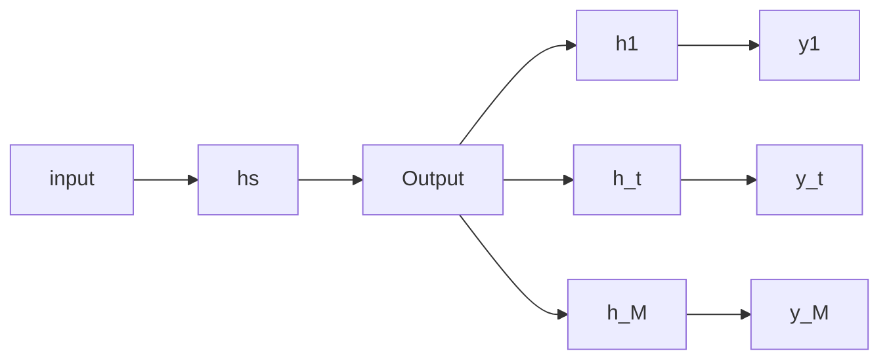
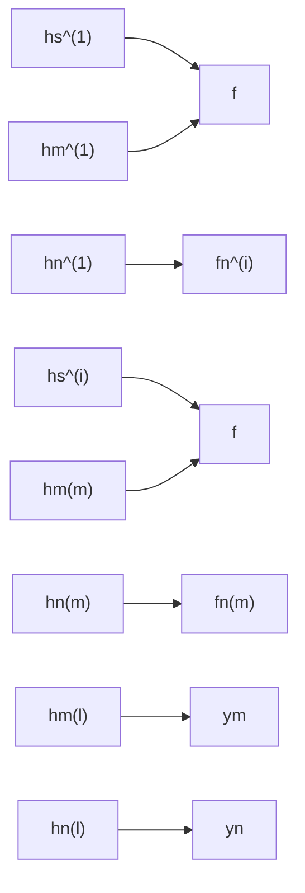
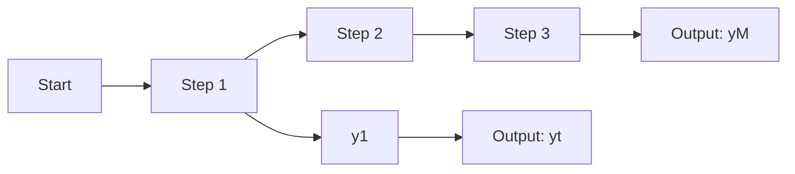

# Multi-Task Learning in Natural Language Processing: An Overview

SHIJIE CHEN\*, The Ohio State University, USA

YU ZHANG<sup>†</sup>, Southern University of Science and Technology, China

QIANG YANG, Hong Kong University of Science and Technology, China

Deep learning approaches have achieved great success in the field of Natural Language Processing (NLP). However, directl training deep neural models often suffer from overfitting and data scarcity problems that are pervasive in NLP tasks. I recent years, Multi-Task Learning (MTL), which can leverage useful information of related tasks to achieve simultaneou performance improvement on these tasks, has been used to handle these problems. In this paper, we give an overview of the us of MTL in NLP tasks. We first review MTL architectures used in NLP tasks and categorize them into four classes, including parallel architecture, hierarchical architecture, modular architecture, and generative adversarial architecture. Then we present optimization techniques on loss construction, gradient regularization, data sampling, and task scheduling to properly train a multi-task model. After presenting applications of MTL in a variety of NLP tasks, we introduce some benchmark datasets. Finally, we make a conclusion and discuss several possible research directions in this field.

## ACM Reference Format:

Shijie Chen, Yu Zhang, and Qiang Yang. 2024. Multi-Task Learning in Natural Language Processing: An Overview. 1, 1 (April 2024), 31 pages. https://doi.org/10.1145/nnnnnnn.nnnnnnn

## 1 INTRODUCTION

In recent years, data-driven neural models have achieved great success in machine learning problems. In the field of Natural Language Processing (NLP), the introduction of transformers [129] and pre-trained language models (PLMs) such as BERT [26], T5 [102] and GPT-3 [8] has led to a huge leap in the performance on multiple downstream tasks. While pre-training equips PLMs with general encyclopedic and linguistic knowledge, using PLMs on downstream tasks still requires task-specific adaptation. However, sufficiently training such models usually require a large amount of labeled training samples, which is often expensive for NLP tasks. With the increasing size of neural models, training them on downstream datasets also demands immense computing power as well as huge time and storage budget. To further improve model performance, combat the data scarcity problem, and facilitate cost-efficient task adaptation, researchers have adopted Multi-Task Learning (MTL) [9, 164] for NLP tasks. More recently, with the uprising of generative pre-trained models [8, 102], notably large language models (LLMs), researchers have generalized the notion of performing tasks into following instructions [87, 149], which virtually makes any NLP task a text-to-text task. This further allows to fine-tune a language model on a huge collection of tasks in a unified sequence-to-sequence framework. As a result, contemporary LLMs set new state-of-the-art on a variety of tasks and demonstrate an impressive ability in adapting to new tasks under few-shot

<sup>\*</sup>This work was done when the first author worked as a research assistant at Southern University of Science and Technology.

<sup>†</sup>Corresponding author

Authors’ addresses: Shijie Chen, chen.10216@osu.edu, The Ohio State University, USA; Yu Zhang, yu.zhang.ust@gmail.com, Southern University of Science and Technology, China; Qiang Yang, qyang@cse.ust.hk, Hong Kong University of Science and Technology, China.

Permission to make digital or hard copies of all or part of this work for personal or classroom use is granted without fee provided that copies are not made or distributed for profit or commercial advantage and that copies bear this notice and the full citation on the first page. Copyrights fo components of this work owned by others than ACM must be honored. Abstracting with credit is permitted. To copy otherwise, or republish, to post on servers or to redistribute to lists, requires prior specific permission and/or a fee. Request permissions from permissions@acm.org.

© 2024 Association for Computing Machinery.

XXXX-XXXX/2024/4-ART \$15.00

https://doi.org/10.1145/nnnnnnn.nnnnnnn

and zero-shot settings [109, 142], highlighting the instrumental role of multi-task learning in building strong models for natural language processing.

MTL trains machine learning models from multiple related tasks simultaneously or enhances the model for a specific task using auxiliary tasks. Learning from multiple tasks makes it possible for models to capture generalized and complementary knowledge from the tasks at hand besides task-specific features. Tasks in MTL can be tasks with assumed relatedness [21, 24, 42, 61, 130], tasks with different styles of supervision (e.g., supervised and unsupervised tasks [44, 70, 79]), tasks with different types of goals (e.g., classification and generation [90]), tasks with different levels of features (e.g., token-level and sentence-level features [62, 118]), and even tasks in different modalities (e.g., text and image data [72, 124]). Alternatively, we can treat the same task in multiple domains or languages as multiple tasks, which is also known as multi-domain learning [153] in some literature, and learn an MTL model from them.

MTL naturally aggregates training samples from datasets of multiple tasks and alleviates the data scarcity problem. The benefit is escalated when unsupervised or self-supervised tasks, such as language modeling, are included. This is especially meaningful for low-resource tasks and languages whose labeled dataset is sometimes too small to sufficiently train a model. In most cases, the enlarged training dataset reduces the risk of the overfitting and leads to more robust models. From this perspective, MTL acts similarly to data augmentation techniques [39]. However, MTL provides additional performance gain compared to data augmentation approaches, due to its ability to learn common knowledge shared by different tasks.

While the thirst for better performance has driven people to build increasingly large models, developing more compact and efficient models with competitive performance has also received a growing interest. Through implicit knowledge sharing during the training process, MTL models could match or even exceed the performance of their single-task counterparts using much less training samples [28, 117]. Besides, multi-task adapters [99, 122] transfer large pre-trained models to new tasks and languages by adding a modest amount of task-specific parameters. In this way, the costly fine-tuning of the entire model is avoided, which is important for real-world applications such as mobile computing and latency-sensitive services. Many NLP models leverage additional features, including hand-crafted features and those produced by automatic NLP tools. Through MTL on various linguistic tasks, such as chunking, Part-Of-Speech (POS) tagging, Named Entity Recognition (NER), and dependency parsing, we can reduce the reliance on external knowledge and prevent error propagation, which results in simpler models with potentially better performance [78, 110, 120, 169].

This paper reviews the application of MTL in recent NLP research. We focus on the ways in which researchers apply MTL to downstream NLP tasks, including model architectures, training processes, and data sources. While most pre-trained language models take advantage of MTL during pre-training, they are not designed for specific down-stream tasks, and thus they are not in the focus of this paper. Depending on the objective of applying MTL, we denote by auxiliary MTL the case where auxiliary tasks are introduced to improve the performance of primary tasks and by joint MTL the case where multiple tasks are equally important.

We first introduce popular MTL architectures used in NLP tasks and categorize them into four classes, including parallel architecture, hierarchical architecture, modular architecture, and generative adversarial architecture (Section 2). Then we review optimization techniques of MTL for NLP tasks in terms of loss construction, data sampling, and task scheduling (Section 3). After that, we present applications of MTL, categorized into auxiliary MTL and joint MTL, in a variety of NLP tasks (Section 4), and introduce some MTL benchmark datasets used in NLP (Section 5). Finally, we conclude the whole paper and discuss several possible research topics in this field.

Notations. In this paper, we use lowercase letters, such as 𝑡, to denote scalars and use lowercase letters in boldface, such as x, to denote vectors. Uppercase letters, such as 𝑀 and 𝑇, are used for constants and uppercase letters in boldface are used to represent matrices, including feature matrices like X and weight matrices like W. In general, a multi-task learning model, parametrized by 𝜃, handles 𝑀 tasks on a dataset D with a loss function L.

## 2 MTL ARCHITECTURES FOR NLP TASKS

The architectures of MTL models depend on the characteristics of the indented tasks as well as the design of the base models. When training generative models on instruction following, people usually train the entire model and focus more on data curation. We refer interested readers to another survey paper on instruction tuning [162]. In this work, we mainly focus on reviewing MTL architectures with task-specifc trainable parameters.

Based on how the relatedness between tasks are utilized, we categorize MTL architectures into the following classes: parallel architecture, hierarchical architecture, modular architecture, and generative adversarial architecture. The parallel architecture shares the bulk of the model among multiple tasks while each task has its own task-specific output layer. The hierarchical architecture models the hierarchical relationships between tasks. Such architecture can hierarchically combine features from different tasks, take the output of one task as the input of another task, or explicitly model the interaction between tasks. The modular architecture decomposes the whole model into shared components and task-specific components that learn task-invariant and task-specific features, respectively. Different from the above three architectures, the generative adversarial architecture borrows the idea of the generative adversarial network [37] to improve capabilities of existing models. Note that the boundaries between different categories are not always solid and hence a specific model may fit into multiple classes. Still, we believe that this taxonomy could illustrate important ideas behind the design of MTL architectures.

Before introducing MTL architectures, we would like to clarify the definitions of hard and soft parameter sharing. In this paper, hard parameter sharing refers to sharing the same model parameters among multiple tasks, and it is the most widely used approach in multi-task learning models. Soft parameter sharing, on the other hand, constrains a distance metric between the intended parameters, such as the Euclidean distance [40] and correlation matrix penalty [44], to force certain parameters of models for different tasks to be similar. Alternatively, Le et al. [63] add a regularization term to ensure the outputs of encoders of each task to be close for similar input instances. Differently, some researchers use hard parameter sharing to design a multi-task learning model that shares all the hidden layers except the final task-specific output layers and use soft parameter sharing to establish a multi-task model that partially shares its parameters [23], such as embedding layers and low-level encoders. In this paper, such models fall into the ‘parallel architecture’ category.

## 2.1 Parallel Architectures

As its name suggests, the model for each task run in parallel under the parallel architecture, which is implemented by sharing certain intermediate layers. In this case, there is no dependency other than layer sharing among tasks. Therefore, there is no constraint on the order of training samples from each task. During training, the shared parameters receive gradients from samples of each task, enabling knowledge sharing among tasks. Fig. 1 illustrates different forms of parallel architectures.

2.1.1 Parallel Feature Sharing. The simplest form of parallel architecture is a parallel feature sharing architecture (Fig. 1a), where the models for different tasks share a base feature extractor (i.e., the trunk) followed by task-specific encoders and output layers (i.e., the branches). A shallow trunk can be simply the word representation layer [117] while a deep trunk can be the entire model except output layers. The tree-like architecture was proposed by Caruana [9] and has been widely used in MTL [2, 4, 6, 10, 11, 14, 17, 22, 30, 31, 40, 42, 46, 54, 58, 59, 65, 73, 75, 77–79, 85, 89, 90, 95, 96, 103, 115, 116, 120, 125, 130, 135–137, 141, 143, 154, 156, 163, 165, 166, 168]. In some literature, this architecture is also known as hard sharing architecture or multi-head architecture, where each head corresponds to the combination of a task-specific encoder and the corresponding output layer or just a branch.

Parallel feature sharing uses a single trunk to force all tasks to share the same low-level feature representation, which may limit the expressive power of the model for each task. A solution is to equip the shared trunk with task-specific encoders [50, 63, 150]. For example, Lin et al. [71] combine a shared character embedding layer and language-specific word embedding layers for different languages. Another way is to make different groups of tasks share different parts of the trunk [39, 85, 94]. This idea can also be applied to the decoder. For instance, Wang et al. [138] share the trunk encoder with a source-side language model and shares the decoder with a target-side denoising autoencoder.


<details>
<summary>flowchart</summary>


</details>

(a) Parallel Feature Sharing


<details>
<summary>flowchart</summary>


</details>

(b) Parallel Feature Fusion


<details>
<summary>flowchart</summary>


</details>

(c) Parallel Multi-level Supervision  
Fig. 1. Illustration for parallel architectures. For task $t , h _ { t } ^ { ( i ) }$ represents the latent representation at the 𝑖-th layer and <sub>𝑦𝑡</sub> represents the corresponding label $( h _ { s }$ are shared latent representations). The green blocks represent shared parameters and the orange blocks are task-specific parameters. Red circles represent feature fusion mechanism $f .$

2.1.2 Parallel Feature Fusion. Different from learning shared features implicitly by sharing model parameters in the trunk, MTL models can actively combine features from different tasks, including shared and task-specific features, to form representations for each task. As shown in Fig. 1b, such models can use a globally shared encoder to produce shared representations that can be used as additional features for each task-specific model [75]. The shared representations can also be used indirectly as the key for attention layers in each task-specific model [127].

However, simply aggregating features of different tasks via weighted sum [66] or attention [168] is sub-optimal since these features might actually hurt the performance of other tasks, also known as inter-task interference. Researchers have proposed to do more fine-grained feature sharing between tasks to counter this issue. One approach is to directly aggregate shared and task-specific features using learnable feed-forward layers [41, 161] or gating mechanisms [23, 61]. Additionally, feature sharing can be indirectly performed by maintaining memory units that are shared among different tasks either globally or in pairs [75, 145].

A more generalized approach for inter-task feature sharing is modeling task relatedness and sharing features accordingly. As an example, Sluice network [107] controls feature transfer by a learned task relatedness matrix. Instead of using a fixed relatedness matrix, LK-MTL [147] uses leaky units to dynamically control pairwise feature flow based on input features, and similar to RNN cells, it modulates information flow by two gates. Specifically, given two tasks 𝑚 and 𝑛, the leaky gate ${ \bf r } _ { m n }$ determines how much knowledge should be transferred from task 𝑛 to task 𝑚 and emits a feature map $\tilde { \mathbf { h } } _ { m n }$ . The update gate ${ \bf z } _ { m n }$ determines how much information should be maintained from task 𝑚 and emits the final output $\tilde { \mathbf { h } } _ { m }$ for task 𝑚. Mathematically, the feature sharing process is formulated as:

$$
\mathbf {r} _ {m n} = \sigma (\mathbf {W} _ {r} \cdot [ \mathbf {h} _ {m}, \mathbf {h} _ {n} ])
$$

$$
\tilde {\mathbf {h}} _ {m n} = \tanh (\mathbf {U} \cdot \mathbf {h} _ {m} + \mathbf {W} \cdot (\mathbf {r} _ {m n} \odot \mathbf {h} _ {n}))
$$

$$
\mathbf {z} _ {m n} = \sigma (\mathbf {W} _ {z} \cdot [ \mathbf {h} _ {m}, \mathbf {h} _ {n} ])
$$

$$
\tilde {\mathbf {h}} _ {m} = \mathbf {z} _ {m n} \cdot \mathbf {h} _ {m} + (1 - \mathbf {z} _ {m n}) \cdot \tilde {\mathbf {h}} _ {m n},
$$

where $\sigma ( \cdot )$ denotes the sigmoid function and tanh(·) denotes the hyperbolic tangent function. When considering all pairwise directions, the output for each task is given by the sum of each row in

$$
\left[ \begin{array}{c c c c} \sum_ {k = 1} ^ {M} \mathbf {z} _ {1 k} & (1 - \mathbf {z} _ {1 2}) & \dots & (1 - \mathbf {z} _ {1 M}) \\ (1 - \mathbf {z} _ {2 1}) & \sum_ {k = 1} ^ {M} \mathbf {z} _ {2 k} & \cdot & 1 - \mathbf {z} _ {2 M}) \\ \vdots & \vdots & \ddots & \vdots \\ (1 - \mathbf {z} _ {M 1}) & (1 - \mathbf {z} _ {M 2}) & \dots & \sum_ {k = 1} ^ {M} \mathbf {z} _ {M k} \end{array} \right]. \left[ \begin{array}{c c c c} \mathbf {h} _ {1} & \mathbf {h} _ {1 2} & \dots & \mathbf {h} _ {1 M} \\ \tilde {\mathbf {h}} _ {2 1} ^ {i} & \mathbf {h} _ {2} & \dots & \tilde {\mathbf {h}} _ {2 M} ^ {i} \\ \vdots & \vdots & \ddots & \vdots \\ \tilde {\mathbf {h}} _ {M 1} ^ {i} & \tilde {\mathbf {h}} _ {M 2} ^ {i} & \dots & \tilde {\mathbf {h}} _ {M} ^ {i} \end{array} \right] / M.
$$

Task routing is another method for dynamic feature fusion, where the paths that samples go through in the model differ by their tasks. Given 𝑀 tasks, the routing network in [157] splits RNN cells into several shared blocks with 𝑀 task-specific blocks (one for each task) and then modulates the input to as well as output from each RNN block by a learned weight. MCapsNet [148], which adapts CapsNet [108] to NLP tasks, replaces dynamic routing in CapsNet with task routing to build different feature spaces for each task. In MCapsNet, similar to dynamic routing, task routing computes task coupling coefficients $c _ { i j } ^ { ( k ) }$ for capsule 𝑖 in the current layer and capsule 𝑗 in the next layer for task 𝑘. Due to the fine-grained dynamic control of information flow between tasks, LK-MTL and MCapsNet outperform other feature fusion methods and obtain state-of-the-art performance.

2.1.3 Parallel Multi-level Supervision. While models using the parallel architecture handle multiple tasks in parallel, these tasks may concern features at different abstraction levels. For NLP tasks, such levels can be character-level, token-level, sentence-level, paragraph-level, and document-level. Due to the compositional nature of language, both syntactically and semantically, it is natural to give supervision signals at different depths of an MTL model for tasks at different levels [21, 86, 110, 118] as illustrated in Fig. 1c. For example, in [29, 62], token-level tasks receive supervisions at lower-layers while sentence-level tasks receive supervision at higher layers. Rawat et al. [103] supervise a higher-level QA task on both sentence and document-level features in addition to a sentence similarity prediction task that only relies on sentence-level features. In addition, Gong et al. [35], Perera et al. [98] add skip connections so that signals from higher-level tasks are amplified. Chaplot et al. [13] learn semantic goal navigation at a lower level and learns the task of embodied question answering at a higher level.

In some settings where MTL is used to improve the performance of a primary task, the introduction of auxiliary tasks at different levels could be helpful. Several works integrate a language modeling task on lower-level encoders for better performance on simile detection [104], sequence labeling [74], question generation [169], and task-oriented dialogue generation [169]. Li and Caragea [68] add sentence-level sentiment classification and attention-level supervision to assist the primary stance detection task. Nishino et al. [90] add attention-level supervision to improve consistency of the two primary language generation tasks. Chuang et al. [18] minimize an auxiliary cosine softmax loss based on the audio encoder to learn more accurate speech-to-semantic mappings.

## 2.2 Hierarchical Architectures

The hierarchical architecture considers hierarchical relationships among multiple tasks. The features and output of one task can be used by another task as an extra input or additional control signals. The design of hierarchical architectures depends on the tasks at hand and is usually more complicated than parallel architectures. Fig. 2 illustrates different hierarchical architectures. We notice that parallel MTL architectures usually assume the features shared are in the same feature space. Thus they should be processed by similar model architectures. In contrast, Hierarchical MTL architectures allow independent processing for each task and could accommodate tasks with data in heterogeneous feature spaces such as text, knowledge graphs, images, and audio.

2.2.1 Hierarchical Feature Fusion. Different from parallel feature fusion that combines features of different tasks at the same depth, hierarchical feature fusion can explicitly combine features at different depths and allow different processing for different features. To solve the Twitter demographic classification problem, Vijayaraghavan et al. [130] encode the name, following network, profile description, and profile picture features of each user by different neural models and combines the outputs using an attention mechanism. Liu et al. [74] take the hidden states for tokens in simile extraction as an extra feature in the sentence-level simile classification task. For knowledge base question answering, Deng et al. [25] combine lower level word and knowledge features with more abstract semantic and knowledge semantic features by a weighted sum. [134] fuses topic features of different roles into the main model via a gating mechanism. In [14], text and video features are combined through inter-modal attention mechanisms of different granularity to improve performance of sarcasm detection.


<details>
<summary>flowchart</summary>

```mermaid
graph LR
  h1["h₁"] --> Stage1[""]
  Stage1 --> Stage2[""]
  Stage2 --> Stage3[""]
  h1 --> Stage4[""]
  Stage4 --> Stage5[""]
  hN["hₙ"] --> Stage6[""]
  Stage6 --> Stage7[""]
  Stage7 --> Stage8[""]
  Stage8 --> Output1["ŷ₁"]
  Stage4 --> Stage9[""]
  Stage9 --> Output2["ŷₜ"]
  Stage5 --> Output3[""]
```
</details>

(a) Hierarchical Feature Fusion


<details>
<summary>flowchart</summary>

```mermaid
graph LR
  h1["h₁"] --> H1[""]
  h1 --> H2[""]
  h1 --> H3[""]
  hi["hᵢ"] --> H1
  hi --> H2
  hN["hₙ"] --> H1
  hN --> H2
  H1 --> H3
  H2 --> H3
  H3 --> H4["ŷₜ"]
  H3 --> H5["ŷₜ"]
  H3 --> H6["ŷₜ"]
  H4 --> Y1["ŷ₁"]
  H5 --> Y1
  H6 --> Y1
  H4 --> X(( ))
  H5 --> X
  H6 --> X
```
</details>

(b) Hierarchical Pipeline


<details>
<summary>flowchart</summary>

```mermaid
graph LR
  h1["h₁"] --> Block1[""]
  h1 --> Block2[""]
  hi["hᵢ"] --> Block3[""]
  hn["hₙ"] --> Block4[""]
  Block1 --> Output1["ŷ₁"]
  Block2 --> Output2["ŷₜ"]
  Block3 --> Output3["ŷₜM"]
  Block4 --> Output4["T steps"]
  Output1 --> Output1
  Output2 --> Output2
  Output3 --> Output3
  Output4 --> Output4
```
</details>

(c) Hierarchical Interactive MTL  
Fig. 2. Illustration for hierarchical architectures. ℎ represents different hidden states and <sub>𝑦</sub>ˆ<sub>𝑡</sub> represents the predicted output distribution for task 𝑡. Red boxes stand for hierarchical feature fusion mechanisms. The purple block and blue circle in (b) stand for hierarchical feature and signal pipeline unit respectively.

2.2.2 Hierarchical Pipeline. Instead of aggregating features from different tasks as in feature fusion architectures, pipeline architectures treat the output of a task as an extra input of another task and form a hierarchical pipeline between tasks. In this section, we refer to output as the final result for a task, including the final output distribution and hidden states before the last output layer. The extra input can be used directly as input features or used indirectly as control signals to enhance the performance of other tasks. Therefore, we further divide hierarchical pipeline architectures into hierarchical feature pipeline and hierarchical signal pipeline.

In hierarchical feature pipeline, the output of one task is used as extra features for another task. The tasks are assumed to be directly related so that outputs instead of hidden feature representations are helpful to other tasks. For example, Chen et al. [16] feed the output of a question-review pair recognition model to the question answering model. He et al. [47] feed the output of aspect term extraction to aspect-term sentiment classification. Targeting community question answering, Yang et al. [152] use the result of question category prediction to enhance document representations. Song and Park [119] feed the result of morphological tagging to a POS tagging model and the two models are further tied by skip connections.

Hierarchical feature pipeline is especially useful for tasks at different abstraction levels. Fei et al. [31] use the output of neighboring word semantic type prediction as extra features for neighboring word prediction. Hashimoto et al. [46] use skip connections to forward predictions of lower-level POS tagging, chunking, and dependency parsing tasks to higher-level entailment and relatedness classification tasks. In addition, deep cascade MTL [35] adds both residual connections and cascade connections to a single-trunk parallel MTL model with supervision at different levels, where residual connections forward hidden representations and cascade connections forward output distributions of a task to the prediction layer of another task. Song et al. [121] include the output of the low-level discourse element identification task in the organization grid, which consists of sentence-level, phrase level, and document-level features of an essay, for the primary essay organization evaluation task. In [116], the word predominant sense prediction task and the text categorization task share a transformer-based embedding layer and embeddings of certain words in the text categorization task could be replaced by prediction results of the predominant sense prediction task.

The direction of hierarchical pipelines is not necessarily always from low-level tasks to high-level tasks. For example, in [1], the outputs of word-level tasks are fed to the char-level primary task. Rivas Rojas et al. [106] feed the output of more general classification models to more specific classification models during training, and the more general classification results are used to optimize beam search of more specific models at test time.

In hierarchical signal pipeline, the outputs of tasks are used indirectly as external signals to help improve the performance of other tasks. For example, the predicted probability of the sentence extraction task can be used to weigh sentence embeddings for a document-level classification task [53]. For the hashtag segmentation task, Maddela et al. [80] first predict the probability of a hashtag being single-token or multi-token as an auxiliary task and further use the output to combine single-token and multi-token features. In [115], the output of an auxiliary entity type prediction task is used to disambiguate candidate entities for logical form prediction. The outputs of a task can also be used for post-processing. For instance, Zeng et al. [158] use the output of NER to help extract multi-token entities.

2.2.3 Hierarchical Interactive MTL. Different from most machine learning models that give predictions in a single pass, hierarchical interactive MTL explicitly models the interactions between tasks via a multi-turn prediction mechanism which allows a model to refine its predictions over multiple steps with the help of the previous outputs from other tasks in a way similar to recurrent neural networks. He et al. [47] maintain a shared latent representation which is updated by 𝑇 iterations. In cyclic MTL [159], the output of one task is used as an extra input to its successive lower-level task and the output of the last task is fed to the first one, forming a loop. Most hierarchical interactive MTL models as introduced above report that performance converges quickly at 𝑇 = 2 steps, showing the benefit and efficiency of doing multi-step prediction.

## 2.3 Modular Architectures

The idea behind the modular MTL architecture is simple: breaking an MTL model into shared modules and task-specific modules. The shared modules learn shared features from multiple tasks. Since the shared modules can learn from many tasks, they can be sufficiently trained and can generalize better, which is particularly meaningful for low-resource scenarios. On the other hand, task-specific modules learn features that are specific to a certain task. Compared with shared modules, task-specific modules are usually much smaller and thus less likely to suffer from overfitting caused by insufficient training data. The robustness of shared modules and the flexibility of task-specific modules makes modular architectures suitable for learning different tasks efficiently.

The simplest form of modular architectures is a single shared module coupled with task-specific modules as in parallel feature sharing described in Section 2.1.1. Besides, another common practice is to share the first embedding layers across tasks [63, 171]. Alqahtani et al. [1] share word and character embedding matrices and combines them differently for different tasks. Sarwar et al. [111] share two encoding layers and a vocabulary lookup table between the primary neural machine translation task and the auxiliary representation learning task. Shared embeddings can be used alongside task-specific embeddings [64, 151] as well. In addition to word embeddings, [160] shares label embeddings between tasks. Researchers have also developed modular architectures at a finer granularity. For example, Tong et al. [128] split the model into task-specific encoders and language-specific encoders for multilingual dialogue evaluation. In [25], each task has its own encoder and decoder, while all tasks share a representation learning layer and a joint encoding layer. Pentyala et al. [97] create encoder modules on different levels, including task level, task group level, and universal level.

When adapting large pre-trained models to down-stream tasks, a common practice is to fine-tune a separat model for each task. While this approach usually attains good performance, it poses heavy computational and storage costs. A more cost-efficient way is to add lightweight task-specific trainable modules into a single shared frozen backbone model. A special case is prefix-tuning for adapting pre-trained generative language models [67], where learnable prefix vectors are prepended to inputs to frozen language models as context. Several works train task-specific prompt vectors for MTL [3, 131]. Wang et al. [139] further improve multi-task prefix-tuning by decomposing the task prompts into a task-shared prompt and smaller task-specific prompts.


<details>
<summary>flowchart</summary>

```mermaid
graph LR
  A[""] --> B["LN"]
  B --> C["SA"]
  C --> D["LN"]
  D --> E[""]
```
</details>

(a) Bert and PALs [122]


<details>
<summary>flowchart</summary>


</details>

(b) MAD-X [99]  
Fig. 3. Illustration for multi-task adapters.

Multi-task adapters adapt single-task models to multiple tasks by adding extra task-specific parameters (adapters). Stickland and Murray [122] add task-specific Projected Attention Layers (PALs) in parallel with self-attention operations in a pre-trained BERT model. Here PALs in different layers share the same parameters to reduce model capacity and improve training speed. In Multiple ADapters for Cross-lingual transfer (MAD-X) [99], the model is decomposed into four types of adapters: language adapters, task adapters, invertible adapters, and its counterpart inversed adapters, where language adapters learn language-specific task-invariant features, task adapters learn language-invariant task-specific features, invertible adapters conversely map input embeddings from different tasks into a shared feature space, and inversed adapters map hidden states into domain-specific embeddings. MAD-X can perform quick domain adaptation by directly switching corresponding language and task adapters instead of training new models from the scratch.

Further, task adaptation modules can also be dynamically generated by a meta-network. As an example, Hypergrid transformer [126] scales the weight matrix 𝐻 of the second feed forward layer in each transformer block by the multiplication of two vectors as

$$
\mathrm{H} (\mathbf {x}) = \phi \big (\sigma \big ((\mathrm{L} _ {r o w} \cdot \mathbf {x}) (\mathrm{L} _ {c o l} \cdot \mathbf {x})) \big) \odot \mathrm{W},
$$

where $\mathbf { L } _ { \boldsymbol { r o w } }$ and $\mathbf { L } _ { c o l }$ are either globally shared task feature vectors or local instance-wise feature vectors, $\phi$ is a scaling operation, x is an input vector, and W is a learnable weight matrix. Similarly, Hyperformer [56] inserts feed-forward adapter modules, which are generated by a task-aware hypernetwork, between pre-trained Transformer layers for efficient adaptation. Differently, Conditionally Adaptive MTL (CA-MTL) [101] implements task adapters in the self-attention operation of each transformer block based on task representations $\left\{ { { \bf { z } } _ { i } } \right\}$ as

$$
\text {Attention} \left(\mathbf {Q}, \mathbf {K}, \mathbf {V}, \mathbf {z} _ {i}\right) = \operatorname{softmax} \left(\mathbf {M} \left(\mathbf {z} _ {i}\right) + \frac {\mathbf {Q} \mathbf {K} ^ {T}}{\sqrt {d}}\right) \mathbf {V}
$$

where $\mathbf { M } ( \mathbf { z } _ { i } ) = \mathrm { d i a g } ( \mathbf { A } _ { 1 } ^ { \prime } ( \mathbf { z } _ { i } ) , \dots , \mathbf { A } _ { N } ^ { \prime } ( \mathbf { z } _ { i } ) )$ is a diagonal block matrix consisting of 𝑁 learnable linear transformations over $\mathbf { z } _ { i } .$ . Therefore, $\mathbf { M } ( \mathbf { z } _ { i } )$ injects task-specific bias into the attention map in the self-attention mechanism. Similar adaptation operations are used in input alignment and layer normalization as well. Impressively, a single jointly trained Hypergrid transformer, Hyperformer, or CA-MTL model could match or outperform single-task finetuned models on multi-task benchmark datasets while only adding a negligible amount of parameters. Instead of generating adaptation parameters with hypernetworks, Mixture-of-Expert (MoE) models [114] adjust computation by routing input to different trainable expert modules and show performance improvement on MTL [34, 57, 167]. More recently, task-specific information has been introduced to the routing algorithm for further performance improvement [43, 100].

## 2.4 Generative Adversarial Architectures

Generative Adversarial Networks (GANs) have achieved great success in generative tasks for computer vision. The basic idea of GANs is to train a discriminator model that distinguishes generated images from ground truth ones and train the generator model to fool the discriminator. By jointly optimizing both models, we can obtain a generator that can produce more vivid images and a discriminator that is better at spotting synthesized images. A similar idea can be used in MTL for NLP tasks. By introducing a discriminator 𝐺 that predicts which task a given training instance comes from, the shared feature extractor 𝐸 is forced to produce more generalized task-invariant features [76, 84, 128, 137, 151] and therefore improve the performance and robustness of the entire MTL model. In the training process of such models, the adversarial objective is usually formulated as

$$
\mathcal {L} _ {a d v} = \min _ {\theta_ {E}} \max _ {\theta_ {D}} \sum_ {t = 1} ^ {M} \sum_ {i = 1} ^ {| \mathcal {D} _ {t} |} d _ {i} ^ {t} \log [ D (E (\mathbf {X})) ],
$$

where $\theta _ { E }$ and $\theta _ { D }$ denote model parameters for the feature extractor and discriminator, respectively, and $d _ { i } ^ { t }$ denotes the one-hot task label.

An additional benefit of generative adversarial architectures is that unlabeled data can be fully utilized. Wang et al. [134] add an auxiliary generative model that reconstructs documents from document representations learned by the primary model and improves the quality of document representations by training the generative model on unlabeled documents. To improve the performance of an extractive machine reading comprehension model, Ren et al. [105] use a self-supervised approach. First, a discriminator that rates the quality of candidate answers is trained on labeled samples. Then, during unsupervised adversarial training, the answer extractor tries to obtain a high score from the discriminator.

## 3 OPTIMIZATION FOR MTL MODELS

Optimization techniques of training MTL models are equally as important as the design of model architectures. In this section, we summarize optimization techniques for MTL models used in recent research literatures targeting NLP tasks, including loss construction, data sampling, and task scheduling.

## 3.1 Loss Construction

The most common approach to train an MTL model is to linearly combine loss functions of different tasks into a single global loss function. In this way, the entire objective function of the MTL model can be optimized through conventional learning techniques such as stochastic gradient descent with back-propagation. Different tasks may use different types of loss functions. For example, in [154], the cross-entropy loss for the relation identification task and the ranking loss for the relation classification task are linearly combined, which performs better than single-task learning. Specifically, given 𝑀 tasks each associated with a loss function $\mathcal { L } _ { i }$ and a weight $\lambda _ { t }$ , the overall loss $\mathcal { L }$ is defined as

$$
\mathcal {L} = \sum_ {t = 1} ^ {M} \lambda_ {t} \mathcal {L} _ {t} + \sum \lambda_ {a} \mathcal {L} _ {a d a p} + \sum \lambda_ {r} \mathcal {L} _ {r e g},
$$

where $\mathcal { L } _ { t } , \mathcal { L } _ { a d a p } .$ , and $\mathcal { L } _ { r }$ denotes loss functions of different tasks, adaptive losses, and regularization terms, with $\lambda _ { t } , \lambda _ { a }$ , and $\lambda _ { r e g }$ being their respective weights. For cases where the tasks are optimized in turns rather than joint training [123], $\lambda _ { t }$ is equivalent to the sampling weight ${ { p } _ { t } }$ for task 𝑡, which will be discussed in Section 3.3.

An important question is how to assign a proper weight $\lambda _ { t }$ to each task. The simplest way is to set them equally [96, 136, 171], i.e., $\begin{array} { r } { \lambda _ { t } = \frac { 1 } { M } } \end{array}$ . As a generalization, the weights are usually viewed as hyper-parameters and set based on experience or through grid search [11, 15, 17, 23, 25, 29, 41, 61, 73–75, 78, 80, 89, 105, 111, 113, 115, 120, 134, 145, 146, 151, 158, 159, 159, 160, 163, 165, 169, 170]. For example, to prevent large datasets from

dominating training, Perera et al. [98] set the weights as

$$
\lambda_ {t} \propto \frac {1}{| \mathcal {D} _ {t} |},
$$

where $| \mathcal { D } _ { t } |$ denotes the size of the training dataset for task 𝑡. The weights can also be adjusted dynamically during the training process based on certain metrics. Through adjusting weights, we can purposely emphasize different tasks in different training stages. For instance, since dynamically assigning smaller weights to more uncertain tasks usually leads to good performance for MTL [19], [62] assigns weights based on the homoscedasticity of training losses from different tasks as

$$
\lambda_ {t} = \frac {1}{2 \sigma_ {t} ^ {2}},
$$

where $\sigma _ { t }$ measures the variance of the training loss for task 𝑡. In [70], the weight of an unsupervised task is set to a confidence score that measures how much a prediction resembles the corresponding self-supervised label. To ensure that a student model could receive enough supervision during knowledge distillation, BAM! [20] combines the supervised loss $\mathcal { L } _ { s u p }$ with the distillation loss $\mathcal { L } _ { d i s s }$ as

$$
\mathcal {L} = \lambda \mathcal {L} _ {d i s s} + (1 - \lambda) \mathcal {L} _ {s u p},
$$

where $\lambda$ increases linearly from 0 to 1 in the training process. In [121], three tasks are jointly optimized, including the primary essay organization evaluation (OE) task as well as the auxiliary sentence function identification (SFI) and paragraph function identification (PFI) tasks. The two lower-level auxiliary tasks are assumed to be equall important with weights set to $( \mathrm { i . e . , } \lambda _ { S F I } = \lambda _ { P F I } = 1 )$ and the weight of the OE task is set as

$$
\lambda_ {O E} = \max \left(\min \left(\frac {\mathcal {L} _ {O E}}{\mathcal {L} _ {S F I}} \cdot \lambda_ {O E}, 1\right), 0. 0 1\right),
$$

where $\lambda _ { O E }$ is initialized to 0.1 and then dynamically updated during training, so that the model focuses on the lower-level tasks at first before $\lambda _ { O E }$ becomes larger when $\mathcal { L } _ { S F I }$ gets relatively smaller. Nishino et al. [90] guide the model to focus on easy tasks by setting weights as

$$
\lambda_ {t} (e) = \frac {\lambda_ {t} ^ {c o n s t}}{1 + \exp ((e _ {t} ^ {\prime} - e) / \alpha)}, \tag {1}
$$

where 𝑒 denotes the number of epochs, $\lambda _ { t } ^ { c o n s t }$ and $e _ { t } ^ { \prime }$ are hyperparameters for each task, and 𝛼 denotes temperature.

In addition to combining loss functions from different tasks, researchers also use additional adaptive loss functions $\mathcal { L } _ { a d a p t }$ to enhance MTL models. In [68], the alignment between an attention vector and a hand-crafted lexicon feature vector is normalized to encourage the model to attend to important words in the input. Chen et al. [16] penalize the similarity between attention vectors from two tasks and the Euclidean distance between the resulting feature representations to enforce the models to focus on different task-specific features. To learn domain invariant features, Xing et al. [150] minimize a distance function $g ( \cdot )$ between a pair of learned representations from different tasks. Candidates of $g ( \cdot )$ include the KL divergence, maximum mean discrepancy (MMD), and central moment discrepancy (CMD). Extensive experiments show that KL divergence gives overall stable improvements on all experiments while CMD hits more best scores.

The $L _ { 1 }$ metric linearly combines different loss functions and optimizes all tasks simultaneously. However, when we view multi-task learning as a multi-objective optimization problem, this type of objective functions cannot guarantee optimality in obtaining Pareto-optimal models when each loss function is non-convex. To address this issue, Tchebycheff loss [81] optimizes an MTL model by an $L _ { \infty }$ objective, which is formulated as

$$
\mathcal {L} _ {c h e b} = \max _ {t} \left\{\lambda_ {1} \mathcal {L} _ {1} \left(\theta^ {s h}, \theta^ {1}\right), \dots , \lambda_ {M} \mathcal {L} _ {M} \left(\theta^ {s h}, \theta^ {M}\right) \right\}
$$

where $\mathcal { L } _ { t }$ denotes the training loss for task $t , \theta ^ { s h }$ denotes the shared model parameters, $\theta ^ { i }$ denotes task-specific model parameters for task $i , l _ { t }$ denotes the empirical loss of task 𝑡, and $\begin{array} { r } { \lambda _ { t } = \frac { 1 } { \bar { l } _ { t } \sum _ { i = 1 } ^ { T } \frac { 1 } { \bar { l } _ { i } } } } \end{array}$ . The Tchebycheff loss can b combined with aforementioned adversarial MTL as well [76].

Note that adjusting loss weight $\lambda _ { t }$ of each task could guide the model to focus on different tasks during training while still learning multiple tasks at the same time, which can be seen as implicit task scheduling, compared to explicit task scheduling, which will be discussed in Section 3.4. In general, auxiliary MTL models are often bootstrapped with easier or lower-level tasks. For joint MTL, one would want to emphasize difficult tasks or tasks with lower homoscedasticity.

## 3.2 Gradient Regularization

Aside from studying how to combine loss functions of different tasks, some studies optimize the training process by manipulating gradients. When jointly learning multiple tasks, the gradients from different tasks may be in conflict with each other, causing inter-task interference that harms performance. PCGrad [155] resolves such conflict using gradient projections. Specifically, given two conflicting gradients $\mathbf { g } _ { i }$ and $\mathbf { g } _ { j }$ from tasks 𝑖 and $j ,$ respectively, PCGrad projects $\mathbf { g } _ { i }$ onto the normal plane of $\mathbf { g } _ { j }$ as

$$
\mathbf {g} _ {i} ^ {\prime} = \mathbf {g} _ {i} - \frac {\mathbf {g} _ {i} \cdot \mathbf {g} _ {j}}{\left\| \mathbf {g} _ {j} \right\| ^ {2}} \mathbf {g} _ {j}.
$$

Based on the observation that gradient similarity correlates well with language similarity and model performance, GradVac [140], which targets at optimization of multilingual models, regulates parameter updates according to geometry similarities between gradients. That is, GradVac alters both the direction and magnitude of gradients so that they are aligned with the cosine similarity between gradient vectors by modifying ${ \bf g } _ { i }$ as

$$
\mathbf {g} _ {i} ^ {\prime} = \mathbf {g} _ {i} + \frac {\| \mathbf {g} _ {i} \| \left(\phi_ {i j} ^ {T} \sqrt {1 - \phi_ {i j} ^ {2}} - \phi_ {i j} \sqrt {1 - (\phi_ {i j} ^ {T}) ^ {2}}\right)}{\| \mathbf {g} _ {j} \| \sqrt {1 - (\phi_ {i j} ^ {T}) ^ {2}}} \cdot \mathbf {g} _ {j}
$$

where $\phi _ { i j } \in \left[ - 1 , 1 \right]$ is the cosine distance between gradients g<sub>𝑖</sub> and $\mathbf { g } _ { j }$ . Notice that PCGrad is a special case of GradVac when $\phi _ { i j } ^ { T } = 0$ . While PCGrad does not modify positively associated gradients, GradVac aligns both positively and negatively associated gradients, leading to a consist performance improvement for multilingual models.

## 3.3 Data Sampling

Machine learning models often suffer from imbalanced data distributions. MTL further complicates this issue in that training datasets of multiple tasks with potentially different sizes and data distributions are involved. Various data sampling techniques have been proposed to properly construct training datasets. In practice, given 𝑀 tasks and their datasets $\{ \mathcal { D } _ { 1 } , . . . , \mathcal { D } _ { M } \}$ , a sampling weight ${ \mathbf { } } p _ { t }$ is assigned to task 𝑡 to control the probability of sampling a data batch from $\mathcal { D } _ { t }$ in each training step.

In general, ${ { p } _ { t } }$ takes the form of:

$$
p _ {t} \propto | \mathcal {D} _ {t} | ^ {\frac {1}{\alpha}}
$$

where 𝛼 is the sampling temperature. When $\alpha > 1$ , the divergence of sampling probabilities between tasks is reduced and vice versa. 𝛼 can be either a constant hyperparameter or can be changed dynamically during training. Similar to task loss weights, researchers have proposed various techniques to adjust $\alpha .$ For example, the annealed sampling method [122] adjusts 𝛼 as training proceeds. Given a total number of 𝐸 epochs, 𝛼 at epoch 𝑒 is set to

$$
\alpha (e) = \frac {1}{1 - \frac {0 . 8 (e - 1)}{E - 1}}.
$$

In this way, the model is trained more evenly for different tasks towards the end of the training process to reduce inter-task interference. Wang et al. [138] define 𝛼 as

$$
\alpha (e) = \min \left(\alpha_ {m}, (e - 1) \frac {\alpha_ {m} - \alpha_ {0}}{M} + \alpha_ {0}\right),
$$

where $\alpha _ { 0 }$ and $\alpha _ { m }$ denote initial and maximum values of $\alpha .$ The noise level of the self-supervised denoising autoencoding task is scheduled similarly, increasing difficulty after a warm-up period. In both works, temperature 𝛼 increases during training which encourages up-sampling of low-resource tasks and alleviates overfitting.

## 3.4 Task Scheduling

Task scheduling determines the order of tasks on which an MTL model is trained. A naive way is to train all tasks together. Zhang et al. [161] take this way to train an MTL model, where data batches are organized as four-dimensional tensors of size $N \times M \times T \times d ,$ where 𝑁 denotes the number of samples, 𝑀 denotes the number of tasks, 𝑇 denotes sequence length, and 𝑑 represents embedding dimensions. Similarly, Zalmout and Habash [156] put labeled data and unlabeled data together to form a batch and Xia et al. [146] learn the dependency parsing and semantic role labeling tasks together. In the case of auxiliary MTL, Augenstein and Søgaard [4] train the primary task and one of the auxiliary tasks together at each step. Conversely, Song et al. [120] train one of the primary tasks and the auxiliary task together and shuffles between the two primary tasks.

Alternatively, we can train an MTL model on different tasks at different steps. Similar to data sampling techniques, we can assign a task sampling weight $r _ { t }$ for task 𝑡, which is also called mixing ratio, to control the frequency of data batches from task 𝑡. The most common task scheduling technique is to shuffle between different tasks [6, 21, 31, 35, 40, 47, 54, 77, 79, 85, 86, 94, 98, 106, 110, 117, 118, 123, 127], either randomly or according to a pre-defined schedule. While random shuffling is widely adopted, introducing more heuristics into scheduling could help further improving the performance of MTL models. For example, according to the similarity between each task and the primary task in a multilingual multi-task scenario, Lin et al. [71] define $r _ { t }$ as

$$
r _ {t} = \mu_ {t} \zeta_ {t} | \mathcal {D} _ {t} | ^ {\frac {1}{2}},
$$

where $\mu _ { t }$ or $\zeta _ { t }$ is set to 1 if the corresponding task or language is the same as the primary task and 0.1 otherwise.

Instead of using a fixed mixing ratio designed by hand, some researchers explore using a dynamic mixing ratio during the training process. Gupta et al. [42] schedule tasks by a state machine that switches between the two tasks and updates learning rate when validation loss rises. Guo et al. [39] develop a controller meta-network that dynamically schedules tasks based on multi-armed bandits. The controller has 𝑀 arms and optimizes a control policy $\pi _ { e }$ for arm (task) 𝑡 at step 𝑒 based on an estimated action value $Q _ { e , t }$ defined as

$$
\begin{array}{l} \pi_ {e} (t) = \exp (Q _ {e, t} / \tau) / \sum_ {i = 1} ^ {M} \exp (Q _ {e, i} / \tau) \\ Q _ {e, t} = (1 - \alpha) ^ {e} Q _ {0, t} + \sum_ {k = 1} ^ {e} \alpha (1 - \alpha) ^ {e - k} R _ {k} \\ \end{array}
$$

where 𝜏 denotes the temperature, 𝛼 is the decay rate, and $R _ { k }$ is the observed reward at step 𝑘 that is defined as the negative validation loss of the primary task. Analysis shows that the bandit assigns a higher probability to the primary task at first and then more evenly switches between all tasks, which echos the dynamic data sampling techniques introduced in Section 3.3.

Besides probabilistic approaches, task scheduling could also use heuristics based on certain performance metrics. By optimizing the Tchebycheff loss, Mao et al. [81] learn from the task which has the worst validation performance at each step. The CA-MTL model [101] introduces an uncertainty-based sampling strategy based on Shannon entropy for joint learning of classification tasks. Specifically, given a batch size 𝑏 and 𝑀 tasks, a pool of $b \times M$ samples are first sampled. Then, the uncertainty measure $\mathcal { U } ( x )$ for a sample x from task 𝑖 is defined as

$$
\mathcal {U} (\mathbf {x}) = \frac {S _ {i} (\mathbf {x})}{\hat {S} \times S ^ {\prime}}
$$

where 𝑆 denotes the Shannon entropy of the model’s prediction on $\mathbf { x } , \hat { S }$ is the model’s maximum average entropy over the 𝑏 samples from each task. $S ^ { \prime }$ denotes the entropy of a uniform distribution and is used to normalize the variance of the number of classes in each task. At last, 𝑏 samples with the highest uncertainty measures are used for training at the current step. Experiments show that this uncertainty-based sampling strategy could effectively avoid catastrophic forgetting and inter-task interference when jointly learning multiple tasks, outperforming th aforementioned annealed sampling [122].

In some cases, multiple tasks are learned sequentially. Such tasks usually form a clear dependency relationship or are of different difficulty levels. For instance, Isonuma et al. [53], Nishino et al. [90] train MTL models on different tasks in the order of increasing difficulties. Similarly, Hashimoto et al. [46] train a multi-task model in the order of low-level tasks, high-level tasks, and at last mixed-level batches. Unicoder [52] trains its five pre-training objectives sequentially in each step. Pfeiffer et al. [99] first pre-train language and invertible adapters on language modeling before training task adapters on different down-stream tasks, where the language and invertible adapters can also receive gradient when training task adapters. To stabilize the training process when alternating between tasks with imbalanced dataset sizes, successive regularization [31, 46] can be added to loss functions as a regularization term, which is defined as $\mathcal { L } _ { s r } = \delta \left\| \theta _ { e } - \theta _ { e } ^ { \prime } \right\| ^ { 2 }$ , where $\theta _ { e }$ and $\theta _ { e } ^ { \prime }$ are model parameters before and after the update in the previous training step and 𝛿 is a hyperparameter.

To sum up, task scheduling for MTL aims at alleviate overfitting and negative transfer caused by imbalanced dataset size. For auxiliary MTL, depending on the relationship between tasks, we can either start with the primary task before training primary and auxiliary tasks together or adopt a pre-train then fine-tune approach [16, 47, 60, 135], which bootstraps the model with auxiliary tasks that are often easier or more data-rich. For joint MTL, we would like to choose tasks that are more likely to benefit the model. Generally, dynamic scheduling approaches like CA-MTL performs better than using a fixed mixing ratio.

## 4 APPLICATION IN NLP TASKS

In this section, we summarize the application of multi-task learning in NLP tasks, including applying MTL to optimize certain primary tasks (i.e., Auxiliary MTL), to jointly learn multiple tasks (i.e., Joint MTL), and to improve the performance in multilingual multi-task and multimodal scenarios. Existing research works have also explored different ways to improve the performance and efficiency of MTL models, as well as using MTL to study the relatedness of different tasks.

## 4.1 Auxiliary MTL

Auxiliary MTL aims to improve the performance of certain primary tasks by introducing auxiliary tasks and is widely used in the NLP field for different types of primary tasks, such as sequence tagging, classification, text generation, and representation learning. Table 1 summarizes the types of auxiliary tasks used along with different types of primary tasks. As shown in Table 1, auxiliary tasks are usually closely related to primary tasks.

Targeting sequence tagging tasks, Rei [104] adds a language modeling objective into a sequence labeling model to counter the sparsity of named entities and make full use of training data. Augenstein and Søgaard [4] add five auxiliary tasks for scientific keyphrase boundary classification, including syntactic chunking, frame target annotation, hyperlink prediction, multi-word expression identification, and semantic super-sense tagging. Li and Lam [66] use opinion word extraction and sentence-level sentiment identification to assist aspect term extraction. Isonuma et al. [53] train an extractive summarization model together with an auxiliary document-level classification task. Xing et al. [150] transfer knowledge from a large open-domain corpus to the data-scarce medical domain for Chinese word segmentation using a parallel MTL architecture. HanPaNE [141] improves NER for chemical compounds by jointly training a chemical compound paraphrase model. Xia et al. [146] enhance Chinese semantic role labeling by adding a dependency parsing model and uses the output of dependency parsing as additional features. Nishida et al. [89] improve the evidence extraction capability of an explainable multi-hop QA model by viewing evidence extraction as an auxiliary summarization task. Alqahtani et al. [1] improve character-level diacritic restoration with word-level syntactic diacritization, POS tagging, and word segmentation. In [17], the performance of argument mining is improved by the argument pairing task on review and rebuttal pairs of scientific papers. Le et al. [63] make use of the similarity between word sense disambiguation and metaphor detection to improve the performance of the latter task. To handle the primary disfluency detection task, Wang et al. [135] pre-train two self-supervised tasks using constructed pseudo training data before fine-tuning on the primary task.

Table 1. A summary of auxiliary MTL studies according to types of primary and auxiliary tasks involved. ‘W’, ‘S’, and ‘D’ in the three rightmost columns represent word-level, sentence-level, and document-level tasks for auxiliary tasks, respectively. ‘LM’ denotes language modeling tasks and ‘Gen’ denotes text generation tasks. The ‘Architecture’ column denotes the architecture used, where PFS denotes Parallel Feature Sharing, PFF denotes Parallel Feature Fusion, PMS denotes Parallel Multi-level Supervision, HP denotes Hierarchical Pipeline, and GAA denotes Generative Adversarial Architecture.

<table><tr><td>Primary Task</td><td>Reference</td><td colspan="5">W</td><td>S</td><td>D</td><td>Architecture</td></tr><tr><td></td><td></td><td>Tagging</td><td>Parsing</td><td>Chunking</td><td>LM</td><td>Gen</td><td>Classification</td><td>Classification</td><td></td></tr><tr><td rowspan="11">Sequence Tagging</td><td>[4]</td><td>✓</td><td></td><td>✓</td><td></td><td></td><td></td><td></td><td>PFS</td></tr><tr><td>[17]</td><td></td><td></td><td></td><td></td><td></td><td>✓</td><td></td><td>PFS</td></tr><tr><td>[63]</td><td>✓</td><td></td><td></td><td></td><td></td><td></td><td></td><td>PFS</td></tr><tr><td>[135]</td><td>✓</td><td></td><td></td><td></td><td></td><td>✓</td><td></td><td>PFS</td></tr><tr><td>[66]</td><td>✓</td><td></td><td></td><td></td><td></td><td>✓</td><td></td><td>PFF</td></tr><tr><td>[104]</td><td></td><td></td><td></td><td>✓</td><td></td><td></td><td></td><td>PMS</td></tr><tr><td>[141]</td><td></td><td></td><td></td><td></td><td>✓</td><td></td><td></td><td>PMS</td></tr><tr><td>[53]</td><td></td><td></td><td></td><td></td><td></td><td></td><td>✓</td><td>HP</td></tr><tr><td>[146]</td><td></td><td>✓</td><td></td><td></td><td></td><td></td><td></td><td>HP</td></tr><tr><td>[89]</td><td></td><td></td><td></td><td></td><td>✓</td><td></td><td></td><td>HP</td></tr><tr><td>[1]</td><td>✓</td><td></td><td>✓</td><td></td><td></td><td></td><td></td><td>HP</td></tr><tr><td rowspan="15">Classification</td><td>[60]</td><td>✓</td><td></td><td></td><td></td><td></td><td></td><td>✓</td><td>PFS</td></tr><tr><td>[73]</td><td></td><td></td><td></td><td></td><td></td><td></td><td>✓</td><td>PFS</td></tr><tr><td>[145]</td><td></td><td></td><td></td><td></td><td></td><td></td><td>✓</td><td>PFF</td></tr><tr><td>[58]</td><td></td><td></td><td></td><td></td><td></td><td>✓</td><td>✓</td><td>PFS</td></tr><tr><td>[151]</td><td></td><td></td><td></td><td></td><td></td><td></td><td>✓</td><td>PFF</td></tr><tr><td>[64]</td><td></td><td></td><td></td><td></td><td></td><td></td><td>✓</td><td>PFF</td></tr><tr><td>[68]</td><td></td><td></td><td></td><td></td><td></td><td></td><td>✓</td><td>PMS</td></tr><tr><td>[86]</td><td>✓</td><td></td><td></td><td></td><td></td><td></td><td></td><td>PMS</td></tr><tr><td>[103]</td><td></td><td></td><td></td><td></td><td></td><td>✓</td><td></td><td>PMS</td></tr><tr><td>[29]</td><td>✓</td><td></td><td></td><td></td><td></td><td></td><td></td><td>PMS</td></tr><tr><td>[80]</td><td></td><td></td><td></td><td></td><td></td><td>✓</td><td></td><td>HP</td></tr><tr><td>[116]</td><td>✓</td><td></td><td></td><td></td><td></td><td></td><td></td><td>HP</td></tr><tr><td>[152]</td><td></td><td></td><td></td><td></td><td></td><td>✓</td><td></td><td>HP</td></tr><tr><td>[121]</td><td></td><td></td><td></td><td></td><td></td><td>✓</td><td>✓</td><td>HP</td></tr><tr><td>[105]</td><td></td><td></td><td></td><td></td><td></td><td></td><td>✓</td><td>GAA</td></tr><tr><td rowspan="11">Text Generation</td><td>[28]</td><td></td><td></td><td></td><td>✓</td><td></td><td></td><td></td><td>PFS</td></tr><tr><td>[79]</td><td></td><td>✓</td><td></td><td></td><td>✓</td><td></td><td></td><td>PFS</td></tr><tr><td>[138]</td><td></td><td></td><td></td><td>✓</td><td>✓</td><td></td><td></td><td>PFS</td></tr><tr><td>[39]</td><td></td><td></td><td></td><td></td><td>✓</td><td></td><td></td><td>PFS</td></tr><tr><td>[40]</td><td></td><td></td><td></td><td></td><td>✓</td><td></td><td></td><td>PFS</td></tr><tr><td>[113]</td><td>✓</td><td></td><td></td><td></td><td>✓</td><td>✓</td><td></td><td>PFS</td></tr><tr><td>[170]</td><td></td><td></td><td></td><td>✓</td><td></td><td></td><td></td><td>PFS</td></tr><tr><td>[157]</td><td>✓</td><td>✓</td><td></td><td></td><td></td><td></td><td></td><td>PFF</td></tr><tr><td>[11]</td><td>✓</td><td></td><td></td><td></td><td></td><td></td><td></td><td>PMS</td></tr><tr><td>[169]</td><td></td><td></td><td></td><td>✓</td><td></td><td></td><td></td><td>HP</td></tr><tr><td>[106]</td><td></td><td></td><td></td><td></td><td>✓</td><td></td><td></td><td>HP</td></tr><tr><td rowspan="2">Representation Learning</td><td>[123]</td><td></td><td>✓</td><td></td><td>✓</td><td></td><td>✓</td><td></td><td>PFS</td></tr><tr><td>[136]</td><td></td><td></td><td></td><td>✓</td><td>✓</td><td>✓</td><td>✓</td><td>PFS</td></tr></table>

, Vol. 1, No. 1, Article . Publication date: April 2024.

Researchers have also applied auxiliary MTL to classification tasks, such as explicit [77] and implicit [61] discourse relation classification. To improve automatic rumor identification, Kochkina et al. [58] jointly train on the stance classification and veracity prediction tasks. Lamprinidis et al. [60] learn a headline popularity prediction model with the help of POS tagging and domain prediction. Li et al. [64] enhance a rumor detection model with user credibility features. Farag and Yannakoudakis [29] add a low-level grammatical role prediction task into a discourse coherence assessment model to help improve its performance. Maddela et al. [80] enhance the hashtag segmentation task by introducing an auxiliary task which predicts whether a given hashtag is single-token or multi-token. In [116], text classification is boosted by learning the predominant sense of words. Wu et al. [145] assist the fake news detection task by stance classification. Chen et al. [16] jointly learn the answer identification task with an auxiliary question answering task. To improve slot filling performance for online shopping assistants, Gong et al. [35] add NER and segment tagging tasks as auxiliary tasks. In [121], the organization evaluation for student essays is learned together with the sentence and paragraph discourse element identification tasks. Li and Caragea [68] model the stance detection task with the help of the sentiment classification and self-supervised stance lexicon tasks. Generative adversarial MTL architectures are used to improve classification tasks as well. Targeting pharmacovigilance mining, Yadav et al. [151] treat mining on different data sources as different tasks and applies self-supervised adversarial training as an auxiliary task to help the model combat the variation of data sources and produce more generalized features. Differently, Ren et al. [105] enhance a feature extractor through unsupervised adversarial training with a discriminator that is pre-trained with supervised data. Sentiment classification models can be enhanced by POS tagging and gaze prediction [86], label distribution learning [163], unsupervised topic modeling [134], or domain adversarial training [137]. In [144], besides the shared base model, a separate model is built for each Microblog user as an auxiliary task. Rawat et al. [103] estimate causality scores via Naranjo questionnaire, consisting of 10 multiple-choice questions, with sentence relevance classification as an auxiliary task. Liu et al. [73] introduce an auxiliary task of selecting the passages containing the answers to assist a multi-answer question answering task. Yang et al. [152] improve a community question answering model with an auxiliary question category classification task. To counter data scarcity in the multi-choice question answering task, Jin et al. [54] propose a multi-stage MTL model that is first coarsely pre-trained using a large out-of-domain natural language inference dataset and then fine-tuned on an in-domain dataset.

For text generation tasks, MTL is brought in to improve the quality of the generated text. It is observed in [28] that adding a target-side language modeling task on the decoder of a neural machine translation (NMT) model brings moderate but consistent performance gain. Luong et al. [79] learn a multilingual NMT model with constituency parsing and image caption generation as two auxiliary tasks. Similarly, Zaremoodi et al. [157] learn an NMT model together with the help of NER, syntactic parsing, and semantic parsing tasks. To make an NMT model aware of the vocabulary distribution of the retrieval corpus for query translation, Sarwar et al. [111] add an unsupervised auxiliary task that learns continuous bag-of-words embeddings on the retrieval corpus in addition to the sentence level parallel data. Wang et al. [138] build a multilingual NMT system with source-side language modeling and target-side denoising autoencoder. For the sentence simplification task, Guo et al. [39] use paraphrase generation and entailment generation as two auxiliary tasks. Guo et al. [40] build an abstractive summarization model with the question and entailment generation tasks as auxiliary tasks. By improving a language modeling task through MTL, we can generate more natural and coherent text for question generation [169] or task-oriented dialogue generation [170]. Shao et al. [113] implement a semantic parser that jointly learns question type classification, entity mention detection, as well as a weakly supervised objective via question paraphrasing. Chang et al. [11] enhance a text-to-SQL semantic parser by adding explicit condition value detection and value-column mapping as auxiliary tasks. Rivas Rojas et al. [106] view hierarchical text classification, where each text may have several labels on different levels, as a generation task by generating from more general labels to more specific ones, and an auxiliary task of generating in the opposite order is introduced to guide the model to treat high-level and low-leve labels more equally and therefore learn more robust representations.

Besides tackling specific tasks, some researchers aim at building general-purpose text representations for future use in downstream tasks. For example, Subramanian et al. [123] learn sentence representations through multiple weakly related tasks, including learning skip-thought vectors, neural machine translation, constituency parsing, and natural language inference tasks. Wang et al. [136] train multi-role dialogue representations via unsupervised multitask pre-training on reference prediction, word prediction, role prediction, and sentence generation. As existing pre-trained models impose huge storage cost for the deployment, PinText [171] learns user profile representations through learning custom word embeddings, which are obtained by minimizing the distance between positive engagement pairs based on user behaviors, including homefeed, related pins, and search queries, by sharing the embedding lookup table.

## 4.2 Joint MTL

Different from auxiliary MTL, joint MTL models optimize its performance on several tasks simultaneously. Similar to auxiliary MTL, tasks in joint MTL are usually related to or complementary to each other. Table 2 gives an overview of task combinations used in joint MTL models. In certain scenarios, we can even convert models following the traditional pipeline architecture as in single-task learning to joint MTL models so that different tasks can adapt to each other. For example, Perera et al. [98] convert the parsing of Alexa meaning representation language into three independent tagging tasks for intents, types, and properties, respectively. Song and Park [119] transform the pipeline relation between POS tagging and morphological tagging into a parallel relation and further builds a joint MTL model.

Joint MTL has been proven to be an effective way to improve the performance of standard NLP tasks. For instance, Hashimoto et al. [46] train six tasks of different levels jointly, including POS tagging, chunking, dependency parsing, relatedness classification, and entailment classification. Zhang et al. [161] apply parallel feature fusion to learn multiple classification tasks, including sentiment classification on movie and product reviews. Different from traditional pipeline methods, Luan et al. [78] jointly learn identification and classification of entities, relations, and coreference clusters in scientific literatures. Sanh et al. [110] optimize four semantic tasks together, including NER, entity mention detection (EMD), coreference resolution (CR), and relation extraction (RE) tasks. Gupta et al. [42], Ye et al. [154], Zeng et al. [158] learn entity extraction alongside relation extraction. For sentiment analysis tasks, Cerisara et al. [10] jointly learn dialogue act and sentiment recognition using the parallel feature sharing MTL architecture. He et al. [47] learn the aspect term extraction and aspect sentiment classification tasks jointly to facilitate aspect-based sentiment analysis. Zhao et al. [165] build a joint aspect term, opinion term, and aspect-opinion pair extraction model through MTL and shows that the joint model outperforms single-task and pipeline baselines by a large margin.

Besides well-studied NLP tasks, joint MTL is also widely applied in various downstream tasks. One major problem of such tasks is the lack of sufficient labeled data. Through joint MTL, one could take advantage of data-rich domains via implicit knowledge sharing. In addition, abundant unlabeled data could be utilized via unsupervised learning techniques. Zhao et al. [166] develop a joint MTL model for the NER and entity name normalization tasks in the medical field. Liu et al. [74], Zeng et al. [159] use MTL to perform simile detection, which includes simile sentence classification and simile component extraction. To analyze Twitter demographic data, Vijayaraghavan et al. [130] jointly learn classification models for genders, ages, political orientations, and locations. The SLUICE network [107] is used to learn four different non-literal language detection tasks in English and German [27]. Niu et al. [91] jointly train a monolingual formality transfer model and a formality sensitive machine translation model between English and French. For community question answering, Joty et al. [55] build an MTL model that extracts existing questions related to the current one and looks for question-comment threads that could answer the question at the same time. To analyze the argumentative structure of scientific publications, Lauscher et al. [62] optimize argumentative component identification, discourse role classification citation context identification, subjective aspect classification, and summary relevance classification together with a dynamic weighting mechanism. Considering the connection between sentence emotions and the use of the metaphor, Dankers et al. [23] jointly train a metaphor identification model with an emotion detection model. To ensure the consistency between generated key phrases (short text) and headlines (long text), Nishino et al. [90] train the two generative models jointly with a document category classification model and adds a hierarchical consistency loss based on the attention mechanism. An MTL model is proposed in [120] to jointly perform zero pronoun detection, recovery, and resolution, and unlike previous works, it does not require external syntactic parsing tools.

Moreover, joint MTL is suitable for multi-domain or multi-formalism NLP tasks. Multi-domain tasks share the same problem definition and label space among tasks, but have different data distributions. Applications in multi-domain NLP tasks include sentiment classification [65, 143], dialog state tracking [88], essay scoring [22], deceptive review detection [44], multi-genre emotion detection and classification [125], RST discourse parsing [7], historical spelling normalization [6], and document classification [127]. Multi-formalism tasks have the same problem definition but may have different while structurally similar label spaces. Kurita and Søgaard [59], Peng et al. [96] model three different formalisms of semantic dependency parsing (i.e., DELPH-IN MRS (DM) [33], Predicate-Argument Structures (PAS) [82], and Prague Semantic Dependencies (PSD) [45]) jointly. In [50], a transition-based semantic parsing system is trained jointly on different parsing tasks, including Abstract Meaning Representation (AMR) [5], Semantic Dependency Parsing (SDP) [93], and Universal Dependencies (UD) [92], and it shows that joint training improves performance on the testing UCCA dataset. Liu et al. [77] jointly model discourse relation classification on two distinct datasets: PDTB and RST-DT. Fares et al. [30] show the dual annotation and joint learning of two distinct sets of relations for noun-noun compounds could improve the performance of both tasks. In [156], an adversarial MTL model is proposed for morphological modeling for high-resource modern standard Arabic and its low-resource dialect Egyptian Arabic, to enable knowledge between the two domains.

## 4.3 Multilingual and Multimodal Tasks

Multilingual machine learning has always been a hot topic in the NLP field with a representative example of NMT systems mentioned in Section 4.1. Since monolingual data source may be limited and biased, leveraging data from multiple languages through MTL can benefit multilingual machine learning models, such as language intent learning in Japanese and English [85] and sentiment classification in Chinese and English [137]. Another use of MTL is cross-lingual knowledge transfer, where knowledge learned in one language can be used in tasks in another language. For example, [91] develops a formality-sensitive translation system from English to French where formality labels are only available in English. Besides, effort has also been made to learn unified cross-lingual language representations [52, 117]. Such cross-lingual representations could substantially boost performance under low-resource settings [71].

Table 2. A summary of joint MTL studies according to types of tasks involved. ‘W’, ‘S’, ‘D’, and ‘O’ in the four rightmost columns represent the word-level, sentence-level, and document-level tasks, and tasks of other abstract levels such as RE, respectively. A single checkmark could mean joint learning of multiple tasks of the same type. The ‘Architecture’ column denotes the architecture used, where PFS denotes Parallel Feature Sharing, PFF denotes Parallel Feature Fusion, PMS denotes Parallel Multi-level Supervision, HFF denotes Hierarchical Feature Fusion, HP denotes Hierarchical Pipeline, and HIM denotes Hierarchical Interactive MTL.

<table><tr><td>Reference</td><td colspan="2">W</td><td>S</td><td>D</td><td>O</td><td>Architecture</td></tr><tr><td></td><td>Tagging</td><td>Generation</td><td>Classification</td><td>Classification</td><td>Classification</td><td></td></tr><tr><td>[78]</td><td>✓</td><td></td><td></td><td></td><td>✓</td><td>PFS</td></tr><tr><td>[27]</td><td>✓</td><td></td><td></td><td></td><td></td><td>PFS</td></tr><tr><td>[91]</td><td></td><td>✓</td><td></td><td></td><td></td><td>PFS</td></tr><tr><td>[120]</td><td>✓</td><td></td><td>✓</td><td></td><td></td><td>PFS</td></tr><tr><td>[42]</td><td>✓</td><td></td><td></td><td></td><td>✓</td><td>PFS</td></tr><tr><td>[154]</td><td>✓</td><td></td><td></td><td></td><td>✓</td><td>PFS</td></tr><tr><td>[38]</td><td>✓</td><td></td><td></td><td></td><td></td><td>PFS</td></tr><tr><td>[10]</td><td></td><td></td><td></td><td>✓</td><td></td><td>PFS</td></tr><tr><td>[165]</td><td>✓</td><td></td><td></td><td></td><td>✓</td><td>PFS</td></tr><tr><td>[23]</td><td>✓</td><td></td><td>✓</td><td></td><td></td><td>PFF</td></tr><tr><td>[161]</td><td></td><td></td><td>✓</td><td>✓</td><td></td><td>PFF</td></tr><tr><td>[90]</td><td></td><td>✓</td><td></td><td>✓</td><td></td><td>PMS</td></tr><tr><td>[98]</td><td>✓</td><td></td><td></td><td></td><td></td><td>PMS</td></tr><tr><td>[62]</td><td>✓</td><td></td><td>✓</td><td></td><td></td><td>PMS</td></tr><tr><td>[110]</td><td>✓</td><td></td><td></td><td></td><td>✓</td><td>PMS</td></tr><tr><td>[74]</td><td>✓</td><td></td><td>✓</td><td></td><td></td><td>PMS</td></tr><tr><td>[130]</td><td></td><td></td><td></td><td>✓</td><td></td><td>HFF</td></tr><tr><td>[47]</td><td>✓</td><td></td><td>✓</td><td></td><td></td><td>HP</td></tr><tr><td>[166]</td><td>✓</td><td></td><td></td><td></td><td></td><td>HP</td></tr><tr><td>[158]</td><td>✓</td><td></td><td></td><td></td><td>✓</td><td>HP</td></tr><tr><td>[46]</td><td>✓</td><td></td><td>✓</td><td>✓</td><td></td><td>HP</td></tr><tr><td>[119]</td><td>✓</td><td></td><td></td><td></td><td></td><td>HP</td></tr><tr><td>[159]</td><td>✓</td><td></td><td>✓</td><td></td><td></td><td>HIM</td></tr></table>

One step further from multilingual learning, multimodal learning has attracted an increasing interest in recent years. Researchers have incorporated features from multiple modalities, such as auditory and visual features, to text-related cross-modal tasks. To this end, MTL is a natural choice for learning generalized multimodal features by shaping a shared cross-modal feature space. One example is end-to-end speech translation [18] where speech recognition and text translation are learned jointly. Similarly for video captioning [94], the video prediction task and text entailment generation task are used to enhance the encoder and decoder of the model, respectively. A multimodal representation space also makes it possible to build natural language interfaces to different systems. One example is semantic navigation [13], where an agent acts according to navigation commands in a 3-D environment. The key is learning a one-to-one mapping, also known as knowledge grounding, between visual feature maps and text tokens via joint learning of object detection and visual question answering tasks. A multi-task evaluation framework [124] is proposed to evaluate knowledge grounding of such vision-language models.

## 4.4 Task Relatedness in MTL

A key issue that affects the performance of MTL is how to properly choose a set of tasks for joint training. Generally, tasks that are similar and complementary to each other are suitable for multi-task learning, and there are some works that studies this issue for NLP tasks. For semantic sequence labeling tasks, Martínez Alonso and Plank [83] report that MTL works best when the label distribution of auxiliary tasks has low kurtosis and high entropy. This finding also holds for rumor verification [58]. Similarly, Liu et al. [77] report that tasks with major differences, such as implicit and explicit discourse classification, may not benefit much from each other. To quantitativel estimate the likelihood of two tasks benefiting from joint training, Schröder and Biemann [112] propose a dataset similarity metric which considers both tokens and their labels. The proposed metric is based on the normalized mutual information of the confusion matrix between label clusters of two datasets. Such similarity metrics could help identify helpful tasks and improve the performance of MTL models that are empirically hard to achieve through manual selection.

As MTL assumes certain relatedness and complementarity between the chosen tasks, the performance gain brought by MTL can in turn reveal the strength of such relatedness. Changpinyo et al. [12] study the pairwise impact of joint training among 11 tasks under 3 different MTL schemes and show that MTL on a set of properly selected tasks outperforms MTL on all tasks. The harmful tasks either are totally unrelated to other tasks or possess a small dataset that is prone to overfitting. For dependency parsing problems, Kurita and Søgaard [59], Peng et al. [96] claim that MTL works best for formalisms that are more similar. Dankers et al. [23] model the interplay of the metaphor and emotion via MTL and reports that metaphorical features are beneficial to sentiment analysis tasks. Unicoder [52] presents results of jointly fine-tuning on different sets of languages as well as pairwise cross-language transfer among 15 languages, and finds that knowledge transfer between English, Spanish, and French is easier than other combinations of languages.

## 5 DATA SOURCE AND BENCHMARKS FOR MULTI-TASK LEARNING

In this section, we introduce the ways of preparing datasets for training MTL models and some benchmark datasets.

## 5.1 Data Source

Given 𝑀 tasks with corresponding datasets $\mathcal { D } _ { t } = \{ \mathbf { X } _ { t } , \mathbf { Y } _ { t } \} , t = 1 , \ldots , M$ , where $\mathbf { X } _ { t }$ denotes the set of data instances in task 𝑡 and $\mathbf { Y } _ { t }$ denotes the corresponding labels, we denote the entire dataset for the 𝑀 tasks by ${ \mathcal { D } } = \{ { \mathbf { X } } , { \mathbf { Y } } \}$ }. We describe different forms of D in the following sections.

5.1.1 Disjoint Datasets. In most multi-task learning literature, the datasets of different tasks have distinct label spaces, i.e. $\forall i \neq j , \ \mathbf { Y } _ { i } \cap \mathbf { Y } _ { j } = \emptyset$ . In this case, $\mathcal { D } = \{ \mathcal { D } _ { 1 } , . . . , \mathcal { D } _ { M } \}$ . The most popular way to train MTL models on such tasks is to alternate between different tasks [6, 21, 28, 31, 42, 46, 75, 77, 79, 85, 94, 103, 118, 148, 168], either randomly or by a schedule, as previously discussed in Section 3.

5.1.2 Multi-label Datasets. Instances in multi-label datasets share one feature space for all tasks, i.e. ∀𝑖 ≠ 𝑗, $\mathbf { X } = \mathbf { X } _ { i } = \mathbf { X } _ { j }$ , which makes it possible to optimize all task-specific components at the same time. In this case, $\mathcal { D } = \{ \mathbf { X } , \hat { \mathbf { Y } } \}$ where $\hat { \mathbf { Y } } = \cup _ { i = 1 } ^ { M } \mathbf { Y } _ { i }$

Multi-label datasets can be created by giving extra annotations to existing data. For example, Kurita and Søgaard [59], Peng et al. [96] annotate dependency parse trees of three different formalisms for each text input. Vijayaraghavan et al. [130] label Twitter posts with 4 demographic labels. Fares et al. [30] annotate two distinct sets of relations over the same set of underlying chemical compounds.

The extra annotations can be created automatically as well, resulting in a self-supervised multi-label dataset. Extra labels can be obtained using pre-defined rules [68, 104]. In [61], to synthesize unlabeled dataset for the auxiliary unsupervised implicit discourse classification task, explicit discourse connectives (e.g., because, but, etc.) are removed from a large corpus and used as implicit relation labels. Niu et al. [91] combine an English corpus with formality labels and an unlabeled English-French parallel corpus by random selection and concatenation to facilitate the joint training of formality style transfer and formality-sensitive translation. Tafreshi and Diab [125] use hashtags to represent genres of tweet posts. Watanabe et al. [141] generate sentence pairs by replacing chemical named entities with their paraphrases in the PubChemDic database. Unicoder [52] uses translated text from the source language to fine-tune on the target language. Wang et al. [135] create disfluent sentences by randomly repeating or inserting 𝑛-grams. Besides annotating in the aforementioned ways, some researchers create self-supervised labels with the help of external tools or previously trained models. Shimura et al. [116] obtain dominant word sense labels from WordNet [32]. Deng et al. [25] apply entity linking for QA data over databases through an entity linker. Gong et al. [35] assign NER and segmentation labels for three tasks using an unsupervised dynamic programming method. Lim et al. [70] use the output of a meta-network as labels for unsupervised training data. As a special case of multi-label dataset, mask orchestration [136] provides different parts of an instance to different tasks by applying different masks. That is, labels for one task may become the input for another task.

## 5.2 Multi-task Benchmark Datasets

Table 3. Statistics of multi-task benchmark datasets for NLP tasks.

<table><tr><td>Dataset</td><td># Tasks</td><td># Languages</td><td># Samples</td><td>Topic</td></tr><tr><td>GLUE [133]</td><td>9</td><td>1 (en)</td><td>2157k</td><td>Language Understanding</td></tr><tr><td>Super GLUE [132]</td><td>8</td><td>1 (en)</td><td>160k</td><td>Language Understanding</td></tr><tr><td>MMMLU [49]</td><td>57</td><td>1 (en)</td><td>-</td><td>Language Understanding</td></tr><tr><td>Xtreme [51]</td><td>9</td><td>40</td><td>597k</td><td>Multilingual Learning</td></tr><tr><td>XGLUE [69]</td><td>11</td><td>100</td><td>2747G</td><td>Cross-lingual Pre-training</td></tr><tr><td>LSParD [113]</td><td>3</td><td>1 (en)</td><td>51k</td><td>Semantic Parsing</td></tr><tr><td>ECSA [35]</td><td>3</td><td>1 (en)</td><td>28k</td><td>Language Processing</td></tr><tr><td>ABC [36]</td><td>4</td><td>1 (en)</td><td>5k</td><td>Anti-reflexive Gender Bias Detection</td></tr><tr><td>CompGuessWhat?! [124]</td><td>4</td><td>1 (en)</td><td>66k</td><td>Grounded Language Learning</td></tr><tr><td>SCIERC [78]</td><td>3</td><td>1 (en)</td><td>500</td><td>Scientific Literature Understanding</td></tr></table>

As summarized in Table 3, we list a few public multi-task benchmark datasets for NLP tasks.

• GLUE [133] is a benchmark dataset for evaluating natural language understanding (NLU) models. The main benchmark consists of 8 sentence and sentence-pair classification tasks as well as a regression task. The tasks cover a diverse range of genres, dataset sizes, and difficulties. Besides, a diagnostic dataset is provided to evaluate the ability of NLU models on capturing a pre-defined set of language phenomena.  
• SuperGLUE [132] is a generalization of GLUE. As the performance of state-of-the-art models has exceeded non-expert human baselines on GLUE, SuperGLUE contains a set of 8 more challenging NLU tasks along with comprehensive human baselines. Besides retaining the two hardest tasks in GLUE, 6 tasks are added with two new question formats: coreference resolution and question answering (QA).  
• Measuring Massive Multitask Language Understanding (MMMLU) [49] is a multi-task few-shot learning dataset for world knowledge and problem solving abilities of language processing models. This dataset covers 57 subjects including 19 in STEM, 13 in humanities, 12 in social sciences, and 13 in other subjects.

This dataset is split into a few-shot development set that has 5 questions for each subject, a validation set for tuning hyper-parameters containing 1540 questions, and a test set with 14079 questions.

• Xtreme [51] is a multi-task benchmark dataset for evaluating cross-lingual generalization capabilities of multilingual representations covering 9 tasks in 40 languages. The tasks include 2 classification tasks, 2 structure prediction tasks, 3 question answering tasks, and 2 sentence retrieval tasks. Out of the 40 languages involved, 19 languages appear in at least 3 datasets and the rest 21 languages appear in at least one dataset.  
• XGLUE [69] is a benchmark dataset that supports the development and evaluation of large cross-lingual pre-trained language models. The XGLUE dataset includes 11 downstream tasks, including 3 single-input understanding tasks, 6 pair-input understanding tasks, and 2 generation tasks. The pre-training corpus consists of a small corpus that includes a 101G multilingual corpus covering 100 languages and a 146G bilingual corpus covering 27 languages, and a large corpus with 2,500G multilingual data covering 89 languages.  
• LSParD [113] is a multi-task semantic parsing dataset with 3 tasks, including question type classification, entity mention detection, and question semantic parsing. Each logical form is associated with a question and multiple human annotated paraphrases. This dataset contains 51,164 questions in 9 categories, 3361 logical form patterns, and 23,144 entities.  
• ECSA [35] is a dataset for slot filling, named entity recognition, and segmentation to evaluate online shopping assistant systems in Chinese. The training part contains 24,892 pairs of input utterances and their corresponding slot labels, named entity labels, and segment labels. The testing part includes 2,723 such pairs with an Out-of-Vocabulary (OOV) rate of 85.3%, which is much higher than the ATIS dataset [48] whose OOV rate is smaller than 1%.  
• ABC [36], the Anti-reflexive Bias Challenge, is a multi-task benchmark dataset designed for evaluating gender assumptions in NLP models. ABC consists of 4 tasks, including language modeling, natural language inference (NLI), coreference resolution, and machine translation. A total of 4,560 samples are collected by a template-based method. The language modeling task is to predict the pronoun of a sentence. For NLI and coreference resolution, three variations of each sentence are used to construct entailment pairs. For machine translation, sentences with two variations of third-person pronouns in English are used as source sentences.  
• CompGuessWhat?! [124] is a dataset for grounded language learning with 65,700 collected dialogues. It is an instance of the Grounded Language Learning with Attributes (GROLLA) framework. The evaluation process includes three parts: goal-oriented evaluation (e.g., Visual QA and Visual NLI), object attribute prediction, and zero-shot evaluation.  
• SCIERC [78] is a multi-label dataset for identifying entities, relations, and cross-sentence coreference clusters from abstracts of research papers. SCIERC contains 500 scientific abstracts collected from proceedings in 12 conferences and workshops in artificial intelligence.

## 6 CONCLUSION AND DISCUSSIONS

In this paper, we give an overview of the application of multi-task learning in recent natural language processing research, focusing on deep learning approaches. We first present different architectures of MTL used in recent research literature, including parallel architecture, hierarchical architecture, modular architecture, and generative adversarial architectures. After that, optimization techniques, including loss construction, data sampling, and task scheduling are discussed. After briefly summarizing the application of MTL in different down-stream tasks, we describe the ways to manage data sources in MTL as well as some MTL benchmark datasets for NLP research.

There are several directions worth further investigations for future studies. Firstly, given multiple NLP tasks, how to find a set of tasks that could take advantage of MTL remains a challenge. Besides improving performance of MTL models, a deeper understanding of task relatedness could also help expanding the application of MTL to more tasks. Though there are some works studying this issue, as discussed in Section 4.4, they are far from mature.

Secondly, current NLP models often rely on a large or even huge amount of labeled data. However, in many real-world applications, where large-scale data annotation is costly, this requirement cannot be easily satisfied. In this case, we may consider to leverage abundant unlabeled data in MTL by using self-supervised or unsupervised learning techniques.

Thirdly, we are curious about whether we can create more powerful Pre-trained Language Models (PLMs) via more advanced MTL techniques. PLMs have become an essential part of NLP pipeline. Though most PLMs are trained on multiple tasks, the MTL architectures used are mostly simple feature sharing architectures. A better MTL architecture might be the key for the next breakthrough for PLMs.

At last, it would be interesting to extend the use of MTL to more NLP tasks. Though there are many NLP tasks that can be jointly learned by MTL, most NLP tasks are well-studied tasks, such as classification, sequence labeling, and text generation, as shown in Tables 1 and 2. We would like to see how MTL could benefit more challenging NLP tasks, such as building dialogue systems and multi-modal learning tasks.

## ACKNOWLEDGEMENTS

This work is supported by NSFC key grant under grant no. 62136005, NSFC general grant under grant no. 62076118, and Shenzhen fundamental research program JCYJ20210324105000003.

## REFERENCES

[1] Sawsan Alqahtani, Ajay Mishra, and Mona Diab. 2020. A Multitask Learning Approach for Diacritic Restoration. In Proceedings ofthe 58th Annual Meeting ofthe Associationfor Computational Linguistics. Association for Computational Linguistics, 8238–8247.  
[2] Maryam Aminian, Mohammad Sadegh Rasooli, and Mona Diab. 2020. Mutlitask Learning for Cross-Lingual Transfer of Semanti Dependencies. In Proceedings ofthe 2020 Conference on Empirical Methods in Natural Language Processing. arXiv:2004.14961  
[3] Akari Asai, Mohammadreza Salehi, Matthew Peters, and Hannaneh Hajishirzi. 2022. ATTEMPT: Parameter-Efficient Multi-task Tuning via Attentional Mixtures of Soft Prompts. In Proceedings ofthe 2022 Conference on Empirical Methods in Natural Language Processing, Yoav Goldberg, Zornitsa Kozareva, and Yue Zhang (Eds.). Association for Computational Linguistics, Abu Dhabi, United Arab Emirates, 6655–6672. https://doi.org/10.18653/v1/2022.emnlp-main.446  
[4] Isabelle Augenstein and Anders Søgaard. 2017. Multi-Task Learning of Keyphrase Boundary Classification. In Proceedings of the 55th Annual Meeting ofthe Associationfor Computational Linguistics (Volume 2: Short Papers). Association for Computational Linguistics, 341–346.  
[5] Laura Banarescu, Claire Bonial, Shu Cai, Madalina Georgescu, Kira Griffitt, Ulf Hermjakob, Kevin Knight, Philipp Koehn, Martha Palmer, and Nathan Schneider. 2013. Abstract Meaning Representation for Sembanking. In Proceedings ofthe 7th Linguistic Annotation Workshop and Interoperability with Discourse. Association for Computational Linguistics, 178–186.  
[6] Marcel Bollmann and Anders Søgaard. 2016. Improving Historical Spelling Normalization with Bi-Directional LSTMs and Multi-Task Learning. In Proceedings of the 26th International Conference on Computational Linguistics. The COLING 2016 Organizing Committee, 131–139.  
[7] Chloé Braud, Barbara Plank, and Anders Søgaard. 2016. Multi-View and Multi-Task Training of RST Discourse Parsers. In Proceedings ofthe 26th International Conference on Computational Linguistics. 1903–1913.  
[8] Tom Brown, Benjamin Mann, Nick Ryder, Melanie Subbiah, Jared D Kaplan, Prafulla Dhariwal, Arvind Neelakantan, Pranav Shyam, Girish Sastry, Amanda Askell, Sandhini Agarwal, Ariel Herbert-Voss, Gretchen Krueger, Tom Henighan, Rewon Child, Aditya Ramesh, Daniel Ziegler, Jeffrey Wu, Clemens Winter, Chris Hesse, Mark Chen, Eric Sigler, Mateusz Litwin, Scott Gray, Benjamin Chess, Jack Clark, Christopher Berner, Sam McCandlish, Alec Radford, Ilya Sutskever, and Dario Amodei. 2020. Language Models are Few-Shot Learners. In Advances in Neural Information Processing Systems, H. Larochelle, M. Ranzato, R. Hadsell, M.F. Balcan, and H. Lin (Eds.), Vol. 33. Curran Associates, Inc., 1877–1901. https://proceedings.neurips.cc/paper\_files/paper/2020/file/ 1457c0d6bfcb4967418bfb8ac142f64a-Paper.pdf  
[9] Rich Caruana. 1997. Multitask Learning. Machine Learning 28, 1 (1997), 41–75.  
[10] Christophe Cerisara, Somayeh Jafaritazehjani, Adedayo Oluokun, and Hoa T. Le. 2018. Multi-Task Dialog Act and Sentiment Recognition on Mastodon. In Proceedings of the 27th International Conference on Computational Linguistics. Association for Computational Linguistics, 745–754.  
[11] Shuaichen Chang, Pengfei Liu, Yun Tang, Jing Huang, Xiaodong He, and Bowen Zhou. 2020. Zero-Shot Text-to-SQL Learning with Auxiliary Task. Proceedings ofthe AAAI Conference on Artificial Intelligence 34, 05 (April 2020), 7488–7495.  
[12] Soravit Changpinyo, Hexiang Hu, and Fei Sha. 2018. Multi-Task Learning for Sequence Tagging: An Empirical Study. In Proceedings of the 27th International Conference on Computational Linguistics. Association for Computational Linguistics, 2965–2977.  
[13] Devendra Singh Chaplot, Lisa Lee, Ruslan Salakhutdinov, Devi Parikh, and Dhruv Batra. 2020. Embodied Multimodal Multitask Learning. In Proceedings ofthe Twenty-Ninth International Joint Conference on Artificial Intelligence. International Joint Conferences on Artificial Intelligence Organization, 2442–2448.  
[14] Dushyant Singh Chauhan, Dhanush S R, Asif Ekbal, and Pushpak Bhattacharyya. 2020. Sentiment and Emotion Help Sarcasm? A Multi-Task Learning Framework for Multi-Modal Sarcasm, Sentiment and Emotion Analysis. In Proceedings of the 58th Annual Meeting ofthe Associationfor Computational Linguistics. Association for Computational Linguistics, 4351–4360.  
[15] Junkun Chen, Xipeng Qiu, Pengfei Liu, and Xuanjing Huang. 2018. Meta Multi-Task Learning for Sequence Modeling. In Proceedings ofthe AAAI Conference on Artificial Intelligence.  
[16] Long Chen, Ziyu Guan, Wei Zhao, Wanqing Zhao, Xiaopeng Wang, Zhou Zhao, and Huan Sun. 2019. Answer Identification from Product Reviews for User Questions by Multi-Task Attentive Networks. Proceedings ofthe AAAI Conference on Artificial Intelligence 33 (July 2019), 45–52.  
[17] Liying Cheng, Lidong Bing, Qian Yu, Wei Lu, and Luo Si. 2020. APE: Argument Pair Extraction from Peer Review and Rebuttal via Multi-Task Learning. In Proceedings ofthe 2020 Conference on Empirical Methods in Natural Language Processing (EMNLP). Association for Computational Linguistics, 7000–7011.  
[18] Shun-Po Chuang, Tzu-Wei Sung, Alexander H. Liu, and Hung-yi Lee. 2020. Worse WER, but Better BLEU? Leveraging Word Embedding as Intermediate in Multitask End-to-End Speech Translation. In Proceedings ofthe 58th Annual Meeting ofthe Association for Computational Linguistics. Association for Computational Linguistics, 5998–6003.  
[19] Roberto Cipolla, Yarin Gal, and Alex Kendall. 2018. Multi-Task Learning Using Uncertainty to Weigh Losses for Scene Geometry and Semantics. In 2018 IEEE/CVF Conference on Computer Vision and Pattern Recognition. IEEE, 7482–7491.  
[20] Kevin Clark, Minh-Thang Luong, Urvashi Khandelwal, Christopher D. Manning, and Quoc V. Le. 2019. BAM! Born-Again Multi-Task Networks for Natural Language Understanding. In Proceedings of the 57th Annual Meeting of the Association for Computational Linguistics. Association for Computational Linguistics, 5931–5937.  
[21] Ronan Collobert and Jason Weston. 2008. A Unified Architecture for Natural Language Processing: Deep Neural Networks with Multitask Learning. In Proceedings ofthe 25th International Conference on Machine Learning (ICML ’08). Association for Computing Machinery, 160–167.  
[22] Ronan Cummins, Meng Zhang, and Ted Briscoe. 2016. Constrained Multi-Task Learning for Automated Essay Scoring. In Proceedings of the 54th Annual Meeting of the Association for Computational Linguistics (Volume 1: Long Papers). Association for Computational Linguistics, 789–799.  
[23] Verna Dankers, Marek Rei, Martha Lewis, and Ekaterina Shutova. 2019. Modelling the Interplay of Metaphor and Emotion through Multitask Learning. In Proceedings of the 2019 Conference on Empirical Methods in Natural Language Processing and the 9th International Joint Conference on Natural Language Processing (EMNLP-IJCNLP). Association for Computational Linguistics, 2218– 2229.  
[24] José G. C. de Souza, Matteo Negri, Elisa Ricci, and Marco Turchi. 2015. Online Multitask Learning for Machine Translation Quality Estimation. In Proceedings ofthe 53rd Annual Meeting ofthe Associationfor Computational Linguistics and the 7th International Joint Conference on Natural Language Processing (Volume 1: Long Papers). Association for Computational Linguistics, 219–228.  
[25] Yang Deng, Yuexiang Xie, Yaliang Li, Min Yang, Nan Du, Wei Fan, Kai Lei, and Ying Shen. 2019. Multi-Task Learning with Multi-View Attention for Answer Selection and Knowledge Base Question Answering. Proceedings of the AAAI Conference on Artificial Intelligence 33 (July 2019), 6318–6325.  
[26] Jacob Devlin, Ming-Wei Chang, Kenton Lee, and Kristina Toutanova. 2019. BERT: Pre-Training of Deep Bidirectional Transformers for Language Understanding. In Proceedings ofthe 2019 Conference ofthe North American Chapter ofthe Associationfor Computational Linguistics: Human Language Technologies, Volume 1 (Long and Short Papers). Association for Computational Linguistics, 4171–4186.  
[27] Erik-Lân Do Dinh, Steffen Eger, and Iryna Gurevych. 2018. Killing Four Birds with Two Stones: Multi-Task Learning for Non-Literal Language Detection. In Proceedings ofthe 27th International Conference on Computational Linguistics. Association for Computationa Linguistics, 1558–1569.  
[28] Tobias Domhan and Felix Hieber. 2017. Using Target-Side Monolingual Data for Neural Machine Translation through Multi-Task Learning. In Proceedings ofthe 2017 Conference on Empirical Methods in Natural Language Processing. Association for Computationa Linguistics, 1500–1505.  
[29] Youmna Farag and Helen Yannakoudakis. 2019. Multi-Task Learning for Coherence Modeling. In Proceedings of the 57th Annual Meeting ofthe Associationfor Computational Linguistics. Association for Computational Linguistics, 629–639.  
[30] Murhaf Fares, Stephan Oepen, and Erik Velldal. 2018. Transfer and Multi-Task Learning for Noun–Noun Compound Interpretation. In Proceedings ofthe 2018 Conference on Empirical Methods in Natural Language Processing. Association for Computational Linguistics, 1488–1498.  
[31] Hongliang Fei, Shulong Tan, and Ping Li. 2019. Hierarchical Multi-Task Word Embedding Learning for Synonym Prediction. In Proceedings ofthe 25th ACM SIGKDD International Conference on Knowledge Discovery & Data Mining. ACM, 834–842.  
[32] Christiane Fellbaum. 2010. WordNet. In Theory and Applications of Ontology: Computer Applications. Springer, 231–243.  
[33] Dan Flickinger, Yi Zhang, and Valia Kordoni. 2012. DeepBank. A Dynamically Annotated Treebank of the Wall Street Journal. In Proceedings of the 11th International Workshop on Treebanks and Linguistic Theories. 85–96.  
[34] Ze-Feng Gao, Peiyu Liu, Wayne Xin Zhao, Zhong-Yi Lu, and Ji-Rong Wen. 2022. Parameter-Efficient Mixture-of-Experts Architecture for Pre-trained Language Models. In Proceedings of the 29th International Conference on Computational Linguistics. International Committee on Computational Linguistics, Gyeongju, Republic of Korea, 3263–3273. https://aclanthology.org/2022.coling-1.288  
[35] Yu Gong, Xusheng Luo, Yu Zhu, Wenwu Ou, Zhao Li, Muhua Zhu, Kenny Q. Zhu, Lu Duan, and Xi Chen. 2019. Deep Cascade Multi-Task Learning for Slot Filling in Online Shopping Assistant. Proceedings ofthe AAAI Conference on Artificial Intelligence 33 (July 2019), 6465–6472.  
[36] Ana Valeria Gonzalez, Maria Barrett, Rasmus Hvingelby, Kellie Webster, and Anders Søgaard. 2020. Type B Reflexivization as an Unambiguous Testbed for Multilingual Multi-Task Gender Bias. In Proceedings ofthe 2020 Conference on Empirical Methods in Natural Language Processing. arXiv:2009.11982  
[37] Ian Goodfellow, Jean Pouget-Abadie, Mehdi Mirza, Bing Xu, David Warde-Farley, Sherjil Ozair, Aaron Courville, and Yoshua Bengio. 2014. Generative Adversarial Nets. In Advances in Neural Information Processing Systems, Vol. 27. Curran Associates, Inc.  
[38] Ananth Gottumukkala, Dheeru Dua, Sameer Singh, and Matt Gardner. 2020. Dynamic Sampling Strategies for Multi-Task Reading Com prehension. In Proceedings ofthe 58th Annual Meeting ofthe Associationfor Computational Linguistics. Association for Computationa Linguistics, 920–924.  
[39] Han Guo, Ramakanth Pasunuru, and Mohit Bansal. 2018. Dynamic Multi-Level Multi-Task Learning for Sentence Simplification. In Proceedings ofthe 27th International Conference on Computational Linguistics. Association for Computational Linguistics, 462–476.  
[40] Han Guo, Ramakanth Pasunuru, and Mohit Bansal. 2018. Soft Layer-Specific Multi-Task Summarization with Entailment and Question Generation. In Proceedings of the 56th Annual Meeting of the Association for Computational Linguistics (Volume 1: Long Papers). Association for Computational Linguistics, 687–697.  
[41] Divam Gupta, Tanmoy Chakraborty, and Soumen Chakrabarti. 2019. GIRNet: Interleaved Multi-Task Recurrent State Sequence Models. Proceedings of the AAAI Conference on Artificial Intelligence 33 (July 2019), 6497–6504.  
[42] Pankaj Gupta, Hinrich Schütze, and Bernt Andrassy. 2016. Table Filling Multi-Task Recurrent Neural Network for Joint Entity and Relation Extraction. In Proceedings ofthe 26th International Conference on Computational Linguistics. The COLING 2016 Organizing Committee, 2537–2547.  
[43] Shashank Gupta, Subhabrata Mukherjee, Krishan Subudhi, Eduardo Gonzalez, Damien Jose, Ahmed H. Awadallah, and Jianfeng Gao. 2022. Sparsely Activated Mixture-of-Experts are Robust Multi-Task Learners. arXiv:2204.07689 [cs.LG]  
[44] Zhen Hai, Peilin Zhao, Peng Cheng, Peng Yang, Xiao-Li Li, and Guangxia Li. 2016. Deceptive Review Spam Detection via Exploiting Task Relatedness and Unlabeled Data. In Proceedings ofthe 2016 Conference on Empirical Methods in Natural Language Processing. Association for Computational Linguistics, 1817–1826.  
[45] Jan Hajic, Eva Hajicová, Jarmila Panevová, Petr Sgall, Ondrej Bojar, Silvie Cinková, Eva Fucíková, Marie Mikulová, Petr Pajas, Jan Popelka, et al. 2012. Announcing Prague Czech-English Dependency Treebank 2.0.. In LREC. 3153–3160.  
[46] Kazuma Hashimoto, Caiming Xiong, Yoshimasa Tsuruoka, and Richard Socher. 2017. A Joint Many-Task Model: Growing a Neural Network for Multiple NLP Tasks. In Proceedings of the 2017 Conference on Empirical Methods in Natural Language Processing. Association for Computational Linguistics, 1923–1933.  
[47] Ruidan He, Wee Sun Lee, Hwee Tou Ng, and Daniel Dahlmeier. 2019. An Interactive Multi-Task Learning Network for End-to End Aspect-Based Sentiment Analysis. In Proceedings ofthe 57th Annual Meeting ofthe Associationfor Computational Linguistics. Association for Computational Linguistics, 504–515.  
[48] Charles T. Hemphill, John J. Godfrey, and George R. Doddington. 1990. The ATIS Spoken Language Systems Pilot Corpus. In Speech and Natural Language: Proceedings ofa Workshop Held at Hidden Valley, Pennsylvania, June 24-27,1990.  
[49] Dan Hendrycks, Collin Burns, Steven Basart, Andy Zou, Mantas Mazeika, Dawn Song, and Jacob Steinhardt. 2020. Measuring Massive Multitask Language Understanding. In International Conference on Learning Representations.  
[50] Daniel Hershcovich, Omri Abend, and Ari Rappoport. 2018. Multitask Parsing Across Semantic Representations. In Proceedings of the 56th Annual Meeting ofthe Associationfor Computational Linguistics (Volume 1: Long Papers). Association for Computational Linguistics, 373–385.  
[51] Junjie Hu, Sebastian Ruder, Aditya Siddhant, Graham Neubig, Orhan Firat, and Melvin Johnson. 2020. XTREME: A Massively Multilingual Multi-Task Benchmark for Evaluating Cross-Lingual Generalization. In Proceedings ofthe 37th International Conference on Machine Learning (ICML). July 2020 (July 2020). arXiv:2003.11080  
[52] Haoyang Huang, Yaobo Liang, Nan Duan, Ming Gong, Linjun Shou, Daxin Jiang, and Ming Zhou. 2019. Unicoder: A Universal Language Encoder by Pre-Training with Multiple Cross-Lingual Tasks. In Proceedings ofthe 2019 Conference on Empirical Methods in Natural Language Processing and the 9th International Joint Conference on Natural Language Processing (EMNLP-IJCNLP).  
Association for Computational Linguistics, 2485–2494.  
[53] Masaru Isonuma, Toru Fujino, Junichiro Mori, Yutaka Matsuo, and Ichiro Sakata. 2017. Extractive Summarization Using Multi-Task Learning with Document Classification. In Proceedings of the 2017 Conference on Empirical Methods in Natural Language Processing. Association for Computational Linguistics, 2101–2110.  
[54] Di Jin, Shuyang Gao, Jiun-Yu Kao, Tagyoung Chung, and Dilek Hakkani-tur. 2020. MMM: Multi-Stage Multi-Task Learning for Multi-Choice Reading Comprehension. Proceedings of the AAAI Conference on Artificial Intelligence 34, 05 (April 2020), 8010–8017.  
[55] Shafiq Joty, Lluís Màrquez, and Preslav Nakov. 2018. Joint Multitask Learning for Community Question Answering Using Task Specific Embeddings. In Proceedings of the 2018 Conference on Empirical Methods in Natural Language Processing. Association for Computational Linguistics, 4196–4207.  
[56] Rabeeh Karimi Mahabadi, Sebastian Ruder, Mostafa Dehghani, and James Henderson. 2021. Parameter-efficient Multi-task Fine-tuning for Transformers via Shared Hypernetworks. In Annual Meeting ofthe Associationfor Computational Linguistics.  
[57] Young Jin Kim, Ammar Ahmad Awan, Alexandre Muzio, Andres Felipe Cruz Salinas, Liyang Lu, Amr Hendy, Samyam Rajb handari, Yuxiong He, and Hany Hassan Awadalla. 2021. Scalable and Efficient MoE Training for Multitask Multilingual Models. arXiv:2109.10465 [cs.CL]  
[58] Elena Kochkina, Maria Liakata, and Arkaitz Zubiaga. 2018. All-in-One: Multi-Task Learning for Rumour Verification. In Proceedings of the 27th International Conference on Computational Linguistics. Association for Computational Linguistics, 3402–3413.  
[59] Shuhei Kurita and Anders Søgaard. 2019. Multi-Task Semantic Dependency Parsing with Policy Gradient for Learning Easy-First Strategies. In Proceedings ofthe 57th Annual Meeting ofthe Associationfor Computational Linguistics. Association for Computationa Linguistics, 2420–2430.  
[60] Sotiris Lamprinidis, Daniel Hardt, and Dirk Hovy. 2018. Predicting News Headline Popularity with Syntactic and Semantic Knowledge Using Multi-Task Learning. In Proceedings ofthe 2018 Conference on Empirical Methods in Natural Language Processing. Association for Computational Linguistics, 659–664.  
[61] Man Lan, Jianxiang Wang, Yuanbin Wu, Zheng-Yu Niu, and Haifeng Wang. 2017. Multi-Task Attention-Based Neural Networks for Implicit Discourse Relationship Representation and Identification. In Proceedings of the 2017 Conference on Empirical Methods in Natural Language Processing. Association for Computational Linguistics, 1299–1308.  
[62] Anne Lauscher, Goran Glavaš, Simone Paolo Ponzetto, and Kai Eckert. 2018. Investigating the Role of Argumentation in the Rhetorical Analysis of Scientific Publications with Neural Multi-Task Learning Models. In Proceedings of the 2018 Conference on Empirical Methods in Natural Language Processing. Association for Computational Linguistics, 3326–3338.  
[63] Duong Le, My Thai, and Thien Nguyen. 2020. Multi-Task Learning for Metaphor Detection with Graph Convolutional Neural Networks and Word Sense Disambiguation. Proceedings ofthe AAAI Conference on Artificial Intelligence 34, 05 (April 2020), 8139–8146.  
[64] Quanzhi Li, Qiong Zhang, and Luo Si. 2019. Rumor Detection by Exploiting User Credibility Information, Attention and Multi-Task Learning. In Proceedings ofthe 57th Annual Meeting ofthe Associationfor Computational Linguistics. Association for Computational Linguistics, 1173–1179.  
[65] Shoushan Li and Chengqing Zong. 2008. Multi-Domain Sentiment Classification. In Proceedings ofthe 46th Annual Meeting ofthe Associationfor Computational Linguistics. Association for Computational Linguistics, 257–260.  
[66] Xin Li and Wai Lam. 2017. Deep Multi-Task Learning for Aspect Term Extraction with Memory Interaction. In Proceedings ofthe 2017 Conference on Empirical Methods in Natural Language Processing. Association for Computational Linguistics, 2886–2892.  
[67] Xiang Lisa Li and Percy Liang. 2021. Prefix-Tuning: Optimizing Continuous Prompts for Generation. In Proceedings ofthe 59th Annua Meeting ofthe Associationfor Computational Linguistics and the 11th International Joint Conference on Natural Language Processing (Volume 1: Long Papers), Chengqing Zong, Fei Xia, Wenjie Li, and Roberto Navigli (Eds.). Association for Computational Linguistics, Online, 4582–4597. https://doi.org/10.18653/v1/2021.acl-long.353  
[68] Yingjie Li and Cornelia Caragea. 2019. Multi-Task Stance Detection with Sentiment and Stance Lexicons. In Proceedings ofthe 2019 Conference on Empirical Methods in Natural Language Processing and the 9th International Joint Conference on Natural Language Processing (EMNLP-IJCNLP). Association for Computational Linguistics, 6299–6305.  
[69] Yaobo Liang, Nan Duan, Yeyun Gong, Ning Wu, Fenfei Guo, Weizhen Qi, Ming Gong, Linjun Shou, Daxin Jiang, Guihong Cao, Xiaodong Fan, Ruofei Zhang, Rahul Agrawal, Edward Cui, Sining Wei, Taroon Bharti, Ying Qiao, Jiun-Hung Chen, Winnie Wu, Shuguang Liu, Fan Yang, Daniel Campos, Rangan Majumder, and Ming Zhou. 2020. XGLUE: A New Benchmark Datasetfor Cross Lingual Pre-Training, Understanding and Generation. In Proceedings ofthe 2020 Conference on Empirical Methods in Natural Language Processing (EMNLP). Association for Computational Linguistics, 6008–6018.  
[70] KyungTae Lim, Jay Yoon Lee, Jaime Carbonell, and Thierry Poibeau. 2020. Semi-Supervised Learning on Meta Structure: Multi-Task Tagging and Parsing in Low-Resource Scenarios. In Proceedings ofthe AAAI Conference on Artificial Intelligence, Association for the Advancement of Artificial Intelligence (Ed.). Association for the Advancement of Artificial Intelligence.  
[71] Ying Lin, Shengqi Yang, Veselin Stoyanov, and Heng Ji. 2018. A Multi-Lingual Multi-Task Architecture for Low-Resource Sequence Labeling. In Proceedings of the 56th Annual Meeting of the Association for Computational Linguistics (Volume 1: Long Papers). Association for Computational Linguistics, 799–809.  
[72] Changsong Liu, Shaohua Yang, Sari Saba-Sadiya, Nishant Shukla, Yunzhong He, Song-Chun Zhu, and Joyce Chai. 2016. Jointl Learning Grounded Task Structures from Language Instruction and Visual Demonstration. In Proceedings ofthe 2016 Conference on Empirical Methods in Natural Language Processing. Association for Computational Linguistics, 1482–1492.  
[73] Jiahua Liu, Wan Wei, Maosong Sun, Hao Chen, Yantao Du, and Dekang Lin. 2018. A Multi-Answer Multi-Task Framework for Real-World Machine Reading Comprehension. In Proceedings of the 2018 Conference on Empirical Methods in Natural Language Processing. Association for Computational Linguistics, 2109–2118.  
[74] Lizhen Liu, Xiao Hu, Wei Song, Ruiji Fu, Ting Liu, and Guoping Hu. 2018. Neural Multitask Learning for Simile Recognition. In Proceedings ofthe 2018 Conference on Empirical Methods in Natural Language Processing. Association for Computational Linguistics, 1543–1553.  
[75] Pengfei Liu, Xipeng Qiu, and Xuanjing Huang. 2016. Deep Multi-Task Learning with Shared Memory for Text Classification. In Proceedings ofthe 2016 Conference on Empirical Methods in Natural Language Processing. Association for Computational Linguistics, 118–127.  
[76] Pengfei Liu, Xipeng Qiu, and Xuanjing Huang. 2017. Adversarial Multi-Task Learning for Text Classification. In Proceedings ofthe 55th Annual Meeting of the Association for Computational Linguistics (Volume 1: Long Papers). Association for Computational Linguistics, 1–10.  
[77] Yang Liu, Sujian Li, Xiaodong Zhang, and Zhifang Sui. 2016. Implicit Discourse Relation Classification via Multi-Task Neural Networks. In Proceedings of the AAAI Conference on Artificial Intelligence.  
[78] Yi Luan, Luheng He, Mari Ostendorf, and Hannaneh Hajishirzi. 2018. Multi-Task Identification of Entities, Relations, and Coreference for Scientific Knowledge Graph Construction. In Proceedings of the 2018 Conference on Empirical Methods in Natural Language Processing. Association for Computational Linguistics, 3219–3232.  
[79] Minh-Thang Luong, Quoc V. Le, Ilya Sutskever, Oriol Vinyals, and Lukasz Kaiser. 2016. Multi-Task Sequence to Sequence Learning. International Conference on Learning Representations 2016 (March 2016). arXiv:1511.06114  
[80] Mounica Maddela, Wei Xu, and Daniel Preo¸tiuc-Pietro. 2019. Multi-Task Pairwise Neural Ranking for Hashtag Segmentation. In Proceedings ofthe 57th Annual Meeting ofthe Associationfor Computational Linguistics. Association for Computational Linguistics, 2538–2549.  
[81] Yuren Mao, Shuang Yun, Weiwei Liu, and Bo Du. 2020. Tchebycheff Procedure for Multi-Task Text Classification. In Proceedings of the 58th Annual Meeting of the Association for Computational Linguistics. Association for Computational Linguistics, 4217–4226.  
[82] Mitchell Marcus, Grace Kim, Mary Ann Marcinkiewicz, Robert MacIntyre, Ann Bies, Mark Ferguson, Karen Katz, and Britta Schasberger. 1994. The Penn Treebank: Annotating Predicate Argument Structure. In Human Language Technology: Proceedings ofa Workshop Held at Plainsboro, New Jersey, March 8-11, 1994.  
[83] Héctor Martínez Alonso and Barbara Plank. 2017. When Is Multitask Learning Effective? Semantic Sequence Prediction under Varying Data Conditions. In Proceedings ofthe 15th Conference ofthe European Chapter ofthe Associationfor Computational Linguistics: Volume 1, Long Papers. Association for Computational Linguistics, 44–53.  
[84] Ryo Masumura, Yusuke Shinohara, Ryuichiro Higashinaka, and Yushi Aono. 2018. Adversarial Training for Multi-Task and Multi Lingual Joint Modeling of Utterance Intent Classification. In Proceedings of the 2018 Conference on Empirical Methods in Natural Language Processing. Association for Computational Linguistics, 633–639.  
[85] Ryo Masumura, Tomohiro Tanaka, Ryuichiro Higashinaka, Hirokazu Masataki, and Yushi Aono. 2018. Multi-Task and Multi-Lingual Joint Learning of Neural Lexical Utterance Classification Based on Partially-Shared Modeling. In Proceedings ofthe 27th International Conference on Computational Linguistics. Association for Computational Linguistics, 3586–3596.  
[86] Abhijit Mishra, Srikanth Tamilselvam, Riddhiman Dasgupta, Seema Nagar, and Kuntal Dey. 2018. Cognition-Cognizant Sentiment Analysis With Multitask Subjectivity Summarization Based on Annotators’ Gaze Behavior. In Proceedings ofthe AAAI Conference on Artificial Intelligence.  
[87] Swaroop Mishra, Daniel Khashabi, Chitta Baral, and Hannaneh Hajishirzi. 2022. Cross-Task Generalization via Natural Language Crowdsourcing Instructions. In Proceedings ofthe 60th Annual Meeting ofthe Associationfor Computational Linguistics (Volume 1: Long Papers), Smaranda Muresan, Preslav Nakov, and Aline Villavicencio (Eds.). Association for Computational Linguistics, Dublin, Ireland, 3470–3487. https://doi.org/10.18653/v1/2022.acl-long.244  
[88] Nikola Mrkšic, Diarmuid Ó Séaghdha, Blaise Thomson, Milica Gaši´ c, Pei-Hao Su, David Vandyke, Tsung-Hsien Wen, and Steve Young.´ 2015. Multi-Domain Dialog State Tracking Using Recurrent Neural Networks. In Proceedings of the 53rd Annual Meeting of the Association for Computational Linguistics and the 7th International Joint Conference on Natural Language Processing (Volume 2: Short Papers). Association for Computational Linguistics, 794–799.  
[89] Kosuke Nishida, Kyosuke Nishida, Masaaki Nagata, Atsushi Otsuka, Itsumi Saito, Hisako Asano, and Junji Tomita. 2019. Answering While Summarizing: Multi-Task Learning for Multi-Hop QA with Evidence Extraction. In Proceedings ofthe 57th Annual Meeting of the Associationfor Computational Linguistics. Association for Computational Linguistics, 2335–2345.  
[90] Toru Nishino, Shotaro Misawa, Ryuji Kano, Tomoki Taniguchi, Yasuhide Miura, and Tomoko Ohkuma. 2019. Keeping Consistency of Sentence Generation and Document Classification with Multi-Task Learning. In Proceedings ofthe 2019 Conference on Empirical  
Methods in Natural Language Processing and the 9th International Joint Conference on Natural Language Processing (EMNLP-IJCNLP). Association for Computational Linguistics, 3195–3205.  
[91] Xing Niu, Sudha Rao, and Marine Carpuat. 2018. Multi-Task Neural Models for Translating Between Styles Within and Across Languages. In Proceedings of the 27th International Conference on Computational Linguistics. Association for Computational Linguistics, 1008– 1021.  
[92] Joakim Nivre, Marie-Catherine de Marneffe, Filip Ginter, Yoav Goldberg, Jan Hajic, Christopher D. Manning, Ryan McDonald, Slavˇ Petrov, Sampo Pyysalo, Natalia Silveira, Reut Tsarfaty, and Daniel Zeman. 2016. Universal Dependencies v1: A Multilingual Treebank Collection. In Proceedings of the Tenth International Conference on Language Resources and Evaluation (LREC’16). European Language Resources Association (ELRA), 1659–1666.  
[93] Stephan Oepen, Marco Kuhlmann, Yusuke Miyao, Daniel Zeman, Silvie Cinková, Dan Flickinger, Jan Hajic, Angelina Ivanova, andˇ Zdenka Urešová. 2016. Towards Comparability of Linguistic Graph Banks for Semantic Parsing. Inˇ Proceedings ofthe Tenth International Conference on Language Resources and Evaluation (LREC’16). European Language Resources Association (ELRA), 3991–3995.  
[94] Ramakanth Pasunuru and Mohit Bansal. 2017. Multi-Task Video Captioning with Video and Entailment Generation. In Proceedings of the 55th Annual Meeting ofthe Associationfor Computational Linguistics (Volume 1: Long Papers). Association for Computational Linguistics, 1273–1283.  
[95] Ramakanth Pasunuru and Mohit Bansal. 2019. Continual and Multi-Task Architecture Search. In Proceedings ofthe 57th Annual Meeting ofthe Associationfor Computational Linguistics. Association for Computational Linguistics, 1911–1922.  
[96] Hao Peng, Sam Thomson, and Noah A. Smith. 2017. Deep Multitask Learning for Semantic Dependency Parsing. In Proceedings of the 55th Annual Meeting ofthe Associationfor Computational Linguistics (Volume 1: Long Papers). Association for Computational Linguistics, 2037–2048.  
[97] Shiva Pentyala, Mengwen Liu, and Markus Dreyer. 2019. Multi-Task Networks with Universe, Group, and Task Feature Learning. In Proceedings ofthe 57th Annual Meeting ofthe Associationfor Computational Linguistics. Association for Computational Linguistics, 820–830.  
[98] Vittorio Perera, Tagyoung Chung, Thomas Kollar, and Emma Strubell. 2018. Multi-Task Learning For Parsing The Alexa Meaning Representation Language. In Proceedings ofthe AAAI Conference on Artificial Intelligence.  
[99] Jonas Pfeiffer, Ivan Vulic, Iryna Gurevych, and Sebastian Ruder. 2020. MAD-X: An Adapter-Based Framework for Multi-Task Cross-´ Lingual Transfer. In Proceedings of the 2020 Conference on Empirical Methods in Natural Language Processing. arXiv:2005.00052  
[100] Hai Pham, Young Jin Kim, Subhabrata Mukherjee, David P. Woodruff, Barnabas Poczos, and Hany Hassan. 2023. Task-Based MoE for Multitask Multilingual Machine Translation. In Proceedings of the 3rd Workshop on Multi-lingual Representation Learning (MRL). Association for Computational Linguistics, Singapore, 164–172. https://doi.org/10.18653/v1/2023.mrl-1.13  
[101] Jonathan Pilault, Amine El hattami, and Christopher Pal. 2021. Conditionally Adaptive Multi-Task Learning: Improving Transfer Learning in NLP Using Fewer Parameters & Less Data. In International Conference on Learning Representations.  
[102] Colin Raffel, Noam Shazeer, Adam Roberts, Katherine Lee, Sharan Narang, Michael Matena, Yanqi Zhou, Wei Li, and Peter J. Liu. 2020. Exploring the Limits of Transfer Learning with a Unified Text-to-Text Transformer. Journal ofMachine Learning Research 21, 14 (2020), 1–67. http://jmlr.org/papers/v21/20-074.htm  
[103] Bhanu Pratap Singh Rawat, Fei Li, and Hong Yu. 2019. Naranjo Question Answering Using End-to-End Multi-Task Learning Model. In Proceedings of the 25th ACM SIGKDD International Conference on Knowledge Discovery & Data Mining. ACM, 2547–2555.  
[104] Marek Rei. 2017. Semi-Supervised Multitask Learning for Sequence Labeling. In Proceedings of the 55th Annual Meeting of the Association for Computational Linguistics (Volume 1: Long Papers). Association for Computational Linguistics, 2121–2130.  
[105] Qiyu Ren, Xiang Cheng, and Sen Su. 2020. Multi-Task Learning with Generative Adversarial Training for Multi-Passage Machin Reading Comprehension. Proceedings ofthe AAAI Conference on Artificial Intelligence 34, 05 (April 2020), 8705–8712.  
[106] Kervy Rivas Rojas, Gina Bustamante, Arturo Oncevay, and Marco Antonio Sobrevilla Cabezudo. 2020. Efficient Strategies for Hierarchical Text Classification: External Knowledge and Auxiliary Tasks. In Proceedings ofthe 58th Annual Meeting ofthe Association for Computational Linguistics. Association for Computational Linguistics, 2252–2257.  
[107] Sebastian Ruder, Joachim Bingel, Isabelle Augenstein, and Anders Søgaard. 2019. Latent Multi-Task Architecture Learning. Proceedings ofthe AAAI Conference on Artificial Intelligence 33, 01 (July 2019), 4822–4829.  
[108] Sara Sabour, Nicholas Frosst, and Geoffrey E Hinton. 2017. Dynamic Routing between Capsules. In Advances in Neural Information Processing Systems, I. Guyon, U. V. Luxburg, S. Bengio, H. Wallach, R. Fergus, S. Vishwanathan, and R. Garnett (Eds.), Vol. 30. Curran Associates, Inc.  
[109] Victor Sanh. Albert Webson, Colin Raffel. Stephen Bach. Lintang Sutawika. Zaid Alvafeai. Antoine Chaffin. Arnaud Stiegler. Arur Raja, Manan Dey, M Saiful Bari, Canwen Xu, Urmish Thakker, Shanya Sharma Sharma, Eliza Szczechla, Taewoon Kim, Gunjan Chhablani, Nihal Nayak, Debajyoti Datta, Jonathan Chang, Mike Tian-Jian Jiang, Han Wang, Matteo Manica, Sheng Shen, Zheng Xin Yong, Harshit Pandey, Rachel Bawden, Thomas Wang, Trishala Neeraj, Jos Rozen, Abheesht Sharma, Andrea Santilli, Thibault Fevry, Jason Alan Fries, Ryan Teehan, Teven Le Scao, Stella Biderman, Leo Gao, Thomas Wolf, and Alexander M Rush. 2022. Multitask Prompted Training Enables Zero-Shot Task Generalization. In International Conference on Learning Representations.  
https://openreview.net/forum?id=9Vrb9D0WI4  
[110] Victor Sanh, Thomas Wolf, and Sebastian Ruder. 2019. A Hierarchical Multi-Task Approach for Learning Embeddings from Semantic Tasks. Proceedings ofthe AAAI Conference on Artificial Intelligence 33 (July 2019), 6949–6956.  
[111] Sheikh Muhammad Sarwar, Hamed Bonab, and James Allan. 2019. A Multi-Task Architecture on Relevance-Based Neural Query Translation. In Proceedings ofthe 57th Annual Meeting ofthe Associationfor Computational Linguistics. Association for Computational Linguistics, 6339–6344.  
[112] Fynn Schröder and Chris Biemann. 2020. Estimating the Influence of Auxiliary Tasks for Multi-Task Learning of Sequence Tagging Tasks. In Proceedings of the 58th Annual Meeting of the Association for Computational Linguistics. Association for Computational Linguistics, 2971–2985.  
[113] Bo Shao, Yeyun Gong, Junwei Bao, Jianshu Ji, Guihong Cao, Xiaola Lin, and Nan Duan. 2019. Weakly Supervised Multi-Task Learning for Semantic Parsing. In Proceedings ofthe Twenty-Eighth International Joint Conference on Artificial Intelligence. International Join Conferences on Artificial Intelligence Organization, 3375–3381.  
[114] Noam Shazeer, \*Azalia Mirhoseini, \*Krzysztof Maziarz, Andy Davis, Quoc Le, Geoffrey Hinton, and Jeff Dean. 2017. Outrageousl Large Neural Networks: The Sparsely-Gated Mixture-of-Experts Layer. In International Conference on Learning Representations. https://openreview.net/forum?id=B1ckMDqlg  
[115] Tao Shen, Xiubo Geng, Tao Qin, Daya Guo, Duyu Tang, Nan Duan, Guodong Long, and Daxin Jiang. 2019. Multi-Task Learning for Conversational Question Answering over a Large-Scale Knowledge Base. In Proceedings of the 2019 Conference on Empirica Methods in Natural Language Processing and the 9th International Joint Conference on Natural Language Processing (EMNLP-IJCNLP). Association for Computational Linguistics, 2442–2451.  
[116] Kazuya Shimura, Jiyi Li, and Fumiyo Fukumoto. 2019. Text Categorization by Learning Predominant Sense of Words as Auxiliary Task. In Proceedings of the 57th Annual Meeting of the Association for Computational Linguistics. Association for Computational Linguistics, 1109–1119.  
[117] Karan Singla, Dogan Can, and Shrikanth Narayanan. 2018. A Multi-Task Approach to Learning Multilingual Representations. In Proceedings ofthe 56th Annual Meeting ofthe Associationfor Computational Linguistics (Volume 2: Short Papers). Association for Computational Linguistics, 214–220.  
[118] Anders Søgaard and Yoav Goldberg. 2016. Deep Multi-Task Learning with Low Level Tasks Supervised at Lower Layers. In Proceedings of the 54th Annual Meeting of the Association for Computational Linguistics (Volume 2: Short Papers). Association for Computationa Linguistics, 231–235.  
[119] Hyun-Je Song and Seong-Bae Park. 2019. Korean Morphological Analysis with Tied Sequence-to-Sequence Multi-Task Model. In Proceedings ofthe 2019 Conference on Empirical Methods in Natural Language Processing and the 9th International Joint Conference on Natural Language Processing (EMNLP-IJCNLP). Association for Computational Linguistics, 1436–1441.  
[120] Linfeng Song, Kun Xu, Yue Zhang, Jianshu Chen, and Dong Yu. 2020. ZPR2: Joint Zero Pronoun Recovery and Resolution Using Multi-Task Learning and BERT. In Proceedings of the 58th Annual Meeting of the Association for Computational Linguistics. Association for Computational Linguistics, 5429–5434.  
[121] Wei Song, Ziyao Song, Lizhen Liu, and Ruiji Fu. 2020. Hierarchical Multi-Task Learning for Organization Evaluation of Argumentativ Student Essays. In Proceedings of the Twenty-Ninth International Joint Conference on Artificial Intelligence. International Joint Conferences on Artificial Intelligence Organization, 3875–3881.  
[122] Asa Cooper Stickland and Iain Murray. 2019. BERT and PALs: Projected Attention Layers for Efficient Adaptation in Multi-Task Learning. In In Proceedings of the 36th International Conference on Machine Learning (ICML). PMLR, 5986–5995.  
[123] Sandeep Subramanian, Adam Trischler, Yoshua Bengio, and Christopher J Pal. 2018. Learning General Purpose Distributed Sentence Representations via Large Scale Multi-Task Learning. In International Conference on Learning Representations.  
[124] Alessandro Suglia, Ioannis Konstas, Andrea Vanzo, Emanuele Bastianelli, Desmond Elliott, Stella Frank, and Oliver Lemon. 2020. CompGuessWhat?!: A Multi-Task Evaluation Framework for Grounded Language Learning. In Proceedings ofthe 58th Annual Meetin ofthe Associationfor Computational Linguistics. Association for Computational Linguistics, 7625–7641.  
[125] Shabnam Tafreshi and Mona Diab. 2018. Emotion Detection and Classification in a Multigenre Corpus with Joint Multi-Task Deep Learning. In Proceedings ofthe 27th International Conference on Computational Linguistics. Association for Computational Linguistics, 2905–2913.  
[126] Yi Tay, Zhe Zhao, Dara Bahri, Donald Metzler, and Da-Cheng Juan. 2020. HyperGrid Transformers: Towards A Single Model for Multiple Tasks. In International Conference on Learning Representations.  
[127] Bing Tian, Yong Zhang, Jin Wang, and Chunxiao Xing. 2019. Hierarchical Inter-Attention Network for Document Classification wit Multi-Task Learning. In Proceedings ofthe Twenty-Eighth International Joint Conference on Artificial Intelligence. International Joint Conferences on Artificial Intelligence Organization, 3569–3575.  
[128] Xiaowei Tong, Zhenxin Fu, Mingyue Shang, Dongyan Zhao, and Rui Yan. 2018. One "Ruler" for All Languages: Multi-Lingual Dialogue Evaluation with Adversarial Multi-Task Learning. In Proceedings ofthe Twenty-Seventh International Joint Conference on Artificial Intelligence. International Joint Conferences on Artificial Intelligence Organization, 4432–4438.

, Vol. 1, No. 1, Article . Publication date: April 2024.

[129] Ashish Vaswani, Noam Shazeer, Niki Parmar, Jakob Uszkoreit, Llion Jones, Aidan N. Gomez, Lukasz Kaiser, and Illia Polosukhin. 2017. Attention Is All You Need. arXiv:1706.03762 [cs] (Dec. 2017). arXiv:1706.03762 [cs]  
[130] Prashanth Vijayaraghavan, Soroush Vosoughi, and Deb Roy. 2017. Twitter Demographic Classification Using Deep Multi-Modal Multi-Task Learning. In Proceedings ofthe 55th Annual Meeting ofthe Associationfor Computational Linguistics (Volume 2: Short Papers). Association for Computational Linguistics, 478–483.  
[131] Tu Vu, Brian Lester, Noah Constant, Rami Al-Rfou’, and Daniel Cer. 2022. SPoT: Better Frozen Model Adaptation through Soft Prompt Transfer. In Proceedings of the 60th Annual Meeting of the Association for Computational Linguistics (Volume 1: Long Papers), Smaranda Muresan, Preslav Nakov, and Aline Villavicencio (Eds.). Association for Computational Linguistics, Dublin, Ireland, 5039–5059. https://doi.org/10.18653/v1/2022.acl-long.346  
[132] Alex Wang, Yada Pruksachatkun, Nikita Nangia, Amanpreet Singh, Julian Michael, Felix Hill, Omer Levy, and Samuel Bowman. 2019. SuperGLUE: A Stickier Benchmark for General-Purpose Language Understanding Systems. In Advances in Neural Information Processing Systems, Vol. 32. Curran Associates, Inc.  
[133] Alex Wang, Amanpreet Singh, Julian Michael, Felix Hill, Omer Levy, and Samuel Bowman. 2019. GLUE: A Multi-Task Benchmark and Analysis Platform for Natural Language Understanding. In International Conference on Learning Representations 2019. Association for Computational Linguistics, 353–355.  
[134] Jiancheng Wang, Jingjing Wang, Changlong Sun, Shoushan Li, Xiaozhong Liu, Luo Si, Min Zhang, and Guodong Zhou. 2020. Sentiment Classification in Customer Service Dialogue with Topic-Aware Multi-Task Learning. Proceedings ofthe AAAI Conference on Artificial Intelligence 34, 05 (April 2020), 9177–9184.  
[135] Shaolei Wang, Wangxiang Che, Qi Liu, Pengda Qin, Ting Liu, and William Yang Wang. 2020. Multi-Task Self-Supervised Learning for Disfluency Detection. Proceedings ofthe AAAI Conference on Artificial Intelligence 34, 05 (April 2020), 9193–9200.  
[136] Tianyi Wang, Yating Zhang, Xiaozhong Liu, Changlong Sun, and Qiong Zhang. 2020. Masking Orchestration: Multi-Task Pretraining for Multi-Role Dialogue Representation Learning. Proceedings ofthe AAAI Conference on Artificial Intelligence 34, 05 (April 2020), 9217–9224.  
[137] Weichao Wang, Shi Feng, Wei Gao, Daling Wang, and Yifei Zhang. 2018. Personalized Microblog Sentiment Classification via Adversarial Cross-Lingual Multi-Task Learning. In Proceedings ofthe 2018 Conference on Empirical Methods in Natural Language Processing. Association for Computational Linguistics, 338–348.  
[138] Yiren Wang, ChengXiang Zhai, and Hany Hassan Awadalla. 2020. Multi-Task Learning for Multilingual Neural Machine Translation. In Proceedings ofthe 2020 Conference on Empirical Methods in Natural Language Processing. arXiv:2010.02523  
[139] Zhen Wang, Rameswar Panda, Leonid Karlinsky, Rogerio Feris, Huan Sun, and Yoon Kim. 2023. Multitask Prompt Tuning Enables Parameter-Efficient Transfer Learning. In The Eleventh International Conference on Learning Representations. https://openreview.net/ forum?id=Nk2pDtuhTq  
[140] Zirui Wang, Yulia Tsvetkov, Orhan Firat, and Yuan Cao. 2020. Gradient Vaccine: Investigating and Improving Multi-Task Optimization in Massively Multilingual Models. In International Conference on Learning Representations.  
[141] Taiki Watanabe, Akihiro Tamura, Takashi Ninomiya, Takuya Makino, and Tomoya Iwakura. 2019. Multi-Task Learning for Chemical Named Entity Recognition with Chemical Compound Paraphrasing. In Proceedings of the 2019 Conference on Empirical Methods in Natural Language Processing and the 9th International Joint Conference on Natural Language Processing (EMNLP-IJCNLP). Association for Computational Linguistics, 6244–6249.  
[142] Jason Wei, Maarten Bosma, Vincent Zhao, Kelvin Guu, Adams Wei Yu, Brian Lester, Nan Du, Andrew M. Dai, and Quoc V Le. 2022. Finetuned Language Models are Zero-Shot Learners. In International Conference on Learning Representations. https://openreview.net/ forum?id=gEZrGCozdqR  
[143] Fangzhao Wu and Yongfeng Huang. 2015. Collaborative Multi-Domain Sentiment Classification. In 2015 IEEE International Conference on Data Mining. 459–468.  
[144] Fangzhao Wu and Yongfeng Huang. 2016. Personalized Microblog Sentiment Classification via Multi-Task Learning. Proceedings ofthe AAAI Conference on Artificial Intelligence (2016), 7.  
[145] Lianwei Wu, Yuan Rao, Haolin Jin, Ambreen Nazir, and Ling Sun. 2019. Different Absorption from the Same Sharing: Sifted Multi-Task Learning for Fake News Detection. In Proceedings ofthe 2019 Conference on Empirical Methods in Natural Language Processing and the 9th International Joint Conference on Natural Language Processing (EMNLP-IJCNLP). Association for Computational Linguistics, 4644–4653.  
[146] Qingrong Xia, Zhenghua Li, and Min Zhang. 2019. A Syntax-Aware Multi-Task Learning Framework for Chinese Semantic Rol Labeling. In Proceedings ofthe 2019 Conference on Empirical Methods in Natural Language Processing and the 9th International Joint Conference on Natural Language Processing (EMNLP-IJCNLP). Association for Computational Linguistics, 5382–5392.  
[147] Liqiang Xiao, Honglun Zhang, Wenqing Chen, Yongkun Wang, and Yaohui Jin. 2018. Learning What to Share: Leaky Multi-Task Network for Text Classification. In Proceedings ofthe 27th International Conference on Computational Linguistics. Association for Computational Linguistics, 2055–2065.  
[148] Liqiang Xiao, Honglun Zhang, Wenqing Chen, Yongkun Wang, and Yaohui Jin. 2018. MCapsNet: Capsule Network for Text with Multi-Task Learning. In Proceedings ofthe 2018 Conference on Empirical Methods in Natural Language Processing. Association for Computational Linguistics, 4565–4574.  
[149] Tianbao Xie, Chen Henry Wu, Peng Shi, Ruiqi Zhong, Torsten Scholak, Michihiro Yasunaga, Chien-Sheng Wu, Ming Zhong, Pengcheng Yin, Sida I. Wang, Victor Zhong, Bailin Wang, Chengzu Li, Connor Boyle, Ansong Ni, Ziyu Yao, Dragomir Radev, Caiming Xiong, Lingpeng Kong, Rui Zhang, Noah A. Smith, Luke Zettlemoyer, and Tao Yu. 2022. UnifiedSKG: Unifying and Multi-Tasking Structured Knowledge Grounding with Text-to-Text Language Models. In Proceedings ofthe 2022 Conference on Empirical Methods in Natural Language Processing, Yoav Goldberg, Zornitsa Kozareva, and Yue Zhang (Eds.). Association for Computational Linguistics, Abu Dhabi, United Arab Emirates, 602–631. https://doi.org/10.18653/v1/2022.emnlp-main.39  
[150] Junjie Xing, Kenny Zhu, and Shaodian Zhang. 2018. Adaptive Multi-Task Transfer Learning for Chinese Word Segmentation in Medical Text. In Proceedings ofthe 27th International Conference on Computational Linguistics. Association for Computational Linguistics, 3619–3630.  
[151] Shweta Yadav, Asif Ekbal, Sriparna Saha, and Pushpak Bhattacharyya. 2019. A Unified Multi-Task Adversarial Learning Framework for Pharmacovigilance Mining. In Proceedings of the 57th Annual Meeting of the Association for Computational Linguistics. Association for Computational Linguistics, 5234–5245.  
[152] Min Yang, Lei Chen, Xiaojun Chen, Qingyao Wu, Wei Zhou, and Ying Shen. 2019. Knowledge-Enhanced Hierarchical Attention for Community Question Answering with Multi-Task and Adaptive Learning. In Proceedings of the Twenty-Eighth International Join Conference on Artificial Intelligence. International Joint Conferences on Artificial Intelligence Organization, 5349–5355.  
[153] Yongxin Yang and Timothy M Hospedales. 2015. A Unified Perspective on Multi-Domain and Multi-Task Learning. (2015), 9.  
[154] Wei Ye, Bo Li, Rui Xie, Zhonghao Sheng, Long Chen, and Shikun Zhang. 2019. Exploiting Entity BIO Tag Embeddings and Multi-Task Learning for Relation Extraction with Imbalanced Data. In Proceedings ofthe 57th Annual Meeting ofthe Associationfor Computational Linguistics. Association for Computational Linguistics, 1351–1360.  
[155] Tianhe Yu, Saurabh Kumar, Abhishek Gupta, Sergey Levine, Karol Hausman, and Chelsea Finn. 2020. Gradient Surgery for Multi-Task Learning. Advances in Neural Information Processing Systems 33 (2020), 5824–5836.  
[156] Nasser Zalmout and Nizar Habash. 2019. Adversarial Multitask Learning for Joint Multi-Feature and Multi-Dialect Morphological Modeling. In Proceedings ofthe 57th Annual Meeting ofthe Associationfor Computational Linguistics. Association for Computational Linguistics, 1775–1786.  
[157] Poorya Zaremoodi, Wray Buntine, and Gholamreza Haffari. 2018. Adaptive Knowledge Sharing in Multi-Task Learning: Improving Low-Resource Neural Machine Translation. In Proceedings of the 56th Annual Meeting of the Association for Computational Linguistics (Volume 2: Short Papers). Association for Computational Linguistics, 656–661.  
[158] Daojian Zeng, Haoran Zhang, and Qianying Liu. 2020. CopyMTL: Copy Mechanism for Joint Extraction of Entities and Relations with Multi-Task Learning. Proceedings ofthe AAAI Conference on Artificial Intelligence 34, 05 (April 2020), 9507–9514.  
[159] Jiali Zeng, Linfeng Song, Jinsong Su, Jun Xie, Wei Song, and Jiebo Luo. 2020. Neural Simile Recognition with Cyclic Multitask Learning and Local Attention. Proceedings ofthe AAAI Conference on Artificial Intelligence 34, 05 (April 2020), 9515–9522.  
[160] Honglun Zhang, Liqiang Xiao, Wenqing Chen, Yongkun Wang, and Yaohui Jin. 2018. Multi-Task Label Embedding for Text Classification. In Proceedings of the 2018 Conference on Empirical Methods in Natural Language Processing. Association for Computational Linguistics, 4545–4553.  
[161] Honglun Zhang, Liqiang Xiao, Yongkun Wang, and Yaohui Jin. 2017. A Generalized Recurrent Neural Architecture for Text Classificatio with Multi-Task Learning. In Proceedings of the Twenty-Sixth International Joint Conference on Artificial Intelligence. International Joint Conferences on Artificial Intelligence Organization, 3385–3391.  
[162] Shengyu Zhang, Linfeng Dong, Xiaoya Li, Sen Zhang, Xiaofei Sun, Shuhe Wang, Jiwei Li, Runyi Hu, Tianwei Zhang, Fei Wu, et al. 2023. Instruction Tuning for Large Language Models: A Survey. arXiv preprint arXiv:2308.10792 (2023).  
[163] Yuxiang Zhang, Jiamei Fu, Dongyu She, Ying Zhang, Senzhang Wang, and Jufeng Yang. 2018. Text Emotion Distribution Learning via Multi-Task Convolutional Neural Network. In Proceedings ofthe Twenty-Seventh International Joint Conference on Artificial Intelligence. International Joint Conferences on Artificial Intelligence Organization, 4595–4601.  
[164] Yu Zhang and Qiang Yang. 2021. A Survey on Multi-Task Learning. IEEE Transactions on Knowledge and Data Engineering (2021).  
[165] He Zhao, Longtao Huang, Rong Zhang, Quan Lu, and Hui Xue. 2020. SpanMlt: A Span-Based Multi-Task Learning Framework for Pair-Wise Aspect and Opinion Terms Extraction. In Proceedings of the 58th Annual Meeting of the Association for Computational Linguistics. Association for Computational Linguistics, 3239–3248.  
[166] Sendong Zhao, Ting Liu, Sicheng Zhao, and Fei Wang. 2019. A Neural Multi-Task Learning Framework to Jointly Model Medical Named Entity Recognition and Normalization. Proceedings ofthe AAAI Conference on Artificial Intelligence 33, 01 (July 2019), 817–824.  
[167] Xin Zhao, Kun Zhou, Beichen Zhang, Zheng Gong, Zhipeng Chen, Yuanhang Zhou, Ji-Rong Wen, Jing Sha, Shijin Wang, Cong Liu, and Guoping Hu. 2023. JiuZhang 2.0: A Unified Chinese Pre-Trained Language Model for Multi-Task Mathematical Problem Solving. In Proceedings ofthe 29th ACM SIGKDD Conference on Knowledge Discovery and Data Mining (, Long Beach, CA, USA,) (KDD ’23). Association for Computing Machinery, New York, NY, USA, 5660–5672. https://doi.org/10.1145/3580305.3599850  
[168] Renjie Zheng, Junkun Chen, and Xipeng Qiu. 2018. Same Representation, Different Attentions: Shareable Sentence Representation Learning from Multiple Tasks. In Proceedings ofthe Twenty-Seventh International Joint Conference on Artificial Intelligence. International Joint Conferences on Artificial Intelligence Organization, 4616–4622.  
[169] Wenjie Zhou, Minghua Zhang, and Yunfang Wu. 2019. Multi-Task Learning with Language Modeling for Question Generation. In Proceedings ofthe 2019 Conference on Empirical Methods in Natural Language Processing and the 9th International Joint Conference on Natural Language Processing (EMNLP-IJCNLP). Association for Computational Linguistics, 3394–3399.  
[170] Chenguang Zhu, Michael Zeng, and Xuedong Huang. 2019. Multi-Task Learning for Natural Language Generation in Task-Oriented Dialogue. In Proceedings of the 2019 Conference on Empirical Methods in Natural Language Processing and the 9th International Joint Conference on Natural Language Processing (EMNLP-IJCNLP). Association for Computational Linguistics, 1261–1266.  
[171] Jinfeng Zhuang and Yu Liu. 2019. PinText: A Multitask Text Embedding System in Pinterest. In Proceedings ofthe 25th ACM SIGKDD International Conference on Knowledge Discovery & Data Mining. ACM, 2653–2661.