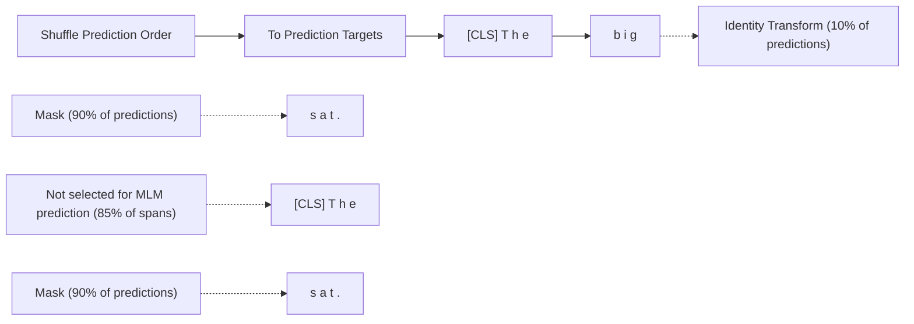

# CANINE: Pre-training an Efficient Tokenization-Free Encoder for Language Representation

Jonathan H. Clark, Dan Garrette, Iulia Turc, John Wieting

Google Research

{jhclark,dhgarrette,iuliaturc,jwieting}@google.com

## Abstract

Pipelined NLP systems have largely been superseded by end-to-end neural modeling, yet nearly all commonly-used models still require an explicit tokenization step. While recent tokenization approaches based on data-derived subword lexicons are less brittle than manually engineered tokenizers, these techniques are not equally suited to all languages, and the use of any fixed vocabulary may limit a model’s ability to adapt. In this paper, we present CANINE, a neural encoder that operates directly on character sequences—without explicit tokenization or vocabulary—and a pre-training strategy that operates either directly on characters or optionally uses subwords as a soft inductive bias. To use its finer-grained input effectively and efficiently, CANINE combines downsampling, which reduces the input sequence length, with a deep transformer stack, which encodes context. CANINE outperforms a comparable mBERT model by 5.7 F1 on TYDI QA, a challenging multilingual benchmark, despite having fewer model parameters.

## 1 Introduction

End-to-end neural models have generally replaced the traditional NLP pipeline, and with it, the error cascades and feature engineering common to such systems, preferring instead to let the model automatically induce its own sophisticated representations. Tokenization, however, is one of few holdovers from that era, with nearly all commonly-used models today requiring an explicit preprocessing stage to segment a raw text string into a sequence of discrete model inputs. Broadly speaking, tokenizers are generally either carefully constructed systems of language-specific rules, which are costly, requiring both manual feature engineering and linguistic expertise, or data-driven algorithms such as Byte Pair Encoding (Sennrich et al., 2016), WordPiece (Wu et al., 2016), or SentencePiece (Kudo and Richardson, 2018) that split strings based on frequencies in a corpus, which are less brittle and easier to scale, but are ultimately too simplistic to properly handle the wide range of linguistic phenomena that can’t be captured by mere string-splitting (§2.1).

The degree of sophistication required to accurately capture the full breadth of linguistic phenomena, along with the infeasibility of writing such rules by hand across all languages and domains, suggests that explicit tokenization itself is problematic. In contrast, an end-to-end model that operates directly on raw text strings would avoid these issues, instead learning to compose individual characters into its own arbitrarily complex features, with potential benefits for both accuracy and ease of use. While this change is conceptually very simple—one could replace the subword vocabulary in a model like BERT (Devlin et al., 2019) with a vocabulary made solely of individual characters—doing so leads to two immediate problems. First, the computational complexity of a transformer (Vaswani et al., 2017), the main components in B as well as other models such as GPT (Radford et al., 2019; Brown et al., 2020) and T5 (Raffel et al., 2020), grows quadratically with the length of the input. Since standard subword models have roughly four characters per subword on average, the 4x increase in input sequence length would result is a significantly slower model. Second, simply switching to a character vocabulary yields empirically poor results (§4.2).

In order to enable tokenization-free modeling that overcomes these obstacles, we present

CANINE. CANINE is a large language encoder with a deep transformer stack at its core. Inputs to the model are sequences of Unicode characters.<sup>1</sup> To represent the full space of Unicode characters<sup>2</sup> without a vocabulary, we employ a hashing strategy. To avoid the slowdown from increasing the sequence length, CANINE uses strided convolutions to downsample input sequences to a shorter length before the deep transformer stack.

Like BERT, we pre-train CANINE on the Masked Language Model (MLM) and Next Sentence Prediction (NSP) tasks. For the MLM task, CANINE offers two options:

1. A fully character-level loss that autoregressively predicts characters in masked spans.  
2. A vocabulary-based loss that predicts the identities of masked subword tokens. Critically, this tokenization is used only for the pre-training loss; tokens are never input to the encoder, and the tokenizer and subword vocabulary can be safely discarded after pretraining. This effectively converts the hard constraint of token boundaries found in other models into a soft inductive bias in CANINE.

In this article, we contribute:

• the first pre-trained tokenization-free deep encoder;  
• an efficient model architecture that directly encodes long sequences of characters with speed comparable to vanilla BERT; and  
• a model that performs no tokenization on the input, avoiding the lossy information bottleneck associated with most pre-processing.

## 2 Motivation

## 2.1 Linguistic pitfalls of tokenization

Subword tokenizers are the de-facto standard in modern NLP (Devlin et al., 2019; Raffel et al., 2020; Brown et al., 2020). These algorithms are limited to only simple word-splitting operations. While this is perhaps a reasonable approach for a language with impoverished morphology such as English, it is much less appropriate in the face of phenomena like agglutinative morphology, nonconcatenative morphology, consonant mutation, vowel harmony, etc.

<table><tr><td>کتب</td><td>k-t-b</td><td>“write” (root form)</td></tr><tr><td>کتَبَ</td><td>kataba</td><td>“he wrote”</td></tr><tr><td>کتَبَ</td><td>kattaba</td><td>“he made (someone) write”</td></tr><tr><td>إکتَبَ</td><td>iktataba</td><td>“he signed up”</td></tr></table>

Table 1: Non-concatenative morphology in Arabic.<sup>4</sup> When conjugating, letters are interleaved within the root. The root is therefore not separable from its inflection via any contiguous split.

Even in high-resource languages, subword models still tend to struggle on challenging domains, such as informal text, which often includes typos, spelling variation,<sup>5</sup> transliteration, or emoji (O’Connor et al., 2010). BERT, which uses Word-Piece tokenization, is sensitive to corruptions of the input, both natural typos (Sun et al., 2020) and adversarial manipulations (Pruthi et al., 2019), with some of the loss attributable to corrupted strings no longer being covered by the vocabulary.

Seemingly safe heuristics used by these algorithms, such as splitting on whitespace and punctuation, are problematic when applied to languages that do not use spaces between words (Thai, Chinese) or use punctuation as letters (Hawaiian,<sup>6</sup> Twi<sup>7</sup>). While SentencePiece does offer the option to skip whitespace splitting, it is not typically used due to poor empirical performance.

Fixed vocabulary methods can also force modelers to choose between difficult preprocessing tradeoffs: should one keep accents, casing, etc. and avoid destructive preprocessing?—Or keep such orthographic information and risk important words dropping out of the frequency-based vocabulary altogether due to the presence of multiple variants of otherwise-similar words? For instance, mBERT initially removed all diacritics, thus dropping tense information in Spanish<sup>8</sup> and conflating many unrelated words in Vietnamese.<sup>9</sup>

Finally, using a fixed vocabulary during pretraining also creates complications for downstream tasks, which are subsequently tied to the same tokenizer and vocabulary used for pretraining, even if it is not well-suited for the target domain and/or end-task. Boukkouri et al. (2020) showed that BERT’s Wikipedia+BooksCorpus WordPiece vocabulary results in excessive segmentation when fine-tuning on medical data, diminishing the benefit of pre-training as a strategy.

## 2.2 Enabling better generalization

Much as Tenney et al. (2019) showed that large encoders learn elements of the classic NLP pipeline, it seems natural to let the model discover tokenization as well. With this in mind, we seek an approach that can better generalize beyond the orthographic forms encountered during pre-training.

In terms of scientific inquiry, we would like to know whether we can build models that learn how to compose words where appropriate, and memorize them where memorization is needed. Large frequency-derived vocabularies partially mitigate this problem by simply memorizing more, but language inherently requires aspects of both memorization and composition. By building a model that directly engages with these issues within the small scale of word composition, we hope to enable future work studying these problems at larger scales such as phrasal constructions.

Practically, generalization is hindered for vocabulary elements that are slight orthographic variations, where one is very infrequent. Hypothetically, a model may estimate a very good embedding for a common vocabulary element kitten, but a poor embedding for the less frequent element kittens since the model has no a priori knowledge that they are related. Embeddings that are rarely touched during pre-training will not be updated much beyond their random initializations.

## 2.3 Reducing engineering effort

Mature tokenizers often include years of handengineered rules around special cases such as email addresses, URLs, and handling unknown words;<sup>10</sup> even fairly minimal modern tokenizers include initial word-splitting heuristics followed by a specific algorithm and vocabulary for further breaking these tokens into subwords.

Modern pre-trained models also have many requirements throughout their lifecycle: Between the time a model is pre-trained, fine-tuned, and served—potentially months or years apart—its weights and model implementation may be converted to be compatible with another toolkit, its fine-tuning data may be tokenized in a different way, and the natural distribution of words may be quite different. All of these things introduce ample opportunities for mismatches to arise between tokenization and the vocabulary from pre-training. Yet this same pre-training paradigm presents an advantage for character models: access to a far more (unsupervised) data to learn word composition from characters; without transfer learning, this has historically been impractical for many tasks having little supervised data.

## 3 CANINE

CANINE consists of three primary components: (1) a vocabulary-free technique for embedding text; (2) a character-level model that is efficient by means of downsampling and upsampling; and (3) an effective means of performing masked language modeling on a character-level model.

## 3.1 Model

CANINE is designed to be a minimally modified variant of the deep transformer stack found in modern encoders such as GPT, (m)BERT, XLM, and XLM-R such that its architecture is easily adoptable by other models in this family. The simplest implementation of such a character model would be to feed characters at each position in place of subwords. However, this approach would result in far more sequence positions given the same input text, leading to linearly more compute in feed forward layers and quadratically more compute in self-attention layers.

The overall form of the CANINE model is the composition of a downsampling function DOWN, a primary encoder ENCODE, and an upsampling function $\mathrm { \bar { U } P ; ^ { 1 1 } }$ given an input sequence of character embeddings $\mathbf { e } \in \mathbb { R } ^ { n \times d }$ with length n and dimensionality d:

$$
\mathbf {Y} _ {\text {seq}} \leftarrow \operatorname{UP} \left(\operatorname{ENCODE} \left(\operatorname{DOWN} (\mathbf {e})\right)\right)
$$


<details>
<summary>flowchart</summary>

```mermaid
graph LR
  A["x"] -->|"Hash Embedding"| B["e"]
  C["Codepoint Integers"] -.-> B
  D["Character Embeddings"] -->|"Single Local Transformer"| E["h_init"]
  F["Contextualized Characters"] -.->|"Downsample (Strided Convolution)"| G["h_down"]
  H["Deep Transformer Stack"] -.->|"Upsampling"| I["&quot;ycls\nPosition 0\nUsed as [CLS"]\nrepresentation for classification"] --> J["h'_down"]
  K["Concatenated Convolved Representations"] -.-> L["yseq"]
  M["Final Character Representation for Sequence Tasks"] --> N["yseq"]
```
</details>

Figure 1: CANINE neural architecture.

where $\mathbf { Y } _ { \mathrm { s e q } } \in \mathbb { R } ^ { n \times d }$ is the final representation for sequence prediction tasks. Similarly, for classification tasks, the model simply uses the zeroth element of the primary encoder:

$$
\mathbf {y} _ {\mathrm{cls}} \leftarrow \left[ \operatorname{ENCODE} \left(\operatorname{DOWN} (\mathbf {e})\right) \right] _ {0}
$$

Preprocessing Like existing models, the input to CANINE must ultimately be represented as a sequence of integers, but because the nature of characters is well-defined and standardized by Unicode, preprocessing code that would typically be hundreds or thousands of lines can be replaced by a very simple procedure: just iterate over the characters in the input string, and return their codepoint integer values (e.g., a single line of code<sup>12</sup> in Python). Furthermore, because codepoint values are part of the Unicode Standard, they are documented publicly, already supported by programming languages, and will not change over time, unlike arbitrary vocabulary-based IDs.

Character hash embeddings CANINE uses hashing (Svenstrup et al., 2017) to support embedding the full space of Unicode codepoints with a relatively small number of parameters, but to reduce the chance that different codepoints will share exactly the same representation, we define a generalization of the standard hashing approach in which we apply multiple hash functions to each codepoint and concatenate the representations associated with the various hash values.

More formally, given a single codepoin $\cdot ^ { 1 3 } ~ x _ { i } \in$ N, we apply K hash functions $\mathcal { H } _ { k } : \mathbb { N }  \mathbb { N } ,$ and look up each hashing result in its own embedding matrix<sup>14</sup> $\mathcal { E } _ { k } \in \mathbb { R } ^ { B \times \smile }$ , yielding K embeddings of size $d ^ { \prime } = d / \kappa$ , which are then concatenated into a single representation of size d:

$$
e _ {i} \leftarrow \bigoplus_ {k} ^ {K} \text {LOOKUP} \left(\mathcal {H} _ {k} (x _ {i}) \% B, \mathcal {E} _ {k}\right)
$$

where ⊕ denotes vector concatenation. We refer to these as the character embeddings $\mathbf { e } \in \mathbb { R } ^ { n \times d } .$ In our experiments, we use $d = 7 6 8 , K = 8$ , and $B = 1 6 \mathrm { { k } } ^ { 1 5 }$

While each individual hash function is subject to hash collisions,<sup>16</sup> the overall effect is minimal since each function only accounts for a small portion of the codepoint’s overall embedding, and it is highly improbable that the other hash functions will produce the same collisions.

Because the model always supports all codepoints, it is possible to learn representations during fine-tuning for characters (and, by extension, words, scripts, etc.) that were never seen during pre-training, while still making use of what pretraining learned about word composition and sentence structure.

Optional vocabulary-free n-grams We can also redefine the embeddings $e _ { i }$ above to include character n-grams, again without a fixed vocabulary, such that each n-gram order contributes equally to a summed embedding:<sup>17</sup>

$$
e _ {i} ^ {N} \leftarrow \bigoplus_ {k} ^ {K} \sum_ {j} ^ {N} \text {LOOKUP} \left(\mathcal {H} _ {k} ^ {\prime} (x _ {i \dots j}) \% B, \mathcal {E} _ {j, k}\right)
$$

$$
\mathcal {H} _ {k} ^ {\prime} (x _ {i \dots j}) = \left\{ \begin{array}{l l} \mathcal {H} _ {k} (x _ {i}) & \text {if} i = j \\ \mathcal {H} _ {k} ^ {\prime} \left(x _ {i} + \mathcal {H} _ {k} ^ {\prime} (x _ {(i + 1) \dots j})\right) & \text {o / w} \end{array} \right.
$$

This formulation still admits tokenization-free modeling, but provides the model with an inductive bias that favors slightly more memorization via a compute-cheap means of adding parameters. Notably, it also allows the model’s input signature to remain a simple sequence of codepoints.

Downsampling To make CANINE efficient, we use a multi-part downsampling strategy. First, we encode characters using a single-layer block-wise local attention transformer. This model performs self-attention only within each block of a predefined size,<sup>18</sup> saving the quadratic cost of attention while leveraging the linguistic intuition that word composition—i.e., the kind of composition relevant in the lowest layers of the model (Tenney et al., 2019)—tends to happen at a very local level. Next, we use a strided convolution to reduce the number of sequence positions to be similar to that of a word piece model.<sup>19</sup> Given character embeddings $\mathbf { e } \in \mathbb { R } ^ { n \times d }$ with a sequence length of n characters and dimensionality $d ,$ we use a convolution with a stride of r to downsample the sequence:

$$
\mathbf {h} _ {\text {init}} \leftarrow \text {LOCALTRANSFORMER} _ {1} (\mathbf {e})
$$

$$
\mathbf {h} _ {\text {down}} \leftarrow \text {STRIDEDCONV} (\mathbf {h} _ {\text {init}}, r)
$$

We refer to this output as the downsampled positions: $\mathbf { h } _ { \mathrm { d o w n } } \ \in \ \mathbb { R } ^ { m \times d }$ where $\begin{array} { r } { m \ = \ n / r } \end{array}$ is the number of downsampled positions. In our experiments, we use $r \ = \ 4$ and $n \ = \ 2 0 4 8$ such that $m = 5 1 2 ,$ giving CANINE’s primary encoder—the transformer stack—the same length as in mBERT.

Deep transformer stack After downsampling, CANINE applies a deep transformer stack with L layers to the resulting downsampled positions. This is the same as the core of BERT and derivative models, and remains the core of CANINE in that it accounts for the vast majority of its compute and parameters, though we note that this middle portion of the model could easily be replaced with any other sequence-to-sequence model including those with better compute performance such as Performer (Choromanski et al., 2021), Big Bird (Zaheer et al., 2020), RFA (Peng et al., 2021), ETC (Ainslie et al., 2020), etc. This portion of the model yields a new downsampled representation

$$
\mathbf {h} _ {\text {down}} ^ {\prime} \in \mathbb {R} ^ {m \times d}:
$$

$$
\mathbf {h} _ {\text {down}} ^ {\prime} \leftarrow \text {TRANSFORMER} _ {L} (\mathbf {h} _ {\text {down}})
$$

$$
\mathbf {y} _ {\mathrm{cls}} = [ \mathbf {h} _ {\text {down}} ^ {\prime} ] _ {0}
$$

We used $L = 1 2$ to match mBERT.

Upsampling While the above architecture is sufficient for classification tasks, sequence prediction tasks require that the model expose an output layer with the same sequence length as the input (i.e., characters are the model’s input and output $\tilde { \mathbf { \Gamma } } ^ { 6 } \mathbf { A } \mathbf { P } \mathbf { I } ^ { \prime \prime }$ for tasks like tagging and span prediction).

We reconstruct a character-wise output representation by first concatenating the output of the original character transformer (above) with the downsampled representation produced by the deep transformer stack. (Note that since each downsampled position is associated with exactly r characters for a downsampling rate of $r ,$ each position of downsampled representation is replicated $r$ times before concatenation.) More formally,

$$
\mathbf {h} _ {\mathrm{up}} \leftarrow \operatorname{CONV} \left(\mathbf {h} _ {\text {init}} \oplus \mathbf {h} _ {\text {down}} ^ {\prime}, w\right)
$$

$$
\mathbf {y} _ {\mathrm{seq}} \leftarrow \text {TRANSFORMER} _ {1} \left(\mathbf {h} _ {\mathrm{up}}\right)
$$

where ⊕ indicates vector concatenation of the representations (i.e. not sequences) such that CONV projects from $\mathbb { R } ^ { n \times 2 d }$ back to $\mathbb { R } ^ { n \times d }$ across a window of w characters.<sup>20</sup> Applying a final transformer layer (standard, not local) yields a final sequence representation $\mathbf { y } _ { \mathrm { s e q } } \in \mathbb { R } ^ { n \times d }$

Residual connections While the initial character encoder (before downsampling) and final character encoder (after upsampling) both represent character positions, they conceptually have very different purposes in the network. Intuitively, we think of the initial character encoder as composing characters to create a more word-like representation, while the final character encoder is extracting the in-context representation that’s relevant for predicting the “meaning” of the content at each position; CANINE must be able to deal with additional ambiguity during upsampling since a single downsampled position may span more than one conceptual word. Because of the different roles of these induced features, we do not use residual connections from $\mathbf { h } _ { \mathrm { i n i t } }$ to $\mathbf { h } _ { \mathrm { u p } } .$


<details>
<summary>flowchart</summary>


</details>

Figure 2: CANINE-C pre-training data preparation (§3.2.1). Character-wise predictions are made by an autoregressive transformer layer that predicts then reveals one character at a time, in a shuffled order.

## 3.2 Pre-training

Recent pre-trained models ranging from BERT to T5 have largely used variations on a masked language model (MLM) task (also known as span corruption) as an unsupervised pre-training loss function—a means of generating synthetic examples that are not from any realistic task, yet prepare a model to learn realistic tasks in future phases of training (i.e. fine-tuning). The CANINE pre-training procedure retains the MLM task, and offers two distinct strategies for computing the MLM loss—autoregressive character prediction vs. subword prediction—both of which yield a fully tokenization-free model following pre-training. In our experiments, we use only one of these losses at a time.

## 3.2.1 Autoregressive Character Loss

Span-wise masking CANINE-C is an autoregressive character loss that masks character spans within each sequence. These spans are chosen based on whitespace boundaries. No punctuation splitting nor other heuristics are used. All characters within the masked span are replaced by a special mask codepoint in the input.<sup>21</sup> No random subword replacement is performed as there is no subword vocabulary.<sup>22</sup>

Span prediction CANINE-C auto-regressively predicts the masked characters. The order of the masked positions is shuffled such that masked context is not necessarily revealed left-to-right, but rather a single character at a time. The pre-training data preparation is shown in Figure 2. Masked inputs are fed to the model as x. The output of the CANINE model $\mathbf { y } _ { \mathrm { s e q } }$ and the embeddings $\mathbf { e _ { \mathrm { g } } }$ of the gold characters $\mathbf { g }$ (i.e. the character positions selected for MLM prediction) are concatenated and then fed through a small feed-forward neural network to project back to the original dimensionality d; these are finally shuffled and used by a single layer auto-regressive transformer with a leftto-right self-attention mask:<sup>23</sup>

$$
\hat {\mathbf {y}} \leftarrow \text {TRANSFORMER} _ {\text {AUTOREG}} \left(\mathbf {e} _ {\mathrm{g}} \oplus \mathbf {y} _ {\text {seq}}\right)
$$

This representation $\hat { \mathbf { y } }$ is then used to predict each character. To avoid wasting time on a large output weight matrix and softmax, the gold target classes t are bucketed codepoint IDs such that $t _ { i } = g _ { i } \% B$ . This is similar to the strategy used in the character hash embedder (§3.1). The occassional collisions among characters is less problematic due (a) the fact that this is an encoder-only model and (b) that the embeddings must still retain contextual information in order to correctly predict characters. Because we’re only predicting a relatively small subsequence of the input (15% in our experiments), the cost of this layer is small.

## 3.2.2 Subword Loss

We also experiment with CANINE-S, a subwordbased loss function, to demonstrate how a tokenaware pre-training loss can still be paired with a tokenization-free model such that the tokenizer and vocabulary are discarded after pre-training.

Span-wise masking Like mBERT’s MLM setup, each span in CANINE-S corresponds to a single subword. As with the autoregressive loss, all characters within the masked span are replaced with a special “mask” codepoint. Random replacements of subwords are chosen from the vocabulary of same-length subwords such that the length of the character sequence remains unchanged; more formally, given a subword selected for random replacement x and a vocabulary of subwords $V , x \mathbf { \ ' } _ { \mathbf { S } }$ replacement will be drawn from the subset of $v \in V$ where $\operatorname { L E N } ( v ) = \operatorname { L E N } ( x )$

Span prediction Within each masked character span, CANINE-S randomly selects a character position where the model will make a prediction; the model predicts the identity of the masked subword via softmax. The associated subword embeddings are discarded after pre-training.

## 3.2.3 Targeted Upsampling

By design, each final character representation (after upsampling) is a function of the output of the initial character encoder (before downsampling) and the output of the deep transformer stack— there are no inter-position dependencies across the upsampled sequence. This depends on the upsampler using position-wise feed-forward projections and a single transformer layer. During pretraining, we leverage this design to improve speed by only performing upsampling on the sequence positions that will be used by the MLM task p. More formally, we use the following equivalent<sup>24</sup> form of the UP function during pre-training:

$$
\mathbf {h} _ {\mathrm{up}} ^ {*} \leftarrow \text {GATHER} (\mathbf {p}, \mathbf {h} _ {\mathrm{up}})
$$

$$
\mathbf {y} _ {\mathrm{seq}} ^ {*} \leftarrow \text {TRANSFORMER} _ {1} \left(\mathrm{Q} = \mathbf {h} _ {\mathrm{up}} ^ {*}, \mathrm{KV} = \mathbf {h} _ {\mathrm{up}}\right)
$$

## 3.2.4 Modularity

Unlike previous models, CANINE removes both the vocabulary and tokenization algorithm as fossilized parts of the final model that must be replicated during fine-tuning and prediction. Regardless of which pre-training loss is chosen (characters or subwords), the use of these components in CANINE is limited to a detail of the pretraining procedure—an inductive bias of the loss function—that is then discarded. The fine-tuning and prediction phases of the model lifecycle never have any knowledge of what vocabulary or tokenization algorithm (if any) were used in pretraining. This allows the model to natively process untokenized data, or even process data that has been pre-processed by different tokenizers, a situation that would otherwise introduce a significant skew between training phases.

## 4 Experiments

## 4.1.1 Information-Seeking QA Data

TYDI QA: Primary Tasks TYDI QA is a dataset of information-seeking questions in 11 typologically diverse languages (Clark et al., 2020). Questions are written before answers, leading to less lexical and morphological overlap between questions and answers, which are drawn from Wikipedia. We evaluate on the primary tasks.<sup>25</sup>

Passage Selection Task (SELECTP) Given a list of the passages in a Wikipedia article, return either the index of the passage that answers the question, or return NULL if the article contains no acceptable answer.

Minimal Answer Span Task (MINSPAN) Given a full Wikipedia article, return the start and end byte indices of the minimal span that completely answers the question. Alternatively, a system may indicate that the article does not contain an answer, or return YES or NO for yes/no type questions.

## 4.1.2 Named Entity Recognition Data

We also consider the task of named entity recognition (NER), which requires the model to identify which spans of a sentence correspond to entities and label the entity type. In all of our experiments, we framed the task as sequence labeling, predicting BIO-encoded span labels.

CoNLL NER We use Spanish and Dutch data from the CoNLL 2002 NER task (Tjong Kim Sang, 2002) and English and German from the CoNLL 2003 NER task (Tjong Kim Sang and De Meulder, 2003), all from the newswire domain.

MasakhaNER To widen the scope of our experiments beyond Europoean languages, we also include MasakhaNER (Adelani et al., 2021), which includes ten African languages (Amharic, Hausa, Igbo, Kinyarwanda, Luganda, Luo, Nigerian Pidgin, Swahili, Wolof, and Yorùbá) with human annotations on local news text.

<table><tr><td>Model</td><td>Input</td><td>MLM</td><td>r</td><td>Length</td><td>Examples / sec</td><td>Params</td><td>TYDIQA SELECTP</td><td>TYDIQA MINSPAN</td></tr><tr><td>mBERT (public)</td><td>Subwords</td><td>Subwords</td><td>-</td><td>512</td><td>-</td><td>179M</td><td>63.1</td><td>50.5</td></tr><tr><td rowspan="3">mBERT (ours)</td><td>Subwords</td><td>Subwords</td><td>-</td><td>512</td><td>9000</td><td>179M</td><td>63.2</td><td>51.3</td></tr><tr><td>Chars</td><td>Single Chars</td><td>1</td><td>2048</td><td>925</td><td>127M</td><td>59.5 (-3.7)</td><td>43.7 (-7.5)</td></tr><tr><td>Chars</td><td>Subwords</td><td>1</td><td>2048</td><td>900</td><td>127M</td><td>63.8 (+0.6)</td><td>50.2 (-1.0)</td></tr><tr><td>CANINE-S</td><td>Chars</td><td>Subwords</td><td>4</td><td>2048</td><td>6400</td><td>127M</td><td>66.0 (+2.8)</td><td>52.5 (+1.2)</td></tr><tr><td>CANINE-C</td><td>Chars</td><td>Autoreg. Chars</td><td>4</td><td>2048</td><td>6050</td><td>127M</td><td>65.7 (+2.5)</td><td>53.0 (+1.7)</td></tr><tr><td>CANINE-C + n-grams</td><td>Chars</td><td>Autoreg. Chars</td><td>4</td><td>2048</td><td>5600</td><td>167M</td><td>68.1 (+4.9)</td><td>57.0 (+5.7)</td></tr></table>

Table 2: Direct comparison between mB (rows 1–2) and C (rows 5–7) on T D QA. Public mB results are taken from the TYDI QA paper. Rows 3 and 4 show simple baselines that yield inefficient / low-quality performance. Despite operating on 4x more sequence positions, CANINE remains comparable to mBERT in terms of speed. Pre-training example/sec are shown for our reported hardware (see Setup, §4.1). r represents the ratio for downsampling. Parameters are calculated at fine-tuning time. All results are averaged over 3 fine-tuning replicas. TYDI QA scores are F1 scores, macro-averaged across languages. Deltas from our mBERT (the most comparable baseline) are shown in parentheses.

## 4.1.3 Model Configuration

Direct comparison with mBERT In order to determine which pre-training architecture produces better quality downstream predictions, we compare CANINE to mBERT, which we reimplemented and re-trained in order to hold as many variables as possible constant. Note that we intentionally do not compare against public pretrained checkpoints that use different pre-training corpora since (a) this would be a major confounding variable and (b) most publicly available pretrained models are simply instantiations of BERT, including XLM-R<sup>26</sup> and X-STILTS.<sup>27</sup>

Setup We pre-train on the multilingual Wikipedia data of mBERT, which includes 104 languages. Similarly, we reuse mBERT’s exponential smoothing technique to weight the languages within the pre-training samples. We train for 124k steps with batch size 4096 (2.5 passes over the data) using the LAMB optimizer (You et al., 2020) with a linearly decayed learning rate of 0.018 where 2.5% of the steps are used for warm-up. We use a sequence length of 512 for mBERT, and 2048 for CANINE, which results in 512 downsampled positions in its core deep transformer stack. We pre-train on 64 Cloud TPUs v3<sup>28</sup> for approximately one day (see results for precise timings). For both mBERT and CANINE-S (CANINE with the subword loss), we select 15% of subwords for the MLM loss and predict up to 80 output positions; 80% of these are masked in the input, 10% are randomly replaced, and 10% are unmodified. For CANINE-C (CANINE with the autoregressive character loss), we select 15% of contiguous spans for the MLM loss and predict up to 320 output characters, and no random replacement is performed. For TYDI QA, we use a maximum answer length of 100 characters, which is approximately the 99<sup>th</sup> percentile answer length. Sequences longer than the maximum sequence length are zero-padded, following BERT.<sup>29</sup>

## 4.2 TYDI QA Results

Our main result is shown in Table 2. CANINE-S (CANINE with the subword loss) improves over mBERT in the TYDI QA SELECTP task by 2.8 F1, while using about 30% fewer parameters. Similarly, CANINE-C (CANINE with the autoregressive character loss), improves over mBERT by 2.5 F1. Adding vocab-free character n-grams leads to even further gains over mBERT (+3.8 F1) and even more on the MINSPAN task (+6.9 F1). A language-wise breakdown is provided in Table 7 in the appendix.

<table><tr><td>Question</td><td>Passage Answer</td></tr><tr><td>Chelsea inamilikiwana nani?</td><td>Kwa kawaida Chelsea huvaa jezi ya blu, kaptula blu na soksi nyeupe. Nembo ya klabu ime-badilishwa mara nyingi kulingana na wakati na kuboresha muonekano wa klabu. Nembo ya sasa inaonesha picha ya simba akiwa amebeba mkuki. Tangu Julai 2003, Chelsea imekuwa ikimilikiwana Bilionea wa Kirusi, Roman Abramovich.</td></tr><tr><td>Who owns Chelsea?</td><td>Chelsea usually wear blue jerseys, blue shorts and white socks. The club logo has been changed many times over time and improved the club’s appearance. The current emblem shows a picture of a lion carrying a spear. Since July 2003, Chelsea has been owned by Russian billionaire Roman Abramovich.</td></tr><tr><td>Kampunisisambazayoumeme nchini Kenya inaitwaje?What is the name of the company that distributes electricity in Kenya?</td><td>Kenya Power and Lighting (KPLC) ni kampuni inayohusika na maambukizi ya umeme na usambazajiwa umeme nchini Kenya.Kenya Power and Lighting (KPLC) is a company responsible for electricity transmission and distribution in Kenya.</td></tr></table>

Table 3: Kiswahili examples in which CANINE improved over mBERT in the TYDI QA SELECTP task. On examining the mBERT’s subword tokenization, we observe that the segmentations do not align well, putting more pressure on the model to combine them and more opportunities for some embeddings to be poorly estimated. Top: The model must match a key word in the question milikiwa (own) to a morphological variant in the answer iki-milikiwa (to be owned). mBERT’s WordPiece segmentation produces milik -iwa and iki -mi -iki -wa for these, respectively. Bottom: The model must match i-sambaza-yo (distributes) in the question with u-sambaza-ji (distribution). mBERT’s WordPiece segmentation produces isam -ba -za -yo and usa -mba -zaj -i.

We also present results from some ablation models as additional baselines in rows 3-4 of Table 2. First, for row 3, we simply replace BERT’s subword vocabulary with a pure character vocabulary, which makes characters both the input granularity and the unit of masking and prediction for the MLM task, and observe that not only is the model 10X slower than subword-based BERT, but the quality also suffers greatly. Then, for row 4, we modify that model to use subwords for masking and MLM predictions, while keeping characters as the input granularity, and we see a substantial quality improvement, though pre-training remains extremely slow. Finally, by comparing to the full CANINE model in row 5, we can see that adding the downsampling strategy improves speed by 700%, and also leads to an additional small bump in quality. We speculate that this additional quality gain comes from giving the model a better inductive bias toward more word-like units within the deep transformer stack.

Analysis CANINE fares particularly well on morphologically rich languages such as Kiswahili. Table 3 shows examples where CANINE outperforms mBERT on the TYDI QA SELECTP task. In particular, we observe examples where Kiswahili’s rich morphology does not hinder the matching process for CANINE.

## 4.3 Ablations

In Table 6, we consider minor modifications to the final CANINE architecture, and evaluate the effect of each on the downstream quality of the model.<sup>30</sup>

Attending directly to $\mathbf { h } _ { \mathbf { d o w n } } ^ { \prime }$ Instead of attending to the character-wise sequence $\mathbf { h } _ { \mathrm { u p } }$ , we attend to the downsampled sequence:

$$
\mathbf {y} _ {\mathrm{seq}} ^ {+} = \text {TRANSFORMER} _ {1} \left(\mathrm{Q} = \mathbf {h} _ {\mathrm{up}}, \mathrm{KV} = \mathbf {h} _ {\mathrm{down}} ^ {\prime}\right)
$$

While this change reduces the overall FLOPS of the model due to the reduced attention computation, it does not have a major effect on pre-training throughput. However, it does substantially degrade quality.

Number of hash buckets We reduce the number of hash buckets (B) from 16k to 8k, meaning more (partial) collisions in embedding lookups. This significantly hinders the MINSPAN task.

Character vocab We switch from our hashbased no-vocabulary strategy to using a normal character vocabulary (which we derive from the pre-training corpus). We observe that this underperforms the hashing approach. We speculate that this might be due to skew between the pre-training corpus and the final downstream task since not all codepoints can be included in the vocabulary.

Input character dimension We reduced the embedding size of the initial character encoder (i.e. the embedding size of $\mathbf { h } _ { \mathrm { i n i t } }$ and e—not $\mathbf { h } _ { \mathrm { u p } }$ nor $\mathbf { y } _ { \mathrm { s e q } } )$ and observe that quality falls off rapidly.

<table><tr><td>Model</td><td>SELECTP</td><td>MINSPAN</td></tr><tr><td>CANINE-C</td><td>65.7</td><td>53.0</td></tr><tr><td>No concatenation</td><td>17.2</td><td>35.6</td></tr><tr><td>+Final-to-initial resid.</td><td>17.3</td><td>35.9</td></tr><tr><td>+Final-to-downsampled resid.</td><td>62.0</td><td>50.2</td></tr></table>

Table 4: Ablations for residuals and feature concatenation on TYDI QA. Rows are cumulative (each row contains all changes from the previous).

No initial transformer We remove the local transformer from $\mathbf { h } _ { \mathrm { i n i t } }$ and similarly observed a marked reduction in quality.

Increased downsampling While more aggressive downsampling (a factor of 5X or 6X, rather than 4X) brings substantial speed gains, the passage-level quality degrades substantially and the minimal span predictions suffer even more.

No position-limited MLM When we do not use the trick of applying the final character transformer $( \mathbf { y } _ { \mathrm { s e q } } )$ only to the positions that will be computed by the MLM task, we observe a large reduction in speed. Since this model is theoretically equivalent in terms of operations, we show only the speed for exposition.

We also performed ablations aimed at exploring the effect of feature concatenation and residuals; results are in Table 4. Not concatenating the downsampled representation with the initial character representation when computing $\mathbf { h } _ { \mathrm { u p } }$ causes the model to become unstable (row 2); adding a residual from $\mathbf { h } _ { \mathrm { u p } }$ back to $\mathbf { h } _ { \mathrm { i n i t } }$ does not help (row 3). However, additionally inserting a residual from $\mathbf { h } _ { \mathrm { u p } }$ back to $\mathbf { h } _ { \mathrm { d o w n } } ^ { \prime }$ does stabilize the model (row 4) though it does not recover the original quality.

## 4.4 NER Results

Named entity recognition is a task in which memorization is often a very effective strategy. For example, if a model has London in its vocabulary and sees it with the label LOCATION during training, then it simply has to retrieve this memorized association when it sees the token London at test time. Therefore, evaluating on NER is helpful for understanding the ways in which different models emphasize memorization vs. generalization.

As shown in Table 5, CANINE-C performs significantly worse than mBERT on NER, likely due to mBERT’s memorization-friendly vocabulary. However, when (tokenization-free) n-gram features are added to CANINE-C, performance rebounds, showing that it is possible to cheaply boost a model’s memorization ability while remaining fully tokenization-free.

<table><tr><td>Model</td><td>CoNLL</td><td>MasakhaNER</td></tr><tr><td>mBERT (ours)</td><td>87.8</td><td>72.4</td></tr><tr><td>CANINE-C</td><td>74.0 (-13.8)</td><td>65.5 (-6.9)</td></tr><tr><td>CANINE-C + n-grams</td><td>86.7 (-1.1)</td><td>76.8 (+4.3)</td></tr></table>

Table 5: F1 scores on NER tasks.

A full language-wise breakdown is provided in the appendix (Table 8). It’s worth noting that part of the performance difference on MasakhaNER is due to mBERT producing no usable outputs for Amharic. The mBERT pre-training data does not contain Amharic (or any Amharic-script text), so it has no vocabulary entries to Amharic’s script (meaning that mBERT sees only sequences of [UNK] on Amharic inputs). However, since CANINE always supports the full Unicode space, it is able to achieve 50 F1 even though it, too, had never seen Amharic text during pre-training. We take this as validation of CANINE’s vocabularyfree approach. It may also be evidence that CANINE exhibits cross-script transfer abilities analogous to those in mBERT (Pires et al., 2019).

Error analysis CANINE-C tends not to label rarer lexical items that mBERT appears to have memorized. For example, with CANINE-C, JCPenney (a relatively rare lexical item) is not recognized as an entity. CANINE-C also tends to separate long entities; for example, “State Street Bank and Trust Company” is labeled as two separate spans: “State Street Bank” and “Trust Company”; and the location TAMPA BAY is recognized only as TAMPA. However, adding n-grams features appears to mostly resolve this issue.

## 5 Related Work

## 5.1 Improvements to subword tokenization

Further improvements to standard subword tokenization like Byte Pair Encoding (BPE) (Sennrich et al., 2016), WordPiece (Wu et al., 2016), and SentencePiece (Kudo and Richardson, 2018) have been proposed. Subword regularization (Kudo, 2018) and BPE-dropout (Provilkov et al., 2020) recognize that deterministic segmentation during training limits the ability to leverage morphology and word composition; instead, they sample at random one of the multiple tokenizations of the training input, made possible by the inherent ambiguity of subword vocabularies. Wang et al. (2021) recently expanded on this paradigm to enforce consistency of predictions over different segmentations. Unigram LM (Kudo, 2018), which builds its vocabulary top-down, was shown to align with morphology better than BPE on pretrained encoders (Bostrom and Durrett, 2020).

<table><tr><td>Condition</td><td>Examples / sec</td><td>TYDI QA SELECTP</td><td>TYDI QA MINSPAN</td></tr><tr><td>Attend to  $h'_{down}$  (instead of  $h_{up}$ )</td><td>6400</td><td>64.5</td><td>52.2</td></tr><tr><td>8k codepoint hash buckets (instead of 16k)</td><td>6400</td><td>64.1 (-0.4)</td><td>50.5 (-1.7)</td></tr><tr><td>Character vocab (no hashing)</td><td>6400</td><td>64.6 (+/-)</td><td>51.2 (-1.0)</td></tr><tr><td>Input character dim 384 (instead of 768)</td><td>6600</td><td>62.9 (-1.2)</td><td>49.3 (-1.2)</td></tr><tr><td>Input character dim 192 (instead of 768)</td><td>6400</td><td>61.7 (-2.4)</td><td>47.3 (-3.2)</td></tr><tr><td>No initial character transformer</td><td>6700</td><td>63.2 (-1.4)</td><td>48.3 (-2.9)</td></tr><tr><td>Downsample by a factor of 5 (instead of 4)</td><td>7000</td><td>62.9 (-1.7)</td><td>49.2 (-2.0)</td></tr><tr><td>Downsample by a factor of 6 (instead of 4)</td><td>9200</td><td>62.7 (-1.9)</td><td>47.6 (-3.6)</td></tr><tr><td>Don’t limit final character transformer to MLM positions</td><td>5200</td><td>—</td><td>—</td></tr><tr><td>CANINE-S</td><td>6400</td><td>66.0</td><td>52.5</td></tr></table>

Table 6: Ablation experiments on the CANINE model with TYDI QA F1 scores. Deltas are shown in parentheses with regard to the top-most experiment, which serves as the baseline configuration for all experiments in this table. Each result is averaged over 3 fine-tuning and evaluation replicas.

Others have built hybrid models that use multiple granularities, combining characters with tokens (Luong and Manning, 2016) or different subword vocabularies (Zhang and Li, 2021).

## 5.2 Character-level models

Following the larger NLP trend, character-level n-gram models (Huang et al., 2013; Wieting et al., 2016; Bojanowski et al., 2017) have mostly been replaced by neural networks. While generally lagging behind their word-level counterparts, character-level features are important for morphologically rich languages, particularly in lowresource settings (Garrette and Baldridge, 2013).

For language modeling Character language models (CLMs) have used vanilla RNN architectures to produce distributions over sequences of characters in a purely tokenization-free manner (Sutskever et al., 2011; Graves, 2013; Hwang and Sung, 2017; Radford et al.). Hierarchical RNNs modeled the assumption that language operates on increasing layers of abstraction: Chung et al. (2017) jointly trained a sub-module to segment the character-level input into larger spans at each layer of a stacked LSTM.

Due to the consistent lag in performance behind their word-level counterparts, attention shifted from pure CLMs towards merely character-aware models, still reliant on traditional tokenization.

Some hybrid models processed the input at character level, but predicted words from a closed vocabulary (Kim et al., 2016; Gerz et al., 2018). Others reintroduced explicit tokenization on the input side, and either generated bursts of character sequences that formed an open vocabulary (Kawakami et al., 2017) or used a character-only generator as a fallback when the main closedvocabulary word generator produced a rare or unknown token (Matthews et al., 2019; Mielke and Eisner, 2019). Especially after the popularization of the inherently ambiguous subword vocabularies like BPE, several studies moved beyond a single input segmentation and marginalized over all possible segmentations (van Merriënboer et al., 2017; Buckman and Neubig, 2018; Grave et al., 2019).

Coming full circle, Kawakami et al. (2019) induced a lexicon without any explicit supervision, reverting back to pure CLMs. In a revitalized effort to bring them on-par with coarser granularities, researchers leveraged external resources such as grounding in vision (Kawakami et al., 2019) or multi-task learning together with supervised morphology tasks (Blevins and Zettlemoyer, 2019).

After the transformer (Vaswani et al., 2017) replaced RNNs as the dominant architecture in NLP, character-level models followed. Al-Rfou et al. (2019) showed that byte-level vanilla Transformers significantly underperform their word-level counterparts. A similar finding was reported by Radford et al. (2019). Although the gap has been reduced (Choe et al., 2019), subword transformers remain the status quo for pure language modeling.

For specific tasks In parallel with LM efforts, the neural machine translation (NMT) community sought to solve its open-vocabulary problem via character-level modeling. Luong and Manning (2016) proposed a hybrid model that operated mainly at the word level, but consulted a characterlevel LSTM for unknown words; this was a practical compromise, as their character-only model took 3 months to train. Lee et al. (2017) enabled pure character NMT by shortening the input length via convolutional, pooling, and highway layers. Notably, their many-to-English model outperformed its subword counterpart and most bilingual baselines, with a 35% increase in training time (on a single GPU) compared to a baseline BPE-to-char model. CANINE has a similar motivation, but operates in the context of pre-trained transformers; training is 7x faster compared to a char-to-char baseline (on TPU v3), and has a 28% increase in training time over mBERT (Table 2).

Character information has been leveraged for many other end tasks as well, including: text classification (Zhang et al., 2015; Zhang and LeCun, 2017), part-of-speech tagging and NER (Gillick et al., 2016; Akbik et al., 2018; Pinter et al., 2019), named entity detection (Yu et al., 2018), dependency parsing (Vania et al., 2018), and machine reading comprehension (Hewlett et al., 2018). Character information proved particularly useful for low-resource languages (Xie et al., 2018), phenomena such as code-switching and transliteration (Ball and Garrette, 2018), and rich morphology (Vania and Lopez, 2017), previously receiving special modeling including adaptor grammars (Botha and Blunsom, 2013).

For transfer learning Token-based models have also been augmented with character-level information in the context of transfer learning, where encoders trained with unsupervised objectives are repurposed to solve downstream tasks. Pinter et al. (2017) addressed the out-ofvocabulary problem of static pre-trained word embeddings by training a model to map the surface of a word to its pre-trained representation, and used it on unknown words. ELMo (Peters et al., 2018), a bidirectional LSTM model, applied character convolutions to its whitespace-separated input tokens. CharacterBERT (Boukkouri et al., 2020) ported this technique to BERT, augmenting its existing WordPiece-tokenized input. Consistent with previous observations that feeding characters into a transformer stack comes with a huge computational cost while not improving over tokenizationbased approaches (Al-Rfou et al., 2019), a BERT model fine-tuned for semantic parsing achieved gains only when characters complemented subwords (van Noord et al., 2020).

## 5.3 Multilingual models

Multilingual NLP has been dominated by deep pre-trained multilingual models whose subword vocabularies are shared across languages. Such models borrow their architectures from monolingual predecessors and apply joint training in 100+ languages, either with unsupervised LM losses: mBERT, mT5 (Xue et al., 2021), or with additional translation losses: XLM (Lample and Conneau, 2019), XLM-R (Conneau et al., 2020). Chung et al. (2020) extended this by forming language clusters with per-cluster vocabularies. To accommodate languages unseen during pre-training, Wang et al. (2020) extended the vocabulary and continued pre-training.

## 6 Conclusion

In this article, we described CANINE, which is, to our knowledge, the first pre-trained deep encoder for language understanding that uses a tokenization-free, vocabulary-free model, while surpassing the quality of models built on top of heuristic tokenizers. CANINE eliminates many engineering pitfalls for practitioners and opens up new research directions for the community.

## Acknowledgements

The authors wish to thank Noah Constant, Rami Al-Rfou, Kristina Toutanova, Kenton Lee, Ming-Wei Chang, and Tim Dozat for their feedback on this work. We would also like to thank Martin Njoroge and Nanjala Misiko for their consultations on the Kiswahili examples, Diana Akrong for consulting on Twi orthography, and Waleed Ammar for consulting on Arabic morphology.

## References

David Ifeoluwa Adelani, Jade Abbott, Graham Neubig, Daniel D’souza, Julia Kreutzer, Constantine Lignos, Chester Palen-Michel, Happy Buzaaba, Shruti Rijhwani, Sebastian Ruder, Stephen Mayhew, Israel Abebe Azime, Shamsuddeen H. Muhammad, Chris Chinenye Emezue, Joyce Nakatumba-Nabende, Perez Ogayo, Aremu Anuoluwapo, Catherine Gitau, Derguene Mbaye, Jesujoba Alabi, Seid Muhie Yimam, Tajuddeen Rabiu Gwadabe, Ignatius Ezeani, Rubungo Andre Niyongabo, Jonathan Mukiibi, Verrah Otiende, Iroro Orife, Davis David, Samba Ngom, Tosin Adewumi, Paul Rayson, Mofetoluwa Adeyemi, Gerald Muriuki, Emmanuel Anebi, Chiamaka Chukwuneke, Nkiruka Odu, Eric Peter Wairagala, Samuel Oyerinde, Clemencia Siro, Tobius Saul Bateesa, Temilola Oloyede, Yvonne Wambui, Victor Akinode, Deborah Nabagereka, Maurice Katusiime, Ayodele Awokoya, Mouhamadane MBOUP, Dibora Gebreyohannes, Henok Tilaye, Kelechi Nwaike, Degaga Wolde, Abdoulaye Faye, Blessing Sibanda, Orevaoghene Ahia, Bonaventure F. P. Dossou, Kelechi Ogueji, Thierno Ibrahima DIOP, Abdoulaye Diallo, Adewale Akinfaderin, Tendai Marengereke, and Salomey Osei. 2021. MasakhaNER: Named Entity Recognition for African Languages. TACL.  
Joshua Ainslie, Santiago Ontanon, Chris Alberti, Vaclav Cvicek, Zachary Fisher, Philip Pham, Anirudh Ravula, Sumit Sanghai, Qifan Wang, and Li Yang. 2020. ETC: Encoding Long and Structured Inputs in Transformers. In Proc. of EMNLP.  
Alan Akbik, Duncan Blythe, and Roland Vollgraf. 2018. Contextual String Embeddings for Sequence Labeling. In Proc. ofCOLING.  
Rami Al-Rfou, Dokook Choe, Noah Constant, Mandy Guo, and Llion Jones. 2019. Characterlevel language modeling with deeper selfattention. In Proc. ofAAAI.  
Kelsey Ball and Dan Garrette. 2018. Part-of-Speech Tagging for Code-Switched, Transliterated Texts without Explicit Language Identification. In Proc. ofEMNLP.  
Terra Blevins and Luke Zettlemoyer. 2019. Better character language modeling through morphology. In Proc. of ACL.  
Piotr Bojanowski, Edouard Grave, Armand Joulin, and Tomas Mikolov. 2017. Enriching word vectors with subword information. TACL.  
Kaj Bostrom and Greg Durrett. 2020. Byte pair encoding is suboptimal for language model pretraining. In Findings of the Association for Computational Linguistics: EMNLP.  
Jan A. Botha and Phil Blunsom. 2013. Adaptor Grammars for learning non-concatenative morphology. In Proc. ofEMNLP.  
Hicham El Boukkouri, Olivier Ferret, Thomas Lavergne, Hiroshi Noji, Pierre Zweigenbaum, and Junichi Tsujii. 2020. CharacterBERT: Reconciling ELMo and BERT for Word-Level Open-Vocabulary Representations From Characters. In Proc. ofCOLING.  
Tom Brown, Benjamin Mann, Nick Ryder, Melanie Subbiah, Jared D Kaplan, Prafulla Dhariwal, Arvind Neelakantan, Pranav Shyam, Girish Sastry, Amanda Askell, Sandhini Agarwal, Ariel Herbert-Voss, Gretchen Krueger, Tom Henighan, Rewon Child, Aditya Ramesh, Daniel Ziegler, Jeffrey Wu, Clemens Winter, Chris Hesse, Mark Chen, Eric Sigler, Mateusz Litwin, Scott Gray, Benjamin Chess, Jack Clark, Christopher Berner, Sam McCandlish, Alec Radford, Ilya Sutskever, and Dario Amodei. 2020. Language models are few-shot learners. In Proc. ofNeurIPS.  
Jacob Buckman and Graham Neubig. 2018. Neural lattice language models. TACL.  
Dokook Choe, Rami Al-Rfou, Mandy Guo, Heeyoung Lee, and Noah Constant. 2019. Bridging the Gap for Tokenizer-Free Language Models. arXiv preprint arXiv:1908.10322.  
Krzysztof Choromanski, Valerii Likhosherstov, David Dohan, Xingyou Song, Andreea Gane, Tamas Sarlos, Peter Hawkins, Jared Davis, Afroz Mohiuddin, Lukasz Kaiser, David Belanger, Lucy Colwell, and Adrian Weller. 2021. Rethinking Attention with Performers. In Proc. ofICLR.  
Hyung Won Chung, Dan Garrette, Kiat Chuan Tan, and Jason Riesa. 2020. Improving Multilingual Models with Language-Clustered Vocabularies. In Proc. ofEMNLP.  
Junyoung Chung, Sungjin Ahn, and Yoshua Bengio. 2017. Hierarchical Multiscale Recurrent Neural Networks. In Proc. ofICLR.  
Jonathan H. Clark, Eunsol Choi, Michael Collins, Dan Garrette, Tom Kwiatkowski, Vitaly Nikolaev, and Jennimaria Palomaki. 2020. TyDi QA: A benchmark for Information-Seeking Question Answering in Typologically Diverse Languages. TACL.  
Alexis Conneau, Kartikay Khandelwal, Naman Goyal, Vishrav Chaudhary, Guillaume Wenzek, Francisco Guzmán, Edouard Grave, Myle Ott, Luke Zettlemoyer, and Veselin Stoyanov. 2020. Unsupervised Cross-lingual Representation Learning at Scale. In Proc. ofACL.  
Zihang Dai, Guokun Lai, Yiming Yang, and Quoc V. Le. 2020. Funnel-Transformer: Filtering out Sequential Redundancy for Efficient Language Processing. In Proc. ofNeurIPS.  
Jacob Devlin, Ming-Wei Chang, Kenton Lee, and Kristina Toutanova. 2019. BERT: Pre-training of Deep Bidirectional Transformers for Language Understanding. In Proc. ofNAACL.  
Dan Garrette and Jason Baldridge. 2013. Learning a part-of-speech tagger from two hours of annotation. In Proc. ofNAACL.  
Daniela Gerz, Ivan Vulic, Edoardo Ponti, Jason´ Naradowsky, Roi Reichart, and Anna Korhonen. 2018. Language Modeling for Morphologically Rich Languages: Character-Aware Modeling for Word-Level Prediction. TACL.  
Dan Gillick, Cliff Brunk, Oriol Vinyals, and Amarnag Subramanya. 2016. Multilingual Language Processing From Bytes. In Proc. of NAACL.  
Edouard Grave, Sainbayar Sukhbaatar, Piotr Bojanowski, and Armand Joulin. 2019. Training hybrid language models by marginalizing over segmentations. In Proc. ofACL.  
Alex Graves. 2013. Generating sequences with recurrent neural networks. arXiv preprint arXiv:1308.0850.  
Daniel Hewlett, Alexandre Lacoste, Llion Jones, Illia Polosukhin, Andrew Fandrianto, Jay Han, Matthew Kelcey, and David Berthelot. 2018. Byte-Level Machine Reading across Morphologically Varied Languages. In Proc. of AAAI.  
Po-Sen Huang, Xiaodong He, Jianfeng Gao, Li Deng, Alex Acero, and Larry Heck. 2013. Learning deep structured semantic models for web search using clickthrough data. In Proc. of the ACM International Conference on Information and Knowledge Management (CIKM).  
Kyuyeon Hwang and Wonyong Sung. 2017. Character-Level Language Modeling with Hierarchical Recurrent Neural Networks. In Proc. ofICASSP.  
Prabhu Kaliamoorthi, Sujith Ravi, and Zornitsa Kozareva. 2019. PRADO: Projection attention networks for document classification on-device. In Proc. ofEMNLP.  
Kazuya Kawakami, Chris Dyer, and Phil Blunsom. 2017. Learning to create and reuse words in open-vocabulary neural language modeling. In Proc. ofACL.  
Kazuya Kawakami, Chris Dyer, and Phil Blunsom. 2019. Learning to Discover, Ground and Use Words with Segmental Neural Language Models. In Proc. ofACL.  
Yoon Kim, Yacine Jernite, David Sontag, and Alexander M Rush. 2016. Character-Aware Neural Language Models. In Proc. ofAAAI.  
Taku Kudo. 2018. Subword Regularization: Improving Neural Network Translation Models with Multiple Subword Candidates. In Proc. of ACL.  
Taku Kudo and John Richardson. 2018. SentencePiece: A simple and language independent subword tokenizer and detokenizer for Neural Text Processing. In Proc. of EMNLP: System Demonstrations.  
Guillaume Lample and Alexis Conneau. 2019. Cross-lingual Language Model Pretraining. In Proc. ofNeurIPS.  
Jason Lee, Eth Zürich, Kyunghyun Cho, and Thomas Hofmann. 2017. Fully Character-Level Neural Machine Translation without Explicit Segmentation. TACL.  
Minh-Thang Luong and Christopher D. Manning. 2016. Achieving open vocabulary neural machine translation with hybrid word-character models. In Proc. ofACL.  
Austin Matthews, Graham Neubig, and Chris Dyer. 2019. Using Morphological Knowledge in Open-Vocabulary Neural Language Models. In Proc. ofNAACL.  
Sebastian J. Mielke and Jason Eisner. 2019. Spell once, summon anywhere: A two-level openvocabulary language model. In Proc. ofAAAI.  
Rik van Noord, Antonio Toral, and Johan Bos. 2020. Character-level Representations Improve DRS-based Semantic Parsing Even in the Age of BERT. In Proc. ofEMNLP.  
Brendan O’Connor, Michel Krieger, and David Ahn. 2010. TweetMotif: Exploratory Search and Topic Summarization for Twitter Introduction and Description. In Proc. of the International AAAI Conference on Web and Social Media.  
Hao Peng, Nikolaos Pappas, Dani Yogatama, Roy Schwartz, Noah Smith, and Lingpeng Kong. 2021. Random feature attention. In Proc. of ICLR.  
Matthew E. Peters, Mark Neumann, Mohit Iyyer, Matt Gardner, Christopher Clark, Kenton Lee, and Luke Zettlemoyer. 2018. Deep contextualized word representations. In Proc. ofNAACL.  
Jason Phang, Iacer Calixto, Phu Mon Htut, Yada Pruksachatkun, Haokun Liu, Clara Vania, Katharina Kann, and Samuel R Bowman. 2020. English Intermediate-Task Training Improves Zero-Shot Cross-Lingual Transfer Too. In Proc. ofAACL.  
Yuval Pinter, Robert Guthrie, and Jacob Eisenstein. 2017. Mimicking word embeddings using subword RNNs. In Proc. ofEMNLP.  
Yuval Pinter, Marc Marone, and Jacob Eisenstein. 2019. Character Eyes: Seeing Language through Character-Level Taggers. In Proc. of BlackboxNLP.  
Telmo Pires, Eva Schlinger, and Dan Garrette. 2019. How multilingual is Multilingual BERT? In Proc. ofACL.  
Ivan Provilkov, Dmitrii Emelianenko, and Elena Voita. 2020. BPE-Dropout: Simple and Effective Subword Regularization. In Proc. ofACL.  
Danish Pruthi, Bhuwan Dhingra, and Zachary C. Lipton. 2019. Combating adversarial misspellings with robust word recognition. In Proc. ofACL.  
Alec Radford, Rafal Jozefowicz, and Ilya Sutskever. Learning to Generate Reviews and Discovering Sentiment. arXiv preprint arXiv:1704.01444.  
Alec Radford, Jeff Wu, Rewon Child, David Luan, Dario Amodei, and Ilya Sutskever. 2019. Language models are unsupervised multitask learners.  
Colin Raffel, Noam Shazeer, Adam Roberts, Katherine Lee, Sharan Narang, Michael Matena, Yanqi Zhou, Wei Li, and Peter J. Liu. 2020. Exploring the limits of transfer learning with a unified text-to-text transformer. JMLR.  
Rico Sennrich, Barry Haddow, and Alexandra Birch. 2016. Neural Machine Translation of Rare Words with Subword Units. In Proc. of ACL.  
Lichao Sun, Kazuma Hashimoto, Wenpeng Yin, Akari Asai, Jia Li, Philip Yu, and Caiming Xiong. 2020. Adv-BERT: BERT is not robust on misspellings! Generating nature adversarial samples on BERT. arXiv preprint arXiv:2003.04985.  
Ilya Sutskever, James Martens, and Geoffrey E Hinton. 2011. Generating text with recurrent neural networks. In Proc. ofICML.  
Dan Svenstrup, Jonas Meinertz Hansen, and Ole Winther. 2017. Hash Embeddings for Efficient Word Representations. In Proc. of NeurIPS.  
David Talbot and John Talbot. 2008. Bloom maps. In Proc. of the Workshop on Analytic Algorithmics and Combinatorics (ANALCO).  
Ian Tenney, Dipanjan Das, and Ellie Pavlick. 2019. BERT rediscovers the classical NLP pipeline. In Proc. ofACL.  
Erik F. Tjong Kim Sang. 2002. Introduction to the CoNLL-2002 shared task: Languageindependent named entity recognition. In Proc. ofCoNLL.  
Erik F. Tjong Kim Sang and Fien De Meulder. 2003. Introduction to the CoNLL-2003 shared task: Language-independent named entity recognition. In Proc. ofNAACL.  
Bart van Merriënboer, Amartya Sanyal, H. Larochelle, and Yoshua Bengio. 2017. Multiscale sequence modeling with a learned dictionary. arXiv preprint arXiv:1707.00762.  
Clara Vania, Andreas Grivas, and Adam Lopez. 2018. What do character-level models learn about morphology? The case of dependency parsing. In Proc. ofEMNLP.  
Clara Vania and Adam Lopez. 2017. From Characters to Words to in Between: Do We Capture Morphology? In Proc. ofACL.  
Ashish Vaswani, Noam Shazeer, Niki Parmar, Jakob Uszkoreit, Llion Jones, Aidan N. Gomez, Lukasz Kaiser, and Illia Polosukhin. 2017. Attention is all you need. In Proc. ofNeurIPS.  
Xinyi Wang, Sebastian Ruder, and Graham Neubig. 2021. Multi-view subword regularization. In Proc. ofNAACL.  
Zihan Wang, Karthikeyan K, Stephen Mayhew, and Dan Roth. 2020. Extending multilingual BERT to low-resource languages. In Findings ofEMNLP.  
John Wieting, Mohit Bansal, Kevin Gimpel, and Karen Livescu. 2016. Charagram: Embedding words and sentences via character n-grams. In Proc. ofEMNLP.  
Yonghui Wu, Mike Schuster, Zhifeng Chen, Quoc V Le, Mohammad Norouzi, Wolfgang Macherey, Maxim Krikun, Yuan Cao, Qin Gao, Klaus Macherey, Jeff Klingner, Apurva Shah, Melvin Johnson, Xiaobing Liu, Łukasz Kaiser, Stephan Gouws, Yoshikiyo Kato, Taku Kudo, Hideto Kazawa, Keith Stevens, George Kurian, Nishant Patil, Wei Wang, Cliff Young, Jason Smith, Jason Riesa, Alex Rudnick, Oriol Vinyals, Greg Corrado, Macduff Hughes, and Jeffrey Dean. 2016. Google’s Neural Machine Translation System: Bridging the Gap between Human and Machine Translation. arXiv preprint arXiv:1609.08144.  
Jiateng Xie, Zhilin Yang, Graham Neubig, Noah A. Smith, and Jaime Carbonell. 2018.  
Neural cross-lingual named entity recognition with minimal resources. In Proc. ofEMNLP.  
Linting Xue, Noah Constant, Adam Roberts, Mihir Kale, Rami Al-Rfou, Aditya Siddhant, Aditya Barua, and Colin Raffel. 2021. mT5: A massively multilingual pre-trained text-to-text transformer. In Proc. ofNAACL.  
Yang You, Jing Li, Sashank Reddi, Jonathan Hseu, Sanjiv Kumar, Srinadh Bhojanapalli, Xiaodan Song, James Demmel, Kurt Keutzer, and Cho-Jui Hsieh. 2020. Large Batch Optimization for Deep Learning: Training BERT in 76 minutes. In Proc. ofICLR.  
Xiaodong Yu, Stephen Mayhew, Mark Sammons, and Dan Roth. 2018. On the strength of character language models for multilingual named entity recognition. In Proc. ofEMNLP.  
Manzil Zaheer, Guru Guruganesh, Avinava Dubey, Joshua Ainslie, Chris Alberti, Santiago Ontanon, Philip Pham, Anirudh Ravula, Qifan Wang, Li Yang, and Amr Ahmed. 2020. Big Bird: Transformers for Longer Sequences. In Proc. ofNeurIPS.  
Xiang Zhang and Yann LeCun. 2017. Which Encoding is the Best for Text Classification in Chinese, English, Japanese and Korean? arXiv preprint arXiv:1708.02657v2.  
Xiang Zhang, Junbo Zhao, and Yann LeCun. 2015. Character-level convolutional networks for text classification. In Proc. ofNeurIPS.  
Xinsong Zhang and Hang Li. 2021. AMBERT: A Pre-trained Language Model with Multi-Grained Tokenization. In Findings ofACL.

## A Appendix

<table><tr><td>Language</td><td>mBERT</td><td>CANINE-S</td><td>CANINE-C</td><td>CANINE-C + n-grams</td></tr><tr><td colspan="5">SELECTP</td></tr><tr><td>(English)</td><td>62.2</td><td>58.6 (-3.6)</td><td>61.6 (-0.6)</td><td>64.6 (+2.4)</td></tr><tr><td>Arabic</td><td>82.3</td><td>82.8 (+0.5)</td><td>82.5 (+0.2)</td><td>84.3 (+2.0)</td></tr><tr><td>Bengali</td><td>58.5</td><td>61.8 (+3.3)</td><td>62.5 (+4.0)</td><td>66.0 (+7.5)</td></tr><tr><td>Finnish</td><td>60.4</td><td>62.2 (+1.8)</td><td>63.6 (+3.2)</td><td>66.7 (+6.3)</td></tr><tr><td>Indonesian</td><td>61.3</td><td>63.5 (+2.2)</td><td>64.2 (+2.9)</td><td>65.9 (+4.6)</td></tr><tr><td>Japanese</td><td>46.2</td><td>51.7 (+5.5)</td><td>49.7 (+3.5)</td><td>51.2 (+5.0)</td></tr><tr><td>Korean</td><td>60.2</td><td>60.3 (+0.1)</td><td>59.7 (-0.5)</td><td>60.6 (+0.4)</td></tr><tr><td>Russian</td><td>62.2</td><td>64.6 (+2.4)</td><td>65.6 (+3.4)</td><td>68.5 (+6.3)</td></tr><tr><td>Swahili</td><td>58.8</td><td>67.8 (+9.0)</td><td>67.0 (+8.2)</td><td>67.2 (+8.4)</td></tr><tr><td>Telugu</td><td>81.0</td><td>82.5 (+1.5)</td><td>81.1 (+0.1)</td><td>84.6 (+3.6)</td></tr><tr><td>Thai</td><td>61.1</td><td>62.8 (+1.7)</td><td>61.2 (+0.1)</td><td>65.8 (+4.7)</td></tr><tr><td>Macro Avg</td><td>63.2</td><td>66.0 (+2.8)</td><td>65.7 (+2.5)</td><td>68.1 (+4.9)</td></tr><tr><td colspan="5">MINSPAN</td></tr><tr><td>(English)</td><td>46.0</td><td>46.3 (+0.3)</td><td>49.0 (+3.0)</td><td>51.8 (+5.8)</td></tr><tr><td>Arabic</td><td>70.7</td><td>66.9 (-3.8)</td><td>65.6 (-5.1)</td><td>73.0 (+2.3)</td></tr><tr><td>Bengali</td><td>47.3</td><td>46.7 (-0.6)</td><td>52.5 (+5.2)</td><td>57.1 (+9.8)</td></tr><tr><td>Finnish</td><td>51.1</td><td>53.0 (+1.9)</td><td>53.8 (+2.7)</td><td>57.1 (+6.0)</td></tr><tr><td>Indonesian</td><td>52.2</td><td>53.6 (+1.4)</td><td>54.4 (+2.2)</td><td>56.8 (+4.6)</td></tr><tr><td>Japanese</td><td>36.1</td><td>40.3 (+4.2)</td><td>40.7 (+4.6)</td><td>42.0 (+5.9)</td></tr><tr><td>Korean</td><td>36.8</td><td>35.7 (-1.1)</td><td>36.5 (-0.3)</td><td>39.9 (+3.1)</td></tr><tr><td>Russian</td><td>45.6</td><td>46.7 (+1.1)</td><td>47.2 (+1.6)</td><td>51.5 (+5.9)</td></tr><tr><td>Swahili</td><td>49.4</td><td>59.0 (+9.6)</td><td>57.6 (+8.2)</td><td>59.2 (+9.8)</td></tr><tr><td>Telugu</td><td>75.6</td><td>75.2 (-0.4)</td><td>74.2 (-1.4)</td><td>79.7 (+4.1)</td></tr><tr><td>Thai</td><td>48.4</td><td>47.9 (-0.5)</td><td>47.1 (-1.3)</td><td>54.2 (+5.8)</td></tr><tr><td>Macro Avg</td><td>51.3</td><td>52.5 (+1.2)</td><td>53.0 (+1.7)</td><td>57.0 (+5.7)</td></tr></table>

Table 7: Language-wise breakdown for TYDI QA primary tasks. English is parenthesized because it is not included in the overall score calculation for TYDI QA.

<table><tr><td>Language</td><td>mBERT</td><td>CANINE-C</td><td>CANINE-C + n-grams</td></tr><tr><td colspan="4">CoNLL</td></tr><tr><td>Dutch</td><td>90.2</td><td>74.7 (-15.5)</td><td>88.5 (-1.7)</td></tr><tr><td>English</td><td>91.1</td><td>79.8 (-11.3)</td><td>89.8 (-1.3)</td></tr><tr><td>German</td><td>82.5</td><td>64.1 (-18.4)</td><td>82.1 (-0.4)</td></tr><tr><td>Spanish</td><td>87.6</td><td>77.4 (-10.2)</td><td>86.5 (-1.1)</td></tr><tr><td>Macro Avg</td><td>87.8</td><td>74.0 (-13.8)</td><td>86.7 (-1.1)</td></tr><tr><td colspan="4">MASAKHANER</td></tr><tr><td>Amharic</td><td>0.0</td><td>44.6 (+44.6)</td><td>50.0 (+50.0)</td></tr><tr><td>Hausa</td><td>89.3</td><td>76.1 (-13.2)</td><td>88.0 (-1.3)</td></tr><tr><td>Igbo</td><td>84.6</td><td>75.6 (-9.0)</td><td>85.0 (+0.4)</td></tr><tr><td>Kinyarwanda</td><td>73.9</td><td>58.3 (-15.6)</td><td>72.8 (-1.1)</td></tr><tr><td>Luganda</td><td>80.2</td><td>69.4 (-10.8)</td><td>79.6 (-0.6)</td></tr><tr><td>Luo</td><td>75.8</td><td>63.4 (-12.4)</td><td>74.2 (-1.6)</td></tr><tr><td>Nigerian Pidgin</td><td>89.8</td><td>66.6 (-23.2)</td><td>88.7 (-1.1)</td></tr><tr><td>Swahili</td><td>87.1</td><td>72.7 (-14.4)</td><td>83.7 (-3.4)</td></tr><tr><td>Wolof</td><td>64.9</td><td>60.7 (-4.2)</td><td>66.5 (+1.6)</td></tr><tr><td>Yorùbá</td><td>78.7</td><td>67.9 (-10.8)</td><td>79.1 (+0.4)</td></tr><tr><td>Macro Avg</td><td>72.4</td><td>65.5 (-6.9)</td><td>76.8 (+4.3)</td></tr></table>

Table 8: Language-wise breakdown for Named Entity Recognition for the CoNLL and MasakhaNER datasets (labeled F1). mBERT obtains a score of zero on Amharic due to having no vocabulary entries in the Amharic script.