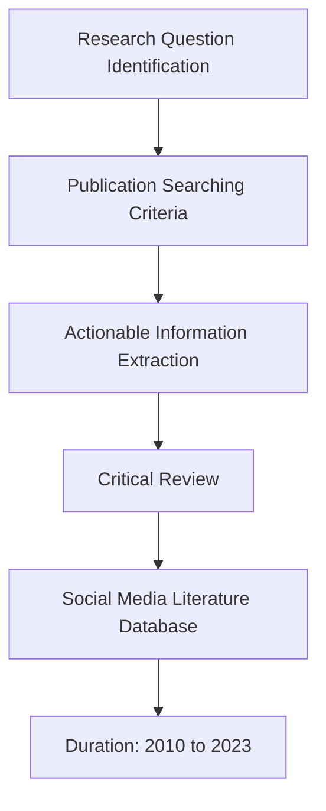
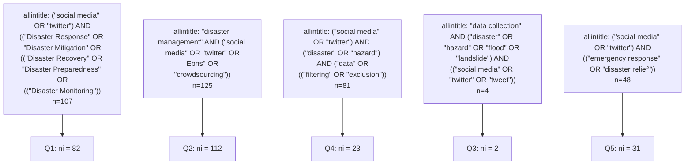
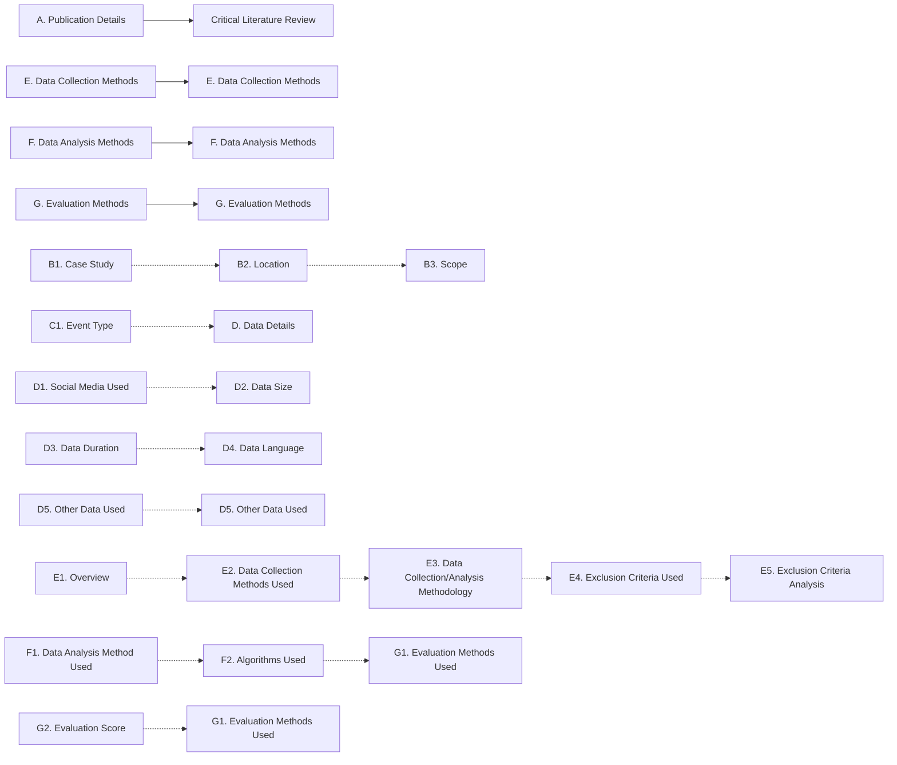
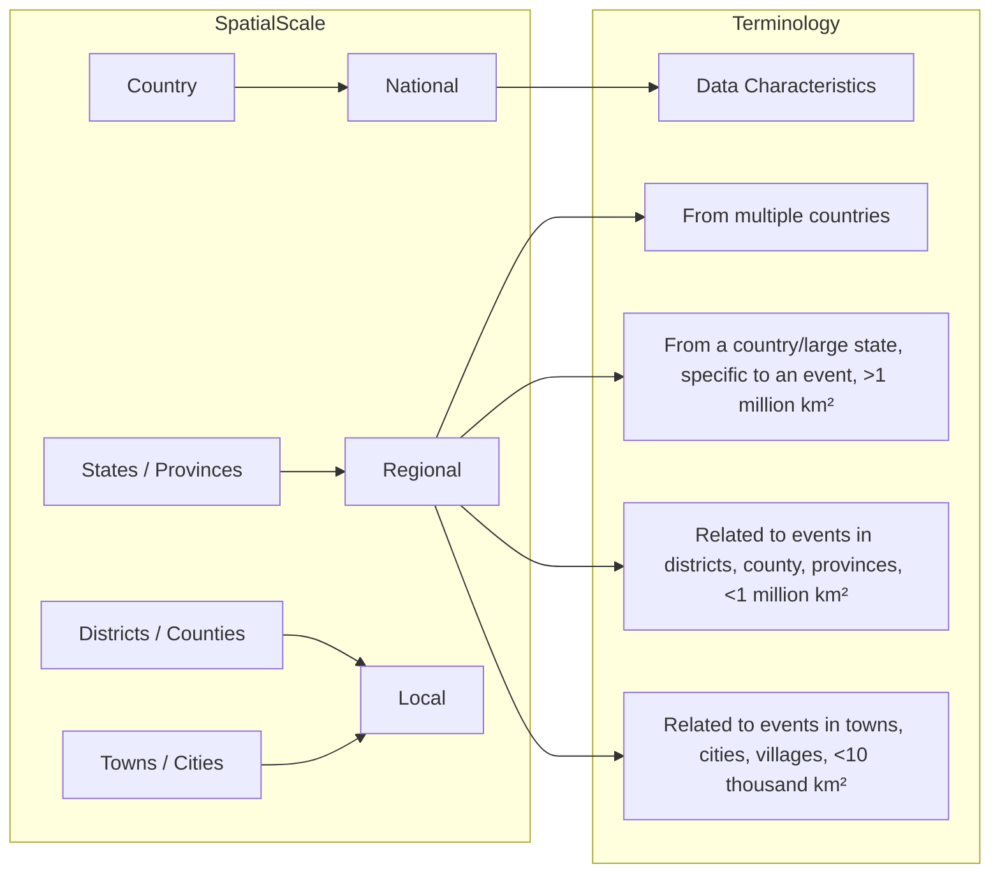

# Review article: Social media for managing disasters triggered by natural hazards: a critical review of data collection strategies and actionable insights

Lakshmi S. Gopal1, Rekha Prabha1,, Hemalatha Thirugnanam1, Maneesha Vinodini Ramesh1, and Bruce D. Malamud2

1Center for Wireless Networks & Applications (WNA), Amrita Vishwa Vidyapeetham, Amritapuri, India  
2Institute of Hazard, Risk and Resilience (IHRR), Durham University, Durham, DH1 3LE, UK  
deceased

Correspondence: Lakshmi S. Gopal (lakshmisgopal@am.amrita.edu) and Bruce D. Malamud (bruce.malamud@durham.ac.uk)

Received: 1 June 2024 – Discussion started: 17 June 2024

Revised: 2 September 2025 – Accepted: 26 October 2025 – Published: 27 January 2026

Abstract. This paper presents a comprehensive critical review of 250 studies published between January 2010 and September 2023 that examine how social media data have been used to manage disasters triggered by natural hazards. The review focuses on data collection, processing, and analysis strategies, and evaluates their effectiveness in transforming social media content into actionable information for disaster preparedness, response, and recovery. A Social Media Literature Database (SMLD) was developed to support this analysis, categorising each study into seven main categories and 27 subcategories covering (a) article details, (b) case study regions, (c) disaster events, (d) social media platforms, (e) data characteristics, (f) collection and analysis methods, and (g) evaluation approaches. The reviewed literature encompasses disasters resulting from a wide range of natural hazards, most frequently floods, hurricanes, and earthquakes, but also including storms, wildfires, volcanic eruptions, landslides, droughts, and multi-hazard events. To assess how effectively social media contributes to actionable disaster information, the studies were further classified into nine thematic areas, including (a) public discourse and sentiment analysis, (b) temporal and spatial insights, (c) relevance filtering, (d) community and stakeholder engagement, (e) disaster trend identification, and (f) resource mapping. While Twitter (X) dominated as the primary data source, other platforms such as Facebook, Instagram, Weibo, and Reddit were also employed for text, image, and video analyses. Natural

Language Processing methods, particularly content analysis, were widely used for relevance filtering and noise reduction, while Machine Learning approaches such as Support Vector Machines, Naive Bayes, and Neural Networks supported classification and event detection. Temporal and spatial analyses were common, though their effectiveness in filtering relevant data varied. The categorisation of actionable information reveals continuing research gaps in understanding community interactions, cross-platform data integration, and resource identification during and after disasters. Drawing on the reviewed studies and the authors’ own experience, six best practices are proposed for community use of social media during disasters and five for researchers seeking to enhance the integration of social media analytics into disaster management and resilience strategies.

## 1 Introduction

In the age of information, social media has become a powerful platform for communication and rapid information dissemination (McCormick et al., 2017; Wang et al., 2018; Li et al., 2018b; Fauzi, 2023). Social media platforms introduced a new direction in assisting in disaster management, enhanced situation awareness, analysing emotions, and community interaction analysis, discovering solutions unified with current technologies (Bruns and Liang,

2012; Gerlitz and Rieder, 2013; Kryvasheyeu et al., 2016; Martínez-Rojas et al., 2018; Omitola and Wills, 2019). Researchers have used textual posts to assess on-ground conditions, extract sentiments of affected individuals, and utilise associated metadata, such as geolocation and hashtags, for situational mapping (Li et al., 2018b; Wang et al., 2018). Additionally, images shared on social media platforms have been employed to estimate flood severity, infrastructure damage, and resource needs (Dashti et al., 2014; Chen et al., 2016). This critical review explores the multifaceted relationship between social media and disaster management, aiming to identify gaps, provide insights, and offer potential future directions.

While traditional media sources like newspapers, television, and radio offer reliable information, social media provides distinct advantages, including convenient access to information, interactive community engagement, and diverse situational insights from various perspectives and locations (Chatfield and Brajawidagda, 2013; Dashti et al., 2014; Li et al., 2015; Stieglitz et al., 2018; Wang and Ye, 2018). However, the challenge lies in sifting through the abundance of information to identify trustworthy and pertinent data (Smith et al., 2017; Gulnerman and Karaman, 2020; Srivastava et al., 2020).

This challenge of too much information is particularly critical in disaster scenarios where the spread of rumours and misinformation is unacceptable (Cenni et al., 2017; Yan et al., 2017). It is also important that the data extracted from social media platforms must be actionable for disaster response, recovery, relief, and rapid decision-making by authorities (Sriram et al., 2010; Li et al., 2015; Cenni et al., 2017). This critical review focuses on the process of discerning relevant and actionable data from social media to enhance disaster response and recovery efforts.

There are several existing literature reviews on Social Media Data (SMD) platform evaluations, data collection tools, and analysis methods over time (Cheng et al., 2016; Shibuya and Tanaka, 2019; Kitazawa and Hale, 2021). These reviews address the utility of SMD across various phases of disaster management. However, limited attention has been devoted to the collection and analysis of topic-relevant data with an emphasis on noise reduction for method enhancement. Even when literature explores topic discovery methods (Volkova, 2014; Cišija et al.ˇ , 2018; Qarabash and Qarabash, 2018), less focus is placed on assessing the actionability of discovered data in disaster scenarios. This critical review examines the literature, aiming to establish a classification system for actionable information, thereby assessing the practical value of SMD in disaster management.

The purpose of this critical review is twofold. First, we seek to evaluate the existing literature on the topic of socia media usage for managing disasters where we discuss the key findings, and methodologies used for relevance filtering of SMD. Second, we aim to perform an in-depth analysis of how the existing solutions helped bringing out “Actionable

Information” from SMD. By performing this critical review we aim to shed light on the various methods of SMD analysis to identify pertinent data and to suggest future directions.

Throughout the following sections, we discuss the methodologies used in the existing body of literature, major disaster events in the past decade, and emerging trends, and offer recommendations for future studies. By doing so, we hope to gain a deeper understanding of how SMD analysis can play a relevant role in improving rapid decision-making during a disaster scenario by assisting policymakers, emergency responders, researchers, and the general community.

The manuscript is organised as follows. In Sect. 2, we present our critical review methodology, which includes subsections detailing research question identification and the steps in constructing our Social Media Literature Database (SMLD) (Gopal et al., 2024). In Sect. 3, we bring in the results of the critical review methodology. In Sect. 4, we critically discuss all the categories in our SMLD to present insightful information and we propose best practices to utilise SMD for the community and researchers to improve disaster management strategies. Finally, in Sect. 5, we summarise our analysis based on the lessons learned. For reference, a list of commonly used acronyms in the manuscript is provided in Table 1.

## 2 Critical Literature Review Methodology

To construct our Social Media Literature Database (SMLD) (Gopal et al., 2024), we conducted a critical review of pertinent English-language publications using “social media” and “disaster management” related keywords, primarily sourcing content from Google Scholar. The time period covered was from January 2010 to September 2023. Section 2.2 details the specific search criteria employed in building the literature database. A two-stage screening process was implemented: an initial assessment based on titles and abstracts to shortlist relevant publications, followed by a critical review of the selected publications to confirm their relevance to the research topic.

We have taken elements from Boaz et al. (2002) to follow a specific protocol for the critical literature review:

i. Focusing on answering a specific question(s)  
ii. Seeking to identify relevant research  
iii. Synthesising the research findings in the studies included  
iv. Aiming to be as objective as possible about research to remove bias

In this paper, we followed a critical literature review with four major stages as shown in Fig. 1 and each stage is described in the following sub-sections.

Table 1. Commonly used acronyms in the manuscript.

<table><tr><td>Acronym</td><td>Description</td></tr><tr><td>ANN</td><td>Artificial Neural Networks</td></tr><tr><td>BoW</td><td>Bag-of-Words</td></tr><tr><td>CNN</td><td>Convolutional Neural Network</td></tr><tr><td>CRED</td><td>Centre for Research on the Epidemiology of Disasters</td></tr><tr><td>DT</td><td>Decision Trees</td></tr><tr><td>EM-DAT</td><td>Emergency Events Database</td></tr><tr><td>En</td><td>Entropy</td></tr><tr><td>FEMA</td><td>Federal Emergency Management Agency</td></tr><tr><td>Gv</td><td>Glove</td></tr><tr><td>k-NN</td><td>K Nearest Neighbours</td></tr><tr><td>LDA</td><td>Latent Dirichlet Allocation</td></tr><tr><td>LSTM</td><td>Long Short-Term Memory</td></tr><tr><td>ML</td><td>Machine Learning</td></tr><tr><td>NB</td><td>Naive Bayes</td></tr><tr><td>NER</td><td>Named Entity Recognition</td></tr><tr><td>NLP</td><td>Natural Language Processing</td></tr><tr><td>NN</td><td>Neural Networks</td></tr><tr><td>PCA</td><td>Principal Component Analysis</td></tr><tr><td>PoS</td><td>Part-of-Speech</td></tr><tr><td>Regex</td><td>Regular Expression</td></tr><tr><td>RF</td><td>Random Forest</td></tr><tr><td>SMLD</td><td>Social Media Literature Database</td></tr><tr><td>SMD</td><td>Social Media Data</td></tr><tr><td>SVM</td><td>Support Vector Machines</td></tr><tr><td>TF-IDF</td><td>Term Frequency-Inverse Document Frequency</td></tr><tr><td>UGI</td><td>User-Generated Information</td></tr><tr><td>USGS</td><td>United States Geological Survey</td></tr><tr><td>Vc</td><td>Vectorisation</td></tr><tr><td>VGI</td><td>Volunteered Geographic Information</td></tr></table>

## 2.1 Research Question Identification

In a hazard scenario, Volunteered Geographic Information (VGI) through social media is advantageous, but due to lack of reliability and increased generation of data, rapid decisionmaking is affected (Black et al., 2012; Ashktorab et al., 2014; Radianti et al., 2016; Yan et al., 2017; Kankanamge et al.,

flowchart

Figure 1. Block diagram summarising the critical literature review methodology used in this paper, structured into four major stages: (i) Research Question Identification, which includes two research questions explained in Sects. 2.1 and 3.3, respectively; (ii) Publication Searching Criteria, outlining sources and search strategy (Sect. 2.2); (iii) Critical Review methodology (Sect. 2.3); and (iv) Actionable Information Extraction based on nine defined categories (Sect. 3.3).

2020b). Considering these issues, we have derived the following research questions.

– Q1: Do exclusion criteria assist in relevance filtering of SMD?

In the context of large and noisy social media datasets, exclusion criteria serve as initial filters to eliminate irrelevant or misleading content. These criteria typically involve keywords or topic filters used to pre-process the data before applying more advanced methods. While technical in nature, this process is a foundational step in any meaningful analysis of SMD, particularly in domains like disaster response. Our review identifies and analyses literature that applies exclusion-based techniques, such as rule-based filters, Natural Language Processing (NLP) models, or Machine Learning (ML) algorithms, to enhance relevance in data collection. These methods are widely applicable across domains, not just in disaster management, and are crucial for practitioners who engage with unstructured, real-time SMD.

– Q2: Does social media provide actionable information in disaster scenarios?

A significant drawback of SMD is its credibility (Win and Aung, 2017; Ravi Shankar et al., 2019; Nair et al., 2017; Loynes et al., 2022). Social media users encompass various categories, including public users, government organisations, Non-Government Organisations (NGOs), public figures, and news media. During a disaster scenario, the government, NGOs, and news media typically provide trustworthy information about the crisis. However, public posts may also include valuable emergency information from actual victims, often in the form of photos or videos (Khaleq and Ra, 2018; Banujan et al., 2018).

Inaccurate information may be disseminated, whether intentionally or unintentionally, including the spread of rumours or discussions about similar disaster events occurring elsewhere (Remy et al., 2013; Musaev et al., 2018; Arapostathis, 2021). This challenge underscores the difficulty in identifying relevant data that can be considered actionable. In this context, actionable information is defined as data that facilitates prompt decision-making in disaster scenarios.

We have defined various forms of actionable information from SMD, as detailed in Sect. 3.3. We reviewed the publications in the database to ascertain if they proposed solutions for extracting actionable information. Our objective is to gain a comprehensive understanding and determine whether social media indeed contributes to effective disaster management by providing pertinent information for rapid decision-making. By addressing these research questions, we also aim to offer optimal guidance for investigators regarding the extent to which social media contributes to disaster management research.

To address the above research questions, we bring in seven main categories in our critical review literature database, where data related to the following questions will be placed:

a. What are the methods opted to collect disasterrelated SMD?  
b. What are the existing methods of relevance or domain filtering of SMD, within and outside disaster scenarios?  
c. What are the methods of exclusion criteria usage for relevance filtering?  
d. Does the literature further analyse the exclusion criteria to avoid missing data and not to include irrelevant data?  
e. What are the existing data analysis methods used, specifically using ML and NLP?  
f. Does the literature address the issue of false information dissemination?

g. What approaches have the publications introduced to identify, analyse, and extract actionable information?

## 2.2 Publication Searching Criteria

To construct the Social Media Literature Database (SMLD) (Gopal et al., 2024), we searched Google Scholar and Scopus using keywords related to “disaster management” and “data analysis”, forming five Boolean search strings applied to publication titles (Fig. 2). Each search yielded publications (n ), from which relevant ones (n ) were manually selected from peer-reviewed journals, conferences, and reports (January 2010–September 2023).

Our search used only the keyword “Twitter” to represent social media, omitting platforms like Facebook, Instagram, TikTok, and Weibo. This platform-specific focus reflects broader trends in literature due to Twitter’s accessible Application Programming Interface (API). Nonetheless, around 5 % of publications also discussed other platforms (Sects. 2.2 and 3.7).

During Phase I, we screened titles using disaster-related Boolean combinations and reviewed abstracts for relevance. However, some relevant studies were missed due to unmatched keyword variations. For instance, a key article by Niles et al. (2019) was excluded despite being retrieved using (“Social Media” AND “Natural Hazard\*”), a test query that yielded thirty publications, of which seven were relevant, but only one matched our original search.

Examples of relevant but missed studies include “Rapid Flood Inundation Mapping using Social Media, Remote Sensing and Topographic Data” (Rosser et al., 2017), “Sub-Event Discovery and Retrieval during Natural Hazards on Social Media Data” (Wu et al., 2016), “Detecting Natural Hazard-Related Disaster Impacts with Social Media Analytics: The Case of Australian States and Territories” (Yigitcanlar et al., 2022), and “Public Attention to Natural Hazard Warnings on Social Media in China” (Hu et al., 2019).

After inclusion keyword searches were done, and publications that did not match our focus area of research were removed, our critical literature review resulted in 250 publications which were included in our Social Media Literature Database. Future reviews might iteratively refine keyword strategies to improve coverage and reduce bias.

## 2.3 Synthesis of Research Findings

We defined seven major categories, and 27 sub-categories for our Social Media Literature Database (Fig. 3). For each of the 250 publications, we identified information that could be assigned to these seven categories and their respective categories. In addition to these data, we also conducted an actionable information analysis of the 250 publications, as detailed in Sect. 3.3. We briefly describe the seven major categories here:

flowchart

Figure 2. Boolean search strings used in our critical literature review. The search strings (treated as search queries and labelled Q1–Q5 in the figure) were applied to the publication titles when searching in Google Scholar (last queried on September 2023). The variable n represents the number of resultant publications of each Boolean search string, n represents the number of publications included in the literature database from each search string, and n represents the total number of publications in the literature database.

A. “Article Description” describes the metadata, such as the author and publication details.  
B. “Study Area” documents whether the publication includes a case study and specifies the event location.  
C. “Event” identifies the nature of the disaster, such as floods, earthquakes, or hurricanes.  
D. “Data Details” records the use of SMD as well as supporting data from official sources.  
E. “Data Collection Methods” includes how the data was gathered and whether exclusion criteria were applied.  
F. “Data Analysis Methods” compiles the use of techniques like NLP, Artificial Intelligence (AI), and statistical models. Finally,  
G. “Evaluation Methods” summarises the metrics or approaches used to assess model performance.

Detailed descriptions of all SMLD subcategories are provided in the Appendix A (Table A1 and Fig. A1).

In the following section, we describe results of further analyses of the SMLD (Gopal et al., 2024).

## 3 Results

In this section, we present the results and findings of the Social Media Literature Database construction. In the following subsections, we present a detailed analysis across several key dimensions, including early works, publication trends, publication classification, data collection methodologies, relevance filtering strategies, and actionable information extraction.

## 3.1 Overview of Social Media Literature Database Construction

Figure 4 provides an overview of the total number of publications in SMLD and the total number of citations per year from January 2010 to September 2023. Approximately 90 % of the publications were sourced from Google Scholar, with the remaining 10 % obtained from Scopus.

Over the past decade, many authors (Sakaki et al., 2012; Carter et al., 2014; Gunawong and Butakhieo, 2016; Stephenson et al., 2018; Bunney et al., 2018; Brangbour et al., 2019, 2020; Podhoranyi, 2021) have conducted experiments in SMD collection and analysis as depicted in Fig. 4. Initially, while the number of publications was relatively low, there were a significant number of citations. However, in the SMLD, we observe a substantial increase in both publications and citations from 2014 to 2018. During the last 10 years, a wide range of publications, including journals, conference proceedings, reports, and book chapters, have been published due to the growing use of web data in various phases of the disaster management cycle.

Our critical review encompasses not only peer-reviewed journal articles, but also conference proceedings, reports, and book series chapters. This choice is driven by the fact that these sources often provide insights into the development of SMD collection, which includes filtering, a core aspect of our review. Figure 5 illustrates the distribution of publications among the categories: “Journal”, “Conference”, “Report”, and “Book”, with the majority of publications falling under the “Journal” category. The year 2018 had the maximum of journals and conference publications. Reports and book chapters are comparatively fewer but provide insights into data collection and analysis strategies.

flowchart

Figure 3. Social Media Literature Database: seven main categories (A to G) and their respective 27 subcategories (A1 to A9, B1 to B3 etc.) populated in the critical review database (for further details refer to Appendix Table A1 and Fig. A1).

bar

| Year | Citations | Publications |
| --- | --- | --- |
| 2010 | ~9000 | ~10 |
| 2011 | ~3000 | ~5 |
| 2012 | ~3000 | ~10 |
| 2013 | ~3700 | ~15 |
| 2014 | ~8200 | ~18 |
| 2015 | ~6300 | ~25 |
| 2016 | ~3600 | ~28 |
| 2017 | ~1800 | ~20 |
| 2018 | ~8400 | ~45 |
| 2019 | ~2100 | ~27 |
| 2020 | ~1000 | ~23 |
| 2021 | ~1100 | ~15 |
| 2022 | — | ~3 |
| 2023 | — | ~5 |

Figure 4. The total citations (dark yellow, primary y axis) and the number of publications (dark grey, secondary y axis) per year, in the Social Media Literature Database from January 2010 to September 2023 (250 publications).

## 3.2 Early Works on Social Media Data in Disaster Management (2010–2023)

Over the past decade, researchers have extensively explored the role of data in disaster management, with a growing focus on SMD for collection, analysis, and decision-making support. This section provides an overview of early works, including case studies, methodological publications, and review publications, and outlines the current state of research on the use of SMD in disaster contexts.

We identified four major categories of literature that utilise User-Generated Information (UGI) for disaster management, with the focus and application of each category evolving over time.

I. Surveys and Questionnaires. These studies collect UGI directly from disaster-affected communities through surveys and interviews to assess preparedness and estimate damages (López-Marrero, 2010; Aisha et al., 2015; Anson et al., 2017). Post-disaster surveys serve as reliable sources for informing mitigation efforts, involving both citizens and officials (Islam and Walkerden, 2015; Ferris et al., 2016). Questionnaire surveys were typically conducted among local residents, officials, and school authorities to assess disaster awareness, inform mitigation strategies, and estimate damages based on firsthand accounts of impacts and preventive measures. publications argue that such data is often more credible than social media content, which may contain misinformation (Tandoc Jr and Takahashi, 2017; Albris, 2018; Delilah Roque et al., 2020).

II. Justifying Social Media as UGI. These works highlight social media’s potential for crisis communication and awareness-building, focusing on platforms like Twitter (X) and Weibo during emergencies (Gao et al., 2011; Abel et al., 2012; Imran et al., 2013b). They discuss tools such as APIs and open-source crisis mapping platforms that enhance information flow and response. These publications also emphasised the active engagement of people on social media platforms during disasters and their role in information dissemination.

donut

| Category | Percentage (%) |
| --- | --- |
| Journal | 74.8 |
| Conference | 23.6 |
| Report | 0.8 |
| Book | 0.8 |

Figure 5. The number of publications under the categories “Journal”, “Conference”, “Report”, and “Book”. (a) The percentage of publica tions (out of 250) and (b) number of publications under each category, by year, in the period January 2010 to September 2023.

III. Use ofSocial Media Data (SMD) in Practice. Studies in this category collect and analyse real-time or historical SMD to improve disaster response. Beginning in 2011, research emphasised SMD, specifically Twitter (X) data for early warning, identifying disaster hotspots, situational awareness, and community-level insights (Choi and Bae, 2015; Huang and Xiao, 2015; Ogie et al., 2019; Son et al., 2019; Singh et al., 2019; Fan et al., 2020). Findings revealed spikes in activity near disaster events and the role of social platforms in fostering emergent responder communities.  
IV. Advanced Analysis Using ML and NLP. From 2013 onwards, research focused on applying ML and NLP to analyse social media content more effectively to extract insightful inferences from SMD (Olteanu et al., 2015; Wang et al., 2016; Han et al., 2020). These studies address challenges like multilingualism, informal language, and contextual understanding in disaster-related posts.

Figure 6 visualises the evolution of these categories. Survey-based approaches (Category I) were more prevalent until 2011, after which focus shifted toward social media (Categories II, III, and IV). The literature consistently affirms the utility of social media in disaster contexts, while also acknowledging concerns over data reliability. Some publications span multiple categories, covering both conceptual potential and practical application.

To further understand the current technological trends, we examined the publications that explored the technical aspects of SMD collection and analysis. Since 2010, several authors have employed advanced methods for identifying, acquiring, filtering, and analysing relevant data (Gerlitz and Rieder, 2013; Tang et al., 2015; Batrinca and Treleaven, 2015; Steiger et al., 2015; Eilander et al., 2016; Ilieva and McPhearson, 2018; Zhang et al., 2018; Bukar et al., 2022). Around 95 % of the publications in our database relied on Twitter (X), with the remaining 5 % using other sources like Facebook, Weibo, or manual surveys. This Twitter (X) bias largely stems from search queries emphasising the term “Twitter” (see Fig. 2) and is influenced by its greater accessibility and data availability (Sect. 4.7), limiting representativeness across all platforms.

Several authors (Cameron et al., 2012; Black et al., 2012; Oussalah et al., 2013; Schempp et al., 2019; Kejriwal and Gu, 2019; St Denis et al., 2020; de Oliveira and Guelpeli, 2020) experimented SMD collection methodologies where they developed frameworks to query the Twitter Streaming API using independent search jobs, storing results in structured databases. These tools allow keyword-, user-, location-, and date-specific queries, proving especially useful in disaster scenarios requiring precise, location-based data (Abel et al., 2012; Muhammad et al., 2018; Yang et al., 2019a; Ghawana et al., 2021).

  
Figure 6. The classification of publications in the Social Media Literature Database within four categories for disaster management (I. SMD analysis using ML/NLP; II. Why use social media?; III. Twitter (X) data usage; IV. Surveys and Questionnaires) (see Table 1 for acronyms). (a) Venn diagram showing the number of publications in one or more of these categories; (b) Bar chart showing the number of publications in each category per year, 2010 to 2021 (publications from 2022 and 2023 were omitted due to limited representation, as the analysis focuses on the evolution of social media usage over time).

To further analyse SMD, several studies experimented with emerging technologies such as NLP and AI (Gautam and Yadav, 2014; Wachowicz et al., 2016; Huang et al., 2016, 2018; Mazoyer et al., 2018; Suzuki, 2019; Brena et al., 2019; Hao and Wang, 2020; Domala et al., 2020; Yuan et al., 2021; Akhter et al., 2021; Jiang et al., 2022). These works applied sentiment analysis and feature extraction, particularly from adjectives in tweets, to detect public opinion and emotional tone using probabilistic models like Naive Bayes and Maximum Entropy. Such analysis is valuable for assessing community response and needs during or after disasters (Mandel et al., 2012; Neppalli et al., 2017; Ragini et al., 2018; Wu and Cui, 2018; Reynard and Shirgaokar, 2019; Pourebrahim et al., 2019; Yabe and Ukkusuri, 2019; Karimiziarani and Moradkhani, 2023).

Several studies examined the behaviour of social media users involved in sharing and consuming disaster-related news, offering insights into user activity patterns and retweet behaviours on platforms like Twitter (X) (Lachlan et al., 2010; Houston et al., 2012; Liu and Stevenson, 2013; Kaewkitipong et al., 2016; Valenzuela et al., 2017; Kim et al., 2018; Verma et al., 2019; Yeo et al., 2022). Such behavioura analyses help reveal how information spreads during crises and support the development of effective communication strategies (Mendoza et al., 2010; Kim, 2014; Chae et al., 2014; Spence et al., 2015; Hara, 2015; Kibanov et al., 2017; Jitkajornwanich et al., 2018). Additionally, researchers highlighted the importance of analysing language use in social media, particularly non-English content, to improve global and community-level disaster response (Lee et al., 2011; Abel et al., 2012; Reuter and Schröter, 2015; Carley et al., 2016a; Xu et al., 2016). These works emphasised that linguistic variation, such as local grammar and usage, requires adaptable ML and NLP techniques to extract actionable insights across diverse language contexts.

We also examined several survey and review publications within the literature database that offered critical insights into the methodologies, opportunities, and challenges associated with using SMD across different phases of disaster management.

In the late 2010s, a seminal work by Hristidis et al. (2010) explored data integration, information extraction, filtering, mining, and decision support methods in disaster management. Early contributions (Imran et al., 2015; Granell and Ostermann, 2016) stressed the need for a disaster management dataspace and highlighted related challenges. Simultaneously, Veil et al. (2011) reviewed the development of risk and crisis management processes to support community engagement in decision-making.

Several authors emphasise the potential of social media to enhance community interaction across all disaster management phases (Tim et al., 2017; Anson et al., 2017; Nazer et al., 2017). A pivotal work by Landwehr and Carley (2014) explores the roles of the community and organisations in disaster management, on how the public not only seeks lifesaving information but can also contribute to effective information dissemination, fostering community awareness. Additionally, the authors critically review how first responder organisations increasingly rely on SMD to identify areas in need of assistance during crises.

Recent reviews have examined advanced data acquisition and preparation techniques, including API calls, querying, and pre-processing (Houston et al., 2015; Spence et al., 2016; Eriksson, 2018; Zhou et al., 2018; Luna and Pennock, 2018; Saroj and Pal, 2020). These studies also address geolocation and geocoding for identifying disaster zones. Notably, Imran et al. (2015) provided early insights into event detection using such methods.

Key challenges identified include data quality and credibility, particularly in the context of relevance for disaster response (Simon et al., 2015; Lin et al., 2016; Said et al., 2019; Acikara et al., 2023). Concerns about misinformation, such as rumours and false data, are prevalent (Reuter and Kaufhold, 2018; Jurgens and Helsloot, 2018). Haworth and Bruce (2015) discusses the risks associated with data from untrained individuals with diverse agendas and expertise, emphasising the lack of quality assurance, and warned of risks posed by unverified sources in SMD, and highlighted the danger of delayed official responses.

Nazer et al. (2017) investigated the impact of misleading content (e.g., spam, bots, rumours), stressing the importance of filtering such data. The study also noted how user language shifts under distress and recommended probabilistic topic modeling, such as LDA, to detect underlying themes.

Other recent reviews explored AI applications in disaster contexts, especially the analysis of multimodal SMD (text, images, videos, metadata), which can collectively enhance crisis understanding (Pender et al., 2014; Yu et al., 2018; Goswami et al., 2018; Eckert et al., 2018; Akter and Wamba, 2019; Vongkusolkit and Huang, 2021; Aboualola et al., 2023). In a pivotal work by Imran et al. (2020), the article highlights that the multimodal nature of SMD, when collectively analysed, can significantly enhance the understanding of a crisis.

Bibliometric studies by Tang et al. (2021) and Fauz (2023) showed that SMD research gained stability between 2015 and 2019, with NLP, ML, and computer vision emerging as prominent themes. While social media enhances community engagement during crises (Alexander, 2014; Reuter and Kaufhold, 2018), its practical use remains constrained by concerns over data reliability and credibility (Beigi et al., 2016; Palen and Hughes, 2018; Zhang et al., 2019a; Imran et al., 2020).

## 3.3 Actionable Information (A-Info) Analysis

To address our research question “Does social media provide actionable information (A-Info) in disaster scenarios?”, we analyse the publications listed in the Social Media Literature Database under the theme of “Disaster Management”. By using various studies (Palen et al., 2010; Sakaki et al., 2010; Zhou et al., 2013; Jongman et al., 2015; Musaev et al., 2018; Phengsuwan et al., 2019; Guntha et al., 2020b; Gopal et al., 2020; Guntha et al., 2020a; Gopal et al., 2022; Aswathy et al., 2022) and based on our experience, we have defined nine generic Actionable Information (A-Info) categories which are assigned to each publication under the “Disaster management” theme listed in the SMLD.

A publication can fall into one or more of the nine A-Info categories as described in Table 2. These classifications center around data collection methods, geolocation identification, relevance filtering strategies, community and stakeholder collaborations, and software development. Table 2 displays the various categories with their respective descriptions, detailing the methods and applications considered within each A-Info category in this study. Additionally, we include references for publications under each A-Info category that have garnered higher citations compared to others in the same category.

## 3.4 Journal Distribution and Theme Analysis

Among the 250 publications in the SMLD, 184 were journa articles. Figure 7 highlights the top five journals (3.0 % of

123 journals) and their article counts (total of 51 journal articles in the top five journals). These articles were classified into three themes: “Disaster Management”, “Social Media Analytics”, and “Social Science”, with “Disaster Management” being the most prominent. Although only two articles fell under “Social Science”, they provide valuable insights into demographic studies using SMD, while “Social Media Analytics” articles focus on data collection techniques from a systems development perspective.

## 3.5 Case Studies and Geographic Scope

Over 60 % of the publications (Jung et al., 2015; Chen et al., 2016; Bala et al., 2017; Kurkcu et al., 2017; Liu et al., 2018; Brangbour et al., 2020; Rahmadan et al., 2020; Liu et al., 2020) categorised under the “Disaster Management” theme employed case studies to evaluate their methodologies.

Figure 8 provides metrics on the use of case studies and their geographical scope. Notably, approximately 50 % of the publications (Yuan and Liu, 2018; Kanth et al., 2019; Yang et al., 2019b; Kankanamge et al., 2020a) utilised regional case studies, which were the most prevalent among the different geographical scopes. It is worth mentioning that North America, particularly events such as Hurricane Sandy (2012), Hurricane Matthew (2016), and the Red River Valley Flood (2009), was the most frequently used region in these case studies (Ferris et al., 2016; Martín et al., 2017). We can also observe from Figure 8 that around 39 % of the 250 publications do not use a case study to validate their respective methodologies.

## 3.6 Disaster Events

Publications categorised under the theme “Disaster Management” were further classified in the “Event” category, indicating the specific disaster event type (the type of natural hazard) studied by the respective authors. Figure 9 shows the metrics of the “Event Type” category in the Social Media Literature Database for 175 publications where a hazard type is mentioned and named (removed are n = 75, which includes “Other” event types and “NA” entries). In some studies (n = 10), more than one disaster event was studied. Our examination of these case studies revealed that flood was the most frequently studied hazard type in disasters (n = 47), followed by hurricane (n = 44) (Middleton et al., 2013; Freberg et al., 2013; Gupta et al., 2013; Guan and Chen, 2014; Xiao et al., 2015; Yoo et al., 2016; Jamali et al., 2019; Wang et al., 2019). We can also observe that earthquakes as a source of disaster events was studied every year of the review period by authors in our review. The least studied events were storms, volcanoes, and cyclones.

## 3.7 Data Sources and Collection Methods

Among the studies listed in the literature database, excluding the review publications, approximately 72 % (182 out of

  
Figure 7. Classification of journal articles in the Social Media Literature Database based on three themes “Disaster Management”, “Social Media Analytics”, and “Social Science”. (a) Sunburst chart showing the number of articles from each of the five top journals by article count (inner circle, total of 51 journal articles) and further classified under each theme category (outer circle). (b) Bar chart showing the number of articles (total of 184 journal articles) with each of the three theme categories (colours as per legend), per year from 2010 to 2023.

donut

| Continent | National | Regional | Local |
| --- | --- | --- | --- |
| Australia | ~2 | ~4 | ~3 |
| Europe | ~15 | ~7 | ~3 |
| South America | ~18 | ~4 | ~1 |
| North America | ~38 | ~38 | ~2 |
| Africa | ~7 | ~4 | ~2 |
| Asia | ~22 | ~7 | ~3 |

| Category | Count |
| --- | --- |
| Case Study (National) | 55 |
| Case Study (Regional) | 76 |
| No Case Study (Local) | 23 |

Figure 8. Classification of 250 publications in the Social Media Literature Database into three case study types (national, regional, local) and no case study. (a) Bar graph showing the number of publications (out of 154) that use a case study area categorised by six continents. (b) Sunburst chart with the inner circle representing the percentage of publications that do $( n = 1 5 4 )$ or do not (n = 96) use a case study; the outer circle represents the number of publications that use a case study, categorised under each of the three case study types.

Table 2. Description of nine Actionable Information (A-Info) categories. Each publication listed in the Social Media Literature Database belonging to the “Disaster Management” theme is grouped under one or more A-Info categories. The “References” column shows publications with high citations under the A-Info category for reference.

<table><tr><td>A-Info Category</td><td>Description</td><td>References</td></tr><tr><td>A-Info-1. Disaster Data Collection</td><td>Uses Application Protocol Interfaces (APIs) or tools to collect and analyse public communication during disasters.</td><td>Middleton et al. (2013), Radianti et al. (2016), Granell and Ostermann (2016)</td></tr><tr><td>A-Info-2. Geolocation Detection and Analysis</td><td>Extracts location from user content or geotagged data; performs spatial analysis.</td><td>Kryvasheyeu et al. (2016), Cenni et al. (2017), Kankanamge et al. (2020b)</td></tr><tr><td>A-Info-3. Relevance Filtering</td><td>Uses keyword filters to exclude irrelevant, outdated, or misleading posts (e.g., ads, past events, rumoured content).</td><td>Campan et al. (2018), Abedin and Babar (2018)</td></tr><tr><td>A-Info-4. Community Collaborations</td><td>Uses Social Media Data (SMD) to improve community awareness and share preparation information (e.g., rescue camps, aid sources), and analyse public emotions before, during, and after disasters.</td><td>Plachouras et al. (2013), Olteanu et al. (2014), Verma et al. (2019)</td></tr><tr><td>A-Info-5. Disaster Trends</td><td>Analyses past disaster events and current landscape (geography, demography) using SMD to predict recurrence, identify events, and perform topic modeling or classification.</td><td>De Albuquerque et al. (2015), Fohringer et al. (2015)</td></tr><tr><td>A-Info-6. Stakeholder Collaboration</td><td>Identifies key stakeholders (community, government, NGOs, volunteers), Builds collaborative crisis strategies and analyses stakeholder-public communication.</td><td>Imran et al. (2013a), Ragini et al. (2018)</td></tr><tr><td>A-Info-7. Software Development</td><td>Software tool/dashboards/websites/apps, a Tool that provides real-time alerts, warnings</td><td>Lachlan et al. (2010), Ashktorab et al. (2014), Jitkajornwanich et al. (2018)</td></tr><tr><td>A-Info-8. Resource Identification</td><td>Identifies public needs and aids organisations in resource allocation (rescue, essentials), including damage and risk assessment.</td><td>Lee et al. (2011)</td></tr><tr><td>A-Info-9. Community Response</td><td>Captures public feedback post-response, analyses behaviour, and includes surveys or interviews.</td><td>Chen et al. (2014), Reuter and Schröter (2015), Huang et al. (2016)</td></tr></table>

250) utilised SMD from various platforms as their input data (e.g., Gautam and Yadav, 2014; Uchida et al., 2016; Branz and Brockmann, 2018; Alampay et al., 2018). Within this category, 70 % of the studies developed their own methodologies for collecting SMD tailored to their specific needs (e.g., Driscoll and Walker, 2014; Gaspar et al., 2016; Mac Kim et al., 2016; Healy et al., 2017; Campan et al., 2018). They frequently employed APIs, such as the Twitter Streaming API and Representational State Transfer (REST) API. The remaining 2 % of the studies utilised SMD available as online resources from various portals (e.g., Ai et al., 2016; Madichetty and Sridevi, 2021).

Out of the 250 studies, excluding the review publications, nearly 13 % (34 publications) sourced their data from government authority portals (Ofli et al., 2016; Williams et al., 2018). Frequently accessed portals included FEMA (Federa

Emergency Management Agency, USA) and USGS (United States Geological Survey), which offered valuable disasterrelated social information, satellite image data, and historical event damage data. Additionally, approximately 4 % (11 publications) of the total used manually collected interview or survey data (Adam et al., 2012; Aisha et al., 2015; Le Coz et al., 2016; Lin et al., 2018; Lu and Yuan, 2021).

## 3.8 Data Relevance Filtering

The identification of relevant data presents a significant challenge in SMD collection. The majority of publications, around 70 %, employed NLP-based methods, particularly text analysis, to address this challenge (Starbird et al., 2010; Terpstra et al., 2012; Panagiotopoulos et al., 2016; Laylavi et al., 2017; Lin et al., 2018). These methods involved the use of inclusion keywords specific to their topics of interest during data collection. While this approach aids in identifying topic-relevant data, it may also introduce a considerable amount of noise.

  
Figure 9. Classification of 175 publications in the Social Media Literature Database where authors gave the type of hazard for which a disaster was studied. The large bar chart at the top represents the number of publications under various hazard types, further divided by case study types national, regional, and local. The smaller bar charts in the lower half of the figure show the number of each hazard type event, by year, for the years 2010 to 2023.

The use of exclusionary criteria proved valuable in noise reduction, with approximately 12 % of the publications adopting this approach (Joseph et al., 2014; Radianti et al., 2016; McCormick et al., 2017). These publications utilised NLP and ML-based solutions to exclude irrelevant data. Exclusionary criteria are often constructed based on assumptions, emphasising the need for rigorous evaluation before concluding. However, only a small percentage, approximately 2 % of the publications, conducted such evaluations before proceeding with the data analysis (Spinsanti and Ostermann, 2013; Herfort et al., 2014; Li et al., 2018a; Ahmad et al., 2019).

In Fig. 10, we present a summary of the relevance filtering analysis from the publications in the SMLD. We can observe that only 14 % of the 250 publications used exclusionary criteria to perform relevance filtering. Notably, the majority of the publications employed NLP methods to perform filtering in comparison to ML methods. This analysis allowed us to answer our research question (Q1), demonstrating that performing relevance filtering is vital for improving data quality and application effectiveness. We recommend a thorough study of input data and the implementation of NLP or ML methods for effective relevance filtering strategies.

## 3.9 Data Analysis Methodologies

The methodologies employed in the publications within the SMLD encompass a range of techniques in the fields of NLP and ML. These methodologies include text analysis, Named Entity Recognition (NER), Bag-of-Words (BoW), Part-ofspeech Tagging (PoS), and various feature extraction methods. Data analysis is carried out using both supervised and unsupervised ML models, employing algorithms such as Logistic Regression (LR), Support Vector Machines (SVM), Naive Bayes (NB), K-Nearest Neighbours (k-NN), Convolutional Neural Networks (CNN), Decision Trees (DT), Random Forest (RF), Latent Dirichlet Allocation (LDA), and more (Plachouras et al., 2013; De Albuquerque et al., 2015; Zhang et al., 2019b).

Some publications employ statistical techniques, including correlation analysis (e.g., Pearson’s and Kendall’s), distribution analysis (e.g., Poisson and Binomial), and Generalised Additive Models (GAM) (López-Marrero, 2010; Liu and Lee, 2010; Lu and Yang, 2011; Yin et al., 2012; Westerman et al., 2014). Others explore methodologies that establish relationships among stakeholders in disaster scenarios and conduct network analyses to enhance decision-making in the wake of disasters (Kogan et al., 2015; Wang et al., 2016; Htein et al., 2018; Kim and Hastak, 2018; Rajput et al., 2020; Wang et al., 2021). Figure 11 provides metrics on the technologies featured in the reviewed publications.

Figure 11 shows that NLP methods were employed the most, where text analysis was in the majority. Analysing the text of the social media post helps in identifying topicrelevant keywords, event location, duration of the event, and sentiment of the user. ML methods were also used for analysis, and the SVM algorithm was found frequently used by the investigators. However, neural network algorithms were not used much in the literature duration.

Roughly 65 % of the 250 publications in the SMLD conduct performance evaluations using a range of methods. Publications employing ML algorithms often rely on scoring metrics like accuracy, precision, recall, and F-score (e.g., Imran et al., 2013a; Olteanu et al., 2014; Wang et al., 2016;

donut

| Category | Value (%) |
| --- | --- |
| A1. Uses NLP methods | 73% |
| A2. Uses ML methods | 27% |
| B1. Uses exclusion criteria | 14.6% |
| B2. Does not use exclusion criteria | 85.4% |
| C1. Performs relevance filtering | 50.3% |
| C2. Does not perform relevance filtering | 92% |

Figure 10. Result of research question Q1, “Does the use of exclusion criteria assist in relevance filtering of Social Media Data (SMD)?” (see Sect. 2.1). The chart illustrates the percentage of publications (176 of 250 using social media data methodologies) within each legend category, summarising data filtering approaches in the Social Media Literature Database (for abbreviations, see Table 1).

treemap

| Category | Value (%) |
| --- | --- |
| SVM | 25 |
| NB | 20.5 |
| Text Analysis | 83.3 |
| TF-IDF | 5.5 |
| NER | 4.8 |
| BoW | 4.1 |
| PoS | 1.3 |
| Regex | 0.6 |
| Regression | 13.3 |
| CNN | 66 |
| ANN | 13 |
| Correlation | 35 |
| Sampling | 28 |
| LDA | 12.5 |
| LSTM | 20 |
| KF | 7 |
| PCA | 2.6 |
| En | 2.6 |
| Gv | 1.7 |
| Vc | 1.7 |
| RF | 7.1 |

Figure 11. Treemap of data collection and analysis algorithms used in the 250 publications listed in the Social Media Literature Database The percentages within the treemap indicate the proportion of publications employing each specific method, while the legend represents the overall distribution across broader methodological categories (for abbreviations, see Table 1)

Nguyen et al., 2017). Those exploring sentiment analysis in SMD typically utilise polarity scores for evaluation (e.g., Bala et al., 2017; Yuan et al., 2021). Some publications also employ statistical tests, such as ANOVA, chi-square, correlation values, and invariance tests to validate their methodologies (e.g., Steelman et al., 2015; Reuter and Spielhofer, 2017). Additionally, a few authors opt for manual evaluations (e.g., Stephenson et al., 2018; Liu et al., 2020).

## 3.10 Actionable Information

The publications categorised under the “Disaster Management” theme were categorised further based on the Actionable Information (A-Info, see Table 2) classes to address our research question Q2, “Does social media provide actionable information in disaster scenarios?”. Figure 12 shows the number of publications assigned to each A-Info category by year (2010 to 2023) and on an overall basis, noting that a given study can be categorised in more than one A-Info.

From Fig. 12 we can observe that the following three A-Info categories were the most prevalent, where studies focused on the development and testing of SMD collection methodologies and geolocation identification methodologies, and conducting spatial analyses:

– A-Info-1 “Disaster Data Collection” (45 %; 95 of 211 publications) (e.g., Howe et al., 2011; Chae et al., 2012; Fohringer et al., 2015).

– A-Info-2 “Geolocation Detection and Analysis” (43 %; 91 of 211 publications) (e.g., McClendon and Robinson, 2013; Abedin and Babar, 2018; Boas et al., 2020) and,  
– A-Info-3 “Relevance Filtering” (57 %; 121 of 211) (e.g., Castillo et al., 2013; Neppalli et al., 2017; Madichetty, 2020).

Notably, 57 % of the publications were classified under A-Info-3, emphasising the significance of relevance filtering in disaster scenarios, and investigating methods to enhance data quality and reduce noise.

For the other A-Info categories we observed the following:

– A-Info-4 “Community Collaborations” (11 %; 25 of 211), which studied how SMD can be utilised for community collaborations (e.g., Yang et al., 2019b; Yuan et al., 2021).  
– A-Info-5 “Disaster Trends” (23 %; 50 of 211), which also focused on disaster hotspots (e.g., Podhoranyi, 2021; Karimiziarani and Moradkhani, 2023).  
– A-Info-6 “Stakeholder Collaboration” (10 %; 22 of 211) (e.g., Htein et al., 2018; Delilah Roque et al., 2020).  
– A-Info-7 “Software Development” (8 %; 17 of 211), were mostly open source software development (e.g., Yuan and Liu, 2018; Podhoranyi, 2021).  
– A-Info-8 “Resource Identification” (7 %; 14 of 211), involving resource identification methodologies, received the least attention (e.g., López-Marrero, 2010; Houston et al., 2012; Delilah Roque et al., 2020).  
– A-Info-9 “Community Response” (8 %; 18 of 211) (e.g., Jitkajornwanich et al., 2018; Ahmad et al., 2019).

The analysis indicates that current methods, such as NLP and ML, effectively aid in filtering SMD for relevance, reducing noise, and excluding irrelevant content. However, challenges related to data reliability, including rumours and false information, persist. Many data collection methods employ inclusion keywords for relevance, which can introduce noise. The use of exclusion criteria proves valuable in enhancing efficiency by eliminating specific data.

Each study categorised under the “Disaster Management” theme fulfilled at least one A-Info category. Several studies (Cervone et al., 2016; Schempp et al., 2019; Podhoranyi, 2021) met more than five actionable information categories, demonstrating their valuable contributions to efficient disaster management.

## 4 Discussion

In this section, we analyse and discuss the different categories and the corresponding information within the Socia

Media Literature Database (Gopal et al., 2024). We organise this section into subsections to address the various categories within the SMLD. We discuss the data collection methods used in the publications (Sect. 4.1), major disaster events used as case studies in the publications (Sect. 4.2), SMD reliability and external data usage in the publication methodologies (Sect. 4.3), algorithms used in the publication methodologies (Sect. 4.4), actionable information in the publications (Sect. 4.5), methodological biases (Sect. 4.7), best practices of social media usage (Sect. 4.8) and the practical applications of the Social Media Literature Database (Sect. 4.9). Additionally, in Sect. 4.6, we showcase a methodology based on our previous work for effectively collecting SMD through the use of exclusion criteria and other NLP techniques.

## 4.1 Keyword Strategies and Filtering Challenges in Social Media Data Collection

Approximately 70 % of the 250 publications in our Social Media Literature Database (Gopal et al., 2024) employed keyword-based methods for SMD collection, using topicrelevant inclusion terms to extract relevant content (Wendt et al., 2016; Henry, 2021). A common challenge in this approach was filtering noise (in other words, false positives, potential social media “hits” which were not relevant).

For example, studies on Hurricane Sandy, a frequently analysed event, used keywords such as “Sandy”, “Hurricane”, “New York”, and “2012” to retrieve related content. However, these also led to irrelevant data like metaphorical phrases (e.g., “hurricane of emotions”) (Spence et al., 2015; Kogan et al., 2015; Neppalli et al., 2017; Wang et al., 2019).

To reduce noise, some researchers incorporated exclusion keyword sets. McCormick et al. (2017), for instance, removed tweets mentioning “TV shows” during demographic analysis, while Aswathy et al. (2022) filtered disaster-related tweets and news by excluding terms like “Songs”, “Election”, and “Victory” to avoid non-disaster phrases such as “Landslide Victory” (see Sect. 4.6). This approach demonstrates the effectiveness of exclusion keywords in improving data collection efficiency.

Others applied ML techniques, particularly supervised classifiers, to identify relevant posts. However, this required large labelled datasets and domain expertise, making the process resource-intensive (Chen et al., 2014; Ghani et al., 2019; Fan et al., 2021).

Our review underscores the utility of exclusion-based filtering in reducing noise (false positives) and improving efficiency. However, it is vital to ensure that such filtering does not omit valuable data. We recommend careful topic analysis and early-stage implementation of exclusion criteria to optimise both time and space complexity in SMD workflows.

## 4.2 Major Disaster Events in the SMLD Publications

Approximately 74 % of the 250 publications in the SMLD under the “Disaster Management” theme used real-world disaster events as case studies to validate their methodologies. Figure 13 highlights major events frequently examined. These studies often relied on APIs to extract locationspecific data (e.g., via bounding boxes) (Purohit et al., 2014; Neubaum et al., 2014). However, inaccuracies arose when users mentioned non-existent locations. To address this, several works focused on collecting geotagged posts, which better reflect actual user location (Steelman et al., 2015; Resch et al., 2018; Leon et al., 2018; Wang et al., 2021).

Hurricane Sandy (2012, USA) was the most frequently studied event due to its high social media activity (Gupta et al., 2013; Neubaum et al., 2014; Steelman et al., 2015; Olteanu et al., 2015; Mukkamala and Beck, 2016; Jamal et al., 2019). Several studies addressed misinformation and challenges in content reliability during this event, highlighting the impact of fake content on public perception (Pourebrahim et al., 2019; Wang et al., 2019).

Smith et al. (2017) introduced a real-time flood monitoring framework using social media, tested on the 2012 Tyne and Wear flood. For the 2015 Nepal earthquake, Radiant et al. (2016) proposed a multilingual tweet categorisation approach to identify disaster needs and damages. The 2018 Woolsey fire was also analysed by St Denis et al. (2020), focusing on local user behaviour and content.

The events depicted in Fig. 13 have had significant impacts on the affected populations. To gain a better understanding of the scale of these disasters, we collected and analysed data related to some of the major disasters from EM-DAT, the International Disaster Database maintained by CRED (Centre for Research on the Epidemiology of Disasters), covering the period 2010 to 2023, to assess the number of affected individuals. Figure 14 presents our findings revealing that the 2012 Hurricane Sandy in the USA and the 2010 China earthquakes (including major events such as the Yushu and Qinghai earthquakes and others in 2010), each affected more than 2 million people.

As demonstrated in Fig. 8 (refer to Sect. 3.5), our analysis of continent-based case studies revealed that North America was the most frequently utilised region, and it was eviden that major disaster events generated more data and garnered increased attention on social media platforms. We recommend increased focus on local disaster events to improve data relevance, manage location ambiguity, and enhance response strategies.

## 4.3 Social Media Reliability and Usage of External Data in Database publications

Reliability remains a major concern in leveraging social media for disaster management (Mazoyer et al., 2018; Liu et al., 2020). To address this, many authors combined social media with external data sources to improve methodological robustness (Chatfield and Brajawidagda, 2013; Joseph et al., 2014; Musaev et al., 2018).

External sources included government portals, satellite imagery, disaster statistics, GIS and precipitation data, news reports, and survey/interview data. Among the 250 publications reviewed, 26 % (65 publications) integrated such data, particularly in US-based studies that frequently used FEMA and USGS datasets (Hodas et al., 2015; Liu et al., 2018; Musaev et al., 2018).

These sources aided not only in supplementing and validating social media-derived insights (Earle et al., 2011; Li et al., 2018b) but also in refining keyword sets and identifying location details often missing from user-generated content (Dashti et al., 2014; Kryvasheyeu et al., 2016). We recommend continued integration of reliable external datasets to improve authenticity and decision-making in disaster response frameworks.

## 4.4 Algorithms used by Database Publications

As detailed in Sect. 3.9 and illustrated in Fig. 11, the algorithms used in the reviewed publications were classified into four categories: NLP, ML, Statistical, and Neural Networks. NLP techniques were the most commonly employed, particularly for content analysis during data collection and filtering (Gupta et al., 2013; Madichetty, 2020). Statistical methods supported correlation and distribution analyses (Htein et al., 2018; Wang et al., 2019).

ML methods gained popularity after 2013 for classification, clustering, and filtering tasks, with SVM, NB, and RF frequently used (Nair et al., 2017; Srivastava et al., 2020). Neural network models, though less common, showed promising results in selected applications (Neppalli et al., 2017; Reynard and Shirgaokar, 2019).

As shown in Fig. 15, the use of these methods increased after 2015. Researchers often used ML/NN for relevance filtering and disaster event detection in social media content (Khaleq and Ra, 2018; Zhang et al., 2019b; Loynes et al., 2022). However, few studies explicitly analysed pre-,during-, and post-event social media posts.

Pre-event posts typically contain early warnings or alerts (Chatfield and Brajawidagda, 2013; Carley et al., 2016b), while during-event content includes rescue requests and urgent needs (Jongman et al., 2015; Jitkajornwanich et al., 2018). Post-event posts support damage assessment and recovery analysis (Shi et al., 2019; Rahmadan et al., 2020).

In our recommendations, we emphasise the importance of investigating pre-event posts, as they can provide critical information for early warning systems, helping to save lives and reduce the impact of disasters before they strike a location, contributing to better disaster preparedness and timely responses.

bar_stacked

| Year | AI-9 Count | AI-8 Count | AI-7 Count | AI-6 Count | AI-5 Count | AI-4 Count | AI-3 Count | AI-2 Count | AI-1 Count |
| --- | --- | --- | --- | --- | --- | --- | --- | --- | --- |
| 2010 | ~1 | ~1 | ~1 | ~1 | ~1 | ~1 | ~5 | ~15 | ~33 |
| 2011 | ~1 | ~1 | ~1 | ~1 | ~1 | ~1 | ~5 | ~15 | ~28 |
| 2012 | ~1 | ~1 | ~1 | ~1 | ~1 | ~1 | ~5 | ~15 | ~33 |
| 2013 | ~1 | ~1 | ~1 | ~1 | ~1 | ~1 | ~5 | ~15 | ~33 |
| 2014 | ~1 | ~1 | ~1 | ~1 | ~1 | ~1 | ~5 | ~15 | ~30 |
| 2015 | ~1 | ~1 | ~1 | ~1 | ~1 | ~1 | ~5 | ~15 | ~25 |
| 2016 | ~1 | ~1 | ~1 | ~1 | ~1 | ~1 | ~5 | ~15 | ~27 |
| 2017 | ~1 | ~1 | ~1 | ~1 | ~1 | ~1 | ~5 | ~15 | ~30 |
| 2018 | ~1 | ~1 | ~1 | ~1 | ~1 | ~1 | ~5 | ~15 | ~28 |
| 2019 | ~1 | ~1 | ~1 | ~1 | ~1 | ~1 | ~5 | ~15 | ~26 |
| 2020 | ~1 | ~1 | ~1 | ~1 | ~1 | ~1 | ~5 | ~15 | ~27 |
| 2021 | — | — | — | — | — | — | — | — | — |
| 2022 | — | — | — | — | — | — | — | — | — |

The bar chart on the right represents the percentage distribution of various categories over time, with the total count per year shown in the top-left panel. The stacked bars represent the composition of each category's contribution within that year.

Figure 12. Analysis of the 212 publications (out of 250) categorised under the “Disaster Management” theme. The stacked bar chart summarises the percentage of Actionable Information (A-Info) classes by year for the years January 2010 to September 2023, while the smaller bar charts show individual summaries, by year, for each A-Info (AI) class: A1 Disaster Data Collection, A2 Geolocation Detection and Analysis, A3 Relevance Filtering, A4 Community Collaborations, A5 Disaster Trends, A6 Stakeholder Collaborations, A7 Software Development, A8 Resource Identification, A9 Community Response. See Table 2 for descriptions of each A-Info category.

state_timeline

| Year | Event |
| --- | --- |
| 2010 | 2010 Queensland Flood, Australia |
| 2010 | 2010 Yushu Earthquake, China |
| 2011 | 2011 Bangkok Flood, Thailand |
| 2012 | 2012 Tyne and Wear Flood, England |
| 2012 | 2012 Indonesia Tsunami |
| 2012 | 2012 Hurricane Sandy, USA |
| 2012 | 2012 Philippines Typhoon |
| 2013 | 2013 Australia Fire |
| 2013 | 2013 Colorado Flood, USA |
| 2013 | 2013 Yolanda Typhoon, Philippines |
| 2014 | 2014 Ireland Flood |
| 2014 | 2014 Iceland Volcano |
| 2015 | 2015 Nepal Earthquake |
| 2015 | 2015 Japan Flood |
| 2015 | 2015 South Carolina Flood, USA |
| 2015 | 2015 Chennai Flood, India |
| 2016 | 2016 Amatrice Earthquake, Italy |
| 2017 | 2017 South Africa Fire |
| 2017 | 2017 Hurricane Harvey, USA |
| 2018 | 2018 Woolsey Fire, USA |

Figure 13. Timeline of 22 significant disaster events that occurred from 2010 to 2019. The legend shows the number of publications in our Social Media Literature Database (250 publications) that used a particular natural hazard type as their case study (154 publications out of 250). Event names correspond to the case study entries in the Social Media Literature Database (Gopal et al., 2024).

geo

| Category | Value (millions) |
| --- | --- |
| Purple | 0 – 2.0 |
| Blue | 2.1 – 5.0 |
| Green | 5.1 – 10.0 |
| Yellow | 10.1 – 20.0 |
| Red | > 20.0 |

a2010 Queensland Flood, Australia  
b2011 Bangkok Flood, Thailand  
c2015 Chennai Flood, India  
d2016 Amatrice Earthquake, Italy  
e2012 Tyne and Wear Flood, England  
f2014 Ireland Flood  
g2014 Iceland Volcano  
h2018 Woolsey Fire, USA  
i2015 South Carolina Flood, USA  
j2013 Colorado Flood, USA  
k2013 Australia Bushfire  
I2017 Hurricane Harvey, Texas, USA  
m2015 Nepal Earthquake  
n2015 South Africa Fire  
o2015 Philippines Typhoon  
p2015 Japan Flood  
g2012 Pakistan Flood  
r2012 Hurricane Sandy, USA  
s2010 Yushu Earthquake, China  
t2012 Indonesia Tsunami

Figure 14. Affected population of twenty historical disaster events. The colour legend represents the affected population, and the alphabet legend shows the details of the disaster event plotted on the map.

## 4.5 Actionable Information in Database Publications

To address research question Q2, “Does social media provide actionable information in disaster scenarios?", the "Disaster Management” related publications were mapped to nine Actionable Information (A-Info) classes, revealing that every study aligned with at least one class. A-Info-1 (Disaster Data Collection), A-Info-2 (Geolocation Identification and Analysis), and A-Info-3 (Relevance Filtering) were the most frequently addressed, indicating a strong focus on data collection, relevance filtering, and spatiotemporal analysis (L et al., 2018b; Wang et al., 2018). In contrast, A-Info-8 (Resource Identification), related to identifying resource needs from social media, was the least explored, reflecting limited attention to during-event classification (Houston et al., 2012; Kryvasheyeu et al., 2016).

A-Info-7 (Software Development), focusing on real-time platforms for public dissemination, also saw limited research, possibly due to the lack of open-source tools during the review period (López-Marrero, 2010; Carley et al., 2016a). Developing such platforms could enhance rapid response and recovery. We recommend that researchers consider creating more platforms or applications for making disaster-relevant data and real-time analysis available to the public.

A-Info-8 (Resource Identification), concerning community interaction analysis, was underrepresented, despite its importance for understanding behavioural dynamics during disaster phases (Valenzuela et al., 2017; Delilah Roque et al., 2020). We recommend that future studies explore these aspects to inform community-based strategies.

Only a few studies addressed five or more A-Info categories (see Table 3), primarily focusing on floods and hurricanes. These studies excelled in integrating data filtering, spatial-temporal analysis, and community engagement.

Overall, our analysis highlights the strengths of social media: real-time user content, geolocation, and situational awareness, but also warns of issues like misinformation. Robust filtering and verification mechanisms remain essential. We encourage more focus on A-Info-8 (Resource Identification) and A-Info-9 (Community Response) to support informed, real-time disaster response and resource allocation.

## 4.6 Exclusionary Criteria – reducing noise in data

Aswathy et al. (2022) collected disaster-related tweets using inclusion keyword sets. However, further analysis of their data revealed significant noise, tweets containing relevant keywords but unrelated to disasters (e.g., “landslide victory,” “flood of emotions,” “market flooded”). To address this, we developed an exclusion keyword set comprising around 56 exclusionary terms related to elections, music, emotions, and markets.

To evaluate its impact, we sampled 1000 tweets. As shown in Fig. 16, around 80 % of irrelevant tweets were correctly filtered using four exclusion sets, though some relevant data (approx. 20 %) was missed, especially with music-related filters. Despite this limitation, exclusion criteria proved effective as a first-level filtering approach.

Table 3. Actionable Information (A-Info) categories (Table 2) from key publications in our Social Media Literature Database where A-Info ≥ 5 categories for a given publication.

<table><tr><td>Publication</td><td>A-Infos</td><td>Purpose of study</td><td>Event type</td></tr><tr><td>Fohringer et al. (2015)</td><td>1, 2, 3, 5, 8</td><td>Uses social media to task remote sensing during disasters for infrastructure damage assessment.</td><td>Flood</td></tr><tr><td>Haworth and Bruce (2015)</td><td>1, 2, 3, 5, 7</td><td>Crowd-based flood mapping using multiple social observations and reliability analysis.</td><td>Flood</td></tr><tr><td>Yu et al. (2018)</td><td>1, 2, 3, 4, 6, 7, 8</td><td>An interdisciplinary framework integrating social and authoritative data to model rescue demand.</td><td>Hurricane</td></tr><tr><td>Guy et al. (2010)</td><td>1, 2, 3, 4, 7, 8</td><td>NLP-based Twitter analysis for situational awareness in emergencies.</td><td>General emergency</td></tr><tr><td>Chae et al. (2012)</td><td>1, 2, 3, 4, 5</td><td>Facebook analysis to study social roles and connections in disaster response.</td><td>Flood</td></tr><tr><td>Bala et al. (2017)</td><td>1, 2, 3, 5, 7</td><td>Identifies relevant social media messages for disaster response.</td><td>Flood</td></tr><tr><td>Carley et al. (2016a)</td><td>1, 2, 3, 4, 5, 6</td><td>Classifies social media messages across disaster phases and themes.</td><td>Hurricane</td></tr></table>

  
Figure 15. Analysis of the methodologies employed in 190 of the 250 publications listed in the Social Media Literature Database. The stacked bar chart summarises the overall percentage of “NLP” (Natural Language Processing), “ML” (Machine Learning), “Statistics”, and “NN” (Neural Network) categories by year for the period January 2010 to September 2023, while the sub-bar plots show the count per year of publications employing each methodology category (with corresponding colours of sub-plot categories used in the stacked bar plot).

Figure 17 illustrates a word cloud showing reduced noise and enhanced disaster relevance post-exclusion. While the strategy helps improve data quality, it demands manual curation and periodic updates to adapt to evolving contexts.

In disaster situations, where accuracy is paramount, ML can play a pivotal role in identifying and eliminating outliers and noise. By leveraging both basic NLP and advanced ML, researchers can aspire to achieve a comprehensive strategy for data collection, ensuring that the information extracted from social media during crises is both accurate and actionable.

## 4.7 Methodological Biases in Disaster-Related Social Media Studies in Database publications

This section describes seven biases within the Social Media Literature Database (Gopal et al., 2024) publications regarding geographic, methodological, and data-related tendencies. We recognised these biases as the critical review methodology proceeded, solidified through extensive discussions among the authors. By identifying these biases, we aim to enhance the transparency of our analysis and provide a foundation for future research.

1. Geographic location of the case studies used in disaster-relatedpublications. A notable geographic bias was found in the case studies employed by researchers in the literature, with a predominant focus on North America (see Fig. 8). Around 40 % of the studies (60 of 154) used Hurricanes as the case study event, among which around 60 % of the publications used events from North America (Kryvasheyeu et al., 2016; Mukkamala and Beck, 2016; Jamali et al., 2019). This raises concerns about the generalisation of the findings in a global context.

donut

| Category | Number of correctly filtered articles after exclusion (%) | Number of articles not filtered after exclusion (%) | Number of relevant articles missed after excluding (%) |
| --- | --- | --- | --- |
| Election | 64.3 | 37.5 | — |
| Music | 80 | — | 20 |
| Market | 77.6 | 22.4 | — |
| Emotion | 100 | — | — |

Figure 16. Evaluation of exclusionary criteria applied in a previous study on Twitter data collection framework for disaster management (Aswathy et al., 2022). Tweets were initially collected using hazard-related keywords (Tweets geotagged as India, dated 2019–2020), but non-hazard noise (false positives) still appeared. Four common false positive types were identified, “Election”, “Music”, “Market”, and “Emotion”, and exclusion rules were applied to a sample of 1000 tweets. The donut charts show the percentage of tweets correctly excluded, incorrectly retained, and relevant tweets missed for each false positive category.

text_image

Data without excluding music related data
BJD Bone Landslide title Listen affects Solan hostsloj Mamata Rag nikki music society Kevin ALIENIST civil Wollongong Martha unveils sweet protestant McKibbin warning Premiere Sikkim Bengali north American rainfall campaign followings stood Bengal American Campaign Sweep
Filtered data using exclusion criteria
Landslide Guwahati houses Kodai throws death climate Watch town IMD flood change institution wreak dead climate torrential Assam heavy Indiana issues hazard Karnataka India issues hazard danger warning continuous report Assam today Mamata Banerjee length TMC campaign rainfall Campaign

Figure 17. Results of the exclusionary criteria applied in a previous study on Twitter data collection framework for disaster management (Aswathy et al., 2022). A sample of 1000 tweets (geotagged as India, dated 2019–2020) was selected from a larger dataset collected using hazard-related keywords (see Fig. 16). The top word clouds show the presence of noise when “Music” and “Election” related tweets are not excluded, while the bottom word cloud shows the dataset after applying exclusionary criteria (see Sect. 4.6). The words highlighted in red are related to disasters. The size of each word represents the frequency of occurrence of a word in the sample data.

The majority of studies exhibit a bias towards regional and national investigations, overshadowing the importance of local studies (see Fig. 8). One of the reasons is that the availability of data is limited from a local scope when compared to a national or regional disaster event. The amount of population that uses social media platforms also varies based on the area scope. Such biases may limit the applicability of findings to specific contexts (e.g., Liu and Stevenson, 2013; Kankanamge et al., 2020a; Li et al., 2021).

2. External data used in disaster-related publications for methodology validation. Various publications in the literature use external data such as EM-DAT, FEMA, USGS, and more as supporting data to validate the methodologies employed (e.g., Spinsanti and Ostermann, 2013; Hodas et al., 2015; Liu et al., 2018). This may introduce a bias as these datasets may not comprehensively represent the effects of a disaster that occurred in a specific region.  
3. Social media data language preference in the publication. The publications that used SMD predominantly focused on the English language, which raises a linguistic

Table 4. Comparison of search results using Boolean search strings Q1 to Q5 (see Fig. 2) used for publication searching in Google Scholar, applied to the titles of the publication, replacing the word “Twitter” with other social media platforms. Section A of the table shows the number of publications retrieved from Google Scholar, and Section B shows the number of publications relevant to each platform based on abstract and title review. Under the Platform column, (a) represents original analyses (January 2010 to September 2023), and (b) represents new analyses (2010 to July 2024). Note that the same publication might appear under different rows.

<table><tr><td rowspan="2">Platform</td><td colspan="5">A. Search Results</td><td colspan="5">B. Platform Related Publications</td></tr><tr><td>Q1</td><td>Q2</td><td>Q3</td><td>Q4</td><td>Q5</td><td>Q1</td><td>Q2</td><td>Q3</td><td>Q4</td><td>Q5</td></tr><tr><td>Twitter (X) (a)</td><td>107</td><td>125</td><td>4</td><td>81</td><td>48</td><td>82</td><td>112</td><td>2</td><td>23</td><td>31</td></tr><tr><td>Twitter (X) (b)</td><td>123</td><td>145</td><td>5</td><td>117</td><td>79</td><td>85</td><td>117</td><td>5</td><td>38</td><td>34</td></tr><tr><td>Facebook (b)</td><td>122</td><td>135</td><td>3</td><td>88</td><td>68</td><td>8</td><td>3</td><td>0</td><td>2</td><td>4</td></tr><tr><td>Weibo (b)</td><td>115</td><td>131</td><td>3</td><td>88</td><td>65</td><td>5</td><td>1</td><td>0</td><td>2</td><td>2</td></tr><tr><td>Instagram (b)</td><td>116</td><td>134</td><td>3</td><td>86</td><td>65</td><td>1</td><td>2</td><td>0</td><td>0</td><td>0</td></tr><tr><td>TikTok (b)</td><td>115</td><td>132</td><td>3</td><td>86</td><td>65</td><td>0</td><td>0</td><td>0</td><td>0</td><td>0</td></tr><tr><td>Reddit (b)</td><td>115</td><td>132</td><td>3</td><td>86</td><td>65</td><td>0</td><td>1</td><td>0</td><td>0</td><td>1</td></tr><tr><td>Quora (b)</td><td>115</td><td>132</td><td>3</td><td>86</td><td>65</td><td>0</td><td>0</td><td>0</td><td>0</td><td>0</td></tr></table>

bias, potentially excluding valuable insights from non-English sources. Around 6 % (15 of 250) publications used a language that is regional and relevant to their respective case studies (Lee et al., 2011; Jongman et al., 2015; Radianti et al., 2016).

4. Social media platform preference for data collection methodology in the publications. A clear platform bias is evident, with the majority of studies relying on Twitter (X) data (Earle et al., 2011; Sakaki et al., 2012). This bias can be attributed in part to the Boolean search strings used in our study, which emphasised the term “Twitter”, thereby limiting the inclusion of studies focused on other social media platforms. However, this also reflects a broader trend in the research community, where Twitter (X) is frequently used due to its open API access and the availability of structured metadata, which facilitates data collection (Jitkajornwanich et al., 2018). While platforms such as Facebook and Weibo were mentioned in a few studies (Xu et al., 2016; L et al., 2018a; Fang et al., 2019), their limited data accessibility continues to hinder their widespread use in disaster-related research.

To explore this methodological bias further, we re-ran our original Boolean search strings (Q1–Q5, refer to Fig. 2) by replacing “Twitter” with six other commonly used social media platforms (Facebook, Instagram, Tik-Tok, Reddit, Quora, Weibo). The results of this experiment are summarised in Table 4.

Although search results across platforms were comparable in number, actual usage of data from platforms other than Twitter (X) was notably sparse. Twitter (X)’s ease of access continues to skew data collection trends toward its platform, creating a visibility gap for equally relevant but less accessible platforms.

5. Disaster events used in the publication for case studies. The publications listed in the literature database predominantly explore hurricanes and floods (Le Coz et al., 2016; Madichetty, 2020), neglecting other impactful events such as pandemics, landslides, storms, and cyclones, which are few (Islam and Walkerden, 2015; Musaev et al., 2018). This may overlook crucial aspects of disaster dynamics (see Sect. 4.2). It is also relevant to analyse precursor events, such as heavy rain as a precursor of a flood or a landslide, which aids in early warning and mitigation.

6. Preference of disaster management phase in the publications for case studies. A bias emerges towards postdisaster phases such as response and recovery, with limited exploration of early warning and mitigation phases. Around 4 % (7 of 154) publications experimented with early warning methodologies (Leon et al., 2018; Wu and Cui, 2018; Kitazawa and Hale, 2021). This raises the concern about SMD availability in real-time from the social media platforms to develop solutions for early warning and mitigation.

Figure 18 shows the number of publications categorised under each disaster management phase, by year, and we can observe that post-disaster phases, which include response and recovery, are discussed more when compared to mitigation and preparedness. We recommend that the investigators develop early warning solutions using social media by analysing the precursor events of a disaster.

7. Actionable Information in the methodologies of disaster-related publications. While researchers excel in temporal and spatial analysis (Kryvasheyeu et al., 2016; Wang et al., 2018), there is a noticeable bias with limited attention given to community interaction analysis, stakeholder engagement, and resource allocation strategies hindering a holistic approach to actionable information (see Fig. 12 and Sect. 3.10). Around 24 % of the publications (49 of 212) discuss methods of community and stakeholder engagement to understand the needs of the public during and post-disaster event (Chae et al., 2014; Wang et al., 2016).

bar_stacked

| Year | Mitigation | Preparedness | Response | Recovery |
| --- | --- | --- | --- | --- |
| 2010 | 1 | 1 | 2 | 3 |
| 2011 | 1 | 1 | 2 | 1 |
| 2012 | 0 | 4 | 2 | 3 |
| 2013 | 0 | 3 | 4 | 4 |
| 2014 | 0 | 2 | 5 | 4 |
| 2015 | 0 | 5 | 3 | 10 |
| 2016 | 1 | 4 | 4 | 12 |
| 2017 | 0 | 1 | 5 | 11 |
| 2018 | 2 | 5 | 6 | 14 |
| 2019 | 3 | 0 | 8 | 11 |
| 2020 | 2 | 0 | 7 | 9 |
| 2021 | 0 | 2 | 0 | 7 |
| 2022 | 0 | 0 | 0 | 0 |
| 2023 | 0 | 0 | 1 | 0 |

Figure 18. Stacked bar chart showing the number of publications (out of 250) listed in the Social Media Literature Database, categorised under each disaster management phase by year for the period January 2010 to September 2023. Publications that addressed more than one disaster management phase were assigned to the phase most substantially discussed in the study.

## 4.8 Best Practices of Social Media Usage for Community and Researchers

Social media has become a vital tool for real-time communication and information dissemination during disasters, supporting the efforts of the public, government, and nongovernment agencies, volunteers, and other stakeholders in disaster management (Bruns and Liang, 2012; Smith et al., 2017; Kankanamge et al., 2020b). As public reliance on these platforms grows, it is essential to establish best practices for both users and researchers to responsibly harness their potential (Lin et al., 2016). Drawing from the literature, we propose guidelines for public information sharing and outline strategies for researchers to extract disaster-relevant data. Adopting these practices can enhance disaster response, mitigation, and recovery.

The community plays a crucial role in disaster response by providing valuable information to first responders (Stephenson et al., 2018; Kankanamge et al., 2020a). Social media platforms are widely utilised for data acquisition during disasters, but the major challenge is to identify reliable information (Khaleq and Ra, 2018; Loynes et al., 2022). Table 5 shows a few best practices identified from the literature that can be followed by the community to provide credible information on social media.

As researchers increasingly turn to SMD to gain insights about disasters, it is necessary to consider a few best practices to be followed so that data can be acquired and analysed efficiently (Branz and Brockmann, 2018; Campan et al., 2018). Drawing from our comprehensive examination of the literature and our own experience in the subject, we offer recommendations to researchers as described in Table 6.

These recommendations can enhance the effectiveness of data collection and analysis methodologies when working with SMD for disaster management.

## 4.9 Utilising the Social Media Literature Database: Practical Applications and Recommendations

Our Social Media Literature Database is available in the form of an Excel file that is open-access (Gopal et al., 2024). Upon accessing the database, users can employ various functionalities to facilitate their research. The following are a few examples:

1. Search and Filter. Researchers can search for publications based on specific criteria such as year, keyword, or journal using the search option. Additionally, the filtering option enables users to view publications based on particular conditions (e.g., publications published in a specific year).  
2. Sort Data. The sorting option allows users to organise the data in ascending or descending order based on parameters such as year, citations, and the number of data used.  
3. Advanced Data Extraction. Advanced users with proficiency in Excel can utilise formulas to perform complex data extractions. For example, researchers can identify publications that utilise NLP as a methodology within a specified timeframe.  
4. Reuse for Review publications. In the last decade, various authors contributed critical and systematic reviews in the domain of social media and disaster management (Tang et al., 2021; Tsao et al., 2021; Bukar et al., 2022). Researchers interested in conducting review publications in their domain can follow the publication searching criteria and Boolean search string formation methodologies outlined in the database. This enables them to search for relevant publications and extract pertinent information for their review.  
5. Usagefor social media researchers. While the columns in the database are tailored for social media relevance filtering in disaster management, researchers from the social media domain can adapt the database to their needs. By excluding irrelevant columns and focusing on relevant ones, such as publication source details, researchers can redefine the database for their specific domain.

Table 5. Six proposed best practices for social media usage for the community for effective disaster response.

<table><tr><td>#</td><td>Best Practices</td><td>Description</td></tr><tr><td>i.</td><td>Social Media Platform Selection for Effective Disaster Communication</td><td>Leverage location-specific popular platforms to enhance reach and improve information dissemination during disasters (e.g., Twitter (X) in the USA, Facebook in India and the UK, and Weibo in China).</td></tr><tr><td>ii.</td><td>Mitigating Rumours and Misinformation</td><td>Ensuring accuracy is crucial to prevent the spread of rumours during disaster management. Avoiding assumptions and speculations in social media sharing is vital for effective information dissemination.</td></tr><tr><td>iii.</td><td>Tagging official social media handles for effective response</td><td>Every major disaster-managing government or non-government organisations use social media handles to share information. During or post-disaster, the public may have water, food, shelter, and rescue requirements that need immediate attention. The public can tag these handles while sharing information which aids in informing the first responders easily.</td></tr><tr><td>iv.</td><td>Provide location information in the social media post</td><td>For first responders, acquiring accurate location information is a challenge. The public can contribute effectively by sharing the location details of the affected area by geotagging or by providing landmarks or street names for efficient response.</td></tr><tr><td>v.</td><td>Disaster event description in the social media post</td><td>Public-provided detailed descriptions during disasters, including emergency type, severity, and visible hazards, aid first responders in assessing the situation. Using relevant hashtags of official authorities helps consolidate information for easier tracking of updates.</td></tr><tr><td>vi.</td><td>Contribute multimedia data in the social media post</td><td>Image and video information provides a better understanding of the disaster situation. By not compromising on safety and privacy, if the public can share such data, it will assist the authorities in rapid decision-making. It also provides additional credibility to the social media posts which encourages other users to forward it further.</td></tr></table>

Table 6. Five proposed best practices for social media usage by investigators for effective research in the field of social media and disaster management.

<table><tr><td>#</td><td>Best Practices</td><td>Description</td></tr><tr><td>i.</td><td>Optimise data collection with clear data requirements</td><td>Conduct thorough data requirement analysis in the initial stages to devise an efficient data collection strategy. Developing a well-defined keyword set, especially for temporal and spatial-specific data, necessitates a deep understanding of the topic of interest.</td></tr><tr><td>ii.</td><td>Look beyond metadata for precise location extraction</td><td>Pay particular attention to the content within social media posts when extracting location information. This approach may yield more accurate and contextually relevant location data compared to relying solely on metadata.</td></tr><tr><td>iii.</td><td>Validate SMD with external data sources</td><td>Detecting rumours can be challenging. The usage of valid data (such as news reports, and verified social media handles, government reports) along with SMD can be experimented with for validation.</td></tr><tr><td>iv.</td><td>Improve stakeholder engagement</td><td>Stakeholder identification and network creation are highly necessary for the effective management of disasters. Through social media, a spatial analysis may assist in identifying necessary stakeholders which can in turn help in rapid communication pre-, during, and post a disaster event.</td></tr><tr><td>v.</td><td>Language inclusivity in disaster data extraction</td><td>Be language independent – focusing only on a single language could be ineffective. The community-level public may post information in local languages, which may contain relevant information.</td></tr></table>

6. Usage for disaster management researchers. Researchers in the field of disaster management can leverage the “Event” and “Case Study” columns to perform basic searching and sorting techniques. This allows for a detailed analysis of various disaster events in different years and locations.

## 5 Conclusions

The surge in SMD usage as a real-time information source has had a transformative impact on the field of disaster management (Valenzuela et al., 2017; Mazoyer et al., 2018). To leverage SMD usage for improving disaster management, the identification of relevant and credible information is the main priority (Schempp et al., 2019; Domala et al., 2020). Our critical review of 250 studies, spanning from 2010 to 2023, is available as a Social Media Literature Database (Gopal et al., 2024) and has unveiled the methodologies, challenges, and actionable insights on how to harness the potential of SMD.

Our findings highlight the usage of diverse technological approaches employed by researchers over the years, mainly focusing on NLP (Houston et al., 2012; de Oliveira and Guelpeli, 2020), ML (Hodas et al., 2015; Domala et al., 2020), and statistical approaches (Middleton et al., 2013; Lu and Yuan, 2021) to address the challenges in identifying relevant and actionable information from social media to apply in the various phases of disaster management. We discussed various algorithms used since 2010 to collect and analyse SMD. These methodologies offer the means to identify noise, which improves the data and relevance filtering (De Albuquerque et al., 2015; Jiang et al., 2022).

Our review also focused on the influence of historical disaster events on the researchers (Gupta et al., 2013; Ferris et al., 2016) and observed that the same selected major disaster events were often considered case studies (see Sect. 4.2). Such events will contain vast amounts of data, which helps in gaining a wider perspective from multiple dimensions. By categorising the publications into nine actionable information classes (see Sects. 3.3 and 4.5), we observed the multifaceted usage of SMD in various applications. Notably, some researchers have achieved classification into multiple A-Info classes, as shown in Table 3. This success points to the potential usage of SMD in disaster response, preparedness, and relief efforts.

The studies included in the critical review that employed a spatiotemporal analysis mostly studied hurricanes and floods (Rossi et al., 2018; Madichetty, 2020). We observed that Hurricane Sandy (2012) was one of the key events that was used as a case study by the researchers (Pourebrahim et al., 2019; Wang et al., 2019). Across the majority of the publications used in this review, Twitter (X) was the most prevalent platform. Other platforms such as Facebook and Weibo were also used, but in limited numbers (Xu et al., 2016; Han et al., 2020).

Through this critical review, we conclude that exclusionary criteria implemented using current technologies such as NLP and ML significantly aid in relevance filtering of SMD. One of the key advantages observed is the availability of realtime, geolocated user-generated content that offers timely insights into disaster situations, supporting situational awareness, public sentiment analysis, and early impact assessments. Moreover, actionable information for disaster management can indeed be extracted from social media. However, there is a need for greater emphasis on improving data reliability (Bruns and Liang, 2012; Muhammad et al., 2018). A predominant challenge remains the spread of rumours and misinformation, which can have critical implications during emergencies (Mendoza et al., 2010; Zhang et al., 2019b). Additionally, our analysis highlights a relatively limited focus on understanding community and stakeholder interactions, an area with significant potential to support first responders and enhance coordinated disaster response.

Our review also proposed best practices for the usage of social media to the community and researchers. We suggested methods of posting disaster-related content on social media to gain maximum reach and attention. We suggested including account tagging and hashtags of concerned authority accounts to receive attention. We also observed through the critical review that clarity in the post content and inclusion of multimedia improves credibility (Muhammad et al., 2018; Alam et al., 2018). We suggested methods of extracting SMD to the researchers and the good practices to utilise them.

This review has not only aimed to provide a comprehensive overview of the existing literature but also aims to contribute to future studies to explore various disciplines in leveraging SMD to fortify disaster management efforts.

## Appendix A: Structure of the Social Media Literature Database

In this section, we describe the structure of the Social Media Literature Database (SMLD) (Gopal et al., 2024), outlining the main categories and their corresponding subcategories used to annotate the 250 publications reviewed in this study. Table A1 presents the full set of categories and subcategories defined in the SMLD, while Fig. A1 provides a detailed illustration of Category B, “Study Area”.

Table A1. Overview of categories and subcategories used in the critical review to develop the Social Media Literature Database (SMLD).

<table><tr><td colspan="2">Main Category</td><td colspan="3">Sub Category</td></tr><tr><td>ID</td><td>Name</td><td>ID</td><td>Name</td><td>Description</td></tr><tr><td rowspan="9">A</td><td rowspan="9">Publication Details</td><td>A1</td><td>ID</td><td>Unique identifiers assigned to each of the 250 publications,numbered sequentially from 1 to 250.</td></tr><tr><td>A2</td><td>Title</td><td>Title of the article.</td></tr><tr><td>A3</td><td>Theme</td><td>Thematic category assigned to each publication: “Disaster Management”,“Social Media Analytics”, or “Social Science”.</td></tr><tr><td>A4</td><td>Author(s)</td><td>Name of the authors (minimum 1, maximum 5).</td></tr><tr><td>A5</td><td>Year</td><td>Publication year as recorded in the source.</td></tr><tr><td>A6</td><td>Citations</td><td>Number of citations received by the article, as of September 2023.</td></tr><tr><td>A7</td><td>Kind of Publication</td><td>Type of publication assigned to each publication, classified intoone of four categories: journal, conference, report, or book chapter.</td></tr><tr><td>A8</td><td>Type of Publication</td><td>Indicates whether the publication is a survey/review article or another type.</td></tr><tr><td>A9</td><td>Publication Name</td><td>Name of the journal, conference, or book in which the study was published.</td></tr><tr><td rowspan="3">B</td><td rowspan="3">Study Area</td><td>B1</td><td>Case Study</td><td>Indicates whether the publication includes a case study,with entries marked as “Y” (Yes) or “N” (No).</td></tr><tr><td>B2</td><td>Location</td><td>Specifies the location of the case study for publications that include one.</td></tr><tr><td>B3</td><td>Scope</td><td>Indicates the scope of the case study, categorised as “national”, “regional”,or “local” (refer to Fig. A1).</td></tr><tr><td>C</td><td>Event</td><td>C1</td><td>Event Type</td><td>Type of disaster event discussed in the publication, such as flood, landslide,or other hazards.</td></tr><tr><td rowspan="5">D</td><td rowspan="5">Data Details</td><td>D1</td><td>Social Media Used</td><td>Indicates whether the publication utilises SMD in its methodology,with entries marked as “Yes” (if publication analyses SocialMedia Data (SMD)) or “No” (if publication is a survey/review orif it uses User-Generated Information (UGI) from official platforms).</td></tr><tr><td>D2</td><td>Data Size</td><td>Represents the size of data used in the study.</td></tr><tr><td>D3</td><td>Data Duration</td><td>Indicates the period or date range during which the SMD was collected,as mentioned in the publication.</td></tr><tr><td>D4</td><td>Data Language</td><td>Specifies the language(s) in which the SMD was collected and analysed,as mentioned in the publication.</td></tr><tr><td>D5</td><td>Other Data Used</td><td>Indicates whether the publication incorporates external data sourcesapart from SMD.</td></tr></table>

Table A1. Continued.

<table><tr><td colspan="2">Main Category</td><td colspan="3">Sub Category</td></tr><tr><td>ID</td><td>Name</td><td>ID</td><td>Name</td><td>Description</td></tr><tr><td rowspan="5">E</td><td rowspan="5">Data Collection Methods</td><td>E1</td><td>Overview</td><td>A summary of the overall methods used in the publication.</td></tr><tr><td>E2</td><td>Data Collection Methods Used</td><td>Indicates whether the publication explicitly defines the data collection method used for SMD. Entries are marked as “Y” (Yes) or “N” (No).</td></tr><tr><td>E3</td><td>Data Collection/Analysis Methodology</td><td>A brief description of the tools, programming languages, or APIs used for data collection and analysis.</td></tr><tr><td>E4</td><td>Exclusion Criteria Used</td><td>Indicates whether the publication mentions applying any exclusion criteria during data collection; recorded as “Y” (Yes) or “N” (No).</td></tr><tr><td>E5</td><td>Exclusion Criteria Evaluated</td><td>Indicates whether the publication evaluates the applied exclusion criteria to check for missing relevant data or presence of noise; recorded as “Y” (Yes) or “N” (No).</td></tr><tr><td rowspan="2">F</td><td rowspan="2">Data Analysis Methods</td><td>F1</td><td>Data Analysis Method Used</td><td>Records the broader category of data analysis methods used in the publication. The four categories recorded are: “NLP”, “ML”, “Statistical”, and “NN”.</td></tr><tr><td>F2</td><td>Algorithms Used</td><td>Records the specific algorithms employed in the methodology of each publication. These may fall under one or more of the broader categories mentioned in F1.</td></tr><tr><td rowspan="2">G</td><td rowspan="2">Evaluation Methods</td><td>G1</td><td>Evaluation methods</td><td>Records the evaluation or scoring metrics used to assess the performance of the methodology.</td></tr><tr><td>G2</td><td>Evaluation score</td><td>Records the performance score or metric value corresponding to the evaluation method used.</td></tr></table>

flowchart

Figure A1. Study area scope categorised by geographic scale, namely, “National”, “Regional”, and “Local”, with their respective spatial scale and data characteristics.

Data availability. The Social Media Literature Database (Gopal et al., 2024) compiled as part of this study is publicly available a https://doi.org/10.5281/zenodo.10803017.

Author contributions. LSG and RP conceptualised and devised the methodology; LSG worked on the visualisation and BDM provided guidance. BDM and HT provided crucial supervision, review, and editing. MVR contributed significantly to the conceptualisation and supervision phases. The manuscript was prepared by LSG, integrating contributions from all co-authors.

Competing interests. At least one of the (co-)authors is a member of the editorial board of Natural Hazards and Earth System Sciences. The peer-review process was guided by an independent editor, and the authors also have no other competing interests to declare.

Disclaimer. Publisher’s note: Copernicus Publications remains neutral with regard to jurisdictional claims made in the text, published maps, institutional affiliations, or any other geographical representation in this paper. While Copernicus Publications makes every effort to include appropriate place names, the final responsibility lies with the authors. Views expressed in the text are those of the authors and do not necessarily reflect the views of the publisher.

Acknowledgements. We express our immense gratitude to our beloved Chancellor, Sri Mata Amritanandamayi Devi (AMMA), for providing the motivation and inspiration for this research. We would like to express our deepest gratitude to the late Dr. Rekha Prabha for her invaluable guidance and significant contributions to this work. We thank Ms. Emma Bee (Senior Geospatial Analyst, British Geological Survey) for her valuable input. We also thank Mr. Ramesh Guntha, Mr. Sudarshan Navada, Mr. Y. V. Rayudu, Ms. Divya Pullarkatt, Ms. Aswathy A., and Ms. Krishnendu K. for their contributions, and Mr. Subhilash Sadanandan, Mr. Sibu N., and Mr. Sravan Thampan for their valuable suggestions on graphical visualisations. Additionally, we acknowledge the use of AI tools for checking grammar, spelling, and rephrasing sentences as needed.

Financial support. This research was conducted as part of the UK NERC/FCDO-funded LANDSLIP project (Landslide Multi-Hazard Risk Assessment, Preparedness, and Early Warning in South Asia: Integrating Meteorology, Landscape, and Society; grant no. NE/P000681/1, NE/P000649/1).

Review statement. This paper was edited by Solmaz Mohadjer and reviewed by Roman Hoffmann and one anonymous referee.

## References

Abedin, B. and Babar, A.: Institutional vs. non-institutional use of social media during emergency response: A case of twitter in 2014 Australian bush fire, Inf. Syst. Front., 20, 729–740, https://doi.org/10.1007/s10796-017-9789-4, 2018.  
Abel, F., Hauff, C., Houben, G.-J., Stronkman, R., and Tao, K.: Semantics + filtering + search = twitcident. exploring information in social web streams, in: Proceedings of the 23rd ACM conference on Hypertext and social media, 285–294, https://doi.org/10.1145/2309996.2310043, 2012.  
Aboualola, M., Abualsaud, K., Khattab, T., Zorba, N., and Hassanein, H. S.: Edge Technologies for Disaster Management: A Survey of Social Media and Artificial Intelligence Integration, IEEE Access, 11, https://doi.org/10.1109/ACCESS.2023.3293035, 2023.  
Acikara, T., Xia, B., Yigitcanlar, T., and Hon, C.: Contribution of Social Media Analytics to Disaster Response Effectiveness: A Systematic Review of the Literature, Sustainability, 15, 8860, https://doi.org/10.3390/su15118860, 2023.  
Adam, N. R., Shafiq, B., and Staffin, R.: Spatial computing and social media in the context of disaster management, IEEE Intell Syst., 27, 90–96, https://doi.org/10.1109/MIS.2012.113, 2012.  
Ahmad, K., Pogorelov, K., Riegler, M., Conci, N., and Halvorsen, P.: Social media and satellites: Disaster event detection, linking and summarization, Multimed. Tools Appl., 78, 2837–2875, https://doi.org/10.1007/s11042-018-5982-9, 2019.  
Ai, F., Comfort, L. K., Dong, Y., and Znati, T.: A dynamic decision support system based on geographical information and mobile social networks: A model for tsunami risk mitigation in Padang, Indonesia, Safety Sci., 90, 62–74, https://doi.org/10.1016/j.ssci.2015.09.022, 2016.  
Aisha, T. S., Wok, S., Manaf, A. M. A., and Ismail, R.: Exploring the use of social media during the 2014 flood in Malaysia, Procd. Soc. Behv., 211, 931–937, https://doi.org/10.1016/j.sbspro.2015.11.123, 2015.  
Akhter, M. P., Zheng, J., Afzal, F., Lin, H., Riaz, S., and Mehmood, A.: Supervised ensemble learning methods towards automatically filtering Urdu fake news within social media, PeerJ Comput. Sci., 7, e425, https://doi.org/10.7717/peerj-cs.425, 2021.  
Akter, S. and Wamba, S. F.: Big data and disaster management: a systematic review and agenda for future research, Ann. Oper. Res., 283, 939–959, https://doi.org/10.1007/s10479-017-2584-2, 2019.  
Alam, F., Ofli, F., and Imran, M.: CrisisMMD: Multimodal twitter datasets from natural disasters, in: Proceedings of the international AAAI conference on web and social media, California, USA, 25–28 June 2018, vol. 12, https://doi.org/10.1609/icwsm.v12i1.14983, 2018.  
Alampay, E. A., Asuncion, X. V., and Santos, M. d.: Management of social media for disaster risk reduction and mitigation in Philippine local government units, in: Proceedings of the 11th International Conference on Theory and Practice of Electronic Governance, Galway, Ireland, 4–6 April 2018, 183–190, https://doi.org/10.1145/3209415.3209452, 2018.  
Albris, K.: The switchboard mechanism: How social media connected citizens during the 2013 floods in Dresden, J. Conting. Crisis Man., 26, 350–357, https://doi.org/10.1111/1468- 5973.12201, 2018.  
Alexander, D. E.: Social media in disaster risk reduction and crisis management, Sci. Eng. Ethics, 20, 717–733, https://doi.org/10.1007/s11948-013-9502-z, 2014.  
Anson, S., Watson, H., Wadhwa, K., and Metz, K.: Analysing social media data for disaster preparedness: Understanding the opportunities and barriers faced by humanitarian actors, Int. J. Disaster Risk Reduct., 21, 131–139, https://doi.org/10.1016/j.ijdrr.2016.11.014, 2017.  
Arapostathis, S. G.: Utilising Twitter for disaster management of fire events: steps towards efficient automation, Arab. J. Geosci., 14, 667, https://doi.org/10.1007/s12517-021-06768-2, 2021.  
Ashktorab, Z., Brown, C., Nandi, M., and Culotta, A.: Tweedr: Mining twitter to inform disaster response, in: ISCRAM 2014 Conference Proceedings – 11th International Conference on Information Systems for Crisis Response and Management, Pennsylvania, USA, 18–21 May 2014, 142, 269–272, 2014.  
Aswathy, A., Prabha, R., Gopal, L. S., Pullarkatt, D., and Ramesh, M. V.: An efficient twitter data collection and analytics framework for effective disaster management, in: 2022 IEEE Delhi Section Conference (DELCON), IEEE, 1–6, https://doi.org/10.1109/DELCON54057.2022.9753627, 2022.  
Bala, M. M., Navya, K., and Shruthilaya, P.: Text mining on real time Twitter data for disaster response, Int. J. Civ. Eng. Technol., 8, 20–29, 2017.  
Banujan, K., Kumara, B. T., and Paik, I.: Twitter and online news analytics for enhancing post-natural disaster management activities, in: 2018 9th International Conference on Awareness Science and Technology (iCAST), Fukuoka, Japan, 19–21 September 2018, IEEE, 302–307, https://doi.org/10.1109/ICAwST.2018.8517195, 2018.  
Batrinca, B. and Treleaven, P. C.: Social media analytics: a survey of techniques, tools and platforms, AI Soc., 30, 89–116, https://doi.org/10.1007/s00146-014-0549-4. 2015.  
Beigi, G., Hu, X., Maciejewski, R., and Liu, H.: An overview of sentiment analysis in social media and its applications in disaster relief, in: Sentiment Analysis and Ontology Engineering, edited by: Pedrycz, W., and Chen, S.-M., https://doi.org/10.1007/978- 3-319-30319-213.2016.  
Black, A., Mascaro, C., Gallagher, M., and Goggins, S. P.: Twitter zombie: Architecture for capturing, socially transforming and analyzing the Twittersphere, in: Proceedings of the 2012 ACM International Conference on Supporting Group Work, Florida, USA, 27–31 October 2012, 229–238, https://doi.org/10.1145/2389176.2389211, 2012.  
Boas, I., Chen, C., Wiegel, H., and He, G.: The role of social medialed and governmental information in China’s urban disaster risk response: The case of Xiamen, Int. J. Disaster Risk Reduct., 51, 101905, https://doi.org/10.1016/j.ijdrr.2020.101905, 2020.  
Boaz, A., Ashby, D., and Young, K.: Systematic reviews: what have they got to offer evidence based policy and practice?, ESRC, UK Centre for Evidence Based Policy and Practice, London, https: //hdl.voced.edu.au/10707/73337 (last access: 1 January 2024), 2002.  
Brangbour, E., Bruneau, P., Marchand-Maillet, S., Hostache, R., Matgen, P., Chini, M., and Tamisier, T.: Extracting localized information from a Twitter corpus for flood prevention, arXiv [preprint], arXiv:1903.04748, 2019.  
Brangbour, E., Bruneau, P., Marchand-Maillet, S., Hostache, R., Chini, M., Matgen, P., and Tamisier, T.: Computing flood proba-  
bilities using Twitter: application to the Houston urban area during Harvey, arXiv [preprint], arXiv:2012.03731, 2020.  
Branz, L. and Brockmann, P.: Sentiment analysis of Twitter data: towards filtering, analyzing and interpreting social network data, in: Proceedings of the 12th ACM International Conference on Distributed and Event-based Systems, Hamilton, New Zealand, 25–29 June 2018, 238–241, https://doi.org/10.1145/3210284.3219769, 2018.  
Brena, G., Brambilla, M., Ceri, S., Di Giovanni, M., Pierri, F., and Ramponi, G.: News sharing user behaviour on twitter: A comprehensive data collection of news articles and social interactions, in: Proceedings of the International AAAI Conference on Web and Social Media, Münich, Germany, 11–14 June 2019, vol. 13, 5 5 h d i 6 i i 56  
Bruns, A. and Liang, Y. E.: Tools and methods for capturing Twitter data during natural disasters, First Monday, 17, 1–8, https://doi.org/10.5210/fm.v17i4.3937, 2012.  
Bukar, U. A., Sidi, F., Jabar, M. A., Nor, R. N. H., Abdullah, S., Ishak, I., Alabadla, M., and Alkhalifah, A.: How Advanced Technological Approaches Are Reshaping Sustainable Social Media Crisis Management and Communication: A Systematic Review, Sustainability, 14, 5854, https://doi.org/10.3390/su14105854, 2022.  
Bunney, S., Ward, S., and Butler, D.: Inter-organisational resilience for flood focussed emergency planning: examining multi-agency connectedness through Twitter, Water Pract. Technol., 13, 321– 327, https://doi.org/10.2166/wpt.2018.043, 2018.  
Cameron, M. A., Power, R., Robinson, B., and Yin, J.: Emergency situation awareness from twitter for crisis management, in: Proceedings of the 21st international conference on world wide web, Lyon, France, 16–20 April 2012, 695–698, https://doi.org/10.1145/2187980.2188183, 2012.  
Campan, A., Atnafu, T., Truta, T. M., and Nolan, J.: Is data collection through twitter streaming api useful for academic research?, in: 2018 IEEE international conference on big data (big data), 10–13 December 2018, IEEE, 3638–3643, https://doi.org/10.1109/BigData44402.2018, 2018.  
Carley, K. M., Malik, M., Landwehr, P. M., Pfeffer, J., and Kowalchuck, M.: Crowd sourcing disaster management: The complex nature of Twitter usage in Padang Indonesia, Safety Sci., 90, 48–61, https://doi.org/10.1016/j.ssci.2016.04.002, 2016a.  
Carley, K. M., Malik, M., Landwehr, P. M., Pfeffer, J., and Kowalchuck, M.: Crowd sourcing disaster management: The complex nature of Twitter usage in Padang Indonesia, Safety Sci., 90, 48–61, https://doi.org/10.1016/j.ssci.2016.04.002, 2016b.  
Carter, L., Thatcher, J. B., and Wright, R.: Social media and emergency management: Exploring state and local tweets, in: 2014 47th Hawaii International Conference on System Sciences, Waikoloa, HI, USA, 6–9 January 2014, IEEE, 1968–1977, https://doi.org/10.1109/HICSS.2014.249, 2014.  
Castillo, C., Mendoza, M., and Poblete, B.: Predicting information credibility in time-sensitive social media, Internet Res., 23, 560– 588, https://doi.org/10.1108/IntR-05-2012-0095. 2013.  
Cenni, D., Nesi, P., Pantaleo, G., and Zaza, I.: Twitter vigilance: A multi-user platform for cross-domain Twitter data analytics, NLP and sentiment analysis, in: 2017 IEEE Smart-World, Ubiquitous Intelligence & Computing, Advanced &  
Trusted Computed, Scalable Computing & Communications, Cloud & Big Data Computing, Internet of People and Smart City Innovation (SmartWorld/SCALCOM/UIC/ATC/CB-DCom/IOP/SCI), California, USA, 4–8 August 2017, IEEE, 1–8, https://doi.org/10.1109/UIC-ATC.2017.8397589, 2017.  
Cervone, G., Sava, E., Huang, Q., Schnebele, E., Harrison, J., and Waters, N.: Using Twitter for tasking remotesensing data collection and damage assessment: 2013 Boulder flood case study, Int. J. Remote Sens., 37, 100–124, https://doi.org/10.1080/01431161.2015.1117684, 2016.  
Chae, J., Thom, D., Bosch, H., Jang, Y., Maciejewski, R., Ebert, D. S., and Ertl, T.: Spatiotemporal social media analytics for abnormal event detection and examination using seasonal-trend decomposition, in: 2012 IEEE conference on visual analytics science and technology (VAST), Seattle, WA, 14–19 October 2012, IEEE, 143–152, https://doi.org/10.1109/VAST.2012.6400557, 2012.  
Chae, J., Thom, D., Jang, Y., Kim, S., Ertl, T., and Ebert, D. S.: Public behavior response analysis in disaster events utilizing visual analytics of microblog data, Comput. Graph., 38, 51–60, https://doi.org/10.1016/j.cag.2013.10.008, 2014.  
Chatfield, A. T. and Brajawidagda, U.: Twitter early tsunami warning system: A case study in Indonesia’s natural disaster management, in: 2013 46th Hawaii international conference on system sciences, Maui, USA, 7–10 January 2013, IEEE, 2050–2060, https://doi.org/10.1109/HICSS.2013.579, 2013.  
Chen, M., Mao, S., and Liu, Y.: Big data: A survey, Mob. Netw. Appl., 19, 171–209, https://doi.org/10.1007/s11036-013-0489-0, 2014.  
Chen, X., Elmes, G., Ye, X., and Chang, J.: Implementing a real-time Twitter-based system for resource dispatch in disaster management, GeoJournal, 81, 863–873, https://doi.org/10.1007/s10708-016-9745-8, 2016.  
Cheng, J. W., Mitomo, H., Otsuka, T., and Jeon, S. Y.: Cultivation effects of mass and social media on perceptions and behavioural intentions in post-disaster recovery–The case of the 2011 Great East Japan Earthquake, Telemat. Inform., 33, 753– h d i 6 j l 5 6  
Choi, S. and Bae, B.: The real-time monitoring system of social big data for disaster management, in: Computer Science and its Applications: Ubiquitous Information Technologies, Saida, Algeria, 20–21 May 2015, Springer, 809–815, https://doi.org/10.1007/978-3-662-45402-2\_115, 2015.  
Cišija, M., Žuniˇ c, E., and Ðonko, D.: Collection and senti-´ ment analysis of twitter data on the political atmosphere, in: 2018 14th symposium on neural networks and applications (NEUREL), Belgrade, Serbia, 20–21 November 2018, IEEE, 1– 5, https://doi.org/10.1109/NEUREL.2018.8586980, 2018.  
Dashti, S., Palen, L., Heris, M. P., Anderson, K. M., Anderson, T. J., and Anderson, S.: Supporting disaster reconnaissance with social media data: A design-oriented case study of the 2013 Colorado floods, in: ISCRAM 2014 Conference Proceedings – 11th International Conference on Information Systems for Crisis Response and Management, USA, 632–641, ISBN 978-0-692- 21194-6, 2014.  
De Albuquerque, J. P., Herfort, B., Brenning, A., and Zipf, A.: A geographic approach for combining social media and authoritative data towards identifying useful information for  
disaster management, Int. J. Geogr. Inf. Sci., 29, 667–689, https://doi.org/10.1080/13658816.2014.996567, 2015.  
de Oliveira, H. B. and Guelpeli, M. V. C.: Performance analysis of the Oráculo framework for data collection from Twitter, Braz. J. Dev., 6, 100969–100986, https://doi.org/10.34117/bjdv6n12- 549, 2020.  
Delilah Roque, A., Pijawka, D., and Wutich, A.: The role of social capital in resiliency: Disaster recovery in Puerto Rico, Risk Hazards Crisis Public Policy, 11, 204–235, https://doi.org/10.1002/rhc3.12187, 2020.  
Domala, J., Dogra, M., Masrani, V., Fernandes, D., D'souza, K.. Fernandes, D., and Carvalho, T.: Automated identification of disaster news for crisis management using machine learning and natural language processing, in: 2020 International Conference on Electronics and Sustainable Communication Systems (ICESC), Coimbatore, India, 2–4 July 2020, IEEE, 503–508, https://doi.org/10.1109/ICESC48915.2020, 2020.  
Driscoll, K. and Walker, S.: Big data, big questions | working within a black box: Transparency in the collection and production of big twitter data, Int. J. Commun.-US, 8, 20, 1932–8036/20140005, 2014.  
Earle, P. S., Bowden, D., and Guy, M.: Twitter earthquake detection: earthquake monitoring in a social world, Ann. Geophys., 54, 708–715, https://doi.org/10.4401/ag-5364, 2011.  
Eckert, S., Sopory, P., Day, A., Wilkins, L., Padgett, D., Novak, J., Noyes, J., Allen, T., Alexander, N., Vanderford, M., and Gamhewage, G.: Health-related disaster communication and social media: mixed-method systematic review, Health Commun., 33, 1389–1400, https://doi.org/10.1080/10410236.2017.1351278, 2018.  
Eilander, D., Trambauer, P., Wagemaker, J., and Van Loenen, A.: Harvesting social media for generation of near real-time flood maps, Procedia Eng., 154, 176–183, https://doi.org/10.1016/j.proeng.2016.07.441, 2016.  
Eriksson, M.: Lessons for crisis communication on social media: A systematic review of what research tells the practice, Int. J. Strateg. Commun., 12, 526–551, https://doi.org/10.1080/1553118X.2018.1510405, 2018.  
Fan, C., Esparza, M., Dargin, J., Wu, F., Oztekin, B., and Mostafavi, A.: Spatial biases in crowdsourced data: Social media content attention concentrates on populous areas in disasters, Comput. Environ. Urban., 83, 101514. https://doi.org/10.1016/j.compenvurbsys.2020.101514, 2020.  
Fan, C., Zhang, C., Yahja, A., and Mostafavi, A.: Disaster City Digital Twin: A vision for integrating artificial and human intelligence for disaster management, Int. J. Inform. Manage., 56, 102049, https://doi.org/10.1016/j.ijinfomgt.2019.102049, 2021.  
Fang, J., Hu, J., Shi, X., and Zhao, L.: Assessing disaster impacts and response using social media data in China: A case study of 2016 Wuhan rainstorm, Int. J. Disaster Risk Reduct., 34, 275– 282, https://doi.org/10.1016/j.ijdrr.2018.11.027, 2019.  
Fauzi, M. A.: Social media in disaster management: review of the literature and future trends through bibliometric analysis, Nat. Hazards, 118, 953–975, https://doi.org/10.1007/s11069- 023-06079-7,2023.  
Ferris, T., Moreno-Centeno, E., Yates, J., Sung, K., El-Sherif, M., and Matarrita-Cascante, D.: Studying the usage of social media and mobile technology during extreme events and their implications for evacuation decisions: A case study of  
Hurricane Sandy, Int. J. Mass Emerg. Disasters, 34, 204–230, https://doi.org/10.1177/028072701603400202, 2016.  
Fohringer, J., Dransch, D., Kreibich, H., and Schröter, K.: Social media as an information source for rapid flood inundation mapping, Nat. Hazards Earth Syst. Sci., 15, 2725–2738, https://doi.org/10.5194/nhess-15-2725-2015, 2015.  
Freberg, K., Saling, K., Vidoloff, K. G., and Eosco, G.: Using value modeling to evaluate social media messages: The case of Hurricane Irene, Public Relat. Rev., 39, 185–192, https://doi.org/10.1016/j.pubrev.2013.02.010, 2013.  
Gao, H., Barbier, G., and Goolsby, R.: Harnessing the crowdsourcing power of social media for disaster relief, IEEE Intell Syst., 26, 10–14, https://doi.org/10.1109/MIS.2011.52, 2011.  
Gaspar, R., Pedro, C., Panagiotopoulos, P., and Seibt, B.: Beyond positive or negative: Qualitative sentiment analysis of social media reactions to unexpected stressful events, Comput. Hum. Behav., 56, 179–191, https://doi.org/10.1016/j.chb.2015.11.040, 2016.  
Gautam, G. and Yadav, D.: Sentiment analysis of twitter data using machine learning approaches and semantic analysis, in: 2014 Seventh international conference on contemporary computing (IC3), Noida, India, 7–9 August 2014, IEEE, 437–442, https://doi.org/10.1109/IC3.2014.6897213, 2014.  
Gerlitz, C. and Rieder, B.: Mining one percent of Twitter: Collections, baselines, sampling, M/C J., 16, https://doi.org/10.5204/mcj.620, 2013.  
Ghani, N. A., Hamid, S., Hashem, I. A. T., and Ahmed, E.: Social media big data analytics: A survey, Comput. Hum. Behav., 101, 417–428, https://doi.org/10.1016/j.chb.2018.08.039, 2019.  
Ghawana, T., Pashova, L., and Zlatanova, S.: Geospatial data utilisation in national disaster management frameworks and the priorities of multilateral disaster management frameworks: case studies of India and Bulgaria, ISPRS Int. Geo-Inf., 10, 610, https://doi.org/10.3390/ijgi10090610, 2021.  
Gopal, L. S., Prabha, R., Pullarkatt, D., and Ramesh, M. V.: Machine learning based classification of online news data for disaster management, in: 2020 IEEE Global Humanitarian Technology Conference (GHTC), IEEE, 1–8, https://doi.org/10.1109/GHTC46280.2020.9342921, 2020.  
Gopal, L. S., Prabha, R., and Ramesh, M. V.: Developing information extraction system for disaster impact factor retrieval from Web News Data, in: Information and Communication Technology for Competitive Strategies (ICTCS 2021) Intelligent Strategies for ICT, Springer, 357–365, https://doi.org/10.1007/978- 981-19-0098-3\_35, 2022.  
Gopal, L. S., Prabha, R., Thirugnanam, H., Ramesh, M. V., and Malamud, B. D.: Social Media Literature Database, Zenodo [data set], https://doi.org/10.5281/zenodo.10803017, 2024.  
Goswami, S., Chakraborty, S., Ghosh, S., Chakrabarti, A., and Chakraborty, B.: A review on application of data mining techniques to combat natural disasters, Ain Shams Eng. J., 9, 365– 378, https://doi.org/10.1016/j.asej.2016.01.012, 2018.  
Granell, C. and Ostermann, F. O.: Beyond data collection: Objectives and methods of research using VGI and geo-social media for disaster management, Comput. Environ. Urban., 59, 231–243, https://doi.org/10.1016/j.compenvurbsys.2016.01.006, 2016.  
Guan, X. and Chen, C.: Using social media data to understand and assess disasters, Nat. Hazards, 74, 837–850, https://doi.org/10.1007/s11069-014-1217-1, 2014.  
Gulnerman, A. G. and Karaman, H.: Spatial reliability assessment of social media mining techniques with regard to disaster domain-based filtering, ISPRS Int. Geo-Inf., 9, 245, https://doi.org/10.3390/ijgi9040245, 2020.  
Gunawong, P. and Butakhieo, N.: Social media in local administration: An empirical study of twitter use in flood management, in: 2016 Conference for E-Democracy and Open Government (CeDEM), Krems, Austria, 18–20 May, 2016, IEEE, 77– 83, https://doi.org/10.1109/CeDEM.2016.30, 2016.  
Guntha, R., Rao, S. N., and Ramesh, M. V.: Architectural considerations for building a robust crowdsourced disaster relief application, in: 2020 international conference on COMmunication Systems & NETworkS (COMSNETS), IEEE, 638– 641, https://doi.org/10.1109/COMSNETS48256.2020.9027394 2020a.  
Guntha, R., Rao, S. N., and Shivdas, A.: Lessons learned from deploying crowdsourced technology for disaster relief during Kerala floods, Procedia Comput. Sci., 171, 2410–2419, https://doi.org/10.1016/j.procs.2020.04.313, 2020b.  
Gupta, A., Lamba, H., Kumaraguru, P., and Joshi, A.: Faking sandy: characterizing and identifying fake images on twitter during hurricane sandy, in: Proceedings of the 22nd international conference on World Wide Web, 729–736, https://doi.org/10.1145/2487788.2488033, 2013.  
Guy, M., Earle, P., Ostrum, C., Gruchalla, K., and Horvath, S.: Integration and dissemination of citizen reported and seismically derived earthquake information via social network technologies, in: Advances in Intelligent Data Analysis IX: 9th International Symposium, IDA 2010, Tucson, AZ, USA, 19–21 May, 2010, Proceedings 9, Springer, 42–53, https://doi.org/10.1007/978-3- 642-13062-5\_6, 2010.  
Han, X., Wang, J., Zhang, M., and Wang, X.: Using social media to mine and analyze public opinion related to COVID-19 in China, Int. J. Env. Res. Pub. He., 17, 2788, https://doi.org/10.3390/ijerph17082788, 2020.  
Hao, H. and Wang, Y.: Leveraging multimodal social media data for rapid disaster damage assessment, Int. J. Disaster Risk Reduct., 51, 101760, https://doi.org/10.1016/j.ijdrr.2020.101760, 2020.  
Hara, Y.: Behaviour analysis using tweet data and geo-tag data in a natural disaster, Transp. Res. Proc., 11, 399–412, https://doi.org/10.1016/j.trpro.2015.12.033, 2015.  
Haworth, B. and Bruce, E.: A review of volunteered geographic information for disaster management, Geogr. Compass, 9, 237– 250, https://doi.org/10.1111/gec3.12213, 2015.  
Healy, E., Siddiqui, H., and Olmsted, A.: Classifying influenza outbreaks by analyzing and filtering Twitter data, in: 2017 12th International Conference for Internet Technology and Secured Transactions (ICITST), Cambridge, 11–14 December 2017, IEEE, 205–207, https://doi.org/10.23919/ICITST41748.2017, 2017.  
Henry, D.: TwiScraper: a collaborative project to enhance twitter data collection, in: Proceedings of the 14th ACM international conference on web search and data mining, 886–889, https://doi.org/10.1145/3437963.3441716. 2021.  
Herfort, B., de Albuquerque, J. P., Schelhorn, S.-J., and Zipf, A.: Exploring the geographical relations between social me-  
dia and flood phenomena to improve situational awareness: A study about the river Elbe flood in June 2013, in: Connecting a digital Europe through location and place, Springer, https://doi.org/10.1007/978-3-319-03611-3\_4, pp. 55–71, 2014.  
Hodas, N. O., Ver Steeg, G., Harrison, J., Chikkagoudar, S., Bell, E., and Corley, C. D.: Disentangling the lexicons of disaster response in twitter, in: Proceedings of the 24th International Conference on World Wide Web, Florence, Italy, 18–22 May 2015, 1201– 1204, https://doi.org/10.1145/2740908.2741728, 2015.  
Houston, J. B., Pfefferbaum, B., and Rosenholtz, C. E.: Disaster news: Framing and frame changing in coverage of major US natural disasters, 2000–2010, J. Mass Commun. Q., 89, 606–623, https://doi.org/10.1177/1077699012456022, 2012.  
Houston, J. B., Hawthorne, J., Perreault, M. F., Park, E. H., Goldstein Hode, M., Halliwell, M. R., Turner McGowen, S. E., Davis, R., Vaid, S., McElderry, J. A., and Griffith, S. A.: Social media and disasters: a functional framework for social media use in disaster planning, response, and research, Disasters, 39, 1–22, https://doi.org/10.1111/disa.12092, 2015.  
Howe, A. W., Jennex, M. E., Bressler, G. H., and Frost, E.: Exercise 24: Using social media for crisis response, Int. J. Inf. Syst. Crisis Response Manag., 3, 36–54, https://doi.org/10.4018/jiscrm.2011100103, 2011.  
Hristidis, V., Chen, S.-C., Li, T., Luis, S., and Deng, Y.: Survey of data management and analysis in disaster situations, J. Syst. Software, 83, 1701–1714, https://doi.org/10.1016/j.jss.2010.04.065, 2010.  
Htein, M. K., Lim, S., and Zaw, T. N.: The evolution of collaborative networks towards more polycentric disaster responses between the 2015 and 2016 Myanmar floods, Int. J. Disast. Risk Reduct., 31, 964–982, https://doi.org/10.1016/j.ijdrr.2018.08.003, 2018.  
Hu, X., Zhang, X., and Wei, J.: Public attention to natural hazard warnings on social media in China, Weather Clim. Soc., 11, 183– 197, https://doi.org/10.1175/WCAS-D-17-0039.1, 2019.  
Huang, P.-Y., Liang, J., Lamare, J.-B., and Hauptmann, A. G.: Multimodal filtering of social media for temporal monitoring and event analysis, in: Proceedings of the 2018 ACM on International Conference on Multimedia Retrieval, Yokohama, Japan, 11–14 June 2018, 450–457, https://doi.org/10.1145/3206025.3206079, 2018.  
Huang, Q. and Xiao, Y.: Geographic situational awareness: mining tweets for disaster preparedness, emergency response, impact, and recovery, ISPRS Int. Geo-Inf., 4, 1549–1568, https://doi.org/10.3390/ijgi4031549, 2015.  
Huang, Y., Guo, D., Kasakoff, A., and Grieve, J.: Understanding US regional linguistic variation with Twitter data analysis, Comput. Environ. Urban., 59, 244–255, https://doi.org/10.1016/j.compenvurbsys.2015.12.003, 2016.  
Ilieva, R. T. and McPhearson, T.: Social-media data for urban sustainability, Nat. Sustain., 1, 553–565, https://doi.org/10.1038/s41893-018-0153-6. 2018.  
Imran, M., Elbassuoni, S., Castillo, C., Diaz, F., and Meier, P.: Extracting information nuggets from disaster-Related messages in social media, Int. J. Inf. Syst. Crisis Response Manag., 201, 791– 801, 2013a.  
Imran, M., Elbassuoni, S., Castillo, C., Diaz, F., and Meier, P.: Practical extraction of disaster-relevant information from social media, in: Proceedings of the 22nd international conference on  
world wide web, Rio de Janeiro, Brazil, 13–17 May 2013, 1021– 1024, https://doi.org/10.1145/2487788.2488109, 2013b.  
Imran, M., Castillo, C., Diaz, F., and Vieweg, S.: Processing social media messages in mass emergency: A survey, ACM Comput. Surv., 47, 1–38, https://doi.org/10.1145/2771588, 2015.  
Imran, M., Ofli, F., Caragea, D., and Torralba, A.: Using AI and social media multimodal content for disaster response and management: Opportunities, challenges, and future directions, Information Processing & Management, 57, https://doi.org/10.1016/j.ipm.2020.102261, 2020.  
Islam, R. and Walkerden, G.: How do links between households and NGOs promote disaster resilience and recovery?: A case study of linking social networks on the Bangladeshi coast, Nat. Hazards, 78, 1707–1727, https://doi.org/10.1007/s11069-015-1797- 4, 2015.  
Jamali, M., Nejat, A., Ghosh, S., Jin, F., and Cao, G.: Social media data and post-disaster recovery, Int. J. Inform. Manage., 44, 25– 37, https://doi.org/10.1016/j.ijinfomgt.2018.09.005, 2019.  
Jiang, L., Shi, L., Liu, L., Yao, J., and Ali, M. E.: User interest community detection on social media using collaborative filtering, Wirel. Netw., 28, https://doi.org/10.1007/s11276-018-01913-4, 2022.  
Jitkajornwanich, K., Kongthong, C., Khongsoontornjaroen, N., Kaiyasuan, J., Lawawirojwong, S., Srestasathiern, P., Srisonphan, S., and Vateekul, P.: Utilizing Twitter Data for Early Flood Warning in Thailand, in: 2018 IEEE International Conference on Big Data (Big Data), Seattle, USA, 10–13 December 2018, IEEE, 5165–5169, https://doi.org/10.1109/BigData.2018.8621961, 2018.  
Jongman, B., Wagemaker, J., Revilla Romero, B., and Coughlan de Perez, E.: Early flood detection for rapid humanitarian response: harnessing near real-time satellite and Twitter signals, ISPRS Int. Geo-Inf., 4, 2246–2266, https://doi.org/10.3390/ijgi4042246, 2015.  
Joseph, K., Landwehr, P. M., and Carley, K. M.: An approach to selecting keywords to track on twitter during a disaster, in: IS-CRAM 2014 Conference Proceedings – 11th International Conference on Information Systems for Crisis Response and Management, Pennsylvania, USA, 18–21 May 2014, 38, ISBN 978- 0-692-21194-6, 2014.  
Jung, C.-T., Tsou, M.-H., and Issa, E.: Developing a real-time situation awareness viewer for monitoring disaster impacts using location-based social media messages in Twitter, in: International Conference on Location-Based Social Media Data, Athens, GA, USA March, 12–14, 2015.  
Jurgens, M. and Helsloot, I.: The effect of social media on the dynamics of (self) resilience during disasters: A literature review, J. Conting. Crisis Man., 26, 79–88, https://doi.org/10.1111/1468- 5973.12212, 2018.  
Kaewkitipong, L., Chen, C. C., and Ractham, P.: A communitybased approach to sharing knowledge before, during, and after crisis events: A case study from Thailand, Comput. Hum. Behav., 54, 653–666, https://doi.org/10.1016/j.chb.2015.07.063, 2016.  
Kankanamge, N., Yigitcanlar, T., and Goonetilleke, A.: How engaging are disaster management related social media channels? The case of Australian state emergency organisations, Int. J. Disaster Risk Reduct., 48, 101571, https://doi.org/10.1016/j.ijdrr.2020.101571, 2020a.  
Kankanamge, N., Yigitcanlar, T., Goonetilleke, A., and Kamruzzaman, M.: Determining disaster severity through social media analysis: Testing the methodology with South East Queensland Flood tweets, Int. J. Disast. Risk Reduct., 42, 101360, https://doi.org/10.1016/j.ijdrr.2019.101360, 2020b.  
Kanth, A. K., Abhirami, S., Chitra, P., and Sowmya, G. S.: Real time twitter based disaster response system for indian scenarios, in: 2019 26th International Conference on High Performance Computing, Data and Analytics Workshop (HiPCW), Hyderabad, India, 17–20 December 2019, IEEE, 82– 86, https://doi.org/10.1109/HiPCW.2019.00029, 2019.  
Karimiziarani, M. and Moradkhani, H.: Social response and Disaster management: Insights from twitter data Assimilation on Hurricane Ian, Int. J. Disast. Risk Reduct., 95, 103865, https://doi.org/10.1016/j.ijdrr.2023.103865, 2023.  
Kejriwal, M. and Gu, Y.: A pipeline for rapid post-crisis twitter data acquisition, filtering and visualization, Technologies, 7, 33, https://doi.org/10.3390/technologies7020033, 2019.  
Khaleq, A. A. and Ra, I.: Cloud-based disaster management as a service: A microservice approach for hurricane twitter data analysis, in: 2018 IEEE Global Humanitarian Technology Conference (GHTC), San Jose, CA, 18–21 October 2018, IEEE, 1–8, https://doi.org/10.1109/GHTC.2018.8601887, 2018.  
Kibanov, M., Stumme, G., Amin, I., and Lee, J. G.: Mining social media to inform peatland fire and haze disaster management, Soc. Netw. Anal. Min., 7, 1–19, https://doi.org/10.1007/s13278- 017-0446-1, 2017.  
Kim, J. and Hastak, M.: Social network analysis: Characteristics of online social networks after a disaster, Int. J. Inform. Manage., 38, 86–96, https://doi.org/10.1016/j.ijinfomgt.2017.08.003, 2018.  
Kim, J., Bae, J., and Hastak, M.: Emergency information diffusion on online social media during storm Cindy in US, Int. J. Inform. Manage., 40, 153–165, https://doi.org/10.1016/j.ijinfomgt.2018.02.003, 2018.  
Kim, T.: Observation on copying and pasting behavior during the Tohoku earthquake: Retweet pattern changes, Int. J. Inform. Manage., 34, 546–555, https://doi.org/10.1016/j.ijinfomgt.2014.03.001, 2014.  
Kitazawa, K. and Hale, S. A.: Social media and early warning systems for natural disasters: A case study of Typhoon Etau in Japan, Int. J. Disaster Risk Reduct., 52, 101926. https://doi.org/10.1016/j.ijdrr.2020.101926, 2021.  
Kogan, M., Palen, L., and Anderson, K. M.: Think local, retweet global: Retweeting by the geographically-vulnerable during Hurricane Sandy, in: Proceedings of the 18th ACM conference on computer supported cooperative work & social computing, Vancouver, BC, Canada, 14–18 March 2015, 981–993, https://doi.org/10.1145/2675133.2675218, 2015.  
Kryvasheyeu, Y., Chen, H., Obradovich, N., Moro, E., Van Hentenryck, P., Fowler, J., and Cebrian, M.: Rapid assessment of disaster damage using social media activity, Sci. Adv., 2, e1500779, https://doi.org/10.1126/sciady.1500779. 2016.  
Kurkcu, A., Zuo, F., Gao, J., Morgul, E. F., and Ozbay, K.: Crowdsourcing incident information for disaster response using twitter, in: Proceedings of the 65th Annual Meeting of Transportation Research Board. 2017.  
Lachlan, K. A., Westerman, D. K., and Spence, P. R.: Disaster news and subsequent information seeking: Exploring the role of spa-  
tial presence and perceptual realism, Electron. News, 4, 203–217, https://doi.org/10.1177/1931243110387092, 2010.  
Landwehr, P. M. and Carley, K. M.: Social media in disaster relief: Usage patterns, data mining tools, and current research directions, in: Data mining and knowledge discovery for big data: Methodologies, Challenge and Opportunities, Springer, https://doi.org/10.1007/978-3-642-40837-3\_7, pp. 225–257, 2014.  
Laylavi, F., Rajabifard, A., and Kalantari, M.: Event relatedness assessment of Twitter messages for emergency response, Inform. Process Manag., 53, 266–280, https://doi.org/10.1016/j.ipm.2016.09.002, 2017.  
Le Coz, J., Patalano, A., Collins, D., Guillén, N. F., García, C. M., Smart, G. M., Bind, J., Chiaverini, A., Le Boursicaud, R., Dramais, G., and Braud, I.: Crowdsourced data for flood hydrology: Feedback from recent citizen science projects in Argentina, France and New Zealand, J. Hydrol., 541, 766–777, https://doi.org/10.1016/j.jhydrol.2016.07.036, 2016.  
Lee, C.-H., Yang, H.-C., Chien, T.-F., and Wen, W.-S.: A novel approach for event detection by mining spatio-temporal information on microblogs, in: 2011 International Conference on Advances in Social Networks Analysis and Mining, Kaohsiung, Taiwan, 25–27 July 2011, IEEE, 254–259, https://doi.org/10.1109/ASONAM.2011.74, 2011.  
Leon, E., Alberoni, C., Wister, M., and Hernández-Nolasco, J. A.: Flood early warning system by Twitter using LoRa, in: The Twelfth International Conference on Mobile Ubiquitous Computing, Systems, Services and Technologies, Athens, Greece, 18–22 November 2018, vol. 2, MDPI, 1213, https://doi.org/10.3390/proceedings2191213, 2018.  
Li, H., Guevara, N., Herndon, N., Caragea, D., Neppalli, K., Caragea, C., Squicciarini, A. C., and Tapia, A. H.: Twitter Mining for Disaster Response: A Domain Adaptation Approach. in: The 12th International Conference on Information Systems for Crisis Response and Management, Norway, 24–27 May 2015, ISBN 9788271177881, 2015.  
Li, L., Zhang, Q., Tian, J., and Wang, H.: Characterizing information propagation patterns in emergencies: A case study with Yiliang Earthquake, Int. J. Inform. Manage., 38, 34–41, https://doi.org/10.1016/i.ijinfomgt.2017.08.008, 2018a.  
Li, L., Bensi, M., Cui, Q., Baecher, G. B., and Huang, Y.: Social media crowdsourcing for rapid damage assessment following a sudden-onset natural hazard event, Int. J. Inform. Manage., 60, 102378, https://doi.org/10.1016/j.ijinfomgt.2021.102378, 2021.  
Li, Z., Wang, C., Emrich, C. T., and Guo, D.: A novel approach to leveraging social media for rapid flood mapping: a case study of the 2015 South Carolina floods, Cartogr. Geogr. Inf. Sc., 45, 97– 110, https://doi.org/10.1080/15230406.2016.1271356, 2018b.  
Lin, W.-Y., Wu, T.-H., Tsai, M.-H., Hsu, W.-C., Chou, Y.-T., and Kang, S.-C.: Filtering disaster responses using crowdsourcing, Automat. Constr., 91, 182–192, https://doi.org/10.1016/j.autcon.2018.03.016, 2018.  
Lin, X., Spence, P. R., Sellnow, T. L., and Lachlan, K. A.: Crisis communication, learning and responding: Best practices in social media, Comput. Hum. Behav., 65, 601–605, https://doi.org/10.1016/j.chb.2016.05.080, 2016.  
Liu, F. and Lee, H. J.: Use of social network information to enhance collaborative filtering performance, Expert Syst. Appl., 37, 4772–4778, https://doi.org/10.1016/j.eswa.2009.12.061, 2010.  
Liu, L. and Stevenson, M. D.: A cross-cultural analysis of stance in disaster news reports, Aust. Rev. Appl. Linguist., 36, 197–220, https://doi.org/10.1075/aral.36.2.05liu, 2013.  
Liu, W., Lai, C.-H., and Xu, W. W.: Tweeting about emergency: A semantic network analysis of government organizations’ social media messaging during hurricane Harvey, Public Relat. Rev., 44, 807–819, https://doi.org/10.1016/j.pubrev.2018.10.009, 2018.  
Liu, X., Kar, B., Ishino, F. A. M., Zhang, C., and Williams, F.: Extracting Reliable Twitter Data for Flood Risk Communication using Manual Assessment and Google Vision API from Text and Images, Preprints.org [preprint], https://doi.org/10.20944/preprints202008.0487.v1, 2020.  
López-Marrero, T.: An integrative approach to study and promote Nat Hazards. adaptive capacity: A case study of two floodprone communities in puerto rico, Geogr. J., 176, 150–163, https://doi.org/10.1111/j.1475-4959.2010.00353.x, 2010.  
Loynes, C., Ouenniche, J., and De Smedt, J.: The detection and location estimation of disasters using Twitter and the identification of Non-Governmental Organisations using crowdsourcing, Ann. Oper. Res., 308, 339–371, https://doi.org/10.1007/s10479-020- 03684-8, 2022.  
Lu, H. and Yuan, S.: What motivates information sharing about disaster victims on social media? Exploring the role of compassion, sadness, expectancy violation, and enjoyment, Int. J. Disaster Risk Reduct., 63, 102431, https://doi.org/10.1016/j.ijdrr.2021.102431, 2021.  
Lu, Y. and Yang, D.: Information exchange in virtual communities under extreme disaster conditions, Decis. Support. Syst., 50, 529–538, https://doi.org/10.1016/j.dss.2010.11.011, 2011.  
Luna, S. and Pennock, M. J.: Social media applications and emergency management: A literature review and research agenda, Int. J. Disast. Risk Reduct., 28, 565–577, https://doi.org/10.1016/j.ijdrr.2018.01.006, 2018.  
Mac Kim, S., Wan, S., Paris, C., Jin, B., and Robinson, B.: The effects of data collection methods in Twitter, in: Proceedings of the First Workshop on NLP and Computational Social Science, 6 h d i 65 6 56 6  
Madichetty, S.: Classifying informative and non-informative tweets from the twitter by adapting image features during disaster, Multimed. Tools Appl., 79, 28901–28923, https://doi.org/10.1007/s11042-020-09343-1, 2020.  
Madichetty, S. and Sridevi, M.: A novel method for identifying the damage assessment tweets during disaster, Future Gener. Comput. Syst., 116, 440–454, https://doi.org/10.1016/j.future.2020.10.037, 2021.  
Mandel, B., Culotta, A., Boulahanis, J., Stark, D., Lewis, B., and Rodrigue, J.: A demographic analysis of online sentiment during hurricane Irene, in: Proceedings of the second workshop on language in social media, Montréal, Canada, June 2012, 27– 36, ISBN 978-1-62276-549-2, https://aclanthology.org/W12-21/ (last access: 1 January 2024), 2012.  
Martín, Y., Li, Z., and Cutter, S. L.: Leveraging Twitter to gauge evacuation compliance: Spatiotemporal analysis of Hurricane Matthew, PLOS ONE, 12, e0181701, https://doi.org/10.1371/journal.pone.0181701, 2017.  
Martínez-Rojas, M., del Carmen Pardo-Ferreira, M., and Rubio-Romero, J. C.: Twitter as a tool for the management and analysis of emergency situations: A systematic  
literature review, Int. J. Inform. Manage., 43, 196–208, https://doi.org/10.1016/j.ijinfomgt.2018.07.008, 2018.  
Mazoyer, B., Cagé, J., Hudelot, C., and Viaud, M.-L.: Real-time collection of reliable and representative tweets datasets related to news events, in: First International Workshop on Analysis of Broad Dynamic Topics over Social Media (BroDyn 2018) colocated with the 40th European Conference on Information Retrieval (ECIR 2018), Grenoble, France, 26 March 2018, https: //ceur-ws.org/Vol-2078 (last access: 1 January 2024), 2018.  
McClendon, S. and Robinson, A. C.: Leveraging geospatiallyoriented social media communications in disaster response, Int. J. Inf. Syst. Crisis Response Manag., 5, 22–40, https://doi.org/10.4018/jiscrm.2013010102, 2013.  
McCormick, T. H., Lee, H., Cesare, N., Shojaie, A., and Spiro, E. S.: Using Twitter for demographic and social science research: Tools for data collection and processing, Sociol. Method. Res., 46, 390–421, https://doi.org/10.1177/0049124115605339, 2017.  
Mendoza, M., Poblete, B., and Castillo, C.: Twitter under crisis: Can we trust what we RT?, in: Proceedings of the first workshop on social media analytics, Washington, DC, District of Columbia, 25–28 July 2010, 71–79, https://doi.org/10.1145/1964858.1964869, 2010.  
Middleton, S. E., Middleton, L., and Modafferi, S.: Real-time crisis mapping of natural disasters using social media, IEEE Intell Syst., 29, 9–17, https://doi.org/10.1109/MIS.2013.126, 2013.  
Muhammad, K., Ahmad, J., and Baik, S. W.: Early fire detection using convolutional neural networks during surveillance for effective disaster management, Neurocomputing, 288, 30–42, https://doi.org/10.1016/j.neucom.2017.04.083, 2018.  
Mukkamala, A. M. and Beck, R.: Enhancing Disaster Management Through Social Media Analytics To Develop Situation Awareness: What Can Be Learned From Twitter Messages About Hurricane Sandy?, in: PACIS 2016 Proceedings, Chiayi, Taiwan, 27 June-1 -July 2016, AIS Electronic Library (AISeL), ISBN 9789860491029,2016.  
Musaev, A., Sheinidashtegol, P., Conrad, E., and Navathe, S. B.: Mining Twitter Data for Landslide Events Reported Worldwide, Int. J. Inf. Syst. Crisis Response Manag., 10, 47–64, https://doi.org/10.4018/ijiscram.2018100103, 2018.  
Nair, M. R., Ramya, G., and Sivakumar, P. B.: Usage and analysis of Twitter during 2015 Chennai flood towards disaster management, Procedia Comput. Sci., 115, 350–358, 2017.  
Nazer, T. H., Xue, G., Ji, Y., and Liu, H.: Intelligent disaster response via social media analysis a survey, ACM SIGKDD Explor. Newsl., 19, 46–59, https://doi.org/10.1145/3137597.3137602, 2017.  
Neppalli, V. K., Caragea, C., Squicciarini, A., Tapia, A., and Stehle, S.: Sentiment analysis during Hurricane Sandy in emergency response, Int. J. Disast. Risk Reduct., 21, 213–222, https://doi.org/10.1016/j.ijdrr.2016.12.011, 2017.  
Neubaum, G., Rösner, L., Rosenthal-von der Pütten, A. M., and Krämer, N. C.: Psychosocial functions of social media usage in a disaster situation: A multimethodological approach, Comput. Hum. Behav., 34, 28–38, https://doi.org/10.1016/j.chb.2014.01.021, 2014.  
Nguyen, D. T., Ofli, F., Imran, M., and Mitra, P.: Damage assessment from social media imagery data during disasters, in: Proceedings of the 2017 IEEE/ACM international conference on advances in social networks analysis and min-  
ing, Sydney, Australia, 31 July–3 August 2017, 569–576, https://doi.org/10.1145/3110025.3110109, 2017.  
Niles, M. T., Emery, B. F., Reagan, A. J., Dodds, P. S., and Danforth, C. M.: Social media usage patterns during natural hazards, PLOS ONE, 14, e0210484, https://doi.org/10.1371/journal.pone.0210484, 2019.  
Ofli, F., Meier, P., Imran, M., Castillo, C., Tuia, D., Rey, N., Briant, J., Millet, P., Reinhard, F., Parkan, M., and Joost, S.: Combining human computing and machine learning to make sense of big (aerial) data for disaster response, Big Data, 4, 47–59, https://doi.org/10.1089/big.2014.0064, 2016.  
Ogie, R. I., Clarke, R. J., Forehead, H., and Perez, P.: Crowdsourced social media data for disaster management: Lessons from the PetaJakarta. org project, Comput. Environ. Urban., 73, 108–117, https://doi.org/10.1016/j.compenvurbsys.2018.09.002, 2019.  
Olteanu, A., Castillo, C., Diaz, F., and Vieweg, S.: CrisisLex: A lexicon for collecting and filtering microblogged communications in crises, in: Proceedings of the international AAAI conference on web and social media, Ann Arbor, Michigan USA, 1–4 June 2014, vol. 8, 376–385, https://doi.org/10.1609/icwsm.v8i1.14538, 2014.  
Olteanu, A., Vieweg, S., and Castillo, C.: What to expect when the unexpected happens: Social media communications across crises, in: Proceedings of the 18th ACM conference on computer supported cooperative work & social computing, Vancouver BC Canada, 14–18 March 2015, 994–1009, https://doi.org/10.1145/2675133.2675242, 2015.  
Omitola, T. and Wills, G.: Emergency response ontology informatics: using ontologies to improve emergency and hazard management, Int. J. Intell. Comput. Res., 10, 1022–1032, https://doi.org/10.20533/ijicr,2042.4655.2019.0124. 2019.  
Oussalah, M., Bhat, F., Challis, K., and Schnier, T.: A software architecture for Twitter collection, search and geolocation services, Knowl.-Based Syst., 37, 105–120, https://doi.org/10.1016/i.knosys.2012.07.017, 2013.  
Palen, L. and Hughes, A. L.: Social media in disaster communication, in: Handbook of disaster research, edited by: Rodríguez, H., Donner, W., and Trainor, J. E., Springer, 497–518, https://doi.org/10.1007/978-3-319-63254-424, 2018.  
Palen, L., Starbird, K., Vieweg, S., and Hughes, A.: Twitterbased information distribution during the 2009 Red River Valley flood threat, Bull. Am. Soc. Inf. Sci. Technol., 36, 13–17, https://doi.org/10.1002/bult.2010.1720360505, 2010.  
Panagiotopoulos, P., Barnett, J., Bigdeli, A. Z., and Sams, S.: Social media in emergency management: Twitter as a tool for communicating risks to the public, Technol. Forecast. Soc., 111, 86–96, https://doi.org/10.1016/j.techfore.2016.06.010, 2016.  
Pender, B., Currie, G., Delbosc, A., and Shiwakoti, N.: Social media use during unplanned transit network disruptions: A review of literature, Transport Rev., 34, 501–521, https://doi.org/10.1080/01441647.2014.915442, 2014.  
Phengsuwan, J., Thekkummal, N. B., Shah, T., James, P., Thakker, D., Sun, R., Pullarkatt, D., Hemalatha, T., Ramesh, M. V., and Ranjan, R.: Context-based knowledge discovery and querying for social media data, in: 2019 IEEE 20th International Conference on Information Reuse and Integration for Data Science (IRI), IEEE, 307–314, https://doi.org/10.1109/IRI.2019.00056, 2019.  
Plachouras, V., Stavrakas, Y., and Andreou, A.: Assessing the coverage of data collection campaigns on Twitter: A case study, in:  
On the Move to Meaningful Internet Systems: OTM 2013 Workshops: Confederated International Workshops: OTM Academy, OTM Industry Case Studies Program, ACM, EI2N, ISDE, META4eS, ORM, SeDeS, SINCOM, SMS, and SOMOCO 2013, Graz, Austria, 9–13 September 2013, Proceedings, Springer, 598–607, https://doi.org/10.1007/978-3-642-41033-8\_76, 2013.  
Podhoranyi, M.: A comprehensive social media data processing and analytics architecture by using big data platforms: a case study of twitter flood-risk messages, Earth Sci. Inform., 14, 913–929, https://doi.org/10.1007/s12145-021-00601-w, 2021.  
Pourebrahim, N., Sultana, S., Edwards, J., Gochanour, A., and Mohanty, S.: Understanding communication dynamics on Twitter during natural disasters: A case study of Hurricane Sandy, Int. J. Disast. Risk Reduct., 37, 101176, https://doi.org/10.1016/j.ijdrr.2019.101176, 2019.  
Purohit, H., Castillo, C., Diaz, F., Sheth, A., and Meier, P.: Emergency-relief coordination on social media: Automatically matching resource requests and offers, First Monday, 19, https://doi.org/10.5210/fm.v19i1.4848, 2014.  
Qarabash, N. A. and Qarabash, H. A.: Twitter locationbased data: evaluating the methods of data collection provided by twitter API, Int. J. Comput., 19, 583–589, https://doi.org/10.47839/ijc.19.4.1992, 2018.  
Radianti, J., Hiltz, S. R., and Labaka, L.: An overview of public concerns during the recovery period after a major earthquake: Nepal twitter analysis, in: 2016 49th Hawaii international conference on system sciences (HICSS), Koloa, HI, USA, 5–8 January 2016, IEEE, 136–145, https://doi.org/10.1109/HICSS.2016.25, 2016.  
Ragini, J. R., Anand, P. R., and Bhaskar, V.: Big data analytics for disaster response and recovery through sentiment analysis, Int. J. Inform. Manage., 42, 13–24, https://doi.org/10.1016/j.ijinfomgt.2018.05.004, 2018.  
Rahmadan. M. C.. Hidayanto. A. N.. Ekasari. D. S.. Purwandari, B., and Theresiawati: Sentiment analysis and topic modelling using the lda method related to the flood disaster in jakarta on twitter, in: 2020 International Conference on Informatics, Multimedia, Cyber and Information System (ICIMCIS). Jakarta, 19–20 November 2020. IEEE. 126–130. https://doi.org/10.1109/ICIMCIS51567.2020.9354320, 2020.  
Rajput, A. A., Li, Q., Zhang, C., and Mostafavi, A.: Temporal network analysis of inter-organizational communications on social media during disasters: A study of Hurricane Harvey in Houston, Int. J. Disast. Risk Reduct., 46, 101622, https://doi.org/10.1016/j.ijdrr.2020.101622, 2020.  
Ravi Shankar, A., Fernandez-Marquez, J. L., Pernici, B., Scalia, G., Mondardini, M. R., and Serugendo, G.: CROWD4EMS: A CROWDSOURCING PLATFORM FOR GATHERING AND GEOLOCATING SOCIAL MEDIA CONTENT IN DISAS-TER RESPONSE, Int. Arch. Photogramm. Remote Sens. Spatial Inf. Sci., XLII-3/W8, 331–340, https://doi.org/10.5194/isprsarchives-XLII-3-W8-331-2019. 2019.  
Remy, C., Pervin, N., Toriumi, F., and Takeda, H.: Information diffusion on twitter: everyone has its chance, but all chances are not equal, in: 2013 International Conference on Signal-Image Technology & Internet-Based Systems, NW, Washington, DC, United States, 2–5 December 2013, IEEE, 483–490, https://doi.org/10.1109/SITIS.2013.84. 2013.  
Resch, B., Usländer, F., and Havas, C.: Combining machinelearning topic models and spatiotemporal analysis of  
social media data for disaster footprint and damage assessment, Cartogr. Geogr. Inf. Sc., 45, 362–376, https://doi.org/10.1080/15230406.2017.1356242, 2018.  
Reuter, C. and Kaufhold, M.-A.: Fifteen years of social media in emergencies: a retrospective review and future directions for crisis informatics, J. Conting. Crisis Man., 26, 41–57, https://doi.org/10.1111/1468-5973.12196, 2018.  
Reuter, C. and Schröter, J.: Microblogging during the European floods 2013: What Twitter may contribute in German emergencies, Int. J. Inf. Syst. Crisis Response Manag., 7, 22–41, https://doi.org/10.4018/IJISCRAM.2015010102, 2015.  
Reuter, C. and Spielhofer, T.: Towards social resilience: A quantitative and qualitative survey on citizens’ perception of social media in emergencies in Europe, Technol. Forecast. Soc., 121, 168–180, https://doi.org/10.1016/j.techfore.2016.07.038, 2017.  
Reynard, D. and Shirgaokar, M.: Harnessing the power of machine learning: Can Twitter data be useful in guiding resource allocation decisions during a natural disaster?, Transport. Res. D-Tr. E., 77, 449–463, https://doi.org/10.1016/j.trd.2019.03.002, 2019.  
Rosser, J. F., Leibovici, D. G., and Jackson, M. J.: Rapid flood inundation mapping using social media, remote sensing and topographic data, Nat. Hazards, 87, 103–120, https://doi.org/10.1007/s11069-017-2755-0, 2017.  
Rossi, C., Acerbo, F. S., Ylinen, K., Juga, I., Nurmi, P., Bosca, A., Tarasconi, F., Cristoforetti, M., and Alikadic, A.: Early detection and information extraction for weather-induced floods using social media streams, Int. J. Disast. Risk Reduct., 30, 145–157, https://doi.org/10.1016/j.ijdrr.2018.03.002, 2018.  
Said, N., Ahmad, K., Riegler, M., Pogorelov, K., Hassan, L., Ahmad, N., and Conci, N.: Natural disasters detection in social media and satellite imagery: a survey, Multimed. Tools Appl., 78, 31267–31302, https://doi.org/10.1007/s11042-019-07942-1, 2019.  
Sakaki, T., Okazaki, M., and Matsuo, Y.: Earthquake shakes twitter users: real-time event detection by social sensors, in: Proceedings of the 19th international conference on World wide web, Raleigh, USA, 26–30 April 2010, 851–860, https://doi.org/10.1145/1772690.1772777, 2010.  
Sakaki, T., Okazaki, M., and Matsuo, Y.: Tweet analysis for real-time event detection and earthquake reporting system development, IEEE T. Knowl. Data En., 25, 919–931, https://doi.org/10.1109/TKDE.2012.29, 2012.  
Saroj, A. and Pal, S.: Use of social media in crisis management: A survey, Int. J. Disast. Risk Reduct., 48, 101584, https://doi.org/10.1016/j.ijdrr.2020.101584, 2020.  
Schempp, T., Zhang, H., Schmidt, A., Hong, M., and Akerkar, R.: A framework to integrate social media and authoritative data for disaster relief detection and distribution optimization, Int. J. Disaster Risk Reduct., 39, 101143, https://doi.org/10.1016/j.ijdrr.2019.101143, 2019.  
Shi, Y., Sayama, T., Takara, K., and Ohtake, K.: Detecting flood inundation information through Twitter: The 2015 Kinu River flood disaster in Japan, Journal of Natural Disaster Science, 40, 1–13, https://doi.org/10.2328/jnds.40.1, 2019.  
Shibuya, Y. and Tanaka, H.: Using social media to detect socioeconomic disaster recovery, IEEE Intell Syst., 34, 29–37, https://doi.org/10.1109/MIS.2019.2918245. 2019.  
Simon, T., Goldberg, A., and Adini, B.: Socializing in emergencies—A review of the use of social media in emer-  
gency situations, Int. J. Inform. Manage., 35, 609–619, https://doi.org/10.1016/j.ijinfomgt.2015.07.001, 2015.  
Singh, J. P., Dwivedi, Y. K., Rana, N. P., Kumar, A., and Kapoor, K. K.: Event classification and location prediction from tweets during disasters, Ann. Oper. Res., 283, 737–757, https://doi.org/10.1007/s10479-017-2522-3, 2019.  
Smith, L., Liang, Q., James, P., and Lin, W.: Assessing the utility of social media as a data source for flood risk management using a real-time modelling framework, J. Flood Risk Manag., 10, 370– 380, https://doi.org/10.1111/jfr3.12154, 2017.  
Son, J., Lee, H. K., Jin, S., and Lee, J.: Content features of tweets for effective communication during disasters: A media synchronicity theory perspective, Int. J. Inform. Manage., 45, 56–68, https://doi.org/10.1016/j.ijinfomgt.2018.10.012, 2019.  
Spence, P. R., Lachlan, K. A., Lin, X., and Del Greco, M.: Variability in Twitter content across the stages of a natural disaster: Implications for crisis communication, Commun. Q., 63, 171–186, https://doi.org/10.1080/01463373.2015.1012219,2015.  
Spence, P. R., Lachlan, K. A., and Rainear, A. M.: Social media and crisis research: Data collection and directions, Comput. Hum. Behav., 54, 667–672, https://doi.org/10.1016/j.chb.2015.08.045, 2016.  
Spinsanti, L. and Ostermann, F.: Automated geographic context analysis for volunteered information, Appl. Geogr., 43, 36–44, https://doi.org/10.1016/j.apgeog.2013.05.005, 2013.  
Sriram, B., Fuhry, D., Demir, E., Ferhatosmanoglu, H., and Demirbas, M.: Short text classification in twitter to improve information filtering, in: Proceedings of the 33rd international ACM SIGIR conference on Research and development in information retrieval, Geneva, Switzerland, 19–23 July 2010, 841–842, https://doi.org/10.1145/1835449.1835643, 2010.  
Srivastava, S., Singh, J. P., and Mangal, D.: Time and Domain Specific Twitter Data Mining for Plastic Ban based on Public Opinion, in: 2020 2nd International Conference on Innovative Mechanisms for Industry Applications (ICIMIA), Bengaluru, India, 5–7 March 2020, IEEE, 755–761, https://doi.org/10.1109/ICIMIA48430.2020.9074935, 2020.  
St Denis, L., Hughes, A., Diaz, J., Solvik, K., Joseph, M., and Balch, J. K.: 'What I Need to Know is What I Don't Know!': Filtering Disaster Twitter Data for Information from Local Individuals, in: Proceedings of 17th International Conference on Information Systems for Crisis Response and Management, Virginia, USA, 24–27 May 2020, 730–743, ISBN 2411-3452, 2020.  
Starbird, K., Palen, L., Hughes, A. L., and Vieweg, S.: Chatter on the red: what hazards threat reveals about the social life of microblogged information, in: Proceedings of the 2010 ACM conference on Computer supported cooperative work, Savannah Georgia, USA, 6–10 February 2010, 241–250, https://doi.org/10.1145/1718918.1718965, 2010.  
Steelman, T. A., McCaffrey, S. M., Velez, A.-L. K., and Briefel, J. A.: What information do people use, trust, and find useful during a disaster? Evidence from five large wildfires, Nat. Hazards, 76, 615–634, https://doi.org/10.1007/s11069-014-1512-x, 2015.  
Steiger, E., De Albuquerque, J. P., and Zipf, A.: An advanced systematic literature review on spatiotemporal analyses of twitter data, T. GIS, 19, 809–834, https://doi.org/10.1111/tgis.12132, 2015.  
Stephenson, J., Vaganay, M., Coon, D., Cameron, R., and Hewitt, N.: The role of Facebook and Twitter as organisa-  
tional communication platforms in relation to flood events in Northern Ireland, J. Flood Risk Manag., 11, 339–350, https://doi.org/10.1111/jfr3.12329, 2018.  
Stieglitz, S., Mirbabaie, M., Ross, B., and Neuberger, C.: Social media analytics–Challenges in topic discovery, data collection, and data preparation, Int. J. Inform. Manage., 39, 156–168, https://doi.org/10.1016/j.ijinfomgt.2017.12.002, 2018.  
Suzuki, Y.: Filtering method for twitter streaming data using human-in-the-loop machine learning, J. Inf. Process., 27, 404– 410, https://doi.org/10.2197/ipsjjip.27.404, 2019.  
Tandoc Jr, E. C. and Takahashi, B.: Log in if you survived: Collective coping on social media in the aftermath of Typhoon Haiyan in the Philippines, New Media Soc., 19, 1778–1793, h d i 6 66 55  
Tang, J., Yang, S., and Wang, W.: Social media-based disaster research: Development, trends, and obstacles, Int. J. Disaster Risk Reduct., 55, 102095, h d i 6 j ijd 5  
Tang, Z., Zhang, L., Xu, F., and Vo, H.: Examining the role of social media in California’s drought risk management in 2014, Nat. Hazards, 79, 171–193, https://doi.org/10.1007/s11069-015- 1835-2, 2015.  
Terpstra, T., Stronkman, R., de Vries, A., and Paradies, G. L.: Towards a realtime Twitter analysis during crises for operational crisis management, in: 9th Proceedings of the International Conference on Information Systems for Crisis Response and Management, Vancouver, Canada, 22–25 April 2012, ISBN 9780864913326, 2012.  
Tim, Y., Pan, S. L., Ractham, P., and Kaewkitipong, L.: Digitally enabled disaster response: the emergence of social media as boundary objects in a flooding disaster, Inform. Syst. J., 27, 197–232, https://doi.org/10.1111/isj.12114, 2017.  
Tsao, S.-F., Chen, H., Tisseverasinghe, T., Yang, Y., Li, L., and Butt, Z. A.: What social media told us in the time of COVID-19: a scoping review, Lancet Digit. Health, 3, e175–e194, https://doi.org/10.1016/S2589-7500(20)30315-0. 2021.  
Uchida, O., Kosugi, M., Endo, G., Funayama, T., Utsu, K., Tajima, S., Tomita, M., Kajita, Y., and Yamamoto, Y.: A real-time information sharing system to support self-, mutual-, and publichelp in the aftermath of a disaster utilizing Twitter, IEICE Trans. Fundam. Electron. Commun. Comput. Sci., 99, 1551– 1554, https://doi.org/10.1587/transfun.e99.a.1551, 2016  
Valenzuela, S., Puente, S., and Flores, P. M.: Comparing disaster news on Twitter and television: An intermedia agenda setting perspective, J. Broadcast. Electron. Media, 61, 615–637, https://doi.org/10.1080/08838151.2017.1344673, 2017.  
Veil, S. R., Buehner, T., and Palenchar, M. J.: A work-in-process literature review: Incorporating social media in risk and crisis communication, J. Conting. Crisis Man., 19, 110–122, https://doi.org/10.1111/j.1468-5973.2011.00639.x, 2011.  
Verma, R., Karimi, S., Lee, D., Gnawali, O., and Shakery, A.: Newswire versus social media for disaster response and recovery, in: 2019 Resilience Week (RWS), Texas, USA, 4–7 November 2019, vol. 1, IEEE, 132–141, https://doi.org/10.1109/RWS47064.2019.8971973. 2019.  
Volkova, S.: Twitter data collection: Crawling users, neighbors and their communication for personal attribute prediction in social media, Tech. rep., Center for Language and Speech Processing, Johns Hopkins University, 2014.  
Vongkusolkit, J. and Huang, Q.: Situational awareness extraction: a comprehensive review of social media data classification during natural hazards, Ann. GIS, 27, 5–28, 2021.  
Wachowicz, M., Arteaga, M. D., Cha, S., and Bourgeois, Y.: Developing a streaming data processing workflow for querying space–time activities from geotagged tweets, Comput. Environ. Urban., 59, 256–268, https://doi.org/10.1016/j.compenvurbsys.2015.12.001, 2016.  
Wang, R.-Q., Mao, H., Wang, Y., Rae, C., and Shaw, W.: Hyper-resolution monitoring of urban flooding with social media and crowdsourcing data, Comput. Geosci., 111, 139–147, https://doi.org/10.1016/i.cageo.2017.11.008, 2018.  
Wang, Y., Hao, H., and Platt, L. S.: Examining risk and crisis communications of government agencies and stakeholders during early-stages of COVID-19 on Twitter, Comput. Hum. Behav., 114, 106568, https://doi.org/10.1016/j.chb.2020.106568, 2021.  
Wang, Z. and Ye, X.: Social media analytics for natural disaster management, Int. J. Geogr. Inf. Sci., 32, 49–72, https://doi.org/10.1080/13658816.2017.1367003, 2018.  
Wang, Z., Ye, X., and Tsou, M.-H.: Spatial, temporal, and content analysis of Twitter for wildfire hazards, Nat. Hazards, 83, 523– 540, https://doi.org/10.1007/s11069-016-2329-6, 2016.  
Wang, Z., Lam, N. S., Obradovich, N., and Ye, X.: Are vulnerable communities digitally left behind in social responses to natural disasters? An evidence from Hurricane Sandy with Twitter data, Appl. Geogr., 108, 1–8, https://doi.org/10.1016/j.apgeog.2019.05.001, 2019.  
Wendt, J. D., Wells, R., Field, R. V., and Soundarajan, S.: On data collection, graph construction, and sampling in twitter, in: 2016 IEEE/ACM International Conference on Advances in Social Networks Analysis and Mining (ASONAM), California, 18–21 August 2016, IEEE, 985–992, https://doi.org/10.1109/ASONAM.2016.7752360, 2016.  
Westerman, D., Spence, P. R., and Van Der Heide, B.: Social media as information source: Recency of updates and credibility of information, J. Comput.-Mediat. Comm., 19, 171–183, https://doi.org/10.1111/jcc4.12041, 2014.  
Williams, B. D., Valero, J. N., and Kim, K.: Social media, trust, and disaster: Does trust in public and nonprofit organizations explain social media use during a disaster?, Qual. Quant., 52, 537–550, https://doi.org/10.1007/s11135-017-0594-4,2018.  
Win, S. S. M. and Aung, T. N.: Target oriented tweets monitoring system during natural disasters, in: 2017 IEEE/ACIS 16th International Conference on Computer and Information Science (ICIS), Wuhan, China, 24–26 May 2017, IEEE, 143–148, https://doi.org/10.2991/ijndc.2017.5.3.2, 2017.  
Wu, D. and Cui, Y.: Disaster early warning and damage assessment analysis using social media data and geolocation information, Decis. Support Syst., 111, 48–59, https://doi.org/10.1016/j.dss.2018.04.005, 2018.  
Wu, Q., Ma, S., and Liu, Y.: Sub-event discovery and retrieval during natural hazards on social media data, World Wide Web, 19, 277–297, https://doi.org/10.1007/s11280-015-0359-8, 2016.  
Xiao, Y., Huang, Q., and Wu, K.: Understanding social media data for disaster management, Nat. Hazards, 79, 1663–1679, https://doi.org/10.1007/s11069-015-1918-0, 2015.  
Xu, Z., Zhang, H., Sugumaran, V., Choo, K.-K. R., Mei, L., and Zhu, Y.: Participatory sensing-based semantic and spatial analysis of urban emergency events using mo-  
bile social media, EURASIP J. Wirel. Comm., 2016, 1–9, https://doi.org/10.1186/s13638-016-0553-0, 2016.  
Yabe, T. and Ukkusuri, S. V.: Integrating information from heterogeneous networks on social media to predict postdisaster returning behavior, J. Comput. Sci.-Neth., 32, 12–20, https://doi.org/10.1016/j.jocs.2019.02.002, 2019.  
Yan, Y., Eckle, M., Kuo, C.-L., Herfort, B., Fan, H., and Zipf, A.: Monitoring and assessing post-disaster tourism recovery using geotagged social media data, ISPRS Int. Geo-Inf., 6, 144, https://doi.org/10.3390/ijgi6050144, 2017.  
Yang, J., Yu, M., Qin, H., Lu, M., and Yang, C.: A twitter data credibility framework—Hurricane Harvey as a use case, ISPRS Int. Geo-Inf., 8, 111, https://doi.org/10.3390/iigi8030111, 2019a.  
Yang, T., Xie, J., Li, G., Mou, N., Li, Z., Tian, C., and Zhao, J.: Social media big data mining and spatio-temporal analysis on public emotions for disaster mitigation, ISPRS Int. Geo-Inf., 8, 29, https://doi.org/10.3390/ijgi8010029, 2019b.  
Yeo, J., Knox, C. C., and Hu, Q.: Disaster recovery communication in the digital era: Social media and the 2016 southern Louisiana flood, Risk Anal., 42, 1670–1685, https://doi.org/10.1111/risa.13652, 2022.  
Yigitcanlar, T., Regona, M., Kankanamge, N., Mehmood, R., D’Costa, J., Lindsay, S., Nelson, S., and Brhane, A.: Detecting natural hazard-related disaster impacts with social media analytics: the case of Australian states and territories, Sustainability, 14, 810, https://doi.org/10.3390/su14020810, 2022.  
Yin, J., Lampert, A., Cameron, M., Robinson, B., and Power, R.: Using social media to enhance emergency situation awareness, IEEE Intell Syst., 27, 52–59, https://doi.org/10.1109/MIS.2012.6, 2012.  
Yoo, E., Rand, W., Eftekhar, M., and Rabinovich, E.: Evaluating information diffusion speed and its determinants in social media networks during humanitarian crises, J. Oper. Manag., 45, 123– 133, https://doi.org/10.1016/j.jom.2016.05.007, 2016.  
Yu, M., Yang, C., and Li, Y.: Big data in natural disaster management: a review, Geosci. J., 8, 165, https://doi.org/10.3390/geosciences8050165, 2018.  
Yuan, F. and Liu, R.: Feasibility study of using crowdsourcing to identify critical affected areas for rapid damage assessment: Hurricane Matthew case study, Int. J. Disaster Risk Reduct., 28, 758– 767, https://doi.org/10.1016/j.ijdrr.2018.02.003, 2018.  
Yuan, F., Li, M., Liu, R., Zhai, W., and Qi, B.: Social media for enhanced understanding of disaster resilience during Hurricane Florence, Int. J. Inform. Manage., 57, 102289, https://doi.org/10.1016/j.ijinfomgt.2020.102289, 2021.  
Zhang, A. J., Albrecht, L., and Scott, S. D.: Using twitter for data collection with health-care consumers: a scoping review, Int. J. Oual. Meth., 17, 1609406917750782 https://doi.org/10.1177/1609406917750782, 2018.  
Zhang, C., Fan, C., Yao, W., Hu, X., and Mostafavi, A.: Social media for intelligent public information and warning in disasters: An interdisciplinary review, Int. J. Inform. Manage., 49, 190– 207, https://doi.org/10.1016/j.ijinfomgt.2019.04.004, 2019a.  
Zhang, H., Fang, Q., Qian, S., and Xu, C.: Multi-modal knowledgeaware event memory network for social media rumor detection, in: Proceedings of the 27th ACM international conference on multimedia, France, 21–25 October 2019, 1942–1951, https://doi.org/10.1145/3343031.3350850, 2019b.  
Zhou, L., Wu, X., Xu, Z., and Fujita, H.: Emergency decision making for natural disasters: An overview, Int. J. Disast. Risk Reduct., 27, 567–576, https://doi.org/10.1016/j.ijdrr.2017.09.037, 2018.  
Zhou, Y., Yang, L., Van de Walle, B., and Han, C.: Classification of microblogs for support emergency responses: Case study Yushu earthquake in China, in: 2013 46th Hawaii International Conference on System Sciences, Maui, USA, 7–10 January 2013, IEEE, 1553–1562, https://doi.org/10.1109/HICSS.2013.129, 2013.