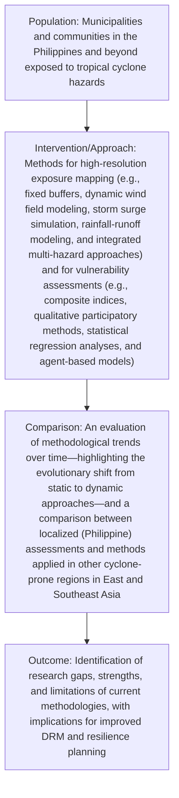

4-15-2025

# Mapping and Assessing High-Resolution Typhoon Exposure and Vulnerability in the Philippines: A Scoping Review

J. Andres F. Ignacio

, jfignacio@up.edu.ph

Follow this and additional works at: https://archium.ateneo.edu/jmgs

## Recommended Citation

Ignacio, J. Andres F. (2025) "Mapping and Assessing High-Resolution Typhoon Exposure and Vulnerability in the Philippines: A Scoping Review," Journal of Management for Global Sustainability: Vol. 12: Iss. 2, Article 8.

DOI: https://doi.org/10.13185/2244-6893.1260

Available at: https://archium.ateneo.edu/jmgs/vol12/iss2/8

This Article is brought to you for free and open access by the Ateneo Journals at Archīum Ateneo. It has been accepted for inclusion in Journal of Management for Global Sustainability by an authorized editor of Archīum Ateneo.

## Mapping and Assessing High-Resolution Typhoon Exposure and Vulnerability in the Philippines: A Scoping Review

## Cover Page Footnote

The author wishes to acknowledge the support of his colleagues at the University of the Philippines Population Institute in the writing of this manuscript. He is also grateful for the support given by the JMGS editorial board in their guidance toward the finalization of this publication.

# Mapping and Assessing High-Resolution Typhoon Exposure and Vulnerability in the Philippines: A Scoping Review

J. Andres F. Ignacioa,\*

a Population Institute, College of Social Sciences and Philosophy, University of the Philippines Diliman, Quezon City, Philippines jfignacio@up.edu.ph

Submitted: 12/15/24 • Reviewed: 12/24/24 • Accepted: 3/15/25 • Available online: 4/15/25 • Published: 4/15/25

## Abstract

This scoping review synthesizes the extensive literature on mapping high‑resolution typhoon exposure and assessing household and housing vulnerability in the Philippines. With approximately 20 typhoons passing through the Philippine Area of Responsibility annually—and seven to eight making landfall—the country faces enormous challenges that demand localized and granular risk assessments. Early approaches typically employed fixed‑bufer techniques to delineate exposure; however, recent research has shifted toward dynamic, multi‑hazard models incorporating real‑time meteorological data, numerical wind field and storm surge simulations, and advanced remote sensing imagery. Concomitantly, vulnerability assessments have evolved from indicator‑based composite indices to hybrid approaches that integrate quantitative household survey data, qualitative participatory assessments, and, increasingly, agent‑based and statistical modeling techniques This review maps the evolution of these methodologies, examines the diverse data sources used (from oficial census and administrative records to innovative social media and crowdsourced inputs), and highlights the implications of emerging trends such as climate change projections and rapidly advancing geospatial technologies. In doing so, the paper identifies critical research gaps and outlines future directions aimed at strengthening disaster risk management (DRM) and equitable community‑level resilience planning.

## Key terms

typhoon; Philippines; exposure mapping; social vulnerability; disaster risk management; high resolution; granular data

## 1. Introduction

The Philippines is among the world’s most disasterprone countries. On average, approximately 20 typhoons enter the Philippine Area of Responsibility (PAR) each year, with an estimated seven to eight making landfall (Takagi & Esteban, 2016; Yumul et al., 2011). These cyclonic events bring high winds, devastating storm surges, and intense rainfall, all of which inflict widespread damage to lives, infrastructure, and economic systems (Cutter, 2016; Reghezza-Zitt & Rufat, 2019). Historically, exposure and vulnerability assessments in the Philippines focused on broad national, regional, or provincial scales, masking important variations at the community or local level. Yet, as argued by Ignacio (2015) and Bankof (2002), only detailed, high‑resolution analyses can properly identify areas and populations at highest risk and thereby inform targeted disaster risk management (DRM) interventions.

Recent technological and methodological advancements—in particular, the integration of advanced geospatial tools, numerical weather prediction models, dynamic hazard simulation, and real-time remote sensing—have greatly enhanced the capacity to model typhoon hazards with a precision that matches the spatial resolution of community-level data. In parallel, as emphasized by Cutter (2003) and further refined by Ignacio (2015) and Healey et al. (2022), vulnerability assessments have expanded beyond static proxy indicators based on census data. They now increasingly incorporate nuanced measures of housing quality (including materials, occupancy rates, and construction types), socio-economic conditions, and community resilience, as well as participatory methods that ensure local knowledge is integrated into the assessment process.

The current scoping review aims to provide a comprehensive synthesis of the existing literature on high‑resolution typhoon exposure mapping and vulnerability assessments in the Philippines. Specifically, it examines

how methodologies have evolved from simplified fixed‑buffer techniques to s o ph i s ti c a te d dyn a m i c a n d multi‑hazard models;  
the integration of diverse data sources ranging from oficial census records and administrative data to high ‑ resolution satellite imagery, LiDAR, and social media streams;  
the strengths and limitations of current vulnerability indices that incorporate both quantitative and qualitative measures; and

t h e e m e r g i n g ro l e o f c l i m a t e change projections and advanced computational techniques (e.g., artificial intelligence, machine learning, and cloud‑based geospatial analyses) in refining risk assessments.

The review also extends its scope by drawing comparisons with methods applied in East and Southeast Asia and by considering global perspectives that may offer lessons for further improvements in Philippine DRM strategies (Acosta et al., 2016; Tran et al., 2022b). By critically mapping these developments and identifying research gaps, this review aims to support policymakers, scientists, and practitioners in their eforts to mitigate typhoon impacts and build resilient communities.

## 2. Methodology

This scoping review follows a systematic framework based on Arksey and O’Malley’s (2005) original methodology, later refined by Levac, Colquhoun, and O’Brien (2010) and Tricco et al. (2016). It provides transparency in study identification, selection, data extraction, and synthesis, resulting in reproducibility and clarity.

## 2.1 Research Framework and Questions

An adapted PICO framework guides the review to examine studies from both hazard (exposure) and vulnerability perspectives.

Population: Communities, municipalities, and barangays in the Philippines exposed to typhoon hazards.

Intervention/Approach: Methods for high‑resolution exposure mapping (e.g., fixed bufers, dynamic wind field modeling, storm surge simulation, rainfall‑runof modeling, and integrated multi‑hazard approaches) and vulnerability assessments (e.g., composite indices, qualitative participatory methods, statistical regression analyses, and agent‑based models).

Comparison: An evaluation of methodological trends over time—highlighting the evolutionary shift from static to dynamic approaches—and a comparison between localized (Philippine) assessments and methods applied in other cyclone‑prone regions in East and Southeast Asia.

Outcome: Identification of research gaps, strengths, and limitations of current methodologies, wi th i m p l i c a ti on s fo r i m p rove d D RM a n d resilience planning.

The research questions are as follows:

1) H ow h ave ex p o s u re m a p p i n g methodologies evolved from fixedbuffer to dynamic, multi-hazard modeling approaches?  
2) H ow d o c u r re n t vu l n e r a b i l i t y assessments integrate granular housing and household data to show local risk variations?  
3) What are the main data sources and their relative strengths and limitations in these assessments?  
4) How can climate change projections a n d e m e r g i n g c o m p u t a t i o n a l techniques improve these methods over time?

A clear diagrammatic representation of the PICO schema (see Figure 1) shows the interplay between population, intervention, comparison, and outcome.

## 2.2 Literature Search Strategy

A systematic search covering 2000 to 2024 was conducted across multiple databases, including Scopus, Web of Science, ScienceDirect, and Google Scholar. The search strings combined Boolean operators and key terms such as

• “ t yph o on , ” “ t ro p i c a l c yc l on e, “exposure mapping,” “risk assessment;”  
• “Philippines,” “local level,” “barangay,” “vulnerability,” “housing,” “household,” “census;”  
• “GIS, ” “remote sensing, ” “ high resolution,” “dynamic modeling;” and  
• “disaster risk reduction,” “disaster preparedness,” “climate change adaptation.”

The search strategy was iterative, with keywords refined upon initial review of relevant studies. Grey literature, including government reports (e.g., Congress of the Philippines, 2010; Delos Reyes et al., 2020) and international policy documents (e.g., United Nations, 2015; UNDRR, 2015), was also systematically searched.

## 2.3 Inclusion and Exclusion Criteria

Studies were included if they met the following criteria:

published between 2000 and 2024 in peer-reviewed journals, conference proceedings, or as grey literature on typhoon exposure and/or vulnerability in the Philippines;  
• focused on granular, local-level analysis (municipal or barangay/ community scale) rather than national or regional assessments;  
used innovative methods (e.g., dynamic hazard modeling, remote sensing integr ation, advanced statistical/computational techniques) or provided comprehensive composite vulnerability indices; and  
provided sufficient methodological d e t a i l t o a l l ow fo r r e p l i c a t i o n or synthesis.

Exclusion criteria were as follows:

• studies on hazards other than typhoons (e.g., earthquakes, volcanic eruptions) unless these were explicitly coupled with typhoon impacts;  
national or regional studies without a sub-national breakdown;  
• articles not in English; and  
• papers without methodological details.

## 2.4 Data Extraction and Charting

A standardized data extraction form was created to record information from each study. The following categories were captured:

Citation Details: Author(s), year, title, publication source.  
Study Focus: Geographic area (e.g., specific municipalities, barangays, or nationwide), hazard type (exposure mapping, vulnerability assessment, or both).

flowchart

Figure 1: PICO Schema

Methodological Approach: Detailed description of methods (fixedbuffer, dynamic wind field or storm surge modeling, rainfall-runoff simulation, multi-hazard integration, composite vulnerability indices, qualitative methods, statistical and agent-based modeling).  
Data Sources: Types of data used (e.g., census records from the Philippine Statistics Authority, remote sensing imagery, LiDAR, meteorological records, administrative datasets, social media, and crowdsourced data).  
• Key Fin dings, L im itatio n s, an d Recommendations: Major conclusions, research gaps, and directions for future research.

A total of 38 studies were included in this review, and their data were entered into a spreadsheet1 for crossstudy comparison and thematic synthesis.

## 2.5 Synthesis and Analysis

Data was synthesized by categorizing studies according to themes:

Methodological Evolution: From static, fixed-buffer approaches (Ignacio, 2015; Weatherford & Gray, 1988) to dynamic, multi-hazard modeling (Acosta et al., 2016; Agar, 2023; Takagi et al., 2017).  
Vulnerability Assessment Methods: Comparison of indicator-based indices (Cutter et al., 2003; Healey et al., 2022; Ignacio & Henry, 2013b) wi t h q u a l i t a t ive, p a r t i c i p a t o r y, and statistical methods (DiCarlo & Berglund, 2021; Gaillard & Pangilinan, 2010).  
Data Integration: Evaluation of various data sources, including traditional (official census, administrative) and innovative (remote sensing, social media, crowdsourcing) (Imran et al., 2013; Lagmay et al., 2017).

R egi o n a l a n d Po li cy Co n te x t: Philippine-specific approaches compared with East and Southeast Asia studies and implications for DRM and policy (Delos Reyes et al., 2020; Reghezza-Zitt & Rufat, 2019).

Both narrative synthesis and tabulation were used to identify emerging trends and research gaps.

## 3. Results

The literature search yielded a wide range of studies with different methodologies, data, and analytical frameworks. The following sections present the key findings organized by theme.

## 3.1 Typhoon Exposure Mapping

Typhoon exposure refers to the areas where populations, assets, and infrastructure are at risk of being afected by typhoon-related hazards such as high winds, storm surges, and heavy rainfall. Mapping exposure is critical for planning and resource allocation.

3.1.1. Fixed-Bufer and Historical Track Analyses. Earlier studies used historical typhoon track analyses combined with fixed-buffer techniques to create exposure zones. For example, Ignacio (2015) used GIS-based mapping of historical tracks (Weatherford & Gray, 1988) by “bufering” each storm’s path based on predetermined wind speed or rainfall intensity thresholds. While this provided quick estimates of the afected area, it assumed static storm characteristics regardless of individual variability in size, intensity, or speed (Takagi & Esteban, 2016). Fixed bufers failed to capture the spatial heterogeneity of typhoon impacts.  
3.1.2. Dynamic Wind Field and Storm Surge Modeling. Recent studies have shifted from static bufer approaches to dynamic modeling. Several studies now use numerical weather prediction models and empirical relationships to construct time- and space-varying wind fields (Agar, 2023). For instance, detailed wind field simulations that account for local topography and land use have better delineated exposure zones. Storm surge modeling using hydrodynamic simulations— integrating coastal bathymetry, tidal records, and real-time meteorological forcing—has improved the understanding of inundation risks, especially along complex coastlines (Bloemendaal et al., 2019; Rodrigo et al., 2018; Takagi et al., 2017). These dynamic methods provide more accurate estimates of flood

extent and wind damage patterns than fixed, one-sizefits-all bufers.

3.1.3. Rainfall-Runof Models and Multi-Hazard Integration. Another innovation has been the integration of rainfall-runoff models with dynamic hazard simulations. Advanced rainfall-runof analysis estimates flood inundation extent by considering local land use, soil type, drainage density, and antecedent moisture conditions (Chen et al., 2022). Several researchers have combined dynamic wind field modeling, surge modeling, and flood simulation to produce composite multi-hazard exposure indices (Acosta et al., 2016). These integrated approaches capture the synergistic effects of wind, surge, and precipitation, resulting in a more comprehensive risk profile, especially for compound events where flooding and wind damage occur together.

3.1.4. Comparative and Regional Perspectives. While many of the studies focused on Philippine cases, recent work has expanded comparative analysis to regional approaches across East and Southeast Asia (see

Table 1). Studies from neighboring countries highlight similarities and differences in modeling practices, emphasizing the need for local calibration and standardized methods to enable broader comparative assessments (Reghezza-Zitt & Rufat, 2019; Tran et al., 2022a). These comparisons are useful for identifying transferable methods and improving predictive capabilities across diferent geographical contexts.

## 3.2 Methods for Vulnerability Assessment

While exposure mapping identifies areas and assets at risk, vulnerability assessment shows how susceptible populations and assets are to typhoon impacts. Vulnerability is a complex concept resulting from the interplay of socio-economic, physical, and environmental factors.

3.2.1. Composite and Indicator-Based Approaches. Early vulnerability studies used composite indices that incorporated standardized socio-economic and housing indicators. Researchers derived quantitative measures from census data such as poverty rate, housing construction quality, access to basic services, and demographic characteristics (Cutter, 2003; Ignacio et al., 2015). These composite indices provided a baseline estimate of vulnerability at aggregated levels but were sometimes limited by the coarseness of national datasets and the subjective nature of indicator selection and weighting (Healey et al., 2022).

<table><tr><td>Country/Region</td><td>Areas Covered</td><td>Citations</td></tr><tr><td>Philippines</td><td>National level; Regional (Luzon, Visayas, Mindanao); Local (Metro Manila, Leyte, Marinduque, Cebu, Tacloban, Iloilo, Davao, Bicol Region); Coastal areas (Leyte Gulf, Eastern Samar, Surigao, Palawan, Samar, Negros Occidental); Urban areas (Manila, Cebu City, Davao City, Tacloban City, Iloilo City); Rural barangays in Marinduque, Samar, Leyte, Negros Occidental</td><td>Ignacio (2015); Healey et al. (2022); Takagi &amp; Esteban (2016); Acosta et al. (2016); Prasetyo et al. (2020); Rodrigo et al. (2018); Lagmay et al. (2017); Morin et al. (2016); Gray et al. (2022)</td></tr><tr><td>Geographic Scope (Tran et al., 2022a)</td><td>Primarily Southeast Asia (Philippines, Vietnam, Cambodia, Laos, Thailand, Myanmar, Indonesia, Malaysia, Brunei, Timor-Leste, Singapore); also includes analysis relevant to other WNP/Asian areas (China [South, East, Hainan], Taiwan, Korea, Japan, Bangladesh, India, Russia, Palau, Federated States of Micronesia, Northern Mariana Islands, Guam, Marshall Islands)</td><td>Tran et al. (2022a)</td></tr><tr><td>Geographic Scope (Tran et al., 2022b)</td><td>Primarily Southeast Asia (Philippines, Vietnam, Laos, Thailand, Myanmar); also includes analysis relevant to other WNP/Asian areas (China [South, southwestern coast, southeastern coast, Hainan, Fujian, Zhejiang, Guangxi, Guangdong, Hunan], Taiwan, Japan) and the Mekong River Basin</td><td>Tran et al. (2022b)</td></tr><tr><td>China</td><td>Guangdong, Fujian, Hainan, Shanghai, Zhejiang</td><td>Chen et al. (2022); Xu et al. (2024); Tran et al. (2022a, 2022b)</td></tr><tr><td>Japan</td><td>Okinawa, Kyushu, Honshu, Shikoku</td><td>Takagi &amp; Esteban (2016); Tran et al. (2022a, 2022b)</td></tr><tr><td>United States</td><td>Florida, Louisiana, Texas, North Carolina, Hawaii</td><td>Cutter (2003); Cutter et al. (2003)</td></tr></table>

Table 1: Countries and regions covered by articles cited in this scoping review.

3.2.2. Qualitative and Participatory Methods. Recognizing the limitations of solely quantitative indices, many researchers have integrated qualitative methods into vulnerability assessments. Participatory mapping, focus group discussions, and household surveys provide local context and reveal subtleties of community resilience that standard indicators may miss (Gaillard & Pangilinan, 2010). These methods empower locals by including indigenous knowledge and lived experiences, complementing statistical models. This participatory approach is important, especially when dealing with informal settlements where oficial records may be incomplete or outdated (Morin et al., 2016).

3.2.3. Advanced Statistical and Agent-Based Modeling. Recent studies used statistical methods— including regression analysis, principal component analysis, and machine learning—to quantify relationships between vulnerability factors and typhoon impact (Gray et al., 2022; Prasetyo et al., 2020). Agent-based models, though data- and resourceintensive, simulate individual or household behavior during typhoon events (DiCarlo & Berglund, 2021). These models can capture dynamic interactions such as evacuation behavior and post-disaster recovery, providing a more realistic picture of social vulnerability. For example, agent-based simulations have been used to test the responsiveness of different communities under varying warning scenarios, revealing critical insights into adaptive capacities and social networks.

3.2.4. Spatial Disaggregation and Temporal Trends. A challenge in vulnerability assessments is the aggregation of data to administrative units (e.g., municipal or barangay/community levels), which can hide intra-community variability. Several studies have emphasized the importance of spatial disaggregation for capturing sub-municipal diferences in vulnerability (Delos Reyes et al., 2020). Moreover, there is a need to transform static vulnerability indices into dynamic tools by incorporating longitudinal data from repeated household surveys. Such approaches can capture rapid socio-economic changes and population shifts that afect vulnerability over time (Prasetyo et al., 2020).

## 3.3 Data Sources and Integration

The quality and granularity of any exposure or vulnerability assessment depend on the data used. Recent advances in data collection and processing have greatly improved the analytical landscape.

3.3.1. Oficial Census and Administrative Data. The Philippine Statistics Authority (PSA) has decadal census data that details population distribution, housing characteristics, and socio-economic factors. These datasets are essential for building vulnerability indices (Healey et al., 2022; Ignacio & Henry, 2013a). However, issues such as temporal lags between census intervals and inconsistencies in local-level data reportage pose challenges to their use (Delos Reyes et al., 2020).  
3.3.2. Remote Sensing, LiDAR, and Satellite Imagery. High-resolution satellite imagery and LiDAR have transformed hazard mapping by providing detailed information on land cover, elevation, and structural damage. Studies using remote sensing have successfully mapped flood inundation extent and coastal topography, providing critical inputs for dynamic storm surge and rainfall-runof models (Lagmay et al., 2017; Xu et al., 2024). Advanced image processing techniques now allow even moderate-resolution satellites to be “upscaled” using downscaling algorithms, as shown by Sanmei Li et al. (2022) for 3D flood mapping.  
3.3.3. Meteorological and Best-Track Data. Meteorological observations—from traditional weather stations to radar networks and best-track datasets (e.g., JTWC, JMA, IBTrACS)—are key to calibrating dynamic models of typhoon behavior. Recent studies have highlighted the discrepancies between diferent best-track datasets and underscore the need for crossvalidation with high-resolution reanalysis products (Barcikowska et al., 2012; Schreck et al., 2014). These discrepancies can afect the simulation of wind fields and storm surges, and hence the accuracy of exposure estimates.  
3.3.4. Social Media, Crowdsourcing, and Citizen Science. Complementing traditional datasets, emerging sources such as social media (Twitter, Facebook) and crowdsourced data provide real-time information on typhoon impacts. Although these data are often unstructured and require significant processing, studies have shown that they can capture immediate postevent damage and community sentiment (Imran et al., 2013; Xie et al., 2018). Integrating these sources into GIS-based platforms has shown promise for developing agile early warning systems and community engagement (De-Groot et al., 2022).

## 3.4 Characteristics of the Reviewed Studies

The studies reviewed in this scoping exercise cover a wide range of spatial and temporal scales and vary in methodological complexity. Key characteristics are as follows:

Temporal Evolution: Earlier studies (e.g., Ignacio, 2015) used static methods for exposure assessment while more recent studies incorporated dynamic models that integrate realtime and historical data (Agar, 2023; Takagi et al., 2017).  
Spatial Scale: While many studies focused on local analysis at the municipality or barangay level, some extended to the national scale. A few comparative studies also examined methodological diferences between the Philippines and other East and Southeast Asian countries (Acosta et al., 2016; Reghezza-Zitt & Rufat, 2019).  
Me th o do logy : T h e l i t e r a t u r e e n c o m p a s s e s a wi d e r a n ge o f approaches, from deterministic numerical to probabilistic and hybrid. The integration of physical hazard modeling and socio-economic vulnerability is now being recognized as critical for risk mapping.  
Data Sources: There is a trend toward data integration. Studies that combine high-resolution remote sensing, meteorological reanalysis, official census data, and novel digital sources (social media and citizen science) produce more robust and contextspecific assessments.  
Policy: A significant number of studies link academic findings to policy. For example, many reference national law (Congress of the Philippines, 2010), the Sendai Framework (UNDRR, 2015), and the Paris Agreement (United Nations, 2015) in their research on DRM and urban planning.

## 4. Discussion

The literature review shows significant methodological improvements in typhoon exposure and vulnerability mapping in the Philippines. However, there are gaps that have implications for future research and practical DRM applications.

## 4.1 Methodological Advances and Limitations

Researchers have moved away from the simple fixed buffer approaches of the past to complex, dynamic models that capture the heterogeneity of typhoon hazards. The use of high-resolution numerical weather prediction, hydrodynamic storm surge models, and rainfall-runof simulations is a major methodological leap forward (Agar, 2023; Takagi et al., 2017). These models ofer greater spatial detail and the ability to simulate compound hazard events, which is important given the multi-hazard nature of typhoon impacts.

Despite these advances, however, there are still several limitations. One major challenge is data quality and integration. For instance, while census data is valuable, it often requires aggregation that may mask sub-municipal variability in vulnerability (Delos Reyes et al., 2020). Similarly, discrepancies among besttrack datasets raise questions about the calibration of dynamic models (Barcikowska et al., 2012; Schreck et al., 2014). The integration of social media and crowdsourced data, although promising, is technically challenging due to data bias, incompleteness, and the need for advanced analytics.

Another limitation is the static nature of many vulnerability assessments. Most composite indices are derived from decadal census data and may not reflect rapid socio-economic changes or emerging informal settlement patterns (Cutter, 2003; Prasetyo et al., 2020). Updating these indices with dynamic, longitudinal data and participatory assessment is necessary to capture the changing nature of vulnerability. Few studies also incorporate climate change projections into exposure and vulnerability models, despite widespread recognition that global warming will change typhoon intensity, frequency, and track (Knutson et al., 2015; Tran et al., 2022b).

## 4.2 Integration into Disaster Risk Management and Policy

Bridging the “research-to-practice” gap has been a challenge for years in disaster risk management. Highresolution exposure and vulnerability maps can improve targeted interventions by informing land use planning, building code development, evacuation strategies, and resource allocation (Cutter, 2016; Reghezza-Zitt & Rufat, 2019). However, this can only be done if scientific knowledge is translated into policy.

The Philippine Disaster Risk Reduction and Management Act of 2010 requires robust hazard assessment to be integrated into local and national decision-making. However, current analyses often fall short of this requirement due to technical limitations, data interoperability issues, and a lack of local stakeholder involvement. Several studies have shown the potential of web-based GIS platforms to disseminate near-real-time hazard maps to local government units (Delos Reyes et al., 2020; Lagmay et al., 2017), but adoption is still limited. Comparative research that benchmarks Philippine methodologies with those of other East and Southeast Asian countries can provide valuable lessons on best practices and the standardization of analytical frameworks.

## 4.3 Climate Change Projections and Advanced Technologies

One of the biggest research frontiers is in the integration of climate change projections into exposure and vulnerability assessments. Downscaling global models (e.g., CMIP6) and coupling these with high-resolution dynamic models can provide insights on how future climate may change typhoon behavior (Knutson et al., 2015; Tran et al., 2022b). For example, recent studies suggest that although the overall number of typhoons may decrease in a warming world, the probability of strong and damaging landfalls may increase significantly (Bhatia et al., 2018). This duality requires models that not only project storm frequency but also account for changes in intensity and surge potential.

In addition, advanced computational techniques— particularly those involving artificial intelligence (AI) and machine learning—are emerging as powerful tools for processing heterogeneous datasets. These methods can automatically detect patterns in satellite data, predict hazard evolution from real-time meteorological inputs, and even validate complex models (Magee et al., 2021). Cloud-based geospatial platforms can also overcome data-sharing obstacles between institutions and local government units and make research findings more practical.

## 4.4 Ethical Considerations and Community Participation

The increasing granularity of exposure and vulnerability assessments raises serious ethical issues regarding data privacy, ownership, and the potential stigmatization of vulnerable communities. Detailed spatial maps that identify “high-risk” areas can be detrimental if not handled carefully. Researchers must work closely with local communities, government agencies, and other stakeholders to ensure that data are collected, stored, and disseminated responsibly (Morin et al., 2016; Yonson et al., 2018).

Furthermore, incorporating community-based participatory approaches in the research process is not only methodologically sound—it also fosters local ownership and makes the outcomes more relevant. Participatory mapping exercises and household surveys can provide critical data that scientifically enhance vulnerability assessments and empower communities to take proactive measures in disaster preparedness and risk mitigation (Gaillard & Pangilinan, 2010). Transparent data governance and ethical review protocols should be integrated into future studies to prevent misuse and respect the privacy and rights of individuals in vulnerable areas.

## 5. Future Research Directions

Based on the literature review, several key areas in which future research may address the current limitations and expand the applicability of high-resolution risk assessments emerge.

## 5.1 Improving Dynamic Exposure Metrics

Typhoon-Specific Bufering Approaches. Research should focus on developing dynamic bufering techniques that respond to individual storm characteristics, such as varying wind speed distributions, asymmetrical wind fields, and diferences in forward speed, using highresolution numerical weather models (Agar, 2023; Takagi & Esteban, 2016). For example, combining IBTrACS wind intensity data with dynamic storm surge models can yield a more accurate weighting for exposure analysis.

Multi-Hazard Integration. Future work should continue to refine integrated models that capture the synergistic efects of wind, surge, and rainfall. Coupling rainfall-runof models with dynamic wind and surge simulations, while incorporating local land use and topographic data, will improve the overall accuracy of exposure maps (Acosta et al., 2016; Chen et al., 2022).

## 5.2 Enhancing Vulnerability Indicators

Longitudinal and High-Resolution Data: Research needs to go beyond decadal census data and incorporate repeated household surveys and real-time socioeconomic indicators. This will allow vulnerability assessments to capture temporal dynamics and reflect rapid socio-economic changes (Gray et al., 2022; Prasetyo et al., 2020).

Quantitative-Qualitative Hybrid Models. Future vulnerability frameworks should combine quantitative indices with qualitative participatory data. Mixedmethod approaches can address the limitations of static indicators by capturing local perceptions and adaptive capacities, especially in informal settlements (Gaillard & Pangilinan, 2010).

## 5.3 Climate Change Projections

Downscaling Global Climate Models. Integrating downscaled CMIP6 or ECMWF model outputs with dynamic hazard and vulnerability models is crucial. Future studies should explore methods that combine climate model projections with real-time meteorological data assimilation to forecast longterm changes in typhoon exposure and vulnerability (Knutson et al., 2015; Tran et al., 2022b).

Scenario-Based Risk Projections. Researchers should develop scenario-based assessments that consider various socio-economic pathways (e.g., SSPs) together with climate projections. This will help show how diferent development trajectories interact with future typhoon hazards and guide adaptive policies.

## 5.4 Advanced Technologies

AI and Machine Learning. The use of AI-driven algorithms for processing large volumes of remote sensing data and social media streams should be further explored. Machine learning models can aid in automatic feature extraction, pattern recognition in hazard evolution, and the refinement of vulnerability indices using non-traditional data sources (Bhatia et al., 2018; Magee et al., 2021).

Cloud-Based and Open Source GIS Platforms. Investment in user-friendly, cloud-based geospatial platforms will ensure that data is accessible and refined hazard maps and vulnerability indices reach decision-makers at local government levels. Such platforms should enable real-time updates and community participation.

## 5.5 Policy Integration and Community Engagement

Research-to-Practice Gap. Future research must involve stakeholder collaboration throughout the research cycle. Workshops, stakeholder consultations, and participatory mapping sessions should be part of the study to ensure outcomes are directly applicable to DRM planning and policymaking.

Data Governance. Ethical protocols for data collection and management in disaster risk research must be in place. Researchers should work with local governments to develop data-sharing agreements to protect sensitive data and ensure equitable risk reduction.

## 6. Conclusion and Final Thoughts

This scoping review looked into the methods and approaches for mapping high-resolution typhoon exposure and household and housing vulnerability in the Philippines and beyond. It uncovered a very dynamic field that has moved from fixed buffer approaches to integrated multi-hazard frameworks. Specifically, this review highlighted the following:

## 6.1 Methodological Development

Advancements in exposure modeling—from static, fixed buffer methods to dynamic models that integrate numerical weather prediction, hydrodynamic simulations, and rainfall-runoff processes—have greatly improved the spatial resolution of hazard maps (Agar, 2023; Takagi et al., 2017). In parallel, vulnerability assessments have moved from relying solely on composite indices (Cutter et al., 2003; Healey et al., 2022; Ignacio et al., 2015) to incorporating participatory methods, longitudinal surveys, and agent-based models (Gaillard & Pangilinan, 2010; Morin et al., 2016).

## 6.2 Data Integration

The integration of various data sources—official census data, remote sensing imagery, LiDAR products, traditional and best-track meteorological data, and social media and crowdsourced information—has allowed a more detailed understanding of typhoon hazards. However, data discrepancies and the challenge of disaggregating data to capture intra-municipal variability remain a major concern (Delos Reyes et al., 2020; Imran et al., 2013).

## 6.3 Policy Relevance and Practical Application

High-resolution hazard and vulnerability maps can inform DRM strategies from local evacuation planning to national urban policy improvements. The alignment of academic findings with policy frameworks such as the Philippine Disaster Risk Reduction and Management

Act of 2010, Sendai Framework (UNDRR, 2015), and Paris Agreement (United Nations, 2015) shows that research must be translated into practice (Reghezza-Zitt & Rufat, 2019).

## 6.4 Future Research and Issues

Despite the progress, there are still several challenges to be addressed. These include the need to update vulnerability metrics through dynamic real-time data, integrate robust climate change projections into exposure models, and apply advanced computational techniques such as artificial intelligence in managing big data. Equally important is the requirement to ensure that ethical considerations and community engagement will be at the heart of all future studies.

I n a t i m e o f r a p i d c l i m a t e c h a n ge a n d urbanization, the need for comprehensive and granular risk assessment has never been more urgent. Bridging the gap between scientific methodologies and policy requires interdisciplinary collaboration among meteorologists, geographers, data scientists, policymakers, and community stakeholders. This review argues that by adopting innovative approaches and integrating data, future research can not only improve the accuracy of hazard and vulnerability assessments but also contribute to more resilient and prepared communities in the Philippines and similar settings across the globe.

In the end, as typhoons evolve under changing climate conditions, the discipline of research, technological integration, and community involvement will be key to effective disaster risk management. The findings of this review are meant to be a solid foundation for future research and highlight areas where more theoretical and methodological innovation is needed.

## Acknowledgements

The author wishes to acknowledge the support of his colleagues at the University of the Philippines Population Institute in the writing of this manuscript. He is also grateful for the support given by the JMGS editorial board in their guidance toward the finalization of this publication.

## References

Acosta, L. A., Eugenio, E. A., Macandog, P. B. M., Magcale-Macandog, D. B., Lin, E. K. H., Abucay, E. R., Cura,

A. L., & Primavera, M. G. 2016. Loss and damage from typhoon-induced floods and landslides in the Philippines: Community perceptions on climate impacts and adaptation options. International Journal of Global Warming, 9(1): 33–65.  
Agar, J. C. 2023. Evaluating the increasing trend of strength and severe wind hazard of Philippine typhoons using the Holland-B parameter and regional cyclonic wind field modeling. Sustainability, 15(1): 535.  
Arksey, H., & O’Malley, L. 2005. Scoping studies: Towards a methodological framework. International Journal of Social Research Methodology, 8(1): 19–32.  
Bankof, G. 2002. Cultures of disaster: Society and natural hazard in the Philippines (1st ed.). Routledge.  
Barcikowska, M., Feser, F., & von Storch, H. 2012. Usability of best track data in climate statistics in the Western North Pacific. Monthly Weather Review, 140(9): 2818– 2830.  
Bhatia, K., Vecchi, G., Murakami, H., Underwood, S., & Kossin, J. 2018. Projected response of tropical cyclone intensity and intensification in a global climate model. Journal of Climate, 31(20): 8281–8303.  
Bloemendaal, N., Muis, S., Haarsma, R. J., Verlaan, M., Apecechea, M. I., de Moel, H., Ward, P. J., & Aerts, J. C. J. H. 2019. Global modeling of tropical cyclone storm surges using high-resolution forecasts. Climate Dynamics, 52(7): 5031–5044.  
Chen, L., Chen, Y., Zhang, Y., & Xu, S. 2022. Spatial patterns of typhoon rainfall and associated flood characteristics over a mountainous watershed of a tropical island. Journal of Hydrology, 613: 128421.  
Congress of the Philippines. 2010. Republic Act No. 10121: Philippine disaster risk reduction and management act of 2010. Official Gazette of the Republic of the Philippines. Available at https://www.oficialgazette. gov.ph/2010/05/27/republic-act-no-10121/.  
Cutter, S. L. 2003. The vulnerability of science and the science of vulnerability. Annals of the Association of American Geographers, 93(1): 1–12.  
Cutter, S. L. 2016. The landscape of disaster resilience indicators in the USA. Natural Hazards, 80(2): 741– 758.  
Cutter, S. L., Boruff, B. I, & Shirlev, W. L. 2003. Social vulnerability to environmental hazards. Social Science Quarterly, 84(2): 242–261.  
De-Groot, R., Golumbic, Y. N., Martínez Martínez, F., Hoppe, H. U., & Reynolds, S. 2022. Developing a framework for investigating citizen science through a combination of web analytics and social science methods—The CS track perspective. Frontiers in Research Metrics and Analytics, 7: 988544.  
Delos Reyes, M. R., Gamboa, M. A. M., & Rivera, R. R. B. 2020. The Philippines’ national urban policy for achieving sustainable, resilient, greener and smarter cities. In D. Kundu, R. Sietchiping, & M. Kinyanjui (Eds.), Developing national urban policies: Ways forward to green and smart cities: 169–203. Singapore: Springer Nature.  
DiCarlo, M. F., & Berglund, E. Z. 2021. Connected communities improve hazard response: An agent-based model of social media behaviors during hurricanes. Sustainable Cities and Society, 69: 102836.  
Gail lard, J. C., & Pangilinan, M. L. C. J. D. 2010. Participatory mapping for raising disaster risk awareness among the youth. Journal of Contingencies and Crisis Management, 18(3): 175–179.  
Gray, J., Lloyd, S., Healey, S., & Opdyke, A. 2022. Urban and rural patterns of typhoon mortality in the Philippines. Progress in Disaster Science, 14: 100234.  
Healey, S., Lloyd, S., Gray, J., & Opdyke, A. 2022. A censusbased housing vulnerability index for typhoon hazards in the Philippines. Progress in Disaster Science, 13: 100211.  
Ignacio, A. 2015. Measuring social vulnerability to climate change-induced hazards in the Philippines. Thesis, Université de Namur, Belgium.  
Ignacio, A., Cruz, G., Nardi, F., & Henry, S. 2015. Assessing the effectiveness of a social vulnerability index in predicting heterogeneity in the impacts of natural hazards: Case study of the Tropical Storm Washi flood in the Philippines. Vienna yearbook of population research, 2015: 91–129.  
Ignacio, A., & Henry, S. 2013a. Assessing the vulnerability of populations at high risk to coastal river flooding in the Philippines. In S. L. Cutter & C. Corendea (Eds.), From social vulnerability to resilience: Measuring progress toward disaster risk reduction: 78–92. United Nations University Institute for Environment and Human Security.  
Ignacio, A., & Henry, S. 2013b. Assessing changes in villagelevel social vulnerability based on census data. In XXVII International Population Conference: Abstracts. Busan, Korea: International Union for the Scientific Study of Population.  
Imran, M., Elbassuoni, S., Castillo, C., Diaz, F., & Meier, P. 2013. Practical extraction of disaster-relevant information from social media. In WWW’13: Proceedings of the 22nd International Conference on World Wide Web: 1021–1024. New York: Association for Computing Machinery.  
Knutson, T. R., Sirutis, J. J., Zhao, M., Tuleya, R. E., Bender, M. A., Vecchi, G. A., Villarini, G., & Chavas, D. R. 2015. Global projections of intense tropical cyclone activity for the late twenty-first century from dynamical  
downscaling of CMIP5/RCP4.5 scenarios. Journal of Climate, 28(18): 7203–7224.  
Lagmay, A. M. F., Racoma, B. A., Aracan, K. A., Alconis-Ayco, J., & Saddi, I. L. 2017. Disseminating nearreal-time hazards information and flood maps in the Philippines through Web-GIS. Journal of Environmental Sciences, 59: 13–23.  
Levac, D., Colquhoun, H., & O’Brien, K. K. 2010. Scoping studies: Advancing the methodology. Implementation Science, 5: 69.  
Li, S., Goldberg, M. D., Kalluri, S., Lindsey, D. T., Sjoberg, B., Zhou, L., Helfrich, S., Green, D., Borges, D., Yang, T., & Sun, D. 2022. High resolution 3D mapping of hurricane flooding from moderate-resolution operational satellites. Remote Sensing, 14(21): 5445.  
Magee, A. D., Kiem, A. S., & Chan, J. C. L. 2021. A new approach for location-specific seasonal outlooks of typhoon and super typhoon frequency across the Western North Pacific region. Scientific Reports, 11(1): 19439.  
Morin, V. M., Ahmad, M. M., & Warnitchai, P. 2016. Vulnerability to typhoon hazards in the coastal informal settlements of Metro Manila, the Philippines. Disasters, 40(4): 693–719.  
Prasetyo, Y. T., Senoro, D. B., German, J. D., Robielos, R. A. C., & Ney, F. P. 2020. Confirmatory factor analysis of vulnerability to natural hazards: A household vulnerability assessment in Marinduque Island, Philippines. International Journal of Disaster Risk Reduction, 50: 101831.  
Reghezza-Zitt, M., & Rufat, S. 2019. Disentangling the range of responses to threats, hazards and disasters: Vulnerability, resilience and adaptation in question. Cybergeo: European Journal of Geography, Article 916.  
Rodrigo, S. M. T., Villanoy, C. L., Briones, J. C., Bilgera, P. H. T., Cabrera, O. C., & Narisma, G. T. T. 2018. The mapping of storm surge-prone areas and characterizing surge-producing cyclones in Leyte Gulf, Philippines. Natural Hazards, 92: 1305–1320.  
Schreck, C. J., Knapp, K. R., & Kossin, J. P. 2014. The impact of best track discrepancies on global tropical cyclone climatologies using IBTrACS. Monthly Weather Review, 142(10): 3881–3899.  
Takagi, H., & Esteban, M. 2016. Statistics of tropical cyclone landfalls in the Philippines: Unusual characteristics of 2013 Typhoon Haiyan. Natural Hazards, 80: 211–222.  
Takagi, H., Esteban, M., Shibayama, T., Mikami, T., Matsumaru, R., De Leon, M., Thao, N. D., Oyama, T., & Nakamura, R. 2017. Track analysis, simulation, and field survey of the 2013 Typhoon Haiyan storm surge. Journal of Flood Risk Management, 10(1): 42–52.  
Tran, T. L., Ritchie, E. A., & Perkins-Kirkpatrick, S. E. 2022a. A 50-year tropical cyclone exposure climatology in Southeast Asia. Journal of Geophysical Research: Atmospheres, 127(4): e2021JD036301.  
Tran, T. L., Ritchie, E. A., Perkins-Kirkpatrick, S. E., Bui, H., & Luong, T. M. 2022b. Future changes in tropical cyclone exposure and impacts in Southeast Asia from CMIP6 pseudo-global warming simulations. Earth’s Future, 10(12): e2022EF003118.  
Tricco, A. C., Lillie, E., Zarin, W., O’Brien, K., Colquhoun, H., Kastner, M., Levac, D., Ng, C., Sharpe, J. P., Wilson, K., Kenny, M., Warren, R., Wilson, C., Stelfox, H. T., & Straus, S. E. 2016. A scoping review on the conduct and reporting of scoping reviews. BMC Medical Research Methodology, 16: 15.  
UNDRR [United Nations Office for Disaster Risk Reduction]. 2015. Sendai framework for disaster risk reduction 2015–2030. Available at https://www.undrr. org/publication/sendai-framework-disaster-riskreduction-2015-2030.  
United Nations. 2015. The Paris Agreement. Available at https://unfccc.int/process-and-meetings/the-parisagreement/the-paris-agreement.  
Weatherford, C. L., & Gray, W. M. 1988. Typhoon structure as revealed by aircraft reconnaissance. Part II: Structural variability. Monthly Weather Review, 116(5): 1044– 1056.  
Xie, J., Yang, T., & Li, G. 2018. Extracting geospatial information from social media data for hazard mitigation, Typhoon Hato as case study (short paper). In 10th International Conference on Geographic Information Science, vol. 114: 65:1–65:6. Schloss Dagstuhl – Leibniz-Zentrum für Informatik.  
Xu, H., Ragno, E., Jonkman, S., Wang, J., Bricker, J., Tian, Z., & Sun, L. 2024. Combining statistical and hydrodynamic models to assess compound flood hazards from rainfall and storm surge: A case study of Shanghai. Hydrology and Earth System Sciences, 28(16): 3919– 3930.  
Yonson, R., Noy, I., & Gaillard, J. 2018. The measurement of disaster risk: An example from tropical cyclones in the Philippines. Review of Development Economics, 22(2): 736–765.  
Yumul Jr., G. P., Cruz, N. A., Servando, N. T., & Dimalanta, C. B. 2011. Extreme weather events and related disasters in the Philippines, 2004–08: A sign of what climate change will mean? Disasters, 35(2): 362–382.  
J. Andres F. Ignacio has dedicated over 30 years to environmental research and management, focusing on the relationship between human and physical systems. His academic journey includes degrees from Ateneo de Manila University, University of Wisconsin-Madison

(MSc in Water Resources Management), Université Catholique de Louvain (MPhil in Remote Sensing Technology), and a PhD in Geography from the University of Namur (2015). Ignacio worked at the Environmental Science for Social Change, where he last served as Director for Planning and Geomatics Manager. He has emphasized scientific rigor alongside community-based processes to promote human security and effective environmental management. In 2023, he joined the University of the Philippines Population Institute faculty, bringing his extensive experience working with communities, practitioners, and government organizations to enrich student learning. His teaching philosophy bridges theoretical concepts with practical applications, providing students with a comprehensive understanding while developing solutions that balance scientific approaches with community participation.