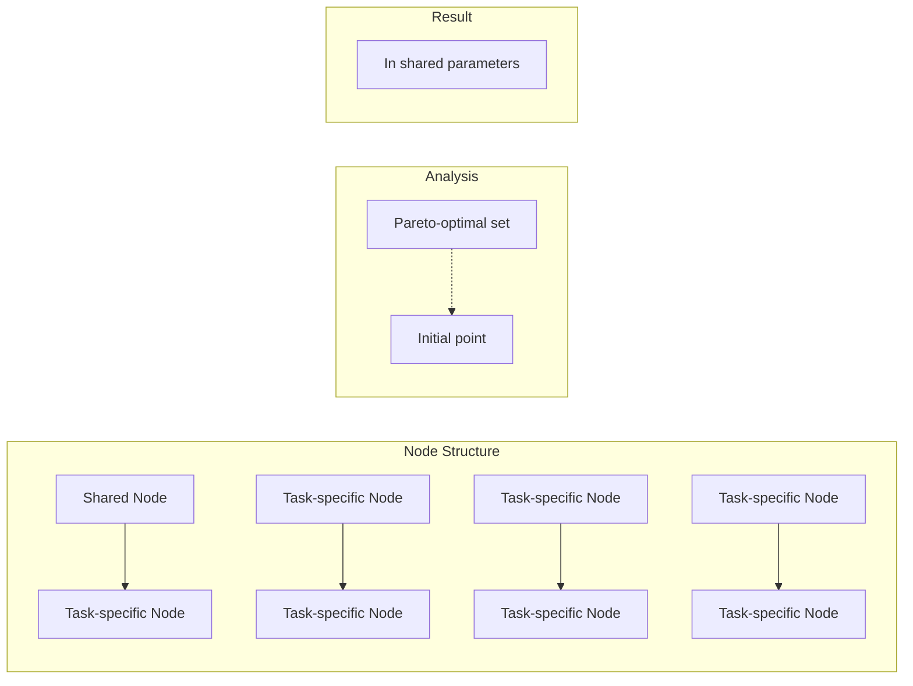
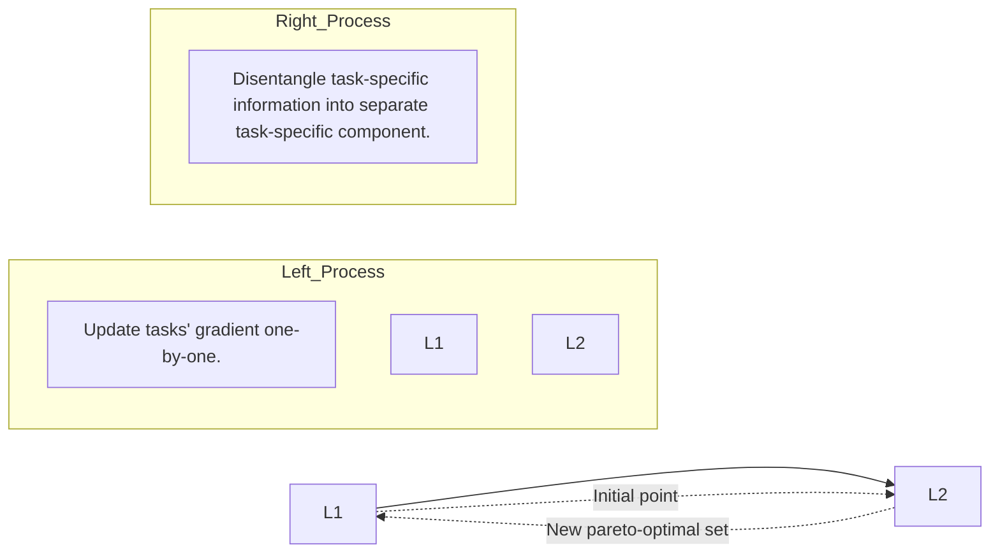

# Quantifying Task Priority for Multi-Task Optimization

Wooseong Jeong KAIST

stk14570@kaist.ac.kr

Kuk-Jin Yoon KAIST

kjyoon@kaist.ac.kr

## Abstract

The goal of multi-task learning is to learn diverse tasks within a single unified network. As each task has its own unique objectivefunction, conflicts emerge during training, resulting in negative transfer among them. Earlier research identified these conflicting gradients in shared parameters between tasks and attempted to realign them in the same direction. However, we prove that such optimization strategies lead to sub-optimal Pareto solutions due to their inability to accurately determine the individual contributions of each parameter across various tasks. In this paper, we propose the concept of task priority to evaluate parameter contributions across different tasks. To learn task priority, we identify the type of connections related to links between parameters influenced by task-specific losses during backpropagation. The strength ofconnections is gauged by the magnitude of parameters to determine task priority. Based on these, we present a new method named connection strength-based optimization for multi-task learning which consists of two phases. The first phase learns the task priority within the network, while the second phase modifies the gradients while upholding this priority. This ultimately leads to finding new Pareto optimal solutions for multiple tasks. Through extensive experiments, we show that our approach greatly enhances multi-task performance in comparison to earlier gradient manipulation methods.

## 1. Introduction

Multi-task learning (MTL) is a learning paradigm that handles multiple different tasks in a single model [2]. Compared to learning tasks individually, MTL can effectively reduce the number of parameters, leading to less memory usage and computation with a higher convergence rate. Furthermore, it leverages multiple tasks as an inductive bias, enabling the learning of generalized features while reducing overfitting. Complex systems such as robot vision and autonomous driving require the ability to perform multiple tasks within a single system. Thus, MTL can be a first step in finding general architecture for computer vision.

A primary goal of MTL is minimizing negative transfer [6] and finding Pareto-optimal solutions [36] for multiple tasks. Negative transfer is a phenomenon where the learning of one task adversely affects the performance of other tasks. Since each task has its own objective, this can potentially result in a trade-off among tasks. A condition in which enhancing one task is not possible without detriment to another is called Pareto optimality. A commonly understood cause of this trade-off is conflicting gradients [45] that arise during the optimization process. When the gradients of two tasks move in opposing directions, the task with larger magnitudes dominates the other, disrupting the search for Pareto-optimal solutions. The situation becomes more complex due to imbalances in loss scales across tasks. The way we weigh task losses is crucial for multi-task performance. When there is a significant disparity in the magnitudes of losses, the task with a larger loss would dominate the entire network. Hence, the optimal strategy for MTL should efficiently handle conflicting gradients across different loss scales.

Previous studies address negative transfer by manipulating gradients or balancing tasks’ losses. Solutions for handling conflicting gradients are explored in [26, 36, 37, 45]. These approaches aim to align conflicting gradients towards a cohesive direction within a shared network space. However, these techniques are not effective at preventing negative transfer, as they don’t pinpoint which shared parameters are crucial for the tasks. This results in sub-optimal Pareto solutions for MTL, leading to pool multi-task performance. Balancing task losses is a strategy that can be applied independently from gradient manipulation methods. It includes scaling the loss according to homoscedastic uncertainty [22], or dynamically finding loss weights by considering the rate at which the loss decreases [29].

In this paper, we propose the concept of task priority to address negative transfer in MTL and suggest connection strength as a quantifiable measure for this purpose. The task priority is defined over shared parameters by comparing the influence of each task’s gradient on the overall multi-task loss. This reveals the relative importance of shared parameters to various tasks. To learn and conserve the task priority throughout the optimization process, we propose the concept of task-specific connections and their strength in the context of MTL. A task-specific connection denotes the link between shared and task-specific parameters during the backpropagation of each task-specific loss. The strength of this connection can be quantified by measuring the scale of the parameters involved. Based on the types of connections and their respective strengths, we apply two distinct optimization phases. The goal of the first phase is to find new Pareto-optimal solutions for multiple tasks by learning task priorities through the use of specific connection types. The second phase aims to maintain the task priorities learned from varying loss scales by quantifying the strength of these connections. Our method outperforms previous optimization techniques that relied on gradient manipulation, consistently discovering new Pareto optimal solutions for various tasks, thereby improving multi-task performance.

Our contributions are summarized as follows:

• We propose the concept of task priority within a shared network to assess the relative importance of parameters across different tasks and to uncover the limitation inherent in traditional multi-task optimization.  
• We reinterpret connection strength within the context of MTL to quantify task priority. Based on this reinterpretation, we propose a new multi-task optimization approach called connection strength-based optimization to learn and preserve task priorities.  
• To demonstrate the robustness of our method, we perform extensive experiments. Our results consistently reveal substantial enhancements in multi-task performance when compared to prior research.

## 2. Related Work

Optimization for MTL aims to mitigate negative transfer between tasks. Some of them [8, 26, 28, 34, 36, 37, 45] directly modify gradients to address task conflicts. MGDA [8, 36] views MTL as a multi-objective problem and minimizes the norm point in the convex hull to find a Pareto optimal set. PCGrad [45] introduces the concept of conflicting gradients and employs gradient projection to handle them. CAGrad [26] minimizes the multiple loss functions and regularizes the trajectory by leveraging the worst local improvement of individual tasks. Aligned-MTL [37] stabilize optimization by aligning the principal components of the gradient matrix. Recon [13] uses an approach similar to Neural Architecture Search (NAS) to address conflicting gradients. Some approaches use normalized gradients [3] to prevent spillover of tasks or assign stochasticity on the network’s parameter based on the level of consistency in the sign of gradients [4]. RotoGrad [21] rotates the feature space of the network to narrow the gap between tasks. Unlike earlier methods that guided gradients towards an intermediate direction (as illustrated in Fig. 1(a)), our approach identifies task priority in shared parameters to update gradients, leading to finding new Pareto-optimal solutions.

Scaling task-specific loss largely influences multi-task performance since the task with a significant loss would dominate the whole training process and cause severe task interference. To address the task unbalancing problem in the training, some approaches re-weight the multi-task loss by measuring homoscedastic uncertainty [22], prioritizing tasks based on task difficulty [14], or balancing multi-task loss dynamically by considering the descending rate of loss [29]. We perform extensive experiments involving different loss-scaling methods to demonstrate the robustness of our approach across various loss-weighting scenarios.

MTL architectures can be classified depending on the extent of network sharing across tasks. The shared trunk consists of a shared encoder followed by an individual decoder for each task [7, 30, 39, 46]. Multi-modal distillation methods [9, 40, 43, 47] have been proposed, which can be used at the end of the shared trunk for distillation to propagate task information effectively. On the other hand, crosstalk architecture uses separate networks for each task and allows parallel information flow between layers [12]. Our optimization approach can be applied to any model to mitigate task conflicts and enhance multi-task performance.

## 3. Preliminaries

## 3.1. Problem Definition for Multi-task Learning

In multi-task learning (MTL), the network learns a set of tasks $\mathcal { T } = \{ \tau _ { 1 } , \tau _ { 2 } , . . . , \tau _ { \mathcal { K } } \}$ jointly, where $\kappa$ is the number of tasks. Each task $\tau _ { i }$ has its own loss function $\mathcal { L } _ { i } ( \Theta )$ where Θ is the parameter of the network. The network parameter Θ can be classified into $\boldsymbol { \Theta } = \left\{ \Theta _ { s } , \Theta _ { 1 } , \Theta _ { 2 } , . . . , \Theta _ { \boldsymbol { \kappa } } \right\}$ where $\Theta _ { \varepsilon }$ is shared parameter across all tasks and $\Theta _ { i }$ is task-specific parameters devoted to task $\tau _ { i } .$ . Then, the objective function of multi-task learning is to minimize the weighted sum of all tasks’ losses:

$$
\Theta^ {*} = \underset {\Theta} {\arg \min} \sum_ {i = 1} ^ {\mathcal {K}} w _ {i} \mathcal {L} _ {i} (\Theta_ {s}, \Theta_ {i}) \tag {1}
$$

The performance in multi-task scenarios is affected by the weighting $w _ { i }$ of the task-specific loss $\mathcal { L } _ { i }$

## 3.2. Prior Approach for Multi-Task Optimization

From an optimization perspective, MTL seeks Pareto optimal solutions for multiple tasks.

Definition 1 (Pareto optimality). For a given network $p a \textmd { - }$ rameter Θ, if we get $\Theta _ { n e w }$ such that $\mathcal { L } _ { i } ( \Theta ) > \mathcal { L } _ { i } ( \Theta _ { n e w } )$ holds for any task $\tau _ { i } ,$ while ensuring that ${ \mathcal { L } } _ { j } ( \Theta ) \quad \geq$ $\mathcal { L } _ { j } ( \Theta _ { n e w } )$ is satisfiedfor all other tasks $\tau _ { j } ( j \neq i )$ , then the situation is termed a Pareto improvement. In this context, $\Theta _ { n e w }$ is said to dominate Θ. A parameter $\Theta ^ { * }$ is Paretooptimal if no further Pareto improvements are possible. A set ofPareto optimal solutions is called a Paretofrontier.

(a)Previous Approach  

flowchart

text_image

g₁
g₂
MGDA
g₁
g₂
CAGrad
g₁
g₂
PCGrad
g₁
g₂
Aligned-MTL

Prior methods directed gradients to simply converge toward an intermediate direction.

(b) Connection Strength-based Optimization  
Phase 1: Learning task priority  

flowchart

②Phase 2: Conserving learned task priority

flowchart

This diagram illustrates a neural network architecture for task priority prediction, showing how input parameters are determined by connection strength and output channel, followed by project gradients based on task priority.

Figure 1. Overview of our connection strength-based optimization. (a) Previous methods [26, 36, 37, 45] modify gradients in shared parameters to converge toward an intermediate direction without considering the task priority, which leads to sub-optimal Pareto solutions. (b) Our method divides the optimization process into two distinct phases. In Phase 1, task priority is learned through task-specific connections, leading to the identification of a new Pareto optimal solution. In Phase 2, task priority is gauged using the connection strength between shared and task-specific nodes. Subsequently, gradients in shared parameters are aligned with the direction of the highest-priority task’s gradients. This phase ensures that priorities established in Phase 1 are maintained, thus reducing potential negative transfer.

Earlier research [26, 36, 37] interprets MTL in the context of multi-objective optimization, aiming for Pareto optimality. They present a theoretical analysis that demonstrates the convergence of optimization towards Pareto stationary points. Nevertheless, their analysis is constrained when applied to real-world scenarios due to its assumption of convex loss functions, which conflicts with the non-convex nature of neural networks. Also, their demonstration of optimization converging to Pareto stationary points doesn’t necessarily guarantee reaching Paretooptimal points, as the former are necessary but not sufficient conditions for Pareto optimality. We delineate their limitations theoretically by introducing the concept of task priority and empirically validate them by analyzing training loss and multi-task performance. On the other hand, Yu et al. [45] emphasize the conflicting gradients.

Definition 2 (Conflicting gradients). Conflicting gradients are defined in the shared space of the network. Denote the gradient of task $\tau _ { i }$ with respect to the shared parameters $\Theta _ { \varepsilon }$ as $g _ { i } = \nabla _ { \Theta _ { s } } \mathcal { L } _ { i } ( \Theta _ { s } , \Theta _ { i } )$ . And $g _ { i }$ and $g _ { j }$ are gradients of a pair of tasks $\tau _ { i }$ and $\tau _ { j }$ where $i \neq j . \ I f g _ { i } \cdot g _ { j } \leq 0 ,$ , then the two gradients are called conflicting gradients

Previous approaches [26, 36, 37, 45] address the issue of conflicting gradients in shared parameters $\Theta _ { s }$ by aligning the gradients in a consistent direction as shown in Fig. 1(a). Nonetheless, they face challenges in minimizing negative transfer, as they cannot discern which parameters in $\Theta _ { s }$ are most important to tasks. We refer to the relative importance of a task in the shared parameter as task priority. Previous studies aligned gradients without taking into account task priority, inadvertently resulting in negative transfer and reduced multi-task performance. In contrast, we introduce the notion of connection strength to determine task priority in the shared space and propose new gradient update rules based on this priority.

## 4. Method

In this section, we introduce the concept of task priority to minimize negative transfer between tasks. To measure task priority, we establish connections in the network and assess their strength. Following that, we propose a novel optimization method for MTL termed connection strengthbased optimization. Our approach breaks down the optimization process into two phases as shown in Fig. 1(b). In Phase 1, we focus on instructing the network to catch task-specific details by learning task priority. In Phase 2, task priority within the shared parameters is determined and project gradients to preserve the priority.

## 4.1. Motivation: Task priority

We propose a straightforward theoretical analysis of our approach, using the notation given in Sec. 3. Before diving deeper, we first introduce the definition of task priority.

Definition 3 (Task priority). Assume that the task losses $\mathcal { L } _ { i }$ for $i = 1 , 2 , . . . , \mathcal { K }$ are differentiable. Consider $\mathcal { X } ^ { t }$ as the input data at time t. We initiate with shared parameters $\boldsymbol { \Theta } _ { s } ^ { t }$ and task-specific parameters $\Theta _ { i } ^ { t }$ with sufficiently small learning rate $\eta > 0 .$ . A subset of shared parameters at time t is denoted as $\theta ^ { t } ,$ , such that $\theta ^ { t } \subset \Theta _ { s } ^ { t }$ . For any task $\tau _ { i } \in \mathcal { T }$ the task’s gradient for $\theta ^ { t }$ is as follows:

$$
\mathrm{g} _ {i} = \nabla_ {\theta^ {t}} \mathcal {L} _ {i} (\mathcal {X} ^ {t}, \tilde {\Theta} _ {s} ^ {t}, \theta^ {t}, \Theta_ {i} ^ {t}) \tag {2}
$$

where $\tilde { \Theta } _ { s } ^ { t }$ represents the parameters that are part of $\boldsymbol { \Theta } _ { s } ^ { t }$ but not in $\theta ^ { t } .$ . For two distinct tasks $\tau _ { m } , \tau _ { n } \in \mathcal { T } , i f \tau _ { m }$ holds priority over $\tau _ { n }$ in $\theta ^ { t }$ , then the following inequality holds:

$$
\sum_ {i = 1} ^ {\mathcal {K}} w _ {i} \mathcal {L} _ {i} (\tilde {\Theta} _ {s} ^ {t}, \theta^ {t} - \eta g _ {m}, \Theta_ {i} ^ {t}) \leq \sum_ {i = 1} ^ {\mathcal {K}} w _ {i} \mathcal {L} _ {i} (\tilde {\Theta} _ {s} ^ {t}, \theta^ {t} - \eta g _ {n}, \Theta_ {i} ^ {t}) \tag {3}
$$

Our motivation is to divide shared parameters $\Theta _ { s }$ into subsets $\{ \theta _ { s , 1 } , \theta _ { s , 2 } , . . . , \theta _ { s , \kappa } \}$ based on task priority. Specifically, $\theta _ { s , i }$ represents a set of parameters that have a greater influence on task $\tau _ { i }$ compared to other tasks. From the task priority, we can derive the following theorem.

Theorem 1. Updating gradients based on task priority for shared parameters Θ (update $g _ { i }$ for each $\theta _ { s , i } )$ results in a smaller multi-task loss $\scriptstyle \sum _ { i = 1 } ^ { K } w _ { i } { \mathcal { L } } _ { i }$ compared to updating the weighted summation of task-specific gradients $\sum _ { i = 1 } ^ { K } \nabla w _ { i } \mathcal { L } _ { i }$ without considering task priority.

The theorem suggests that by identifying the task priority within the shared parameter $\Theta _ { s }$ , we can further expand the known Pareto frontier compared to neglecting that priority. A detailed proof and theoretical analysis are provided in Appendix A. However, identifying task priority in realworld scenarios is highly computationally demanding. Because it requires evaluating priorities for each subset of the parameter $\Theta _ { s }$ through pairwise comparisons among multiple tasks. Instead, we prioritize tasks based on connection strength for practical purposes.

## 4.2. Type and Strength of Connection

If we think of each input and output of the network’s component as a node, we can depict the computation flow by establishing connections between them, and then evaluate the strength of these connections to measure their interconnectedness. The idea of connection strength initially emerged in the field of network compression by pruning connections in expansive CNNs [35]. This notion stems from the intuition that larger parameters have a greater influence on the model’s output. Numerous studies [15, 16, 18, 19, 24, 25, 44] have reinforced this hypothesis. In our study, we re-interpret this intuition for MTL to determine task priority in shared parameters of the network.

Before we dive in, we divide network connections based on the type of task. Conventionally, connection in a network refers to the connectivity between nodes, quantified by the magnitude of parameters. However, we regrouped the network connection based on which task’s loss influences on the connection in backpropagation.

Definition 4 (Task-specific connection). The connection of task $\tau _ { i }$ includes a set of parameters and their interconnections, specifically those involved in the backpropagation process related to the lossfunction $\mathcal { L } _ { i }$ for task $\tau _ { i }$

In the context of MTL, where each task has its own distinct objective function, diverse connections are formed during the backpropagation. Such connections are determined by the specific loss associated with each task, leading us to term them task-specific connections. A set of shared and task-specific parameters, $\Theta _ { s }$ and $\Theta _ { i } ,$ , establishes a unique connection. The connection strength can be measured by the scale of parameters, mirroring the conventional notion. In this instance, we employ task-specific batch normalization to determine the task priority of the output channel of the shared convolutional layer. To establish connection strength, we initiate with a convolutional layer where the input is represented as $x \in \mathbf { R } ^ { N _ { I } \times H \times W }$ and the weight is denoted by $W ~ \in ~ \mathbf { R } ^ { N _ { O } \times N _ { I } \times K \times K }$ Here, $N _ { I }$ stands for the number of input channels, $N _ { O }$ for the number of output channels, and K indicates the kernel size. Suppose we have output channel set $\mathcal { C } ^ { o u t } = \{ c _ { p } ^ { o u t } \} _ { p = 1 } ^ { N _ { O } }$ and input channel set $\mathcal { C } ^ { i n } = \{ c _ { q } ^ { i n } \} _ { q = 1 } ^ { N _ { I } }$ . For any given pair of output and input channels $\bar { c _ { p } ^ { o u t } } ^ { * } \in \mathcal { C } ^ { o u t } , c _ { q } ^ { i n } \in \mathcal { C } ^ { i n }$ , the connection strength $s _ { p , q }$ is defined as:

$$
s _ {p, q} = \frac {1}{K ^ {2}} \sum_ {m = 0} ^ {K - 1} \sum_ {n = 0} ^ {K - 1} W (c _ {p} ^ {\text {out}}, c _ {q} ^ {\text {in}}, m, n) ^ {2} \tag {4}
$$

The variables m and n correspond to the indices of the convolutional kernel. We explore the convolutional layer followed by task-specific batch normalization, which plays a key role in determining task priority for each output channel. We revisit the equation for batch normalization with input $y$ and output z of batch normalization [20]:

$$
z = \frac {\gamma}{\sqrt {V a r [ y ] + \epsilon}} \cdot y + (\beta - \frac {\gamma E [ y ]}{\sqrt {V a r [ y ] + \epsilon}}) \tag {5}
$$

The coefficient of $y$ has a direct correlation with the kernel’s relevance to the task since it directly modulates the output y. Therefore, for task $\tau _ { i } .$ , we re-conceptualize the connection strength at the intersection of the convolutional layer and task-specific batch normalization in the following way:

$$
S _ {p} ^ {\tau_ {i}} = \frac {\gamma_ {\tau_ {i} , p} ^ {2}}{V a r [ y ] _ {p} + \epsilon} \cdot \sum_ {q = 1} ^ {N _ {I}} s _ {p, q} \tag {6}
$$

where $\gamma _ { \tau _ { i } , p }$ is a scale factor of the task-specific batch normalization. $S _ { p } ^ { \tau _ { i } }$ measures the contribution of each output channel $c _ { p } ^ { o u t }$ to the output of task $\tau _ { i }$ . However, it is not possible to directly compare $S _ { p } ^ { \tau _ { i } }$ across tasks because the tasks exhibit different output scales. Hence, we employ a normalized version of connection strength that takes into account the relative scale differences among tasks:

$$
\hat {S} _ {p} ^ {\tau_ {i}} = \frac {S _ {p} ^ {\tau_ {i}}}{\sum_ {p = 1} ^ {N _ {O}} S _ {p} ^ {\tau_ {i}}} \tag {7}
$$

Comparing Eq. (7) for each task allows us to determine task priority. Since normalized connection strength represents the relative contribution of each channel across the entire layer, using it to determine task priority also has the advantage of preventing a specific task from having priority over the entire layer. Connection strength depends on network parameters, necessitating design considerations based on the network structure. While this paper provides an example for convolutional layers, a similar application can be extended to transformer blocks or linear layers. In the following optimization, we employ task-specific connections and their strength to learn task priority and conserve it.

## 4.3. Phase 1: Learning the task priority

Our first approach is very simple and intuitive. Here, the notation follows Sec. 3.1 and Sec. 4.1. For simplicity, we assume all tasks’ losses are equally weighted $w _ { 1 } = w _ { 2 } =$ $\ldots = w \kappa = 1 / \mathcal { K }$ . According to conventional gradient descent (GD), we have

$$
\left\{ \begin{array}{l} \Theta_ {s} ^ {t + 1} = \Theta_ {s} ^ {t} - \eta \sum_ {i = 1} ^ {\mathcal {K}} w _ {i} \nabla_ {\Theta_ {s} ^ {t}} \mathcal {L} _ {i} \left(\mathcal {X} ^ {t}, \Theta_ {s} ^ {t}, \Theta_ {i} ^ {t}\right) \\ \Theta_ {i} ^ {t + 1} = \Theta_ {i} ^ {t} - \eta \nabla_ {\Theta_ {i} ^ {t}} \mathcal {L} _ {i} \left(\mathcal {X} ^ {t}, \Theta_ {s} ^ {t}, \Theta_ {i} ^ {t}\right) \end{array} \right. \tag {8}
$$

for $i = 1 , . . . , \mathcal { K } .$ In standard GD, the network struggles to prioritize tasks since all tasks’ gradients are updated simultaneously at each step. Instead, we sequentially update each task’s gradients, as outlined below:

$$
\left\{ \begin{array}{l} \Theta_ {s} ^ {t + i / \mathcal {K}} = \Theta_ {s} ^ {t + \frac {(i - 1)}{\mathcal {K}}} - \eta \nabla_ {\Theta_ {s} ^ {t + \frac {(i - 1)}{\mathcal {K}}} \mathcal {L} _ {i}} \left(\mathcal {X} ^ {t}, \Theta_ {s} ^ {t + \frac {(i - 1)}{\mathcal {K}}}, \Theta_ {i} ^ {t}\right) \\ \Theta_ {i} ^ {t + 1} = \Theta_ {i} ^ {t} - \eta \nabla_ {\Theta_ {i} ^ {t}} \mathcal {L} _ {i} \left(\mathcal {X} ^ {t}, \Theta_ {s} ^ {t + \frac {(i - 1)}{\mathcal {K}}}, \Theta_ {i} ^ {t}\right) \end{array} \right. \tag {9}
$$

Algorithm 1: Connection Strength-based Optimization for Multi-task Learning

Data: output channel set $\{c_p^{out}\}_{p=1}^{N_O}$,
    task set $\{\tau_i\}_{i=1}^{\mathcal{K}}$, loss function set $\{\mathcal{L}_i\}_{i=1}^{\mathcal{K}}$,
    channel group $\{CG_i\}_{i=1}^{\mathcal{K}}$,
    number of epochs $E$, current epoch $e$

Randomly choose $\mathcal{P} \sim U(0,1)$
// Phase 1: Learning the task priority
if $\mathcal{P} \ge e/E$ then
    for $i \leftarrow 1$ to $\mathcal{K}$ do
        update: $g_i \leftarrow \nabla_\theta L_i$ // Update task's
        gradients one-by-one
// Phase 2: Conserving the task priority
else
    Initialize all $CG_i$ as empty set {} in the shared
    convolutional layer
    for $p \leftarrow 1$ to $N_O$ do
        $\nu = \arg \max_i \hat{S}_p^{\tau_i}$
        // Determine the top priority task $\nu$ $CG_\nu = CG_\nu + \{c_p^{out}\}$
        // Classify channel with task $\nu$
    for $i \leftarrow 1$ to $\mathcal{K}$ do
        Let $\{G_{i,1}, ..., G_{i,\mathcal{K}}\}$ are gradients of $CG_i$
        for $j \leftarrow 1$ to $\mathcal{K}$ and $i \ne j$ do
            if $G_{i,i} \cdot G_{i,j} &lt; 0$ then
                $G_{i,j} = G_{i,j} - \frac{G_{i,i} \cdot G_{i,j}}{||G_{i,i}||^2} \cdot G_{i,i}$
                    // Project gradients with
                priorities
    update: $g_{final} = \sum_{i=1}^{\mathcal{K}} g_i$
        // Update modified gradients

for $i = 1 , . . . , \mathcal { K } .$ The intuition behind this optimization is to let the network divide shared parameters $\Theta _ { s }$ into $\{ \theta _ { s , 1 } , \theta _ { s , 2 } , . . . , \theta _ { s , \kappa } \}$ based on task priority by updating each task-specific connection sequentially. After the initial gradient descent step modifies both $\Theta _ { s }$ and $\Theta _ { 1 } , \theta _ { s , 1 }$ start to better align with $\tau _ { 1 }$ . In the second step, the network can determine whether $\theta _ { s , 1 }$ would be beneficial for $\tau _ { 2 }$ . Throughout this process, task priorities are learned by updating the task’s loss in turn. Recognizing task priority effectively enables the tasks to parse out task-specific information.

## 4.4. Phase 2: Conserving the task priority

Due to negative transfer between tasks, task losses fluctuate during training, resulting in variations in multi-task performance. Therefore, we introduce a secondary optimization phase to update gradients preserving task priority. For this phase, we employ the connection strength defined in Eq. (7). Because of its normalization, individual tasks cannot be highly prioritized across the entire network. The top priority task $\tau _ { \nu }$ for the channel $c _ { p } ^ { o u t }$ is determined by evaluating the connection strength as follows:

Table 1. The experimental results of different multi-task learning optimization methods on NYUD-v2 with HRNet-18. The weights of tasks are manually tuned. Experiments are repeated over 3 random seeds and average values are presented.

<table><tr><td>Tasks</td><td colspan="2">Depth</td><td colspan="3">SemSeg</td><td colspan="5">Surface Normal</td><td rowspan="3">MTP $\triangle_m \uparrow(\%)$ </td></tr><tr><td rowspan="2">Method</td><td colspan="2">Distance(Lower Better)</td><td colspan="3">(%) (Higher Better)</td><td colspan="2">Angle Distance(Lower Better)</td><td colspan="3">Within t degree (%) (Higher Better)</td></tr><tr><td>rmse</td><td>abs_rel</td><td>mIoU</td><td>PAcc</td><td>mAcc</td><td>mean</td><td>median</td><td>11.25</td><td>22.5</td><td>30</td></tr><tr><td>Independent</td><td>0.667</td><td>0.186</td><td>33.18</td><td>65.04</td><td>45.07</td><td>20.75</td><td>14.04</td><td>41.32</td><td>68.26</td><td>78.04</td><td>+ 0.00</td></tr><tr><td>GD</td><td>0.594</td><td>0.150</td><td>38.67</td><td>69.16</td><td>51.12</td><td>20.52</td><td>13.46</td><td>42.63</td><td>69.00</td><td>78.42</td><td>+ 9.53</td></tr><tr><td>MGDA [36]</td><td>0.603</td><td>0.159</td><td>38.89</td><td>69.39</td><td>51.53</td><td>20.58</td><td>13.56</td><td>42.28</td><td>68.79</td><td>78.33</td><td>+ 9.21</td></tr><tr><td>PCGrad [45]</td><td>0.596</td><td>0.149</td><td>38.61</td><td>69.30</td><td>51.51</td><td>20.50</td><td>13.54</td><td>42.56</td><td>69.14</td><td>78.55</td><td>+ 9.40</td></tr><tr><td>CAGrad [26]</td><td>0.595</td><td>0.153</td><td>38.80</td><td>68.95</td><td>50.78</td><td>20.38</td><td>13.53</td><td>42.89</td><td>69.33</td><td>78.71</td><td>+ 9.84</td></tr><tr><td>Aligned-MTL [37]</td><td>0.592</td><td>0.150</td><td>39.02</td><td>68.98</td><td>51.83</td><td>20.40</td><td>13.57</td><td>42.83</td><td>69.26</td><td>78.69</td><td>+ 10.17</td></tr><tr><td>Ours</td><td>0.565</td><td>0.148</td><td>41.10</td><td>70.37</td><td>53.74</td><td>19.54</td><td>12.45</td><td>46.11</td><td>71.54</td><td>80.12</td><td>+ 15.00</td></tr></table>

$$
\nu = \arg \max _ {i} \hat {S} _ {p} ^ {\tau_ {i}} \tag {10}
$$

After determining the priority of tasks in each output channel, the gradient vector of each task is aligned with the gradient of the top priority task. In detail, we categorize output channel $\{ c _ { p } ^ { o u t } \} _ { p = 1 } ^ { \hat { N } _ { O } }$ into channel groups $\{ C G _ { i } \} _ { i = 1 } ^ { \mathcal { K } }$ based on their top priority task. The parameter of each channel group $C G _ { i }$ corresponds to $\theta _ { s , i }$ in $\Theta _ { s } = \{ \theta _ { s , 1 } , \theta _ { s , 2 } , . . . , \theta _ { s , K } \}$ . Let $\{ G _ { i , 1 } , G _ { i , 2 } , . . . , G _ { i , \kappa } \}$ are task-specific gradients of $C G _ { i }$ Then $G _ { i , i }$ acts as the reference vector for identifying conflicting gradients. When another gradient vector $G _ { i , j } ,$ where $i \neq j ,$ , clashes with $G _ { i , i } ,$ , we adjust $G _ { i , j }$ to lie on the perpendicular plane of the reference vector $G _ { i , i }$ to minimize negative transfer. After projecting gradients based on task priority, the sum of them is finally updated.

In the final step, we blend two optimization stages by picking a number $\mathcal { P }$ from a uniform distribution spanning from 0 to 1. We define $E$ as the total number of epochs and e as the current epoch. The choice of optimization for that epoch hinges on whether $\mathcal { P }$ exceeds $e / E$ . As we approach the end of the training, the probability of selecting Phase 2 increases. This is to preserve the task priority learned in Phase 1 while updating the gradient in Phase 2. A detailed view of the optimization process is provided in Algorithm 1. The reason for mixing two phases instead of completely separating them is that the speed of learning task priority varies depending on the position within the network.

Previous studies [26, 36, 37, 45] deal with conflicting gradients by adjusting them to align in the same direction. These studies attempt to find an intermediate point among gradient vectors, which often leads to negative transfer due to the influence of the dominant task. In comparison, our approach facilitates the network’s understanding of which shared parameter holds greater significance for a given task, thereby minimizing negative transfer more efficiently. The key distinction between earlier methods and ours is the inclusion of task priority.

## 5. Experiments

## 5.1. Experimental Setup

Datasets. Our method is evaluated on three multi-task datasets: NYUD-v2 [38], PASCAL-Context [33], and Cityscapes [5]. These datasets contain different kinds of vision tasks. NYUD-v2 contains 4 vision tasks: Our evaluation is based on depth estimation, semantic segmentation, and surface normal prediction, with edge detection as an auxiliary task. PASCAL-Context contains 5 tasks: We evaluate semantic segmentation, human parts estimation, saliency estimation, and surface normal prediction, with edge detection as an auxiliary task. Cityscapes contains 2 tasks: We use semantic segmentation and depth estimation.

Baselines. We conduct extensive experiments with the following baselines: 1) single-task learning: training each task separately; 2) GD: simply updating all tasks’ gradients jointly without any manipulation; 3) multi-task optimization methods with gradient manipulation: MGDA [36], PC-Grad [45], CAGrad [26], Aligned-MTL [37]; 3) loss scaling methods: We consider 4 types of loss weighting where two of them are fixed during training and the other two use dynamically varying weights. Static setting includes equal loss: all tasks are weighted equally; manually tuned loss: all tasks are weighted manually following works in [40, 43]. Dynamic setting includes uncertainty-based approach [22]: tasks’ weights are determined dynamically based on homoscedastic uncertainty; DWA [29]: tasks’ losses are determined considering the descending rate of loss to determine tasks’ weight dynamically. 4) Architecture design methods including NAS-like approaches: Cross-Stitch [32] architecture based on SegNet [1]; Recon [13]: turn shared layers into task-specific layers when conflicting gradients are detected. All experiments are conducted 3 times with different random seeds for a fair comparison.

Evaluation Metrics. To evaluate the multi-task performance (MTP), we utilized the metric proposed in [31]. It measures the per-task performance by averaging it with respect to the single-task baseline b, as shown in $\begin{array} { r l } { \triangle _ { m } } & { { } = } \end{array}$ $\bar { ( 1 / T ) } \sum _ { i = 1 } ^ { T } ( - 1 \bar { ) } ^ { l _ { i } } \bigl ( M _ { m , i } - M _ { b , i } \bigr ) / M _ { b , i }$ where $l _ { i } ~ = ~ 1 ~ \mathrm { i f }$ a lower value of measure $M _ { i }$ means better performance for task i, and 0 otherwise. We measured the single-task performance of each task i with the same backbone as baseline b. To evaluate the performance of tasks, we employed widely used metrics. More details are provided in Appendix C.

Table 2. The experimental results of different multi-task learning optimization methods on PASCAL-Context with HRNet-18. The weights of tasks are manually tuned. Experiments are repeated over 3 random seeds and average values are presented.

<table><tr><td>Tasks</td><td colspan="2">SemSeg</td><td>PartSeg</td><td colspan="2">Saliency</td><td colspan="5">Surface Normal</td><td rowspan="3">MTP $\triangle_m \uparrow(\%)$ </td></tr><tr><td rowspan="2">Method</td><td colspan="2">(Higher Better)</td><td>(Higher Better)</td><td colspan="2">(Higher Better)</td><td colspan="2">Angle Distance(Lower Better)</td><td colspan="3">Within t degree (%)(Higher Better)</td></tr><tr><td>mIoU</td><td>PAcc</td><td>mIoU</td><td>mIoU</td><td>maxF</td><td>mean</td><td>median</td><td>11.25</td><td>22.5</td><td>30</td></tr><tr><td>Independent</td><td>60.30</td><td>89.88</td><td>60.56</td><td>67.05</td><td>78.98</td><td>14.76</td><td>11.92</td><td>47.61</td><td>81.02</td><td>90.65</td><td>+ 0.00</td></tr><tr><td>GD</td><td>62.17</td><td>90.27</td><td>61.15</td><td>67.99</td><td>79.60</td><td>14.70</td><td>11.81</td><td>47.55</td><td>80.97</td><td>90.56</td><td>+ 1.47</td></tr><tr><td>MGDA [36]</td><td>61.75</td><td>89.98</td><td>61.69</td><td>67.32</td><td>78.98</td><td>14.77</td><td>12.22</td><td>47.02</td><td>80.91</td><td>90.14</td><td>+ 1.15</td></tr><tr><td>PCGrad [45]</td><td>62.47</td><td>90.57</td><td>61.46</td><td>67.86</td><td>79.38</td><td>14.59</td><td>11.77</td><td>47.72</td><td>81.28</td><td>90.81</td><td>+ 1.86</td></tr><tr><td>CAGrad [26]</td><td>62.22</td><td>90.01</td><td>61.89</td><td>67.46</td><td>79.12</td><td>14.97</td><td>12.10</td><td>47.23</td><td>80.54</td><td>90.30</td><td>+ 1.14</td></tr><tr><td>Aligned-MTL [37]</td><td>62.43</td><td>90.51</td><td>62.05</td><td>67.94</td><td>79.57</td><td>14.76</td><td>11.86</td><td>47.44</td><td>80.78</td><td>90.46</td><td>+ 1.83</td></tr><tr><td>Ours</td><td>63.86</td><td>90.65</td><td>63.05</td><td>68.30</td><td>79.26</td><td>14.33</td><td>11.45</td><td>49.08</td><td>81.86</td><td>91.05</td><td>+ 3.70</td></tr></table>

Table 3. The comparison of multi-task performance on Cityscapes. Ours demonstrate competitive results without any significant addition to the network’s parameters.

<table><tr><td rowspan="2">Method</td><td colspan="2">Segmentation (Higher Better)</td><td colspan="2">Depth (Lower Better)</td><td rowspan="2"> $\triangle_m \uparrow(\%)$ </td><td rowspan="2">#P.</td></tr><tr><td>mIoU</td><td>Pix Acc</td><td>Abs Err</td><td>Rel Err</td></tr><tr><td>Single-task</td><td>74.36</td><td>93.22</td><td>0.0128</td><td>29.98</td><td></td><td>190.59</td></tr><tr><td>Cross-Stitch [32]</td><td>74.05</td><td>93.17</td><td>0.0162</td><td>116.66</td><td>- 79.04</td><td>190.59</td></tr><tr><td>RotoGrad [21]</td><td>73.38</td><td>92.97</td><td>0.0147</td><td>82.31</td><td>- 47.81</td><td>103.43</td></tr><tr><td>GD</td><td>74.13</td><td>93.13</td><td>0.0166</td><td>116.00</td><td>- 79.32</td><td>95.43</td></tr><tr><td>w/ Recon [13]</td><td>71.17</td><td>93.21</td><td>0.0136</td><td>43.18</td><td>- 12.63</td><td>108.44</td></tr><tr><td>MGDA [36]</td><td>70.74</td><td>92.19</td><td>0.0130</td><td>47.09</td><td>- 16.22</td><td>95.43</td></tr><tr><td>w/ Recon [13]</td><td>71.01</td><td>92.17</td><td>0.0129</td><td>33.41</td><td>- 4.46</td><td>108.44</td></tr><tr><td>Graddrop [4]</td><td>74.08</td><td>93.08</td><td>0.0173</td><td>115.79</td><td>- 80.48</td><td>95.43</td></tr><tr><td>w/ Recon [13]</td><td>74.17</td><td>93.11</td><td>0.0134</td><td>41.37</td><td>- 10.69</td><td>108.44</td></tr><tr><td>PCGrad [45]</td><td>73.98</td><td>93.08</td><td>0.02</td><td>114.50</td><td>- 78.39</td><td>95.43</td></tr><tr><td>w/ Recon [13]</td><td>74.18</td><td>93.14</td><td>0.0136</td><td>46.02</td><td>- 14.92</td><td>108.44</td></tr><tr><td>CAGrad [26]</td><td>73.81</td><td>93.02</td><td>0.0153</td><td>88.29</td><td>- 53.81</td><td>95.43</td></tr><tr><td>w/ Recon [13]</td><td>74.22</td><td>93.10</td><td>0.0130</td><td>38.27</td><td>- 7.38</td><td>108.44</td></tr><tr><td>Ours</td><td>74.75</td><td>93.39</td><td>0.0125</td><td>41.60</td><td>- 10.08</td><td>95.48</td></tr></table>

bar

| Category | MGDA | PCGrad | CAGrad | Aligned-MTL | Ours |
| --- | --- | --- | --- | --- | --- |
| Depth | ~0.68 | ~0.73 | ~0.66 | ~0.66 | ~0.61 |
| SemSeg | ~0.68 | ~0.66 | ~0.66 | ~0.65 | ~0.54 |
| Normal | ~0.62 | ~0.73 | ~0.62 | ~0.63 | ~0.62 |
| Averaged | ~0.66 | ~0.70 | ~0.65 | ~0.65 | ~0.59 |

(a) NYUD-v2  

bar

| Category | MGDA | PCGrad | CAGrad | Aligned-MTL | Ours |
| --- | --- | --- | --- | --- | --- |
| SemSeg | ~0.82 | ~0.73 | ~0.71 | ~0.72 | ~0.64 |
| PartSeg | ~0.49 | ~0.55 | ~0.49 | ~0.49 | ~0.44 |
| Saliency | ~0.30 | ~0.15 | ~0.16 | ~0.16 | ~0.13 |
| Normal | ~0.73 | ~0.69 | ~0.69 | ~0.71 | ~0.69 |
| Averaged | ~0.58 | ~0.53 | ~0.51 | ~0.51 | ~0.47 |

(b) PASCAL-Context  
Figure 2. The comparison of training losses on the NYUDv2 and PASCAL-Context. Ours find a new Pareto optimal solution for multiple tasks.

## 5.2. Experimental Results

Our method achieves the largest improvements in multitask performance. The main results on NYUD-v2, PASCAL-Context are presented in Tab. 1 and Tab. 2 respectively. For a fair comparison, we compare various optimization methods on exactly the same architecture with identical task-specific layers. Tasks’ losses are tuned manually following the setting in [40, 43]. Compared to previous methods, our approach shows better performance on most tasks and datasets. It proves our method tends to induce less task interference.

Proposed optimization works robustly on various loss scaling methods. To prove the generality of our method, we conduct extensive experiments on NYUD-v2 as shown in Tabs. 1 and 5 to 7 (Appendix D.1) and PASCAL-Context as shown in Tabs. 2 and 12 to 14 (Appendix D.3). In almost all types of loss scaling, our method shows the best multitask performance. Unlike conventional approaches where the effectiveness of optimization varies depending on the loss scaling method, ours can be applied to various types of loss weighting and shows robust results.

Our method can be applied to various types of network architecture. We use MTI-Net [40] with HRNet-18 [41] and ResNet-18 [17] on NYUD-v2 and PASCAL-Context. HRNet-18 and ResNet-18 are pre-trained on ImageNet [23]. On the other hand, we use SegNet [1] for Cityscapes from scratch following the experiments setting in [13, 26]. Our optimization shows robustly better performance with different neural network architectures. The results with ResNet-18 are also experimented with various loss scaling as shown in Tabs. 8 to 11 (Appendix D.2).

Results are compatible with various architectures with fewer parameters. In Tab. 3, we evaluate our methods in different aspects by considering the various types of architecture. In the table, we include the results of Recon [13] to show our method can mitigate negative transfer between tasks more parameter efficiently. Compared to Cross-Stitch [32] and RotoGrad [21], ours show better multi-task performance with fewer parameters. Compared to Recon, our method is more parameter efficient as it increases the number of parameters by about 0.05% with the use of taskspecific batch normalization. Our method shows comparable performance on Cityscapes with fewer parameters.

Table 4. Comparison of multi-task performance using each phase individually, sequentially, and by the proposed mixing method on NYUD-v2.

<table><tr><td colspan="2">Phase</td><td>Depth</td><td>Seg</td><td>Norm</td><td>MTP</td><td>Averaged</td></tr><tr><td>1</td><td>2</td><td>rmse</td><td>mIoU</td><td>mean</td><td> $\bigtriangleup_m \uparrow$ </td><td>Loss</td></tr><tr><td>✓</td><td></td><td>0.581</td><td>40.36</td><td>19.55</td><td>+ 13.44</td><td>0.5396</td></tr><tr><td></td><td>✓</td><td>0.597</td><td>39.23</td><td>20.39</td><td>+ 10.32</td><td>0.6519</td></tr><tr><td>✓seq</td><td>✓seq</td><td>0.574</td><td>40.38</td><td>19.56</td><td>+ 13.79</td><td>0.5788</td></tr><tr><td>✓mix</td><td>✓mix</td><td>0.565</td><td>41.10</td><td>19.54</td><td>+ 15.50</td><td>0.5942</td></tr></table>

Figure 3. Correlation of loss trends across tasks during the epochs. a) Phase 1, b) Phase 2.

Our method finds new Pareto optimal solutions for multiple tasks. The final task-specific loss and their average are shown in Fig. 2 for NYUD-v2 and PASCAL-Context. We compare our method with previous gradient manipulation techniques and repeat the experiments over 3 random seeds. For both NYUD-v2 and PASCAL-Context, ours show the lowest average training loss. When comparing each task individually, ours still shows the lowest final loss on every task. This provides proof that our method leads to the expansion of the Pareto frontier of previous approaches.

## 5.3. Ablation Study

Phase 1 learns task priority to find Pareto-optimal solutions. We perform ablation studies on each stage of optimization as shown in Tab. 4. When solely utilizing phase 2, its performance has no big difference from the previous optimization techniques. However, when the first phase was used, the lowest averaged multi-task loss was achieved. Additionally, we show the correlation of loss trends in Fig. 3. The closer the value is to 1, the more it means that the loss of the task pair decreases together. In the initial stages of optimization, phase 1 appears to align the loss more effectively than solely relying on phase 2. This shows that phase 1 aids the network in differentiating task-specific details, leading to the identification of optimal Pareto solutions.

During Phase 2, the task’s priority is likely to be maintained. We evaluate the top priority task within the shared space of network using Eq. (10). Subsequently, we visualized the percentage of top priority tasks in Fig. 4. It illustrates how much of the output channels in the shared convolutional layer each task has priority over. We compared when we used only Phase 1 and when we used both Phase 1 and Phase 2. We found Phase 2 at the latter half of the optimization has an effect on conserving learned task priority. This method of priority allocation prevents a specific task from exerting a dominant influence over the entire network as discussed with Eq. (7).

Mixing two phases shows higher performance than using each phase separately. In Tab. 4, using only Phase 1 results in a lower multi-task loss than when mixing the two phases. Nonetheless, combining both phases enhances multi-task performance. This improvement can be attributed to the normalized connection strength (refer to Eq. (7)), which ensures that no single task dominates the entire network during Phase 2. When the two phases are applied sequentially, performance declines compared to our mixing strategy. The reason for this performance degradation seems to be the application of Phase 1 at the later stages of Optimization. This continuously alters the established task priority, which in turn disrupts the gradient’s proper updating based on the learned priority.

line

| Epoch | Semseg (%) | Normals (%) | Edge (%) | Depth (%) |
| --- | --- | --- | --- | --- |
| 0 | ~25 | ~25 | ~25 | ~25 |
| 50 | ~20 | ~20 | ~20 | ~38 |
| 100 | ~20 | ~20 | ~20 | ~38 |
| 150 | ~20 | ~20 | ~20 | ~38 |
| 200 | ~18 | ~18 | ~20 | ~42 |

Figure 4. Visualization of the percentage of top-priority tasks over training epoch. a) Phase 1, b) Mixing Phase 1 and Phase 2

## 6. Conclusion

In this paper, we present a novel optimization technique for multi-task learning named connection strengthbased optimization. By recognizing task priority within shared network parameters and measuring it using connection strength, we pinpoint which parameters are crucial for distinct tasks. By learning and preserving this task priority during optimization, we are able to identify new Pareto optimal solutions, boosting multi-task performance. We validate the efficacy of our approaches through comprehensive experiments and analysis.

Acknowledgements This research was supported by National Research Foundation of Korea (NRF) grant funded by the Korea government (MSIT) (NRF2022R1A2B5B03002636) and the Challengeable Future Defense Technology Research, Development Program through the Agency For Defense Development (ADD) funded by the Defense Acquisition Program Administration (DAPA) in 2024 (No.912768601), and the Technology Innovation Program (1415187329, 20024355, Development of autonomous driving connectivity technology based on sensor-infrastructure cooperation) funded By the Ministry of Trade, Industry Energy(MOTIE, Korea).

## References

[1] Vijay Badrinarayanan, Alex Kendall, and Roberto Cipolla. Segnet: A deep convolutional encoder-decoder architecture for image segmentation. IEEE transactions on pattern analysis and machine intelligence, 39(12):2481–2495, 2017. 6, 7, 8  
[2] Rich Caruana. Multitask learning. Machine learning, 28: 41–75, 1997. 1  
[3] Zhao Chen, Vijay Badrinarayanan, Chen-Yu Lee, and Andrew Rabinovich. Gradnorm: Gradient normalization for adaptive loss balancing in deep multitask networks. In International conference on machine learning, pages 794–803. PMLR, 2018. 2  
[4] Zhao Chen, Jiquan Ngiam, Yanping Huang, Thang Luong, Henrik Kretzschmar, Yuning Chai, and Dragomir Anguelov. Just pick a sign: Optimizing deep multitask models with gradient sign dropout. Advances in Neural Information Processing Systems, 33:2039–2050, 2020. 2, 7  
[5] Marius Cordts, Mohamed Omran, Sebastian Ramos, Timo Rehfeld, Markus Enzweiler, Rodrigo Benenson, Uwe Franke, Stefan Roth, and Bernt Schiele. The cityscapes dataset for semantic urban scene understanding. In Proceedings of the IEEE conference on computer vision and pattern recognition, pages 3213–3223, 2016. 6  
[6] Michael Crawshaw. Multi-task learning with deep neural networks: A survey. arXiv preprint arXiv:2009.09796, 2020. 1  
[7] Jifeng Dai, Kaiming He, and Jian Sun. Instance-aware semantic segmentation via multi-task network cascades. In Proceedings of the IEEE conference on computer vision and pattern recognition, pages 3150–3158, 2016. 2  
[8] Jean-Antoine Desid´ eri. Multiple-gradient descent algorithm´ (mgda) for multiobjective optimization. Comptes Rendus Mathematique, 350(5-6):313–318, 2012. 2  
[9] David Eigen and Rob Fergus. Predicting depth, surface normals and semantic labels with a common multi-scale convolutional architecture. In Proceedings of the IEEE international conference on computer vision, pages 2650–2658, 2015. 2  
[10] David Eigen and Rob Fergus. Predicting depth, surface normals and semantic labels with a common multi-scale convolutional architecture. In Proceedings of the IEEE international conference on computer vision, pages 2650–2658, 2015. 8  
[11] David Eigen, Christian Puhrsch, and Rob Fergus. Depth map prediction from a single image using a multi-scale deep network. Advances in neural information processing systems, 27, 2014. 8  
[12] Yuan Gao, Jiayi Ma, Mingbo Zhao, Wei Liu, and Alan L Yuille. Nddr-cnn: Layerwise feature fusing in multi-task cnns by neural discriminative dimensionality reduction. In Proceedings of the IEEE/CVF conference on computer vision and pattern recognition, pages 3205–3214, 2019. 2  
[13] SHI Guangyuan, Qimai Li, Wenlong Zhang, Jiaxin Chen, and Xiao-Ming Wu. Recon: Reducing conflicting gradients from the root for multi-task learning. In The Eleventh Inter-  
national Conference on Learning Representations, 2022. 2, 6, 7, 8  
[14] Michelle Guo, Albert Haque, De-An Huang, Serena Yeung, and Li Fei-Fei. Dynamic task prioritization for multitask learning. In Proceedings ofthe European conference on computer vision (ECCV), pages 270–287, 2018. 2  
[15] Yiwen Guo, Anbang Yao, and Yurong Chen. Dynamic network surgery for efficient dnns. Advances in neural information processing systems, 29, 2016. 4  
[16] Song Han, Jeff Pool, John Tran, and William Dally. Learning both weights and connections for efficient neural network. Advances in neural information processing systems, 28, 2015. 4  
[17] Kaiming He, Xiangyu Zhang, Shaoqing Ren, and Jian Sun. Deep residual learning for image recognition. In Proceedings of the IEEE conference on computer vision and pattern recognition, pages 770–778, 2016. 7  
[18] Yang He, Guoliang Kang, Xuanyi Dong, Yanwei Fu, and Yi Yang. Soft filter pruning for accelerating deep convolutional neural networks. arXiv preprint arXiv:1808.06866, 2018. 4  
[19] Yang He, Ping Liu, Ziwei Wang, Zhilan Hu, and Yi Yang. Filter pruning via geometric median for deep convolutional neural networks acceleration. In Proceedings of the IEEE/CVF conference on computer vision and pattern recognition, pages 4340–4349, 2019. 4  
[20] Sergey Ioffe and Christian Szegedy. Batch normalization: Accelerating deep network training by reducing internal covariate shift. In International conference on machine learning, pages 448–456. PMLR, 2015. 5  
[21] Adrian Javaloy and Isabel Valera. Rotograd: Gradi-´ ent homogenization in multitask learning. arXiv preprint arXiv:2103.02631, 2021. 2, 7  
[22] Alex Kendall, Yarin Gal, and Roberto Cipolla. Multi-task learning using uncertainty to weigh losses for scene geometry and semantics. In Proceedings of the IEEE conference on computer vision and pattern recognition, pages 7482–7491, 2018. 1, 2, 6, 8  
[23] Alex Krizhevsky, Ilya Sutskever, and Geoffrey E Hinton. Imagenet classification with deep convolutional neural networks. Communications of the ACM, 60(6):84–90, 2017. 7  
[24] Hao Li, Asim Kadav, Igor Durdanovic, Hanan Samet, and Hans Peter Graf. Pruning filters for efficient convnets. arXiv preprint arXiv:1608.08710, 2016. 4  
[25] Mingbao Lin, Liujuan Cao, Shaojie Li, Qixiang Ye, Yonghong Tian, Jianzhuang Liu, Qi Tian, and Rongrong Ji. Filter sketch for network pruning. IEEE Transactions on Neural Networks and Learning Systems, 2021. 4  
[26] Bo Liu, Xingchao Liu, Xiaojie Jin, Peter Stone, and Qiang Liu. Conflict-averse gradient descent for multi-task learning. Advances in Neural Information Processing Systems, 34:18878–18890, 2021. 1, 2, 3, 6, 7, 8, 9, 10, 11, 12, 13  
[27] Fayao Liu, Chunhua Shen, and Guosheng Lin. Deep convolutional neural fields for depth estimation from a single image. In Proceedings of the IEEE conference on computer vision and pattern recognition, pages 5162–5170, 2015. 8  
[28] Liyang Liu, Yi Li, Zhanghui Kuang, J Xue, Yimin Chen, Wenming Yang, Qingmin Liao, and Wayne Zhang. Towards impartial multi-task learning. iclr, 2021. 2  
[29] Shikun Liu, Edward Johns, and Andrew J Davison. Endto-end multi-task learning with attention. In Proceedings of the IEEE/CVF conference on computer vision and pattern recognition, pages 1871–1880, 2019. 1, 2, 6, 8  
[30] Jiaqi Ma, Zhe Zhao, Xinyang Yi, Jilin Chen, Lichan Hong, and Ed H Chi. Modeling task relationships in multi-task learning with multi-gate mixture-of-experts. In Proceedings of the 24th ACM SIGKDD international conference on knowledge discovery & data mining, pages 1930–1939, 2018. 2  
[31] Kevis-Kokitsi Maninis, Ilija Radosavovic, and Iasonas Kokkinos. Attentive single-tasking of multiple tasks. In Proceedings of the IEEE/CVF Conference on Computer Vision and Pattern Recognition, pages 1851–1860, 2019. 6  
[32] Ishan Misra, Abhinav Shrivastava, Abhinav Gupta, and Martial Hebert. Cross-stitch networks for multi-task learning. In Proceedings ofthe IEEE conference on computer vision and pattern recognition, pages 3994–4003, 2016. 6, 7  
[33] Roozbeh Mottaghi, Xianjie Chen, Xiaobai Liu, Nam-Gyu Cho, Seong-Whan Lee, Sanja Fidler, Raquel Urtasun, and Alan Yuille. The role of context for object detection and semantic segmentation in the wild. In Proceedings of the IEEE conference on computer vision and pattern recognition, pages 891–898, 2014. 6  
[34] Aviv Navon, Aviv Shamsian, Idan Achituve, Haggai Maron, Kenji Kawaguchi, Gal Chechik, and Ethan Fetaya. Multitask learning as a bargaining game. arXiv preprint arXiv:2202.01017, 2022. 2  
[35] Shreyas Saxena and Jakob Verbeek. Convolutional neural fabrics. Advances in neural information processing systems, 29, 2016. 4  
[36] Ozan Sener and Vladlen Koltun. Multi-task learning as multi-objective optimization. Advances in neural information processing systems, 31, 2018. 1, 2, 3, 6, 7, 9, 10, 11, 12, 13  
[37] Dmitry Senushkin, Nikolay Patakin, Arseny Kuznetsov, and Anton Konushin. Independent component alignment for multi-task learning. In Proceedings of the IEEE/CVF Conference on Computer Vision and Pattern Recognition, pages 20083–20093, 2023. 1, 2, 3, 6, 7, 9, 10, 11, 12, 13  
[38] Nathan Silberman, Derek Hoiem, Pushmeet Kohli, and Rob Fergus. Indoor segmentation and support inference from rgbd images. In Computer Vision–ECCV 2012: 12th European Conference on Computer Vision, Florence, Italy, October 7-13, 2012, Proceedings, Part V 12, pages 746–760. Springer, 2012. 6  
[39] Karen Simonyan and Andrew Zisserman. Very deep convolutional networks for large-scale image recognition. arXiv preprint arXiv:1409.1556, 2014. 2  
[40] Simon Vandenhende, Stamatios Georgoulis, and Luc Van Gool. Mti-net: Multi-scale task interaction networks for multi-task learning. In Computer Vision–ECCV 2020: 16th European Conference, Glasgow, UK, August 23–28, 2020, Proceedings, Part IV 16, pages 527–543. Springer, 2020. 2, 6, 7, 8  
[41] Jingdong Wang, Ke Sun, Tianheng Cheng, Borui Jiang, Chaorui Deng, Yang Zhao, Dong Liu, Yadong Mu, Mingkui  
Tan, Xinggang Wang, et al. Deep high-resolution representation learning for visual recognition. IEEE transactions on pattern analysis and machine intelligence, 43(10):3349– 3364, 2020. 7  
[42] Dan Xu, Elisa Ricci, Wanli Ouyang, Xiaogang Wang, and Nicu Sebe. Multi-scale continuous crfs as sequential deep networks for monocular depth estimation. In Proceedings of the IEEE conference on computer vision and pattern recognition, pages 5354–5362, 2017. 8  
[43] Dan Xu, Wanli Ouyang, Xiaogang Wang, and Nicu Sebe. Pad-net: Multi-tasks guided prediction-and-distillation network for simultaneous depth estimation and scene parsing. In Proceedings of the IEEE Conference on Computer Vision and Pattern Recognition, pages 675–684, 2018. 2, 6, 7, 8  
[44] Ruichi Yu, Ang Li, Chun-Fu Chen, Jui-Hsin Lai, Vlad I Morariu, Xintong Han, Mingfei Gao, Ching-Yung Lin, and Larry S Davis. Nisp: Pruning networks using neuron importance score propagation. In Proceedings of the IEEE conference on computer vision and pattern recognition, pages 9194–9203, 2018. 4  
[45] Tianhe Yu, Saurabh Kumar, Abhishek Gupta, Sergey Levine, Karol Hausman, and Chelsea Finn. Gradient surgery for multi-task learning. Advances in Neural Information Processing Systems, 33:5824–5836, 2020. 1, 2, 3, 6, 7, 9, 10, 11, 12, 13  
[46] Zhanpeng Zhang, Ping Luo, Chen Change Loy, and Xiaoou Tang. Facial landmark detection by deep multi-task learning. In Computer Vision–ECCV 2014: 13th European Conference, Zurich, Switzerland, September 6-12, 2014, Proceedings, Part VI 13, pages 94–108. Springer, 2014. 2  
[47] Zhenyu Zhang, Zhen Cui, Chunyan Xu, Yan Yan, Nicu Sebe, and Jian Yang. Pattern-affinitive propagation across depth, surface normal and semantic segmentation. In Proceedings of the IEEE/CVF conference on computer vision and pattern recognition, pages 4106–4115, 2019. 2