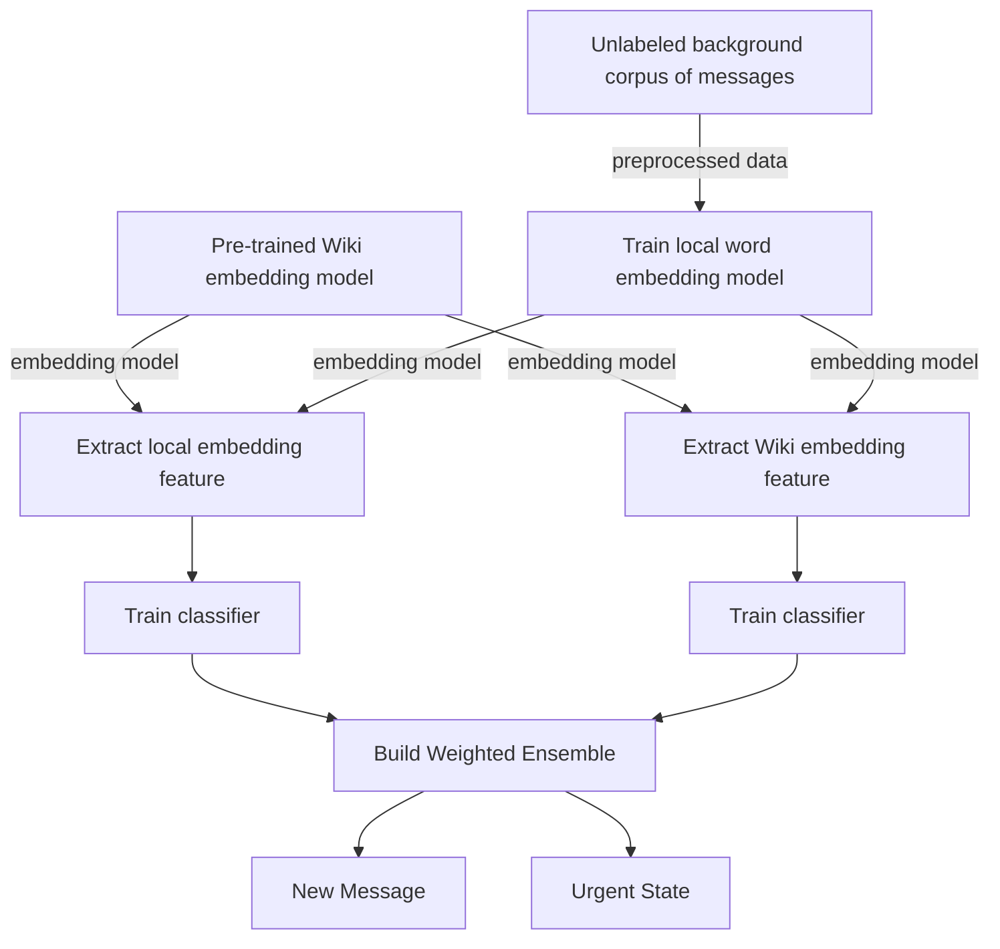

# Low-supervision urgency detection and transfer in short crisis messages

Mayank Kejriwal

Information Sciences Institute

University of Southern California

Marina del Rey, CA

kejriwal@isi.edu

Peilin Zhou

Information Sciences Institute

University of Southern California

Marina del Rey, CA

zpeilin@isi.edu

Abstract—Humanitarian disasters have been on the rise in recent years due to the effects of climate change and sociopolitical situations such as the refugee crisis. Technology can be used to best mobilize resources such as food and water in the event of a natural disaster, by semi-automatically flagging tweets and short messages as indicating an urgent need. The problem is challenging not just because of the sparseness of data in the immediate aftermath of a disaster, but because of the varying characteristics of disasters in developing countries (making it difficult to train just one system) and the noise and quirks in social media. In this paper, we present a robust, low-supervision social media urgency system that adapts to arbitrary crises by leveraging both labeled and unlabeled data in an ensemble setting. The system is also able to adapt to new crises where an unlabeled background corpus may not be available yet by utilizing a simple and effective transfer learning methodology. Experimentally, our transfer learning and lowsupervision approaches are found to outperform viable baselines with high significance on myriad disaster datasets.

Index Terms—Urgency detection, social media, machine learning, Twitter, crisis informatics

## I. INTRODUCTION

The United Nations Office for the Coordination of Human Affairs (OCHA) reported1 that in 2018, more than 141 million people were in need of humanitarian assistance, with over 9 billion dollars of unmet requirements. Using technology to address this shortfall by assisting aid agencies and first responders mobilize and send resources where they are needed the most is an important problem with the potential for widespread long-lasting social impact [1], [2].

To achieve this goal, the problem of semi-automatic urgency detection needs to be solved, especially on short message streams like social media that support real-time news feeds and micro-updates from citizens on the ground. Put intuitively,

1https://www.unocha.org/sites/unocha/files/WHDT2018 web final spread. pdf

Permission to make digital or hard copies of all or part of this work for personal or classroom use is granted without fee provided that copies are not made or distributed for profit or commercial advantage and that copies bear this notice and the full citation on the first page. Copyrights for components of this work owned by others than ACM must be honored. Abstracting with credit is permitted. To copy otherwise, or republish, to post on servers or to redistribute to lists, requires prior specific permission and/or a fee. Request permissions from permissions@acm.org.

ASONAM ’19, August 27-30, 2019, Vancouver, Canada

© 2019 Association for Computing Machinery.

ACM ISBN 978-1-4503-6868-1/19/08\$15.00

http://dx.doi.org/10.1145/3341161.3342936 the urgency detection problem can be framed in terms of probabilistic binary classification, a common machine learning paradigm involving other related tasks like sentiment analysis [3]. Although urgency detection has some similarity with sentiment analysis, the core problem is different, since the goal is to flag messages that express urgency, which is almost always a negative or panic-ridden emotion. However, it can be difficult to distinguish urgency-related tweets from just negative tweets. We provide an illustrative set of real-world examples2 in Table I.

In this paper, we present practical approaches for crisisspecific minimally supervised urgency detection on short message streams such as Twitter. The presented approaches cover two scenarios that often emerge in the real world. In the first scenario, a small amount (a few hundred messages) of training data labeled as urgent or non-urgent is available, along with a copious ‘unlabeled’ background corpus. In the second scenario, similar data is available for a ‘source’ domain but not for the target domain (expressing a ‘new crisis’) for which the urgency detection needs to be deployed. In other words, as messages are streaming in for this new domain, investigators label a few samples, but cannot rely on the availability of a background corpus since urgency needs to be tagged in real time before the crisis has fully subsided. To accomplish this challenging goal, our approach relies on a simple and robust transfer learning methodology [4]. Experimental results on three real-world datasets and several performance metrics validate our methods. To the best of our knowledge, this is the first such paper investigating the problem of urgency detection in social media, both algorithmically and empirically, for arbitrary disasters in low-supervision and transfer learning settings.

The rest of this paper is structured as follows. Section II describes some related work, Section III specifies our two research questions, and Section IV describes our approaches in support of answering those questions. Section V covers the experiments, and Section VI concludes the paper.

TABLE I: Urgent and non-urgent examples from three real-world datasets that we describe further in Section V.

<table><tr><td>Dataset</td><td>Urgent Sentences</td><td>Non-urgent Sentences</td></tr><tr><td>Nepal</td><td>Anyone who speaks about Balochistan in provinces other than Punjab either ends up dead or missing</td><td>Today’s earthquake data for Nepal</td></tr><tr><td></td><td>EMERGENCY: 4 locals trapped in this rubble IN-SIDE PALTANGHAR</td><td>Wow. ndtv just showed the same Philippines earthquake picture and said it’s from Kathmandu on TV.</td></tr><tr><td>Macedonia</td><td>Some people are trapped in the marketplace need help.</td><td>the streets are filled with fecal and water no water</td></tr><tr><td></td><td>We re trapped at the national commissioner s house the first floor s loaded with the kids have begun scared.</td><td>I’m about to walk with bicite but the rain that fell before s been blocking the roads that the channels are from the time of the rock.</td></tr><tr><td>Kerala</td><td>8 people no food survivin on dry cornflakes for the last 3 days east kadungalloor two families.</td><td>I’m from kerala and the situation here is very very bad, thousands have lost.</td></tr><tr><td></td><td>At least 324 people have been killed in flooding and landslides in the indian state of while more than 200000</td><td>there has been floods in kerala india, more than 70 have lost their lives may ”Make it easy for all”.</td></tr></table>

## II. RELATED WORK

Crisis informatics is emerging as an important field for both data scientists and policy analysts. A good introduction to the field was provided in a recent Science policy forum article [1]. The field draws on interdisciplinary strands of research, especially with respect to collecting, processing and analyzing real-world data. Particularly, social media platforms like Twitter have emerged as important channels (‘social sensors’ [2]) for situational awareness in support of crisis informatics. Although situational awareness is a broad notion extending beyond crisis informatics (e.g., military situational awareness), urgency detection is a special kind of situational awareness that tends to arise mainly in the crisis domain. A direct application is to help first responders and aid agencies assess needs in crisis-stricken areas and mobilize resources effectively (i.e. where needs are most urgent). NLP methods have been widely used in extracting situational awareness from Twitter e.g., see the work by Verma et al. [5]. Another important line of work is in analyzing events other than natural disasters (such as mass convergence and disruption events), but still relevant to crisis informatics. For example Stabird et al. presented a collaborative filtering system for identifying onthe-ground ‘Twitterers’ during mass disruptions [6]. Similar techniques could be employed to supplement the work in this paper.

More generally, projects like CrisisLex, Crisis Computing3 and EPIC (Empowering the Public with Information in Crisis) have emerged as major efforts in the crisis informatics space due to two reasons: first, the abundance and fine granularity of social media data implies that mining such data during crises can lead to robust, real-time responses; second, the recognition that any technology that is thus developed must also address the inherent challenges (including problems of noise, scale and irrelevance) in working with such datasets. CrisisLex provides a repository of crisis-related social media data and tools, including collections of crisis data and lexicons of crisis terms [7]. It also includes tools to help users create their own collections and lexicons. In contrast, Project EPIC, launched in 2009 and supported by a US National Science Foundation grant, is a multi-disciplinary effort involving several universities and languages with the goal of utilizing behavioral and technical knowledge of computer mediated communication for better crisis study and emergency response. Since its founding, Project EPIC has led to several advances in the crisis informatics space; see for example [8]–[12]. The work presented in this article is intended to be compatible with these efforts.

Other lines of work relevant to this paper involve minimally supervised machine learning, representation learning and transfer learning. Concerning minimally supervised machine learning (ML), in general, ML techniques where there are few, and in the case of zero-shot learning [13], [14], no observed instances for a label has been a popular research agenda for many years [15], [16]. In addition to weak supervision approaches [16], both semi-supervised and active learning have also been studied in great depth, with surveys provided by [17], [18]. However, to the best of our knowledge, a successful systems-level conjunction of various minimally supervised ML techniques has not been achieved for the task of short-text urgency detection. Such as empirical assessment is an important goal of this paper.

Due to the current renaissance of neural networks [19], embedding and representation learning methods have become more popular due to the advent of fast and effective models like skip-gram. Recent work has used such embeddings in numerous NLP and graph-theoretic applications [20], including information extraction [21], named entity recognition [22] and entity linking [23]. The most well-known example is word2vec (for words) [24], followed by similar models like paragraph2vec (for multi-word text) and fasttext [25], [26], the last two being most relevant for the work in this paper. For a recent evaluation study on representation learning for text, including potential problems, we refer the reader to [27]. Finally, transfer learning is a central agenda in this paper; an excellent survey of dominant techniques may be found in [4]. More recent work on domain adaptation may be found in [28], with the work in [29] applied specifically to the disaster response problem. Pedrood and Purohit [29] also applied transfer learning to the problem of mining help intent on Twitter. Other relevant work in crisis informatics, both in terms of defining ‘actionable information’ problems like urgency and need mining, as well as providing multimodal Twitter datasets from natural disasters, may be found in [30], [31] and [32]. An alternate way of looking at the problem is as an ‘event detection’ problem e.g., in [33] Zheng et al. study semi-supervised event-related tweet identification which also tries to identify the urgent tweets related to earthquakes and floods. These works are complementary to the minimally supervised, low-resource setting in this paper.

## III. RESEARCH QUESTIONS

We briefly enumerate below the research questions under consideration in this paper. While the first question captures the classical low-supervision setting, the second question introduces an element of transfer learning.

1) Low-supervision Training for Urgency Detection: How do we build an urgency detection system for a specific crisis when given as training input both a small number of manually labeled tweets, and a large number of unlabeled tweets (background corpus), for that crisis?  
2) Low-supervision Transfer Learning for Urgency Detection: How do we build an urgency detection system for a specific crisis when given as training input a small number of manually labeled tweets for that crisis, as well as ‘auxiliary’ training input of (a small number of) manually labeled tweets and unlabeled background tweets from a different crisis?

Unlike the first scenario, the second scenario applies to a very short period (hours, or even minutes) after the crisis has struck; this is why a background corpus is not available (yet) for that crisis. Instead, only a few manually labeled messages that have been acquired till that point are available.

## IV. APPROACH

## A. Low-supervision urgency detection

The approach for addressing the first research question is schematized in Figure 1. The first step in the workflow involves data preprocessing of the corpus. We follow a standard set of preprocessing steps. First, we apply a tokenizer to split the sentences into lists of words and delete words with special prefixes (including @ and RT, which are particularly prevalent in Twitter), and special suffixes. We also remove non-alphanumeric characters and convert the entire sentence to lowercase. Next, similar to traditional machine learning pipelines, we extract a set of manual features for expressing prior human knowledge about urgency detection. Our manual features are thus called because they are primarily keywordbased and binary, with keywords selected based on data exploration and domain knowledge. We consider ten such keywords, namely hit, help, kill, injure, strand, miss, urgent, die, need, food. If any of these keywords are present4, the corresponding feature is set to 1. Note that these keywords are associated with situations that are generally urgent, like people who have been attacked or affected by a crisis and need urgent help, but some are noisier than others5. Additionally, we also utilize an eleventh feature that checks to see if any numeric digits are present in the dataset. The rationale behind this feature is that, in more urgent tweets, numbers are often present e.g., ‘15 climbers are currently trapped on Everest due to the avalanche’.

In the experimental section, we show that the manual features are not adequate for addressing low-supervision urgency detection. Besides, it is prudent to utilize the large number of unlabeled tweets (background corpus) if it serves a useful purpose in improving performance. To that end, we train a skip-gram based word embedding model based on the ‘bag of tricks’ model released by researchers from Facebook in a package called fastText [26]. The reason behind using fastText, as opposed to alternate word embedding models like GloVe and word2vec [24], is several-fold. First, fastText is very fast and easy to execute, and is well-maintained. Second, preliminary analyses showed that it does quite well on social media tasks and because of the bag of tricks methodology (that uses character and sub-word embeddings to gracefully deal with OOVs6 and misspellings), it is able to generalize much better. Finally, fastText’s APIs include a way to get sentence embeddings directly after training the word embedding model. By training fastText on the background corpus, we are able to train a robust embedding model. In both the training and test phase, we use this model to get feature vectors for our messages besides the 11-dimensional manual feature vector described earlier.

However, given that the background corpus might not be as extensive or representative as a ‘general’ corpus like Wikipedia, we try to smooth the feature space by also using a pre-trained embedding model trained over the English Wikipedia corpus and publicly available7. The vectors obtained from this model have 300 dimensions and were trained using skip gram with default parameters.

As Figure 1 illustrates, we use all of these feature sets to build an ensemble by combining local embedding features, manual features and Wikipedia pre-trained word embedding features. The final score of the ensemble model is achieved by weighting the scores of the three Linear Regression models (one for each feature-set), with weights adding to 1. The weights are set using a held-out validation set.

When the urgency of a new ‘test’ message needs to be determined, we preprocess the message, extract all three feature-

4Possibly as stems, for example, the word ‘helping’ would trigger the ‘help keyword feature, which would be consequently set to 1.  
5For example ‘help’ could be associated with a more trivial situation like someone needing help with their dog.  
6Out of Vocabulary words.  
7https://fasttext.cc/docs/en/pretrained-vectors.html

sets8, and get the weighted score from the three regression models. If the score falls above a pre-determined threshold (again, determined through validation), then the message is flagged as urgent, otherwise it is not.

flowchart

Fig. 1: Training for Urgency Detection.

## B. Urgency detection using transfer learning

In this section, we describe our approach for ‘urgency detection transfer’ whereby a source dataset is given (similar to RQ1, where both an unlabeled background corpus, as well as a small manually labeled training set, are available) along with a target dataset (only a small manually labeled training set and no background corpus), representing the crisis under investigation. Our approach for urgency transfer is captured in Algorithm 1. Many of the steps are similar to those for RQ1, including preprocessing, but there are some important differences. For example, while the Wiki embedding model remains the same as earlier, the manual features are obviously extracted over the target domain (since they do not require a background corpus) and importantly, the ‘local’ embedding model is now trained over the source domain corpus, since there is no target domain unlabeled background corpus available.

To ‘sync’ the source and target domains, we consider a simple, but empirically effective, approach. Rather than use just the labeled target domain data for training the three linear regression models, we combine the labeled training data from both the source and target domains, but the target training data is up-sampled to allow its properties to emerge more concretely in the training. The up-sampling margin is a parameter in Algorithm 1; in practice, a factor of 6 (meaning the target labeled dataset is up-sampled by 6x) has been found to work well. To maximize training dataset utility, we do not use a validation set for classifier weight optimization, but consider the average of all three classifiers as the final score.

## Algorithm 1 Transfer Learning for Urgency Detection.

## Input :

• Labeled dataset in target domain: $D _ { t }$  
• Labeled dataset in source domain: $D _ { s l }$  
• Unlabeled corpus in source domain: $D _ { s u }$  
• Pre-trained Wikipedia Embedding Model: $W _ { w }$  
• Up-sampling parameter: u

## Output :

• Classifier for Urgency Detection: $\mathcal { C }$

## Method :

1) Train word embedding $W _ { s }$ on text in $D _ { s u } \cup D _ { s l }$ ;  
2) Up-sample $D _ { t }$ by factor u and ‘mix’ with $D _ { s l }$ to get expanded training set, $D _ { t r a i n } : D _ { t u } \cup D _ { s } l$  
3) Extract manual feature set $F _ { m } ,$ source embedding feature set $F _ { s }$ (using $W _ { s } ) _ { \ast }$ , and Wiki feature set $F _ { w }$ (using $W _ { w } )$ from each message in $D _ { t r a i n } ;$  
4) Train linear regression models $C _ { s } , C _ { m }$ and $C _ { w }$ on $F _ { s } ,$ , $F _ { m }$ and $F _ { w }$ resp. to get classifier;  
5) Return final classifier model C $a v g _ { - } s c o r e ( C _ { s } , C _ { m } , C _ { w } ) ;$

## V. EXPERIMENTS

## A. Data

For evaluating the approaches laid out in Section IV, we consider three real-world datasets described in Table II.

Two of the datasets (Nepal and Macedonia) were made available to us through the DARPA LORELEI program, under which this project is funded. The Nepal dataset comprises a collection of tweets collected in the aftermath of the 2015 Nepal earthquake (also called the Gorkha earthquake), while Macedonia was not an actual disaster but a realistic live-action simulation (of a disaster) conduced in Macedonia towards the end of 2018. Macedonia does not have much noise and is ‘information-dense’, but small. As such, it provides a good test of the transfer learning abilities of the approach presented. Kerala describes tweets in the aftermath of the Kerala floods in South India in 2018, and is the largest dataset, with many relevant and irrelevant tweets.

Originally, all the raw messages for the datasets described in Table II were unlabeled, in that their urgency status was unknown. Since the Macedonia dataset only contains 205 messages, and is a small but information-dense dataset, we labeled all messages in Macedonia as urgent or non-urgent (hence, there are no unlabeled messages in Macedonia per Table II). For the two other Twitter-based datasets, we used active learning to compose a labeled set that would contain challenging examples. The basic process was to do data preprocessing as described in Section IV, followed by training the local fastText-based word embedding model on all messages in the corpus. Next, we randomly labeled 50 urgent and nonurgent tweets and fed them into a classifier. The classifier was applied on the rest of the unlabeled data to obtain ‘ambiguous examples (where the classifier’s probability of the positive label was closest to 50%). We labeled another 100 samples this way, and continued to re-train and apply the classifier for two more iterations till we obtained a total of 400 labeled points. Note that the final labeled dataset may not be balanced in terms of urgent and non-urgent messages. Table II shows that Nepal is roughly balanced, while Kerala is imbalanced. We used stratified sampling therefore to split the labeled pool into a training and testing dataset for evaluating the two research questions. We used 90% for training and 10% for testing.

TABLE II: Details on datasets used for experiments.

<table><tr><td>Dataset</td><td>Unlabeled / Labeled Messages</td><td>Urgent / Non-urgent Messages</td><td>Unique Tokens</td><td>Avg. Tokens / Message</td><td>Time Range</td></tr><tr><td>Nepal</td><td>6,063/400</td><td>201/199</td><td>1,641</td><td>14</td><td>04/05/2015-05/06/2015</td></tr><tr><td>Macedonia</td><td>0/205</td><td>92/113</td><td>129</td><td>18</td><td>09/18/2018-09/21/2018</td></tr><tr><td>Kerala</td><td>92,046/400</td><td>125/275</td><td>19,393</td><td>15</td><td>08/17/2018-08/22/2018</td></tr></table>

## B. Metrics

We consider four standard metrics, namely Accuracy, Precision, Recall and F-Measure. Accuracy is simply the ratio of correctly labeled messages to the size of test set, precision is the ratio of the true positives to the sum of true positives and false positives, recall is the ratio of true positives to the sum of true positives and false negatives, and finally, F-Measure is the harmonic mean of precision and recall and captures their trade-off.

## C. Methodology

1) Protocol: Concerning RQ1, for datasets, we use Nepal and Kerala since Macedonia does not have a large unlabeled corpus available, which is an assumption made per RQ1. Recall that we used stratified random sampling to split the labeled data for each dataset into training (90%) and test (10%) sets. Of the 90% training set, a further split was done, with 90% kept for ‘training’ and 10% for setting optimal weights for the 3 linear classifiers9 trained in Section IV. To account for the effects of randomness, each experiment was conducted across ten trials, with averages reported on all four metrics described previously for all baselines described below and our approach. Among the different machine learning classifiers in the sklearn package tested, the linear regression was found to work well and used as the classifier of choice where applicable.

2) Baselines for Low-supervision Training for Urgency Detection: We use six baselines to evaluate the approach for RQ1 described in Section IV. Note that statistical significance is tested using the one-sided Student’s paired t-test by comparing the best system (on each metric) against the Local baseline, which is a reasonable choice since in a high-supervision (or even normal-supervision) setting, this baseline has been found to perform quite well. Significance at the 90% level is indicated with a \*, at the 95% level with a \*\*, and at the 99% level with a \*\*\*.  
3) Baselines for Low-supervision Transfer Learning for Urgency Detection: For RQ2, we consider three baselines besides our own approach:

Target-only Local (Target Local): This baseline is essentially the Wiki-Manual baseline described in the previous section and trained on the target dataset (i.e. no transfer learning is used, and no source is assumed). This baseline is used to illustrate the benefits of transfer learning, since this baseline sets the minimum benchmark that has to be bested by a transfer learning baseline.

Locally Supervised with Source Embedding (Embedding Transform): Similar to our approach on RQ1, manual features, source embeddings and pre-trained Wikipedia embeddings are used to train three classifiers (but on the labeled target domain), and average their probabilities as the final result. While the local embeddings are trained on the source domain (since unlabeled data is not available for the target domain), all classifier training is always done on the target.

Locally Supervised with Up-sampling and Source Embedding (Upsample): This baseline is the same as Embedding Transform, except to boost the power of the baseline, we upsample the labeled data (in the target dataset) by 6x. Thus, this baseline tries to mitigate source bias and concept drift by giving more importance to the transfer domain. This baseline is also more appropriate for the case where the target training data is extremely limited.

## D. Results and Discussion

Table IV illustrate the result for RQ1 on the Nepal and Kerala datasets. The results illustrate the viability of urgency detection in low-supervision settings (with our approach yielding 69.44% F-Measure on Nepal, at 99% significance compared to the Local baseline), with different feature sets contributing differently to the four metrics. While the local embedding model can reduce precision, for example, it can help the system to improve and accuracy and recall. Similarly, manual features reduce recall, but help the system to improve accuracy and precision (sometimes considerably). To truly address the urgency problem, therefore, a multi-pronged ensemble approach is justified, as also argued intuitively in Section IV. We also note that the pre-trained Wikipedia embedding model proved to be an important tool in improving the generalization ability of the model and not requiring any labeled or unlabeled data; in essence, serving as a free resource that could be helped to regularize and stabilize models that would otherwise be uncertain in low-supervision settings.

TABLE III: Description For Each Baseline On Research Question 1.

<table><tr><td>Baseline</td><td>Description</td></tr><tr><td>Local Embedding (Local)</td><td>The features for a single linear classifier are sentence embeddings (with each pre-processed message treated as a ‘sentence’) trained using the 5-gram skip gram-based fastText model with vector dimensionality set to 20</td></tr><tr><td>Manual Feature-based (Manual)</td><td>This baseline only considers the 11 manual features described earlier in Section IV</td></tr><tr><td>Wikipedia Word Embedding (Wiki)</td><td>This baseline only considers the linear classifier trained on the pre-trained Wikipedia Embedding model</td></tr><tr><td>Local Embedding and Manual Feature-based Ensemble (Local-Manual)</td><td>This baseline combines Local and Manual by training two Linear Regression classifiers and weighting their probabilities to get the final result (using the validation set).</td></tr><tr><td>Local Embedding and Wikipedia Word Embedding Ensemble (Wiki-Local)</td><td>This baseline combines Local and Wiki using the same methodology as for Local-Manual.</td></tr><tr><td>Wikipedia Word Embedding and Manual Feature-based Ensemble (Wiki-Manual)</td><td>This baseline combines Manual and Wiki using the same methodology as for Local-Manual.</td></tr></table>

TABLE IV: Results investigating RQ1 on the Nepal and Kerala datasets.

(a) Nepal

<table><tr><td>System</td><td>Accuracy</td><td>Precision</td><td>Recall</td><td>F-Measure</td></tr><tr><td>Local</td><td>63.97%</td><td>64.27%</td><td>64.50%</td><td>63.93%</td></tr><tr><td>Manual</td><td>64.25%</td><td>70.84%**</td><td>48.50%</td><td>57.11%</td></tr><tr><td>Wiki</td><td>67.25%</td><td>66.51%</td><td>69.50%</td><td>67.76%</td></tr><tr><td>Local-Manual</td><td>65.75%</td><td>67.96%</td><td>59.50%</td><td>62.96%</td></tr><tr><td>Wiki-Local</td><td>67.40%</td><td>65.54%</td><td>68.50%</td><td>66.80%</td></tr><tr><td>Wiki-Manual</td><td>67.75%</td><td>70.38%</td><td>63.00%</td><td>65.79%</td></tr><tr><td>Our Approach</td><td>69.25%***</td><td>68.76%</td><td>70.50%**</td><td>69.44%***</td></tr></table>

(b) Kerala

<table><tr><td>System</td><td>Accuracy</td><td>Precision</td><td>Recall</td><td>F-Measure</td></tr><tr><td>Local</td><td>56.25%</td><td>37.17%</td><td>55.71%</td><td>44.33%</td></tr><tr><td>Manual</td><td>65.00%</td><td>47.82%</td><td>55.77%</td><td>50.63%</td></tr><tr><td>Wiki</td><td>63.25%</td><td>42.07%</td><td>46.67%</td><td>44.00%</td></tr><tr><td>Local-Manual</td><td>64.50%</td><td>46.90%</td><td>51.86%</td><td>48.47%</td></tr><tr><td>Wiki-Manual</td><td>62.25%</td><td>43.56%</td><td>52.63%</td><td>46.93%</td></tr><tr><td>Wiki-Manual</td><td>68.75%***</td><td>51.04%</td><td>54.29%</td><td>52.20%**</td></tr><tr><td>Our Approach</td><td>68.50%</td><td>51.39%***</td><td>52.76%</td><td>51.62%</td></tr></table>

TABLE V: Results investigating RQ2 using the Nepal dataset as source and Macedonia dataset as target.

<table><tr><td>System</td><td>Accuracy</td><td>Precision</td><td>Recall</td><td>F-Measure</td></tr><tr><td>Local</td><td>58.76%</td><td>52.96%</td><td>59.19%</td><td>54.95%</td></tr><tr><td>Transform</td><td>58.62%</td><td>51.40%</td><td>60.32%*</td><td>55.34%</td></tr><tr><td>Upsample</td><td>59.38%</td><td>52.35%</td><td>57.58%</td><td>54.76%</td></tr><tr><td>Our Approach</td><td>61.79%*</td><td>55.08%</td><td>59.19%</td><td>56.90%</td></tr></table>

TABLE VI: Results investigating RQ2 using the Kerala dataset as source and Macedonia dataset as target.

<table><tr><td>System</td><td>Accuracy</td><td>Precision</td><td>Recall</td><td>F-Measure</td></tr><tr><td>Local</td><td>58.76%</td><td>52.96%</td><td>59.19%</td><td>54.95%</td></tr><tr><td>Transform</td><td>62.07%</td><td>55.45%</td><td>64.52%</td><td>59.09%</td></tr><tr><td>Upsample</td><td>64.90%***</td><td>57.98%*</td><td>65.48%***</td><td>61.30%***</td></tr><tr><td>Our Approach</td><td>62.90%</td><td>56.28%</td><td>62.42%</td><td>58.91%</td></tr></table>

TABLE VII: Results investigating RQ2 using the Nepal dataset as source and Kerala dataset as target.

<table><tr><td>System</td><td>Accuracy</td><td>Precision</td><td>Recall</td><td>F-Measure</td></tr><tr><td>Local</td><td>58.65%</td><td>42.40%</td><td>47.47%</td><td>36.88%</td></tr><tr><td>Transform</td><td>53.74%</td><td>32.89%</td><td>57.47%*</td><td>41.42%</td></tr><tr><td>Upsample</td><td>53.88%</td><td>31.71%</td><td>56.32%</td><td>40.32%</td></tr><tr><td>Our Approach</td><td>58.79%</td><td>35.26%</td><td>55.89%</td><td>43.03%*</td></tr></table>

TABLE VIII: Results investigating RQ2 using the Kerala dataset as source and Nepal dataset as target.

<table><tr><td>System</td><td>Accuracy</td><td>Precision</td><td>Recall</td><td>F-Measure</td></tr><tr><td>Local</td><td>60.26%</td><td>61.80%</td><td>59.94%</td><td>59.88%</td></tr><tr><td>Transform</td><td>61.18%*</td><td>61.04%</td><td>63.63%</td><td>62.08%</td></tr><tr><td>Upsample</td><td>60.29%</td><td>59.44%</td><td>66.02%*</td><td>62.50%*</td></tr><tr><td>Our Approach</td><td>60.06%</td><td>59.54%</td><td>63.98%</td><td>61.64%</td></tr></table>

Concerning transfer learning experiments (RQ2), we note that source domain embedding model can improve the performance for target model, and upsampling has a generally positive effect (Tables V-VIII). As expected, transfer learning performance (RQ2) is generally lower compared to the lowsupervision urgency detection on a single dataset10 (RQ1). Note that at least one of the transfer learning methods always bests the Local baseline on all metrics (except precision in Table VII, a result not found to be significant even at the 90% level). Our approach shows a slight improvement over the upsampling baseline on two of the four scenarios (Tables V and VII) by 2-2.7% on the F-Measure metric, which shows the diminishing returns from mixing source and target labeled training data. Further improving performance by high margins will require a radically new approach left for future work.

## VI. CONCLUSION AND FUTURE WORK

This paper presented minimally supervised urgency detection approaches for short texts (such as tweets) in the aftermath of an arbitrary humanitarian crisis such as the 2015 Nepal earthquake. The presented systems covered two scenarios that often emerge in the real world. In the first scenario, a small amount (a few hundred messages) of training data labeled as urgent or non-urgent is available, along with a copious background corpus. In the second scenario, similar data is available for a ‘source’ domain but not for the target domain (expressing a ‘new crisis’) for which the urgency detection needs to be deployed. As messages are streaming in for this new domain, investigators label a few samples, but cannot rely on the availability of a background corpus since urgency needs to be tagged in real time before the crisis has fully subsided. To accomplish this challenging goal, our approach relies on a simple but robust transfer learning methodology. Experimental results on three real-world datasets validate our methods.

Some of the obvious avenues for future work are to improve the existing approach incrementally by (for example) adding more manual features and using more sophisticated local embedding model, possibly with more advanced tuning of hyperparameters like the learning rate and vector dimensionality. For improving transfer learning, we are considering using a deep learning model with priors to truly leverage the presence of a source, albeit one covering a domain that is different from the target. Deep learning for transfer learning is still in its infancy in the machine learning community, and has not been demonstrated for difficult and irregular social media datasets. However, we believe that this presents an opportunity for further study.

## ACKNOWLEDGEMENTS

The authors gratefully acknowledge the ongoing support and funding of the DARPA LORELEI program, and our partner collaborators in providing detailed analysis. The views and conclusions contained herein are those of the authors and should not be interpreted as necessarily representing the official policies or endorsements, either expressed or implied, of DARPA, AFRL, or the U.S. Government.

## REFERENCES

[1] L. Palen and K. M. Anderson, “Crisis informaticsnew data for extraordinary times,” Science, vol. 353, no. 6296, pp. 224–225, 2016.  
[2] T. Sakaki, M. Okazaki, and Y. Matsuo, “Earthquake shakes twitter users: real-time event detection by social sensors,” in Proceedings of the 19th international conference on World wide web. ACM, 2010, pp. 851–860.  
[3] B. Pang, L. Lee et al., “Opinion mining and sentiment analysis,” Foundations and Trends® in Information Retrieval, vol. 2, no. 1–2, pp. 1–135, 2008.  
[4] S. J. Pan and Q. Yang, “A survey on transfer learning,” IEEE Transactions on knowledge and data engineering, vol. 22, no. 10, pp. 1345–1359, 2010.  
[5] S. Verma, S. Vieweg, W. J. Corvey, L. Palen, J. H. Martin, M. Palmer, A. Schram, and K. M. Anderson, “Natural language processing to the rescue? extracting” situational awareness” tweets during mass emergency,” in Fifth International AAAI Conference on Weblogs and Social Media, 2011.  
[6] K. Starbird, G. Muzny, and L. Palen, “Learning from the crowd: collaborative filtering techniques for identifying on-the-ground twitterers during mass disruptions,” in Proceedings of 9th International Conference on Information Systems for Crisis Response and Management, ISCRAM, 2012, pp. 1–10.  
[7] A. Olteanu, C. Castillo, F. Diaz, and S. Vieweg, “CrisisLex: A lexicon for collecting and filtering microblogged communications in crises.” in Proc. Int. Conf. Weblogs and Social Media (ICWSM), Oxford, UK, 2014.  
[8] M. Barrenechea, K. M. Anderson, A. A. Aydin, M. Hakeem, and S. Jambi, “Getting the query right: User interface design of analysis platforms for crisis research,” in Engineering the Web in the Big Data Era, P. Cimiano, F. Frasincar, G.-J. Houben, and D. Schwabe, Eds. Cham: Springer International Publishing, 2015, pp. 547–564.  
[9] L. Palen, R. Soden, T. J. Anderson, and M. Barrenechea, “Success &#38; scale in a data-producing organization: The socio-technical evolution of openstreetmap in response to humanitarian events,” in Proceedings of the 33rd Annual ACM Conference on Human Factors in Computing Systems, ser. CHI ’15. New York, NY, USA: ACM, 2015, pp. 4113–4122. [Online]. Available: http://doi.acm.org/10.1145/2702123.2702294  
[10] M. Kogan, L. Palen, and K. M. Anderson, “Think local, retweet global: Retweeting by the geographically-vulnerable during hurricane sandy,” in Proceedings of the 18th ACM Conference on Computer Supported Cooperative Work &#38; Social Computing, ser. CSCW ’15. New York, NY, USA: ACM, 2015, pp. 981–993. [Online]. Available: http://doi.acm.org/10.1145/2675133.2675218  
[11] K. M. Anderson, A. Schram, A. Alzabarah, and L. Palen, “Architectural implications of social media analytics in support of crisis informatics research,” IEEE Data Eng. Bull., vol. 36, pp. 13–20, 2013.  
[12] R. Soden, N. Budhathoki, and L. Palen, “Resilience-building and the crisis informatics agenda: Lessons learned from open cities kathmandu,” in ISCRAM, 2014.  
[13] M. Palatucci, D. Pomerleau, G. E. Hinton, and T. M. Mitchell, “Zero-shot learning with semantic output codes,” in Advances in neural information processing systems, 2009, pp. 1410–1418.  
[14] B. Romera-Paredes and P. Torr, “An embarrassingly simple approach to zero-shot learning,” in International Conference on Machine Learning, 2015, pp. 2152–2161.  
[15] H. Uszkoreit, F. Xu, and H. Li, “Analysis and improvement of minimally supervised machine learning for relation extraction.” in NLDB. Springer, 2009, pp. 8–23.  
[16] C. C. Aggarwal and C. Zhai, Mining text data. Springer Science & Business Media, 2012.  
[17] X. Zhu, “Semi-supervised learning literature survey,” 2005.  
[18] B. Settles, “Active learning literature survey,” University of Wisconsin, Madison, vol. 52, no. 55-66, p. 11, 2010.  
[19] M. Sahlgren, “An introduction to random indexing,” 2005.  
[20] R. Collobert, J. Weston, L. Bottou, M. Karlen, K. Kavukcuoglu, and P. Kuksa, “Natural language processing (almost) from scratch,” Journal ofMachine Learning Research, vol. 12, no. Aug, pp. 2493–2537, 2011.  
[21] M. Kejriwal and P. Szekely, “Information extraction in illicit web domains,” in Proceedings of the 26th International Conference on World Wide Web. International World Wide Web Conferences Steering Committee, 2017, pp. 997–1006.  
[22] D. Nadeau and S. Sekine, “A survey of named entity recognition and classification,” Lingvisticae Investigationes, vol. 30, no. 1, pp. 3–26, 2007.  
[23] A. Moro, A. Raganato, and R. Navigli, “Entity linking meets word sense disambiguation: a unified approach,” Transactions of the Association for Computational Linguistics, vol. 2, pp. 231–244, 2014.  
[24] T. Mikolov, I. Sutskever, K. Chen, G. S. Corrado, and J. Dean, “Distributed representations of words and phrases and their compositionality,” in Advances in neural information processing systems, 2013, pp. 3111–3119.  
[25] A. M. Dai, C. Olah, and Q. V. Le, “Document embedding with paragraph vectors,” arXiv preprint arXiv:1507.07998, 2015.  
[26] A. Joulin, E. Grave, P. Bojanowski, and T. Mikolov, “Bag of tricks for efficient text classification,” arXiv preprint arXiv:1607.01759, 2016.  
[27] M. Faruqui, Y. Tsvetkov, P. Rastogi, and C. Dyer, “Problems with evaluation of word embeddings using word similarity tasks,” arXiv preprint arXiv:1605.02276, 2016.  
[28] F. Alam, S. Joty, and M. Imran, “Domain adaptation with adversarial training and graph embeddings,” arXiv preprint arXiv:1805.05151, 2018.  
[29] B. Pedrood and H. Purohit, “Mining help intent on twitter during disasters via transfer learning with sparse coding,” in International Conference on Social Computing, Behavioral-Cultural Modeling and Prediction and Behavior Representation in Modeling and Simulation. Springer, 2018, pp. 141–153.  
[30] X. He, D. Lu, D. Margolin, M. Wang, S. E. Idrissi, and Y.-R. Lin, “The signals and noise: actionable information in improvised social media channels during a disaster,” in Proceedings of the 2017 ACM on Web Science Conference. ACM, 2017, pp. 33–42.  
[31] H. Purohit, C. Castillo, M. Imran, and R. Pandey, “Social-eoc: Serviceability model to rank social media requests for emergency operation centers,” in 2018 IEEE/ACM International Conference on Advances in Social Networks Analysis and Mining (ASONAM). IEEE, 2018, pp. 119– 126.  
[32] F. Alam, F. Ofli, and M. Imran, “Crisismmd: Multimodal twitter datasets from natural disasters,” in Twelfth International AAAI Conference on Web and Social Media, 2018.  
[33] X. Zheng, A. Sun, S. Wang, and J. Han, “Semi-supervised event-related tweet identification with dynamic keyword generation,” in Proceedings of the 2017 ACM on Conference on Information and Knowledge Management. ACM, 2017, pp. 1619–1628.