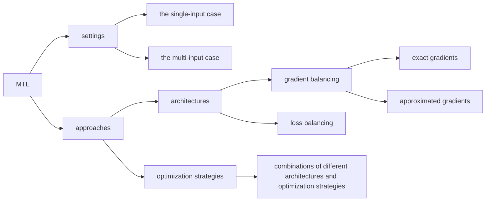
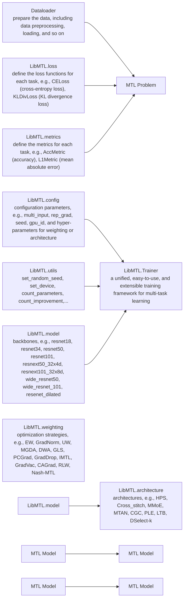

# LibMTL: A Python Library for Deep Multi-Task Learning

Baijiong Lin∗

bj.lin.email@gmail.com

The Hong Kong University of Science and Technology (Guangzhou)

Yu Zhang†

yu.zhang.ust@gmail.com

Department of Computer Science and Engineering, Southern University of Science and Technology Peng Cheng Laboratory

Editor: Alexandre Gramfort

## Abstract

This paper presents LibMTL, an open-source Python library built on PyTorch, which provides a unified, comprehensive, reproducible, and extensible implementation framework for Multi-Task Learning (MTL). LibMTL considers diferent settings and approaches in MTL, and it supports a large number of state-of-the-art MTL methods, including 13 optimization strategies and 8 architectures. Moreover, the modular design in LibMTL makes it easy to use and well extensible, thus users can easily and fast develop new MTL meth ods, compare with existing MTL methods fairly, or apply MTL algorithms to real-world applications with the support of LibMTL. The source code and detailed documentations of LibMTL are available at https://github.com/median-research-group/LibMTL and https://libmtl.readthedocs.io, respectively.

Keywords: Multi-Task Learning, Python, PyTorch

## 1. Introduction

Multi-Task Learning (MTL) (Caruana, 1997; Zhang and Yang, 2022) is an important area in both machine learning and industrial communities. By learning several related tasks simultaneously, this learning paradigm could not only improve the generalization performance but also reduce the storage cost and inference time, thus it has been applied to many real-world scenarios such as autonomous driving, natural language processing, recommendation system, robotic control, bioinformation, and so on (Zhang and Yang, 2022). Although many State-Of-The-Art (SOTA) MTL models have been proposed recently, most of them are implemented in their respective frameworks with diferent experimental details or there is no public implementation. Therefore, it is not easy to extend existing MTL algorithms to real-world applications or make a fair comparison with them when designing new MTL models.

To remedy such situation, we develop a Python library for MTL called LibMTL, which has three key features. Firstly, LibMTL provides a unified code base to cover diferent MTL settings such as the single-input and multi-input problems. Hence, it allows a convenient, fair, and consistent comparison between diferent MTL algorithms in various application scenarios. Secondly, built on PyTorch (Paszke et al., 2019), LibMTL has supported lots of SOTA MTL models, especially deep MTL models, including 13 optimization strategies and 8 MTL architectures. Thirdly, LibMTL follows modular design principles, which allows users to flexibly and conveniently add customized components and make personalized modifications. Therefore, users can easily and fast develop new MTL models or apply existing MTL algorithms to their own application scenarios with the support of LibMTL.

## 2. Settings and Approaches in MTL

Suppose there are T tasks and each task t has its corresponding data set ${ \mathcal { D } } _ { t } ~ = ~ \{ { \bf X } _ { t } , { \bf Y } _ { t } \}$ Let $f ( \cdot ; \theta , \psi _ { 1 : T } )$ denotes an MTL model with task-shared parameters θ and task-specific parameters $\psi _ { 1 : T }$ . MTL aims to train a model f on all data sets $\mathcal { D } _ { 1 : T }$ and expects $f$ to perform well on each task. There are usually two settings in MTL: the single-input case where each task has the same input data, i.e., ${ \bf X } _ { m } = { \bf X } _ { n }$ for any m $\neq n ,$ , and the multi-input case where each task has its own input data,

i.e., $\mathbf { X } _ { m } \neq \mathbf { X } _ { n }$ for any $m \neq n$ . Those two settings rely on concrete application scenarios and they are diferent in the training implementation.

flowchart

Figure 1: Categories of settings and approaches in MTL.

There are two main lines of research for MTL. The first line is to design the architecture in deep neural networks for MTL and it directly determines which parameters are shared and how to share. The second line is to design the optimization strategy for MTL. Since how to balance multiple training losses in MTL directly afects the update of the task-shared parameters $\theta ,$ several methods are proposed to balance the losses or gradients of all the tasks in diferent ways, which are called loss balancing methods and gradient balancing methods, respectively. Moreover, gradient balancing methods need to calculate the gradients of the task-shared parameters θ for every task, which may be computationally intensive when the number of shared parameters or tasks is large. Thus, Sener and Koltun (2018) propose to use gradients of feature representations to approximate the exact gradients of shared parameters, which significantly reduces the computational cost and is followed by other gradient balancing methods such as GradDrop (Chen et al., 2020) and IMTL (Liu et al., 2021b). Obviously, those two ways to calculate gradients are diferent in implementations. Noticeably, those two lines of research are almost orthogonal to each other as the optimization methods are mainly related to the objective function, while the design of the architecture is to learn relationships between tasks. Thus, optimization strategies can be seamlessly combined with architectures to further improve the performance of MTL.

To summarize, as shown in Figure 1, MTL has two settings and its learning approaches can be divided into three categories.

## 3. The LibMTL Library

In this section, we introduce the LibMTL library, which provides a unified and easy-touse framework for MTL as mentioned in Section 2. In Section 3.1, we introduce MTL methods implemented in LibMTL, which enables consistent and reproducible comparisons between diferent MTL algorithms. In Section 3.2, we present the modular design in LibMTL, which allows flexible and extensible customization for new MTL methods or potential MTL applications. In Section 3.3, we compare diferent MTL models on a benchmark data set based on the LibMTL library. In Section 3.4, we show that LibMTL is more comprehensive and up-to-date than existing MTL libraries.

## 3.1 Supported MTL Methods

Currently, LibMTL supports 13 optimization strategies, namely, Equal Weighting (EW), Gradient Normalization (GradNorm) (Chen et al., 2018), Uncertainty Weights (UW) (Kendall et al., 2018), MGDA (Sener and Koltun, 2018), Dynamic Weight Average (DWA) (Liu et al., 2019), Geometric Loss Strategy (GLS) (Chennupati et al., 2019), Projecting Conflicting Gradient (PCGrad) (Yu et al., 2020), Gradient sign Dropout (GradDrop) (Chen et al., 2020), Impartial Multi-Task Learning (IMTL) (Liu et al., 2021b), Gradi ent Vaccine (GradVac) (Wang et al., 2021), Conflict-Averse Gradient descent (CAGrad) (Liu et al., 2021a), Nash-MTL (Navon et al., 2022), and Random Weighting (RW) (Lin et al., 2022). Moreover, it supports 8 MTL architectures, i.e., Hard Parameter Sharing (HPS) (Caruana, 1993), Cross-stitch Networks (Misra et al., 2016), Multi-gate Mixtureof-Experts (MMoE) (Ma et al., 2018), Multi-Task Attention Network (MTAN) (Liu et al., 2019), Customized Gate Control (CGC) (Tang et al., 2020), Progressive Layered Extraction (PLE) (Tang et al., 2020), Learning to Branch (LTB) (Guo et al., 2020), and DSelectk (Hazimeh et al., 2021). Besides, LibMTL supports combinations of each optimization strategy and each architecture.

## 3.2 The Modular Design of LibMTL

Figure 2 shows the overall framework of LibMTL, which is divided into diferent functional modules to allow users to flexibly and conveniently add customized designs or modifications in any module.

In LibMTL, each module has diferent functionalities. The Dataloader module is responsible for data pre-processing and loading. The LibMTL.loss module defines loss functions for each task. The LibMTL.metrics module defines evaluation metrics for all the tasks. The above three modules are highly dependent on the MTL problem under investigation. The LibMTL.config module is responsible for all the configuration parameters involved in the training process, such as the MTL setting (i.e., the multi-input case or not), possible hyper-parameters of optimization strategies and architectures, the training configuration (e.g., the batch size, the running epoch, the random seed, and the learning rate), and so on. This module adopts command-line arguments to enable users to set those configuration parameters conveniently. The LibMTL.Trainer module provides a unified framework for the training process under diferent MTL settings and for diferent MTL approaches as introduced in Section 2. The LibMTL.utils module implements useful functionalities for the training process such as calculating the total number of parameters in an MTL model. The LibMTL.architecture and LibMTL.weighting modules contain the implementations of various architectures and optimization strategies, respectively, as introduced in Section 3.1. The LibMTL.model module includes some popular backbone networks (e.g., ResNet). The last three modules are highly related to MTL models.

flowchart

Figure 2: The overall framework of LibMTL.

Noticeably, such modular design makes LibMTL easy to use and well-extensible. For example, when applying to new applications, users only need to prepare the new dataloaders and select (or re-define) appropriate loss and metric functions, and they can use existing MTL methods implemented in LibMTL. Besides, for researchers to develop new MTL methods such as new architectures, they can easily implement their new method with the support of LibMTL, make a fair comparison with existing models, and combine the new architecture with modern optimization methods based on LibMTL.

## 3.3 Performance Comparison

In Table 1, we compare diferent MTL methods on the NYUv2 data set (Silberman et al., 2012) and set up a benchmark for MTL. The NYUv2 data set is an indoor scene understanding data set and has been used extensively in the MTL literature. It contains 3 tasks: semantic segmentation (denoted by Segmentation), depth estimation (denoted by Depth), and surface normal prediction (denoted by Normal). The implementation details and evaluation metrics are following Lin et al. (2022).

## 3.4 Comparison with Related Libraries

There are some libraries that have been developed for MTL recently. For example, RMTL (Cao et al., 2019) is implemented in R to support shallow MTL methods such as linear regularized methods. Another library, i.e., MTLV (Rahimi et al., 2021), only provides a limited number of MTL architectures for natural language processing. Compared with them, LibMTL is more comprehensive and up-to-date. Firstly, LibMTL covers more settings and approaches as introduced in Section 2, which means that LibMTL can be applied to more application scenarios. Secondly, LibMTL implements more SOTA MTL models, especially those based on deep neural networks.

<table><tr><td rowspan="3">Methods</td><td colspan="2">Segmentation</td><td colspan="2">Depth</td><td colspan="5">Normal</td></tr><tr><td rowspan="2">mIoU↑</td><td rowspan="2">PAcc↑</td><td rowspan="2">AErr↓</td><td rowspan="2">RErr↓</td><td colspan="2">Angle Distance</td><td colspan="3">Within  $t^{\circ}$ </td></tr><tr><td>Mean↓</td><td>MED↓</td><td>11.25↑</td><td>22.5↑</td><td>30↑</td></tr><tr><td colspan="10">Different optimization strategies on HPS architecture</td></tr><tr><td>EW</td><td>53.93</td><td>75.53</td><td>0.3825</td><td>0.1577</td><td>23.57</td><td>17.01</td><td>35.04</td><td>60.99</td><td>72.05</td></tr><tr><td>GradNorm</td><td>53.91</td><td>75.38</td><td>0.3842</td><td>0.1571</td><td>23.17</td><td>16.62</td><td>35.80</td><td>61.90</td><td>72.84</td></tr><tr><td>UW</td><td>54.29</td><td>75.64</td><td>0.3815</td><td>0.1583</td><td>23.48</td><td>16.92</td><td>35.26</td><td>61.17</td><td>72.21</td></tr><tr><td>MGDA</td><td>53.52</td><td>74.76</td><td>0.3852</td><td>0.1566</td><td>22.74</td><td>16.00</td><td>37.12</td><td>63.22</td><td>73.84</td></tr><tr><td>DWA</td><td>54.06</td><td>75.64</td><td>0.3820</td><td>0.1564</td><td>23.70</td><td>17.11</td><td>34.90</td><td>60.74</td><td>71.81</td></tr><tr><td>GLS</td><td>54.59</td><td>76.06</td><td>0.3785</td><td>0.1555</td><td>22.71</td><td>16.07</td><td>36.89</td><td>63.11</td><td>73.81</td></tr><tr><td>PCGrad</td><td>53.94</td><td>75.62</td><td>0.3804</td><td>0.1578</td><td>23.52</td><td>16.93</td><td>35.19</td><td>61.17</td><td>72.19</td></tr><tr><td>GradDrop</td><td>53.73</td><td>75.54</td><td>0.3837</td><td>0.1580</td><td>23.54</td><td>16.96</td><td>35.17</td><td>61.06</td><td>72.07</td></tr><tr><td>IMTL</td><td>53.63</td><td>75.44</td><td>0.3868</td><td>0.1592</td><td>22.58</td><td>15.85</td><td>37.44</td><td>63.52</td><td>74.09</td></tr><tr><td>GradVac</td><td>54.21</td><td>75.67</td><td>0.3859</td><td>0.1583</td><td>23.58</td><td>16.91</td><td>35.34</td><td>61.15</td><td>72.10</td></tr><tr><td>CAGrad</td><td>53.97</td><td>75.54</td><td>0.3885</td><td>0.1588</td><td>22.47</td><td>15.71</td><td>37.77</td><td>63.82</td><td>74.30</td></tr><tr><td>Nash-MTL</td><td>53.41</td><td>74.95</td><td>0.3867</td><td>0.1612</td><td>22.57</td><td>15.94</td><td>37.30</td><td>63.40</td><td>74.09</td></tr><tr><td>RLW</td><td>54.04</td><td>75.58</td><td>0.3827</td><td>0.1588</td><td>23.07</td><td>16.49</td><td>36.12</td><td>62.08</td><td>72.94</td></tr><tr><td colspan="10">Different architectures with EW strategy</td></tr><tr><td>HPS</td><td>53.93</td><td>75.53</td><td>0.3825</td><td>0.1577</td><td>23.57</td><td>17.01</td><td>35.04</td><td>60.99</td><td>72.05</td></tr><tr><td>Cross-stitch</td><td>53.44</td><td>75.21</td><td>0.3818</td><td>0.1609</td><td>23.15</td><td>16.35</td><td>36.67</td><td>62.14</td><td>72.76</td></tr><tr><td>MMoE</td><td>53.14</td><td>75.07</td><td>0.3876</td><td>0.1613</td><td>23.02</td><td>16.36</td><td>36.45</td><td>62.40</td><td>73.17</td></tr><tr><td>MTAN</td><td>54.64</td><td>75.99</td><td>0.3771</td><td>0.1557</td><td>23.12</td><td>16.48</td><td>36.15</td><td>62.12</td><td>72.99</td></tr><tr><td>CGC</td><td>53.27</td><td>75.14</td><td>0.3914</td><td>0.1632</td><td>22.14</td><td>15.33</td><td>38.67</td><td>64.61</td><td>74.85</td></tr><tr><td>PLE</td><td>52.75</td><td>74.78</td><td>0.3943</td><td>0.1609</td><td>22.10</td><td>15.34</td><td>38.51</td><td>64.79</td><td>75.08</td></tr><tr><td>LTB</td><td>52.58</td><td>74.75</td><td>0.3828</td><td>0.1607</td><td>23.31</td><td>16.51</td><td>36.34</td><td>61.84</td><td>72.52</td></tr><tr><td>DSelect-k</td><td>53.75</td><td>75.44</td><td>0.3802</td><td>0.1569</td><td>23.18</td><td>16.44</td><td>36.29</td><td>62.14</td><td>72.85</td></tr></table>

Table 1: Performance comparison on the NYUv2 data set with three tasks. Each experiment is repeated over 3 random seeds and the average performance is reported. ↑ (↓) indicates that the higher (lower) the value, the better the performance.

## 4. Conclusion

We present LibMTL, a comprehensive and extensible library for MTL. Built on PyTorch, it provides a unified training framework for diferent settings in MTL and possesses many SOTA MTL algorithms. In our future work, we will continuously maintain this library to incorporate newly proposed MTL models, update the documentation, add more applications from diferent areas, and provide more backbone models such as vision transformer (Dosovitskiy et al., 2021) and N-grams (Brown et al., 1992).

## Acknowledgments

This work is supported by NSFC key grant 62136005 and NSFC general grant 62076118.

## References

Peter F Brown, Vincent J Della Pietra, Peter V Desouza, Jennifer C Lai, and Robert L Mercer. Class-based N-gram models of natural language. Computational Linguistics, 18 (4):467–480, 1992.  
Han Cao, Jiayu Zhou, and Emanuel Schwarz. RMTL: An R library for multi-task learning. Bioinformatics, 35(10):1797–1798, 2019.  
Rich Caruana. Multitask learning: A knowledge-based source of inductive bias. In International Conference on Machine Learning, 1993.  
Rich Caruana. Multitask learning. Machine Learning, 28(1):41–75, 1997.  
Zhao Chen, Vijay Badrinarayanan, Chen-Yu Lee, and Andrew Rabinovich. GradNorm: Gradient normalization for adaptive loss balancing in deep multitask networks. In International Conference on Machine Learning, 2018.  
Zhao Chen, Jiquan Ngiam, Yanping Huang, Thang Luong, Henrik Kretzschmar, Yuning Chai, and Dragomir Anguelov. Just pick a sign: Optimizing deep multitask models with gradient sign dropout. In Neural Information Processing Systems, 2020.  
Sumanth Chennupati, Ganesh Sistu, Senthil Kumar Yogamani, and Samir A. Rawashdeh. MultiNet++: Multi-stream feature aggregation and geometric loss strategy for multi-task learning. In IEEE Conference on Computer Vision and Pattern Recognition Workshop on Autonomous Driving, 2019.  
Alexey Dosovitskiy, Lucas Beyer, Alexander Kolesnikov, Dirk Weissenborn, Xiaohua Zhai, Thomas Unterthiner, Mostafa Dehghani, Matthias Minderer, Georg Heigold, Sylvain Gelly, Jakob Uszkoreit, and Neil Houlsby. An image is worth 16x16 words: Transformers for image recognition at scale. In International Conference on Learning Representations, 2021.  
Pengsheng Guo, Chen-Yu Lee, and Daniel Ulbricht. Learning to branch for multi-task learning. In International Conference on Machine Learning, 2020.  
Hussein Hazimeh, Zhe Zhao, Aakanksha Chowdhery, Maheswaran Sathiamoorthy, Yihua Chen, Rahul Mazumder, Lichan Hong, and Ed Chi. Dselect-k: Diferentiable selection in the mixture of experts with applications to multi-task learning. In Neural Information Processing Systems, 2021.  
Alex Kendall, Yarin Gal, and Roberto Cipolla. Multi-task learning using uncertainty to weigh losses for scene geometry and semantics. In IEEE Conference on Computer Vision and Pattern Recognition, 2018.  
Baijiong Lin, Feiyang Ye, Yu Zhang, and Ivor W. Tsang. Reasonable efectiveness of random weighting: A litmus test for multi-task learning. Transactions on Machine Learning Research, 2022.  
Bo Liu, Xingchao Liu, Xiaojie Jin, Peter Stone, and Qiang Liu. Conflict-averse gradient descent for multi-task learning. In Neural Information Processing Systems, 2021a.  
Liyang Liu, Yi Li, Zhanghui Kuang, Jing-Hao Xue, Yimin Chen, Wenming Yang, Qingmin Liao, and Wayne Zhang. Towards impartial multi-task learning. In International Conference on Learning Representations, 2021b.  
Shikun Liu, Edward Johns, and Andrew J. Davison. End-to-end multi-task learning with attention. In IEEE Conference on Computer Vision and Pattern Recognition, 2019.  
Jiaqi Ma, Zhe Zhao, Xinyang Yi, Jilin Chen, Lichan Hong, and Ed H Chi. Modeling task relationships in multi-task learning with multi-gate mixture-of-experts. In ACM SIGKDD International Conference on Knowledge Discovery & Data Mining, 2018.  
Ishan Misra, Abhinav Shrivastava, Abhinav Gupta, and Martial Hebert. Cross-stitch networks for multi-task learning. In IEEE Conference on Computer Vision and Pattern Recognition, 2016.  
Aviv Navon, Aviv Shamsian, Idan Achituve, Haggai Maron, Kenji Kawaguchi, Gal Chechik, and Ethan Fetaya. Multi-task learning as a bargaining game. In International Conference on Machine Learning, 2022.  
Adam Paszke, Sam Gross, Francisco Massa, Adam Lerer, James Bradbury, Gregory Chanan, Trevor Killeen, Zeming Lin, Natalia Gimelshein, Luca Antiga, Alban Desmaison, Andreas K¨opf, Edward Yang, Zachary DeVito, et al. PyTorch: An imperative style, highperformance deep learning library. In Neural Information Processing Systems, 2019.  
Fatemeh Rahimi, Evangelos E Milios, and Stan Matwin. MTLV: A library for building deep multi-task learning architectures. In ACM Symposium on Document Engineering, 2021.  
Ozan Sener and Vladlen Koltun. Multi-task learning as multi-objective optimization. In Neural Information Processing Systems, 2018.  
Nathan Silberman, Derek Hoiem, Pushmeet Kohli, and Rob Fergus. Indoor segmentation and support inference from RGBD images. In European Conference on Computer Vision, 2012.  
Hongyan Tang, Junning Liu, Ming Zhao, and Xudong Gong. Progressive layered extraction (PLE): A novel multi-task learning (MTL) model for personalized recommendations. In ACM Conference on Recommender Systems, 2020.  
Zirui Wang, Yulia Tsvetkov, Orhan Firat, and Yuan Cao. Gradient vaccine: Investigating and improving multi-task optimization in massively multilingual models. In International Conference on Learning Representations, 2021.  
Tianhe Yu, Saurabh Kumar, Abhishek Gupta, Sergey Levine, Karol Hausman, and Chelsea Finn. Gradient surgery for multi-task learning. In Neural Information Processing Systems, 2020.  
Yu Zhang and Qiang Yang. A survey on multi-task learning. IEEE Transactions on Knowledge and Data Engineering, 34(12):5586–5609, 2022.