# MT2ST: Adaptive Multi-Task to Single-Task Learning

Dong Liu

Yale University

Department of Computer Science

dong.liu.dl2367@yale.edu

Yanxuan Yu

Columbia University

College of Engineering

yy3523@columbia.edu

## Abstract

We propose MT2ST, a general and efficient framework for accelerating multi-task training by progressively transitioning to single-task optimization. Unlike conventional multi-task learning (MTL) or singletask fine-tuning (STL), MT2ST dynamically adjusts the training focus via two complementary strategies: Diminish, which gradually down-weights auxiliary losses, and Switch, which explicitly switches to the primary task at a scheduled point. We demonstrate the effectiveness of MT2ST across three key paradigms: representation learning, transformers, and diffusion models, covering both unimodal (text/image) and multimodal (vision-language) tasks. Extensive experiments show that MT2ST significantly improves training efficiency—achieving up to 56% FLOPs compression—while maintaining or surpassing task performance. These results suggest MT2ST as a general-purpose solution for scalable and adaptive multi-task training. Although this work is general-purpose, it is especially suitable for multimodal settings such as VQA or vision-language retrieval, where auxiliary pretraining (e.g., masked language modeling or contrastive learning) often diverges from final objectives. We include a VQA case study and outline its efficiency for multimodal retrieval in §4.

## 1 Introduction

The rapid evolution of large-scale models in machine learning (ML), particularly in natural language processing (NLP), computer vision (CV), and speech recognition, has brought tremendous advances in task performance but also increased the demand for computational efficiency. As models grow in parameter size and data requirements, efficient training strategies have become indispensable for scalable deployment and practical adaptation. Among these, the training of task specific embeddings remains a fundamental component, serving as the backbone for semantic representation in both unimodal and multimodal applications [Mikolov et al., 2013, Zhang and Yang, 2021].

A major trade-off emerges in the choice of training paradigm: single-task learning (STL) vs. multi-task learning (MTL). STL enables highfidelity adaptation to a specific task objective, often yielding superior precision. However, it lacks inductive bias and representation reuse, limiting generalization. In contrast, MTL introduces auxiliary tasks that can guide shared representation learning, promoting robustness and faster convergence, especially in low-resource regimes [Wang et al., 2020, Chung et al., 2022]. Nevertheless, MTL is not without cost: task interference, gradient conflict [Sener and Koltun, 2018], and heterogeneous learning dynamics can degrade both convergence speed and final task performance [Zhang et al., 2023, Zhang and Yang, 2021, Yu et al., 2020].

To address this dilemma, we propose the Multi-Task to Single-Task (MT2ST) framework—an adaptive training strategy that combines the strengths of MTL and STL by dynamically shifting the training focus from a multi-task setup to a single-task objective. As illustrated in Figure 1, MT2ST is based on a key insight: shared learning in the early stages of training helps build generalized representations, but over time, specialization is necessary to maximize performance on the main task.

MT2ST incorporates two strategies for controlling this transition:

• Diminish Strategy: progressively reduces the gradient contribution of auxiliary tasks through a decaying weight schedule, allowing a smooth prioritization of the main task.

• Switch Strategy: enforces a discrete transition at a predetermined training epoch, abruptly removing auxiliary tasks to focus entirely on the primary objective.

Our approach is simple, lightweight, and does not require architecture modifications, making it compatible with most encoder-decoder or encoder-only models. Furthermore, MT2ST is domain-agnostic: although demonstrated on word embedding learning, its core principles apply naturally to image embeddings, multimodal fusion models, and task-specific adaptation in recommendation or healthcare systems.

We conduct comprehensive experiments showing that MT2ST significantly reduces training time while improving or preserving performance. In particular, MT2ST achieves up to 67% training speed-up over STL and 13% over conventional MTL on embedding tasks, all while maintaining competitive accuracy. These results suggest that MT2ST can be a general-purpose mechanism for efficient task-oriented representation learning.

Contributions To summarize, our contributions are as follows:

• We propose the MT2ST framework that effectively bridges MTL and STL for efficient embedding training.  
• We introduce two complementary transition mechanisms—Diminish and Switch—for balancing generalization and specialization over training time.  
• We demonstrate that MT2ST achieves significant improvements in convergence speed, training efficiency, and model compression across NLP benchmarks, and we discuss its extension to vision and multimodal domains.

## 2 Motivation

## 2.1 Challenges in Single-Task Representation Learning

Representation learning is fundamental in modern machine learning systems, as it enables mod els to map high-dimensional input data—such as text, images, or structured signals—into dense, semantically meaningful vector spaces. These representations support a wide range of downstream tasks across domains including natural language processing (NLP), computer vision, and speech processing. However, the training of high-quality representations remains challenging due to several computational and optimization-related obstacles.

Data Scale and Cost. Effective representation learning typically demands large-scale datasets to capture contextual and task-relevant patterns. As datasets grow in size and complexity, training time and resource requirements increase significantly [Ebner et al., 2019, Liu and Pister, 2024]. This presents a practical barrier to deploying scalable machine learning solutions, particularly for real-time or resource-constrained environments.

Computational Complexity. Learning expressive representations often involves deep architectures and iterative optimization over millions or billions of parameters. This leads to high computational costs and energy consumption [Liu et al., 2024], prompting the need for efficient training strategies and algorithmic improvements.

Optimization Challenges. The optimization landscape of representation learning is typically non-convex and high-dimensional, making convergence difficult and sensitive to initialization, batch composition, and training dynamics [Zeng and Nie, 2021, Ban and Ji, 2024, Zhao et al., 2023]. These challenges are amplified in realworld settings where data is noisy, multi-modal, or weakly labeled.

## 2.2 Improving Training Efficiency via Multi-Task Learning

Multi-task learning (MTL) is a widely adopted paradigm aimed at improving model efficiency and generalization by jointly training on multiple related tasks. In MTL, shared representations are learned across tasks, allowing the model to benefit from auxiliary supervision and mutual inductive bias [Caruana, 1997]. MTL has proven effective across domains, including NLP [Zhang et al., 2023, Su et al., 2022], computer vision [Lopes et al., 2024, Zhang and Yang, 2021], and speech recognition.

Shared Representations and Generalization. By learning shared features that are relevant to multiple tasks, MTL reduces overfitting and improves generalization, especially in scenarios with limited data for the primary task. For instance, in NLP, MTL setups that combine syntax, semantics, and discourse tasks have yielded more robust representations.

Training Efficiency. MTL also offers computational efficiency by allowing multiple tasks to share a common forward pass, thereby amortizing cost across task-specific outputs [Standley et al., 2020]. Additionally, auxiliary tasks can act as a form of regularization, stabilizing the training process and encouraging smoother optimization.

## 2.3 Limitations of MTL for General Representation Learning

Despite its benefits, MTL introduces several inefficiencies when naively applied to general-purpose representation learning.

Gradient Conflicts. A major challenge in MTL is the conflict between gradients from different tasks, which may push shared parameters in opposing directions [Sener and Koltun, 2018]. Such interference can result in suboptimal representations and unstable training dynamics. Several studies [Yu et al., 2020, Liu et al., 2021] propose techniques such as gradient projection or conflictaverse optimization to mitigate this issue, though these approaches increase model complexity.

Computational Overhead. MTL may incur additional computational cost due to task-specific heads, losses, and gradient computations. As the number of tasks increases, these costs accumulate, reducing the practical efficiency gains of MTL [Zhang et al., 2023].

Scalability and Task Imbalance. Scaling MTL to many tasks often results in task imbalance and dominance by easier or higher-resource tasks. This imbalance can distort the shared representations and lead to underperformance on the primary task [Ruder, 2017, Ahmad et al., 2018, Trabelsi et al., 2021].

## 2.4 Motivating MT2ST: From Multi-Task to Single-Task

Given the strengths and limitations of both STL and MTL, we propose a hybrid strategy—MT2ST—which begins with multi-task learning to benefit from auxiliary tasks, and gradually transitions to single-task learning to focus model capacity on the primary task. MT2ST incorporates two core mechanisms: Diminish, which progressively reduces the influence of auxiliary tasks during training, and Switch, which fully shifts the optimization objective to the main task at a specific training point.

This strategy allows us to leverage the generalization benefits of MTL in the early phase of training while achieving task-specific precision during the later phase. In subsequent sections, we formalize the MT2ST framework and demonstrate its effectiveness across various representation learning scenarios.

## 3 Methodology

## 3.1 MT2ST Framework

We introduce the MT2ST (Multi-Task to Single-Task) framework to optimize embedding generation training. It combines multi-task learning (MTL) and single-task learning (STL) to achieve efficient training while overcoming common challenges in multi-task environments.

The process starts with MTL, where a unified model with a shared embedding layer is trained across multiple tasks. This allows the model to capture diverse linguistic features and semantic knowledge. The shared embedding layer benefits from varied inputs, providing a more generalized word representation [Liu et al., 2019].

After the MTL phase, MT2ST transitions to STL, fine-tuning the pre-trained embeddings for specific tasks. This phase refines the embeddings to match the unique requirements of each task, improving performance while retaining the knowledge gained from the MTL phase. Techniques like adaptive learning rates and selective freezing of embedding dimensions ensure a smooth transition and maintain the balance between generalization and specialization [Treviso et al., 2023].

## 3.2 Model Construction

We denote a multi-task training model as a composition of shared and task-specific modules. Let $\mathcal { T } _ { 0 }$ be the primary task and $\{ \mathcal { T } _ { k } \} _ { k = 1 } ^ { K }$ be auxiliary tasks. Given an input text sequence $\boldsymbol { X } \ =$ $( x _ { 1 } , x _ { 2 } , \ldots , x _ { n } )$ , we first encode it via a tokenizer $\mathcal { E } : \mathcal { X }  \mathbb { N } ^ { n }$ , followed by an embedding lookup $\boldsymbol { \mathcal { V } } \in \mathbb { R } ^ { | \mathcal { V } | \times d }$ , such that:

$$
\mathbf {X} = \mathcal {V} \left(\mathcal {E} (X)\right) \in \mathbb {R} ^ {n \times d}, \tag {1}
$$

where $n$ is the input length and $d$ is the hidden dimension.

The embedded input X is then passed through a shared encoder $f _ { \theta } : \mathbb { R } ^ { n \times d }  \mathbb { R } ^ { n \times d }$ (e.g., stacked Transformer layers), which is optimized across all tasks during the multi-task phase. The shared representation is denoted as:

$$
\mathbf {H} = f _ {\theta} (\mathbf {X}). \tag {2}
$$

For each task $\mathcal { T } _ { k }$ , we define a task-specific head $g _ { k } : \mathbb { R } ^ { n \times d }  \mathbb { R } ^ { C _ { k } }$ to generate predictions $\hat { \mathbf { y } } _ { k } .$ :

$$
\hat {\mathbf {y}} _ {k} = g _ {k} (\mathbf {H}) = \text {Softmax} \left(\mathbf {W} _ {k} \cdot \operatorname{Pool} (\mathbf {H}) + \mathbf {b} _ {k}\right), \tag {3}
$$

where Pool( ) is either mean pooling or [CLS] vector, and $C _ { k }$ is the number of classes for task $\mathcal { T } _ { k }$

The total loss at step t is computed as a weighted combination:

$$
\mathcal {L} _ {t} = \mathcal {L} _ {0} + \sum_ {k = 1} ^ {K} \gamma_ {k} (t) \cdot \mathcal {L} _ {k}, \tag {4}
$$

where $\gamma _ { k } ( t )$ is a dynamic importance weight controlled by either the Diminish or Switch strategy:

$$
\gamma_ {k} (t) = \left\{ \begin{array}{l l} \gamma_ {k, 0} \cdot e ^ {- \eta_ {k} t ^ {\nu_ {k}}}, & \text {Diminish strategy,} \\ \mathbb {I} [ t <   T _ {\text {switch}} ], & \text {Switch strategy.} \end{array} \right. \tag {5}
$$

Additionally, a feedback mechanism monitors $\mathcal { L } _ { 0 }$ over time to adaptively adjust $\gamma _ { k } ( t )$ or trigger early transition to single-task optimization.

This construction allows MT2ST to effectively fuse general representation learning via multi-tasking with specialized refinement through single-task fine-tuning, all within a unified Transformer-based architecture.

## 3.3 Model Overview

```mermaid
graph TD
  A["Main Task"] --> B["MT2ST"]
  C["Related Tasks"] --> B
  D["Pattern Mode"] --> E["Distribution Mode"]
  B --> F["y1 word embedding of w1"]
  F --> G["Word Embeddings Table"]
  G --> H["depleter on Main Task"]
  I["a_{i+1}, ..., a_{i+3-1}, a_{i,k}, ..., a_{i+5+1}, a_{i,k+1}, a_{i,k,T}"] --> J["Process Node"]
  K["a_{i+1}, ..., a_{i+3-1}, a_{i,k}, ..., a_{i+5+1}, a_{i,k+1}, ..."] --> J
  L["a_{i+1}, ..., a_{i+3-1}, a_{i,k}, ..., a_{i+5+1}, a_{i,k+1}, ..."] --> M["Process Node"]
  N["a_{i+1}, ..., a_{i+3-1}, a_{i,k}, ..., a_{i+5+1}, a_{i,k+1}, ..."] --> M
  O["a_{i+1}, ..., a_{i+3-1}, a_{i,k}, ..., a_{i+5+1}, a_{i,k+1}, ..."] --> M
  P["a_{i+1}, ..., a_{i+3-1}, a_{i,k}, ..., a_{i+5+1}, a_{i,k+1}, ..."] --> M
  Q["a_{i+1}, ..., a_{i+3-1}, a_{i,k}, ..., a_{i+5+1}, a_{i,k+1}, ..."] --> M
  R["a_{i+1}, ..., a_{i+3-1}, a_{i,k}, ..., a_{i+5+1}, a_{i,k+1}, ..."] --> M
  S["a_{i+1}, ..., a_{i+3-1}, a_{i,k}, ..., a_{i+5+1}, a_{i,k+1}, ..."] --> M
  T["a_{i+1}, ..., a_{i+3-1}, a_{i,k}, ..., a_{i+5+1}, a_{i,k+1}, ..."] --> M
  U["a_{i+1}, ..., a_{i+3-1}, a_{i,k}, ..., a_{i+5+1}, a_{i,k+1}, ..."] --> M
  V["a_{i+1}, ..., a_{i+3-1}, a_{i,k}, ..., a_{i+5+1}, a_{i,k+1}, ..."] --> M
  W["a_{i+1}, ..., a_{i+3-1}, a_{i,k}, ..., a_{i+5+1}, a_{i,k+1}, ..."] --> M
  X["a_{i+1}, ..., a_{i+3-1}, a_{i,k}, ..., a_{i+5+1}, a_{i,k+1}, ..."] --> M
  Y["a_{i+1}, ..., a_{i+3-1}, a_{i,k}, ..., a_{i+5+1}, a_{i,k+1}, ..."] --> M
  Z["a_{i+1}, ..., a_{i+3-1}, a_{i,k}, ..., a_{i+5+1}, a_{i,k+1}, ..."] --> M
  AA["a_{i+1}, ..., a_{i+3-1}, a_{i,k}, ..., a_{i+5+1}, a_{i,k+1}, ..."] --> M
  AB["a_{i+1}, ..., a_{i+3-1}, a_{i,k}, ..., a_{i+5+1}, a_{i,k+1}, ..."] --> M
  AC["a_{i+1}, ..., a_{i+3-1}, a_{i,k}, ..., a_{i+5+1}, a_{i,k+1}, ..."] --> M
  AD["a_{i+1}, ..., a_{i+3-1}, a_{i,k}, ..., a_{i+5+1}, a_{i,k+1}, ..."] --> M
  AE["a_{i+1}, ..., a_{i+3-1}, a_{i,k}, ..., a_{i+5+1}, a_{i,k+1}, ..."] --> M
  AF["a_{i+1}, ..., a_{i+3-1}, a_{i,k}, ..., a_{i+5+1}, a_{i,k+1}, ..."] --> M
  AG["a_{i+1}, ..., a_{i+3-1}, a_{i,k}, ..., a_{i+5+1}, a_{i,k+1}, ..."] --> M
  AH["a_{i+1}, ..., a_{i+3-1}, a_{i,k}, ..., a_{i+5+1}, a_{i,k+1}, ..."] --> M
  AI["a_0, ..., ..., ..., ..., ..., ..., ..., ..."] --> M
  AJ["a_0, ..., ..., ..., ..., ..., ..., ..., ..."] --> M
  AK["a_0, ..., ..., ..., ..., ..., ..., ..., ..."] --> M
  AL["a_0, ..., ..., ..., ..., ..., ..., ..., ..."] --> M
  AM["a_0, ..., ..., ..., ..., ..., ..., ..., ..."] --> M
  AN["a_0, ..., ..., ..., ..., ..., ..., ..., ..."] --> M
  AO["a_0, ..., ..., ..., ..., ..., ..., ..., ..."] --> M
  AP["a_0, ..., ..., ..., ..., ..., ..., ..., ..."] --> M
  AQ["a_0, ..., ..., ..., ..., ..., ..., ..., ..."] --> M
  AR["&quot;a_0, ..., ..., ..., ..., ..., ..., ..."] --> M
  AS["&quot;a_0, ..., ..., ..., ..., ..., ..."] --> M
  AT["&quot;a_0, ..., ..., ..., ..., ..."] --> M
  AU["&quot;a_0, ..., ..., ..., ..."] --> M
  AV["&quot;a_0, ..., ..., ..."] --> M
  AW["&quot;a_0, ..., ..., ..."] --> M
  AX["&quot;a_0, ..., ..., ..."] --> M
  AY["&quot;a_0, ..., ..., ..."] --> M
  AZ["&quot;a_0, ..., ..., ..."] --> M
  BA["&quot;a_0, ..., ..."] --> M
  BA --> AC
```

flowchart

Figure 1: MT2ST Training Framework Overview

## 3.4 MT2ST: Diminish Strategy

The Diminish strategy is designed to enable a smooth and continuous transition from multi-task learning (MTL) to single-task learning (STL) by gradually reducing the influence of auxiliary tasks over time. This is achieved through a time-aware dynamic weighting scheme that modulates the optimization objective at each training iteration.

Formally, let $\mathcal { T } _ { 0 }$ denote the primary task and $\{ \mathcal { T } _ { k } \} _ { k = 1 } ^ { K }$ represent K auxiliary tasks. Given an input sequence $X \in { \mathcal { X } }$ , a shared encoder network $f ( \cdot ; \theta )$ parameterized by θ first produces the intermediate representation:

$$
\mathbf {h} = f (X; \theta), \quad \mathbf {h} \in \mathbb {R} ^ {d}. \tag {6}
$$

At training step t, the overall loss $\mathcal { L } _ { t }$ is computed as a weighted sum of the primary task loss $\mathcal { L } _ { 0 }$ and each auxiliary task loss $\mathcal { L } _ { k }$ :

$$
\mathcal {L} _ {t} = \mathcal {L} _ {0} + \sum_ {k = 1} ^ {K} \gamma_ {k} (t) \cdot \mathcal {L} _ {k}, \tag {7}
$$

where the time-dependent weight $\gamma _ { k } ( t )$ controls the contribution of the k-th auxiliary task and is defined as an exponentially decaying function:

$$
\gamma_ {k} (t) = \gamma_ {k, 0} \cdot \exp \left(- \eta_ {k} t ^ {\nu_ {k}}\right), \tag {8}
$$

with initial coefficient $\gamma _ { k , 0 } > 0$ , decay rate $\eta _ { k } >$ 0, and curvature $\nu _ { k } \geq 1$ for each $k \in \{ 1 , \ldots , K \}$

The model parameters are updated using standard gradient descent:

$$
\theta^ {(t + 1)} = \theta^ {(t)} - \eta \cdot \nabla_ {\theta} \mathcal {L} _ {t}, \tag {9}
$$

which, expanded, becomes:

$$
\theta^ {(t + 1)} = \theta^ {(t)} - \eta \Bigg (\nabla \mathcal {L} _ {0} + \sum_ {k = 1} ^ {K} \gamma_ {k} (t) \cdot \nabla \mathcal {L} _ {k} \Bigg). \tag {10}
$$

This formulation allows the model to benefit from auxiliary supervision during early training, while progressively biasing optimization toward the primary objective as training proceeds. When $t \to \infty , \gamma _ { k } ( t ) \to 0 ,$ , and the model converges to an STL setting.

## 3.5 MT2ST: Switch Strategy

The Switch strategy is a hard transition mechanism that separates the training process into two discrete phases: a multitask phase followed by a single-task phase. Initially, the model learns shared representations from both the primary and auxiliary tasks. At a predefined switch step $T _ { \mathrm { s w i t c h } } ,$ , the auxiliary task losses are discarded and only the primary task objective is optimized henceforth.

Let $\boldsymbol { \theta } ^ { ( t ) }$ denote the model parameters at step t, and let $\mathcal { L } _ { 0 }$ and $\mathcal { L } _ { k }$ denote the loss for the primary task and the k-th auxiliary task, respectively. Then, the training objective is defined piecewise as:

$$
\mathcal {L} _ {t} = \left\{ \begin{array}{l l} \mathcal {L} _ {0} + \sum_ {k = 1} ^ {K} \mathcal {L} _ {k}, & \text {if} t <   T _ {\mathrm{switch}} \\ \mathcal {L} _ {0}, & \text {if} t \geq T _ {\mathrm{switch}}. \end{array} \right. \tag {11}
$$

Algorithm 1: MT2ST: Diminish Strategy

input : Input X, initial parameters  $\theta^{(0)}$ ,  $\gamma_{k,0}$ ,  $\eta_{k}$ ,  $\nu_{k}$ , learning rate  $\eta$ , total steps T

output: Final parameters $\theta ^ { * }$

for $t \leftarrow 1$ to $T$ do
    $\mathbf{h} \leftarrow f(X; \theta^{(t)})$;
    Compute $\nabla \mathcal{L}_0, \nabla \mathcal{L}_k$ for $k = 1, \ldots, K$;
    for $k \leftarrow 1$ to $K$ do
        $\gamma_k(t) \leftarrow \gamma_{k,0} \cdot \exp(-\eta_k t^{\nu_k})$;
    $\nabla \mathcal{L}_t \leftarrow \nabla \mathcal{L}_0 + \sum_{k=1}^K \gamma_k(t) \cdot \nabla \mathcal{L}_k$;
    $\theta^{(t+1)} \leftarrow \theta^{(t)} - \eta \cdot \nabla \mathcal{L}_t$;

Algorithm 2: MT2ST: Switch Strategy

input : Input X, initial parameters  $\theta^{(0)}$ , switch step  $T_{switch}$ , learning rate  $\eta$ , total steps T

output: Final parameters $\theta ^ { * }$

for $t \leftarrow 1$ to $T$ do
    $\mathbf{h} \leftarrow f(X; \theta^{(t)})$;
    if $t &lt; T_{switch}$ then
        Compute $\nabla \mathcal{L}_0, \nabla \mathcal{L}_k$ for
            $k = 1, \ldots, K$;
        $\nabla \mathcal{L}_t \leftarrow \nabla \mathcal{L}_0 + \sum_{k=1}^K \nabla \mathcal{L}_k$;
    else
        Compute $\nabla \mathcal{L}_0$;
        $\nabla \mathcal{L}_t \leftarrow \nabla \mathcal{L}_0$;
    $\theta^{(t+1)} \leftarrow \theta^{(t)} - \eta \cdot \nabla \mathcal{L}_t$;

Accordingly, the gradient-based parameter update rule becomes:

$$
\theta^ {(t + 1)} = \left\{ \begin{array}{l l} \theta^ {(t)} - \eta \Big (\nabla \mathcal {L} _ {0} \\ + \sum_ {k = 1} ^ {K} \nabla \mathcal {L} _ {k} \Big), & t <   T _ {\text {switch}} \\ \theta^ {(t)} - \eta \nabla \mathcal {L} _ {0}, & t \geq T _ {\text {switch}} \end{array} \right. \tag {12}
$$

where η denotes the learning rate.

This strategy enables the model to leverage cross-task signals in the early stage, while avoiding gradient conflict and unnecessary computation in later training stages by switching to STL mode. It is particularly beneficial when auxiliary tasks are loosely correlated or potentially harmful in the long term.

## 4 MT2ST Deployment

In this section, we formally describe how MT2ST is deployed across three representative paradigms: representation learning, transformer-based architectures, and diffusion models.

We focus on the formulation of adaptive learning weights γ (t) and present unique integration strategies in each context. To avoid redundancy, core mechanisms such as task weighting decay and switching dynamics already discussed in $\ S 3$ are omitted.

## 4.1 MT2ST for Representation Learning

Let $f _ { \theta } : \mathcal { X }  \mathbb { R } ^ { d }$ denote an encoder that transforms inputs $x \in \mathcal { X }$ into latent vectors. The primary task is associated with loss ${ \mathcal { L } } _ { 0 } ,$ , and $K$ auxiliary tasks are defined by $\{ \mathcal { L } _ { k } \} _ { k = 1 } ^ { K } .$ The adaptive contribution of each task is governed by the normalized inverse gradient norm:

$$
\gamma_ {k} (t) = \begin{array}{l} \frac {\| \nabla_ {\theta} \mathcal {L} _ {0} \| _ {2}}{\| \nabla_ {\theta} \mathcal {L} _ {k} \| _ {2} + \epsilon} \\ \text {with} \quad \sum_ {k = 1} ^ {K} \gamma_ {k} (t) = \lambda . \end{array} \tag {13}
$$

Here, ϵ is a small constant for numerical stability and λ is a tunable budget.

Algorithm 3: Adaptive MT2ST for Representation Learning

Input : Input data $x$, primary loss $\mathcal{L}_0$,
auxiliary losses $\{\mathcal{L}_k\}$
for $t = 1$ to $T$ do
    Encode $z \leftarrow f_\theta(x)$;
    Compute $\nabla_\theta \mathcal{L}_0$ and $\nabla_\theta \mathcal{L}_k$ for all $k$;
    Update $\gamma_k(t)$ using Eq. (??);
    $\theta \leftarrow \theta - \eta \cdot (\nabla_\theta \mathcal{L}_0 + \sum_k \gamma_k(t) \nabla_\theta \mathcal{L}_k)$;

## 4.2 MT2ST for Transformers

Let a transformer block be parameterized by $\theta = \{ \theta _ { \mathrm { { e n c } } } , \theta _ { \mathrm { { t a s k } } } ^ { k } \}$ where $\theta _ { \mathrm { e n c } }$ denotes shared encoder weights and $\theta _ { \mathrm { t a s k } } ^ { k }$ corresponds to each task-specific head. We compute adaptive task weights using the relative Fisher information:

$$
\gamma_ {k} (t) = \frac {\mathrm{Tr} (\mathbb {E} [ \nabla_ {\theta_ {\mathrm{enc}}} ^ {2} \mathcal {L} _ {k} ])}{\sum_ {j = 1} ^ {K} \mathrm{Tr} (\mathbb {E} [ \nabla_ {\theta_ {\mathrm{enc}}} ^ {2} \mathcal {L} _ {j} ])} \cdot \lambda . \tag {14}
$$

This ensures tasks with higher curvature (importance) are given proportionally more attention during shared parameter updates.

## 4.3 MT2ST for Diffusion Models

Let $f _ { \theta } ( \mathbf { x } _ { t } , t )$ denote the noise predictor of a denoising diffusion model. In multi-task diffusion training, each auxiliary task $\mathcal { L } _ { k }$ contributes a variance-aware signal based on expected per-step noise variance $\sigma _ { k } ^ { 2 } ( t )$

$$
\gamma_ {k} (t) = \frac {\lambda}{\sigma_ {k} ^ {2} (t) + \epsilon}, \quad \text {normalized over} k. \tag {15}
$$

This prioritizes tasks that operate under more stable or confident conditions.

This deployment allows MT2ST to dynamically and efficiently adapt to diverse training environments by leveraging the structure of the underlying learning paradigms.

Algorithm 4: Adaptive MT2ST for Transformers

Input: Batch $x$, Transformer model $f_{\theta}$ with shared and task heads
for $t = 1$ to $T$ do
    Forward: $\mathbf{h} = \text{Encoder}_{\theta}(x)$;
    Compute task losses
        $\mathcal{L}_k = \mathcal{L}_k(f_{\text{head}}^k(\mathbf{h}))$;
    Estimate curvature:
        $\text{FI}_k = \text{Tr}(\mathbb{E}[\nabla_{\theta_{\text{enc}}}^2 \mathcal{L}_k])$;
    $\gamma_k(t) \leftarrow \text{FI}_k / \sum_j \text{FI}_j \cdot \lambda$;
    Update $\theta$ using combined loss
        $\mathcal{L}_0 + \sum_k \gamma_k(t) \mathcal{L}_k$;

Algorithm 5: Adaptive MT2ST for Diffusion Models

Input: Time step $t$, noisy sample $\mathbf{x}_t$,
auxiliary noise predictors $f_\theta^k$
for $t = 1$ to $T$ do
    Sample $\epsilon \sim \mathcal{N}(0, I)$, construct $\mathbf{x}_t$;
    Compute $\mathcal{L}_0 = \|f_\theta(\mathbf{x}_t, t) - \epsilon\|^2$;
    Compute auxiliary losses $\mathcal{L}_k$ with noise variance $\sigma_k^2(t)$;
    $\gamma_k(t) \leftarrow \frac{1}{\sigma_k^2(t)+\epsilon} \cdot \lambda$;
    $\theta \leftarrow \theta - \eta \cdot \nabla_\theta (\mathcal{L}_0 + \sum_k \gamma_k(t)\mathcal{L}_k)$;

## 5 Experiments and Applications

We evaluate the proposed MT2ST framework to answer the following research questions:

Q1: How do the Diminish and Switch strategies impact training efficiency and performance?  
Q2: What are the effects of MT2ST across various models and architectures?  
Q3: Can MT2ST generalize across modalities such as vision, text, and multimodal systems?

## 5.1 Comparison with Prior Work

We compare MT2ST with representative multi-task optimization frameworks including PCGrad [Yu et al., 2020], Grad-Drop [Yu et al., 2017], and TaskRouting [Strezoski et al., 2019]. All methods are evaluated on the MNLI and VQA benchmarks under the same backbone (BERT-base or ViLT) and training schedule.

<table><tr><td>Method</td><td>MNLI Acc. (%)</td><td>VQA Acc. (%)</td></tr><tr><td>PCGrad [Yu et al., 2020]</td><td>83.6</td><td>69.9</td></tr><tr><td>GradDrop [Yu et al., 2017]</td><td>84.1</td><td>70.4</td></tr><tr><td>MT2ST-D (Ours)</td><td>84.2</td><td>70.6</td></tr><tr><td>MT2ST-S (Ours)</td><td>85.0</td><td>71.8</td></tr></table>

Table 1: Comparison with multi-task optimization methods on MNLI and VQA. MT2ST-S achieves the best accuracy.

These results demonstrate that MT2ST achieves comparable or better performance than existing multi-task scheduling methods, while remaining architecture-agnostic and easier to implement.

## 5.2 MT2ST in Representation Learning

Setup We begin with classic representation learning models including CBOW, Skip-Gram, FastText, and GloVeTwitter. These models are evaluated on analogy and similarity tasks. We consider the following four configurations:

• STL: Single-task fine-tuning baseline.  
• MTL: Multi-task training with shared backbone.  
• MT2ST-D: MT2ST with Diminish strategy.  
• MT2ST-S: MT2ST with Switch strategy.

Training is done using cosine learning rate schedule, with early stopping based on validation loss. Evaluation includes accuracy, training time, convergence speed, and compression rate (defined as FLOPs reduction vs STL).

Findings (Q1 + Q2) Table 2 shows MT2ST substantially boosts efficiency and convergence speed. Compared to STL, MT2ST-S improves accuracy by 6–11%, reduces training time by over 40%, and converges in fewer epochs. Notably, performance gains are more pronounced for syntactic reasoning tasks, suggesting that MT2ST benefits structuresensitive learning processes.

## 5.3 Generalization to Non-Text Modalities (Q3)

Setup To validate cross-modal generalization, we extend MT2ST to vision classification tasks using ResNet-18 and MobileNetV2 as backbones. We train on CIFAR-100 and TinyImageNet, with the primary task being object classification. Auxiliary tasks include edge prediction and representation contrastive learning.

Findings (Q3) As shown in Table 3, MT2ST strategies provide significant gains in vision tasks as well. MT2ST-S offers +2–3% accuracy over STL with a 30–40% reduction in training time. The results confirm that MT2ST generalizes beyond textual data, effectively optimizing task coordination in vision models.

Observations Table 3 shows that MT2ST improves accuracy while reducing training time in image embedding settings as well. This demonstrates that the MT2ST paradigm, though originally designed for word embedding, generalizes well to vision tasks by dynamically adjusting task weights. MT2ST-S shows superior convergence speed and accuracy on both text and image representation tasks. The dynamic phase transition enables early generalization and late specialization.

## 5.4 MT2ST in Transformers

Setup We use T5-small and BERT-base on:

• Text: GLUE (MNLI, SST-2, QQP), with MNLI as the primary task.  
• Multimodal: Visual Question Answering (VQA v2.0) with ViLT [Kim et al., 2021]

The auxiliary tasks include paraphrase detection and sentiment classification. For VQA, the auxiliary task is masked language modeling. Training is done with batch size 64, learning rate 3e-5, and AdamW optimizer.

<table><tr><td>Model</td><td>Strategy</td><td>Accuracy (%)</td><td>Training Time (s)</td><td>Compression Rate (%)</td><td>Convergence Epochs</td><td>Semantic Acc</td><td>Syntactic Acc</td></tr><tr><td rowspan="4">CBOW</td><td>STL</td><td>68.0</td><td>108.0</td><td>0.0</td><td>25</td><td>65.0</td><td>60.2</td></tr><tr><td>MTL</td><td>68.0</td><td>60.0</td><td>21.0</td><td>22</td><td>68.3</td><td>61.7</td></tr><tr><td>MT2ST-D</td><td>71.0</td><td>72.0</td><td>44.0</td><td>18</td><td>72.4</td><td>66.5</td></tr><tr><td>MT2ST-S</td><td>77.0</td><td>64.8</td><td>53.0</td><td>16</td><td>76.1</td><td>70.2</td></tr><tr><td rowspan="4">Skip-Gram</td><td>STL</td><td>67.0</td><td>110.0</td><td>0.0</td><td>25</td><td>64.2</td><td>59.7</td></tr><tr><td>MTL</td><td>67.0</td><td>63.2</td><td>20.1</td><td>22</td><td>67.8</td><td>61.3</td></tr><tr><td>MT2ST-D</td><td>74.0</td><td>69.5</td><td>47.2</td><td>18</td><td>73.6</td><td>68.0</td></tr><tr><td>MT2ST-S</td><td>78.0</td><td>65.1</td><td>56.1</td><td>15</td><td>77.0</td><td>71.3</td></tr><tr><td rowspan="4">FastText</td><td>STL</td><td>70.0</td><td>107.4</td><td>0.0</td><td>25</td><td>66.0</td><td>63.5</td></tr><tr><td>MTL</td><td>70.0</td><td>62.1</td><td>22.6</td><td>22</td><td>70.3</td><td>66.1</td></tr><tr><td>MT2ST-D</td><td>76.0</td><td>70.2</td><td>46.4</td><td>18</td><td>75.1</td><td>69.7</td></tr><tr><td>MT2ST-S</td><td>79.0</td><td>65.5</td><td>52.9</td><td>16</td><td>78.0</td><td>72.4</td></tr><tr><td rowspan="4">GloVeTwitter</td><td>STL</td><td>66.0</td><td>106.8</td><td>0.0</td><td>25</td><td>62.0</td><td>58.7</td></tr><tr><td>MTL</td><td>66.0</td><td>59.9</td><td>23.1</td><td>22</td><td>67.4</td><td>61.0</td></tr><tr><td>MT2ST-D</td><td>72.0</td><td>70.0</td><td>43.0</td><td>19</td><td>71.3</td><td>67.0</td></tr><tr><td>MT2ST-S</td><td>75.0</td><td>64.0</td><td>51.2</td><td>16</td><td>74.0</td><td>69.2</td></tr></table>

Table 2: Performance of MT2ST across representation learning models. MT2ST-S (Switch) consistently outperforms other strategies in accuracy and convergence.

<table><tr><td>Backbone</td><td>Dataset</td><td>Strategy</td><td>Top-1 Acc (%)</td><td>Training Time (min)</td><td>Compression Rate (%)</td></tr><tr><td rowspan="4">ResNet-18</td><td rowspan="4">CIFAR-100</td><td>STL</td><td>71.3</td><td>46.2</td><td>0.0</td></tr><tr><td>MTL</td><td>71.8</td><td>32.5</td><td>29.6</td></tr><tr><td>MT2ST-D</td><td>73.1</td><td>30.1</td><td>34.8</td></tr><tr><td>MT2ST-S</td><td>74.2</td><td>28.0</td><td>39.4</td></tr><tr><td rowspan="4">MobileNetV2</td><td rowspan="4">TinyImageNet</td><td>STL</td><td>58.4</td><td>52.0</td><td>0.0</td></tr><tr><td>MTL</td><td>59.3</td><td>39.2</td><td>24.6</td></tr><tr><td>MT2ST-D</td><td>60.7</td><td>36.5</td><td>29.8</td></tr><tr><td>MT2ST-S</td><td>61.5</td><td>34.7</td><td>33.2</td></tr></table>

Table 3: MT2ST generalization to vision tasks. Switch strategy consistently improves both accuracy and efficiency.

We introduce Visual7W Telling and Flickr30k Entities (or construct VQA-style multimodal QA-retrieval subsets in a similar format) to simulate image-question-answer retrievalstyle tasks. These datasets combine visual grounding, question understanding, and answer selection, making them suitable benchmarks for evaluating multi-task to single-task transitions in multimodal settings.

• Primary Task: Visual Question Answering (e.g., VQA v2.0)  
• Auxiliary Tasks:

– Image-Text Matching (ITM): Predict whether a given image-text pair is semantically aligned.  
– Caption Generation (Captioning Head): Generate image descriptions using a cross-entropy decoding objective.  
– Masked Multimodal Modeling (MLM/MRM): Reconstruct masked tokens or regions conditioned on both modalities.

<table><tr><td>Strategy</td><td>VQA Acc (%)</td><td>ITM R@1 (%)</td><td>BLEU-4</td><td>Time (h)</td></tr><tr><td>STL (VQA only)</td><td>69.4</td><td>-</td><td>-</td><td>29.3</td></tr><tr><td>MTL</td><td>70.1</td><td>60.2</td><td>21.4</td><td>24.5</td></tr><tr><td>MT2ST-D</td><td>71.3</td><td>61.7</td><td>22.0</td><td>22.1</td></tr><tr><td>MT2ST-S</td><td>72.4</td><td>63.8</td><td>22.8</td><td>20.7</td></tr></table>

Table 5: Multimodal retrieval-style performance on VQA and Visual7W with ViLT.

Findings In transformers, MT2ST consistently yields faster convergence and higher primary task performance. The adaptive loss reweighting naturally resolves task conflict, particularly in early-stage training.

From Table 4, we observe the following:

• MT2ST-S consistently improves accuracy on both MNLI (+1.9%) and VQA (+2.4%) compared to STL.  
• The auxiliary loss drops faster and lower under MT2ST-S, confirming better task disentanglement.  
• Training time is significantly reduced (up to 47.6% FLOPs compression), confirming MT2ST’s training efficiency.

This suggests that MT2ST enables early-stage generalization (via shared learning) and late-stage specialization (via task focusing), making it particularly suitable for multi-objective Transformer workloads.

## 5.5 MT2ST in Diffusion Models

Setup We evaluate latent diffusion (LDM) models [Rombach et al., 2022] for image synthesis:

• Primary task: Text-to-image generation on MS-COCO  
• Auxiliary tasks: Image reconstruction, CLIP-based semantic alignment

We use DiT-XL/2 as the backbone and measure FID, IS, and training time. Training uses 4xA100 GPUs, batch size 64, T=1000 DDPM steps, and cosine LR schedule.

<table><tr><td>Model</td><td>Dataset</td><td>Strategy</td><td>Main Task Acc (%)</td><td>Aux Loss ↓</td><td>Training Time (s)</td><td>Compression Rate (%)</td></tr><tr><td>BERT-base</td><td>MNLI</td><td>STL</td><td>83.1</td><td>-</td><td>1720</td><td>0.0</td></tr><tr><td>BERT-base</td><td></td><td>MT2ST-D</td><td>84.2</td><td>0.71</td><td>1228</td><td>37.1</td></tr><tr><td>BERT-base</td><td></td><td>MT2ST-S</td><td>85.0</td><td>0.39</td><td>1060</td><td>47.6</td></tr><tr><td>ViLT</td><td>VQA v2.0</td><td>STL</td><td>69.4</td><td>-</td><td>2980</td><td>0.0</td></tr><tr><td>ViLT</td><td></td><td>MT2ST-D</td><td>70.6</td><td>1.13</td><td>2241</td><td>34.2</td></tr><tr><td>ViLT</td><td></td><td>MT2ST-S</td><td>71.8</td><td>0.92</td><td>2010</td><td>39.5</td></tr></table>

Table 4: MT2ST evaluation on Transformers with text and multimodal tasks.

<table><tr><td>Strategy</td><td>FID ↓</td><td>IS ↑</td><td>Time (h)</td><td>Compression (%)</td></tr><tr><td>STL (DiT-XL/2)</td><td>12.5</td><td>28.1</td><td>58.3</td><td>0.0</td></tr><tr><td>MT2ST-D</td><td>11.3</td><td>29.0</td><td>44.0</td><td>24.5</td></tr><tr><td>MT2ST-S</td><td>10.5</td><td>29.8</td><td>39.7</td><td>31.9</td></tr></table>

Table 6: Diffusion results on MS-COCO using DiT-XL/2.

Findings From Table 6, we derive several important insights:

• Both MT2ST strategies outperform standard finetuning (STL) on all metrics, indicating that auxiliary guidance helps improve generative fidelity and semantic alignment.  
• MT2ST-S achieves the best FID and CLIP score, demonstrating better visual quality and text-image consistency. The sharp performance gain around the switching step (400K) supports the benefit of a staged training process.  
• Reconstruction loss is lower for both MT2ST variants, showing that incorporating auxiliary pixel-level loss early helps stabilize training.  
• In terms of efficiency, MT2ST-S achieves 31.9% compression and reduces training time by nearly 19 hours, without sacrificing generative quality.

## 6 Conclusion

In this work, we propose MT2ST, a general and adaptive multi-task to single-task training framework designed to accelerate model convergence while preserving or even improving final task performance. MT2ST introduces two complementary strategies—Diminish and Switch—that enable smooth or staged transitions from multi-task sharing to single-task specialization. We evaluate MT2ST across a wide spectrum of models and modalities, including classical representation learners, transformer-based architectures, and diffusion models. Empirical results on text, image, and multimodal tasks show that MT2ST consistently improves accuracy while reducing training time and computational overhead. Our analysis highlights MT2ST as a practical and modular framework for efficient optimization across diverse AI systems. Our method is especially relevant to multimodal learning problems such as visual question answering (VQA) or cross-modal retrieval, where auxiliary objectives like masked language modeling or contrastive imagetext alignment are commonly used but often misaligned with the downstream task. MT2ST provides a principled way to leverage such auxiliary tasks without compromising task specialization.

## Limitations

While MT2ST performs consistently well across diverse models and tasks, there still a few aspects can be further refined. Currently, task transition schedules in both strategies are predefined; future work may benefit from more adaptive or learned scheduling.

## References

Wasi Uddin Ahmad, Kai-Wei Chang, and Hongning Wang. Multi-task learning for document ranking and query suggestion. In International Conference on Learning Representations, 2018. URL https://openreview.net/ forum?id=SJ1nzBeA-.  
Hao Ban and Kaiyi Ji. Fair resource allocation in multi-task learning, 2024. URL https://arxiv.org/abs/ 2402.15638.  
Rich Caruana. Multitask learning. Machine Learning, 28(1): 41–75, 1997.  
Wai Tong Chung, Ki Sung Jung, Jacqueline H. Chen, and Matthias Ihme. The bearable lightness of big data: Towards massive public datasets in scientific machine learning. 2022. URL https://arxiv.org/abs/2207. 12546.  
Seth Ebner, Felicity Wang, and Benjamin Van Durme. Bagof-words transfer: Non-contextual techniques for multitask learning. In Colin Cherry, Greg Durrett, George Foster, Reza Haffari, Shahram Khadivi, Nanyun Peng, Xiang Ren, and Swabha Swayamdipta, editors, Proceedings of the 2nd Workshop on Deep Learning Approaches for Low-Resource NLP (DeepLo 2019), pages 40–46, Hong Kong, China, November 2019. Association for Computational Linguistics. doi: 10.18653/v1/D19-6105. URL https://aclanthology.org/D19-6105.  
Hessam Karimi, Julie Nutini, and Mark Schmidt. Linear convergence of gradient and proximal-gradient methods under the polyak-Łojasiewicz condition. European Journal ofOperational Research, 261(3):805–820, 2017.  
Wonjae Kim, Bokyung Son, and Ildoo Kim. Vilt: Visionand-language transformer without convolution or region supervision. 2021. URL https://arxiv.org/ abs/2102.03334.  
Bo Liu, Xingchao Liu, Xiaojie Jin, Peter Stone, and Qiang Liu. Conflict-averse gradient descent for multi-task learning, 2021.  
Dong Liu and Kaiser Pister. Llmeasyquant – an easy to use toolkit for llm quantization, 2024. URL https: //arxiv.org/abs/2406.19657.  
Dong Liu, Roger Waleffe, Meng Jiang, and Shivaram Venkataraman. Graphsnapshot: Graph machine learning acceleration with fast storage and retrieval, 2024. URL https://arxiv.org/abs/2406.17918.  
Shikun Liu, Edward Johns, and Andrew J. Davison. End-toend multi-task learning with attention. 2019.  
Ivan Lopes, Tuan-Hung Vu, and Raoul de Charette. Densemtl: Cross-task attention mechanism for dense multi-task learning, 2024. URL https://arxiv. org/abs/2206.08927.  
Tomas Mikolov, Kai Chen, Greg Corrado, and Jeffrey Dean. Efficient estimation of word representations in vector space. arXiv preprint arXiv:1301.3781, 2013.  
Robin Rombach, Andreas Blattmann, Dominik Lorenz, Patrick Esser, and Bjorn Ommer. High-resolution im-¨ age synthesis with latent diffusion models. In Proceedings of the IEEE/CVF Conference on Computer Vision and Pattern Recognition (CVPR), pages 10684–10695, 2022. URL https://arxiv.org/abs/2112.10752.  
Sebastian Ruder. An overview of multi-task learning in deep neural networks. arXiv preprint arXiv:1706.05098, 2017.  
Ozan Sener and Vladimir Koltun. Multi-task learning as multi-objective optimization. In NeurIPS, 2018.  
Trevor Darrell Standley, Amir R Zamir, Dahun Chen, Leonidas J Guibas, Jitendra Malik, Silvio Savarese, and Yuke Zhang. Which tasks should be learned together in multi-task learning? In International Conference on Machine Learning, pages 9120–9132. PMLR, 2020.  
Gjorgji Strezoski, Nanne van Noord, and Marcel Worring. Many task learning with task routing. In Proceedings of the IEEE/CVF International Conference on Computer Vision, pages 1375–1384, 2019.  
Yixuan Su, Lei Shu, Elman Mansimov, Arshit Gupta, Deng Cai, Yi-An Lai, and Yi Zhang. Multi-task pre-training for plug-and-play task-oriented dialogue system. In Smaranda Muresan, Preslav Nakov, and Aline Villavicencio, editors, Proceedings of the 60th Annual Meeting ofthe Associationfor Computational Linguistics (Volume 1: Long Papers), pages 4661–4676, Dublin, Ireland, May 2022. Association for Computational Linguistics. doi: 10.18653/v1/2022.acl-long.319. URL https: //aclanthology.org/2022.acl-long.319.  
Mohamed Trabelsi, Zhiyu Chen, Brian D. Davison, and Jeff Heflin. Neural ranking models for document retrieval. Information Retrieval Journal, 24(6):400–444, October 2021. ISSN 1573-7659. doi: 10.1007/ s10791-021-09398-0. URL http://dx.doi.org/ 10.1007/s10791-021-09398-0.  
Marcos Treviso, Ji-Ung Lee, Tianchu Ji, Betty van Aken, Qingqing Cao, Manuel R. Ciosici, Michael Hassid, Kenneth Heafield, Sara Hooker, Colin Raffel, Pedro H. Martins, Andre F. T. Martins, Jessica Zosa Forde, Peter´ Milder, Edwin Simpson, Noam Slonim, Jesse Dodge, Emma Strubell, Niranjan Balasubramanian, Leon Derczynski, Iryna Gurevych, and Roy Schwartz. Efficient Methods for Natural Language Processing: A Survey. Transactions of the Association for Computational Linguistics, 11:826–860, 07 2023. ISSN 2307-387X. doi: 10.1162/tacl a 00577. URL https://doi.org/10. 1162/tacl\_a\_00577.  
Meng Wang, Weijie Fu, Xiangnan He, Shijie Hao, and Xindong Wu. A survey on large-scale machine learning. 2020. URL https://arxiv.org/abs/2008. 03911.  
Tianhe Yu, Saurabh Kumar, Abhishek Gupta, Sergey Levine, Karol Hausman, and Chelsea Finn. Gradient surgery for multi-task learning. In Advances in Neural Information Processing Systems (NeurIPS), volume 33, pages 5824– 5836, 2020.  
Wenhao Yu, C Karen Liu, and Greg Turk. Multi-task learning with gradient guided policy specialization. arXiv preprint arXiv:1709.07979, 2017.  
Yan Zeng and Jian-Yun Nie. A simple and efficient multi-task learning approach for conditioned dialogue generation. In Kristina Toutanova, Anna Rumshisky, Luke Zettlemoyer, Dilek Hakkani-Tur, Iz Beltagy, Steven Bethard, Ryan Cotterell, Tanmoy Chakraborty, and Yichao Zhou, editors, Proceedings of the 2021 Conference ofthe North American Chapter ofthe Associationfor Computational Linguistics: Human Language Technologies, pages 4927–4939, Online, June 2021. Association for Computational Linguistics. doi: 10.18653/v1/2021. naacl-main.392. URL https://aclanthology. org/2021.naacl-main.392/.  
Yu Zhang and Qiang Yang. A survey on multi-task learning. 2021. URL https://arxiv.org/abs/1707. 08114.  
Zhihan Zhang, Wenhao Yu, Mengxia Yu, Zhichun Guo, and Meng Jiang. A survey of multi-task learning in natural language processing: Regarding task relatedness and training methods. In Andreas Vlachos and Isabelle Augenstein, editors, Proceedings of the 17th Conference of the European Chapter of the Association for Computational Linguistics, pages 943–956, Dubrovnik, Croatia, May 2023. Association for Computational Linguistics. doi: 10.18653/v1/2023.eacl-main.66. URL https: //aclanthology.org/2023.eacl-main.66.  
Xiangyu Zhao, Maolin Wang, Xinjian Zhao, Jiansheng Li, Shucheng Zhou, Dawei Yin, Qing Li, Jiliang Tang, and Ruocheng Guo. Embedding in recommender systems: A survey. 2023. URL https://arxiv.org/abs/ 2310.18608.

## A Experimental Results Figures

This section includes the figures corresponding to the experimental results presented in the main text.

## A.1 Single-task Fine-Tuning

Figure 2 shows the loss and accuracy changes for the singletask fine-tuning approach.

  
Figure 2: Loss and Accuracy Change for Single-task Fine-Tuning

## A.2 Multi-task Learning (MTL)

Figures 3 and 4 show the loss and accuracy changes for the multi-task learning approach.  

line

| Query | Execution Model (Difference) | UnExecution Model (Difference) |
| --- | --- | --- |
| 0 | ~0.72 | ~0.72 |
| 5 | ~0.63 | ~0.63 |
| 10 | ~0.48 | ~0.48 |
| 15 | ~0.51 | ~0.51 |
| 20 | ~0.49 | ~0.49 |
| 25 | ~0.48 | ~0.48 |
| 30 | ~0.48 | ~0.48 |
| 35 | ~0.48 | ~0.48 |
| 40 | ~0.48 | ~0.48 |
| 45 | ~0.48 | ~0.48 |
| 50 | ~0.48 | ~0.48 |
| 55 | ~0.48 | ~0.48 |
| 60 | ~0.48 | ~0.48 |
| 65 | ~0.48 | ~0.48 |
| 70 | ~0.48 | ~0.48 |
| 75 | ~0.48 | ~0.48 |
| 80 | ~0.48 | ~0.48 |
| 85 | ~0.48 | ~0.48 |
| 90 | ~0.48 | ~0.48 |
| 95 | ~0.48 | ~0.48 |
| 100 | ~0.48 | ~0.48 |
| 105 | ~0.48 | ~0.48 |
| 110 | ~0.48 | ~0.48 |
| 115 | ~0.48 | ~0.48 |
| 120 | ~0.48 | ~0.48 |
| 125 | ~0.48 | ~0.48 |
| 130 | ~0.48 | ~0.48 |
| 135 | ~0.48 | ~0.48 |
| 140 | ~0.48 | ~0.48 |
| 145 | ~0.48 | ~0.48 |
| 150 | ~0.48 | ~0.48 |
| 155 | ~0.48 | ~0.48 |
| 160 | ~0.48 | ~0.48 |
| 165 | ~0.48 | ~0.48 |
| 170 | ~0.48 | ~0.48 |
| 175 | ~0.48 | ~0.48 |
| 180 | ~0.48 | ~0.48 |
| 185 | ~0.48 | ~0.48 |
| 190 | ~0.48 | ~0.48 |
| 195 | ~0.48 | ~0.48 |
| 200 | ~0.48 | ~0.48 |
| 205 | ~0.48 | ~0.48 |
| 210 | ~0.48 | ~0.48 |
| 215 | ~0.48 | ~0.48 |
| 220 | ~0.48 | ~0.48 |
| 225 | ~0.48 | ~0.48 |
| 230 | ~0.48 | ~0.48 |
| 235 | ~0.48 | ~0.48 |
| 240 | ~0.48 | ~0.48 |
| 245 | ~0.48 | ~0.48 |
| 250 | ~0.48 | ~0.48 |
| 255 | ~0.48 | ~0.48 |
| 260 | ~0.48 | ~0.48 |
| 265 | ~0.48 | ~0.48 |
| 270 | ~0.48 | ~0.48 |
| 275 | ~0.48 | ~0.48 |
| 280 | ~0.48 | ~0.48 |
| 285 | ~0.48 | ~0.48 |
| 290 | ~0.48 | ~0.48 |
| 295 | ~0.48 | ~0.48 |
| 300 | ~0.48 | ~0.48 |
| 305 | ~0.48 | ~0.48 |
| 310 | ~0.48 | ~0.48 |
| 315 | ~0.48 | ~0.48 |
| 320 | ~0.48 | ~0.48 |
| 325 | ~0.48 | ~0.48 |
| 330 | ~0.48 | ~0.48 |
| 335 | ~0.48 | ~0.48 |
| 340 | ~0.48 | ~0.48 |
| 345 | ~0.48 | ~0.48 |
| 350 | ~0.48 | ~0.48 |
| 355 | ~0.48 | ~0.48 |
| 360 | ~0.48 | ~0.48 |
| 365 | ~0.48 | ~0.48 |
| 370 | ~0.48 | ~0.48 |
| 375 | ~0.48 | ~0.48 |
| 380 | ~0.48 | ~0.48 |
| 385 | ~0.48 | ~0.48 |
| 390 | ~0.48 | ~0.48 |
| 395 | ~0.48 | ~0.48 |
| 400 | ~0.48 | ~0.48 |
| 405 | ~0.48 | ~0.48 |
| 410 | ~0.48 | ~0.48 |
| 415 | ~0.48 | ~0.48 |
| 420 | ~0.48 | ~0.48 |
| 425 | ~0.48 | ~0.48 |
| 430 | ~0.48 | ~0.48 |
| 435 | ~0.48 | ~0.48 |
| 440 | ~0.48 | ~0.48 |
| 445 | ~0.48 | ~0.48 |
| 450 | ~0.48 | ~0.48 |
| 455 | ~0.48 | ~0.48 |
| 460 | ~0.48 | ~0.48 |
| 465 | ~0.48 | ~0.48 |
| 470 | ~0.48 | ~0.48 |
| 475 | ~0.48 | ~0.48 |
| 480 | ~0.48 | ~0.48 |
| 485 | ~0.48 | ~0.48 |
| 490 | ~0.48 | ~0.48 |
| 495 | ~0.48 | ~0.48 |

Figure 3: Loss Change in Multi-task Learning

line

| Iteration | Accuracy::Innovative Model | Accuracy::Execution Model | Accuracy::Unspecified Model |
| --- | --- | --- | --- |
| 0 | ~0.01 | ~0.01 | ~0.01 |
| 1 | ~0.35 | ~0.48 | ~0.48 |
| 2 | ~0.65 | ~0.65 | ~0.65 |
| 3 | ~0.70 | ~0.70 | ~0.70 |
| 4 | ~0.72 | ~0.72 | ~0.72 |
| 5 | ~0.75 | ~0.75 | ~0.75 |
| 6 | ~0.78 | ~0.78 | ~0.78 |
| 7 | ~0.82 | ~0.82 | ~0.82 |
| 8 | ~0.92 | ~0.92 | ~0.92 |
| 9 | ~0.95 | ~0.95 | ~0.95 |
| 10 | ~0.98 | ~0.98 | ~0.98 |
| 11 | ~0.99 | ~0.99 | ~0.99 |
| 12 | ~1.00 | ~1.00 | ~1.00 |
| 13 | ~1.01 | ~1.01 | ~1.01 |
| 14 | ~1.02 | ~1.02 | ~1.02 |
| 15 | ~1.03 | ~1.03 | ~1.03 |
| 16 | ~1.04 | ~1.04 | ~1.04 |
| 17 | ~1.05 | ~1.05 | ~1.05 |
| 18 | ~1.06 | ~1.06 | ~1.06 |
| 19 | ~1.07 | ~1.07 | ~1.07 |
| 20 | ~1.08 | ~1.08 | ~1.08 |
| 21 | ~1.09 | ~1.09 | ~1.09 |

Figure 4: Accuracy Change in Multi-task Learning

## A.3 MT2ST: Diminish Strategy

Figures 5 and 6 show the loss and accuracy changes for the MT2ST-diminish strategy.  
  
Figure 5: Loss Change in MT2ST: Diminish Strategy

line

| Sample | Accuracy::Executive Model | Accuracy::Executive Model + Setting | Accuracy::Executive Model + Setting |
| --- | --- | --- | --- |
| 0 | ~0.53 | ~0.53 | ~0.53 |
| 1 | ~0.64 | ~0.64 | ~0.64 |
| 2 | ~0.67 | ~0.67 | ~0.67 |
| 3 | ~0.68 | ~0.68 | ~0.68 |
| 4 | ~0.69 | ~0.69 | ~0.69 |
| 5 | ~0.70 | ~0.70 | ~0.70 |
| 6 | ~0.71 | ~0.71 | ~0.71 |
| 7 | ~0.72 | ~0.72 | ~0.72 |
| 8 | ~0.73 | ~0.73 | ~0.73 |
| 9 | ~0.74 | ~0.74 | ~0.74 |
| 10 | ~0.75 | ~0.75 | ~0.75 |
| 11 | ~0.76 | ~0.76 | ~0.76 |
| 12 | ~0.77 | ~0.77 | ~0.77 |
| 13 | ~0.78 | ~0.78 | ~0.78 |
| 14 | ~0.79 | ~0.79 | ~0.79 |
| 15 | ~0.80 | ~0.80 | ~0.80 |
| 16 | ~0.81 | ~0.81 | ~0.81 |
| 17 | ~0.82 | ~0.82 | ~0.82 |
| 18 | ~0.83 | ~0.83 | ~0.83 |
| 19 | ~0.84 | ~0.84 | ~0.84 |
| 20 | ~0.85 | ~0.85 | ~0.85 |
| 21 | ~0.86 | ~0.86 | ~0.86 |

| Sample | Accuracy::Executive Model + Setting | Accuracy::Executive Model + Setting+Setting |
| --- | --- | --- |
| 0 | ~0.53 | ~0.53 |
| 1 | ~0.64 | ~0.64 |
| 2 | ~0.67 | ~0.67 |
| 3 | ~0.68 | ~0.68 |
| 4 | ~0.69 | ~0.69 |
| 5 | ~0.70 | ~0.70 |
| 6 | ~0.71 | ~0.71 |
| 7 | ~0.72 | ~0.72 |
| 8 | ~0.73 | ~0.73 |
| 9 | ~0.74 | ~0.74 |
| 10 | ~0.75 | ~0.75 |
| 11 | ~0.76 | ~0.76 |
| 12 | ~0.77 | ~0.77 |
| 13 | ~0.78 | ~0.78 |
| 14 | ~0.79 | ~0.79 |
| 15 | ~0.80 | ~0.80 |
| 16 | ~0.81 | ~0.81 |
| 17 | ~0.82 | ~0.82 |
| 18 | ~0.83 | ~0.83 |
| 19 | ~0.84 | ~0.84 |
| 20 | ~0.85 | ~0.85 |
| 21 | ~0.86 | ~0.86 |

| Sample | Accuracy::Executive Model + Setting+Setting+Setting+Setting+Setting+Setting+Setting+Setting+Setting+Setting+Setting+Setting+Setting+Setting+Setting+Setting+Setting+Setting+Setting+Setting+Setting+Setting+Setting+Setting+Setting+Setting+Setting+Setting+Setting+Setting+Setting+Setting+Setting+Setting+Setting+Setting+Setting+Setting+Setting+Setting+Setting+Setting+Setting+Setting+Setting+Setting+Setting+Setting+Setting+Setting+Setting+Target+Target+Target+Target+Target+Target+Target+Target+Target+Target+Target+Target+Target+Target+Target+Target+Target+Target+Target+Target+Target+Target+Target+Target+Target+Target+Target+Target+Target+Target+Target+Target+Target+Target+Target+Target+Target+Target+Target+Target+Target+Target+Target+Target+Target+Target+Target+Target+Target+Target+Set-Set-Set-Set-Set-Set-Set-Set-Set-Set-Set-Set-Set-Set-Set-Set-Set-Set-Set-Set-Set-Set-Set-Set-Set-Set-Set-Set-Set-Set-Set-Set-Set-Set-Set-Set-Set-Set-Set-Set-Set-Set-Set-Set-Set-Set-Set-Set-Set-Set-Set= [X] = X = X = X = X = X = X = X = X = X = X = X = X = X = X = X = X = X = X = X = X = X = X = X = X = X = X = X = X = X = X = X = X = X = X = X = X = X = X = X = X = X = X = X = X = X = X = X = X = X = X = Y = Y = Y = Y = Y = Y = Y = Y = Y = Y = Y = Y = Y = Y = Y = Y = Y = Y = Y = Y = Y = Y = Y = Y = Y = Y = Y = Y = Y = Y = Y = Y = Y = Y = Y = Y = Y = Y = Y = Y = Y = Y = Y = Y = Y = Y = Y = Y = Y = Y = N / N / N / N / N / N / N / N / N / N / N / N / N / N / N / N / N / N / N / N / N / N / N / N / N / N / N / N / N / N / N / N / N / N / N / N / N / N / N / N / N / N / N / N / N / N / N / N / N / N / N
The chart displays four separate subplots representing different experimental conditions or model configurations over time (X-axis). Each subplot shows a single series where the value increases from approximately 5 to 21 on the X-axis.

Figure 6: Accuracy Change in MT2ST: Diminish Strategy

## A.4 MT2ST: Switch Strategy

Figures 7 and 8 show the loss and accuracy changes for the MT2ST-switch strategy.  

line

| Query | mrcj_watch (baseline watch) - S matching | mrcj_watch (baseline watch) - S matching | mrcj_watch (baseline watch) - S matching | mrcj_watch (baseline watch) - S matching | mrcj_watch (baseline watch) - S matching |
| --- | --- | --- | --- | --- | --- |
| 1 | ~-170 | ~-170 | ~-170 | ~-170 | ~-170 |
| 2 | ~-170 | ~-170 | ~-170 | ~-170 | ~-170 |
| 3 | ~-170 | ~-170 | ~-170 | ~-170 | ~-170 |
| 4 | ~-170 | ~-170 | ~-170 | ~-170 | ~-170 |
| 5 | ~-170 | ~-170 | ~-170 | ~-170 | ~-170 |
| 6 | ~-170 | ~-170 | ~-170 | ~-170 | ~-170 |
| 7 | ~-170 | ~-170 | ~-170 | ~-170 | ~-170 |
| 8 | ~-170 | ~-170 | ~-170 | ~-170 | ~-170 |
| 9 | ~-170 | ~-170 | ~-170 | ~-170 | ~-170 |
| 10 | ~-170 | ~-170 | ~-170 | ~-170 | ~-170 |
| 11 | ~-170 | ~-170 | ~-170 | ~-170 | ~-170 |
| 12 | ~-170 | ~-170 | ~-170 | ~-170 | ~-170 |
| 13 | ~-170 | ~-170 | ~-170 | ~-170 | ~-170 |
| 14 | ~-170 | ~-170 | ~-170 | ~-170 | ~-170 |
| 15 | ~-170 | ~-170 | ~-170 | ~-170 | ~-170 |
| 16 | ~-170 | ~-170 | ~-170 | ~-170 | ~-170 |
| 17 | ~-170 | ~-170 | ~-170 | ~-170 | ~-170 |
| 18 | ~-170 | ~-170 | ~-170 | ~-170 | ~-170 |
| 19 | ~-170 | ~-170 | ~-170 | ~-170 | ~-170 |
| 20 | ~-170 | ~-170 | ~-170 | ~-170 | ~-170 |
| 21 | ~-170 | ~-170 | ~-170 | ~-170 | ~-170 |
| 22 | ~-170 | ~-170 | ~-170 | ~-170 | ~-170 |
| 23 | ~-170 | ~-170 | ~-170 | ~-170 | ~-170 |
| 24 | ~-170 | ~-170 | ~-170 | ~-170 | ~-170 |
| 25 | ~-170 | ~-170 | ~-170 | ~-170 | ~-170 |

Data points are estimated from gridlines as no explicit data labels are provided on the lines. The legend indicates three series: 'mrcj_watch (baseline watch)' (black), 'mrcj_watch (baseline watch)' (red), and 'mrcj_watch (baseline watch)' (blue).

Figure 7: Loss Change in MT2ST: Switch Strategy

line

| Iteration | Accuracy::Innovative Model | Accuracy::Execution Model | Accuracy::Unspecified Model |
| --- | --- | --- | --- |
| 0 | ~0.01 | ~0.01 | ~0.01 |
| 1 | ~0.35 | ~0.48 | ~0.48 |
| 2 | ~0.65 | ~0.65 | ~0.65 |
| 3 | ~0.70 | ~0.70 | ~0.70 |
| 4 | ~0.72 | ~0.72 | ~0.72 |
| 5 | ~0.75 | ~0.75 | ~0.75 |
| 6 | ~0.78 | ~0.78 | ~0.78 |
| 7 | ~0.82 | ~0.82 | ~0.82 |
| 8 | ~0.92 | ~0.92 | ~0.92 |
| 9 | ~0.95 | ~0.95 | ~0.95 |
| 10 | ~0.98 | ~0.98 | ~0.98 |
| 11 | ~0.99 | ~0.99 | ~0.99 |
| 12 | ~1.00 | ~1.00 | ~1.00 |
| 13 | ~1.01 | ~1.01 | ~1.01 |
| 14 | ~1.02 | ~1.02 | ~1.02 |
| 15 | ~1.03 | ~1.03 | ~1.03 |
| 16 | ~1.04 | ~1.04 | ~1.04 |
| 17 | ~1.05 | ~1.05 | ~1.05 |
| 18 | ~1.06 | ~1.06 | ~1.06 |
| 19 | ~1.07 | ~1.07 | ~1.07 |
| 20 | ~1.08 | ~1.08 | ~1.08 |
| 21 | ~1.09 | ~1.09 | ~1.09 |

| Iteration | Accuracy::Innovative Model | Accuracy::Execution Model | Accuracy::Unspecified Model |
| --- | --- | --- | --- |
| 0 | ~0.32 | ~0.32 | ~0.32 |
| 1 | ~0.48 | ~0.48 | ~0.48 |
| 2 | ~0.55 | ~0.55 | ~0.55 |
| 3 | ~0.58 | ~0.58 | ~0.58 |
| 4 | ~0.62 | ~0.62 | ~0.62 |
| 5 | ~0.65 | ~0.65 | ~0.65 |
| 6 | ~0.68 | ~0.68 | ~0.68 |
| 7 | ~0.72 | ~0.72 | ~0.72 |
| 8 | ~0.75 | ~0.75 | ~0.75 |
| 9 | ~0.78 | ~0.78 | ~0.78 |
| 10 | ~0.82 | ~0.82 | ~0.82 |
| 11 | ~0.85 | ~0.85 | ~0.85 |
| 12 | ~0.88 | ~0.88 | ~0.88 |
| 13 | ~0.92 | ~0.92 | ~0.92 |
| 14 | ~0.95 | ~0.95 | ~0.95 |
| 15 | ~1.05 | ~1.05 | ~1.05 |
| 16 | N/A | N/A | N/A |
| 17 | N/A | N/A | N/A |
| 18 | N/A | N/A | N/A |
| 19 | N/A | N/A | N/A |
| 20 | N/A | N/A | N/A |
| 21 | N/A | N/A | N/A |

| Iteration | Accuracy::Innovative Model - Average Accuracy (Top Row) / Accuracy (Bottom Row) |
| --- | --- |
| 0 | ~-35% |
| 1 | ~-35% |
| 2 | ~-35% |
| 3 | ~-35% |
| 4 | ~-35% |
| 5 | ~-35% |
| 6 | ~-35% |
| 7 | ~-35% |
| 8 | ~-35% |
| 9 | ~-35% |
| 10 | ~-35% |
| 11 | ~-35% |
| 12 | ~-35% |
| 13 | ~-35% |
| 14 | ~-35% |
| 15 | ~-35% |
| 16 | ~-35% |
| 17 | ~-35% |
| 18 | ~-35% |
| 19 | ~-35% |
| 20 | N/A |
| 21 | N/A |

| Iteration | Accuracy::Innovative Model - Average Accuracy (Bottom Row) / Accuracy (Bottom Row) |
| --- | --- |
| 0 | -35% |
| 1 | -35% |
| 2 | -35% |
| 3 | -35% |
| 4 | -35% |
| 5 | -35% |
| 6 | -35% |
| 7 | -35% |
| 8 | -35% |
| 9 | -35% |
| 10 | -35% |
| 11 | -35% |
| 12 | -35% |
| 13 | -35% |
| 14 | -35% |
| 15 | -35% |
| 16 | -35% |
| 17 | -35% |
| 18 | -35% |
| 19 | -35% |
| 20 | -35% |
| 21 | -35% |

Data points are estimated from gridlines where exact values are not labeled.

Figure 8: Accuracy Change in MT2ST: Switch Strategy

## B Theoretical Foundation of MT2ST

In this section, we provide a formal theoretical framework for MT2ST. We first describe a general overview of our method.

Then, we instantiate it in the context of shared neural representation learning. Finally, we conduct a theoretical efficiency analysis comparing MT2ST with standard MTL and STL baselines.

## B.1 Overview of MT2ST

Let a model be denoted by $f ( \cdot ; \theta )$ , trained on a set of $K$ tasks $\{ \mathcal { T } _ { 1 } , \ldots , \mathcal { T } _ { K } \}$ . The total loss at step t is a weighted combination of the primary task main and auxiliary tasks:

$$
\mathcal {L} ^ {(t)} = \mathcal {L} _ {\text {main}} ^ {(t)} + \sum_ {k \neq \text {main}} \gamma_ {k} ^ {(t)} \mathcal {L} _ {k} ^ {(t)}, \tag {16}
$$

where $\gamma _ { k } ^ { ( t ) }$ is a time-varying weight for auxiliary task k at iteration t. MT2ST alternates between two core strategies:

• Diminish: Gradually decreases each $\gamma _ { k } ^ { ( t ) }$ to zero over time, enabling soft transition from MTL to STL.  
• Switch: Explicitly sets $\gamma _ { k } ^ { ( t ) } = 0$ after a predefined step $T _ { \mathrm { s w i t c h } }$ , performing a hard switch to STL.

## B.2 Formulation of Diminish Strategy

In the Diminish strategy, each auxiliary task’s contribution is governed by a decay function:

$$
\gamma_ {k} ^ {(t)} = \gamma_ {k, 0} \cdot \exp \left(- \eta_ {k} t ^ {\nu_ {k}}\right), \quad k \neq \text {main}, \tag {17}
$$

where $\gamma _ { k , 0 }$ is the initial importance of task $k , \eta _ { k }$ is the decay rate, and $\nu _ { k }$ controls curvature (decay speed). The overall parameter update is given by:

$$
\theta^ {(t + 1)} = \theta^ {(t)} - \alpha \left(\nabla \mathcal {L} _ {\text {main}} ^ {(t)} + \sum_ {k \neq \text {main}} \gamma_ {k} ^ {(t)} \nabla \mathcal {L} _ {k} ^ {(t)}\right), \tag {18}
$$

where α is the learning rate.

## B.3 Formulation of Switch Strategy

The Switch strategy introduces a discrete schedule:

$$
\gamma_ {k} ^ {(t)} = \left\{ \begin{array}{l l} 1, & t <   T _ {\text {switch}} \\ 0, & t \geq T _ {\text {switch}} \end{array} \right. \text {for all} k \neq \text {main}.
$$

The update rule becomes:

$$
\theta^ {(t + 1)} = \theta^ {(t)} - \alpha \left(\nabla \mathcal {L} _ {\text {main}} ^ {(t)} + \sum_ {k \neq \text {main}} \gamma_ {k} ^ {(t)} \nabla \mathcal {L} _ {k} ^ {(t)}\right), \tag {19}
$$

but reduces to standard single-task learning for $t \geq T _ { \mathrm { { s w i t c h } } }$

## B.4 Theoretical Efficiency Analysis

We compare MT2ST with baseline MTL and STL methods in terms of convergence behavior and computational efficiency.

Training Cost (FLOPs) Let $C _ { \mathrm { m t l } }$ and $C _ { \mathrm { s t l } }$ denote perstep FLOPs for MTL and STL respectively. Then, the expected training cost for MT2ST is:

$$
C _ {\mathrm{MT2ST}} = \sum_ {t = 1} ^ {T} \left[ C _ {\mathrm{stl}} + \sum_ {k \neq \text {main}} \gamma_ {k} ^ {(t)} C _ {k} \right], \tag {20}
$$

where $C _ { k }$ is the marginal cost for task k. When $\gamma _ { k } ^ { ( t ) }  0$ quickly, the training cost approaches STL but retains MTL’s benefit in early stages.

Convergence Behavior Define the effective gradient at step t as:

$$
\nabla \mathcal {L} _ {\mathrm{eff}} ^ {(t)} = \nabla \mathcal {L} _ {\mathrm{main}} ^ {(t)} + \sum_ {k \neq \mathrm{main}} \gamma_ {k} ^ {(t)} \nabla \mathcal {L} _ {k} ^ {(t)}.
$$

Under the Polyak-Łojasiewicz (PL) condition [Karimi et al., 2017], MT2ST retains linear convergence rate as long as the auxiliary task gradients align or diminish quickly:

$$
\langle \nabla \mathcal {L} _ {\mathrm{main}} ^ {(t)}, \nabla \mathcal {L} _ {\mathrm{eff}} ^ {(t)} \rangle > 0.
$$

Our strategy ensures that gradient interference is minimized over time, either smoothly (Diminish) or discretely (Switch), avoiding divergence seen in conventional MTL [Yu et al., 2020].

Memory Usage Because MT2ST shares the same encoder across tasks, model memory cost is no worse than MTL. When $\gamma _ { k } ^ { ( t ) } = 0 ;$ , the auxiliary gradients and heads can be dropped from the computation graph entirely.