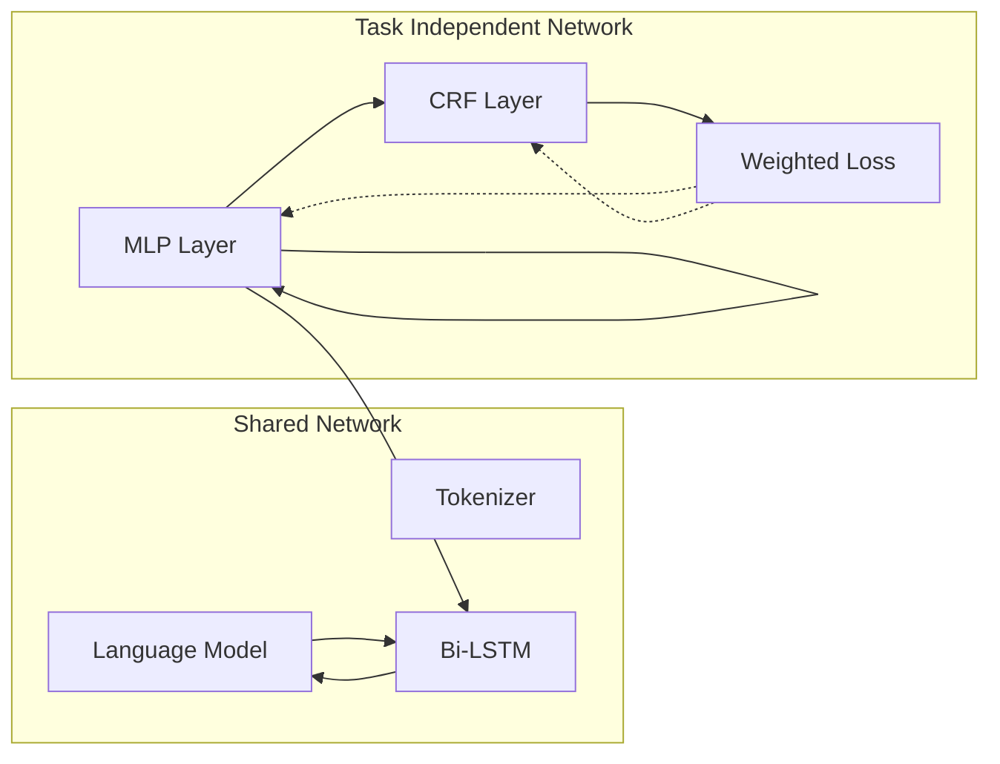

# Leveraging Multi-Task Learning in Code-Switched setting

Mithun Kumar S R

p20190503@hyderabad.bits-pilani.ac.in

Birla Institute of Technology and Science - Hyderabad Campus

Omkar Pitale

Birla Institute of Technology and Science - Hyderabad Campus

Aruna Malapati

Birla Institute of Technology and Science - Hyderabad Campus

Research Article

Keywords: Multi-task learning, Code-Switching, Code-Mixing

Posted Date: September 18th, 2023

DOI: https://doi.org/10.21203/rs.3.rs-3328574/v1

License:   This work is licensed under a Creative Commons Attribution 4.0 International License.

Read Full License

Additional Declarations: No competing interests reported.

# Leveraging Multi-Task Learning in Code-Switched setting

Mithun Kumar S R1,2\*, Omkar Pitale1† and Aruna Malapati1†

1\*CSIS Department, BITS Pilani, Hyderabad, 500078, Telangana, India.

2Search, Google, Bangalore, 560036, Karnataka, India.

\*Corresponding author(s). E-mail(s):

p20190503@hyderabad.bits-pilani.ac.in;

Contributing authors: f20190083@hyderabad.bits-pilani.ac.in;

arunam@hyderabad.bits-pilani.ac.in;

†These authors contributed equally to this work.

## Abstract

Multilingualism is the ability to converse fluently in more than one language. In multilingual societies, code-switching, the practise of switching languages during a conversation, occurs often, creating a need for multilingual dialogue and voice recognition systems in natural language processing (NLP). However, interpreting code-switching utterances is extremely dificult for these NLP systems, as the model must adjust to code-switching patterns. In recent years, deep learning strategies have enabled natural language systems with massive volumes of training data to attain human-level performance in languages. However, they cannot accommodate a large number of low-resource languages, mostly mixed languages. Also, code-switching, despite being a common occurrence, is unique to spoken language and lacks the transcriptions necessary for training deep learning models. Our work in this paper, explores the usage of multi-task learning in code-switched setting to see if it can leverage from the training signals of related tasks and improve the generalizability as well as boost the performance and metrics of our model.

Keywords: Multi-task learning, Code-Switching, Code-Mixing

## 1 Introduction

Multilingualism is the ability of a speaker to efectively converse in multiple languages. It is a crucial talent for people nowadays, and it is considered that multilingual speakers exceed monolingual speakers in actuality [1]. In multilingual communities, there is a fascinating phenomena known as code-switching, in which people flip between languages and combine them within a speech or sentence [2]. This linguistic phenomena demonstrates the ability of multilingual individuals to switch between two or more languages with ease when talking. In countries with immigrants who speak a non-English language as their original tongue and learn English as a second language, code-switching is common. Many human-to-human communications in social media involve code-switching, and businesses use code-switching in commercials, radio, and television as a marketing approach believed to be more compelling to bilinguals. With this rising trend, it has become one of the challenging research areas. Learning a model to comprehend mixed language text or voice is crucial for developing bilingual or multilingual systems that are robust to a variety of language mixing techniques. This is advantageous for dialogue systems and voice applications, including virtual assistants. However, developing a reliable code-switching model has been dificult for decades due to a lack of data. In section 4 of this paper we will explain our multi-task learning approach to leverage secondary similar tasks inorder to boost our performance and metrics for our primary task. We also leverage the pre-trained models like mBERT [3] and XLM-RoBERTa [4] in our model architecture to analyse on the performance improvement.

## 2 Related Work

Previous work on improving code-switching models has explored a variety of approaches, including the use of multilingual meta embeddings, hierarchical meta embeddings, multilingual models, and multi-task learning. Here is a more detailed explanation of each of these approaches:

## 2.1 Multilingual Meta Embeddings

The Multilingual Meta Embeddings (MME) [5] proposed, leverages the monolingual pre-trained embeddings. Without explicit language identification, MME learns to use information from these embeddings through a self-attention mechanism.To take advantage of the pre-trained monolingual word embeddings, they use the following three methods - 1) Concatenation 2) Linear Ensembles 3) Weighted Ensembles

Concatenation, is the simplest technique to leverage all information sources by concatenating the word embeddings from diferent pre-trained embeddings. However it was extremely ineficient as a result of high-dimensional input.

In Linear Ensembles, the embeddings are first brought to a common dimension via a projection layer and then we sum up those projected embeddings. This approach is efective since it does not increase the input’s dimension.

Weighted ensemble works in a similar way to linear ensembles, by combining the predictions of multiple models to improve the overall performance. In Weighted

Ensemble i.e. Meta embeddings, the embeddings are brought to same dimension via a projection layer consisting of a fully connected layer with a non-linear scoring function. Similar to linear ensembles, instead of directly taking sum of the projected embeddings, we take a weighted sum whose weights are calculated by an attention mechanism as shown in Figure 1

## 2.2 Hierarchial Meta Embeddings

In Hierarchial Meta Embeddings (HME) [6], the authors speculated that languages that are closely related to one another but also appear to be unrelated share common subwords. Despite the success of these word-level techniques, they disregard the significance of shared subword-level properties between languages. HME attempts to learn how to merge distinct pre-trained monolingual embeddings at the word, subword, and character level into a single language-agnostic lexical representation without employing language-specific identifiers.

In order to map the subwords and characters to word-level representations, they use byte-pair encodings (BPEs) [14] since it has compact vocabulary. Important subwords are learned and concatenated into a single vector representation using a transformer [17], as each language has a diferent method for dividing words into subword sets.

Experiments with HME suggest that the model is able to leverage the lexical similarity across the languages. Also, the model is able to make very efective use of subword information from languages that stem from a variety of roots in order to produce more accurate word representations. The results as shown in paper outperforms the previous state-of-the-art models

## 2.3 Multilingual Models

The performance of multilingual language models in multilingual and crosslingual natural language understanding tasks has been satisfactory. However, the efectiveness of these multilingual models in code-switching tasks has not been exhaustively investigated. The authors of this paper investigate the eficacy of multilingual language models in order to comprehend their competence and adaptation to a mixed-language environment by analysing the inference speed, performance, and number of parameters to determine their practicability.

Experiments are conducted in three language pairs on named entity recognition and part-ofspeech tagging provided by the LinCE benchmark [7] and compared with existing methods, such as employing bilingual embeddings and multilingual meta-embeddings. They used Multilingual Pre-trained Models for experimenting on the LinCE datasets - Multilingual BERT [3], XLMRoBERTa [4], Char2Subword [8]. The result shown in table 2.1 suggest that hierarchical meta-embeddings (HME) model achieves comparable outcomes to mBERT and XLM-RBASE with much fewer parameters. Intriguingly, we discover that XLM-RLARGE has significantly better performance than HME-Ensemble, but at a huge expense in training and inference time, employing 13 times more parameters for only a 2% improvement.

## 2.4 Multi-Task Learning

The authors in the paper [9] investigate the benefits of training models using multitask learning for sentiment analysis and ofensive language identification in code-mixed YouTube comments for Tamil, Malayalam, and Kannada languages. They experimented with four transformer-based models: - mBERT [3], DistilBERT [10], ALBERT [11] and XLM-RoBERTA [4]. Two novel approaches were used for MTL, namely Hard Parameter Sharing where the hidden layers between the tasks are shared while keeping the task-specific output layers distinguished, and Soft Parameter Sharing where each task has its specific model. They came to the conclusion that the strategy of fine-tuning multilingual BERT to a hard parameter sharing with cross entropy loss produced the best results for both of the tasks in Kannada and Malayalam. This strategy allowed them to achieve competitive scores in comparison to the results obtained when the tasks’ counterparts were treated as separate activities. For Tamil, the method of fine-tuning multilingual distilBERT in soft parameter sharing with cross entropy loss achieves higher scores than the other models. This is primarily as a result of the triple loss function that is utilised during the pretraining phase of the method. They also claim that using MTL can cut down on the amount of time needed to train the models, in addition to reducing the amount of space complexity needed to train them individually

## 3 Datasets and Benchmarks

## 3.1 LinCE

Linguistic Code-Switching Evaluation (LinCE) [7] is a benchmark for code-switched setting. The benchmark consists of ten corpora covering four diferent code-switched language pairs (i.e., Spanish-English, Nepali-English, Hindi-English, and Modern Standard ArabicEgyptian Arabic) and four tasks (i.e., language identification, named entity recognition, part-ofspeech tagging, and sentiment analysis).

<table><tr><td>Language Pairs</td><td>LID</td><td>POS</td><td>NER</td><td>SA</td></tr><tr><td>Spanish-English</td><td>Yes</td><td>Yes</td><td>Yes</td><td>Yes</td></tr><tr><td>Hindi-English</td><td>Yes</td><td>Yes</td><td>Yes</td><td>No</td></tr><tr><td>Nepali-English</td><td>Yes</td><td>No</td><td>No</td><td>No</td></tr><tr><td>Modern Standard Arabic-Egyptian Arabic</td><td>Yes</td><td>No</td><td>Yes</td><td>No</td></tr></table>

Table 1 LINCE dataset overview

The overview of the NLP tasks and the statistics of the LinCE benchmark is shown in the tables 1 and 2 respectively.

<table><tr><td>Task</td><td>Corpus</td><td>Languages</td><td>All Posts</td><td>All CMI</td><td>CS Posts</td><td>CS CMI</td><td>Lang1</td><td>Lang2</td><td>All Tokens</td></tr><tr><td rowspan="4">LID</td><td>Molina et al. (2016)</td><td>SPA-ENG</td><td>32,651</td><td>8.29</td><td>12,380</td><td>21.86</td><td>129,065</td><td>170,793</td><td>390,953</td></tr><tr><td>Solorio et al. (2014)</td><td>NEP-ENG</td><td>13,011</td><td>19.85</td><td>10,029</td><td>25.75</td><td>59,037</td><td>78,360</td><td>188,784</td></tr><tr><td>Mave et al. (2018)</td><td>HIN-ENG</td><td>7,421</td><td>10.14</td><td>3,317</td><td>22.68</td><td>84,752</td><td>29,958</td><td>146,722</td></tr><tr><td>Molina et al. (2016)</td><td>MSA-EA</td><td>11,243</td><td>2.82</td><td>1,326</td><td>23.89</td><td>140,057</td><td>40,759</td><td>227,354</td></tr><tr><td rowspan="2">POS</td><td>Singh et al. (2018b)</td><td>HIN-ENG</td><td>1,489</td><td>20.28</td><td>1,077</td><td>28.04</td><td>12,589</td><td>9,882</td><td>33,010</td></tr><tr><td>Soto and Hirschberg (2017)</td><td>SPA-ENG</td><td>42,911</td><td>24.19</td><td>41,856</td><td>24.81</td><td>178,135</td><td>92,517</td><td>333,069</td></tr><tr><td rowspan="3">NER</td><td>Aguilar et al. (2018)</td><td>SPA-ENG</td><td>67,223</td><td>5.49</td><td>17,466</td><td>21.16</td><td>163,824</td><td>402,923</td><td>808,663</td></tr><tr><td>Singh et al. (2018a)</td><td>HIN-ENG</td><td>2,079</td><td>19.99</td><td>1,644</td><td>25.28</td><td>13,860</td><td>11,391</td><td>35,374</td></tr><tr><td>Aguilar et al. (2018)</td><td>MSA-EA</td><td>12,335</td><td>-</td><td>-</td><td>-</td><td>-</td><td>-</td><td>248,478</td></tr><tr><td>SA</td><td>Patwa et al. (2020)</td><td>SPA-ENG</td><td>18,789</td><td>20.70</td><td>18,196</td><td>21.37</td><td>65,968</td><td>144,533</td><td>286,810</td></tr></table>

Table 2 Overview of the LinCE dataset statistics.

<table><tr><td>Task</td><td>Tags</td><td>Total</td></tr><tr><td>NER</td><td>O, B-Per, I-Per, B-Org, I-Org, B-Place, I-Place</td><td>7</td></tr><tr><td>LID</td><td>hi, en, rest</td><td>3</td></tr></table>

Table 3 LinCE: NER dataset for alternate training. The LID tags are used in NER dataset.

## 3.1.1 Output Classes

The LinCE benchmark dataset consists of the following categories for token classification in NER and LID tasks respectively as shown in table 3.

## 3.2 GLUECoS

GLUECoS [12] is another evaluation benchmark for Code-Switched NLP. It encompasses multiple NLP tasks in the English-Hindi and English-Spanish languages. Specifically, our evaluation standard covers Language Identification from text, POS tagging, Named Entity Recognition, Sentiment Analysis, Question Answering, and Natural Language Inference, a new task for code-switching. Since our project is primarily involved around Hinglish (Hindi + English). This is the most favourable benchmark dataset for us. A brief overview of the data statistics is given in table 4.

## 4 Multi-Task Learning Framework

We have developed a framework that employs multi-task learning using a encoder, bidirectional LSTM [13] and multi-layer perceptron model as our primary architecture for token classification tasks.

Typically, training and fine-tuning a single model for a desired task generally achieves acceptable performance. However, we may be disregarding information that could help us perform even better on our critical metric. This information can be found in the training signals of related tasks. By sharing representations between similar tasks, we can improve the generalizability of our model for the original task. Following this intuition, we performed experiments with our model on the language identification and named entity recognition tasks.

<table><tr><td colspan="5">English-Hindi</td></tr><tr><td>Corpus</td><td>Sent (Train)</td><td>Sent (Dev)</td><td>Sent (Test)</td><td>Sent (All)</td></tr><tr><td>Fire LID (D)</td><td>2631</td><td>500</td><td>406</td><td>3537</td></tr><tr><td>UD POS (D)</td><td>1384</td><td>215</td><td>215</td><td>1814</td></tr><tr><td>FG POS (R)</td><td>2104</td><td>263</td><td>264</td><td>2631</td></tr><tr><td>IIITH NER (R)</td><td>2467</td><td>308</td><td>309</td><td>3084</td></tr><tr><td>SAIL Sentiment (R)</td><td>10080</td><td>1260</td><td>1261</td><td>12601</td></tr><tr><td>QA (R)</td><td>250</td><td>-</td><td>63</td><td>313</td></tr><tr><td>NLI (R)</td><td>1040</td><td>130</td><td>130</td><td>1300</td></tr><tr><td colspan="5">English-Spanish</td></tr><tr><td>Corpus</td><td>Sent (Train)</td><td>Sent (Dev)</td><td>Sent (Test)</td><td>Sent (All)</td></tr><tr><td>EMNLP 2014</td><td>10259</td><td>1140</td><td>3014</td><td>14413</td></tr><tr><td>Bangor POS</td><td>2192</td><td>274</td><td>274</td><td>2758</td></tr><tr><td>CALCS NER</td><td>27366</td><td>3420</td><td>3421</td><td>34208</td></tr><tr><td>Sentiment</td><td>1681</td><td>211</td><td>211</td><td>2103</td></tr></table>

Table 4 GLUECoS Corpus Statistics. (R) and (D) indicates Hindi written in Roman and Devanagari script, respectively

The general framework for multi-task learning is to use hard parameter sharing i.e sharing some hidden layers between all tasks, while maintaining several task-specific output layers. We follow the traditional norm of using hard parameter sharing where we maintain some shared layers and task-specific layers. We also follow the paper [1] that a stacked architecture of transformer-lstm-crf is better at token classification.

## 4.1 Shared Network

We experiment with three transformer based pre-trained language models - mBERT [3], XLM-RoBERTa base and XLM-RoBERTa large [4] models. Subsequent to this, we employ a bidirectional LSTM. The intuition for using LSTMs stacked with pretrained model is because it was one of the architecture which gave good results in case of monolingual token classification.

Following the LSTM, we keep the some of the multi-layer perceptrons in our shared network as shown in figure 1. As an appreciable amount of layers in shared network as it will have an efect of implicit data augmentation and assist the model focus its attention on those features that actually matters as other tasks will provide additional evidence for the relevance of those features.

## 4.2 Task dependent network

For each task we have independent network consisting of an MLP layer with GELU activations [14] stacked with CRF layer [15] as shown in figure 1. We also used layer normalization [16] in our MLP layers which significantly reduced our training time.

flowchart

orFig. 1 Task dependent shared network Architecture

## 4.3 Loss function

ayOne of the drawbacks of taking a simple weighted sum is the model performance P becomes sensitive to weight selection and, this becomes expensive to tune. Therefore we follow a convenient approach which is able to learn optimal weights.

As explained in the paper [17], they derive a multi-task loss function based on maximisingguasian likelihood with homoscedastic uncertainty. They adapt the classification likelihood to squash a scaled version of model output through softmax function with a positive fixed/learn-able scalar σ.

Our joint loss function looks like this -

$$
\mathcal {L} (W, \sigma_ {1}, \sigma_ {2}) = \frac {1}{\sigma_ {1} ^ {2}} \mathcal {L} _ {1} (W) + \frac {1}{\sigma_ {2} ^ {2}} \mathcal {L} _ {2} (W) + \log \sigma_ {1} + \log \sigma_ {2} \tag {1}
$$

In our scenario, $\mathcal { L } _ { 1 } , \mathcal { L } _ { 2 }$ represents loss for NER and LID task respectively.

## 5 Experiments and Results

We perform our experiments on the architecture explained in previous section with LinCE benchmark dataset on Named Entity Recognition and Language Identification tasks. We follow joint training to train for both NER as well as LID tasks together as well as alternate training strategies by training for NER and LID sequentially in our experiments.

We also experimented with the loss function as a simple summation of the losses of both tasks. However, we observed that one of the tasks was performing better while the other was performing worse. We therefore shifted to a better loss function, which is explained in section 4.3.

Using diferent learning rates for diferent tasks gave better results as compared to using same learning rate. We performed a 10-cross-fold validation on our architecture with all the three pre-trained models and monitored the F1 metric for both the tasks.

<table><tr><td>NER Test F1</td><td>mBERT</td><td>XLM-RoBERTa base</td><td>XLM-RoBERTa large</td></tr><tr><td>fold 1</td><td>82.88</td><td>84.41</td><td>89.95</td></tr><tr><td>fold 2</td><td>79.64</td><td>80.06</td><td>83.07</td></tr><tr><td>fold 3</td><td>70.75</td><td>78.62</td><td>81.24</td></tr><tr><td>fold 4</td><td>77.23</td><td>75.25</td><td>84.34</td></tr><tr><td>fold 5</td><td>65.24</td><td>75.38</td><td>77.34</td></tr><tr><td>fold 6</td><td>66.55</td><td>76.73</td><td>81.96</td></tr><tr><td>fold 7</td><td>63.64</td><td>67.96</td><td>74.41</td></tr><tr><td>fold 8</td><td>70.07</td><td>75.93</td><td>81.55</td></tr><tr><td>fold 9</td><td>66.55</td><td>76.57</td><td>87.99</td></tr><tr><td>fold 10</td><td>71.21</td><td>83.19</td><td>87.35</td></tr><tr><td>Average</td><td>71.37</td><td>77.41</td><td>82.92</td></tr></table>

Table 5 Results of cross-fold validation for NER.

The cross-fold validation was performed with $\alpha _ { \mathrm { n e r } } = 3 \cdot 1 0 ^ { - 4 }$ and $\alpha _ { \mathrm { l i d } } = 3 \cdot 1 0 ^ { - 5 }$ as the learning rates. We padded our sentences to make to a fix max length of 64 and used a batch size of 32. Each experiment was run for 100 epochs with early stopping monitoring test F1 metric as well as using a learning rate scheduler to try to reach a good optimal value in our loss landscape.

The results for the cross-fold validation experiments for both tasks are shown in tables 5 and 6 respectively.

<table><tr><td>LID Test F1</td><td>mBERT</td><td>XLM-RoBERTa base</td><td>XLM-RoBERTa large</td></tr><tr><td>fold 1</td><td>86.38</td><td>88.76</td><td>89.61</td></tr><tr><td>fold 2</td><td>86.56</td><td>89.02</td><td>89.16</td></tr><tr><td>fold 3</td><td>82.88</td><td>88.73</td><td>86.75</td></tr><tr><td>fold 4</td><td>83.34</td><td>86.07</td><td>88.46</td></tr><tr><td>fold 5</td><td>76.52</td><td>89.48</td><td>88.39</td></tr><tr><td>fold 6</td><td>77.73</td><td>88.78</td><td>89.29</td></tr><tr><td>fold 7</td><td>84.48</td><td>89.75</td><td>90.79</td></tr><tr><td>fold 8</td><td>81.03</td><td>85.79</td><td>88.05</td></tr><tr><td>fold 9</td><td>74.94</td><td>87.3</td><td>87.24</td></tr><tr><td>fold 10</td><td>72.62</td><td>87.86</td><td>87.83</td></tr><tr><td>Average</td><td>80.648</td><td>88.154</td><td>88.557</td></tr></table>

Table 6 Results of cross-fold validation for LID.

## 5.1 T-Test

A statistical test that uses data from a sample to draw inferences about a population parameter known as hypothesis testing. It can also be used to check the statistical significance of metric scores and validate them.

A paired T-Test helps in checking if two means are taken from the same distribution. This can be useful in checking if there is statistical diference between F1 scores of the 10-fold cross validation. The null and alternate hypothesis is formulated as -

$$
H _ {0}: \mu_ {1} = \mu_ {2} \tag {2}
$$

$$
H _ {1}: \mu_ {1} \neq \mu_ {2} \tag {3}
$$

where $H _ { 0 }$ and $H _ { 1 }$ are null and alternate hypothesis respectively.

For performing a paired T-Test, the 10-fold cross validation scores were divided into 2 parts (5 scores each), and then we calculated the p-value. If the p-value is less than 0.05, then the null hypothesis can be rejected. In our case, as seen from the table 7, our p-values for each of the models is greater than 0.05. So we can accept the null hypothesis efectively concluding that the F1 scores are statistically significant.

<table><tr><td>Model</td><td>p-value</td></tr><tr><td>mBERT</td><td>0.297</td></tr><tr><td>XLM-RoBERTa $_{base}$ </td><td>0.392</td></tr><tr><td>XLM-RoBERTa $_{large}$ </td><td>1.00</td></tr></table>

Table 7 p-values for the models

## 6 Conclusion

The experimental results demonstrates that the multitask learning approach outperforms the traditional single-task approach (i.e using a model to train a single task) to solving the task by having an implicit data augmentation efect to help generalizability. The F1 metric for NER shows that via multitask learning our model is able to leverage from the LID task and are able to give good representations thereby boosting the performance. Also from the T-tests conducted (as shown in table 7), show that the F1 scores are statistically significant. So, we can efectively leverage multitask learning to help our model generalize better for the original task and get good results. We are yet to experiment on GLUECoS dataset and try out more optimizations in order to achieve much better results than the existing ones.

We hereby conclude that the use of multi-task learning in code-switched setting will definitely assist and boost the performance in the downstream tasks. For futurework, we plan to focus on analysis of specific tasks to be taken into account for training to yield better results and improve the generalizability of our model as well as boost performance for our original task. We also plan to focus on the efects of implicit data augmentation due to multi-task learning on training models with similar tasks as well as dissimilar tasks and will it help in improving the generalizability of our model or not.

## Declarations

## Authors Contribution

All authors contributed to the study conception and design. Material preparation, data collection and analysis were performed by Mithun Kumar S R, Omkar Pitale and Aruna Malapati. The first draft of the manuscript was written by Omkar Pitale and all authors commented on previous versions of the manuscript. All authors read and approved the final manuscript.

## Declaration of competing interest

The authors have no competing interests to declare that are relevant to the content of this article.

## Ethical approval

This study does not contain any studies with human or animal subjects performed by any of the authors.

## Data availability and access

The data that support the findings of this study are openly available at https://ritual.uh.edu/lince/datasets.

## Funding and conflict of interest acknowledgement

The authors declare that they have no known competing financial interests or personal relationships that could have appeared to influence the work reported in this paper.

## Acknowledgments

The authors gratefully acknowledge the computing time provided on the high performance computing facility, Sharanga, at the Birla Institute of Technology and Science - Pilani, Hyderabad Campus.

## References

[1] Xu, L., Li, S., Wang, Y., Xu, L.: Named entity recognition of bert-bilstm-crf combined with self-attention. In: Web Information Systems and Applications: 18th International Conference, WISA 2021, Kaifeng, China, September 24–26, 2021, Proceedings, pp. 556–564. Springer, Berlin, Heidelberg (2021). https://doi. org/10.1007/978-3-030-87571-8 48 . https://doi.org/10.1007/978-3-030-87571-8 48  
[2] POPLACK, S.: Sometimes i’ll start a sentence in spanish y termino en espaNol:˜ toward a typology of code-switching1 18(7-8), 581–618 (1980) https://doi.org/ 10.1515/ling.1980.18.7-8.581  
[3] Pires, T., Schlinger, E., Garrette, D.: How multilingual is multilingual bert? CoRR abs/1906.01502 (2019) 1906.01502  
[4] Conneau, A., Khandelwal, K., Goyal, N., Chaudhary, V., Wenzek, G., Guzm´an, F., Grave, E., Ott, M., Zettlemoyer, L., Stoyanov, V.: Unsupervised cross-lingual representation learning at scale. CoRR abs/1911.02116 (2019) 1911.02116  
[5] Winata, G.I., Lin, Z., Fung, P.: Learning multilingual meta-embeddings for codeswitching named entity recognition. In: Proceedings of the 4th Workshop on Representation Learning for NLP (RepL4NLP-2019), pp. 181–186. Association for Computational Linguistics, Florence, Italy (2019). https://doi.org/10.18653/ v1/W19-4320 . https://aclanthology.org/W19-4320  
[6] Winata, G.I., Lin, Z., Shin, J., Liu, Z., Fung, P.: Hierarchical meta-embeddings for code-switching named entity recognition. CoRR abs/1909.08504 (2019) 1909.08504  
[7] Aguilar, G., Kar, S., Solorio, T.: Lince: A centralized benchmark for linguistic code-switching evaluation. CoRR abs/2005.04322 (2020) 2005.04322  
[8] Aguilar, G., McCann, B., Niu, T., Rajani, N.F., Keskar, N.S., Solorio, T.: Char2subword: Extending the subword embedding space from pre-trained models using robust character compositionality. CoRR abs/2010.12730 (2020) 2010.12730  
[9] Hande, A., Hegde, S.U., Priyadharshini, R., Ponnusamy, R., Kumaresan, P.K., Thavareesan, S., Chakravarthi, B.R.: Benchmarking multi-task learning for sentiment analysis and ofensive language identification in under-resourced dravidian languages. CoRR abs/2108.03867 (2021) 2108.03867  
[10] Sanh, V., Debut, L., Chaumond, J., Wolf, T.: Distilbert, a distilled version of BERT: smaller, faster, cheaper and lighter. CoRR abs/1910.01108 (2019) 1910.01108  
[11] Lan, Z., Chen, M., Goodman, S., Gimpel, K., Sharma, P., Soricut, R.: ALBERT: A lite BERT for self-supervised learning of language representations. CoRR abs/1909.11942 (2019) 1909.11942  
[12] Khanuja, S., Dandapat, S., Srinivasan, A., Sitaram, S., Choudhury, M.: Gluecos : An evaluation benchmark for code-switched NLP. CoRR abs/2004.12376 (2020) 2004.12376  
[13] Hochreiter, S., Schmidhuber, J.: Long Short-Term Memory. Neural Computation 9(8), 1735–1780 (1997) https://doi.org/ 10.1162/neco.1997.9.8.1735 https://direct.mit.edu/neco/articlepdf/9/8/1735/813796/neco.1997.9.8.1735.pdf  
[14] Hendrycks, D., Gimpel, K.: Bridging nonlinearities and stochastic regularizers with gaussian error linear units. CoRR abs/1606.08415 (2016) 1606.08415  
[15] Sutton, C., McCallum, A.: An Introduction to Conditional Random Fields. arXiv (2010). https://doi.org/10.48550/ARXIV.1011.4088 . https://arxiv.org abs/1011.4088  
[16] Ba, J.L., Kiros, J.R., Hinton, G.E.: Layer Normalization. arXiv (2016). https: //doi.org/10.48550/ARXIV.1607.06450 . https://arxiv.org/abs/1607.06450  
[17] Kendall, A., Gal, Y., Cipolla, R.: Multi-task learning using uncertainty to weigh losses for scene geometry and semantics. CoRR abs/1705.07115 (2017) 1705.07115