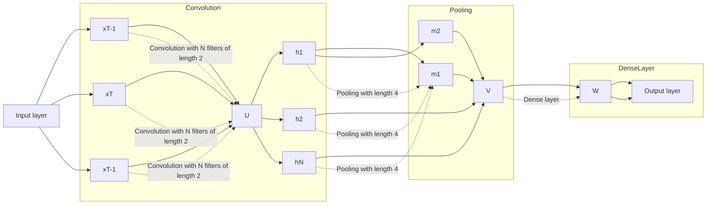

# Robust Classification of Crisis-Related Data on Social Networks Using Convolutional Neural Networks

Dat Tien Nguyen,\* Kamela Ali Al Mannai,\* Shafiq Joty, \* Hassan Sajjad,\* Muhammad Imran,\* Prasenjit Mitra\*\*

水 Qatar Computing Research Institute, HBKU Doha, Qatar

\*Pennsylvania State University, University Park, USA

ndat, kamlmannai, sjoty, hsajjad, mimran @hbku.edu.qa, pmitra@ist.psu.edu

## Abstract

The role of social media, in particular microblogging platforms such as Twitter, as a conduit for actionable and tactical information during disasters is increasingly acknowledged. However, time-critical analysis of big crisis data on social media streams brings challenges to machine learning techniques, especially the ones that use supervised learning. The scarcity of labeled data, particularly in the early hours of a crisis, delays the learning process. Existing classification methods require a significant amount of labeled data specific to a particular event for training plus a lot of feature engineering to achieve best results. In this work, we introduce neural network based classification methods for identifying useful tweets during a crisis situation. At the onset of a disaster when no labeled data is available, our proposed method makes the best use of the out-of-event data and achieves good results.

## Introduction

Time-critical analysis of social media data streams is important for many application areas (Lee, Agrawal, and Choudhary 2013; Rudra et al. 2016). During the onset of a crisis situation, people use social media platforms to post situational updates, look for useful information, and ask for help (Imran et al. 2015). Rapid analysis of messages posted on microblogging platforms such as Twitter can help humanitarian organizations gain situational awareness, learn about urgent needs of affected people, critical infrastructure damage, and medical emergencies (Nguyen et al. 2016).

Automatic identification of useful tweets is a challenging task because: (i) tweets are short – only 140 characters – and therefore, hard to understand without enough context; (ii) they often contain abbreviations, informal language, spelling variations and are ambiguous; and, (iii) judging a tweet’s utility is a subjective exercise. Despite advances in natural language processing (NLP), interpreting short informal texts automatically remains a hard problem.

Supervised machine learning algorithms are dependent on labeled data from the event for training. The performance of models trained using data from previous events (out-of-event data) is poor due to discrete word representations and the variety across events from which the historical data was collected. Second, training a classifier from scratch every time a disaster occurs is infeasible due to labeled data scarcity. Third, traditional approaches require manually engineered features like cue words and TF-IDF vectors (Imran et al. 2015) for learning. Moreover, manual adaptation of models to changes in features and their importance is undesirable (and often infeasible) because of the effort it takes to do so.

Deep neural networks (DNNs) are ideally suited for classifying a stream of crisis-related tweets. They are usually trained with online methods and have the flexibility to learn and adapt from new batches of labeled data without requiring to retrain from scratch. Due to their distributed word representation, they generalize well and make better use of the previously labeled data from other events to speed up the learning process in the beginning of a disaster. DNNs obviate the need of manually crafting features and automatically learn latent features as distributed dense vectors, which have shown to benefit various NLP tasks (Collobert et al. 2011).

In this paper, we use a convolutional neural network (CNN) to classify tweets. CNNs capture the most salient n-gram information by means of its convolution and maxpooling operations.We present a series of experiments using different variations of the training data – event data only, out-of-event data only, and both. Experiments results show that neural network models perform better than non-neural models.They can be used reliably with the already available out-of-event data. DNNs are better suited for classification of crisis data than conventional classifiers because they can learn features automatically and can be adopted to online settings.

## Convolutional Neural Network

Figure 1 shows our CNN model for classifying tweets into useful vs. not useful for a crisis event. The architecture of our model is similar to the one proposed in (Kim 2014).

For distributed representation of words, we first construct a vocabulary V from the training set by selecting T most frequent words. Each word in the vocabulary is then represented by a D dimensional vector in a shared look-up table L $\in \mathbb { R } ^ { | V | \times D }$ , which is considered a model parameter to learn. We can initialize L randomly or using pretrained word embedding vectors like word2vec (Mikolov et al. 2013a).

Given an input tweet $\mathbf { s } = ( w _ { 1 } , \cdots , w _ { T } )$ , we first transform it into a feature sequence by mapping each word token $w _ { t } \in { \bf s }$ to an index in L. The look-up layer then creates an input vector $\mathbf { x _ { t } } \in \mathbb { R } ^ { D }$ for each token $w _ { t } .$ , which are passed through a sequence of convolution and pooling operations to learn high-level feature representations.

flowchart

Figure 1: Convolutional neural network on a tweet: “guys if know any medical emergency around balaju area you can reach umesh HTTP doctor at HTTP”

A convolution operation involves applying a filter u $\mathbb { R } ^ { L . D }$ (i.e., a vector of parameters) to a window of L words to produce a new feature

$$
h _ {t} = f (\mathbf {u}. \mathbf {x} _ {t: t + L - 1} + b _ {t}) \tag {1}
$$

where ${ \bf X } _ { t : t + L - 1 }$ denotes the concatenation of L input vectors, $b _ { t }$ is a bias term, and f is a nonlinear activation function (e.g., sig, tanh). We apply this filter to each possible L-word window in the tweet to generate a feature map $\mathbf { h } ^ { i } \mathbf { \Phi } = \left[ h _ { 1 } , \cdots , h _ { T + L - 1 } \right]$ . We repeat this process N times with N different filters to get N different feature maps. We use a wide convolution (Kalchbrenner, Grefenstette, and Blunsom 2014) (as opposed to narrow), which ensures that the filters reach the entire sentence, including the boundary words. This is done by performing zero-padding, where outof-range (i.e., t<1 or t>T) vectors are assumed to be zero.

After the convolution, we apply a max-pooling operation to each feature map

$$
\mathbf {m} = [ \mu_ {p} (\mathbf {h} ^ {1}), \dots , \mu_ {p} (\mathbf {h} ^ {N}) ] \tag {2}
$$

where $\mu _ { p } ( \mathbf { h } ^ { i } )$ refers to the max operation applied to each window of p features in the feature map hi. For instance, with $p \ = \ 2 ,$ , this pooling gives the same number of features as in the feature map (because of the zero-padding). Intuitively, the filters compose local n-grams into higherlevel representations in the feature maps, and max-pooling reduces the output dimensionality while keeping the most important aspects from each feature map.

Since each convolution-pooling operation is performed independently, the features extracted become invariant in locations (i.e., where they occur in the tweet), thus acts like bag-of-n-grams. However, keeping the order information could be important for modeling sentences. In order to model interactions between the features picked up by the filters and the pooling, we include a dense layer of hidden nodes on top of the pooling layer

$$
\mathbf {z} = f (V \mathbf {m} + \mathbf {b _ {h}}) \tag {3}
$$

where $V$ is the weight matrix, $\mathbf { b _ { h } }$ is a bias vector, and $f$ is a non-linear activation. The dense layer naturally deals with variable sentence lengths by producing fixed size output vectors z, which are fed to the output layer for classification. The output layer defines a Bernoulli distribution:

$$
p (y | \mathbf {s}, \theta) = \mathrm{Ber} (y | \mathrm{sig} (\mathbf {w} ^ {\mathbf {T}} \mathbf {z} + b)) \tag {4}
$$

where sig refers to the sigmoid function, and w are the weights from the dense layer to the output layer and b is a bias term. We fit the model by minimizing the cross-entropy between the predicted distributions ${ \hat { y } } _ { n \theta } = p ( y _ { n } | \mathbf { s } _ { n } , \theta )$ and the target distributions $y _ { n }$ (i.e., the gold labels).1

## Word Embedding and Fine-tuning

We avoid manual engineering of features and use word embeddings instead as the only features. We use pre-trained word embeddings to better initialize our models, and we fine-tune them for our task which turns out to be beneficial. We experimented with two types of pre-trained embeddings.

(i) Google Embedding: We use the pre-trained 300- dimensional Google word embeddings released by Mikolov et al. (2013a). These vectors were trained by their skip-gram model on part of Google news dataset containing about 100 billion words with a vocabulary size of 3 millions words.2

(ii) Crisis Embedding: Since we work on disaster related tweets, which are quite different from news, we have also trained 300-dimensional domain-specific word embeddings (vocabulary size of 20 millions) using the skip-gram model of word2vec from a large corpus of disaster related tweets. The corpus contains 57, 908 tweets and 9.4 million tokens.

## Datasets and Experimental Settings

We use data from multiple sources: (1) CrisisNLP3 (Imran, Mitra, and Castillo 2016), (2) CrisisLex (Olteanu et al. 2014), and (3) AIDR (Imran et al. 2014). The first two sources have tweets posted during several humanitarian crises and labeled by paid workers. The AIDR data consists of tweets from several crises events labeled by volunteers. Table 1 shows statistics about the data.

Data Preprocessing: We normalize all characters to their lower-cased forms and tokenize the tweets using the CMU TweetNLP tool (Gimpel et al. 2011).

Data Settings: Given a particular event (e.g. Nepal earthquake), we use data from all other events plus All others (see Table 1) as out-of-event data. We divide each event dataset into train (70%), validation (10%) and test sets (20%) using ski-learn toolkit’s module (Pedregosa et al. 2011) which ensured that the class distribution remains reasonably balanced in each subset.

1Other loss functions (e.g., hinge) yielded similar results.  
2https://code.google.com/p/word2vec/  
3http://crisisnlp.qcri.org/

<table><tr><td>EVENT</td><td>Nepal Earthquake</td><td>Typhoon Hagupit</td><td>California Earthquake</td><td>Cyclone PAM</td><td>All Others</td></tr><tr><td>Affected individual</td><td>756</td><td>204</td><td>227</td><td>235</td><td>4624</td></tr><tr><td>Donations and volunteering</td><td>1021</td><td>113</td><td>83</td><td>389</td><td>1752</td></tr><tr><td>Infrastructure and utilities</td><td>351</td><td>352</td><td>351</td><td>233</td><td>1972</td></tr><tr><td>Sympathy and support</td><td>983</td><td>290</td><td>83</td><td>164</td><td>4546</td></tr><tr><td>Other Useful Information</td><td>1505</td><td>732</td><td>1028</td><td>679</td><td>7709</td></tr><tr><td>Not related or irrelevant</td><td>6698</td><td>290</td><td>157</td><td>718</td><td>418</td></tr><tr><td>Grand Total</td><td>11314</td><td>1981</td><td>1929</td><td>2418</td><td>21021</td></tr></table>

Table 1: Class distribution of events under consideration and all other crises (i.e. data used as part of out-of-event data)

Feature Extraction: We extracted word-level unigrams, bigrams and trigrams from tweets. They are converted to TF-IDF vectors by considering each tweet as a document. Note that these features are used only in non-neural models. The neural models take tweets and their labels as input. For the SVM classifier, we implemented feature selection using a Chi-Squared test to improve the estimator’s accuracy scores.

## Models Settings

Settings for Non-Neural Models: We experimented with (i) Support Vector Machine (SVM), a discriminative maxmargin model; (ii) Logistic Regression (LR), a discriminative probabilistic model; and (iii) Random Forest (RF), an ensemble model of decision trees. We use the implementation from the scikit-learn toolkit (Pedregosa et al. 2011).

Settings for Convolutional Neural Network Models: Our CNN model is implemented in Theano (Theano Development Team 2016). We train CNN models by optimizing the cross entropy using the gradient-based online learning algorithm ADADELTA (Zeiler 2012).4 The learning rate and parameters were set to the values as suggested by the authors. The maximum number of epochs was set to 25. To avoid overfitting, we use dropout (Srivastava et al. 2014) of hidden units and early stopping based on the accuracy on the validation set.5 We experimented with 0.0, 0.2, 0.4, 0.5 dropout rates and 32, 64, 128 minibatch sizes. We limit the vocabulary (V) to the most frequent P% $( P \in \{ 8 0 , 8 5 , 9 0 \} )$ ) words in the training corpus. The word vectors in L were initialized using two types of pre-trained word embeddings: (i) Crisis embeddings $( C N N _ { I } )$ and (ii) Google embeddings $( C N N _ { I I } )$

We use rectified linear units (ReLU) for the activation functions (f), 100, 150, 200 filters each having window size (L) of 2, 3, 4 , pooling length (p) of 2, 3, 4 , and 100, 150, 200 dense layer units. All the hyperparameters are tuned on the development set.

## Results

For each event under consideration, we train classifiers on the event data only, on the out-of-event data only, and on a combination of both. We evaluate them on the binary classification task. We merge all informative classes (Table 1) to create one general Useful or Relevant class.

Table 2 presents the results of binary classification comparing several non-neural classifiers with the CNN-based classifier. CNNs performed better than all non-neural classifiers for all events under consideration. The improvements are substantial in the case of training with the out-of-event data only. In this case, CNN outperformed SVM by a margin of up to 11%. This result has a significant impact to a situation involving early hours of a crisis, where though a lot of data pours in, but performing data labeling using experts or volunteers to get a substantial amount of training data takes a lot of time. Our result shows that the CNN model handles this situation robustly by making use of the out-of-event data and provides reasonable performance.

Table 2: The AUC scores of non-neural and neural networkbased classifiers. event, out and event+out represents the three different settings of the training data – event only, outof-event only and a concatenation of both.

<table><tr><td>SYS</td><td>RF</td><td>LR</td><td>SVM</td><td>CNN $_{I}$ </td><td>CNN $_{II}$ </td></tr><tr><td colspan="6">Nepal Earthquake</td></tr><tr><td> $B_{event}$ </td><td>82.70</td><td>85.47</td><td>85.34</td><td>86.89</td><td>85.71</td></tr><tr><td> $B_{out}$ </td><td>74.63</td><td>78.58</td><td>78.93</td><td>81.14</td><td>78.72</td></tr><tr><td> $B_{event+out}$ </td><td>81.92</td><td>82.68</td><td>83.62</td><td>84.82</td><td>84.91</td></tr><tr><td colspan="6">California Earthquake</td></tr><tr><td> $B_{event}$ </td><td>75.64</td><td>79.57</td><td>78.95</td><td>81.21</td><td>78.82</td></tr><tr><td> $B_{out}$ </td><td>56.12</td><td>50.37</td><td>50.83</td><td>62.08</td><td>68.82</td></tr><tr><td> $B_{event+out}$ </td><td>77.34</td><td>75.50</td><td>74.67</td><td>78.32</td><td>79.75</td></tr><tr><td colspan="6">Typhoon Hagupit</td></tr><tr><td> $B_{event}$ </td><td>82.05</td><td>82.36</td><td>78.08</td><td>87.83</td><td>90.17</td></tr><tr><td> $B_{out}$ </td><td>73.89</td><td>71.14</td><td>71.86</td><td>82.35</td><td>84.48</td></tr><tr><td> $B_{event+out}$ </td><td>78.37</td><td>75.90</td><td>77.64</td><td>85.84</td><td>87.71</td></tr><tr><td colspan="6">Cyclone PAM</td></tr><tr><td> $B_{event}$ </td><td>90.26</td><td>90.64</td><td>90.82</td><td>94.17</td><td>93.11</td></tr><tr><td> $B_{out}$ </td><td>80.24</td><td>79.22</td><td>80.83</td><td>85.62</td><td>87.48</td></tr><tr><td> $B_{event+out}$ </td><td>89.38</td><td>90.61</td><td>90.74</td><td>92.64</td><td>91.20</td></tr></table>

When trained using both the event and out-of-event data, CNNs also performed better than the non-neural models. Comparing different training settings, we saw a drop in performance when compared to the event-only training. This drop is because of the inherent variety in the crisis data. The large size of the out-of-event data down-weights the benefits of the event data, and skewed the probability distribution of the training data towards the out-of-event data.

To summarize, the neural network based classifier outperformed non-neural classifiers in all data settings. The performance of the models trained on out-of-event data are (as expected) lower than that in the other two training settings. However, in case of the CNN models, the results are reasonable to the extent that out-of-event data can be used to predict tweets informativeness when no event data is available. Comparing CNNI with $\mathrm { C N N } _ { I I }$ , we did not see any system consistently better than the other. In the rest of our experiments below, we only consider the CNN trained on crisis embeddings because on the average, the crisis embeddings work slightly better than the rest of the alternatives.

## Related Work

Studies have analyzed how big crisis data can be useful during major disasters so as to gain insights into the situation as it unfolds (Acar and Muraki 2011). A number of systems have been developed to classify, extract, and summarize crisis-relevant information from social media; for a detailed survey see Imran, et al. (Imran et al. 2015). DNNs and word embeddings have been applied successfully to address NLP problems (Collobert et al. 2011; Caragea, Silvescu, and Tapia 2016). The emergence of tools such as word2vec (Mikolov et al. 2013b) and GloVe (Pennington, Socher, and Manning 2014) have enabled NLP researchers to learn word embeddings efficiently and use them to train better models. As opposed to previous works, we address the cold-start problem and show how out-of-event data can be used when there is not enough labeled training data at the beginning of a disaster.

## Conclusions

We addressed the problem of rapid classification of crisisrelated data posted on microblogging platforms like Twitter. Specifically, we addressed the challenges using deep neural network models the classification of crisis-related tweets and showed that one can reliably use out-of-event data for the classification of new event when no event-specific data is available. The performance of the classifiers degraded from event data when out-of-event training samples were added to training samples. Thus, we recommend using out-of-event training data during the first few hours of a disaster only after which the training data related to the event should be used. In the future, we will explore and perform experimentation to determine even more robust domain adaptation techniques.

## References

Acar, A., and Muraki, Y. 2011. Twitter for crisis communication: lessons learned from japan’s tsunami disaster. International Jour nal ofWeb Based Communities 7(3):392–402.  
Caragea, C.; Silvescu, A.; and Tapia, A. H. 2016. Identifying informative messages in disaster events using convolutional neural networks. International Conference on Information Systems for Crisis Response and Management.  
Collobert, R.; Weston, J.; Bottou, L.; Karlen, M.; Kavukcuoglu, K.; and Kuksa, P. 2011. Natural language processing (almost) from scratch. The Journal of Machine Learning Research 12:2493– 2537.  
Gimpel, K.; Schneider, N.; O’Connor, B.; Das, D.; Mills, D.; Eisenstein, J.; Heilman, M.; Yogatama, D.; Flanigan, J.; and Smith, N. A. 2011. Part-of-speech tagging for twitter: Annotation, features, and  
experiments. In Proceedings ofthe 49th Annual Meeting ofthe Association for Computational Linguistics: Human Language Technologies, 42–47.  
Imran, M.; Castillo, C.; Lucas, J.; Meier, P.; and Vieweg, S. 2014. AIDR: Artificial intelligence for disaster response. In Proceedings ofthe 23rd international conference on WWW, 159–162.  
Imran, M.; Castillo, C.; Diaz, F.; and Vieweg, S. 2015. Processing social media messages in mass emergency: a survey. ACM Computing Surveys (CSUR) 47(4):67.  
Imran, M.; Mitra, P.; and Castillo, C. 2016. Twitter as a lifeline: Human-annotated twitter corpora for NLP of crisis-related messages. In Proceedings of the Tenth International Conference on Language Resources and Evaluation (LREC).  
Kalchbrenner, N.; Grefenstette, E.; and Blunsom, P. 2014. A convolutional neural network for modelling sentences. In Proceedings of the 52nd Annual Meeting of the Association for Computational Linguistics (Volume 1: Long Papers).  
Kim, Y. 2014. Convolutional neural networks for sentence classification. In Proceedings of the 2014 Conference on Empirical Methods in Natural Language Processing (EMNLP), 1746–1751.  
Lee, K.; Agrawal, A.; and Choudhary, A. 2013. Real-time disease surveillance using twitter data: demonstration on flu and cancer. In Proceedings of the 19th ACM SIGKDD international conference on Knowledge discovery and data mining, 1474–1477. ACM.  
Mikolov, T.; Chen, K.; Corrado, G.; and Dean, J. 2013a. Efficient estimation of word representations in vector space. arXiv preprint arXiv:1301.3781.  
Mikolov, T.; Sutskever, I.; Chen, K.; Corrado, G. S.; and Dean, J. 2013b. Distributed representations of words and phrases and their compositionality. In Advances in Neural Information Processing Systems, 3111–3119.  
Nguyen, D. T.; Joty, S.; Imran, M.; Sajjad, H.; and Mitra, P. 2016. Applications of online deep learning for crisis response using social media information. arXiv preprint arXiv:1610.01030.  
Olteanu, A.; Castillo, C.; Diaz, F.; and Vieweg, S. 2014. Crisislex: A lexicon for collecting and filtering microblogged communications in crises. In In Proceedings of the 8th International AAAI Conference on Weblogs and Social Media (ICWSM” 14), number EPFL-CONF-203561.  
Pedregosa, F.; Varoquaux, G.; Gramfort, A.; Michel, V.; Thirion, B.; Grisel, O.; Blondel, M.; Prettenhofer, P.; Weiss, R.; Dubourg, V.; Vanderplas, J.; Passos, A.; Cournapeau, D.; Brucher, M.; Perrot, M.; and Duchesnay, E. 2011. Scikit-learn: Machine learning in Python. Journal ofMachine Learning Research 12:2825–2830.  
Pennington, J.; Socher, R.; and Manning, C. 2014. Glove: Global vectors for word representation. In Proceedings of the 2014 Conference on Empirical Methods in Natural Language Processing (EMNLP), 1532–1543.  
Rudra, K.; Banerjee, S.; Ganguly, N.; Goyal, P.; Imran, M.; and Mitra, P. 2016. Summarizing situational tweets in crisis scenario. In Proceedings of the 27th ACM Conference on Hypertext and Social Media, 137–147. ACM.  
Srivastava, N.; Hinton, G.; Krizhevsky, A.; Sutskever, I.; and Salakhutdinov, R. 2014. Dropout: A simple way to prevent neural networks from overfitting. Journal ofMachine Learning Research 15:1929–1958.  
Theano Development Team. 2016. Theano: A Python framework for fast computation of mathematical expressions. arXiv e-prints abs/1605.02688.  
Zeiler, M. D. 2012. ADADELTA: an adaptive learning rate method. CoRR abs/1212.5701.