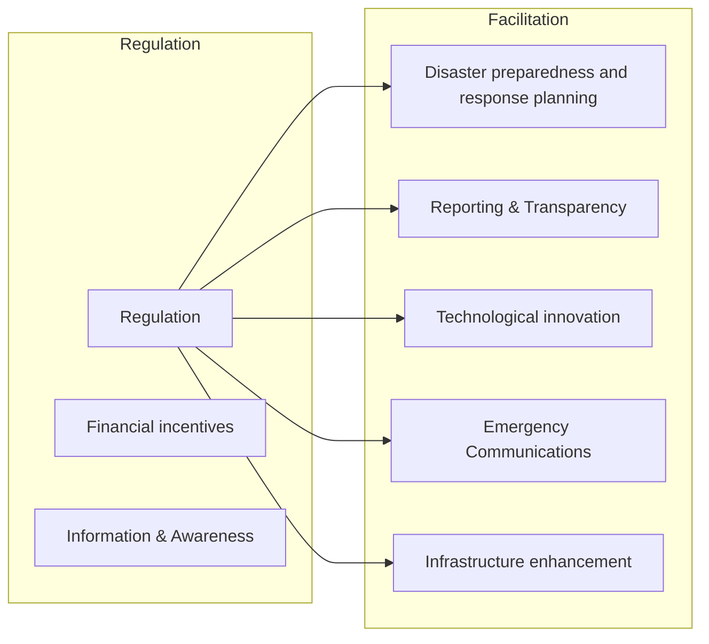

# ENHANCING THE RESILIENCE OF COMMUNICATION NETWORKS

OECD DIGITAL ECONOMY PAPERS

May 2025 No. 374

# Foreword

This report was prepared by the Working Party on Connectivity Services and Infrastructures (WPCSI). It seeks to support policymakers in this complex domain by covering three main topics: the technical aspects of network resilience, an overview of existing resilience metrics, and the development of a framework for categorising policies adopted by OECD Member countries to strengthen network resilience.

This report was drafted by Inmaculada Cava Ferreruela of the OECD Secretariat. It benefitted from contributions from Lauren Crean, Verena Weber and Alexia González Fanfalone from the OECD Secretariat, as well as WPCSI delegates regarding their country experiences. The report was prepared under the supervision of Alexia González Fanfalone.

This report was approved and declassified by the Digital Policy Committee (DPC) on 21 November 2024 and prepared for publication by the OECD Secretariat.

Note to Delegations:

This document is also available on O.N.E Members & Partners under the reference code:

DSTI/CDEP/CISP(2023)6/FINAL

This document, as well as any data and map included herein, are without prejudice to the status of o sovereignty over any territory, to the delimitation of international frontiers and boundaries and to the name of any territory, city or area.

The statistical data for Israel are supplied by and under the responsibility of the relevant Israeli authorities. The use of such data by the OECD is without prejudice to the status of the Golan Heights, East Jerusalem and Israeli settlements in the West Bank under the terms of international law.

© OECD 2025

text_image

CC
BY

Attribution 4 0 International (CC BY 4 0) This work is, made, available under the Creative, Commons Attribution 4.0 International licence. By using this work, you accept to be bound by the terms of this licence (https://creativecommons.org/licenses/by/4.0/).

Attribution – you must cite the work.

Translations – you must cite the original work, identify changes to the original and add the following text: In the event of any discrepancy between the original work and the translation, only the text of original work should be considered valid.

Adaptations – you must cite the original work and add the following text: This is an adaptation of an original work by the OECD. The opinions expressed and arguments employed in this adaptation should not be reported as representing the official views of the OECD or of its Member countries.

Third-party material – the licence does not apply to third-party material in the work. If using such material, you are responsible for obtaining permission from the third party and for any claims of infringement.

You must not use the OECD logo, visual identity or cover image without express permission or suggest the OECD endorses your use of the work.

Any dispute arising under this licence shall be settled by arbitration in accordance with the Permanent Court of Arbitration (PCA) Arbitration Rules 2012. The seat of arbitration shall be Paris (France). The number of arbitrators shall be one.

# Executive summary

In an era where connectivity underpins most daily operations, from commerce and healthcare to education and governance, any network disruption can have far-reaching consequences (ComReg, 2023[1]). Therefore, continuous and stable operation of communication networks, especially during critical events or disasters, becomes a priority.

Policymakers face the complex task of ensuring these networks are resilient to various threats while addressing the technical and regulatory challenges inherent to large, interconnected infrastructures. This report aims to support policymakers by providing a holistic view and offering relevant insights to develop comprehensive strategies in this crucial policy domain.

## Diverse threats to communication network resilience: A growing challenge

System failures remain the leading cause of communication network outages, accounting for 93.5% of lost user hours in the European Union (EU) Member States in 2022. Malicious actions account for 3.8% of lost user hours and natural phenomena for 1.5%, a similar percentage to human error, which accounts for 1.2% (2022) (ENISA, 2024 ). Failures of critical network components are particularly relevant as they can have a high impact on population or geography. These components include international links and internet exchange points (IXPs). Submarine cables, for example, which carry more than 99% of the world's Internet traffic, suffer approximately 150 incidents per year, 40% of which are caused by fishing vessels and ship anchors (International Cable Protection Committee, 2024 ; ENISA, 2023 ). The increasing reliance on software-based network functions and the growing importance of content delivery networks (CDNs) further increase the criticality of the data centres hosting these elements.

## Ensuring network resilience: Redundancy, diversity, and innovation

Resilient communication networks are built on the principles of redundancy and diversity. Redundancy ensures critical components, such as switches and communication links, have backups ready to take over in case of failure. Diversity, using different suppliers and technologies, reduces the risk of simultaneous failures from shared vulnerabilities. These principles and measures to reinforce electricity networks, physical infrastructure like cell towers, and access to critical sites are essential for rapid service recovery.

Innovative technologies, including cloud integration, virtualisation and artificial intelligence (AI), enhance network resilience by enabling the seamless relocation of workloads across regions. Software-defined networking (SDN), powered by AI and machine learning (ML), helps predict and detect network issues early, enabling dynamic reconfiguration during disruptions.

## Organisational strategies: A key pillar for network resilience

Beyond technical solutions, collaboration between operators, regulators and other stakeholders is vital fo rapid responses to service outages. The COVID-19 pandemic highlighted this, with European regulators, including the Body of European Regulators for Electronic Communications (BEREC), and industry stakeholders swiftly implementing preventive measures. Crisis simulations, clear communication channels and continuous staff training strengthen preparedness. Business Continuity Management (BCM) plans are also essential, ensuring quick service recovery while safeguarding staff and assets.

## Measuring network resilience: Essential metrics for effective policymaking

Metrics are essential for informed policymaking and to assess the impact and effectiveness of policies and regulatory measures. The report builds on existing frameworks to categorise resilience metrics according to different phases of the network disruption: preparation, service delivery and recovery. It also introduces a feature-based categorisation, such as network availability, reliability and performability metrics, offering a practical guide for policymakers to assess network resilience comprehensively. However, establishing resilience metrics for policymaking remains challenging due to the complexity and diversity of communication networks. The report calls for international co-operation to harmonise resilience metrics to overcome these hurdles and improve data comparability across countries.

## Public policy and regulation: Key drivers of network resilience

OECD Member countries are adopting several policy approaches to enhance network resilience. Based on the analysis of these policies, this report maps the current policy landscape into a categorisation framework along two dimensions: 1) the scope of different policy measures, and 2) instruments to implement such policies (e.g. information and awareness raising, facilitation, financial incentives, and regulation). This framework helps policymakers by providing a clear overview of the policy choices, highlighting some insightful examples, and identifying specific areas for policy development, summarised below.

è Infrastructure enhancement is a priority across many OECD Member countries. Policies range from guidelines and collaboration between industry, advisory bodies and other stakeholders (e.g. Canada, Sweden, the United States and the United Kingdom) to regulations mandating resilient network design criteria (e.g. Colombia, Estonia, Finland, Germany, Japan and Korea). Financial incentives acknowledge the substantial investments needed to enhance network resilience and aim to promote network extension or upgrade (e.g. Australia and the EU).  
Disaster preparedness and response planning are increasingly emphasised. Some countries foster collaboration through joint exercises and best practice sharing (e.g. Canada, United States), while others require mandatory disaster management plans to ensure continuous service during emergencies and swift recovery (e.g. Chile, the European Union and Korea).  
• Reporting and transparency measures, such as disclosure of notable disruptions across various communication services, are enforced in several ways. However, the absence of a harmonised international framework of resilience metrics limits further developments and global comparability.  
Technological innovation plays a pivotal role in enhancing the resilience of communication networks. Some countries are developing programs to support the deployment of innovative solutions to provide continuous connectivity for rural communities in emergencies (e.g. Australia).  
è Emergency communications systems are shifting towards mobile broadband and satellite technologies, enhancing multimedia and real-time data sharing during disasters. Public warning systems are also vital, supported by regulations and financial incentives to ensure deployment and interoperability.

## Looking forward: Resilience of communication networks for a prosperous digital future

As connectivity increasingly drives social and economic activities, ensuring the resilience of communication networks has become a global priority for policymakers. The analysis of OECD Member countries' policies underlines the need for a multifaceted approach to address the complexities in this domain. Several key insights for future development emerge. Harmonisation of resilience metrics is essential for evidencebased policymaking and effective benchmarking. Similarly, collaboration and information sharing between operators, emergency services and other stakeholders are essential to maintaining communications during emergencies and ensuring rapid network recovery. Finally, it is essential to acknowledge the investment needed in infrastructure enhancement and to leverage technological advances to improve network resilience.

## Table of contents

## Foreword 2

## Executive summary 4

## Enhancing the resilience of communication networks 7

Introduction 7

Understanding the technical resilience of communication networks 8

Measuring network resilience 13

The role of public policy and regulation to foster network resilience: a structured overview 17

## References 29

## FIGURES

Figure 1. Reported problems with communication services for quad-play communication operators, 2023 17

Figure 2. Categorisation framework of policy measures for network resilience 18

## TABLES

Table 1. Resilience metrics 14

# Enhancing the resilience of communication networks

## Introduction

Communication networks underpin much of daily life. When these networks become unreliable, unstable or fail, the consequences can be severe for companies, citizens, entire economies and societies, depending on the magnitude of the outage. According to a recent study, an outage has an immediate impact through the loss of benefits from activities that cannot be carried out without connectivity. Moreover, it can have an effect through three additional channels: i) the perceived risk of outages, which can affect the demand for connectivity services; ii) the additional costs incurred in self-provisioning backup connectivity; or iii) the disincentives to labour mobility or regional development (ComReg, 2023[1]).

Several major communication network outages around the world illustrate this dependency. For example, a recent nationwide network outage in the United States affected millions of consumers and disrupted access to lifesaving communications, and is being thoroughly investigated by the Federal Communications Commission (FCC), the communication regulator (The Washington Post, $2 0 2 4 _ { [ 5 ] } )$ . A network outage at Volkswagen in 2023, for example, forced most of its factories in Germany to halt production across severa brands of the group, which in turn led to disruptions in some of its factories in the People’s Republic of China (hereafter “China”) and the United States (DCD, 2023[6]; Handelsblatt, 2023[7]). Moreover, outages relating to the misconfiguration of network elements (e.g. routing) led to the global unavailability of one of the most popular over-the-top (OTT) services for over five hours (OECD, 2022[8]).

Other significant network incidents include submarine cable failures, such as those in the Red Sea in February 2024. The installation of cables nearby due to geological features or licensing issues exacerbates the risk of multiple cable failures due to typical causes such as anchor drag, which in this case affected communications between distant states such as South Africa, the United Kingdom and China (Stronge, ${ 2 0 2 4 _ { [ 9 ] } } )$ . These examples illustrate the potential for significant economic impact and disruption of essentia services that can result from communication network failure and the variety of causes that can lead to it.

The continuity of communication services acquires an even greater significance in emergencies like natura disasters. In these instances, the ability for citizens to communicate and for authorities and civil protection services to manage the emergency efficiently is paramount. The reliability of Public Protection and Disaster Relief (PPDR) networks becomes a critical factor in the effective response to such crises, underscoring the necessity for these networks to be highly resilient.

In this context, enhancing communication network resilience, defined in this report as the network’s ability to cope with shocks or incidents (i.e. prevent, respond, mitigate and recover from them) while maintaining an acceptable level of service, is paramount and increasingly prioritised within the political agenda of OECD Member countries (European Parliament, $2 0 2 2 _ { [ 1 0 ] } )$ . Governments have adopted diverse measures to strengthen their communication infrastructures' resilience and recovery capabilities. Strategies range from deploying advanced technologies to establishing thorough disaster response plans at all levels of government and across stakeholders, reflecting the multifaceted nature of the challenge and the geographical context of each country. However, designing effective policies in this relatively new and complex area presents considerable challenges for governments.

This report seeks to aid policymakers in navigating these complexities by offering insights into the technical and organisational measures to improve network resilience by analysing three main areas. The report's first section synthesises the technical aspects of communication networks' resilience, identifying the main threats to critical network components. It details the measures employed by the industry and emergency management stakeholders to mitigate the risks of outages and ensure rapid service restoration, incorporating both technical and organisational strategies.

The second section discusses existing resilience metrics, categorised according to the taxonomies of international organisations, to elucidate their applicability and relevance. It aims to help identify the most pertinent metrics and offers a guide to sources of information on these metrics. The third section explores the strategies and policies implemented by OECD Member countries to fortify network resilience. Introducing a comprehensive framework for categorising these policies, the report maps the current policy landscape, highlights best practices and suggests areas for policy development. This section also summarises the main trends observed in resilience policies, providing policymakers with a robust foundation for informed policy formulation. The report offers a holistic view of the challenges and solutions to communication networks' resilience, equipping policymakers with the necessary tools to develop effective strategies in this crucial policy domain.

## Understanding the technical resilience of communication networks

## Critical infrastructures and challenges for network resilience

The challenges to infrastructure resilience are diverse, given that service disruptions have several underlying causes. In 2022, the cause of communication disruptions most commonly reported by European Union (EU) Member States was hardware failure (23% of incidents), followed by software bugs (20%), power cuts (13%) and faulty software modifications or updates (12%). Cable cuts accounted for 5% of the incidents (ENISA, 2024 ). System failures remain the primary underlying reason for disruptions, accounting for 93.5% of the user hours lost in 2022 in EU Member States. Malicious actions accounted for 3.8% of the user hours lost, and natural events accounted for 1.5%, a similar percentage to human error at 1.2% (ENISA, 2024 ).

Natural disasters, including extreme weather events, have a varied impact on OECD member countries. These events often create emergencies during which fully functional communication services are critical. Recent natural disasters, such as hurricanes, floods, earthquakes, wildfires and volcanic activities, have starkly demonstrated networks’ vulnerability. In Europe, disruptions to communication networks due to natural disasters reached a record high of 168 million incidents in 2022, compared to 58 million in 2019 (ENISA, 2024 ).1 This underscores the immediate need to strengthen the resilience of communication networks.

Power outages are a predominant cause of severe network and service breakdowns and hardware and software malfunctions. Hence, enhancing communication networks’ capacity to endure and remain operational following power outages is essential. Studies also reveal that mobile networks are more susceptible to power outages than fixed networks and that resilience is weaker in access networks closer to the user than core network elements that carry traffic for many customers (ENISA, 2013 ). While disruptive events can affect any network segment, there are some critical elements in which failure could severely hamper communication services. These typically include elements in the backbone segments, such as transmission links and switching nodes, particularly IXPs for Internet Protocol (IP) traffic.

Submarine cables are among the most crucial infrastructures for international connectivity, carrying over 99% of all IP data traffic worldwide (International Cable Protection Committee, $2 0 2 4 _ { [ 3 ] } )$

Regarding submarine cables, part of the backbone of communication networks, almost 40% of all cable disruptions result from accidental damage caused by fishing vessels and ships dragging their anchors (ENISA, 2023 ). Natural phenomena like earthquakes, volcano eruptions, tsunamis and underwate currents during storms account for about 5% of cable incidents (ENISA, $2 0 2 3 _ { [ 4 ] } )$ . Failures of underwater components also play a minor role, causing 4% of cable disruptions, and deliberate acts of sabotage are uncommon (Telegeography, $2 0 1 7 _ { [ 1 2 ] } ; \mathsf { E N } | \mathsf { S A } , 2 0 2 3 _ { [ 4 ] } )$ . Submarine cable disruptions are relatively frequent, with around 150 faults annually (International Cable Protection Committee, ${ 2 0 2 4 } _ { [ 3 ] } )$ . Submarine cable landing stations, where the cable emerges and connects to terrestrial infrastructure on beaches or within cities, can also be vulnerable points.

## Technical measures for network resilience

At a structural level, networks are designed according to principles that give them a degree of resilience to compensate for any outages in case of disruptive events. These principles are redundancy and diversity (Rak and Hutchison, $2 0 2 0 _ { [ 1 3 ] } )$ . Redundancy ensures that critical components, such as switches and communication links, have backups, allowing these redundant components to take over tasks in case of failure. Diversity, including using different suppliers and technologies, further strengthens this resilience by reducing the risk of simultaneous failures within a system. Introducing redundancy and diversity improves resilience by offering alternate resources across all communication stack layers. For example, redundant paths provide alternate routes at the physical layer (Box 1), and routers or switches from various manufacturers will execute alternative implementations of routing protocols.

## Box 1. New submarine cable routes in the Arctic

Several submarine cable projects are being considered to provide direct routes between Europe, North America and East Asia through the Arctic, taking advantage of changing climate conditions in this region. This would increase the redundancy of the connectivity between Europe and other regions alongside existing routes with bottleneck risk, such as via the Suez Canal and the Red Sea area, through which more than 90% of Europe-Asia capacity is currently carried (Mauldin, $2 0 2 4 _ { [ 1 4 ] } )$ If successful, Far North Fiber plans would connect Europe and Japan via the Northwest Passage in the Arctic, with landing points in Japan, the United States (Alaska), Canada, Ireland and Finland (Far North Fiber, $2 0 2 4 _ { [ 1 5 ] } )$ . Polar Connect, which is considering a more direct route, would follow a more direct route, passing under the North Pole ice cap, Svalbard, and from there, north of the Canadian archipelago to North America and East Asia (NORDUnet, $2 0 2 4 _ { [ 1 6 ] } )$ . Both projects fit well with several European Union initiatives to strengthen the EU's links with third countries that have funded preparatory works.

Sources: (Mauldin, 2024[14]), (Far North Fiber, 2024[15]), (NORDUnet, 2024[16]).

The diversity principle aims to reduce the risk of simultaneous failures within a system. For example, employing hardware or software from different vendors, while challenging for smaller operators due to cost, time-to-market, support and feature alignment considerations, can diminish the likelihood of simultaneous failures due to identical vulnerabilities.

Moreover, layered architectures incorporating terrestrial and Non-Terrestrial Networks (NTNs), combining cellular networks with High Altitude Platform Stations (HAPS) or satellite systems, can enhance overall system resilience, particularly in disaster scenarios where NTNs can provide critical communication when terrestrial networks are damaged or congested. In particular, satellite connectivity providing additiona coverage and capacity can play a pivotal role in improving the resilience of networks by providing communications services for emergency management (e.g. humanitarian aid), backhaul connectivity, remote sensing and IoT applications, defence applications, and broadband services, among others.

Other measures to improve resilience include network segmentation, where a more extensive network is divided into smaller sub-networks to separate faulty or overloaded parts in the event of incidents and control the traffic exchanged between them. In addition, the isolated operation of a part of the network in the event of an external risk or disruption until the threat has passed or the isolated component has recovered from the damage and resumed regular operation (ETSI, 2023[17]).

At the operational level, resilience is bolstered through network management functions, which may be automated and encompass proactive anomaly detection, remediation and recovery actions to ensure uninterrupted service. This level of resilience can be applied across the network and at various layers (e.g. at the application layer and both the core and edge of the network).

Beyond technical measures on the communications network, its resilience depends heavily on the availability of associated networks and infrastructure. Managed services provided by global service providers play an increasingly decisive role in the operation of communications networks. In the case of 5G Standalone (SA) networks, for example, a critical element is the operation of the edge IT cloud service, and today, global CDNs carry the majority of Internet traffic. This is why the redundancy and diversity in managed services from global providers are also critical to increasing the resilience of electronic communications networks.

Electricity is a critical underlying infrastructure for any communication network, as power outages are a prevalent cause of communication service outages. However, the power grid itself can be affected by natural hazards, technical failures or other risks, so applying resilience measures such as grid meshing to implement alternative routes may be essential for the rapid recovery of communication networks.

Protection measures against network power supply disruptions include deploying continual power systems (uninterruptible power supplies, emergency power systems) or standby generators, especially at mobile network base stations, which are more exposed to these incidents. Equally important is the diversification of power supply lines for critical infrastructures such as switching nodes or data centres.

Generators driven by combustion engines require constant fuel supply, which can be problematic in scenarios where infrastructure has been severely damaged. Photovoltaic systems with batteries or windmills do not depend on external supplies but may have limited or no power production in adverse weather conditions or at night (ETSI, 2023 ). For example, Turkcell has stored 200 000 litres of fuel in facilities located in the western and eastern regions of the Republic of Türkiye to respond quickly to natural disasters such as earthquakes. Turkcell has also developed a portable solar base station to power its base stations in off-grid areas using renewable energy. Portable solar base stations are also used in rural areas to extend coverage. In the event of a disaster or emergency, these base stations can be transported to locations where infrastructure is most needed (GSMA, 2023 ).

Supporting and hosting infrastructures such as buildings, cell sites, and towers is also a vital element of communication networks, and their ability to withstand a disaster is a crucial part of network resilience. Measures to improve their physical stability range from appropriate site selection, considering risk factors such as proximity to rivers and seas or soil susceptibility to landslides, to conducting structural stability studies or implementing reinforcements. For example, in Japan, KDDI and NTT DOCOMO have designed and built their network facilities with reinforced components to make them more earthquake resistant. Like most other MNOs in the Caribbean, Digicel Group has reinforced tower structures and enhanced foundations, giving them more stability in strong winds (GSMA, 2023 ). Korea's Ministry of Science and ICT has launched a project (2020 to 2024) to predict in advance and respond quickly to fires and disasters in underground utility tunnels where major national supply lines – such as for communication, electricity and water supply – are concentrated, using AI digital twins.

Finally, transport infrastructure and access to network sites (e.g. cell sites) are critical to recovering communications services after a natural disaster. Therefore, a prior assessment of the risks to access to network sites and available transportation is recommended. For example, in the aftermath of Typhoon Haiyan in the Philippines – one of the most powerful tropical cyclones ever recorded – the mobile network operator Smart found that the biggest challenge was securing transportation. Affected areas were challenging to reach for about a week and, although Smart restored some sites remotely, it was impossible to keep them running without access to fuel. Smart worked with the government and armed forces to gain access to the areas and today has an informal agreement with the Philippines Air Force and Navy to provide transport during emergencies. They also pre-position staff, usually network engineers, near critica sites because of their difficulty travelling once a typhoon makes landfall (GSMA, 2023[18]).

## Technological developments in network resilience

Several technological developments have the potential to increase the resilience of networks. These trends include the increased virtualisation of networks, the integration of cloud services into networks, network slicing and increased use of AI systems and machine learning (ML) in networks (OECD, 2022 ).

Recent developments in broadband networks, such as virtualisation, offer new possibilities to improve network resilience. Software-defined Networking (SDN), for example, provides new solutions to network resilience by utilising software-based controllers or application programming interfaces (APIs) to route traffic on a network. This enables dynamic network reconfiguration to utilise alternative resources in case of a failure. Network Function Virtualisation (NFV) allows network functions to be run by specific services and applications across the physical network (OECD, 2023 ). This approach enhances network resilience by enabling functions to be distributed across multiple servers within the network.

The increased integration of cloud services into networks, leveraging the scale of SDN and NFV in cloud computing, can also offer advantages in resilience. Cloud providers can relocate workloads across different geographical areas without losing data or functionality, which can be used for network functions which are not tied to specific locations. The hybrid network architecture test of Nokia's IP Multimedia Core Network Subsystem (IMS) software in collaboration with Amazon Web Services (AWS) at Telstra in Australia illustrates the potential of such solutions (see Box 2).

## Box 2. Cloud services for network resilience

Nokia's IMS was deployed on the AWS infrastructure, running concurrently with the primary IMS at Telstra's premises (hot standby configuration). This solution provides geographic and infrastructure diversity, with the cloud complementing the telco's on-premises infrastructure; vendor diversity, with two different vendors for the two IMS; and dynamic scaling (i.e., capacity on demand) of network resources, such as bandwidth or real-time processing power, to handle sudden spikes in demand or to mitigate the effects of outages or failures of the primary IMS (Telstra, 2024[21]).

Sources: (Telstra, 2024[21]).

Network slicing enables the creation of highly reliable logical network segments in mobile networks. In combination, two technical developments, NFV and SDN, make network slicing in mobile networks possible. This feature, while available for 4G networks, is a prominent feature of the 5G standalone (SA) standard and would allow one physical network to cater to a diversity of applications with different capacity requirements through the “virtualisation” of the mobile network in several layers (or “slices”) (OECD, $2 0 2 2 _ { [ 1 9 ] } )$ . Network slicing can support, for example, the deployment of Public Protection and Disaster Relief (PPDR) networks as overlays to commercial mobile networks, allowing PPDR networks to benefit from advances in mobile technology, such as high-speed data transfer, while keeping the high availability and isolation required by emergency communications. LTE (4G)-based PPDR networks, such as those deployed in Korea, the United Kingdom and the United States, could evolve into network slices in 5G networks (GSMA, 2018[22]).

Building on all these developments, machine learning (ML) and AI systems can analyse data from various sources, including network elements and IoT or user-experience sensors, facilitating early detection of network issues. Implementing AI systems in fixed and mobile broadband networks, including machine learning and automation of networks, may yield several benefits. It can help communication service providers improve network operations performance and reliability, contribute to incident prevention and predictive maintenance, and aid in improving digital security features (OECD, 2022[19]). AI-enhanced intelligent networks can recommend strategies to boost resilience, predict the impact of changes and increasingly manage autonomous responses to changes. For instance, AI systems could coordinate with aerial platforms to anticipate or detect terrestrial network disruptions and proactively deploy aerial base stations as necessary (Ahmadi, Katzis and Shakir, $2 0 1 8 _ { [ 2 3 ] } )$ . This type of automated network management has clear benefits in improving network availability, however, there are challenges to implementing AI in networks, such as increased network complexities and the need for skilled professionals to handle these technologies.

Organisational strategies for network resilience, along with the technical measures outlined previously, are vital for enhancing communication networks' resilience. These strategies foster collaborative efforts among network operators, regulatory bodies and other stakeholders, ensuring a robust response to service disruptions and outages and improving communication networks' overall performance and continuity. For example, during the COVID-19 health crisis, immediate co-operation with European regulators, in particular through the Body of European Regulators for Electronic Communications (BEREC), and regular exchanges with the entire ecosystem, made it possible to share the state of the crisis step by step and, as a result, to make the players responsible for putting preventive measures in place (BEREC, 2021[24]).

Multi-sectoral coordination has also proved effective in crisis management for the rapid recovery of service, given that incidents, especially climate-related ones, often affect all infrastructures, including communication networks, energy networks, roadways and rail infrastructures. By way of example, the report on the storm Ciaran that affected the northwest quarter of France in November 2023 shows that mobile network equipment withstood particularly well. However, 90% of the unavailable sites were due to electricity shortages, and the remaining 10% were due to the disorientation of antennas and difficulties in accessing the sites (e.g. roads impassable or unsafe for technicians) (SDIS29, 2024[25]).

Key organisational measures include conducting regular exercises to refine internal teams' work and collaboration with external actors in the event of crises, establishing clear communication channels with designated contact persons and responsibilities to facilitate communication among involved actors during emergencies, and regularly training employees to increase their awareness regarding potential threats (BNETZA, 2022 ).

From an operator's perspective, Business Continuity Management (BCM) planning provides a framework for preparing for and responding to disasters, facilitating rapid service recovery and reducing potentia losses, as well as other benefits such as staff safety and security (GSMA, 2023 ).

These organisational measures, alongside the technical strategies discussed in the previous section, constitute a holistic approach to enhancing communication networks' resilience. By promoting collaboration, ensuring effective communication, and focusing on employee training and awareness, this approach aims to achieve quick recovery from service outages.

## Measuring network resilience

Metrics are essential for informed policymaking and assessing the impact and effectiveness of policies and regulatory measures. However, measuring network resilience presents many challenges. The multifaceted nature of resilience leads to a broad and heterogeneous set of metrics. The lack of harmonised metrics used by different organisations leads to data comparability problems. In this context, this section presents the existing resilience metrics, categorised according to international organisations' taxonomies and detailing their scope of applicability and relevance. It also identifies the most commonly used indicators and provides information on existing sources.

## Types of resilience metrics

Several initiatives aim to develop extensive indicators and measurement frameworks that can steer the assessment, enhancement and governance of network resilience. Notable contributions to standardisation efforts in this domain include those by the Institute of Electrical and Electronics Engineers (IEEE)2, the Internet Engineering Task Force (IETF)3, European Union Agency for Cybersecurity (ENISA)4, National Institute of Standards and Technology (NIST)5, and the International Telecommunication Union (ITU) Focus Group on Disaster Relief Systems, Network Resilience and Recovery (FG-DR&NRR).6 Against this backdrop, categorising metrics is a practical tool that allows policymakers to identify and select resilience metrics for policy instruments (such as regulatory requirements) or oversight and evaluative functions.

In a broad sense, a first distinction should be made between metrics that assess resilience by measuring network characteristics, referred to in this report as network resilience metrics and those that determine resilience by calculating the impact of a network failure or outage, i.e. impact metrics.

The nature of the network resilience metrics is much more technical, and several classification frameworks exist. In practical terms, for policy purposes, this report classifies network resilience metrics according to two criteria: 1) when they are applicable, and 2) which facet of network resilience they measure. These criteria are based on the classification framework developed by the European Union Agency for Cybersecurity (ENISA) (ENISA, 2011[27]).

Regarding the first criterion (i.e. resilience metrics according to the stage of when they are applicable), metrics can be classified based on an incident-based perspective, categorising resilience metrics relevant to the pre-outage phase, during service delivery or the recovery phase post-outage as follows (ENISA, 2011[27]):

• Preparation phase: Metrics that assess readiness to handle potential challenges or faults. Highe preparedness levels correlate with a diminished probability of failures or damage to crucial infrastructure elements.  
Service delivery phase: Metrics that assess the operational impact of faults or challenges by comparing service levels before, during and after an incident. Significant service level variations signal effective incident consequence mitigation.  
Recovery phase: Metrics that focus on the speed and efficiency of recovery processes to reinstate standard operations. Lower metric values here indicate more effective recovery mechanisms, leading to reduced downtime.

The following definitions describe some essential and commonly used metrics in the service delivery and recovery phases.

Service delivery phase:

• Mean time between failures (MTBF): Average operational duration between system failures, indicating system reliability.

• Availability: Proportion of time the network is operational, accounting for both scheduled and unscheduled downtime.  
• Packet loss: Probability of data packet loss during transmission, primarily due to network congestion or transmission errors.

## Recovery phase:

• Mean downtime: Average duration when the system is non-operational due to failures.  
• Mean time to repair (MTTR): Average time required to repair a failed component or system and restore operational status.

Regarding the second criterion (i.e. resilience metrics according to the facet of network resilience they measure), these can be categorised using a domain-based perspective of dependability metrics, such as availability (ability to use a system or service), reliability or dependability (continuous operation of a system or service), or performability metrics (i.e. the property of a system that delivers performance at a certain specification, such as quality of service measures). Table 1 includes commonly used metrics based on these dimensions (ENISA, 2011[27]).

Table 1. Resilience metrics

<table><tr><td>Incident-based\Domain-based</td><td>Dependability</td><td>Performability</td></tr><tr><td>Preparedness</td><td>Mean time to incident discoveryMean time to patchPatch management coverageVulnerability scanning coverage</td><td>Tolerance</td></tr><tr><td>Service delivery</td><td>Mean time between failuresAvailabilityReliabilityFault report rate</td><td>Delay variation (jitter)Packet lossBandwidth utilisation</td></tr><tr><td>Recovery</td><td>Mean down timeMean time to repairMaintainability</td><td></td></tr></table>

Source: Based on taxonomy developed by the European Network and Information Security Agency (ENISA, 2011[27]).

Regarding impact metrics, existing approaches measure the extent of the impact of network outages with external parameters. These impact metrics typically include (ENISA, 2011[27]):

• Number of users affected: The number of users impacted by a network service disruption.  
• Number of network elements affected: The number of network components, such as nodes and links, impacted by a disruption.  
Geographical area impacted: The extent of the geographical area affected by the network service disruption.  
• Financial impact of network service disruption: Includes sub-metrics like monetary cost, market share loss and revenue decline, assessing the financial fallout of service disruptions.

Criticality of impacted and dependent services: Evaluates the significance of the affected services to the organisation and its stakeholders.  
Number of / increase in helpdesk calls or incident tickets: Monitors helpdesk call or incident ticket volume as a metric of service disruption severity.  
• Reputational damage: This metric aims to quantify or assess any harm to the organisation's reputation resulting from the service disruption.

These indicators can facilitate the publication of valuable information to the public as part of crisis management, particularly what services have been affected and where and when they are expected to be restored. Finally, given that communication network resilience is highly dependent on the resilience of other networks and infrastructure, particularly electricity, the definition of cross-sectoral metrics in resilience investment and capacity building could contribute to policy instruments to this end.

## Sources of information for resilience metrics

Information on resilience metrics that measure network parameters usually come from communication operators. Other sources look at particular parts of the Internet infrastructure, gathering information on network topology, capacity and even real-time availability. Notable public sources of network infrastructure information include:

• TeleGeography Submarine Cable Map offers a comprehensive and regularly updated interactive map of the world's major submarine cable systems and landing stations (TeleGeography, 2024[28]).  
ITU Infrastructure Connectivity Map displays geospatial infrastructure connectivity layers, including transmission networks, IXPs and several ITU connectivity indexes, as well as population density (ITU, 2024[29]).  
• Packet Clearing House Internet Exchange Directory offers a directory of IXPs, including locations and equipment (PCH, 2024[30]).  
• PeeringDB Interconnection Database includes IXPs, data centres, and other interconnection facilities (PeeringDB, 2024[31]).  
• RIPE ATLAS database provides online information about the current state of the region's electronic communication networks (RIPE NCC, 2024[32]).

Furthermore, indexes or maps acting as information aggregators, like the Internet Resilience Index (IRI) developed by the Internet Society (Pulse), incorporate selected indicators that evaluate specific aspects of resilience. These are compiled from various sources and reflect the infrastructure, performance, security and market readiness. In particular, its indicators include (Internet Society, Pulse, 2023[33]):

Exit Points (International Gateways): The number of cable landing stations and terrestrial crossborder fibre connection points; indicates international connectivity diversity.  
• 10 km Fiber Reach: Percentage of the population within a 10 km range of core terrestrial transmission network nodes; illustrates network density and redundancy (ITU, 2012[34]).  
• Number of IXPs per 10 million inhabitants; illustrates the redundancy and geographical diversity of IP traffic exchange nodes.

In support of disaster response, the Disaster Connectivity Map is an initiative by the ITU and the Emergency Telecommunications Cluster (ETC), assisted by the GSMA Mobile for Humanitarian Innovation program. It helps first responders by showing the following information on a map (ITU, ETC, GSMA, 2024[35]):

• Network infrastructure: physical features like terrestrial fibre optic links, microwave network links, submarine cables and mobile cell sites.  
• Mobile network coverage: projected and actual mobile network coverage.  
• Connectivity performance: metrics such as ping, latency and throughput.

These maps aggregate data from multiple sources to provide near real-time network coverage and performance updates.

When measuring the impact of communication outages, information such as the size of the geographical area or the number of users affected can come from multiple sources. One way is to rely on user-generated data. Tools such as Downdetector® (Ookla) collect data reported by users on its platform, interactions across the web and direct reports from companies. This data is then processed to determine the areas and user numbers affected by outages, offering valuable insights into the scale of network disruptions (Ookla, 2020[36]).7

The process of obtaining country data on reported problems with communication services involves analysing aggregated information from the Downdetector® reports of the leading operators in each country. These operators are categorised according to their service: 'Mobile Operators' for mobile-only services and 'Triple Play Operators' for triple-play and quad-play services. Figure 1 illustrates the data available for OECD Member countries for quad-play operators for 2023.

To ensure comparable data between countries in Figure 1, the number of problem reports per country is presented as the number of times it exceeds its baseline volume: a baseline volume of typical problem reports for each service monitored is calculated based on the average number of reports for that given time of day, measured over the previous year (Ookla, 2020[36]). The reported problems vary widely between countries, ranging from around five times the base volume in France, Germany and the United States to more than fifty times the volume for the three types of operators in some countries, possibly indicating a severe service disruption.

Figure 1. Reported problems with communication services for quad-play communication operators, 2023  

bar

| Category | Value |
| --- | --- |
| AUS | ~10 |
| AUT | ~8 |
| BEL | ~6 |
| CAN | ~6 |
| CHL | ~22 |
| COL | ~10 |
| DNK | ~66 |
| FIN | ~55 |
| FRA | ~5 |
| DEU | ~5 |
| HUN | ~26 |
| IRL | ~10 |
| ITA | ~6 |
| JPN | ~22 |
| MEX | ~8 |
| NLD | ~7 |
| NZL | ~45 |
| POL | ~6 |
| PRT | ~26 |
| ESP | ~8 |
| SWE | ~14 |
| CHE | ~25 |
| GBR | ~7 |
| USA | ~5 |

Number of reported problems relative to the baseline volume

## Notes:

1. The operators considered are the leading operators in terms of market share.  
2. The communication operators are categorised as "Quad Play Operators" if they provide quad-play services, regardless of whether they provide other types of services (e.g. triple-play).  
3. The number of incident reports is for the full year 2023.  
4. A baseline volume of typical problem reports for each service monitored is calculated based on the average number of reports for that given time of day, measured over the previous year (Ookla, 2020[36]).  
5. There is currently no data from Downdetector® in some OECD Member countries, namely Costa Rica, Estonia, Iceland, Korea, Latvia Lithuania, Luxembourg and Slovenia.

Source: OECD elaboration based on Downdetector® (Ookla).

## The role of public policy and regulation to foster network resilience: a structured overview

In line with the increasing strategic importance of improving network resilience to mitigate the impacts of disruptive events, a growing array of OECD Member countries have adopted several policy and regulatory measures. These measures encourage operators, sometimes with other stakeholders, to adopt suitable technical and organisational strategies to mitigate risks, manage communication network disruptions and increase transparency on resilience indicators.

The measures are presented within a categorisation framework, offering valuable insights for regulators and policymakers. The structure of this framework helps provide a clear overview of the current policy landscape, presents best practices and identifies specific areas for policy development. According to the analysis of OECD Member countries' policies to improve network resilience, regulatory measures are mainly used for infrastructure enhancement, disaster preparedness and reporting. Funding support measures are primarily aimed at enhancing infrastructure, including Emergency Communications, and promoting technological innovation. Measures of a more informative nature are also used to foster infrastructure enhancement through the publication of guidelines or the possibility of adhering to standards or good practices. Finally, measures to facilitate co-operation between stakeholders ensure a coordinated and prompt response to disruptive events and swiftly recover communication service (Figure 2).

Figure 2. Categorisation framework of policy measures for network resilience  

flowchart

This framework and its different categories are illustrated in Figure 2. It has been developed based on an analysis of OECD Member countries' policies, legislation and actions in network resilience along two dimensions: their scope and the policy instrument. For every dimension, several categories have been identified:

## Scope of policy measures:

Infrastructure enhancement: This category includes actions aimed at encouraging operators to implement technical measures to improve the resilience of communication infrastructures. These generally involve the deployment of redundant infrastructure and technological upgrades.  
è Disaster preparedness and response planning: Efforts in this area focus on ensuring communication networks can respond effectively to disasters. This includes establishing disaste response plans and integrating communication services into broader emergency management strategies. It also covers the establishment of precise governance models and business continuity protocols.  
è Technological innovation: This category includes policies encouraging the research and implementation of new technologies and methods to enhance network resilience and reduce dependency on single points of failure.  
Emergency communications: These measures aim to ensure emergency communications services both for emergency services and individuals.

Reporting and transparency: This encompasses clear and timely communication with the public, authorities and other stakeholders about the impacts of disruptions, responses and restoration efforts.

## Instruments to implement policy measures

The categories of policy instruments represent a gradual approach from informative measures to facilitating and financial incentives measures to strict regulation.

Information and awareness raising: Initiatives designed to enhance stakeholders' and the public's understanding of network resilience's importance and strategies for improvement.  
Facilitation: Efforts to promote collaboration among stakeholders, including communication providers, power supply providers, utilities and others to increase network resilience.  
Financial incentives: Government support for initiatives to strengthen communication infrastructure resilience.  
Regulation: Mandates from governmental or regulatory bodies that specify actions or standards communication operators must adhere to for network resilience.

## Infrastructure enhancement

Several OECD Member countries have introduced policy measures to enhance the resilience of their communication networks, focusing on infrastructure enhancement through a range of policy instruments, softer information and guidance initiatives to regulations. Information and guidance initiatives aim to foster a culture of collaboration and high standards, crucial in enhancing communication network resilience. This approach is critical to ensuring a coordinated emergency response and leveraging collective expertise. In addition, financial incentives acknowledge the necessity for substantial investment in technology and infrastructure to enhance resilience. Governments provide financial incentives, recognising the high costs of deploying resilient technologies and upgrading networks. Regulation stands out as a key policy instrument, with governments and regulatory bodies establishing legal requirements for communication operators to comply with resilience and preparedness standards. This sets a solid foundation for network resilience and ensures uniform preparedness across operators to minimise potential impacts on public services and economic stability.

Finally, it should be noted that as regulators increasingly consider environmental sustainability issues, they may find that these issues raise potential trade-offs with other policy objectives, such as network resilience. For example, due to the environmental footprint of building new communications infrastructure (new sites to extend mobile network coverage or new ducts for redundant routes for wired networks) or due to the increased energy consumption of redundant equipment (OECD, 2025[37]).

## Information and awareness raising

The deployment of information and guidance instruments plays a crucial role in bolstering network resilience. This strategy complements regulatory and financial incentives, focusing on spreading knowledge, best practices and standards to build a robust communication infrastructure to withstand and quickly recover from disruptions. Canada has proactively leveraged the expertise of the Canadian Security Telecommunications Advisory Committee (CSTAC) and the Canadian Forum for Digital Infrastructure Resilience (CFDIR). By pooling knowledge and experience from various stakeholders, these entities have been instrumental in developing comprehensive recommendations designed to enhance the reliability of Canada's communication networks (Canadian Forum for Digital Infrastructure Resilience (CFDIR), 2023[38]).

The "Robust Fiber" initiative showcases Sweden's efforts towards infrastructure enhancement, a collaborative endeavour with the National Post and Telecom Agency (PTS). This initiative provides clear guidelines for constructing robust and reliable fibre networks. The "Robust Fiber" concept has produced detailed guidance on numerous aspects of fibre network construction, including design, location, materia selection and documentation, underlining a concerted effort to bolster the physical resilience of communication infrastructure through industry collaboration and technical advice.

The United Kingdom actively encourages service providers to utilise existing guidance frameworks to enhance resilience in communication infrastructure. The Electronic Communications Resilience and Response Group (EC-RRG) is a hub for collaboration on network resilience issues, uniting industry figures, government officials and the regulatory body Ofcom (Electronic Communications Resilience & Response Group (EC-RRG), $2 0 2 1 _ { [ 3 9 ] } )$ . The United Kingdom’s approach includes a regulatory framework establishing a general obligation for communication service providers to reduce the risk and impact of network or service outages (UK Government, 2021[40]). To implement such regulation, Ofcom has conducted a public consultation to better understand the levels of power back-up in mobile radio access networks in the United Kingdom to date and continues to engage with the government and industry on this issue (Ofcom, $2 0 2 4 _ { [ 4 1 ] } )$ . In the future, the United Kingdom regulator also plans to review its Procedural Guidance, which will include updated guidance on reporting resilience incidents.

The United States has engaged advisory committees to advance network resilience through the FCC and the Communications Security, Reliability, and Interoperability Council (CSRIC). This Council brings together experts from diverse fields, including government, academia, manufacturing and the broader communication sector, to identify and establish resilience best practices. The outcomes of CSRIC’s work, through reports and a catalogue of best practices on the FCC's website, illustrate the United States commitment to an inclusive and transparent enhancement process for network resilience, leveraging the broad expertise of stakeholders from various sectors (FCC, 2023 ).

At the European level, EU Member States are encouraged to endorse European and international standards and technical specifications pertinent to security and resilience measures (European Parliament, $2 0 2 2 _ { [ 1 0 ] } )$ . This support is technology-neutral, ensuring a balanced approach. By promoting the adoption of such standards, the European Union aims for a harmonised security and resilience framework across its members, benefiting from universally acknowledged best practices and technical guidelines.

These national and international efforts underscore a shared recognition of the critical importance of resilient communication infrastructure. By providing information and guidance, countries collaborate with industry partners, advisory bodies and regulatory authorities to formulate and disseminate best practices and recommendations, contributing to the global effort to maintain uninterrupted communication services in the face of disruptive events.

## Financial incentives

The significant investments needed to enhance the resilience of communication infrastructure are widely acknowledged, and several countries are providing financial incentives and support. The Australian government, for instance, has initiated funding programmes such as the Mobile Network Hardening Program and the programme on Strengthening Telecommunications Against Natural Disasters (STAND) (Australian Government, $2 0 2 4 _ { [ 4 3 ] } ;$ Australian Government, $2 0 2 4 _ { [ 4 4 ] } )$ . These are crucial to the national strategy aimed at enhancing the resilience of the mobile network communication infrastructure. The approach focuses not solely on the technical side of resilience but also on ensuring uninterrupted communication services in rural, regional and remote areas most vulnerable to natural disasters.

In the European Union, the Council Recommendation on a “Union-wide coordinated approach to strengthen the resilience of critical infrastructure” invites EU Member States to make use of potentia funding opportunities at the national and EU level to improve the resilience of critical infrastructure, including communication networks (European Council, 2023 ).8 This recommendation also encourages “critical infrastructure” operators to use such funding opportunities, including, for example, trans-European networks.

Adding an international layer of collaborative funding efforts, the European Commission recommends EU Member States to pool national resources with European funding to enhance submarine cable infrastructures, recognising their critical role in connectivity and facilitating robust links with third countries. The European Union’s strategy seeks to fortify the security and resilience of these systems, ensuring sustained connectivity amidst potential disruptions (European Commission, 2024[46]).

Ireland is implementing government-led initiatives to develop direct international connectivity links to the rest of Europe and improve the existing ones. By creating a secure, resilient, diverse, and robust international connectivity infrastructure, Ireland seeks to position itself to strengthen its global communication networks and meet the demands of international connectivity standards.

These financial initiatives contribute to tackling the challenges that threaten the stability and dependability of communication networks, especially against the backdrop of natural disasters and the imperative fo reliable international connectivity. Governments are channelling funds into strengthening mobile networks, securing global connectivity, and upgrading submarine cable systems, thereby alleviating the substantial investments in developing more resilient communication infrastructures nationally and internationally.

## Regulation

Many countries include general obligations to take the necessary measures to maintain continuity of communication service during emergencies in their sectoral regulation. For example, the European Electronic Communications Code includes the obligation for EU Member States to take all necessary measures to ensure the availability of voice communication services and Internet access services provided over communication networks in the event of catastrophic network breakdown or in cases of force majeure (European Parliament, 2018[47]). The United Kingdom's Telecommunications (Security) Act of 2021 encompasses the resilience of networks, meaning that communication service providers have an obligation to identify, prepare for and reduce the risk of anything that compromises the availability, performance or functionality of the network or service (UK Government, 2021[40]).

Some countries have introduced regulations that impose specific obligations on communication infrastructure, demonstrating a preference for compulsory rules that enforce adherence to established standards and practices for network resilience. These regulations take two primary forms: one focused on technical measures, and the other on meeting particular availability and resilience metrics for communication networks.

The regulations concerning technical measures typically include specific design principles, such as redundancy, to prevent failures. This focus is mainly on sections of the network considered vital for maintaining its integrity and resilience. In Colombia, for instance, Resolution 5050 of 2016 by the communication regulator (Comisión de Regulación de Comunicaciones, CRC) prescribes resilient design criteria for essential network components, like the signalling network (CRC, 2016 ). Japan has implemented similar regulations, focusing on extensive transmission line equipment and communication devices crucial for service management and establishing communication channels (MIC, 1985 ).

Estonia's regulations under the Emergency Act (section 37 (2)) dictate that communication networks should be strategically planned, designed, built, maintained and operated to minimise service disruptions. This includes ensuring networks have independent power sources to continue functioning during power cuts (Minister of Business and Information Technology, Estonia, 2023 ). Finland's 2021 Regulation on the resilience of communication networks and services mandates various technical safeguards to enhance network resilience. These provisions include automatic redundancy across network or service components, allocating backup routes for critical communication components and securing power supply with emergency power units (Finnish Transport and Communications Agency, 2020 ). Germany's approach consists of a Catalogue of Security Requirements detailing redundancy for crucial components, diversification in procuring components or systems and strategic network design to maintain diversity across critical network functionalities and elements (Bundesnetzagentur, 2020[52]).

In Korea, as a follow-up to the Digital Service Stability Enhancement Plan of March 2023, legislative amendments were approved to strengthen the obligations of data centre operators and value-added service providers to establish preventive measures and disaster reporting procedures to enhance network resilience.9 The Digital Service Stability Enhancement Plan includes measures to improve the continuity of power supply to data centres, the implementation of core recovery functions, the establishment of a service distribution system and the real-time management of disruption situations, among other measures.

The second regulatory approach is outcome-focused and concentrates on compliance using some availability and resilience metrics. For example, Colombia's Resolution 5050 of 2016 includes metric requirements for the capacity and redundancy of interconnection nodes regarding minimum Mean Time Between Failures (MTBF) and network availability (99.95% of the time) (CRC, 2016 ). Estonia highlights the necessity of promptly restoring services after disruptions, with set deadlines for service restoration. These approaches underscore the benefit of generally agreed resilience indicators. Such benchmarks enable the assessment and comparison of the resilience of communication networks. It requires accurate data on network performance, especially during and following disruptive incidents, to inform regulatory adherence and pinpoint areas needing enhancement.

The steps various countries have taken to improve their communication network's resilience through regulation recognise the fundamental importance of such infrastructure to their economic stability and social welfare. By integrating obligations around mandatory technical measures with the achievement of specific availability and resilience benchmarks, these regulatory schemes strive to ensure that communication networks are demonstrably reliable under adverse conditions. The move towards universally recognised resilience metrics signifies a shift towards a standardised, results-driven approach to resilience underpinned by accurate data and collective standards.

## Disaster preparedness and response planning

Enhancing disaster preparedness and response planning is a pivotal concern for countries, leading to the adoption of various regulatory measures and collaborative efforts.

## Facilitation

Facilitation measures foster collaboration and coordination among communication network operators, government agencies, emergency services and other stakeholders. These can involve sharing best practices, coordinating during emergencies or conducting joint exercises to improve collective disaster response. For example, following a network outage in July 2022, Canada launched a significant facilitation initiative, the Telecommunications Reliability Agenda, to coordinate public and private sector action to improve the reliability of telecommunications and better protect the public (Government of Canada, 2023 ). To advance the Agenda, Canada’s major telecommunications service providers established a Memorandum of Understanding on Telecommunications Reliability at the request of the Minister of Innovation, Science and Industry (Government of Canada, $2 0 2 3 _ { [ 5 4 ] } )$ . The MoU includes provisions on emergency roaming, mutual assistance and emergency communications that have now been operationalised. Canada’s communication regulator has also initiated a public consultation about enhancing network reliability.

In the United States, regulation requires mobile wireless providers to establish Roaming under Disaster (RuD) agreements and mutual aid arrangements to aid disaster response and recovery efforts. This Mandatory Disaster Response Initiative further obliges providers to liaise with local and state emergency responders and inform the public, ensuring transparent preparation and restoration of information (FCC,

2022[55]). Providers must also report their post-disaster efforts to the FCC, promoting accountability and ongoing enhancement of disaster response strategies. The United Kingdom supports co-operation between all parties involved in network failures. In this respect, the UK Regulators’ Network provides a forum for exchange and discussion between the different industries and their regulators on these issues (UK Regulators' Network, 2024[56]).

The requirement for developing resilience and crisis management plans, along with fostering co-operation among communication providers and emergency services, establishes a robust foundation for ensuring networks are resilient, strong and reactive in disaster situations. Such measures prepare communication infrastructure for emergencies and guarantee that communications are preserved and rapidly reinstated, thus reducing the impact of disasters on communities.

## Regulation

The regulatory requirements in this area often entail regularly testing disaster management and crisis response plans, which ensures the resilience of critical infrastructure and the assurance of continuous service during emergencies. In Australia, for example, the government-owned operator NBN Co is mandated to develop, regularly update and test disaster and crisis management plans in collaboration with governments, retail service providers and emergency service organisations. This strategy prioritises swiftly reinstating services to communities affected by disasters and promotes co-operation among service providers.

Chile has implemented regulations mandating communication service providers to create a protective plan for vital infrastructure. This strategy is designed to maintain communication during emergencies caused by natural events, extensive power outages or other significant incidents, underscoring the need for solid emergency preparedness to protect critical communication infrastructure.

In the same vein, the European Union Directive measures require its member states to have a resilience plan or similar documentation for public communication networks and service providers (European Parliament, 2022 ). This initiative aims to bolster providers' capacity to sustain crisis operations and ensure seamless communication between public and emergency services.

In Korea, the National Communications Disaster Management Council established under the Broadcast Communications Development Framework Act (Article 6) is responsible for designating operators subject to digital disaster management obligations; establishing criteria for issuing crisis warnings in the field of value-added communications services and data centres; establishing criteria, procedures and methods for reporting communication disruptions; and reviewing the status of implementation of the master plan fo communications disaster management.

## Technological innovation

Technological innovation and diversification play critical roles in enhancing the resilience of communication networks. Approaches like increased use of software in networks, machine learning (ML) and AI contribute to more responsive network operations and more efficient use of network resources. Moreover, diversifying network technologies introduces an extra layer of redundancy and resilience. For example, Non-terrestria networks (NTNs), particularly satellite networks, can provide critical backup connectivity in scenarios where terrestrial networks are compromised due to natural disasters or other disruptive events.

Integrating NTNs and terrestrial networks, including service continuity between 5G terrestrial access networks and 5G satellite access networks, is emerging as a solution for improving network resilience. These integrated networks aim to provide reliable communication services, leveraging the strengths of terrestrial and satellite technologies in crisis management (e.g. humanitarian aid), backhaul connectivity, remote sensing and IoT applications, and broadband services, among others (3GPP, 2024 ). This ensures that emergency services remain operational and communities stay connected even in the most challenging circumstances.

With this in mind, the Australian Government has launched the Telecommunications Disaster Resilience Innovation (TDRI) programme, which aims to encourage the creation of innovative communication solutions to bolster disaster resilience (Australian Government, 2024[58]). This programme focuses on supporting the development of new technologies to enhance communications, especially in the most vulnerable regions, such as regional, remote and First Nations communities. The TDRI programme has two primary funding rounds. The Power Resilience Round aims to create solutions to address power failures during disasters, ensuring communication networks remain operational. The Innovation Round supports advancing new technologies that improve network resilience, redundancy and availability before, during and after natural disasters. Collectively, these initiatives strive to advance technological innovations that provide continuous connectivity for communities in emergencies (Australian Government, 2024[58]).

## Emergency communications

Emergency communications refer to ensuring the availability of communications for emergency management. This includes communications among emergency services (e.g. health services, fire brigade and police) to share real-time updates and coordinate (mission-critical communications), communications from citizens to emergency services (e.g. 112 or 911 services) and vice versa, and communications from authorities to citizens to alert and inform in case of emergency (public warning systems) (ETSI, 2024[59]). In all cases, highly reliable communications infrastructures are required to provide seamless communications services when one or more sources of disruption are likely to occur (e.g. emergency response to natural disasters).

Mission-critical communications have traditionally relied mainly on terrestrial radio networks (e.g. Private Mobile Radio, PMR, using Terrestrial Trunked Radio technology, TETRA). However, they often face challenges like poor coverage, inadequate redundancy and limited interoperability across various jurisdictions. Upgrading mobile broadband services is increasingly essential for applications such as sharing real-time visual and location data with emergency services. This requires spectrum resources, which have considerable commercial value, underscoring the necessity of considering alternatives such as offering these highly reliable services over commercial mobile networks (3G/4G/5G) using missioncritical related functionalities together with network slicing or through spectrum sharing mechanisms (3GPP, 2017 ). Moreover, satellite technology contributes to ease and improve disaster management practices by providing means for better decision-making, emergency services communication and enhanced mission planning (ETSI, 2012[61]).

Government bodies and emergency agencies operating public safety networks continuously work on technological upgrades and improving networks' coverage, capacity and resilience through direct funding or public-private partnerships. The Australian Government, for instance, has proactively enhanced its public safety network by investing in satellite connectivity for emergency services and evacuation centres through the Sky Muster satellite system. This satellite connectivity ensures that emergency services and evacuation centres in disaster-stricken areas can maintain critical communication lines, facilitating effective disaster response and recovery efforts.

Australia invests alongside the communication industry in procuring mobile communication solutions such as Cells on Wheels (COW), Mobile Exchanges on Wheels (MEOW) and NBN Road Muster Trucks to improve network resilience. These mobile units can be rapidly deployed to disaster areas to efficiently restore communications services and ensure continuity of contact for emergency services, protecting public safety and facilitating disaster response. These actions underscore the importance of innovative solutions and strategic investments to enhance the resilience and functionality of public safety networks. By incorporating non-terrestrial communication networks and portable communication devices, Australia addresses the critical challenges of coverage, redundancy and interoperability. It sets a precedent for improving public safety and emergency service networks during emergencies (Australian Government, 2020[62]).

Public warning systems are systems public authorities can use to inform citizens of imminent or developing significant emergencies and disasters. Such warnings may be broadcasted using communication services, broadcast services, mobile applications relying on Internet access or any combination of the above. The EU-ALERT (ETSI TS 102 900) and the US Wireless Emergency Alerts (WEA) are examples of standards for public warning systems based on Cell Broadcast technology (FEMA, 2023[63]).10

Implementing public warning systems is often linked to regulations that define operational and technica requirements. In Europe, the European Electronic Communications Code includes the obligation that, by 21 June 2022, all EU Member States should ensure that providers of mobile communication services transmit public warnings to the end users concerned (European Parliament, 2018[64]). Implementation technologies vary for different EU Member States, mainly location-based SMS and Cell Broadcast technology (BEREC, 2020 ). In the United States, the Warning, Alert, and Response Network Act provides voluntary participation in transmitting National Alert System alerts for any licensed commercial mobile service provider (Congress US, 2006[66]).

Alongside regulation, some countries financially support deploying public warning systems, necessitating significant investment in infrastructure, technology and human resources through financial incentives. These incentives, such as the government reimbursing costs related to the implementation of the Cell Broadcasting service in Germany and the infrastructure support in Chile, have encouraged the deployment of these systems (GSMA, 2023[67]).

Lessons learned so far underscore technical standards' pivotal role in regulation to implement early warning systems successfully. These standards are instrumental in overcoming the interoperability challenges that the implementation of Cell Broadcasting technology may present. Moreover, the active involvement of all stakeholders is a key factor in the successful implementation of effective early warning systems (GSMA, 2023[67]). An example of multi-stakeholder collaboration to restore communication networks after a natural disaster is the case of Mexico with Hurricane Otis in 2023 (Box 3).

## Box 3. Emergency communications after Hurricane Otis in the State of Guerrero, Mexico (2023)

In response to the emergency caused by Hurricane Otis in the port of Acapulco, Guerrero, on 25 October 2023, Mexico’s communication regulator, the IFT (Instituto Federal de Telecomunicaciones), worked alongside federal and local authorities, and operators to implement a range of urgent measures aimed at restoring communications as swiftly as possible.

## Emergency communications mechanism for operators

IFT established an emergency communication mechanism with communication and broadcasting operators to provide authorities with real-time information on the state of infrastructure in Guerrero.

## Coordinated response with satellite providers

IFT arranged and coordinated assistance from satellite communication providers to secure connectivity at critical locations. These providers swiftly installed communication links to meet agencies’ needs across all government levels.

## Ongoing communication and coordination

Continuous communication was maintained with providers and key government agencies, including the Ministry of Infrastructure, Communications and Transport (SICT), the National Civil Protection Coordination Office, the Federal Electricity Commission (CFE), the Ministry of Defence (SEDENA), and the Ministry of the Navy (SEMAR). This close collaboration expedited the installation of satellite equipment and enhanced the emergency response.

## Restoring infrastructure

IFT activated a liaison and coordination mechanism between the federal government and operators to address the damage rapidly. This mechanism facilitated direct communication between security and civil protection authorities, enabling providers to prioritise technical repairs, deliver support services and stay informed about communication and broadcasting infrastructure conditions.

## On-site spectrum monitoring

On-site spectrum monitoring was conducted to assess the restoration of mobile services and broadcasting signals (AM, FM and DTTV).

## Interactive mobile coverage map

IFT also developed an “Interactive Mobile Coverage Map for Acapulco”, which classified mobile signal strength as “fair”, “good” or “excellent”. This tool helped users locate areas with coverage to meet basic needs and potentially save lives.

Source: Instituto Federal de Telecomunicaciones (IFT), https://www.ift.org.mx/.

## Reporting and transparency

Reliable data on networks' responses to disruptive events is essential for designing effective measures and ensuring they are adequately implemented. Moreover, transparent reporting mechanisms ensure that significant network disruptions are promptly reported to government authorities, enabling a swift response and mitigation of impacts on the public and economy. These practices also promote a culture of accountability among service providers and contribute to the continuous improvement of network infrastructure.

Regulatory measures are crucial in ensuring communication service providers comply with obligations to report network or service outages. Countries such as Australia, Colombia, EU Member States, Iceland, the United Kingdom and the United States have enforced regulations that mandate the disclosure of notable disruptions across various communication services, including fixed and mobile services. For instance, the United States requires the electronic submission of significant outage reports through the FCC's Network Outage Reporting System (FCC, 2004 ).

The United Kingdom's Telecommunications (Security) Act 2021 obliges providers to notify incidents impacting network performance or functionality (UK Government, 2021[40]). Regarding measuring resilience, the approach in the United Kingdom advocates that while both co-operation and a degree of standardisation have merit and can be beneficial, adopting a model that works that is agreed upon and adhered to among the different parties is equally important.

The adoption of infrastructure mapping emerges as an alternative strategy for evaluating and boosting network resilience, particularly relevant for assessing the security and robustness of internationa transmission links, including terrestrial and submarine cables. European Union Member States, guided by recommendations on the resilience of critical infrastructure and, in particular, submarine cable systems, are encouraged to compile and update national submarine cable maps, as well as to assist the Commission in mapping the existing submarine cable infrastructures at EU level, based on the national mapping exercises and keep such mapping up to date, at minimum on an annual basis. The mapping should include all relevant associated data such as available and potential capacity, technical characteristics, main security features, redundancy and/or peering arrangements, ownership and control information, and sustainability characteristics (European Council, 2023[45]; European Commission, 2024[46]; NIS Cooperation Group, 2024[69]). This measure supports immediate disaster response and aids in strategic planning for future enhancements in resilience.

There are also regulations concerning the mandatory mapping of the geographical scope of broadband networks, such as those foreseen in the European Electronic Communications Code of 2018 (European Parliament, 2018[64]). In France, under the New Deal mobile initiative, mobile operators must maintain and update a public record on their websites listing any mobile sites that are currently non-operational or undergoing maintenance, affecting services such as voice, SMS or high-speed mobile broadband (4G) (ARCEP, 2024[70]).

Some countries have incorporated metrics for network resilience in various forms into their nationa policies. For example, Colombia has legislated minimum network resilience standards, specifying metrics such as the mean time between failures (MTBF) and network availability (CRC, 2016[48]). Hungarian operators may voluntarily report network availability metrics detailing network uptime over a year. The Australian Competition and Consumer Commission’s (ACCC) Measuring Broadband Australia programme rigorously evaluates broadband speeds and performance in volunteer households throughout Australia at varying times. This initiative yields independent and standardised data on a range of metrics, including packet loss and the frequency of outages, defined as the number of times a broadband connection is offline for a minimum of 30 seconds in a day—excluding the hours from midnight to 5 a.m., which are typically reserved for network maintenance (ACCC, 2024[71]).

However, it is more common to use impact metrics, which measure the effects of a network outage as described above. Countries require operators to report network service incidents that surpass a designated impact threshold and, in certain instances, to subsequently provide detailed information on the incident's severity.

The reporting obligations exemplify how regulatory measures can significantly contribute to understanding and mitigating risks associated with critical communication infrastructure. By mandating the reporting of operational statuses and restoration efforts during major disasters, countries can enhance the resilience of their communication networks, ensuring that they remain robust in the face of disruptive events. However, these examples also illustrate the lack of a common international framework for measuring network resilience, which makes it challenging to integrate metrics into different countries' regulatory frameworks and make them comparable across countries.

In this sense, promoting a multinational and multi-stakeholder dialogue on integrating resilience metrics into policymaking would be advisable. Such a dialogue would aim for three primary objectives. First, to enhance the understanding of resilience metrics and their practical applications. Second, these metrics should be seamlessly incorporated into the policy design and its enforcement, such as in regulatory measures, thereby ensuring efficiency without overburdening communication service providers. And third, to work towards a consensus on a set of resilience indicators that would enable comparison and benchmarking across international borders.

## Conclusion

As digital connectivity increasingly underpins societal and economic activities, ensuring the robustness of these networks against disruptive events has become a key priority for policymakers worldwide. The report developed a comprehensive framework for understanding and categorising the various policy measures and instruments countries employ to enhance network resilience.

The analysis of OECD country policies showcases the multi-faceted approach required to address the complexities of network resilience, encompassing everything from technical upgrades and emergency planning to fostering innovation and ensuring clear communication during disruptions. Key trends in countries' policies to enhance network resilience include the following:

Reporting and transparency in maintaining network resilience, alongside regulatory measures in place to ensure service providers promptly report significant network disruptions, plays a crucial role. This facilitates swift governmental response and fosters a culture of accountability and continuous improvement. However, the lack of a common international framework for measuring network resilience makes it challenging to integrate metrics into different countries' regulatory frameworks and make them comparable across countries.  
Promoting collaboration and information sharing among network operators, emergency services and other stakeholders is a crucial strategy for enhancing network resilience. This includes initiatives to facilitate coordination during emergencies and foster a culture of high standards and collective expertise.  
Some countries emphasise regulatory measures that mandate communication operators to adhere to specific standards and practices to ensure network resilience. These include technical measures to prevent failures through redundancy, design principles and outcome-focused regulations specifying availability and resilience metrics.  
The deployment of new infrastructure and the technological upgrading of networks to improve their resilience may require significant investment by network operators. Governments can promote these efforts by introducing financial incentives and considering national circumstances to meet network requirements.  
Innovation is an additional vital pillar to increase network resilience. Countries are supporting the development of new technologies and methods that can reduce dependency on single points of failure and improve the overall robustness of communication infrastructures.  
Supporting public safety and emergency services is essential to ensure these critical networks receive the assistance needed to function effectively during emergencies. This includes leveraging non-terrestrial communication and mobile units to address coverage, redundancy and interoperability challenges.

## References

3GPP (2024), Non-Terrestrial Networks (NTN), https://www.3gpp.org/technologies/ntn-overview [57] (accessed on 30 July 2024).  
3GPP (2017), Mission Critical Services in 3GPP, https://www.3gpp.org/news-events/3gpp- [60] news/mc-services (accessed on 23 July 2024).  
ACCC (2024), Website Broadband Performance Data, [71] https://www.accc.gov.au/consumers/telecommunications-and-internet/broadbandperformance-data.  
Ahmadi, H., K. Katzis and M. Shakir (2018), A Novel Airborne Self-Organising Architecture for [23] 5G+ Networks, IEEE, https://doi.org/10.1109/VTCFall.2017.8288095 (accessed on 27 March 2024).  
ARCEP (2024), Suivi du New Deal Mobile, https://www.arcep.fr/cartes-et-donnees/suivi-du-new- [70] deal-mobile.html (accessed on 22 October 2024).  
Australian Government (2024), Funding to increase and improve telecommunications resilience [43] in bushfire affected communities, https://business.gov.au/grants-and-programs/strengtheningtelecommunications-against-natural-disasters (accessed on 28 March 2024).  
Australian Government (2024), Mobile Network Hardening Program, [44] https://www.infrastructure.gov.au/media-communications-arts/phone/mobile-networkhardening-program (accessed on 28 March 2024).  
Australian Government (2024), Telecommunications Disaster Resilience Innovation Program, [58] https://www.infrastructure.gov.au/media-communications-arts/phone/telecommunicationsdisaster-resilience-innovation-program (accessed on 28 March 2024).  
Australian Government (2020), Temporary facilities during emergencies, [62] https://www.infrastructure.gov.au/sites/default/files/fact\_sheet\_temporary\_facilities\_during\_e mergencies.pdf (accessed on 24 October 2024).  
BEREC (2021), BEREC Report on COVID-19 crisis - lessons learned regarding communication [24] networks and services for a resilient society, https://www.berec.europa.eu/en/documentcategories/berec/reports/berec-report-on-covid-19-crisis-lessons-learned-regardingcommunication-networks-and-services-for-a-resilient-society (accessed on 19 July 2024).  
BEREC (2020), BEREC Guidelines on how to assess the effectiveness of public warning [65] systems transmitted by different means, https://www.berec.europa.eu/sites/default/files/files/document\_register\_store/2020/6/BoR\_%2 820%29\_115\_BEREC\_Guidelines\_on\_PWS.pdf (accessed on 23 July 2024).  
BNETZA (2022), Strategy paper. Resilience of telecommunications networks, [26] https://www.bundesnetzagentur.de/SharedDocs/Downloads/DE/Sachgebiete/Telekommunika tion/Unternehmen\_Institutionen/Strategiepapier\_Resilienz\_eng.pdf?\_\_blob=publicationFile&v =2 (accessed on 27 March 2024).  
Bundesnetzagentur (2020), Catalogue of security requirements for the operation of [52] telecommunications and data processing systems and for the processing of personal data, Federal Network Agency for Electricity, Gas, Telecommunications, Post and Railways, Germany, https://www.bundesnetzagentur.de/EN/Areas/Telecommunications/ServicerProviderObligatio n/PublicSafety/Catalogue/Catalogue\_node.html  
Canadian Forum for Digital Infrastructure Resilience (CFDIR) (2023), Improving the Reliability [38] and Resilience of Canada’s Digital Infrastructure, https://isedisde.canada.ca/site/ised/en/reliable-telecom-services/improving-reliability-and-resiliencecanadas-digital-infrastructure (accessed on 28 March 2024).  
ComReg (2023), The Economic and Societal Impacts of Network Incidents, Commission for [1] Communications Regulation, https://www.comreg.ie/?dlm\_download=the-economic-andsocietal-impacts-of-network-incidents (accessed on 29 July 2024).  
Congress US (2006), H.R.5785 - Warning, Alert, and Response Network Act, [66] https://www.congress.gov/bill/109th-congress/house-bill/5785/text.  
CRC (2016), Resolución No. 5050 DE 2016, Comisión de Regulación de Comunicaciones, [48] Colombia, https://bogota.gov.co/sites/default/files/tys/2020/10/Resoluci%C3%B3n-CRC-5050-de-2016-PDF.pdf (accessed on 28 March 2024).  
DCD (2023), Volkswagen resolves IT outage that brought German factories to a halt, DCD, [6] https://www.datacenterdynamics.com/en/news/volkswagen-resolves-it-outage-that-broughtgerman-factories-to-a-halt/  
Electronic Communications Resilience & Response Group (EC-RRG) (2021), EC-RRG [39] Resilience Guidelines for Providers of Critical National Telecommunications Infrastructure, https://www.gov.uk/guidance/electronic-communications-resilience-response-group-ec-rrg (accessed on 28 March 2024).  
ENISA (2024), Telecom Security Incidents 2022 Annual Report, http://www.enisa.europa.eu [2] (accessed on 27 March 2024).  
ENISA (2023), Subsea Cables - What is at stake?, http://www.enisa.europa.eu [4]  
ENISA (2013), Power Supply Dependencies in the Electronic Communications Sector. Survey, [11] analysis and recommendations for resilience against power supply failures, https://doi.org/10.2824/29209 (accessed on 26 March 2024).  
ENISA (2011), Measurement Frameworks and Metrics for Resilient Networks and Services: [27] Technical report, https://www.enisa.europa.eu/publications/metrics-tech-report (accessed on 26 March 2024).  
ETSI (2024), Public safety & emergency communications, [59] https://www.etsi.org/technologies/public-safety-emergency-communications (accessed on 19 July 2024).  
ETSI (2023), ETSI TR 102 445 V1.2.1 (2023-04) Technical Report Emergency Communications [17] (EMTEL); Overview of Emergency Communications Network Resilience and Preparedness, https://www.etsi.org/deliver/etsi\_tr/102400\_102499/102445/01.02.01\_60/tr\_102445v010201p. pdf#%5B%7B%22num%22%3A134%2C%22gen%22%3A0%7D%2C%7B%22name%22%3 A%22FitH%22%7D%2C210%5D (accessed on 25 July 2024).  
ETSI (2012), ETSI TR 102 641 V1.2.1 (2012-09) Technical Report Satellite Earth Stations and [61] Systems (SES); Overview of present satellite emergency communications resources, https://www.etsi.org/deliver/etsi\_tr/102600\_102699/102641/01.02.01\_60/tr\_102641v010201p. pdf (accessed on 23 July 2024).  
European Commission (2024), Commission Recommendation of 26.2.2024 on Secure and [46] Resilient Submarine Cable Infrastructures, https://digitalstrategy.ec.europa.eu/en/library/recommendation-security-and-resilience-submarine-cableinfrastructures (accessed on 28 March 2024).  
European Council (2023), Council Recommendation of 8 December 2022 on a Union-wide [45] coordinated approach to strengthen the resilience of critical infrastructure (Text with EEA relevance) 2023/C 20/01, https://eur-lex.europa.eu/legalcontent/EN/TXT/?uri=CELEX%3A32023H0120%2801%29 (accessed on 28 July 2024).  
European Parliament (2022), Directive (EU) 2022/2557 of the European Parliament and of the [10] Council of 14 December 2022 on the resilience of critical entities and repealing Council Directive 2008/114/EC, https://eur-lex.europa.eu/eli/dir/2022/2557/oj (accessed on 28 March 2024).  
European Parliament (2018), Directive (EU) 2018/1972 of the European Parliament and of the [47] Council of 11 December 2018 establishing the European Electronic Communications Code, https://eur-lex.europa.eu/legalcontent/EN/TXT/?uri=uriserv%3AOJ.L\_.2018.321.01.0036.01.ENG&toc=OJ%3AL%3A2018% 3A321%3ATOC (accessed on 23 July 2024).  
European Parliament (2018), Directive (EU) 2018/1972 of the European Parliament and of the [64] Council of 11 December 2018 establishing the European Electronic Communications Code (Recast)Text with EEA relevance., https://eur-lex.europa.eu/legalcontent/EN/TXT/?uri=uriserv%3AOJ.L\_.2018.321.01.0036.01.ENG&toc=OJ%3AL%3A2018% 3A321%3ATOC (accessed on 23 July 2024).  
Far North Fiber (2024), Unrivaled speed, security, and diversity linking Asia, North America and [15] Europe through the Arctic, https://www.farnorthfiber.com/ (accessed on 15 April 2024).  
FCC (2023), Communications Security, Reliability, and Interoperability Reports, Communications [42] Security, Reliability, and Interoperability Council (CSRIC), Federal Communications Commission (FCC), https://www.fcc.gov/CSRICReports (accessed on 28 March 2024).  
FCC (2022), New Part 4 of the Commission’s Rules Concerning, Federal Communications [55] Commission, United States, https://docs.fcc.gov/public/attachments/FCC-22-50A1.pdf (accessed on 28 March 2024).  
FCC (2004), 47 CFR Part 4, Federal Communications Commission, United States, [68] https://www.ecfr.gov/current/title-47/part-4 (accessed on 28 March 2024).  
FEMA (2023), Wireless Emergency Alerts, https://www.fema.gov/emergency- [63] managers/practitioners/integrated-public-alert-warning-system/public/wireless-emergencyalerts (accessed on 23 July 2024).  
Finnish Transport and Communications Agency (2020), Regulation on resilience of [51] communications networks and services and of synchronisation of communications networks, https://www.kyberturvallisuuskeskus.fi/sites/default/files/media/regulation/Regulation\_on\_resili ence\_of\_communications\_networks\_and\_services\_and\_of\_synchronisation\_of\_communicati ons\_networks.pdf (accessed on 28 March 2024).  
Government of Canada (2023), A Telecommunications Reliability Agenda, https://ised- [53] isde.canada.ca/site/ised/en/reliable-telecom-services/telecommunications-reliability-agenda (accessed on 28 March 2024).  
Government of Canada (2023), Memorandum of Understanding on Telecommunications [54] Reliability, Innovation, Science and Economic Development Canada (ISED), Canada, https://ised-isde.canada.ca/site/ised/en/memorandum-understanding-telecommunicationsreliability (accessed on 28 March 2024).  
GSMA (2023), Building a Resilient Industry: How Mobile Network Operators Prepare for and [18] Respond to Natural Disasters2023, https://www.gsma.com/solutions-and-impact/connectivityfor-good/mobile-for-development/wpcontent/uploads/2023/11/TWP5861\_BuildingAResilientIndustry\_v003.pdf (accessed on 25 July 2024).  
GSMA (2023), Cell Broadcast for Early Warning Systems: A review of the technology and how to [67] implement it, https://www.gsma.com/solutions-and-impact/connectivity-for-good/mobile-fordevelopment/wp-content/uploads/2023/11/Cell-Broadcast\_R.pdf (accessed on 23 July 2024).  
GSMA (2018), Network Slicing. Use Case Requirements, [22] https://www.gsma.com/futurenetworks/wp-content/uploads/2020/01/2.0\_Network-Slicing-Use-Case-Requirements-1.pdf (accessed on 27 March 2024).  
Handelsblatt (2023), So hat ein verdächtiges Datenpaket den Weltkonzern VW lahmgelegt, [7] Handelsblatt, https://www.handelsblatt.com/unternehmen/industrie/volkswagen-so-hat-einverdaechtiges-datenpaket-den-weltkonzern-vw-lahmgelegt/29417672.html.  
International Cable Protection Committee (2024), Message from the International Cable [3] Protection Committee: Recent Events Involving Submarine Cables in the Red Sea, https://www.iscpc.org/news/ (accessed on 15 July 2024).  
Internet Society, Pulse (2023), Internet Resilience Index Methodology, [33] https://pulse.internetsociety.org/wp-content/uploads/2023/07/Internet-Society-Pulse-IRI-Methodology-July-2023-v2.0-Final-EN.pdf (accessed on 26 March 2024).  
ITU (2024), “ITU Broadband Map”, webpage, https://bbmaps.itu.int/bbmaps/ (accessed on [29] 6 March 2023).  
ITU (2012), Broadband Transmission Capacity Indicators, International Telecommunication [34] Union, Geneva, https://www.itu.int/en/ITU-D/Technology/Documents/InteractiveTransmissionMaps/Misc/BroadbandTransmissionCapaci tyIndicators.pdf.  
ITU, ETC, GSMA (2024), Disaster Connectivity Map, https://dcm.itu.int (accessed on [35] 15 April 2024).  
Mauldin, A. (2024), The Red Sea: A Key Subsea Cable Crossroads Under Siege, [14] TeleGeography, https://blog.telegeography.com/the-red-sea-a-key-subsea-cable-crossroadsunder-siege (accessed on 15 April 2024).  
MIC (1985), Ordinance of the Ministry of Posts and Telecommunications No. 30 of 1985, Ministry [49] of Posts and Telecommunications Ordinance, Japan, https://elaws.egov.go.jp/document?lawid=360M50001000030 (accessed on 28 March 2024).  
Minister of Business and Information Technology, Estonia (2023), Elutähtsa telefoni-, [50] mobiiltelefoni- ja andmesideteenuse kirjeldus ja toimepidevuse nõuded, https://www.riigiteataja.ee/akt/126022021011 (accessed on 28 March 2024).  
NIS Cooperation Group (2024), Cybersecurity and resiliency of Europe’s communications [69] infrastructures and networks. Follow-up to the Nevers Call of 9 March 2022, https://www.google.com/url?sa=t&source=web&rct=j&opi=89978449&url=https://digitalstrategy.ec.europa.eu/en/library/report-cybersecurity-and-resiliency-eu-communicationsinfrastructures-andnetworks&ved=2ahUKEwjW2qGYkMqHAxXoAfsDHexLGHMQFnoECBkQAQ&usg=AOvVa (accessed on 28 July 2024).  
NORDUnet (2024), A vision for two Arctic subsea cables, https://nordu.net/a-vision-for-two- [16] arctic-subsea-cables/ (accessed on 15 April 2024).  
OECD (2025), “The environmental sustainability of communication networks”, OECD Digital [37] Economy Papers, No. 372, OECD, Paris Cedex 16, https://doi.org/10.1787/d1cb2210-en.  
OECD (2023), “Enhancing the security of communication infrastructure”, OECD Digital Economy [20] Papers, No. 358, OECD Publishing, Paris, https://doi.org/10.1787/bb608fe5-en.  
OECD (2022), “Broadband networks of the future”, OECD Digital Economy Papers, No. 327, [19] OECD Publishing, Paris, https://doi.org/10.1787/755e2d0c-en.  
OECD (2022), “Routing security: BGP incidents, mitigation techniques and policy actions”, [8] OECD Digital Economy Papers, No. 330, OECD Publishing, Paris, https://doi.org/10.1787/40be69c8-en  
OECD (forthcoming), Environmental sustainability of communication networks. [72]  
Ofcom (2024), Statement: Network and Service Resilience Guidance, [41] https://www.ofcom.org.uk/internet-based-services/network-security/resilience-guidance (accessed on 5 February 2025).  
Ookla (2020), How Downdetector Works, https://www.ookla.com/articles/how-downdetector- [36] works (accessed on 26 March 2024).  
PCH (2024), Internet Exchange Directory, (database), https://www.pch.net/ixp/dir (accessed on [30] 5 December 2023).  
PeeringDB (2024), Interconnection Database, (database), http://www.peeringdb.com (accessed [31] on 26 March 2024).  
Rak, J. and D. Hutchison (eds.) (2020), Guide to Disaster-Resilient Communication Networks, [13] Springer Cham, https://doi.org/10.1007/978-3-030-44685-7  
RIPE NCC (2024), RIPE Atlas, https://atlas.ripe.net/ (accessed on 30 July 2024). [32]  
SDIS29 (2024), Post: RETEX du SDIS29 sur la tempête Ciarán en novembre 2023, [25] https://x.com/Geo\_SDIS/status/1773044670915854667 (accessed on 19 July 2024).  
Stronge, T. (2024), What We Know (And Don’t) About Multiple Cable Faults in the Red Sea, [9] TeleGeography, https://blog.telegeography.com/what-we-know-and-dont-about-multiplecable-faults-in-the-red-sea (accessed on 16 April 2024).  
TeleGeography (2024), Submarine Cable Map, https://www.submarinecablemap.com/ (accessed [28] on 22 February 2023).  
Telegeography (2017), Cable Breakage: When and How Cables Go Down, [12] https://blog.telegeography.com/what-happens-when-submarine-cables-break (accessed on 27 March 2024).  
Telstra (2024), Telstra collaborates with AWS and Nokia on world first network resiliency trial, [21] https://www.telstra.com.au/aboutus/media/media-releases/telstra-collaborates-with-aws-andnokia (accessed on 26 July 2024).  
The Washington Post (2024), FCC opens formal investigation into massive AT&T outage, [5] https://www.washingtonpost.com/business/2024/03/07/fcc-att-outage-investigation/ (accessed on 16 April 2024).  
UK Government (2021), Telecommunications (Security) Act 2021, [40] https://www.legislation.gov.uk/ukpga/2021/31/enacted (accessed on 28 March 2024).  
UK Regulators’ Network (2024), UK Regulators’ Network excellence through collaboration, [56] https://ukrn.org.uk/ (accessed on 18 July 2024).

## End notes

1 Aggregated information about major communication security incidents that happened in 2022, notified 26 EU Member States and two European Free Trade Association countries. Among the reported incidents are:

Type E. Impact on redundancy (e.g. failover or backup system). For example, one of two redundant submarine cables breaking would be categorised as a type E incident.

Type A. Service outage (e.g. continuity, availability). For example, an outage caused by a cable cut due to a mistake by the operator of an excavation machine used for building a new road would be categorised as a type A incident.

2 IEEE (Institute of Electrical and Electronics Engineers) offers a vast array of research papers, articles, and standards that delve into various aspects of network resilience, including methodologies for enhancing the robustness, reliability, and recovery capabilities of communication networks. IEEE's work in this area typically includes: developing models and measures for network resilience, exploring design and management techniques for resilient communication infrastructures, and addressing challenges in cybersecurity, system reliability, and disaster recovery.  
3 IETF (Internet Engineering Task Force) develops and promotes voluntary Internet standards, specifically the standards that comprise the Internet protocol suite (TCP/IP). The IETF publishes RFCs which detai these standards, including those relevant to network security and resilience.  
ENISA (European Union Agency for Cybersecurity) offers many publications and tools designed to improve network resilience and cybersecurity within the EU. Its work includes research on best practices, methods, and standards for ensuring the resilience of communication networks. Further information at: https://www.enisa.europa.eu/topics/critical-information-infrastructures-and-services/internetinfrastructure/metrics.  
5 NIST (National Institute of Standards and Technology) publishes guides and frameworks for improving network cybersecurity and resilience. NIST's work on resilience extends beyond cybersecurity into broader areas affecting communities and infrastructure systems. Their resilience research focuses on the impac of multiple hazards on buildings and communities, leading several national efforts to develop guidance and tools that enhance community resilience. More information is available at: https://www.nist.gov/resilience  
6 ITU Focus Group on Disaster Relief Systems, Network Resilience and Recovery (FG-DR&NRR), which operated from January 2012 until June 2014. This group focused on enhancing the resilience and recovery capacities of networks in the face of disasters, emphasizing the importance of disaster relief systems. Although the focus group has concluded, the work and findings remain relevant for ongoing and future initiatives to improve network resilience (ITU Focus Group).  
7 Downdetector® by Ookla collect user data on problem reports across various services, including telecommunications, finance, online services, social media and gaming. Problem reports are sourced from user submissions directly to Downdetector®, X and sentiment analysis to detect problems for a particular company and location and other key indicators from across the web to determine if an unusual number of users are having issues with a monitored company or service. In addition, when a user submits a problem

report on Downdetector®, the report is attributed to the user's location and country, allowing for the provision of national data on service disruptions of monitored companies (Ookla, 2020[36]).

8 According to the Council Recommendation of 8 December 2022 on a Union-wide coordinated approach to strengthen the resilience of critical infrastructure (Text with EEA relevance) 2023/C 20/01 (European Council, 2023[45]) (Recital 6): “In this regard, critical infrastructure should be understood as comprising relevant critical infrastructure identified by a Member State at national level or designated as a European critical infrastructure under Directive 2008/114/EC as well as critical entities to be identified under the CER Directive or, where relevant, entities under the NIS2 Directive. The concept of resilience should be understood as referring to a critical infrastructure’s ability to prevent, protect against, respond to, resist, mitigate, absorb, accommodate or recover from events that significantly disrupt or have the potential to significantly disrupt the provision of essential services in the internal market, that is services which are crucial for the maintenance of vital societal and economic functions, public safety and security, the health of the population, or the environment.  
According to Directive 2008/114/EC, “critical infrastructure” means an asset, system or part thereof located in Member States which is essential for the maintenance of vital societal functions, health, safety, security, economic or social well-being of people, and the disruption or destruction of which would have a significant impact in a Member State as a result of the failure to maintain those functions”(Article 2 (a)).  
9 Amendments to the Enforcement Decree of the Broadcasting Communications Development Framework Act, the Telecommunications Business Act and the Promotion of Information and Communications Network Utilisation and Information Protection.  
10 Cell Broadcast is a technology used by mobile network operators to broadcast text messages to mobile users in specific geographical areas.