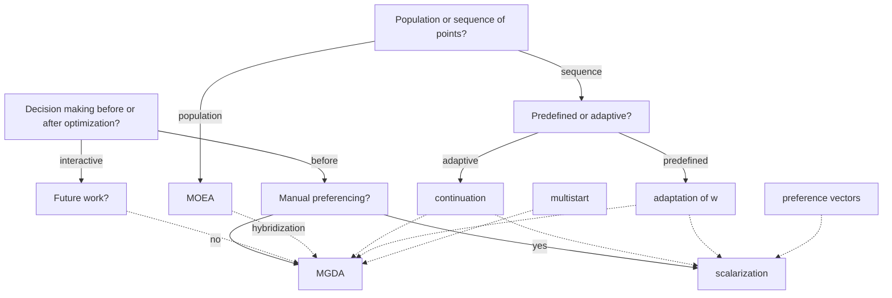
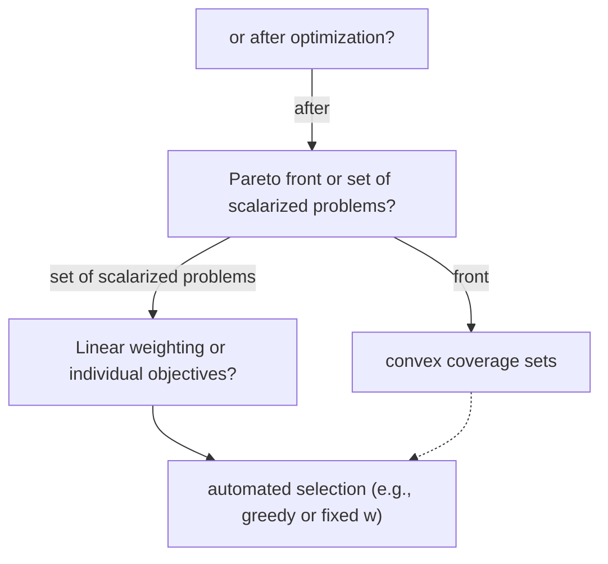

# Multi-objective Deep Learning: Taxonomy and Survey of the State of the Art

Sebastian Peitz and Sedjro Salomon Hotegni

Abstract—Simultaneously considering multiple objectives in machine learning has been a popular approach for several decades, with various benefits for multi-task learning, the consideration of secondary goals such as sparsity, or multicriteria hyperparameter tuning. However—as multi-objective optimization is significantly more costly than single-objective optimization— the recent focus on deep learning architectures poses considerable additional challenges due to the very large number of parameters, strong nonlinearities and stochasticity. This survey covers recent advancements in the area of multi-objective deep learning. We introduce a taxonomy of existing methods—based on the type of training algorithm as well as the decision maker’s needs—before listing recent advancements, and also successful applications. All three main learning paradigms supervised learning, unsupervised learning and reinforcement learning are covered, and we also address the recently very popular area of generative modeling.

Index Terms—Machine learning, deep learning, reinforcement learning, unsupervised learning, multi-objective optimization

## I. INTRODUCTION

Conflicting design or decision criteria are everywhere, and the challenge of identifying suitable decisions has been around for a very long time. To address this problem, we are looking for the set of optimal compromises—also called the Pareto set after the Italian economist Vilfredo Pareto. In simple terms, a decision is Pareto optimal if we are unable to further improve all objectives at the same time, but instead have to accept a trade-off if we want to further improve one of the criteria. In mathematical terms, this can be cast as a multi-objective optimization problem, see [120], [43] for detailed introductions. Problems of this type have been studied in a large number of fields, examples being political decision-making [175], medical therapy planning [94], the design of numerical algorithms [185], or the control of complex dynamical systems [136].

Very naturally, multiple criteria also arise in the area of machine learning, for instance if we want to solve multiple tasks with a single model, which results in several performance measures. Alternatively, we might be interested in secondary objectives such as sparsity/efficiency, robustness or interpretability. Specifically in the area of reinforcement learning, researchers have made strong arguments to intensify multi-objective research [146], [184]. However, since both multi-objective optimization and deep learning can be computationally expensive, their combination gives rise to particular

Both authors are with the Department of Computer Science, TU Dortmund, Dortmund, Germany, and with the Lamarr Institute for Machine Learning and Artificial Intelligence, e-mail: {sebastian.peitz, salomon.hotegni}@tudortmund.de.

challenges in terms of algorithmic efficiency and decisionmaking.

The goal of this survey paper is to provide a detailed overview of the state of the art in multi-objective deep learning. A large number of articles has appeared in recent years, and progress has been rapid. To keep an overview and ease the entry for researchers interested in—but until now less familiar with—multi-objective learning, we provide a taxonomy of the various approaches (Section III), before surveying the current state of the art in Section IV. We consider the three main learning paradigms supervised learning (IV-A), unsupervised learning (IV-B) and reinforcement learning (V—since this is a special case, we will discuss it separately), and we also provide an overview of generative modeling (IV-C), neural architecture search (IV-D) and successful applications of multiobjective deep learning (IV-E). Finally, we briefly comment on the vice-versa combination in Section VI, i.e., the usage of deep learning to enhance the solution of multi-objective optimization problems.

## II. PRELIMINARIES

Before introducing our taxonomy and survey to multiobjective deep learning we here give brief introductions to deep learning (II-A) and multi-objective optimization (II-B), respectively and highlight the specifics of multi-objective machine learning in Section II-C.

## A. Deep learning

This section’s main purpose is to introduce notation and to highlight the similarity between various areas of machine learning when it comes to training and optimization. We briefly cover supervised (II-A1) and unsupervised learning (II-A2) as well as generative modeling (II-A3). For much more detailed introductions, the reader is referred to one of the excellent text books [19], [69], [62], [20].

1) Supervised learning: The overarching theme in supervised learning is function approximation from examples. In other words, we want to approximate an unknown input-tooutput mapping $y = f ( x ) , f : \mathbb { R } ^ { n } \to \mathbb { R } ^ { m }$ , by a parametrized function $f _ { \theta } .$ Here, $\theta ~ \in ~ \mathbb { R } ^ { q }$ represents the (usually highdimensional) vector of trainable parameters. There exist many options how to construct $f _ { \theta } ,$ , such as polynomials, Fourier series, or Gaussian processes. The specialty in deep learning [96] is that $f _ { \theta }$ represents a deep neural network with ℓ layers, in which affine transformations (W, b) alternate with nonlinear activation functions σ:

$$
\begin{array}{l} z ^ {(0)} = x, \\ z ^ {(j)} = \sigma^ {(j)} \left(W ^ {(j)} z ^ {(j - 1)} + b ^ {(j)}\right), \quad j = 1, \dots , \ell , \\ y = z ^ {(\ell)}. \\ \end{array}
$$

All trainable weights are collected in $\boldsymbol { \theta } = \left\{ \left( W ^ { ( j ) } , b ^ { ( j ) } \right) \right\} _ { j = 1 } ^ { \ell } .$

Remark 1. Besides the just-mentioned classical feed-forward architecture, there are numerous other deep learning models used for function approximation such as convolutional networks, residual networks, or recurrent networks with feedback loops [62], [20]. However, the goal of this article is not to cover the details of deep learning models, but to shed light on the training with multiple criteria, which is why we are not going into more detail here.

To fit $f _ { \theta }$ to $f ,$ we use a dataset $\mathcal { D } = \{ ( x _ { i } , y _ { i } ) \} _ { i = 1 } ^ { N }$ of $N$ samples and minimize the empirical loss L:

$$
\theta^ {*} = \arg \min _ {\theta \in \mathbb {R} ^ {q}} L (\theta). \tag {1}
$$

A common choice for $L$ is the mean squared error, i.e.,

$$
L (\theta) = \frac {1}{N} \sum_ {i = 1} ^ {N} \| y _ {i} - f _ {\theta} (x _ {i}) \| _ {2} ^ {2},
$$

but there are numerous alternatives as well as additional terms (e.g., for regularization or sparsity [97]). Regardless of the specific choice, Problem (1) is a high-dimensional, nonlinear optimization problem. The typical approach to find $\theta ^ { * }$ (or at least a θ that yields a satisfactory performance) is gradient-based optimization using backpropagation, often in combination with stochasticity and momentum, as in the popular Adam algorithm [90] or adaptations thereof $( \mathrm { e . g . }$ [25]). Consequently, the gradient $\nabla L ( \theta )$ plays a central role in training.

2) Unsupervised and self-supervised learning: Unlike supervised learning, which depends on labeled data to model input-output relationships, unsupervised and self-supervised learning focus on extracting meaningful representations or patterns from unlabeled data [156], [164]. While unsupervised learning relies on directly identifying latent structures in the data [29], [40], [194], self-supervised learning uses surrogate tasks, derived from the data itself, to create labels and train models that can generalize to downstream tasks [64], [87].

The objectives in unsupervised learning often involve clustering [27], dimensionality reduction [154], or density estimation [193], formulated as optimization problems. Clustering focuses on partitioning a dataset $\bar { \mathcal { D } } \stackrel { } { = } \{ ( x _ { i } ) \} _ { i = 1 } ^ { N }$ into $N _ { C }$ clusters. A popular objective is to minimize intra-cluster variance while maximizing inter-cluster separation:

$$
\min _ {C _ {1}, \dots , C _ {K}} \sum_ {k = 1} ^ {N _ {C}} \sum_ {x _ {i} \in C _ {k}} \| x _ {i} - \mu_ {k} \| ^ {2}, \quad \mu_ {k} = \frac {1}{| C _ {k} |} \sum_ {x _ {i} \in C _ {k}} x _ {i},
$$

where $C _ { k }$ is the set of data points assigned to the $k ^ { \mathrm { { t h } } }$ cluster, and $\mu _ { k }$ is its centroid. Techniques like K-means and Gaussian Mixture Models (GMMs) [143] address this optimization.

Modern neural clustering approaches embed data into latent spaces, enhancing the flexibility and scalability of clustering methods [202], [101]. For dimensionality reduction, the goal is to find a lower-dimensional representation for highdimensional data, retaining as much information as possible [79]. Autoencoders, in particular, leverage neural networks to learn compressed representations by minimizing a reconstruction loss [117], [14], e.g.,

$$
\min _ {\theta , \phi} \sum_ {i = 1} ^ {N} \| x _ {i} - g _ {\phi} (f _ {\theta} (x _ {i})) \| _ {2} ^ {2},
$$

where $f _ { \theta } ( x ) ~ = ~ z$ encodes the input into a latent variable $z \in \mathbb { R } ^ { m }$ , and $g _ { \phi } ( z ) ~ = ~ \tilde { x }$ decodes the latent variable back to an output x˜ that is equal in size to the input. If we choose a small latent space dimension m and successfully optimize for a small loss $( { \mathrm { i . e . , ~ } } g _ { \phi } ( f _ { \theta } ( x _ { i } ) ) = { \tilde { x } } _ { i } \approx x _ { i } )$ , then we have successfully found an intrinsic, low-dimensional structure that encodes the information of the data set. In density estimation, probabilistic methods like Kernel Density Estimation (KDE) [30] and Variational Autoencoders (VAEs) [91], [92] model the underlying distribution of data. These methods provide insights into data regularities and outliers, making them useful for anomaly detection and data generation [128], [26] (see also the next Section II-A3 for details).

Self-supervised learning trains models by creating surrogate tasks, transforming unlabeled data into structured problems resembling supervised learning. These tasks encourage the model to learn representations that generalize well to downstream tasks. Common pretext tasks include contrastive learning and generative models [111], [95]. Self-supervised learning employs predictive tasks as well. Notable examples include predicting the next frame in a video [78], determining the rotation angle of an image [83], and reconstructing masked portions of input data [72]. Masked Autoencoders (MAEs) [72], for example, reconstruct masked inputs x by minimizing:

$$
L _ {\mathrm{MAE}} = \| x _ {\text {masked}} - g _ {\theta} (f _ {\phi} (x _ {\text {visible}})) \| _ {2} ^ {2},
$$

where $f _ { \phi }$ is the encoder that processes the visible patches xvisible to produce latent representations, and $g _ { \theta }$ is the decoder that reconstructs the masked input $x _ { \mathrm { m a s k e d } }$ from these representations. Problems in both unsupervised and self-supervised deep learning are commonly addressed through gradient-based optimization methods, where a loss function quantifying the task objective $( \mathrm { e . g . }$ , reconstruction error, contrastive loss) is minimized using backpropagation and stochastic gradient descent or its variants.

3) Generative modeling: The central goal of generative modeling (cf. [151] for a very clear and concise introduction) is to learn an unknown probability distribution X using training samples $x \sim \chi$ , the task is thus closely related to the self-supervised learning framework described in the previous section. To this end, one constructs a generative model $g : \mathbb { R } ^ { p }  \mathbb { R } ^ { n }$ that maps points $z \in \mathbb { R } ^ { p _ { . } }$ —drawn from a lower-dimensional, more tractable probability distribution $z -$ to x in such a manner that $g ( z ) \sim \mathcal { X }$ . As an example, consider a generator $g$ that maps points z drawn from a multivariate Gaussian distribution to images x in such a way that the generated images follow the same probability distribution as the training data. In other words, the set of generated images is statistically indistinguishable from the set of real images, since $p ( g ( z ) ) = p ( x )$ . Since the introduction of Generative Adversarial Networks (GANs) in 2014 by Goodfellow et al. [63] and of variational autoencoders by Kingma and Welling in 2013 [91] (see also the previous section II-A2), this area of machine learning has gained massive attention, with a large number of new architectures such as diffusion models [165], [148], and culminating in the recent wave of transformer-based architectures [188] and large language models (LLMs).

To draw the connection to gradient-based learning, let’s briefly consider the GAN architecture, which consists of a generator $g _ { \theta } : \mathbb { R } ^ { p }  \mathbb { R } ^ { n }$ and a discriminator $f _ { \phi } : \mathbb { R } ^ { n }  [ 0 , 1 ]$ both of which can be realized by deep neural networks. The task of the generator is to transform inputs $z \sim \mathcal { Z }$ into outputs $x ,$ while the discriminator’s job is to decide whether an input x has been drawn from a real dataset, or was created by the generator. It is thus a standard binary classifier predicting the probability that x is real. As a consequence, the two networks share the same loss function

$$
L _ {\mathsf {G A N}} (\theta , \phi) = \mathbb {E} _ {x \sim \mathcal {X}} \left[ \log (f _ {\phi} (x)) \right] + \mathbb {E} _ {z \sim \mathcal {Z}} \left[ \log (1 - f _ {\phi} (g _ {\theta} (z))) \right].
$$

The specialty is that the two networks are adversarials, meaning that the generator seeks to minimize $L _ { \mathsf { G A N } } \ ( \mathrm { i . e . , ~ t o ~ }$ fool the discriminator), while the discriminator wants to maximize $L _ { G A N }$ (that is, to perform correct classifications). Training thus usually alternates between gradient descent of $L _ { G A N }$ using the gradient with respect to $\theta ,$ and gradient ascent of $L _ { G A N }$ using the gradient with respect to $\phi ,$ i.e.,

$$
\theta^ {(i + 1)} = \theta^ {(i)} - \eta_ {\theta} \left(\theta^ {(i)}\right) \nabla_ {\theta} L _ {\mathsf {G A N}} \left(\theta^ {(i)}, \phi^ {(i)}\right),
$$

$$
\phi^ {(i + 1)} = \phi^ {(i)} + \eta_ {\phi} \left(\phi^ {(i)}\right) \nabla_ {\phi} L _ {\mathsf {G A N}} \left(\theta^ {(i)}, \phi^ {(i)}\right),
$$

where $\eta _ { \theta }$ and $\eta _ { \phi }$ are (potentially variable) learning rates. Training stops when this two-player game converges to an equilibrium.

## B. Multi-objective optimization

Again, this section covers only the basic concepts of multiobjective optimization. Much more detailed overviews can be found in [120], [43].

1) Definition and concepts: Consider the situation where instead of a single loss function, we have a vector with $K$ conflicting ones, i.e., $L ( \theta ) = [ L _ { 1 } ( \theta ) , \ldots , L _ { K } ( \theta ) ] ^ { \top }$ . The task thus becomes to minimize all losses at the same time, i.e.,

$$
\min _ {\theta \in \mathbb {R} ^ {q}} \left( \begin{array}{c} L _ {1} (\theta) \\ \vdots \\ L _ {K} (\theta) \end{array} \right). \tag {MOP}
$$

If the objectives are conflicting, then there does not exist a single optimal $\theta ^ { * }$ that minimizes all $L _ { k }$ . Instead, there exists a Pareto set $\mathcal { P }$ with optimal trade-offs, i.e.,

$$
\mathcal {P} = \left\{\theta \in \mathbb {R} ^ {q} \Bigg | \nexists \hat {\theta}: \begin{array}{l l} L _ {k} (\hat {\theta}) \leq L _ {k} (\theta) & \text {for} k = 1, \dots , K, \\ L _ {k} (\hat {\theta}) <   L _ {k} (\theta) & \text {for at least one} k \end{array} \right\}.
$$

In other words, a point $\hat { \theta }$ dominates a point $\theta ,$ if it is at least as good in all $L _ { k }$ , while being strictly better with respect to at least one loss. The Pareto set $\mathcal { P }$ thus consists of all nondominated points. The corresponding set in objective space is called the Pareto front $\mathcal { P _ { F } } ~ = ~ { L ( \mathcal { P } ) }$ . Under smoothness assumptions, both objects have dimension $K \mathrm { ~ - ~ } 1 ~ [ 7 3 ] , ~ \mathrm { i . e . } ,$ $\mathcal { P }$ and $\mathcal { P } _ { \mathcal { F } }$ are lines for two objectives, 2D surfaces for three objectives, and so on. Furthermore, they are bounded by Pareto sets and fronts of the next lower number of objectives [59], meaning that individual minima constrain a two-objective solution, 1D fronts constrain the 2D surface of a $K \ = \ 3$ problem, etc.

In deep learning, the most common situation is a very large number $q$ of trainable parameters, but a moderate number $K$ of objectives. It is thus much more common to visualize and study Pareto fronts instead of Pareto sets. Figure 1 shows three examples of a convex and a non-convex problem, as well as the special case of non-conflicting criteria.

text_image

L2
w(2)
w(1)
w(3)
L1
L2
w(1)
w(1)
w(1)
w(1)
L1
L2
L1*L2*
w(2)
w(1)
w(3)

Figure 1. Left: Example of a convex Pareto front, where each point has a unique tangent, i.e., weighting vector $\boldsymbol { w } ^ { ( i ) }$ . Middle: Non-convex front, where multiple points have the same tangent vector. Right: Non-conflicting objectives such that the Pareto front collapses.

2) Gradients and optimality conditions: Closely related to single-objective optimization, there exist first order optimality conditions, referred to as the Karush-Kuhn-Tucker (KKT) conditions [120]. A point $\theta ^ { * }$ is said to be Pareto-critical if there exists a convex combination of the individual gradients $\nabla L _ { k }$ that is zero. More formally, we have

$$
\sum_ {k = 1} ^ {K} \alpha_ {k} ^ {*} \nabla L _ {k} (\theta^ {*}) = 0, \quad \sum_ {k = 1} ^ {K} \alpha_ {k} ^ {*} = 1, \tag {KKT}
$$

which is a natural extension of the case $K = 1$

Equation (KKT) is the basis for most gradient-based methods (more details in Section II-B3a) and thus essential in the construction of efficient multi-objective deep learning algorithms. Their goal is to compute elements from the Pareto critical set,

$$
\mathcal {P} _ {c} = \left\{\theta^ {*} \in \mathbb {R} ^ {q} \Bigg | \exists \alpha^ {*} \in \mathbb {R} _ {\geq 0} ^ {K}, \sum_ {k = 1} ^ {K} \alpha_ {k} ^ {*} = 1: (\mathrm{KKT}) \text {holds} \right\},
$$

which contains excellent candidates for Pareto optima, since $\mathcal { P } _ { c } \supseteq \mathcal { P }$ . In a similar fashion to the single-objective case, there exist extensions to constraints [58], [52], but we will exclusively consider unconstrained problems here.

Remark 2 (Lipschitz continuous loss functions). An extension is required $i f$ we consider less regularity, i.e., Lipschitz continuity. In the context of deep learning, this is the case for activation functions with kinks $( e . g . , \mathrm { R e L U } ( x ) = \operatorname* { m a x } \{ 0 , x \} )$ or when considering $\ell _ { 1 }$ regularization terms $( \lVert \boldsymbol { \theta } \rVert _ { 1 } = \sum \left| \theta _ { i } \right| )$ cf. Figure 2. Then, subdifferentials $\partial L _ { k }$ take the place of the gradients $\nabla L _ { k }$ (cf. [33] for a detailed introduction), and the condition (KKT) is replaced by a non-smooth KKT condition

$$
0 \in \operatorname{conv} \left(\bigcup_ {k = 1} ^ {K} \partial L _ {k} (\theta^ {*})\right), \tag {2}
$$

which reduces to (KKT) for all $\theta ^ { * }$ where the $L _ { k } ( \theta ^ { * } )$ are smooth, i.e., outside $\theta = 0$ in the exemplary Figure 2 below.

text_image

ReLU(θ)
θ
|θ|

Figure 2. $\ell _ { 1 }$ norm and ReLU activation function for $\theta \in \mathbb { R } .$

3) Overview of methods: There exists a large number of conceptually very different methods to find (approximate) solutions of (MOP). The first key question is—and this will come up again in our taxonomy—whether we put the decisionmaking1 before (II-B3a) or after (II-B3b) optimization, or even consider an interactive approach (II-B3c).

a) Computing individual Pareto optima: When computing a single Pareto optimal (or critical) point, this means that some decision has been made beforehand to guide which point $\theta ^ { * }$ is sought. The two main approaches are to actively decide by means of a parameter-dependent scalarization, or to accept any optimal point, i.e., to leave the decision-making to chance.

In the former case, we synthesize the loss vector $L ( \theta )$ into a single loss function $\hat { L } ( \theta ) \in \mathbb { R }$ , meaning that we scalarize the optimization problem, see [119], [43] for detailed overviews. As a consequence, we can leverage the entire literature on single objective algorithms such as gradient descent or (Quasi-)Newton methods.

Scalarization requires the selection of a set of weights w. In many cases, we have $w \in \mathbb { R } ^ { K }$ , i.e., as many weights as we have objectives. The simplest technique is the weighted sum

$$
\hat {L} (\theta) = \sum_ {k = 1} ^ {K} w _ {k} L _ {k} (\theta), \tag {WS}
$$

which is also implicitly used in all sorts of regularization techniques (e.g., min $L ( \theta ) + \lambda \| \theta \| _ { 2 } ^ { 2 } , \lambda \in \mathbb { R } _ { > 0 }$ . Then, $w _ { 1 } =$ $1 / ( 1 + \lambda )$ and $w _ { 2 } = \lambda / ( 1 + \lambda ) )$ . Geometrically, the weights w define hyperplanes determining which point on the front we will find. This is visualized in Figure 1, where we also see that non-convex problems immediately result in non-uniqueness. There are thus many, more sophisticated alternatives to (WS) such as the ϵ-constraint method, where all objectives but one are transformed into constraints:

$$
\min _ {\theta \in \mathbb {R} ^ {q}} L _ {k} (\theta) \quad \text {s.t.} \quad L _ {i} (\theta) \leq \epsilon_ {i} \forall i \in \{1, \dots , K \} \setminus k. \tag {3}
$$

1Decision-making refers to the selection of a particular element of P, either once or interactively to react to changing circumstances. It is a topic of its own [182], but we will not further study the decision-making process here.

Alternatively, preference vectors [180], [44] (also known under the name Pascoletti-Serafini [134]) are highly popular. This approach is visualized by the triangles in Figure 3, where the optimization problem is transformed into stepping as far as possible along the direction defined by the preference vector. While these advanced techniques beyond (WS) are capable of handling non-convex problems, they usually introduce more challenging single-objective problems due to additional constraints (cf. (3)).

scatter

| Series | L1 (range) | L2 (range) |
| --- | --- | --- |
| Circle | 0~95 | 0~95 |
| Square | 35~65 | 40~75 |
| Triangle | 0~60 | 20~60 |

Figure 3. Sketch of different multiobjective optimization concepts. Entire front $\mathcal { P } _ { \mathcal { F } }$ via hypervolume maximization (circles) or single point via gradient descent (squares) or preference vector scalarization (triangles).

As an alternative, multiple-gradient descent algorithms (MGDAs) are increasingly popular, in particular when it comes to very high-dimensional problems. The key ingredient is the calculation of a common descent direction $\boldsymbol { d } ( \theta ) ~ \in ~ \mathbb { R } ^ { q }$ that satisfies

$$
(\nabla L _ {k} (\theta)) ^ {\top} d (\theta) <   0, \quad k \in \{1, \dots , K \},
$$

which again is a straightforward extension of single-objective descent directions. The determination of such a d usually requires the solution of a subproblem in each step, for instance a quadratic problem of dimension K [155], [42],

$$
\begin{array}{l} d (\theta) = - \sum_ {k = 1} ^ {K} w _ {k} \nabla L _ {k} (\theta), \qquad \text { where } \\ w = \arg \min_{\substack{\hat{w}\in [0,1]^{K}\\ \sum \hat{w}_{k} = 1}}\left\| \sum_{k = 1}^{K}\hat{w}_{k}\nabla L_{k}(\theta)\right\|_{2}^{2}. \tag{CDD} \\ \end{array}
$$

However, there are various alternatives to (CDD) such as a dual formulation [51] or a computationally cheaper socalled Franke-Wolfe approach [161]. Once a common descent direction $d ( \theta )$ has been obtained, we proceed in a standard fashion by iteratively updating θ until convergence or some other stopping criterion is met, cf. Algorithm 1 as well as the squares in Figure 3 for an illustration. Various extensions concern Newton [50] or Quasi-Newton [140] directions, uncertainties [137], momentum [179], [168], [132], or nonsmoothness [119], [57], [178], [179].

As laid out at the beginning of this section, this approach omits the decision-making. MGDAs yield Pareto critical points $\theta ^ { \ast } \in \mathcal { P } _ { c } ,$ but one usually cannot determine which one, and

Algorithm 1 Multiple-gradient descent algorithm (MGDA)

Require: Initial guess  $\theta^{(0)}$ , learning rate  $\eta \in R_{&gt;0}$  (possibly adaptive), maximum number of iterations  $i_{max}$ , hyperparameters (depending on specific version of MGDA)

Ensure: $\theta ^ { \ast } \in \mathcal { P } _ { c }$

Set $i = 0$
while $\theta^{(i)} \notin \mathcal{P}_c$ and $i &lt; i_{\max}$ do
    Calculate gradients $\nabla L_i(\theta^{(i)})$ for $i = 1 \ldots, k$
    Calculate descent direction $d(\theta^{(i)})$ (e.g., via (CDD))
    If adaptive, determine learning rate $\eta(\theta^{(i)})$
    Update $\theta$:

$$
\theta^ {(i + 1)} = \theta^ {(i)} + \eta \left(\theta^ {(i)}\right) d \left(\theta^ {(i)}\right)
$$

7: $i = i + 1$

8: end while

how the different goals are prioritized in that point. To achieve this, one needs to resort to hybrid approaches including, $\mathrm { e . g . }$ preference vectors [208].

b) Computing the entire set: If we want to postpone the decision-making to take a more informed decision, we need to calculate the entire Pareto set $\mathcal { P }$ and front $\mathcal { P } _ { \mathcal { F } }$ . The most straightforward approach is to adapt the weights w in scalarization and solve the single-objective problem multiple times. Alternatively, one can combine MGDA with a multistart strategy (i.e., a set of random initial guesses $\left\{ \theta ^ { \left( 0 , j \right) } \right\} _ { j = 1 } ^ { M } )$ to obtain multiple points. However, in both cases, it may be very hard or even impossible to obtain a good coverage of ${ \mathcal P } ,$ i.e., that approximates the entire set with evenly distributed points.

Remark 3 (Box coverings). An alternative to approximating P by a finite set of points is to introduce an outer box covering (see, e.g., [159], [38]). In theory, the numerical effort for a suitably fine covering grows exponentially with the dimension of the object we want to approximate $( i . e . ,$ with the number of objectives K), but is independent of the parameter dimension q. This is good for the common case of few objectives. However, in practice, set-based numerics often also scale with q due to the need to represent the boxes via Monte Carlo sampling, thus rendering them too expensive for applications in machine learning.

Instead of parameter variation or using multi-start, we can directly consider a population of weights $\left\{ \theta ^ { \left( j \right) } \right\} _ { j = 1 } ^ { M }$ that we iteratively update to improve each individual’s performance while also ensuring a suitable spread over the entire front $\mathcal { P } _ { \mathcal { F } }$ . The population’s performance is often measured by the hypervolume metric (see, e.g., [9]), which is also visualized in Figure 3. This is defined as the union of the boxes spanned by some reference point (shown in black) and one of the population’s individuals, respectively. One can attempt to directly maximize this metric, for instance using Newton’s method [169], see also the survey [11] for for an extensive introduction.

The more popular alternative when optimizing an entire population is via multi-objective evolutionary algorithms (MOEAs) [34], see Figure 4 for an illustration and Algorithm 2 for a rough algorithmic outline. Therein, the pupulation’s fitness is increased from generation to generation by maximizing a criterion that combines optimality (or non-dominance) with a spreading criterion. The most popular and widely used algorithm in this category is likely NSGA-II [35], but there are many alternatives regarding the crossover step (Step 3 in Algorithm 2), mutation (Step 4), the selection (Step 5), the population size, and so on. For more details, see the surveys [53], [209], [181]. Finally, many combinations exist with—for instance—preference vectors [180] or gradients [21], [132], such that the creation of offspring is more directed using gradient information.

scatter

| Series | L1 (range) | L2 (range) |
| --- | --- | --- |
| Black Square | 0.3~0.9 | 0.6~1.0 |
| Grey Circle | 0.2~0.8 | 0.4~0.9 |
| White Square | 0.1~0.7 | 0.2~0.6 |
| White Triangle | 0.1~0.8 | 0.3~0.8 |
| White Square | 0.1~0.6 | 0.1~0.5 |

Figure 4. MOEA example, where a population of individuals is improved from one generation to the next $( \pmb { \bigtriangledown }  \overset { ^ { \bullet } } { \bigcirc }  \bigtriangleup  \bigtriangledown )$

## Algorithm 2 Multi-objective evolutionary algorithm (MOEA)

Require: Initial population $P ( 0 )$ of individuals $\left\{ \theta ^ { \left( 0 , j \right) } \right\} _ { j = 1 } ^ { M } ,$ number of generations $i _ { \mathrm { { m a x } } } ,$ , hyperparameters (depending on specific version of MOEA)

1: Set $i = 0$  
2: while $i < i _ { \mathrm { m a x } }$ do  
3: Create an offspring population $\widehat { P } ( i )$ out of $P ( i ) , \mathrm { e . g . }$ •, using crossover between two individuals  
4: Modify offspring population via mutation:

$$
\widetilde {P} (i) = \mathcal {M} \left(\widehat {P} (i)\right)
$$

5: Selection of the next generation $P ( i + 1 )$ either from $\widetilde P ( i )$ or from $P ( i ) \cup \widetilde { P } ( i )$ (the latter is called elitism) by a survival-of-the-fittest process (e.g., using a non-dominance and spread metric)

6: $i = i + 1$

7: end while

A final technique falling into the category of approximating the entire Pareto set by a finite set of points is continuation. Rewriting the condition (KKT) as a zero-finding problem,

$$
H (\theta^ {*}, \alpha^ {*}) = \binom{\sum_ {k = 1} ^ {K} \alpha_ {k} ^ {*} \nabla L _ {k} (\theta^ {*})}{\sum_ {k = 1} ^ {K} \alpha_ {k} ^ {*} - 1} = 0,
$$

we find that under suitable regularity assumptions (i.e., twice continuously differentiable losses), the implicit function theorem says that the zero level set of H is a smooth manifold of dimension $K - 1 \ [ 7 3 ] .$ The tangent space can be computed from the kernel of the Jacobian $\bar { H ^ { \prime } } ( { \theta ^ { * } } , \bar { \alpha ^ { * } } ) \in \mathbb { R } ^ { q + 1 \times q + \hat { K } }$

$$
H ^ {\prime} (\theta^ {*}, \alpha^ {*}) = \left( \begin{array}{c c c c c} \sum_ {k = 1} ^ {K} \alpha_ {k} ^ {*} \nabla^ {2} L _ {k} (\theta^ {*}) & L _ {1} (\theta^ {*}) & \ldots & L _ {K} (\theta^ {*}) \\ 0 & \ldots & 0 & 1 & \ldots & 1 \end{array} \right).
$$

The procedure is then to start from a known Pareto optimum, compute a predictor within the tangent space and then compute the next Pareto critical point through a corrector step $( \mathrm { e . g . }$ using MGDA), see Figure 5 and Algorithm 3. However, in addition to the gradients, we also require the Hessians of all loss functions. These are $q \times q$ matrices and thus expensive to calculate as well as to store. In addition, the $C ^ { 2 }$ regularity is violated by many network architectures (e.g., when using ReLU activations) or loss functions. An extension to Lipschitz continuous objectives can be found in [18], even though it is computationally even more expensive.

  
Figure 5. Continuation algorithms use predictor steps $\widetilde { \theta }$ along the tangent space of ${ \mathcal { P } } _ { c } ,$ i.e., in parameter space (left). A corrector step then produces the next Pareto optimal point. The right plot shows the corresponding points in the objective space.

## Algorithm 3 Continuation

Require: Initial Pareto critical point $\theta ^ { ( 0 ) }$ and KKT multiplier $\alpha ^ { ( 0 ) }$ , hyperparameters

1: Set $j = 0$  
2: while other end of front has not been reached do  
3: Compute tangent space in $\theta ^ { ( j ) }$ using kernel vectors of the weighted Hessian matrix $H ^ { \prime } ( \theta ^ { ( j ) } , \bar { \alpha ^ { ( j ) } } )$  
4: Predictor step along the tangent space $\to { \widetilde { \theta } } ^ { ( j + 1 ) }$  
Corrector step to obtain the next Pareto critical point θ(j+1)  
6: $j = j + 1$  
7: end while

c) Interactive methods: Regardless of the order of decision-making and optimization, all previously mentioned approaches can be implemented in a block-wise manner, i.e., a single run of an algorithm. Instead, interactive methods (e.g., [119], [47], [94], [158]) alternate between decision-making and optimization. The approach usually starts from a Pareto optimum. Then, based on the preference of the decision maker (e.g., “improve objective $L _ { 1 }$ , do not get worse in $L _ { 2 } ,$ but a drop in $L _ { 3 }$ is acceptable”), we compute another Pareto optimum that respects this prioritization. Very naturally, these algorithms have a close relation to continuation methods, where the decision maker’s preference needs to be translated into a suitable predictor direction in the tangent space.

## C. Multi-objective machine learning

The combination of multi-objective optimization and machine learning has been studied for several decades already, see [80], [81] for overviews. While the combination is a very natural one due to various performance criteria that are relevant in learning models from data, the focus has mostly been on other types of machine learning than deep neural networks. From the authors’ point of view, the main reason is the large computational cost that comes with both multiobjective optimization and deep learning, which renders their combination very challenging. In Table I, we list the main pros and cons of various MO techniques when it comes to deep learning, in particular concerning the large computational cost.

Table I PROS AND CONS OF VARIOUS CLASSES OF MULTI-OBJECTIVE OPTIMIZATION ALGORITHMS. THE MAIN COMPUTATIONAL CHALLENGES IN THE CONTEXT OF DEEP LEARNING ARE SHOWN IN BOLD.

<table><tr><td>Algorithm class</td><td>Advantages</td><td>Challenges</td></tr><tr><td>MOEAs</td><td>+ often gradient-free+ global optimization</td><td>- large # of fcn. evals.- slow convergence</td></tr><tr><td>Scalarization</td><td>+ single-objective opt.</td><td>- parametrization via  $w$ - additional constraints</td></tr><tr><td>MGDA</td><td>+ convergence similar to single-objective opt.</td><td>- no steering- sub-routine for direction- single optimum</td></tr><tr><td>Continuation</td><td>+ fast convergence</td><td>- req. smoothness:  $C^{2}$ - Hessian calculation- only connected fronts</td></tr></table>

Thus—before turning our focus on deep learning in the next section—we here want to give a brief list of ways to incorporate multi-objective optimization with machine learning:

• Feature selection [162], [60], [4],  
• hyperparameter tuning [84], [125],  
• architecture search [82],  
• data imputation [113]  
• training with respect to multiple objectives, for instance, support vector machines [174], [10], decision trees, bayesian classifiers, radial basis function networks, or clustering (see also the references in [80], [81], [6]).  
• multi-objective clustering [7], [61], [122]

As in particular the last point sets deep learning apart from other machine learning techniques, this will be the focus of our taxonomy in the next Section.

Remark 4. It should be noted that there already exist several surveys on the topic of multi-objective machine learning, specifically in the context of MOEAs [6], [181] and hyperparameter tuning [125], [84]. Moreover, three articles have introduced taxonomies of multi-objective reinforcement learning algorithms [106], [70], [48], which share similarities with our classification in the next section. Nevertheless, we believe that this article closes a gap in particular in the areas of deep neural network training and gradient-based approaches (i.e., MGDAs), which are still less popular in the optimization community than MOEAs.

## III. A TAXONOMY OF MULTI-OBJECTIVE DEEP LEARNING

Before we introduce our taxonomy for the multi-objective training procedure of deep neural networks in Section III-A, let us first distinguish between the various purposes of multiobjective optimization in deep learning. These are, in no particular order,

(i) preprocessing steps such as feature selection or data imputation,  
(ii) the treatment of multiple primary tasks such

• multi-task learning,  
• multi-class classification,  
• clustering with respect to multiple criteria,  
• multiple rewards in reinforcement learning,

(iii) the consideration of secondary tasks, e.g.,

• regularization,  
• sparsity,  
• fairness,  
• interpretability,  
• incorporation of prior knowledge,

(iv) using multi-objective optimization as a tool to improve the performance of a deep learning task.

While these are quite versatile tasks, they share the common structure that a multi-objective optimization problem of the form (MOP) needs to be solved, for which one can pursue various strategies.

## A. Taxonomy of the training procedure

Figure 6 shows our taxonomy of multi-objective optimization methods for deep learning problems. In the following, let’s discuss various alternatives while taking into account the advantages and challenges highlighted in Table I.

Before diving in, it should be noted that scalarization takes a special role since we essentially eliminate the multi-objective nature of the problem, which allows us to leverage many techniques from single-objective optimization. In particular, the weighted sum approach (WS) introduces no additional constraints and is implicitly being used whenever penalty terms are added, e.g., for regularization or sparsity. ϵ constraint (3) or the Pascoletti-Serafini render the optimization significantly more challenging due to the constraints, which is why they are much less common in the context deep learning.

Turning our attention to the taxonomy in Figure 6, the first decision one has to take is whether the entire Pareto front is desired, or if we are instead satisfied with a single optimal compromise. The former results in substantial additional cost, which is why the deep learning community has until now mostly opted for the “decide-then-optimize” strategy. Besides the just-mentioned simple weighted-sum approach, MGDA is by far the most popular option, since—aside from the need to solve (CDD) (or a similar sub-problem) instead of simply calculating a single gradient—it allows us to use all the existing machinery for gradient-based training, i.e., momentum, stochastic gradients, etc.

In the case of “optimize-then-decide”, there currently appear to be two similarly popular approaches. First, evolutionary algorithms are extremely popular and at the same time easy to use, which is why they are a natural choice for a first attempt at multi-objective optimization. However, due to their large cost and otherwise slow convergence, a hybridization with gradients is advisable in the context of deep learning. Second, scalarization problems can easily be used to find multiple Pareto optima simply by varying the weight vector w. This has been used extensively, in particular in combination with the weighted sum. When it comes to continuation, there is until now little work, as the computational cost associated with second order information can quickly become prohibitively large.

The third option of interactive multi-objective deep learning has—to the best of our knowledge—not yet been explored with multiple objectives. Research in this area is also known as interactive machine learning (IML) [17], [23] or humanin-the-loop (HITL) [196], [126]. However, most concepts are related to active learning or to human intermediate tasks such as data annotation, or human feedback for interpretability or performance improvement.2 A research direction such as interacting with a decision maker in terms of design criteria— as is popular in other multi-objective contexts [119], [94], [47], [158]—remains a task for future research.

Remark 5 (Special role of reinforcement learning). Due to its sequential decision-making character, reinforcement learning is fundamentally different from the other learning paradigms. The goal is to find a policy π from interaction with a system, which means that presenting a Pareto front to a human decision maker is not the scenario RL is intended for. Common themes in multi-objective RL are thus decide-then-optimize (i.e., the left branch of Figure 6), known under the term singlepolicy algorithms. Besides, multiple-policy algorithms follow the right branch in spirit, but the “population” in that context is usually a set of value or Q functions. The decision-making is then performed online, based on an algorithmic decision rule or user-defined weighting. Due to this reason, we will cover this case separately in Section V as a special case.

## IV. MULTI-OBJECTIVE DEEP LEARNING SURVEY

Following the taxonomy in Figure 6, the goal of this section is to provide an overview of the current state of the art, and we are going to separate the contributions according to the different learning paradigms introduced in Section II-A. Before we dive in, we would like to highlight the various types of objectives that can be pursued with multi-objective optimization. There are multiple reasons to treat deep learning as a multi-objective problem, despite the increased cost:

(i) the consideration of multiple, equally important criteria, for example in the context of

• multi-task learning,  
• multi-class classification,

(ii) trade-offs between different performance indicators, e.g., fairness versus bias,  
(iii) balancing of knowledge and data, for instance in the field of physics-informed machine learning,

flowchart

Figure 6. Taxonomy of methods. The squares denote design decisions, the ellipses denote classes of algorithms. Dashed ellipses refer to extensions building on other algorithms. In the context of deep learning, gradient-descent (i.e., MGDA) lies at the heart of most successful approaches.

(iv) inclusion of secondary objectives such as

• sparsity / regularization paths,  
• interpretability,

(v) multi-objective optimization as a performance-enhancing paradigm.

Remark 6 (A note on overparametrization). It is well known that many deep learning architectures possess such a large number of degrees of freedom that they can essentially fit any label structure. This phenomenon is known as overparametrization [130]. A side-effect of this phenomenon in the context of multi-objective learning is that in the case of very powerful function approximators (i.e., large networks), one can in principle resolve the conflict between different objectives. This means that for some tasks such as multitask learning, the Pareto front collapses to a single point, cf. Figure 1 on the right. An example of this can be found in the MultiMNIST example in [161].

## A. Supervised learning

1) Multiobjective Gradient Descent Algorithms: The huge success of machine learning has also had a strong impact on the optimization community and the research directions pursued therein. For example, stochastic gradient descent has been widely studied. Even though these studies do not all consider deep learning problems, they have expensive problems (such as deep neural network training) in mind, for instance when developing multi-objective extensions of stochastic gradient descent [110], momentum-based algorithms for accelerated convergence [179], [168], [167], [132], or combinations thereof as in the multi-objective Adam algorithm [123].

Other works directly consider deep learning applications, a very prominent example being [161]. Therein, a so-called Frank Wolfe routine was presented that replaces the subroutine (CDD) in Algorithm 1 with a cheaper version. This method is then used to train a deep neural network with a shared parameter section for representation learning, followed by task-specific layers for the individual tasks (here the identification of multiple handwritten digits). Interestingly, there appears to be no conflict between the two tasks, which we believe is due to the overparametrization effect mentioned in Remark 6. Alternative gradient-based frameworks for deep multi-task are PCGrad [205]—where each task’s gradient is projected onto the normal plane of the other gradients to avoid expensive sub-problems such as (CDD)— or CAGrad [105], where (CDD) is replaced by a (rather similar) formulation that tries to reduce conflicts between the individual tasks. In [112], the Stein Variational Gradient Descent (SVGD) algorithm from [109] is extended to multiple objectives and tested on a large number of different problems such as accuracy-vsfairness or multi-task learning. In the NashMTL procedure [129], multi-task learning is considered from a game-theoretic perspective, more precisely as a bargaining game.

Several authors have extended the basic MGDA procedure to obtain an approximation of the entire front. For instance in [103], a multi-start, constrained version of MGDA is developed, where disjoint feasible cones ensure a good spread, see Figure 7 for an illustration. In [112], Langevin dynamics are used to ensure a good spread within a population of individuals that are iterated via the SVGD algorithm.

text_image

L₂
L₁

Figure 7. Pareto multi-task learning, where a population of points is optimized via MGDA, but each individual is restricted to an individual cone [103].

2) Scalarization: In the area of scalarization, the vast majority of deep learning algorithms simply uses the weighted sum whenever more than a single loss is considered, such as additional regularization terms, or different loss contributions such as physics and data loss in physics-informed machine learning [85]. Very often, this is simply done without naming it multi-objective optimization, as it is such a common theme. In the following, we will discuss scalarization techniques going beyond this weighted sum approach. For instance, in [104], the weighted sum is used but modified in terms of a dynamic weighting strategy over the iterations, such task losses are balanced efficiently. A so-called conic scalarizaiton techinque [86] which—loosely speaking—is a more sophisticated version of the weighted sum, is used in [75] for multi-objective encoder training to balance performance and adversarial robustness in image classification.

To obtain a good coverage of the entire front, the weighted sum weights are adaptively selected via the so-called Non-Inferior Set Estimation procedure in [142], which is a type of bisection method so that the points are better distributed. As an example, they consider a multinomial loss versus $L _ { 2 }$ regularization. Weighted Chebyshev scalarization is used for multi-task learning in [74], combined with proximal gradient descent to take sparsity into account as the third objective. In [150] a weighted sum loss is balanced with a cosine similarity in order to improve the spread of points when varying the weight w.

3) MOEAs: As laid out earlier, MOEAs are in most cases too expensive for deep neural network training. The number of generations (S in Algorithm 2) is usually very large, and so is the population size M. As a consequence, MOEAs tend to require a very large number of function evaluations. Moreover, the crossover procedure often consists of randomly combining two individuals, which is a close-to-hopeless procedure for the parameter dimensions we find in realistic deep leraning applications. As a consequence, the usage of MOEAs is restricted to hybridized versions (cf. our taxonomy in Figure 6) as is for instance done in [112], where Langevin dynamics ensure a good spread of a population that is iterated using MGDA. Alternatively MOEAs can be used for other tasks in the context of deep learning such as neural architecture search ([46], more details in Section IV-D) or the the selection between different networks. This was done in [24] for multiple association rule learning to foster interpretability.

4) Continuation: Similar to MOEAs—but due to a different reason—continuation methods suffer from large computational cost that tends to be prohibitive for deep learning applications. We have seen in Section II-B3b that continuation requires the Hessians of all loss functions, which are expensive to calculate as well as to store. To this end, research has mostly focused on very specific settings such as the regularization path between a main loss and the sparsifying $\ell _ { 1 }$ norm $\| \theta \| .$ 1 [54], [18], [55]. Besides, there are two approaches trying to avoid Hessian computation. In [116], Hessians are approximated using the Krylov subspace method MINRES, whereas in [8], the minimization of one of the objectives is used as a suboptimal proxy for the predictor step.

## B. Unsupervised and self-supervised learning

When acquiring labeled data is expensive or impractical, unsupervised and self-supervised learning methods offer novel opportunities in deep learning to balance diverse objectives.

1) Scalarization: A foundational approach is the simple summation of losses, where individual losses are combined using fixed weights [65], [166], [100], [115]. Beyond straightforward loss aggregation, scalarization methods provide a more sophisticated way to balance objectives by converting them into a single scalarized loss. For instance, [190] introduced an unsupervised active learning approach that integrates representativeness, informativeness, and diversity, while [31] employed a Pareto self-supervised training approach to harmonize selfsupervised and supervised tasks in few-shot learning. These methods highlight the potential of scaling objectives to address problem-specific priorities.

2) Adaptive weighting: Unlike scalarization, adaptive weighting dynamically adjusts the importance of objectives throughout the training process. For example, [121] proposed self-adjusting weighted gradients to optimize the hypervolume in multi-task settings, demonstrating its application with denoising autoencoders. In [149], it is explored how ensemble methods can enhance self-supervised learning by adaptively weighting losses across ensembled projection heads during training.

3) Evolutionary algorithms: Since MOEAs tend to be too expensive for direct network optimization, [108] instead developed a structure-learning algorithm for deep neural networks based on multi-objective optimization, employing evolutionary strategies to identify optimal network architectures (see also the related Section IV-D on neural architecture search). Expanding on this, [71] integrated generative adversarial networks (GANs) with evolutionary multi-objective optimization, demonstrating how GANs can enhance the exploration of diverse solutions in high-dimensional spaces. Combining selfsupervised representation learning with evolutionary search, [197] developed a technique to discover optimal properties in an implicit chemical space.

Besides the above-mentioned references, the following studies address multi-objective optimization for unsupervised learning tasks such as feature selection [60], [4], [118], [171], [68] and clustering [61], but they do not explore their applicability to deep neural networks.

## C. Generative modeling

Generative modeling is currently one of the most popular areas of machine learning. Until now, the number of contributions with an explicit multi-objective treatment is rather limited, most of them in the area of generative adversarial networks. The works [41], [5] consider multiple discriminator networks, even though they are not trained using multiobjective optimization. In [191], several GANs are weighted using the weighted sum method to have better control over the generated output. Adaptive weighted-sum-like approaches for multi-task training of multi-adversarial networks were developed in [67], [56], and multi-adversarial domain adaptation via the weighted sum in [135].

There are even fewer articles in other domains of generative modeling. In [191], a reference-point scalarization— very similar to reference vector methods—was used for multiobjective training of variational autoencoders that create data according to multiple criteria [191]. Diffusion models were trained with respect to multiple criteria using MGDA in [204], and the multi-objective treatment of multiple judges for LLM feedback during the training phase was studied [199], where again weighted sum scalarization was used. It can thus be concluded that there is plenty of room for research in multiobjective generative modeling, be it with respect to more advanced optimization techniques beyond the weighted sum, or regarding advanced modeling approaches.

## D. Neural architecture search

Besides the direct use of multi-objective optimization algorithms for deep learning, which may be prohibitively expensive in many cases, one can also use multi-objective optimization on a meta level. Similar to algorithm selection techniques, neural architecture search (see [46] for a detailed overview in the single-objective case) describes the task to select the best neural network architecture for a given learning problem with respect to criteria such as predictive performance, inference time, or number of parameters. In this area, MOEAs such as NSGA-II are a popular choice, e.g., [82], [45], [201]. However, when using hypernetworks instead, this approach can be accelerated as well, for instance using MGDA [170], [89].

## E. Applications

Before concluding, we here list a couple of applications, where multi-objective deep learning has proven to be helpful or even superior to the more established single-objective counterpart. This list is likely not exhaustive, but we will make an attempt to demonstrate the versatility of multi-objetive deep learning in various areas.

1) Language and video analysis and enhancement: Machine learning in the area of language, audio and video data is characterized by large amounts of data and long time series. Applications of multi-objective concepts to speech include the multi-target training of long-short-term memory networks for speech enhancement [172], [200] or multi-objective speech recognition [153]. In the context of video data, the summarization, streaming optimization and short video generation was studied [39], [133] and [198], respectively. For natural language processing, applications include text summation [152], text generation [139] prompt engineering for LLMs [12], meta-learning in terms of multi-objective LLM selection [98], and the multi-objective treatment of multiple judges for LLM feedback during the training phase [199]. Finally, multiobjective adversarial gesture generation by weighting various discriminators was studied in [49].

2) Engineering applications: This section covers all sorts of technical applications beyond video and language. For instance multi-task learning was used for for phoneme detection in [160], a generative model for air quality and weather prediction was trained in [67], medical image denoising by GANs trained with multiple discriminators was realized in [56], and multi-objective deep reinforcement learning was successfully used for workflow scheduling in [192].

3) Physics-informed machine learning: Finally, we would like to highlight the area of scientific machine learning, which has received tremendous attention in recent years. More specifically, physics-informed neural networks (PINNs) [85] are models that predict the solution of a differential equation. These are equations describing the dynamics of complex systems such as robots, fluid mechanics or nuclear fusion. The solution to such a differential equation is a function, the state of the system u depending on time t (and often on space s as well), $u ( t , s )$ . The goal of PINNs is now to approximate $u ( t , s )$ by a neural network that takes t and s as inputs, and produces u as the output. Since the underlying equations are very often known, on can define a physics loss, meaning that the output satisfies the differential equation at a number of random points in the space-time domain. Generalization then ensures that $f _ { \theta } ( t , s ) \approx u ( t , s )$ for all t and s.

PINNs are a natural playground for multi-objective optimization, since we often have both physical knowledge and data, such that we have two losses that we would like to satisfy at the same time [85]. For clean data and exact dynamics, these objectives are not in conflict [3], but this is seldom the case for real applications, where data is noisy, the system equations are approximations, or the domain of interest cannot be defined exactly (e.g., the flow inside the human heart). In this area, multi-objective optimization has the potential to become quite important, even though research has now been limited to weighted sum training [144], as well as a comparison between MGDA and MOEA [3] for a few relatively small sample problems.

## V. DEEP MULTI-OBJECTIVE REINFORCEMENT LEARNING

Due to its sequential decision-making nature, reinforcement learning (RL—see [173], [16] for excellent overviews) takes a special role in the field of machine learning, with concepts that often differ significantly from the other learning paradigms. Nevertheless, it also shares features such as heavy usage of deep neural network function approximators or gradient-based learning. In the following, we thus briefly cover the basics of RL, before addressing modifications to our taxonomy in the context of RL and surveying the literature on deep multiobjective RL.

## A. Basics

In contrast to supervised learning, RL follows a trial-anderror philosophy. That is, an agent interacts with its environment through actions $a \in { \mathcal { A } }$ and receives a reward $r \in \mathbb { R }$ indicating whether the action was beneficial or not. Through the action, the system state $s \in S$ changes from time t to t + 1 in a probabilistic manner according to the transition operator $\mathcal T : \mathcal S \times \mathcal A  \mathcal P ( \mathcal S )$ . Since the dynamics is independent of past states3, this setting is referred to as a Markov Decision Process (MDP).

The goal in RL is to find a policy $\pi : \mathcal { S }  \mathcal { P } ( \mathcal { A } )$ that maximizes the sum of discounted future rewards (with discount factor $\gamma \in ( 0 , 1 ] )$ , also referred to as the value:

$$
V _ {\pi} (s) = \mathbb {E} _ {\pi} \left[ \sum_ {\tau = 0} ^ {\infty} \gamma^ {\tau} r _ {t + \tau} \Bigg | s _ {t} = s \right]. \tag {4}
$$

A closely related concept is the so-called Q-function that determines the value of a state s if we take action a and then follow policy π,

$$
Q _ {\pi} (s, a) = \mathbb {E} _ {\pi} \left[ \sum_ {\tau = 0} ^ {\infty} \gamma^ {\tau} r _ {t + \tau} \mid s _ {t} = s, a _ {t} = a \right]. \tag {5}
$$

We thus have the relation $V _ { \pi } ( s ) = Q _ { \pi } ( s , \pi ( s ) )$ . Once we know $Q ,$ we can determine the optimal action by evaluating $Q$ for all a:

$$
a ^ {*} = \arg \max _ {a \in \mathcal {A}} Q _ {\pi} (s, a). \tag {6}
$$

If the action set is not finite, but continuous, then (6) becomes a (potentially expensive) nonlinear optimization problem itself. In such a situation, we can instead try to learn the policy $\pi$ directly. Algorithms of this class usually make use of the policy gradient theorem, where we directly compute gradients of a performance criterion (e.g., the integral over the value function) with respect to the policy, often using a so-called critic to efficiently evaluate this gradient, see [173] for details.

To summarize, RL ultimately boils down to learning $V _ { \pi } ,$ $Q _ { \pi } \mathrm { o r } \pi$ itself from experience, i.e., interactions with the environment. We are thus facing a dynamic optimization problem, where we iteratively update our behavior $\pi$ in order to maximize our value. While this can conceptually be realized using the theory of Dynamic Programming [16] the complexity quickly supersedes all computing capacities. To circumvent this issue, deep reinforcement learning introduces neural network approximations of the above-mentioned functions. For discrete action spaces, deep Q-learning (e.g., [186]) has proven very successful, whereas for continuous control tasks, policy gradient methods (e.g., the Proximal Policy Optimization (PPO) [157], the deep deterministic policy gradient (DDPG) [102] or the Soft Actor Critic (SAC) [66]) are the most prominent methods. There are numerous success stories of deep RL such as board or video games (Chess or Go [163], Atari [124]), robotics [93] or complex physics systems [37], [189], [138]. In particular for continuous action spaces, these algorithms heavily rely on gradient descent, similar to the supervised learning case.

## B. MORL: adapted taxonomy and survey

As mentioned in Remark 5, the taxonomy can only be partially applied to multi-objective reinforcement learning (MORL) due to its sequential decision-making nature. In the MORL literature, the distinction between first-decide-thenoptimize and first-optimize-then-decide—the top decision in our taxonomy in Figure 6—is also referred to as single-policy versus multiple-policy algorithms. The central deviation from our taxonomy lies in the second option, where we do not present a Pareto set to a decision maker, but calculate multiple utility functions, which are then synthesized in an automated fashion to yield a Pareto optimal policy, cf. Figure 8.

flowchart

Figure 8. Modification of the right branch of Figure 6 for MORL.

Independent of which approach we pursue, the multiobjective setting means that we have a vector-valued reward $r \in \mathbb { R } ^ { K }$ , as well as a vector-valued Q function

$$
Q _ {\pi} (s, a) = \left( \begin{array}{c} Q _ {\pi , 1} (s, a) \\ \vdots \\ Q _ {\pi , K} (s, a) \end{array} \right), \tag {7}
$$

where the entries in (7) are as in (5) but with the individual rewards $r _ { k } ,$ , respectively. The value function (4) is transformed accordingly. Quite naturally, as the goal is always to increase the value, one can now define a Pareto set $\mathcal { P }$ of non-dominated value functions, see [145] for a detailed introduction. It should be mentioned, though, that the multi-objective treatment introduces significant additional challenges in terms of finding Pareto optimal policies, see [114] for details.

As mentioned earlier, there already exist several MORL overviews [183], [145], [106], [70], which is why we are going to restrict our attention to the deep learning approaches. A general framework for the usage of various such deep MORL approaches has been presented in [131]. However, it must be said that conceptually, there is no real difference between deep MORL and other MORL algorithms—the conceptual treatment of multiple criteria is entirely in the synthesization of the policy, and thus largely independent of how the individual value or Q functions are modeled/approximated.

The largest part of the MORL literature is concerned with $Q$ learning, i.e., learning approximations of $Q$ functions of the form (7) and then selecting the action by solving a multiobjective extension of (6). A large number of techniques relies on scalarizing the vector-valued Q function (7) in a linear fashion using a weight vector w $\in \mathbb { R } ^ { K }$

$$
\begin{array}{l} \hat {Q} _ {\pi} (s, a) = w ^ {\top} Q _ {\pi} (s, a) = \sum_ {k = 1} ^ {K} w _ {k} Q _ {\pi , k} (s, a) \\ = \sum_ {k = 1} ^ {K} \mathbb {E} _ {\pi} \left[ \sum_ {\tau = 0} ^ {\infty} \gamma^ {\tau} r _ {k, t + \tau} \mid s _ {t} = s, a _ {t} = a \right] \tag {8} \\ = \mathbb {E} _ {\pi} \left[ \sum_ {\tau = 0} ^ {\infty} \gamma^ {\tau} \left(\sum_ {k = 1} ^ {K} r _ {k, t + \tau}\right) \Bigg | s _ {t} = s, a _ {t} = a \right]. \\ \end{array}
$$

The distinction of single-policy versus multiple-policy then boils down to the question of when and how to select w. Options are:

(i) single-policy: fix w ahead of time (nonlinear versions of scalarization equally possible)  
(ii) single-policy: determine a rule according to which w is adjusted dynamically  
(iii) multiple-policy: train multiple $\hat { Q } ^ { ( j ) }$ (and consequently, $\hat { V } ^ { ( j ) } )$ corresponding to weights $\{ w ^ { ( j ) } \} _ { j = 1 } ^ { M }$ . This can also refer to individual objectives $( \mathrm { i . e . , } w = \mathsf { \bar { \Gamma } } [ 1 , 0 , \ldots , 0 ] )$ . Optionally, one can then form the so-called convex coverage set (CCS) [145], [147] that interpolates linearly between the non-dominated value functions.4 For weighting, we have several options:

a) fixed weights during planning  
b) dynamically adapted weights during planning  
c) selection policy (e.g., greedy)

1) Single-policy algorithms: In the single-policy setting with fixed weights (point (i) in the list above), any deep $Q$ learning architecture can readily be applied. In a similar fashion, the ϵ-constraint method (3) can be transferred to the RL setting, where it is referred to as thresholded lexicographic ordering (TLO). Since a constraint violation is undesirable, the constraint-objectives are considered more important, thus the ordering. An alternative to avoid the decision-making is to allow non-linear scalarization and use, e.g., a neural network architecture to learn a suitable scalarizer $f _ { \theta } ( V ( s ) ) = { \hat { V } } ( s )$ Under the assumption that $f _ { \theta }$ is strictly concave, one can show that the solution to this MDP is Pareto optimal [2].

For improved performance, a single-policy algorithm is proposed in [187], in which multiple single-objective Q-learning problems are solved for various Chebyshev scalarizations. During execution, a simple greedy strategy then selects the $Q$ function with maximal value, thus eliminating the decisionmaking.

Aside from scalarization, MGDA-like approaches have been proposed, for instance in [88], [210], where—in the context of constrained reinforcement learning—policy gradients are aggregated into a single descent direction. In [203], multiple constraints are transformed into objectives and then considered using an MGDA-like procedure.

2) Multiple-policy algorithms: If we decide not to scalarize the reward or value or Q-function before training, then we can follow one of two strategies. The first one is to simply compute the vector of V or Q values and then decide online which one to take. This is realized in a linear fashion using a weight vector w in, e.g., [1]. In an extension of this work [114], the authors add a strictly concave term to the rewards, which overcomes issues with solutions that are not Pareto optimal.

A simple way to automatically choose a weight (in the context of Q learning) is the so-called top-Q approach [106] where we always select the entry of Q that maximizes the value, i.e.,

$$
\max _ {j} \max _ {a \in \mathcal {A}} \hat {Q} ^ {(j)} (s, a).
$$

4Conceptually, there is a close connection to explicit model predictive control [13], where we also compute a simplex of feedback laws based on a finite set of control problems.

Again, we can use any deep RL approach to learn the individual $Q$ functions. This is in line with point (iii-b) from the enumeration above. A very similar strategy was followed in [127], where several scalarized problems of the form (8) are solved. Their values vary linearly with the weighting of the objectives such that during planning, we select the Q network that has the largest value for the given w, to decide on the action.

Again in a similar fashion to [2], the paper [177] considers a set of Q functions, but at the same time learns a so-called decision value (using temporal difference learning) according to which the individual Q values are weighted.

The multiple-policy section of [187] treats the problem slightly differently, in that an entire set of non-dominated Q functions is stored (i.e., those having non-dominated value for at least one action a). The selection of a strategy is then performed online, either following a decision makers preference or a greedy policy.

In [195] several—seemingly unrelated—policies are trained using PPO, each taking into account different constraints. Depending on the decision maker’s preference in terms of constraints, a suitable policy is then selected.

## VI. DEEP LEARNING FOR MULTI-OBJECTIVE OPTIMIZATION

Even though the content of this section is not at the center of our overview, we would like to briefly highlight the vice-versa combination of multi-objective optimization and deep learning, since the two are sometimes confused. Instead of treating deep learning problems using multi-objective optimization, one may also using deep learning to accelerate the solution of (classical) multi-objective optimization problems, such as the multi-criteria design of a complex technical system like an electric vehicle.

Very naturally, as solving MOPs is computationally expensive—in particular for complex and costly-to-evaluate models—there is a strong interest in accelerating the evaluation of the loss function L(θ) or their gradients. There has been extensive research on surrogate-assisted multi-objective optimization [32], [176], [136], [36]. That is, instead of $L ( \theta )$ we train a surrogate function $f _ { \phi } ( \theta )$ —parametrized by ϕ— using a small number $N _ { \mathtt { e x p } }$ of expensive model evaluations at carefully chosen points $\{ \theta ^ { ( i ) } \} _ { i = 1 } ^ { N _ { \mathrm { e x p } } }$

$$
\min _ {\phi} \sum_ {i = 1} ^ {N _ {\mathrm{exp}}} \left\| L \left(\theta^ {(i)}\right) - f _ {\phi} \left(\theta^ {(i)}\right) \right\| _ {2} ^ {2}. \tag {9}
$$

Depending on the type of problem and the availability of gradients, one may extend this by matching the gradients $\nabla L$ and $\nabla _ { \theta } f _ { \phi }$ . Modeling techniques for $f _ { \phi }$ range from polynomials over radial basis functions and Kriging models to neural networks, and there is a distinction between global approximations of L and ones that are valid only locally. Besides smaller models, the latter case may allow for error analysis through trust-region techniques [15], at the cost of requiring additional intermittent evaluations of the original loss function $L .$

Not surprisingly, machine learning has found its entrance into this area of research as well, see [141] for a recent overview. In the spirit of (9), deep surrogate models were suggested in [22], [206], and generative Kriging modeling was studied in [76]. Another generative modeling approach called GFlowNets was proposed in [77], and the usage of LLMs for solving MOPs was suggested in [107]. An alternative to surrogates for L is to model the problem of hypervolume maximization by a deep neural network [207]. Finally, besides supervised and generative modeling, there have been approaches using reinforcement learning [99], [211] that suggest Pareto optimal points, and also to obtain the most efficient sample sites to build surrogates from when function evaluations are very expensive [28].

## VII. CONCLUSION

Multi-objective deep learning is constantly gaining attention, and we believe that the consideration of multiple conflicting criteria will become the new standard in the future, due to the ever-increasing complexity of modern-day tasks. And while researchers appear to have agreed on gradient-based approaches (MGDA) for multi-objective deep learning, there are many exciting questions for future research.

• interactive approaches where the training procedure interacts with a decision maker have not yet been studied,  
• systematic usage for very high-dimensional problems with millions of parameters is still very scarce,  
• challenging benchmark problems would help to foster research; in particular—to the best of our knowledge— there are no deep learning test problems where the Pareto front is non-convex,  
• the massive trends of generative AI and large language models will likely play an important role as well—both in terms of solving multi-objective optimization problem and in using multi-objective optimization during their training.

## ACKNOWLEDGMENTS

The authors acknowledge funding by the German Federal Ministry of Education and Research (BMBF) through the AI junior research group “Multicriteria Machine Learning” (Grant ID 01|S22064).

## REFERENCES

[1] A. Abels, D. Roijers, T. Lenaerts, A. Nowe, and D. Steckelmacher,´ “Dynamic weights in multi-objective deep reinforcement learning,” in Proceedings of the 36th International Conference on Machine Learning, ser. Proceedings of Machine Learning Research, K. Chaudhuri and R. Salakhutdinov, Eds., vol. 97. PMLR, 09–15 Jun 2019, pp. 11–20.  
[2] M. Agarwal, V. Aggarwal, and T. Lan, “Multi-objective reinforcement learning with non-linear scalarization,” in Proceedings ofthe 21st International Conference on Autonomous Agents and Multiagent Systems, 2022, pp. 9–17.  
[3] J. Akhter, P. D. Fahrmann, K. Sonntag, and S. Peitz, “Common pitfalls¨ to avoid while using multiobjective optimization in machine learning,” arXiv:2405.01480, 2024.  
[4] A. F. J. AL-Gburi, M. Z. A. Nazri, M. R. B. Yaakub, and Z. A. A. Alyasseri, “Multi-objective unsupervised feature selection and cluster based on symbiotic organism search,” Algorithms, vol. 17, no. 8, p. 355, 2024.  
[5] I. Albuquerque, J. Monteiro, T. Doan, B. Considine, T. Falk, and I. Mitliagkas, “Multi-objective training of generative adversarial networks with multiple discriminators,” in Proceedings of the 36th International Conference on Machine Learning, ser. Proceedings of Machine Learning Research, K. Chaudhuri and R. Salakhutdinov, Eds., vol. 97. PMLR, 2019, pp. 202–211.  
[6] S.-A. N. Alexandropoulos, C. K. Aridas, S. B. Kotsiantis, and M. N. Vrahatis, Multi-Objective Evolutionary Optimization Algorithms for Machine Learning: A Recent Survey. Cham: Springer International Publishing, 2019, pp. 35–55.  
[7] A. K. Alok, S. Saha, and A. Ekbal, “A new semi-supervised clustering technique using multi-objective optimization,” Applied Intelligence, vol. 43, pp. 633–661, 2015.  
[8] A. C. Amakor, S. Peitz, and K. Sonntag, “A multiobjective continuation method to compute the regularization path of deep neural networks,” arXiv:2308.12044, 2023.  
[9] A. Auger, J. Bader, D. Brockhoff, and E. Zitzler, “Hypervolume-based multiobjective optimization: Theoretical foundations and practical implications,” Theoretical Computer Science, vol. 425, pp. 75–103, 2012, theoretical Foundations of Evolutionary Computation.  
[10] A. As¸kan and S. Sayın, “SVM classification for imbalanced data sets using a multiobjective optimization framework,” Annals of Operations Research, vol. 216, no. 1, p. 191–203, Jan. 2013.  
[11] J. Bader and E. Zitzler, “Hype: An algorithm for fast hypervolumebased many-objective optimization,” Evolutionary Computation, vol. 19, no. 1, pp. 45–76, 2011.  
[12] J. Baumann and O. Kramer, “Evolutionary multi-objective optimization of large language model prompts for balancing sentiments,” in International Conference on the Applications of Evolutionary Computation (Part of EvoStar). Springer, 2024, pp. 212–224.  
[13] A. Bemporad, M. Morari, V. Dua, and E. N. Pistikopoulos, “The explicit linear quadratic regulator for constrained systems,” Automatica, vol. 38, no. 1, pp. 3–20, 2002.  
[14] K. Berahmand, F. Daneshfar, E. S. Salehi, Y. Li, and Y. Xu, “Autoencoders and their applications in machine learning: a survey,” Artificial Intelligence Review, vol. 57, no. 2, p. 28, 2024.  
[15] M. Berkemeier and S. Peitz, “Derivative-free multiobjective trust region descent method using radial basis function surrogate models,” Mathematical and Computational Applications, vol. 26, no. 2, 2021.  
[16] D. Bertsekas, Reinforcement learning and optimal control. Athena Scientific, 2019, vol. 1.  
[17] Y. Bian and C. North, “DeepSI: Interactive deep learning for semantic interaction,” in Proceedings of the 26th International Conference on Intelligent User Interfaces, ser. IUI ’21. New York, NY, USA: Association for Computing Machinery, 2021, p. 197–207.  
[18] K. Bieker, B. Gebken, and S. Peitz, “On the Treatment of Optimization Problems with L1 Penalty Terms via Multiobjective Continuation,” IEEE Transactions on Pattern Analysis and Machine Intelligence, vol. 44, no. 11, pp. 7797–7808, 2022.  
[19] C. M. Bishop, Pattern Recognition and Machine Learning, 1st ed., ser. Information Science and Statistics. Springer, 2006.  
[20] C. M. Bishop and H. Bishop, Deep Learning: Foundations and Concepts. Springer International Publishing, 2024.  
[21] P. A. N. Bosman, “On gradients and hybrid evolutionary algorithms for real-valued multiobjective optimization,” IEEE Transactions on Evolutionary Computation, vol. 16, no. 1, pp. 51–69, 2012.  
[22] D. Botache, J. Decke, W. Ripken, A. Dornipati, F. Gotz-Hahn, M. Ayeb,¨ and B. Sick, “Enhancing multi-objective optimisation through machine learning-supported multiphysics simulation,” in Machine Learning and Knowledge Discovery in Databases. Applied Data Science Track, A. Bifet, T. Krilavicius, I. Miliou, and S. Nowaczyk, Eds. Cham:ˇ Springer Nature Switzerland, 2024, pp. 297–312.  
[23] S. Budd, E. C. Robinson, and B. Kainz, “A survey on active learning and human-in-the-loop deep learning for medical image analysis,” Medical Image Analysis, vol. 71, p. 102062, 2021.  
[24] D. Bui-Thi, P. Meysman, and K. Laukens, “MoMAC: Multi-objective optimization to combine multiple association rules into an interpretable classification,” Applied Intelligence, vol. 52, no. 3, pp. 3090–3102, 2022.  
[25] L. Bungert, T. Roith, D. Tenbrinck, and M. Burger, “A Bregman learning framework for sparse neural networks,” Journal of Machine Learning Research, vol. 23, no. 192, pp. 1–43, 2022.  
[26] O. A. Bustos-Brinez, J. A. Gallego-Mejia, and F. A. Gonzalez,´ “Ad-dmkde: Anomaly detection through density matrices and fourier features,” in International Conference on Information Technology & Systems. Springer, 2023, pp. 327–338.  
[27] M. Caron, P. Bojanowski, A. Joulin, and M. Douze, “Deep clustering for unsupervised learning of visual features,” in Proceedings of the European conference on computer vision (ECCV), 2018, pp. 132–149.  
[28] S. Chen, J. Wu, and X. Liu, “EMORL: Effective multi-objective reinforcement learning method for hyperparameter optimization,” Engineering Applications of Artificial Intelligence, vol. 104, p. 104315, 2021.  
[29] Y. Chen, M. Mancini, X. Zhu, and Z. Akata, “Semi-supervised and unsupervised deep visual learning: A survey,” IEEE transactions on pattern analysis and machine intelligence, vol. 46, no. 3, pp. 1327– 1347, 2022.  
[30] Y.-C. Chen, “A tutorial on kernel density estimation and recent advances,” Biostatistics & Epidemiology, vol. 1, no. 1, pp. 161–187, 2017.  
[31] Z. Chen, J. Ge, H. Zhan, S. Huang, and D. Wang, “Pareto selfsupervised training for few-shot learning,” in Proceedings of the IEEE/CVF conference on computer vision and pattern recognition, 2021, pp. 13 663–13 672.  
[32] T. Chugh, K. Sindhya, J. Hakanen, and K. Miettinen, “Handling computationally expensive multiobjective optimization problems with evolutionary algorithms-a survey,” Reports of the Department of Mathematical Information Technology, Series B, Scientific Computing no. B, vol. 4, no. 2015, p. 1957, 2015.  
[33] F. H. Clarke, Optimization and nonsmooth analysis. SIAM, 1990.  
[34] C. A. Coello Coello, G. B. Lamont, and D. A. Van Veldhuizen, Evolutionary Algorithms for Solving Multi-Objective Problems, 2nd ed. Springer, 2007.  
[35] K. Deb, A. Pratap, S. Agarwal, and T. Meyarivan, “A fast and elitist multiobjective genetic algorithm: NSGA-II,” IEEE Transactions on Evolutionary Computation, vol. 6, no. 2, p. 182–197, 2002.  
[36] K. Deb, P. C. Roy, and R. Hussein, “Surrogate modeling approaches for multiobjective optimization: Methods, taxonomy, and results,” Mathematical and Computational Applications, vol. 26, no. 1, 2021.  
[37] J. Degrave, F. Felici, J. Buchli, M. Neunert, B. Tracey, F. Carpanese, T. Ewalds, R. Hafner, A. Abdolmaleki, D. de Las Casas et al., “Magnetic control of tokamak plasmas through deep reinforcement learning,” Nature, vol. 602, no. 7897, pp. 414–419, 2022.  
[38] M. Dellnitz, O. Schutze, and T. Hestermeyer, “Covering pareto sets¨ by multilevel subdivision techniques,” Journal of Optimization Theory and Applications, vol. 124, no. 1, p. 113–136, 2005.  
[39] M. Dhanushree, R. Priya, P. Aruna, and R. Bhavani, “Static video summarization with multi-objective constrained optimization,” Journal of Ambient Intelligence and Humanized Computing, vol. 15, no. 4, pp. 2621–2639, 2024.  
[40] T. Dobricki, X. Zhuang, K. J. Won, and B.-W. Hong, “Survey onˇ unsupervised learning methods for optical flow estimation,” in 2022 13th International Conference on Information and Communication Technology Convergence (ICTC), 2022.  
[41] I. Durugkar, I. Gemp, and S. Mahadevan, “Generative multi-adversarial networks,” in International Conference on Learning Representations, 2017.  
[42] J.-A. Desid´ eri, “Multiple-gradient descent algorithm (MGDA) for mul-´ tiobjective optimization,” Comptes Rendus. Mathematique´ , vol. 350, no. 5–6, p. 313–318, Mar. 2012.  
[43] M. Ehrgott, Multicriteria optimization, 2nd ed. Springer, 2005.  
[44] G. Eichfelder, “An adaptive scalarization method in multiobjective optimization,” SIAM Journal on Optimization, vol. 19, no. 4, pp. 1694– 1718, 2009.  
[45] T. Elsken, J. H. Metzen, and F. Hutter, “Efficient multi-objective neural architecture search via Lamarckian evolution,” in International Conference on Learning Representations, 2019.  
[46] ——, “Neural architecture search: A survey,” Journal of Machine Learning Research, vol. 20, no. 55, pp. 1–21, 2019.  
[47] P. Eskelinen, K. Miettinen, K. Klamroth, and J. Hakanen, “Pareto navigator for interactive nonlinear multiobjective optimization,” OR Spectrum, vol. 32, no. 1, pp. 211–227, 2010.  
[48] F. Felten, E.-G. Talbi, and G. Danoy, “Multi-objective reinforcement learning based on decomposition: A taxonomy and framework,” Journal of Artificial Intelligence Research, vol. 79, pp. 679–723, 2024.  
[49] Y. Ferstl, M. Neff, and R. McDonnell, “Multi-objective adversarial gesture generation,” in Proceedings of the 12th ACM SIGGRAPH Conference on Motion, Interaction and Games, 2019.  
[50] J. Fliege, L. M. Grana Drummond, and B. F. Svaiter, “Newton’s˜ method for multiobjective optimization,” SIAM Journal on Optimization, vol. 20, no. 2, pp. 602–626, 2009.  
[51] J. Fliege and B. F. Svaiter, “Steepest descent methods for multicriteria optimization,” Mathematical Methods of Operations Research, vol. 51, no. 3, pp. 479–494, 2000.  
[52] J. Fliege and A. I. F. Vaz, “A method for constrained multiobjective optimization based on sqp techniques,” SIAM Journal on Optimization, vol. 26, no. 4, pp. 2091–2119, 2016.  
[53] C. M. Fonseca and P. J. Fleming, “An overview of evolutionary algorithms in multiobjective optimization,” Evolutionary Computation, vol. 3, no. 1, pp. 1–16, 1995.  
[54] Y. Fu, C. Liu, D. Li, X. Sun, J. Zeng, and Y. Yao, “DessiLBI: Exploring structural sparsity of deep networks via differential inclusion paths,” in Proceedings ofthe 37th International Conference on Machine Learning, vol. 119. PMLR, 2020, pp. 3315–3326.  
[55] Y. Fu, C. Liu, D. Li, Z. Zhong, X. Sun, J. Zeng, and Y. Yao, “Exploring structural sparsity of deep networks via inverse scale spaces,” IEEE Transactions on Pattern Analysis and Machine Intelligence, vol. 45, no. 2, pp. 1749–1765, 2023.  
[56] Y. Fu, S. Dong, Y. Huang, M. Niu, C. Ni, L. Yu, K. Shi, Z. Yao, and C. Zhuo, “Mpgan: Multi pareto generative adversarial network for the denoising and quantitative analysis of low-dose pet images of human brain,” Medical Image Analysis, vol. 98, p. 103306, 2024.  
[57] B. Gebken and S. Peitz, “An Efficient Descent Method for Locally Lipschitz Multiobjective Optimization Problems,” Journal of Optimization Theory and Applications, vol. 188, pp. 696–723, 2021.  
[58] B. Gebken, S. Peitz, and M. Dellnitz, “A Descent Method for Equality and Inequality Constrained Multiobjective Optimization Problems,” in Numerical and Evolutionary Optimization – NEO 2017, L. Trujillo, O. Schutze, Y. Maldonado, and P. Valle, Eds. Springer, Cham, 2019,¨ pp. 29–61.  
[59] ——, “On the hierarchical structure of Pareto critical sets,” Journal of Global Optimization, vol. 73, no. 4, pp. 891–913, 2019.  
[60] M. Gong, M. Zhang, and Y. Yuan, “Unsupervised band selection based on evolutionary multiobjective optimization for hyperspectral images,” IEEE Transactions on Geoscience and Remote Sensing, vol. 54, no. 1, pp. 544–557, 2015.  
[61] G. Gonzalez-Almagro, A. Rosales-P ´ erez, J. Luengo, J.-R. Cano, and´ S. Garc´ıa, “Improving constrained clustering via decomposition-based multiobjective optimization with memetic elitism,” in Proceedings of the 2020 Genetic and Evolutionary Computation Conference, 2020, pp. 333–341.  
[62] I. Goodfellow, Y. Bengio, and A. Courville, Deep Learning. MIT Press, 2016.  
[63] I. Goodfellow, J. Pouget-Abadie, M. Mirza, B. Xu, D. Warde-Farley, S. Ozair, A. Courville, and Y. Bengio, “Generative adversarial nets,” in Advances in Neural Information Processing Systems, Z. Ghahramani, M. Welling, C. Cortes, N. Lawrence, and K. Weinberger, Eds., vol. 27. Curran Associates, Inc., 2014.  
[64] J. Gui, T. Chen, J. Zhang, Q. Cao, Z. Sun, H. Luo, and D. Tao, “A survey on self-supervised learning: Algorithms, applications, and future trends,” arXiv preprint arXiv:2301.05712, 2023.  
[65] T. Gui, L. Qing, Q. Zhang, J. Ye, H. Yan, Z. Fei, and X. Huang, “Constructing multiple tasks for augmentation: Improving neural image classification with k-means features,” arXiv:1911.07518, 2019.  
[66] T. Haarnoja, A. Zhou, P. Abbeel, and S. Levine, “Soft actor-critic: Offpolicy maximum entropy deep reinforcement learning with a stochastic actor,” in International conference on machine learning. PMLR, 2018, pp. 1861–1870.  
[67] J. Han, H. Liu, H. Zhu, and H. Xiong, “Kill two birds with one stone: A multi-view multi-adversarial learning approach for joint air quality and weather prediction,” IEEE Transactions on Knowledge and Data Engineering, vol. 35, no. 11, pp. 11 515–11 528, 2023.  
[68] J. Handl and J. Knowles, “Feature subset selection in unsupervised learning via multiobjective optimization,” International Journal of Computational Intelligence Research, vol. 2, no. 3, pp. 217–238, 2006.  
[69] T. Hastie, R. Tibshirani, and J. Friedman, The Elements of Statistical Learning. Springer New York, 2009.  
[70] C. F. Hayes, R. Radulescu, E. Bargiacchi, J. K ˘ allstr ¨ om, M. Macfarlane,¨ M. Reymond, T. Verstraeten, L. M. Zintgraf, R. Dazeley, F. Heintz, E. Howley, A. A. Irissappane, P. Mannion, A. Nowe, G. Ramos,´ M. Restelli, P. Vamplew, and D. M. Roijers, “A practical guide to multiobjective reinforcement learning and planning,” Autonomous Agents and Multi-Agent Systems, vol. 36, no. 1, Apr. 2022.  
[71] C. He, S. Huang, R. Cheng, K. C. Tan, and Y. Jin, “Evolutionary multiobjective optimization driven by generative adversarial networks (gans),” arXiv:1910.04966, 2019.  
[72] K. He, X. Chen, S. Xie, Y. Li, P. Dollar, and R. Girshick, “Masked´ autoencoders are scalable vision learners,” in Proceedings of the IEEE/CVF conference on computer vision and pattern recognition, 2022, pp. 16 000–16 009.  
[73] C. Hillermeier, Nonlinear Multiobjective Optimization: A Generalized Homotopy Approach. Birkhauser, 2001.¨  
[74] S. S. Hotegni, M. Berkemeier, and S. Peitz, “Multi-objective optimization for sparse deep multi-task learning,” in 2024 International Joint Conference on Neural Networks (IJCNN), 2024, pp. 1–9.  
[75] S. S. Hotegni and S. Peitz, “MOREL: Enhancing adversarial robustness through multi-objective representation learning,” arXiv:2410.01697, 2024.  
[76] R. Hussein and K. Deb, “A generative Kriging surrogate model for constrained and unconstrained multi-objective optimization,” in Proceedings of the Genetic and Evolutionary Computation Conference 2016, ser. GECCO ’16. New York, NY, USA: Association for Computing Machinery, 2016, p. 573–580.  
[77] M. Jain, S. C. Raparthy, A. Hernandez-Garc´ ´ıa, J. Rector-Brooks, Y. Bengio, S. Miret, and E. Bengio, “Multi-objective GFlowNets,” in Proceedings of the 40th International Conference on Machine Learning, ser. Proceedings of Machine Learning Research, A. Krause, E. Brunskill, K. Cho, B. Engelhardt, S. Sabato, and J. Scarlett, Eds., vol. 202. PMLR, 23–29 Jul 2023, pp. 14 631–14 653.  
[78] H. Jang, D. Kim, J. Kim, J. Shin, P. Abbeel, and Y. Seo, “Visual representation learning with stochastic frame prediction,” arXiv preprint arXiv:2406.07398, 2024.  
[79] W. Jia, M. Sun, J. Lian, and S. Hou, “Feature dimensionality reduction: a review,” Complex & Intelligent Systems, vol. 8, no. 3, pp. 2663–2693, 2022.  
[80] Y. Jin, Ed., Multi-Objective Machine Learning. Springer Berlin Heidelberg, 2006.  
[81] Y. Jin and B. Sendhoff, “Pareto-based multiobjective machine learning: An overview and case studies,” IEEE Transactions on Systems, Man, and Cybernetics, Part C (Applications and Reviews), vol. 38, no. 3, pp. 397–415, 2008.  
[82] Y. Jin, R. Wen, and B. Sendhoff, “Evolutionary multi-objective optimization of spiking neural networks,” in Artificial Neural Networks – ICANN 2007, J. M. de Sa, L. A. Alexandre, W. Duch, and D. Mandic,´ Eds. Berlin, Heidelberg: Springer Berlin Heidelberg, 2007, pp. 370– 379.  
[83] L. Jing, X. Yang, J. Liu, and Y. Tian, “Self-supervised spatiotemporal feature learning via video rotation prediction,” arXiv preprint arXiv:1811.11387, 2018.  
[84] F. Karl, T. Pielok, J. Moosbauer, F. Pfisterer, S. Coors, M. Binder, L. Schneider, J. Thomas, J. Richter, M. Lang, E. C. Garrido-Merchan,´ J. Branke, and B. Bischl, “Multi-objective hyperparameter optimization in machine learning—an overview,” ACM Transactions on Evolutionary Learning and Optimization, vol. 3, no. 4, 2023.  
[85] G. E. Karniadakis, I. G. Kevrekidis, L. Lu, P. Perdikaris, S. Wang, and L. Yang, “Physics-informed machine learning,” Nature Reviews Physics, vol. 3, no. 6, pp. 422–440, 2021.  
[86] R. Kasimbeyli, “A conic scalarization method in multi-objective optimization,” Journal of Global Optimization, vol. 56, no. 2, p. 279–297, Sep. 2011.  
[87] A. Khan, A. Sohail, M. Fiaz, M. Hassan, T. H. Afridi, S. U. Marwat, F. Munir, S. Ali, H. Naseem, M. Z. Zaheer et al., “A survey of the self supervised learning mechanisms for vision transformers,” arXiv preprint arXiv:2408.17059, 2024.  
[88] D. Kim, M. Hong, J. Park, and S. Oh, “Scale-invariant gradient aggregation for constrained multi-objective reinforcement learning,” arXiv:2403.00282, 2024.  
[89] S. Kim, H. Kwon, E. Kwon, Y. Choi, T.-H. Oh, and S. Kang, “MDARTS: Multi-objective differentiable neural architecture search,” in 2021 Design, Automation & Test in Europe Conference & Exhibition (DATE). IEEE, 2021, pp. 1344–1349.  
[90] D. P. Kingma and J. Ba, “Adam: A method for stochastic optimization,” arXiv:1412.6980, 2014.  
[91] D. P. Kingma and M. Welling, “Auto-encoding variational Bayes,” arXiv:1312.6114, 2013.  
[92] D. P. Kingma, M. Welling et al., “An introduction to variational autoencoders,” Foundations and Trends® in Machine Learning, vol. 12, no. 4, pp. 307–392, 2019.  
[93] J. Kober, J. A. Bagnell, and J. Peters, “Reinforcement learning in robotics: A survey,” The International Journal of Robotics Research, vol. 32, no. 11, pp. 1238–1274, 2013.  
[94] K.-H. Kufer, A. Scherrer, M. Monz, F. Alonso, H. Trinkaus, T. Bortfeld,¨ and C. Thieke, “Intensity-modulated radiotherapy - a large scale multicriteria programming problem,” OR Spectrum, vol. 25, no. 2, p. 223–249, May 2003.  
[95] P. Kumar, P. Rawat, and S. Chauhan, “Contrastive self-supervised learning: review, progress, challenges and future research directions,”  
International Journal of Multimedia Information Retrieval, vol. 11, no. 4, pp. 461–488, 2022.  
[96] Y. LeCun, Y. Bengio, and G. Hinton, “Deep learning,” Nature, vol. 521, no. 7553, pp. 436–444, 2015.  
[97] I. Lemhadri, F. Ruan, L. Abraham, and R. Tibshirani, “Lassonet: A neural network with feature sparsity,” Journal of Machine Learning Research, vol. 22, no. 127, pp. 1–29, 2021.  
[98] B. Li, Z. Di, Y. Yang, H. Qian, P. Yang, H. Hao, K. Tang, and A. Zhou, “It’s morphing time: Unleashing the potential of multiple llms via multi-objective optimization,” arXiv:2407.00487, 2024.  
[99] K. Li, T. Zhang, and R. Wang, “Deep reinforcement learning for multiobjective optimization,” IEEE Transactions on Cybernetics, vol. 51, no. 6, pp. 3103–3114, 2021.  
[100] X. Li and Y. Chen, “Multi-augmentation contrastive learning as multiobjective optimization for graph neural networks,” in Pacific-Asia Conference on Knowledge Discovery and Data Mining. Springer, 2023, pp. 495–507.  
[101] Z. Li, Y. Chen, Y. LeCun, and F. T. Sommer, “Neural manifold clustering and embedding,” arXiv preprint arXiv:2201.10000, 2022.  
[102] T. P. Lillicrap, J. J. Hunt, A. Pritzel, N. Heess, T. Erez, Y. Tassa, D. Silver, and D. Wierstra, “Continuous control with deep reinforcement learning,” arXiv:1509.02971, 2015.  
[103] X. Lin, H.-L. Zhen, Z. Li, Q.-F. Zhang, and S. Kwong, “Pareto multitask learning,” in Advances in Neural Information Processing Systems, H. Wallach, H. Larochelle, A. Beygelzimer, F. d'Alche-Buc, E. Fox,´ and R. Garnett, Eds., vol. 32. Curran Associates, Inc., 2019.  
[104] B. Liu, Y. Feng, P. Stone, and Q. Liu, “FAMO: Fast adaptive multitask optimization,” Advances in Neural Information Processing Systems, vol. 36, 2024.  
[105] B. Liu, X. Liu, X. Jin, P. Stone, and Q. Liu, “Conflict-averse gradient descent for multi-task learning,” Advances in Neural Information Processing Systems, vol. 34, pp. 18 878–18 890, 2021.  
[106] C. Liu, X. Xu, and D. Hu, “Multiobjective reinforcement learning: A comprehensive overview,” IEEE Transactions on Systems, Man, and Cybernetics: Systems, vol. 45, no. 3, pp. 385–398, 2015.  
[107] F. Liu, X. Lin, Z. Wang, S. Yao, X. Tong, M. Yuan, and Q. Zhang, “Large language model for multi-objective evolutionary optimization,” arXiv:2310.12541, 2023.  
[108] J. Liu, M. Gong, Q. Miao, X. Wang, and H. Li, “Structure learning for deep neural networks based on multiobjective optimization,” IEEE transactions on neural networks and learning systems, vol. 29, no. 6, pp. 2450–2463, 2017.  
[109] Q. Liu and D. Wang, “Stein variational gradient descent: A general purpose bayesian inference algorithm,” in Advances in Neural Information Processing Systems, D. Lee, M. Sugiyama, U. Luxburg, I. Guyon, and R. Garnett, Eds., vol. 29. Curran Associates, Inc., 2016.  
[110] S. Liu and L. N. Vicente, “The stochastic multi-gradient algorithm for multi-objective optimization and its application to supervised machine learning,” Annals of Operations Research, vol. 339, no. 3, p. 1119–1148, Mar. 2021.  
[111] X. Liu, F. Zhang, Z. Hou, L. Mian, Z. Wang, J. Zhang, and J. Tang, “Self-supervised learning: Generative or contrastive,” IEEE transactions on knowledge and data engineering, vol. 35, no. 1, pp. 857–876, 2021.  
[112] X. Liu, X. Tong, and Q. Liu, “Profiling Pareto front with multiobjective stein variational gradient descent,” Advances in Neural Information Processing Systems, vol. 34, pp. 14 721–14 733, 2021.  
[113] F. Lobato, C. Sales, I. Araujo, V. Tadaiesky, L. Dias, L. Ramos, and A. Santana, “Multi-objective genetic algorithm for missing data imputation,” Pattern Recognition Letters, vol. 68, pp. 126–131, 2015.  
[114] H. Lu, D. Herman, and Y. Yu, “Multi-objective reinforcement learning: Convexity, stationarity and pareto optimality,” in The Eleventh International Conference on Learning Representations, 2023.  
[115] Z. Lu, B. Shuai, Y. Chen, Z. Xu, and D. Modolo, “Self-supervised multi-object tracking with path consistency,” in CVPR 2024, 2024.  
[116] P. Ma, T. Du, and W. Matusik, “Efficient continuous pareto exploration in multi-task learning,” in Proceedings of the 37th International Conference on Machine Learning, ser. Proceedings of Machine Learning Research, H. D. III and A. Singh, Eds., vol. 119. PMLR, 13–18 Jul 2020, pp. 6522–6531.  
[117] U. Michelucci, “An introduction to autoencoders,” arXiv preprint arXiv:2201.03898, 2022.  
[118] I. Mierswa and M. Wurst, “Information preserving multi-objective feature selection for unsupervised learning,” in Proceedings of the 8th annual conference on Genetic and evolutionary computation, 2006, pp. 1545–1552.  
[119] K. Miettinen and M. Makel¨ a, “Interactive bundle-based method for¨ nondifferentiable multiobjeective optimization: NIMBUS,” Optimization, vol. 34, no. 3, pp. 231–246, 1995.  
[120] K. Miettinen, Nonlinear Multiobjective Optimization. Springer US, 1998.  
[121] C. S. Miranda and F. J. Von Zuben, “Multi-objective optimization for self-adjusting weighted gradient in machine learning tasks,” arXiv preprint arXiv:1506.01113, 2015.  
[122] S. Mitra, M. Hasanuzzaman, and S. Saha, “A unified multi-view clustering algorithm using multi-objective optimization coupled with generative model,” ACM Transactions on Knowledge Discovery from Data (TKDD), vol. 14, no. 1, pp. 1–31, 2020.  
[123] B. Mitrevski, M. Filipovic, D. Antognini, E. L. Glaude, B. Faltings, and C. Musat, “Momentum-based gradient methods in multi-objective recommendation,” arXiv:2009.04695, 2020.  
[124] V. Mnih, K. Kavukcuoglu, D. Silver, A. A. Rusu, J. Veness, M. G. Bellemare, A. Graves, M. Riedmiller, A. K. Fidjeland, G. Ostrovski, S. Petersen, C. Beattie, A. Sadik, I. Antonoglou, H. King, D. Kumaran, D. Wierstra, S. Legg, and D. Hassabis, “Human-level control through deep reinforcement learning,” Nature, vol. 518, no. 7540, p. 529–533, 2015.  
[125] A. Morales-Hernandez, I. Van Nieuwenhuyse, and S. Rojas Gonzalez,´ “A survey on multi-objective hyperparameter optimization algorithms for machine learning,” Artificial Intelligence Review, vol. 56, no. 8, p. 8043–8093, Dec. 2022.  
[126] E. Mosqueira-Rey, E. Hernandez-Pereira, D. Alonso-Rios, J. Bobes-Bascaran, and A. Fernandez-Leal, “Human-in-the-loop machine learning: a state of the art,” Artificial Intelligence Review, vol. 56, no. 4, p. 3005–3054, 2022.  
[127] H. Mossalam, Y. M. Assael, D. M. Roijers, and S. Whiteson, “Multiobjective deep reinforcement learning,” arXiv:1610.02707, 2016.  
[128] B. Nachman and D. Shih, “Anomaly detection with density estimation,” Physical Review D, vol. 101, no. 7, p. 075042, 2020.  
[129] A. Navon, A. Shamsian, I. Achituve, H. Maron, K. Kawaguchi, G. Chechik, and E. Fetaya, “Multi-task learning as a bargaining game,” arXiv:2202.01017, 2022.  
[130] B. Neyshabur, Z. Li, S. Bhojanapalli, Y. LeCun, and N. Srebro, “The role of over-parametrization in generalization of neural networks,” in International Conference on Learning Representations, 2019.  
[131] T. T. Nguyen, N. D. Nguyen, P. Vamplew, S. Nahavandi, R. Dazeley, and C. P. Lim, “A multi-objective deep reinforcement learning framework,” Engineering Applications of Artificial Intelligence, vol. 96, p. 103915, 2020.  
[132] F. Nikbakhtsarvestani, M. Ebrahimi, and S. Rahnamayan, “Multiobjective ADAM optimizer (MAdam),” in 2023 IEEE International Conference on Systems, Man, and Cybernetics (SMC), 2023, pp. 3860– 3867.  
[133] T. Ozc¸elebi, “Multi-objective optimization for video streaming,” Ph.D. dissertation, PhD Thesis, Graduate School of Sciences and Engineering, Koc University, 2006.  
[134] A. Pascoletti and P. Serafini, “Scalarizing vector optimization problems,” Journal ofOptimization Theory and Applications, vol. 42, no. 4, pp. 499–524, 1984.  
[135] Z. Pei, Z. Cao, M. Long, and J. Wang, “Multi-adversarial domain adaptation,” Proceedings of the AAAI Conference on Artificial Intelligence, vol. 32, no. 1, 2018.  
[136] S. Peitz and M. Dellnitz, “A Survey of Recent Trends in Multiobjective Optimal Control – Surrogate Models, Feedback Control and Objective Reduction,” Mathematical and Computational Applications, vol. 23, no. 2, 2018.  
[137] ——, “Gradient-based multiobjective optimization with uncertainties,” in NEO 2016, Y. Maldonado, L. Trujillo, O. Schutze, A. Riccardi, and¨ M. Vasile, Eds. Springer, 2018, vol. 731, pp. 159–182.  
[138] S. Peitz, J. Stenner, V. Chidananda, O. Wallscheid, S. L. Brunton, and K. Taira, “Distributed Control of Partial Differential Equations Using Convolutional Reinforcement Learning,” Physica D: Nonlinear Phenomena, vol. 461, p. 134096, 2024.  
[139] M. M. A. Pour, A. Pesaranghader, E. Cohen, and S. Sanner, “Gaussian process optimization for adaptable multi-objective text generation using linearly-weighted language models,” in Findings of the Association for Computational Linguistics: NAACL 2024, 2024, pp. 1529–1536.  
[140] Z. Povalej, “Quasi-newton’s method for multiobjective optimization,” Journal ofComputational and Applied Mathematics, vol. 255, pp. 765– 777, 2014.  
[141] Q. Qu, Z. Ma, A. Clausen, and B. N. Jorgensen, “A comprehensive review of machine learning in multi-objective optimization,” in 2021  
IEEE 4th International Conference on Big Data and Artificial Intelligence (BDAI). IEEE, Jul. 2021, p. 7–14.  
[142] M. M. Raimundo, T. F. Drumond, A. C. R. Marques, C. Lyra, A. Rocha, and F. J. Von Zuben, “Exploring multiobjective training in multiclass classification,” Neurocomputing, vol. 435, pp. 307–320, 2021.  
[143] D. A. Reynolds et al., “Gaussian mixture models.” Encyclopedia of biometrics, vol. 741, no. 659-663, 2009.  
[144] F. M. Rohrhofer, S. Posch, C. Goßnitzer, and B. C. Geiger, “Data¨ vs. physics: The apparent Pareto front of physics-informed neural networks,” IEEE Access, vol. 11, pp. 86 252–86 261, 2023.  
[145] D. M. Roijers, P. Vamplew, S. Whiteson, and R. Dazeley, “A survey of multi-objective sequential decision-making,” Journal of Artificial Intelligence Research, vol. 48, p. 67–113, Oct. 2013.  
[146] D. M. Roijers, S. Whiteson, P. Vamplew, and R. Dazeley, “Why multi-objective reinforcement learning?” in European Workshop on Reinforcement Learning, 2015, pp. 1–2.  
[147] D. M. Roijers, S. Whiteson, and F. A. Oliehoek, “Computing convex coverage sets for faster multi-objective coordination,” Journal of Artificial Intelligence Research, vol. 52, p. 399–443, Mar. 2015.  
[148] R. Rombach, A. Blattmann, D. Lorenz, P. Esser, and B. Ommer, “High-resolution image synthesis with latent diffusion models,” in Proceedings of the IEEE/CVF conference on computer vision and pattern recognition, 2022, pp. 10 684–10 695.  
[149] Y. Ruan, S. Singh, W. Morningstar, A. A. Alemi, S. Ioffe, I. Fischer, and J. V. Dillon, “Weighted ensemble self-supervised learning,” arXiv preprint arXiv:2211.09981, 2022.  
[150] M. Ruchte and J. Grabocka, “Scalable pareto front approximation for deep multi-objective learning,” in 2021 IEEE International Conference on Data Mining (ICDM), 2021, pp. 1306–1311.  
[151] L. Ruthotto and E. Haber, “An introduction to deep generative modeling,” GAMM-Mitteilungen, vol. 44, no. 2, May 2021.  
[152] S. Ryu, H. Do, Y. Kim, G. Lee, and J. Ok, “Multi-dimensional optimization for text summarization via reinforcement learning,” in Proceedings of the 62nd Annual Meeting of the Association for Computational Linguistics (Volume 1: Long Papers), L.-W. Ku, A. Martins, and V. Srikumar, Eds. Bangkok, Thailand: Association for Computational Linguistics, Aug. 2024, pp. 5858–5871.  
[153] A. F. M. Saif, L. Chen, X. Cui, S. Lu, B. Kingsbury, and T. Chen, “M2ASR: Multilingual multi-task automatic speech recognition via multi-objective optimization,” in Interspeech 2024, 2024, pp. 1240– 1244.  
[154] L. K. Saul and S. T. Roweis, “Think globally, fit locally: unsupervised learning of low dimensional manifolds,” Journal of Machine Learning Research, vol. 4, no. null, p. 119–155, 2003.  
[155] S. Schaffler, R. Schultz, and K. Weinzierl, “Stochastic method for the¨ solution of unconstrained vector optimization problems,” Journal of Optimization Theory and Applications, vol. 114, no. 1, p. 209–222, 2002.  
[156] L. Schmarje, M. Santarossa, S.-M. Schroder, and R. Koch, “A survey on¨ semi-, self- and unsupervised learning for image classification,” IEEE Access, 2021.  
[157] J. Schulman, F. Wolski, P. Dhariwal, A. Radford, and O. Klimov, “Proximal policy optimization algorithms,” arXiv:1707.06347, 2017.  
[158] O. Schutze, O. Cuate, A. Mart ¨ ´ın, S. Peitz, and M. Dellnitz, “Pareto Explorer: a global/local exploration tool for many-objective optimization problems,” Engineering Optimization, vol. 52, no. 5, pp. 832–855, 2020.  
[159] O. Schutze, S. Mostaghim, M. Dellnitz, and J. Teich,¨ Covering Pareto Sets by Multilevel Evolutionary Subdivision Techniques. Springer Berlin Heidelberg, 2003, p. 118–132.  
[160] M. L. Seltzer and J. Droppo, “Multi-task learning in deep neural networks for improved phoneme recognition,” in 2013 IEEE International Conference on Acoustics, Speech and Signal Processing, 2013, pp. 6965–6969.  
[161] O. Sener and V. Koltun, “Multi-task learning as multi-objective optimization,” Advances in neural information processing systems, vol. 31, 2018.  
[162] W. Shu and H. Shen, “Multi-criteria feature selection on cost-sensitive data with missing values,” Pattern Recognition, vol. 51, pp. 268–280, 2016.  
[163] D. Silver, T. Hubert, J. Schrittwieser, I. Antonoglou, M. Lai, A. Guez, M. Lanctot, L. Sifre, D. Kumaran, T. Graepel, T. Lillicrap, K. Simonyan, and D. Hassabis, “A general reinforcement learning algorithm that masters chess, shogi, and go through self-play,” Science, vol. 362, no. 6419, pp. 1140–1144, 2018.  
[164] K. Sindhu Meena and S. Suriya, “A survey on supervised and unsupervised learning techniques,” in Proceedings of international conference on artificial intelligence, smart grid and smart city applications: AISGSC 2019. Springer, 2020, pp. 627–644.  
[165] J. Sohl-Dickstein, E. Weiss, N. Maheswaranathan, and S. Ganguli, “Deep unsupervised learning using nonequilibrium thermodynamics,” in Proceedings of the 32nd International Conference on Machine Learning, ser. Proceedings of Machine Learning Research, F. Bach and D. Blei, Eds., vol. 37. Lille, France: PMLR, 07–09 Jul 2015, pp. 2256–2265.  
[166] B. C. Song, D. H. Kim, and S. hyun Lee, “Metric-based regularization and temporal ensemble for multi-task learning using heterogeneous unsupervised tasks,” in 2019 IEEE/CVF International Conference on Computer Vision Workshop (ICCVW). IEEE, 2019, pp. 2903–2912.  
[167] K. Sonntag and S. Peitz, “Fast convergence of inertial multiobjective gradient-like systems with asymptotic vanishing damping,” SIAM Journal on Optimization, vol. 34, pp. 2259–2286, 2024.  
[168] ——, “Fast Multiobjective Gradient Methods with Nesterov Acceleration via Inertial Gradient-like Systems,” Journal ofOptimization Theory and Applications, vol. 201, pp. 539–582, 2024.  
[169] V. A. Sosa Hernandez, O. Sch´ utze, and M. Emmerich, “Hypervolume¨ maximization via set based newton’s method,” in EVOLVE - A Bridge between Probability, Set Oriented Numerics, and Evolutionary Computation V, A.-A. Tantar, E. Tantar, J.-Q. Sun, W. Zhang, Q. Ding, O. Schutze, M. Emmerich, P. Legrand, P. Del Moral, and C. A.¨ Coello Coello, Eds. Cham: Springer International Publishing, 2014, pp. 15–28.  
[170] R. S. Sukthanker, A. Zela, B. Staffler, S. Dooley, J. Grabocka, and F. Hutter, “Multi-objective differentiable neural architecture search,” arXiv:2402.18213, 2024.  
[171] C. Suman, S. Tripathy, and S. Saha, “Building an effective intrusion detection system using unsupervised feature selection in multi-objective optimization framework,” arXiv:1905.06562, 2019.  
[172] L. Sun, J. Du, L.-R. Dai, and C.-H. Lee, “Multiple-target deep learning for lstm-rnn based speech enhancement,” in 2017 Hands-free Speech Communications and Microphone Arrays (HSCMA), 2017, pp. 136– 140.  
[173] R. S. Sutton and A. G. Barto, Reinforcement learning: An introduction. MIT press, 2018.  
[174] T. Suttorp and C. Igel, Multi-Objective Optimization of Support Vector Machines. Berlin, Heidelberg: Springer Berlin Heidelberg, 2006, pp. 199–220.  
[175] R. Swamy, D. M. King, and S. H. Jacobson, “Multiobjective optimization for politically fair districting: A scalable multilevel approach,” Operations Research, vol. 71, no. 2, pp. 536–562, 2023.  
[176] M. Tabatabaei, J. Hakanen, M. Hartikainen, K. Miettinen, and K. Sindhya, “A survey on handling computationally expensive multiobjective optimization problems using surrogates: non-nature inspired methods,” Structural and Multidisciplinary Optimization, vol. 52, no. 1, p. 1–25, Mar. 2015.  
[177] T. Tajmajer, “Modular multi-objective deep reinforcement learning with decision values,” in 2018 Federated Conference on Computer Science and Information Systems (FedCSIS), 2018, pp. 85–93.  
[178] H. Tanabe, E. H. Fukuda, and N. Yamashita, “Proximal gradient methods for multiobjective optimization and their applications,” Computational Optimization and Applications, vol. 72, no. 2, p. 339–361, 2018.  
[179] ——, “An accelerated proximal gradient method for multiobjective optimization,” Computational Optimization and Applications, vol. 86, no. 2, p. 421–455, 2023.  
[180] L. Thiele, K. Miettinen, P. J. Korhonen, and J. Molina, “A preferencebased evolutionary algorithm for multi-objective optimization,” Evolutionary Computation, vol. 17, no. 3, pp. 411–436, 2009.  
[181] Y. Tian, L. Si, X. Zhang, R. Cheng, C. He, K. C. Tan, and Y. Jin, “Evolutionary large-scale multi-objective optimization: A survey,” ACM Comput. Surv., vol. 54, no. 8, Oct. 2021.  
[182] E. Triantaphyllou, Multi-Criteria Decision Making Methods. Boston, MA: Springer US, 2000, pp. 5–21.  
[183] P. Vamplew, R. Dazeley, A. Berry, R. Issabekov, and E. Dekker, “Empirical evaluation methods for multiobjective reinforcement learning algorithms,” Machine Learning, vol. 84, no. 1-2, pp. 51–80, Jul. 2011.  
[184] P. Vamplew, B. J. Smith, J. Kallstr ¨ om, G. Ramos, R. R ¨ adulescu, D. M.˘ Roijers, C. F. Hayes, F. Heintz, P. Mannion, P. J. K. Libin, R. Dazeley, and C. Foale, “Scalar reward is not enough: a response to silver, singh, precup and sutton (2021),” Autonomous Agents and Multi-Agent Systems, vol. 36, no. 2, Oct. 2022.  
[185] F. Van Breugel, J. N. Kutz, and B. W. Brunton, “Numerical differentiation of noisy data: A unifying multi-objective optimization framework,” IEEE Access, vol. 8, pp. 196 865–196 877, 2020.  
[186] H. Van Hasselt, A. Guez, and D. Silver, “Deep reinforcement learning with double q-learning,” Proceedings of the AAAI Conference on Artificial Intelligence, vol. 30, no. 1, Mar. 2016.  
[187] K. Van Moffaert and A. Nowe, “Multi-objective reinforcement learning´ using sets of Pareto dominating policies,” The Journal of Machine Learning Research, vol. 15, no. 1, pp. 3483–3512, 2014.  
[188] A. Vaswani, N. Shazeer, N. Parmar, J. Uszkoreit, L. Jones, A. N. Gomez, L. u. Kaiser, and I. Polosukhin, “Attention is all you need,” in Advances in Neural Information Processing Systems, I. Guyon, U. V. Luxburg, S. Bengio, H. Wallach, R. Fergus, S. Vishwanathan, and R. Garnett, Eds., vol. 30. Curran Associates, Inc., 2017.  
[189] C. Vignon, J. Rabault, and R. Vinuesa, “Recent advances in applying deep reinforcement learning for flow control: Perspectives and future directions,” Physics of fluids, vol. 35, no. 3, 2023.  
[190] C. Wan, F. Jin, Z. Qiao, W. Zhang, and Y. Yuan, “Unsupervised active learning with loss prediction,” Neural Computing and Applications, pp. 1–9, 2023.  
[191] S. Wang, X. Guo, X. Lin, B. Pan, Y. Du, Y. Wang, Y. Ye, A. Petersen, A. Leitgeb, S. Alkhalifa, K. Minbiole, W. M. Wuest, A. Shehu, and L. Zhao, “Multi-objective deep data generation with correlated property control,” in Advances in Neural Information Processing Systems, S. Koyejo, S. Mohamed, A. Agarwal, D. Belgrave, K. Cho, and A. Oh, Eds., vol. 35. Curran Associates, Inc., 2022, pp. 28 889–28 901.  
[192] Y. Wang, H. Liu, W. Zheng, Y. Xia, Y. Li, P. Chen, K. Guo, and H. Xie, “Multi-objective workflow scheduling with deep-q-networkbased multi-agent reinforcement learning,” IEEE Access, vol. 7, pp. 39 974–39 982, 2019.  
[193] Z. Wang and D. W. Scott, “Nonparametric density estimation for high-dimensional data—algorithms and applications,” Wiley Interdisciplinary Reviews: Computational Statistics, vol. 11, no. 4, p. e1461, 2019.  
[194] G. Wilson and D. J. Cook, “A survey of unsupervised deep domain adaptation,” ACM Transactions on Intelligent Systems and Technology (TIST), vol. 11, no. 5, pp. 1–46, 2020.  
[195] K. H. Wray, S. Tiomkin, M. J. Kochenderfer, and P. Abbeel, “Multiobjective policy gradients with topological constraints,” in 2022 IEEE/RSJ International Conference on Intelligent Robots and Systems (IROS). IEEE, 2022, pp. 9034–9039.  
[196] X. Wu, L. Xiao, Y. Sun, J. Zhang, T. Ma, and L. He, “A survey of human-in-the-loop for machine learning,” Future Generation Computer Systems, vol. 135, pp. 364–381, 2022.  
[197] X. Xia, Y. Su, C. Zheng, and X. Zeng, “Molecule optimization via multi-objective evolutionary in implicit chemical space,” arXiv preprint arXiv:2212.08826, 2022.  
[198] H. Xu, “Short video creation mode based on interactive multi-objective optimization algorithm,” in International Conference on Frontier Computing. Springer, 2023, pp. 9–14.  
[199] T. Xu, E. Helenowski, K. A. Sankararaman, D. Jin, K. Peng, E. Han, S. Nie, C. Zhu, H. Zhang, W. Zhou et al., “The perfect blend: Redefining RLHF with mixture of judges,” arXiv:2409.20370, 2024.  
[200] Y. Xu, J. Du, Z. Huang, L.-R. Dai, and C.-H. Lee, “Multi-objective learning and mask-based post-processing for deep neural network based speech enhancement,” arxiv:1703.07172, 2017.  
[201] Y. Xue, C. Zhu, M. Zhou, M. Wahib, and M. Gabbouj, “A pairwise comparison relation-assisted multi-objective evolutionary neural architecture search method with multi-population mechanism,” arXiv:2407.15600, 2024.  
[202] X. Yang, C. Deng, F. Zheng, J. Yan, and W. Liu, “Deep spectral clustering using dual autoencoder network,” in Proceedings of the IEEE/CVF conference on computer vision and pattern recognition, 2019, pp. 4066–4075.  
[203] Y. Yao, Z. Liu, Z. Cen, P. Huang, T. Zhang, W. Yu, and D. Zhao, “Gradient shaping for multi-constraint safe reinforcement learning,” in 6th Annual Learning for Dynamics & Control Conference. PMLR, 2024, pp. 25–39.  
[204] Y. Yao, Y. Pan, J. Li, I. Tsang, and X. Yao, “Proud: Pareto-guided diffusion model for multi-objective generation,” Machine Learning, vol. 113, no. 9, p. 6511–6538, 2024.  
[205] T. Yu, S. Kumar, A. Gupta, S. Levine, K. Hausman, and C. Finn, “Gradient surgery for multi-task learning,” Advances in Neural Information Processing Systems, vol. 33, pp. 5824–5836, 2020.  
[206] T. Zhang, F. Li, X. Zhao, W. Qi, and T. Liu, “A convolutional neural network-based surrogate model for multi-objective optimization evolu-  
tionary algorithm based on decomposition,” Swarm and Evolutionary Computation, vol. 72, p. 101081, Jul. 2022.  
[207] X. Zhang, X. Lin, B. Xue, Y. Chen, and Q. Zhang, “Hypervolume maximization: a geometric view of Pareto set learning,” in Proceedings of the 37th International Conference on Neural Information Processing Systems. Red Hook, NY, USA: Curran Associates Inc., 2023.  
[208] X. Zhang, X. Lin, and Q. Zhang, “PMGDA: A preference-based multiple gradient descent algorithm,” arXiv:2402.09492, 2024.  
[209] A. Zhou, B.-Y. Qu, H. Li, S.-Z. Zhao, P. N. Suganthan, and Q. Zhang, “Multiobjective evolutionary algorithms: A survey of the state of the art,” Swarm and Evolutionary Computation, vol. 1, no. 1, pp. 32–49, 2011.  
[210] R. Zhou, T. Liu, D. Kalathil, P. Kumar, and C. Tian, “Anchor-changing regularized natural policy gradient for multi-objective reinforcement learning,” Advances in Neural Information Processing Systems, vol. 35, pp. 13 584–13 596, 2022.  
[211] F. Zou, G. G. Yen, L. Tang, and C. Wang, “A reinforcement learning approach for dynamic multi-objective optimization,” Information Sciences, vol. 546, pp. 815–834, 2021.