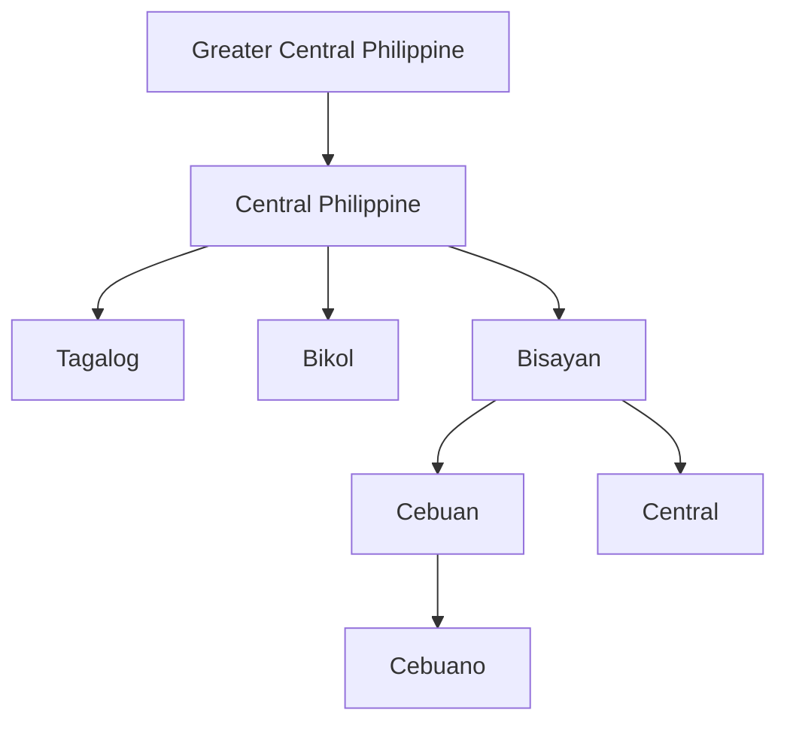
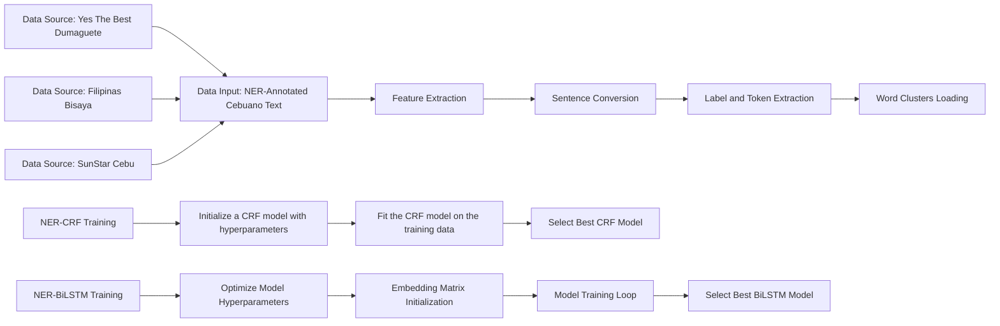
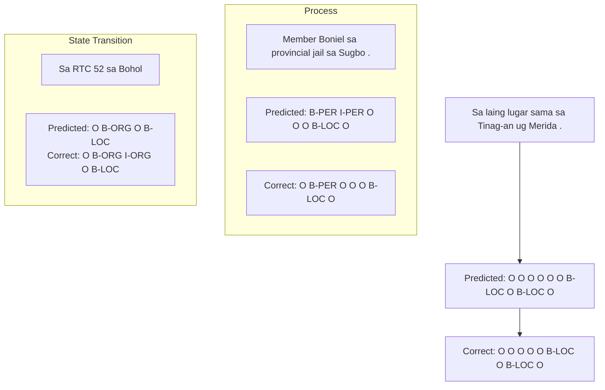

# CEBUANER: A New Baseline Cebuano Named Entity Recognition Model

Ma. Beatrice Emanuela PilarΩ Ellyza Mari PapasΩ Mary Loise BuenaventuraΩ Dane DedoroyΩ Myron Darrel MontefalconΛ Jay Rhald PadillaΛ Lany MacedaΣ Mideth AbisadoΛ and Joseph Marvin ImperialΛ,Γ

ΩSilliman University, Philippines ΣBicol University, Philippines ΛNational University, Philippines, ΓUniversity of Bath, UK beatricenpilar@su.edu.ph,jrimperial@national-u.edu.ph

## Abstract

Despite being one of the most linguistically diverse groups of countries, computational linguistics and language processing research in Southeast Asia has struggled to match the level of countries from the Global North. Thus, initiatives such as open-sourcing corpora and the development of baseline models for basic language processing tasks are important stepping stones to encourage the growth of research efforts in the field. To answer this call, we introduce C NER, a new baseline model for named entity recognition (NER) in the Cebuano language. Cebuano is the second mostused native language in the Philippines with over 20 million speakers. To build the model, we collected and annotated over 4,000 news articles, the largest of any work in the language, retrieved from online local Cebuano platforms to train algorithms such as Conditional Random Field and Bidirectional LSTM. Our findings show promising results as a new baseline model, achieving over 70% performance on precision, recall, and F1 across all entity tags as well as potential efficacy in a crosslingual setup with Tagalog.

## 1 Introduction

Open-sourced and accessible machine-readable language datasets drive the progress of computational linguistics research. As such, university and industry research initiatives such as IndoNLP (Wilie et al., 2020; Aji et al., 2022), Glot500 (Imani-Googhari et al., 2023), MasakhaneNER (Adelani et al., 2021, 2022) as well as conferences like Language Resources and Evaluation (LREC)1 encourage and advocate for increased efforts in developing and release of high-quality resources to the community. Despite these efforts, however, languages in other parts of the world, such as in South East Asian (SEA) countries like the Philippines, Thailand, and Myanmar, still remain on the lower end of the level of digital support by researchers (Simons et al., 2022).

In Natural Language Processing (NLP) research, Named Entity Recognition (NER) is the task of labeling identifiable entities such as organization name ("Tottenham Hotspurs", "Red Cross") and specific locations ("Manila City", "Penny Lane Street") as in texts. It is considered one of the foundational information extraction tasks in NLP that are used frequently by both the research community and the industry (Lorica and Nathan, 2021; Vajjala and Balasubramaniam, 2022). A good NER model serves as a backbone for more advanced systems requiring a deeper understanding of contextual semantics and disambiguation of texts to retrieve insights (Zhou et al., 2019). To date, research on NER has focused on improving the performances of models through advanced methods. Architectural additions such as predefined entity lists like gazetteers (Rijhwani et al., 2020), data augmentation techniques (Yaseen and Langer, 2021; Cai et al., 2023), and complex neural methods (Chiu and Nichols, 2016; Cotterell and Duh, 2017a; Liu et al., 2018; Zhou et al., 2019) have been used. Likewise, a plethora of online tools such as SPACY2 and STANZA3 already integrates production-ready NER models for high-resource languages such as English, Chinese, and German.

In this study, we introduce CEBUANER, a new baseline named entity recognition model for the language Cebuano as a response to the call for new initiatives of tool, model, and dataset creation for low-resource languages. We collected and annotated over 4,000 articles written in Cebuano to train NER models using modern machine learning algorithms such as including Conditional Random Fields (CRF) and Bidirectional Long Short-Term Memory (Bi-LSTM). We specifically selected the task of NER for our study’s contribution because of its simplicity and potential to serve as a baseline resource for advanced initiatives in computational linguistics and NLP for the Cebuano language. NER extracts essential information from unstructured texts by identifying and classifying named entities, making it easier for computational analysis to be more meaningful and context-sensitive (Pant et al., 2023). It also helps organize and categorize language data, providing valuable insights into language patterns and usage. This is particularly important for languages with limited digital resources. Additionally, NER is instrumental in creating digital dictionaries and grammar tools essential for academic understanding and language learning. These resources make languages more accessible and user-friendly for current and future research initiatives in Cebuano (Gharagozlou et al., 2023). From this paper, we hope to inspire more efforts to develop and improve the digital representation of Cebuano and other under-resourced Philippine languages through open sourcing and making our code and data publicly available4.

## 2 Previous Works

In the past years, studies in named entity recognition (NER) for Philippine languages have mainly focused on Filipino due to the ease of access to raw data. One of the first few works to use machine learning-based modeling is the study of Alfonso et al. (2013) using Conditional Random Fields on a dataset of biographies. The model was able to detect standard text entities such as people, organization, and location at a performance measure of 83% in F1 score. The study reported difficulty with discriminating places and organizations with 42% and 33% error rates, respectively. A following study by Eboña et al. (2013) was published using Maximum Entropy on a Filipino short story dataset with a performance 80.53% in F1 score. Similar to Alfonso et al. (2013), the model also struggled in identifying location and organization information with error rates of 29.41% and 13.10%, respectively. More recently, the work of Cruz et al. (2018) also used Conditional Random Fields but on a compiled news article dataset achieving 75.71% overall F1 score.

Aside from works on Filipino data, there are small research efforts to adapt the NER methodology for the Cebuano language. However, most of these works claim to be preliminary results due to the limited availability of gold-standard annotations. The work of (Maynard et al., 2003) first attempted to adapt an English NER system called ANNIE to Cebuano. The study involved replacing modules of tokenization, lexicon, and gazetteers from a small annotated Cebuano news dataset. The system achieved a promising performance of 69.1% in F1 score, reporting possible sources of error in untrained human annotators for the named entity recognition task. Upon checking, the Cebuano NER module in ANNIE is not publicly available. A subsequent study by Cotterell and Duh (2017a) examined a trained neural CRF on Filipino in a crosslingual setup using a separate silver-standard Cebuano data from Wikipedia. The neural CRF’s performance was slightly lower than the log-linear CRF on Tagalog alone (56.98% vs. 58.15%). Nevertheless, when incorporating cross-lingual data from Cebuano, the neural CRF demonstrated significant improvement, outperforming the log-linear CRF by achieving an F1 score of 81.79% compared to 75.29%. More recently, a study by Gonzales et al. (2022) proposed a hybrid neural network method for both part-of-speech tagging and NER. The work reported preliminary results with approximately 95- 98% in both precision and recall but only used a small dataset of 200 news articles.

Our study’s major difference from these preliminary efforts is that we start from the ground up in terms of training NER models. We build a large gold-standard Cebuano dataset composed of 4,258 new articles annotated with high reliability by native speakers, which will be made open-sourced upon publication. Our dataset was sourced from recent content published by local Cebuano news platforms within the last five years. We see this as another advantage of this work, as recency and being able to capture modern language changes is an important aspect of automated tools. Lastly, compared to other works mentioned, we explore and compare the performances of modern machine learning algorithms for baseline model development which have shown greater effectivity for the task, especially for low-resource languages (Cotterell and Duh, 2017a; Zhou et al., 2019).

## 3 The Cebuano Language (CEB)

The Philippines is one of the most linguistically diverse countries in Asia (McFarland, 2008; Metila et al., 2016). Part of the nation’s linguistic identity is Cebuano (CEB)5 which is the second most widely spoken language with over 27 million active speakers next to the national language Filipino. As part of the Bisayan language family, Cebuano exhibits a vibrant linguistic heritage and is spoken in the regions of Cebu, Siuijor, Bohol, Negros Oriental, northeastern Negros Occidental, southern Masbate, and in central areas of Mindanao. Despite this considerable number of speakers, Cebuano still continues to be classified as an under-resourced language by most data survey papers due to its very limited digital support (Imperial et al., 2022; Simons et al., 2022). We illustrate the placement of the Cebuano language in the Greater Central Philippine family tree in Figure 1.

flowchart

Figure 1: The central subgroup of the Philippine language family tree highlighting the origin of Cebuano language (CEB). Adapted with permission from Imperial et al. (2022).

## 4 Corpus Building and Preprocessing

This section of the paper presents a comprehensive outline of our procedure for building a Cebuano corpus. The following steps are taken to accomplish this task: data collection, annotation, and reliability testing.

## 4.1 Data Collection

For collecting Cebuano data, we collected publicly available articles from two local news sources in Cebuano, Yes the Best Dumaguete and the Filipinas Bisaya. To further increase the data count, we also incorporated another publicly available dataset from SunStar Cebu pre-collected by independent researcher Arjemariel Requina6. The total accumulated and filtered size of the Cebuano dataset is

4,258 articles. Table 1 presents the distribution of the dataset per source.

<table><tr><td>Source</td><td>Original</td><td>Cleaned</td></tr><tr><td>Yes the Best Dumaguete</td><td>1,484</td><td>781</td></tr><tr><td>Filipinas Bisaya</td><td>769</td><td>377</td></tr><tr><td>SunStar Cebu</td><td>3,100</td><td>3,100</td></tr></table>

Table 1: Statistics of news data sources for building CEBUANER.

## 4.2 Annotation Process

In the annotation process of the Cebuano dataset, we used Label Studio, an open-sourced data labeling platform7. We employed and trained two undergraduate students who are native speakers of the Cebuano language for the labeling task. To follow labeling formats of current research in NER (Mayhew and Roth, 2018; Mayhew et al., 2019; Adelani et al., 2021), we annotated four entity types through the BIO encoding schema and used the tags Person (PER), Organization (ORG), Location (LOC), and Other (OTHER). We show an example of how a text in Cebuano is annotated using these tags in Figure 2.

text_image

Si Juanna na nag trabaho sa SM ay taga Cebu City.
O B-PER O O O O B-ORG O O B-LOC I-LOC

Figure 2: Cebuano sentence with annotations

## 4.3 Reliability Testing

We noticed that previous works mentioned in Section 2, especially for NER in Philippine languages, lack information about how reliable the tags in their respective datasets are. We see this as a limitation that should be avoided as transparency of data quality is important for progress in the field. Thus, for this study, we calculate the reliability of annotations of the tags in our annotated Cebuano dataset. We use Cohen’s $\kappa$ (Cohen, 1960) as done in previous works for NER such as in Balasuriya et al. (2009); Brandsen et al. (2020); Jarrar et al. (2022). Cohen’s κ involves comparing the observed agreement $p _ { o }$ between annotators to the agreement that would be expected by chance $p _ { e }$ using the formula:

$$
\kappa = \frac {p _ {o} - p _ {e}}{1 - p _ {e}} \tag {1}
$$

Table 2 shows the agreement scores between annotators. The observed agreement indicates that around 98.37% of the data points have labels on which the annotators agree, demonstrating a high level of consistency in their annotations. The agreement by chance represents the proportion of agreement that would be expected by random chance alone. As it is lower than the observed agreement, it suggests that the annotators’ agreement exceeds what would be expected by chance. A Cohen’s κ score that is close to 1.0 implies a high level of agreement. Thus, a value of 0.9315 obtained in our study further supports the notion of strong agreement between the annotators.

<table><tr><td>Observed Agreement</td><td>0.9837</td></tr><tr><td>Agreement by Chance</td><td>0.7617</td></tr><tr><td>Cohen&#x27;s κ</td><td>0.9315</td></tr></table>

Table 2: Cohen’s κ results from annotations.

## 4.4 Feature Extraction

Feature extraction is a crucial step in the modeling process, and it can help improve the model’s overall performance by having more dimensions to factor in for the identification of the correct tags (Guyon and Elisseeff, 2003). In this study, we extracted the following features covering word and sentencebased variables as listed below:

1. Boolean flags if the first letter of a target word is capitalized, all in uppercase or a digit.  
2. The character bigram and trigram of a target word.  
3. Whether a target word is at the beginning or end of the sentence (BOS or EOS).  
4. The two words to the left and the right of the target word.  
5. The top word clusters from an external embedding file for the target language.

For the clustering component, we used a Cebuano corpus composed of Internet texts through the CEBTENTEN corpus from Sketch Engine8.

## 5 Modelling

This section presents the modeling process that we used to develop our Cebuano NER system. To compare performance, we adopt two different techniques, Conditional Random Field (CRF) and Bidirectional Long Short Term Memory (BiLSTM) model. We use the package sklearn-crfsuite in Scikit-Learn (Pedregosa et al., 2011) and PyTorch (Paszke et al., 2019) for the implementation of the training algorithms. We show a visual guide of the overall methodology of the study in Figure 3.

## 5.1 Conditional Random Fields

For the first modelling approach, we adopt one of the most common statistical methods for NER which is the Conditional Random Fields (Lafferty et al., 2001). CRFs are undirected graphical models that capture label conditional dependencies, making them ideal for applications such as partof-speech tagging and named entity recognition (Eboña et al., 2013; Alfonso et al., 2013; Cotterell and Duh, 2017b). Their ability to capture the relationships among adjacent words in a sentence is particularly valuable for NER since named entities often exhibit specific patterns in the context of the surrounding words (Wallach, 2004).

CRF architecture entails encoding the conditional probability distribution $P ( \boldsymbol { y } | \boldsymbol { x } )$ over label sequences Y given observation sequences x, enabling for quick and accurate sequence labeling without imposing unnecessary independence assumptions (Wallach, 2004). We show the main computation below where $\beta _ { t }$ corresponds to the weight, $( y _ { t } , y _ { t - 1 } , x _ { t } )$ for the feature, and Z for the normalizing factor:

$$
P (y | x) = \frac {1}{Z} \prod_ {t = 1} ^ {T} \beta_ {t} (y _ {t}, y _ {t - 1}, x _ {t}) \tag {2}
$$

## 5.2 Bidirectional Long Short-Term Memory

For our second modelling approach, we advance to a neural network algorithm direction using Bidirectional Long Short-Term Memory or BiLSTM (Schuster and Paliwal, 1997). BiLSTM is a type of recurrent neural network (RNN) that has the ability to process sequential data in both forward and backward direction. It is also commonly used in tasks that involve sequence labeling such as NER with substantially larger datasets, in addition to being able to capture contextual information from both forward and backward direction of words in a sentence (Chiu and Nichols, 2016; Reimers and Gurevych, 2017; Panchendrarajan and Amaresan, 2018; Žukov-Gregoric et al.ˇ , 2018).

flowchart

Figure 3: Overall methodology of developing CEBUANER using annotated news datasets in Cebuano with machine learning models CRF and BiLSTM.

## 6 Results

In this section, we describe the outcome of training both the CRF and BiLSTM models using our newly-collected and annotation Cebuano NER dataset. Similar to previous works (Mayhew et al., 2019), we omit the analysis with the OTH (other) tag as this usually serves as a miscellaneous label for more advanced tags in future annotations.

<table><tr><td>Tagset</td><td>Precision</td><td>Recall</td><td>F1</td><td>Support</td></tr><tr><td>B-PER</td><td>0.859</td><td>0.895</td><td>0.877</td><td>524</td></tr><tr><td>I-PER</td><td>0.852</td><td>0.917</td><td>0.883</td><td>264</td></tr><tr><td>B-ORG</td><td>0.825</td><td>0.558</td><td>0.665</td><td>312</td></tr><tr><td>I-ORG</td><td>0.835</td><td>0.736</td><td>0.782</td><td>420</td></tr><tr><td>B-LOC</td><td>0.854</td><td>0.731</td><td>0.788</td><td>383</td></tr><tr><td>I-LOC</td><td>0.851</td><td>0.670</td><td>0.750</td><td>273</td></tr></table>

Table 3: Performance of the trained and un-optimized CRF model for Cebuano NER

<table><tr><td>Tagset</td><td>Precision</td><td>Recall</td><td>F1</td><td>Support</td></tr><tr><td>B-PER</td><td>0.881</td><td>0.918</td><td>0.899</td><td>524</td></tr><tr><td>I-PER</td><td>0.875</td><td>0.932</td><td>0.903</td><td>264</td></tr><tr><td>B-ORG</td><td>0.879</td><td>0.651</td><td>0.748</td><td>312</td></tr><tr><td>I-ORG</td><td>0.860</td><td>0.729</td><td>0.789</td><td>420</td></tr><tr><td>B-LOC</td><td>0.887</td><td>0.799</td><td>0.841</td><td>383</td></tr><tr><td>I-LOC</td><td>0.833</td><td>0.733</td><td>0.780</td><td>273</td></tr></table>

Table 4: Performance of the trained and optimized CRF model for Cebuano NER.

For the CRF model, we first experimented with a standard optimization algorithm with LBFGS (Liu and Nocedal, 1989) that we ran for 100 iterations. Subsequently, a combination of L1 and L2 regularizations were used on the model to search for the optimal hyperparameters through a randomized search algorithm that we also ran for the same number of iterations to prevent overfitting. Upon evaluation of the resulting hyperparameters, we obtained an overall mean cross-validation F1 score of 0.901, 0.768, and 0.811 as calculated in Table 4 per tagset of PER, ORG, and LOC, respectively. We also note an overall improvement in performance from the initial evaluation from the unoptimized CRF model by about 2%, 4%, and 4.2% per tagset of PER, ORG, and LOC, respectively.

<table><tr><td>Tagset</td><td>Precision</td><td>Recall</td><td>F1</td><td>Support</td></tr><tr><td>B-PER</td><td>0.85</td><td>0.89</td><td>0.87</td><td>524</td></tr><tr><td>I-PER</td><td>0.84</td><td>0.88</td><td>0.86</td><td>264</td></tr><tr><td>B-ORG</td><td>0.78</td><td>0.36</td><td>0.49</td><td>312</td></tr><tr><td>I-ORG</td><td>0.81</td><td>0.76</td><td>0.79</td><td>420</td></tr><tr><td>B-LOC</td><td>0.85</td><td>0.69</td><td>0.76</td><td>383</td></tr><tr><td>I-LOC</td><td>0.79</td><td>0.61</td><td>0.69</td><td>273</td></tr></table>

Table 5: Performance of the trained and optimized BiL-STM model for Cebuano NER.

Table 5 shows the results of model training for BiLSTM. The mean averages performance of the model for F1 score are 0.865, 0.640, and 0.725 per tagset of PER, ORG, and LOC, respectively. We observe that there is a close resemblance with the performance of the un-optimized CRF model in Table 3. We infer that this relatively lower performance can be attributed to the size of the data used. Specifically, this can be seen with the reduced performance in the F1 score, especially with identifying organization and location entities. Likewise, while CRFs are seen as the more traditional approach to work regarding NER, the use of BiL-STM may be more practical if the number of training data is higher than what we used. Despite our models being the new baseline due to having the highest training data used for Cebuano, future research works incorporating more annotated data should see an improvement across all performance metrics.

## 7 Discussion

In this section, we provide an in-depth discussion of insights obtained from the performances of the trained models, including error analysis and potential for crosslingual application.

## 7.1 Error Analysis

flowchart

Figure 4: Cebuano sentences with misclassified annotations

Where previous studies produced pronounced error rates when it came to identifying certain entities, such as in the works of Alfonso et al. (2013) and Eboña et al. (2013), our best CRF model gives a more consistent performance that was specially fitted to the Cebuano language. However, several instances of misclassified tag predictions still occur, as shown with a few examples in Figure 4. Within this subset, it was observed that certain named entities had been skipped by the model while other non-entity words were mistakenly labeled as qualified entities. For this, we further recommend further refinement of annotations, particularly with spans or entities longer than one word, in order to enhance the precision and efficiency of the NER model for this specific language.

## 7.2 On Crosslingual Performance with Tagalog

The crosslingual capability of NLP models, particular NER, is tested when a trained model using one language, in this case Cebuano, performs comparably well when tested on an unseen data in another language. This has been one of the features of NER systems that have been focused by previous works (Cotterell and Duh, 2017b; Xie et al., 2018; Zhou et al., 2022). Although our goal for CEBUANER is to become a baseline model primarily for the Cebuano language, we still performed an initial crosslingual experiment show its potential to researchers interested in improving the model in the future. For this set, we used the best performing model which uses the CRF algorithm and a corrected version Tagalog dataset from the WikiANN data (Pan et al., 2017) in the calamanCy library9. The Tagalog dataset contains 782 annotated documents with the same entity tag list of Person (PER), Organization (ORG), and Location (LOC).

Table 6 shows the performance of CEBUANER in a crosslingual setup with a Tagalog dataset. The mean averages in terms of F1 score are 0.713, 0.395, and 0.589 for entity tag list PER, ORG, and LOC respectively. While these are substantially lower overall compared to the previous CRF and BiLSTM models trained with purely Cebuano data in Tables 4 and 5, we see potential as recognition performance for identifying person and location names do not deviate too far. We also posit that Tagalog and Cebuano being members of the same language family subtree as seen in Figure 1 also contribute to the two languages having overlapping linguistic intricacies such as grammar and word use (Imperial et al., 2022; Imperial and Kochmar, 2023).

<table><tr><td>Tagset</td><td>Precision</td><td>Recall</td><td>F1</td><td>Support</td></tr><tr><td>B-PER</td><td>0.761</td><td>0.615</td><td>0.680</td><td>833</td></tr><tr><td>I-PER</td><td>0.790</td><td>0.705</td><td>0.745</td><td>549</td></tr><tr><td>B-ORG</td><td>0.386</td><td>0.303</td><td>0.340</td><td>363</td></tr><tr><td>I-ORG</td><td>0.315</td><td>0.791</td><td>0.451</td><td>383</td></tr><tr><td>B-LOC</td><td>0.766</td><td>0.436</td><td>0.556</td><td>383</td></tr><tr><td>I-LOC</td><td>0.651</td><td>0.595</td><td>0.622</td><td>232</td></tr></table>

Table 6: Crosslingual experiment of the CRF-based CEBUANER model applied to a Tagalog test dataset.

## 8 Conclusion

Research initiatives involving the creation of highquality corpus, release of technical implementations through code, and full transparency of model training are crucial to level the impact of lowresource languages in NLP. Towards contributing to this call, we introduced CEBUANER, a new baseline model for named entity recognition in the Cebuano language. CEBUANER’s main advantage from previous works is the use of a significantly larger gold-standard data from recent news articles to train models via CRF and BiLSTM, paired with empirical evidence of potential in a crosslingual application with Tagalog. In terms of performance, the best model for CEBUANER surpassed the mean standard threshold of 0.70 for precision, recall, and F1 across all entity tag list. We foresee that the public release of the trained models and annotated the dataset used will have substantial impact in the Philippine NLP landscape. Future works include improvements in span selection of the model to capture entities greater than one word as well as application to more complex neural network architectures if paired with an even higher data count.

## Acknowledgment

All datasets collected for this study are publicly available and are used for non-commercial research purposes. We acknowledge the sources of the Cebuano news articles being Yes the Best, Filipinas Bisaya, and Sunstar Cebu. This study is funded by the Philippine Commission on Higher Education (CHED) Leading the Advancement of Knowledge in Agriculture and Science (LAKAS) Project No. 2021-007, eParticipation 2.1: Harnessing Natural Language Processing (NLP) for Community Participation.

## References

David Adelani, Graham Neubig, Sebastian Ruder, Shruti Rijhwani, Michael Beukman, Chester Palen-Michel, Constantine Lignos, Jesujoba Alabi, Shamsuddeen Muhammad, Peter Nabende, Cheikh M. Bamba Dione, Andiswa Bukula, Rooweither Mabuya, Bonaventure F. P. Dossou, Blessing Sibanda, Happy Buzaaba, Jonathan Mukiibi, Godson Kalipe, Derguene Mbaye, Amelia Taylor, Fatoumata Kabore, Chris Chinenye Emezue, Anuoluwapo Aremu, Perez Ogayo, Catherine Gitau, Edwin Munkoh-Buabeng, Victoire Memdjokam Koagne, Allahsera Auguste Tapo, Tebogo Macucwa, Vukosi Marivate, Mboning Tchiaze Elvis, Tajuddeen Gwadabe, Tosin Adewumi, Orevaoghene Ahia, Joyce Nakatumba-Nabende, Neo Lerato Mokono, Ignatius Ezeani, Chiamaka Chukwuneke, Mofetoluwa Oluwaseun Adeyemi, Gilles Quentin Hacheme, Idris Abdulmumin, Odunayo Ogundepo, Oreen Yousuf, Tatiana Moteu, and Dietrich Klakow. 2022. MasakhaNER 2.0: Africa-centric transfer learning for named entity recognition. In Proceedings of the 2022 Conference on Empirical Methods in Natural Language Processing, pages 4488–4508, Abu Dhabi, United Arab Emirates. Association for Computational Linguistics.

David Ifeoluwa Adelani, Jade Abbott, Graham Neubig, Daniel D’souza, Julia Kreutzer, Constantine Lignos, Chester Palen-Michel, Happy Buzaaba, Shruti Rijhwani, Sebastian Ruder, Stephen Mayhew, Israel Abebe Azime, Shamsuddeen H. Muhammad, Chris Chinenye Emezue, Joyce Nakatumba-Nabende, Perez Ogayo, Aremu Anuoluwapo, Catherine Gitau, Derguene Mbaye, Jesujoba Alabi, Seid Muhie Yimam, Tajuddeen Rabiu Gwadabe, Ignatius Ezeani, Rubungo Andre Niyongabo, Jonathan Mukiibi, Verrah Otiende, Iroro Orife, Davis David, Samba Ngom, Tosin Adewumi, Paul Rayson, Mofetoluwa Adeyemi, Gerald Muriuki, Emmanuel Anebi, Chiamaka Chukwuneke, Nkiruka Odu, Eric Peter Wairagala, Samuel Oyerinde, Clemencia Siro, Tobius Saul Bateesa, Temilola Oloyede, Yvonne Wambui, Victor Akinode, Deborah Nabagereka, Maurice Katusiime, Ayodele Awokoya, Mouhamadane MBOUP, Dibora Gebreyohannes, Henok Tilaye, Kelechi Nwaike, Degaga Wolde, Abdoulaye Faye, Blessing Sibanda, Orevaoghene Ahia, Bonaventure F. P. Dossou, Kelechi Ogueji, Thierno Ibrahima DIOP, Abdoulaye Diallo, Adewale Akinfaderin, Tendai Marengereke, and Salomey Osei. 2021. MasakhaNER: Named entity recognition for African languages. Transactions of the Association for Computational Linguistics, 9:1116–1131.

Alham Fikri Aji, Genta Indra Winata, Fajri Koto, Samuel Cahyawijaya, Ade Romadhony, Rahmad Mahendra, Kemal Kurniawan, David Moeljadi, Radityo Eko Prasojo, Timothy Baldwin, Jey Han Lau, and Sebastian Ruder. 2022. One country, 700+ languages: NLP challenges for underrepresented languages and dialects in Indonesia. In Proceedings of the 60th Annual Meeting of the Association for Computational Linguistics (Volume 1: Long Papers), pages 7226–7249, Dublin, Ireland. Association for Computational Linguistics.

Ana Patricia T Alfonso, Illuminada Vivien R Domingo, Mary Joy F Galope, Ria A Sagum, Rachelle B Villar, and Jobert T Villegas. 2013. Named entity recognizer for filipino text using conditional random field. International Journal ofFuture Computer and Communication, 2(5):376.

Dominic Balasuriya, Nicky Ringland, Joel Nothman, Tara Murphy, and James R Curran. 2009. Named entity recognition in wikipedia. In Proceedings of the 2009 workshop on the people’s web meets NLP: Collaboratively constructed semantic resources (People’s Web), pages 10–18.

Alex Brandsen, Suzan Verberne, Milco Wansleeben, and Karsten Lambers. 2020. Creating a dataset for named entity recognition in the archaeology domain. In Proceedings of the Twelfth Language Resources and Evaluation Conference, pages 4573–4577.

Jiong Cai, Shen Huang, Yong Jiang, Zeqi Tan, Pengjun Xie, and Kewei Tu. 2023. Graph propagation based data augmentation for named entity recognition. In Proceedings of the 61st Annual Meeting of the Associationfor Computational Linguistics (Volume 2: Short Papers), pages 110–118, Toronto, Canada. Association for Computational Linguistics.

Jason P.C. Chiu and Eric Nichols. 2016. Named entity recognition with bidirectional LSTM-CNNs. Transactions ofthe Associationfor Computational Linguistics, 4:357–370.  
Jacob Cohen. 1960. A coefficient of agreement for nominal scales. Educational and psychological mea surement, 20(1):37–46.  
Ryan Cotterell and Kevin Duh. 2017a. Lowresource named entity recognition with cross-lingual, character-level neural conditional random fields. In Proceedings of the Eighth International Joint Conference on Natural Language Processing (Volume 2: Short Papers), pages 91–96, Taipei, Taiwan. Asian Federation of Natural Language Processing.  
Ryan Cotterell and Kevin Duh. 2017b. Lowresource named entity recognition with cross-lingual, character-level neural conditional random fields. In Proceedings of the Eighth International Joint Con ference on Natural Language Processing (Volume 2: Short Papers), pages 91–96.  
Bern Maris Dela Cruz, Cyril Montalla, Allysa Manansala, Ramon Rodriguez, Manolito Octaviano, and Bernie S Fabito. 2018. Named-entity recognition for disaster related filipino news articles. In TEN-CON 2018-2018 IEEE Region 10 Conference, pages 1633–1636. IEEE.  
Karen Mae L Eboña, Orlando S Llorca Jr, Genrev P Perez, Jhustine M Roldan, Iluminda Vivien R Domingo, and Ria A Sagum. 2013. Named-entity recognizer (ner) for filipino novel excerpts using maximum entropy approach. Journal ofIndustrial and Intelligent Information Vol, 1(1).  
Hamid Gharagozlou, Javad Mohammadzadeh, Azam Bastanfard, and Saeed Shiry Ghidary. 2023. Semantic relation extraction: A review of approaches, datasets, and evaluation methods. ACM Transactions on Asian and Low-Resource Language Information Processing.  
Joshua Andre Huertas Gonzales, J-Adrielle Enriquez Gustilo, Glenn Michael Vequilla Nituda, and Kristine Mae Monteza Adlaon. 2022. Developing a hybrid neural network for part-of-speech tagging and named entity recognition. In Proceedings of the 2022 5th Artificial Intelligence and Cloud Computing Conference, pages 7–13.  
Isabelle Guyon and André Elisseeff. 2003. An introduction to variable and feature selection. Journal of machine learning research, 3(Mar):1157–1182.  
Ayyoob ImaniGooghari, Peiqin Lin, Amir Hossein Kargaran, Silvia Severini, Masoud Jalili Sabet, Nora Kassner, Chunlan Ma, Helmut Schmid, André Martins, François Yvon, and Hinrich Schütze. 2023. Glot500: Scaling multilingual corpora and language models to 500 languages. In Proceedings ofthe 61st Annual Meeting ofthe Associationfor Computational  
Linguistics (Volume 1: Long Papers), pages 1082– 1117, Toronto, Canada. Association for Computational Linguistics.  
Joseph Marvin Imperial and Ekaterina Kochmar. 2023. Automatic readability assessment for closely related languages. In Findings ofthe Associationfor Computational Linguistics: ACL 2023, pages 5371–5386, Toronto, Canada. Association for Computational Lin guistics.  
Joseph Marvin Imperial, Lloyd Lois Antonie Reyes, Michael Antonio Ibanez, Ranz Sapinit, and Mohammed Hussien. 2022. A baseline readability model for Cebuano. In Proceedings of the 17th Workshop on Innovative Use of NLP for Building Educational Applications (BEA 2022), pages 27–32, Seattle, Washington. Association for Computational Linguistics.  
Mustafa Jarrar, Mohammed Khalilia, and Sana Ghanem. 2022. Wojood: Nested Arabic named entity corpus and recognition using BERT. In Proceedings of the Thirteenth Language Resources and Evaluation Conference, pages 3626–3636, Marseille, France. European Language Resources Association.  
John D Lafferty, Andrew McCallum, and Fernando CN Pereira. 2001. Conditional random fields: Probabilistic models for segmenting and labeling sequence data. In Proceedings ofthe Eighteenth International Conference on Machine Learning, pages 282–289.  
Dong C Liu and Jorge Nocedal. 1989. On the limited memory bfgs method for large scale optimization. Mathematical programming, 45(1-3):503–528.  
Liyuan Liu, Jingbo Shang, Xiang Ren, Frank Xu, Huan Gui, Jian Peng, and Jiawei Han. 2018. Empower sequence labeling with task-aware neural language model. In Proceedings of the AAAI Conference on Artificial Intelligence, volume 32.  
Ben Lorica and Paco Nathan. 2021. 2021 nlp survey report.  
Stephen Mayhew, Snigdha Chaturvedi, Chen-Tse Tsai, and Dan Roth. 2019. Named entity recognition with partially annotated training data. In Proceedings of the 23rd Conference on Computational Natural Language Learning (CoNLL), pages 645–655, Hong Kong, China. Association for Computational Linguistics.  
Stephen Mayhew and Dan Roth. 2018. TALEN: Tool for annotation of low-resource ENtities. In Proceedings of ACL 2018, System Demonstrations, pages 80–86, Melbourne, Australia. Association for Computational Linguistics.  
Diana Maynard, Valentin Tablan, and Hamish Cunningham. 2003. Ne recognition without training data on a language you don’t speak. In Proceedings ofthe ACL 2003 workshop on multilingual and mixed-language named entity recognition, pages 33–40.  
Curtis D McFarland. 2008. Linguistic diversity and english in the philippines. Philippine English: Linguistic and literary perspectives, 1:131.  
Romylyn A Metila, Lea Angela S Pradilla, and Alan B Williams. 2016. The challenge of implementing mother tongue education in linguistically diverse con texts: The case of the philippines. The Asia-Pacific Education Researcher, 25:781–789.  
Xiaoman Pan, Boliang Zhang, Jonathan May, Joel Nothman, Kevin Knight, and Heng Ji. 2017. Cross-lingual name tagging and linking for 282 languages. In Proceedings ofthe 55th Annual Meeting ofthe Associationfor Computational Linguistics (Volume 1: Long Papers), pages 1946–1958, Vancouver, Canada. As sociation for Computational Linguistics.  
Rrubaa Panchendrarajan and Aravindh Amaresan. 2018. Bidirectional lstm-crf for named entity recognition. In Proceedings ofthe 32nd Pacific Asia Conference on Language, Information and Computation.  
Vinay Kumar Pant, Rupak Sharma, and Shakti Kundu. 2023. Named entity recognition of kumauni language using machine learning (ml).  
Adam Paszke, Sam Gross, Francisco Massa, Adam Lerer, James Bradbury, Gregory Chanan, Trevor Killeen, Zeming Lin, Natalia Gimelshein, Luca Antiga, et al. 2019. Pytorch: An imperative style, high-performance deep learning library. Advances in neural information processing systems, 32.  
Fabian Pedregosa, Gaël Varoquaux, Alexandre Gramfort, Vincent Michel, Bertrand Thirion, Olivier Grisel, Mathieu Blondel, Peter Prettenhofer, Ron Weiss, Vincent Dubourg, et al. 2011. Scikit-learn: Machine learning in python. the Journal of machine Learning research, 12:2825–2830.  
Nils Reimers and Iryna Gurevych. 2017. Reporting score distributions makes a difference: Performance study of lstm-networks for sequence tagging. arXiv preprint arXiv:1707.09861.  
Shruti Rijhwani, Shuyan Zhou, Graham Neubig, and Jaime Carbonell. 2020. Soft gazetteers for lowresource named entity recognition. In Proceedings of the 58th Annual Meeting of the Association for Computational Linguistics, pages 8118–8123, Online. Association for Computational Linguistics.  
Mike Schuster and Kuldip K Paliwal. 1997. Bidirectional recurrent neural networks. IEEE transactions on Signal Processing, 45(11):2673–2681.  
Gary F. Simons, Abbey L. L. Thomas, and Chad K. K. White. 2022. Assessing digital language support on a global scale. In Proceedings of the 29th International Conference on Computational Linguistics, pages 4299–4305, Gyeongju, Republic of Korea. International Committee on Computational Linguistics.  
Sowmya Vajjala and Ramya Balasubramaniam. 2022. What do we really know about state of the art NER? In Proceedings ofthe Thirteenth Language Resources and Evaluation Conference, pages 5983–5993, Marseille, France. European Language Resources Association.  
Hanna M Wallach. 2004. Conditional random fields: An introduction. Technical Reports (CIS), page 22.  
Bryan Wilie, Karissa Vincentio, Genta Indra Winata, Samuel Cahyawijaya, Xiaohong Li, Zhi Yuan Lim, Sidik Soleman, Rahmad Mahendra, Pascale Fung, Syafri Bahar, and Ayu Purwarianti. 2020. IndoNLU: Benchmark and resources for evaluating Indonesian natural language understanding. In Proceedings of the 1st Conference ofthe Asia-Pacific Chapter ofthe Association for Computational Linguistics and the 10th International Joint Conference on Natural Language Processing, pages 843–857, Suzhou, China. Association for Computational Linguistics.  
Jiateng Xie, Zhilin Yang, Graham Neubig, Noah A. Smith, and Jaime Carbonell. 2018. Neural crosslingual named entity recognition with minimal resources. In Proceedings ofthe 2018 Conference on Empirical Methods in Natural Language Processing, pages 369–379, Brussels, Belgium. Association for Computational Linguistics.  
Usama Yaseen and Stefan Langer. 2021. Data augmentation for low-resource named entity recognition using backtranslation. In Proceedings of the 18th International Conference on Natural Language Processing (ICON), pages 352–358, National Institute of Technology Silchar, Silchar, India. NLP Association of India (NLPAI).  
Joey Tianyi Zhou, Hao Zhang, Di Jin, Hongyuan Zhu, Meng Fang, Rick Siow Mong Goh, and Kenneth Kwok. 2019. Dual adversarial neural transfer for lowresource named entity recognition. In Proceedings of the 57th Annual Meeting ofthe Associationfor Computational Linguistics, pages 3461–3471, Florence, Italy. Association for Computational Linguistics.  
Ran Zhou, Xin Li, Lidong Bing, Erik Cambria, Luo Si, and Chunyan Miao. 2022. ConNER: Consistency training for cross-lingual named entity recognition. In Proceedings of the 2022 Conference on Empirical Methods in Natural Language Processing, pages 8438–8449, Abu Dhabi, United Arab Emirates. Association for Computational Linguistics.  
Andrej Žukov-Gregoric, Yoram Bachrach, and Samˇ Coope. 2018. Named entity recognition with parallel recurrent neural networks. In Proceedings ofthe 56th Annual Meeting ofthe Associationfor Computational Linguistics (Volume 2: Short Papers), pages 69–74, Melbourne, Australia. Association for Computational Linguistics.