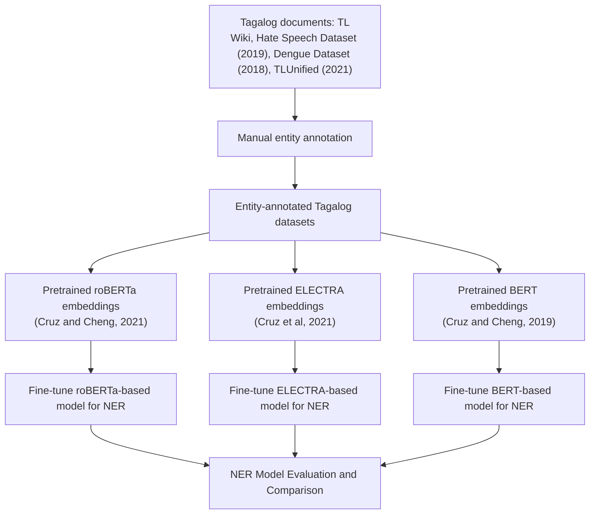

# TF-NERD: Tagalog Fine-grained Named Entity Recognition Dataset

Robin Kamille B. Ramos

Ateneo de Manila University

John Paul C. Vergara

Ateneo de Manila University

## ABSTRACT

Named entity recognition (NER) is a crucial foundational step in information extraction. This research aims to improve existing natural language processing (NLP) resources for the low-resource language Tagalog by constructing a human-annotated NER dataset. In this paper, we present TF-NERD, a fine-grained NER dataset that consists of 2,337 paragraphs writen in Tagalog and scraped from various internet sources. These entities are classified into 12 categories - art, event, facility, geo-political, language, law, location, nationalities, organization, person, product, and other entities. Benchmark NER transformer models were constructed to assess the quality and usability of the dataset for future NER research. Based on the results, the NER model finetuned with the pretrained roBERTa language model performed best with 82.31% recall and 80.67% precision for entity type classification, and 88.02% recall and 86.27% precision for entity phrase identification.

## CCS CONCEPTS

• Computing methodologies; • Artificial intelligence; • Natu ral language processing;

## KEYWORDS

Named Entity Recognition, Low-resource Languages, Transformers, Corpus Creation

## ACM Reference Format:

Robin Kamille B. Ramos and John Paul C. Vergara. 2023. TF-NERD: Tagalog Fine-grained Named Entity Recognition Dataset. In 2023 7th International Conference on Natural Language Processing and Information Retrieval (NLPIR 2023), December 15–17, 2023, Seoul, Republic ofKorea. ACM, New York, NY, USA, 6 pages. https://doi.org/10.1145/3639233.3639341

## 1 INTRODUCTION

Named entity recognition (NER) is an important field in Natural Language Processing (NLP) that deals with identifying named enti ties such as person, location, organization, and the like, given some text. NER models are often used as a preprocessing step for systems that involve question and answer tasks, information retrieval, machine translation, automatic summarization, among others. In addition, there has been some atention directed towards expanding

Permission to make digital or hard copies of all or part of this work for personal or classroom use is granted without fee provided that copies are not made or distributed for profit or commercial advantage and that copies bear this notice and the full citation on the first page. Copyrights for components of this work owned by others than the author(s) must be honored. Abstracting with credit is permited. To copy otherwise, or republish, to post on servers or to redistribute to lists, requires prior specific permission and/or a fee. Request permissions from permissions@acm.org.

NLPIR 2023, December 15–17, 2023, Seoul, Republic of Korea

© 2023 Copyright held by the owner/author(s). Publication rights licensed to ACM.

ACM ISBN 979-8-4007-0922-7/23/12

https://doi.org/10.1145/3639233.3639341

the application of NER models to low-resource languages [1]. Tagalog is considered a low-resource language, and this research aims to expand existing Filipino language resources by building a coarsegrained named-entity dataset and recognition system in Tagalog that can serve as foundational work for future NER research on Filipino and other low-resource languages.

## 2 RELATED WORK

Aside from limitations related to availability, two other challenges with published Tagalog NER corpora are: 1) limited entity types in the annotations, and 2) domain-dependent entity types that cannot be applied to general NER use cases.

Castillo et al. [2] and Alfonso et al. [3] both built their own Tagalog NER datasets and named-entity recognition systems. They annotated political speeches and bibliographies writen in Tagalog with four general named entities: Person, Place, Organization, Date. However, both studies did not publish the entity datasets.

Dela Cruz et al. [4] built a named-entity recognition system that extracts and classifies entities relevant to natural disasters. The system was trained on annotated Tagalog news articles with 5 entity types - type of disaster, name of disaster, month, and location. The dataset can be used for domain-specific NER models.

Costiniano et al. [5] created a named-entity recognition system for Tagalog storytelling corpus with modified entity types - humans and body, natural environment, urban environment, objects, animal, and transportation. The entities in the dataset include common names and are mostly relevant to the storytelling domain.

Pan et al. [6] published WikiANN, which is a named entity dataset available for 282 languages, including Tagalog. The entities supported are Person, Organization, and Location. However, the Tagalog set comprises only of entity token and entity phrases, and not full sentences. This can be used for training NER models, but it will be limiting since the model cannot learn an entity phrase’s context in the sentence and it does not support a comprehensive list of entity types.

There are other published corpora in the Tagalog language; however, these do not include the annotations required to train NER models. The WikiText-TL-39 dataset [7] and the TLUnified dataset [8] were published as large unlabeled corpora for Tagalog text mainly used for pretraining language models. NewsPH-NLI [9] was built for sentence entailment benchmark dataset. The Hate Speech Tagalog dataset [10] and Dengue Filipino dataset [11] were curated for text classification tasks.

As far as we know, there are no available Tagalog corpora annotated with fine-grained entities in sentence or paragraph form. This research aims to build and publish a fine-grained annotated Tagalog dataset that can be used for general NER model training.

Table 1: Number of documents available from each Tagalog data source

<table><tr><td>Dataset source</td><td>Description</td><td>No. of documents</td></tr><tr><td>Hate Speech Dataset [10]</td><td>Crawled tweets during the 2016 Philippine presidential election used for text classification tasks</td><td>18,464</td></tr><tr><td>Dengue dataset [11]</td><td>Tweets from the Philippines used for text classification tasks</td><td>5,016</td></tr><tr><td>TLUnified [8]</td><td>Filipino paragraphs from different online sources such as news articles, Wikipedia pages, OpenSubtitles, etc. used for pretraining embeddings</td><td>4,770,696</td></tr><tr><td>Tagalog Wikipedia Pages</td><td>Tagalog sentences scraped from Tagalog Wikipedia with initial tags using anchor links</td><td>120,468</td></tr></table>

Table 2: Named entities and their descriptions in Ontonotes 5 dataset [13] with “others”

<table><tr><td>Named Entity</td><td>Description</td></tr><tr><td>Person</td><td>People, including fictional (i.e., Thomas Mann, Beethoven)</td></tr><tr><td>Nationalities or Religious &amp; Political Groups (NORP)</td><td>Nationalities or religious or political groups (i.e., Hapones, Katoliko)</td></tr><tr><td>Facility</td><td>Buildings, airports, highways, bridges, etc. (i.e., Buffalo Memorial Auditorium, Los Angeles Memorial Sports Arena)</td></tr><tr><td>Organization</td><td>Companies, agencies, institutions, etc. (i.e., L. Prang and Company, GMA News TV)</td></tr><tr><td>Geopolitical entities (GPE)</td><td>Countries, cities, states (i.e., Palo, Leyte; bansang Italya)</td></tr><tr><td>Location</td><td>Non-GPE locations, mountain ranges, bodies of water (bundok ng Sierra Madre, Ilog Lubumbashi)</td></tr><tr><td>Product</td><td>Vehicles, weapons, foods, etc.; Not services (i.e., Youtube, Microsoft Office)</td></tr><tr><td>Event</td><td>Named hurricanes, battles, wars, sports events, etc. (Kapaskuhan, pista ng Quiapo)</td></tr><tr><td>Work of Art</td><td>Titles of books, songs, etc. (Dekada 70, Naruto)</td></tr><tr><td>Law</td><td>Named documents named into laws (Martial law, Presidential Proclaim 349)</td></tr><tr><td>Language</td><td>Any named language (i.e., Wikang Ingles, Wikang Filipino)</td></tr><tr><td>Other</td><td>Cannot be categorized in the first 11 types (i.e., Gantimpalang Nobel, Fibrobacteres)</td></tr></table>

## 3 DATASET COLLECTION

For our corpora sources, we used random samples from existing processed Tagalog corpora that were used for other NLP tasks, listed in Table 1. These documents were chosen since these are readily available and already preprocessed. We opted to use from the three sources to include both formal, structured texts from online articles and informal, unstructured texts from social media data sources.

In addition, we scraped documents from Tagalog Wikipedia pages (https://tl.wikipedia.org/), which to our knowledge have not been used in any NER tasks.

## 3.1 Schema of Entity Types

To be able to build an efective named-entity recognition system for Tagalog, we require a named-entity annotated dataset. The existing Tagalog corpora were manually annotated for named entity recognition task. Annotations were done using an open-source annotation software, doccano [12]. All entity types along with their descriptions are listed in Table 2.

Documents that were not in Tagalog form were skipped and dropped during the annotation process. For the scraped Tagalog Wikipedia pages, preprocessing steps were carried out to produce pre-loaded annotations before subjecting the documents to manual review in the annotation software.

## 4 DATASET DESCRIPTION

We were able to annotate 2,337 documents with 6,459 entity mentions, averaging at 2 to 3 identified named entities per document.

## 4.1 Size and Distribution

We also inspect sentence-level and word-level statistics for each source, summarized in Table 3. TLUnified consists of several Tagalog news articles, which are rich in entity mentions. Hate speech tweets and dengue tweets consists of informal texts, while Tagalog Wikipedia documents include information and descriptions of diferent topics.

We applied a 70-30 train-test random split on the documents. The training documents are further split into training and development sets for the finetuning process. The summary of total documents and entity mentions for each split is listed in Table 4.

Table 5 summarizes the total entity mentions by type in each split. The source datasets are rich with entities that belong to person, GPE and org types.

## 5 EXPERIMENTS

We then conducted experiments on the annotated datasets to test and report their utility on named entity recognition tasks.

Table 3: Average number of sentences and words for each document

<table><tr><td>Paragraph Source</td><td>Average number of sentences</td><td>Average no. of words</td><td>Sample</td></tr><tr><td>TLUnified</td><td>2</td><td>39</td><td>Paliwanag kahapon ni Senate President Vicente Sotto III, dating vice mayor ng lungsod, wala siyang tutol sa nasabing drug test na iminungkahi ni Vice Mayor Joy Belmonte, kahit mayroon o walang pahintulot ng mga magulang ng mga estudyante.</td></tr><tr><td>Hate Speech Tweets</td><td>2</td><td>17</td><td>Tatakbo na si Duterte! So mahahati ang boto sa knila ni Miriam. At the end si Mar Roxas pa mananalo. Haynako!??</td></tr><tr><td>Dengue Tweets</td><td>1</td><td>11</td><td>Nasa World Citi Medical Center ako</td></tr><tr><td>Tagalog Wikipedia</td><td>1</td><td>23</td><td>Isa sila sa tatlong prangkisa na sumali sa NBA noong 1970-71 season, and iba pa ay ang Portland Trail Blazers at Cleveland Cavaliers.</td></tr></table>

Table 4: Count of documents and entity mentions in each dataset

<table><tr><td>Dataset</td><td>Total Documents</td><td>Total Entity Mentions</td></tr><tr><td>Train</td><td>1,308</td><td>3,563</td></tr><tr><td>Validation</td><td>327</td><td>926</td></tr><tr><td>Test</td><td>702</td><td>1,970</td></tr><tr><td>Total</td><td>2,337</td><td>6,459</td></tr></table>

Table 5: Count of entity mentions by type

<table><tr><td>Entity Category</td><td>Train</td><td>Validation</td><td>Test</td></tr><tr><td>art</td><td>91</td><td>26</td><td>61</td></tr><tr><td>event</td><td>68</td><td>23</td><td>45</td></tr><tr><td>facility</td><td>135</td><td>42</td><td>77</td></tr><tr><td>GPE</td><td>942</td><td>211</td><td>487</td></tr><tr><td>language</td><td>54</td><td>12</td><td>44</td></tr><tr><td>law</td><td>39</td><td>12</td><td>23</td></tr><tr><td>location</td><td>70</td><td>32</td><td>27</td></tr><tr><td>NORP</td><td>108</td><td>31</td><td>86</td></tr><tr><td>org</td><td>642</td><td>157</td><td>362</td></tr><tr><td>other</td><td>39</td><td>7</td><td>28</td></tr><tr><td>person</td><td>1,308</td><td>360</td><td>698</td></tr><tr><td>product</td><td>67</td><td>13</td><td>32</td></tr></table>

We carried out fine-tuning steps with existing Filipino pretrained embeddings from previous works for our downstream NER task using our annotated dataset. Three sets of experiments were per formed for each available Filipino pretrained language model; berttagalog-base-cased [7], electra-tagalog-base-cased-discriminator [9], and roberta-tagalog-base [8] embeddings. An overview of the full methodology is summarized in Figure 1.

## 5.1 Models

We used the Flair framework’s sequence labeling module using a vanilla Stochastic Gradient Descent (SGD) with no momentum, clipping gradients at 5, for maximum of 150 epochs. The finetuning setup was ran on a Google Compute Engine machine with a single

NVIDIA Tesla T4 GPU. In this study, we only used the cased variants of the transformer models.

## 5.2 Performance Evaluation

The NER models were evaluated based on their performance on both entity type classification and boundary identification. Four sets of metrics were calculated and recorded as follows:

• Strict match - both entity type and entity boundary are correct;  
• Exact type match - correct identification of type, regardless if partial or full boundary match;  
• Exact boundary match - full match of entity boundary, regardless of type;

flowchart

Figure 1: Annotation and finetuning method flow

• Partial boundary match - full or partial match of entity boundary, regardless of type.

## 5.3 Results

For each set of modelling experiments, we measured recall, preci sion, and F1 scores, reported in Table 6.

Performance metrics were also evaluated by entity type. Figure 2 shows bar graphs of F1 scores on entity type classification, and Fig ure 3 shows bar graphs of F1 scores on boundary identification. The roberta-tagalog-base model outperforms both electra-tagalog-basecased-discriminator and bert-tagalog-base-cased on most of the entity categories, while the bert-tagalog-base-cased model outper forms both electra-tagalog-base-cased-discriminator and robertatagalog-base models in terms ofboundary identification. All models perform well with the person entity, while roberta-tagalog-base and electra-tagalog-base-cased-discriminator model performed well on geo-political entities (GPE).

## 5.4 Error Analysis

In this section, we further examined the behavior of the three models for each entity, and further compared the distinction of each trained model. Table 7 shows which entities were commonly predicted by each model when it misses the entity typing.

Location and facility entities are usually mispredicted with GPE. These three entities pertain to places. In the Tagalog language, only one preposition is being used for places, which is the word “sa”.

In both the electra-tagalog-base-cased-discriminator and berttagalog-base-cased models, language entities are being confused with NORP entities. An explanation could be that language and nationality entities can be synonymous (i.e. Pilipino, Ingles). When language entity phrases are used in a sentence, they are usually preceded by a descriptive word (i.e. wikang Pilipino, wikang Ingles), but there are cases in the dataset where there is none. It can be observed that the roberta-tagalog-base model is able to take into account the context of usage of the entity phrase.

All three models perform well for GPE and person entities; the wrong predictions for these entities are mostly from missed entity prediction (e.g., predicting as a non-entity).

We further inspect the diferentiation among the three trained models by investigating the intersection of correct and wrong prediction of each model using UpSet plots. In terms of overall performance across all entities (Figure 4), electra-tagalog-base-caseddiscriminator and roberta-tagalog-base models have more intersection compared to their intersection with the bert-tagalog-base-cased model.

## 6 CONCLUSION

This paper introduces a fine-grained human-annotated Tagalog dataset for NER model training in the general domain. The Tagalog texts were gathered from diferent available sources that includes both formal and informal documents, and were annotated with 12 entity types - art, event, facility. geo-political entities, language, law, location, nationalities or religious/political groups, organizations, other, person, and product. The annotated texts were trained across three pretrained Filipino language models - roberta-tagalog-base, bert-tagalog-base-cased, and electra-tagalogbase-cased-discriminator. The highest performing model was the roberta-tagalog-base which resulted in an overall F1-score of 78.93% for strict metrics, 81.48% for entity-type classification, and 87.14% for entity-boundary identification. This signifies the potential of TF-NERD to be used for further NER-related research in the Tagalog language.

Table 6: Overall performance metrics for each experiment

<table><tr><td></td><td>Strict match</td><td>Exact type match</td><td>Exact boundary match</td><td>Partial boundary match</td></tr><tr><td colspan="5">roberta-tagalog-base</td></tr><tr><td>precision</td><td>78.15%</td><td>80.67%</td><td>86.27%</td><td>88.18%</td></tr><tr><td>recall</td><td>79.73%</td><td>82.31%</td><td>88.02%</td><td>89.96%</td></tr><tr><td>f1-score</td><td>78.93%</td><td>81.48%</td><td>87.14%</td><td>89.06%</td></tr><tr><td colspan="5">electra-tagalog-base-cased-discriminator</td></tr><tr><td>precision</td><td>74.90%</td><td>77.70%</td><td>86.17%</td><td>88.39%</td></tr><tr><td>recall</td><td>74.25%</td><td>77.04%</td><td>85.43%</td><td>87.63%</td></tr><tr><td>f1-score</td><td>74.57%</td><td>77.37%</td><td>85.80%</td><td>88.01%</td></tr><tr><td colspan="5">bert-tagalog-base-cased</td></tr><tr><td>precision</td><td>68.79%</td><td>71.78%</td><td>83.20%</td><td>85.79%</td></tr><tr><td>recall</td><td>69.87%</td><td>72.91%</td><td>84.51%</td><td>87.14%</td></tr><tr><td>f1-score</td><td>69.33%</td><td>72.34%</td><td>83.85%</td><td>86.46%</td></tr></table>

Figure 2: F1 scores on type identification by entity category  
  
Figure 3: F1 scores on boundary identification by entity category

bar

| Category | bert | electra | roberta |
| --- | --- | --- | --- |
| 1 | ~550 | — | — |
| 2 | ~280 | — | — |
| 3 | ~80 | — | — |
| 4 | ~80 | — | — |
| 5 | ~300 | — | — |
| 6 | ~150 | — | — |
| 7 | ~60 | — | — |
| 8 | ~2400 | — | — |

Figure 4: Intersection of correct predictions among the three models in the test set

For further studies, improvement in the annotation process can be explored. Since this is only created by one annotator, an interannotator agreement measurement from additional annotators can be done to further inspect annotation and dataset quality. The entity categorization in this study was limited to the Ontonotes schema, but the relationship between entity categories can be re-examined since it was observed that models tend to be confused on some categories due to the nature of Tagalog syntax. Experiments on uncased versions of the transformer models can also be considered for future iterations.

Table 7: Summary of entity confusion for each experiment

<table><tr><td rowspan="2">True label</td><td colspan="3">Common wrong predictions</td></tr><tr><td>roberta-tagalog-base</td><td>electra-tagalog-base-cased-discriminator</td><td>bert-tagalog-base-cased</td></tr><tr><td>art</td><td>org (13%)</td><td>org (23%)person (13%)</td><td>org (19%)</td></tr><tr><td>event</td><td>org (13%)</td><td>org (20%)facility (11%)</td><td>org (32%)</td></tr><tr><td>facility</td><td>org (15%)</td><td>org (33%)GPE (17%)</td><td>org (26%)GPE (17%)</td></tr><tr><td>GPE</td><td>-</td><td>-</td><td>-</td></tr><tr><td>language</td><td>-</td><td>GPE (16%)NORP (12%)</td><td>NORP (14%)</td></tr><tr><td>law</td><td>org (12%)</td><td>org (11%)</td><td>org (22%)</td></tr><tr><td>location</td><td>GPE (24%)facility (16%)org (14%)</td><td>GPE (38%)org (20%)</td><td>GPE (44%)org (16%)facility (12%)</td></tr><tr><td>NORP</td><td>org (28%)</td><td>org (25%)</td><td>org (19%)</td></tr><tr><td>org</td><td>-</td><td>-</td><td>-</td></tr><tr><td>other</td><td>-</td><td>org (30%)event (20%)</td><td>org (25%)GPE (11%)</td></tr><tr><td>person</td><td>-</td><td>-</td><td>-</td></tr><tr><td>product</td><td>org (12%)</td><td>org (28%)</td><td>org (35%)</td></tr></table>

## REFERENCES

[1] S. Sulaiman, R. Abdul Wahid, S. Sarkawi, and N. Omar. 2017. Using Stanford NER and Illinois NER to Detect Malay Named Entity Recognition. Int. J. Comput. Theory Eng. 9, 2 (2017), 147–150.  
[2] Jonalyn M. Castillo, Marck Augustus L. Mateo, Antonio D. C. Paras, Ria A. Sagum, and Vina Danica F. Santos. 2013. Named Entity Recognition Using Support Vector Machine for Filipino Text Documents. International Journal ofFuture Computer and Communication 2, 5 (2013), 530.  
[3] Ana Patricia T. Alfonso, Illuminada Vivien R. Domingo, Mary Joy F. Galope, Ria A. Sagum, Jobert T. Villegas, and Rachelle B. Villar. 2013. Named entity recognizer for Filipino text using conditional random field. Int. J. Future Comput. Commun. (2013), 376–379.  
[4] Bern Maris Dela Cruz, Cyril Montalla, Allysa Manansala, Ramon Rodriguez, Manolito Octaviano, and Bernie S. Fabito. 2018. Named-Entity Recognition for Disaster Related Filipino News Articles. In TENCON 2018 - 2018 IEEE Region 10 Conference, 1633–1636.  
[5] Sherwyne Costiniano, Rose Ann Mae Santos, Julius Simon Mendoza, and Allen Jay Gale. 2022. Custom Coarse Grained Named Entity Recognition for Filipino Storytelling Data Using Uncased Transformer Models. DOI:https://doi.org/10. 2139/ssrn.4310555  
[6] Xiaoman Pan, Boliang Zhang, Jonathan May, Joel Nothman, Kevin Knight, and Heng Ji. 2017. Cross-lingual Name Tagging and Linking for 282 Languages. In  
Proceedings of the 55th Annual Meeting of the Association for Computational Linguistics (Volume 1: Long Papers), Association for Computational Linguistics, Vancouver, Canada, 1946–1958.  
[7] Jan Christian Blaise Cruz and Charibeth Cheng. 2019. Evaluating Language Model Finetuning Techniques for Low-resource Languages. arXiv [cs.CL]. Retrieved from http://arxiv.org/abs/1907.00409  
[8] Jan Christian Blaise Cruz and Charibeth Cheng. 2021. Improving Large-scale Language Models and Resources for Filipino. arXiv [cs.CL]. Retrieved from http: //arxiv.org/abs/2111.06053  
[9] Jan Christian Blaise Cruz, Jose Kristian Resabal, James Lin, Dan John Velasco, and Charibeth Cheng. 2021. Exploiting News Article Structure for Automatic Corpus Generation of Entailment Datasets. PRICAI 2021: Trends in Artificial Intelligence, 86–99. DOI:https://doi.org/10.1007/978-3-030-89363-7\_7  
[10] N. V. Cabasag, V. R. Chan, S. C. Lim, and M. E. Gonzales. 2019. Hate speech in philippine election-related tweets: Automatic detection and classification using natural language processing. Computing Journal, XIV No (2019).  
[11] Evan Dennison Livelo and Charibeth Cheng. 2018. Intelligent Dengue Infoveillance Using Gated Recurrent Neural Learning and Cross-Label Frequencies. In 2018 IEEE International Conference on Agents (ICA), 2–7.  
[12] Hiroki Nakayama, Takahiro Kubo, Junya Kamura, Yasufumi Taniguchi, and Xu Liang. 2018. doccano: Text annotation tool for human. Retrieved from https: //github.com/doccano/doccano  
[13] Ralph Weischedel, Martha Palmer, Mitchell Marcus, Hovy Eduard, Sameer Pradhan, Lance Ramshaw, Nianwen Xue, Ann Taylor, Jef Kaufman, Michelle Franchini, Mohammed El-Bachouti, Robert Belvin, and Ann Houston. 2022. Ontonotes release 5.0 ldc2013t19. DOI:https://doi.org/10.5683/SP2/KPKFP