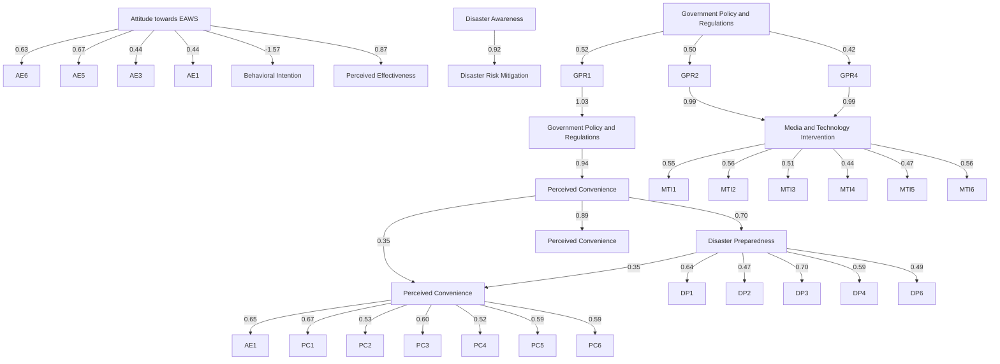
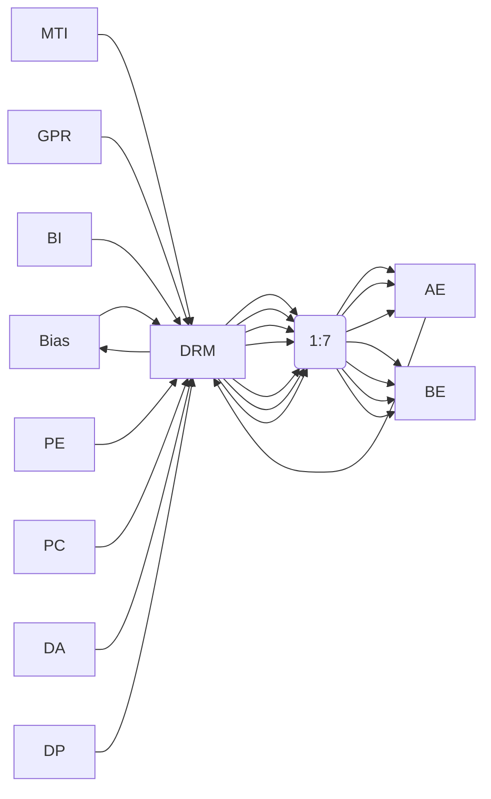

Article

# Emergency Alert and Warning Systems and Their Impact on Sustainable Disaster Preparedness and Awareness in the Philippines: A SEM–ANN Analysis

Charmine Sheena R. Saflor 1,2,\* and Kyla Kudhal 1,2

School of Innovation and Sustainability, De La Salle University, Biñan City 4024, Philippines; kyla\_kudhal@dlsu.edu.ph  
2 Department of Industrial and Systems Engineering, De La Salle University, Manila 1004, Philippines  
Correspondence: charmine.saflor@dlsu.edu.ph

## Abstract

Emergency Alert and Warning Systems (EAWSs) are essential components of sustainable disaster risk reduction, providing communities with timely information to prepare for and respond to impending hazards. In the Philippines, one of the world’s most disaster-prone countries, earthquakes, typhoons, and other natural hazards occur frequently. However, national statistics from 2018 indicated that only 40% of Filipinos considered themselves well prepared for disasters, while 31% reported being slightly prepared or not prepared at all. This study investigates the perceived effectiveness of EAWSs in enhancing disaster awareness and preparedness among Filipino residents. Guided by the Theory of Planned Behavior (TPB), the research develops an integrated framework to examine behavioral, technical, and perceptual factors influencing preparedness intentions. Data were collected from 200 respondents through a structured survey. Structural Equation Modeling (SEM) was employed to identify significant linear relationships among the constructs, while an Artificial Neural Network (ANN) analysis was subsequently applied to capture nonlin ear patterns and rank the relative importance of key predictors. Unlike previous studies that rely solely on SEM or descriptive approaches, the combined SEM–ANN framework enables a more comprehensive understanding of both causal relationships and complex behavioral dynamics influencing disaster preparedness. The findings reveal that behavioral intention, system reliability, message clarity, and trust in EAWS substantially affect individuals’ preparedness behavior and risk mitigation actions. These results underscore the importance of strengthening EAWS design and communication strategies to support long-term disaster resilience. The study provides practical insights for national agencies, local governments, and policymakers on refining emergency communication systems and developing sustainable, evidence-based disaster preparedness initiatives.

Check for updates

Academic Editor: David Pastor-Escuredo

Received: 14 January 2026

Revised: 12 March 2026

Accepted: 23 March 2026

Published: 6 April 2026

Copyright: © 2026 by the authors. Licensee MDPI, Basel, Switzerland. This article is an open access article distributed under the terms and conditions of the Creative Commons Attribution (CC BY) license.

Keywords: emergency alert warning systems; structural equation modeling; theory of planned behavior; disaster preparedness

## 1. Introduction

Emergencies are typically unexpected events that can occur at any time and place, often resulting in loss of life and damage to property [1]. In the twenty-first century, effective disaster risk reduction increasingly depends on the integration of advanced systems and technologies that enable timely interventions and precautionary measures [2]. Among these, Emergency Alert and Warning Systems (EAWSs) play a critical role by allowing authorities to communicate timely, accurate, and actionable information to the public before, during, and after emergency events through multiple channels such as short message service (SMS), mobile applications, television, radio, and digital platforms [3].

Globally implemented systems, such as the Integrated Public Alert and Warning System (IPAWS) in the United States, demonstrate the potential of coordinated warning infrastructures to disseminate authenticated emergency information across multiple communication media [4]. However, the effectiveness of such systems extends beyond technological capability and is strongly influenced by governance arrangements, communication strategies, and public response behaviors.

In the Philippines, EAWSs are particularly vital due to the country’s high exposure to natural hazards, including typhoons, earthquakes, floods, and volcanic eruptions. National and local warning mechanisms coordinated by the Department of Information and Communications Technology (DICT), the National Disaster Risk Reduction and Management Council (NDRRMC), and Local Government Units (LGUs)—utilize broadcast media, cell broadcasts, and digital platforms to disseminate alerts to communities [3,5,6]. Despite these efforts, institutional coordination challenges, policy limitations, and public trust issues may reduce the overall effectiveness of warning dissemination.

The urgency of strengthening EAWS in the Philippine context is underscored by its geographic location along the Pacific Ring of Fire. Approximately 20 typhoons affect the country annually [7], and recent seismic risk indices for earthquakes and tsunamis remain among the highest globally [8]. Despite these persistent risks, national data indicate that disaster preparedness levels among Filipino residents remain low, with only 40% reporting sufficient preparedness and 31% reporting limited or no preparedness [9]. Prior research suggests that preparedness is shaped not only by hazard exposure but also by individual perceptions, trust in warning systems, and access to timely and understandable information.

This study addresses these challenges by evaluating the perceived effectiveness of EAWS in enhancing disaster preparedness and awareness in the Philippines. Using a hybrid analytical approach that integrates Structural Equation Modeling (SEM) and Artificial Neural Networks (ANNs), the study examines how behavioral factors (e.g., attitudes and social norms), technological perceptions (e.g., perceived convenience and effectiveness), and governance-related influences jointly shape public response to emergency alerts. SEM is used to validate theoretical relationships among constructs, while ANN captures nonlinear interactions to improve predictive accuracy and explanatory depth.

This study is aligned with the global Early Warnings for All (EW4All) initiative, which seeks to ensure universal protection through effective early warning systems by 2027. By examining EAWS through integrated behavioral, technological, and public policy lenses, this study contributes to the four EW4All pillars: disaster risk knowledge; detection and monitoring; warning dissemination and communication; and preparedness and response capabilities.

However, a significant gap persists in the literature regarding methodological integration in EAWS research. Previous studies examining disaster preparedness and early warning systems have predominantly employed either purely descriptive approaches, conventional Structural Equation Modeling (SEM), or isolated machine learning techniques, but rarely combined them in a complementary framework. Machine Learning-based ap proach to train the datasets to determine the accuracy of findings. Machine learning (ML), which is a branch of artificial intelligence (AI) and computer science, can be explained by the following statement: machine learning (ML) is based on the use of data and algorithms to simulate human cognitive processes and become more accurate over time. Similarly, simulated neural networks (SNNs) or artificial neural networks (ANNs) are part of ML that is modeled after the communication of neurons in the human brain [10].

Studies utilizing SEM, such as those by Gutteling et al. [11] and Kreibich et al. [12], have effectively identified linear relationships between behavioral factors (e.g., perceived threat, social norms, message quality) and emergency response intentions. However, SEM alone cannot capture the complex, non-linear interactions that characterize human behavior during disasters, such as threshold effects in trust-building or diminishing returns from repeated warning exposure [13]. Conversely, research applying Artificial Neural Networks (ANN) in disaster contexts, including Garcia et al. [14] and Zhang et al. [15], has demonstrated strong predictive capability but lacks a theory-driven explanation of causal mechanisms, functioning as ‘black-box’ models that cannot test theoretical frameworks like the Theory of Planned Behavior.

While hybrid SEM–ANN approaches have emerged in fields such as technology adoption and consumer behavior [16,17], their application in disaster preparedness research, particularly in evaluating early warning systems in developing country contexts, remains remarkably limited. No study to date has integrated the Theory of Planned Behavior with a hybrid SEM–ANN framework to simultaneously examine governance structures, technological perceptions, and behavioral intentions in the context of Emergency Alert and Warning Systems.

This methodological gap is significant because disaster preparedness behavior involves both linear cognitive processes (amenable to SEM) and non-linear interactions between trust, prior disaster experience, emotional response, and situational factors (better captured by ANN). The present study addresses this gap by (1) applying SEM to validate theoretical relationships derived from TPB, (2) employing ANN to detect non-linear patterns and rank predictor importance, and (3) demonstrating how this integrated framework provides both explanatory depth and predictive accuracy that single-method approaches cannot achieve. This represents a novel methodological contribution to disaster risk reduction research.

This research aligns with the global Early Warnings for All (EW4All) initiative, led by the International Telecommunication Union and its partners, which aims to ensure universal protection through effective early warning systems by 2027 [18]. Recent 2026 updates to the initiative emphasize the transformative potential of artificial intelligence and data-driven approaches to strengthen the four EW4All pillars: disaster risk knowledge; detection and monitoring; warning dissemination and communication; and preparedness and response capabilities [19,20]. The present study’s hybrid SEM–ANN framework contributes to this agenda by demonstrating how machine learning can complement traditional behavioral modeling to enhance understanding of public response to emergency alerts. Furthermore, the multidimensional impact assessment approach proposed by Pastor Escuredo et al., which integrates heterogeneous data sources to capture the socio-economic magnitude of disasters, supports the methodological rationale for combining linear and non-linear analytical techniques in disaster research [21]. Finally, this study’s focus on behavioral intention and preparedness outcomes connects directly to the Anticipatory Action framework advanced by the UN Office for the Coordination of Humanitarian Affairs (OCHA), which emphasizes acting ahead of predicted hazards through pre-agreed triggers and pre-arranged financing to prevent or reduce humanitarian impacts [22]. By integrating these global frameworks, the study positions local empirical findings within the broader context of international disaster risk reduction efforts.

## Statement of the Problem and Objectives

Despite the Philippines’ high vulnerability to natural disasters, existing Emergency Alert and Warning Systems have not consistently translated into high levels of public preparedness, as reflected in national survey data indicating low preparedness among residents [9]. Furthermore, current EAWS research often underexamines the role of gov ernment policies and governance structures and relies primarily on traditional statistical methods that may not fully capture complex behavioral dynamics.

To address these limitations, this study aims to evaluate the effectiveness of EAWS using a machine learning-based SEM–ANN approach. Specifically, it examines how government policies, social norms, attitudes, perceived convenience, and perceived effectiveness influence behavioral intention, disaster awareness, preparedness, and risk mitigation, to inform strategies to enhance disaster preparedness and response in the Philippine context.

## 2. Related Studies and Hypotheses Development

Recent studies have increasingly emphasized the role of Emergency Alert and Warning Systems (EAWSs) in enhancing disaster preparedness and awareness, particularly in disaster-prone regions such as the Philippines. Effective and timely dissemination of early warnings has been shown to significantly improve community preparedness and response. For instance, Cruz et al. [23] highlighted the importance of community-based early warning systems in strengthening local disaster preparedness through prompt information delivery. Similarly, the integration of mobile applications and social media platforms has been found to be critical for disseminating real-time disaster information, enabling faster communication between authorities and citizens and improving response efficiency and community resilience [24,25]. In the Philippine context, Magno [26] emphasized that the effectiveness of disaster warning systems depends heavily on public trust and confidence in the technologies used.

Advancements in artificial intelligence and machine learning have further enhanced disaster management capabilities by improving predictive accuracy and supporting datadriven decision-making. Studies have demonstrated that AI-based systems can optimize resource allocation and improve response strategies, particularly in high-risk regions where rapid decision-making is essential to reduce casualties [14,27]. In addition to technological capacity, cultural and geographic factors also play a significant role in shaping preparedness and response behaviors. Lopez et al. [28] stressed the importance of incorporating local knowledge and community-based strategies into disaster preparedness initiatives. Empirical evidence from Southeast Asia indicates that trust in early warning systems is directly associated with compliance and preparedness behavior, with Tan and Villanueva [29] noting that confidence in system credibility enhances public willingness to act on warn ings. Collectively, these studies underscore the interdependence of technology, governance, public trust, and education in promoting effective disaster preparedness [30].

To examine these complex relationships, this study is grounded in the Theory of Planned Behavior (TPB), originally proposed by Ajzen [31]. TPB posits that behavioral intentions are influenced by three key determinants: attitudes toward the behavior, subjective norms, and perceived behavioral control. Within the context of disaster preparedness, TPB provides a robust framework for understanding how individuals’ attitudes toward emergency warnings, perceived social expectations, and confidence in their ability to respond influence their intention to engage in preparedness actions, such as heeding alerts or participating in preparedness activities.

Despite its strengths, TPB has recognized limitations. The theory primarily emphasizes individual decision-making and assumes that behavioral intention is the immediate precursor to action, which may not fully account for situational constraints, past disaster experiences, or dynamic environmental conditions encountered during real-world emergencies [32]. Moreover, TPB has been criticized for its limited attention to collective or community-level preparedness, which is a critical component of disaster risk reduction [33].

Alternative theoretical perspectives have been applied to address these limitations. Protection Motivation Theory (PMT) focuses on threat appraisal and coping appraisal as key drivers of protective behavior, suggesting that individuals are more likely to engage in preparedness actions when they perceive both a credible threat and sufficient coping resources [34]. However, PMT has been criticized for its heavy reliance on threat-based assumptions, which may not fully capture preparedness dynamics in contexts where perceived risk is low or normalized [35]. Similarly, Social Cognitive Theory (SCT) empha sizes observational learning, self-efficacy, and social influence, offering insights into how community participation and social networks affect preparedness behavior [36]. While SCT provides valuable perspectives on collective learning processes, it is less focused on intention-based behavioral prediction compared to TPB.

Given the study’s objective to examine behavioral intention and its influence on disaster awareness and preparedness, TPB is adopted as the primary theoretical framework. Its clear causal pathways and strong empirical support in disaster-related research make it suitable for modeling individual responses to emergency alerts while allowing integration with governance, technological, and perceptual factors. Figure 1 presents the proposed theoretical framework guiding this study.

```mermaid
graph LR
  A["Social Norms"] -->|H6| B["Perceived Effectiveness"]
  C["Attitude towards EAWS"] -->|H3| A
  D["Government Policy and Regulations"] -->|H2| E["Behavioral Intention"]
  F["Media and Technology Intervention"] -->|H1| E
  G["Perceived Convenience"] -->|H4| E
  H["Disaster Preparedness"] -->|H5| E
  I["Disaster Awareness"] -->|H16| B
  J["Disaster Risk Mitigation"] -->|H21| B
  K["Perceived Effectiveness"] -->|H8| C
  L["Perceived Effectiveness"] -->|H10| C
  M["Perceived Effectiveness"] -->|H13| C
  N["Perceived Effectiveness"] -->|H14| E
  O["Perceived Effectiveness"] -->|H16| B
  P["Perceived Effectiveness"] -->|H17| D
  Q["Perceived Effectiveness"] -->|H18| E
  R["Perceived Effectiveness"] -->|H19| D
  S["Perceived Effectiveness"] -->|H20| D
  T["Perceived Effectiveness"] -->|H21| J
  U["Perceived Effectiveness"] -->|H22| J
  V["Perceived Effectiveness"] -->|H23| J
  W["Perceived Effectiveness"] -->|H24| J
  X["Perceived Effectiveness"] -->|H25| J
  Y["Perceived Effectiveness"] -->|H26| J
  Z["Perceived Effectiveness"] -->|H27| J
  AA["Perceived Effectiveness"] -->|H28| J
  AB["Perceived Effectiveness"] -->|H29| J
  AC["Perceived Effectiveness"] -->|H30| J
  AD["Perceived Effectiveness"] -->|H31| J
  AE["Perceived Effectiveness"] -->|H32| J
  AF["Perceived Effectiveness"] -->|H33| J
  AG["Perceived Effectiveness"] -->|H34| J
  AH["Perceived Effectiveness"] -->|H35| J
  AI["Perceived Effectiveness"] -->|H36| J
  AJ["Perceived Effectiveness"] -->|H37| J
  AK["Perceived Effectiveness"] -->|H38| J
  AL["Perceived Effectiveness"] -->|H39| J
  AM["Perceived Effectiveness"] -->|H40| J
  AN["Perceived Effectiveness"] -->|H41| J
  AO["Perceived Effectiveness"] -->|H42| J
  AP["Perceived Effectiveness"] -->|H43| J
  AQ["Perceived Effectiveness"] -->|H44| J
  AR["Perceived Effectiveness"] -->|H45| J
  AS["Perceived Effectiveness"] -->|H46| J
  AT["Perceived Effectiveness"] -->|H47| J
  AU["Perceived Effectiveness"] -->|H48| J
  AV["Perceived Effectiveness"] -->|H49| J
  AW["Perceived Effectiveness"] -->|H50| J
  AX["Perceived Effectiveness"] -->|H51| J
  AY["Perceived Effectiveness"] -->|H52| J
  AZ["Perceived Effectiveness"] -->|H53| J
  BA["Perceived Effectiveness"] -->|H54| J
  BAQ["Perceived Effectiveness"] -->|H55| J
  BAY["Perceived Effectiveness"] -->|H56| J
  BAZ["Perceived Effectiveness"] -->|H57| J
  BAAY["Perceived Effectiveness"] -->|H58| J
  BAAYQ["Perceived Effectiveness"] -->|H59| J
  BAAYR["Perceived Effectiveness"] -->|H60| J
  BAAYS["Perceived Effectiveness"] -->|H61| J
  BAAYT["Perceived Effectiveness"] -->|H62| J
  BAAYU["Perceived Effectiveness"] -->|H63| J
  BAAYV["Perceived Effectiveness"] -->|H64| J
  BAAYW["Perceived Effectiveness"] -->|H65| J
  BAAYX["Perceived Effectiveness"] -->|H66| J
  BAAYYQ["Perceived Effectiveness"] -->|H67| J
  BAAYYR["Perceived Effectiveness"] -->|H68| J
  BAAYYWQ["Perceived Effectiveness"] -->|H69| J
  BAAYXYQ["Perceived Effectiveness"] -->|H70| J
  BAAYYXQ["Perceived Effectiveness"] -->|H71| J
  BAAYYWQ["Perceived Effectiveness"] -->|H72| J
  BAAYYXYQ["Perceived Effectiveness"] -->|H73| J
  BAAYYWQ["Perceived Effectiveness"] -->|H74| J
  BAAYYXYQ["Perceived Effectiveness"] -->|H75| J
  BAAYYWQ["Perceived Effectiveness"] -->|H76| J
  BAAYYXYQ["Perceived Effectiveness"] -->|H77| J
  BAAYYWQ["Perceived Effectiveness"] --> H21
```

flowchart

Figure 1. Theoretical framework.

While alternative theoretical perspectives, such as Protection Motivation Theory (PMT) and Social Cognitive Theory (SCT), offer valuable insights into disaster-related behavior, they are less suited to the specific analytical objectives of this study. PMT primarily emphasizes threat appraisal and coping mechanisms, which are useful for explaining protective responses under perceived high-risk conditions but may not adequately capture the broader influence of governance, system trust, and perceived convenience in shaping preparedness behavior [34,35]. Similarly, SCT highlights observational learning, self-efficacy, and social influence, providing important insights into collective learning processes; however, it places less emphasis on intention as a central mediating construct linking perception to action [36]. In contrast, the Theory of Planned Behavior (TPB) offers a more structured and parsimonious framework for modeling behavioral intention as a key mediating variable between system perception and disaster preparedness. Its explicit integration of attitudes, subjective norms, and perceived behavioral control allows for a clearer examination of how perceptions of Emergency Alert and Warning Systems, government policies, and social influences translate into preparedness intentions and subsequent actions [31–33]. For these reasons, TPB is adopted as the primary theoretical framework in this study, as it provides the most appropriate foundation for analyzing intention-driven preparedness behavior within a technology-enabled early warning context.

## 2.1. Hypotheses Development

To improve clarity and reduce conceptual redundancy, the hypotheses are organized into thematic sub-blocks reflecting governance influences, system perceptions, social and media effects, behavioral mechanisms, and outcome pathways. This structure preserves analytical distinctiveness while improving coherence.

## 2.1.1. Background of Perceptions: Prior Factors Shaping Views of EAWS

This set of hypotheses examines the foundational factors that shape individuals’ perceptions of Emergency Alert and Warning Systems. Government policies establish the institutional context within which EAWS operate, influencing both technological infrastructure and public attitudes [37–44]. Policy decisions influence media framing, institutional credi bility, and public engagement, thereby affecting attitudes, perceived system performance, and behavioral intention. Media exposure supported by government communication can reduce uncertainty and enhance policy legitimacy [37,38]. Moreover, policy responsiveness during crises, particularly in addressing emotional and psychological needs, has been shown to affect public compliance with emergency systems [39,40]. Trust in policy effectiveness and government-led disaster programs further strengthens intention to engage in preparedness behaviors [38,39]. Policies that mandate drills, provide clear guidelines, and invest in early warning infrastructure also influence perceptions of system convenience and accessibility [40]. In addition, coordinated policy support for media and technology in terventions can enhance information dissemination and motivate proactive responses [41].

Social norms also form part of the perceptual background in which the effectiveness of Emergency Alert and Warning Systems (EAWSs) is embedded, as these systems operate within social contexts that shape norms, expectations, and attitudes. High-quality warning messages, emotional arousal, and perceived social pressure can influence individuals to adopt adaptive or avoidance behaviors [11]. When emergency alerts are perceived as credible and socially endorsed, individuals are more likely to internalize preparedness norms and evaluate the system positively [43].

Although social norms typically precede attitudes in applications of the Theory of Planned Behavior (TPB) [31], the reverse pathway, where attitudes shape perceived norms, is also theoretically plausible when individuals internalize their positive evaluations as socially shared expectations [43]. In disaster contexts, personal trust in EAWSs may lead individuals to assume that others share similar levels of trust, thereby influencing their perception of community norms and preparedness expectations [11].

Media and technology interventions further shape perceptions by facilitating timely access to disaster information and reducing cognitive and logistical barriers to response. Ef fective use of communication platforms enhances perceived convenience, particularly when information is accessible, understandable, and delivered through multiple channels [44].

H1. Government Policy and Regulations have a positive relationship with Attitude towards Media and Technology Intervention.

H2. Government Policy and Regulations have a positive relationship with Attitude towards EAWS.

H3. Attitude towards EAWS has a positive relationship with Social Norms.

H4. Government Policy and Regulations have a positive relationship with Perceived Convenience.

H5. Media and Technology Intervention has a positive relationship with Perceived Convenience.  
H6. Social Norms have a positive relationship with Perceived Effectiveness.

## 2.1.2. Predictors of Behavioral Intention

This group focuses on factors that directly influence individuals’ intentions to act upon emergency warnings. Attitudes toward EAWS influence both perceived system effectiveness and individuals’ intentions to act. Prior experience, preparedness knowledge, and the ability to interpret warnings determine whether alerts translate into protective action [12]. Emotional proximity to past disaster impacts further shapes intention, as individuals with direct or indirect experience of loss demonstrate stronger preparedness intentions [45].

Perceived effectiveness and perceived convenience represent distinct yet complementary perceptual mechanisms influencing behavioral intention. Individuals are more inclined to act when they believe preparedness actions are effective in reducing risk [45], while ease of access and usability further support intention formation [46–48].

Social norms also exert direct influence on intention, as community expectations motivate preparedness actions [49,50]. Beyond convenience, media and technology may directly influence behavioral intention by shaping individuals’ awareness of risks and confidence in response actions [51]. However, prior research suggests that this direct effect may be mediated by perceived convenience and attitudes rather than operating independently [52]. Accordingly, the present study tests both the direct pathway (MTI→BI) and the indirect pathway through perceived convenience (MTI→PC→BI).

It is important to note that while H12 (MTI→BI) is hypothesized based on theoretical considerations, prior empirical findings suggest this direct relationship may not always hold. Liu et al. [53] found that while disaster information form and source had significant effects on public outcomes, there was no consistent direct predictor of behavioral intentions, suggesting that the influence of media and technology on intention may be fully mediated by other perceptual factors such as convenience, trust, and perceived effectiveness. This study will test both direct and indirect pathways to clarify the mechanism through which media and technology interventions influence disaster preparedness intentions.

H7. Government Policy and Regulations have a positive relationship with Behavioral Intention.  
H8. Attitude towards EAWS has a positive relationship with Perceived Effectiveness.  
H9. Attitude towards EAWS has a positive relationship with Behavioral Intention.  
H10. Perceived Effectiveness has a positive relationship with Behavioral Intention.  
H11. Perceived Convenience has a positive relationship with Behavioral Intention.  
H12. Media and Technology Intervention has a positive relationship with Behavioral Intention.  
H13. Social norms have a positive relationship with Behavioral Intention.

## 2.1.3. Results of Preparation: Awareness, Preparedness, and Risk Mitigation Outcomes

This group examines the outcomes of behavioral intention and their interrelationships. Consistent with the Theory of Planned Behavior, behavioral intention serves as a central mediator linking perceptions and attitudes to preparedness outcomes. Prior studies show that intention significantly predicts awareness-building activities and preparedness actions, including participation in mitigation programs and compliance with disaster guidance [54–56].

Disaster awareness and preparedness are interrelated processes that contribute to effective risk mitigation. Perceived effectiveness of warning systems enhances awareness and preparedness when messages are trusted, timely, and authoritative [57,58]. Perceived convenience also supports awareness and preparedness by facilitating engagement with disaster programs and institutional support structures [59–61]. Educational initiatives and psychological readiness further strengthen the feedback loop between awareness and preparedness [62]. Ultimately, awareness and preparedness function as critical pathways toward disaster risk mitigation, consistent with disaster risk management principles and international frameworks such as the Sendai Framework [63,64].

H14. Behavioral Intention has a positive relationship with Disaster Awareness.  
H15. Behavioral Intention has a positive relationship with Disaster Preparedness.  
H16. Perceived Effectiveness has a positive relationship with Disaster Awareness.  
H17. Perceived Effectiveness has a positive relationship with Disaster Preparedness.  
H18. Perceived Convenience has a positive relationship with Disaster Awareness.  
H19. Perceived Convenience has a positive relationship with Disaster Preparedness.  
H20. Disaster Preparedness has a positive relationship with Disaster Awareness.  
H21. Disaster Awareness has a positive relationship with Disaster Risk Mitigation.  
H22. Disaster Preparedness has a positive relationship with Disaster Risk Mitigation.

## 3. Methodology

## 3.1. Participants and Procedure

The study employed a descriptive correlational approach to gather data, utilizing an online platform through a shared Google Forms and printed questionnaires distributed to participants. As a general guideline, sample sizes ranging from 200 to 300 respondents are considered to yield acceptable margins of error and accurate data [65]. A sample size of 200 participants is generally considered adequate for SEM, especially for models with a moderate number of variables. Several studies and statistical guidelines support this sample size, with considerations regarding model complexity and the type of SEM being used. Moreover, researchers suggest that sample sizes of at least 200 participants are sufficient to achieve good model fit and to avoid issues with statistical power in the context of SEM [66]. This exceeds the minimum recommended indicator-to-sample ratio of 10:1 for SEM models with ten latent variables and 52 indicators, satisfying established guidelines for model complexity [13,67,68].

The target population was Filipino residents who are 18 years of age and older, who (1) live in a disaster-prone area in the Philippines, (2) had a personal experience with at least one major natural disaster in the past five years (e.g., typhoon, earthquake, flood), and (3) received at least one official emergency notification (via SMS, broadcast, mobile application). Recruitment was conducted via online methods (e.g., social media, community groups) and face-to-face survey distribution in the selected barangays so that there was a variation in both geography and demographics within the target population.

An eligibility check was conducted using a short pre-survey screening according to the following inclusion criteria. All participants provided informed consent. Although purposive sampling would restrict generalization of the results of such studies, because the study aims to investigate the perceptions and behaviors of a very relevant population that has experienced a disaster, it is reasonable to apply purposive sampling in the study, which would provide some background and analysis of the results in developing a theory.

A hybrid SEM–Artificial Neural Network (ANN) framework was used to analyze the data. Hypothetical linear hypotheses between constructs were tested with the help of SEM, and then an ANN was applied to identify non-linear, complex patterns within the data, which provides a more detailed perspective on the factors that can impact the effectiveness of EAWS. The assumptions of the study are the honesty of the respondents and the overall consistency of EAWS activities across regions. It is only applicable in the Philippine context, and the results are explained, considering the regional and hazard-specific variability (e.g., lead times vary between typhoons and earthquakes).

## 3.2. Survey Instruments and Measurements

The survey instrument was developed by adapting validated constructs from prior research on the Theory of Planned Behavior (TPB) and disaster communication [31]. It was designed to measure ten key variables influencing the perception and effectiveness of Emergency Alert and Warning Systems (EAWSs).

A five-point Likert scale (1 = strongly disagree to 5 = strongly agree) was used for all items. The constructs, their theoretical foundations, and sample measurement foci are outlined below:

1. Government Policy and Regulations: Assessed perceptions of how governmental rules and frameworks shape emergency protocols and public compliance [67,69].  
2. Attitude towards EAWSs: Measured trust, perceived reliability, and overall evaluation of the alert system [31,53,70].  
3. Social Norms: Evaluated the influence of community expectations and peer behaviors on the decision to heed warnings [31,67].  
4. Media and Technology Intervention: Focused on the perceived role and effectiveness of various platforms (e.g., social media, mobile apps) in disseminating warnings [53].  
5. Behavioral Intention: Captured the self-reported likelihood of taking protective actions (e.g., evacuating) in response to an alert [31,71].  
6. Perceived Effectiveness: Gauged beliefs about the system’s capacity to mitigate disaster risks and save lives [67].  
7. Perceived Convenience: Measured the ease of receiving, understanding, and acting upon EAWS messages [72].  
8. Disaster Awareness: Evaluated knowledge of local hazards and the importance of preparedness [73].  
9. Disaster Preparedness: Assessed tangible readiness actions, such as having emergency plans or supplies [71].  
10. Disaster Risk Mitigation: Measured support for or engagement in proactive measures to reduce disaster impacts [67].

The questionnaire consisted of three parts: a research introduction, demographic items, and the main survey section, which contained the scaled items for these ten constructs (see Table S1). The complete instrument is available in the Supplementary Materials (Table S1).

## 3.3. Statistical Analysis: Hybrid SEM–ANN Approach

To analyze the factors affecting the effectiveness of EAWSs, a two-stage hybrid Structural Equation Modeling (SEM) and Artificial Neural Network (ANN) approach was used to conduct a thorough analysis of the factors. The hypothesized linear relationships among the latent constructs developed through the survey were first tested using Structural Equa tion Modeling (SEM) [74]. It is very much appropriate to test the theoretical framework, founded on the Theory of Planned Behavior [31], by evaluating the direct and indirect paths as well as the general fit of the model. The usefulness of SEM makes it possible to model latent variables and test complicated theoretical relationships [16].

A further application of ANN was used to develop the complex non-linear patterns and interactions of the data [75]. ANN is an effective machine learning model that assumes nothing with respect to data distribution, and it is able to identify complex, non-linear relationships between variables [13,15]. This is essential in crisis preparedness studies where human behavioral reactions tend to be dependent on complicated interacting factors that cannot be comprehensively forecasted by linear models [13].

The combination of these approaches helps to develop a solid analytical framework. SEM offers a theory-based validation of the structural relationships, whereas ANN is used to complete it through determining non-linear patterns and increasing predictive strength of the model [16,17]. It can therefore be concluded that this hybrid SEM–ANN method is more comprehensive and information-intensive as to the factors influencing disaster preparedness and the perceived efficacy of EAWS.

## 4. Results

## 4.1. Participant Demographics

The survey involved 233 individuals who live in hazard-prone communities in Occidental Mindoro, which was chosen due to its recorded high susceptibility to coastal flooding, landslides, and other natural hazards [76,77]. All the procedures were accepted by the De La Salle University Ethics Review Committee (Reference #2025-156C). The sample size is consistent with the support of the analytical studies that use Structural Equation Modeling [16]. Most of the respondents (60.5) were female, and the majority (60.5) were aged 18–29. Geographically, the majority of respondents were based in San Jose (56.7%), Magsaysay, and Rizal (9.4% each). Education wise 48.15% were senior high school graduates, and 25.3% were college graduates.

## 4.2. Statistical Analysis: Structural Equation Modeling and ANN

The analysis was based on a hybrid SEM–ANN framework, as outlined in the Methodology (Section 3.3). The initial SEM model was evaluated using standard goodness-of-fit measures to assess its fit to the observed data. Table 1 presents the fit indices, their obtained values, and the cutoff criteria used for interpretation.

It is important to note that fit indices should be interpreted in light of model complexity, sample size, and research context rather than as rigid universal thresholds [78,79]. For complex behavioral models with multiple latent constructs (the present study includes ten latent variables), more flexible cutoff criteria are appropriate, as fit indices are systematically influenced by model size, degrees of freedom, and the number of observed indicators [80]. Accordingly, this study adopts established guidelines that recognize acceptable fit within ranges rather than absolute cutoffs.

The Minimum Discrepancy (CMIN/DF) value of 1.737 falls below the recommended threshold of <3.00, indicating an acceptable fit [81,82]. The Goodness-of-Fit Index (GFI) of 0.779 exceeds the >0.70 criterion recommended for complex models [83,84], acknowledging that GFI values ≥ 0.90 are typically observed in simpler models, while values between

0.70 and 0.89 are acceptable in models with greater complexity [80]. The Comparative Fit Index (CFI) of 0.827 and Tucker–Lewis Index (TLI) of 0.831 both exceed the >0.70–0.80 thresholds considered acceptable for models with multiple latent constructs [81,85,86]. Although stricter cutoffs $( \mathrm { C F I } \ge 0 . 9 0 \mathrm { o r } 0 . 9 5 )$ are often cited [79], recent methodological work demonstrates that CFI values are negatively associated with model size, suggesting that more lenient thresholds are appropriate for complex models [80].

The Root Mean Square Error of Approximation (RMSEA) of 0.056 falls below the ≤0.08 threshold for acceptable fit and within the 0.05–0.08 range, indicating good fit [86,87]. The Normed Fit Index (NFI) of 0.676 approaches 1.0 as recommended [88], while the Incremental Fit Index (IFI) of 0.831 exceeds the >0.80 criterion [89]. Collectively, these indices indicate that the hypothesized model demonstrates acceptable fit to the observed data, supporting the validity of subsequent path interpretations.

Table 1. Model fit values.

<table><tr><td>Goodness-of-Fit Measures of SEM</td><td>Parameter Estimates</td><td>Minimum Cut-Off</td><td>Interpretation</td></tr><tr><td>Minimum Discrepancy (CMIN/DF)</td><td>1.737</td><td>&lt;3.00</td><td>[81,82]</td></tr><tr><td>Goodness-of-Fit Index (GFI)</td><td>0.779</td><td>&gt;0.70</td><td>[83]</td></tr><tr><td>Comparative Fit Index (CFI)</td><td>0.827</td><td>&gt;0.70</td><td>[81]</td></tr><tr><td>Root Mean Squared Error of Approximation (RMSEA)</td><td>0.056</td><td>≤0.08</td><td>[87]</td></tr><tr><td>Tucker-Lewis Index (TLI)</td><td>0.831</td><td>&gt;0.80</td><td>[85]</td></tr><tr><td>Normed Fit Index (NFI)</td><td>0.676</td><td>Approach 1</td><td>[88]</td></tr><tr><td>Incremental Fit Index (IFI)</td><td>0.831</td><td>&gt;0.80</td><td>[89]</td></tr></table>

Note: Cutoff criteria are drawn from established SEM literature. For complex models with multiple latent constructs (ten variables in this study), more flexible thresholds are appropriate as fit indices are influenced by model size, degrees of freedom, and number of observed indicators [78,80]. RMSEA values ≤ 0.08 indicate acceptable fit [81,90]; CFI/TLI values ≥0.70–0.80 are considered acceptable in complex behavioral models [83,88,90].

Before presenting the detailed statistical results, it is useful to briefly summarize the main patterns observed in the analysis. In general, the findings show that behavioral intention plays a key mediating role, connecting governance-related factors and perceptions of the Emergency Alert and Warning System to disaster awareness, preparedness, and risk mitigation outcomes. How people perceive the EAWS, particularly in terms of its effectiveness, convenience, and trustworthiness, shapes preparedness-related behaviors both directly and indirectly. These results indicate that although technological and policyrelated factors are important, their influence on disaster preparedness is largely realized through individuals’ intentions to act. The following sections present the detailed Structural Equation Modeling (SEM) and Artificial Neural Network (ANN) results that support these observations.

In Figure 2, the initial structural equation modeling (SEM) is presented, exploring the perceived effectiveness of Emergency Alert and Warning Systems (EAWSs) in mitigating disasters. According to [90], researchers may consider item loadings between 0.40 and 0.70. Whereas other resources suggest accepting factor loadings of at least 0.50, which is also acceptable, as it indicates a correlation.

Table 2 displays the results of testing a formulated hypothesis, and its significance is determined by the p-value not exceeding 0.05.

flowchart

This image is a structural equation model (SEM) path diagram illustrating the relationships between various social and political factors, such as Attitude towards EAWS, Behavioral Intention, and Disaster Awareness, with directional arrows indicating influence or dependency.

Figure 2. Initial SEM results.

Table 2. Hypothesis testing results.

<table><tr><td colspan="2">Hypothesis</td><td>p-Value</td><td>Interpretation</td></tr><tr><td>H1</td><td>There is a significant relationship between Government Policy and Regulations and Media and Technology Intervention</td><td>0.002</td><td>Significant [37]</td></tr><tr><td>H2</td><td>There is a significant relationship between Government Policy and Regulations and Attitude towards the EAWS</td><td>0.002</td><td>Significant [40]</td></tr><tr><td>H3</td><td>There is a significant relationship between Social Norms and Attitude towards the EAWS</td><td>0.001</td><td>Significant [11]</td></tr><tr><td>H4</td><td>There is a significant relationship between Attitude towards the EAWS and Perceived Effectiveness</td><td>0.008</td><td>Significant [91]</td></tr><tr><td>H5</td><td>There is a significant relationship between Attitude towards the EAWS and Behavioral Intention</td><td>0.002</td><td>Significant [91]</td></tr><tr><td>H6</td><td>There is a significant relationship between Government Policy and Regulations and Behavioral Intention</td><td>0.002</td><td>Significant [42]</td></tr><tr><td>H7</td><td>There is a significant relationship between Government Policy and Regulations and Perceived Convenience</td><td>0.205</td><td>Not Significant [92]</td></tr><tr><td>H8</td><td>There is a significant relationship between Media and Technology Intervention and Behavioral Intention</td><td>0.646</td><td>Not Significant [52]</td></tr><tr><td>H9</td><td>There is a significant relationship between Social Norms and Behavioral Intention</td><td>0.002</td><td>Significant [49]</td></tr><tr><td>H10</td><td>There is a significant relationship between Social Norms and Perceived Effectiveness</td><td>0.070</td><td>Not Significant [93,94]</td></tr><tr><td>H11</td><td>There is a significant relationship between Media and Technology Intervention and Perceived Convenience</td><td>0.018</td><td>Significant [95]</td></tr><tr><td>H12</td><td>There is a significant relationship between Perceived Effectiveness and Behavioral Intention</td><td>0.011</td><td>Significant [50]</td></tr><tr><td>H13</td><td>There is a significant relationship between Perceived Convenience and Behavioral Intention</td><td>0.156</td><td>Not Significant [96,97]</td></tr><tr><td>H14</td><td>There is a significant relationship between Behavioral Intention and Disaster Awareness</td><td>0.968</td><td>Not Significant [98]</td></tr><tr><td>H15</td><td>There is a significant relationship between Behavioral Intention and Disaster Preparedness</td><td>0.010</td><td>Significant [55]</td></tr><tr><td>H16</td><td>There is a significant relationship between Perceived Effectiveness and Disaster Awareness</td><td>0.928</td><td>Not Significant [99,100]</td></tr><tr><td>H17</td><td>There is a significant relationship between Perceived Effectiveness and Disaster Preparedness</td><td>0.334</td><td>Not Significant [101–103]</td></tr><tr><td>H18</td><td>There is a significant relationship between Perceived Convenience and Disaster Awareness</td><td>0.065</td><td>Not Significant [54]</td></tr><tr><td>H19</td><td>There is a significant relationship between Perceived Convenience and Disaster Preparedness</td><td>0.768</td><td>Not Significant [48]</td></tr><tr><td>H20</td><td>There is a significant relationship between Disaster Preparedness and Disaster Awareness</td><td>0.029</td><td>Significant [68]</td></tr><tr><td>H21</td><td>There is a significant relationship between Disaster Awareness and Disaster Risk Mitigation</td><td>0.003</td><td>Significant [63]</td></tr><tr><td>H22</td><td>There is a significant relationship between Disaster Preparedness and Disaster Risk Mitigation</td><td>0.404</td><td>Not Significant [104,105]</td></tr></table>

Based on the findings of the study, Government Policy and Regulations (GPRs) have a significant influence on Media and Technology Interventions (MTIs) $( p = 0 . 0 0 2 )$ . Despite the growing occurrence of natural disasters nowadays, there is scant research on how governments economically brace for such events. Local authorities can prepare for disasters by enhancing infrastructure, renovating buildings, and establishing shelters. However, these measures pose a dilemma between mitigating risk and disclosing potential hazards, which could concern prospective homebuyers. Increased media coverage can alleviate this issue by shedding light on hidden risks [37]. Aside from that, GPR also shows a significant relationship with Attitude towards Emergency Alert and Warning System (AE) $( p = 0 . 0 0 2 )$ A better understanding of the factors that influence users is important in compliance with health emergency and disaster management systems, which are frequently connected to government policies and regulations [40].

The result also showed direct Influence of Social Norms and Attitude towards the Emergency Alert and Warning System $( p = 0 . 0 0 1 )$ . People are more inclined to engage in adaptive behavior when experiencing heightened emotions, perceiving social pressure, and receiving high-quality warning messages. Following a warning message, increased risk perception, emotional intensity, and perceived social expectations lead to a higher likelihood of avoidance behavior. The findings indicate that emotions and social influences are significant predictors of desired behavior [11].

There is also a positive relationship between Attitude towards Emergency Alert and Warning System and Perceived Effectiveness (0.008), as well as Attitude towards Emergency Alert and Warning System and Behavioral Intention $( p = 0 . 0 0 2 )$ . Individuals who had a family member or friend affected by injury, damage, or loss were more inclined to anticipate taking protective actions for themselves or others. The significant variations in intentions between those with and without direct experience of pain or loss among close associates, compared to those who only felt shaking personally or witnessed loss through the media, suggest that differences in emotional impact associated with various experiences could influence behavioral intentions [91].

Meanwhile, Government Policy and Regulations portray a positive effect on Behavioral Intention $( p = 0 . 0 0 2 )$ . Trust in government also correlated positively with individuals’ willingness to engage in mitigation actions. Therefore, actively engaging the public through different forms of community involvement is likely to encourage individual-level disasterprevention behaviors [42].

On the other hand, Government Policy and Regulations have no significant relationship with Perceived Convenience (=0.205). The relationship between government and emergency alert systems is complex and multifaceted. Reference [94] found that there is no significant difference in the information-transmission ability among different emergency organization models. Also, the results proved that Media and Technology Interventions are not directly related to Behavior Intention $( p = 0 . 6 4 6 )$ ). Reference [52] found that while disaster information form and source had significant effects, there was no consistent predictor of behavioral intentions.

Social Norms showed a significant relationship with Behavioral Intention $( p = 0 . 0 0 2 )$ Social norms, including community attitudes, beliefs, and behaviors surrounding disaster preparedness and response, can significantly influence individuals’ intentions to engage in proactive actions. When disaster preparedness is seen as a shared responsibility within a community, individuals are more likely to adopt preparedness measures and participate in awareness activities [49]. Nonetheless, results showed that Social Norms and Perceived Effectiveness $( p = 0 . 0 7 0 )$ as not directly related. Study of [93] further emphasized the role of individual and community-level social capital, including perceived fairness and trust, in promoting disaster preparedness. This suggests that the influence of social norms on preparedness may be mediated by other factors such as trust and fairness. Additionally, reference [106] highlighted the role of social control in disaster preparedness, suggesting that the relationship between social norms and preparedness may be influenced by power dynamics and institutional perspectives. Therefore, while social norms can play a role in disaster preparedness, their direct relationship with perceived effectiveness may be influenced by a range of other factors.

There is also a significant relationship between Media and Technology Interventions and Perceived Convenience $( p = 0 . 0 1 8 )$ . Media platforms and technological tools play a crucial role in providing timely information, communication channels, and resources during disasters. When these interventions effectively deliver relevant information and support, individuals perceive them as convenient and valuable for staying informed and prepared [95].

The researchers also determined the significance of relationships between Perceived Effectiveness and Behavioral Intention $( p = 0 . 0 1 1 )$ . When individuals perceive certain actions or strategies for disaster preparedness as effective in reducing risks and protecting themselves and their communities, they are more likely to intend to engage in those behaviors [50]. While Perceived Convenience and Behavioral Intention $( p = 0 . 1 5 6 )$ is not directly correlated. Studies of $[ 9 6 , 9 7 ]$ both highlighted the role of psychological factors such as dispositional optimism, trait anxiety, and social support in predicting disaster preparedness behavior. These findings suggest that while perceived convenience may influence behavioral intention, it is not the sole determinant of actual preparedness behavior.

Meanwhile, Behavioral Intention has a negative relationship with Disaster Awareness $\left( { p = 0 . 9 6 8 } \right)$ and with Perceived Effectiveness and Disaster Awareness $( p = 0 . 9 2 8 )$ . The relationship between behavioral intention and disaster awareness is complex and influenced by numerous factors. There is no significant correlation between knowledge of disasters and disaster awareness behavior, suggesting that other factors may be at play [98]. The effectiveness of emergency alert systems in disaster awareness is a complex issue. While some studies have shown significant improvements in safety and compliance with the use of these [99], others have highlighted the importance of proper messaging and public participation in earthquake early warning systems [3]. These findings suggest that the relationship between the effectiveness of emergency alert systems and disaster awareness is multifaceted and may depend on numerous factors such as messaging, public participation, and system design.

The Behavioral Intention showed a significant relationship with Disaster Preparedness $( p = 0 . 0 1 0 )$ . Filipinos, with the intention of preparing for natural disasters, ultimately result in developing protective behaviors for natural disasters. Furthermore, the response or efforts of the government and the ability of an individual to acquire the necessary supplies before natural calamities are both crucial in developing an individual’s protective behavior. Apart from this, their willingness to prepare for calamities, take part in drills, acquire and share information, take some precautionary measures in the household, and create emergency kits can affect their willingness to prepare [55].

Relationship of variables Perceived Effectiveness and Disaster Awareness $( p = 0 . 9 2 8 )$ and Perceived Effectiveness and Disaster Preparedness $( p = 0 . 3 3 4 )$ has revealed an indirect relationship with each other [100] found that students’ disaster concern was more related to perceived preparedness than actual preparedness, and that perceived university preparedness was a significant predictor of disaster concern. Reference [101] highlighted the importance of perceived community efficacy in emergency preparedness, suggesting that leadership and community engagement are crucial factors. Reference [97] identified cognitive factors, attitude, and social support as determinants of disaster preparedness, with perceived severity, self-efficacy, and response efficacy being positively related to planning, mitigation, and response. Reference [102] emphasized the effectiveness of community disaster awareness training in increasing subjective disaster preparedness, particularly through personalized risk communication.

The study, however, found that Disaster Awareness and Disaster Preparedness $( p = 0 . 0 2 9 )$ have a significant effect on each other. The study by [62] has already determined that one factor that can affect disaster preparedness is the psychological components of disaster awareness. Research has demonstrated the significance of using creativity to foster imagination in education to increase teachers’ knowledge of disasters. Case studies created for aspiring educators could be useful for current educators as well. When a particular scenario is visualized, it prompts a person to consider a practical solution. While Disaster Preparedness and Disaster Risk Mitigation $( p = 0 . 4 0 4 )$ are not directly correlated. Risk aware ness did not always translate into preparedness, with factors such as personal experience, community support, and trust in local authorities playing a role [103]. The relationship between disaster preparedness and risk mitigation is complex and context-dependent. While risk perceptions can influence preparedness, this association is inconsistent and varies across different types of disasters [104].

Furthermore, Disaster Awareness exposed a significant relationship with Disaster Risk Mitigation $( p = 0 . 0 2 5 )$ . Disaster awareness and preparedness are part of disaster risk management, which refers to measures taken to prepare for and reduce the effects of disasters, to predict and prevent them where possible. The community is supposed to possess disaster awareness in order to be able to recognize the types of catastrophes that could affect them, whether or not they would have a major impact and whether they pose a risk to themselves [94].

Figure 3 shows an SEM that eliminates factor loadings less than 0.50 in order to improve precision and reliability. However, it is crucial to note that a prior study [88] found that factor loadings less than 0.50 but with a p-value less than 0.05 could still be significant and improve the model’s trustworthiness.

Table 3 displays the interrelationships and significance of the latent variables. Among the ten latent variables, most showed significant relationships with one another, with factor loadings consistently above 0.5 for Media and Technology Intervention (MTI), Perceived Convenience (PC), Disaster Awareness (DA), and Disaster Risk Mitigation (DRM). However, some variables were excluded due to their insignificance, resulting in final factor loadings below 0.5 for Government Policy and Regulations (GPRs), Attitude towards Emergency Alert and Warning System (EAWS), Behavioral Intention (BI), Perceived Effectiveness (PE), and Disaster Preparedness (DP). Additionally, the variable Social Norm (SN) was removed as it did not meet the final loading criteria. Thus, it can be concluded that this variable does not significantly influence the effectiveness of emergency alert and warning systems in mitigating disasters.

Table 4 also shows the reliability of the scales, measured by Cronbach’s alpha, which ranges from 0.678 to 0.804. These values fall within an acceptable range according to research cited in [105]. A high Cronbach’s alpha value, typically above 0.7, suggests that the survey questions are reliable and measure the same thing. Conversely, a low score indicates inconsistency among the questions, possibly measuring a different construct.

flowchart

Figure 3. Final SEM results.

Table 3. Model fit.

<table><tr><td>Goodness-of-Fit Measures of SEM</td><td>Parameter Estimates</td><td>Minimum Cut-Off</td><td>Interpretation</td></tr><tr><td>Minimum Discrepancy (CMIN/DF)</td><td>1.737</td><td>&lt;3.00</td><td>Acceptable</td></tr><tr><td>Goodness-of-Fit Index (GFI)</td><td>0.779</td><td>&gt;0.70</td><td>Acceptable</td></tr><tr><td>Comparative Fit Index (CFI)</td><td>0.827</td><td>&gt;0.70</td><td>Acceptable</td></tr><tr><td>Root Mean Squared Error of Approximation (RMSEA)</td><td>0.056</td><td>≤0.08</td><td>Acceptable</td></tr><tr><td>Tucker-Lewis Index (TLI)</td><td>0.831</td><td>&gt;0.80</td><td>Acceptable</td></tr><tr><td>Normed Fit Index (NFI)</td><td>0.676</td><td>Approach 1</td><td>Acceptable</td></tr><tr><td>Incremental Fit Index (IFI)</td><td>0.831</td><td>&gt;0.80</td><td>Acceptable</td></tr></table>

Table 4. Descriptive statistics results.

<table><tr><td rowspan="2">Variable</td><td rowspan="2">Cronbach Alpha</td><td rowspan="2">Item</td><td rowspan="2">Mean</td><td rowspan="2">StDev</td><td colspan="2">Factor Loading</td></tr><tr><td>Initial Model</td><td>Final Model</td></tr><tr><td rowspan="6">Government Policy and Regulations</td><td rowspan="6">0.744</td><td>GPR1</td><td>4.0773</td><td>0.79494</td><td>0.724</td><td>0.518</td></tr><tr><td>GPR2</td><td>4.206</td><td>0.81503</td><td>0.717</td><td>0.496</td></tr><tr><td>GPR3</td><td>4.1159</td><td>0.89025</td><td>0.435</td><td>-</td></tr><tr><td>GPR4</td><td>4.2575</td><td>0.71483</td><td>0.571</td><td>0.42</td></tr><tr><td>GPR5</td><td>4.1974</td><td>0.7512</td><td>0.437</td><td>-</td></tr><tr><td>GPR6</td><td>4.0773</td><td>0.72102</td><td>0.443</td><td>-</td></tr><tr><td rowspan="6">Media and Technology Intervention</td><td rowspan="6">0.743</td><td>MTI1</td><td>4.0901</td><td>0.72251</td><td>0.569</td><td>0.563</td></tr><tr><td>MTI2</td><td>4.206</td><td>0.73141</td><td>0.489</td><td>0.471</td></tr><tr><td>MTI3</td><td>4.1931</td><td>0.70193</td><td>0.53</td><td>0.442</td></tr><tr><td>MTI4</td><td>4.279</td><td>0.63946</td><td>0.58</td><td>0.509</td></tr><tr><td>MTI5</td><td>4.1931</td><td>0.72012</td><td>0.67</td><td>0.559</td></tr><tr><td>MTI6</td><td>4.2189</td><td>0.61531</td><td>0.61</td><td>0.553</td></tr></table>

Table 4. Cont.

<table><tr><td rowspan="2">Variable</td><td rowspan="2">Cronbach Alpha</td><td rowspan="2">Item</td><td rowspan="2">Mean</td><td rowspan="2">StDev</td><td colspan="2">Factor Loading</td></tr><tr><td>Initial Model</td><td>Final Model</td></tr><tr><td rowspan="6">Attitude towards the Emergency Alert and Warning System</td><td rowspan="6">0.724</td><td>AE1</td><td>4.3348</td><td>0.67559</td><td>0.469</td><td>0.439</td></tr><tr><td>AE2</td><td>4.3262</td><td>0.74628</td><td>0.391</td><td>-</td></tr><tr><td>AE3</td><td>4.3305</td><td>0.66161</td><td>0.454</td><td>0.442</td></tr><tr><td>AE4</td><td>4.309</td><td>0.77055</td><td>0.449</td><td>-</td></tr><tr><td>AE5</td><td>4.279</td><td>0.72179</td><td>0.678</td><td>0.672</td></tr><tr><td>AE6</td><td>4.2489</td><td>0.69345</td><td>0.602</td><td>0.634</td></tr><tr><td rowspan="6">Social Norm</td><td rowspan="6">0.626</td><td>SN1</td><td>4.2489</td><td>0.75305</td><td>0.576</td><td>-</td></tr><tr><td>SN2</td><td>4.1202</td><td>0.67158</td><td>0.587</td><td>-</td></tr><tr><td>SN3</td><td>4.2189</td><td>0.77637</td><td>0.493</td><td>-</td></tr><tr><td>SN4</td><td>4.4464</td><td>0.6935</td><td>0.389</td><td>-</td></tr><tr><td>SN5</td><td>4.1717</td><td>0.87379</td><td>0.544</td><td>-</td></tr><tr><td>SN6</td><td>4.309</td><td>0.77613</td><td>0.48</td><td>-</td></tr><tr><td rowspan="6">Behavioral Intention</td><td rowspan="6">0.686</td><td>BI1</td><td>4.1974</td><td>0.63286</td><td>0.489</td><td>0.585</td></tr><tr><td>BI2</td><td>4.2446</td><td>0.57631</td><td>0.32</td><td>-</td></tr><tr><td>BI3</td><td>4.2017</td><td>0.6349</td><td>0.488</td><td>0.569</td></tr><tr><td>BI4</td><td>4.2961</td><td>0.6248</td><td>0.489</td><td>0.586</td></tr><tr><td>BI5</td><td>4.2918</td><td>0.71364</td><td>0.394</td><td>-</td></tr><tr><td>BI6</td><td>4.3777</td><td>0.70333</td><td>0.41</td><td>0.451</td></tr><tr><td rowspan="6">Perceived Effectiveness</td><td rowspan="6">0.771</td><td>PE1</td><td>4.2704</td><td>0.6016</td><td>0.355</td><td>-</td></tr><tr><td>PE2</td><td>4.2618</td><td>0.56106</td><td>0.518</td><td>0.486</td></tr><tr><td>PE3</td><td>4.2575</td><td>0.64511</td><td>0.46</td><td>0.494</td></tr><tr><td>PE4</td><td>3.9571</td><td>1.0859</td><td>0.293</td><td>-</td></tr><tr><td>PE5</td><td>4.2275</td><td>0.67257</td><td>0.578</td><td>0.588</td></tr><tr><td>PE6</td><td>4.2747</td><td>0.60323</td><td>0.555</td><td>0.598</td></tr><tr><td rowspan="6">Perceived Convenience</td><td rowspan="6">0.608</td><td>PC1</td><td>4.2704</td><td>0.64315</td><td>0.585</td><td>0.617</td></tr><tr><td>PC2</td><td>4.2403</td><td>0.65172</td><td>0.519</td><td>0.53</td></tr><tr><td>PC3</td><td>4.309</td><td>0.62887</td><td>0.597</td><td>0.625</td></tr><tr><td>PC4</td><td>4.2446</td><td>0.60549</td><td>0.53</td><td>0.534</td></tr><tr><td>PC5</td><td>4.2661</td><td>0.67435</td><td>0.669</td><td>0.664</td></tr><tr><td>PC6</td><td>4.279</td><td>0.63268</td><td>0.648</td><td>0.653</td></tr><tr><td rowspan="6">Disaster Awareness</td><td rowspan="6">0.817</td><td>DA1</td><td>4.382</td><td>0.61239</td><td>0.558</td><td>0.563</td></tr><tr><td>DA2</td><td>4.2446</td><td>0.63333</td><td>0.511</td><td>0.539</td></tr><tr><td>DA3</td><td>4.2961</td><td>0.64516</td><td>0.518</td><td>0.536</td></tr><tr><td>DA4</td><td>4.2575</td><td>0.70267</td><td>0.558</td><td>0.563</td></tr><tr><td>DA5</td><td>4.309</td><td>0.60796</td><td>0.611</td><td>0.62</td></tr><tr><td>DA6</td><td>4.2918</td><td>0.58779</td><td>0.638</td><td>0.647</td></tr><tr><td rowspan="6">Disaster Preparedness</td><td rowspan="6">0.742</td><td>DP1</td><td>4.1631</td><td>0.6942</td><td>0.537</td><td>0.64</td></tr><tr><td>DP2</td><td>4.176</td><td>0.78725</td><td>0.465</td><td>0.474</td></tr><tr><td>DP3</td><td>4.2489</td><td>0.62132</td><td>0.519</td><td>0.699</td></tr><tr><td>DP4</td><td>4.2403</td><td>0.6583</td><td>0.486</td><td>0.585</td></tr><tr><td>DP5</td><td>4.2361</td><td>0.76569</td><td>0.447</td><td>-</td></tr><tr><td>DP6</td><td>4.2232</td><td>0.73811</td><td>0.481</td><td>0.493</td></tr><tr><td rowspan="6">Disaster Mitigation</td><td rowspan="6">0.718</td><td>DRM1</td><td>4.2532</td><td>0.62993</td><td>0.608</td><td>0.638</td></tr><tr><td>DRM2</td><td>4.2575</td><td>0.61078</td><td>0.641</td><td>0.669</td></tr><tr><td>DRM3</td><td>4.3262</td><td>0.59165</td><td>0.63</td><td>0.636</td></tr><tr><td>DRM4</td><td>4.2876</td><td>0.61495</td><td>0.672</td><td>0.667</td></tr><tr><td>DRM5</td><td>4.3648</td><td>0.57232</td><td>0.593</td><td>0.599</td></tr><tr><td>DRM6</td><td>4.2876</td><td>0.57135</td><td>0.618</td><td>0.591</td></tr></table>

Regarding the Social Norms (SNs) construct, it is important to distinguish between measurement adequacy (how well items represent a construct) and structural significance (whether relationships between constructs are statistically significant). In the initial model, SN demonstrated significant structural relationships with Attitude towards EAWS (p = 0.001) and Behavioral Intention (p = 0.002), confirming its theoretical relevance. However, SN failed to meet measurement adequacy criteria: four of six items had factor loadings below 0.50 (SN3 = 0.493, SN4 = 0.389, SN5 = 0.544, SN6 = 0.48), Cronbach’s α (0.626) fell below the preferred 0.70 threshold, and average variance extracted (0.38) was below the 0.50 minimum for convergent validity [67]. Because structural relationships estimated from poorly measured constructs can be biased and unreliable [13], SN was removed despite its significant paths. This decision reflects measurement limitations, not theoretical unimportance.

Table 3 shows that the model meets the necessary criteria which is based on Table 2 for a good model fit to seven parameters such as Minimum Discrepancy (CMIN/DF), Goodness-of-Fit Index (GFI), Comparative Fit Index (CFI), Root Mean Square Error (RMSE), Tucker–Lewis Index(TLI), Normed Fit Index(NFI) and Incremental Fit Index (IFI). These metrics assess the model’s accuracy in representing the data, ensuring it neither overfits nor underfits. Specifically, CMIN/DF gauges discrepancies between observed and predicted data; CFI and IFI measure the model’s improvement over baseline models; GFI evaluates overall data fit, adjusting for parameter numbers; NFI applies penalties for excessive parameters; and RMSE quantifies prediction errors. A model that scores well on these parameters is considered reliable and effective for analyzing the effectiveness of the EAWS towards disaster awareness and disaster preparedness.

Table 5 shows the causal relationship between one variable and another. It specifies whether the variables have a direct or indirect effect. Direct effects occur when one variable influences the result variable while maintaining the others constant. Indirect effects occur when a variable influences an outcome variable through one or more intermediary factors. Total effects combine direct and indirect effects to offer an accurate representation of the overall relationship between the variables. It shows that all factors have a significant total effect (p-value < 0.05). It means that the direct effects are statistically significant, and the intermediate correlates with the study.

Table 5. Direct, indirect, and total effects.

<table><tr><td>No.1</td><td>Variable</td><td>Direct Effects</td><td> $\rho-Value$ </td><td>Indirect Effects</td><td> $\rho-Value$ </td><td>Total Effects</td><td> $\rho-Value$ </td></tr><tr><td>1</td><td>GPR-AE</td><td>1.036</td><td>0.002</td><td>-</td><td>-</td><td>1.036</td><td>0.002</td></tr><tr><td>2</td><td>GPR-PE</td><td>-</td><td>-</td><td>0.708</td><td>0.005</td><td>0.708</td><td>0.005</td></tr><tr><td>3</td><td>GPR-BI</td><td>-</td><td>-</td><td>0.703</td><td>0.004</td><td>0.703</td><td>0.004</td></tr><tr><td>4</td><td>GPR-MTI</td><td>0.989</td><td>0.002</td><td>-</td><td>-</td><td>0.989</td><td>0.002</td></tr><tr><td>5</td><td>GPR-DP</td><td>-</td><td>-</td><td>0.583</td><td>0.004</td><td>0.583</td><td>0.004</td></tr><tr><td>6</td><td>GPR-PC</td><td>-</td><td>-</td><td>0.803</td><td>0.003</td><td>0.803</td><td>0.003</td></tr><tr><td>7</td><td>GPR-DA</td><td>-</td><td>-</td><td>0.836</td><td>0.002</td><td>0.836</td><td>0.002</td></tr><tr><td>8</td><td>GPR-DRM</td><td>-</td><td>-</td><td>0.751</td><td>0.002</td><td>0.751</td><td>0.002</td></tr><tr><td>9</td><td>AE-PE</td><td>0.871</td><td>0.008</td><td>-</td><td>-</td><td>0.871</td><td>0.008</td></tr><tr><td>10</td><td>AE-BI</td><td>-</td><td>-</td><td>0.698</td><td>0.004</td><td>0.698</td><td>0.004</td></tr><tr><td>11</td><td>AE-MTI</td><td>-</td><td>-</td><td>-</td><td>-</td><td>-</td><td>-</td></tr><tr><td>12</td><td>AE-DP</td><td>-</td><td>-</td><td>0.576</td><td>0.005</td><td>0.576</td><td>0.005</td></tr><tr><td>13</td><td>AE-PC</td><td>-</td><td>-</td><td>-</td><td>-</td><td>-</td><td>-</td></tr><tr><td>14</td><td>AE-DA</td><td>-</td><td>-</td><td>0.136</td><td>0.016</td><td>0.136</td><td>0.016</td></tr><tr><td>15</td><td>AE-DRM</td><td>-</td><td>-</td><td>0.134</td><td>0.012</td><td>0.134</td><td>0.012</td></tr><tr><td>16</td><td>PE-BI</td><td>0.975</td><td>0.011</td><td>-</td><td>-</td><td>0.975</td><td>0.011</td></tr><tr><td>17</td><td>PE-MTI</td><td>-</td><td>-</td><td>-</td><td>-</td><td>-</td><td>-</td></tr><tr><td>18</td><td>PE-DP</td><td>-</td><td>-</td><td>0.708</td><td>0.015</td><td>0.708</td><td>0.015</td></tr><tr><td>19</td><td>PE-PC</td><td>-</td><td>-</td><td>-</td><td>-</td><td>-</td><td>-</td></tr><tr><td>20</td><td>PE-DA</td><td>-</td><td>-</td><td>0.145</td><td>0.024</td><td>0.145</td><td>0.024</td></tr><tr><td>21</td><td>PE-DRM</td><td>-</td><td>-</td><td>0.130</td><td>0.023</td><td>0.130</td><td>0.023</td></tr><tr><td>22</td><td>BI-MTI</td><td>-</td><td>-</td><td>-</td><td>-</td><td>-</td><td>-</td></tr><tr><td>23</td><td>BI-DP</td><td>0.858</td><td>0.010</td><td>-</td><td>-</td><td>0.858</td><td>0.010</td></tr><tr><td>24</td><td>BI-PC</td><td>-</td><td>-</td><td>-</td><td>-</td><td>-</td><td>-</td></tr><tr><td>25</td><td>BI-DA</td><td>-</td><td>-</td><td>0.134</td><td>0.029</td><td>0.134</td><td>0.029</td></tr><tr><td>26</td><td>BI-DRM</td><td>-</td><td>-</td><td>0.141</td><td>0.017</td><td>0.141</td><td>0.017</td></tr><tr><td>27</td><td>MTI-DP</td><td>-</td><td>-</td><td>-</td><td>-</td><td>-</td><td>-</td></tr><tr><td>28</td><td>MTI-PC</td><td>0.935</td><td>0.006</td><td>-</td><td>-</td><td>0.935</td><td>0.006</td></tr><tr><td>29</td><td>MTI-DA</td><td>-</td><td>-</td><td>0.467</td><td>0.029</td><td>0.467</td><td>0.029</td></tr><tr><td>30</td><td>MTI-DRM</td><td>-</td><td>-</td><td>0.470</td><td>0.017</td><td>0.470</td><td>0.017</td></tr><tr><td>31</td><td>DP-PC</td><td>-</td><td>-</td><td>-</td><td>-</td><td>-</td><td>-</td></tr></table>

Table 5. Cont.

<table><tr><td>No.1</td><td>Variable</td><td>Direct Effects</td><td> $\rho-Value$ </td><td>Indirect Effects</td><td> $\rho-Value$ </td><td>Total Effects</td><td> $\rho-Value$ </td></tr><tr><td>32</td><td>DP-DA</td><td>0.349</td><td>0.029</td><td>-</td><td>-</td><td>0.349</td><td>0.029</td></tr><tr><td>33</td><td>DP-DRM</td><td>-</td><td>-</td><td>0.155</td><td>0.021</td><td>0.155</td><td>0.021</td></tr><tr><td>34</td><td>PC-DA</td><td>0.699</td><td>0.065</td><td>-</td><td>-</td><td>0.699</td><td>0.065</td></tr><tr><td>35</td><td>PC-DRM</td><td>-</td><td>-</td><td>0.406</td><td>0.047</td><td>0.406</td><td>0.047</td></tr><tr><td>36</td><td>DA-DRM</td><td>0.917</td><td>0.003</td><td>-</td><td>-</td><td>0.917</td><td>0.003</td></tr></table>

As seen in Figure 4, ANN model’s prediction accuracy was calculated using root mean square error (RMSE) on both the training (80%) and testing (20%) datasets (ten runs). The RMSE is determined using Equation, in which SSE is the sum of squared errors, and n is the number of items.

flowchart

Hidden layer activation function:Sigmoid  
Outputlayer activationfunction:Sigmoid

Figure 4. Artificial Neural Network (ANN) model.

As shown in Table 6, the RMSE values for the training and testing data sets indicate that the ANN model accurately represents the relationships between predictors and outputs. According to the study [106], the smaller the RMSE value is, the higher the accuracy of the prediction model. The relative value of each input predictor was calculated using sensitivity analysis and expressed as a normalized relative importance ranking (expressed as a %), as shown in Table 7.

Table 6. RMSE values for the ANN model.

<table><tr><td rowspan="2">Neural Network</td><td colspan="4">Input: MTI, AE, GRP, BI, PE, PC, DA, DP Output:</td></tr><tr><td colspan="2">Training Dataset(80% of Data Sample 233, n = 187)</td><td colspan="2">Testing Dataset(20% of Data Sample 233, n = 46)</td></tr><tr><td></td><td>SSE</td><td>RMSE</td><td>SSE</td><td>RMSE</td></tr><tr><td>ANN1</td><td>0.423</td><td>0.0481</td><td>0.078</td><td>0.0395</td></tr><tr><td>ANN2</td><td>0.416</td><td>0.0470</td><td>0.083</td><td>0.0429</td></tr><tr><td>ANN3</td><td>0.427</td><td>0.0464</td><td>0.049</td><td>0.0374</td></tr><tr><td>ANN4</td><td>0.412</td><td>0.0466</td><td>0.094</td><td>0.0468</td></tr><tr><td>ANN5</td><td>0.437</td><td>0.0476</td><td>0.080</td><td>0.0447</td></tr><tr><td>ANN6</td><td>0.435</td><td>0.0481</td><td>0.066</td><td>0.0383</td></tr><tr><td>ANN7</td><td>0.460</td><td>0.0486</td><td>0.063</td><td>0.0407</td></tr><tr><td>ANN8</td><td>0.415</td><td>0.0483</td><td>0.088</td><td>0.0400</td></tr><tr><td>ANN9</td><td>0.411</td><td>0.0465</td><td>0.069</td><td>0.0401</td></tr><tr><td>ANN10</td><td>0.396</td><td>0.0466</td><td>0.097</td><td>0.0436</td></tr><tr><td></td><td>Mean</td><td>0.0474</td><td>Mean</td><td>0.0414</td></tr></table>

Table 7. Normalized variable relative importance.

<table><tr><td>Predictors (Independent Variable)</td><td>Average Relative Importance</td><td>Normalized Importance (%)</td><td>Ranking</td></tr><tr><td>MTI</td><td>0.0905</td><td>34.45</td><td>5</td></tr><tr><td>AE</td><td>0.0643</td><td>23.93</td><td>6</td></tr><tr><td>GPR</td><td>0.1591</td><td>60.15</td><td>3</td></tr><tr><td>BI</td><td>0.0258</td><td>9.63</td><td>8</td></tr><tr><td>PE</td><td>0.0411</td><td>15.81</td><td>7</td></tr><tr><td>PC</td><td>0.199</td><td>75.6</td><td>2</td></tr><tr><td>DA</td><td>0.2647</td><td>99.12</td><td>1</td></tr><tr><td>DP</td><td>0.1558</td><td>59.25</td><td>4</td></tr></table>

## 5. Conclusions

The increasing frequency and intensity of disasters have become a critical global concern that requires urgent and sustained attention. In 2021 alone, 432 catastrophic events were recorded worldwide, representing a substantial increase compared to the annual average between 2001 and 2020. Early warning systems play a vital role in addressing this challenge, as timely alerts can significantly reduce loss of life and mitigate disaster-related damage when warnings are issued in advance. However, disaster risks are not shaped by hazards alone; they are often intensified by socio-economic vulnerabilities, institutional capacity, and the extent to which warning information is understood and acted upon by communities [107].

SEM results demonstrate that government policies shape how communities engage with EAWS, influencing media interventions, public attitudes, and ultimately behavioral intention [37,40,42]. Social norms affect attitudes and intentions but not perceived effectiveness, indicating that community influence builds trust rather than directly shaping how effective people believe the system to be [11,49,92,93].

Attitudes toward EAWS drive both perceived effectiveness and behavioral intention, confirming that positive system perceptions translate into action through TPB’s core pathways [31,50,90]. Media and technology improve perceived convenience, yet their influence on intention is indirect—meaning accessibility alone does not guarantee action without supporting attitudes [52,94].

Behavioral intention predicts preparedness but not awareness, showing that while intention leads to action, awareness requires targeted information campaigns [55,56,97]. Critically, preparedness builds awareness, and awareness enables risk mitigation—revealing that communities must first act (prepare) and then understand (awareness) before they can effectively reduce risk [62,63].

Several relationships were not supported: perceived convenience showed no direct associations with behavioral intention, awareness, or preparedness, indicating convenience alone does not drive behavioral outcomes without corresponding effectiveness perceptions [95–97]. Similarly, perceived effectiveness did not directly predict awareness or preparedness, confirming its influence operates primarily through behavioral intention [3,99,100].

ANN analysis identified disaster awareness as the most influential predictor of risk mitigation (99.12% normalized importance), followed by perceived convenience (75.6%), government policy (60.15%), and disaster preparedness (59.25%). This ranking provides actionable guidance: while SEM reveals how variables relate (awareness mediates preparednessmitigation), ANN confirms how much each matters (awareness is most critical). Low RMSE values (training: 0.0474; testing: 0.0414) confirm predictive accuracy.

Importantly, the findings of this study align closely with the Early Warnings for All (EW4All) initiative led by the International Telecommunication Union and its global partners, which aims to ensure that every person is protected by effective early warning systems by 2027. The results support the four EW4 All pillars: disaster risk knowledge; detection, observation, and monitoring; warning dissemination and communication; and preparedness and response capabilities, and emphasize that early warning systems must be people-centered, trusted, and behaviorally informed to be effective.

From an applied knowledge and social impact perspective, this study contributes to useful science by translating empirical findings into actionable insights for evidencebased decision-making. In line with Espina-Romero [108], the results reinforce the need for early warning systems to be not only technically efficient but also socially intelligible and oriented toward evidence-based public decision-making. By identifying behavioral intention as a key mechanism linking system perception to preparedness outcomes, the study provides decision-relevant evidence that can guide policy design, resource allocation, and intervention prioritization.

## Practical Implications and Recommendations

To strengthen the real-world impact of EAWS, the findings suggest differentiated and prioritized recommendations across governance levels:

At the governmental level, strengthening regulatory coherence and policy integration is essential. National and local governments should align EAWS policies with disaster risk reduction frameworks, including EW4All, to ensure consistent messaging, clear institutional roles, and sustained investment in early warning infrastructure. Evidence-based policymaking should guide the refinement of alert protocols and preparedness mandates. At the institutional level, disaster management agencies and communication institutions should optimize warning dissemination strategies by improving message clarity, reliability, and accessibility across multiple platforms. Enhancing inter-agency coordination and leveraging data-driven insights, such as those generated through SEM–ANN analyses, can support more targeted and responsive communication strategies. At the community level, promoting disaster awareness and digital literacy oriented toward risk management is critical. Community-based education programs, particularly those targeting younger adults who demonstrate high engagement with digital platforms, can strengthen understanding of alerts and encourage timely preparedness actions. Social media campaigns, local workshops, and participatory drills can help foster trust, shared responsibility, and collective resilience.

The demographic profile of respondents, with individuals aged 18 to 29 comprising the majority, highlights a strategic opportunity for local governments—particularly in San Jose—to focus preparedness initiatives on younger populations. Their adaptability and technological familiarity position them as effective conduits for disseminating preparedness knowledge within households and communities.

Overall, this study underscores the critical role of Emergency Alert and Warning Systems in saving lives, strengthening preparedness, and supporting sustainable disaster risk reduction. By integrating behavioral theory, machine learning, and governance perspectives and by aligning local empirical evidence with global frameworks such as EW4All, the research demonstrates how early warning systems can serve as a bridge between science, policy, and community action. Continued research, data-driven evaluation, and cross-sector collaboration are essential to ensure that EAWSs remain adaptive, inclusive, and effective in addressing evolving disaster risks.

## 6. Limitations and Future Research

Upon generating the findings, the researchers acknowledge several limitations of this study. Occidental Mindoro consists of eleven municipalities—San Jose, Magsaysay, Rizal, Sablayan, Calintaan, Sta. Cruz, Paluan, Mamburao, Lubang, Abra de Ilog, and Looc—with a reported population of 525,354 individuals as of 2020 [109]. Given this population size, the number of respondents used to assess the effectiveness of Emergency Alert and Warning Systems (EAWS) in relation to disaster awareness, preparedness, and risk mitigation was limited. Although the sample size was sufficient for the applied SEM–ANN analysis, future studies could strengthen robustness and external validity by increasing sample sizes and ensuring proportional representation across all municipalities. Such an approach would allow for more granular, municipality-level comparisons and improve the generalizability of the findings.

Another limitation concerns the length of the survey instrument, which was intentionally designed to capture a wide range of behavioral, technological, and governance-related constructs. While necessary for theory testing and SEM–ANN modeling, the instrument may have increased the risk of respondent fatigue. Future research could develop a refined version of the questionnaire by retaining indicators with the highest factor loadings or strongest predictive contributions, as identified through the current model. This would enable more efficient data collection while preserving construct validity and facilitating application in larger or multi-site studies.

To advance the empirical contribution of this research stream, future studies could apply the proposed SEM–ANN framework in longitudinal designs to examine how perceptions of EAWS, behavioral intention, and preparedness evolve over time, particularly before and after major disaster events. In addition, comparative studies across other disaster-prone regions or Southeast Asian countries could be conducted to assess the contextual stability of the identified relationships and to evaluate cross-national differences in governance, communication infrastructure, and public response to early warning systems.

Although Social Norms (SNs) demonstrated significant structural relationships with attitudes toward EAWS and behavioral intention, the construct was removed due to poor measurement properties (low factor loadings; $\alpha = 0 . 6 2 6 ; \mathrm { A V E } = 0 . 3 8 )$ . This distinction between measurement insufficiency and theoretical insignificance is important: SN remains theoretically relevant to disaster preparedness, but the items used in this context may not have adequately captured community influence among Filipino respondents. Future research should develop and validate culturally adapted SN scales to accurately assess their role in EAWS effectiveness.

Further extensions may involve integrating real-time data sources, such as mobile alert logs, social media engagement metrics, or sensor-based hazard information, into dynamic or hybrid modeling approaches. This would allow researchers to move beyond perception-based assessments and evaluate how real-time warning dissemination and public responses interact during actual emergencies. Finally, future research could adopt interdisciplinary and participatory approaches, combining engineering, behavioral science, public policy, and community engagement, to co-develop and test people-centered EAWS interventions aligned with global initiatives such as Early Warnings for All (EW4All). Such efforts would support the development of more adaptive, scalable, and evidence-based strategies for strengthening disaster resilience and emergency response mechanisms.

Supplementary Materials: The following supporting information can be downloaded at: https: //www.mdpi.com/article/10.3390/su18073590/s1, Table S1. Construct and measure items.

Author Contributions: Conceptualization, C.S.R.S.; investigation, C.S.R.S.; methodology, C.S.R.S.; writing—review and editing, K.K. and C.S.R.S. All authors have read and agreed to the published version of the manuscript.

Funding: This research received no external funding.

Institutional Review Board Statement: The study was conducted in accordance with the Declaration of Helsinki and was approved by the Institutional Review Board of De La Salle University, protocol code 2025-156, 4 August 2025.

Informed Consent Statement: Informed consent for participation was obtained from all subjects involved in the study.

Data Availability Statement: The data presented in this study are not publicly available due to privacy restrictions.

Conflicts of Interest: The authors declare no conflicts of interest.

## References

1. Manawil, M. Emergencies in occupational environment. Egypt. J. Occup. Med. 2020, 44, 745–760. [CrossRef]  
2. Izumi, T.; Shaw, R.; Djalante, R.; Ishiwatari, M.; Komino, T. Disaster risk reduction and innovations. Prog. Disaster Sci. 2019, 2, 100033. [CrossRef]  
3. National Academies Press. Emergency Alert and Warning Systems; National Academies Press: Washington, DC, USA, 2018. [CrossRef]  
4. FEMA. Integrated Public Alert & Warning System. Available online: https://www.fema.gov/emergency-managers/ practitioners/integrated-public-alert-warning-system (accessed on 11 February 2023).  
5. Aranda, C.; Humeau, E.; Beavour, A.; Fatima, F.; Tapnio, C.J.; Torres, J.M.V.; Zabala, K.; Uy, N. Early Warning Systems in the Philippines: Building Resilience Through Mobile and Digital Technologies. GSMA. 20 June 2022. Available online: https://www.gsma.com/mobilefordevelopment/resources/ews-philippines-mobile-and-digital-technologies/ (accessed on 11 February 2023).  
6. Office of Civil Defense. National Disaster Risk Reduction and Management Plan (NDRRMP) 2011–2028; Office of Civil Defense: Manila, Philippines, 2011. Available online: https://www.adrc.asia/documents/dm\_information/Philippines\_NDRRM\_Plan\_2011- 2028.pdf (accessed on 21 February 2023).  
7. Asian Disaster Reduction Center (ADRC). Information on Disaster Risk Reduction of the Member Countries: Philippines. Available online: https://www.adrc.asia/nationinformation.php?NationCode=608&Lang=en (accessed on 11 February 2023).  
8. Rathore, M. Natural Disasters in the Philippines. Statista, 9 January 2024. Available online: https://www.statista.com/topics/58 45/natural-disasters-in-the-philippines-at-a-glance/#topicOverview (accessed on 11 February 2023).  
9. Bollettino, V.; Alcayna, T.; Enriquez, K.; Vinck, P. Perceptions of Disaster Resilience and Preparedness in the Philippines; Harvard Humanitarian Initiative: Cambridge, MA, USA, 2018. Available online: https://hhi.harvard.edu/publications/perceptions disaster-resilience-and-preparedness-philippines (accessed on 11 February 2023)  
10. IBM. What Are Neural Networks? Available online: https://www.ibm.com/topics/neural-networks (accessed on 11 February 2023).  
11. Gutteling, J.M.; Terpstra, T.; Kerstholt, J.H. Citizens’ adaptive or avoiding behavioral response to an emergency message on their mobile phone. J. Risk Res. 2018, 21, 1579–1591. [CrossRef]  
12. Kreibich, H.; Hudson, P.; Merz, B. Knowing what to do substantially improves the effectiveness of flood early warning. Bull. Am. Meteorol. Soc. 2021, 102, E1450–E1463. [CrossRef]  
13. Hair, J.F.; Black, W.C.; Babin, B.J.; Anderson, R.E. Multivariate Data Analysis, 8th ed.; Cengage Learning: Boston, MA, USA, 2019.  
14. Garcia, S.; Lopez, J.; Tan, K. Leveraging machine learning for disaster response in Southeast Asia. J. Disaster Response Technol. 2021, 15, 101–116.  
15. Zhang, L.; Cheng, J.; Li, X. Predicting human behavior in disaster response using artificial neural networks. J. Saf. Res. 2020, 70, 55–67.  
16. Chen, M.; Challita, U.; Saad, W.; Yin, C.; Debbah, M. Artificial Neural Networks-Based Machine Learning for Wireless Networks: A tutorial. IEEE Commun. Surv. Tutor. 2019, 21, 3039–3071. [CrossRef]  
17. Bishop, C.M. Pattern Recognition and Machine Learning; Springer: New York, NY, USA, 2006.  
18. ITU. Early Warnings for All Continues to Reach More Countries in 2026. Available online: https://www.itu.int/itu d/sites/digital-impact-unlocked/early-warnings-for-all-continues-to-reach-more-countries-in-2026/ (accessed on 6 March 2023).  
19. PreventionWeb. Early Warnings for All Continues to Reach More Countries in 2026. 2026. Available online: https://www.preventionweb.net/news/early-warnings-all-continues-reach-more-countries-2026 (accessed on 6 March 2023).  
20. PreventionWeb. Early Warnings for All Initiative (EW4All): January 2026 Updates. 2026. Available online: https://www. preventionweb.net/news/early-warnings-all-intiative-ew4all-january-2026-updates (accessed on 6 March 2023).  
21. Pastor-Escuredo, D.; Torres, Y.; Martínez-Torres, M.; Zufiria, P.J. Rapid multi-dimensional impact assessment of floods. Sustain ability 2020, 12, 4246. [CrossRef]  
22. OCHA. Guidance: Acting Ahead of Epidemics. UN Office for the Coordination of Humanitarian Affairs. 2026. Available online: https://reliefweb.int/report/world/guidance-acting-ahead-epidemics-february-2026 (accessed on 1 February 2023).  
23. Cruz, R.; Santos, L.; Mendoza, F. Community-based early warning systems in the Philippines: A case study. Disaster Risk Reduct. J. 2019, 12, 45–60.  
24. Pama, D. The role of mobile applications and social media in disaster preparedness. J. Technol. Disaster Manag. 2020, 8, 72–84.  
25. Luna, J.; Rodriguez, S. Social media as a tool for disaster preparedness in the Philippines. Philipp. J. Commun. 2021, 19, 30–42.  
26. Magno, F. The challenges and opportunities of disaster warning systems in the Philippines. Philipp. J. Disaster Sci. 2018, 10, 30–45.  
27. Bautista, M. Machine learning applications in disaster preparedness: A case study in the Philippines. Technol. Disaster Stud. 2022, 13, 89–102.  
28. Lopez, M.; Aquino, R.; Reyes, J. Cultural and geographic factors in disaster preparedness: A Philippine perspective. Int. J. Disaster Stud. 2020, 23, 12–23.  
29. Tan, P.; Villanueva, C. The role of trust in disaster warning systems: Evidence from Southeast Asia. J. Public Saf. 2022, 18, 58–75.  
30. Santos, R.; Garcia, L.; Fernandez, C. Public participation in disaster preparedness: Lessons from the Philippines. Disaster Manag. Rev. 2020, 14, 55–70.  
31. Ajzen, I. The theory of planned behavior. Organ. Behav. Hum. Decis. Process. 1991, 50, 179–211. [CrossRef]  
32. Madden, T.J.; Ellen, P.S.; Ajzen, I. A comparison of the theory of planned behavior and the theory of reasoned action. Personal. Soc. Psychol. Bull. 1992, 18, 3–9. [CrossRef]  
33. Gifford, R.; Kormos, C.; McIntyre, A. Environmental attitudes and behaviors. Annu. Rev. Psychol. 2020, 71, 541–570.  
34. Rogers, R.W. A protection motivation theory of fear appeals and attitude change. J. Psychol. 1975, 91, 93–114. [CrossRef] [PubMed]  
35. Lazarus, R.S.; Folkman, S. Stress, Appraisal, and Coping; Springer: New York, NY, USA, 1984.  
36. Bandura, A. Social Foundations ofThought and Action: A Social Cognitive Theory; Prentice-Hall: Englewoods Cliffs, NJ, USA, 1986  
37. Magontier, P. Does media coverage affect governments’ preparation for natural disasters? Soc. Sci. Res. Netw. 2020. [CrossRef]  
38. Wahyunengseh, R.D.; Hastjarjo, S. Big Data Analysis of Policies on Disaster Communication: Mapping the issues of communication and public responses in the government social media. IOP Conf. Ser. Earth Environ. Sci. 2021, 717, 012004. [CrossRef]  
39. Guo, D.; Habich-Sobiegalla, S.; Kostka, G. Emotions, crisis, and institutions: Explaining compliance with COVID-19 regulations. Regul. Gov. 2023, 18, 177–202. [CrossRef]  
40. Fitriani, W.R.; Sutanto, J.; Handayani, P.W.; Hidayanto, A.N. User Compliance with the Health Emergency and Disaster Management System: Systematic Literature review. J. Med. Internet Res. 2023, 25, e41168. [CrossRef]  
41. Wang, H.; Li, J.; Mangmeechai, A.; Su, J. Linking perceived policy effectiveness and proenvironmental behavior: The influence of Int. J. Environ. Res. Public Health 18  
42. Xie, L.; Wang, Y.; Li, S. How government-public collaboration affects individual mitigation responses to flooding: A case study in Yellow River Delta area, China. For. Soc. 2023, 7, 184–199. [CrossRef]  
43. Lai, P.C.; Liew, E.J. Towards a cashless society: The effects of perceived convenience and security on gamified mobile payment platform adoption. Australas. J. Inf. Syst. 2021, 25, 2809. [CrossRef]  
44. Susmini, S.; Feri, J.; Wijaya, S.; Wibowo, W.D.A.; Arifin, H.; Lee, B.O. The effects of a disaster preparedness app on community knowledge and intentional behavior in hurricane risk areas. Disaster Med. Public Health Prep. 2023, 17, e137. [CrossRef]  
45. Wang, E.S.-T.; Chu, Y.-H. How social norms affect consumer intention to purchase certified functional foods: The mediating role of perceived effectiveness and attitude. Foods 2021, 10, 1151. [CrossRef] [PubMed]  
46. Ahmed, Y.A.; Khurshid, M.M. Factors Impacting the Behavioral Intention to Use Social Media for Knowledge Sharing: Insights from Disaster Relief Practitioners. Interdiscip. J. Inf. Knowl. Manag. 2023, 18, 269–300. [CrossRef]  
47. Widiar, G.; Yuniarinto, A.; Yulianti, I. Perceived ease of use’s effects on behavioral intention mediated by perceived usefulness and trust. Interdiscip. Soc. Stud. 2023, 2, 1829–1844. [CrossRef]  
48. Pal, A.; Herath, T.; Dé, R.; Rao, H.R. Is the Convenience Worth the Risk? An Investigation of Mobile Payment Usage. Inf. Syst. Front. 2020, 23, 941–961. [CrossRef]  
49. Yang, T.; Wang, Y.; Deng, J.; Huang, C. Attitude, social norms, and perceived behavioral control influence the aca-demic integrity-related behavioral intentions of graduate students. Soc. Behav. Personal. Int. J. 2021, 49, e9996. [CrossRef]  
50. Bagasra, A.; Allen, C.T.; Doan, S. Perceived Effectiveness of COVID-19 Preventive Practices and Behavioral Intention: Survey of a Representative Adult Sample in the United States. JMIR Hum. Factors 2023, 10, e39919. [CrossRef] [PubMed]  
51. Elisabeth, K.; Necci, A. Thinking the unthinkable: A perspective on Natech risks and Black Swans. Saf. Sci. 2021, 139, 105255. [CrossRef]  
52. Reininger, B.M.; Rahbar, M.H.; Lee, M.; Chen, Z.; Alam, S.; Pope, J.; Adams, B. Social capital and disaster preparedness among low income Mexican Americans in a disaster prone area. Soc. Sci. Med. 2013, 83, 50–60. [CrossRef]  
53. Liu, B.F.; Fraustino, J.D.; Jin, Y. Social media use during disasters: How information form and source influence intended behavioral response. Commun. Res. 2016, 43, 626–646. [CrossRef]  
54. Xing, H.; Que, T.; Wu, Y.; Hu, S.; Li, H.; Li, H.; Skitmore, M.; Talebian, N. Public intention to participate in sustainable geohazard mitigation: An empirical study based on an extended theory of planned behavior. Nat. Hazards Earth Syst. Sci. 2023, 23, 1529–1547. [CrossRef]  
55. Gumasing, M.J.J.; Sobrevilla, M.D.M. Determining factors affecting the protective behavior of Filipinos in urban areas for natural calamities using an integration of protection Motivation Theory, Theory of Planned Behavior, and Ergonomic Appraisal: A Sustainable Disaster Preparedness approach. Sustainability 2023, 15, 6427. [CrossRef]  
56. Lamjiry, Z.A.; Gifford, R. Earthquake threat! Understanding the intention to prepare for the big one. Risk Anal. 2021, 42, 487–505. [CrossRef]  
57. Suaybaguio, M.J.Z. SMS Technology as Disaster Warning and Alert System as Perceived by Selected Constituents of Davao Del Norte. Res. World 2016, 7, 38–50. [CrossRef]  
58. Nugraheni, D.M.K.; De Vries, D. The effectiveness of SMS as verification of flood early warning messages from users’ perception. In Proceedings of the 2017 1st International Conference on Informatics and Computational Sciences (ICICoS), Semarang, Indonesia, 15–16 November 2017. [CrossRef]  
59. Asio, J.M.R. Disaster Awareness and Level of Compliance to Disaster Programs in a Highly Urbanized City. Aquademia 2021, 5, ep21003. Available online: https://papers.ssrn.com/sol3/papers.cfm?abstract\_id=3771337 (accessed on 17 January 2021). [CrossRef]  
60. Kwon, S.-A.; Ryu, S.-I. Measures for strengthening performance of disaster and safety management system at local government. Int. J. Hum. Disaster 2019, 4, 1–7. [CrossRef]  
l h d d d d l Univers. J. Educ. Res. 2022, 2, 150–159.  
62. Kawasaki, H.; Yamasaki, S.; Kurokawa, M.; Tamura, H.; Sonai, K. Relationship between Teachers’ Awareness of Disaster Prevention and Concerns about Disaster Preparedness. Sustainability 2022, 14, 8211. [CrossRef]  
63. Suryaratri, R.D.; Akbar, Z.; Ariyani, M.; Purwalatia, A.T.; Wahyuni, L.D. The Impact of Disaster Awareness to-wards Household Disaster Preparedness among Families on the Coast of Banten, Sumur District, Indonesia. IOP Conf. Series Earth Environ. Sci. 2020, 448, 012122. [CrossRef]  
64. Abunyewah, M.; Gajendran, T.; Maund, K.; Okyere, S.A. Strengthening the information deficit model for disaster preparedness: Mediating and moderating effects of community participation. Int. J. Disaster Risk Reduct. 2020, 46, 101492. [CrossRef]  
65. Trone Research Consulting. Sample Size: The Requirements for a Reliable Study. Available online: https://www.troneresearch. com/blog/sample-size-requirements-reliable-study (accessed on 7 January 2023).  
66. Schumacker, R.E.; Lomax, R.G. A Beginner’s Guide to Structural Equation Modeling, 4th ed.; Routledge: Oxfordshire, UK, 2016.  
67. Kline, R.B. Principles and Practice of Structural Equation Modeling, 4th ed.; Guilford Press: New York, NY, USA, 2016.  
68. Lindell, M.K.; Perry, R.W. Fairness, justice, and the social psychology of disaster preparedness. Nat. Hazards Rev. 2004, 5, 115–120.  
69. Birkland, T.A. Lessons of Disaster: Policy Change After Catastrophic Events; Georgetown University Press: Washington, DC, USA, 2006.  
70. Suharini, E.; Asiah, S.; Kurniawan, E. The Role of Community-Based Disaster Preparedness and Response Team in Building Community Resilience. Malays. J. Soc. Space 2020, 16. [CrossRef]  
71. Paton, D. Disaster preparedness: A social-cognitive perspective. Disaster Prev. Manag. 2003, 12, 210–216. [CrossRef]  
72. Venkatesh, V.; Morris, M.G.; Davis, G.B.; Davis, F.D. User acceptance of information technology: Toward a unified view. MIS Q. 2003, 27, 425–478. [CrossRef]  
73. Zhang, Y.; Tambo, E.; Djuikoue, I.C.; Tazemda, G.; Fotsing, M.F.; Zhou, X. Early stage risk communication and community engagement (RCCE) strategies and measures against the coronavirus disease 2019 (COVID-19) pandemic crisis. Glob. Health J. 2021. 5. 44–50. [CrossRefl[PubMed]  
74. Bopp, E.; Gisclard, B.; Weiss, K.; Martin, G.; Douvinet, J. How to improve alert systems: The technical, human, environmental and structural aspects. Aust. J. Emerg. Manag. 2021, 36, 67–75.  
75. Cvetkovic, V.M.; Tanasic, J.; Ocal, A.; Kesetovic, Z.; Nikolic, N.; Dragasevic, A. Capacity development of local Self-Governments for Disaster Risk Management. Int. J. Environ. Res. Public Health 2021, 18, 10406. [CrossRef] [PubMed]  
76. Heaton, J. Introduction to Neural Networks with Java; Heaton Research: St. Louis, MO, USA, 2017.  
77. Nguyen, T.C. A commentary on “Magic number.95? Or was it.08? A refresher on SEM approximate fit indices thresholds for applied psychologists and management scholars”. Res. Stat. 2025, 31, 2544728. [CrossRef]  
78. Hu, L.T.; Bentler, P.M. Cutoff criteria for fit indexes in covariance structure analysis: Conventional criteria versus new alternatives. Struct. Equ. Model. Multidiscip. J. 1999, 6, 1–55. [CrossRef]  
79. Shi, D.; Lee, T.; Maydeu-Olivares, A. Understanding the model size effect on SEM fit indices. Educ. Psychol. Meas. 2019, 79, 310–334. [CrossRef]  
80. Li, Z.; Wang, W.; Yang, C.; Ragland, D.R. Bicycle commuting market analysis using attitudinal market segmentation approach. Transp. Res. Part A Policy Pract. 2013, 47, 56–68. [CrossRef]  
81. Al-Ghmadi, M.; Abdelfattah, E.H.; Ezz, A. The effect of weighting data on the goodness of fit indicators of the six sigma structural equation modeling. J. Math. Stat. Stud. 2021, 2, 36–49. [CrossRef]  
82. Doloi, H.; Sawhney, A.; Iyer, K.C. Structural equation model for investigating factors affecting delay in Indian construction projects. Constr. Manag. Econ. 2012, 30, 869–884. [CrossRef]  
83. Segars, A.H.; Grover, V. Re-examining perceived ease of use and usefulness: A confirmatory factor analysis. MIS Q. 1993, 17, 517–525. [CrossRef]  
84. Algi, S.; Rahman, M.A.A. The Relationship Between Personal Mastery and Teachers’ Competencies at Schools in Indonesia. J. Educ. Learn. 2014, 8, 217–226. [CrossRef]  
85. Byrne, B.M. Structural Equation Modeling with EQS and EQS/Windows; Sage Publications: Thousand Oaks, CA, USA, 1994.  
86. Hair, J.F. Multivariate Data Analysis: A Global Perspective; Pearson Prentice Hall: Upper Saddle River, NJ, USA, 2010.  
87. Janmaimool, P. Application of Protection Motivation Theory to Investigate Sustainable Waste Management Behaviors. Sustainabil ity 2017, 9, 1079. [CrossRef]  
88. Akku¸s, A. Developing a Scale to Measure Students’ Attitudes toward Science. Int. J. Assess. Tools Educ. 2020, 6, 706–720. [CrossRef]  
89. Jia, P. Evaluation of the Information Transmission Ability of the Government Emergency Organization Based on Entropy. Sof Sci. 2013, 1–4. Available online: https://www.semanticscholar.org/paper/Evaluation-of-the-Information-Transmission-Ability Jia/7ac641ed019ddc5936d0c251130305540aa63665 (accessed on 4 January 2023).  
90. German, J.D.; Redi, A.A.N.P.; Ong, A.K.S.; Prasetyo, Y.T.; Sumera, V.L.M. Predicting factors affecting prepared-ness of volcanic eruption for a sustainable community: A case study in the Philippines. Sustainability 2022, 14, 11329. [CrossRef]  
91. Becker, J.; Vinnell, L.J.; Michael, A.J.; Nakayachi, K.; Doyle, E.E.; Potter, S.H.; Bostrom, A. The effects of earthquake experience on intentions to respond to earthquake early warnings. Front. Commun. 2022, 7, 857004. [CrossRef]  
92. Liu, B.F.; Fraustino, J.D.; Jin, Y. How disaster information form, source, type, and prior disaster exposure affect public outcomes: Jumping on the social media bandwagon? J. Appl. Commun. Res. 2014, 43, 44–65. [CrossRef]  
93. Baker, N.; Ludwig, L.G. Disaster preparedness as social control. Crit. Policy Stud. 2016, 12, 24–43. [CrossRef]  
94. Bodas, M.; Siman-Tov, M.; Kreitler, S.; Peleg, K. Psychological correlates of civilian preparedness for conflicts. Disaster Med. Public Health Prep. 2017, 11, 451–459. [CrossRef]  
95. Zeqiri, J.; Ramadani, V.; Aloulou, W.J. The effect of perceived convenience and perceived value on intention to re-purchase in online shopping: The mediating effect of e-WOM and trust. Econ. Res. Ekon. Istraživanja 2023, 36, 2153721. [CrossRef]  
96. Legesse, S.M.; Galang, D.D.; Balila, J.S.; Balila, E.A.; Estrada, M.; Balagtas, M.; Marticio, F.P. Cognitive Factors, Attitude, and Social Support as Determinants of Disaster Preparedness: Basis for a Risk Management Program. Abstr. Proc. Int. Sch. Conf. 2016, 4, 81. [CrossRef]  
97. Sunaryo. Correlation between Knowledge of Disaster, Leadership of Regional Leader and Disaster Awareness Behavior-A Correlation Study of Households in East Jakarta. Int. J. Sci. Res. IJSR 2017, 6, 3–5. Available online: https://www.ijsr.net/ getabstract.php?paperid=ART20173270 (accessed on 27 December 2022).  
98. Savolainen, P.; Datta, T. Evaluation of Emergency Vehicle Alert System. Semant. Sch. 2009, 6–8. Available on line: https://www.semanticscholar.org/paper/Evaluation-of-Emergency-Vehicle-Alert-System-Savolainen-Datta/96d6880fb9 920a6d6a9a8395ce58fa61c28fbe98 (accessed on 26 December 2022)  
99. Tkachuck, M.A.; Schulenberg, S.E.; Lair, E.C. Natural disaster preparedness in college students: Implications for institutions of higher learning. J. Am. Coll. Health 2018, 66, 269–279. [CrossRef]  
100. Watt, F. The utility of perceived community efficacy in emergency preparedness. In Applying Occupational Psychology to the Fire Service; Springer: Cham, Switzerland, 2019; pp. 169–204. [CrossRef]  
101. Gouda, M.; Yang, Y. Investigating the impact of a community disaster awareness training on subjective disaster preparedness: The case of Myanmar’s Ayeyarwaddy region. Disasters 2023, 47, 1047–1068. [CrossRef]  
102. Scolobig, A.; De Marchi, B.; Borga, M. The missing link between flood risk awareness and preparedness: Findings from case studies in an Alpine Region. Nat. Hazards 2012, 63, 499–520. [CrossRef]  
103. Kirschenbaum, A. Preparing for the inevitable: Environmental risk perceptions and disaster preparedness. Int. J. Mass Emergencies Disasters 2022, 23, 97–127. [CrossRef]  
104. Bujang, M.A.; Omar, E.D.; Baharum, N.A. A review on sample size determination for Cronbach’s Alpha Test: A simple guide for researchers. Malays. J. Med. Sci. 2018, 25, 85–99. [CrossRef]  
105. Jierula, A.; Wang, S.; Oh, T.; Wang, P. Study on Accuracy Metrics for Evaluating the Predictions of Damage Loca-tions in Deep Piles Using Artificial Neural Networks with Acoustic Emission Data. Appl. Sci. 2021, 11, 2314. [CrossRef]  
106. International Labour Organization. The Importance of Early Warning Systems in Disaster Risk Reduction. PreventionWeb, 13 October 2022. Available online: https://www.preventionweb.net/news/importance-early-warning-systems-disaster-risk reduction (accessed on 13 March 2023).  
107. PhilAtlas. Occidental Mindoro. 2020. Available online: https://www.philatlas.com/luzon/mimaropa/occidental-mindoro.html (accessed on 13 March 2023).  
108. Espina-Romero, L. Ceniiac: An open window to applied knowledge. Ceniiac 2025, 1, e0001. [CrossRef]  
109. ThinkHazard. Mindoro Occidental—Coastal Flood Hazard Level. Available online: https://www.thinkhazard.org/en/report/ 24231-philippines-region-iv-southern-tagalog-mindoro-occidental/CF (accessed on 13 March 2023).

Disclaimer/Publisher’s Note: The statements, opinions and data contained in all publications are solely those of the individual author(s) and contributor(s) and not of MDPI and/or the editor(s). MDPI and/or the editor(s) disclaim responsibility for any injury to people or property resulting from any ideas, methods, instructions or products referred to in the content.