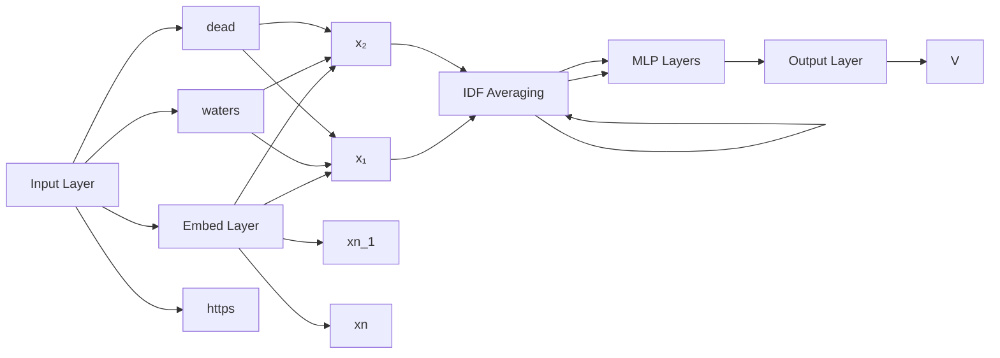
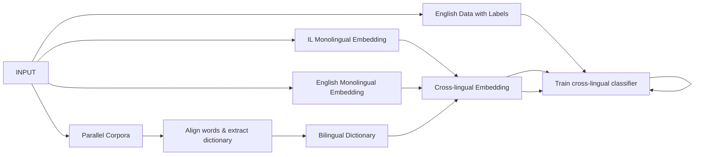

# Detecting Urgency Status of Crisis Tweets: A Transfer Learning Approach for Low Resource Languages

Efsun Sarioglu Kayi† Mona Diab‡

Linyong Nan†∗ Kathleen McKeown†

Bohan Qu†∗

†Department of Computer Science, Columbia University, New York, USA ‡Facebook AI, Seattle, USA

efsun@gwu.edu, linyong.nan@yale.edu, b.qu@columbia.edu, mdiab@fb.com, kathy@cs.columbia.edu

## Abstract

We release an urgency dataset that consists of English tweets relating to natural crises. The set is annotated along with annotations of their corresponding urgency status. Additionally, we release evaluation datasets for two low-resource languages, i.e. Sinhala and Odia, and demonstrate an effective zero-shot transfer from English to these two languages by training cross-lingual classifiers. We adopt cross-lingual embeddings constructed using different methods to extract features of the tweets, including a few state-of-the-art contextual embeddings such as BERT, RoBERTa and XLM-R. We train a variety of classifier architectures, supervised and semi supervised, on the extracted features. We also further experiment with ensembling the various classifiers. With very limited amounts of labeled data in English and zero data in the low resource languages, we show a successful framework of training monolingual and cross-lingual classifiers using deep learning methods which are known to be data hungry. Specifically, we show that the recent deep contextual embeddings are also helpful when dealing with very small-scale datasets. Classifiers that incorporate RoBERTa yield the best performance for the English urgency detection task, with 25% F1 score absolute improvement over the baselines. For the zero-shot transfer to low resource languages, classifiers that use LASER features perform the best for Sinhala transfer while XLM-R features benefit the Odia transfer the most.

## 1 Introduction

People all over the world use social media, e.g. Twitter, Facebook, to communicate with the outside world during crises that are either natural or man-made. During an emergent crisis, people post to report their well-being, ask for help, or give updates about the ongoing situation. This type of text data can be utilized to provide situational awareness to support missions such as humanitarian assistance/disaster relief, peacekeeping or infectious disease response. However, with the existence of more than 7,000 languages worldwide, automated human language technology does not exist for many languages.1 A possible solution to this problem is to transfer models learned in high resource language settings such as English to low resource languages (Ruder et al., 2019). In addition, there has been significant research in the use of transfer models in semantic analysis of texts such as sentiment (Socher et al., 2013; Rasooli et al., 2018) and emotion (Tafreshi and Diab, 2018).

To this end, we collect and release English, Sinhala and Odia urgency datasets that consist of tweets relating to natural crises, annotated with urgency status. 2 To demonstrate that we are able to effectively transfer the task of urgency detection from English to low-resource languages, we use English annotated tweets for training, and Sinhala/Odia annotated tweets for evaluation only, therefore, exploring zeroshot transfer. Specifically, we consider the following two tasks: a) English classification, for which we hold out 20% of the English dataset for evaluation, and the remaining 80% for training; b) cross-lingual classification, for which we use the entire English dataset for training and the corresponding Sinhala or Odia dataset for evaluation.

For the English classification task, we implement classifiers of different architectures adopting various embeddings including BERT (Devlin et al., 2019), RoBERTa (Liu et al., 2019) and XLM-R (Conneau et al., 2020), which we use to extract features, then train a classifier that takes the contextualized representations of the tweets into account. For the cross-lingual classification task, we build classifiers using the same set of architectures, but deploying various cross-lingual embeddings that are constructed using different methods: LASER (Artetxe and Schwenk, 2019) and XLM-R (Conneau et al., 2020). For both tasks, we employ semi-supervised approaches by generating pseudo-labels for a large amount of unlabeled tweets that are crisis related, in order to improve system performance. Last but not least, we ensemble different classifiers to boost performance further.

## 2 Dataset

Tweets about many natural and human-induced disasters such as earthquakes, typhoons, and landslides are collected by (Imran et al., 2016). We annotate a subset of them at the tweet-level on the Figure-Eight data annotation platform3 as seen in Figure 1. The annotation tag set comprises the following four levels of urgency:

## Judge The Urgency Level Of Content

Instructions

##

In this job, you will be presented with tweets that are about incidents such as earthguakes, floods, typhoons, land slides etc. Review the tweets to determine if they refer to a situation that is extremely serious/dangerous or where people urgently need help now or are likely to need help sometime in the near future. Depending on whether they need help immediately(or the situation is dire) or likely need help in the future (or the situation is not guite as dangerous), you will rate the level of urgency differently as explained below

##

1. Read the tweet.  
2. Disregard all links and only consider the text of the tweet  
3. Determine the urgency level of the tweet using the scale below

1. Extremely Urgent  
2. Definitely Urgent  
3.Somewhat Urgent  
4. Not Urgent

##

## The posts can be classified as

• Extremely Urgent means some aspects of the tweet refer to an extremely urgent and difficult situation.  
• Definitely Urgent means the tweet contains content that is urgent but level of urgency is not as high.  
• Somewhat Urgent means the tweet contains some content that could be considered urgent but it is not as certain as the two categories above.  
• Not Urgent means that the tweet does not include any content that can be considered urgent

## Note:

If there is a bad situation mentioned in the tweet but the related urgency is not as clear then opt for Not Urgent as your label. Existence of a bad event does not necessarily indicate there is urgency regarding that event. For instance, it could be a past event where the urgent situation has been resolved, or it could be that the tweet is lacking details regarding the situation so that it is not possible to determine the urgency of the situation..

Figure 1: Annotation interface

• Extremely Urgent: aspects of the tweet refer to an extremely urgent and difficult situation;  
e.g. MT @SushmaSwaraj my uncle is in kathmandu, trapped, suffersfromjaundice, chest infection, diabetes, his number #NepalQuake  
• Definitely Urgent: tweet contains content that is urgent but the level of urgency is not as high;  
e.g. @MountainGuides1 Please help us find myfriends parents Last heardfrom on way to Everest base camp.#NepalEarthquake

• Somewhat Urgent: tweet contains some content that could be considered urgent but it is not as certain as the two categories above;

e.g. MT @dineshakula Med supplies required in Bir Hospital. Out of medical supplies http://t.co/4pPhg2aVhg #Kathmandu #NepalQuake #hmrd

• Not Urgent: tweet does not include any content that can be considered urgent.

e.g. Prayers and thoughts with those affected by the earthquake

As it can be difficult for an annotator to decide whether a tweet is urgent, we provide four scales of urgency which then can be converted to a binary set of tags: Urgent vs. Not Urgent. The level of agreement between multiple contributors, confidence score, is weighted by contributors’ trust scores and calculated on average as 68.6%. 4 52 test questions with correct labels were distributed throughout the task for which the annotators needed to maintain a 70% accuracy.

After removing duplicates and inconsistencies, the final data consists of 1, 919 annotations as summarized in Table 1. To map the 4 multiple labels to a binary representation, the Not Urgent and Somewhat Urgent are mapped to False label, whereas the remaining two labels are mapped to True. This yields a binary dataset of an urgent ratio of 26.7%. One of the advantages of having a fine-grained label structure is to be able to capture the intensity level of urgency. In addition, depending on the situation, binary urgency levels can be adjusted to reflect that e.g. higher urgency percentages for a dire situation and lower urgency ratios for a less critical incident.

However, this also might have caused the annotation task to be more challenging. When we analyzed the annotations, we noticed that some of the tweets about rescue efforts were particularly confusing: tweets that are general status updates about an incident and more critical tweets that are asking for help are both labeled as urgent, without making a distinction between the two. This demonstrates one of many aspects of the difficulty of annotating for urgency, partially due to the tendency of labeling a tweet as urgent even though the urgency of the event is past.

<table><tr><td>Label</td><td>Total</td><td>True %</td><td>IAA</td></tr><tr><td>Extremely Urgent</td><td>134</td><td>6.98%</td><td>69.88%</td></tr><tr><td>Definitely Urgent</td><td>378</td><td>19.7%</td><td>72.63%</td></tr><tr><td>Somewhat Urgent</td><td>589</td><td>30.79%</td><td>53.69%</td></tr><tr><td>Not Urgent</td><td>818</td><td>42.61%</td><td>78.02%</td></tr></table>

Table 1: 4 way English Urgency Labels

## 2.1 Low Resource Languages

Linguistic Data Consortium (LDC) incident language (IL) packages are produced for the Low Resource Languages for Emergent Incidents (LORELEI) program. They cover a range of genres from formal news to informal social media, blogs and reference materials such as Wikipedia. They include parallel corpora that has sentence-level aligned data in English and the IL.

The languages Sinhala5 (IL10) and Odia6 (IL11) are annotated at the sentence-level by native informants for urgency in a binary label distribution as illustrated in Table 2. Both languages are Indo-Aryan languages; Sinhala is spoken primarily in Sri Lanka and Odia is spoken in the Indian state of Odisha.

<table><tr><td rowspan="2">Language</td><td colspan="2">Native Informant</td><td>Parallel Corpora</td></tr><tr><td>Total</td><td>True %</td><td># of Sentences</td></tr><tr><td>Sinhala</td><td>181</td><td>7.7%</td><td>415,042</td></tr><tr><td>Odia</td><td>510</td><td>16.1%</td><td>454,540</td></tr></table>

Table 2: IL Data Stats

## 3 Methodology

We explain our approaches to data preprocessing, English monolingual and low resource cross-lingual classification in Sections 3.1, 3.2 and 3.3, respectively.

## 3.1 Preprocessing of Tweets

We adopt the tweet preprocessing procedure as described in CrisisNLP (Nguyen et al., 2016) which removes URLs, special characters, and converts to lowercase. In addition, we remove usernames and segment hashtags using a word segmentation tool7 e.g. #NepalEarthquake becomes nepal and earthquake. We apply the same preprocessing procedure to English, Sinhala and Odia, with the exception of hashtag segmentation for Sinhala/Odia.

## 3.2 English Classification

To start with, we build classifiers for detecting urgency given tweets in English to establish an understanding of the baseline performance of this task without the effect of transferring between languages.

## 3.2.1 Monolingual Embeddings

For all of our classifiers, we first use word/sentence embeddings to extract features of the input tweets. We experiment with the following variations when choosing the English embeddings: contextual and non-contextual, and out-of-domain and in-domain. We choose two non-contextual embeddings: fastText embeddings (Bojanowski et al., 2017) and CrisisNLP embeddings (Nguyen et al., 2016). fastText embeddings are trained on texts from Wikipedia and Common Crawl (both out-of-crisis-domain) whereas CrisisNLP embeddings are trained on disaster related tweets, i.e. in-domain. Both embeddings project each word in a sentence to a 300 dimensional vector representation. We also use BERT (Devlin et al., 2019), RoBERTa (Liu et al., 2019) and XLM-R (Conneau et al., 2020) to generate contextual representations of the tweets for English.8 A list of embeddings and their availability for each language is shown in Table 3.

<table><tr><td>Embeddings</td><td>Lang.</td><td>Dimension</td><td>Non Contextual</td><td>Contextual</td><td>Monolingual</td><td>Cross-lingual</td><td>Out-of domain</td><td>In domain</td></tr><tr><td>fastText</td><td>en</td><td>300</td><td>✓</td><td></td><td>✓</td><td></td><td>✓</td><td></td></tr><tr><td>CrisisNLP</td><td>en</td><td>300</td><td>✓</td><td></td><td>✓</td><td></td><td></td><td>✓</td></tr><tr><td>BERT-base</td><td>en</td><td>768</td><td></td><td>✓</td><td>✓</td><td></td><td>✓</td><td></td></tr><tr><td>BERT-large</td><td>en</td><td>1,024</td><td></td><td>✓</td><td>✓</td><td></td><td>✓</td><td></td></tr><tr><td>RoBERTa-large</td><td>en</td><td>1,024</td><td></td><td>✓</td><td>✓</td><td></td><td>✓</td><td></td></tr><tr><td>XLM-mlm</td><td>en</td><td>2,048</td><td></td><td>✓</td><td>✓</td><td></td><td>✓</td><td></td></tr><tr><td>LASER</td><td>si</td><td>1,024</td><td></td><td>✓</td><td></td><td>✓</td><td>✓</td><td></td></tr><tr><td>ProcB</td><td>si, or</td><td>300</td><td>✓</td><td></td><td></td><td>✓</td><td>✓</td><td></td></tr><tr><td>VecMap</td><td>si, or</td><td>300</td><td>✓</td><td></td><td></td><td>✓</td><td>✓</td><td></td></tr><tr><td>XLM-R</td><td>si, or</td><td>1,024</td><td></td><td>✓</td><td></td><td>✓</td><td>✓</td><td></td></tr></table>

Table 3: Embedding Types

## 3.2.2 Classifier Architecture

Since we have a limited amount of annotated English tweets, we adopt relatively simpler models such as Support Vector Machines (SVM) and Random Forest, as well as shallower neural networks: Multi-Layer Perceptron (MLP) and Convolutional Neural Networks (CNN) as classifiers (Nguyen et al., 2016).The task is a binary classification task where the labels correspond to urgency status of Urgent or Not Urgent. The inputs to these classifiers are features of the tweets extracted by various embeddings mentioned in Section 3.2.1. For MLP classifiers (shown in Figure 2), we use sentence representations that are either contextual or using the inverse-document-frequency (idf) weighted average of the word embeddings, with the idf-weight of each word computed on the entire English dataset. Next, we apply a sequence of dense layers with batch normalization, Rectified Linear Unit (ReLU) activation, and dropout layers in between. We empirically decide on the hyper-parameters where the optimal sequence of dense layer width as 1, 024, 512, and 64. For CNN classifiers, we use the same architecture proposed in Crisis NLP (Nguyen et al., 2016). Specifically, we apply a convolutional layer, followed by batch normalization, ReLU activation and a max-pooling layer. Finally, we apply a dense layer after flattening the previous CNN layers outputs.

flowchart

Figure 2: MLP Architecture

flowchart

Figure 3: System Architecture: Transfer Learning in Zero-shot setting

## 3.2.3 Data Augmentation

We experiment with a semi-supervised training scheme to augment the training dataset (shown in Algorithm 1). We adopt self-training approaches (Yarowsky, 1995; McClosky et al., 2006), in which we add the best performing classifier’s predictions on unlabeled data to the initial training dataset, which is manually annotated. We sample the unlabeled tweets from the same collection of disaster related tweets (Imran et al., 2016) where we select and annotate a subset to create our English training dataset as described in Section 2, and we make sure the set of the unlabeled tweets and the set of training data are disjoint. To enforce consistency and reduce the bias of predictions on unlabeled data, we leverage the agreement of three independently trained best performing English classifiers, which are trained on RoBERTa features in this case, by adding a tweet to the training data only if all three classifiers yield the same prediction. After a round of predictions, we obtain a larger training dataset, on which we train another three independent top-performing classifiers and conduct a second round of predictions on the remaining unlabeled tweets. We conduct multiple rounds of the above procedure until no more remaining tweets would get the same prediction, and finally we obtain 16, 243 samples (including the original 1, 952 labeled samples) for training. We also experiment with varying the size of the synthetic data utilized, 3K, 10K, and 20K. We observe that 16K yields the best performance.

Algorithm 1 Incremental Training Workflow
Let source language training dataset be $S$
Let unlabelled source language dataset be $U$
Let target language testing set be $T$
while $|S| &lt; 16k$ do
    Train 3 classifiers of the same type $C_1, C_2$ and $C_3$ on $S$ independently
    Predict the labels $L$ using $C_1(U), C_2(U)$ and $C_3(U)$.
    Retrieve a subset $U_0$ from $U$ where all classifiers agree, and the corresponding label set $L_0$.
    Break if $|U_0| = 0$ $S \leftarrow S \cup (U_0, L_0)$
end for
Train 3 classifiers $C_1, C_2$ and $C_3$ on $S$ independently
Output classifier $C(T) =$ Majority vote among $C_1(T), C_2(T)$ and $C_3(T)$.

## 3.2.4 Ensemble Model

Algorithm 2 Ensemble Workflow
Let source language training dataset be $S$
Let unlabelled source language dataset be $U$
Let testing set be $T$.
for each classifier type $e$ do
    Incrementally train classifier $C_e$ on $S$ and $U$ independently
end for
Majority vote among $C_e(T)$

To further improve the performance of the urgency detection system, we ensemble various classifiers by vote. Instead of doing a classic majority vote, we adapt a more aggressive voting strategy that predicts positive if any of the independent models yields positive predictions. This allows us to achieve a better recall so that more urgent messages will be reported.

## 3.3 Cross-lingual Classification

The major component of the cross-lingual classification task is the cross-lingual embeddings that are the inputs to the classifiers whose architectures are similar to those for the English tasks. By training classifiers with these features, we are able to transfer the task of urgency detection from English to Sinhala and Odia. The entire process of our transfer approach is shown in Figure 3 and Algorithm 1.

## 3.3.1 Cross-lingual Embeddings

To generate a cross-lingual embedding that can be used to transfer from English to Sinhala, we use a parallel corpus that contains English-Sinhala sentence pairs as well as pre-trained English embeddings and Sinhala embeddings. There are many approaches for generating cross-lingual embeddings given the above resources, but in our study we focus on the projection-based methods of training the embeddings:

VecMap (Artetxe et al., 2018) and Proc-B (Glavas et al., 2019). As a first step, we use fast-align toolˇ (Dyer et al., 2013) to create symmetric word alignments between source and target words given the parallel corpus, then we choose the most frequent translation for each word (Rasooli et al., 2018). This generates a bilingual dictionary with 72K approximate vocabulary size for each language, which is used as a seed dictionary to generate the cross-lingual embeddings by projecting the pre-trained English and Sinhala monolingual embeddings to the same semantic space. We employ the same procedure to generate the English-Odia embeddings as well, given the English-Odia parallel corpus and the pre-trained English and Odia embeddings. For all the pre-trained monolingual embeddings (English, Sinhala and Odia), we use fastText (Grave et al., 2018) embeddings which are trained on Common Crawl and Wikipedia. In addition, we use pre-trained contextual cross-lingual embeddings that are publicly available: LASER (Artetxe and Schwenk, 2019) a pre-trained cross-lingual embedding trained on texts that are in 93 languages including Sinhala. XLM-R (Conneau et al., 2020) is trained on Common Crawl text data in 100 languages, including Sinhala and Odia.

<table><tr><td colspan="2"></td><td colspan="3">Original</td><td colspan="3">Augmented</td></tr><tr><td>Embeddings</td><td>Classifier</td><td>Precision %</td><td>Recall %</td><td>F1 Score %</td><td>Precision %</td><td>Recall %</td><td>F1 Score %</td></tr><tr><td>Baseline</td><td>N/A</td><td>50.0</td><td>50.0</td><td>50.0</td><td>50.0</td><td>50.0</td><td>50.0</td></tr><tr><td rowspan="4">CrisisNLP</td><td>RF</td><td>66.9</td><td>56.7</td><td>55.9</td><td>76.1</td><td>64.9</td><td>66.8</td></tr><tr><td>SVM</td><td>36.1</td><td>50.0</td><td>41.9</td><td>75.4</td><td>61.1</td><td>61.9</td></tr><tr><td>MLP</td><td>71.7±1.6</td><td>70.1±1.7</td><td>70.5±1.3</td><td>72.5±1.3</td><td>63.2±0.8</td><td>64.6±1.0</td></tr><tr><td>CNN</td><td>73.3±1.5</td><td>67.4±1.4</td><td>69.0±1.4</td><td>73.7±1.0</td><td>62.0±0.5</td><td>63.2±0.6</td></tr><tr><td rowspan="2">fastText</td><td>MLP</td><td>66.3±1.6</td><td>65.6±1.5</td><td>65.8±1.4</td><td>73.7±1.8</td><td>60.9±0.7</td><td>61.6±0.9</td></tr><tr><td>CNN</td><td>70.6±0.2</td><td>59.5±1.2</td><td>59.8±1.7</td><td>74.8±2.7</td><td>62.4±3.0</td><td>63.2±3.6</td></tr><tr><td>BERT-base</td><td>MLP</td><td>71.8</td><td>76.7</td><td>71.9</td><td>70.6</td><td>71.4</td><td>71.0</td></tr><tr><td>BERT-large</td><td>MLP</td><td>75.2</td><td>75.2</td><td>75.2</td><td>75.0</td><td>76.4</td><td>75.6</td></tr><tr><td>RoBERTa-large</td><td>MLP</td><td>75.8</td><td>75.6</td><td>75.7</td><td>74.8</td><td>76.8</td><td>75.6</td></tr><tr><td>XLM-mlm-en</td><td>MLP</td><td>70.5</td><td>72.8</td><td>71.3</td><td>75.3</td><td>74.1</td><td>74.6</td></tr></table>

Table 4: English Classifier Results: Precision, Recall and Macro F1 scores

<table><tr><td colspan="2"></td><td colspan="3">Original</td><td colspan="3">Augmented</td></tr><tr><td>Embeddings</td><td>Classifier</td><td>Precision %</td><td>Recall %</td><td>F1 Score %</td><td>Precision %</td><td>Recall %</td><td>F1 Score %</td></tr><tr><td rowspan="2">Proc-B</td><td>MLP</td><td>55.6±4.5</td><td>58.5±4.6</td><td>54.6±5.1</td><td>58.3±4.3</td><td>57.4±3.8</td><td>57.3±3.8</td></tr><tr><td>CNN</td><td>49.9±1.9</td><td>49.5±2.7</td><td>48.7±2.3</td><td>56.0±8.3</td><td>52.0±2.5</td><td>51.9±3.6</td></tr><tr><td rowspan="2">VecMap</td><td>MLP</td><td>53.9±3.6</td><td>57.5±6.1</td><td>52.3±4.7</td><td>53.8±3.7</td><td>55.2±4.5</td><td>54.2±3.9</td></tr><tr><td>CNN</td><td>50.2±1.4</td><td>50.3±2.4</td><td>48.9±2.1</td><td>51.5±3.1</td><td>51.0±3.2</td><td>51.1±3.0</td></tr><tr><td>LASER</td><td>MLP</td><td>68.3</td><td>59.5</td><td>62.1</td><td>71.6</td><td>56.6</td><td>58.9</td></tr><tr><td>XLM-R (base)</td><td>MLP</td><td>71.4</td><td>53.3</td><td>54.2</td><td>54.2</td><td>57.4</td><td>54.6</td></tr><tr><td>XLM-R (large)</td><td>MLP</td><td>96.4</td><td>53.6</td><td>54.8</td><td>60.4</td><td>58.3</td><td>59.2</td></tr></table>

Table 5: English-Sinhala Classifier Results: Precision, Recall, Macro F1 scores

<table><tr><td colspan="2"></td><td colspan="3">Original</td><td colspan="3">Augmented</td></tr><tr><td>Embeddings</td><td>Classifier</td><td>Precision %</td><td>Recall %</td><td>F1 Score %</td><td>Precision %</td><td>Recall %</td><td>F1 Score%</td></tr><tr><td rowspan="2">Proc-B</td><td>MLP</td><td>54.6±3.6</td><td>55.0±3.5</td><td>53.3±3.4</td><td>61.6±2.5</td><td>54.9±3.0</td><td>54.7±4.3</td></tr><tr><td>CNN</td><td>54.3±2.4</td><td>53.2±1.9</td><td>53.1±2.2</td><td>58.2±3.2</td><td>52.2±1.0</td><td>51.1±1.9</td></tr><tr><td rowspan="2">VecMap</td><td>MLP</td><td>54.3±3.6</td><td>54.6±3.4</td><td>53.0±3.4</td><td>63.6±1.6</td><td>55.7±2.4</td><td>56.4±2.1</td></tr><tr><td>CNN</td><td>53.9±2.4</td><td>53.4±2.3</td><td>53.4±2.3</td><td>56.0±2.1</td><td>53.7±1.0</td><td>54.0±1.2</td></tr><tr><td>XLM-R (base)</td><td>MLP</td><td>67.1</td><td>51.0</td><td>47.9</td><td>70.6</td><td>59.2</td><td>61.3</td></tr><tr><td>XLM-R (large)</td><td>MLP</td><td>79.7</td><td>51.7</td><td>49.2</td><td>55.1</td><td>54.4</td><td>54.7</td></tr></table>

Table 6: English-Odia Classifier Results: Precision, Recall, Macro F1 scores

## 4 Experiments

We report Macro Precision, Recall and F1-scores for the English classification task and the cross-lingua classification tasks in Tables 4, 5 and 6 respectively (best scores for each section are underlined and shown in bold). For macro averaging, we calculate precision, recall and F1 scores for both positive and negative labels, then report their unweighted mean. Column Original refers to results using the origina dataset that is human-annotated and 16K with Synthetic Data refers to results on larger datasets that are generated with the method mentioned in 3.2.3. Since the evaluation datasets for all the tasks are small in size, for each experiment setting that is cheap to reproduce, we report the mean and standard deviation of 30 independent experiments to reduce inconsistencies and improve confidence. As a baseline, we report results of a classifier which assigns a label randomly based on the label distribution in English training data. We use scikit-learn (Pedregosa et al., 2011) for SVM and random forest classifiers and the PyTorch platform 9 for the deep learning classifiers. For incorporating all the deep pre-trained contextual models, our codebase heavily relies on the transformer implementations by Huggingface, which has the advantage of switching to any future large-scale pre-trained models easily. 10

<table><tr><td>Language</td><td>Dataset</td><td>% of Urgent Samples</td></tr><tr><td>English</td><td>Original</td><td>26.7%</td></tr><tr><td>English</td><td>Original + Synthetic</td><td>18.5%</td></tr><tr><td>Sinhala</td><td>Evaluation</td><td>7.7%</td></tr><tr><td>Odia</td><td>Evaluation</td><td>16.1%</td></tr></table>

Table 7: Percentages of Urgent Samples

## 4.1 Analysis

For the English classifier, we observe the following:

• Deep pre-trained models that produce contextual representations of the tweets benefit the task of urgency detection the most even in the presence of a limited amount of data. We believe this is because these models generally produce representations that are better in quality and higher in dimension. We tried fine-tuning these pre-trained models and found that the performance deteriorates evidently in the case where the down-stream task has a very small dataset (Goodfellow et al., 2016);  
• In-domain embeddings (CrisisNLP) are consistently better than out-of-domain embeddings (fast-Text) for English classification tasks;  
• The semi-supervised approach of augmenting the dataset does not necessarily boost the performance even further in the case when the pseudo-labels are generated by classifiers that are trained on limited resources.

For cross-lingual classifiers, the following analysis can be concluded:

• Between Vecmap and Proc-B, we see similar performance across languages and classifiers. This could be the case because they both have similar approaches: projection based approaches to generating cross-lingual embeddings.  
• Adding synthetic data consistently improves the performances of the classifiers for Odia but not for Sinhala (if we consider macro F1-score). We suspect that synthetic data might help the task if the label distribution of the training dataset is similar to that of the evaluation dataset. The difference of such urgent tweets ratio is larger in Sinhala (7.7% and 18.5%) than such difference in Odia (16.1% and 18.5%), therefore producing results that are not any better in the presence of synthetic data. The urgent tweet ratio is shown in Table 7 for reference;  
• For the English-Sinhala task, we observe that the LASER-based classifier yields better performance. This could be due to the fact that a) LASER uses bigger parallel corpora i.e. 796,000 sentences b) LASER is a sentence-level contextual embedding, which is better than the order-independent idf-weighted-averaging-based method of producing the sentence representations that the rest of the classifiers adopt.

<table><tr><td>Urgency Detection Task</td><td>Precision %</td><td>Recall %</td><td>F1 Score %</td></tr><tr><td>English task</td><td>77.8</td><td>75.6</td><td>76.5</td></tr><tr><td>Sinhala task(transferred from English)</td><td>61.2</td><td>69.3</td><td>63.5</td></tr><tr><td>Odia task(transferred from English)</td><td>71.2</td><td>60.3</td><td>62.6</td></tr></table>

Table 8: Classification Performance of Ensemble Models

For both monolingual and cross-lingual classification, MLP-based classifiers with idf-weighted averaging of the word embeddings are consistently better than CNN-based classifiers. We observe that when the large amount of synthetic data is present, CNN classifiers have improvements that are more significant than those of MLP classifiers, comparing to training them on the original dataset. After adding the synthetic data, both CNN and MLP classifiers yield similar performance. Finally, ensemble by aggressive voting strategy leads to better classification performance in both English and cross-lingual tasks, as shown in Table 8.

## 5 Related Work

Crisis NLP 11 website provides social media datasets and classifiers that are about various disasters in several languages, i.e. English, Spanish and French, which are all high resource languages. For low resource languages, due to very limited amount of data, transfer learning approaches must be adapted that transfer a high-resource model to a low-resource language (Ruder et al., 2019; Chaudhary et al., 2019). The work of Kejriwal and Zhou (2019) apply a manual feature based approach to transfer urgency labels from English to several low resource languages combined with active learning to increase the amount of labels. Recent successful techniques in transfer learning, however, use cross-lingual embeddings combined with deep learning based classifiers. Cross-lingual embeddings map words in different languages into same semantic space and among them, we use projection based approaches, i.e. VecMap and ProcB, rather than parallel corpora based ones e.g. BiSkip (Luong et al., 2015) due to their superior performance. This has been shown to work well for sentiment (Socher et al., 2013; Rasooli et al., 2018) and emotion (Tafreshi and Diab, 2018). In addition, after the success of contextual language models such as BERT (Devlin et al., 2019) and RoBERTa (Liu et al., 2019) in many NLP tasks, their multilingual versions became available i.e. Multilingual BERT (Devlin et al., 2019) and XLM-R (Conneau et al., 2020) which we experimented with based on their availability for our languages. Their adaptation to low resource settings, e.g. fine-tuning with small datasets, is not trivial and is not as reliable as in high resource settings. As such, we show how this can be achieved with our experimental setup. Specifically, we use a self-learning method by voting (Zhou and Goldman, 2004) to increase the size of the high resource language dataset on unlabelled Crisis NLP tweets. We decide not to use tri-training (Zhi-Hua Zhou and Ming Li, 2005; Ruder and Plank, 2018) due to the size of original English data despite the fact that tri-training has shown good results in domain-shift NLP tasks.

## 6 Conclusion

In this study, we release an urgency dataset consisting of English tweets about natural crisis and their urgency status. In addition, we release two evaluation datasets for urgency detection in Sinhala and Odia. We train monolingual classifiers for English and cross-lingual classifiers for Sinhala and Odia that are zero-shot learners. For the design of our classifiers, beside exploring different architectures, we adop different monolingual or cross-lingual embeddings that are either pre-trained or constructed by using different methods. Due to limited amount of labeled data, we generate synthetic data to improve the system performance, and ensemble classifiers to boost the performance even further. We conclude that if synthetic data can be produced with high confidence, then it is helpful in transfer between domains that have similar distribution of labels. Specifically for English urgency detection, the best performing classifier utilizes contextual features produced by pre-trained RoBERTa model and among non-contextua embeddings, in-domain embeddings out-perform out-of-domain embeddings. For cross-lingual transfer, classifiers that incorporate LASER features perform the best for transferring to Sinhala while XLM-R features benefit the most in transferring knowledge of urgency detection to Odia. Finally, in the absence of pre-trained contextual embedding for a low resource language, we also demonstrate alternative ways to achieve similar performance using cross-lingual embeddings constructed by projection based approaches, i.e. VecMap and ProcB.

## Acknowledgments

Acknowledgements Efsun Kayi, Mona Diab and Kathleen McKeown were supported by DARPA LORELEI Grant HR0011-15-2-0041. The views expressed are those of the authors and do not reflect the official policy or position of the Department of Defense or the U.S government. We thank the reviewers for their detailed and helpful comments. We thank the native informants and Appen for arranging the annotation. We thank Zixiaofan (Brenda) Yang, Noura Farra and Shabnam Tafreshi for meeting the informants.

## References

Mikel Artetxe and Holger Schwenk. 2019. Massively Multilingual Sentence Embeddings for Zero-Shot Cross Lingual Transfer and Beyond. Trans. Assoc. Comput. Linguistics, 7:597–610.  
Mikel Artetxe, Gorka Labaka, and Eneko Agirre. 2018. Generalizing and Improving Bilingual Word Embedding Mappings with a Multi-step Framework of Linear Transformations. In Proceedings of the Thirty-Second AAAI Conference on Artificial Intelligence, pages 5012–5019.  
Piotr Bojanowski, Edouard Grave, Armand Joulin, and Tomas Mikolov. 2017. Enriching Word Vectors with Subword Information. Transactions ofthe Associationfor Computational Linguistics, 5:135–146.  
Aditi Chaudhary, Siddharth Dalmia, Junjie Hu, Xinjian Li, Austin Matthews, Aldrian Obaja Muis, Naoki Otani, Shruti Rijhwani, Zaid Sheikh, Nidhi Vyas, Xinyi Wang, Jiateng Xie, Ruochen Xu, Chunting Zhou, Peter J. Jansen, Yiming Yang, Lori S. Levin, Florian Metze, Teruko Mitamura, David R. Mortensen, Graham Neubig, Eduard H. Hovy, Alan W. Black, Jaime G. Carbonell, Graham Horwood, Shabnam Tafreshi, Mona T. Diab, Efsun Sarioglu, Noura Farra, and Kathleen R. McKeown. 2019. The ARIEL-CMU Systems for LoReHLT18 CoRR, abs/1902.08899.  
Alexis Conneau, Kartikay Khandelwal, Naman Goyal, Vishrav Chaudhary, Guillaume Wenzek, Francisco Guzman, Edouard Grave, Myle Ott, Luke Zettlemoyer, and Veselin Stoyanov. 2020. Unsupervised Cross-´ lingual Representation Learning at Scale. In Proceedings of the 58th Annual Meeting of the Association for Computational Linguistics, pages 8440–8451.  
Jacob Devlin, Ming-Wei Chang, Kenton Lee, and Kristina Toutanova. 2019. BERT: Pre-training of deep bidirectional transformers for language understanding. In Proceedings of the 2019 Conference of the North American Chapter ofthe Associationfor Computational Linguistics: Human Language Technologies, Volume 1 (Long and Short Papers), pages 4171–4186.  
Chris Dyer, Victor Chahuneau, and Noah A. Smith. 2013. A Simple, Fast, and Effective Reparameterization of IBM Model 2. In Proceedings of the 2013 Conference of the North American Chapter of the Association for Computational Linguistics: Human Language Technologies, pages 644–648.  
Goran Glavas, Robert Litschko, Sebastian Ruder, and Ivan Vuliˇ c. 2019. How to (Properly) Evaluate Cross-Lingual´ Word Embeddings: On Strong Baselines, Comparative Analyses, and Some Misconceptions. In Proceedings of the 57th Annual Meeting ofthe Associationfor Computational Linguistics, pages 710–721.  
Ian Goodfellow, Yoshua Bengio, and Aaron Courville. 2016. Deep Learning. The MIT Press.  
Edouard Grave, Piotr Bojanowski, Prakhar Gupta, Armand Joulin, and Tomas Mikolov. 2018. Learning Word Vectors for 157 Languages. In Proceedings ofthe International Conference on Language Resources and Evaluation (LREC 2018).  
Muhammad Imran, Prasenjit Mitra, and Carlos Castillo. 2016. Twitter as a Lifeline: Human-annotated Twitter Corpora for NLP of Crisis-related Messages. In Proceedings ofthe Tenth International Conference on Language Resources and Evaluation (LREC 2016).  
Mayank Kejriwal and Peilin Zhou. 2019. Low-supervision Urgency Detection and Transfer in Short Crisis Messages. 2019 IEEE/ACM International Conference on Advances in Social Networks Analysis and Mining (ASONAM), pages 353–356.  
Yinhan Liu, Myle Ott, Naman Goyal, Jingfei Du, Mandar Joshi, Danqi Chen, Omer Levy, Mike Lewis, Luke Zettlemoyer, and Veselin Stoyanov. 2019. RoBERTa: A Robustly Optimized BERT Pretraining Approach. CoRR, abs/1907.11692.  
Thang Luong, Hieu Pham, and Christopher D. Manning. 2015. Bilingual Word Representations with Monolingual Quality in Mind. In Proceedings of the 1st Workshop on Vector Space Modeling for Natural Language Processing, pages 151–159.  
David McClosky, Eugene Charniak, and Mark Johnson. 2006. Effective Self-Training for Parsing. In Human Language Technology Conference ofthe North American Chapter ofthe Association ofComputational Linguistics, Proceedings.  
Dat Tien Nguyen, Kamla Al-Mannai, Shafiq R. Joty, Hassan Sajjad, Muhammad Imran, and Prasenjit Mitra. 2016. Rapid Classification of Crisis-Related Data on Social Networks using Convolutional Neural Networks. CoRR, abs/1608.03902.  
F. Pedregosa, G. Varoquaux, A. Gramfort, V. Michel, B. Thirion, O. Grisel, M. Blondel, P. Prettenhofer, R. Weiss, V. Dubourg, J. Vanderplas, A. Passos, D. Cournapeau, M. Brucher, M. Perrot, and E. Duchesnay. 2011. Scikitlearn: Machine Learning in Python. Journal ofMachine Learning Research, 12:2825–2830.  
Mohammad Sadegh Rasooli, Noura Farra, Axinia Radeva, Tao Yu, and Kathleen Mckeown. 2018. Cross-lingual Sentiment Transfer with Limited Resources. Machine Translation, 32(1-2):143–165  
Sebastian Ruder and Barbara Plank. 2018. Strong Baselines for Neural Semi-Supervised Learning under Domain Shift”. In Proceedings ofthe 56th Annual Meeting ofthe Associationfor Computational Linguistics (Volume 1: Long Papers), pages 1044–1054.  
Sebastian Ruder, Matthew E. Peters, Swabha Swayamdipta, and Thomas Wolf. 2019. Transfer Learning in Natura Language Processing. In Proceedings ofthe 2019 Conference ofthe North American Chapter ofthe Association for Computational Linguistics: Tutorials, pages 15–18.  
Richard Socher, Alex Perelygin, Jean Wu, Jason Chuang, Christopher D. Manning, Andrew Ng, and Christopher Potts. 2013. Recursive Deep Models for Semantic Compositionality Over a Sentiment Treebank. In Proceedings ofthe 2013 Conference on Empirical Methods in Natural Language Processing, pages 1631–1642.  
Shabnam Tafreshi and Mona Diab. 2018. Emotion Detection and Classification in a Multigenre Corpus with Joint Multi-Task Deep Learning. In Proceedings ofthe 27th International Conference on Computational Linguistics, pages 2905–2913.  
David Yarowsky. 1995. Unsupervised Word Sense Disambiguation Rivaling Supervised Methods. In 33rd Annual Meeting ofthe Associationfor Computational Linguistics, pages 189–196.  
Zhi-Hua Zhou and Ming Li. 2005. Tri-training: Exploiting Unlabeled Data Using Three Classifiers. IEEE Transactions on Knowledge and Data Engineering, 17(11):1529–1541.  
Y. Zhou and S. Goldman. 2004. Democratic Co-learning. In 16th IEEE International Conference on Tools with Artificial Intelligence, pages 594–602.