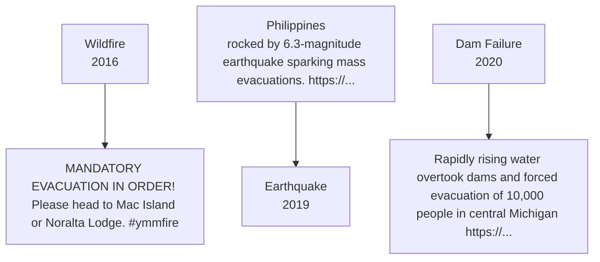
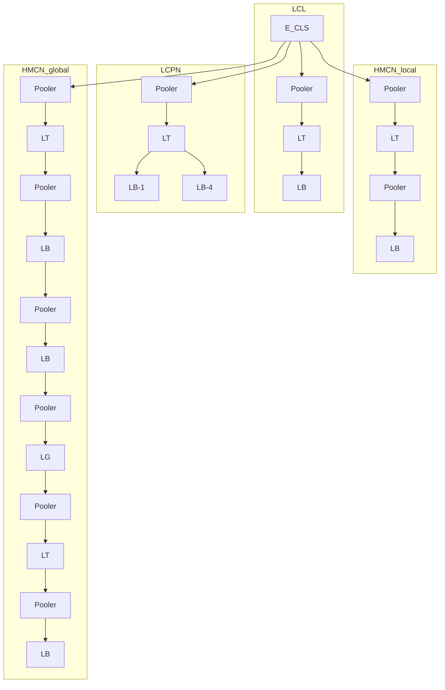

# Enhancing Crisis-Related Tweet Classification with Entity-Masked Language Modeling and Multi-Task Learning

Philipp Seeberger and Korbinian Riedhammer

Technische Hochschule Nürnberg Georg Simon Ohm

{philipp.seeberger,korbinian.riedhammer}@th-nuernberg.de

## Abstract

Social media has become an important information source for crisis management and provides quick access to ongoing developments and critical information. However, classification models suffer from event-related biases and highly imbalanced label distributions which still poses a challenging task. To address these challenges, we propose a combination of entity-masked language modeling and hierarchical multi-label classification as a multi-task learning problem. We evaluate our method on tweets from the TREC-IS dataset and show an absolute performance gain w.r.t. F1-score of up to 10% for actionable information types. Moreover, we found that entitymasking reduces the effect of overfitting to indomain events and enables improvements in cross-event generalization. Our source code is publicly available on GitHub.<sup>1</sup>

## 1 Introduction

Messages on social media during disaster events have become an important information source in crisis management (Reuter et al., 2018). In contrast to traditional sources (e.g., official news), social media posts immediately provide details about developments, first-party observations, and affected people in an ongoing emergency situation (Sakaki et al., 2010). Having access to this information is crucial for developing situational awareness and supporting relief providers, government agencies, and other official institutions (Kruspe et al., 2021).

One key challenge poses the information refinement of high-volume social media streams which requires automatic methods for reliable detection of relevant content (Kaufhold, 2021). Most recent work has focused on binary, multi-class, and multi-label text classification techniques to classify posts into coarse (e.g., Relevant, Irrelevant) or fine-grained (e.g., InfrastructureDamage, Missing-People) categories composed of flattened or hierarchical structures (Alam et al., 2018b, 2021; Buntain et al., 2021).


<details>
<summary>flowchart</summary>


</details>

Figure 1: Example tweets of several disasters over time, annotated with entitites. The short posts are mostly biased towards specific events.

Another challenge in Natural Language Processing (NLP) is the nature of data prevalent in social media and microblogging platforms. For example, most works in the crisis-related domain focus on Twitter data (Kruspe et al., 2021) which inherits properties such as short texts (280 characters limitation per tweet), less contextual information, hashtags, and noise (e.g., misspellings, emojis) (Wiegmann et al., 2020; Zahera et al., 2021). According to Sarmiento and Poblete (2021), different types of disasters (e.g., flood, wildfire) can be identified by only a few text-based features. However, eventrelated biases and entities as shown in Figure 1 prevent models from generalizing to unseen disaster events and therefore degrade w.r.t. detection performance.

To circumvent this problem, approaches such as adversarial training (Medina Maza et al., 2020), domain adaptation (Alam et al., 2018a), and hierarchical label embeddings (Miyazaki et al., 2019) have been proposed but suffer from mixed event types, assume unlabeled data or require semantic label descriptions. Contrary to this work, we aim to enhance the detection of rare actionable information for unseen events by masking out entities, applying adaptive pre-training, and incorporating the hierarchical structure of labels.

<table><tr><td></td><td>Train</td><td>Test</td></tr><tr><td>Event Ids</td><td>1 - 52</td><td>53 - 75</td></tr><tr><td># Events</td><td>51</td><td>21</td></tr><tr><td># tweets</td><td>50,412</td><td>22,003</td></tr><tr><td colspan="3">Upper classes</td></tr><tr><td># Report (14)</td><td>30,389</td><td>16,059</td></tr><tr><td># Other (5)</td><td>32,105</td><td>10,709</td></tr><tr><td># CallToAction (3)</td><td>1,458</td><td>389</td></tr><tr><td># Request (3)</td><td>683</td><td>144</td></tr></table>

Table 1: Overview of the dataset split; the values within the brackets of the upper classes corresponds to the number of unique low-level information types.

Contributions Our main contributions are as follows: (1) We introduce an adaptive pre-training strategy based on entity-masking. (2) We incorporate the hierarchical structure of labels as multi-task learning (MTL) problem. (3) We empirically show that our approach improves generalization to new events and increases detection performance for actionable information types.

## 2 Related Work

Crisis Tweet Classification Besides conventional detection approaches such as filtering (Kumar et al., 2011) or crowdsourcing (Poblet et al., 2014), machine learning has received much attention in this area. Researchers experimented with several methods such as Naive Bayes, Support Vector Machines, and Decision Trees either with termfrequency features (Habdank et al., 2017) or static embeddings (Kejriwal and Zhou, 2019). More recently, the combination of Word2Vec (Mikolov et al., 2013) with Convolutional and Recurrent Neural Networks achieved remarkable improvement in this field (Kersten et al., 2019; Snyder et al., 2019). Due to the success of Transformers (Vaswani et al., 2017) and the follow-up language models (Devlin et al., 2019), most works have been built upon this and outperformed previous approaches (Alam et al., 2021; Wang et al., 2021).

Adaptive Pre-Training Transfer learning with language models essentially contributes to stateof-the-art results in a variety of NLP tasks (Devlin et al., 2019; Liu et al., 2019; Clark et al., 2020). Typically, such language models follow the three training steps (Howard and Ruder, 2018; Ben-

David et al., 2020): (1) Pre-training on massive corpora; (2) Optional pre-training on task-specific data; (3) Supervised fine-tuning on target tasks. However, the second step is often neglected due to computational constraints whereby adaptive pretraining has shown to be effective (Howard and Ruder, 2018). Hence, Gururangan et al. (2020) introduced domain-adaptive pre-training (DAPT) and task-adaptive pre-training (TAPT) which cover continual pre-training on corpora tailored for a specific task. Moreover, strategies such as adding special tokens for tweets (Nguyen et al., 2020; Wiegmann et al., 2020) or additional masked language modeling (MLM) approaches (Ben-David et al., 2020) have been proven beneficial.

Hierarchical Multi-Label Classification Hierarchical multi-label classification (HMC) covers local and global approaches and the combination of both worlds (Wehrmann et al., 2018). A popular categorization of local methods is the subdivision into local classifier per parent node (LCPN) (Dumais and Chen, 2000), local classifier per node (LCN) (Banerjee et al., 2019), and local classifier per level (LCL) (Wehrmann et al., 2018). Hybrid approaches integrate the global part as a particular constraint such as hierarchical softmax (Brinkmann and Bizer, 2021) or combine multiple local and global prediction heads (Wehrmann et al., 2018). Recent work in information type classification introduced label embeddings which utilize the hierarchical structure (Miyazaki et al., 2019). Finally, the classification can also be viewed as MTL by combining certain loss functions (Yu et al., 2021; Wang et al., 2021).

## 3 TREC-IS

In this work, we mainly focus on the dataset of the shared-task TREC-IS, which represents a collection of annotated crisis-related tweets (Buntain et al., 2021). Each tweet belongs to a disaster event and is annotated with high-level information types which are derived from an ontology composed of hierarchical stages. However, information type labels are only shipped as a two-level hierarchy with four upper classes $\mathrm { L } _ { T }$ and 25 lower classes $\mathrm { L } _ { B }$ . Thus, both hierarchy levels represent a multi-label classification task. Following the TREC-IS track design, we split the dataset into train and test events which corresponds to the TREC-IS 2020B task. This split poses a challenging setup due to the requirement of cross-event generalization (Wiegmann et al., 2020).


<details>
<summary>flowchart</summary>

```mermaid
graph TD
  subgraph Input["Input Source"]
    A["2 people killed in explosion at Houston manufacturer"]
  end

  subgraph Encoder["Transformer Encoder"]
    B["&quot;FC_MLM --> [NUM"]"]
    C["&quot;FC_MLM --> [LOC"]"]
    D["E_CLS\nE_MASK\nE_1 ... E_5\nE_MASK\nE_N"]
    E["[CLS]"]
    F["[MASK]"]
    G["&quot;T_1 ... T_5\n[MASK"]"]
    H["TN"]
  end

  subgraph Output["Output Source"]
    I["NER"]
  end

  A --> I
  I --> B
  B --> C
  C --> E
  E --> D
  D --> F
  F --> G
  G --> H
  H --> I
```
</details>

(a) Entity-masked language modeling


<details>
<summary>flowchart</summary>


</details>

(b) Multi-task classification heads  
Figure 2: Illustration of the concepts E-MLM with named entity recognition (NER) and MTL. $\mathrm { F C } _ { M L M }$ represents the prediction head for MLM. The classification heads will be placed on top of the pre-trained encoder. The building blocks Pooler, L , $\mathrm { L } _ { B }$ and $\operatorname { L } _ { G }$ are fully connected layers and use the CLS token as sentence embedding.

Table 1 gives an overview of each split; obviously, the information type distribution is highly imbalanced. For example, information types with low criticality such as MultimediaShare (31.7%) and News (25.4%) are prevalent. In contrast, the highly critical information types MovePeople (0.9%) and SearchAndRescue (0.4%) occur only rarely (Mc-Creadie et al., 2019).<sup>2</sup>

## 4 Method

As depicted in Figure 2 our approach combines the two concepts entity-masked language modeling (E-MLM) and MTL. In the following, we briefly describe our method as a combination of those two.

## 4.1 Entity-Masked Language Modeling

Based on adaptive pre-training, we extend on masked language modeling of a transformer encoder pre-trained on a large corpus such as BERT (Devlin et al., 2019). Here, the mitigation of eventrelated biases is facilitated by replacing entities – which are prone to be event-specific – with special tokens (see Figure 2a). This way we intend to capture disaster-related language patterns independently of the concrete entities. Following Ben-David et al. (2020), we further introduce a masking probability α tailored to entities in addition to the standard word masking with probability β. That is, with a typically higher probability α we select random entity-tokens such as locations and lower probability β random standard subword-tokens. Finally, these selected tokens will be replaced by [MASK], random tokens or the unchanged tokens in order to learn the linguistic patterns related to those entities. For the rest of this paper, we rely on the pre-trained $\mathbf { B E R T } _ { B A S E }$ as the encoder model and the corresponding default MLM setup for pretraining ([MASK] with 80%, random tokens with 10%, and unchanged tokens with 10%).

## 4.2 Multi-Task Learning

The next step represents the fine-tuning of a classification head. We implement four basic hierarchical multi-label classification approaches as shown in Figure 2b. The LCL classification head jointly trains a flattened classification layer for each of the two hierarchy levels. In contrast, the LCPN model consists of a classification layer for each parent node. The hierarchical multi-label classification network (HMCN) is adapted from Wehrmann et al. (2018) and introduces a pooling layer on top of the preceding pooling layer. We experiment with a local and a global variant, whereas the global one additionally consists of a global classification layer. All pooling and classification layers are composed of a single feed-forward layer with tanh and sigmoid as activation functions, respectively. Finally, we minimize the binary cross-entropy $\mathcal { L } _ { M T L } = \lambda \mathcal { L } _ { L _ { T } } + ( 1 - \lambda ) \mathcal { L } _ { L _ { B } }$ as a weighted loss function whereby $\mathcal { L } _ { L _ { T } }$ represents the upper classes and $\mathcal { L } _ { L _ { B } }$ the lower classes loss.

## 5 Experiments

## 5.1 Evaluation Metric

We follow the TREC-IS evaluation scheme: macroaveraged F1-score across information types for the two hierarchy levels in addition to the actionable information types (AIT) (McCreadie et al., 2019). The latter include rare information types with high priority consisting of: MovePeople, EmergingThreats, NewSubEvent, ServiceAvailable, GoodsServices, and SearchAndRescue.

<table><tr><td>Model</td><td> $L_T$ </td><td> $L_B$ </td><td>AIT</td></tr><tr><td colspan="4">Single-Task</td></tr><tr><td>TF-IDF+LR</td><td>0.657</td><td>0.499</td><td>0.462</td></tr><tr><td>BERTBASE</td><td>0.717</td><td>0.531</td><td>0.513</td></tr><tr><td>BERTMLM</td><td>0.714</td><td>0.551</td><td>0.546</td></tr><tr><td>BERTE-MLM</td><td>0.701</td><td>0.481</td><td>0.444</td></tr></table>

Table 2: Overall results on the development set.

## 5.2 Named Entity Recognition

As event-specific entities, we use the special tokens hashtag, url, person, location, organization, event, address, phone number, date, and number. All entities except the tokens hashtag and url are extracted with the Natural Language API of the Google Cloud Platform.<sup>3</sup> We manually annotated 300 tweets and calculated a strict F1-score (Segura-Bedmar et al., 2013) of 0.692 which represents a reasonable good result for tweets.

## 5.3 Baseline and Hyper-Parameters

As baseline, we use TF-IDF with Logistic Regression (TF-IDF+LR) and $\mathbf { B E R T } _ { B A S E }$ with a singletask classification head. Furthermore, we apply the standard MLM of BERT in contrast to E-MLM in order to validate the effect of masking entities. Lastly, we train the MTL model $( \mathbf { M T L } _ { p r i o } )$ from Wang et al. (2021) which combines lower classes as classification and priority scores as regression task. We choose the best hyper-parameters for each model based on a stratified split with a ratio of 90% for train and 10% for development data, respectively. In terms of hyper-parameters, we set $\alpha = 0 . 5$ and $\beta = 0 . 1$ for E-MLM; other parameters were set according to other work, including learning rate of $5 e { \mathrm { - } } 5 ,$ , batch size of 32, and $\lambda = 0 .$ 1 for fine-tuning. The detailed hyper-parameter selection process is shown in Appendix B.

## 5.4 Results

In the following, we report the performance for the upper classes $\mathrm { L } _ { T }$ , lower classes $\mathrm { L } _ { B }$ , and AIT. However, for our evaluation we do not focus on

<table><tr><td>Model</td><td> $L_T$ </td><td> $L_B$ </td><td>AIT</td></tr><tr><td> $MTL_{prio}^*$ </td><td>-</td><td>0.278</td><td>0.279</td></tr><tr><td colspan="4">Single-Task</td></tr><tr><td>TF-IDF+LR</td><td>0.460</td><td>0.201</td><td>0.168</td></tr><tr><td> $BERT_{BASE}$ </td><td>0.553</td><td>0.269</td><td>0.236</td></tr><tr><td> $BERT_{MLM}$ </td><td>0.524</td><td>0.245</td><td>0.229</td></tr><tr><td> $BERT_{E-MLM}$ </td><td>0.553</td><td>0.307</td><td>0.306</td></tr><tr><td colspan="4">Multi-Task</td></tr><tr><td>LCL</td><td>0.548</td><td>0.314</td><td>0.309</td></tr><tr><td>LCPN</td><td>0.548</td><td>0.305</td><td>0.307</td></tr><tr><td> $HMCN_{global}$ </td><td>0.546</td><td>0.310</td><td>0.320</td></tr><tr><td> $HMCN_{local}$ </td><td>0.558</td><td>0.312</td><td>0.335</td></tr></table>

Table 3: Overall results of information type classification; bold and underlined values indicate the best and second-best results, respectively. <sup>∗</sup>We fine-tuned the approach of Wang et al. (2021) with BERT $B A S E$ and without ensembling.


<details>
<summary>bar</summary>

| Information Type | Single-Task | Actionable |
| --- | --- | --- |
| RP 01 | ~0.00 | — |
| RP 02 | ~0.00 | ~-0.03 |
| RP 03 | ~0.00 | ~-0.03 |
| RP 04 | ~0.00 | ~0.015 |
| RP 05 | ~0.00 | ~-0.01 |
| RP 06 | ~0.00 | — |
| RP 07 | ~0.00 | ~-0.04 |
| RP 08 | ~0.00 | — |
| RP 09 | ~0.00 | — |
| RP 10 | ~0.01 | ~-0.01 |
| RP 11 | ~0.00 | ~-0.025 |
| RP 12 | ~0.00 | ~-0.01 |
| RP 13 | ~-0.09 | — |
| RP 14 | ~-0.05 | — |
| OT 01 | ~-0.015 | — |
| OT 02 | ~0.02 | — |
| OT 03 | ~0.015 | — |
| OT 04 | ~0.015 | — |
| OT 05 | ~0.035 | — |
| CTA 01 | ~-0.005 | — |
| CTA 02 | ~0.03 | ~0.035 |
| CTA 03 | ~0.095 | — |
| RQ 01 | ~0.05 | ~0.05 |
| RQ 02 | ~0.035 | — |
| RQ 03 | ~0.125 | ~0.13 |
</details>

Figure 3: Absolute performance differences w.r.t. F1- score between the single-task and $\mathrm { H M C N } _ { l o c a l }$ model.

L since the experiments did not show large differences across all BERT models. The MTL models are only reported with $\mathtt { B E R T } _ { E - M L M }$

E-MLM Table 3 displays the results of all singletask and MTL runs. For E-MLM, we observe an absolute performance gain w.r.t. F1-score for both $\mathrm { L } _ { B }$ and AIT by up to 4% and $7 \%$ , respectively. To validate the event-generalization effect, we additionally analyzed the development set, as a proxy to estimate the in-domain event performance as shown in Table 2. Contrary to the test set, standard MLM increases the absolute $\mathrm { L } _ { B }$ performance by 2% whereas the E-MLM approach drops by 5% which is a confirmation of our assumption about event-related overfitting.

Multi-Task Learning In terms of MTL, the $\mathrm { H M C N } _ { l o c a l }$ model achieved the best results for AIT. Overall the MTL classification outperforms the single-task models for actionable categories and in addition the $\mathrm { L } _ { B }$ classes except for LCPN. We assume that the $\mathrm { L } _ { T }$ classification objective implicitly clusters the internal representation w.r.t. the high-level information types and therefore mitigates overfitting towards the major classes. As depicted in Figure 3, the $\mathrm { H M C N } _ { l o c a l }$ model improves the detection of rare actionable information types over the single-task model while at the same time decreasing the performance on the category with the most information types. This can be caused by the ambiguous label definitions and semantic similarities with other information types (Mehrotra et al., 2022).


<details>
<summary>bar</summary>

| Event Type | BERT_BASE (F1-score) | HMCN_local (F1-score) |
| --- | --- | --- |
| covid | ~0.09 | ~0.13 |
| fire | ~0.17 | ~0.135 |
| hostage | ~0.145 | ~0.145 |
| shooting | ~0.10 | ~0.145 |
| typhoon | ~0.16 | ~0.20 |
| explosion | ~0.25 | ~0.235 |
| storm | ~0.26 | ~0.27 |
| tornado | ~0.245 | ~0.30 |
| flood | ~0.255 | ~0.33 |
</details>

Figure 4: Comparison across event types w.r.t. F1- score between the BERT $B A S E$ and $\mathrm { H M C N } _ { l o c a l }$ model. We plot the mean and standard deviation for multiple events within a event type.

## 5.5 Analysis of Events

In Figure 4 we illustrate the model performance for $\mathrm { L } _ { B }$ across different event types. For multiple events, we report the mean and standard deviation, respectively. We observe an increase in performance for the event types covid, shooting, typhoon, storm, tornado, andflood and a small decrease for the event types fire, hostage, and explosion. As shown by the variance for multiple events, the performance highly differs across specific events. Surprisingly, the event type covid achieved the worst performance for both models despite the existence of three covid events within the train data. These results indicate that even regional differences about the same global event predominantly affect the generalization performance across events.

<table><tr><td>Method</td><td> $\mathbf{L}_{T}$ </td><td> $\mathbf{L}_{B}$ </td><td>AIT</td></tr><tr><td> $HMCN_{local}$ </td><td>0.558</td><td>0.312</td><td>0.335</td></tr><tr><td>- Hierarchy</td><td>0.548</td><td>0.314</td><td>0.309</td></tr><tr><td>- Multi-Task</td><td>0.553</td><td>0.307</td><td>0.306</td></tr><tr><td>- MLM</td><td>0.529</td><td>0.276</td><td>0.242</td></tr><tr><td>- Entities</td><td>0.553</td><td>0.269</td><td>0.236</td></tr></table>

Table 4: Overall results of the ablation study.

## 5.6 Ablation Study

As ablation study we removed several proposed components to assess the performance impact of our model. Thereby, the component entities represents the additional special tokens and replacement within the input text. As shown in Table 4, we started with the $\mathrm { H M C N } _ { l o c a l }$ model and demonstrate that entities, MLM and MTL contribute to an increase w.r.t. F1-score for both $\mathrm { L } _ { B }$ and AIT. The results indicate that the variant which removes the hierarchical component only degrades the performance for the low-resource actionable information types. Removing the E-MLM mechanism degrades the model’s performance most in our experiments.

## 6 Conclusion and Future Work

In this work, we identified shortcomings in the field of crisis tweet classification for unseen events. For the TREC-IS data, we found contrasting effects in terms of pre-training and observed an absolute improvement of up to 3% w.r.t. F1-score for actionable information types by incorporating the hierarchical structure. Furthermore, we confirmed the effectiveness of our method based on the sharedtask TREC-IS. Future work includes pre-training on a larger corpus, the mitigation of the trade-off between major and minor classes performances, and to analyse the influence of label semantics.

## Ethical and Societal Implications

Open Source Intelligence (OSINT) has become a significant role for various authorities and NGOs for advancing struggles in global health, human rights, and crisis management (Bernard et al., 2018; Evangelista et al., 2021; Kaufhold, 2021). Following the view of OSINT as a tool, our work pursues the goal to support relief providers, government agencies, and other disaster-response stakeholders during ongoing and evolving crisis events.

We argue that NLP for disaster response can have a positive impact on comprehensive situational awareness and in decision-making processes such as coordination of particular services or physical goods. In the context of this work, positive impact means to supplement traditional information sources with social media streams that enable faster access to ongoing developments, first-party observations, and more fine-grained information content. For example, NLP for social media can enrich the information with the public as co-producers which may reveal critical subevents like missed or trapped people (Li et al., 2018). Retrieving this kind of information could positively affect disaster management strategies and relief efforts during natural and human-made disasters.

In contrast, relying on social media as an information source runs the risk of introducing mis- and disinformation. This can cause adverse effects on relief efforts and requires tailored strategies and particular care before the deployment of such models. Furthermore, data privacy issues may arise due to the inherited properties of social media data. Various anonymization processes should be taken into account for identifying and neutralizing sensitive references (Medlock, 2006). In this work, the use of entity tokens as categorization can be seen as one kind of anonymization procedure. However, model training with such entities could be taskspecific and prone to error propagation by named entity recognition systems.

## Acknowledgments

The authors acknowledge the financial support by the Federal Ministry of Education and Research of Germany in the project ISAKI (project number 13N15572). We also would like to thank the anonymous reviewers for their constructive feedback.

## References

Firoj Alam, Shafiq Joty, and Muhammad Imran. 2018a. Domain adaptation with adversarial training and graph embeddings. In Proceedings of the 56th Annual Meeting of the Association for Computational Linguistics (Volume 1: Long Papers), pages 1077– 1087, Melbourne, Australia. Association for Computational Linguistics.  
Firoj Alam, Ferda Ofli, and Muhammad Imran. 2018b. Crisismmd: Multimodal twitter datasets from natural disasters. In Proceedings of the 12th Interna tional AAAI Conference on Web and Social Media (ICWSM).  
Firoj Alam, Hassan Sajjad, Muhammad Imran, and Ferda Ofli. 2021. Crisisbench: Benchmarking crisisrelated social media datasets for humanitarian infor-  
mation processing. In 15th International Conference on Web and Social Media (ICWSM).  
Siddhartha Banerjee, Cem Akkaya, Francisco Perez-Sorrosal, and Kostas Tsioutsiouliklis. 2019. Hierarchical transfer learning for multi-label text classification. In Proceedings of the 57th Annual Meeting of the Association for Computational Linguistics, pages 6295–6300, Florence, Italy. Association for Computational Linguistics.  
Eyal Ben-David, Carmel Rabinovitz, and Roi Reichart. 2020. PERL: Pivot-based domain adaptation for pre-trained deep contextualized embedding models. Transactions of the Association for Computational Linguistics, 8:504–521.  
Rose Bernard, G. Bowsher, C. Milner, P. Boyle, P. Patel, and R. Sullivan. 2018. Intelligence and global health: assessing the role of open source and social media intelligence analysis in infectious disease outbreaks. Journal ofPublic Health, 26(5):509–514.  
Alexander Brinkmann and Christian Bizer. 2021. Improving hierarchical product classification using domain-specific language modelling. Bulletin ofthe Technical Committee on Data Engineering / IEEE Computer Society, 44(2):14–25.  
Cody L. Buntain, Richard McCreadie, and Ian Soboroff. 2021. Incident Streams 2020: TREC-IS in the Time of COVID-19. In ISCRAM 2021: 18th International Conference on Information Systemsfor Crisis Response and Management.  
Kevin Clark, Minh-Thang Luong, Quoc V. Le, and Christopher D. Manning. 2020. ELECTRA: Pretraining text encoders as discriminators rather than generators. In ICLR.  
Jacob Devlin, Ming-Wei Chang, Kenton Lee, and Kristina Toutanova. 2019. BERT: Pre-training of deep bidirectional transformers for language understanding. In Proceedings ofthe 2019 Conference of the North American Chapter of the Association for Computational Linguistics: Human Language Technologies, Volume 1 (Long and Short Papers), Minneapolis, Minnesota. Association for Computational Linguistics.  
Susan Dumais and Hao Chen. 2000. Hierarchical classification of web content. In Proceedings ofthe 23rd Annual International ACM SIGIR Conference on Research and Development in Information Retrieval, SIGIR ’00, page 256–263, New York, NY, USA. Association for Computing Machinery.  
João Rafael Gonçalves Evangelista, Renato José Sassi, Márcio Romero, and Domingos Napolitano. 2021. Systematic Literature Review to Investigate the Application of Open Source Intelligence (OSINT) with Artificial Intelligence. Journal of Applied Security Research, 16(3):345–369. Publisher: Routledge \_eprint: https://doi.org/10.1080/19361610.2020.1761737.  
Suchin Gururangan, Ana Marasovic, Swabha´ Swayamdipta, Kyle Lo, Iz Beltagy, Doug Downey, and Noah A. Smith. 2020. Don’t stop pretraining: Adapt language models to domains and tasks. In Proceedings of the 58th Annual Meeting of the Association for Computational Linguistics, pages 8342–8360, Online. Association for Computational Linguistics.  
Matthias Habdank, Nikolai Rodehutskors, and Rainer Koch. 2017. Relevancy assessment of tweets using supervised learning techniques: Mining emergency related tweets for automated relevancy classification. In 2017 4th International Conference on Information and Communication Technologies for Disaster Management (ICT-DM), pages 1–8.  
Jeremy Howard and Sebastian Ruder. 2018. Universal language model fine-tuning for text classification. In Proceedings of the 56th Annual Meeting of the Association for Computational Linguistics (Volume 1: Long Papers), pages 328–339, Melbourne, Australia. Association for Computational Linguistics.  
Marc-André Kaufhold. 2021. Information Refinement Technologies for Crisis Informatics: User Expectations and Design Principles for Social Media and Mobile Apps. Springer Fachmedien Wiesbaden, Wiesbaden.  
M. Kejriwal and P. Zhou. 2019. Low-supervision urgency detection and transfer in short crisis messages. In 2019 IEEE/ACM International Conference on Advances in Social Networks Analysis and Mining (ASONAM), pages 353–356, Los Alamitos, CA, USA. IEEE Computer Society.  
Jens Kersten, Anna Kruspe, Matti Wiegmann, and Friederike Klan. 2019. Robust filtering of crisisrelated tweets. In ISCRAM 2019: 16th International Conference on Information Systems for Crisis Response and Management.  
Anna Kruspe, Jens Kersten, and Friederike Klan. 2021. Review article: Detection of actionable tweets in crisis events. Natural Hazards and Earth System Sciences, 21(6):1825–1845.  
Shamanth Kumar, Geoffrey Barbier, Mohammad Ab basi, and Huan Liu. 2011. Tweettracker: An analysis tool for humanitarian and disaster relief. Proceedings of the International AAAI Conference on Web and Social Media, 5(1):661–662.  
Lifang Li, Qingpeng Zhang, Jun Tian, and Haolin Wang. 2018. Characterizing information propagation patterns in emergencies: A case study with Yiliang Earthquake. International Journal of Informa tion Management, 38(1):34–41.  
Yinhan Liu, Myle Ott, Naman Goyal, Jingfei Du, Mandar Joshi, Danqi Chen, Omer Levy, Mike Lewis, Luke Zettlemoyer, and Veselin Stoyanov. 2019. Roberta: A robustly optimized bert pretraining approach.  
Richard McCreadie, Cody L. Buntain, and Ian Soboroff. 2019. TREC Incident Streams: Finding Actionable Information on Social Media. In ISCRAM 2019: 16th International Conference on Information Systemsfor Crisis Response and Management.  
Salvador Medina Maza, Evangelia Spiliopoulou, Eduard Hovy, and Alexander Hauptmann. 2020. Eventrelated bias removal for real-time disaster events. In Findings of the Association for Computational Linguistics: EMNLP 2020, pages 3858–3868, Online. Association for Computational Linguistics.  
Ben Medlock. 2006. An introduction to NLP-based textual anonymisation. In Proceedings of the Fifth International Conference on Language Resources and Evaluation (LREC’06), Genoa, Italy. European Language Resources Association (ELRA).  
Harshit Mehrotra, Akanksha Mishra, and Sukomal Pal. 2022. A Multi-stage Classification Framework for Disaster-Specific Tweets. SN Computer Science, 3(1):24.  
Tomas Mikolov, Ilya Sutskever, Kai Chen, Greg S Corrado, and Jeff Dean. 2013. Distributed representations of words and phrases and their compositionality. In Advances in Neural Information Processing Systems, volume 26. Curran Associates, Inc.  
Taro Miyazaki, Kiminobu Makino, Yuka Takei, Hiroki Okamoto, and Jun Goto. 2019. Label embedding using hierarchical structure of labels for Twitter classification. In Proceedings of the 2019 Conference on Empirical Methods in Natural Language Processing and the 9th International Joint Conference on Natu ral Language Processing (EMNLP-IJCNLP), pages 6317–6322, Hong Kong, China. Association for Computational Linguistics.  
Dat Quoc Nguyen, Thanh Vu, and Anh Tuan Nguyen. 2020. BERTweet: A pre-trained language model for English tweets. In Proceedings of the 2020 Conference on Empirical Methods in Natural Language Processing: System Demonstrations, pages 9– 14, Online. Association for Computational Linguistics.  
Marta Poblet, Esteban García-Cuesta, and Pompeu Casanovas. 2014. Crowdsourcing tools for disaster management: A review of platforms and methods. In AI Approaches to the Complexity of Legal Systems, pages 261–274, Berlin, Heidelberg. Springer Berlin Heidelberg.  
Christian Reuter, Amanda Lee Hughes, and Marc André Kaufhold. 2018. Social Media in Crisis Management: An Evaluation and Analysis of Crisis Informatics Research. International Journal of Human–Computer Interaction, 34(4):280–294.  
Takeshi Sakaki, Makoto Okazaki, and Yutaka Matsuo. 2010. Earthquake shakes twitter users: Real-time event detection by social sensors. In Proceedings ofthe 19th International Conference on World Wide  
Web, WWW ’10, page 851–860, New York, NY, USA. Association for Computing Machinery.  
Hernan Sarmiento and Barbara Poblete. 2021. Crisis communication: A comparative study of communication patterns across crisis events in social media. In Proceedings ofthe 36th Annual ACM Symposium on Applied Computing, SAC ’21, page 1711–1720, New York, NY, USA. Association for Computing Machinery.  
Isabel Segura-Bedmar, Paloma Martínez, and María Herrero-Zazo. 2013. SemEval-2013 Task 9 : Extraction of Drug-Drug Interactions from Biomedical Texts (DDIExtraction 2013). In Second Joint Conference on Lexical and Computational Semantics (\*SEM), Volume 2: Proceedings of the Seventh International Workshop on Semantic Evaluation (SemEval 2013), pages 341–350, Atlanta, Georgia, USA. Association for Computational Linguistics.  
Luke S. Snyder, Yi-Shan Lin, Morteza Karimzadeh, Dan Goldwasser, and David S. Ebert. 2019. Interactive Learning for Identifying Relevant Tweets to Support Real-time Situational Awareness. IEEE Transactions on Visualization and Computer Graph ics, pages 1–1.  
Ashish Vaswani, Noam Shazeer, Niki Parmar, Jakob Uszkoreit, Llion Jones, Aidan N Gomez, Ł ukasz Kaiser, and Illia Polosukhin. 2017. Attention is all you need. In Advances in Neural Information Processing Systems, volume 30. Curran Associates, Inc.  
Congcong Wang, Paul Nulty, and David Lillis. 2021. Transformer-based Multi-task Learning for Disaster Tweet Categorisation. In ISCRAM 2021: 18th International Conference on Information Systems for Crisis Response and Management.  
Jonatas Wehrmann, Ricardo Cerri, and Rodrigo Bar ros. 2018. Hierarchical multi-label classification networks. In Proceedings of the 35th International Conference on Machine Learning, volume 80 of Proceedings of Machine Learning Research, pages 5075–5084. PMLR.  
Matti Wiegmann, Jens Kersten, Friederike Klan, Martin Potthast, and Benno Stein. 2020. Analysis of Detection Models for Disaster-Related Tweets. In IS-CRAM 2020: 17th International Conference on Information Systemsfor Crisis Response and Management.  
Thomas Wolf, Lysandre Debut, Victor Sanh, Julien Chaumond, Clement Delangue, Anthony Moi, Pierric Cistac, Tim Rault, Remi Louf, Morgan Funtowicz, Joe Davison, Sam Shleifer, Patrick von Platen, Clara Ma, Yacine Jernite, Julien Plu, Canwen Xu, Teven Le Scao, Sylvain Gugger, Mariama Drame, Quentin Lhoest, and Alexander Rush. 2020. Transformers: State-of-the-art natural language processing. In Proceedings of the 2020 Conference on Empirical Methods in Natural Language Processing:  
System Demonstrations, pages 38–45, Online. Association for Computational Linguistics.  
Yipeng Yu, Zixun Sun, Chi Sun, and Wenqiang Liu. 2021. Hierarchical multilabel text classification via multitask learning. In 2021 IEEE 33rd International Conference on Tools with Artificial Intelligence (IC-TAI), pages 1138–1143.  
Hamada M. Zahera, Rricha Jalota, Mohamed Ahmed Sherif, and Axel-Cyrille Ngonga Ngomo. 2021. I-aid: Identifying actionable information from disaster-related tweets. IEEE Access, 9:118861– 118870.

## A Overview of Information Types

We list all information types of the TREC-IS dataset in Table 5. The value in the last column indicates the number of Twitter posts to which the corresponding labels were assigned. Table 6 displays example tweets for various events with the corresponding labels from the TREC-IS dataset.

## B Hyper-Parameters

The search space for TF-IDF+LR included ngramrange, max features and regularization strength. In terms of BERT fine-tuning, we manually experimented with the same parameters as in Wang et al. (2021) and selected in line with this work the learning rate 5e − 5 and batch size 32. Due to computational constraints, we used for BERT pre-training the TAPT parameters of Gururangan et al. (2020). Similar to Ben-David et al. (2020), we experimented with the MLM probabilities α ∈ $\{ 0 . 1 , 0 . 3 , 0 . 5 , 0 . 8 \}$ and $\beta ~ \in ~ \{ 0 . 1 , 0 . 3 , 0 . 5 , 0 . 8 \}$ and found the setup $\alpha = 0 . 5$ and $\beta = 0 . 1$ to perform best. This is in line with Ben-David et al. (2020) which empirically show good results. For MTL we tuned $\lambda \in \{ 0 . 1 , 0 . 5 , 0 . 9 \}$ and finally set $\lambda = 0 . 1$ . We trained all transformer models with the Transformers library (Wolf et al., 2020) and AdamW for up to 50 (pre-training) and 15 (finetuning) epochs, evaluated the performance each 1000 steps on the development set and selected the best performing checkpoint. If not other mentioned, we used for the rest of the hyper-parameters the default setup of $\mathbf { B E R T } _ { B A S E }$ from the Transformers library.

<table><tr><td>Id</td><td>Upper Class (LT)</td><td>Lower Class (LB)</td><td>Actionable (AIT)</td><td># tweets</td></tr><tr><td>RQ 01</td><td>Request</td><td>GoodsServices</td><td>✓</td><td>194</td></tr><tr><td>RQ 02</td><td>Request</td><td>InformationWanted</td><td></td><td>395</td></tr><tr><td>RQ 03</td><td>Request</td><td>SearchAndRescue</td><td>✓</td><td>274</td></tr><tr><td>CTA 01</td><td>CallToAction</td><td>Donations</td><td></td><td>986</td></tr><tr><td>CTA 02</td><td>CallToAction</td><td>MovePeople</td><td>✓</td><td>679</td></tr><tr><td>CTA 03</td><td>CallToAction</td><td>Volunteer</td><td></td><td>242</td></tr><tr><td>O 01</td><td>Other</td><td>Advice</td><td></td><td>3,277</td></tr><tr><td>O 02</td><td>Other</td><td>ContextualInformation</td><td></td><td>4,583</td></tr><tr><td>O 03</td><td>Other</td><td>Discussion</td><td></td><td>5,303</td></tr><tr><td>O 04</td><td>Other</td><td>Irrelevant</td><td></td><td>23,053</td></tr><tr><td>O 05</td><td>Other</td><td>Sentiment</td><td></td><td>11,101</td></tr><tr><td>RP 01</td><td>Report</td><td>CleanUp</td><td></td><td>493</td></tr><tr><td>RP 02</td><td>Report</td><td>EmergingThreats</td><td>✓</td><td>6,930</td></tr><tr><td>RP 03</td><td>Report</td><td>Factoid</td><td></td><td>10,224</td></tr><tr><td>RP 04</td><td>Report</td><td>NewSubEvent</td><td>✓</td><td>2,806</td></tr><tr><td>RP 05</td><td>Report</td><td>FirstPartyObservation</td><td></td><td>5,290</td></tr><tr><td>RP 06</td><td>Report</td><td>Hashtags</td><td></td><td>15,787</td></tr><tr><td>RP 07</td><td>Report</td><td>Location</td><td></td><td>23,676</td></tr><tr><td>RP 08</td><td>Report</td><td>MultimediaShare</td><td></td><td>22,976</td></tr><tr><td>RP 09</td><td>Report</td><td>News</td><td></td><td>18,374</td></tr><tr><td>RP 10</td><td>Report</td><td>Official</td><td></td><td>2,836</td></tr><tr><td>RP 11</td><td>Report</td><td>OriginalEvent</td><td></td><td>4,148</td></tr><tr><td>RP 12</td><td>Report</td><td>ServiceAvailable</td><td>✓</td><td>2,184</td></tr><tr><td>RP 13</td><td>Report</td><td>ThirdPartyObservation</td><td></td><td>17,223</td></tr><tr><td>RP 14</td><td>Report</td><td>Weather</td><td></td><td>7,655</td></tr></table>

Table 5: Information types and hierarchical structure of labels.

<table><tr><td>Event</td><td>Labels</td><td>Tweet</td></tr><tr><td>Wildfire Colorado 2012</td><td>Irrelevant</td><td>From the train, showing the smoke filled sky from the #Lithgow #nswfires</td></tr><tr><td>Bushfire Australia 2013</td><td>ThirdPartyObservation, Factoid, Advice</td><td>FIRE UPDATE: Families told to be ready to run as a massive 300km wall of fire sweeps through Blue Mtns. #nswfires</td></tr><tr><td>Earthquake Chile 2014</td><td>News</td><td>New this morning: At least 6 people are dead after the massive M8.2 quake in #Chile</td></tr><tr><td>Explosion Beirut 2020</td><td>Location, Factoid, OriginalEvent, ContextualInformation</td><td>At least 25 dead and more than 2,500 injured as a result of the Beirut Port explosion according to the Lebanese Health Ministry</td></tr><tr><td>Flood Colorado 2013</td><td>Factoid</td><td>5 people confirmed dead in Colorado flooding, and 1,254 people unaccounted for statewide, official says</td></tr><tr><td>Hurricane Florence 2018</td><td>Weather, Location, Hash-tags</td><td>We have 2.5 inches here 2.6 miles north-west of Downtown awake Forest. #FlorenceHurricane2018</td></tr></table>

Table 6: Example tweets and labels for different events.