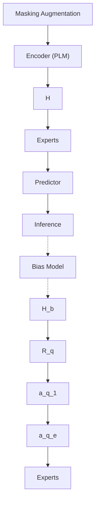

# Generalizing to Unseen Disaster Events: A Causal View

## Philipp Seeberger, Steffen Freisinger, Tobias Bocklet, Korbinian Riedhammer

Technische Hochschule Nürnberg Georg Simon Ohm

{philipp.seeberger,steffen.freisinger,tobias.bocklet,korbinian.riedhammer}@th-nuernberg.de

## Abstract

Due to the rapid growth of social media platforms, these tools have become essential for monitoring information during ongoing disaster events. However, extracting valuable insights requires real-time processing of vast amounts of data. A major challenge in existing systems is their exposure to event-related biases, which negatively affects their ability to generalize to emerging events. While recent advancements in debiasing and causal learning offer promising solutions, they remain underexplored in the disaster event domain. In this work, we approach bias mitigation through a causal lens and propose a method to reduce event- and domain-related biases, enhancing generalization to future events. Our approach outperforms multiple baselines by up to +1.9% F1 and significantly improves a PLM-based classifier across three disaster classification tasks.

## 1 Introduction

Social media has become a crucial source of information during both natural (e.g., hurricanes) and human-made disasters (e.g., bombings) (Reuter et al., 2018). Unlike traditional news sources, social media provides real-time updates, firsthand observations, and insights via affected individuals (Sakaki et al., 2010). Filtering these information nuggets is essential for situational awareness and for supporting relief organizations, government agencies, and emergency responders (Kruspe et al., 2021).

A major challenge lies in processing the vast volume of social media data, requiring automated methods to reliably detect relevant content (Kaufhold, 2021). Although recent advances in Large Language Models (LLMs) demonstrate promising capabilities, their considerably higher latency limits their applicability for this task (see Table 2), making smaller Pretrained Language Models (PLMs) a necessary alternative. Recent research has explored binary, multi-class, and multi-label classification to categorize posts into broad (e.g., Relevant vs. Irrelevant) or fine-grained (e.g., Infrastructure Damage, Missing People, etc) categories (Olteanu et al., 2015; Alam et al., 2021; Buntain et al., 2021).

Another key challenge is the scarcity and absence of in-domain data. Emerging disasters are unpredictable and past event data often fails to generalize due to shifts in event-specific (e.g., locations) and domain-specific (e.g., wildfire spread patterns) features (Medina Maza et al., 2020). Additionally, social media posts are typically short, noisy, and lack contextual depth, making it difficult for models to adapt to unseen disaster events (Wiegmann et al., 2020).

To mitigate biased models, prior work has investigated domain adaptation (Alam et al., 2018; Seeberger and Riedhammer, 2022) and adversarial learning methods (Medina Maza et al., 2020), but these approaches struggle with mixed event types and rely on large amounts of data. Other debiasing techniques have been extensively studied in related areas such as fake news detection (Zhu et al., 2022), sentiment analysis (Chew et al., 2024), and question answering (Clark et al., 2019), but have never been applied to the disaster response domain.

Recently, causal learning has gained attention for debiasing by modeling cause-effect relationships (Wei et al., 2021; Qian et al., 2021; Zhu et al., 2022; Chen et al., 2023; Zhang et al., 2024). However, the causal perspective remains underexplored for disaster event modeling. In this work, we adopt a causal view and propose a method to mitigate event- and domain-related1 biases, improving generalization to future disaster events.

Contributions (1) We present a causal perspective on event- and domain-related biases in realtime disaster classification and propose a framework for improved generalization. (2) We reproduce and adapt a broad range of debiasing methods, demonstrating the effectiveness of our approach on three real-world disaster classification datasets.

## 2 Method

Let $X = \{ ( p _ { i } , y _ { i } ) \} _ { i = 1 } ^ { N }$ denote a collection of social media posts, where each post $p = ( w _ { 1 } , \ldots , w _ { n } )$ is a sequence of n tokens with assigned ground truth label $y \in \{ 1 , \ldots , l \}$ indicating one of l information types. The goal is to learn a classifier that predicts the correct information type for new posts. Therefore, each post is encoded by a PLM encoder into a sequence of contextualized representations $H = ( h _ { 1 } , \ldots , h _ { m } ) \in \mathbb { R } ^ { m \times d }$ with encoder sequence length m and hidden dimension $d .$ The resulting representations are aggregated and passed through a classification layer to predict the information type $\hat { y } .$ . However, as shown in prior work (Medina Maza et al., 2020), models trained on disaster-related posts often rely on spurious event-specific cues (e.g., locations, hashtags) and domain-related patterns (e.g., hurricanes, bombings), which hinder generalization to unseen events. To address this issue, our method explicitly disentangles biased signals from more generalizable signals, thereby improving model robustness and transferability across diverse disaster scenarios. An overview of our proposed framework is shown in Figure 1.

## 2.1 Event-related Bias

To remove spurious event-specific correlations, we follow the causal frameworks of Wei et al. (2021); Zhu et al. (2022) and model event-related bias using a causal graph with a direct effect path $E \to Y$ and indirect effect path $E  P  Y$ , where $E _ { \mathrm { { : } } }$ $P ,$ , and $Y$ represent event context, post, and information type, respectively. For example, the event Jakarta floods causes certain tokens to appear in the post, such as #JakartaFlood, which may introduce spurious shortcuts w.r.t. the information type. To mitigate such confounding effects, our goal is to block the direct path $E  Y$ while preserving disaster-related features captured through P. We achieve this by identifying event-specific tokens and model their direct contribution to the predicted information type. During inference, we remove the estimated direct effect to obtain debiased predictions.

flowchart

Figure 1: Overview of the proposed framework. The masking augmentation and bias model are used only during training. During inference, the bias model is removed to obtain debiased predictions. The experts and predictor corresponds to the main model, and only a single expert’s output $R _ { q }$ is used for final prediction.

Identification First, we identify the observable bias tokens $u = ( u _ { 1 } , u _ { 2 } , . . . )$ for each $p$ as proxies for the event context. Specifically, we extract named entities (e.g., persons, locations, buildings), Twitter-specific markers such as hashtags (i.e., retrieval keywords) and numerical values (e.g., casualties). These tokens introduce potential eventspecific bias that must be considered during model training and inference.

Modeling Next, we explicitly model the direct effect $E  Y$ using a bias model consisting of a bias encoder and predictor. The model receives the counterfactual contextualized representations $H _ { b }$ of $\boldsymbol { p } _ { b } = \left( [ \mathrm { C L S } ] , u _ { 1 } , [ \mathrm { S E P } ] , u _ { 2 } , [ \mathrm { S E P } ] , \dots \right)$ as input and produces counterfactual predictions $\hat { y } _ { b }$ We optimize the model with cross-entropy loss:

$$
\mathcal {L} _ {b i a s} = - \sum_ {(p, y) \in X} y \log (\hat {y} _ {b}) \tag {1}
$$

This enables the bias model to capture the direct effect of event context on the main task, which is later integrated into the main model and inference process.

## 2.2 Domain-related Bias

When training on data with mixed event types, domain-related bias arises as overrepresented event types dominate the model’s attention patterns and decision boundaries, resulting in degraded crossdomain robustness (Medina Maza et al., 2020). However, directly blocking these causal paths is challenging. Inspired by Wu et al. (2024), we propose a query-based approach that leverages domainspecific experts $Q ~ = ~ \{ q _ { 1 } , \ldots , q _ { e } \}$ , each corresponding to an event type. These queries encode domain-specific priors that guide how attention aggregates information from the contextualized representations. While a single shared query would bias attention toward frequent domains, domainspecific experts encourage balanced representations and mitigate overrepresentation bias. Unlike Wu et al. (2024), which employ predefined label-based queries, our method introduces domainaware experts to reduce interference across event types.

Modeling We implement the main model using an attention-based classifier that generates e domain-specific attention distributions $\{ a _ { q _ { 1 } } , \dotsc , a _ { q _ { e } } \}$ , where each $\boldsymbol { a } \in \mathbb { R } ^ { m \times 1 }$ corresponds to the attention weights for an expert. The attention distribution for the assigned expert $q$ is computed as follows: $a _ { q } = \operatorname { s o f t m a x } ( H W _ { q } + b _ { q } )$ , where $W _ { q } \in \mathbb { R } ^ { d \times 1 }$ and $b _ { q } \in \mathbb { R }$ are learnable parameters. Next, we obtain the final representation for an expert as $\begin{array} { r } { R _ { q } = \sum _ { i } a _ { q } ^ { ( i ) } h _ { i } } \end{array}$ and get the model predictions $\hat { y } _ { m }$ via a shared predictor. Both the PLM encoder and the predictor are shared across event types, while only the attention queries are domain-specific. The rationale for this design is to condition the attention mechanism on the event type, while maintaining knowledge transfer.

The final prediction is fused as $\hat { y } = ( 1 - \alpha ) \hat { y } _ { m }$ + $\alpha \hat { y } _ { b }$ and optimized with the cross-entropy loss:

$$
\mathcal {L} _ {\text {main}} = - \sum_ {(p, y) \in X} y \log (\hat {y}) \tag {2}
$$

Here, the parameter α controls the contribution of the bias model. This allows the main model to focus on disaster-relevant features while minimizing the influence of overrepresented event types.

## 2.3 Masking Augmentation

To further improve the generalization ability of the models, we introduce Masking Augmentation. For each post, we re-use the identified bias tokens $u = ( u _ { 1 } , u _ { 2 } , \ldots )$ (see 2.1) and randomly mask each token $u _ { i }$ by replacing it with a special token [MASK] during training. From a causal view, masking acts as intervention which generates counterfactual versions of the post, helping to break spurious correlations between individual tokens and target labels. This encourages the model to rely more on contextual information rather than spurious tokens.

## 2.4 Training and Inference

The bias and main model are jointly trained by optimizing the combined loss:

$$
\mathcal {L} = \mathcal {L} _ {\text {main}} + \lambda \mathcal {L} _ {\text {bias}}, \tag {3}
$$

where λ is a trade-off parameter that controls the strength of bias mitigation. Note that the parameters of each expert are updated only for samples with the corresponding event type. We also explored to train the bias and main model sequentially but found significantly worse results.

During inference, we discard the bias model predictions $\hat { y } _ { b }$ and only use $\hat { y } _ { m }$ for unseen events (see Figure 1). To ensure proper adaptation, we select expert representations corresponding to the given event type, which is known a priori due to the nature of disaster monitoring tasks.

## 3 Experiments

Datasets For our experiments, we use three widely used disaster event classification datasets collected from Twitter, covering various domains (e.g., hurricanes, wildfires, etc) and a diverse range of natural and human-made disasters. HUMAID (Alam et al., 2021) and CRISISLEX (Olteanu et al., 2015) represent multi-class tasks with a set of important categories for humanitarian aid. Similarly, TRECIS (Buntain et al., 2021) consists of multiple information types but is formulated as a multilabel task. To simulate the real-world temporal scenario, we use a temporal split strategy and divide the events into disjoint sets according to the provided timestamps. We provide the dataset details in A.1.

Metrics We use macro-averaged precision (P), recall (R), and F1 scores as evaluation metrics to effectively highlight bias since macro F1 is sensitive to skewed performance across all categories. Notably, in the disaster domain, the most critical categories tend to be naturally underrepresented, which supports our choice.

Experimental Setup We chose the base-uncased version of BERT as our PLM and for all compared baselines but also investigate the use of DEBERTA as strong and robust model in A.5. For the bias encoder, we use a CNN composed of five convolutional layers with a channel size of 64. The predictors for both the bias and main model consists of a two-layer feedforward network with 384 hidden units, GELU (Hendrycks and Gimpel, 2016) activation, and is trained with a dropout probability of 20%. We set α = 0.1 and λ = 0.2 for the training stage and additionally mask the bias tokens with a probability of 50%. For both training and inference, we select the expert corresponding to the event type (i.e., domain). In A.3 and A.4, we include more details about training and hyper-parameter selection.

<table><tr><td rowspan="2">Method</td><td colspan="4">HUMAID</td><td colspan="4">CRISISLEX</td><td colspan="4">TRECIS</td></tr><tr><td>P</td><td>R</td><td>F1</td><td> $\Delta (F1)$ </td><td>P</td><td>R</td><td>F1</td><td> $\Delta (F1)$ </td><td>P</td><td>R</td><td>F1</td><td> $\Delta (F1)$ </td></tr><tr><td>BERT</td><td>69.96</td><td>68.67</td><td>68.59</td><td>-</td><td>58.99</td><td>49.58</td><td>51.84</td><td>-</td><td>56.52</td><td>49.54</td><td>50.43</td><td>-</td></tr><tr><td>BERT-MT</td><td>68.86</td><td>69.40</td><td>68.66</td><td>+0.07</td><td>51.42</td><td>50.22</td><td>49.96</td><td>-1.88</td><td>51.90</td><td>47.10</td><td>47.02</td><td>-3.41</td></tr><tr><td colspan="13">Pipeline</td></tr><tr><td>POE</td><td>35.75</td><td>27.08</td><td>26.02</td><td>-42.57</td><td>27.37</td><td>22.84</td><td>20.45</td><td>-31.39</td><td>42.74</td><td>23.04</td><td>22.18</td><td>-28.25</td></tr><tr><td>CORSAIR</td><td>69.39</td><td>68.85</td><td>68.50</td><td>-0.09</td><td>59.71</td><td>49.15</td><td>51.53</td><td>-0.31</td><td>51.48</td><td>60.12</td><td>53.03</td><td>+2.60</td></tr><tr><td>MASKING</td><td>69.91</td><td>69.33</td><td>69.08</td><td>+0.49</td><td>58.45</td><td>53.13</td><td>54.35</td><td>+2.51</td><td>54.64</td><td>54.94</td><td>52.65</td><td>+2.22</td></tr><tr><td colspan="13">End2end</td></tr><tr><td>NFL-CP</td><td>68.43</td><td>67.84</td><td>67.74</td><td>-0.85</td><td>55.38</td><td>49.05</td><td>50.11</td><td>-1.73</td><td>63.48</td><td>42.59</td><td>42.92</td><td>-7.51</td></tr><tr><td>EAR</td><td>69.46</td><td>69.22</td><td>68.66</td><td>+0.07</td><td>58.23</td><td>51.83</td><td>53.48</td><td>+1.64</td><td>58.22</td><td>48.78</td><td>49.81</td><td>-0.62</td></tr><tr><td>EANN</td><td>69.19</td><td>70.07</td><td>69.42</td><td>+0.83</td><td>53.01</td><td>52.22</td><td>52.02</td><td>+0.18</td><td>54.46</td><td>53.38</td><td>51.11</td><td>+0.68</td></tr><tr><td>OURS</td><td>70.16</td><td>71.85</td><td>70.71</td><td>+2.12†</td><td>58.35</td><td>56.37</td><td>56.26</td><td>+4.42†</td><td>58.08</td><td>53.96</td><td>54.12</td><td>+3.69†</td></tr></table>

Table 1: Macro Precision, Recall, and F1 scores of the three datasets, averaged and tested over the same five seeds. ∆ represents the difference to BERT. Bold numbers indicate the overall best result, whereas † denotes statistical significance compared to the baselines, except for CORSAIR on TRECIS (paired t-test with p-value < 0.05).

<table><tr><td rowspan="2">Method</td><td colspan="2">HUMAID</td><td colspan="2">CRISISLEX</td><td colspan="2">TRECIS</td></tr><tr><td>F1</td><td>RL</td><td>F1</td><td>RL</td><td>F1</td><td>RL</td></tr><tr><td>OURS</td><td>70.71</td><td>-</td><td>56.26</td><td>-</td><td>54.12</td><td>-</td></tr><tr><td>QWEN2.5 1.5B</td><td>31.70</td><td>165x</td><td>37.54</td><td>119x</td><td>21.97</td><td>131x</td></tr><tr><td>QWEN2.5 3B</td><td>51.75</td><td>221x</td><td>42.59</td><td>150x</td><td>22.34</td><td>156x</td></tr><tr><td>QWEN2.5 14B</td><td>57.84</td><td>409x</td><td>45.27</td><td>274x</td><td>26.61</td><td>256x</td></tr><tr><td>LLAMA3 8B</td><td>54.23</td><td>304x</td><td>41.73</td><td>216x</td><td>23.50</td><td>194x</td></tr></table>

Table 2: Comparison with instruction-following LLMs. Relative latency (RL) is computed as the ratio of inference time (seconds per document) using a single NVIDIA A100 GPU.

Baselines As baselines, we consider the vanilla classifier BERT and a multi-task variant with domain prediction as auxiliary task, called BERT-MT. Furthermore, we compare our approach with a wide range of debiasing baselines including pipeline and end-to-end (end2end) methods. The pipeline approaches require bias/spurious tokens while the end2end methods do not neccessiate any further information or only sample-level annotations. Specifically, for the pipeline methods we include Productof-Experts (POE) (Clark et al., 2019), CORSAIR (Qian et al., 2021), and MASKING (Wang et al., 2022). The end2end approaches cover NFL-CP (Chew et al., 2024), EAR (Attanasio et al., 2022), and the adversarial approach EANN (Medina Maza et al., 2020). Additional baseline details are provided in A.2.

<table><tr><td rowspan="2">Method</td><td colspan="2">HUMAID</td><td colspan="2">CRISISLEX</td><td colspan="2">TRECIS</td></tr><tr><td>F1</td><td>Δ (F1)</td><td>F1</td><td>Δ (F1)</td><td>F1</td><td>Δ (F1)</td></tr><tr><td>BERT</td><td>68.59</td><td>-</td><td>51.84</td><td>-</td><td>50.43</td><td>-</td></tr><tr><td>OURS</td><td>70.71</td><td>+2.12</td><td>56.26</td><td>+4.42</td><td>54.12</td><td>+3.69</td></tr><tr><td>1 w/o experts</td><td>70.54</td><td>+1.95</td><td>54.60</td><td>+2.76</td><td>53.32</td><td>+2.89</td></tr><tr><td>2 w/o debias</td><td>70.17</td><td>+1.58</td><td>54.55</td><td>+2.71</td><td>53.76</td><td>+3.33</td></tr><tr><td>3 w/o augment</td><td>70.29</td><td>+1.70</td><td>55.49</td><td>+3.65</td><td>53.91</td><td>+3.48</td></tr></table>

Table 3: Ablation results for macro F1 scores.

## 3.1 Results

In Table 1, we present macro P, R, and F1 scores for the main experiments. Our approach consistently outperforms all baselines across the three tasks in terms of F1 score, achieving improvements of at least +1.3% on HUMAID, +1.9% on CRISISLEX, and + 1.1% on TRECIS, respectively. These results confirm the effectiveness of our method. Surprisingly, the second-best method is the simple MASK-ING approach, which underscores the impact of event-related bias to unseen disaster events.

Notably, our method surpasses EANN – the closest work – by up to +4.2% in P, R, and F1. The authors highlight in their work that EANN struggles with mixed event types when using adversarial bias removal. This necessitates training a separate model for each event type. Our experts overcome these limitations by disentangling disaster domains.

We also explored training the bias model separately (POE), as suggested by Clark et al. (2019), rather than jointly with the main model. However, this consistently led to poor performance, likely because the bias model captures more than just bias, hindering the main model’s ability to learn essential features (see Figure 2).

## 3.2 Comparison with LLMs

In addition to PLM-based baselines, we compare our approach to instruction-following LLMs which offer an alternative without requiring task-specific fine-tuning. We evaluate the Qwen2.5 (Yang et al., 2025) model series and LLaMA3-8B (Grattafiori et al., 2024) for comparison. As prompt, we use the annotation guidelines of the datasets and provide one example for each information type. Table 2 reports the macro F1 scores and the relative latency (RL). Although LLMs achieve promising results, their substantially higher inference latency may limit their practicality for real-time or large-scale disaster response applications.

## 3.3 Analysis

Ablation Study To illustrate the effectiveness of the proposed components, we conduct ablation studies and present the results in Table 3. In line 1, we assess the impact of our experts by replacing it with a unified query mechanism, which leads to a performance drop of up to -1.7% in F1, while HU-MAID experiences only a slight decrease of -0.2%. In line 2, removing the bias model results in the largest performance drop (up to -1.7%), highlighting the importance of event-related bias removal. Lastly, in line 3, we remove masking augmentation, revealing its complementary nature to our approach, as it constantly improves performance by only masking spurious tokens.

Probing Design Since analyzing all samples is infeasible, we design a probing test (see A.6) to evaluate the information encoded by both the bias model and the main model components. To achieve this, we encode the training set for HUMAID and CRISISLEX using the baseline, bias, and main model. We then fit a shallow classifier using only a small subset of the samples (5%) to assess the representations. The probing tasks include predicting domains, events, and information types. To ensure robustness, we run the probing tasks with 25 seeds and report the averaged macro F1 scores.

Probing Insights As shown in Figure 2, the bias and main components exhibit opposing behaviors: the event-related bias model achieves high F1 scores for domains and events but suffers a significant performance drop in the main task, whereas the debiased main model excels in the main task. This supports our design decisions to mitigate overfitting of event-related bias. Interestingly, the baseline model achieves the highest main task performance for train events but worse performance for test events (see Table 1), supporting our hypothesis that it assigns greater weight to the seen eventspecific features, while not retaining more general features. In contrast, our model’s high domain scores can be attributed to the experts, which facilitate domain-separated attention distributions and representations.

  
Figure 2: Macro F1 scores (averaged over 25 runs) for the designed probing tasks and our focused models. The random baseline refers to the information type classification task.

## 4 Conclusion

In this work, we explore event- and domain-related biases through the lens of causality and propose a method to enhance the generalization for unseen disaster events. Specifically, we design a bias model to mitigate the influence of event-related tokens, such as locations, retrieval keywords, and numbers. Additionally, we introduce an expertbased component to reduce domain bias caused by overrepresented event types. Our experiments on three challenging disaster event datasets demonstrate the effectiveness of our approach. For future work, we aim to address additional bias factors, including temporal shifts (e.g., initial vs. recovery phases), regional disparities (e.g., marginalized vs. politically significant areas), and LLM-based data augmentation to simulate communication patterns across a wider range of disaster events.

## Limitations

Our study focuses solely on disaster event classification, making pre-trained NER systems and simple heuristics suitable for detecting most eventrelated bias features. However, these systems are prone to errors, and the reliance on this types of features may limit their applicability to other use cases. Therefore, efficient automatic methods must be explored to bypass the need for tailored bias feature identification (Wang et al., 2022). Although social networks are a valuable supplement to formal sources (e.g., news), our considered datasets consists only of Twitter data in English lan guage, which includes platform-specific features such as hashtags. Expanding the scope to other data sources, event types, and languages would lead to better assessment of generalizability (McCreadie and Buntain, 2023). However, the lack of annotated data remains a significant challenge. A large and diverse corpus covering multiple events, sources, and languages could help to mitigate bias effects during the offline training phase.

## Ethical Considerations

Automated disaster classification systems can inadvertently harm vulnerable populations if errors misdirect aid or overlook critical needs. For instance, false negatives could delay relief efforts in areas that require urgent support. Social media data may also reflect societal biases, platforms such as X (formerly Twitter) are unevenly available across regions, and not all individuals have access to these platforms. This can propagate inequities in response efforts. While our method takes a step toward reducing event- and domain-related biases, careful evaluation and transparent reporting remain essential for responsible deployment.

## References

Firoj Alam, Shafiq Joty, and Muhammad Imran. 2018. Domain adaptation with adversarial training and graph embeddings. In Proceedings of the 56th Annual Meeting ofthe Associationfor Computational Linguistics (Volume 1: Long Papers), pages 1077– 1087, Melbourne, Australia. Association for Computational Linguistics.  
Firoj Alam, Umair Qazi, Muhammad Imran, and Ferda Ofli. 2021. Humaid: Human-annotated disaster incidents data from twitter with deep learning benchmarks. Proceedings ofthe International AAAI Conference on Web and Social Media, 15(1):933–942.  
Giuseppe Attanasio, Debora Nozza, Dirk Hovy, and Elena Baralis. 2022. Entropy-based attention regularization frees unintended bias mitigation from lists. In Findings of the Association for Computational Linguistics: ACL 2022, pages 1105–1119, Dublin, Ireland. Association for Computational Linguistics.  
Cody L. Buntain, Richard McCreadie, and Ian Soboroff. 2021. Incident Streams 2020: TREC-IS in the Time of COVID-19. In ISCRAM 2021: 18th International Conference on Information Systemsfor Crisis Response and Management.  
Ziwei Chen, Linmei Hu, Weixin Li, Yingxia Shao, and Liqiang Nie. 2023. Causal intervention and counterfactual reasoning for multi-modal fake news detection. In Proceedings of the 61st Annual Meeting of the Association for Computational Linguistics (Volume 1: Long Papers), pages 627–638, Toronto, Canada. Association for Computational Linguistics.  
Oscar Chew, Hsuan-Tien Lin, Kai-Wei Chang, and Kuan-Hao Huang. 2024. Understanding and mitigating spurious correlations in text classification with neighborhood analysis. In Findings of the Association for Computational Linguistics: EACL 2024, pages 1013–1025, St. Julian’s, Malta. Association for Computational Linguistics.  
Christopher Clark, Mark Yatskar, and Luke Zettlemoyer. 2019. Don‘t take the easy way out: Ensemble based methods for avoiding known dataset biases. In Proceedings ofthe 2019 Conference on Empirical Methods in Natural Language Processing and the 9th International Joint Conference on Natural Language Processing (EMNLP-IJCNLP), pages 4069–4082, Hong Kong, China. Association for Computational Linguistics.  
Jacob Devlin, Ming-Wei Chang, Kenton Lee, and Kristina Toutanova. 2019. BERT: Pre-training of deep bidirectional transformers for language understanding. In Proceedings ofthe 2019 Conference of the North American Chapter ofthe Associationfor Computational Linguistics: Human Language Technologies, Volume 1 (Long and Short Papers), pages 4171–4186, Minneapolis, Minnesota. Association for Computational Linguistics.  
Aaron Grattafiori et al. 2024. The llama 3 herd of mod els. Preprint, arXiv:2407.21783.  
Dan Hendrycks and Kevin Gimpel. 2016. Gaussian Error Linear Units (GELUs). arXiv preprint. Version Number: 5.  
Marc-André Kaufhold. 2021. Information Refinement Technologies for Crisis Informatics: User Expectations and Design Principlesfor Social Media and Mobile Apps. Springer Fachmedien Wiesbaden, Wiesbaden.  
Diederik Kingma and Jimmy Ba. 2014. Adam: A method for stochastic optimization. International Conference on Learning Representations.  
Anna Kruspe, Jens Kersten, and Friederike Klan. 2021. Review article: Detection of actionable tweets in crisis events. Natural Hazards and Earth System Sciences, 21(6):1825–1845.  
Richard McCreadie and Cody L. Buntain. 2023. Crisisfacts: Buidling and evaluating crisis timelines. In ISCRAM 2023: 20th International Conference on Information Systems for Crisis Response and Management.  
Salvador Medina Maza, Evangelia Spiliopoulou, Eduard Hovy, and Alexander Hauptmann. 2020. Eventrelated bias removal for real-time disaster events. In Findings ofthe Associationfor Computational Lin guistics: EMNLP 2020, pages 3858–3868, Online. Association for Computational Linguistics.  
Alexandra Olteanu, Sarah Vieweg, and Carlos Castillo. 2015. What to expect when the unexpected happens: Social media communications across crises. In Proceedings ofthe 18th ACM Conference on Computer Supported Cooperative Work & Social Computing, CSCW ’15, page 994–1009, New York, NY, USA. Association for Computing Machinery.  
Chen Qian, Fuli Feng, Lijie Wen, Chunping Ma, and Pengjun Xie. 2021. Counterfactual inference for text classification debiasing. In Proceedings ofthe 59th Annual Meeting ofthe Associationfor Computational Linguistics and the 11th International Joint Confer ence on Natural Language Processing (Volume 1: Long Papers), pages 5434–5445, Online. Association for Computational Linguistics.  
Christian Reuter, Amanda Lee Hughes, and Marc-André Kaufhold. 2018. Social Media in Crisis Management: An Evaluation and Analysis of Crisis Informatics Research. International Journal ofHuman–Computer Interaction, 34(4):280–294.  
Takeshi Sakaki, Makoto Okazaki, and Yutaka Matsuo. 2010. Earthquake shakes twitter users: Real-time event detection by social sensors. In Proceedings ofthe 19th International Conference on World Wide Web, WWW ’10, page 851–860, New York, NY, USA. Association for Computing Machinery.  
Philipp Seeberger and Korbinian Riedhammer. 2022. Enhancing crisis-related tweet classification with entity-masked language modeling and multi-task learning. In Proceedings of the Second Workshop on NLPfor Positive Impact (NLP4PI), pages 70–78, Abu Dhabi, United Arab Emirates (Hybrid). Association for Computational Linguistics.  
Tianlu Wang, Rohit Sridhar, Diyi Yang, and Xuezhi Wang. 2022. Identifying and mitigating spurious correlations for improving robustness in NLP models. In Findings of the Association for Computational Linguistics: NAACL 2022, pages 1719–1729, Seattle, United States. Association for Computational Linguistics.  
Tianxin Wei, Fuli Feng, Jiawei Chen, Ziwei Wu, Jinfeng Yi, and Xiangnan He. 2021. Model-agnostic  
counterfactual reasoning for eliminating popularity bias in recommender system. In Proceedings of the 27th ACM SIGKDD Conference on Knowledge Discovery & Data Mining, KDD ’21, page 1791–1800, New York, NY, USA. Association for Computing Machinery.  
Matti Wiegmann, Jens Kersten, Friederike Klan, Martin Potthast, and Benno Stein. 2020. Analysis of Detection Models for Disaster-Related Tweets. In ISCRAM 2020: 17th International Conference on Information Systemsfor Crisis Response and Management.  
Thomas Wolf, Lysandre Debut, Victor Sanh, Julien Chaumond, Clement Delangue, Anthony Moi, Pierric Cistac, Tim Rault, Remi Louf, Morgan Funtowicz, Joe Davison, Sam Shleifer, Patrick von Platen, Clara Ma, Yacine Jernite, Julien Plu, Canwen Xu, Teven Le Scao, Sylvain Gugger, Mariama Drame, Quentin Lhoest, and Alexander Rush. 2020. Transformers: State-of-the-art natural language processing. In Proceedings ofthe 2020 Conference on Empirical Methods in Natural Language Processing: System Demonstrations, pages 38–45, Online. Association for Computational Linguistics.  
Yiquan Wu, Yifei Liu, Ziyu Zhao, Weiming Lu, Yating Zhang, Changlong Sun, Fei Wu, and Kun Kuang. 2024. De-biased attention supervision for text classification with causality. Proceedings of the AAAI Conference on Artificial Intelligence, 38(17):19279– 19287.  
An Yang et al. 2025. Qwen2.5 technical report. Preprint, arXiv:2412.15115.  
Jiajun Zhang, Zhixun Li, Qiang Liu, Shu Wu, Zilei Wang, and Liang Wang. 2024. Evolving to the future: Unseen event adaptive fake news detection on social media. In Proceedings ofthe 33rdACM International Conference on Information and Knowledge Management, CIKM ’24, page 4273–4277, New York, NY, USA. Association for Computing Machinery.  
Qingru Zhang, Minshuo Chen, Alexander Bukharin, Pengcheng He, Yu Cheng, Weizhu Chen, and Tuo Zhao. 2023. Adaptive budget allocation for parameter-efficient fine-tuning. In The Eleventh International Conference on Learning Representations.  
Yongchun Zhu, Qiang Sheng, Juan Cao, Shuokai Li, Danding Wang, and Fuzhen Zhuang. 2022. Generalizing to the future: Mitigating entity bias in fake news detection. In Proceedings of the 45th International ACM SIGIR Conference on Research and Development in Information Retrieval, SIGIR ’22, page 2120–2125, New York, NY, USA. Association for Computing Machinery.

## A Appendix

## A.1 Datasets

We experiment with three publicly available Twitter datasets that support both multi-class and multi-label information type classification. These datasets were selected for their large number of events and diverse range of event types (i.e., domains), including natural and human-made disasters. To simulate real-world scenarios, we apply a temporal split strategy, dividing the events into disjoint training, validation, and test sets based on their timestamps. Detailed dataset statistics are provided in Table 4.

HUMAID This dataset is composed of tweets from 19 disaster-related events, with sizes ranging from approximately 570 to 9,500 tweets (Alam et al., 2021). HUMAID categorizes posts into 11 classes, spanning from Not Humanitarian to Injured or Dead People and provides fine-grained insights into ongoing disasters. To maintain consistency across temporal splits, we exclude posts labeled Can’t Judge and merge the closely related categories Injured or Dead People and Missing or Found People.

CRISISLEX The T26 variant of CRISISLEX (Olteanu et al., 2015) contains annotated tweets from 26 crisis events, formulated as multi-class task with seven information types including the category Not Related. This dataset captures a diverse set of emergency events with approximately 1,000 tweets per individual event. As a preprocessing step, we removed tweets labeled Not Labeled to ensure data quality.

TRECIS TREC Incident Streams is a multi-label classification task comprising over 70 events and annotations for 25 information types (Buntain et al., 2021). The dataset varies significantly in size, ranging from 90 to 5,900 tweets per event, with diverse label distributions. For our experiments, we exclude COVID events and retain only those with at least 400 tweets and multiple relevant labels, as some events primarily contain irrelevant information types. Additionally, we hierarchically merge semantically similar categories to address the issue of extremely low-frequency labels.

## A.2 Baselines

We consider a diverse set of debiasing baselines, encompassing both pipeline and end-to-end methods. Pipeline approaches rely on explicitly identified bias features and tokens, whereas end2end methods operate without requiring such information or, at most, depend on sample-level annotations. The pipeline approaches include POE, COR-

SAIR, and MASKING. For end-to-end methods, we adopt NFL-CP, EAR, and EANN. Each of these approaches is described in more detail below.

POE Product-of-Experts (Clark et al., 2019) is widely used in many existing works in order to remove known dataset biases. These works first train a bias model to capture the known biases and then train the main model as ensemble together with the bias model predictions. After training, only the main model will be used for inference. We train the bias model with the event-related tokens as input.

CORSAIR first trains a biased model on the training set directly and then applies counterfactual inference on this biased model (Qian et al., 2021). Their method generates two types of counterfactual documents to produce outputs to distill the label and keyword bias. During inference, the distilled biases are removed from the original predictions. We use the identified event-related tokens as context words.

MASKING represents a simple but effective augmentation strategy which replaces tokens or spans with the BERT-specific [MASK] token. In this work, we follow Wang et al. (2022) and mask the identified event-related tokens in the training phase with a probability of 80%. In this way, we aim to motivate the model to focus on context words and to learn the general patterns.

NFL-CP This model family mitigates spurious correlations with regularization techniques that aim to prevent token misalignments (Chew et al., 2024). We use the Constrained Parameters variant which penalizes large changes in the PLM parameters. For our experiments, we rely on the regularization hyper-parameter λ = 15000 as proposed by the authors.

EAR Entropy-based Attention Regularization represents a knowledge-free bias mitigation method without the need of any known spurious terms (Attanasio et al., 2022). The authors penalize tokens with low attention entropy and therefore low contextualization. We follow the authors original setting and compute the regularization loss for each transformer layer and set the regularization strength as α = 0.01.

EANN is the most related work to the focused disaster event domain. This approach adds an additional adversarial model component designed for event-related bias removal (Medina Maza et al., 2020). We follow the proposed framework and implement the adversarial model with a gradientreversal layer and scaling parameter λ = 1. For the multi-label task (TRECIS), we set the adversarial weight to 0.2 in order to achieve more stable results. We train a joint model across all event types to enable a fair comparison.

<table><tr><td>Dataset</td><td>Domains</td><td>Events</td><td>Labels</td><td>Train</td><td>Valid</td><td>Test</td></tr><tr><td rowspan="10">HUMAID</td><td rowspan="10">earthquake, hurricane, floods, wildfire</td><td rowspan="10">19 (12, 3, 4)</td><td>injured or dead people</td><td>3963</td><td>2785</td><td>913</td></tr><tr><td>rescue, volunteering or donation</td><td>10295</td><td>7187</td><td>3796</td></tr><tr><td>sympathy and support</td><td>4599</td><td>1779</td><td>2553</td></tr><tr><td>infrastructure and utility damage</td><td>5691</td><td>1038</td><td>1434</td></tr><tr><td>requests or urgent needs</td><td>1508</td><td>723</td><td>387</td></tr><tr><td>caution and advice</td><td>2198</td><td>1588</td><td>1608</td></tr><tr><td>displaced people and evacuations</td><td>2079</td><td>1061</td><td>859</td></tr><tr><td>other relevant information</td><td>7237</td><td>2629</td><td>2278</td></tr><tr><td>not humanitarian</td><td>1906</td><td>2834</td><td>1556</td></tr><tr><td>all</td><td>39476</td><td>21624</td><td>15384</td></tr><tr><td rowspan="8">CRISISLEX</td><td rowspan="8">earthquake, typhoon, floods, wildfire, accident, other</td><td rowspan="8">26 (15, 5, 6)</td><td>affected individuals</td><td>2339</td><td>714</td><td>1206</td></tr><tr><td>donations and volunteering</td><td>1081</td><td>500</td><td>519</td></tr><tr><td>sympathy and support</td><td>2173</td><td>577</td><td>1168</td></tr><tr><td>infrastructure and utilities</td><td>850</td><td>326</td><td>285</td></tr><tr><td>caution and advice</td><td>1277</td><td>493</td><td>249</td></tr><tr><td>other relevant information</td><td>4104</td><td>1475</td><td>1265</td></tr><tr><td>not relevant</td><td>752</td><td>167</td><td>102</td></tr><tr><td>all</td><td>12576</td><td>4252</td><td>4794</td></tr><tr><td rowspan="8">TRECIS</td><td rowspan="8">earthquake, hurricane, floods, wildfire, accident</td><td rowspan="8">33 (16, 8, 9)</td><td>observations and facts</td><td>10542</td><td>4439</td><td>6259</td></tr><tr><td>rescue, volunteering or donation</td><td>984</td><td>223</td><td>306</td></tr><tr><td>sentiment, sympathy or discussion</td><td>9966</td><td>1196</td><td>922</td></tr><tr><td>requests or urgent needs</td><td>531</td><td>63</td><td>74</td></tr><tr><td>caution, news or reports</td><td>8456</td><td>3126</td><td>3485</td></tr><tr><td>other relevant information</td><td>4515</td><td>5472</td><td>7234</td></tr><tr><td>not relevant</td><td>4582</td><td>2690</td><td>1983</td></tr><tr><td>all</td><td>25221</td><td>8688</td><td>9365</td></tr></table>

Table 4: Detailed statistics of the three datasets. The number in the brackets corresponds to the number of events in train, validation, and test sets.  
  
Figure 3: Macro F1 scores for different PLM encoders. Baseline represents a simple classification head. The results are the average of five runs.

## A.3 Implementation Details

In our experiments, we use the implementation of the Transformers (Wolf et al., 2020) (v4.47.0) and Lightning2 (v2.4.0) library in conjunction with Py-Torch (v2.3.0). For all runs, we apply five seeds (0, 42, 64, 86, 128) and report the average scores as results. All models are trained for 30 epochs with Adam (Kingma and Ba, 2014) and cosine scheduling without warmup steps but experienced no improvement after 10 epochs for HUMAID and CRISISLEX, respectively. We evaluated the performance at each epoch on the validation set and selected the best-performing checkpoint. Unless otherwise mentioned, we use bert-base-uncased3 (Devlin et al., 2019) with 110M parameters as PLM. For NER we use a model4 specifically trained for Twitter. All models are trained with A100 GPUs with 40GB HBM using compute nodes running

CUDA 12.3.

## A.4 Hyper-parameter Tuning

We tune the hyper-parameters learning rate $( 1 \times$ $1 0 ^ { - 5 } , 3 \times 1 0 ^ { - 5 } , 5 \times 1 0 ^ { - 5 } , 1 \times 1 0 ^ { - 4 } )$ , batch size (8, 16, 32, 64), λ (0.2, 0.5, 1.0), and $\alpha \left( 0 . 1 , 0 . 2 , 0 . 3 \right)$ for the first seed and validation sets. The models performed best using the batch size 32 and learning rate $1 \times 1 0 ^ { - 5 }$ for the encoder and $1 \times 1 0 ^ { - 4 }$ for the remaining initialized parameters. In addition, we found with $\lambda = 0 . 2$ and $\alpha = 0 . 1$ the most robust setup. Due to computational constraints, we apply the best setting of the first seed to the remaining runs.

## A.5 Encoder Ablation

With DEBERTA, we test a more robustly trained PLM that has demonstrated superior results for a variety of tasks. Additionally, we apply our method with Parameter-Efficient Fine-Tuning (PEFT) using AdaLoRA (Zhang et al., 2023) in conjunction with BERT. The comparison of PEFT, BERT, and $\mathrm { D E B E R T A } ^ { 5 }$ is shown in Figure 3. Our results show consistent improvements with PEFT and slight improvements with DEBERTA across all three datasets. In particular, the robustness gap narrows when using more robust models with better initial representations. This aligns with findings from other research (Chew et al., 2024).

## A.6 Probing Details

To analyze the model’s behavior, we design probing tasks to evaluate the information encoded by the baseline, bias, and main models. Specifically, we leverage existing annotations to introduce tasks for predicting the domains, events, and information types (i.e., the main task). To assess the encoded information, we encode the training sets for HU-MAID and CRISISLEX using the relevant model components. We then train a shallow classifier using only a small subset (5%) of the training samples to evaluate the learned representations. The rationale behind this setup is to examine potential overfitting to event-related bias associated with previously seen events. For the shallow model, we use a logistic regression classifier without any adaptations or preprocessing applied to the encodings. To ensure the robustness of our results, we perform the probing tasks across 25 different random seeds and train-test splits. Finally, we report the average scores from these runs.