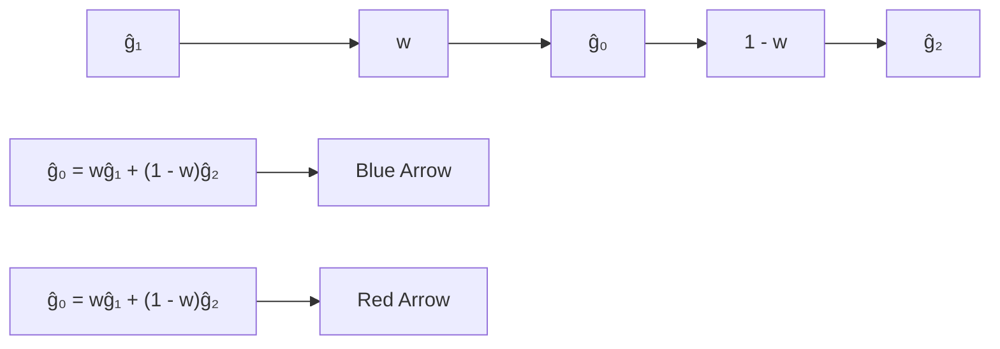

# Independent Component Alignment for Multi-Task Learning

Dmitry Senushkin Nikolay Patakin Arseny Kuznetsov Anton Konushin Samsung Research

{d.senushkin, n.patakin, a.konushin}@samsung.com

## Abstract

In a multi-task learning (MTL) setting, a single model is trained to tackle a diverse set of tasks jointly. Despite rapid progress in the field, MTL remains challenging due to optimization issues such as conflicting and dominating gradients. In this work, we propose using a condition number of a linear system of gradients as a stability criterion ofan MTL optimization. We theoretically demonstrate that a condition number reflects the aforementioned optimization issues. Accordingly, we present Aligned-MTL, a novel MTL optimization approach based on the proposed criterion, that eliminates instability in the training process by aligning the orthogonal components of the linear system ofgradients. While many recent MTL approaches guarantee convergence to a minimum, task trade-offs cannot be specified in advance. In contrast, Aligned-MTL provably converges to an optimal point with pre-defined task-specific weights, which provides more control over the optimization result. Through experiments, we show that the proposed approach consistently improves performance on a diverse set of MTL benchmarks, including semantic and instance segmentation, depth estimation, surface normal estimation, and reinforcement learning. The source code is publicly available at https://github.com/SamsungLabs/MTL.

## 1. Introduction

In a multi-task learning (MTL), several tasks are solved jointly by a single model [2, 10]. In such a scenario, information can be shared across tasks, which may improve the generalization and boost the performance for all objectives. Moreover, MTL can be extremely useful when computational resources are constrained, so it is crucial to have a single model capable of solving various tasks [17, 19, 30]. In reinforcement learning [39,50], MTL setting arises naturally, when a single agent is trained to perform multiple tasks.

Several MTL approaches [15, 24, 28, 29, 31, 35, 42] focus on designing specific network architectures and elaborate strategies of sharing parameters and representations across tasks for a given set of tasks. Yet, such complicated and powerful models are extremely challenging to train.

Direct optimization of an objective averaged across tasks might experience issues [54] related to conflicting and dominating gradients. Such gradients destabilize the training process and degrade the overall performance. Accordingly, some other MTL approaches address these issues with multi-task gradient descent: either using gradient altering [9, 27, 48, 54] or task balancing [16, 25, 28]. Many recent MTL methods [27, 37, 48] guarantee convergence to a minimum, yet task trade-offs cannot be specified in advance. Unfortunately, the lack of control over relative task importance may cause some tasks to be compromised in favor of others [37].

In this work, we analyze the multi-task optimization challenges from the perspective of stability of a linear system of gradients. Specifically, we propose using a condition number of a linear system of gradients as a stability criterion of an MTL optimization. According to our thorough theoretical analysis, there is a strong relation between the condition number and conflicting and dominating gradients issues. We exploit this feature to create Aligned-MTL, a novel gradient manipulation approach, which is the major contribution of this work. Our approach resolves gradient conflicts and eliminates dominating gradients by aligning principal components of a gradient matrix, which makes the training process more stable. In contrast to other existing methods (e.g. [27,37,48,54]), Aligned-MTL has a provable guarantee of convergence to an optimum with pre-defined task weights.

We provide an in-depth theoretical analysis of the proposed method and extensively verify its effectiveness. Aligned-MTL consistently outperforms previous methods on various benchmarks. First, we evaluate the proposed approach on the problem of scene understanding; specifically, we perform joint instance segmentation, semantic segmenta tion, depth and surface normal estimation on two challenging datasets – Cityscapes [6] and NYUv2 [36]. Second, we apply our method to multi-task reinforcement learning and conduct experiments with the MT10 dataset [55]. Lastly, in order to analyze generalization performance, Aligned-MTL has been applied to two different network architectures, namely PSPNet [48] and MTAN [28], in the scene understanding experiments.

scatter

| Point Type | L1 | L2 |
| --- | --- | --- |
| Star (Central) | -15 | -15 |
| Trajectory 1 | ~-8 | ~3 |
| Trajectory 2 | ~0 | ~0 |
| Trajectory 3 | ~0 | ~-5 |
| Trajectory 4 | ~7 | ~8 |
| Trajectory 5 | ~8 | ~6 |

scatter

| Series | L1 (range) | L2 (range) |
| --- | --- | --- |
| Cluster 1 (Orange) | -5~8 | -5~8 |
| Cluster 2 (Purple/Red) | -20~0 | -20~-19 |

scatter

| Point Type | L1 | L2 |
| --- | --- | --- |
| Star | ~-15 | ~-15 |
| Black Dot 1 | ~-8 | ~3 |
| Black Dot 2 | 0 | 0 |
| Black Dot 3 | 0 | -5 |
| Black Dot 4 | ~7 | ~8 |
| Black Dot 5 | ~9 | ~7 |

scatter

| Point Type | L1 | L2 |
| --- | --- | --- |
| Star (Left) | ~-15 | -15 |
| Star (Right) | 0 | -5 |
| Star (Right) | 0 | 0 |
| Star (Right) | ~7 | ~8 |
| Star (Right) | ~8 | ~7 |
| Star (Right) | 0 | 0 |
| Star (Right) | ~-9 | ~3 |
| Star (Right) | 0 | 0 |

scatter

| Point Type | L1 | L2 |
| --- | --- | --- |
| Star | ~-15 | ~-15 |
| Red Path 1 | ~-8 | ~3 |
| Red Path 2 | ~0 | ~0 |
| Red Path 3 | ~0 | ~-5 |
| Black Path 1 | ~7 | ~8 |
| Black Path 2 | ~8 | ~7 |

surface_3d

| Point | \(\theta_{1}\) | \(\theta^{2}\) | Value |
| --- | --- | --- | --- |
| 1 | ~0 | ~-16 | ~8 |
| 2 | ~-10 | ~-16 | ~8 |
| 3 | ~-10 | ~-16 | ~8 |
| 4 | ~-10 | ~-16 | ~8 |
| 5 | ~-10 | ~-16 | ~8 |
| 6 | ~-10 | ~-16 | ~8 |
| 7 | ~-10 | ~-16 | ~8 |
| 8 | ~-10 | ~-16 | ~8 |
| 9 | ~-10 | ~-16 | ~8 |
| 10 | ~-10 | ~-16 | ~8 |
| 11 | ~-10 | ~-16 | ~8 |
| 12 | ~-10 | ~-16 | ~8 |
| 13 | ~-10 | ~-16 | ~8 |
| 14 | ~-10 | ~-16 | ~8 |
| 15 | ~-10 | ~-16 | ~8 |
| 16 | ~-10 | ~-16 | ~8 |
| 17 | ~-10 | ~-16 | ~8 |
| 18 | ~-10 | ~-16 | ~8 |
| 19 | ~-10 | ~-16 | ~8 |
| 20 | ~-10 | ~-16 | ~8 |
| 21 | ~-10 | ~-16 | ~8 |
| 22 | ~-10 | ~-16 | ~8 |
| 23 | ~-10 | ~-16 | ~8 |
| 24 | ~-10 | ~-16 | ~8 |
| 25 | ~-10 | ~-16 | ~8 |
| 26 | ~-10 | ~-16 | ~8 |
| 27 | ~-10 | ~-16 | ~8 |
| 28 | ~-10 | ~-16 | ~8 |
| 29 | ~-10 | ~-16 | ~8 |
| 30 | ~-10 | ~-16 | ~8 |
| 31 | ~-10 | ~-16 | ~8 |
| 32 | ~-10 | ~-16 | ~8 |
| 33 | ~-10 | ~-16 | ~8 |
| 34 | ~-10 | ~-16 | ~8 |
| 35 | ~-10 | ~-16 | ~8 |
| 36 | ~-10 | ~-16 | ~8 |
| 37 | ~-10 | ~-16 | ~8 |
| 38 | ~-10 | ~-16 | ~8 |
| 39 | ~-10 | ~-16 | ~8 |
| 40 | ~-10 | ~-16 | ~8 |
| 41 | ~-10 | ~-16 | ~8 |
| 42 | ~-10 | ~-16 | ~8 |
| 43 | ~-10 | ~-16 | ~8 |
| 44 | ~-10 | ~-16 | ~8 |
| 45 | ~-10 | ~-16 | ~8 |
| 46 | ~-10 | ~-16 | ~8 |
| 47 | ~-10 | ~-16 | ~8 |
| 48 | ~-10 | ~-16 | ~8 |
| 49 | ~-10 | ~-16 | ~8 |
| 50 | ~-10 | ~-16 | ~8 |
| 51 | ~-10 | ~-16 | ~8 |
| 52 | ~-10 | ~-16 | ~8 |
| 53 | ~-10 | ~-16 | ~8 |
| 54 | ~-10 | ~-16 | ~8 |
| 55 | ~-10 | ~-16 | ~8 |
| 56 | ~-10 | ~-16 | ~8 |
| 57 | ~-10 | ~-16 | ~8 |
| 58 | ~-10 | ~-16 | ~8 |
| 59 | ~-10 | ~-16 | ~8 |
| 60 | ~-10 | ~-16 | ~8 |
| 61 | ~-10 | ~-16 | ~8 |
| 62 | ~-10 | ~-16 | ~8 |
| 63 | ~-10 | ~-16 | ~8 |
| 64 | ~-10 | ~-16 | ~8 |
| 65 | ~-10 | ~-16 | ~8 |
| 66 | ~-10 | ~-16 | ~8 |
| 67 | ~-10 | ~-16 | ~8 |
| 68 | ~-10 | ~-16 | ~8 |
| 69 | ~-10 | ~-16 | ~8 |
| 70 | ~-10 | ~-16 | ~8 |
| 71 | ~-10 | ~-16 | ~8 |
| 72 | ~-10 | ~-16 | ~8 |
| 73 | ~-10 | ~-16 | ~8 |
| 74 | ~-10 | ~-16 | ~8 |
| 75 | ~-10 | ~-16 | ~8 |
| 76 | ~-10 | ~-16 | ~8 |
| 77 | ~-10 | ~-16 | ~8 |
| 78 | ~-10 | ~-16 | ~8 |
| 79 | ~-10 | ~-16 | ~8 |
| 80 | ~-10 | ~-16 | ~8 |
| 81 | ~-10 | ~-16 | ~8 |
| 82 | ~-10 | ~-16 | ~8 |
| 83 | ~-10 | ~-16 | ~8 |
| 84 | ~-10 | ~-16 | ~8 |
| 85 | ~-10 | ~-16 | ~8 |
| 86 | ~-10 | ~-16 | ~8 |
| 87 | ~-10 | ~-16 | ~8 |
| 88 | ~-10 | ~-16 | ~8 |
| 89 | ~-10 | ~-16 | ~8 |
| 90 | ~-10 | ~-16 | ~8 |
| 91 | ~-10 | ~-16 | ~8 |
| 92 | ~-10 | ~-16 | ~8 |
| 93 | ~-10 | ~-16 | ~8 |

(a) Uniform

surface_3d

| \(\theta_{1}\) | \(\theta_{2}\) | Value |
| --- | --- | --- |
| -10~10 | -10~10 | ~-8 to 8 (Curve) |

(b) CAGrad (c = 0.4) [26]

surface_3d

| Point Type | \(\theta_{1}\) | \(\theta_{2}\) | Value |
| --- | --- | --- | --- |
| Star Marker | ~0 | ~-5 | ~-16 |
| Star Marker | ~-5 | ~-5 | ~-16 |
| Star Marker | ~-5 | ~-5 | ~-16 |
| Star Marker | ~-5 | ~-5 | ~-16 |
| Star Marker | ~-5 | ~-5 | ~-16 |
| Star Marker | ~-5 | ~-5 | ~-16 |
| Star Marker | ~-5 | ~-5 | ~-16 |
| Star Marker | -10 | -10 | ~-16 |
| Star Marker | -10 | -10 | ~-16 |
| Star Marker | -10 | -10 | ~-16 |
| Star Marker | -10 | -10 | ~-16 |
| Star Marker | -10 | -10 | ~-16 |
| Star Marker | -10 | -10 | ~-16 |
| Star Marker | -10 | 0 | ~-16 |
| Star Marker | -10 | 0 | ~-16 |
| Star Marker | -10 | 0 | ~-16 |
| Star Marker | -10 | 0 | ~-16 |
| Star Marker | -10 | 0 | ~-16 |
| Star Marker | -10 | 0 | ~-16 |
| Star Marker | -10 | 0 | ~8 |
| Star Marker | -10 | 0 | ~8 |
| Star Marker | -10 | 0 | ~8 |
| Star Marker | -10 | 0 | ~8 |
| Star Marker | -10 | 0 | ~8 |
| Star Marker | -10 | 0 | ~8 |
| Star Marker | -10 | 0 | ~8 |
| Star Marker | -10 | 0 | ~8 |

(c) IMTL [27]

surface_3d

| Point Type | \(\theta_{1}\) | \(\theta_{2}\) | \(\theta_{3}\) |
| --- | --- | --- | --- |
| Star Marker | ~0 | ~-16 | ~-16 |
| Star Marker | ~-10 | ~-16 | ~-16 |
| Star Marker | ~-10 | ~-8 | ~-8 |
| Star Marker | ~-10 | ~-4 | ~-4 |
| Star Marker | ~-10 | ~0 | ~0 |
| Star Marker | ~-10 | ~4 | ~4 |
| Star Marker | ~-10 | ~8 | ~8 |
| Star Marker | ~-10 | ~12 | ~12 |
| Star Marker | ~-10 | ~16 | ~16 |
| Star Marker | ~-10 | ~20 | ~20 |
| Star Marker | ~-10 | ~24 | ~24 |
| Star Marker | ~-10 | ~28 | ~28 |
| Star Marker | ~-10 | ~32 | ~32 |
| Star Marker | ~-10 | ~36 | ~36 |
| Star Marker | ~-10 | ~40 | ~40 |
| Star Marker | ~-10 | ~44 | ~44 |
| Star Marker | ~-10 | ~48 | ~48 |
| Star Marker | ~-10 | ~52 | ~52 |
| Star Marker | ~-10 | ~56 | ~56 |
| Star Marker | ~-10 | ~60 | ~60 |
| Star Marker | ~-10 | ~64 | ~64 |
| Star Marker | ~-10 | ~68 | ~68 |
| Star Marker | ~-10 | ~72 | ~72 |
| Star Marker | ~-10 | ~76 | ~76 |
| Star Marker | ~-10 | ~80 | ~80 |
| Star Marker | ~-10 | ~84 | ~84 |
| Star Marker | ~-10 | ~88 | ~88 |
| Star Marker | ~-10 | ~92 | ~92 |
| Star Marker | ~-10 | ~96 | ~96 |
| Star Marker | ~-10 | ~100 | ~100 |
| Star Marker | ~-10 | ~104 | ~104 |
| Star Marker | ~-10 | ~108 | ~108 |
| Star Marker | ~-10 | ~112 | ~112 |
| Star Marker | ~-10 | ~116 | ~116 |
| Star Marker | ~-10 | ~120 | ~120 |
| Star Marker | ~-10 | ~124 | ~124 |
| Star Marker | ~-10 | ~128 | ~128 |
| Star Marker | ~-10 | ~132 | ~132 |
| Star Marker | ~-10 | ~136 | ~136 |
| Star Marker | ~-10 | ~140 | ~140 |
| Star Marker | ~-10 | ~144 | ~144 |
| Star Marker | ~-10 | ~148 | ~148 |
| Star Marker | ~-10 | ~152 | ~152 |
| Star Marker | ~-10 | ~156 | ~156 |
| Star Marker | ~-10 | ~160 | ~160 |
| Star Marker | ~-10 | ~164 | ~164 |
| Star Marker | ~-10 | ~168 | ~168 |
| Star Marker | ~-10 | ~172 | ~172 |
| Star Marker | ~-10 | ~176 | ~176 |
| Star Marker | ~-10 | ~180 | ~180 |
| Star Marker | ~-10 | ~184 | ~184 |
| Star Marker | ~-10 | ~188 | ~188 |
| Star Marker | ~-10 | ~200 | ~200 |

(d) Nash-MTL [37]

surface_3d

| Feature | \(\theta_{1}\) | \(\theta_{2}\) | Value |
| --- | --- | --- | --- |
| Local extrema | ~0, ~-10, ~10 | ~0, ~10 | -16, -8, 0, 8 |

(e) Aligned-MTL (ours)  
Figure 1. Comparison of MTL approaches on a challenging synthetic two-task benchmark [26, 37]. We visualize optimization trajectories w.r.t. objectives value $( \mathcal { L } _ { 1 }$ and $\mathcal { L } _ { 2 } .$ , top row), and cumulative objective w.r.t. parameters (θ1 and $\theta _ { 2 } ,$ , bottom row). Initialization points are marked with •, the Pareto front (Def. 1) is denoted as . Other MTL approaches produce noisy optimization trajectories (Figs. 1a to 1d) inside areas with conflicting and dominating gradients (Fig. 2). In contrast, our approach converges to the global optimum (⋆) robustly. Approaches aiming to find a Pareto-stationary solution (such as Fig. 1c and Fig. 1d) terminate once the Pareto front is first reached, as a result, they might provide a suboptimal solution. Differently, Aligned-MTL drifts along the Pareto front and provably converges to the optimum w.r.t. pre-defined tasks weights.

## 2. Related Work

A multi-task setting [2, 8, 44] is leveraged in computer vision [1,16,19,38,56], natural language processing [5,11,32], speech processing [47], and robotics [23, 52] applications. Prior MTL approaches formulate the total objective as a weighted sum of task-specific objectives, with weights being manually tuned [17, 21, 34]. However, finding optimal weights via grid search is computationally inefficient. Kendall et al. [16] overcame this limitation, assigning task weights according to the homoscedastic uncertainty of each task. Other recent methods, such as GradNorm [3] and DWA [28], optimize weights based on task-specific learning rates or by random weighting [25].

The most similar to Aligned-MTL approaches (e.g. [9, 26, 27, 37, 54]) aim to mitigate effects of conflicting or dominating gradients. Conflicting gradients having opposing directions often induce a negative transfer (e.g. [22]). Among all approaches tackling this problem, the best results are obtained by those based on an explicit gradient modulation [26, 27, 54] where a gradient of a task which conflicts with a gradient of some other task is replaced with a mod ified, non-conflicting, gradient. Specifically, PCGrad [54] proposes a ”gradient surgery” which decorrelates a system of vectors, while CAGrad [26] aims at finding a conflict-averse direction to minimize overall conflicts. GradDrop [4] forces task gradients sign consistency. Other methods also address an issue of dominating gradients. Nash-MTL [37] leverages advances of game theory [37], while IMTL [27] searches for a gradient direction where all the cosine similarities are equal.

Several recent works [41, 43] investigate a multiplegradient descent algorithm (MGDA [9, 12, 45]) for MTL: these methods search for a direction that decreases all objectives according to multi-objective Karush–Kuhn–Tucker (KKT) conditions [20]. Sener and Koltun [48] propose extending the classical MGDA [9] so it scales well to high dimensional problems for a specific use case. However, all the described approaches converge to an arbitrary Paretostationary solution, leading to a risk of imbalanced task performance.

## 3. Multi-Task Learning

Multi-task learning implies optimizing a single model with respect to multiple objectives. The recent works [9, 16, 39, 54] have found that this learning problem is difficult to solve by reducing it to a standard single-task approach. In this section, we introduce a general notation and describe frequent challenges arising in gradient optimization in MTL.

## 3.1. Notation

In ${ \bf M T L } ,$ there are $T > 1$ tasks. Each task is associated with an objective $\mathcal { L } _ { i } ( \pmb { \theta } )$ depending on a set of model parameters θ shared between all tasks. The goal of MTL training is to find a parameter $\pmb { \theta }$ that minimizes an average loss:

heatmap

| Metric | Description |
| --- | --- |
| Left Chart | Heatmap visualization showing gradient field with red (left) and black (right) arrows indicating direction. |
| Right Chart 1 | 2D contour plot with axes θ1, θ2 and θ1, θ2. |
| Right Chart 2 | 2D contour plot with axes θ1, θ2, θ2. |

Figure 2. Synthetic two-task MTL benchmark [26, 37]. Loss landscapes w.r.t. individual objectives are depicted on the right side. The cumulative loss landscape (on the left side) contains areas with conflicting and dominating gradeints.

$$
\boldsymbol {\theta} ^ {*} = \arg \min _ {\boldsymbol {\theta} \in \mathbb {R} ^ {m}} \left\{\mathcal {L} _ {0} (\boldsymbol {\theta}) \stackrel {\text {def}} {=} \sum_ {i = 1} ^ {T} \frac {1}{T} \mathcal {L} _ {i} (\boldsymbol {\theta}). \right\} \tag {1}
$$

We introduce the following notation: $\pmb { g } _ { i } = \nabla \mathcal { L } _ { i } ( \pmb { \theta } ) - \mathrm { i n - }$ dividual task gradients; $\mathcal { L } _ { 0 } ( \pmb { \theta } ) - \mathbf { a }$ cumulative objective; $G = \left\{ g _ { 1 } , \cdot \cdot \cdot , g _ { T } \right\} - \mathrm { a }$ gradient matrix; $w _ { i } \ { \stackrel { \mathrm { d e f } } { = } } \ { \frac { 1 } { T } } - { \mathrm { p r e } } -$ defined task weights. The task weights are supposed to be fixed. We omit task-specific parameters in our notation, since they are independent and not supposed to be balanced.

## 3.2. Challenges

In practice, directly solving a multi-objective optimization problem via gradient descent may significantly compromise the optimization of individual objectives [54]. Simple averaging of gradients across tasks makes a cumulative gradient biased towards the gradient with the largest magnitude, which might cause overfitting for a subset of tasks. Conflicting gradients with negative cosine distance complicate the training process as well; along with dominating gradients, they increase inter-step direction volatility that decreases overall performance (Fig. 1). To mitigate the undesired effects of conflicting and dominating gradients in MTL, we propose a criterion that is strongly correlated with the presence of such optimization issues. This measure is a condition number of a linear system of gradients.

## 4. Stability

The prevailing challenges in MTL are arguably task dominance and conflicting gradients, accordingly, various criteria for indicating and measuring these issues have been formulated. For instance, a gradient dominance can be measured with a gradient magnitude similarity ( [54] Def. 2). Similarly, gradient conflicts can be estimated as a cosine distance between vectors ( [54] Def. 1, [26]). However, each of these metrics describes a specific characteristic of a linear system of gradients, and cannot provide a comprehensive assessment if taken separately. We show that our stability criterion indicates the presence of both MTL challenges (Fig. 4); importantly, it describes a whole linear system and can be trivially measured on any set of gradients. Together with magnitude similarity and cosine distance, this criterion accurately describes the training process.

## 4.1. Condition Number

Generally, the stability of an algorithm is its sensitivity to an input perturbation, or, in other words, how much the output changes if an input gets perturbed. In numerical analysis, the stability of a linear system is measured by a condition number of its matrix. In a multi-task optimization, a cumulative gradient is a linear combination of task gradients: $\mathbf { \nabla } _ { g } = G w$ . Thus, the stability of a linear system of gradients can be measured as the condition number of a gradient matrix G. The value of this stability criterion is equal to the ratio of the maximum and minimum singular values of the corresponding matrix:

$$
\kappa (\boldsymbol {G}) = \frac {\sigma_ {m a x}}{\sigma_ {m i n}}. \tag {2}
$$

Remark. A linear system is well-defined if its condition number is equal to one, and ill-posed if it is non-finite. A standard assumption for multi-task optimization is that a gradient system is not ill-posed, i.e. task gradients are linearly independent. In this work, we suppose that the linear independence assumption holds unless otherwise stated.

## 4.2. Condition Number and MTL Challenges

The dependence between the stability criterion and MTL challenges is two-fold. Let us consider a gradient system having a minimal condition number. According to the singular value decomposition theorem, its gradient matrix $\hat { G }$ with $\kappa ( \hat { G } ) = 1$ must be orthogonal with equal singular values:

$$
\hat {\boldsymbol {G}} = \boldsymbol {U} \boldsymbol {\Sigma} \boldsymbol {V} ^ {\top}, \quad \text {where} \quad \boldsymbol {\Sigma} = \sigma \boldsymbol {I} \tag {3}
$$

Moreover, since U, V matrices are orthonormal, individual task gradients norms are equal to $\sigma .$ Thus, minimizing the condition number of the linear system of gradients leads to mitigating dominance and conflicts within this system.

On the other hand, if an initial linear system of gradients is not well-defined, reducing neither gradient conflict nor dominance only does not guarantee minimizing a condition number. The stability criterion reaches its minimum iff both issues are solved jointly and gradients are orthogonal. This restriction eliminates positive task gradients interference (codirected gradients may produce $\kappa > 1 )$ , but it can guarantee the absence of negative interaction, which is essential for a stable training. Noisy convergence trajectories w.r.t. objectives values (Fig. 1, top row) indicate instability of the training process.

text_image

g₁
σ₂
σ₁
u₁
u₂
g₂

(a) Initial gradients

text_image

û₁
û₂
û₁
û₂
û₁
û₂
û₁
û₂
û₁
û₂
û₁
û₂
û₁
û₂
û₁
û₂
û₁
û₂
û₁
û₂
û₁
û₂
û₁
û₂
û₁
û₂
û₁
û₂
û₁
û₂
û₁
û₂
û₁
û₂
û₁
ô = min{σ₁, σ₂}

(b) Gradients aligned via Aligned-MTL

flowchart

(c) Accumulated MTL gradient  
Figure 3. Geometric interpretation of our approach on a two-task MTL. Here, individual task gradients $g _ { 1 }$ and $g _ { 2 }$ are directed oppositely (conflict) and have different magnitude (dominance) (Fig. 3a). Aligned-MTL enforces stability via aligning principal components u1, u2 of an initial linear system of gradients. This can be interpreted as re-scaling axes of a coordinate system set by principal components, so that singular values of gradient matrix σ and σ are rescaled to be equal to the minimal singular value $( \sigma _ { 2 } ,$ , in this case). The aligned gradients gˆ1, gˆ2 are orthogonal (non-conflicting) and of equal magnitude (non-dominant) (Fig. 3b). Finally, the aligned gradients are summed up with pre-defined tasks weights w and $1 - w ,$ resulting in a cumulative gradient $\hat { g _ { 0 } }$ (Fig. 3c).

To demonstrate the relation between MTL challenges and our stability criterion, we conduct a synthetic experiment as proposed in [26, 37]. There are two objectives to be optimized, and the optimization landscape contains areas with conflicting and dominating gradients. We compare our approach against recent approaches that do not handle stability issues, yielding noisy trajectories in problematic areas. By enforcing stability, our method performs well on the synthetic benchmark.

## 5. Aligned-MTL

We suppose that multi-task gradient optimization should successfully resolve the main MTL challenges: conflicts and dominance in gradient system. Unlike existing approaches [51, 54] that focus on directly resolving the optimization problems, we develop an algorithm that handles issues related to the stability of a linear system of gradients and accordingly addresses both gradient conflicts and dominance.

Specifically, we aim to find a cumulative gradient $\hat { g _ { 0 } }$ , so that $\| \pmb { g } _ { 0 } - \hat { \pmb { g } } _ { 0 } \| _ { 2 } ^ { 2 }$ is minimal, while a linear system of gradients is stable $\left( \kappa ( \hat { G } ) = 1 \right)$ . This constraint is defined up to an arbitrary positive scaling coefficient. Here, we assume $\sigma = 1$ for simplicity. By applying a triangle inequality to the initial problem, we derive $\| \pmb { g } _ { 0 } - \bar { \pmb { g } } _ { 0 } \| _ { 2 } ^ { 2 } \leq \| \pmb { G } - \hat { \pmb { G } } \| _ { F } ^ { 2 } \| \pmb { w } \| _ { 2 } ^ { 2 }$ . Thereby, we consider the following optimization task:

$$
\min _ {\hat {\boldsymbol {G}}} \| \boldsymbol {G} - \hat {\boldsymbol {G}} \| _ {F} ^ {2} \quad \text {s.t.} \quad \hat {\boldsymbol {G}} ^ {\top} \hat {\boldsymbol {G}} = \boldsymbol {I} \tag {4}
$$

The stability criterion, a condition number, defines a linear system up to an arbitrary positive scale. To alleviate this ambiguity, we choose the largest scale that guarantees convergence to the optimum of an original problem (Eq. (1)): this is a minimal singular value of an initial gradient matrix $\sigma = \sigma _ { m i n } ( G ) > 0$ . The final linear system of gradients defined by $\hat { G }$ satisfies the optimality condition in terms of a condition number.

## 5.1. Gradient Matrix Alignment

The problem Eq. (4) can be treated as a special kind of Procrustes problem [46]. Fortunately, there exists a closedform solution of this task. To obtain such a solution, we perform a singular value decomposition (SVD) and rescale singular values corresponding to principal components so that they are equal to the smallest singular value.

Technically, the matrix alignment can be performed in the parameter space or in the task space; being equivalent, these options have different computational costs. This duality is caused by SVD providing two different eigen decompositions of Gram matrices $\pmb { G } ^ { \top } \pmb { G }$ and $G G ^ { \top }$

$$
\hat {\boldsymbol {G}} = \sigma \boldsymbol {U} \boldsymbol {V} ^ {\top} = \sigma \underbrace {\boldsymbol {U} \boldsymbol {\Sigma} ^ {- 1} \boldsymbol {U} ^ {\top}} _ {\text {Parameter space}} \boldsymbol {G} = \sigma \boldsymbol {G} \underbrace {\boldsymbol {V} \boldsymbol {\Sigma} ^ {- 1} \boldsymbol {V} ^ {\top}} _ {\text {Task space}} \tag {5}
$$

We perform the gradient matrix alignment at each optimization step. Since the number of tasks T is relatively small compared to the number of parameters, we operate in a task space. This makes a gradient matrix alignment more computationally efficient as we need to perform an eigen decomposition of a small $T \times T$ matrix. Fig. 3 provides a geometric interpretation of our approach, while pseudo-code is given in Alg. 1.

Remark. If an initial matrix G is singular (gradients are linear dependent), then the smallest singular value is zero. Fortunately, the singular value decomposition provides a unique solution even in this case; yet, we need to choose the smallest singular value greater than zero as a global scale.

## 5.2. Aligned-MTL: Upper Bound Approximation

The major limitation of our approach is the need to run multiple backward passes through the shared part of the model to calculate the gradient matrix. The backward passes are computationally demanding, and the training time depends linearly on the number of tasks: if it is large, our approach may be non-applicable in practice.

Algorithm 1 Gradient matrix alignment

Require: $G \in \mathbb{R}^{|\theta| \times T}$ - gradient matrix,
$w \in \mathbb{R}^T$ - task importance
/* Compute task space Gram matrix */
$M \leftarrow G^\top G$
/* Compute eigenvalues and eigenvectors of $M$ */
$(\lambda, V) \leftarrow eigh(M)$ $\Sigma^{-1} \leftarrow diag\left(\sqrt{\frac{1}{\lambda_1}}, \cdots \sqrt{\frac{1}{\lambda_R}}\right)$
/* Compute balance transformation */
$B \leftarrow \sqrt{\lambda_R} V \Sigma^{-1} V^\top$ $\alpha \leftarrow Bw$
return $G\alpha$

This limitation can be mitigated for encoder-decoder networks, where each task prediction is computed using the same shared representation. We can employ the chain rule trick [48] to upper-bound an original objective (Eq. (4)):

$$
\| \boldsymbol {G} - \hat {\boldsymbol {G}} \| _ {F} ^ {2} \leq \left\| \frac {\partial \boldsymbol {H}}{\partial \theta} \right\| _ {F} ^ {2} \| \boldsymbol {Z} - \hat {\boldsymbol {Z}} \| _ {F} ^ {2} \tag {6}
$$

Here, H stands for a hidden shared representation, and Z and $\hat { Z }$ are gradients of objective w.r.t. a shared representation of the initial and aligned linear system of gradients, respectively. Thus, the gradient alignment can be performed for a shared representation:

$$
\min _ {\hat {\boldsymbol {Z}}} \| \boldsymbol {Z} - \hat {\boldsymbol {Z}} \| _ {F} ^ {2} \quad \text {s.t.} \quad \hat {\boldsymbol {Z}} ^ {\top} \hat {\boldsymbol {Z}} = \boldsymbol {I} \tag {7}
$$

Aligning gradients of shared representation does not require additional backward passes, since matrix Z is computed during a conventional backward pass. We refer to such an approximation of Aligned-MTL as to Aligned-MTL-UB. With O(1) time complexity w.r.t. the number of tasks, this approximation tends to be significantly more efficient than the original Aligned-MTL having $O ( T )$ time complexity.

## 5.3. Convergence Analysis

In this section, we formulate a theorem regarding the convergence of our approach. Similar to single-task optimization converging to a stationary point, our MTL approach converges to a Pareto-stationary solution.

Definition 1 A solution $\theta ^ { * } \in \Theta$ is called Pareto-stationary iffthere exists a convex combination ofthe gradient-vectors that is equal to zero. All possible Pareto-stationary solutions form a Pareto set (or Pareto front).

The overall model performance may vary significantly within points of the Pareto front. Recent MTL approaches [27, 37] that provably converge to an arbitrary

Pareto-stationary solution, tend to overfit to a subset of tasks. In contrast, our approach converges to a Pareto-stationary point with pre-defined tasks weights, thus providing more control over an optimization result Eq. (1).

Theorem 1 Assume $\mathcal { L } _ { 0 } ( \pmb { \theta } ) , \dots , \mathcal { L } _ { T } ( \pmb { \theta } )$ are lower-bounded continuously differentiable functions with Lipschitz continuous gradients with $\Lambda > 0 . A$ gradient descent with aligned gradient and step size $\begin{array} { r } { \alpha \leq \frac { 1 } { \Lambda } } \end{array}$ converges linearly to a Pareto stationary point where $\nabla \mathcal { L } _ { 0 } \bar { ( } \pmb { \theta } ) = 0$

A similar theorem is valid for aligning gradients in the shared representation space (Aligned-MTL upper-bound approximation is described in Sec. 5.2). Mathematical proofs of both versions of this theorem versions are provided in supplementary materials.

## 6. Experiments

We empirically demonstrate the effectiveness of the proposed approach on various multi-task learning benchmarks, including scene understanding, multi-target regression, and reinforcement learning.

Competitors. We consider the following MTL approaches: (1) Linear Scalarization (LS, Uniform baseline): optimizing a uniformly weighted sum of individual task objectives, $\begin{array} { r } { i . e . \ \frac { 1 } { T } \sum _ { t } \mathcal { L } _ { t } ; ( 2 ) } \end{array}$ Dymanic Weight Average (DWA) [28]: adjusting task weights based on the rates of loss changes over time; (3) Uncertainty [16] weighting; (4) MGDA [9]: a multi-objective optimization with KKT [20] conditions; (5) MGDA-UB [48]: optimizing an upper bound for the MGDA optimization objective; (6) GradNorm [3]: normalizing the gradients to balance the learning of multiple tasks; (7) GradDrop [4]: forcing the sign consistency between task gradients; (8) PCGrad [54]: performing gradient projection to avoid the negative interactions between tasks gradients; (9) GradVac [51]: leveraging task relatedness to set gradient similarity objectives and adaptively align task gradients, (10) CAGrad [26]: finding a conflict-averse gradients; (11) IMTL [27]: aligning projections to task gradients; (12) Nash-MTL [37]: utilizing a bargaining games for gradient computation, and (13) Random loss weighting (RLW) [25] with normal distribution. The proposed approach and the baseline methods are implemented using the PyTorch framework [40]. The technical details on the training schedules and a complete listing of hyperparameters are provided in supplementary materials.

Evaluation metrics. Besides task specific metrics we follow Maninis et al. [33] and report a model performance drop relative to a single task baseline averaged over tasks: $\Delta m _ { t a s k } =$ $\begin{array} { r } { \frac { 1 } { T } \sum _ { t = 1 } ^ { T } \mathop { \sum _ { k = 1 } ^ { n _ { t } } ( - 1 ) ^ { \sigma _ { t k } } ( M _ { m , t k } \mathrm { ~ - ~ } M _ { b , t k } ) / M _ { b , t k } } \mathrm { ~ - ~ o r ~ } } \end{array}$ over metrics: $\begin{array} { r } { \Delta m _ { m e t r i c } = \frac { 1 } { T } \sum _ { t = 1 } ^ { T } ( - 1 ) ^ { \sigma _ { t } } ( M _ { m , t } - M _ { b , t } ) / M _ { b , t } } \end{array}$ Here, $M _ { m , t k }$ denotes the performance of a model m on a task t, measured with a metric k. Similarly, $M _ { b , t k }$ is a performance of a single-task t baseline; $n _ { t }$ denotes number of metrics per task t $. \ \sigma _ { t k } \ = \ 1$ if higher values of metric is better, and $\sigma _ { t k } = 0$ otherwise. We mostly rely on the taskweighted measure since the metric-weighted criterion tends to be biased to a task with high number of metrics.

  
Figure 4. Empirical evaluation of a stability criterion. We plot a condition number (Eq. (2)), gradient magnitude similarity [54], and minimal cosine distance during training on the CITYSCAPES three-task benchmark. This benchmark suffers from high dominance since instance segmentation loss is of much larger scale than the others. The most intuitive way to define the dominance is the maximum ratio of task gradients magnitudes. The condition number coincides with this definition in a nearly orthogonal case, as in this benchmark Fig. 4c. However, gradient magnitude similarity measure Fig. 4b proposed in [54] does not reveal much correlation with a condition number(and, accordingly with a maximal gradients magnitude ratio) Fig. 4a, so we assume it does not represent dominance issues comprehensively. From the empirical point of view Table 1, the value of a target metric is more correlated with the condition number, than with the gradient magnitude similarity.

## 6.1. Synthetic Example

To illustrate the proposed approach, we consider a synthetic MTL task (Fig. 2) introduced in [26] (a formal definition is provided in the supplementary material). As shown in Fig. 1, we perform optimization from five initial points tagged with •. IMTL [27], and Nash-MTL [37] aims at finding Pareto-stationary solution (Def. 1). As a result, they terminate optimization once they reach a solution in the Pareto front. Accordingly, the final result strongly depends on an initialization point, and the optimization may not converge to the global optimum ⋆ in some cases (Fig. 1c and Fig. 1d). Meanwhile, Aligned-MTL provides a less noisy and more stable trajectory, and provably converges to an optimum.

## 6.2. Scene Understanding

The evaluation is performed on NYUV2 [36] and CITYSCAPES [6,7] datasets. We leverage two network architectures: Multi-Task Attention Network (MTAN) [28] and Pyramid Scene Parsing Network (PSPNet) [48, 57] on scene understanding benchmarks. MTAN applies a multi-task specific attention mechanism built upon MTL SegNet [16]. PSP-Net features a dilated ResNet [14] backbone and multiple decoders with pyramid parsing modules [57]. Both networks were previously used in MTL benchmarks [48].

Table 1. Scene understanding (CITYSCAPES: three tasks). We report PSPNet [48,57] model performance averaged over 3 random seeds. The best scores are provided in gray .

<table><tr><td>Method</td><td>Segmentation ↑ mIoU [%]</td><td>Instance ↓ L1 [px]</td><td>Disparity ↓ MSE</td><td>Δm% ↓</td></tr><tr><td>Single task baselines</td><td>66.73</td><td>10.55</td><td>0.33</td><td>-</td></tr><tr><td>Baseline:Uniform</td><td>52.98</td><td>10.89</td><td>0.39</td><td>14.30</td></tr><tr><td>RLW [25]</td><td>51.26</td><td>10.25</td><td>0.41</td><td>15.58</td></tr><tr><td>DWA [28]</td><td>53.15</td><td>10.22</td><td>0.40</td><td>13.20</td></tr><tr><td>Uncertainty [16]</td><td>60.12</td><td>9.87</td><td>0.33</td><td>1.53</td></tr><tr><td>MGDA [9]</td><td>66.72</td><td>17.02</td><td>0.33</td><td>20.62</td></tr><tr><td>MGDA-UB [48]</td><td>66.37</td><td>18.63</td><td>0.32</td><td>25.05</td></tr><tr><td>GradNorm [3]</td><td>57.24</td><td>10.29</td><td>0.35</td><td>6.55</td></tr><tr><td>GradDrop [4]</td><td>52.98</td><td>10.09</td><td>0.40</td><td>12.50</td></tr><tr><td>PCGrad [54]</td><td>54.06</td><td>9.91</td><td>0.38</td><td>10.00</td></tr><tr><td>GradVac [51]</td><td>54.07</td><td>10.39</td><td>0.40</td><td>12.99</td></tr><tr><td>CAGrad [26]</td><td>64.33</td><td>10.15</td><td>0.34</td><td>1.46</td></tr><tr><td>IMTL [27]</td><td>65.13</td><td>11.58</td><td>0.32</td><td>3.10</td></tr><tr><td>Nash-MTL [37]</td><td>64.84</td><td>11.90</td><td>0.37</td><td>9.38</td></tr><tr><td>Aligned-MTL (ours)</td><td>67.06</td><td>10.63</td><td>0.33</td><td>-0.02</td></tr><tr><td>Aligned-MTL-UB (ours)</td><td>66.07</td><td>10.54</td><td>0.32</td><td>-0.35</td></tr></table>

NYUV2. Following Liu et al. [26,28,37], we evaluate the performance of our approach on the NYUv2 [36] dataset by jointly solving semantic segmentation, depth estimation, and surface normal estimation tasks. We use both MTAN [28] and PSPNet [48] model architectures.

For MTAN, we strictly follow the training procedure described in [26, 37]: training at 384×288 resolution for 200 epochs with Adam [18] optimizer and $1 0 ^ { - 4 }$ initial learning rate, halved after 100 epochs. The evaluation results are presented in Table 2. We report metric values averaged across three random initializations as in previous works. We calculate both metric-weighted measure to compare with previous works alongside a task-weighted ∆m modification. We claim the latter measure to be more important, as it is not biased towards surface normal estimation, thereby assessing overall performance more fairly. Accordingly, it exposes inconsistent task performance of GradNorm [3] and MGDA [48], which are biased towards surface normal estimation task and perform poorly on semantic segmentation. Although the MTAN model is not encoder-decoder architecture, our Aligned-MTL-UB approach outperforms all previous MTL optimization methods according to task-weighted ∆m. Our original Aligned-MTL approach improves model performance even further in terms of both metrics.

Table 2. Scene understanding (NYUV2, three tasks). We report MTAN [28] model performance averaged over 3 random seeds. The best scores are provided in gray

<table><tr><td rowspan="3">Method</td><td colspan="2">Segmentation ↑</td><td colspan="2">Depth ↓</td><td colspan="5">Surface normals ↓</td><td>Δm% ↓</td><td>Δm% ↓</td></tr><tr><td rowspan="2">mIoU</td><td rowspan="2">Pix Acc</td><td rowspan="2">Abs.</td><td rowspan="2">Rel.</td><td colspan="2">Angle Dist. ↓</td><td colspan="3">Within  $t^{\circ}$  ↑</td><td rowspan="2">Metric-weighted</td><td rowspan="2">Task-weighted</td></tr><tr><td>Mean</td><td>Median</td><td>11.25</td><td>22.5</td><td>30</td></tr><tr><td>Single task baselines</td><td>38.30</td><td>63.76</td><td>0.68</td><td>0.28</td><td>25.01</td><td>19.21</td><td>30.14</td><td>57.20</td><td>69.15</td><td>-</td><td>-</td></tr><tr><td>Baseline: Uniform</td><td>39.29</td><td>65.33</td><td>0.55</td><td>0.23</td><td>28.15</td><td>23.96</td><td>22.09</td><td>47.50</td><td>61.08</td><td>5.46</td><td>-1.07</td></tr><tr><td>RLW [25]</td><td>37.17</td><td>63.77</td><td>0.58</td><td>0.24</td><td>28.27</td><td>24.18</td><td>22.26</td><td>47.05</td><td>60.62</td><td>7.67</td><td>2.00</td></tr><tr><td>DWA [28]</td><td>39.11</td><td>65.31</td><td>0.55</td><td>0.23</td><td>27.61</td><td>23.18</td><td>24.17</td><td>50.18</td><td>62.39</td><td>3.49</td><td>-2.06</td></tr><tr><td>Uncertainty [16]</td><td>36.87</td><td>63.17</td><td>0.54</td><td>0.23</td><td>27.04</td><td>22.61</td><td>23.54</td><td>49.05</td><td>63.65</td><td>4.01</td><td>-0.97</td></tr><tr><td>MGDA [48]</td><td>30.47</td><td>59.90</td><td>0.61</td><td>0.26</td><td>24.88</td><td>19.45</td><td>29.18</td><td>56.88</td><td>69.36</td><td>1.47</td><td>1.79</td></tr><tr><td>GradNorm [3]</td><td>20.09</td><td>52.06</td><td>0.72</td><td>0.28</td><td>24.83</td><td>18.86</td><td>30.81</td><td>57.94</td><td>69.73</td><td>7.22</td><td>11.51</td></tr><tr><td>GradDrop [4]</td><td>39.39</td><td>65.12</td><td>0.55</td><td>0.23</td><td>27.48</td><td>22.96</td><td>23.38</td><td>49.44</td><td>62.87</td><td>3.61</td><td>-2.03</td></tr><tr><td>PCGrad [54]</td><td>38.06</td><td>64.64</td><td>0.56</td><td>0.23</td><td>27.41</td><td>22.80</td><td>23.86</td><td>49.83</td><td>63.14</td><td>3.83</td><td>-1.33</td></tr><tr><td>GradVac [51]</td><td>37.53</td><td>64.35</td><td>0.56</td><td>0.24</td><td>27.66</td><td>23.38</td><td>22.83</td><td>48.66</td><td>62.21</td><td>5.44</td><td>0.01</td></tr><tr><td>CAGrad [26]</td><td>39.79</td><td>65.49</td><td>0.55</td><td>0.23</td><td>26.31</td><td>21.58</td><td>25.61</td><td>52.36</td><td>65.58</td><td>0.29</td><td>-4.18</td></tr><tr><td>IMTL [27]</td><td>39.35</td><td>65.60</td><td>0.54</td><td>0.23</td><td>26.02</td><td>21.19</td><td>26.20</td><td>53.13</td><td>66.24</td><td>-0.59</td><td>-4.76</td></tr><tr><td>Nash-MTL [37]</td><td>40.13</td><td>65.93</td><td>0.53</td><td>0.22</td><td>25.26</td><td>20.08</td><td>28.40</td><td>55.47</td><td>68.15</td><td>-4.04</td><td>-7.56</td></tr><tr><td>Aligned-MTL (ours)</td><td>40.82</td><td>66.33</td><td>0.53</td><td>0.22</td><td>25.19</td><td>19.71</td><td>28.88</td><td>56.23</td><td>68.54</td><td>-4.93</td><td>-8.40</td></tr><tr><td>Aligned-MTL-UB (ours)</td><td>43.11</td><td>67.22</td><td>0.55</td><td>0.22</td><td>25.67</td><td>20.57</td><td>27.58</td><td>54.37</td><td>67.12</td><td>-3.48</td><td>-7.83</td></tr></table>

Table 3. Scene understanding (NYUV2, three tasks). We report PSPNet [48, 57] model performance averaged over 3 random seeds. The best scores are provided in gray .

<table><tr><td rowspan="3">Method</td><td colspan="2">Segmentation ↑</td><td colspan="2">Depth ↓</td><td colspan="5">Surface normals ↓</td><td rowspan="3">Δm% ↓Metric-weighted</td><td rowspan="3">Δm% ↓Task-weighted</td></tr><tr><td rowspan="2">mIoU</td><td rowspan="2">Pix Acc</td><td rowspan="2">Abs.</td><td rowspan="2">Rel.</td><td rowspan="2">Angle Mean</td><td rowspan="2">Dist. ↓Median</td><td colspan="2">Within  $t^{\circ}$ </td><td rowspan="2">30</td></tr><tr><td>11.25</td><td>22.5</td></tr><tr><td>Single task baselines</td><td>49.37</td><td>72.03</td><td>0.52</td><td>0.24</td><td>22.97</td><td>16.94</td><td>0.34</td><td>0.62</td><td>0.73</td><td>-</td><td>-</td></tr><tr><td>Baseline:Uniform</td><td>45.21</td><td>69.70</td><td>0.49</td><td>0.21</td><td>26.10</td><td>21.08</td><td>0.26</td><td>0.52</td><td>0.66</td><td>8.97</td><td>4.72</td></tr><tr><td>RLW [25]</td><td>46.19</td><td>69.71</td><td>0.46</td><td>0.19</td><td>26.09</td><td>21.09</td><td>0.27</td><td>0.53</td><td>0.66</td><td>6.67</td><td>1.73</td></tr><tr><td>DWA [28]</td><td>45.83</td><td>69.65</td><td>0.50</td><td>0.22</td><td>26.10</td><td>21.27</td><td>0.26</td><td>0.52</td><td>0.66</td><td>9.64</td><td>5.61</td></tr><tr><td>MGDA [48]</td><td>40.96</td><td>65.80</td><td>0.54</td><td>0.22</td><td>23.36</td><td>17.45</td><td>0.33</td><td>0.61</td><td>0.72</td><td>3.54</td><td>4.24</td></tr><tr><td>MGDA-UB [48]</td><td>41.15</td><td>65.10</td><td>0.53</td><td>0.22</td><td>23.42</td><td>17.60</td><td>0.32</td><td>0.60</td><td>0.72</td><td>4.02</td><td>4.40</td></tr><tr><td>GradNorm [3]</td><td>45.63</td><td>69.64</td><td>0.48</td><td>0.20</td><td>25.46</td><td>20.06</td><td>0.28</td><td>0.55</td><td>0.67</td><td>5.88</td><td>2.18</td></tr><tr><td>GradDrop [4]</td><td>45.69</td><td>70.13</td><td>0.49</td><td>0.20</td><td>26.16</td><td>21.21</td><td>0.26</td><td>0.52</td><td>0.65</td><td>8.60</td><td>3.92</td></tr><tr><td>PCGrad [54]</td><td>46.37</td><td>69.69</td><td>0.48</td><td>0.20</td><td>26.00</td><td>21.05</td><td>0.26</td><td>0.53</td><td>0.66</td><td>7.78</td><td>3.17</td></tr><tr><td>GradVac [51]</td><td>46.65</td><td>69.97</td><td>0.49</td><td>0.21</td><td>25.95</td><td>20.88</td><td>0.27</td><td>0.53</td><td>0.66</td><td>7.89</td><td>3.75</td></tr><tr><td>CAGrad [26]</td><td>45.46</td><td>69.35</td><td>0.47</td><td>0.20</td><td>24.28</td><td>18.73</td><td>0.30</td><td>0.58</td><td>0.70</td><td>2.66</td><td>0.13</td></tr><tr><td>IMTL [27]</td><td>44.02</td><td>68.56</td><td>0.47</td><td>0.19</td><td>23.69</td><td>18.03</td><td>0.32</td><td>0.59</td><td>0.72</td><td>0.76</td><td>-1.02</td></tr><tr><td>Nash-MTL [37]</td><td>47.25</td><td>70.38</td><td>0.46</td><td>0.20</td><td>23.95</td><td>18.83</td><td>0.31</td><td>0.59</td><td>0.71</td><td>1.13</td><td>-1.48</td></tr><tr><td>Aligned-MTL (ours)</td><td>46.70</td><td>69.97</td><td>0.46</td><td>0.19</td><td>24.19</td><td>18.77</td><td>0.30</td><td>0.58</td><td>0.71</td><td>1.44</td><td>-1.55</td></tr><tr><td>Aligned-MTL-UB (ours)</td><td>46.47</td><td>69.92</td><td>0.48</td><td>0.20</td><td>24.37</td><td>18.88</td><td>0.30</td><td>0.58</td><td>0.70</td><td>2.70</td><td>0.07</td></tr></table>

We report results of PSPNet (Table 3), trained on NYUv2 [36] following the same experimental setup. PSP-Net architecture establishes much stronger baselines for all three tasks than vanilla SegNet. As a result, most of MTL approaches fail to outperform single-task models. According to the task-weighted metric, only two previous approaches provide solutions better than single-task baselines, while our Aligned-MTL approach demonstrates the best results.

CITYSCAPES: two-task. We follow Liu et al. [26] experimental setup for Cityscapes [6], which implies jointly addressing semantic segmentation and depth estimation with a single MTAN [28] model. According to it, the original 19 semantic segmentation categories are classified into 7 categories. Our Aligned-MTL approach demonstrates the best results according to semantic segmentation and overall ∆m metric. Our upper bound approximation of our Aligned-MTL again achieves a competitive performance, although MTAN does not satisfy architectural requirements.

CITYSCAPES: three-task. We adopt a more challenging experimental setup [16, 48], and address MTL with disparity estimation and instance and semantic segmentation tasks. The instance segmentation is reformulated as a centroid regression [16], so that the instance objective has a much larger scale than others. In this benchmark, we utilize the training setup proposed by Sener and Koltun [48]: 100 epochs, Adam optimizer with learning rate 10− $1 0 ^ { - 4 }$ . Input images are rescaled to $2 5 6 \times 5 1 2$ , and a full set of labels is used for semantic segmentation. While many recent approaches experience a considerable performance drop (Table 1), our method performs robustly even in this challenging scenario.

## 6.3. Multi-task Reinforcement Learning

Following [26,37,54], we consider an MTL reinforcement learning benchmark MT10 in a MetaWorld [55] environment. In this benchmark, a robot is being trained to perform actions, e.g. pressing a button and opening a window. Each action is treated as a task, and the primary goal is to successfully perform a total of 10 diverse manipulation tasks. In this experiment, we compare against the optimizationbased baseline Soft Actor-Critic (SAC) [13] trained with various gradient altering methods [26, 37, 54]. We also consider MTL-RL [49]-based approaches: specifically, MTL SAC with a shared model, Multi-task SAC with task encoder (MTL SAC + TE) [55], Multi-headed SAC (MH SAC) with task-specific heads [55], Soft Modularization (SM) [53] and CARE [49]. The Aligned-MTL method has higher success rates, superseding competitors by a notable margin.

## 6.4. Empirical Analysis of Stability Criterion

In this section, we analyze gradient magnitude similarity, cosine distance, and condition number empirically. We use CITYSCAPES three-task benchmark for this purpose, which suffers from the dominating gradients. According to the gradient magnitude similarity measure, PCGrad [54], Uniform, and CAGrad [26] tend to suffer from gradient dominance. For PCGrad and Uniform baseline, imbalanced convergence rates for different tasks result in a suboptimal solution (Table 1). Differently, a well-performing CAGrad is misleadingly marked as problematic by gradient magnitude similarity. In contrast, the stability criterion – condition number – reveals domination issues for PCGrad and Uniform baselines and indicates a sufficient balance of different tasks for CAGrad $( \kappa \approx 5 )$ ). Thus, the condition number exposes the training issues more evidently (Fig. 4a). The experimental evaluation shows that with $\kappa \leq 1 0 .$ , model tends to converge to an optimum with better overall performance.

## 7. Discussion

The main limitation of Aligned-MTL is its computational optimization cost which scales linearly with the number of tasks. The upper-bound approximation of the Aligned-MTL method can be efficiently applied for encoder-decoder architectures using the same Jacobian over the shared representation. This approximation reduces instability, yet, it does not eliminate it since the Jacobian cannot be aligned. For non-encoder-decoder networks, upper-bound approximation has no theoretical guarantees but still can be leveraged as a heuristic and even provide a decent performance.

Table 4. Scene understanding (CITYSCAPES: two tasks). MTAN [28] model performance is reported as average over 3 random seeds. The best scores are provided in gray .

<table><tr><td rowspan="2"></td><td colspan="2">Segmentation</td><td colspan="2">Depth</td><td rowspan="2"> $\Delta_{\text{m}}\% \downarrow$ </td></tr><tr><td>mIoU [%] ↑</td><td>Pix. Acc ↑</td><td>Abs Err ↓</td><td>Rel Err ↓</td></tr><tr><td>Single task baselines</td><td>74.01</td><td>93.16</td><td>0.0125</td><td>27.77</td><td>-</td></tr><tr><td>Baseline: Uniform</td><td>75.18</td><td>93.49</td><td>0.0155</td><td>46.77</td><td>22.60</td></tr><tr><td>RLW [25]</td><td>74.57</td><td>93.41</td><td>0.0158</td><td>47.79</td><td>24.37</td></tr><tr><td>DWA [28]</td><td>75.24</td><td>93.52</td><td>0.0160</td><td>44.37</td><td>21.43</td></tr><tr><td>Uncertainty [16]</td><td>72.02</td><td>92.85</td><td>0.0140</td><td>30.13</td><td>5.88</td></tr><tr><td>MGDA [48]</td><td>68.84</td><td>91.54</td><td>0.0309</td><td>33.50</td><td>44.14</td></tr><tr><td>GradNorm [3]</td><td>73.72</td><td>93.04</td><td>0.0124</td><td>34.11</td><td>5.63</td></tr><tr><td>GradDrop [4]</td><td>75.27</td><td>93.53</td><td>0.0157</td><td>47.54</td><td>23.67</td></tr><tr><td>PCGrad [54]</td><td>75.13</td><td>93.48</td><td>0.0154</td><td>42.07</td><td>18.21</td></tr><tr><td>CAGrad [26]</td><td>75.16</td><td>93.48</td><td>0.0141</td><td>37.60</td><td>11.58</td></tr><tr><td>IMTL [27]</td><td>75.33</td><td>93.49</td><td>0.0135</td><td>38.41</td><td>11.04</td></tr><tr><td>Nash-MTL [37]</td><td>75.41</td><td>93.66</td><td>0.0129</td><td>35.02</td><td>6.72</td></tr><tr><td>Aligned-MTL (ours)</td><td>75.77</td><td>93.69</td><td>0.0133</td><td>32.66</td><td>5.27</td></tr><tr><td>A-MTL-UB* (ours)</td><td>74.89</td><td>93.46</td><td>0.0131</td><td>33.92</td><td>6.37</td></tr></table>

Table 5. Reinforcement learning (MT10). Average success rate on validation over 10 seeds.

<table><tr><td></td><td>Success ± SEM</td></tr><tr><td>STL SAC</td><td>0.90 ± 0.032</td></tr><tr><td>MTL SAC</td><td>0.49 ± 0.073</td></tr><tr><td>MTL SAC + TE</td><td>0.54 ± 0.047</td></tr><tr><td>MH SAC</td><td>0.61 ± 0.036</td></tr><tr><td>SM</td><td>0.73 ± 0.043</td></tr><tr><td>CARE</td><td>0.84 ± 0.051</td></tr><tr><td>PCGrad</td><td>0.72 ± 0.022</td></tr><tr><td>CAGrad</td><td>0.83 ± 0.045</td></tr><tr><td>Nash-MTL</td><td>0.91 ± 0.031</td></tr><tr><td>Ours, Aligned-MTL</td><td>0.97 ± 0.045</td></tr></table>

## 8. Conclusion

In this work, we introduced a stability criterion for multitask learning, and proposed a novel gradient manipulation approach that optimizes this criterion. Our Aligned-MTL approach stabilize the training procedure by aligning the principal components of the gradient matrix. In contrast to many previous methods, this approach guarantees convergence to the local optimum with pre-defined task weights, providing a better control over the optimization results. Additionally, we presented a computationally efficient approximation of Aligned-MTL. Through extensive evaluation, we proved our approach consistently outperforms previous MTL opti mization methods on various benchmarks including scene understanding and multi-task reinforcement learning.

Acknowledgements. We sincerely thank Anna Vorontsova, Iaroslav Melekhov, Mikhail Romanov, Juho Kannala and Arno Solin for their helpful comments, disscussions and proposed improvements regarding this paper.

## References

[1] Hakan Bilen and Andrea Vedaldi. Integrated perception with recurrent multi-task neural networks. In Advances in Neural Information Processing Systems (NIPS), volume 29, pages 235–243. Curran Associates, Inc., 2016.  
[2] Richard Caruana. Multitask learning: A knowledge-based source of inductive bias. In Proceedings of the Tenth International Conference on Machine Learning (ICML), pages 41–48. Morgan Kaufmann, 1993.  
[3] Zhao Chen, Vijay Badrinarayanan, Chen-Yu Lee, and Andrew Rabinovich. GradNorm: Gradient normalization for adaptive loss balancing in deep multitask networks. In Proceedings ofthe 35th International Conference on Machine Learning (ICML), volume 80 of Proceedings of Machine Learning Research, pages 794–803. PMLR, 2018.  
[4] Zhao Chen, Jiquan Ngiam, Yanping Huang, Thang Luong, Henrik Kretzschmar, Yuning Chai, and Dragomir Anguelov. Just pick a sign: Optimizing deep multitask models with gradient sign dropout. In Advances in Neural Information Processing Systems (NeurIPS), volume 33, pages 2039–2050. Curran Associates, Inc., 2020.  
[5] Ronan Collobert and Jason Weston. A unified architecture for natural language processing: Deep neural networks with multitask learning. In Proceedings ofthe 25th International Conference on Machine Learning (ICML), pages 160–167. ACM, 2008.  
[6] Marius Cordts, Mohamed Omran, Sebastian Ramos, Timo Rehfeld, Markus Enzweiler, Rodrigo Benenson, Uwe Franke, Stefan Roth, and Bernt Schiele. The cityscapes dataset for semantic urban scene understanding. In Proc. ofthe IEEE Conference on Computer Vision and Pattern Recognition (CVPR), 2016.  
[7] Marius Cordts, Mohamed Omran, Sebastian Ramos, Timo Scharwachter, Markus Enzweiler, Rodrigo Benenson, Uwe¨ Franke, Stefan Roth, and Bernt Schiele. The cityscapes dataset. In CVPR Workshop on The Future of Datasets in Vision, 2015.  
[8] Michael Crawshaw. Multi-task learning with deep neural networks: A survey. arXiv preprint arXiv:2009.09796, 2020.  
[9] Jean-Antoine Desid´ eri. Multiple-gradient descent algorithm´ for multiobjective optimization. In European Congress on Computational Methods in Applied Sciences and Engineering (ECCOMAS), 2012.  
[10] Carl Doersch and Andrew Zisserman. Multi-task selfsupervised visual learning. In ICCV, pages 2051–2060, 2017.  
[11] Daxiang Dong, Hua Wu, Wei He, Dianhai Yu, and Haifeng Wang. Multi-task learning for multiple language translation. In Proceedings of the 53rd Annual Meeting of the Association for Computational Linguistics and the 7th International Joint Conference on Natural Language Processing, pages 1723– 1732. Association for Computational Linguistics, 2015.  
[12] Jorg Fliege and Benar Fux Svaiter. Steepest descent meth-¨ ods for multicriteria optimization. Mathematical Methods of Operations Research, 51:479–494, 2000.  
[13] Tuomas Haarnoja, Aurick Zhou, P. Abbeel, and Sergey Levine. Soft actor-critic: Off-policy maximum entropy deep reinforcement learning with a stochastic actor. In ICML, 2018.  
[14] Kaiming He, Xiangyu Zhang, Shaoqing Ren, and Jian Sun. Deep residual learning for image recognition. In 2016 IEEE Conference on Computer Vision and Pattern Recognition (CVPR), pages 770–778, 2016.  
[15] Neil Houlsby, Andrei Giurgiu, Stanislaw Jastrze¸bski, Bruna Morrone, Quentin De Laroussilhe, Andrea Gesmundo, Mona Attariyan, and Sylvain Gelly. Parameter-efficient transfer learning for NLP. In Proceedings ofthe 36th International Conference on Machine Learning (ICML), volume 97 of Pro ceedings ofMachine Learning Research, pages 2790–2799. PMLR, 2019.  
[16] Alex Kendall, Yarin Gal, and Roberto Cipolla. Multi-task learning using uncertainty to weigh losses for scene geometry and semantics. In CVPR, pages 7482–7491, 2018.  
[17] Alex Kendall, Matthew Grimes, and Roberto Cipolla. Posenet: A convolutional network for real-time 6-dof camera relocal ization. In ICCV, pages 2938–2946, 2015.  
[18] Diederik P. Kingma and Jimmy Ba. Adam: A method for stochastic optimization. In Yoshua Bengio and Yann LeCun, editors, ICLR, 2015.  
[19] Iasonas Kokkinos. Ubernet: Training a universal convolu tional neural network for low-, mid-, and high-level vision using diverse datasets and limited memory. In CVPR, pages 6129–6138, 2017.  
[20] Harold W. Kuhn and Albert W. Tucker. Nonlinear program ming. In Proceedings of the Second Berkeley Symposium on Mathematical Statistics and Probability. University of California Press, 1951.  
[21] Zakaria Laskar, Iaroslav Melekhov, Surya Kalia, and Juho Kannala. Camera relocalization by computing pairwise rela tive poses using convolutional neural network. In Proceedings of the IEEE International Conference on Computer Vision (ICCV) Workshops, pages 920–929, 2017.  
[22] Hae Beom Lee, Eunho Yang, and Sung Ju Hwang. Deep asymmetric multi-task feature learning. In Proceedings ofthe 35th International Conference on Machine Learning (ICML), volume 80 of Proceedings of Machine Learning Research, pages 2956–2964. PMLR, 2018.  
[23] Sergey Levine, Chelsea Finn, Trevor Darrell, and Pieter Abbeel. End-to-end training of deep visuomotor policies. The Journal of Machine Learning Research, 1:1334–1373, 2016.  
[24] Wei-Hong Li, Xialei Liu, and Hakan Bilen. Universal repre sentations: A unified look at multiple task and domain learning. arXiv preprint arXiv:2204.02744, 2022.  
[25] Baijiong Lin, Feiyand Ye, Yu Zhang, and Ivor W. Tsang. Reasonable effectiveness of random weighting: A litmus test for multi-task learning. arXiv preprint arXiv:2111.10603, 2022.  
[26] Bo Liu, Xingchao Liu, Xiaojie Jin, Peter Stone, and Qiang Liu. Conflict-averse gradient descent for multi-task learn ing. In Advances in Neural Information Processing Systems (NeurIPS), volume 34, pages 18878–18890. Curran Asso ciates, Inc., 2021.  
[27] Liyang Liu, Yi Li, Zhanghui Kuang, Jing-Hao Xue, Yimin Chen, Wenming Yang, Qingmin Liao, and Wayne Zhang. Towards impartial multi-task learning. In ICLR, 2021.  
[28] Shikun Liu, Edward Johns, and Andrew J. Davison. Endto-end multi-task learning with attention. In CVPR, pages 1871–1880, 2019.  
[29] Shikun Liu, Edward Johns, and Andrew J. Davison. Endto-end multi-task learning with attention. In CVPR, pages 1871–1880, 2019.  
[30] Xiaodong Liu, Pengcheng He, Weizhu Chen, and Jianfeng Gao. Multi-task deep neural networks for natural language understanding. In Proceedings of the Annual Meeting of the Association for Computational Linguistics, volume 57. Association for Computational Linguistics, 2019.  
[31] Jiasen Lu, Vedanuj Goswami, Marcus Rohrbach, Devi Parikh, and Stefan Lee. 12-in-1: Multi-task vision and language representation learning. In CVPR, pages 10434–10443, 2020.  
[32] Minh-Thang Luong, Quoc Le, Ilya Sutskever, Oriol Vinyals, and Lukasz Kaiser. Multi-task sequence to sequence learning. ICLR, 2015.  
[33] Kevis-Kokitsi Maninis, Ilija Radosavovic, and Iasonas Kokkinos. Attentive single-tasking of multiple tasks. In IEEE Conference on Computer Vision and Pattern Recognition (CVPR), 2019.  
[34] Iaroslav Melekhov, Juha Ylioinas, Juho Kannala, and Esa Rahtu. Image-based localization using hourglass networks. In Proceedings ofthe IEEE International Conference on Computer Vision (ICCV) Workshops, pages 870–877, 2017.  
[35] Ishan Misra, Abhinav Shrivastava, Abhinav Gupta, and Martial Hebert. Cross-stitch networks for multi-task learning. In CVPR, pages 3994–4003, 2016.  
[36] Pushmeet Kohli Nathan Silberman, Derek Hoiem and Rob Fergus. Indoor segmentation and support inference from rgbd images. In ECCV, 2012.  
[37] Aviv Navon, Aviv Shamsian, Idan Achituve, Haggai Maron, Kenji Kawaguchi, Gal Chechik, and Ethan Fetaya. Multitask learning as a bargaining game. In Proceedings of the 39th International Conference on Machine Learning (ICML), volume 162 of Proceedings of Machine Learning Research, pages 16428–16446. PMLR, 2022.  
[38] Vladimir Nekrasov, Thanuja Dharmasiri, Andrew Spek, Tom Drummond, Chunhua Shen, and Ian Reid. Real-time joint semantic segmentation and depth estimation using asymmetric annotations. In International Conference on Robotics and Automation (ICRA), pages 7101–7107. IEEE, 2019.  
[39] Emilio Parisotto, Lei Jimmy Ba, and Ruslan Salakhutdinov. Actor-mimic: Deep multitask and transfer reinforcement learning. In ICLR, 2016.  
[40] Adam Paszke, Sam Gross, Francisco Massa, Adam Lerer, James Bradbury, Gregory Chanan, Trevor Killeen, Zeming Lin, Natalia Gimelshein, Luca Antiga, Alban Desmaison, Andreas Kopf, Edward Yang, Zachary DeVito, Martin Raison, Alykhan Tejani, Sasank Chilamkurthy, Benoit Steiner, Lu Fang, Junjie Bai, and Soumith Chintala. Pytorch: An imperative style, high-performance deep learning library. In Advances in Neural Information Processing Systems (NeurIPS), volume 32, pages 8026–8037. Curran Associates, Inc., 2019.  
[41] Sebastian Peitz and Michael Dellnitz. Gradient-Based Multiobjective Optimization with Uncertainties, pages 159–182. Springer International Publishing, 2018.  
[42] Jonas Pfeiffer, Aishwarya Kamath, Andreas Ruckl¨ e,´ Kyunghyun Cho, and Iryna Gurevych. AdapterFusion: Non destructive task composition for transfer learning. In Proceed ings ofthe 16th Conference ofthe European Chapter ofthe Association for Computational Linguistics, pages 487–503. Association for Computational Linguistics, 2021.  
[43] Fabrice Poirion, Quentin Mercier, and Jean-Antoine Desid´ eri.´ Descent algorithm for nonsmooth stochastic multiobjective optimization. Computational Optimization and Applications, (2):317–331, 2017.  
[44] Sebastian Ruder. An overview of multi-task learning in deep neural networks. arXiv preprint arXiv:1706.05098, 2017.  
[45] Stefan Schaffler, Richard R. Schultz, and Konstanze Weinzierl.¨ Stochastic Method for the Solution of Unconstrained Vector Optimization Problems. Journal of Optimization Theory and Applications, 114:209–222, 2002.  
[46] Peter Schonemann. A generalized solution of the orthogonal¨ procrustes problem. Psychometrika, 31(1):1–10, 1966.  
[47] Michael L. Seltzer and Jasha Droppo. Multi-task learning in deep neural networks for improved phoneme recognition. In IEEE International Conference on Acoustics, Speech and Signal Processing (ICASSP), pages 6965–6969. IEEE, 2013.  
[48] Ozan Sener and Vladlen Koltun. Multi-task learning as multi objective optimization. In Advances in Neural Information Processing Systems (NeurIPS), volume 31, pages 527–538. Curran Associates, Inc., 2018.  
[49] Shagun Sodhani, Amy Zhang, and Joelle Pineau. Multi-task reinforcement learning with context-based representations. In Marina Meila and Tong Zhang, editors, Proceedings of the 38th International Conference on Machine Learning, volume 139 of Proceedings of Machine Learning Research, pages 9767–9779. PMLR, 18–24 Jul 2021.  
[50] Yee Teh, Victor Bapst, Wojciech M. Czarnecki, John Quan, James Kirkpatrick, Raia Hadsell, Nicolas Heess, and Razvan Pascanu. Distral: Robust multitask reinforcement learning. In Advances in Neural Information Processing Systems (NIPS), volume 30, page 4499–4509. Curran Associates, Inc., 2017.  
[51] Zirui Wang, Yulia Tsvetkov, Orhan Firat, and Yuan Cao. Gra dient vaccine: Investigating and improving multi-task opti mization in massively multilingual models. In ICLR, 2021.  
[52] Markus Wulfmeier, Abbas Abdolmaleki, Roland Hafner, Jost Tobias Springenberg, Michael Neunert, Noah Siegel, Tim Hertweck, Thomas Lampe, Nicolas Heess, and Martin Ried miller. Compositional transfer in hierarchical reinforcement learning. In Proceedings ofRobotics: Science and Systems, 2020.  
[53] Ruihan Yang, Huazhe Xu, Yi Wu, and Xiaolong Wang. Multi task reinforcement learning with soft modularization. In Proceedings ofthe 34th International Conference on Neural Information Processing Systems, NIPS’20, Red Hook, NY, USA, 2020. Curran Associates Inc.  
[54] Tianhe Yu, Saurabh Kumar, Abhishek Gupta, Sergey Levine, Karol Hausman, and Chelsea Finn. Gradient surgery for multitask learning. In Advances in Neural Information Processing Systems (NeurIPS), volume 33, pages 5824–5836. Curran Associates, Inc., 2020.  
[55] Tianhe Yu, Deirdre Quillen, Zhanpeng He, Ryan Julian, Karol Hausman, Chelsea Finn, and Sergey Levine. Meta-world: A  
benchmark and evaluation for multi-task and meta reinforcement learning. In Conference on Robot Learning (CoRL), 2019.  
[56] Amir R. Zamir, Alexander Sax, William Shen, Leonidas J. Guibas, Jitendra Malik, and Silvio Savarese. Taskonomy: Disentangling Task Transfer Learning. In CVPR, pages 3712– 3722, 2018.  
[57] Hengshuang Zhao, Jianping Shi, Xiaojuan Qi, Xiaogang Wang, and Jiaya Jia. Pyramid scene parsing network. In CVPR, pages 6230–6239, 2017.

## A. Convergence Analysis

Synopsis. In these theorems, we prove that the worst case performance of Aligned-MTL and Aligned-MTL-UB approaches is no worse than of standard gradient descent. The constraints mentioned in convergence theorems below are mild enough to be satisfied in practice. Our approach converges to a Pareto-stationary point with pre-defined tasks weights, thus providing more control over an optimization result.

Lemma 1 Assume $\mathcal { L } ( \pmb { \theta } )$ to be continuously differentiable and $\nabla { \mathcal { L } } ( \theta )$ to be Lipschitz continuous with $\Lambda > 0 .$ . Then, the following restriction holds for a gradient descent with a step size α and an update rule r:

$$
\mathcal {L} (\boldsymbol {\theta} _ {t}) - \mathcal {L} (\boldsymbol {\theta} _ {t + 1}) \geq \alpha \langle \nabla \mathcal {L} (\boldsymbol {\theta} _ {t}), \boldsymbol {r} \rangle - \frac {\alpha^ {2} \Lambda}{2} \| \boldsymbol {r} \| ^ {2}. \tag {8}
$$

Proof Let us consider a gradient descent $\pmb { \theta } _ { t + 1 } = \pmb { \theta } _ { t } + \pmb { \delta } ,$ where $\delta = - \alpha r$ . From the fundamental theorem of calculus, we derive:

$$
\mathcal {L} (\boldsymbol {\theta} _ {t} + \boldsymbol {\delta}) - \mathcal {L} (\boldsymbol {\theta} _ {t}) = \int_ {0} ^ {1} \left\langle \nabla \mathcal {L} (\boldsymbol {\theta} _ {t} + s \boldsymbol {\delta}), \boldsymbol {\delta} \right\rangle \mathrm{d} s. \tag {9}
$$

By adding and subtracting the value $\langle \nabla \mathcal { L } ( \pmb { \theta } _ { t } ) , \delta \rangle =$ $\begin{array} { r } { \int _ { 0 } ^ { 1 } \langle \nabla \mathcal { L } ( \theta _ { t } ) , \delta \rangle } \end{array}$ ⟩ ds, we obtain:

$$
\begin{array}{l} \mathcal {L} (\boldsymbol {\theta} _ {t + 1}) - \mathcal {L} (\boldsymbol {\theta} _ {t}) = \langle \nabla \mathcal {L} (\boldsymbol {\theta} _ {t}), \boldsymbol {\delta} \rangle + (10) \\ + \int_ {0} ^ {1} \left\langle \nabla \mathcal {L} (\boldsymbol {\theta} _ {t} + s \boldsymbol {\delta}) - \nabla \mathcal {L} (\boldsymbol {\theta} _ {t}), \boldsymbol {\delta} \right\rangle \mathrm{d} s. (11) \\ \end{array}
$$

Since the gradient satisfies the Lipschitz condition $\| \nabla \mathcal { L } ( \pmb { \theta } _ { t } + s \pmb { \delta } ) - \nabla \mathcal { L } ( \pmb { \theta } _ { t } ) \| \leq \Lambda \| \pmb { \theta } _ { t } + s \pmb { \delta } - \pmb { \theta } _ { t } \|$ and due to inequality $\langle x , y \rangle \leq \| x \| \| y \|$ , we can transform the integral as following:

$$
\begin{array}{l} \mathcal {L} (\boldsymbol {\theta} _ {t + 1}) - \mathcal {L} (\boldsymbol {\theta} _ {t}) = \langle \nabla \mathcal {L} (\boldsymbol {\theta} _ {t}), \boldsymbol {\delta} \rangle + \\ + \int_ {0} ^ {1} \langle \nabla \mathcal {L} (\boldsymbol {\theta} _ {t} + s \boldsymbol {\delta}) - \nabla \mathcal {L} (\boldsymbol {\theta} _ {t}), \boldsymbol {\delta} \rangle \mathrm{d} s \leq \\ \langle \nabla \mathcal {L} (\boldsymbol {\theta} _ {t}), \boldsymbol {\delta} \rangle + \int_ {0} ^ {1} \Lambda \| \boldsymbol {\theta} _ {t} + s \boldsymbol {\delta} - \boldsymbol {\theta} _ {t} \| \| \boldsymbol {\delta} \| \mathrm{d} s \leq \\ - \alpha \langle \nabla \mathcal {L} (\boldsymbol {\theta} _ {t}), \boldsymbol {r} \rangle + \Lambda \int_ {0} ^ {1} \| - s \alpha \boldsymbol {r} \| _ {2} \| - \alpha \boldsymbol {r} \| _ {2} \mathrm{d} s \leq \\ - \alpha \langle \nabla \mathcal {L} (\boldsymbol {\theta} _ {t}), \boldsymbol {r} \rangle + \alpha^ {2} \Lambda \| \boldsymbol {r} \| ^ {2} \int_ {0} ^ {1} s \mathrm{d} s \leq \\ - \alpha \langle \nabla \mathcal {L} (\boldsymbol {\theta} _ {t}), \boldsymbol {r} \rangle + \alpha^ {2} \Lambda \| \boldsymbol {r} \| ^ {2} \\ \end{array}
$$

Therefore, we obtain thefinal constraint:

$$
\mathcal {L} (\boldsymbol {\theta} _ {t + 1}) - \mathcal {L} (\boldsymbol {\theta} _ {t}) \leq - \alpha \langle \nabla \mathcal {L} (\boldsymbol {\theta} _ {t}), \boldsymbol {r} \rangle + \alpha^ {2} \Lambda \| \boldsymbol {r} \| ^ {2}. \tag {12}
$$

Theorem 2 (Aligned-MTL) Assume $\mathcal { L } _ { 0 } ( \pmb { \theta } ) , \dots , \mathcal { L } _ { T } ( \pmb { \theta } )$ are lower-bounded continuously differentiable functions with Lipschitz continuous gradients with $\Lambda > 0 . A$ gradient descent with an aligned gradient and a step size $\alpha \leq \frac { 1 } { \Lambda }$ converges linearly to a Pareto-stationary point where $\nabla \mathcal { L } _ { 0 } ( \pmb { \theta } ) = 0$

Proof (Aligned-MTL) Given the aforementioned assumptions, the cumulative objective satisfies Lemma 1 with $\mathbf { \nabla } _ { \mathbf { { r } } } =$ $\hat { G } w = \hat { g } _ { 0 }$ and $\begin{array} { r } { \nabla \mathcal { L } _ { 0 } ( \pmb { \theta } ) = G \pmb { w } = \pmb { g } _ { 0 } . } \end{array}$

$$
\mathcal {L} (\boldsymbol {\theta} _ {t}) - \mathcal {L} (\boldsymbol {\theta} _ {t + 1}) \geq \alpha \boldsymbol {g} _ {0} ^ {\top} \hat {\boldsymbol {g}} _ {0} - \frac {\alpha^ {2} \Lambda}{2} \| \hat {\boldsymbol {g}} _ {0} \| ^ {2}. \tag {13}
$$

According to SVD, $\begin{array} { r l r } { G } & { { } = } & { U \Sigma V ^ { \top } , \Sigma } \end{array}$ = diag $\{ \sigma _ { 1 } , \ldots , \sigma _ { R } \}$ where $R = \operatorname { r a n k } G$ , and $\pmb { U } ^ { \top } \pmb { U } = \pmb { I } . \pmb { B } \}$ definition of the Aligned-MTL, we get:

$$
\begin{array}{l} \boldsymbol {g} _ {0} ^ {\top} \hat {\boldsymbol {g}} _ {0} = \sigma_ {R} \boldsymbol {w} ^ {\top} \boldsymbol {V} \boldsymbol {\Sigma} \boldsymbol {U} ^ {\top} \boldsymbol {U} \boldsymbol {V} ^ {\top} \boldsymbol {w} = \\ = \sigma_ {R} \boldsymbol {w} ^ {\top} \boldsymbol {V} \boldsymbol {\Sigma} \boldsymbol {V} ^ {\top} \boldsymbol {w} = \sum_ {r = 1} ^ {R} \sigma_ {R} \sigma_ {r} (\boldsymbol {w} ^ {\top} \boldsymbol {v} _ {r}) ^ {2} \\ \end{array}
$$

Similarly, $\begin{array} { r } { \| \hat { \pmb g } _ { 0 } \| ^ { 2 } = \sum _ { r = 1 } ^ { R } \sigma _ { R } ^ { 2 } ( \pmb w ^ { \top } \pmb v _ { r } ) ^ { 2 } } \end{array}$ . Since $\alpha \leq \frac { 1 } { \Lambda }$ and $w ^ { \top } v _ { r } > \varepsilon , E q . ( 1 3 )$ can be further bounded:

$$
\begin{array}{l} \mathcal {L} (\boldsymbol {\theta} _ {t}) - \mathcal {L} (\boldsymbol {\theta} _ {t + 1}) \geq \sigma_ {R} ^ {2} \frac {\alpha}{2} \underbrace {\sum_ {r = 1} ^ {R} \underbrace {\left(2 \frac {\sigma_ {r}}{\sigma_ {R}} - 1\right)} _ {> 1} \left(\boldsymbol {w} ^ {\top} \boldsymbol {v} _ {r}\right) ^ {2}} _ {> \| \boldsymbol {V} \boldsymbol {w} \| ^ {2} > \varepsilon^ {2}} > \\ > \frac {\alpha \sigma_ {R} ^ {2}}{2} \frac {\varepsilon^ {2}}{\sigma_ {1} ^ {2}} \sigma_ {1} ^ {2}. \\ \end{array}
$$

The dominance is always finite: $\begin{array} { r } { \frac { \sigma _ { R } } { \sigma _ { 1 } } > C } \end{array}$ . Moreover, $\sigma _ { 1 } =$ $\operatorname* { m a x } _ { { \pmb x } \neq 0 } { \frac { \| { \pmb G } { \pmb x } \| } { \| { \pmb x } \| } }$ , therefore $\begin{array} { r } { \sigma _ { 1 } \geq \frac { \| g _ { 0 } \| } { \| w \| } } \end{array}$ . Respectively:

$$
\mathcal {L} (\boldsymbol {\theta} _ {t}) - \mathcal {L} (\boldsymbol {\theta} _ {t + 1}) > \frac {\alpha \varepsilon^ {2} C ^ {2}}{2 \| \boldsymbol {w} \| ^ {2}} \| \boldsymbol {g} _ {0} \| ^ {2}. \tag {14}
$$

The sequence of $\mathcal { L } ( \pmb \theta _ { t } )$ is monotonically decreasing and bounded (under assumption), and hence converging. Then $\mathcal { L } ( \pmb \theta _ { t } ) - \mathcal { L } ( \pmb \theta _ { t + 1 } )  0 i f t  \infty$ . Thereby, we have a local convergence ofthe gradient descent:

$$
\| \boldsymbol {g} _ {0} \| ^ {2} <   \frac {2 \| \boldsymbol {w} \| ^ {2}}{\alpha C ^ {2} \epsilon^ {2}} \left(\mathcal {L} (\boldsymbol {\theta} _ {t}) - \mathcal {L} (\boldsymbol {\theta} _ {t + 1})\right)\rightarrow 0 \quad a s \quad t \rightarrow \infty . \tag {15}
$$

The same estimate appears in case ofthe gradient descent. Accordingly, the convergence ofAligned-MTL is similar to that ofthe gradient descent, i.e. linea $\begin{array} { r l r } {  { \operatorname { \mathcal { \cdot } } _ { - } \mathcal { O } \big ( \frac { 1 } { T } \big ) } } \end{array}$ .

Theorem 3 (A-MTL-UB) Assume $\mathcal { L } _ { 0 } ( \pmb { \theta } ) , \dots , \mathcal { L } _ { T } ( \pmb { \theta } )$ are lower-bounded continuously differentiable functions with Lipschitz continuous gradients with $\Lambda > 0$ . Suppose ${ \boldsymbol { J } } =$ $\frac { \partial H } { \partial \pmb { \theta } }$ to be a full rank, i.e. rank $J ~ = ~ \mathrm { m i n } \{ | \pmb \theta | , | \pmb H | \}$ . A gradient descent with an aligned gradient and a step size $\begin{array} { r } { \alpha \leq \frac { 1 } { \Lambda } } \end{array}$ converges linearly to a Pareto-stationary point where $\nabla { \mathcal { L } } _ { 0 } ( { \dot { \theta } } ) = 0$

Proof (Aligned-MTL-UB) Similarly to the Theorem $^ { 2 , }$ , under the aforementioned assumptions, the cumulative objective satisfies Lemma 1 with $\pmb { r } = \sigma _ { R } \pmb { J } \hat { Z } \pmb { w } = \hat { g } _ { 0 }$ and $\nabla \mathcal { L } _ { 0 } ( \pmb { \theta } ) = J Z \pmb { w } = \pmb { g } _ { 0 } \mathrm { : }$

$$
\mathcal {L} (\boldsymbol {\theta} _ {t}) - \mathcal {L} (\boldsymbol {\theta} _ {t + 1}) \geq \alpha \boldsymbol {g} _ {0} ^ {\top} \hat {\boldsymbol {g}} _ {0} - \frac {\alpha^ {2} \Lambda}{2} \| \hat {\boldsymbol {g}} _ {0} \| ^ {2}. \tag {16}
$$

According to $\begin{array} { r l r } { S V D , } & { { } Z } & { = \quad U \Sigma V ^ { \top } , \quad \Sigma } \end{array}$ = $\mathrm { d i a g } \{ \sigma _ { 1 } , \ldots , \sigma _ { R } \}$ where R = rank $Z ,$ and $U ^ { \top } U = I . B \rbrace$ y definition ofthe Aligned-MTL-UB, we get:

$$
\boldsymbol {g} _ {0} ^ {\top} \hat {\boldsymbol {g}} _ {0} = \sigma_ {R} \boldsymbol {w} ^ {\top} \boldsymbol {V} \boldsymbol {\Sigma} \boldsymbol {U} ^ {\top} \boldsymbol {J} ^ {\top} \boldsymbol {J} \boldsymbol {U} \boldsymbol {V} ^ {\top} \boldsymbol {w}
$$

$$
\hat {\boldsymbol {g}} _ {0} ^ {\top} \hat {\boldsymbol {g}} _ {0} = \sigma_ {R} ^ {2} \boldsymbol {w} ^ {\top} \boldsymbol {V} \boldsymbol {U} ^ {\top} \boldsymbol {J} ^ {\top} \boldsymbol {J} \boldsymbol {U} \boldsymbol {V} ^ {\top} \boldsymbol {w}
$$

Since J isfull rank, $J ^ { \top } J$ is positive definite. Any positive definite matrix is congruent to a diagonal (D) with positive and ordered eigenvalues on the main diagonal. Thus, replacing all eigenvalues $\lambda _ { i } ^ { 2 }$ with the smallest one $\lambda _ { K } ^ { 2 }$ does not increase the inner product produced by this matrix: $\mathbf { \pmb { x } } \mathbf { \pmb { D } } \mathbf { \pmb { x } } \geq \lambda _ { K } \mathbf { \pmb { x } } ^ { \top } \mathbf { \pmb { x } } .$ . By taking this into consideration, we can bound the right side ofEq. (16):

$$
\mathcal {L} (\boldsymbol {\theta} _ {t}) - \mathcal {L} (\boldsymbol {\theta} _ {t + 1}) \geq \frac {\alpha}{2} (2 \boldsymbol {g} _ {0} - \hat {\boldsymbol {g}} _ {0}) ^ {\top} \hat {\boldsymbol {g}} _ {0} \geq
$$

$$
\frac {\alpha}{2} (2 \sigma_ {R} \boldsymbol {w} ^ {\top} \boldsymbol {V} \boldsymbol {\Sigma} \boldsymbol {U} ^ {\top} - \sigma_ {R} ^ {2} \boldsymbol {w} ^ {\top} \boldsymbol {V} \boldsymbol {U} ^ {\top}) \boldsymbol {J} ^ {\top} \boldsymbol {J} \boldsymbol {U} \boldsymbol {V} ^ {\top} \boldsymbol {w} \geq
$$

$$
\underbrace {\sigma_ {R} ^ {2} \lambda_ {K} ^ {2} \sum_ {r = 1} ^ {R} \underbrace {\left(2 \frac {\sigma_ {r}}{\sigma_ {R}} - 1\right)} _ {> 1} \left(\boldsymbol {w} ^ {\top} \boldsymbol {v} _ {r}\right) ^ {2}} _ {> \| \boldsymbol {V} \boldsymbol {w} \| ^ {2} > \varepsilon^ {2}}
$$

Thus:

$$
\mathcal {L} (\boldsymbol {\theta} _ {t}) - \mathcal {L} (\boldsymbol {\theta} _ {t + 1}) \geq \frac {\alpha \varepsilon^ {2} \sigma_ {R} ^ {2} \lambda_ {K} ^ {2}}{2 \sigma_ {1} ^ {2} \lambda_ {1} ^ {2}} \sigma_ {1} ^ {2} \lambda_ {1} ^ {2}. \tag {17}
$$

Following the assumption, $\begin{array} { r } { \frac { \sigma _ { R } } { \sigma _ { 1 } } > C _ { \sigma } } \end{array}$ and $\begin{array} { r } { \frac { \lambda _ { K } } { \lambda _ { 1 } } > C _ { \lambda } . } \end{array}$ Moreover, $\begin{array} { r } { \sigma _ { 1 } = \operatorname* { m a x } _ { \pmb { x } \neq 0 } \frac { \| \pmb { Z } \pmb { x } \| } { \| \pmb { x } \| } \geq \frac { \| \pmb { Z } \pmb { w } \| } { \| \pmb { w } \| } } \end{array}$ and $\lambda _ { 1 } = \left\| J \right\|$ Therefore, we obtain thefinal bound:

$$
\mathcal {L} (\boldsymbol {\theta} _ {t}) - \mathcal {L} (\boldsymbol {\theta} _ {t + 1}) \geq \frac {\alpha \varepsilon^ {2} C _ {\sigma} ^ {2} C _ {\lambda} ^ {2}}{2 \| \boldsymbol {w} \| ^ {2}} \| \boldsymbol {G} _ {\boldsymbol {Z}} \boldsymbol {w} \| ^ {2} \| \boldsymbol {J} \| ^ {2} \geq
$$

$$
\frac {\alpha \varepsilon^ {2} C _ {\sigma} ^ {2} C _ {\lambda} ^ {2}}{2 \| \boldsymbol {w} \| ^ {2}} \| \boldsymbol {g} _ {0} \| ^ {2}.
$$

The sequence of $\mathcal { L } ( \pmb { \theta } _ { t } )$ is monotonically decreasing and bounded (under assumption), and hence converging. Then $\mathcal { L } ( \pmb { \theta } _ { t } ) - \mathcal { L } ( \pmb { \theta } _ { t + 1 } )  0 i f t  \infty$ . Thereby, we have a local convergence ofthe gradient descent:

$$
\| \boldsymbol {g} _ {0} \| ^ {2} <   \frac {2 \| \boldsymbol {w} \| ^ {2}}{\alpha C _ {\sigma} ^ {2} C _ {\lambda} ^ {2} \varepsilon^ {2}} \left(\mathcal {L} (\boldsymbol {\theta} _ {t}) - \mathcal {L} (\boldsymbol {\theta} _ {t + 1})\right)\rightarrow 0 \quad a s \quad t \rightarrow \infty . \tag {18}
$$

text_image

g₁
σ₂
α/2
σ₁
u₁
u₂
g₂ᵀu₁
g₂ᵀu₂

Figure 5. The condition number depends on the angle between gradient vectors. Due to the symmetry one of the principal components is a bisectrix of this angle.

$$
\sigma_ {1} = \sqrt {2} \sin (\alpha / 2) \| g _ {1} \|
$$

$$
\sigma_ {2} = \sqrt {2} \cos (\alpha / 2) \| g _ {1} \|
$$

## B. Condition Number

The stability criterion is closely related to the dominance and conflicts. We can find a functional dependence between them for some special cases: a) gradients $\mathbf { \delta } _ { \mathbf { \eta } _ { \mathbf { \lambda } } } \mathbf { \delta } _ { \mathbf { \eta } _ { \mathbf { \lambda } } } \mathbf { \delta } _ { \mathbf { \eta } _ { \mathbf { \lambda } } } \mathbf { \delta } _ { \mathbf { \eta } _ { \mathbf { \lambda } } } \mathbf { \delta } _ { \mathbf { \eta } _ { \mathbf { \lambda } } } \mathbf { \delta } _ { \mathbf { \eta } _ { \mathbf { \lambda } } } \mathbf { \delta } _ { \mathbf { \eta } _ { \mathbf { \lambda } } }$ and $\mathbf { \delta } _ { \mathbf { { \boldsymbol { g } } } 2 }$ have equal magnitude but not orthogonal, b) they are othogonal but have different norms. To this end, we formulate the following colloraries.

Collorary 1 Given ${ \pmb g } _ { 1 } \perp { \pmb g } _ { 2 }$ condition number κ is

$$
\kappa = \max \left\{\frac {\| \boldsymbol {g} _ {1} \|}{\| \boldsymbol {g} _ {2} \|}, \frac {\| \boldsymbol {g} _ {2} \|}{\| \boldsymbol {g} _ {1} \|} \right\}
$$

Proof $B y$ initial assumtions the Gram matrix $G ^ { \top }$ G is diagonal:

$$
\boldsymbol {G} ^ {\top} \boldsymbol {G} = \mathrm{diag} \{\| \boldsymbol {g} _ {1} \| ^ {2}, \| \boldsymbol {g} _ {2} \| ^ {2} \}
$$

At the same time, this matrix can be factorized using eigen decomposition:

$$
\boldsymbol {G} ^ {\top} \boldsymbol {G} = \boldsymbol {V} \boldsymbol {\Sigma} ^ {2} \boldsymbol {V} ^ {\top}, \quad \boldsymbol {V} \boldsymbol {V} ^ {\top} = \boldsymbol {I}, \quad \boldsymbol {\Sigma} = \mathrm{diag} \{\sigma_ {1}, \sigma_ {2} \}
$$

Thus, the singular values are proportional to the gradient magnitudes up to a symmetric swap to keep ordering of singular values. The coefficient of proportionality is not valuable, since the condition number is invariant to the global scale. Therefore, we derive:

$$
\kappa = \max \left\{\frac {\| \boldsymbol {g} _ {1} \|}{\| \boldsymbol {g} _ {2} \|}, \frac {\| \boldsymbol {g} _ {2} \|}{\| \boldsymbol {g} _ {1} \|} \right\}
$$

Collorary 2 Given $\pmb { g } _ { 1 }$ and $\mathbf { \delta } _ { \mathbf { { \boldsymbol { g } } } _ { 2 } }$ with equal magnitudes, i.e. $\| \pmb { g } _ { 1 } \| = \| \pmb { g } _ { 2 } \|$ , and with α angle in between the condition number κ is

$$
\kappa = \left\{ \begin{array}{l l} \tan (\alpha / 2) & \frac {\pi}{4} <   \alpha / 2 \leq \frac {\pi}{2} \\ \operatorname{ctan} (\alpha / 2) & 0 <   \alpha / 2 <   \frac {\pi}{4} \end{array} \right. \tag {19}
$$

Proof The direct collorary of SVD states, that the princi pal components $\mathbf { \Delta } \mathbf { u } _ { i }$ are direction with maximum norm of projections over all gradients. Formally:

$$
\sigma_ {1} = \max _ {\| \boldsymbol {x} \| = 1} \| \boldsymbol {G} ^ {\top} \boldsymbol {x} \| = \| \boldsymbol {G} ^ {\top} \boldsymbol {u} _ {1} \|
$$

$$
\sigma_ {2} = \max _ {\| \boldsymbol {x} \| = 1, \boldsymbol {x} \perp \boldsymbol {u} _ {1}} \| \boldsymbol {G} ^ {\top} \boldsymbol {x} \| = \| \boldsymbol {G} ^ {\top} \boldsymbol {u} _ {2} \|
$$

Since the gradients have the same length, one ofthe principal components is the bisectrix ofangle between them. For clarity, we suppose, that the bisectrix is the second component. Then, the singular values can be computed trivially (Fig. 5):

$$
\sigma_ {1} = \sqrt {2} \sin (\alpha / 2) \| \boldsymbol {g} _ {1} \|
$$

$$
\sigma_ {2} = \sqrt {2} \cos (\alpha / 2) \| \boldsymbol {g} _ {1} \|
$$

Accroding to these expressions the condition number is tangent or cotangent up to a symmetric swap to keep ordering ofsingular values. In orthoginal case, the condition number is unit.

## C. Synthetic Example

The synthetic example is a two-task objective containing areas with the presence of conflicting and dominating gradients between loss components. Formally, we use the same objective as in previous works [26, 37]:

$$
\mathcal {L} _ {1} = c _ {1} (\boldsymbol {\theta}) f _ {1} (\boldsymbol {\theta}) + c _ {2} (\boldsymbol {\theta}) g _ {1} (\boldsymbol {\theta})
$$

$$
\mathcal {L} _ {2} = c _ {1} (\boldsymbol {\theta}) f _ {2} (\boldsymbol {\theta}) + c _ {2} (\boldsymbol {\theta}) g _ {2} (\boldsymbol {\theta})
$$

$$
\boldsymbol {\theta} \in \mathbb {R} ^ {2}
$$

where

$$
\begin{array}{l} h _ {1} (\boldsymbol {\theta}) = \left| \frac {(- \theta_ {1} - 7)}{2} - \tanh {(- \theta_ {2})} \right| \\ h _ {2} (\boldsymbol {\theta}) = \left| \frac {(- \theta_ {1} + 3)}{2} - \tanh {(- \theta_ {2})} + 2 \right| \\ c _ {1} (\theta) = \max (\tanh \left(\frac {\theta_ {2}}{2}\right), 0) \\ c _ {2} (\theta) = \max (\tanh \left(\frac {- \theta_ {2}}{2}\right), 0) \\ f _ {1} (\boldsymbol {\theta}) = \log \max \left(h _ {1} (\boldsymbol {\theta}), 5 \cdot 1 0 ^ {- 6}\right) + 6 \\ f _ {2} (\boldsymbol {\theta}) = \log \max \left(h _ {2} (\boldsymbol {\theta}), 5 \cdot 1 0 ^ {- 6}\right) + 6 \\ g _ {1} (\boldsymbol {\theta}) = \frac {(- \theta - 7) ^ {2} + 0 . 1 (- \theta_ {2} - 8) ^ {2}}{1 0} - 2 0 \\ g _ {2} (\boldsymbol {\theta}) = \frac {(- \theta + 7) ^ {2} + 0 . 1 (- \theta_ {2} - 8) ^ {2}}{1 0} - 2 0 \\ \end{array}
$$

We perform minimization starting from five initial points: $[ - 8 . 5 , 7 . 5 ] , [ 0 . 0 , 0 . 0 ] , [ 9 . 0 , 9 . 0 ] , [ - 7 . 5 , - 0 . 5 ] , [ 9 , - 1 . 0 ]$ . We use Adam [18] optimizer with learning rate $1 0 ^ { - 3 }$ and optimize for 35k iterations. We demonstrate that our method is able to converge to the optimums with varying predefined task weights in Fig. 6. For this purpose we explore a number of task convex combinations, such that $\mathcal { L } _ { 0 } = \alpha \mathcal { L } _ { 1 } + ( 1 - \alpha ) \mathcal { L } _ { 2 }$

## D. Implementation details

CITYSCAPES three-task. Following MGDA-UB training setup [48], we train PSPNet [57] model for 100 epochs using Adam optimizer with learning rate $1 0 ^ { - 4 }$ . Train batch size is set to 8. Images from training set are resized into $5 1 2 \times 2 5 6$ resolution. We augment training set using random rotation and horizontal flips. The performance is averaged across 3 random initializations.

CITYSCAPES two-task. We follow CAGrad [26] training setup and train MTAN [28] model. Semantic labels are groupped into 7 classes. Batch size is set to 8, learning rate of Adam optimizer is set to $1 0 ^ { - 4 }$ . Models are trained for 200 epochs and learning rate is halved after 100 epochs. The performance is averaged over last 10 epochs and 3 random seeds.

NYUV2 three-task. [26,28, 37] We train both PSPNet mod els [48, 57] and MTAN [28] models in our training setup with the same hyperparameters set. We use Adam [18] optimizer with learning rate $1 0 ^ { - 4 }$ . Models are trained for 200 epochs and batch size 2. Images from training set are randomly scaled and cropped into 384 × 288 resolution. The performance is averaged across 3 random seeds.

Reinforcement learning. We follow CAGrad [26] and use the implementation originally proposed and developed by [49]. The execution config was adapded from CA-Grad [26]. The global evaluation pipeline is similar to previous works [26, 37]. The performance is averaged over 10 random seeds.

Figure 6. Comparison of MTL optimization methods on synthetic two-task benchmark [26, 37]. We explore convergence of various methods with varying pre-defined task weights. Methods that guarantee only Pareto-front convergence (such as IMTL [27] and NashMTL [37]) fail to achieve global optimum (defined by ⋆) and converge to an arbitrary Pareto-front solution with unknown task balance. Unlike previous methods, our Aligned-MTL approach respects pre-defined task weights and converges to the global optimum for all task weights combinations and initialization points (•), except one extreme case. Moreover, our method provides stable and less noisy trajectories than other methods.  

contour

| Method | Layer 1 (L1) | Layer 2 (L2) |
| :--- | :--- | :--- |
| Uniform | -0.5~0.8 | -17~6 |
| PCGrad [54] | -0.8~0.9 | -17~6 |
| CAGrad [26] | -0.8~0.9 | -17~6 |
| IMTL [27] | -0.8~0.9 | -17~6 |
| NashMTL [37] | -0.8~0.9 | -17~6 |
| Ours, Align-MTL | -0.8~0.9 | -17~6 |

Figure 7. Empirical evaluation of a stability criterion. We plot a condition number, gradient magnitude similarity [54], minimal cosine between gradient pairs (conflicts) and maximum gradient norm ratio, i.e $\mathbf { \nabla } \cdot \operatorname* { m a x } _ { i \neq j } \{ \| { \pmb { g } } _ { i } \| / \| { \pmb { g } } _ { j } \| \}$ , during training of PSPNet [48, 57] and MTAN [28] on the NYUV2 benchmark. Unlike Cityscapes with three tasks (figure from the main paper), on NYUv2 gradients do not differ drastically in magnitudes but tend to have more conflicts (the cosine between gradients are negative, except for PCGrad). These figures indicate a high correlation between condition number, gradient norm ratios and gradient magnitude similarity. Our Aligned-MTL approach eliminates dominance $( \kappa = 1 , r = 1 , G M S = 1 )$ and conflicts $\begin{array} { r } { ( \operatorname* { m i n } _ { i \neq j } c o s ( g _ { i } , g _ { j } ) = 0 ) } \end{array}$ by design.  
