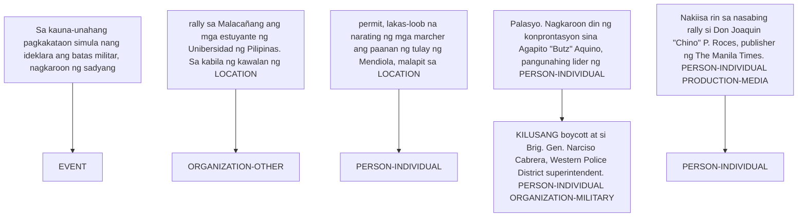
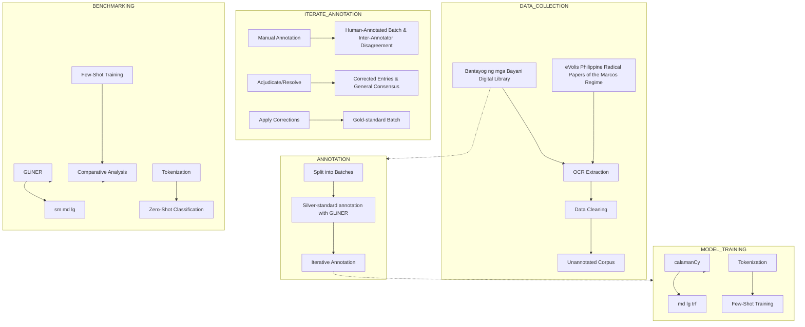

# PHMartialLawNER: A Tagalog Named Entity Recognition Corpus for the Philippine Martial Law Era

Abdiel Clarence Tabuzo, Vladimir Gray Velazco Cassandra Cabral, Moneah Shaila Lacsam and Charmaine Ponay Department of Computer Science University of Santo Tomas

encetabuzo@gmail.com, vladimirvelazco0126@gmail.com

collegiancassie22@gmail.com, moneahlacsam@gmail.com, csponay@ust.edu.ph

PHMartialLawNER

Trained Models

## Abstract

Historical corpora for Tagalog remain limited, particularly texts produced during the Martial Law period under the dictatorship of Ferdinand Marcos Sr. (1972–1986). Much of this material remains undigitized, restricting computational analysis of a significant period in Philippine political history. To support research on historical Tagalog texts, we introduce PHMARTIALLAWNER, a gold-standard named entity recognition corpus constructed from newspapers and underground publications of the Martial Law era. The corpus includes approximately 13k extracted sentence segments (362,000 tokens), consolidated into 8k annotated text spans through a semi-automatic pipeline with manual validation. The reliability of the annotation is measured using Cohen’s κ, reaching 0.86 on all tokens and 0.72 on annotated tokens, with a pairwise F1-score of 0.74. The schema defines historically relevant entity categories including Person (Individual, Collective), Organization (Political, Government, Other), Event (Local, International), Production (Media, Government, Doctrine), as well as Time, Numerical Statistics, Location, and Object entities, specifically identifying weapon artifacts. We establish baseline performance using GLiNER variants, calamanCy models, and transformer-based architectures under zero-shot and few-shot settings. The PH-MARTIALLAWNER corpus will be publicly released to support Tagalog NLP, historical text processing, and digital humanities research.

## 1 Introduction

Despite the growing number of NLP resources for Philippine languages in recent years, most existing datasets have been constructed using modern news and contemporary texts. Efforts such as TLUnified-NER (Miranda, 2023b), HiligayNER (Teves et al., 2025), and CebuaNER (Pilar et al., 2023) have significantly contributed to this progress by providing named entity recognition (NER) datasets for modern language use.

text_image

2 Manotoc
sa Batasan?
AGBamat sa mga namang report ng National
Citizens Movement for Free Election (Namfriel)
sy tomashou su ang tward ay para sa mga kand-
dato ng Oposioyon, lado sa Metro Manila, ni-
ngangamba ang maraming sektor ng sambaya-
rang Pilipino na baka mabaligat ang kalqayang yn
ito.
Ito ang lumittav na posibidad, base sa mga
walai na tinangap ma Tiniu na nampasyag ny
hulalang idinao noong Lunes, Mayo 14, para sa
masingiga mga kagawad ng Batasan Pambana.
Kung mingkajgon, ma Myoika, kung nan
wika ng mga magupmaal
su takbo ng politika, ang
balata ng masingar mangan
ban pan sa hamaa ng "hangstan"
tukj, ng mga pahingaban ng mga alvo-
cate at taga-sporta ng ks
huang hexayant. (Sundan sa p. 2)
IMEL MANOTOC
MMC VEHICLES
PANGHAKOT NG
MGA BOTANTE !
Nasakhatan noong nakamang Lunes ng nimming mga
reporter ng MSA1 at ng MA17 at ang glawanug pequeh
bakatog ng mga boatante su mga prisito su Lamed Quez-
ron. At ang manuta po nitro: Ang mga tukjung yang minuti
et official vehicle ng mga pahingaban ng mga
Tudai da titinto ng Tangdan Sora, long behkaida ng
MMC bilomendo ng mga mandara ng mga
Official su mga paghakot ng mga potente!
- ang nakitiang shalang-shala pas pagshakot ng mga potente.
Aotta no ha Ito? Ato na ang nagangun su mga
ditida ng OFICU si menang ng mga bilangan ng mga bilota na matirana su makbing
gewali. (Lanzan si Gerald B. Baldo)
PROTESTA - Nuptipton-pon si likod ng Makari municipal hall ang mga mamama-
yang taga-Makati at nimming Maetre og mandaling-aw ng fang mena at ulya
sustestas su menang de lauca agalutih kehenges ng mga bilota na matirana su makbing
gewali. (Lanzan si Gerald B. Baldo)
'MGA ALKALDE, INIREKLAMO'
Iberklamo na mengenang,
kanlauh #### #### #### #### #### #### #### #### #### #### #### #### #### #### #### #### #### #### #### #### #### #### #### #### #### #### #### #### #### #### #### #### #### #### #### #### #### #### #### #### #### #### #### #### #### #### #### #### #### #### #### #### #### #### #### #### #### #### #### #### #### #### #### #### #### #### #### #### #### #### #### #### #### #### #### #### #### #### #### #### #### #### #### #### #### #### #### #### #### #### #### #### #### #### #### #### #### #### #### #### ##### #
MGA ALKALDE, INIREKLAMO'
Iberklamo na mengenang,
kanlauh #### #### #### #### #### #### #### #### #### #### #### #### #### #### #### #### #### #### ######## yu mga
mande ng mga pahgingan sy ang mga pahgingan sy ang mga pahgingan sy ang mga pahgingan sy ang mga pahgingan sy ang mga pahgingan sy ang mga pahgingan sy ang mga pahgingan sy ang mga pahgingan sy ang mga pahgingan sy ang mga pahgingan sy ang mga pahgingan sy ang mga pahgingan sy ang mga pahgingan sy ang mga pahgingan sy ang mga pranggupit.
IP INDIVIDENTS VS MARCOS
'LUISA NG BAYAN'
(Basahan sa pulina)
Sa kaisha-nushang
papishakoon gunma
nung kirkhara ang ho
tat militar, nagkaron
ng sudying raily su Ma-
katarang ang mga emed-
yunte ng Unberidade
ng Pilipena. Sa kabla
ng kvalad ga pepti
laken-looh na nasiting
ng mga mander ang pu
anas ug tulayn ng Men
diola, malagit sa Pa-
layo. Nagkaron din
ng koopertayan sora
Agujoito-Busa Agujoito,
punganjing lidar ya
(Sundan sa p. 2)
DEAN GONZALES

Figure 1: Historical Newspaper Page from the Martial Law Era. Example of a raw archival newspaper scan used in the corpus. These historical pages are digitized into machine-readable text before undergoing entity annotation.

However, these datasets, and consequently the models trained on them, are less suitable for historical research because they are built from contemporary corpora that fail to capture linguistic phenomena that appear only in archival materials. These include shifting orthographic conventions, outdated political titles, historical actors whose names rarely appear in modern texts, and domain-specific organizations unique to earlier political periods. As a result, NER models trained on modern corpora usually perform poorly when applied to historical documents.

This limitation is particularly significant for Tagalog materials from the Martial Law era. During this period, press censorship and political repression reshaped the Philippine media landscape, leading to the emergence of alternative and underground publications that documented dissent, resistance movements, and political events. These texts represent an important historical record, but remain difficult to analyze computationally due to the lack of specialized NLP resources.

flowchart

Figure 2: Entity Annotation on Extracted Newspaper Text. Example output from the trained NER model showing how domain-specific entities are identified and labeled within a historical Tagalog newspaper passage.

At the same time, the rapid digitization of archival materials—often described as the “big data of the past” (Kaplan and di Lenardo, 2017)—has created new opportunities for large-scale analysis in digital humanities. However, Tagalog remains underrepresented in these archival NLP efforts, and there is a lack of available NER datasets for historical Tagalog texts.

To address this gap, we present a named entity recognition dataset constructed from digitized Tagalog newspapers and underground publications from the Martial Law period. The dataset enables downstream tasks such as entity-based search, event extraction, and large-scale historical analysis.

## 2 Background

## 2.1 Historical Newspapers and Martial Law

Historical newspapers are widely recognized as rich primary sources for reconstructing sociopolitical events, public sentiment, and cultural shifts (Baumgartner, 1981). In the Philippine context, the Martial Law era (1972–1986) represents a period in which press censorship and state control dramatically shaped the flow of information. During this time, the mainstream media were heavily restricted, prompting the emergence of an alternative press often referred to as the mosquito press, such as Ang Tinig ng Masa (see Figure 1). These publications disseminated dissenting perspectives despite surveillance and repression (Rosario-Braid and Tuazon, 1986).

Underground publications, including We Forum, Malaya, and CPP-aligned outlets such as Ang Bayan, played a crucial role in exposing corruption and human-rights violations (Melencio, 2023; Olea, 2012). Many of these documents have since been digitized through institutional repositories such as the University of Hawai‘i at Manoa’s eVols collec-¯ tion, which preserves newsletters, memos, and underground print materials from the Marcos regime (University of Hawai'i at Manoa Philippine Collec-¯ tion, 2023).

Digitizing such archives is not only essential for preservation, but also enables computational access and large-scale corpus analysis (Oberbichler, 2024). Compared to earlier historical periods—where Tagalog materials are sparse due to colonial suppression (Neumann, 2005; Punzalan, 2006)—the Martial Law era exhibits a greater abundance of Tagalog texts, driven by the resurgence of nationalism and political activism. This makes the period particularly suitable for constructing a historical Tagalog NER dataset.

## 2.2 Named Entity Recognition

NER facilitates the automatic identification of persons, organizations, locations, events, and other semantic categories (Tjong Kim Sang and De Meulder, 2003). It remains a foundational component of information extraction, powering tasks such as archival search, historical knowledge graph construction, and large-scale socio-political analysis (Ehrmann et al., 2023). An example of this process applied to a Tagalog historical news snippet is shown in Figure 2.

Early approaches relied on rules, lexicons, and pattern-matching, but these systems struggled with the noisy, heterogeneous nature of historical texts—especially when OCR distortions and archaic spellings are present (Todorov and Colavizza, 2022). Traditional machine-learning models like Conditional Random Fields improved generalization but still fell short of modern deep-learning approaches, with performance often in the 60–70% F1 range on historical corpora (Ehrmann et al., 2023).

Deep contextual models, such as BiLSTM-CRF architectures (Ma and Hovy, 2016), and later transformer-based approaches such as BERT (Devlin et al., 2019), RoBERTa, and XLM-R (Conneau et al., 2020), achieved state-of-the-art performance through contextualized embeddings. In historical NER, these methods significantly outperform rulebased strategies when trained with appropriate domain data (Ehrmann et al., 2023).

A key challenge for historical NER is temporal drift. Entity distributions, naming conventions, and lexical usage shift across decades (Rijhwani and Preotiuc-Pietro, 2020). Models trained solely on contemporary data suffer on temporally distant corpora, but diversified sampling across time improves performance by more than 10% F1-score in low-resource settings. This reinforces the need for domain-specific training data—such as a Martial Law NER corpus.

Recent NER developments relevant to lowresource and historical corpora include GLiNER and calamanCy, both of which are employed in this study. GLiNER (Zaratiana et al., 2024) is a generalist, label-descriptive NER framework capable of zero-shot and few-shot extraction, making it particularly useful for bootstrapping annotations in domains where gold-standard data are scarce. Its variants, such as GLiNER-lg, have been referenced as strong baseline models for initializing Tagalog annotations1. calamanCy (Miranda, 2023a), on the other hand, is a Tagalog-focused NLP toolkit built on spaCy, providing language-specific tokenization, lexical resources, and transformer pipelines optimized for modern Tagalog texts. Prior work demonstrates that calamanCy performs effectively when paired with high-quality in-domain data. Together, these systems represent complementary approaches to low-resource NER—GLiNER excels in cross-domain generalization through its labeldescriptive architecture, while calamanCy leverages Tagalog-specific priors— both of which prove essential for addressing the linguistic and historical challenges posed by Martial Law era newspaper corpora.

## 3 Methodology

Figure 3 shows the general process for creating the gold-standard dataset.

## 3.1 Data Collection and Preprocessing

Historical newspapers were sourced from the University of Hawai‘i eVols archive2 and the Bantayog ng mga Bayani digital repository3, both of which contain Martial Law era underground and opposition publications. All scanned pages were processed using OCR systems and subsequently subjected to manual verification to reduce noise, segmentation errors, and character distortions typical of historical print materials. Texts containing excessive OCR corruption were removed to ensure that the resulting corpus reflected the linguistic and historical characteristics relevant to this study.

## 3.2 Iterative Annotation

To construct a high-quality NER dataset in a lowresource historical domain, a semi-automatic annotation workflow was done; designed to balance efficiency and accuracy. The workflow began with the application of GLiNER in zero-shot mode, which generated a preliminary silver-standard layer of entity labels. These outputs served as an initial scaffold for the human annotation process. Rather than annotating from scratch, three human annotators reviewed and corrected the auto-generated spans, a strategy known to significantly reduce annotation time and cognitive load in low-resource NER settings.

The annotations were done in Argilla4 and was carried out through an iterative cycle, in which each batch of corrected data informed improvements to both the annotation guidelines and subsequent annotation decisions. After each round, the annotated texts were checked for consistency, and cases of disagreement or ambiguity were documented for discussion. These conflict-resolution sessions allowed refinement of definitions for historically specific entity types—such as political organizations, military units, and event references—which often required contextual judgment unique to the discourse of the Martial Law era. The updated guidelines were then redistributed to the annotators, and the next batch of annotations was completed with clearer, more standardized rules. These conflict-resolution sessions allowed for the refinement of definitions for the specific entity types used in this study, as detailed in Table 1.

To quantitatively monitor annotation reliability across all iterations, we calculated the IAA after each batch using Cohen’s κ for all tokens and pairwise span-level F1 for labeled entities. These metrics allowed for the detection of inconsistencies, adjusted guidelines when necessary, and ensured that annotation quality improved over time. Through repeated cycles of machine-assisted pre-annotation, human correction, guideline refinement, and quality validation, the results gradually converged on actiona stable annotation scheme. The result of this layeaningered, iterative process is a gold-standard corpus of approximately 362,000 tokens from around 13,000 sentences, representing the NER dataset tailored specifically to Tagalog texts from the Martial Law period.

flowchart

Figure 3: Complete System Architecture. Showcases the whole process for creating and benchmarking the gold-standard dataset

## 3.3 Model Training

Supervised and few-shot training procedures were applied for historical Tagalog named entity recognition. The gold-standard corpus was partitioned into training, development, and test sets using stratified sampling (70:10:20) to preserve the distribution of the publication sources.

Two training pipelines were implemented. For calamanCy models, annotations were converted to a spaCy binary format to enforce token–entity span alignment and resolve overlapping spans. Three architectures were trained: calamanCy-md, calamanCy-lg, and transformerbased calamanCy-trf, with GPU-optimized hyperparameter settings.

For GLiNER models, annotations were reformatted into HuggingFace-compatible token classification datasets by mapping IOB tags to base entity labels. Small-, medium-, and large-scale variants were fine-tuned using a unified optimization pipeline with gradient accumulation to approximate larger effective batch sizes. Training and validation losses were tracked to monitor convergence.

Few-shot experiments were conducted by training models on smaller curated subsets of the training data to evaluate sample efficiency under lowresource historical Tagalog conditions. Following the benchmark design of Abadie et al. (2022), final evaluations were performed on the held-out test set using precision, recall, and F1-score.

Multilingual transformer baselines, including XLM-R and RoBERTa-Tagalog, were fine-tuned for comparison but were not evaluated under fewshot settings.

## 4 Experiments

## 4.1 Dataset Quality (IAA)

To evaluate the consistency and reliability of the gold-standard dataset, inter-annotator agreement (IAA) was calculated across multiple annotation batches as reflected in Table 2. Annotator consistency is critical in low-resource corpus development, particularly when dealing with historically complex and domain-specific text. Despite the iterative annotation approach, earlier batches (batches 1 to 3) achieved higher IAA while later batches (batches 4 to 5) showed a gradual decline in agreement. The decrease could potentially be a consequence of annotating progressively larger volumes of data (1200 in the 1st batch to 2000 in the 5th batch). Annotators also increasingly encountered edge cases, rare historical terms, and more complex entity structures that are harder to classify consistently. In the final iteration, the corpus achieved a Cohen’s κ of 0.86 on all tokens, 0.72 on annotated tokens, and a span-level pairwise F1 of 0.74, all of which remain within acceptable thresholds for high-quality annotation (Artstein, 2017)–especially for the more fine-grained NER task.

<table><tr><td>Entity</td><td>Description</td><td>Examples</td></tr><tr><td>PERSON-INDIVIDUAL</td><td>Individual persons, whether deceased or living, real or fictitious, including political figures and activists.</td><td>Ferdinand Marcos, Ninoy, &#x27;Raul Segovia, sekretaryo-heneral&#x27;</td></tr><tr><td>PERSON-COLLECTIVE</td><td>Named references to groups of people that are not organizations.</td><td>Mga Aquino, Katoliko, Pilipino</td></tr><tr><td>ORGANIZATION-POLITICAL</td><td>Political parties, movements, or activist groups at national or international level.</td><td>Kilusang Bagong Lipunan, Kabataang Makabayan, LP</td></tr><tr><td>ORGANIZATION-GOVERNMENT</td><td>Government institutions, branches, departments, or geopolitical actors.</td><td>Comelec, Estados Unidos, Department of National Defense</td></tr><tr><td>ORGANIZATION-MILITARY</td><td>Formal armed forces, military units, or alliances.</td><td>AFP, NPA, 42nd Infantry Battalion, PC-INP</td></tr><tr><td>ORGANIZATION-OTHER</td><td>Organizations not covered by other categories.</td><td>Unibersidad ng Pilipinas, CBCP, University of Santo Tomas</td></tr><tr><td>LOCATION</td><td>Geographic entities including administrative regions, buildings, and natural formations.</td><td>Ilog Pasig, Plaza Miranda, Camp Crame, timog Korea</td></tr><tr><td>TIME</td><td>Temporal expressions including dates, years, and time ranges.</td><td>Setyembre 21, 1972, Martes, Nobyembre 2</td></tr><tr><td>PRODUCTION-MEDIA</td><td>Media works, publications, broadcasts, and related artifacts.</td><td>Ang Bayan, Radio Veritas, WE Forum, Tinig ng Masa</td></tr><tr><td>PRODUCTION-GOVERNMENT</td><td>Official documents, decrees, and state-issued materials.</td><td>Presidential Decree No. 1081, Batas Pambansa Blg. 880</td></tr><tr><td>PRODUCTION-DOCTRINE</td><td>Political, philosophical, or religious belief systems.</td><td>Marxism-Leninism-Maoism, Demokratiko, Kapitalismo</td></tr><tr><td>NUMERICAL STATISTICS</td><td>Quantities, monetary values, percentages, and measurements.</td><td>500 pesos, 80 porsiyento, sampung kilong bigas</td></tr><tr><td>OBJECT-WEAPON</td><td>Physical combat-related artifacts including specific weapon models.</td><td>M-16, Bolo, Tear-gas, bala, baril</td></tr><tr><td>EVENT</td><td>Historical events, incidents, or recognized social occurrences.</td><td>Araw ng Manggagawa, eleksyon, Lakbayan, kudeta, Olympics</td></tr></table>

Table 1: Detailed entity annotation taxonomy.

<table><tr><td>Batch</td><td>Size</td><td>F1-Score</td><td> $\kappa$ (all tokens)</td><td> $\kappa$ (annotated only)</td></tr><tr><td>1</td><td>1200</td><td>74.13</td><td>87.05</td><td>74.09</td></tr><tr><td>2</td><td>1500</td><td>74.43</td><td>87.04</td><td>73.88</td></tr><tr><td>3</td><td>1500</td><td>74.03</td><td>86.96</td><td>73.89</td></tr><tr><td>4</td><td>1800</td><td>73.86</td><td>84.36</td><td>69.98</td></tr><tr><td>5</td><td>2000</td><td>71.61</td><td>82.17</td><td>66.72</td></tr></table>

Table 2: IAA training scores across annotation batches.

Later batches exhibited unusually low agreement, signaling persistent inconsistencies that could not be resolved through guideline revision alone. Trial trainings from the initial gold-standard dataset resulted in poor model performance on several entities–e.g., Event-Local, Event-International, and Object–due to inherent issues of underrepresentation and fine-grained entity boundaries. In response, we revised the entity list in consultation with a domain expert, combining Event into a single label and restricting Object to only include weapons. This adjustment stabilized IAA in the final annotation rounds and ensured coherent and reliable labeling across all entity types.

## 4.2 Final Model Performance

To establish a performance ceiling for the constructed dataset, we trained calamanCy-trf alongside other multilingual and monolingual BERT models on the full corpus. As demonstrated in Table 3, these models exhibited the best performance across Precision, Recall, and F1-Score metrics, underscoring the overall strength of these architectures when trained in higher-resource settings.

## 4.3 Few-shot Model Performance

To evaluate model adaptability in low-resource scenarios, we trained multiple NER models using standardized train–validation–test splits and evaluated them using strict span-level F1-scores, covering both full-data fine-tuning and few-shot training experiments. Since full-data performance often fails to reflect real-world constraints where annotations are scarce, evaluating under few-shot conditions was particularly relevant for historical Tagalog.

<table><tr><td>Model</td><td>Precision</td><td>Recall</td><td>F1-Score</td></tr><tr><td>GLiNER_small</td><td>77.84</td><td>72.16</td><td>74.89</td></tr><tr><td>GLiNER_medium</td><td>80.96</td><td>76.33</td><td>78.58</td></tr><tr><td>GLiNER_large</td><td>78.63</td><td>78.38</td><td>78.50</td></tr><tr><td>calamanCy_md</td><td>80.99</td><td>80.47</td><td>80.73</td></tr><tr><td>calamanCy_lg</td><td>78.95</td><td>80.20</td><td>79.57</td></tr><tr><td>calamanCy_trf</td><td>83.65</td><td>84.31</td><td>83.98</td></tr><tr><td>RoBERTa-tagalog (monolingual)</td><td>84.67</td><td>83.25</td><td>83.96</td></tr><tr><td>XLM-RoBERTa(multilingual)</td><td>84.11</td><td>83.82</td><td>83.97</td></tr></table>

Table 3: Final Model Performance. Trained models benchmarked on the final corpus.

As illustrated in Figure 4, despite uneven Inter-Annotator Agreement (IAA) in the later portions of the dataset, several models demonstrated robust adaptability. The Tagalog-specific calamanCy-trf and the larger GLiNER variants produced the highest F1-scores in both full-data and few-shot scenarios, highlighting their capacity to generalize to historical language patterns.

line

| Few-shot Count | GLINER_small | GLINER_medium | GLINER_large | calamancy_md | calamancy_lg | calamancy_trf |
| --- | --- | --- | --- | --- | --- | --- |
| ~100 | ~0.58 | ~0.65 | ~0.66 | ~0.50 | ~0.44 | ~0.50 |
| ~300 | ~0.60 | ~0.71 | ~0.71 | ~0.63 | ~0.63 | ~0.71 |
| ~700 | ~0.63 | ~0.71 | ~0.71 | ~0.69 | ~0.69 | ~0.75 |
| ~1400 | ~0.65 | ~0.72 | ~0.72 | ~0.72 | ~0.72 | ~0.78 |
| ~2800 | ~0.73 | ~0.77 | ~0.77 | ~0.77 | ~0.77 | ~0.81 |
| ~5600 | ~0.77 | ~0.78 | ~0.78 | ~0.80 | ~0.80 | ~0.83 |

Figure 4: Few-shot Model Performance. F1-scores of GLiNER and calamanCy models across increasing training set sizes.

Notably, GLiNER exhibited impressive resilience under few-shot training due to its label-descriptive architecture, which allows it to learn entity behavior even from limited data. Together, these results suggest that while high-quality annotated data remains essential for peak performance, both calamanCy and GLiNER can leverage small, wellannotated subsets effectively, even when portions of the corpus exhibit weaker IAA. Complete quantitative results are presented in Table 4.

## 4.4 Fine-grained Entity Performance

To further examine model behavior across entity categories, we also conducted a per-entity analysis using the best-performing model, calamanCy-trf, as reported in Table 5. The results reveal distinct learning patterns across entity types at increasing levels of data availability. Entities such as Person-Individual, Time, and Organization-Military demonstrated high sample efficiency— Organization-Military in particular saw substantial gains, jumping from 41.80% to 91.91% F1 as the model learned to recognize specific acronyms and unit designations prevalent in the corpus, indicating that calamanCy’s transformer variant effectively captures structural patterns even with limited data.

Conversely, context-dependent and underrepresented entities exhibited high volatility in low-resource settings. Production-Media and Organization-Other began with negligible scores (7.66% and 19.14%, respectively) but surged to over 70% F1 by the final split, suggesting that data scarcity was the primary bottleneck for these classes. Notably, the Event and Object-Weapon categories plateaued or slightly regressed at the largest dataset size (peaking at the 2,801-sample mark), implying that increased data volume may have introduced greater label ambiguity or noise for these specific categories.

## 5 Analysis

## 5.1 Qualitative Challenges and Entity Ambiguity

Qualitative analysis highlighted that annotators struggled primarily with boundary consistency for context-dependent entities.

<table><tr><td>Span</td><td>Start</td><td>End</td><td>Annotator 1</td><td>Annotator 2</td></tr><tr><td>P5.00 por metro kwadrado</td><td>39</td><td>63</td><td>-</td><td>Numerical Statistics</td></tr><tr><td>P5.00</td><td>39</td><td>44</td><td>Numerical Statistics</td><td>-</td></tr></table>

Figure 5: Span-level disagreement for a numerical statistic. Accepted span highlighted in green; other annotator’s span shown in yellow.

• Numerical Statistics: Conflicts arose because the annotators failed to include some descriptive phrases (e.g., anim na anak ‘six children’) as statistical data, exposing ambiguity in the initial guidelines. Annotators also disagreed on whether to include preceding units (e.g., “P5.00 por metro kwadrado” versus $^ { 6 6 } \mathrm { P } 5 . 0 0 ^ { \circ }$ as seen in Figure 5).

<table><tr><td>Model</td><td>F1 @ 0-shot</td><td>F1 @ 88</td><td>F1 @ 175</td><td>F1 @ 350</td><td>F1 @ 700</td><td>F1 @ 1400</td><td>F1 @ 2801</td><td>F1 @ 5602</td></tr><tr><td>GLiNER_small</td><td>42.07</td><td> $57.76 \pm 0.63$ </td><td> $56.48 \pm 0.48$ </td><td> $59.29 \pm 0.16$ </td><td> $63.50 \pm 0.33$ </td><td> $65.50 \pm 2.78$ </td><td> $72.92 \pm 0.58$ </td><td> $76.55 \pm 0.78$ </td></tr><tr><td>GLiNER_medium</td><td>44.08</td><td> $62.24 \pm 0.06$ </td><td> $61.23 \pm 0.11$ </td><td> $62.21 \pm 0.53$ </td><td> $62.15 \pm 0.52$ </td><td> $68.08 \pm 1.37$ </td><td> $74.60 \pm 1.56$ </td><td> $77.82 \pm 1.47$ </td></tr><tr><td>GLiNER_large</td><td>46.61</td><td> $65.35 \pm 0.32$ </td><td> $66.72 \pm 0.47$ </td><td> $70.46 \pm 0.99$ </td><td> $70.79 \pm 0.85$ </td><td> $72.43 \pm 0.10$ </td><td> $76.38 \pm 0.63$ </td><td> $78.47 \pm 0.05$ </td></tr><tr><td>calamanCy_md</td><td>—</td><td> $50.16 \pm 1.10$ </td><td> $58.27 \pm 0.58$ </td><td> $63.77 \pm 0.24$ </td><td> $69.94 \pm 0.29$ </td><td> $72.71 \pm 0.39$ </td><td> $77.34 \pm 0.40$ </td><td> $80.28 \pm 0.53$ </td></tr><tr><td>calamanCy_lg</td><td>—</td><td> $44.32 \pm 1.18$ </td><td> $53.39 \pm 1.10$ </td><td> $61.14 \pm 1.20$ </td><td> $67.50 \pm 0.38$ </td><td> $71.72 \pm 0.29$ </td><td> $76.35 \pm 0.11$ </td><td> $79.86 \pm 0.18$ </td></tr><tr><td>calamanCy_trf</td><td>—</td><td> $50.72 \pm 0.89$ </td><td> $61.99 \pm 0.56$ </td><td> $70.40 \pm 0.91$ </td><td> $74.36 \pm 0.27$ </td><td> $77.74 \pm 0.44$ </td><td> $81.64 \pm 0.19$ </td><td> $83.04 \pm 0.12$ </td></tr></table>

Table 4: Few-shot training results.

<table><tr><td>Entity</td><td>F1 @ 88</td><td>F1 @ 175</td><td>F1 @ 350</td><td>F1 @ 700</td><td>F1 @ 1400</td><td>F1 @ 2801</td><td>F1 @ 5602</td></tr><tr><td>Person-Individual</td><td>81.95</td><td>86.75</td><td>91.02</td><td>90.73</td><td>92.48</td><td>92.12</td><td>93.57</td></tr><tr><td>Person-Collective</td><td>64.98</td><td>69.58</td><td>73.72</td><td>74.76</td><td>80.88</td><td>78.99</td><td>82.24</td></tr><tr><td>Organization-Political</td><td>27.71</td><td>58.85</td><td>62.53</td><td>73.20</td><td>71.56</td><td>79.58</td><td>81.36</td></tr><tr><td>Organization-Government</td><td>41.33</td><td>48.73</td><td>56.68</td><td>60.98</td><td>68.45</td><td>70.01</td><td>73.51</td></tr><tr><td>Organization-Military</td><td>41.80</td><td>50.43</td><td>72.48</td><td>78.15</td><td>89.23</td><td>89.57</td><td>91.91</td></tr><tr><td>Organization-Other</td><td>19.14</td><td>32.51</td><td>52.05</td><td>56.78</td><td>59.96</td><td>69.57</td><td>73.70</td></tr><tr><td>Location</td><td>49.45</td><td>72.05</td><td>77.37</td><td>80.69</td><td>79.60</td><td>84.34</td><td>85.21</td></tr><tr><td>Time</td><td>61.35</td><td>79.20</td><td>83.13</td><td>87.76</td><td>90.83</td><td>92.29</td><td>92.48</td></tr><tr><td>Production-Media</td><td>7.66</td><td>12.88</td><td>35.81</td><td>52.10</td><td>62.77</td><td>72.55</td><td>76.83</td></tr><tr><td>Production-Doctrine</td><td>55.88</td><td>64.77</td><td>78.29</td><td>79.46</td><td>83.18</td><td>81.18</td><td>84.08</td></tr><tr><td>Numerical Statistics</td><td>36.15</td><td>51.34</td><td>59.18</td><td>59.87</td><td>66.88</td><td>72.39</td><td>74.52</td></tr><tr><td>Object-Weapon</td><td>13.43</td><td>30.88</td><td>34.59</td><td>50.33</td><td>71.29</td><td>81.11</td><td>74.68</td></tr><tr><td>Event</td><td>23.74</td><td>29.72</td><td>49.13</td><td>59.71</td><td>58.44</td><td>66.53</td><td>64.66</td></tr><tr><td>Overall F1</td><td>49.84</td><td>62.63</td><td>71.02</td><td>74.65</td><td>78.23</td><td>81.44</td><td>83.09</td></tr></table>

Table 5: calamanCy\_trf Few-Shot Evaluation per entity

• Metonymy: A major source of confusion was the semantic overlap between Organization-Government and Location entities, where terms like "Malacañang" or "US" could refer to either the government institution or the physical place. Similarly, event terms like "Batas Militar" (Martial Law) were sometimes misclassified as political organizations.

These challenges motivated the refinement of entity definitions in the final corpus configuration.

## 5.2 Impact of Training Data and Model Choice

Assessing the robustness of our core contributions, we conducted a Two-Way ANOVA. The analysis confirmed that the size of the training subset, the type of model, and their interaction exerted an extremely strong and statistically significant influence on the prediction’s F1-scores (all p < .001) as seen in Table 6. However, post-hoc pairwise comparisons for the Model factor showed that no individ ual model pairs differed significantly for multiple comparisons (with α = 0.05). This indicated that the overall model effect found on the omnibus test was spread across architectures rather than driven by a single dominant model. The large F-values observed for subset size and for the interaction term further show that both the amount of training data and the way different models respond to increasing data volume are critical determinants of NER performance.

Post-hoc comparisons for training subset size in revealed that performance gains, while generally increasing with more data, became less significant and converged nearing 1,400 and 2,801 samples, where several adjacent subset comparisons were no longer statistically significant, e.g. 2801-5602 subset sizes with $\mathrm { p } = 0 . 5 2 7 8$ and 700-1400 subset sizes with $\mathsf { p } = 0 . 3 1 5 2 )$ . This range is therefore recommended as a minimum effective training size for reliable generalization on the historical NER dataset, although training on the full dataset would still remain preferable for achieving peak performance.

The significant interaction effect shows that the models improved at different rates. GLiNER models performed better with limited training data (all p < .001), while Tagalog-specific transformer models, particularly calamanCy-trf, achieved higher peak F1-scores as training size increased (only model with all $\mathsf { p } < . 0 0 1 \ r ,$ ). This highlights the importance of evaluating NER models across varying training data sizes to better understand how performance changes as more data becomes available.

<table><tr><td>Source</td><td>Df</td><td>Sum Sq</td><td>Mean Sq</td><td>F-value</td><td>p-value</td><td>Sig.</td></tr><tr><td>Model</td><td>5</td><td>979</td><td>195.7</td><td>296.01</td><td> $< 2 \times 10^{-16}$ </td><td>***</td></tr><tr><td>Subset Size</td><td>6</td><td>8285</td><td>1380.8</td><td>2088.39</td><td> $< 2 \times 10^{-16}$ </td><td>***</td></tr><tr><td>Model × Subset</td><td>30</td><td>1455</td><td>48.5</td><td>73.38</td><td> $< 2 \times 10^{-16}$ </td><td>***</td></tr><tr><td>Residuals</td><td>84</td><td>56</td><td>0.7</td><td>-</td><td>-</td><td>-</td></tr></table>

Table 6: Two-way ANOVA results evaluating the effects of model architecture, training subset size, and their interaction on F1-score.

## 6 Conclusion

The Martial Law era represents one of the most politically significant, yet computationally neglected periods in Philippine history. Through iterative annotation, guideline refinement, and quality validation, we present PHMARTIALLAWNER as a step toward making this period more accessible. Our experiments have shown that the task is learnable even under low-resource conditions, and that model architecture and training data volume are both critical factors in driving NER performance for historically variable text.

While calamanCy-trf emerged as the strongest performer, our per-entity analysis highlights that fine-grained and underrepresented entity types remain a persistent challenge—one that corpus expansion and improved annotation strategies may help address in future work. We hope PHMAR-TIALLAWNER serves not only as a benchmark resource for Tagalog NLP, but also as a foundation for broader digital humanities research into Philippine archival texts.

## 7 Acknowledgments

The authors are grateful to Lester James V. Miranda for technical guidance and mentorship in the implementation of this study, and for his prior work that informed this research. We acknowledge Gian Paolo R. Mayo from the Department of History for providing historical guidance and helping connect this work with the humanities. We recognize the members of the Human Rights Violations Victims Memorial Commission (HRVVMC) who assisted in the annotation and validation of the dataset used in this study. We further acknowledge the Bantayog ng mga Bayani Foundation and the University of Hawai‘i at Manoa Philippine Collection for pre-¯ serving and providing access to archival materials that served as primary sources for the corpus used in this study. Finally, we appreciate the panelists and other faculty members from the Department of Computer Science for their feedback and contributions.

## References

N. Abadie, E. Carlinet, J. Chazalon, and B. Duménieu. 2022. A Benchmark of Named Entity Recognition Approaches in Historical Documents Application to 19th Century French Directories. In Document Analysis Systems. DAS 2022., number 13237 in Document Analysis Systems. DAS 2022., La Rochelle, France. Springer, Cham.  
Ron Artstein. 2017. Inter-annotator Agreement, pages 297–313. Springer Netherlands, Dordrecht.  
Joseph Baumgartner. 1981. Newspapers as historical sources. Philippine Quarterly ofCulture and Society, 9(3):256–258.  
Alexis Conneau, Kartikay Khandelwal, Naman Goyal, Vishrav Chaudhary, Guillaume Wenzek, Francisco Guzmán, Edouard Grave, Myle Ott, Luke Zettlemoyer, and Veselin Stoyanov. 2020. Unsupervised cross-lingual representation learning at scale. In Proceedings of the 58th Annual Meeting of the Associationfor Computational Linguistics, pages 8440– 8451, Online. Association for Computational Linguistics.  
Jacob Devlin, Ming-Wei Chang, Kenton Lee, and Kristina Toutanova. 2019. BERT: Pre-training of deep bidirectional transformers for language understanding. In Proceedings ofthe 2019 Conference of the North American Chapter ofthe Associationfor Computational Linguistics: Human Language Technologies, Volume 1 (Long and Short Papers), pages 4171–4186, Minneapolis, Minnesota. Association for Computational Linguistics.  
Maud Ehrmann, Ahmed Hamdi, Elvys Linhares Pontes, Matteo Romanello, and Antoine Doucet. 2023. Named entity recognition and classification in historical documents: A survey. ACM Computing Surveys, 56(2):1–47.  
Frédéric Kaplan and Isabella di Lenardo. 2017. Big data of the past. Frontiers in Digital Humanities, Volume 4 - 2017.  
Xuezhe Ma and Eduard Hovy. 2016. End-to-end sequence labeling via bi-directional lstm-cnns-crf. Preprint, arXiv:1603.01354.  
Gloria E. Melencio. 2023. The fall and rise of the marcoses: From mosquito press to troll farms. UP Los Baños Journal.  
Lester James V. Miranda. 2023a. calamanCy: A Tagalog natural language processing toolkit. In Proceedings of the 3rd Workshop for Natural Language Processing Open Source Software (NLP-OSS 2023), pages 1–7, Singapore. Association for Computational Linguistics.  
Lester James V. Miranda. 2023b. Developing a named entity recognition dataset for Tagalog. In Proceed ings ofthe First Workshop in South East Asian Language Processing, pages 13–20, Nusa Dua, Bali, Indonesia. Association for Computational Linguistics.  
A. Lin Neumann. 2005. The philippines: Amid troubles, a rich press tradition. Committee to Protect Journalists.  
Sarah Oberbichler. 2024. Large-scale research with historical newspapers: A turning point through generative ai. DH Lab, Leibniz Institute of European History (IEG).  
Ronalyn V. Olea. 2012. Underground press during martial law: Piercing the veil of darkness imposed by the dictatorship. Bulatlat.  
Ma. Beatrice Emanuela Pilar, Dane Dedoroy, Ellyza Mari Papas, Mary Loise Buenaventura, Myron Darrel Montefalcon, Jay Rhald Padilla, Joseph Marvin Imperial, Mideth Abisado, and Lany Maceda. 2023. CebuaNER: A new baseline Cebuano named entity recognition model. In Proceedings of the 37th Pacific Asia Conference on Language, Information and Computation, pages 792–800, Hong Kong, China. Association for Computational Linguistics.  
Ricardo L. Punzalan. 2006. Archives of the new possession: Spanish colonial records and the american creation of a ‘national’ archives for the philippines. Archival Science, 6(3):381–392.  
Shruti Rijhwani and Daniel Preotiuc-Pietro. 2020. Temporally-informed analysis of named entity recognition. In Proceedings ofthe 58th Annual Meeting of the Associationfor Computational Linguistics, pages 7605–7617, Online. Association for Computational Linguistics.  
Florangel Rosario-Braid and Ramon R. Tuazon. 1986. Communication media in the philippines: 1521– 1986. Philippine Social Science Council.  
James Ald Teves, Ray Daniel Cal, Josh Magdiel Vil laluz, Jean Malolos, Mico Magtira, Ramon Rodriguez, Mideth Abisado, and Joseph Marvin Imperial. 2025. Hiligayner: A baseline named entity recognition model for hiligaynon. Preprint, arXiv:2510.10776.  
Erik F. Tjong Kim Sang and Fien De Meulder. 2003. Introduction to the CoNLL-2003 shared task: Language-independent named entity recognition. In Proceedings of the Seventh Conference on Natural Language Learning at HLT-NAACL 2003, pages 142– 147.  
Konstantin Todorov and Giovanni Colavizza. 2022. An assessment of the impact of ocr noise on language models. Preprint, arXiv:2202.00470.  
University of Hawai'i at Manoa Philippine Collection.¯ 2023. Papers of the underground movement during the marcos regime (philippine radical papers of the marcos regime). Philippine Studies Digital Collection.  
Urchade Zaratiana, Nadi Tomeh, Pierre Holat, and Thierry Charnois. 2024. GLiNER: Generalist model for named entity recognition using bidirectional transformer. In Proceedings of the 2024 Conference of the North American Chapter ofthe Associationfor Computational Linguistics: Human Language Technologies (Volume 1: Long Papers), pages 5364–5376, Mexico City, Mexico. Association for Computational Linguistics.

## A Appendix

## A.1 Corpus Breakdown and Linguistic Profile

The PHMartialLawNER corpus presents a linguistic profile, heavily shaped by the socio-political realities and media censorship of the Philippine Martial Law era. Unlike contemporary datasets that often rely on standard modern news, this corpus is built from underground "mosquito press" publications, which inherently feature a highly mil itarized and politically charged vocabulary.

flowchart

This image displays a collection of word cloud diagrams representing the relationships and semantic relationships between various entities, such as 'Entity: Organization' (e.g., 'Entity: Organization-Government'), 'Entity: Organization-Military', and 'Entity: Production-Direction'.

Figure 6: Top Unigrams per entity Top unigrams extracted from the corpus, highlighting the core sociopolitical vocabulary of the Martial Law era, dominated by terms related to key figures, the military, and the resistance (e.g., "Marcos," "militar," "manggagawa" (workers)

An exploratory data analysis of the corpus using Word Clouds (showing the top unigram and trigram of each entity, as seen in Figures 6, 7) vividly illustrates this unique linguistic landscape. The top unigrams and trigrams highlight the dominance of militant and resistance-focused terminologies.

In particular, refer to Figure 6 vocabulary for the Object entity is overwhelmingly saturated with high-frequency terms such as "bala" (bullet) and "baril" (gun). The prominence of these specific combat-related artifacts perfectly illustrates the militarized nature of the texts and the era’s focus on armed resistance and state-sponsored military.

flowchart

Figure 7: Top Trigrams per entity Top trigrams extracted from the corpus, revealing the prominence of specific political organizations, government initiatives, and resistance groups central to the underground press discourse (e.g., "bagong hukbong bayan," (New People’s Army) "kilusang bagong lipunan" (New Society Movement)

bar

| Year | Source::Bantayog ng mga Bayani | Source::eVolis |
| --- | --- | --- |
| 1987 | — | 114 |
| 1986 | — | 311 |
| 1985 | — | 644 |
| 1984 | 2988 | — |
| 1983 | — | 460 |
| 1982 | 58 | — |
| 1981 | — | 133 |
| 1980 | — | 314 |
| 1978 | — | 1429 |
| 1977 | — | 87 |
| 1976 | — | 214 |
| 1974 | — | 371 |
| 1973 | — | 615 |
| 1972 | 150 | 40 |

Figure 8: Year Distribution of Published Newspapers The digitized newspapers compiled for this corpus were published between 1972 and 1987, a timeframe that encompasses the height of the Martial Law period while intentionally extending into the immediate post-regime aftermath to capture the transitional socio-political discourse.

## A.2 Annotation Difficulties and Schema Refinement

Developing a gold-standard dataset from historical texts exposed several challenges that guided the final schema decisions.

line

| Batch Number | F1 Score | Cohen's Kappa (all tokens) | Cohen's Kappa (annotated only) |
| --- | --- | --- | --- |
| 1 | ~0.74 | ~0.87 | ~0.74 |
| 2 | ~0.75 | ~0.87 | ~0.74 |
| 3 | ~0.74 | ~0.87 | ~0.74 |
| 4 | ~0.74 | ~0.84 | ~0.70 |
| 5 | ~0.72 | ~0.82 | ~0.67 |

Figure 9: IAA metrics trend Tracks the mean Cohen’s Kappa (all-tokens and annotated only) and F1-scores across the five annotation batches, illustrating a slight decline in agreement as sample volume increased

## A.2.1 Declining IAA Trends

As shown in 9, agreement metrics began strong but declined between Batches 3 and 5. This downward trend correlates with the increasing volume of annotated samples, which exposed annotators to more complex edge cases and historical ambiguities.

heatmap

| True Label | Event-International | Event-Local | Location | Numerical Statistics | Object | Organization-Government | Organization-Military | Organization-Other | Organization-Political | Person-Collective | Person-Individual | Production-Doctrine | Production-Government | Production-Media | Time | NONE |
| --- | --- | --- | --- | --- | --- | --- | --- | --- | --- | --- | --- | --- | --- | --- | --- | --- |
| Event-International | 0.77 | 0.05 | 0.02 | 0.01 | 0.00 | 0.00 | 0.00 | 0.00 | 0.01 | 0.00 | 0.01 | 0.00 | 0.00 | 0.00 | 0.00 | 0.14 |
| Event-Local | 0.03 | 0.39 | 0.02 | 0.00 | 0.00 | 0.02 | 0.00 | 0.02 | 0.02 | 0.02 | 0.01 | 0.00 | 0.00 | 0.01 | 0.01 | 0.44 |
| Location | 0.00 | 0.00 | 0.88 | 0.00 | 0.00 | 0.02 | 0.00 | 0.01 | 0.00 | 0.00 | 0.00 | 0.00 | 0.00 | 0.00 | 0.00 | 0.02 |
| Numerical Statistics | 0.00 | 0.00 | 0.00 | 0.65 | 0.01 | 0.00 | 0.00 | 0.00 | 0.00 | 0.00 | 0.00 | 0.00 | 0.00 | 0.00 | 0.33 | — |
| Object | 0.00 | 0.01 | 0.18 | 0.52 | 0.44 | 0.44 | 0.44 | 0.44 | 0.44 | 0.44 | 0.44 | 0.44 | 0.44 | 0.44 | 0.37 | — |
| Organization-Government | 0.18 | 1.32 | 1.32 | 1.32 | 1.32 | 1.32 | 1.32 | 1.32 | 1.32 | 1.32 | 1.32 | 1.32 | 1.32 | 1.32 | 1.32 | — |
| Organization-Military | 1.32 | 1.32 | 1.32 | 1.32 | 1.32 | 1.32 | 1.32 | 1.32 | 1.32 | 1.32 | 1.32 | 1.32 | 1.32 | 1.32 | — | — |
| Organization-Other | — | — | — | — | — | — | — | — | — | — | — | — | — | — | — | — |
| Organization-Political | — | — | — | — | — | — | — | — | — | — | — | — | — | — | — | — |
| Person-Collective | — | — | — | — | — | — | — | — | — | — | — | — | — | — | — | — |
| Person-Individual | — | — | — | — | — | — | — | — | — | — | — | — | — | — | — | — |
| Production-Dochtrine | — | — | — | — | — | — | — | — | — | — | — | — | — | — | — | — |
| Production-Government | — | — | — | — | — | — | — | — | — | — | — | — | — | — | — | — |
| Production-Media | — | — | — | — | — | — | — | — | — | — | — | — | — | — | — | — |

Figure 10: Confusion Matrix of IAA per entity A confusion matrix highlighting annotator agreement and semantic overlaps, notably showing the frequent misclassification between government organizations and locations due to metonymy

## A.2.2 Semantic Overlap via Metonymy

The Confusion Matrix of Entities (Refer to Figure 10) highlights pervasive boundary ambiguity. Specifically, 32% of Organization-Government mentions were misclassified as Location. This stems from the metonymic use of place names (e.g., "Malacañang" or "Estados Unidos" (United States) to represent political institutions.

## A.3 Dataset Availability

The PHMARTIALLAWNER corpus is publicly released to facilitate further research in Tagalog Natural Language Processing and the digital humanities. It is hosted on Hugging Face: https://huggingface.co/datasets/etdvprg/ PHMartialLaw-NER\_final