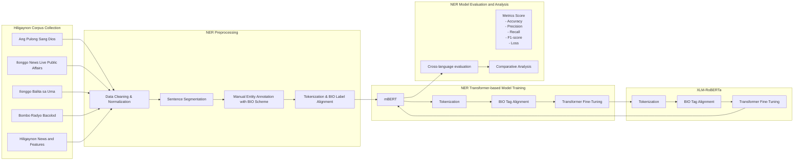
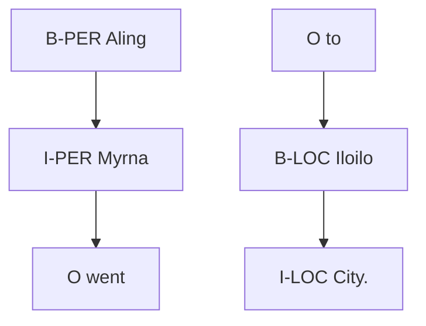

# HILIGAYNER: A Baseline Named Entity Recognition Model for Hiligaynon

James Ald Teves1, Ray Daniel Cal1, Josh Magdiel Villaluz1, Jean Malolos2, Mico Magtira2, Ramon Rodriguez2, Mideth Abisado2 and Joseph Marvin Imperial2

1Silliman University

2National University Philippines

jamesyteves@su.edu.ph, jrimperial@national-u.edu.ph

## Abstract

The language of Hiligaynon, spoken predominantly by the people of Panay Island, Negros Occidental, and Soccsksargen in the Philippines, remains underrepresented in language processing research due to the absence of annotated corpora and baseline models. This study introduces HILIGAYNER, the first publicly available baseline model for the task of Named Entity Recognition (NER) in Hiligaynon. The dataset used to build HILIGAYNER contains over 8,000 annotated sentences collected from publicly available news articles, social media posts, and literary texts. Two Transformerbased models, mBERT and XLM-RoBERTa, were fine-tuned on this collected corpus to build versions of HILIGAYNER. Evaluation results show strong performance, with both models achieving over 80% in precision, recall, and F1-score across entity types. Furthermore, cross-lingual evaluation with Cebuano and Tagalog demonstrates promising transferability, suggesting the broader applicability of HILIGAYNER for multilingual NLP in lowresource settings. This work aims to contribute to language technology development for underrepresented Philippine languages, specifically for Hiligaynon, and support future research in regional language processing.1

## 1 Introduction

The coverage and representation of diverse regional languages play a key role in the widespread adoption of any AI-based technology across the globe. While English remains the most highly researched and high-resourced language, initiatives from the research community, such as the SEACrowd (Cahyawijaya et al., 2025; Lovenia et al., 2024) for Southeast Asian languages, Masakhane (Adelani et al., 2023, 2021) for African languages, and Aya Project (Üstün et al., 2024; Singh et al., 2024)

for global participation, have effectively made its impact to close the AI language gap (Bassignana et al., 2025; Pava et al., 2025).

A recent survey of digital support levels of languages showed that regional Philippine languages are among the lowest representations worldwide (Simons et al., 2022). One particular language is Hiligaynon2, which is an Austronesian regional language spoken by over 10 million people in Western Visayas, particularly Panay Island, Negros Occidental, and Soccsksargen (McFarland, 2008; Robles, 2012). To initiate a step towards progress in Hiligaynon representation, researchers are encouraged to build resources and corpora for fundamental natural language processing tasks. One of these fundamental tasks is Named Entity Recognition (NER) or the task of automatic identification of textual mentions of persons, organizations, locations, and related categories (Nadeau and Sekine, 2007; Tjong Kim Sang and De Meulder, 2003a; Yadav and Bethard, 2018).

In this work, we present HILIGAYNER, the first publicly available NER corpus and finetuned models for Hiligaynon. Specifically, our contributions towards democratizing language resources for Hiligaynon are as follows:

1. A compilation of cleaned sentence-level Hiligaynon dataset of over 8,000 entries from online publicly accessible news articles, social media posts, and translated texts.  
2. A compilation of span-level BIO-encoded annotations of the Hiligaynon dataset for the named entity recognition task (NER), specifically covering four entity categories (PER, ORG, LOC).  
3. Two finetuned multilingual Transformerbased models, mBERT and XLM-RoBERTa,

for token-level sequence labeling of Hiligaynon texts.

By releasing the dataset, model checkpoints, and evaluation scripts under an open license, we aim to supply the foundational tools required for broader NLP development in Western Visayas and the wider Philippine research community.

## 2 Related Works

Robust NER systems enable downstream applications such as knowledge-graph construction, information retrieval, and domain-specific analytics (Zhou et al., 2019). State-of-the-art performance is now achieved by combining lexiconbased gazetteers (Rijhwani et al., 2020), dataaugmentation techniques (Yaseen and Langer, 2021), and deep neural architectures ranging from BiLSTM-CRF (Chiu and Nichols, 2016) to multilingual transformer encoders (Cotterell and Duh, 2017; Tan et al., 2024). Early Philippine NER studies concentrated almost exclusively on Tagalog, the national language. Statistical sequence models dominated. (Alfonso et al., 2013) applied Conditional Random Fields (CRF) to biographical texts and reported an F1 of 83%, while (Ebona et al., 2014) achieved 80.5% with a maximum-entropy classifier on short-story data. Subsequent CRF experiments on a larger newswire corpus produced a lower but still respectable 75.7% overall F1 (Cruz et al., 2016).

Cebuano, the second most widely spoken native tongue in the country, received attention slightly later. Maynard’s rule-based adaptation of the AN NIE system yielded 69.1% F1 on a modest test set (Maynard et al., 2003). Cross-lingual neural CRFs, transferring knowledge from Tagalog, pushed performance to 81.8% (Cotterell and Duh, 2017). More recently, (Gonzales et al., 2022) introduced a hybrid CNN–BiLSTM pipeline that surpassed 95% precision and recall, albeit on only 200 manually annotated news articles. The largest Cebuano-based research to date is CebuaNER (Pilar et al., 2023a), which released a 4,258 article gold-standard corpus and baseline CRF/BiLSTM models that exceeded 70% F1 across entity classes. These milestones underscore both the feasibility and the demand for regional-language NER resources in the Philippines.

In contrast, Hiligaynon still lacks a public NER corpus or baseline model. Computational work has been limited to tokenization heuristics and the compilation of morphosyntactic lexicons (McFarland, 2008); no peer-reviewed study has tackled entity annotation or sequence labelling. This shortfall hampers information-extraction pipelines for regional journalism, public administration, and social-media analytics in Western Visayas, where Hiligaynon is the dominant medium.

## 3 Building HILIGAYNER: A Baseline NER Model for Hiligaynon

## 3.1 Dataset Collection

HILIGAYNER was assembled in three sequential phases: data collection, expert annotation, and reliability testing. Five online platforms hosting publicly available content were crawled to capture a sizeable representation of contemporary Hiligaynon texts as reported in Table 1. Each row in Table 1 refers to a single sentence extracted from the respective source. The dataset was segmented at the sentence level to facilitate BIO tagging and sentence-level NER annotations. The initial, raw collection comprised 17,647 sentences, but was reduced to 8,082 after preprocessing to remove malformed strings, empty lines, and non-Hiligaynon texts.

<table><tr><td>Source</td><td>Original</td><td>Cleaned</td></tr><tr><td>Ang Pulong Sang Dios</td><td>11,000</td><td>5,500</td></tr><tr><td>Ilonggo News Live</td><td>3,925</td><td>1,877</td></tr><tr><td>Hiligaynon News and Features</td><td>2,281</td><td>276</td></tr><tr><td>Bombo Radyo Bacolod</td><td>286</td><td>276</td></tr><tr><td>Ilonggo Balita sa Uma</td><td>155</td><td>153</td></tr></table>

Table 1: Statistics of publicly available data sources used in building HILIGAYNER.

## 3.2 Annotation Process and Reliability Testing

Three (3) undergraduate linguistics students who are also native speakers of Hiligaynon were tasked to annotate the corpus using Label Studio (Tjong Kim Sang and De Meulder, 2003a). The guidelines for annotating follow the CoNLL-2003 BIO convention (Tjong Kim Sang and De Meulder, 2003b) with four entity categories: Person (B-PER and I-PER), Organization (B-ORG and I-ORG), Location (B-LOC and I-LOC), and Other (OTH). For reference, in BIO tagging for NER, the B-prefix represents the first token of a named entity, while the I-prefix represents subsequent terms of a named entity. Refer to an example of a tagged sentence below using the BIO convention:

flowchart

Figure 1: The overall methodology of developing HILIGAYNER using annotated news articles, social media posts, and literary text datasets in Hiligaynon using Transformer architectures mBERT and XLM-RoBERTa.

flowchart

The annotators received ten hours of joint training, including pilot rounds on 250 sentences with adjudication by a supervising linguist. Disagreements were resolved through consensus meetings and the final labels were exported in CoNLL format. To assess the reliability of the annotations, a stratified 10% subset of the corpus was selected and annotated independently by all three annotators. Cohen’s κ was then computed based on pairwise comparisons within this overlapping subset to measure annotation consistency. Cohen’s κ, a statistical metric widely adopted in NER studies (Artstein and Poesio, 2008; Tjong Kim Sang, 2002). The remaining portion of the dataset was divided among annotators for individual annotation. Table 2 reports on the scores showing an observed agreement = 0.9493, expected agreement = 0.7273, and yielding κ = 0.8141. According to conventional interpretation, a κ ≥ 0.80 equates to substantial agreement, which denotes that the annotations of the HILIGAYNER dataset are of high quality and suitable for reproducible model training.

## 3.3 Finetuning

To establish strong baselines for HILIGAYNER, we fine-tuned two multilingual transformer encoders

<table><tr><td>Metric</td><td>Value</td></tr><tr><td>Observed Agreement</td><td>0.9493</td></tr><tr><td>Agreement by Chance</td><td>0.7273</td></tr><tr><td>Cohen&#x27;s κ</td><td>0.8141</td></tr></table>

Table 2: Cohen’s κ agreement results from annotations.

Multilingual BERT (mBERT) and XLM-RoBERTa (XLM-R) using the standard token-classification pipeline in Hugging Face Transformers (Wolf et al., 2020). Both models are pretrained on large cross-lingual corpora and have shown competitive zero-shot and few-shot performance on sequencelabelling tasks (Conneau et al., 2020; Nakayama, 2019).

Multilingual BERT (mBERT). mBERT is a 12-layer, 768-hidden, 12-head encoder trained on Wikipedia dumps from 104 languages (Devlin et al., 2019). For NER, we attach a softmax-classifier head that maps each contextual token representation ht to a probability distribution over the four entity tags (PER, ORG, LOC, OTH):

$$
P (\hat {y} | x = \prod_ {t = 1} ^ {T} s o f t m a x (W h _ {t} + b) \tag {1}
$$

XLM-RoBERTa. XLM-RoBERTa extends the vanilla RoBERTa architecture (Pires et al., 2019) to

100 languages, pretrained on 2.5 TB of Common-Crawl with a SentencePiece tokenizer and larger capacity (24 layers, 1024 hidden, 16 heads) (Conneau et al., 2020). We replicated the mBERT fine-tuning recipe but lowered the learning rate to $3 { \times } 1 0 ^ { - 5 }$ , following XLM-R recommendations. Empirically, XLM-R attains higher recall on low-frequency tags, confirming earlier cross-lingual findings (Conneau et al., 2020).

## 4 Result and Discussion

## 4.1 Training mBERT and XLM-RoBERTa

Figures 2 and 3 plot the optimization trajectories for mBERT and XLM-RoBERTa, respectively. In both cases, the training loss decays monotonically during the first 100 batches and flattens thereafter, signaling rapid convergence under the chosen hyperparameters. Validation loss closely tracks the training curve and stabilizes at <0.05, indicating an absence of over-fitting.

line

| Steps | Training Loss | Validation Loss | Validation F1 Score |
| --- | --- | --- | --- |
| 0 | ~0.78 | — | — |
| 50 | ~0.02 | ~0.03 | — |
| 100 | ~0.01 | ~0.03 | ~0.81 |
| 150 | ~0.01 | ~0.03 | ~0.845 |
| 200 | ~0.01 | ~0.03 | ~0.86 |

Figure 2: Training loss, validation loss, and F1 score per training step for the finetuned mBERT model.

line

| Steps | Training Loss | Validation Loss | Validation F1 Score |
| --- | --- | --- | --- |
| 0 | ~1.75 | ~0.08 | — |
| 25 | ~0.03 | ~0.02 | — |
| 50 | ~0.02 | ~0.01 | — |
| 75 | ~0.02 | ~0.01 | — |
| 100 | ~0.02 | ~0.01 | ~0.818 |
| 125 | ~0.02 | ~0.01 | ~0.832 |
| 150 | ~0.02 | ~0.01 | ~0.846 |
| 175 | ~0.02 | ~0.01 | ~0.858 |
| 200 | ~0.02 | ~0.01 | ~0.863 |

Figure 3: Training loss, validation loss, and F1 score per training step for the finetuned XLM-RoBERTa model.

Figures 2 and 3 reveal rapid, stable convergence. Training loss drops sharply and levels off; validation loss mirrors this trajectory, remaining below 0.05. F1 improves in tandem—mBERT from 0.79 to 0.87, XLM-R to 0.88—without divergence between training and validation curves. The results confirm that the three-epoch, AdamW fine-tuning regimen achieves generalisation without over-fitting.

## 4.2 Model Evaluation

Tables 3 and 4 report token-level precision, recall, and F1 for the two Transformer-based models. In the case of mBERT, the model attains a macro F1 of 0.86, with near-perfect recognition of Person-based named entities at 0.96 and 0.94 for B-PER and I-PER. Location-based entities follow as the secondmost correctly recognized at 0.83 and 0.82 for B-LOC and I-LOC. At the same time, Organization remains the most challenging entity to recognize for mBERT at 0.82 and 0.79. Nonetheless, these values are all relatively decent performances given that they exceed the 0.80 benchmark.

In the case of XLM-RoBERTa, we see a comparable high performance where Person-based entities are the most correctly recognized span, giving 0.96 and 0.94 for B-PER and I-PER. Location entities scored moderately, with B-LOC of 0.82 and I-LOC of 0.84 for F1, while organization entities remained the most challenging, yielding 0.81 for B-ORG and 0.79 for I-ORG.

For both models, we observe a general pattern where performance metrics correlate with entity tag frequency, with higher scores in categories with larger support counts (e.g., I-PER with 2,181 instances) compared to less frequent categories such as B-ORG (505 cases). These findings are consistent with prior multilingual-NER evaluations showing that pretrained transformers handle person names best and struggle with organization boundary cues (Conneau et al., 2020; Pilar et al., 2023b).

The study reports token-level precision, recall, and F1 scores as the primary evaluation metrics. Entity-level evaluation was not conducted, as the scope of this work is to establish a baseline for Hiligaynon NER using token-level annotation and modeling. The evaluation approach follows the convention used in the recently published CebuaNER study (Pilar et al., 2023a), which also adopted token-level reporting as a standard for establishing baselines in low-resource Philippine languages. The researchers recognize that span-level evaluation provides a stricter measure of system performance and leave this as an important direction for future work.

## 4.3 Error Analysis

Figures 4 and 5 expose the distribution of residual errors after fine-tuning for XLM-RoBERTa and mBERT, respectively. In both matrices, person entities dominate the main diagonal B-PER and I-PER account for > 96% of their respective instances, confirming that multilingual transformers consistently capture personal-name cues. Both models maintain negligible cross-category bleed between person and non-person tags (< 0.5%), and false positives for rare classes remain below 1% of total predictions. The matrices, therefore, corroborate the aggregate metrics where the entity segmentation is reliable for PER, adequate for LOC, and bottlenecked by ORG boundary precision. Targeted gazetteer augmentation or span-level objectives should prioritize the ORG–LOC boundary to yield substantive gains.

<table><tr><td>Tagset</td><td>Precision</td><td>Recall</td><td>F1-Score</td><td>Support</td></tr><tr><td>B-PER</td><td>0.95</td><td>0.97</td><td>0.96</td><td>1,754</td></tr><tr><td>I-PER</td><td>0.93</td><td>0.94</td><td>0.94</td><td>2,181</td></tr><tr><td>B-LOC</td><td>0.79</td><td>0.86</td><td>0.83</td><td>565</td></tr><tr><td>I-LOC</td><td>0.82</td><td>0.83</td><td>0.82</td><td>1,237</td></tr><tr><td>B-ORG</td><td>0.77</td><td>0.87</td><td>0.82</td><td>505</td></tr><tr><td>I-ORG</td><td>0.77</td><td>0.82</td><td>0.79</td><td>944</td></tr></table>

Table 3: Performance of the finetuned mBERT model using HILIGAYNER across NER categories.

<table><tr><td>Tagset</td><td>Precision</td><td>Recall</td><td>F1-Score</td><td>Support</td></tr><tr><td>B-PER</td><td>0.95</td><td>0.97</td><td>0.96</td><td>1,777</td></tr><tr><td>I-PER</td><td>0.93</td><td>0.95</td><td>0.94</td><td>2,268</td></tr><tr><td>B-LOC</td><td>0.79</td><td>0.86</td><td>0.82</td><td>577</td></tr><tr><td>I-LOC</td><td>0.83</td><td>0.85</td><td>0.84</td><td>1,228</td></tr><tr><td>B-ORG</td><td>0.76</td><td>0.87</td><td>0.81</td><td>514</td></tr><tr><td>I-ORG</td><td>0.74</td><td>0.84</td><td>0.79</td><td>910</td></tr></table>

Table 4: Performance of the finetuned XLM-RoBERTa model using HILIGAYNER across NER categories.

## 4.4 Crosslingual Performance with Cebuano and Tagalog

Table 5 presents the crosslingual performance of both the mBERT and XLM-RoBERTa models finetuned on HILIGAYNER. Results from zero-shot evaluation on Cebuano and Tagalog yield macro F1 scores of ≈ 0.46 (0.44 to 0.46) for both languages, which are comparable to earlier Philippine crosslingual results (Cotterell and Duh, 2017; Pires et al., 2019). Precision, on the other hand, is marginally higher on Cebuano, reflecting closer lexical affinity within the Central Philippine subgroup (Imperial and Kochmar, 2023a,b). Although lower than inlanguage scores, the outcome demonstrates that the released model checkpoints offer a viable starting point for rapid adaptation to neighboring languages. The higher performance of Cebuano over Tagalog may be attributed to its lexical and syntactic proximity to Hiligaynon, as both belong to the Central Philippine language subgroup and share similar morphological patterns and word order. In contrast, Tagalog, while still within the same Austronesian family, exhibits more divergent lexical structures. It is also worth mentioning that Cebuano, Tagalog, and Hiligaynon are written using the Latin script, which may have contributed to their crosslingual generalization.

confusion

| True \ Predicted | B-PER | I-PER | B-LOC | I-LOC | B-ORG | I-ORG |
| --- | --- | --- | --- | --- | --- | --- |
| B-PER | 1696 | 18 | 12 | 1 | 9 | 2 |
| I-PER | 11 | 2056 | 1 | 47 | 1 | 15 |
| B-LOC | 10 | 0 | 493 | 9 | 17 | 1 |
| I-LOC | 1 | 32 | 34 | 1023 | 5 | 41 |
| B-ORG | 5 | 0 | 6 | 0 | 441 | 6 |
| I-ORG | 0 | 11 | 3 | 19 | 12 | 794 |

Figure 4: Confusion matrix of the finetuned mBERT model using HILIGAYNER across NER categories, omitting the OTH tag for brevity.  

confusion

| True \ Predicted | B-PER | J-PER | B-LOC | J-LOC | B-ORG | I-ORG |
| --- | --- | --- | --- | --- | --- | --- |
| B-PER | 1721 | 20 | 10 | 2 | 8 | 2 |
| J-PER | 8 | 2159 | 1 | 37 | 1 | 18 |
| B-LOC | 12 | 0 | 505 | 13 | 11 | 1 |
| J-LOC | 1 | 31 | 38 | 1049 | 3 | 20 |
| B-ORG | 5 | 0 | 9 | 0 | 444 | 11 |
| I-ORG | 0 | 10 | 2 | 23 | 10 | 760 |

Figure 5: Confusion matrix of the finetuned XLM-RoBERTa model using HILIGAYNER across NER categories, omitting the OTH tag for brevity.

## 5 Conclusion

This study presents HILIGAYNER, the first publicly available baseline NER model and dataset for Hiligaynon, a digitally underrepresented regional language in Western Visayas, Philippines. The HILIGAYNER dataset was systematically annotated under CoNLL BIO guidelines by native speakers and validated with strong inter-annotator agreement $( \kappa = 0 . 8 1 )$ . Finetuning experiments on two multilingual models mBERT and XLM-RoBERTa yielded macro F1 ≈ 0.86, surpassing the 0.80 threshold on all primary tags (Person, Location, and Organization), which presents a highquality baseline performance. Additional error analysis showed that residual confusion is concentrated in organization–location boundaries, while zero-shot transfer to Cebuano and Tagalog achieved competitive F1 ≈ 0.46, confirming cross-lingual utility.

<table><tr><td rowspan="2">Metrics</td><td colspan="2">mBERT</td><td colspan="2">XLM-RoBERTa</td></tr><tr><td>CEB</td><td>TAG</td><td>CEB</td><td>TAG</td></tr><tr><td>Precision</td><td>0.4402</td><td>0.3998</td><td>0.4340</td><td>0.3894</td></tr><tr><td>Recall</td><td>0.4773</td><td>0.4991</td><td>0.4984</td><td>0.5221</td></tr><tr><td>F1-Score</td><td>0.4580</td><td>0.4439</td><td>0.4640</td><td>0.4461</td></tr><tr><td>Accuracy</td><td>0.9727</td><td>0.9639</td><td>0.9736</td><td>0.9633</td></tr></table>

Table 5: Cross-lingual performance of the finetuned mBERT and XLM-RoBERTa models using HILI-GAYNER with Cebuano and Tagalog languages.

By releasing the corpus, annotation protocol, training scripts, and model checkpoints under a permissive license, we provide a reproducible foundation for downstream Hiligaynon NLP and rapid adaptation to related Central Philippine languages (Imperial and Kochmar, 2023a,b). For future work, we recommend further efforts on increasing and diversifying the content of HILIGAYNER, such as adding finer-grained tags (e.g., Event, Date), exploring domain-adaptive pre-training on regional news, and incorporating gazetteer-augmented span objectives to improve organization recognition. These directions will further advance language technology for Hiligaynon and other low-resource languages.

## Acknowledgments

All datasets collected for this study are publicly available and are used for non-commercial research purposes. We acknowledge the sources of the Hiligaynon data from Ang Pulong Sang Dios, Ilonggo News Live, Hiligaynon News and Features, Bombo Radyo Bacolod, and Ilonggo Balita sa Uma. We gratefully acknowledge the financial support provided by the National University and the Department of Science and Technology for the General Access Multilingual Online Tool for Public Health Drug-Reporting (GamotPH) Project.

## References

David Ifeoluwa Adelani, Jade Abbott, Graham Neubig, Daniel D’souza, Julia Kreutzer, Constantine Lignos, Chester Palen-Michel, Happy Buzaaba, Shruti Rijhwani, Sebastian Ruder, Stephen Mayhew, Israel Abebe Azime, Shamsuddeen H. Muhammad, Chris Chinenye Emezue, Joyce Nakatumba-Nabende, Perez Ogayo, Aremu Anuoluwapo, Catherine Gitau, Derguene Mbaye, and 42 others. 2021. MasakhaNER: Named entity recognition for African languages. Transactions ofthe Associationfor Computational Linguistics, 9:1116–1131.  
David Ifeoluwa Adelani, Marek Masiak, Israel Abebe Azime, Jesujoba Alabi, Atnafu Lambebo Tonja, Christine Mwase, Odunayo Ogundepo, Bonaventure F. P. Dossou, Akintunde Oladipo, Doreen Nixdorf, Chris Chinenye Emezue, Sana Al-azzawi, Blessing Sibanda, Davis David, Lolwethu Ndolela, Jonathan Mukiibi, Tunde Ajayi, Tatiana Moteu, Brian Odhiambo, and 46 others. 2023. MasakhaNEWS: News topic classification for African languages. In Proceedings ofthe 13th International Joint Conference on Natural Language Processing and the 3rd Conference ofthe Asia-Pacific Chapter ofthe Association for Computational Linguistics (Volume 1: Long Papers), pages 144–159, Nusa Dua, Bali. Association for Computational Linguistics.  
R. Alfonso, J. Cheng, and E. Bautista. 2013. Namedentity recognition in tagalog using conditional random fields. In Proceedings ofthe 27th Pacific Asia Conference on Language, Information and Computation (PACLIC 27), Taipei, Taiwan.  
Ron Artstein and Massimo Poesio. 2008. Inter-coder agreement for computational linguistics. Computational Linguistics, 34(4):555–596.  
Elisa Bassignana, Amanda Cercas Curry, and Dirk Hovy. 2025. The AI gap: How socioeconomic status affects language technology interactions. In Proceedings of the 63rd Annual Meeting of the Association for Computational Linguistics (Volume 1: Long Papers), pages 18647–18664, Vienna, Austria. Association for Computational Linguistics.  
Samuel Cahyawijaya, Holy Lovenia, Joel Ruben Antony Moniz, Tack Hwa Wong, Mohammad Rifqi Farhansyah, Thant Thiri Maung, Frederikus Hudi, David Anugraha, Muhammad Ravi Shulthan Habibi, Muhammad Reza Qorib, Amit Agarwal, Joseph Marvin Imperial, Hitesh Laxmichand Patel, Vicky Feliren, Bahrul Ilmi Nasution, Manuel Antonio Rufino,  
Genta Indra Winata, Rian Adam Rajagede, Carlos Rafael Catalan, and 73 others. 2025. Crowdsource, crawl, or generate? creating SEA-VL, a multicultural vision-language dataset for Southeast Asia. In Proceedings of the 63rd Annual Meeting of the Associationfor Computational Linguistics (Volume 1: Long Papers), pages 18685–18717, Vienna, Austria. Association for Computational Linguistics.  
Jason P. C. Chiu and Eric Nichols. 2016. Named entity recognition with bidirectional lstm-cnns. Transactions of the Association for Computational Linguistics, 4:357–370.  
Alexis Conneau, Kartikay Khandelwal, Naman Goyal, Vishrav Chaudhary, Guillaume Wenzek, Francisco Guzman, Edouard Grave, Myle Ott, Luke Zettlemoyer, and Veselin Stoyanov. 2020. Unsupervised cross-lingual representation learning at scale. In Proceedings of the 58th Annual Meeting of the Associationfor Computational Linguistics, pages 8440– 8451, Online. Association for Computational Linguistics.  
Ryan Cotterell and Kevin Duh. 2017. Lowresource named entity recognition with cross-lingual, character-level neural conditional random fields. In Proceedings of the Eighth International Joint Conference on Natural Language Processing (Volume 2: Short Papers), pages 91–96, Taipei, Taiwan. Asian Federation of Natural Language Processing.  
R. Cruz, C. Cheng, and M. Roxas. 2016. Tagalog named-entity recognition using conditional random fields. In Proceedings ofthe 8th Workshop on Asian Language Resources (ALR), pages 52–59.  
Jacob Devlin, Ming-Wei Chang, Kenton Lee, and Kristina Toutanova. 2019. BERT: Pre-training of deep bidirectional transformers for language understanding. In Proceedings ofthe 2019 Conference of the North American Chapter ofthe Associationfor Computational Linguistics: Human Language Tech nologies, Volume 1 (Long and Short Papers), pages 4171–4186, Minneapolis, Minnesota. Association for Computational Linguistics.  
A. Ebona, J. Golla, and M. Sison. 2014. Named-entity recognition on tagalog short stories using maximum entropy. Philippine Computing Journal, 9(2).  
Joshua Andre Huertas Gonzales, J-Adrielle Enriquez Gustilo, Glenn Michael Vequilla Nituda, and Kristine Mae Monteza Adlaon. 2022. Developing a hybrid neural network for part-of-speech tagging and named entity recognition. In Proceedings of the 2022 5th Artificial Intelligence and Cloud Computing Conference, pages 7–13.  
Joseph Marvin Imperial and Ekaterina Kochmar. 2023a. Automatic readability assessment for closely related languages. In Findings ofthe Associationfor Com putational Linguistics: ACL 2023, pages 5371–5386, Toronto, Canada. Association for Computational Linguistics.  
Joseph Marvin Imperial and Ekaterina Kochmar. 2023b. BasahaCorpus: An expanded linguistic resource for readability assessment in Central Philippine languages. In Proceedings ofthe 2023 Conference on Empirical Methods in Natural Language Processing, pages 6302–6309, Singapore. Association for Computational Linguistics.  
Holy Lovenia, Rahmad Mahendra, Salsabil Maulana Akbar, Lester James V. Miranda, Jennifer Santoso, Elyanah Aco, Akhdan Fadhilah, Jonibek Mansurov, Joseph Marvin Imperial, Onno P. Kampman, Joel Ruben Antony Moniz, Muhammad Ravi Shulthan Habibi, Frederikus Hudi, Railey Montalan, Ryan Ignatius, Joanito Agili Lopo, William Nixon, Börje F. Karlsson, James Jaya, and 42 others. 2024. SEACrowd: A multilingual multimodal data hub and benchmark suite for Southeast Asian languages. In Proceedings of the 2024 Conference on Empirical Methods in Natural Language Processing, pages 5155–5203, Miami, Florida, USA. Association for Computational Linguistics.  
Diana Maynard, Valentin Tablan, and Hamish Cunningham. 2003. Ne recognition in resource-poor languages using rule-based approaches: The case of cebuano. In Proceedings ofthe LREC Workshop on Minority Languages.  
R. D. McFarland. 2008. The Philippine Languages. SIL International, Dallas, TX.  
David Nadeau and Satoshi Sekine. 2007. A survey of named entity recognition and classification. Lingvisticae Investigationes, 30(1):3–26.  
Hiroki Nakayama. 2019. seqeval: A python framework for sequence-labeling evaluation. https://github.com/chakki-works/seqeval. GitHub repository.  
Juan Pava, Haifa Badi Uz Zaman, Caroline Meinhardt, Toni Friedman, Sang T. Truong, Daniel Zhang, Elena Cryst, Vukosi Marivate, and Sanmi Koyejo. 2025. Mind the (language) gap: Mapping the challenges of llm development in low-resource language contexts. White paper, Stanford Institute for Human-Centered Artificial Intelligence.  
Ma. Beatrice Emanuela Pilar, Dane Dedoroy, Ellyza Mari Papas, Mary Loise Buenaventura, Myron Darrel Montefalcon, Jay Rhald Padilla, Joseph Marvin Imperial, Mideth Abisado, and Lany Maceda. 2023a. CebuaNER: A new baseline Cebuano named entity recognition model. In Proceedings ofthe 37th Pacific Asia Conference on Language, Information and Computation, pages 792–800, Hong Kong, China. Association for Computational Linguistics.  
Ma. Beatrice Emanuela N. Pilar, Ellyza Mari J. Papas, Mary Loise Buenaventura, Dane C. Dedoroy, Myron Darrel Montefalcon, Jay Rhald Padilla, Joseph Marvin Imperial, Mideth Abisado, and Lany Maceda. 2023b. Cebuaner: A new baseline cebuano  
named entity recognition model. In Proceedings of the 37th Pacific Asia Conference on Language, Information and Computation (PACLIC 37), pages 792–800, Hong Kong, China. Association for Com putational Linguistics.  
Telmo Pires, Eva Schlinger, and Dan Garrette. 2019. How multilingual is multilingual bert? In Proceedings ofthe 57th Annual Meeting ofthe Association for Computational Linguistics, pages 4996–5001.  
Shruti Rijhwani, Shuyan Zhou, Graham Neubig, and Jaime Carbonell. 2020. Soft gazetteers for lowresource named entity recognition. In Proceedings of the 58th Annual Meeting of the Association for Computational Linguistics, pages 8118–8123, Online. Association for Computational Linguistics.  
C Robles. 2012. Hiligaynon: An endangered language. In Multilingual Philippines [Author]. 2nd Philippine Conference Workshop on Mother Mother Tongue-Based Multilingual Education (MTBMLE 2), Iloilo, volume 6.  
Gary F. Simons, Paul Lewis, and Charles Fennig. 2022. Assessing digital support for the world’s languages. Technical Report SIL International Working Paper, SIL International.  
Shivalika Singh, Freddie Vargus, Daniel D’souza, Börje F. Karlsson, Abinaya Mahendiran, Wei-Yin Ko, Herumb Shandilya, Jay Patel, Deividas Mataci unas, Laura O’Mahony, Mike Zhang, Ramith Hettiarachchi, Joseph Wilson, Marina Machado, Luisa Moura, Dominik Krzeminski, Hakimeh Fadaei, Irem´ Ergun, Ifeoma Okoh, and 14 others. 2024. Aya dataset: An open-access collection for multilingual instruction tuning. In Proceedings of the 62nd Annual Meeting ofthe Associationfor Computational Linguistics (Volume 1: Long Papers), pages 11521– 11567, Bangkok, Thailand. Association for Computational Linguistics.  
Gian Carlos Tan, Jhan Kyle Canlas, Ren Joseph Ayangco, Daeschan Blane Gador, Mico Magtira, Jean Malolos, Ramon Rodriguez, Joseph Marvin Imperial, and Mideth Abisado. 2024. CebBERT: A lightweight data-transparent DistilBERT model for Cebuano language processing. In Proceedings of the 38th Pacific Asia Conference on Language, Information and Computation, pages 904–913, Tokyo, Japan. Tokyo University of Foreign Studies.  
Erik F. Tjong Kim Sang. 2002. Introduction to the CoNLL-2002 Shared Task: Language-Independent Named Entity Recognition. In Proceedings of CoNLL-2002, pages 155–158.  
Erik F. Tjong Kim Sang and Fien De Meulder. 2003a. Introduction to the CoNLL-2003 Shared Task: Language-Independent Named Entity Recognition. In Proceedings ofthe Seventh Conference on Natural Language Learning at HLT-NAACL 2003, pages 142-147.  
Erik F. Tjong Kim Sang and Fien De Meulder. 2003b. Introduction to the CoNLL-2003 shared task: Language-independent named entity recognition. In Proceedings of the Seventh Conference on Natural Language Learning at HLT-NAACL 2003, pages 142– 147.  
Ahmet Üstün, Viraat Aryabumi, Zheng Yong, Wei-Yin Ko, Daniel D’souza, Gbemileke Onilude, Neel Bhandari, Shivalika Singh, Hui-Lee Ooi, Amr Kayid, Freddie Vargus, Phil Blunsom, Shayne Longpre, Niklas Muennighoff, Marzieh Fadaee, Julia Kreutzer, and Sara Hooker. 2024. Aya model: An instruction finetuned open-access multilingual language model. In Proceedings ofthe 62nd Annual Meeting ofthe Associationfor Computational Linguistics (Volume 1: Long Papers), pages 15894–15939, Bangkok, Thailand. Association for Computational Linguistics.  
Thomas Wolf, Lysandre Debut, Victor Sanh, Julien Chaumond, Clement Delangue, Anthony Moi, Pierric Cistac, Tim Rault, Remi Louf, Morgan Funtowicz, Joe Davison, Sam Shleifer, Patrick von Platen, Clara Ma, Yacine Jernite, Julien Plu, Canwen Xu, Teven Le Scao, Sylvain Gugger, and 3 others. 2020. Transformers: State-of-the-art natural language processing. In Proceedings ofthe 2020 Conference on Empirical Methods in Natural Language Processing: System Demonstrations, pages 38–45.  
Vikas Yadav and Steven Bethard. 2018. A survey on recent advances in named entity recognition from deep learning models. In Proceedings of the 27th International Conference on Computational Linguistics, pages 2145–2158, Santa Fe, New Mexico, USA. Association for Computational Linguistics.  
Taha Yaseen and Philipp Langer. 2021. Dataaugmentation strategies for low-resource namedentity recognition. In Proceedings of ICON 2021: 18th International Conference on Natural Language Processing, pages 280–292, Pune, India. ICON 2021.  
Peng Zhou, Wei Shi, Jin Tian, and 1 others. 2019. Position-aware attention and memory for knowledgegraph construction. Information Processing & Management, 56(3).