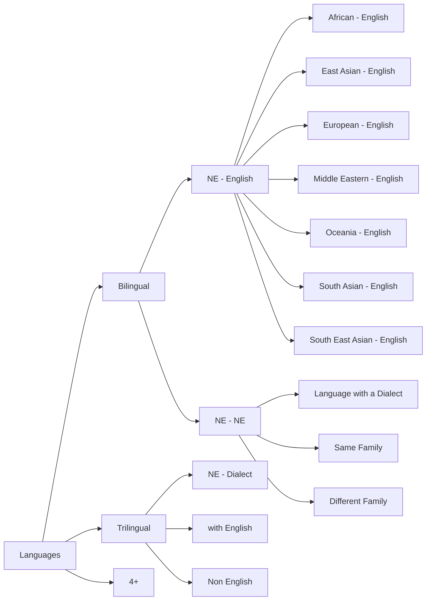

# The Decades Progress on Code-Switching Research in NLP: A Systematic Survey on Trends and Challenges

Genta Indra Winata1, Alham Fikri Aji2, Zheng-Xin Yong3, Thamar Solorio1 ∗

1Bloomberg 2MBZUAI 3Brown University

gwinata@bloomberg.net, alham.fikri@mbzuai.ac.ae, contact.yong@brown.edu

## Abstract

Code-Switching, a common phenomenon in written text and conversation, has been studied over decades by the natural language processing (NLP) research community. Initially, code-switching is intensively explored by leveraging linguistic theories and, currently, more machine-learning oriented approaches to develop models. We introduce a comprehensive systematic survey on code-switching research in natural language processing to understand the progress of the past decades and conceptualize the challenges and tasks on the codeswitching topic. Finally, we summarize the trends and findings and conclude with a discussion for future direction and open questions for further investigation.

## 1 Introduction

Code-Switching is the linguistic phenomenon where multilingual speakers use more than one language in the same conversation (Poplack, 1978). The fragment of the worldwide population that can be considered multilingual, i.e., speaks more than one language, far outnumbers monolingual speakers (Tucker, 2001; Winata et al., 2021a). This alone makes a compelling argument for developing NLP technology that can successfully process code-switched (CSW) data. However, it was not until the last couple of years that CSW-related research became more popular (Sitaram et al., 2019; Jose et al., 2020; Dogruöz et al.˘ , 2021), and this increased interest has been motivated to a large extent by: 1) The need to process social media data. Before the proliferation of social media platforms, it was more common to observe code-switching in spoken language and not so much in written language. This is not the case anymore, as multilingual users tend to combine the languages they speak on social media; 2) The increasing release of voice-operated devices. Now that smart assistants are becoming more and more accessible, we have started to realize that assuming users will interact with NLP technology as monolingual speakers is very restrictive and does not fulfill the needs of real-world users. Multilingual speakers also prefer to interact with machines in a CSW manner (Bawa et al., 2020). We show quantitative evidence of the upward trend for CSW-related research in Figure 1.

  
Figure 1: Number of publications over time in \*CL and ISCA venues. We collect the papers on October 2022. Top: Relative to all \*CL and ISCA papers. Bottom: absolute number, broken down into conferences vs workshops. It does not include papers published after. The graphs do not show the number of publications published in journals and symposiums.

In this paper, we present the first large-scale comprehensive survey on CSW NLP research in a structured manner by collecting more than 400 papers published on open repositories, such as the ACL Anthology and ISCA proceedings (see §2). We manually coded these papers to collect coarseand fine-grained information (see §2.1) on CSW research in NLP that includes languages covered (see §3), NLP tasks that have been explored, and new and emerging trends (see §4). In addition, motivated by the fact that fields like linguistics, socio-linguistics, and related fields, have studied

<table><tr><td>Category</td><td>Options</td></tr><tr><td>Languages</td><td>Bilingual, Trilingual, 4+</td></tr><tr><td>Venues</td><td>Conference, Workshop, Symposium, Book</td></tr><tr><td>Papers</td><td>Theory / Linguistics, Empirical, Analysis, Position/Opinion/Survey, Metric, Corpus, Shared Task, Demo</td></tr><tr><td>Datasets</td><td>Social Media, Speech (Recording), Transcription, News, Dialogue, Books, Government Document, Treebank</td></tr><tr><td>Methods</td><td>Rule/Linguistic Constraint, Statistical Model, Neural Network, Pre-trained Model</td></tr><tr><td>Tasks</td><td>Text: Topic Modeling, Semantic Parsing, Dependency Parsing, Sentiment Analysis, Emotion Detection,Abusive Language Detection, Sarcasm Detection, Humor Detection, Humor Generation, Dialogue State Tracking,Text Generation, Natural Language Understanding, Named Entity Recognition, Part-of-Speech Tagging,Natural Language Entailment, Language Modeling, Regression, Language Identification, Machine Translation,Text Normalization, Micro-Dialect Identification, Question Answering, SummarizationSpeech: Acoustic Modeling, Speech Recognition, Text-to-Speech, Speech Synthesis</td></tr></table>

Table 1: Categories in the annotation scheme.

flowchart

Figure 2: Language Categories. \*NE denotes Non English. We show fine-grained categories in green and blue.

CSW since the early 1900s, we also investigate to what extent theoretical frameworks from these fields have influenced NLP approaches (see §5), and how the choice of methods has evolved over time (see §5.4). Finally, we discuss the most pressing research challenges and identify a path forward to continue advancing this exciting line of work (see §6).

The area of NLP for CSW data is thriving, covering an increasing number of language combinations and tasks, and it is clearly advancing from a niche field to a common research topic, thus making our comprehensive survey timely. We expect the survey to provide valuable information to researchers new to the field and motivate more research from researchers already engaging in NLP for CSW data.

## 2 Exploring Open Proceedings

To develop a holistic understanding of the trends and advances in CSW NLP research, we collect research papers on CSW from the ACL Anthology and ISCA proceedings. We focus on these two sources because they encompass the top venues for publishing in speech and language processing in our field. In addition, we also look into personal repositories from researchers in the community that contains a curated list of CSW-related papers. We discuss below the search process for each venue.

ACL Anthology We crawled the entire the ACL Anthology repository up to October 2022.1 We then filtered papers by using the following keywords related to CSW: “codeswitch", “code switch", “code-switching", “code-switched", “code-switch", “code-mix", “code-mixed", “codemixing", “code mix" “mixed-language", “mixedlingua", “mixed language", “mixed lingua", and “mix language".

ISCA Proceedings We manually reviewed publicly available proceedings on the ISCA website2 and searched for papers related to CSW using the same set of keywords as above.

Web Resources To extend the coverage of paper sources, we also gathered data from existing repositories.3,4 We can find multiple linguistics papers studying about CSW.

## 2.1 Annotation Process

We have three human annotators to annotate all collected papers based on multiple categories shown in Table 1. All papers are coded by a least one annotator. To extract the specific information we are looking for from the paper, the annotator needs to read through the paper, as most of the information is not contained in the abstract. The full list of the annotations we collected is available in the Appendix (see §A).

$^{1}$https://github.com/acl-org/ acl-anthology
$^{2}$https://www.isca-speech.org
$^{3}$https://github.com/gentaiscool/ code-switching-papers
$^{4}$https://genius1237.github.io/emnlp19_ tut/

  
Figure 3: (Top): Number of publications across the type of language combination (bilingual, trilingual or 4+. (Bottom): Number of publications on fine-grained bilingual category with English as the L2 language.

bar

| Category | *CL | ISCA |
| --- | --- | --- |
| chinese-taiwanese | ~2 | ~1 |
| msa-arabic | ~29 | ~0.5 |
| same family | ~8 | ~7 |
| different family | ~17 | ~6 |

Figure 4: Number of publications of bilingual codeswitched languages that do not contain English. ∗msa stands for Modern Standard Arabic. The first two are the combination of a language with its dialect.

To facilitate our analysis, we annotated the following aspects:

• Languages: CSW is not restricted to pairs of languages; thus, we divide papers by the number of languages that are covered into bilingual, trilingual, and 4+ (if there are at least four languages). For a more fine-grained classification of languages, we categorize them by geographical location (see Figure 2).

<table><tr><td rowspan="2">Languages</td><td colspan="4"># Publications</td></tr><tr><td>*CL</td><td>ISCA</td><td>Total</td><td>Shared Task</td></tr><tr><td>Hindi-English</td><td>111</td><td>17</td><td>128</td><td>30</td></tr><tr><td>Spanish-English</td><td>78</td><td>8</td><td>86</td><td>40</td></tr><tr><td>Chinese-English $^{\dagger}$ </td><td>20</td><td>27</td><td>47</td><td>5</td></tr><tr><td>Tamil-English</td><td>37</td><td>2</td><td>39</td><td>17</td></tr><tr><td>Malayalam-English</td><td>23</td><td>2</td><td>25</td><td>13</td></tr></table>

Table 2: Most common code-switching languages in \*CL and ISCA venues. ‡The count does not include the dialect or South East Asian Mandarin - English (Lyu et al., 2010a) since they contain more than two languages (i.e., it has words from the Chinese dialect).

• Venues: There are multiple venues for CSWrelated publications. We considered the following type of venues: conference, workshop, symposium and book. As we will discuss later, the publication venue is a reasonable data point of the wider spread of CSW research in recent years.  
• Papers: We classify the paper types based on their contribution and nature. We predict that we will have a high distribution of dataset/resource papers, as lack of resources has been a major bottleneck in the past.  
• Datasets: If the paper uses a dataset for the research, we will identify the source and modality (i.e., written text or speech) of the dataset.  
• Methods: We identify the type of methods presented in work.  
• Tasks: We identify the downstream NLP tasks (including the speech processing-related tasks) presented in work.

## 3 Language Diversity

Here, we show the languages covered in the CSW resources. While focusing on the CSW phenomenon increases diversity of NLP technology, as we will see in this section, future efforts are needed to provide significant coverage of the most common CSW language combinations worldwide.

## 3.1 Variety of Mixed Languages

Figure 3 shows the distribution of languages represented in the NLP for CSW literature. Most of the papers use datasets with two language pairs. However, we did find a few papers that address CSW scenarios with more than two languages. We consider this a relevant future direction in CSW: scaling model abilities to cover n languages, with $n \geq 2 .$

<table><tr><td rowspan="2">Languages</td><td colspan="3"># Publications</td></tr><tr><td>non-ST</td><td>ST</td><td>Total</td></tr><tr><td>Language Identification</td><td>46</td><td>17</td><td>63</td></tr><tr><td>Sentiment Analysis</td><td>31</td><td>30</td><td>61</td></tr><tr><td>NER</td><td>17</td><td>14</td><td>31</td></tr><tr><td>POS Tagging</td><td>29</td><td>1</td><td>30</td></tr><tr><td>Abusive/Offensive Lang. Detection</td><td>9</td><td>16</td><td>25</td></tr><tr><td>ASR</td><td>20</td><td>0</td><td>22</td></tr><tr><td>Language Modeling</td><td>19</td><td>1</td><td>20</td></tr><tr><td>Machine Translation</td><td>8</td><td>5</td><td>13</td></tr></table>

Table 3: Most common tasks in ACL venues. ST denotes shared task.

CSW in two languages We group the number of publications focusing on bilingual CSW based on world regions in Figure 3 (bottom). We can see that the majority of research in CSW has focused on South Asian-English, especially on Hindi-English, Tamil-English, and Malayalam-English, as shown in Table 2. The other common language pairs are Spanish-English and Chinese-English. That table also shows that many of the publications are shared task papers. This is probably reflecting efforts from a few research groups to motivate more research into CSW, such as that behind the CALCS workshop series.

Looking at the languages covered, we also find that there are many language pairs that come from different language families, such as Turkish-German (Çetinoglu˘ , 2016; Çetinoglu and Çöl-˘ tekin, 2019; Özate¸s and Çetinoglu˘ , 2021; Özate¸s et al., 2022), Turkish-Dutch (Gambäck and Das, 2016), French-Arabic (Sankoff, 1998; Lounnas et al., 2021), Russian-Tatar (Taguchi et al., 2021), Russian-Kazakh (Mussakhojayeva et al., 2022a), Hindi-Tamil (Thomas et al., 2018b), Arabic-North African (El-Haj et al., 2018), Basque-Spanish (Aguirre et al., 2022), and Wixarika-Spanish (Mager et al., 2019). There are only very few papers working on Middle Eastern - English language pairs, most of the time, the Middle Eastern languages are mixed with non-English and/or dialects of these languages (see Figure 4).

Trilingual The number of papers addressing CSW in more than two languages is still small (see 3 top), compared to the papers looking at pairs of languages. Not surprisingly, this smaller number of papers focus on world regions where either the official languages are more than two, or these languages are widely used in the region, for example, Arabic-English-French (Abdul-Mageed et al., 2020), Hindi-Bengali-English (Barman et al., 2016), Tulu-Kannada-English (Hegde et al., 2022), and Darija-English-French (Voss et al., 2014).

<table><tr><td rowspan="2"></td><td colspan="3"># Publications</td></tr><tr><td>*CL</td><td>ISCA</td><td>Total</td></tr><tr><td>Public Dataset</td><td>38</td><td>4</td><td>42</td></tr><tr><td>Private Dataset</td><td>54</td><td>18</td><td>72</td></tr></table>

Table 4: Publications that introduce new corpus.

4+ When looking at the papers that focus on more than three languages, we found that many papers use South East Asian Mandarin-English (SEAME) dataset (Lyu et al., 2010a), which has Chinese dialects and Malay or Indonesian words. Most of the other datasets are machine-generated using rulebased or neural methods.

## 3.2 Language-Dialect Code-Switching

Based on Figure 4, we can find some papers with language-dialect CSW, such as Chinese-Taiwanese Dialect (Chu et al., 2007; Yu et al., 2012) and Modern Standard Arabic (MSA)-Arabic Dialect (Elfardy and Diab, 2012; Samih and Maier, 2016; El-Haj et al., 2018). The dialect, in this case, is the variation of the language with a different form that is very specific to the region where the CSW style is spoken.

## 4 Tasks and Datasets

In this section, we summarize our findings, focusing on the CSW tasks and datasets. Table 3 shows the distribution of CSW tasks for ACL papers with at least ten publications. The two most popular tasks are language identification and sentiment analysis. Researchers mostly use the shared tasks from 2014 (Solorio et al., 2014) and 2016 (Molina et al., 2016) for language identification, and the SemEval 2020 shared task (Patwa et al., 2020) for sentiment analysis. For ISCA, the most popular tasks are unsurprisingly ASR and TTS. This strong correlation between task and venue shows that the speech processing and \*CL communities remain somehow fragmented and working in isolation from one another, from the most part.

Public vs. Private Datasets Public datasets availability also dictates what tasks are being explored in CSW research. Public datasets such as HinGE (Srivastava and Singh, 2021b), SEAME (Lyu et al., 2010a) and shared task datasets (Solorio et al., 2014; Molina et al., 2016; Aguilar et al., 2018; Patwa et al., 2020) have been widely used in many of the papers. Some work, however, used new datasets that are not publicly available, thus hindering adoption (see Table 4). There are two well-known benchmarks in CSW: LinCE (Aguilar et al., 2020) and Glue-COS (Khanuja et al., 2020b). These two benchmarks have a handful of tasks, and they are built to encourage transparency and reliability of evaluation since the test set labels are not publicly released. The evaluation is done automatically on their websites. However, their support languages are mostly limited to popular CSW language pairs, such as Spanish-English, Modern Standard Arabic-Egyptian, and Hindi-English, the exception being Nepali-English in LinCE.

<table><tr><td>Source</td><td>*CL</td><td>ISCA</td><td>Total</td></tr><tr><td>Social Media</td><td>183</td><td>3</td><td>186</td></tr><tr><td>Speech (Recording)</td><td>29</td><td>102</td><td>141</td></tr><tr><td>Transcription</td><td>23</td><td>4</td><td>27</td></tr><tr><td>News</td><td>19</td><td>5</td><td>24</td></tr><tr><td>Dialogue</td><td>16</td><td>2</td><td>18</td></tr><tr><td>Books</td><td>7</td><td>1</td><td>8</td></tr><tr><td>Government Document</td><td>6</td><td>0</td><td>6</td></tr><tr><td>Treebank</td><td>5</td><td>0</td><td>5</td></tr></table>

Table 5: The source of the CSW dataset in the literature.

Dataset Source Table 5 shows the statistics of dataset sources in the CSW literature. We found that most of the ACL papers were working on social media data. This is expected, considering that social media platforms are known to host informal interactions among users, making them reasonable places for users to code-switch. Naturally, most ISCA papers work on speech data, many of which are recordings of conversations and interviews. There are some datasets that come from speech transcription, news, dialogues, books, government documents, and treebanks.

Paper Category Table 6 presents the distribution of CSW papers. Most of the papers are empirical work focusing on the evaluation of downstream tasks. The second largest population is shared tasks. We also notice that many papers introduce new CSW corpus, but they are not released publicly.

<table><tr><td>Type</td><td>*CL</td><td>ISCA</td><td>Total</td></tr><tr><td>Empirical</td><td>205</td><td>100</td><td>305</td></tr><tr><td>Shared Task</td><td>82</td><td>1</td><td>83</td></tr><tr><td>Corpus (Closed)</td><td>54</td><td>18</td><td>62</td></tr><tr><td>Corpus (Open)</td><td>38</td><td>4</td><td>42</td></tr><tr><td>Analysis</td><td>34</td><td>8</td><td>42</td></tr><tr><td>Demo</td><td>7</td><td>2</td><td>9</td></tr><tr><td>Theoretical/Linguistic</td><td>7</td><td>0</td><td>7</td></tr><tr><td>Position/Opinion/Survey</td><td>3</td><td>0</td><td>3</td></tr><tr><td>Metric</td><td>2</td><td>1</td><td>3</td></tr></table>

Table 6: Paper Type of the CSW papers.

Some papers only release the URL or id to download the datasets, especially for datasets that come from social media (e.g., Twitter) since redistribution of the actual tweets is not allowed (Solorio et al., 2014; Molina et al., 2016) resulting in making reproducibility harder. Social media users can delete their posts at any point in time, resulting in considerable data attrition rates. There are very few papers working on the demos, theoretical work, position papers, and introducing evaluation metrics.

## 5 From Linguistics to NLP

Notably, papers are working on approaches that are inspired by linguistic theories to enhance the processing of CSW text. In this survey, we find three linguistic constraints that are used in the literature: equivalence constraint, matrix-embedded language Framework (MLF), and Functional Head Constraint. In this section, we will briefly introduce the constraints and list the papers that utilize the constraints.

## 5.1 Linguistic-Driven Approaches

Equivalence Constraint In a well-formed codeswitched sentence, the switching takes place at those points where the grammatical constraints of both languages are satisfied (Poplack, 1980). Li and Fung (2012, 2013) incorporate this syntactic constraint to a statistical code-switch language model (LM) and evaluate the model on Chinese-English code-switched speech recognition. On the same line of work, Pratapa et al. (2018a); Pratapa and Choudhury (2021) implement the same constraint to Hindi-English CSW data by producing parse trees of parallel sentences and matching the surface order of child nodes in the trees. Winata et al. (2019c) apply the constraint to generate synthetic CSW text and find that combining the real

CSW data with synthetic CSW data can effectively improve the perplexity. They also treat parallel sentences as a linear structure and only allow switching on non-crossing alignments.

Matrix-Embedded Language Framework (MLF) Myers-Scotton (1997) proposed that in bilingual CSW, there exists an asymmetrical relationship between the dominant matrix language and the subordinate embedded language. Matrix language provides the frame of the sentence by governing all or most of the most of the grammatical morphemes as well as word order, whereas syntactic elements that bear no or only limited grammatical function can be provided by the embedded language (Johanson, 1999; Myers-Scotton, 2005). Lee et al. (2019a) use augmented parallel data by utilizing MLF to supplement the real code-switch data. Gupta et al. (2020) use MLF to automatically generate the code-mixed text from English to multiple languages without any parallel data.

Functional Head Constraint Belazi et al. (1994) posit that it is impossible to switch languages between a functional head and its complement because of the strong relationship between the two constituents. Li and Fung (2014) use the constraint of the LM by first expanding the search network with a translation model and then using parsing to restrict paths to those permissible under the constraint.

## 5.2 Learning from Data Distribution

Linguistic constraint theories have been used for decades to generate synthetic CSW sentences to address the lack of data issue. However, the approach requires external word alignments or constituency parsers that create erroneous results instead of applying the linguistic constraints to generate new synthetic CSW data, building a pointergenerator model to learn the real distribution of code-switched data (Winata et al., 2019c). Chang et al. (2019) propose to generate CSW sentences from monolingual sentences using Generative Adversarial Network (GAN) (Goodfellow et al., 2020) and the generator learns to predict CSW points without any linguistic knowledge.

## 5.3 The Era of Statistical Methods

The research on CSW is also influenced by the progress and development of machine learning.

bar_stacked

| Year | rule/linguistic constraint (%) | statistical (%) | neural network (%) | pretrained model (%) |
| --- | --- | --- | --- | --- |
| 2007 | ~50 | ~50 | 0 | 0 |
| 2008 | ~33 | ~67 | 0 | 0 |
| 2009 | 0 | 100 | 0 | 0 |
| 2011 | 0 | 100 | 0 | 0 |
| 2012 | ~50 | ~50 | 0 | 0 |
| 2013 | 0 | ~50 | ~40 | 0 |
| 2014 | ~8 | ~92 | ~2 | 0 |
| 2015 | 0 | 100 | 0 | 0 |
| 2016 | ~14 | ~56 | ~21 | ~4 |
| 2017 | ~16 | ~34 | ~46 | 0 |
| 2018 | ~5 | ~35 | ~41 | ~14 |
| 2019 | ~10 | 0 | ~95 | 0 |
| 2020 | 0 | ~26 | ~41 | ~33 |
| 2021 | ~5 | ~15 | ~33 | ~42 |
| 2022 | 0 | ~28 | ~33 | ~37 |

(a) \*CL  

bar_stacked

| Year | rule/linguistic constraint (%) | statistical (%) | neural network (%) | pretrained model (%) |
| --- | --- | --- | --- | --- |
| 2007 | 0 | 100 | 0 | 0 |
| 2008 | ~16 | ~84 | 0 | 0 |
| 2009 | 0 | 100 | 0 | 0 |
| 2010 | 0 | 100 | 0 | 0 |
| 2011 | 0 | 100 | 0 | 0 |
| 2012 | 0 | 100 | 0 | 0 |
| 2013 | 0 | 100 | 0 | 0 |
| 2014 | 0 | ~80 | ~20 | 0 |
| 2015 | 0 | ~67 | ~33 | 0 |
| 2016 | ~10 | ~57 | ~31 | 0 |
| 2017 | ~11 | ~49 | ~43 | 0 |
| 2018 | ~11 | ~41 | ~49 | 0 |
| 2019 | ~6 | ~31 | ~49 | ~13 |
| 2020 | ~4 | ~21 | ~67 | ~4 |
| 2021 | ~7 | ~36 | ~53 | 0 |
| 2022 | ~15 | ~16 | ~59 | ~7 |

(b) ISCA  
Figure 5: Methods used for code-mixing NLP.

According to Figure 5, starting in 2006, statistical methods have been adapted to CSW research, while before that year, the approaches were mainly rule-based. There are common statistical methods for text classification used in the literature, such as Naive Bayes (Solorio and Liu, 2008a) and Support Vector Machine (SVM) (Solorio and Liu, 2008b). Conditional Random Field (CRF) (Sutton et al., 2012) is also widely seen in the literature for sequence labeling, such as Part-of-Speech (POS) tagging (Vyas et al., 2014), Named Entity Recognition (NER), and word-level language identification (Lin et al., 2014; Chittaranjan et al., 2014; Jain and Bhat, 2014). HMM-based models have been used in speech-related tasks, such as speech recognition (Weiner et al., 2012a; Li and Fung, 2013) and text synthesis (Qian et al., 2008; Shuang et al., 2010; He et al., 2012).

## 5.4 Utilizing Neural Networks

Following general NLP trends, we see the adoption of neural methods and pre-trained models growing in popularity over time. In contrast, the statistical and rule-based approaches are diminishing. Compared to ISCA, we see more adaptation of the pre-training model. This is because ACL work is more text-based focused, where pre-trained LMs are more widely available.

Neural-Based Models Figure 5 shows that the trend of using neural-based models started in 2013, and the usage of rule/linguistic constraint and statistical methods diminished gradually through time, but they are still used even with a low percentage. RNN and LSTM architectures are commonly used in sequence modeling, such as language modeling (Adel et al., 2013; Vu and Schultz, 2014; Adel et al., 2014c; Winata et al., 2018a; Garg et al., 2018a; Winata et al., 2019c) and CSW identification (Samih et al., 2016a). DNN-based and hybrid HMM-DNN models are used in speech recognition models (Yilmaz et al., 2018; Yılmaz et al., 2018).

Pre-trained Embeddings Pre-trained embeddings are used to complement neural-based approaches by initializing the embedding layer. Common pre-trained embeddings used in the literature are monolingual subword-based embeddings, Fast-Text (Joulin et al., 2016), and aligned-embeddings MUSE (Conneau et al., 2017). A standard method to utilize monolingual embeddings is to concatenate or sum two or more embeddings from different languages (Trivedi et al., 2018). A more recent approach is to apply an attention mechanism to merge embeddings and form metaembeddings (Winata et al., 2019a,b). Characterbased embeddings have also been explored in the literature to address the out-of-vocabulary issues on word-embeddings (Winata et al., 2018b; Attia et al., 2018; Aguilar et al., 2021). Another approach is to train bilingual embeddings using real and synthetic CSW data (Pratapa et al., 2018b). In the speech domain, Lovenia et al. (2022) utilize wav2vec 2.0 (Baevski et al., 2020) as a starting model before fine-tuning.

Language Models Many pre-trained model approaches utilize multilingual LMs, such as mBERT or XLM-R to deal with CSW data (Khanuja et al., 2020b; Aguilar and Solorio, 2020; Pant and Dadu, 2020; Patwa et al., 2020; Winata et al., 2021a). These models are often fine-tuned with the downstream task or with CSW text to better adapt to the languages. Some downstream fine-tuning approaches use synthetic CSW data due to a lack of available datasets. Aguilar et al. (2021) propose a character-based subword module (char2subword) of the mBERT that learns the subword embedding that is suitable for modeling the noisy CSW text. Winata et al. (2021a) compare the performance of the multilingual LM versus the language-specific LM for CSW context. While XLM-R provides the best result, it is also computationally heavy. There needed to be more exploration of larger models.

We see that pre-trained LMs provide better empirical results on current benchmark tasks and enables an end-to-end approach. Therefore, one can theoretically work on CSW tasks without any linguistic understanding of the language, assuming the dataset for model finetuning is available. However, the downside is that there is little understanding of how and when the LMs would fail, thus we encourage more interpretability work on these LMs in CSW setting.

## 6 Recent Challenges and Future Direction

## 6.1 More Diverse Exploration on Code-Switching Styles and Languages

A handful of languages, such as Spanish-English, Hindi-English, or Chinese-English, dominate research and resource CSW. However, there are still many countries and cultures rich in the use of CSW, which is still under-represented in NLP research (Joshi et al., 2020; Aji et al., 2022; Yong et al., 2023), especially on different CSW variations. CSW style can vary in different regions of the world, and it would be interesting to gather more datasets on unexplored and unknown styles, which can be useful for further research and investigation on linguistics and NLP. Therefore, one future direction is to broaden the language scope of CSW research.

## 6.2 Datasets: Access and Sources

According to our findings, there are more than 60% of the datasets are private (see Table 4), and they are not released to the public. This eventually hampers the progress of CSW research, particularly in the results’ reproducibility, credibility, and transparency. Moreover, many studies in the literature do not release the code to reproduce their work. Therefore, we encourage researchers who build a new corpus to release the datasets publicly. In addition, the fact that some researchers provide urls to download the data is also problematic due to the data attrition issue we raised earlier. Data attrition is bad for reproducibility, but it is also a waste of annotation efforts. Perhaps we should work on identifying alternative means to collect written CSW data in an ecologically valid manner.

## 6.3 Model Scaling

To the best of our knowledge, little work has been done on investigating how well the scaling law holds for code-mixed datasets. Winata et al. (2021a) demonstrate that the XLM-R-large model outperforms smaller pre-trained models on the NER and POS tasks in LinCE benchmark (Aguilar et al., 2020); however, the largest model in the study, which is the XLM-R-large model, only has 355 million parameters. Furthermore, they find that smaller models that combine word, subword, and character embeddings achieve comparable performance as mBERT while being faster in inference. Given the recent release of billion-sized large pre-trained multilingual models such as XGLM and BLOOM (Scao et al., 2022), we urge future research to study the scaling law and performancecompute trade-off in code-mixing tasks.

## 6.4 Zero-Shot and Few-Shot Exploration

The majority of pre-trained model approaches fine-tune their models to the downstream task. On the other hand, CSW data is considerably limited. With the rise of multilingual LMs, especially those that have been fine-tuned with prompt/instruction (Muennighoff et al., 2022; Ouyang et al., 2022; Winata et al., 2022), one direction is to see whether these LMs can handle CSW input in a zero-shot fashion. This work might also tie in with model scaling since larger models have shown better capability at zero-shot and fewshot settings (Winata et al., 2021b; Srivastava et al., 2022).

## 6.5 Robustness Evaluation

Since CSW is a widely common linguistic phenomenon, we argue that cross-lingual NLP benchmarks, such as XGLUE (Liang et al., 2020) and XTREME-R (Ruder et al., 2021), should incorporate linguistic CSW evaluation (Aguilar et al., 2020; Khanuja et al., 2020b). The reasons are that CSW is a cognitive ability that multilingual human speakers can perform with ease (Beatty-Martínez et al., 2020). CSW evaluation examines the robustness of multilingual LMs in learning cross-lingual alignment of representations (Conneau et al., 2020; Libovicky et al.\` , 2020; Pires et al., 2019; Adilazuarda et al., 2022). On the other hand, catastrophic forgetting is observed in pre-trained models (Shah et al., 2020), and human speakers (Hirvonen and Lauttamus, 2000; Du Bois, 2009, known as language attrition) in a CSW environment. We argue that finetuning LMs on code-mixed data is a form of continual learning to produce a more generalized multilingual LM. Thus, we encourage CSW research to report the performance of finetuned models on both CSW and monolingual texts.

## 6.6 Task Diversity

We encourage creating reasoning-based tasks for CSW texts for two reasons. First, code-mixed datasets for tasks such as NLI, coreference resolution, and question-answering are much fewer in comparison to tasks such as sentiment analysis, parts-of-speech tagging, and named-entity recognition. Second, comprehension tasks with the CSW text present more processing costs for human readers (Bosma and Pablos, 2020).

## 6.7 Conversational Agents

There has been a recent focus on developing conversational agents with LMs such as ChatGPT,5 Whisper (Radford et al., 2022), SLAM (Bapna et al., 2021), mSLAM (Bapna et al., 2022). We recommend incorporating the capability of synthesizing code-mixed data in human-machine dialogue, as CS is a prevalent communication style among multilingual speakers (Ahn et al., 2020), and humans prefer chatbots with such capability (Bawa et al., 2020).

## 6.8 Automatic Evaluation for Generation

With the rise of pre-trained models, generative tasks gained more popularity. However, when generating CSW data, most work used human evaluation for measuring quality of the generated data. Alternative automatic methods for CS text based on word-frequency and temporal distribution are commonly used (Guzmán et al., 2017; Mave et al., 2018), but we believe there is still much room for improvement in this respect. One possible future direction is to align the evaluation metrics to human judgement of quality (Hamed et al., 2022) where we can assess separately the “faithfulness” of the resulting CSW data from other desired properties of language generation. Other nuances here are related to the intricacy of CSW patterns, where ideally the model would mimic the CSW style of the intended users.

## 7 Conclusion

We present a comprehensive systematic survey on code-switching research in natural language processing to explore the progress of the past decades and understand the existing challenges and tasks in the literature. We summarize the trends and findings and conclude with a discussion for future direction and open questions for further investigation. We hope this survey can encourage and lead NLP researchers in a better direction on code-switching research.

## Limitations

The numbers in this survey are limited to papers published in the ACL Anthology and ISCA Proceedings. However, we also included papers as related work from other resources if they are publicly available and accessible. In addition, the category in the survey does not include the code-switching type (i.e., intra-sentential, inter-sentential, etc.) since some papers do not provide such information.

## Ethics Statement

We use publicly available data in our survey with permissive licenses. No potential ethical issues in this work.

## Acknowledgements

Thanks to Igor Malioutov for the insightful discussion on the paper.

## References

Muhammad Abdul-Mageed, Chiyu Zhang, AbdelRahim Elmadany, and Lyle Ungar. 2020. Toward microdialect identification in diaglossic and code-switched environments. In Proceedings of the 2020 Conference on Empirical Methods in Natural Language Processing (EMNLP), pages 5855–5876.  
Heike Adel, Katrin Kirchhoff, Dominic Telaar, Ngoc Thang Vu, Tim Schlippe, and Tanja Schultz. 2014a. Features for factored language models for code-switching speech. In Proc. 4th Workshop on Spoken Language Technologiesfor Under-Resourced Languages (SLTU 2014), pages 32–38.  
Heike Adel, Katrin Kirchhoff, Ngoc Thang Vu, Dominic Telaar, and Tanja Schultz. 2014b. Comparing approaches to convert recurrent neural networks into backoff language models for efficient decoding. In Proc. Interspeech 2014, pages 651–655.  
Heike Adel, Dominic Telaar, Ngoc Thang Vu, Katrin Kirchhoff, and Tanja Schultz. 2014c. Combining recurrent neural networks and factored language models during decoding of code-switching speech. In Fifteenth Annual Conference ofthe International Speech Communication Association.  
Heike Adel, Ngoc Thang Vu, and Tanja Schultz. 2013. Combination of recurrent neural networks and factored language models for code-switching language modeling. In Proceedings ofthe 51st Annual Meeting ofthe Associationfor Computational Linguistics (Volume 2: Short Papers), pages 206–211.  
Muhammad Farid Adilazuarda, Samuel Cahyawijaya, Genta Indra Winata, Pascale Fung, and Ayu Purwarianti. 2022. Indorobusta: Towards robustness against diverse code-mixed indonesian local languages. In Proceedings of the First Workshop on Scaling Up Multilingual Evaluation, pages 25–34.  
Wafia Adouane and Jean-Philippe Bernardy. 2020. When is multi-task learning beneficial for lowresource noisy code-switched user-generated algerian texts? In Proceedings of the The 4th Workshop on Computational Approaches to Code Switching, pages 17–25.  
Wafia Adouane, Jean-Philippe Bernardy, and Simon Dobnik. 2018. Improving neural network performance by injecting background knowledge: Detecting code-switching and borrowing in algerian texts. In Proceedings of the Third Workshop on Computational Approaches to Linguistic Code-Switching, pages 20–28.  
Wafia Adouane, Samia Touileb, and Jean-Philippe Bernardy. 2020. Identifying sentiments in algerian code-switched user-generated comments. In Proceedings of the Twelfth Language Resources and Evaluation Conference, pages 2698–2705.  
Laksh Advani, Clement Lu, and Suraj Maharjan. 2020. C1 at semeval-2020 task 9: Sentimix: Sentiment analysis for code-mixed social media text using feature engineering. In Proceedings ofthe Fourteenth Workshop on Semantic Evaluation, pages 1227–1232.  
Kaustubh Agarwal and Rhythm Narula. 2021. Humor generation and detection in code-mixed hindi-english. In Proceedings of the Student Research Workshop Associated with RANLP 2021, pages 1–6.  
Vibhav Agarwal, Pooja Rao, and Dinesh Babu Jayagopi. 2021. Towards code-mixed hinglish dialogue generation. In Proceedings ofthe 3rd Workshop on Natural Language Processingfor Conversational AI, pages 271–280.  
Akshita Aggarwal, Anshul Wadhawan, Anshima Chaudhary, and Kavita Maurya. 2020. “did you really mean what you said?”: Sarcasm detection in hindi-english code-mixed data using bilingual word embeddings. In Proceedings ofthe Sixth Workshop on Noisy Usergenerated Text (W-NUT 2020), pages 7–15.  
Gustavo Aguilar, Fahad AlGhamdi, Victor Soto, Mona Diab, Julia Hirschberg, and Thamar Solorio. 2018. Named entity recognition on code-switched data: Overview of the calcs 2018 shared task. In Proceedings of the Third Workshop on Computational Approaches to Linguistic Code-Switching, pages 138– 147.  
Gustavo Aguilar, Sudipta Kar, and Thamar Solorio. 2020. Lince: A centralized benchmark for linguistic code-switching evaluation. In Proceedings ofthe Twelfth Language Resources and Evaluation Conference, pages 1803–1813.  
Gustavo Aguilar, Bryan McCann, Tong Niu, Nazneen Rajani, Nitish Shirish Keskar, and Thamar Solorio. 2021. Char2subword: Extending the subword embedding space using robust character compositionality. In Findings ofthe Associationfor Computational Linguistics: EMNLP 2021, pages 1640–1651.  
Gustavo Aguilar and Thamar Solorio. 2020. From english to code-switching: Transfer learning with strong morphological clues. In Proceedings of the 58th Annual Meeting ofthe Associationfor Computational Linguistics, pages 8033–8044.  
Maia Aguirre, Laura García-Sardiña, Manex Serras, Ariane Méndez, and Jacobo López. 2022. Basco: An annotated basque-spanish code-switching corpus for natural language understanding. In Proceedings of the Thirteenth Language Resources and Evaluation Conference, pages 3158–3163.  
Emily Ahn, Cecilia Jimenez, Yulia Tsvetkov, and Alan W Black. 2020. What code-switching strategies are effective in dialog systems? In Proceedings ofthe Societyfor Computation in Linguistics 2020, pages 254–264.  
Alham Aji, Genta Indra Winata, Fajri Koto, Samuel Cahyawijaya, Ade Romadhony, Rahmad Mahendra, Kemal Kurniawan, David Moeljadi, Radityo Eko Prasojo, Timothy Baldwin, et al. 2022. One country, 700+ languages: Nlp challenges for underrepresented languages and dialects in indonesia. In Proceedings of the 60th Annual Meeting of the Association for Computational Linguistics (Volume 1: Long Papers), pages 7226–7249.  
Mohamed Al-Badrashiny and Mona Diab. 2016. The george washington university system for the codeswitching workshop shared task 2016. In Proceedings of The Second Workshop on Computational Approaches to Code Switching, pages 108–111.  
Fahad AlGhamdi, Giovanni Molina, Mona Diab, Thamar Solorio, Abdelati Hawwari, Victor Soto, and Julia Hirschberg. 2016. Part of speech tagging for code switched data. In Proceedings of the Second Workshop on Computational Approaches to Code Switching, pages 98–107.  
Ahmed Ali, Shammur Absar Chowdhury, Amir Hussein, and Yasser Hifny. 2021. Arabic code-switching  
speech recognition using monolingual data. In Proc. Interspeech 2021, pages 3475–3479.  
Djegdjiga Amazouz, Martine Adda-Decker, and Lori Lamel. 2017. Addressing code-switching in french/algerian arabic speech. In Proc. Interspeech 2017, pages 62–66.  
Saadullah Amin, Noon Pokaratsiri Goldstein, Morgan Wixted, Alejandro Garcia-Rudolph, Catalina Martínez-Costa, and Günter Neumann. 2022. Fewshot cross-lingual transfer for coarse-grained deidentification of code-mixed clinical texts. In Proceedings of the 21st Workshop on Biomedical Language Processing, pages 200–211.  
Judith Jeyafreeda Andrew. 2021. Judithjeyafreedaandrew@ dravidianlangtech-eacl2021: offensive language detection for dravidian code-mixed youtube comments. In Proceedings ofthe First Workshop on Speech and Language Technologies for Dravidian Languages, pages 169–174.  
Jason Angel, Segun Taofeek Aroyehun, Antonio Tamayo, and Alexander Gelbukh. 2020. Nlp-cic at semeval-2020 task 9: Analysing sentiment in codeswitching language using a simple deep-learning classifier. In Proceedings ofthe Fourteenth Workshop on Semantic Evaluation, pages 957–962.  
Ansen Antony, Sumanth Reddy Kota, Akhilesh Lade, Spoorthy V, and Shashidhar G. Koolagudi. 2022. An improved transformer transducer architecture for hindi-english code switched speech recognition. In Proc. Interspeech 2022, pages 3123–3127.  
Lavinia Aparaschivei, Andrei Palihovici, and Daniela Gîfu. 2020. Fii-uaic at semeval-2020 task 9: Senti ment analysis for code-mixed social media text using cnn. In Proceedings ofthe Fourteenth Workshop on Semantic Evaluation, pages 928–933.  
Ramakrishna Appicharla, Kamal Kumar Gupta, Asif Ekbal, and Pushpak Bhattacharyya. 2021. Iitp-mt at calcs2021: English to hinglish neural machine translation using unsupervised synthetic code-mixed parallel corpus. In Proceedings ofthe Fifth Workshop on Computational Approaches to Linguistic Code-Switching, pages 31–35.  
Dian Arianto and Indra Budi. 2020. Aspect-based sentiment analysis on indonesia’s tourism destinations based on google maps user code-mixed reviews (study case: Borobudur and prambanan temples). In Proceedings ofthe 34th Pacific Asia Conference on Language, Information and Computation, pages 359– 367.  
Kavita Asnani and Jyoti Pawar. 2016. Use of semantic knowledge base for enhancement of coherence of code-mixed topic-based aspect clusters. In Proceedings ofthe 13th International Conference on Natural Language Processing, pages 259–266.  
Mohammed Attia, Younes Samih, and Wolfgang Maier. 2018. Ghht at calcs 2018: Named entity recognition for dialectal arabic using neural networks. In Proceedings of the Third Workshop on Computational Approaches to Linguistic Code-Switching, pages 98– 102.  
Leonardo Badino, Claudia Barolo, and Silvia Quazza. 2004. A general approach to tts reading of mixedlanguage texts. In Proc. Interspeech 2004, pages 849–852.  
Alexei Baevski, Yuhao Zhou, Abdelrahman Mohamed, and Michael Auli. 2020. wav2vec 2.0: A framework for self-supervised learning of speech representations. Advances in Neural Information Processing Systems, 33:12449–12460.  
Mohamed Balabel, Injy Hamed, Slim Abdennadher, Ngoc Thang Vu, and Özlem Çetinoglu. 2020. Cairo˘ student code-switch (cscs) corpus: An annotated egyptian arabic-english corpus. In Proceedings of the Twelfth Language Resources and Evaluation Con ference, pages 3973–3977.  
Kalika Bali, Jatin Sharma, Monojit Choudhury, and Yogarshi Vyas. 2014. “i am borrowing ya mixing?" an analysis of english-hindi code mixing in facebook. In Proceedings ofthefirst workshop on computational approaches to code switching, pages 116–126.  
Kelsey Ball and Dan Garrette. 2018. Part-of-speech tagging for code-switched, transliterated texts without explicit language identification. In Association for Computational Linguistics.  
Fazlourrahman Balouchzahi, BK Aparna, and HL Shashirekha. 2021. Mucs@ dravidianlangtecheacl2021: Cooli-code-mixing offensive language identification. In Proceedings ofthe First Workshop on Speech and Language Technologiesfor Dravidian Languages, pages 323–329.  
Fazlourrahman Balouchzahi and HL Shashirekha. 2021. La-saco: A study of learning approaches for sentiments analysis incode-mixing texts. In Proceedings ofthe First Workshop on Speech and Language Tech nologiesfor Dravidian Languages, pages 109–118.  
Somnath Banerjee, Sahar Ghannay, Sophie Rosset, Anne Vilnat, and Paolo Rosso. 2020. Limsi\_upv at semeval-2020 task 9: Recurrent convolutional neu ral network for code-mixed sentiment analysis. In Proceedings ofthe Fourteenth Workshop on Semantic Evaluation, pages 1281–1287.  
Suman Banerjee, Nikita Moghe, Siddhartha Arora, and Mitesh M Khapra. 2018. A dataset for building codemixed goal oriented conversation systems. In Proceedings of the 27th International Conference on Computational Linguistics, pages 3766–3780.  
Neetika Bansal, Vishal Goyal, and Simpel Rani. 2020a. Language identification and normalization of code mixed english and punjabi text. In Proceedings ofthe 17th International Conference on Natural Language  
Processing (ICON): System Demonstrations, pages 30–31.  
Shubham Bansal, Arijit Mukherjee, Sandeepkumar Satpal, and Rupeshkumar Mehta. 2020b. On improving code mixed speech synthesis with mixlingual grapheme-to-phoneme model. In Proc. Interspeech 2020, pages 2957–2961.  
Srijan Bansal, Vishal Garimella, Ayush Suhane, Jasabanta Patro, and Animesh Mukherjee. 2020c. Codeswitching patterns can be an effective route to improve performance of downstream nlp applications: A case study of humour, sarcasm and hate speech detection. In Proceedings ofthe 58th Annual Meeting ofthe Associationfor Computational Linguistics, pages 1018–1023.  
Ankur Bapna, Colin Cherry, Yu Zhang, Ye Jia, Melvin Johnson, Yong Cheng, Simran Khanuja, Jason Riesa, and Alexis Conneau. 2022. mslam: Massively multilingual joint pre-training for speech and text. arXiv preprint arXiv:2202.01374.  
Ankur Bapna, Yu-an Chung, Nan Wu, Anmol Gulati, Ye Jia, Jonathan H Clark, Melvin Johnson, Jason Riesa, Alexis Conneau, and Yu Zhang. 2021. Slam: A unified encoder for speech and language modeling via speech-text joint pre-training. arXiv preprint arXiv:2110.10329.  
Kfir Bar and Nachum Dershowitz. 2014. The tel aviv university system for the code-switching workshop shared task. In Proceedings ofthefirst workshop on computational approaches to code switching, pages 139–143.  
Utsab Barman, Amitava Das, Joachim Wagner, and Jennifer Foster. 2014a. Code mixing: A challenge for language identification in the language of social media. In Proceedings ofthefirst workshop on computational approaches to code switching, pages 13–23.  
Utsab Barman, Joachim Wagner, Grzegorz Chrupała, and Jennifer Foster. 2014b. Dcu-uvt: Word-level language classification with code-mixed data. In Proceedings of the first workshop on computational approaches to code switching, pages 127–132.  
Utsab Barman, Joachim Wagner, and Jennifer Foster. 2016. Part-of-speech tagging of code-mixed social media content: Pipeline, stacking and joint modelling. In Proceedings ofthe Second Workshop on Computational Approaches to Code Switching, pages 30–39.  
Subhra Jyoti Baroi, Nivedita Singh, Ringki Das, and Thoudam Doren Singh. 2020. Nits-hinglish-sentimix at semeval-2020 task 9: Sentiment analysis for codemixed social media text using an ensemble model. In Proceedings ofthe Fourteenth Workshop on Semantic Evaluation, pages 1298–1303.  
Arup Baruah, Kaushik Das, Ferdous Barbhuiya, and Kuntal Dey. 2020. Iiitg-adbu at semeval-2020 task 12: Comparison of bert and bilstm in detecting offensive language. In Proceedings ofthe Fourteenth Workshop on Semantic Evaluation, pages 1562–1568.  
Anshul Bawa, Monojit Choudhury, and Kalika Bali. 2018. Accommodation of conversational codechoice. In Proceedings of the Third Workshop on Computational Approaches to Linguistic Code-Switching, pages 82–91.  
Anshul Bawa, Pranav Khadpe, Pratik Joshi, Kalika Bali, and Monojit Choudhury. 2020. Do multilingual users prefer chat-bots that code-mix? let’s nudge and find out! Proceedings ofthe ACM on Human-Computer Interaction, 4(CSCW1):1–23.  
Anne L Beatty-Martínez, Christian A Navarro-Torres, and Paola E Dussias. 2020. Codeswitching: A bilin gual toolkit for opportunistic speech planning. Frontiers in Psychology, page 1699.  
Rafiya Begum, Kalika Bali, Monojit Choudhury, Koustav Rudra, and Niloy Ganguly. 2016. Functions of code-switching in tweets: An annotation framework and some initial experiments. In Proceedings ofthe Tenth International Conference on Language Resources and Evaluation (LREC’16), pages 1644– 1650.  
Hedi M Belazi, Edward J Rubin, and Almeida Jacqueline Toribio. 1994. Code switching and x-bar theory: The functional head constraint. Linguistic inquiry, pages 221–237.  
B Bharathi et al. 2021. Ssncse\_nlp@ dravidianlangtecheacl2021: Offensive language identification on multilingual code mixing text. In Proceedings ofthe First Workshop on Speech and Language Technologiesfor Dravidian Languages, pages 313–318.  
Irshad Bhat, Riyaz Ahmad Bhat, Manish Shrivastava, and Dipti Misra Sharma. 2017. Joining hands: Ex ploiting monolingual treebanks for parsing of codemixing data. In Proceedings of the 15th Conference ofthe European Chapter ofthe Associationfor Computational Linguistics: Volume 2, Short Papers, pages 324–330.  
Shishir Bhattacharja. 2010. Benglish verbs: A case of code-mixing in bengali. In Proceedings ofthe 24th Pacific Asia Conference on Language, Information and Computation, pages 75–84.  
Shankar Biradar and Sunil Saumya. 2022. Iiitdwd@ tamilnlp-acl2022: Transformer-based approach to classify abusive content in dravidian code-mixed text. In Proceedings of the second workshop on speech and language technologiesfor Dravidian languages, pages 100–104.  
Astik Biswas, Febe De Wet, Thomas Niesler, et al. 2020. Semi-supervised acoustic and language model training for english-isizulu code-switched speech recognition. In Proceedings ofthe The 4th Workshop on Computational Approaches to Code Switching, pages 52–56.  
Astik Biswas, Febe de Wet, Ewald van der Westhuizen, Emre Yilmaz, and Thomas Niesler. 2018a. Multilingual neural network acoustic modelling for asr  
of under-resourced english-isizulu code-switched speech. In INTERSPEECH, pages 2603–2607.  
Astik Biswas, Ewald van der Westhuizen, Thomas Niesler, and Febe de Wet. 2018b. Improving asr for code-switched speech in under-resourced languages using out-of-domain data. In SLTU, pages 122–126.  
Astik Biswas, Emre Yılmaz, Febe de Wet, Ewald van der Westhuizen, and Thomas Niesler. 2019. Semi-supervised acoustic model training for five lingual code-switched asr. Proc. Interspeech 2019, pages 3745–3749.  
Evelyn Bosma and Leticia Pablos. 2020. Switching direction modulates the engagement of cognitive con trol in bilingual reading comprehension: An erp study. Journal ofNeurolinguistics, 55:100894.  
Anouck Braggaar and Rob van der Goot. 2021. Chal lenges in annotating and parsing spoken, code switched, frisian-dutch data. In Proceedings of the Second Workshop on Domain Adaptation for NLP, pages 50–58.  
Barbara Bullock, Wally Guzmán, Jacqueline Serigos, Vivek Sharath, and Almeida Jacqueline Toribio. 2018a. Predicting the presence of a matrix language in code-switching. In Proceedings ofthe third work shop on computational approaches to linguistic code switching, pages 68–75.  
Barbara E. Bullock, Gualberto Guzmán, Jacqueline Seri gos, and Almeida Jacqueline Toribio. 2018b. Should code-switching models be asymmetric? In Proc. Interspeech 2018, pages 2534–2538.  
Jesús Calvillo, Le Fang, Jeremy Cole, and David Reitter. 2020. Surprisal predicts code-switching in chinese english bilingual text. In Proceedings of the 2020 Conference on Empirical Methods in Natural Lan guage Processing (EMNLP), pages 4029–4039.  
Marguerite Cameron. 2020. Voice onset time en code switching anglais-français: une étude des occlusives sourdes en début de mot (voice onset time in english french code-switching: a study of word-initial voice less stop consonants). In Actes de la 6e conférence conjointe Journées d’Études sur la Parole (JEP, 33e édition), Traitement Automatique des Langues Na turelles (TALN, 27e édition), Rencontre des Étudi ants Chercheurs en Informatique pour le Traitement Automatique des Langues (RÉCITAL, 22e édition). Volume 1: Journées d’Études sur la Parole, pages 54–63.  
Houwei Cao, P. C. Ching, and Tan Lee. 2009. Ef fects of language mixing for automatic recognition of cantonese-english code-mixing utterances. In Proc. Interspeech 2009, pages 3011–3014.  
Marine Carpuat. 2014. Mixed language and code switching in the canadian hansard. In Proceedings of thefirst workshop on computational approaches to code switching, pages 107–115.  
Özlem Çetinoglu. 2016. A turkish-german code- ˘ switching corpus. In Proceedings of the Tenth International Conference on Language Resources and Evaluation (LREC’16), pages 4215–4220.  
Özlem Çetinoglu and Ça˘ grı Çöltekin. 2019. Chal-˘ lenges of annotating a code-switching treebank. In Proceedings ofthe 18th international workshop on Treebanks and Linguistic Theories (TLT, SyntaxFest 2019), pages 82–90.  
Özlem Çetinoglu, Sarah Schulz, and Ngoc Thang Vu.˘ 2016. Challenges of computational processing of code-switching. In Proceedings ofthe Second Work shop on Computational Approaches to Code Switching, pages 1–11.  
Bharathi Raja Chakravarthi. 2020. Hopeedi: A multilingual hope speech detection dataset for equality, diversity, and inclusion. In Proceedings ofthe Third Workshop on Computational Modeling of People’s Opinions, Personality, and Emotion’s in Social Media, pages 41–53.  
Bharathi Raja Chakravarthi, Navya Jose, Shardul Suryawanshi, Elizabeth Sherly, and John Philip Mc-Crae. 2020a. A sentiment analysis dataset for codemixed malayalam-english. In Proceedings ofthe 1st Joint Workshop on Spoken Language Technologies for Under-resourced languages (SLTU) and Collaboration and Computing for Under-Resourced Languages (CCURL), pages 177–184.  
Bharathi Raja Chakravarthi, Vigneshwaran Muralidaran, Ruba Priyadharshini, and John Philip McCrae. 2020b. Corpus creation for sentiment analysis in code-mixed tamil-english text. In Proceedings of the 1st Joint Workshop on Spoken Language Technologies for Under-resourced languages (SLTU) and Collaboration and Computingfor Under-Resourced Languages (CCURL), pages 202–210.  
Sharanya Chakravarthy, Anjana Umapathy, and Alan W Black. 2020. Detecting entailment in code-mixed hindi-english conversations. In Proceedings of the Sixth Workshop on Noisy User-generated Text (W-NUT 2020), pages 165–170.  
Joyce YC Chan, Houwei Cao, PC Ching, and Tan Lee. 2009. Automatic recognition of cantonese-english code-mixing speech. In International Journal of Computational Linguistics & Chinese Language Processing, Volume 14, Number 3, September 2009.  
Joyce YC Chan, PC Ching, and Tan Lee. 2005. Development of a cantonese-english code-mixing speech corpus. In Ninth European conference on speech communication and technology.  
Joyce YC Chan, PC Ching, Tan Lee, and Houwei Cao. 2006. Automatic speech recognition of cantoneseenglish code-mixing utterances. In Ninth Interna tional Conference on Spoken Language Processing.  
Joyce YC Chan, PC Ching, Tan Lee, and Helen M Meng. 2004. Detection of language boundary in code-switching utterances by bi-phone probabilities. In 2004 International Symposium on Chinese Spoken Language Processing, pages 293–296. IEEE.  
Arunavha Chanda, Dipankar Das, and Chandan Mazumdar. 2016a. Columbia-jadavpur submission for emnlp 2016 code-switching workshop shared task: System description. In Proceedings of the Second Workshop on Computational Approaches to Code Switching, pages 112–115.  
Arunavha Chanda, Dipankar Das, and Chandan Mazumdar. 2016b. Unraveling the english-bengali codemixing phenomenon. In Proceedings of the second workshop on computational approaches to code switching, pages 80–89.  
Khyathi Chandu, Ekaterina Loginova, Vishal Gupta, Josef van Genabith, Günter Neumann, Manoj Chinnakotla, Eric Nyberg, and Alan W Black. 2019. Code-mixed question answering challenge: Crowdsourcing data and techniques. In Third Workshop on Computational Approaches to Linguistic Code-Switching, pages 29–38. Association for Computational Linguistics (ACL).  
Khyathi Chandu, Thomas Manzini, Sumeet Singh, and Alan W Black. 2018. Language informed modeling of code-switched text. In Proceedings of the Third Workshop on Computational Approaches to Linguistic Code-Switching, pages 92–97.  
Khyathi Raghavi Chandu and Alan W. Black. 2020. Style variation as a vantage point for code-switching. In Proc. Interspeech 2020, pages 4761–4765.  
Khyathi Raghavi Chandu, SaiKrishna Rallabandi, Sunayana Sitaram, and Alan W. Black. 2017. Speech synthesis for mixed-language navigation instructions. In Proc. Interspeech 2017, pages 57–61.  
Ching-Ting Chang, Shun-Po Chuang, and Hung-Yi Lee. 2019. Code-switching sentence generation by generative adversarial networks and its application to data augmentation. Proc. Interspeech 2019, pages 554–558.  
Arindam Chatterjere, Vineeth Guptha, Parul Chopra, and Amitava Das. 2020. Minority positive sampling for switching points-an anecdote for the codemixing language modeling. In Proceedings of the Twelfth Language Resources and Evaluation Conference, pages 6228–6236.  
Sik Feng Cheong, Hai Leong Chieu, and Jing Lim. 2021. Intrinsic evaluation of language models for code-switching. In Proceedings ofthe Seventh Workshop on Noisy User-generated Text (W-NUT 2021), pages 81–86.  
Dhivya Chinnappa. 2021. dhivya-hope-detection@ ltedi-eacl2021: multilingual hope speech detection for code-mixed and transliterated texts. In Proceedings ofthe First Workshop on Language Technologyfor Equality, Diversity and Inclusion, pages 73–78.  
Gokul Chittaranjan, Yogarshi Vyas, Kalika Bali, and Monojit Choudhury. 2014. Word-level language identification using crf: Code-switching shared task report of msr india system. In Proceedings of The First Workshop on Computational Approaches to Code Switching, pages 73–79.  
Won Ik Cho, Seok Min Kim, and Nam Soo Kim. 2020. Towards an efficient code-mixed graphemeto-phoneme conversion in an agglutinative language: A case study on to-korean transliteration. In Proceedings ofthe The 4th Workshop on Computational Approaches to Code Switching, pages 65–70.  
Parul Chopra, Sai Krishna Rallabandi, Alan W Black, and Khyathi Raghavi Chandu. 2021. Switch point biased self-training: Re-purposing pretrained models for code-switching. In Findings of the Association for Computational Linguistics: EMNLP 2021, pages 4389–4397.  
Monojit Choudhury, Kalika Bali, Sunayana Sitaram, and Ashutosh Baheti. 2017. Curriculum design for code-switching: Experiments with language identification and language modeling with deep neural networks. In Proceedings ofthe 14th International Conference on Natural Language Processing (ICON 2017), pages 65–74.  
Shammur Absar Chowdhury, Amir Hussein, Ahmed Abdelali, and Ahmed Ali. 2021. Towards one model to rule all: Multilingual strategy for dialectal codeswitching arabic asr. In Proc. Interspeech 2021, pages 2466–2470.  
Chyng-Leei Chu, Dau-cheng Lyu, and Ren-yuan Lyu. 2007. Language identification on code-switching speech. In Proceedings ofROCLING.  
Daniel Claeser, Samantha Kent, and Dennis Felske. 2018. Multilingual named entity recognition on spanish-english code-switched tweets using support vector machines. In Proceedings ofthe Third Workshop on Computational Approaches to Linguistic Code-Switching, pages 132–137.  
Alexis Conneau, Guillaume Lample, Marc’Aurelio Ranzato, Ludovic Denoyer, and Hervé Jégou. 2017. Word translation without parallel data. arXiv preprint arXiv:1710.04087.  
Alexis Conneau, Shijie Wu, Haoran Li, Luke Zettlemoyer, and Veselin Stoyanov. 2020. Emerging crosslingual structure in pretrained language models. In Proceedings ofthe 58th Annual Meeting ofthe Associationfor Computational Linguistics, pages 6022– 6034.  
Amitava Das and Björn Gambäck. 2014. Identifying languages at the word level in code-mixed indian social media text. In Proceedings ofthe 11th Interna tional Conference on Natural Language Processing, pages 378–387.  
Bhargav Dave, Shripad Bhat, and Prasenjit Majumder. 2021. Irnlp\_daiict@ dravidianlangtech-eacl2021: offensive language identification in dravidian languages using tf-idf char n-grams and muril. In Proceedings ofthe First Workshop on Speech and Language Technologiesfor Dravidian Languages, pages 266–269.  
Frances Adriana Laureano De Leon, Florimond Gué niat, and Harish Tayyar Madabushi. 2020. Cs-embed at semeval-2020 task 9: The effectiveness of codeswitched word embeddings for sentiment analysis. In Proceedings ofthe Fourteenth Workshop on Semantic Evaluation, pages 922–927.  
Anik Dey and Pascale Fung. 2014. A hindi-english code-switching corpus. In LREC, pages 2410–2413.  
Mona Diab, Mahmoud Ghoneim, Abdelati Hawwari, Fahad AlGhamdi, Nada Almarwani, and Mohamed Al-Badrashiny. 2016. Creating a large multi-layered representational repository of linguistic code switched arabic data. In Proceedings ofthe Tenth International Conference on Language Resources and Evaluation (LREC’16), pages 4228–4235.  
Mona Diab and Ankit Kamboj. 2011. Feasibility of leveraging crowd sourcing for the creation of a large scale annotated resource for hindi english code switched data: A pilot annotation. In Proceedings ofthe 9th Workshop on Asian Language Resources, pages 36–40.  
Anuj Diwan, Rakesh Vaideeswaran, Sanket Shah, Ankita Singh, Srinivasa Raghavan, Shreya Khare, Vinit Unni, Saurabh Vyas, Akash Rajpuria, Chiranjeevi Yarra, Ashish Mittal, Prasanta Kumar Ghosh, Preethi Jyothi, Kalika Bali, Vivek Seshadri, Sunayana Sitaram, Samarth Bharadwaj, Jai Nanavati, Raoul Nanavati, and Karthik Sankaranarayanan. 2021. Mucs 2021: Multilingual and code-switching asr challenges for low resource indian languages. In Proc. Interspeech 2021, pages 2446–2450.  
Amazouz Djegdjiga, Martine Adda-Decker, and Lori Lamel. 2018. The french-algerian code-switching triggered audio corpus (facst). In Proceedings of the Eleventh International Conference on Language Resources and Evaluation (LREC 2018).  
A Seza Dogruöz, Sunayana Sitaram, Barbara Bullock,˘ and Almeida Jacqueline Toribio. 2021. A survey of code-switching: Linguistic and social perspectives for language technologies. In Proceedings ofthe 59th Annual Meeting ofthe Associationfor Computational Linguistics and the 11th International Joint Confer ence on Natural Language Processing (Volume 1: Long Papers), pages 1654–1666.  
Manoel Verissimo dos Santos Neto, Ayrton Amaral, Ná- dia Silva, and Anderson da Silva Soares. 2020. Deep learning brasil-nlp at semeval-2020 task 9: sentiment analysis of code-mixed tweets using ensemble of language models. In Proceedings ofthe Fourteenth Workshop on Semantic Evaluation, pages 1233–1238.  
Suman Dowlagar and Radhika Mamidi. 2021a. Gated convolutional sequence to sequence based learning for english-hingilsh code-switched machine translation. In Proceedings ofthe Fifth Workshop on Computational Approaches to Linguistic Code-Switching, pages 26–30.  
Suman Dowlagar and Radhika Mamidi. 2021b. Graph convolutional networks with multi-headed attention for code-mixed sentiment analysis. In Proceedings ofthe First Workshop on Speech and Language Technologiesfor Dravidian Languages, pages 65–72.  
Suman Dowlagar and Radhika Mamidi. 2021c. Offlangone@ dravidianlangtech-eacl2021: Transformers with the class balanced loss for offensive language identification in dravidian code-mixed text. In Proceedings of the first workshop on speech and lan guage technologiesfor dravidian languages, pages 154–159.  
Suman Dowlagar and Radhika Mamidi. 2022. Cmnerone at semeval-2022 task 11: Code-mixed named entity recognition by leveraging multilingual data. In Proceedings ofthe 16th International Workshop on Semantic Evaluation (SemEval-2022), pages 1556– 1561.  
Inke Du Bois. 2009. Language attrition and codeswitching among us americans in germany. Stellenbosch papers in linguistics PLUS, 39:1–16.  
Long Duong, Hadi Afshar, Dominique Estival, Glen Pink, Philip R Cohen, and Mark Johnson. 2017. Mul tilingual semantic parsing and code-switching. In Proceedings of the 21st Conference on Computational Natural Language Learning (CoNLL 2017), pages 379–389.  
Aparna Dutta. 2022. Word-level language identification using subword embeddings for code-mixed banglaenglish social media data. In Proceedings of the Workshop on Dataset Creationfor Lower-Resourced Languages within the 13th Language Resources and Evaluation Conference, pages 76–82.  
Mahmoud El-Haj, Paul Rayson, and Mariam Aboelezz. 2018. Arabic dialect identification in the context of bivalency and code-switching. In Proceedings of the 11th International Conference on Language Resources and Evaluation, Miyazaki, Japan., pages 3622–3627. European Language Resources Association.  
Abdellah El Mekki, Abdelkader El Mahdaouy, Mohammed Akallouch, Ismail Berrada, and Ahmed Khoumsi. 2022. Um6p-cs at semeval-2022 task 11: Enhancing multilingual and code-mixed complex named entity recognition via pseudo labels using multilingual transformer. In Proceedings ofthe 16th International Workshop on Semantic Evaluation (SemEval-2022), pages 1511–1517.  
Heba Elfardy, Mohamed Al-Badrashiny, and Mona Diab. 2014. Aida: Identifying code switching in informal  
arabic text. In Proceedings of The First Workshop on Computational Approaches to Code Switching, pages 94–101.  
Heba Elfardy and Mona Diab. 2012. Token level identi fication of linguistic code switching. In Proceedings ofCOLING 2012: posters, pages 287–296.  
AbdelRahim Elmadany, Muhammad Abdul-Mageed, et al. 2021. Investigating code-mixed modern standard arabic-egyptian to english machine translation. In Proceedings of the Fifth Workshop on Computational Approaches to Linguistic Code-Switching, pages 56–64.  
Ramy Eskander, Mohamed Al-Badrashiny, Nizar Habash, and Owen Rambow. 2014. Foreign words and the automatic processing of arabic social media text written in roman script. In Proceedings of The First Workshop on Computational Approaches to Code Switching, pages 1–12.  
Guokang Fu and Liqin Shen. 2000. Model distance and it’s application on mixed language speech recognition system. ISCSLP’2000.  
Ruibo Fu, Jianhua Tao, Zhengqi Wen, Jiangyan Yi, Chunyu Qiang, and Tao Wang. 2020. Dynamic soft windowing and language dependent style token for code-switching end-to-end speech synthesis. In Proc. Interspeech 2020, pages 2937–2941.  
Pascale Fung, Xiaohu Liu, and Chi-Shun Cheung. 1999. Mixed language query disambiguation. In Proceedings ofthe 37th Annual Meeting ofthe Association for Computational Linguistics, pages 333–340.  
Björn Gambäck and Amitava Das. 2016. Comparing the level of code-switching in corpora. In Proceedings ofthe Tenth International Conference on Language Resources and Evaluation (LREC’16), pages 1850– 1855.  
Sreeram Ganji and Rohit Sinha. 2018. A novel approach for effective recognition of the code-switched data on monolingual language model. In Proc. Interspeech 2018, pages 1953–1957.  
Yingying Gao, Junlan Feng, Ying Liu, Leijing Hou, Xin Pan, and Yong Ma. 2019. Code-switching sentence generation by bert and generative adversarial networks. In Proc. Interspeech 2019, pages 3525– 3529.  
Avishek Garain, Sainik Mahata, and Dipankar Das. 2020. Junlp at semeval-2020 task 9: Sentiment analysis of hindi-english code mixed data using grid search cross validation. In Proceedings of the Fourteenth Workshop on Semantic Evaluation, pages 1276–1280.  
Ayush Garg, Sammed Kagi, Vivek Srivastava, and Mayank Singh. 2021. Mipe: A metric independent pipeline for effective code-mixed nlg evaluation. In Proceedings ofthe 2nd Workshop on Evaluation and Comparison ofNLP Systems, pages 123–132.  
Saurabh Garg, Tanmay Parekh, and Preethi Jyothi. 2018a. Code-switched language models using dual rnns and same-source pretraining. In Proceedings of the 2018 Conference on Empirical Methods in Natural Language Processing, pages 3078–3083.  
Saurabh Garg, Tanmay Parekh, and Preethi Jyothi. 2018b. Dual language models for code switched speech recognition. In Proc. Interspeech 2018, pages 2598–2602.  
Akash Kumar Gautam. 2022. Leveraging sub label dependencies in code mixed indian languages for partof-speech tagging using conditional random fields. In Proceedings of the WILDRE-6 Workshop within the 13th Language Resources and Evaluation Conference, pages 13–17.  
Devansh Gautam, Kshitij Gupta, and Manish Shrivastava. 2021a. Translate and classify: Improving sequence level classification for english-hindi codemixed data. In Proceedings of the Fifth Workshop on Computational Approaches to Linguistic Code Switching, pages 15–25.  
Devansh Gautam, Prashant Kodali, Kshitij Gupta, Anmol Goel, Manish Shrivastava, and Ponnurangam Kumaraguru. 2021b. Comet: Towards code-mixed translation using parallel monolingual sentences. In Proceedings of the Fifth Workshop on Computational Approaches to Linguistic Code-Switching, pages 47– 55.  
Parvathy Geetha, Khyathi Chandu, and Alan W Black. 2018. Tackling code-switched ner: Participation of cmu. In Proceedings ofthe Third Workshop on Computational Approaches to Linguistic Code-Switching, pages 126–131.  
Souvick Ghosh, Satanu Ghosh, and Dipankar Das. 2016. Part-of-speech tagging of code-mixed social media text. In Proceedings ofthe second workshop on computational approaches to code switching, pages 90– 97.  
Urmi Ghosh, Dipti Misra Sharma, and Simran Khanuja. 2019. Dependency parser for bengali-english codemixed data enhanced with a synthetic treebank. In Proceedings ofthe 18th International Workshop on Treebanks and Linguistic Theories (TLT, SyntaxFest 2019), pages 91–99.  
Oluwapelumi Giwa and Marelie H. Davel. 2014. Language identification of individual words with joint sequence models. In Proc. Interspeech 2014, pages 1400–1404.  
Hila Gonen and Yoav Goldberg. 2019. Language mod eling for code-switching: Evaluation, integration of monolingual data, and discriminative training. In Proceedings of the 2019 Conference on Empirical Methods in Natural Language Processing and the 9th International Joint Conference on Natural Language Processing (EMNLP-IJCNLP), pages 4175–4185.  
Ian Goodfellow, Jean Pouget-Abadie, Mehdi Mirza, Bing Xu, David Warde-Farley, Sherjil Ozair, Aaron Courville, and Yoshua Bengio. 2020. Generative adversarial networks. Communications ofthe ACM, 63(11):139–144.  
Vinay Gopalan and Mark Hopkins. 2020. Reed at semeval-2020 task 9: Fine-tuning and bag-of-words approaches to code-mixed sentiment analysis. In Proceedings ofthe Fourteenth Workshop on Semantic Evaluation, pages 1304–1309.  
Koustava Goswami, Priya Rani, Bharathi Raja Chakravarthi, Theodorus Fransen, and John Philip McCrae. 2020. Uld@ nuig at semeval-2020 task 9: Generative morphemes with an attention model for sentiment analysis in code-mixed text. In Proceedings of the Fourteenth Workshop on Semantic Evaluation, pages 968–974.  
Wen-Tao Gu, Tan Lee, and P. C. Ching. 2008. Prosodic variation in cantonese-english code-mixed speech. In Proc. International Symposium on Chinese Spoken Language Processing, pages 342–345.  
Sunil Gundapu and Radhika Mamidi. 2018. Word level language identification in english telugu code mixed data. In Proceedings ofthe 32nd Pacific Asia Conference on Language, Information and Computation.  
Sunil Gundapu and Radhika Mamidi. 2020. Gundapusunil at semeval-2020 task 9: Syntactic semantic lstm architecture for sentiment analysis of codemixed data. In Proceedings ofthe Fourteenth Workshop on Semantic Evaluation, pages 1247–1252.  
Pengcheng Guo, Haihua Xu, Lei Xie, and Eng Siong Chng. 2018. Study of semi-supervised approaches to improving english-mandarin code-switching speech recognition. In Proc. Interspeech 2018, pages 1928– 1932.  
Abhirut Gupta, Aditya Vavre, and Sunita Sarawagi. 2021a. Training data augmentation for code-mixed translation. In Proceedings ofthe 2021 Conference of the North American Chapter of the Association for Computational Linguistics: Human Language Technologies, pages 5760–5766.  
Akshat Gupta, Sargam Menghani, Sai Krishna Rallabandi, and Alan W Black. 2021b. Unsupervised self-training for sentiment analysis of code-switched data. In Proceedings ofthe Fifth Workshop on Computational Approaches to Linguistic Code-Switching, pages 103–112.  
Akshat Gupta, Sai Krishna Rallabandi, and Alan W Black. 2021c. Task-specific pre-training and cross lingual transfer for sentiment analysis in dravidian code-switched languages. In Proceedings ofthe First Workshop on Speech and Language Technologiesfor Dravidian Languages, pages 73–79.  
Deepak Gupta, Asif Ekbal, and Pushpak Bhattacharyya. 2018a. A deep neural network based approach for entity extraction in code-mixed indian social media  
text. In Proceedings of the Eleventh International Conference on Language Resources and Evaluation (LREC 2018).  
Deepak Gupta, Asif Ekbal, and Pushpak Bhattacharyya. 2020. A semi-supervised approach to generate the code-mixed text using pre-trained encoder and transfer learning. In Findings ofthe Associationfor Computational Linguistics: EMNLP 2020, pages 2267– 2280.  
Deepak Gupta, Ankit Lamba, Asif Ekbal, and Pushpak Bhattacharyya. 2016. Opinion mining in a codemixed environment: A case study with government portals. In Proceedings of the 13th International Conference on Natural Language Processing, pages 249–258.  
Deepak Gupta, Pabitra Lenka, Asif Ekbal, and Pushpak Bhattacharyya. 2018b. Uncovering code-mixed challenges: A framework for linguistically driven question generation and neural based question answering. In Proceedings ofthe 22nd Conference on Computational Natural Language Learning, pages 119–130.  
Vishal Gupta, Manoj Chinnakotla, and Manish Shrivastava. 2018c. Transliteration better than translation? answering code-mixed questions over a knowledge base. In Proceedings ofthe Third Workshop on Com putational Approaches to Linguistic Code-Switching, pages 39–50.  
Gualberto A Guzmán, Joseph Ricard, Jacqueline Serigos, Barbara E Bullock, and Almeida Jacqueline Toribio. 2017. Metrics for modeling code-switching across corpora. In INTERSPEECH, pages 67–71.  
Gualberto A Guzman, Jacqueline Serigos, Barbara Bullock, and Almeida Jacqueline Toribio. 2016. Simple tools for exploring variation in code-switching for linguists. In Proceedings ofthe second workshop on computational approaches to code switching, pages 12–20.  
Gualberto Guzmán, Joseph Ricard, Jacqueline Serigos, Barbara E. Bullock, and Almeida Jacqueline Toribio. 2017. Metrics for modeling code-switching across corpora. In Proc. Interspeech 2017, pages 67–71.  
Injy Hamed, Mohamed Elmahdy, and Slim Abdennadher. 2018. Collection and analysis of code-switch egyptian arabic-english speech corpus. In Proceedings ofthe Eleventh International Conference on Language Resources and Evaluation (LREC 2018).  
Injy Hamed, Amir Hussein, Oumnia Chellah, Shammur Chowdhury, Hamdy Mubarak, Sunayana Sitaram, Nizar Habash, and Ahmed Ali. 2022. Bench marking evaluation metrics for code-switching automatic speech recognition. arXiv preprint arXiv:2211.16319.  
Injy Hamed, Ngoc Thang Vu, and Slim Abdennadher. 2020. Arzen: A speech corpus for code-switched egyptian arabic-english. In Proceedings of the  
Twelfth Language Resources and Evaluation Conference, pages 4237–4246.  
Silvana Hartmann, Monojit Choudhury, and Kalika Bali. 2018. An integrated representation of linguistic and social functions of code-switching. In Proceedings of the Eleventh International Conference on Language Resources and Evaluation (LREC 2018).  
Ji He, Yao Qian, Frank K Soong, and Sheng Zhao. 2012. Turning a monolingual speaker into multilingual for a mixed-language tts. In Thirteenth Annual Conference ofthe International Speech Communication Association.  
Asha Hegde, Mudoor Devadas Anusha, Sharal Coelho, Hosahalli Lakshmaiah Shashirekha, and Bharathi Raja Chakravarthi. 2022. Corpus creation for sentiment analysis in code-mixed tulu text. In Proceedings ofthe 1st Annual Meeting ofthe ELRA/ISCA Special Interest Group on Under-Resourced Languages, pages 33–40.  
Megan Herrera, Ankit Aich, and Natalie Parde. 2022. Tweettaglish: A dataset for investigating tagalogenglish code-switching. In Proceedings ofthe Thirteenth Language Resources and Evaluation Conference, pages 2090–2097.  
Pekka Hirvonen and Timo Lauttamus. 2000. Codeswitching and language attrition: Evidence from american finnish interview speech. SKYjournal of linguistics, 13:47–74.  
Eftekhar Hossain, Omar Sharif, and Mohammed Moshiul Hoque. 2021. Nlp-cuet@ lt-edi-eacl2021: Multilingual code-mixed hope speech detection using cross-lingual representation learner. In Proceedings of the First Workshop on Language Technology for Equality, Diversity and Inclusion, pages 168–174.  
Xinhui Hu, Qi Zhang, Lei Yang, Binbin Gu, and Xinkang Xu. 2020. Data augmentation for codeswitch language modeling by fusing multiple text generation methods. In Proc. Interspeech 2020, pages 1062–1066.  
Bo Huang and Yang Bai. 2021. hub at semeval-2021 task 7: Fusion of albert and word frequency information detecting and rating humor and offense. In Proceedings ofthe 15th International Workshop on Semantic Evaluation (SemEval-2021), pages 1141– 1145.  
Fei Huang and Alexander Yates. 2014. Improving word alignment using linguistic code switching data. In Proceedings ofthe 14th Conference ofthe European Chapter of the Association for Computational Linguistics, pages 1–9.  
Dana-Maria Iliescu, Rasmus Grand, Sara Qirko, and Rob van der Goot. 2021. Much gracias: Semisupervised code-switch detection for spanish-english: How far can we get? NAACL 2021, page 65.  
David Imseng, Hervé Bourlard, and Mathew Magimai Doss. 2010. Towards mixed language speech recognition systems. In Proc. Interspeech 2010, pages 278–281.  
Aaron Jaech, George Mulcaire, Mari Ostendorf, and Noah A Smith. 2016. A neural model for language identification in code-switched tweets. In Proceed ings of The Second Workshop on Computational Approaches to Code Switching, pages 60–64.  
Devanshu Jain, Maria Kustikova, Mayank Darbari, Rishabh Gupta, and Stephen Mayhew. 2018. Simple features for strong performance on named entity recognition in code-switched twitter data. In Proceedings of the Third Workshop on Computational Approaches to Linguistic Code-Switching, pages 103– 109.  
Naman Jain and Riyaz Ahmad Bhat. 2014. Language identification in code-switching scenario. In Pro ceedings of the First Workshop on Computational Approaches to Code Switching, pages 87–93.  
Anupam Jamatia, Björn Gambäck, and Amitava Das. 2015. Part-of-speech tagging for code-mixed englishhindi twitter and facebook chat messages. In Proceedings of the international conference recent advances in natural language processing, pages 239– 248.  
Florian Janke, Tongrui Li, Eric Rincón, Gualberto A Guzman, Barbara Bullock, and Almeida Jacqueline Toribio. 2018. The university of texas system submission for the code-switching workshop shared task 2018. In Proceedings ofthe Third Workshop on Computational Approaches to Linguistic Code-Switching, pages 120–125.  
Soroush Javdan, Behrouz Minaei-Bidgoli, et al. 2020. Iust at semeval-2020 task 9: Sentiment analysis for code-mixed social media text using deep neural networks and linear baselines. In Proceedings of the Fourteenth Workshop on Semantic Evaluation, pages 1270–1275.  
Ganesh Jawahar, Muhammad Abdul-Mageed, VS Laks Lakshmanan, et al. 2021. Exploring text-to-text transformers for english to hinglish machine translation with synthetic code-mixing. In Proceedings ofthe Fifth Workshop on Computational Approaches to Linguistic Code-Switching, pages 36–46.  
Sai Muralidhar Jayanthi, Kavya Nerella, Khyathi Raghavi Chandu, and Alan W Black. 2021. Codemixednlp: An extensible and open nlp toolkit for code-mixing. In Proceedings ofthe Fifth Work shop on Computational Approaches to Linguistic Code-Switching, pages 113–118.  
Harsh Jhamtani, Suleep Kumar Bhogi, and Vaskar Raychoudhury. 2014. Word-level language identification in bi-lingual code-switched texts. In Proceedings of the 28th Pacific Asia Conference on language, information and computing, pages 348–357.  
Lars Johanson. 1999. The dynamics of code-copying in language encounters. Language encounters across time and space, 3762.  
Navya Jose, Bharathi Raja Chakravarthi, Shardul Suryawanshi, Elizabeth Sherly, and John P Mc-Crae. 2020. A survey of current datasets for codeswitching research. In 2020 6th international conference on advanced computing and communication systems (ICACCS), pages 136–141. IEEE.  
Aditya Joshi, Ameya Prabhu, Manish Shrivastava, and Vasudeva Varma. 2016. Towards sub-word level compositions for sentiment analysis of hindi-english code mixed text. In Proceedings of COLING 2016, the 26th International Conference on Computational Linguistics: Technical Papers, pages 2482–2491.  
Aravind Joshi. 1982. Processing of sentences with intrasentential code-switching. In Coling 1982: Proceed ings ofthe Ninth International Conference on Computational Linguistics.  
Pratik Joshi, Sebastin Santy, Amar Budhiraja, Kalika Bali, and Monojit Choudhury. 2020. The state and fate of linguistic diversity and inclusion in the nlp world. In Proceedings ofthe 58th Annual Meeting of the Associationfor Computational Linguistics, pages 6282–6293.  
Armand Joulin, Edouard Grave, Piotr Bojanowski, Matthijs Douze, Hérve Jégou, and Tomas Mikolov. 2016. Fasttext.zip: Compressing text classification models. arXiv preprint arXiv:1612.03651.  
David Jurgens, Stefan Dimitrov, and Derek Ruths. 2014. Twitter users# codeswitch hashtags!# moltoimportante# wow. In Proceedings ofthe First Workshop on Computational Approaches to Code Switching, pages 51–61.  
Laurent Kevers. 2022. Coswid, a code switching identification method suitable for under-resourced languages. In Proceedings of the 1st Annual Meeting ofthe ELRA/ISCA Special Interest Group on Under-Resourced Languages, pages 112–121.  
Humair Raj Khan, Deepak Gupta, and Asif Ekbal. 2021. Towards developing a multilingual and code-mixed visual question answering system by knowledge distillation. In Findings ofthe Associationfor Computational Linguistics: EMNLP 2021, pages 1753–1767.  
Ankush Khandelwal, Sahil Swami, Syed S Akhtar, and Manish Shrivastava. 2018. Humor detection in english-hindi code-mixed social media content: Corpus and baseline system. In Proceedings of the Eleventh International Conference on Language Resources and Evaluation (LREC 2018).  
Simran Khanuja, Sandipan Dandapat, Sunayana Sitaram, and Monojit Choudhury. 2020a. A new dataset for natural language inference from codemixed conversations. In Proceedings ofthe The 4th Workshop on Computational Approaches to Code Switching, pages 9–16.  
Simran Khanuja, Sandipan Dandapat, Anirudh Srinivasan, Sunayana Sitaram, and Monojit Choudhury. 2020b. Gluecos: An evaluation benchmark for codeswitched nlp. In Proceedings of the 58th Annual Meeting of the Association for Computational Linguistics, pages 3575–3585.  
Yerbolat Khassanov, Haihua Xu, Van Tung Pham, Zhiping Zeng, Eng Siong Chng, Chongjia Ni, and Bin Ma. 2019. Constrained output embeddings for endto-end code-switching speech recognition with only monolingual data. In Proc. Interspeech 2019, pages 2160–2164.  
Levi King, Eric Baucom, Timur Gilmanov, Sandra Kübler, Daniel Whyatt, Wolfgang Maier, and Paul Rodrigues. 2014. The iucl+ system: Word-level language identification via extended markov models. In Proceedings ofthe First Workshop on Computational Approaches to Code Switching, pages 102–106.  
Ondˇrej Klejch, Electra Wallington, and Peter Bell. 2021. The cstr system for multilingual and code-switching asr challenges for low resource indian languages. In Proc. Interspeech 2021, pages 2881–2885.  
Kate M. Knill, Linlin Wang, Yu Wang, Xixin Wu, and Mark J.F. Gales. 2020. Non-native children’s automatic speech recognition: The interspeech 2020 shared task alta systems. In Proc. Interspeech 2020, pages 255–259.  
Hiroaki Kojima and Kazuyo Tanaka. 2003. Mixedlingual spoken word recognition by using vq codebook sequences of variable length segments. In Eighth European Conference on Speech Communica tion and Technology.  
Jun Kong, Jin Wang, and Xuejie Zhang. 2020. Hpccynu at semeval-2020 task 9: A bilingual vector gating mechanism for sentiment analysis of code-mixed text. In Proceedings of the Fourteenth Workshop on Semantic Evaluation, pages 940–945.  
Ayush Kumar, Harsh Agarwal, Keshav Bansal, and Ashutosh Modi. 2020. Baksa at semeval-2020 task 9: Bolstering cnn with self-attention for sentiment analysis of code mixed text. In Proceedings of the Fourteenth Workshop on Semantic Evaluation, pages 1221–1226.  
Mari Ganesh Kumar, Jom Kuriakose, Anand Thyagachandran, Arun Kumar A, Ashish Seth, Lodagala V.S.V. Durga Prasad, Saish Jaiswal, Anusha Prakash, and Hema A. Murthy. 2021. Dual script e2e framework for multilingual and code-switching asr. In Proc. Interspeech 2021, pages 2441–2445.  
Ritesh Kumar, Aishwarya N Reganti, Akshit Bhatia, and Tushar Maheshwari. 2018. Aggression-annotated corpus of hindi-english code-mixed data. In Pro ceedings ofthe Eleventh International Conference on Language Resources and Evaluation (LREC 2018).  
Yash Kumar Lal, Vaibhav Kumar, Mrinal Dhar, Manish Shrivastava, and Philipp Koehn. 2019. De-mixing sentiment from code-mixed text. In Proceedings of the 57th annual meeting ofthe associationfor computational linguistics: student research workshop, pages 371–377.  
Grandee Lee and Haizhou Li. 2020. Modeling codeswitch languages using bilingual parallel corpus. In Proceedings ofthe 58th Annual Meeting ofthe Associationfor Computational Linguistics, pages 860–870.  
Grandee Lee, Xianghu Yue, and Haizhou Li. 2019a. Linguistically motivated parallel data augmentation for code-switch language modeling. In Interspeech, pages 3730–3734.  
Grandee Lee, Xianghu Yue, and Haizhou Li. 2019b. Linguistically motivated parallel data augmentation for code-switch language modeling. In Proc. Inter speech 2019, pages 3730–3734.  
Chengfei Li, Shuhao Deng, Yaoping Wang, Guangjing Wang, Yaguang Gong, Changbin Chen, and Jinfeng Bai. 2022. Talcs: An open-source mandarin-english code-switching corpus and a speech recognition baseline. In Proc. Interspeech 2022, pages 1741–1745.  
Chia-Yu Li and Ngoc Thang Vu. 2020. Improving codeswitching language modeling with artificially generated texts using cycle-consistent adversarial networks. In Proc. Interspeech 2020, pages 1057–1061.  
Ying Li and Pascale Fung. 2012. Code-switch language model with inversion constraints for mixed language speech recognition. In Proceedings ofCOLING 2012, pages 1671–1680.  
Ying Li and Pascale Fung. 2013. Language modeling for mixed language speech recognition using weighted phrase extraction. In Interspeech, pages 2599–2603.  
Ying Li and Pascale Fung. 2014. Language modeling with functional head constraint for code switching speech recognition. In Proceedings ofthe 2014 Conference on Empirical Methods in Natural Language Processing (EMNLP), pages 907–916.  
Ying Li, Yue Yu, and Pascale Fung. 2012. A mandarinenglish code-switching corpus. In Proceedings of the Eighth International Conference on Language Resources and Evaluation (LREC’12), pages 2515– 2519.  
Zichao Li. 2021. Codewithzichao@ dravidianlangtecheacl2021: Exploring multimodal transformers for meme classification in tamil language. In Proceedings ofthe First Workshop on Speech and Language Technologiesfor Dravidian Languages, pages 352– 356.  
Hui Liang, Yao Qian, and Frank K Soong. 2007. An hmm-based bilingual (mandarin-english) tts. Proceedings ofSSW6.  
Wei-Bin Liang, Chung-Hsien Wu, and Chun-Shan Hsu. 2013. Code-switching event detection based on deltabic using phonetic eigenvoice models. In Proc. Interspeech 2013, pages 1487–1491.  
Yaobo Liang, Nan Duan, Yeyun Gong, Ning Wu, Fenfei Guo, Weizhen Qi, Ming Gong, Linjun Shou, Daxin Jiang, Guihong Cao, et al. 2020. Xglue: A new benchmark datasetfor cross-lingual pre-training, understanding and generation. In Proceedings of the 2020 Conference on Empirical Methods in Natural Language Processing (EMNLP), pages 6008–6018.  
Jindˇrich Libovicky, Rudolf Rosa, and Alexander Fraser.\` 2020. On the language neutrality of pre-trained multilingual representations. In Findings ofthe Associationfor Computational Linguistics: EMNLP 2020, pages 1663–1674.  
Chu-Cheng Lin, Waleed Ammar, Lori Levin, and Chris Dyer. 2014. The cmu submission for the shared task on language identification in code-switched data. In Proceedings ofthe First Workshop on Computational Approaches to Code Switching, pages 80–86.  
Hou-An Lin and Chia-Ping Chen. 2021. Exploiting lowresource code-switching data to mandarin-english speech recognition systems. In Proceedings of the 33rd Conference on Computational Linguistics and Speech Processing (ROCLING 2021), pages 81–86.  
Wei-Ting Lin and Berlin Chen. 2020. Exploring disparate language model combination strategies for mandarin-english code-switching asr. In Proceedings ofthe 32nd Conference on Computational Lin guistics and Speech Processing (ROCLING 2020), pages 346–358.  
Hexin Liu, Leibny Paola García Perera, Xinyi Zhang, Justin Dauwels, Andy W.H. Khong, Sanjeev Khudanpur, and Suzy J. Styles. 2021. End-to-end language diarization for bilingual code-switching speech. In Proc. Interspeech 2021, pages 1489–1493.  
Jiaxiang Liu, Xuyi Chen, Shikun Feng, Shuohuan Wang, Xuan Ouyang, Yu Sun, Zhengjie Huang, and Weiyue Su. 2020. Kk2018 at semeval-2020 task 9: Adversarial training for code-mixing sentiment classification. In Proceedings of the Fourteenth Workshop on Semantic Evaluation, pages 817–823.  
Khaled Lounnas, Mourad Abbas, and Mohamed Lichouri. 2021. Towards phone number recognition for code switched algerian dialect. In Proceedings ofThe Fourth International Conference on Natural Language and Speech Processing (ICNLSP 2021), pages 290–294.  
Holy Lovenia, Samuel Cahyawijaya, Genta Winata, Peng Xu, Yan Xu, Zihan Liu, Rita Frieske, Tiezheng Yu, Wenliang Dai, Elham J Barezi, et al. 2022. Ascend: A spontaneous chinese-english dataset for code-switching in multi-turn conversation. In Proceedings ofthe Thirteenth Language Resources and Evaluation Conference, pages 7259–7268.  
Holy Lovenia, Samuel Cahyawijaya, Genta Indra Winata, Peng Xu, Xu Yan, Zihan Liu, Rita Frieske, Tiezheng Yu, Wenliang Dai, Elham J Barezi, et al. 2021. Ascend: A spontaneous chinese-english dataset for code-switching in multi-turn conversation. arXiv preprint arXiv:2112.06223.  
Yizhou Lu, Mingkun Huang, Hao Li, Jiaqi Guo, and Yanmin Qian. 2020. Bi-encoder transformer network for mandarin-english code-switching speech recognition using mixture of experts. In Proc. Interspeech 2020, pages 4766–4770.  
Dau-Cheng Lyu and Ren-Yuan Lyu. 2008. Language identification on code-switching utterances using multiple cues. In Proc. Interspeech 2008, pages 711– 714.  
Dau-Cheng Lyu, Tien-Ping Tan, Eng Siong Chng, and Haizhou Li. 2010a. Seame: a mandarin-english code-switching speech corpus in south-east asia. In Eleventh Annual Conference of the International Speech Communication Association.  
Dau-Cheng Lyu, Tien-Ping Tan, Eng Siong Chng, and Haizhou Li. 2010b. Seame: a mandarin-english codeswitching speech corpus in south-east asia. In Proc. Interspeech 2010, pages 1986–1989.  
Tetyana Lyudovyk and Valeriy Pylypenko. 2014. Codeswitching speech recognition for closely related languages. In Proc. 4th Workshop on Spoken Language Technologiesfor Under-Resourced Languages (SLTU 2014), pages 188–193.  
Yili Ma, Liang Zhao, and Jie Hao. 2020. Xlp at semeval-2020 task 9: Cross-lingual models with focal loss for sentiment analysis of code-mixing language. In Proceedings ofthefourteenth workshop on semantic evaluation, pages 975–980.  
Koena Ronny Mabokela, Madimetja Jonas Manamela, and Mabu Manaileng. 2014. Modeling codeswitching speech on under-resourced languages for language identification. In Spoken Language Tech nologies for Under-Resourced Languages.  
Manuel Mager, Özlem Çetinoglu, and Katharina Kann.˘ 2019. Subword-level language identification for intra-word code-switching. In Proceedings of the 2019 Conference ofthe North American Chapter of the Associationfor Computational Linguistics: Human Language Technologies, Volume 1 (Long and Short Papers), pages 2005–2011.  
Sainik Mahata, Dipankar Das, and Sivaji Bandyopadhyay. 2021. Sentiment classification of code-mixed tweets using bi-directional rnn and language tags. In Proceedings of the First Workshop on Speech and Language Technologies for Dravidian Languages, pages 28–35.  
Piyush Makhija, Ankit Srivastava, and Anuj Gupta. 2020. hinglishnorm-a corpus of hindi-english code mixed sentences for text normalization. In Proceedings ofthe 28th International Conference on Computational Linguistics: Industry Track, pages 136–145.  
Shervin Malmasi, Anjie Fang, Besnik Fetahu, Sudipta Kar, and Oleg Rokhlenko. 2022a. Multiconer: A large-scale multilingual dataset for complex named entity recognition. In Proceedings ofthe 29th International Conference on Computational Linguistics, pages 3798–3809.  
Shervin Malmasi, Anjie Fang, Besnik Fetahu, Sudipta Kar, and Oleg Rokhlenko. 2022b. Semeval-2022 task 11: Multilingual complex named entity recognition (multiconer). In Proceedings of the 16th interna tional workshop on semantic evaluation (SemEval-2022), pages 1412–1437.  
Aditya Malte, Pratik Bhavsar, and Sushant Rathi. 2020. Team\_swift at semeval-2020 task 9: Tiny data specialists through domain-specific pre-training on codemixed data. In Proceedings ofthe Fourteenth Workshop on Semantic Evaluation, pages 1310–1315.  
Soumil Mandal and Karthick Nanmaran. 2018. Nor malization of transliterated words in code-mixed data using seq2seq model & levenshtein distance. In Proceedings ofthe 2018 EMNLP Workshop W-NUT: The 4th Workshop on Noisy User-generated Text, pages 49–53.  
Soumil Mandal and Anil Kumar Singh. 2018. Language identification in code-mixed data using multichannel neural networks and context capture. In Proceedings of the 2018 EMNLP Workshop W-NUT: The 4th Workshop on Noisy User-generated Text, pages 116–120.  
Asrita Venkata Mandalam and Yashvardhan Sharma. 2021. Sentiment analysis of dravidian code mixed data. In Proceedings of the First Workshop on Speech and Language Technologies for Dravidian Languages, pages 46–54.  
Sreeja Manghat, Sreeram Manghat, and Tanja Schultz. 2020. Malayalam-english code-switched: Grapheme to phoneme system. In Proc. Interspeech 2020, pages 4133–4137.  
Sreeram Manghat, Sreeja Manghat, and Tanja Schultz. 2022. Normalization of code-switched text for speech synthesis. In Proc. Interspeech 2022, pages 4297–4301.  
J. C. Marcadet, V. Fischer, and C. Waast-Richard. 2005. A transformation-based learning approach to language identification for mixed-lingual text-to-speech synthesis. In Proc. Interspeech 2005, pages 2249– 2252.  
Deepthi Mave, Suraj Maharjan, and Thamar Solorio. 2018. Language identification and analysis of codeswitched social media text. In Proceedings of the third workshop on computational approaches to linguistic code-switching, pages 51–61.  
Laiba Mehnaz, Debanjan Mahata, Rakesh Gosangi, Uma Sushmitha Gunturi, Riya Jain, Gauri Gupta, Amardeep Kumar, Isabelle G Lee, Anish Acharya,  
and Rajiv Shah. 2021. Gupshup: Summarizing opendomain code-switched conversations. In Proceedings ofthe 2021 Conference on Empirical Methods in Natural Language Processing, pages 6177–6192.  
Elena Álvarez Mellado and Constantine Lignos. 2022. Borrowing or codeswitching? annotating for finergrained distinctions in language mixing. In Proceedings ofthe Thirteenth Language Resources and Evaluation Conference, pages 3195–3201.  
Gideon Mendels, Victor Soto, Aaron Jaech, and Julia Hirschberg. 2018. Collecting code-switched data from social media. In Proceedings of the Eleventh International Conference on Language Resources and Evaluation (LREC 2018).  
Giovanni Molina, Fahad AlGhamdi, Mahmoud Ghoneim, Abdelati Hawwari, Nicolas Rey-Villamizar, Mona Diab, and Thamar Solorio. 2016. Overview for the second shared task on language identification in code-switched data. In Proceed ings of the Second Workshop on Computational Approaches to Code Switching, pages 40–49.  
Niklas Muennighoff, Thomas Wang, Lintang Sutawika, Adam Roberts, Stella Biderman, Teven Le Scao, M Saiful Bari, Sheng Shen, Zheng-Xin Yong, Hailey Schoelkopf, et al. 2022. Crosslingual generalization through multitask finetuning. arXiv preprint arXiv:2211.01786.  
Siddhartha Mukherjee, Vinuthkumar Prasan, Anish Nediyanchath, Manan Shah, and Nikhil Kumar. 2019. Robust deep learning based sentiment classification of code-mixed text. In Proceedings ofthe 16th International Conference on Natural Language Processing, pages 124–129.  
Saida Mussakhojayeva, Yerbolat Khassanov, and Huseyin Atakan Varol. 2022a. Kazakhtts2: Extending the open-source kazakh tts corpus with more data, speakers, and topics. In Proceedings of the Thirteenth Language Resources and Evaluation Conference, pages 5404–5411.  
Saida Mussakhojayeva, Yerbolat Khassanov, and Huseyin Atakan Varol. 2022b. Ksc2: An industrialscale open-source kazakh speech corpus. In Proc. Interspeech 2022, pages 1367–1371.  
Carol Myers-Scotton. 1997. Duelling languages: Grammatical structure in codeswitching. Oxford University Press.  
Carol Myers-Scotton. 2005. Multiple voices: An introduction to bilingualism. John Wiley & Sons.  
Ravindra Nayak and Raviraj Joshi. 2022. L3cubehingcorpus and hingbert: A code mixed hindi-english dataset and bert language models. In Proceedings of the WILDRE-6 Workshop within the 13th Language Resources and Evaluation Conference, pages 7–12.  
Tomáš Nekvinda and Ondˇrej Dušek. 2020. One model, many languages: Meta-learning for multilingual textto-speech. In Proc. Interspeech 2020, pages 2972– 2976.  
Li Nguyen and Christopher Bryant. 2020. Canvec-the canberra vietnamese-english code-switching natural speech corpus. In Proceedings ofthe 12th Language Resources and Evaluation Conference, pages 4121– 4129.  
Thomas Niesler and Febe de Wet. 2008. Accent identification in the presence of code-mixing. In Proc. The Speaker and Language Recognition Workshop (Odyssey 2008), page paper 27.  
Thomas Niesler et al. 2018. A first south african corpus of multilingual code-switched soap opera speech. In Proceedings of the Eleventh International Conference on Language Resources and Evaluation (LREC 2018).  
José Carlos Rosales Núñez and Guillaume Wisniewski. 2018. Analyse morpho-syntaxique en présence d’alternance codique (pos tagging of code switching). In Actes de la Conférence TALN. Volume 1-Articles longs, articles courts de TALN, pages 473–480.  
Nathaniel Oco and Rachel Edita Roxas. 2012. Pattern matching refinements to dictionary-based codeswitching point detection. In Proceedings ofthe 26th Pacific Asia Conference on Language, Information, and Computation, pages 229–236.  
Daniela Oria and Akos Vetek. 2004. Multilingual email text processing for speech synthesis. In Proc. Interspeech 2004, pages 841–844.  
Alissa Ostapenko, Shuly Wintner, Melinda Fricke, and Yulia Tsvetkov. 2022. Speaker information can guide models to better inductive biases: A case study on predicting code-switching. In Proceedings of the 60th Annual Meeting ofthe Associationfor Compu tational Linguistics (Volume 1: Long Papers), pages 3853–3867.  
Billian Khalayi Otundo and Martine Grice. 2022. Intonation in advice-giving in kenyan english and kiswahili. In Proc. Speech Prosody 2022, pages 150– 154.  
Long Ouyang, Jeff Wu, Xu Jiang, Diogo Almeida, Carroll L Wainwright, Pamela Mishkin, Chong Zhang, Sandhini Agarwal, Katarina Slama, Alex Ray, et al. 2022. Training language models to follow instructions with human feedback. arXiv preprint arXiv:2203.02155.  
¸Saziye Özate¸s, Arzucan Özgür, Tunga Güngör, and Özlem Çetinoglu. 2022. Improving code-switching˘ dependency parsing with semi-supervised auxiliary tasks. In Findings of the Association for Computa tional Linguistics: NAACL 2022, pages 1159–1171.  
¸Saziye Betül Özate¸s and Özlem Çetinoglu. 2021. A˘ language-aware approach to code-switched morphological tagging. In Proceedings ofthe Fifth Workshop on Computational Approaches to Linguistic Code-Switching, pages 72–83.  
Daniel Palomino and José Ochoa-Luna. 2020. Palomino-ochoa at semeval-2020 task 9: Robust system based on transformer for code-mixed sentiment classification. In Proceedings of the Fourteenth Workshop on Semantic Evaluation, pages 963–967.  
Ayushi Pandey, Brij Mohan Lal Srivastava, and Suryakanth Gangashetty. 2017. Towards developing a phonetically balanced code-mixed speech corpus for hindi-english asr. In Proceedings of the 14th International Conference on Natural Language Processing (ICON-2017), pages 95–101.  
Ayushi Pandey, Brij Mohan Lal Srivastava, Rohit Kumar, Bhanu Teja Nellore, Kasi Sai Teja, and Suryakanth V Gangashetty. 2018. Phonetically bal anced code-mixed speech corpus for hindi-english automatic speech recognition. In Proceedings ofthe Eleventh International Conference on Language Resources and Evaluation (LREC 2018).  
Kartikey Pant and Tanvi Dadu. 2020. Towards codeswitched classification exploiting constituent language resources. In Proceedings of the 1st Conference ofthe Asia-Pacific Chapter ofthe Association for Computational Linguistics and the 10th International Joint Conference on Natural Language Processing: Student Research Workshop, pages 37–43.  
Evangelos Papalexakis, Dong Nguyen, and A Seza Dogruöz. 2014. Predicting code-switching in multi-˘ lingual communication for immigrant communities. In First Workshop on Computational Approaches to Code Switching (EMNLP 2014), pages 42–50. Association for Computational Linguistics (ACL).  
Tanmay Parekh, Emily Ahn, Yulia Tsvetkov, and Alan W Black. 2020. Understanding linguistic accommodation in code-switched human-machine dialogues. In Proceedings ofthe 24th Conference on Computational Natural Language Learning, pages 565–577.  
Apurva Parikh, Abhimanyu Singh Bisht, and Prasenjit Majumder. 2020. Irlab\_daiict at semeval-2020 task 9: Machine learning and deep learning methods for sentiment analysis of code-mixed tweets. In Proceedings of the Fourteenth Workshop on Semantic Evaluation, pages 1265–1269.  
Dwija Parikh and Thamar Solorio. 2021. Normalization and back-transliteration for code-switched data. In Proceedings ofthe Fifth Workshop on Computational Approaches to Linguistic Code-Switching, pages 119– 124.  
Parth Patwa, Gustavo Aguilar, Sudipta Kar, Suraj Pandey, Srinivas Pykl, Björn Gambäck, Tanmoy  
Chakraborty, Thamar Solorio, and Amitava Das. 2020. Semeval-2020 task 9: Overview of sentiment analysis of code-mixed tweets. In Proceedings ofthe fourteenth workshop on semantic evaluation, pages 774–790.  
Nanyun Peng, Yiming Wang, and Mark Dredze. 2014. Learning polylingual topic models from codeswitched social media documents. In Proceedings of the 52nd Annual Meeting of the Association for Computational Linguistics (Volume 2: Short Papers), pages 674–679.  
Beat Pfister and Harald Romsdorfer. 2003. Mixed lingual text analysis for polyglot tts synthesis. In Proc. 8th European Conference on Speech Communication and Technology (Eurospeech 2003), pages 2037–2040.  
Akshata Phadte and Gaurish Thakkar. 2017. Towards normalising konkani-english code-mixed social media text. In Proceedings of the 14th International Conference on Natural Language Processing (ICON-2017), pages 85–94.  
Page Piccinini and Marc Garellek. 2014. Prosodic cues to monolingual versus code-switching sentences in english and spanish. In Proc. Speech Prosody 2014, pages 885–889.  
Mario Piergallini, Rouzbeh Shirvani, Gauri Shankar Gautam, and Mohamed Chouikha. 2016. Word-level language identification and predicting codeswitching points in swahili-english language data. In Proceedings ofthe second workshop on computational approaches to code switching, pages 21–29.  
Telmo Pires, Eva Schlinger, and Dan Garrette. 2019. How multilingual is multilingual bert? In Proceedings ofthe 57th Annual Meeting ofthe Association for Computational Linguistics, pages 4996–5001.  
Shana Poplack. 1978. Syntactic structure and social function of code-switching, volume 2. Centro de Estudios Puertorriqueños,[City University of New York].  
Shana Poplack. 1980. Sometimes i’ll start a sentence in spanish y termino en espanol: toward a typology of code-switching. Linguistics, 18:581–618.  
Anusha Prakash, Anju Leela Thomas, S. Umesh, and Hema A Murthy. 2019. Building multilingual endto-end speech synthesisers for indian languages. In Proc. 10th ISCA Workshop on Speech Synthesis (SSW 10), pages 194–199.  
Archiki Prasad, Mohammad Ali Rehan, Shreya Pathak, and Preethi Jyothi. 2021. The effectiveness of intermediate-task training for code-switched natural language understanding. In Proceedings of the 1st Workshop on Multilingual Representation Learning, pages 176–190.  
Adithya Pratapa, Gayatri Bhat, Monojit Choudhury, Sunayana Sitaram, Sandipan Dandapat, and Kalika Bali. 2018a. Language modeling for code-mixing: The role of linguistic theory based synthetic data. In Proceedings of the 56th Annual Meeting of the Associationfor Computational Linguistics (Volume 1: Long Papers), pages 1543–1553.  
Adithya Pratapa and Monojit Choudhury. 2017. Quantitative characterization of code switching patterns in complex multi-party conversations: A case study on hindi movie scripts. In Proceedings of the 14th International Conference on Natural Language Processing (ICON-2017), pages 75–84.  
Adithya Pratapa and Monojit Choudhury. 2021. Comparing grammatical theories of code-mixing. In Proceedings of the Seventh Workshop on Noisy Usergenerated Text (W-NUT 2021), pages 158–167.  
Adithya Pratapa, Monojit Choudhury, and Sunayana Sitaram. 2018b. Word embeddings for code-mixed language processing. In Proceedings of the 2018 conference on empirical methods in natural language processing, pages 3067–3072.  
Aman Priyanshu, Aleti Vardhan, Sudarshan Sivakumar, Supriti Vijay, and Nipuna Chhabra. 2021. “something something hota hai!” an explainable approach towards sentiment analysis on indian code-mixed data. In Proceedings of the Seventh Workshop on Noisy User-generated Text (W-NUT2021), pages 437– 444.  
Yao Qian, Houwei Cao, and Frank K Soong. 2008. Hmm-based mixed-language (mandarin-english) speech synthesis. In 2008 6th International Symposium on Chinese Spoken Language Processing, pages 1–4. IEEE.  
Zimeng Qiu, Yiyuan Li, Xinjian Li, Florian Metze, and William M. Campbell. 2020. Towards context-aware end-to-end code-switching speech recognition. In Proc. Interspeech 2020, pages 4776–4780.  
Alec Radford, Jong Wook Kim, Tao Xu, Greg Brock man, Christine McLeavey, and Ilya Sutskever. 2022. Robust speech recognition via large-scale weak supervision. arXiv preprint arXiv:2212.04356.  
Tathagata Raha, Sainik Mahata, Dipankar Das, and Sivaji Bandyopadhyay. 2019. Development of pos tagger for english-bengali code-mixed data. In Proceedings of the 16th International Conference on Natural Language Processing, pages 143–149.  
Ratnavel Rajalakshmi, Yashwant Reddy, and Lokesh Kumar. 2021. Dlrg@ dravidianlangtech-eacl2021: Transformer based approachfor offensive language identification on code-mixed tamil. In Proceedings ofthe First Workshop on Speech and Language Technologiesfor Dravidian Languages, pages 357–362.  
SaiKrishna Rallabandi and Alan W. Black. 2017. On building mixed lingual speech synthesis systems. In Proc. Interspeech 2017, pages 52–56.  
SaiKrishna Rallabandi and Alan W. Black. 2019. Variational attention using articulatory priors for generating code mixed speech using monolingual corpora. In Proc. Interspeech 2019, pages 3735–3739.  
SaiKrishna Rallabandi, Sunayana Sitaram, and Alan W Black. 2018. Automatic detection of code-switching style from acoustics. In Proceedings of the Third Workshop on Computational Approaches to Linguistic Code-Switching, pages 76–81.  
Vikram Ramanarayanan and David Suendermann-Oeft. 2017. Jee haan, i’d like both, por favor: Elicitation of a code-switched corpus of hindi–english and spanish–english human–machine dialog. In Proc. Interspeech 2017, pages 47–51.  
Banothu Rambabu and Suryakanth V Gangashetty. 2018. Development of iiith hindi-english code mixed speech database. In Proc. 6th Workshop on Spoken Language Technologies for Under-Resourced Languages (SLTU 2018), pages 107–111.  
Priya Rani, John Philip McCrae, and Theodorus Fransen. 2022. Mhe: Code-mixed corpora for similar language identification. In Proceedings of the Thirteenth Language Resources and Evaluation Conference, pages 3425–3433.  
Priya Rani, Shardul Suryawanshi, Koustava Goswami, Bharathi Raja Chakravarthi, Theodorus Fransen, and John Philip McCrae. 2020. A comparative study of different state-of-the-art hate speech detection methods in hindi-english code-mixed data. In Proceedings ofthe second workshop on trolling, aggression and cyberbullying, pages 42–48.  
Preeti Rao, Mugdha Pandya, Kamini Sabu, Kanhaiya Kumar, and Nandini Bondale. 2018. A study of lexical and prosodic cues to segmentation in a hindienglish code-switched discourse. In Proc. Interspeech 2018, pages 1918–1922.  
Manikandan Ravikiran and Subbiah Annamalai. 2021. Dosa: Dravidian code-mixed offensive span identification dataset. In Proceedings ofthe First Workshop on Speech and Language Technologiesfor Dravidian Languages, pages 10–17.  
Manikandan Ravikiran and Bharathi Raja Chakravarthi. 2022. Zero-shot code-mixed offensive span identification through rationale extraction. In Proceedings of the Second Workshop on Speech and Language Technologiesfor Dravidian Languages, pages 240– 247.  
Manikandan Ravikiran, Bharathi Raja Chakravarthi, S Sangeetha, Ratnavel Rajalakshmi, Sajeetha Thavareesan, Rahul Ponnusamy, Shankar Mahadevan, et al. 2022. Findings of the shared task on offensive span identification fromcode-mixed tamil-english comments. In Proceedings of the Second Workshop on Speech and Language Technologies for Dravidian Languages, pages 261–270.  
Xiaolin Ren, Xin He, and Yaxin Zhang. 2005. Mandarin/english mixed-lingual name recognition for mobile phone. In INTERSPEECH, pages 3373–3376.  
Shruti Rijhwani, Royal Sequiera, Monojit Choudhury, Kalika Bali, and Chandra Shekhar Maddila. 2017. Estimating code-switching on twitter with a novel generalized word-level language detection technique. In Proceedings of the 55th annual meeting of the associationfor computational linguistics (volume 1: long papers), pages 1971–1982.  
Harald Romsdorfer and Beat Pfister. 2005. Phonetic labeling and segmentation of mixed-lingual prosody databases. In Proc. Interspeech 2005, pages 3281– 3284.  
Harald Romsdorfer and Beat Pfister. 2006. Character stream parsing of mixed-lingual text. In Proc. Multilingual Language and Speech Processing (MULTIL-ING 2006), page paper 021.  
Mike Rosner and Paulseph-John Farrugia. 2007. A tagging algorithm for mixed language identification in a noisy domain. In Proc. Interspeech 2007, pages 190-193.  
Sebastian Ruder, Noah Constant, Jan Botha, Aditya Siddhant, Orhan Firat, Jinlan Fu, Pengfei Liu, Junjie Hu, Dan Garrette, Graham Neubig, et al. 2021. Xtreme-r: Towards more challenging and nuanced multilingual evaluation. In Proceedings ofthe 2021 Conference on Empirical Methods in Natural Language Processing, pages 10215–10245.  
Caroline Sabty, Mohamed Islam, and Slim Abdennad her. 2020. Contextual embeddings for arabic-english code-switched data. In Proceedings ofthe Fifth Arabic Natural Language Processing Workshop, pages 215–225.  
Younes Samih, Suraj Maharjan, Mohammed Attia, Laura Kallmeyer, and Thamar Solorio. 2016a. Multilingual code-switching identification via lstm recurrent neural networks. In Proceedings ofthe second workshop on computational approaches to code switching, pages 50–59.  
Younes Samih and Wolfgang Maier. 2016. An arabicmoroccan darija code-switched corpus. In Proceedings of the Tenth International Conference on Language Resources and Evaluation (LREC’16), pages 4170–4175.  
Younes Samih, Wolfgang Maier, and Laura Kallmeyer. 2016b. Sawt: Sequence annotation web tool. In Proceedings ofthe second workshop on computational approaches to code switching, pages 65–70.  
David Sankoff. 1998. The production of code-mixed discourse. In COLING 1998 Volume 1: The 17th International Conference on Computational Linguistics.  
Sebastin Santy, Anirudh Srinivasan, and Monojit Choudhury. 2021. Bertologicomix: How does code-mixing interact with multilingual bert? In Proceedings ofthe Second Workshop on Domain Adaptation for NLP, pages 111–121.  
Sunil Saumya, Abhinav Kumar, and Jyoti Prakash Singh. 2021. Offensive language identification in dravidian code mixed social media text. In Proceedings ofthe first workshop on speech and language technologies for Dravidian languages, pages 36–45.  
Teven Le Scao, Angela Fan, Christopher Akiki, Ellie Pavlick, Suzana Ilic, Daniel Hesslow, Roman´ Castagné, Alexandra Sasha Luccioni, François Yvon, Matthias Gallé, et al. 2022. Bloom: A 176bparameter open-access multilingual language model. arXiv preprint arXiv:2211.05100.  
Royal Sequiera, Monojit Choudhury, and Kalika Bali. 2015. Pos tagging of hindi-english code mixed text from social media: Some machine learning experiments. In Proceedings of the 12th international conference on natural language processing, pages 237–246.  
Sanket Shah, Basil Abraham, Sunayana Sitaram, Vikas Joshi, et al. 2020. Learning to recognize code-switched speech without forgetting monolingual speech recognition. arXiv preprint arXiv:2006.00782.  
Sanket Shah, Pratik Joshi, Sebastin Santy, and Sunayana Sitaram. 2019. Cossat: Code-switched speech annotation tool. In Proceedings ofthe First Workshop on Aggregating and Analysing Crowdsourced Annota tionsfor NLP, pages 48–52.  
Omar Sharif, Eftekhar Hossain, and Mohammed Moshiul Hoque. 2021. Nlp-cuet@ dravidianlangtech-eacl2021: Offensive language detection from multilingual code-mixed text using transformers. In Proceedings ofthe First Workshop on Speech and Language Technologiesfor Dravidian Languages, pages 255–261.  
Arnav Sharma, Sakshi Gupta, Raveesh Motlani, Piyush Bansal, Manish Shrivastava, Radhika Mamidi, and Dipti Misra Sharma. 2016. Shallow parsing pipelinehindi-english code-mixed social media text. In Proceedings ofthe 2016 Conference ofthe North American Chapter ofthe Associationfor Computational Linguistics: Human Language Technologies, pages 1340-1345.  
Yash Sharma, Basil Abraham, Karan Taneja, and Preethi Jyothi. 2020. Improving low resource code-switched asr using augmented code-switched tts. In Proc. Interspeech 2020, pages 4771–4775.  
Zhijie Shen and Wu Guo. 2022. An improved deliberation network with text pre-training for codeswitching automatic speech recognition. In Proc. Interspeech 2022, pages 3854–3858.  
Rouzbeh Shirvani, Mario Piergallini, Gauri Shankar Gautam, and Mohamed Chouikha. 2016. The howard university system submission for the shared task in language identification in spanish-english codeswitching. In Proceedings ofthe second workshop on computational approaches to code switching, pages 116–120.  
Philippa Shoemark, James Kirby, and Sharon Goldwater. 2018. Inducing a lexicon of sociolinguistic variables from code-mixed text. In Proceedings of the 2018 EMNLP Workshop W-NUT: The 4th Workshop on Noisy User-generated Text, pages 1–6.  
Prajwol Shrestha. 2014. Incremental n-gram approach for language identification in code-switched text. In Proceedings ofthe First Workshop on Computational Approaches to Code Switching, pages 133–138.  
Prajwol Shrestha. 2016. Codeswitching detection via lexical features in conditional random fields. In Proceedings ofthe Second Workshop on Computational Approaches to Code Switching, pages 121–126.  
Zhiwei Shuang, Shiyin Kang, Yong Qin, Lirong Dai, and Lianhong Cai. 2010. Hmm based tts for mixed language text. In Eleventh Annual Conference ofthe International Speech Communication Association.  
Utpal Kumar Sikdar, Biswanath Barik, and Björn Gambäck. 2018. Named entity recognition on codeswitched data using conditional random fields. In Proceedings ofthe Third Workshop on Computational Approaches to Linguistic Code-Switching, pages 115– 119.  
Utpal Kumar Sikdar and Björn Gambäck. 2016. Language identification in code-switched text using conditional random fields and babelnet. In Proceed ings ofthe Second Workshop on Computational Approaches to Code Switching, pages 127–131.  
Anand Singh and Tien-Ping Tan. 2018. Evaluating codeswitched malay-english speech using time delay neural networks. In Proc. 6th Workshop on Spoken Language Technologiesfor Under-Resourced Languages (SLTU 2018), pages 197–200.  
Kushagra Singh, Indira Sen, and Ponnurangam Kumaraguru. 2018. Language identification and named entity recognition in hinglish code mixed tweets. In Proceedings ofACL 2018, Student Research Workshop, pages 52–58.  
Pranaydeep Singh and Els Lefever. 2020. Sentiment analysis for hinglish code-mixed tweets by means of cross-lingual word embeddings. In Proceedings of the The 4th Workshop on Computational Approaches to Code Switching, pages 45–51.  
Sunayana Sitaram and Alan W Black. 2016. Speech synthesis of code-mixed text. In Proceedings of the Tenth International Conference on Language Resources and Evaluation (LREC’16), pages 3422– 3428.  
Sunayana Sitaram, Khyathi Raghavi Chandu, Sai Krishna Rallabandi, and Alan W Black. 2019. A survey of code-switched speech and language processing. arXiv preprint arXiv:1904.00784.  
Sunayana Sitaram, Sai Krishna Rallabandi, Shruti Rijhwani, and Alan W. Black. 2016. Experiments with cross-lingual systems for synthesis of code-mixed text. In Proc. 9th ISCA Workshop on Speech Synthesis Workshop (SSW 9), pages 76–81.  
Sunit Sivasankaran, Brij Mohan Lal Srivastava, Sunayana Sitaram, Kalika Bali, and Monojit Choudhury. 2018. Phone merging for code-switched speech recognition. In Third Workshop on Computational Approaches to Linguistic Code-switching.  
Thamar Solorio, Elizabeth Blair, Suraj Maharjan, Steven Bethard, Mona Diab, Mahmoud Ghoneim, Abdelati Hawwari, Fahad AlGhamdi, Julia Hirschberg, Alison Chang, et al. 2014. Overview for the first shared task on language identification in code-switched data. In Proceedings of the First Workshop on Computational Approaches to Code Switching, pages 62–72.  
Thamar Solorio and Yang Liu. 2008a. Learning to predict code-switching points. In Proceedings of the 2008 Conference on Empirical Methods in Natural Language Processing, pages 973–981.  
Thamar Solorio and Yang Liu. 2008b. Part-of-speech tagging for english-spanish code-switched text. In Proceedings of the 2008 Conference on Empirical Methods in Natural Language Processing, pages 1051–1060.  
Tongtong Song, Qiang Xu, Meng Ge, Longbiao Wang, Hao Shi, Yongjie Lv, Yuqin Lin, and Jianwu Dang. 2022. Language-specific characteristic assistance for code-switching speech recognition. In Proc. Interspeech 2022, pages 3924–3928.  
Sanket Sonu, Rejwanul Haque, Mohammed Hasanuzzaman, Paul Stynes, and Pramod Pathak. 2022. Identifying emotions in code mixed hindi-english tweets. In Proceedings of the WILDRE-6 Workshop within the 13th Language Resources and Evaluation Conference, pages 35–41.  
Victor Soto, Nishmar Cestero, and Julia Hirschberg. 2018. The role of cognate words, pos tags and entrainment in code-switching. In Proc. Interspeech 2018, pages 1938–1942.  
Victor Soto and Julia Hirschberg. 2017. Crowdsourcing universal part-of-speech tags for code-switching. In Proc. Interspeech 2017, pages 77–81.  
Victor Soto and Julia Hirschberg. 2018. Joint part-ofspeech and language id tagging for code-switched data. In Proceedings ofthe Third Workshop on Computational Approaches to Linguistic Code-Switching, pages 1–10.  
Victor Soto and Julia Hirschberg. 2019. Improving code-switched language modeling performance using cognate features. In Proc. Interspeech 2019, pages 3725–3729.  
Mithun Kumar SR, Lov Kumar, and Aruna Malapati. 2022. Sentiment analysis on code-switched dravidian languages with kernel based extreme learning machines. In Proceedings ofthe Second Workshop on Speech and Language Technologiesfor Dravidian Languages, pages 184–190.  
Dama Sravani, Lalitha Kameswari, and Radhika Mamidi. 2021. Political discourse analysis: a case study of code mixing and code switching in political speeches. In Proceedings ofthe Fifth Workshop on Computational Approaches to Linguistic Code-Switching, pages 1–5.  
Anirudh Srinivasan. 2020. Msr india at semeval-2020 task 9: Multilingual models can do code-mixing too. In Proceedings of the Fourteenth Workshop on Semantic Evaluation, pages 951–956.  
Anirudh Srinivasan, Sandipan Dandapat, and Monojit Choudhury. 2020. Code-mixed parse trees and how to find them. In Proceedings ofthe The 4th Workshop on Computational Approaches to Code Switching, pages 57–64.  
Vamshi Krishna Srirangam, Appidi Abhinav Reddy, Vinay Singh, and Manish Shrivastava. 2019. Corpus creation and analysis for named entity recognition in telugu-english code-mixed social media data. In Proceedings of the 57th Annual Meeting of the Associationfor Computational Linguistics: Student Research Workshop, pages 183–189.  
Aarohi Srivastava, Abhinav Rastogi, Abhishek Rao, Abu Awal Md Shoeb, Abubakar Abid, Adam Fisch, Adam R Brown, Adam Santoro, Aditya Gupta, Adrià Garriga-Alonso, et al. 2022. Beyond the imitation game: Quantifying and extrapolating the capabilities of language models. arXiv preprint arXiv:2206.04615.  
Aditya Srivastava and V Harsha Vardhan. 2020. Hcms at semeval-2020 task 9: A neural approach to sentiment analysis for code-mixed texts. In Proceedings ofthe Fourteenth Workshop on Semantic Evaluation, pages 1253–1258.  
Brij Mohan Lal Srivastava and Sunayana Sitaram. 2018. Homophone identification and merging for codeswitched speech recognition. In Proc. Interspeech 2018, pages 1943–1947.  
Vivek Srivastava and Mayank Singh. 2020a. Iit gandhinagar at semeval-2020 task 9: Code-mixed sentiment classification using candidate sentence generation and selection. In Proceedings ofthe Fourteenth Workshop on Semantic Evaluation, pages 1259–1264.  
Vivek Srivastava and Mayank Singh. 2020b. Phinc: A parallel hinglish social media code-mixed corpus for machine translation. In Proceedings of the Sixth  
Workshop on Noisy User-generated Text (W-NUT 2020), pages 41–49.  
Vivek Srivastava and Mayank Singh. 2021a. Challenges and limitations with the metrics measuring the complexity of code-mixed text. In Proceedings of the Fifth Workshop on Computational Approaches to Linguistic Code-Switching, pages 6–14.  
Vivek Srivastava and Mayank Singh. 2021b. Hinge: A dataset for generation and evaluation of code-mixed hinglish text. In Proceedings ofthe 2nd Workshop on Evaluation and Comparison ofNLP Systems, pages 200–208.  
Vivek Srivastava and Mayank Singh. 2021c. Quality evaluation of the low-resource synthetically generated code-mixed hinglish text. In Proceedings ofthe 14th International Conference on Natural Language Generation, pages 314–319.  
Sara Stymne et al. 2020. Evaluating word embeddings for indonesian–english code-mixed text based on synthetic data. In Proceedings of the The 4th Workshop on Computational Approaches to Code Switching, pages 26–35.  
Ahmed Sultan, Mahmoud Salim, Amina Gaber, and Islam El Hosary. 2020. Wessa at semeval-2020 task 9: Code-mixed sentiment analysis using transformers. In Proceedings ofthe Fourteenth Workshop on Semantic Evaluation, pages 1342–1347.  
Charles Sutton, Andrew McCallum, et al. 2012. An in troduction to conditional random fields. Foundations and Trends® in Machine Learning, 4(4):267–373.  
Krithika Swaminathan, K Divyasri, GL Gayathri, Then mozhi Durairaj, and B Bharathi. 2022. Pandas@ abusive comment detection in tamil code-mixed data using custom embeddings with labse. In Proceedings of the Second Workshop on Speech and Language Technologiesfor Dravidian Languages, pages 112–119.  
Chihiro Taguchi, Sei Iwata, and Taro Watanabe. 2022. Universal dependencies treebank for tatar: Incorporating intra-word code-switching information. In Proceedings ofthe Workshop on Resources and Technologies for Indigenous, Endangered and Lesserresourced Languages in Eurasia within the 13th Language Resources and Evaluation Conference, pages 95–104.  
Chihiro Taguchi, Yusuke Sakai, and Taro Watanabe. 2021. Transliteration for low-resource codeswitching texts: Building an automatic cyrillic-tolatin converter for tatar. In Proceedings ofthe Fifth Workshop on Computational Approaches to Linguistic Code-Switching, pages 133–140.  
Karan Taneja, Satarupa Guha, Preethi Jyothi, and Basil Abraham. 2019. Exploiting monolingual speech corpora for code-mixed speech recognition. In Proc. Interspeech 2019, pages 2150–2154.  
Ishan Tarunesh, Syamantak Kumar, and Preethi Jyothi. 2021. From machine translation to code-switching: Generating high-quality code-switched text. In Proceedings of the 59th Annual Meeting of the Associationfor Computational Linguistics and the 11th International Joint Conference on Natural Language Processing (Volume 1: Long Papers), pages 3154– 3169.  
Anju Leela Thomas, Anusha Prakash, Arun Baby, and Hema Murthy. 2018a. Code-switching in indic speech synthesisers. In Proc. Interspeech 2018, pages 1948–1952.  
Anju Leela Thomas, Anusha Prakash, Arun Baby, and Hema A Murthy. 2018b. Code-switching in indic speech synthesisers. In INTERSPEECH, pages 1948– 1952.  
Jinchuan Tian, Jianwei Yu, Chunlei Zhang, Yuexian Zou, and Dong Yu. 2022. Lae: Language-aware encoder for monolingual and multilingual asr. In Proc. Interspeech 2022, pages 3178–3182.  
Shashwat Trivedi, Harsh Rangwani, and Anil Kumar Singh. 2018. Iit (bhu) submission for the acl shared task on named entity recognition on code-switched data. In Proceedings ofthe Third Workshop on Computational Approaches to Linguistic Code-Switching, pages 148–153.  
G Richard Tucker. 2001. A global perspective on bilingualism and bilingual education. GEORGETOWN UNIVERSITY ROUND TABLE ON LANGUAGES AND LINGUISTICS 1999, page 332.  
Ewald van der Westhuizen and Thomas Niesler. 2017. Synthesising isizulu-english code-switch bigrams using word embeddings. In INTERSPEECH, pages 72–76.  
Charangan Vasantharajan and Uthayasanker Thayasivam. 2021. Hypers@ dravidianlangtech-eacl2021: Offensive language identification in dravidian codemixed youtube comments and posts. In Proceedings of the first workshop on speech and language technologies for dravidian languages, pages 195–202.  
Deepanshu Vijay, Aditya Bohra, Vinay Singh, Syed Sarfaraz Akhtar, and Manish Shrivastava. 2018. Corpus creation and emotion prediction for hindi-english code-mixed social media text. In Proceedings ofthe 2018 conference ofthe North American chapter ofthe Associationfor Computational Linguistics: student research workshop, pages 128–135.  
David Vilares, Miguel A Alonso, and Carlos Gómez-Rodríguez. 2016. En-es-cs: An english-spanish codeswitching twitter corpus for multilingual sentiment analysis. In Proceedings of the Tenth International Conference on Language Resources and Evaluation (LREC’16), pages 4149–4153.  
Martin Volk and Simon Clematide. 2014. Detecting code-switching in a multilingual alpine heritage corpus. In Proceedings ofthefirst workshop on computational approaches to code switching, pages 24–33.  
Martin Volk, Lukas Fischer, Patricia Scheurer, Bernard Silvan Schroffenegger, Raphael Schwitter, Phillip Ströbel, and Benjamin Suter. 2022. Nunc profana tractemus. detecting code-switching in a large corpus of 16th century letters. In Proceedings of the Thirteenth Language Resources and Evaluation Conference, pages 2901–2908.  
Clare Voss, Stephen Tratz, Jamal Laoudi, and Douglas Briesch. 2014. Finding romanized arabic dialect in code-mixed tweets. In Proceedings ofthe Ninth International Conference on Language Resources and Evaluation (LREC’14), pages 2249–2253.  
Ngoc Thang Vu and Tanja Schultz. 2014. Exploration of the impact of maximum entropy in recurrent neural network language models for code-switching speech. In Proceedings ofThe First Workshop on Computational Approaches to Code Switching, pages 34–41.  
Yogarshi Vyas, Spandana Gella, Jatin Sharma, Kalika Bali, and Monojit Choudhury. 2014. Pos tagging of english-hindi code-mixed social media content. In Proceedings ofthe 2014 conference on empirical methods in natural language processing (EMNLP), pages 974–979.  
Anshul Wadhawan and Akshita Aggarwal. 2021. Towards emotion recognition in hindi-english codemixed data: A transformer based approach. In Proceedings ofthe Eleventh Workshop on Computational Approaches to Subjectivity, Sentiment and Social Media Analysis, pages 195–202.  
Changhan Wang, Kyunghyun Cho, and Douwe Kiela. 2018. Code-switched named entity recognition with embedding attention. In Proceedings of the Third Workshop on Computational Approaches to Linguistic Code-Switching, pages 154–158.  
Jisung Wang, Jihwan Kim, Sangki Kim, and Yeha Lee. 2020. Exploring lexicon-free modeling units for endto-end korean and korean-english code-switching speech recognition. In Proc. Interspeech 2020, pages 1072–1075.  
Qinyi Wang, Emre Yılmaz, Adem Derinel, and Haizhou Li. 2019. Code-switching detection using asrgenerated language posteriors. In Proc. Interspeech 2019, pages 3740–3744.  
Zhongqing Wang, Sophia Lee, Shoushan Li, and Guodong Zhou. 2015. Emotion detection in codeswitching texts via bilingual and sentimental information. In Proceedings of the 53rd Annual Meeting ofthe Associationfor Computational Linguistics and the 7th International Joint Conference on Natural Language Processing (Volume 2: Short Papers), pages 763–768.  
Zhongqing Wang, Yue Zhang, Sophia Lee, Shoushan Li, and Guodong Zhou. 2016. A bilingual attention network for code-switched emotion prediction. In Proceedings ofCOLING 2016, the 26th International Conference on Computational Linguistics: Technical Papers, pages 1624–1634.  
Jochen Weiner, Ngoc Thang Vu, Dominic Telaar, Florian Metze, Tanja Schultz, Dau-Cheng Lyu, Eng-Siong Chng, and Haizhou Li. 2012a. Integration of language identification into a recognition system for spoken conversations containing code-switches. In Spoken Language Technologiesfor Under-Resourced Languages.  
Jochen Weiner, Ngoc Thang Vu, Dominic Telaar, Florian Metze, Tanja Schultz, Dau-Cheng Lyu, Eng-Siong Chng, and Haizhou Li. 2012b. Integration of language identification into a recognition system for spoken conversations containing code-switches. In Proc. 3rd Workshop on Spoken Language Technologies for Under-Resourced Languages (SLTU 2012), pages 76–79.  
Christopher M White, Sanjeev Khudanpur, and James K Baker. 2008. An investigation of acoustic models for multilingual code-switching. In Ninth Annual Conference ofthe International Speech Communication Association.  
Matthew Wiesner, Mousmita Sarma, Ashish Arora, Desh Raj, Dongji Gao, Ruizhe Huang, Supreet Preet, Moris Johnson, Zikra Iqbal, Nagendra Goel, Jan Trmal, Leibny Paola García Perera, and Sanjeev Khudanpur. 2021. Training hybrid models on noisy transliterated transcripts for code-switched speech recognition. In Proc. Interspeech 2021, pages 2906– 2910.  
Nick Wilkinson, Astik Biswas, Emre Yilmaz, Febe De Wet, Thomas Niesler, et al. 2020. Semisupervised acoustic modelling for five-lingual codeswitched asr using automatically-segmented soap opera speech. In Proceedings of the 1st Joint Workshop on Spoken Language Technologies for Under-resourced languages (SLTU) and Collaboration and Computingfor Under-Resourced Languages (CCURL), pages 70–78.  
Genta Winata, Shijie Wu, Mayank Kulkarni, Thamar Solorio, and Daniel Preo¸tiuc-Pietro. 2022. Crosslingual few-shot learning on unseen languages. In Proceedings ofthe 2nd Conference ofthe Asia-Pacific Chapter of the Association for Computational Linguistics and the 12th International Joint Conference on Natural Language Processing, pages 777–791.  
Genta Indra Winata, Samuel Cahyawijaya, Zhaojiang Lin, Zihan Liu, Peng Xu, and Pascale Fung. 2020. Meta-transfer learning for code-switched speech recognition. In Proceedings ofthe 58th Annual Meeting ofthe Associationfor Computational Linguistics, pages 3770–3776.  
Genta Indra Winata, Samuel Cahyawijaya, Zihan Liu, Zhaojiang Lin, Andrea Madotto, and Pascale Fung. 2021a. Are multilingual models effective in codeswitching? In Proceedings of the Fifth Workshop on Computational Approaches to Linguistic Code-Switching, pages 142–153.  
Genta Indra Winata, Zhaojiang Lin, and Pascale Fung. 2019a. Learning multilingual meta-embeddings for  
code-switching named entity recognition. In Proceedings of the 4th Workshop on Representation Learning for NLP (RepL4NLP-2019), pages 181– 186.  
Genta Indra Winata, Zhaojiang Lin, Jamin Shin, Zihan Liu, and Pascale Fung. 2019b. Hierarchical metaembeddings for code-switching named entity recognition. In Proceedings of the 2019 Conference on Empirical Methods in Natural Language Processing and the 9th International Joint Conference on Natu ral Language Processing (EMNLP-IJCNLP), pages 3541–3547.  
Genta Indra Winata, Andrea Madotto, Zhaojiang Lin, Rosanne Liu, Jason Yosinski, and Pascale Fung. 2021b. Language models are few-shot multilingual learners. In Proceedings ofthe 1st Workshop on Multilingual Representation Learning, pages 1–15.  
Genta Indra Winata, Andrea Madotto, Chien-Sheng Wu, and Pascale Fung. 2018a. Code-switching language modeling using syntax-aware multi-task learning. In Proceedings ofthe Third Workshop on Computational Approaches to Linguistic Code-Switching, pages 62– 67.  
Genta Indra Winata, Andrea Madotto, Chien-Sheng Wu, and Pascale Fung. 2019c. Code-switched language models using neural based synthetic data from parallel sentences. In Proceedings of the 23rd Confer ence on Computational Natural Language Learning (CoNLL), pages 271–280.  
Genta Indra Winata, Chien-Sheng Wu, Andrea Madotto, and Pascale Fung. 2018b. Bilingual character representation for efficiently addressing out-of-vocabulary words in code-switching named entity recognition. In Proceedings of the Third Workshop on Computational Approaches to Linguistic Code-Switching, pages 110–114.  
Jane Wottawa, Amazouz Djegdjiga, Martine Adda-Decker, and Lori Lamel. 2018. Studying vowel vari ation in french-algerian arabic code-switched speech. In Proc. Interspeech 2018, pages 2753–2757.  
Qi Wu, Peng Wang, and Chenghao Huang. 2020. Meistermorxrc at semeval-2020 task 9: Fine-tune bert and multitask learning for sentiment analysis of codemixed tweets. In Proceedings ofthe Fourteenth Workshop on Semantic Evaluation, pages 1294–1297.  
Yi-Lun Wu, Chaio-Wen Hsieh, Wei-Hsuan Lin, Chun-Yi Liu, and Liang-Chih Yu. 2011. Unknown word extraction from multilingual code-switching sentences. In ROCLING 2011 Poster Papers, pages 349–360, Taipei, Taiwan. The Association for Computational Linguistics and Chinese Language Processing (ACLCLP).  
Meng Xuan Xia. 2016. Codeswitching language identification using subword information enriched word vectors. In Proceedings ofthe second workshop on computational approaches to code switching, pages 132–136.  
Meng Xuan Xia and Jackie Chi Kit Cheung. 2016. Accurate pinyin-english codeswitched language identification. In Proceedings of the Second Workshop on Computational Approaches to Code Switching, pages 71–79.  
Xinyuan Xia, Lu Xiao, Kun Yang, and Yueyue Wang. 2022. Identifying tension in holocaust survivors interview: Code-switching/code-mixing as cues. In Proceedings ofthe Thirteenth Language Resources and Evaluation Conference, pages 1490–1495.  
Haihua Xu, Van Tung Pham, Zin Tun Kyaw, Zhi Hao Lim, Eng Siong Chng, and Haizhou Li. 2018. Mandarin-english code-switching speech recognition. In Proc. Interspeech 2018, pages 554–555.  
Jitao Xu and François Yvon. 2021. Can you traducir this? machine translation for code-switched input. In Proceedings of the Fifth Workshop on Computational Approaches to Linguistic Code-Switching, pages 84– 94.  
Qihui Xu, Magdalena Markowska, Martin Chodorow, and Ping Li. 2021. A network science approach to bilingual code-switching. Proceedings ofthe Society for Computation in Linguistics, 4(1):18–27.  
Liumeng Xue, Wei Song, Guanghui Xu, Lei Xie, and Zhizheng Wu. 2019. Building a mixed-lingual neural tts system with only monolingual data. In Proc. Interspeech 2019, pages 2060–2064.  
Zhen Yang, Bojie Hu, Ambyera Han, Shen Huang, and Qi Ju. 2020. Csp: Code-switching pre-training for neural machine translation. In Proceedings of the 2020 Conference on Empirical Methods in Natural Language Processing (EMNLP), pages 2624–2636.  
Lingxuan Ye, Gaofeng Cheng, Runyan Yang, Zehui Yang, Sanli Tian, Pengyuan Zhang, and Yonghong Yan. 2022. Improving recognition of out-ofvocabulary words in e2e code-switching asr by fusing speech generation methods. In Proc. Interspeech 2022, pages 3163–3167.  
Yin-Lai Yeong and Tien-Ping Tan. 2010. Language identification of code switching malay-english words using syllable structure information. In Proc. Spoken Language Technologies for Under-Resourced Languages, pages 142–145.  
Yin-Lai Yeong and Tien-Ping Tan. 2014. Language identification of code switching sentences and multilingual sentences of under-resourced languages by using multi structural word information. In Proc. Interspeech 2014, pages 3052–3055.  
E Yilmaz, H Heuvel, and DA van Leeuwen. 2018. Acoustic and textual data augmentation for improved asr of code-switching speech. In Proceedings of Interspeech, pages 1933–1937. Hyderabad, India: ISCA.  
Emre Yilmaz, Maaike Andringa, Sigrid Kingma, Jelske Dijkstra, Frits van der Kuip, Hans Van de Velde, Frederik Kampstra, Jouke Algra, Henk van den Heuvel, and David van Leeuwen. 2016. A longitudinal bilingual frisian-dutch radio broadcast database de signed for code-switching research. In Proceedings ofthe Tenth International Conference on Language Resources and Evaluation (LREC’16), pages 4666– 4669.  
Emre Yılmaz, Astik Biswas, Ewald van der Westhuizen, Febe de Wet, and Thomas Niesler. 2018. Building a unified code-switching asr system for south african languages. Proceedings ofInterspeech.  
Emre Yilmaz, Henk Van Den Heuvel, and David Van Leeuwen. 2018. Code-switching detection with dataaugmented acoustic and language models. In Proc. 6th Workshop on Spoken Language Technologiesfor Under-Resourced Languages (SLTU 2018), pages 127–131.  
Zeynep Yirmibe¸soglu and Gül¸sen Eryi˘ git. 2018. Detect-˘ ing code-switching between turkish-english language pair. In Proceedings ofthe 2018 EMNLP Workshop W-NUT: The 4th Workshop on Noisy User-generated Text, pages 110–115.  
Zheng-Xin Yong, Ruochen Zhang, Jessica Zosa Forde, Skyler Wang, Samuel Cahyawijaya, Holy Lovenia, Genta Indra Winata, Lintang Sutawika, Jan Christian Blaise Cruz, Long Phan, Yin Lin Tan, and Alham Fikri Aji. 2023. Prompting multilingual large language models to generate code-mixed texts: The case of south east asian languages.  
Shan-Ruei You, Shih-Chieh Chien, Chih-Hsing Hsu, Ke-Shiu Chen, Jia-Jang Tu, Jeng Shien Lin, and Sen-Chia Chang. 2004. Chinese-english mixed-lingual keyword spotting. In 2004 International Symposium on Chinese Spoken Language Processing, pages 237– 240. IEEE.  
Fu-Hao Yu and Kuan-Yu Chen. 2020. A preliminary study on leveraging meta learning technique for codeswitching speech recognition. In Proceedings of the 32nd Conference on Computational Linguistics and Speech Processing (ROCLING 2020), pages 136– 147.  
Liang-Chih Yu, Wei-Cheng He, and Wei-Nan Chien. 2012. A language modeling approach to identifying code-switched sentences and words. In Proceedings of the Second CIPS-SIGHAN Joint Conference on Chinese Language Processing, pages 3–8.  
Emre Yılmaz, Samuel Cohen, Xianghu Yue, David A. van Leeuwen, and Haizhou Li. 2019. Multi-graph decoding for code-switching asr. In Proc. Interspeech 2019, pages 3750–3754.  
Emre Yılmaz, Jelske Dijkstra, Hans Van de Velde, Frederik Kampstra, Jouke Algra, Henk van den Heuvel, and David Van Leeuwen. 2017a. Longitudinal speaker clustering and verification corpus with  
code-switching frisian-dutch speech. In Proc. Interspeech 2017, pages 37–41.  
Emre Yılmaz, Henk van den Heuvel, Jelske Dijkstra, Hans Van de Velde, Frederik Kampstra, Jouke Algra, and David Van Leeuwen. 2016. Open source speech and language resources for frisian. In Proc. Interspeech 2016, pages 1536–1540.  
Emre Yılmaz, Henk van den Heuvel, and David Van Leeuwen. 2017b. Exploiting untranscribed broadcast data for improved code-switching detection. In Proc. Interspeech 2017, pages 42–46.  
Emre Yılmaz, Henk van den Heuvel, and David van Leeuwen. 2018. Acoustic and textual data augmentation for improved asr of code-switching speech. In Proc. Interspeech 2018, pages 1933–1937.  
George-Eduard Zaharia, George-Alexandru Vlad, Dumitru-Clementin Cercel, Traian Rebedea, and Costin Chiru. 2020. Upb at semeval-2020 task 9: Identifying sentiment in code-mixed social media texts using transformers and multi-task learning. In Proceedings ofthe Fourteenth Workshop on Semantic Evaluation, pages 1322–1330.  
Zhiping Zeng, Yerbolat Khassanov, Van Tung Pham, Haihua Xu, Eng Siong Chng, and Haizhou Li. 2019. On the end-to-end solution to mandarin-english codeswitching speech recognition. In Proc. Interspeech 2019, pages 2165–2169.  
Haobo Zhang, Haihua Xu, Van Tung Pham, Hao Huang, and Eng Siong Chng. 2020. Monolingual data selection analysis for english-mandarin hybrid codeswitching speech recognition. In Proc. Interspeech 2020, pages 2392–2396.  
Shiliang Zhang, Yuan Liu, Ming Lei, Bin Ma, and Lei Xie. 2019. Towards language-universal mandarinenglish speech recognition. In Proc. Interspeech 2019, pages 2170–2174.  
Shuai Zhang, Jiangyan Yi, Zhengkun Tian, Ye Bai, Jianhua Tao, Xuefei Liu, and Zhengqi Wen. 2021a. Endto-end spelling correction conditioned on acoustic feature for code-switching speech recognition. In Proc. Interspeech 2021, pages 266–270.  
Shuai Zhang, Jiangyan Yi, Zhengkun Tian, Jianhua Tao, Yu Ting Yeung, and Liqun Deng. 2022. reducing multilingual context confusion for end-to-end codeswitching automatic speech recognition. In Proc. Interspeech 2022, pages 3894–3898.  
Wenxuan Zhang, Ruidan He, Haiyun Peng, Lidong Bing, and Wai Lam. 2021b. Cross-lingual aspectbased sentiment analysis with aspect term codeswitching. In Proceedings ofthe 2021 Conference on Empirical Methods in Natural Language Processing, pages 9220–9230.  
Yi Zhang and Jian-Hua Tao. 2008. Prosody modification on mixed-language speech synthesis. In Proc. International Symposium on Chinese Spoken Language Processing, pages 253–256.  
Shengkui Zhao, Trung Hieu Nguyen, Hao Wang, and Bin Ma. 2020. Towards natural bilingual and codeswitched speech synthesis based on mix of monolingual recordings and cross-lingual voice conversion. In Proc. Interspeech 2020, pages 2927–2931.  
Xinyuan Zhou, Emre Yılmaz, Yanhua Long, Yijie Li, and Haizhou Li. 2020. Multi-encoder-decoder transformer for code-switching speech recognition. In Proc. Interspeech 2020, pages 1042–1046.  
Yueying Zhu, Xiaobing Zhou, Hongling Li, and Kunjie Dong. 2020. Zyy1510 team at semeval-2020 task 9: Sentiment analysis for code-mixed social media text with sub-word level representations. In Proceedings ofthe Fourteenth Workshop on Semantic Evaluation, pages 1354–1359.

## A Annotation Catalog

We release the annotation of all papers we use in the survey.

## A.1 \*CL Anthology

Bilingual Table 7 shows the annotation for papers with African-English. Table 8 shows the annotation for papers with East Asian-English languages. Table 9 shows the annotation for papers with European-English languages. Table 10 shows the annotation for papers with Middle Eastern-English languages. Table 11 and Table 12 show the annotation for papers with South Asian-English languages. Table 13 shows the annotation for papers with South East Asian-English languages. Table 14 shows the annotation for papers with a combination of a language with a dialect. Table 15 shows the annotation for papers with languages in the same family. Table 16 shows the annotation for papers with languages in different families.

Trilingual Table 17 shows the annotation for papers with three languages.

4+ Table 18 shows the annotation for papers with four or more languages.

## A.2 ISCA Proceeding

Bilingual Table 19 shows the annotation for papers with African-English. Table 20 shows the annotation for papers with East Asian-English languages. Table 21 shows the annotation for papers with European-English languages. Table 22 shows the annotation for papers with Middle Eastern-English languages. Table 23 shows the annotation for papers with South Asian-English languages. Table 24 shows the annotation for papers with South East Asian-English languages. Table 25 shows the annotation for papers with a combination of a language with a dialect. Table 26 shows the annotation for papers with languages in the same family. Table 27 shows the annotation for papers with languages in different families.

Trilingual Table 28 shows the annotation for papers with three languages.

4+ Table 29 shows the annotation for papers with four or more languages.

<table><tr><td>Paper</td><td>Proceeding</td><td>IsiZulu</td><td>Swahili</td><td>isiXhosa</td><td>Setswana</td><td>Sesotho</td></tr><tr><td></td><td></td><td>5</td><td>1</td><td>3</td><td>3</td><td>3</td></tr><tr><td>(Joshi, 1982)</td><td>COLING</td><td>✓</td><td></td><td></td><td></td><td></td></tr><tr><td>(Piergallini et al., 2016)</td><td>CALCS</td><td></td><td>✓</td><td></td><td></td><td></td></tr><tr><td>(Niesler et al., 2018)</td><td>LREC</td><td>✓</td><td></td><td>✓</td><td>✓</td><td>✓</td></tr><tr><td>(Biswas et al., 2020)</td><td>CALCS</td><td>✓</td><td></td><td></td><td></td><td></td></tr><tr><td>(Wilkinson et al., 2020)</td><td>SLTU and CCURL</td><td>✓</td><td></td><td>✓</td><td>✓</td><td>✓</td></tr><tr><td>(Biswas et al., 2020)</td><td>LREC</td><td>✓</td><td></td><td>✓</td><td>✓</td><td>✓</td></tr></table>

Table 7: \*CL Catalog in African-English.

<table><tr><td>Paper</td><td>Proceeding</td><td>Chinese</td><td>Cantonese</td><td>Korean</td></tr><tr><td></td><td></td><td>20</td><td>1</td><td>1</td></tr><tr><td>(Fung et al., 1999)</td><td>ACL</td><td>✓</td><td></td><td></td></tr><tr><td>(Chan et al., 2009)</td><td>IJCLCLP</td><td></td><td>✓</td><td></td></tr><tr><td>(Li et al., 2012)</td><td>LREC</td><td>✓</td><td></td><td></td></tr><tr><td>(Peng et al., 2014)</td><td>ACL-IJCNLP</td><td>✓</td><td></td><td></td></tr><tr><td>(Li and Fung, 2014)</td><td>EMNLP</td><td>✓</td><td></td><td></td></tr><tr><td>(Solorio et al., 2014)</td><td>CALCS</td><td>✓</td><td></td><td></td></tr><tr><td>(Chittaranjan et al., 2014)</td><td>CALCS</td><td>✓</td><td></td><td></td></tr><tr><td>(Lin et al., 2014)</td><td>CALCS</td><td>✓</td><td></td><td></td></tr><tr><td>(Jain and Bhat, 2014)</td><td>CALCS</td><td>✓</td><td></td><td></td></tr><tr><td>(King et al., 2014)</td><td>CALCS</td><td>✓</td><td></td><td></td></tr><tr><td>(Huang and Yates, 2014)</td><td>EACL</td><td>✓</td><td></td><td></td></tr><tr><td>(Wang et al., 2015)</td><td>ACL-IJCNLP</td><td>✓</td><td></td><td></td></tr><tr><td>(Gambäck and Das, 2016)</td><td>LREC</td><td>✓</td><td></td><td></td></tr><tr><td>(Wang et al., 2016)</td><td>COLING</td><td>✓</td><td></td><td></td></tr><tr><td>(Çetinoğlu et al., 2016)</td><td>CALCS</td><td>✓</td><td></td><td></td></tr><tr><td>(Xia and Cheung, 2016)</td><td>CALCS</td><td>✓</td><td></td><td></td></tr><tr><td>(Yang et al., 2020)</td><td>EMNLP</td><td>✓</td><td></td><td></td></tr><tr><td>(Calvillo et al., 2020)</td><td>EMNLP</td><td>✓</td><td></td><td></td></tr><tr><td>(Lin and Chen, 2020)</td><td>ROCLING</td><td>✓</td><td></td><td></td></tr><tr><td>(Cho et al., 2020)</td><td>CALCS</td><td></td><td></td><td>✓</td></tr><tr><td>(Lin and Chen, 2021)</td><td>ROCLING</td><td>✓</td><td></td><td></td></tr><tr><td>(Lovenia et al., 2021)</td><td>LREC</td><td>✓</td><td></td><td></td></tr></table>

Table 8: \*CL Catalog in East Asian-English.

<table><tr><td>Paper</td><td>Proceeding</td><td>Spanish</td><td>French</td><td>Portugese</td><td>Polish</td><td>German</td><td>Dutch</td><td>Finnish</td></tr><tr><td></td><td></td><td>78</td><td>7</td><td>1</td><td>1</td><td>5</td><td>2</td><td>1</td></tr><tr><td>(Sankoff, 1998)</td><td>COLING</td><td></td><td></td><td></td><td></td><td></td><td></td><td>✓</td></tr><tr><td>(Solorio and Liu, 2008a)</td><td>EMNLP</td><td>✓</td><td></td><td></td><td></td><td></td><td></td><td></td></tr><tr><td>(Solorio and Liu, 2008b)</td><td>EMNLP</td><td>✓</td><td></td><td></td><td></td><td></td><td></td><td></td></tr><tr><td>(Peng et al., 2014)</td><td>ACL-IJCNLP</td><td>✓</td><td></td><td></td><td></td><td></td><td></td><td></td></tr><tr><td>(Solorio et al., 2014)</td><td>CALCS</td><td>✓</td><td></td><td></td><td></td><td></td><td></td><td></td></tr><tr><td>(Chittaranjan et al., 2014)</td><td>CALCS</td><td>✓</td><td></td><td></td><td></td><td></td><td></td><td></td></tr><tr><td>(Lin et al., 2014)</td><td>CALCS</td><td>✓</td><td></td><td></td><td></td><td></td><td></td><td></td></tr><tr><td>(Jain and Bhat, 2014)</td><td>CALCS</td><td>✓</td><td></td><td></td><td></td><td></td><td></td><td></td></tr><tr><td>(King et al., 2014)</td><td>CALCS</td><td>✓</td><td></td><td></td><td></td><td></td><td></td><td></td></tr><tr><td>(Carpuat, 2014)</td><td>CALCS</td><td></td><td>✓</td><td></td><td></td><td></td><td></td><td></td></tr><tr><td>(Barman et al., 2014b)</td><td>CALCS</td><td>✓</td><td></td><td></td><td></td><td></td><td></td><td></td></tr><tr><td>(Shrestha, 2014)</td><td>CALCS</td><td>✓</td><td></td><td></td><td></td><td></td><td></td><td></td></tr><tr><td>(Bar and Dershowitz, 2014)</td><td>CALCS</td><td>✓</td><td></td><td></td><td></td><td></td><td></td><td></td></tr><tr><td>(Gambäck and Das, 2016)</td><td>LREC</td><td>✓</td><td></td><td></td><td></td><td></td><td></td><td></td></tr><tr><td>(Vilares et al., 2016)</td><td>LREC</td><td>✓</td><td></td><td></td><td></td><td></td><td></td><td></td></tr><tr><td>(Çetinoğlu et al., 2016)</td><td>CALCS</td><td>✓</td><td></td><td></td><td></td><td></td><td></td><td></td></tr><tr><td>(Guzman et al., 2016)</td><td>CALCS</td><td>✓</td><td></td><td></td><td></td><td></td><td></td><td></td></tr><tr><td>(Molina et al., 2016)</td><td>CALCS</td><td>✓</td><td></td><td></td><td></td><td></td><td></td><td></td></tr><tr><td>(Samih et al., 2016a)</td><td>CALCS</td><td>✓</td><td></td><td></td><td></td><td></td><td></td><td></td></tr><tr><td>(Jaech et al., 2016)</td><td>CALCS</td><td>✓</td><td></td><td></td><td></td><td></td><td></td><td></td></tr><tr><td>(AlGhamdi et al., 2016)</td><td>CALCS</td><td>✓</td><td></td><td></td><td></td><td></td><td></td><td></td></tr><tr><td>(Al-Badrashiny and Diab, 2016)</td><td>CALCS</td><td>✓</td><td></td><td></td><td></td><td></td><td></td><td></td></tr><tr><td>(Chanda et al., 2016a)</td><td>CALCS</td><td>✓</td><td></td><td></td><td></td><td></td><td></td><td></td></tr><tr><td>(Shirvani et al., 2016)</td><td>CALCS</td><td>✓</td><td></td><td></td><td></td><td></td><td></td><td></td></tr><tr><td>(Shrestha, 2016)</td><td>CALCS</td><td>✓</td><td></td><td></td><td></td><td></td><td></td><td></td></tr><tr><td>(Sikdar and Gambäck, 2016)</td><td>CALCS</td><td>✓</td><td></td><td></td><td></td><td></td><td></td><td></td></tr><tr><td>(Xia, 2016)</td><td>CALCS</td><td>✓</td><td></td><td></td><td></td><td></td><td></td><td></td></tr><tr><td>(Duong et al., 2017)</td><td>CoNLL</td><td></td><td></td><td></td><td></td><td>✓</td><td></td><td></td></tr><tr><td>(Rijhwani et al., 2017)</td><td>ACL</td><td>✓</td><td>✓</td><td>✓</td><td></td><td></td><td>✓</td><td></td></tr><tr><td>(Choudhury et al., 2017)</td><td>ICON</td><td>✓</td><td></td><td></td><td></td><td></td><td></td><td></td></tr><tr><td>(Nuñez and Wisniewski, 2018)</td><td>TALN PFIA</td><td>✓</td><td></td><td></td><td></td><td></td><td></td><td></td></tr><tr><td>(Pratapa et al., 2018b)</td><td>EMNLP</td><td>✓</td><td></td><td></td><td></td><td></td><td></td><td></td></tr><tr><td>(Mendels et al., 2018)</td><td>LREC</td><td>✓</td><td></td><td></td><td></td><td></td><td></td><td></td></tr><tr><td>(Soto and Hirschberg, 2018)</td><td>CALCS</td><td>✓</td><td></td><td></td><td></td><td></td><td></td><td></td></tr><tr><td>(Mave et al., 2018)</td><td>CALCS</td><td>✓</td><td></td><td></td><td></td><td></td><td></td><td></td></tr><tr><td>(Bullock et al., 2018a)</td><td>CALCS</td><td>✓</td><td></td><td></td><td></td><td></td><td></td><td></td></tr><tr><td>(Rallabandi et al., 2018)</td><td>CALCS</td><td>✓</td><td></td><td></td><td></td><td></td><td></td><td></td></tr><tr><td>(Bawa et al., 2018)</td><td>CALCS</td><td>✓</td><td></td><td></td><td></td><td></td><td></td><td></td></tr><tr><td>(Jain et al., 2018)</td><td>CALCS</td><td>✓</td><td></td><td></td><td></td><td></td><td></td><td></td></tr><tr><td>(Winata et al., 2018b)</td><td>CALCS</td><td>✓</td><td></td><td></td><td></td><td></td><td></td><td></td></tr><tr><td>(Sikdar et al., 2018)</td><td>CALCS</td><td>✓</td><td></td><td></td><td></td><td></td><td></td><td></td></tr><tr><td>(Janke et al., 2018)</td><td>CALCS</td><td>✓</td><td></td><td></td><td></td><td></td><td></td><td></td></tr><tr><td>(Geetha et al., 2018)</td><td>CALCS</td><td>✓</td><td></td><td></td><td></td><td></td><td></td><td></td></tr><tr><td>(Claeser et al., 2018)</td><td>CALCS</td><td>✓</td><td></td><td></td><td></td><td></td><td></td><td></td></tr><tr><td>(Aguilar et al., 2018)</td><td>CALCS</td><td>✓</td><td></td><td></td><td></td><td></td><td></td><td></td></tr><tr><td>(Trivedi et al., 2018)</td><td>CALCS</td><td>✓</td><td></td><td></td><td></td><td></td><td></td><td></td></tr><tr><td>(Wang et al., 2018)</td><td>CALCS</td><td>✓</td><td></td><td></td><td></td><td></td><td></td><td></td></tr><tr><td>(Gonen and Goldberg, 2019)</td><td>EMNLP</td><td>✓</td><td></td><td></td><td></td><td></td><td></td><td></td></tr><tr><td>(Yang et al., 2020)</td><td>EMNLP</td><td></td><td>✓</td><td></td><td></td><td>✓</td><td></td><td></td></tr><tr><td>(Khanuja et al., 2020b)</td><td>ACL</td><td>✓</td><td></td><td></td><td></td><td></td><td></td><td></td></tr><tr><td>(Aguilar and Solorio, 2020)</td><td>ACL</td><td>✓</td><td></td><td></td><td></td><td></td><td></td><td></td></tr><tr><td>(Cameron, 2020)</td><td>JEP</td><td></td><td>✓</td><td></td><td></td><td></td><td></td><td></td></tr><tr><td>(Ahn et al., 2020)</td><td>SCiL</td><td>✓</td><td></td><td></td><td></td><td></td><td></td><td></td></tr><tr><td>(Srinivasan et al., 2020)</td><td>CALCS</td><td>✓</td><td></td><td></td><td></td><td></td><td></td><td></td></tr><tr><td>(Patwa et al., 2020)</td><td>SemEval</td><td>✓</td><td></td><td></td><td></td><td></td><td></td><td></td></tr><tr><td>(De Leon et al., 2020)</td><td>SemEval</td><td>✓</td><td></td><td></td><td></td><td></td><td></td><td></td></tr><tr><td>(Aparaschivei et al., 2020)</td><td>SemEval</td><td>✓</td><td></td><td></td><td></td><td></td><td></td><td></td></tr><tr><td>(Kong et al., 2020)</td><td>SemEval</td><td>✓</td><td></td><td></td><td></td><td></td><td></td><td></td></tr><tr><td>(Angel et al., 2020)</td><td>SemEval</td><td>✓</td><td></td><td></td><td></td><td></td><td></td><td></td></tr><tr><td>(Palomino and Ochoa-Luna, 2020)</td><td>SemEval</td><td>✓</td><td></td><td></td><td></td><td></td><td></td><td></td></tr><tr><td>(Ma et al., 2020)</td><td>SemEval</td><td>✓</td><td></td><td></td><td></td><td></td><td></td><td></td></tr><tr><td>(Kumar et al., 2020)</td><td>SemEval</td><td>✓</td><td></td><td></td><td></td><td></td><td></td><td></td></tr><tr><td>(Advani et al., 2020)</td><td>SemEval</td><td>✓</td><td></td><td></td><td></td><td></td><td></td><td></td></tr><tr><td>(Javdan et al., 2020)</td><td>SemEval</td><td>✓</td><td></td><td></td><td></td><td></td><td></td><td></td></tr><tr><td>(Wu et al., 2020)</td><td>SemEval</td><td>✓</td><td></td><td></td><td></td><td></td><td></td><td></td></tr><tr><td>(Zaharia et al., 2020)</td><td>SemEval</td><td>✓</td><td></td><td></td><td></td><td></td><td></td><td></td></tr><tr><td>(Sultan et al., 2020)</td><td>SemEval</td><td>✓</td><td></td><td></td><td></td><td></td><td></td><td></td></tr><tr><td>(Zhu et al., 2020)</td><td>SemEval</td><td>✓</td><td></td><td></td><td></td><td></td><td></td><td></td></tr><tr><td>(Parekh et al., 2020)</td><td>CoNLL</td><td>✓</td><td></td><td></td><td></td><td></td><td></td><td></td></tr><tr><td>(Gupta et al., 2020)</td><td>Findings of EMNLP</td><td>✓</td><td>✓</td><td></td><td></td><td>✓</td><td></td><td></td></tr><tr><td>(Aguilar et al., 2020)</td><td>LREC</td><td>✓</td><td></td><td></td><td></td><td></td><td></td><td></td></tr><tr><td>(Iliescu et al., 2021)</td><td>CALCS</td><td>✓</td><td></td><td></td><td></td><td></td><td></td><td></td></tr><tr><td>(Xu and Yvon, 2021)</td><td>CALCS</td><td>✓</td><td>✓</td><td></td><td></td><td></td><td></td><td></td></tr><tr><td>(Gupta et al., 2021b)</td><td>CALCS</td><td>✓</td><td></td><td></td><td></td><td></td><td></td><td></td></tr><tr><td>(Jayanthi et al., 2021)</td><td>CALCS</td><td>✓</td><td></td><td></td><td></td><td></td><td></td><td></td></tr><tr><td>(Winata et al., 2021a)</td><td>CALCS</td><td>✓</td><td></td><td></td><td></td><td></td><td></td><td></td></tr><tr><td>(Prasad et al., 2021)</td><td>MRL</td><td>✓</td><td></td><td></td><td></td><td></td><td></td><td></td></tr><tr><td>(Chopra et al., 2021)</td><td>Findings of EMNLP</td><td>✓</td><td></td><td></td><td></td><td></td><td></td><td></td></tr><tr><td>(Santy et al., 2021)</td><td>AdaptNLP</td><td>✓</td><td></td><td></td><td></td><td></td><td></td><td></td></tr><tr><td>(Cheong et al., 2021)</td><td>W-NUT</td><td>✓</td><td></td><td></td><td></td><td></td><td></td><td></td></tr><tr><td>(Pratapa and Choudhury, 2021)</td><td>W-NUT</td><td>✓</td><td></td><td></td><td></td><td>✓</td><td>✓</td><td></td></tr><tr><td>(Xia et al., 2022)</td><td>LREC</td><td></td><td></td><td></td><td>✓</td><td>✓</td><td></td><td></td></tr><tr><td>(Mellado and Lignos, 2022)</td><td>LREC</td><td>✓</td><td></td><td></td><td></td><td></td><td></td><td></td></tr><tr><td>(Ostapenko et al., 2022)</td><td>ACL</td><td>✓</td><td></td><td></td><td></td><td></td><td></td><td></td></tr></table>

Table 9: \*CL Catalog in European-English.

<table><tr><td>Paper</td><td>Proceeding</td><td>Egyptian Arabic</td><td>Arabic</td><td>Turkish</td></tr><tr><td></td><td></td><td>3</td><td>1</td><td>2</td></tr><tr><td>(Rijhwani et al., 2017)</td><td>ACL</td><td></td><td></td><td>✓</td></tr><tr><td>(Hamed et al., 2018)</td><td>LREC</td><td></td><td></td><td></td></tr><tr><td>(Yirmibeşoğlu and Eryiğit, 2018)</td><td>W-NUT</td><td></td><td></td><td>✓</td></tr><tr><td>(Sabty et al., 2020)</td><td>WANLP</td><td></td><td>✓</td><td></td></tr><tr><td>(Balabel et al., 2020)</td><td>LREC</td><td rowspan="2"></td><td></td><td></td></tr><tr><td>(Hamed et al., 2020)</td><td>LREC</td><td></td><td></td></tr></table>

Table 10: \*CL Catalog in Middle Eastern-English.

<table><tr><td>Paper</td><td>Proceeding</td><td>Hindi</td><td>Marathi</td><td>Konkani</td><td>Bengali</td><td>Bengali intra-word</td><td>Nepali</td><td>Telugu</td><td>Bangla</td><td>Gujarati</td><td>Punjabi</td><td>Tamil</td><td>Malayalam</td><td>Malayalam scripts</td><td>Kannada</td></tr><tr><td></td><td></td><td>111</td><td>1</td><td>1</td><td>12</td><td>1</td><td>10</td><td>7</td><td>1</td><td>1</td><td>2</td><td>37</td><td>23</td><td>1</td><td>10</td></tr><tr><td>(Joshi, 1982)</td><td>COLING</td><td></td><td>✓</td><td></td><td></td><td></td><td></td><td></td><td></td><td></td><td></td><td></td><td></td><td></td><td></td></tr><tr><td>(Sankoff, 1998)</td><td>COLING</td><td></td><td></td><td></td><td></td><td></td><td></td><td></td><td></td><td></td><td></td><td>✓</td><td></td><td></td><td></td></tr><tr><td>(Bhattacharja, 2010)</td><td>PACLIC</td><td></td><td></td><td></td><td></td><td>✓</td><td></td><td></td><td></td><td></td><td></td><td></td><td></td><td></td><td></td></tr><tr><td>(Diab and Kamboj, 2011)</td><td>ALR</td><td>✓</td><td></td><td></td><td></td><td></td><td></td><td></td><td></td><td></td><td></td><td></td><td></td><td></td><td></td></tr><tr><td>(Dey and Fung, 2014)</td><td>LREC</td><td>✓</td><td></td><td></td><td></td><td></td><td></td><td></td><td></td><td></td><td></td><td></td><td></td><td></td><td></td></tr><tr><td>(Das and Gambäck, 2014)</td><td>ICON</td><td>✓</td><td></td><td></td><td>✓</td><td></td><td></td><td></td><td></td><td></td><td></td><td></td><td></td><td></td><td></td></tr><tr><td>(Vyas et al., 2014)</td><td>EMNLP</td><td>✓</td><td></td><td></td><td></td><td></td><td></td><td></td><td></td><td></td><td></td><td></td><td></td><td></td><td></td></tr><tr><td>(Jhamtani et al., 2014)</td><td>PACLIC</td><td>✓</td><td></td><td></td><td></td><td></td><td></td><td></td><td></td><td></td><td></td><td></td><td></td><td></td><td></td></tr><tr><td>(Barman et al., 2014a)</td><td>CALCS</td><td>✓</td><td></td><td></td><td>✓</td><td></td><td></td><td></td><td></td><td></td><td></td><td></td><td></td><td></td><td></td></tr><tr><td>(Solorio et al., 2014)</td><td>CALCS</td><td></td><td></td><td></td><td></td><td></td><td>✓</td><td></td><td></td><td></td><td></td><td></td><td></td><td></td><td></td></tr><tr><td>(Chittaranjan et al., 2014)</td><td>CALCS</td><td></td><td></td><td></td><td></td><td></td><td>✓</td><td></td><td></td><td></td><td></td><td></td><td></td><td></td><td></td></tr><tr><td>(Lin et al., 2014)</td><td>CALCS</td><td></td><td></td><td></td><td></td><td></td><td>✓</td><td></td><td></td><td></td><td></td><td></td><td></td><td></td><td></td></tr><tr><td>(Jain and Bhat, 2014)</td><td>CALCS</td><td></td><td></td><td></td><td></td><td></td><td>✓</td><td></td><td></td><td></td><td></td><td></td><td></td><td></td><td></td></tr><tr><td>(King et al., 2014)</td><td>CALCS</td><td></td><td></td><td></td><td></td><td></td><td>✓</td><td></td><td></td><td></td><td></td><td></td><td></td><td></td><td></td></tr><tr><td>(Bali et al., 2014)</td><td>CALCS</td><td>✓</td><td></td><td></td><td></td><td></td><td></td><td></td><td></td><td></td><td></td><td></td><td></td><td></td><td></td></tr><tr><td>(Barman et al., 2014b)</td><td>CALCS</td><td></td><td></td><td></td><td></td><td></td><td>✓</td><td></td><td></td><td></td><td></td><td></td><td></td><td></td><td></td></tr><tr><td>(Shrestha, 2014)</td><td>CALCS</td><td></td><td></td><td></td><td></td><td></td><td>✓</td><td></td><td></td><td></td><td></td><td></td><td></td><td></td><td></td></tr><tr><td>(Jamatia et al., 2015)</td><td>RANLP</td><td>✓</td><td></td><td></td><td></td><td></td><td></td><td></td><td></td><td></td><td></td><td></td><td></td><td></td><td></td></tr><tr><td>(Sequiera et al., 2015)</td><td>ICON</td><td>✓</td><td></td><td></td><td></td><td></td><td></td><td></td><td></td><td></td><td></td><td></td><td></td><td></td><td></td></tr><tr><td>(Gupta et al., 2016)</td><td>ICON</td><td>✓</td><td></td><td></td><td></td><td></td><td></td><td></td><td></td><td></td><td></td><td></td><td></td><td></td><td></td></tr><tr><td>(Asnani and Pawar, 2016)</td><td>ICON</td><td>✓</td><td></td><td></td><td></td><td></td><td></td><td></td><td></td><td></td><td></td><td></td><td></td><td></td><td></td></tr><tr><td>(Begum et al., 2016)</td><td>LREC</td><td>✓</td><td></td><td></td><td></td><td></td><td></td><td></td><td></td><td></td><td></td><td></td><td></td><td></td><td></td></tr><tr><td>(Gambäck and Das, 2016)</td><td>LREC</td><td>✓</td><td></td><td></td><td></td><td></td><td>✓</td><td></td><td></td><td></td><td></td><td></td><td></td><td></td><td></td></tr><tr><td>(Sitaram and Black, 2016)</td><td>LREC</td><td>✓</td><td></td><td></td><td></td><td></td><td></td><td></td><td></td><td></td><td></td><td></td><td></td><td></td><td></td></tr><tr><td>(Sharma et al., 2016)</td><td>HLT-NAACL</td><td>✓</td><td></td><td></td><td></td><td></td><td></td><td></td><td></td><td></td><td></td><td></td><td></td><td></td><td></td></tr><tr><td>(Joshi et al., 2016)</td><td>COLING</td><td>✓</td><td></td><td></td><td></td><td></td><td></td><td></td><td></td><td></td><td></td><td></td><td></td><td></td><td></td></tr><tr><td>(Çetinoğlu et al., 2016)</td><td>CALCS</td><td>✓</td><td></td><td></td><td></td><td></td><td></td><td></td><td></td><td></td><td></td><td></td><td></td><td></td><td></td></tr><tr><td>(Chanda et al., 2016b)</td><td>CALCS</td><td></td><td></td><td></td><td>✓</td><td></td><td></td><td></td><td></td><td></td><td></td><td></td><td></td><td></td><td></td></tr><tr><td>(Ghosh et al., 2016)</td><td>CALCS</td><td>✓</td><td></td><td></td><td>✓</td><td></td><td></td><td></td><td></td><td></td><td></td><td>✓</td><td></td><td></td><td></td></tr><tr><td>(Pratapa and Choudhury, 2017)</td><td>ICON</td><td>✓</td><td></td><td></td><td></td><td></td><td></td><td></td><td></td><td></td><td></td><td></td><td></td><td></td><td></td></tr><tr><td>(Phadte and Thakkar, 2017)</td><td>ICON</td><td></td><td></td><td>✓</td><td></td><td></td><td></td><td></td><td></td><td></td><td></td><td></td><td></td><td></td><td></td></tr><tr><td>(Pandey et al., 2017)</td><td>ICON</td><td>✓</td><td></td><td></td><td></td><td></td><td></td><td></td><td></td><td></td><td></td><td></td><td></td><td></td><td></td></tr><tr><td>(Bhat et al., 2017)</td><td>EACL</td><td>✓</td><td></td><td></td><td></td><td></td><td></td><td></td><td></td><td></td><td></td><td></td><td></td><td></td><td></td></tr><tr><td>(Banerjee et al., 2018)</td><td>COLING</td><td>✓</td><td></td><td></td><td>✓</td><td></td><td></td><td></td><td></td><td>✓</td><td></td><td>✓</td><td></td><td></td><td></td></tr><tr><td>(Gundapu and Mamidi, 2018)</td><td>PACLIC</td><td></td><td></td><td></td><td></td><td></td><td></td><td>✓</td><td></td><td></td><td></td><td></td><td></td><td></td><td></td></tr><tr><td>(Ball and Garrette, 2018)</td><td>EMNLP</td><td>✓</td><td></td><td></td><td></td><td></td><td></td><td></td><td></td><td></td><td></td><td></td><td></td><td></td><td></td></tr><tr><td>(Khandelwal et al., 2018)</td><td>LREC</td><td>✓</td><td></td><td></td><td></td><td></td><td></td><td></td><td></td><td></td><td></td><td></td><td></td><td></td><td></td></tr><tr><td>(Kumar et al., 2018)</td><td>LREC</td><td>✓</td><td></td><td></td><td></td><td></td><td></td><td></td><td></td><td></td><td></td><td></td><td></td><td></td><td></td></tr><tr><td>(Pandey et al., 2018)</td><td>LREC</td><td>✓</td><td></td><td></td><td></td><td></td><td></td><td></td><td></td><td></td><td></td><td></td><td></td><td></td><td></td></tr><tr><td>(Hartmann et al., 2018)</td><td>LREC</td><td>✓</td><td></td><td></td><td></td><td></td><td></td><td></td><td></td><td></td><td></td><td></td><td></td><td></td><td></td></tr><tr><td>(Gupta et al., 2018a)</td><td>LREC</td><td>✓</td><td></td><td></td><td></td><td></td><td></td><td></td><td></td><td></td><td></td><td>✓</td><td></td><td></td><td></td></tr><tr><td>(Mandal and Nanmaran, 2018)</td><td>W-NUT</td><td></td><td></td><td></td><td>✓</td><td></td><td></td><td></td><td></td><td></td><td></td><td></td><td></td><td></td><td></td></tr><tr><td>(Mandal and Singh, 2018)</td><td>W-NUT</td><td>✓</td><td></td><td></td><td>✓</td><td></td><td></td><td></td><td></td><td></td><td></td><td></td><td></td><td></td><td></td></tr><tr><td>(Vijay et al., 2018)</td><td>SRW</td><td>✓</td><td></td><td></td><td></td><td></td><td></td><td></td><td></td><td></td><td></td><td></td><td></td><td></td><td></td></tr><tr><td>(Gupta et al., 2018b)</td><td>CoNLL</td><td>✓</td><td></td><td></td><td></td><td></td><td></td><td></td><td></td><td></td><td></td><td></td><td></td><td></td><td></td></tr><tr><td>(Singh et al., 2018)</td><td>SRW</td><td>✓</td><td></td><td></td><td></td><td></td><td></td><td></td><td></td><td></td><td></td><td></td><td></td><td></td><td></td></tr><tr><td>(Chandu et al., 2019)</td><td>CALCS</td><td>✓</td><td></td><td></td><td></td><td></td><td></td><td>✓</td><td></td><td></td><td></td><td>✓</td><td></td><td></td><td></td></tr><tr><td>(Sivasankaran et al., 2018)</td><td>CALCS</td><td>✓</td><td></td><td></td><td></td><td></td><td></td><td></td><td></td><td></td><td></td><td></td><td></td><td></td><td></td></tr><tr><td>(Chandu et al., 2019)</td><td>CALCS</td><td>✓</td><td></td><td></td><td></td><td></td><td></td><td>✓</td><td></td><td></td><td></td><td>✓</td><td></td><td></td><td></td></tr><tr><td>(Gupta et al., 2018c)</td><td>CALCS</td><td>✓</td><td></td><td></td><td></td><td></td><td></td><td></td><td></td><td></td><td></td><td></td><td></td><td></td><td></td></tr><tr><td>(Mave et al., 2018)</td><td>CALCS</td><td>✓</td><td></td><td></td><td></td><td></td><td></td><td></td><td></td><td></td><td></td><td></td><td></td><td></td><td></td></tr><tr><td>(Rallabandi et al., 2018)</td><td>CALCS</td><td>✓</td><td></td><td></td><td></td><td></td><td></td><td></td><td></td><td></td><td></td><td></td><td></td><td></td><td></td></tr><tr><td>(Bawa et al., 2018)</td><td>CALCS</td><td>✓</td><td></td><td></td><td></td><td></td><td></td><td></td><td></td><td></td><td></td><td></td><td></td><td></td><td></td></tr><tr><td>(Chandu et al., 2018)</td><td>CALCS</td><td>✓</td><td></td><td></td><td></td><td></td><td></td><td></td><td></td><td></td><td></td><td></td><td></td><td></td><td></td></tr><tr><td>(Jain et al., 2018)</td><td>CALCS</td><td>✓</td><td></td><td></td><td></td><td></td><td></td><td></td><td></td><td></td><td></td><td></td><td></td><td></td><td></td></tr><tr><td>(Mukherjee et al., 2019)</td><td>ICON</td><td>✓</td><td></td><td></td><td></td><td></td><td></td><td></td><td></td><td></td><td></td><td></td><td></td><td></td><td></td></tr><tr><td>(Raha et al., 2019)</td><td>ICON</td><td></td><td></td><td></td><td>✓</td><td></td><td></td><td></td><td></td><td></td><td></td><td></td><td></td><td></td><td></td></tr><tr><td>(Shah et al., 2019)</td><td>AnnoNLP</td><td>✓</td><td></td><td></td><td></td><td></td><td></td><td></td><td></td><td></td><td></td><td></td><td></td><td></td><td></td></tr><tr><td>(Ghosh et al., 2019)</td><td>TLT, SyntaxFest</td><td>✓</td><td></td><td></td><td>✓</td><td></td><td></td><td></td><td></td><td></td><td></td><td></td><td></td><td></td><td></td></tr><tr><td>(Srirangam et al., 2019)</td><td>SRW</td><td></td><td></td><td></td><td></td><td></td><td></td><td>✓</td><td></td><td></td><td></td><td></td><td></td><td></td><td></td></tr><tr><td>(Lal et al., 2019)</td><td>SRW</td><td>✓</td><td></td><td></td><td></td><td></td><td></td><td></td><td></td><td></td><td></td><td></td><td></td><td></td><td></td></tr><tr><td>(Chakravarthi, 2020)</td><td>PEOPLES</td><td></td><td></td><td></td><td></td><td></td><td></td><td></td><td></td><td></td><td></td><td>✓</td><td>✓</td><td></td><td></td></tr><tr><td>(Singh and Lefever, 2020)</td><td>ICON</td><td></td><td></td><td></td><td></td><td></td><td></td><td></td><td></td><td></td><td>✓</td><td></td><td></td><td></td><td></td></tr><tr><td>(Bansal et al., 2020a)</td><td>ICON</td><td></td><td></td><td></td><td></td><td></td><td></td><td></td><td></td><td></td><td>✓</td><td></td><td></td><td></td><td></td></tr><tr><td>(Bansal et al., 2020c)</td><td>ACL</td><td>✓</td><td></td><td></td><td></td><td></td><td></td><td></td><td></td><td></td><td></td><td></td><td></td><td></td><td></td></tr><tr><td>(Khanuja et al., 2020b)</td><td>ACL</td><td>✓</td><td></td><td></td><td></td><td></td><td></td><td></td><td></td><td></td><td></td><td></td><td></td><td></td><td></td></tr><tr><td>(Aguilar and Solorio, 2020)</td><td>ACL</td><td>✓</td><td></td><td></td><td></td><td>✓</td><td></td><td></td><td></td><td></td><td></td><td></td><td></td><td></td><td></td></tr><tr><td>(Rani et al., 2020)</td><td>TRAC</td><td>✓</td><td></td><td></td><td></td><td></td><td></td><td></td><td></td><td></td><td></td><td></td><td></td><td></td><td></td></tr><tr><td>(Pant and Dadu, 2020)</td><td>SRW</td><td>✓</td><td></td><td></td><td></td><td></td><td></td><td></td><td></td><td></td><td></td><td></td><td></td><td></td><td></td></tr><tr><td>(Khanuja et al., 2020a)</td><td>CALCS</td><td>✓</td><td></td><td></td><td></td><td></td><td></td><td></td><td></td><td></td><td></td><td></td><td></td><td></td><td></td></tr><tr><td>(Singh and Lefever, 2020)</td><td>CALCS</td><td>✓</td><td></td><td></td><td></td><td></td><td></td><td></td><td></td><td></td><td></td><td></td><td></td><td></td><td></td></tr><tr><td>(Srinivasan et al., 2020)</td><td>CALCS</td><td>✓</td><td></td><td></td><td></td><td></td><td></td><td></td><td></td><td></td><td></td><td></td><td></td><td></td><td></td></tr><tr><td>(Patwa et al., 2020)</td><td>SemEval</td><td>✓</td><td></td><td></td><td></td><td></td><td></td><td></td><td></td><td></td><td></td><td></td><td></td><td></td><td></td></tr><tr><td>(Liu et al., 2020)</td><td>SemEval</td><td>✓</td><td></td><td></td><td></td><td></td><td></td><td></td><td></td><td></td><td></td><td></td><td></td><td></td><td></td></tr><tr><td>(Aparaschivei et al., 2020)</td><td>SemEval</td><td>✓</td><td></td><td></td><td></td><td></td><td></td><td></td><td></td><td></td><td></td><td></td><td></td><td></td><td></td></tr><tr><td>(Kong et al., 2020)</td><td>SemEval</td><td>✓</td><td></td><td></td><td></td><td></td><td></td><td></td><td></td><td></td><td></td><td></td><td></td><td></td><td></td></tr><tr><td>(Baruah et al., 2020)</td><td>SemEval</td><td>✓</td><td></td><td></td><td></td><td></td><td></td><td></td><td></td><td></td><td></td><td></td><td></td><td></td><td></td></tr><tr><td>(Srinivasan, 2020)</td><td>SemEval</td><td>✓</td><td></td><td></td><td></td><td></td><td></td><td></td><td></td><td></td><td></td><td></td><td></td><td></td><td></td></tr><tr><td>(Goswami et al., 2020)</td><td>SemEval</td><td>✓</td><td></td><td></td><td></td><td></td><td></td><td></td><td></td><td></td><td></td><td></td><td></td><td></td><td></td></tr><tr><td>(Kumar et al., 2020)</td><td>SemEval</td><td>✓</td><td></td><td></td><td></td><td></td><td></td><td></td><td></td><td></td><td></td><td></td><td></td><td></td><td></td></tr><tr><td>(Advani et al., 2020)</td><td>SemEval</td><td>✓</td><td></td><td></td><td></td><td></td><td></td><td></td><td></td><td></td><td></td><td></td><td></td><td></td><td></td></tr><tr><td>(dos Santos Neto et al., 2020)</td><td>SemEval</td><td>✓</td><td></td><td></td><td></td><td></td><td></td><td></td><td></td><td></td><td></td><td></td><td></td><td></td><td></td></tr><tr><td>(Gundapu and Mamidi, 2020)</td><td>SemEval</td><td>✓</td><td></td><td></td><td></td><td></td><td></td><td></td><td></td><td></td><td></td><td></td><td></td><td></td><td></td></tr><tr><td>(Srivastava and Vardhan, 2020)</td><td>SemEval</td><td>✓</td><td></td><td></td><td></td><td></td><td></td><td></td><td></td><td></td><td></td><td></td><td></td><td></td><td></td></tr><tr><td>(Srivastava and Singh, 2020a)</td><td>SemEval</td><td>✓</td><td></td><td></td><td></td><td></td><td></td><td></td><td></td><td></td><td></td><td></td><td></td><td></td><td></td></tr><tr><td>(Parikh et al., 2020)</td><td>SemEval</td><td>✓</td><td></td><td></td><td></td><td></td><td></td><td></td><td></td><td></td><td></td><td></td><td></td><td></td><td></td></tr><tr><td>(Javdan et al., 2020)</td><td>SemEval</td><td>✓</td><td></td><td></td><td></td><td></td><td></td><td></td><td></td><td></td><td></td><td></td><td></td><td></td><td></td></tr><tr><td>(Garain et al., 2020)</td><td>SemEval</td><td>✓</td><td></td><td></td><td></td><td></td><td></td><td></td><td></td><td></td><td></td><td></td><td></td><td></td><td></td></tr><tr><td>(Banerjee et al., 2020)</td><td>SemEval</td><td>✓</td><td></td><td></td><td></td><td></td><td></td><td></td><td></td><td></td><td></td><td></td><td></td><td></td><td></td></tr></table>

Table 11: \*CL Catalog in South Asian-English (1).

<table><tr><td>(Wu et al., 2020)</td><td>SemEval</td><td>✓</td><td></td><td></td><td></td><td></td><td></td></tr><tr><td>(Baroi et al., 2020)</td><td>SemEval</td><td>✓</td><td></td><td></td><td></td><td></td><td></td></tr><tr><td>(Gopalan and Hopkins, 2020)</td><td>SemEval</td><td>✓</td><td></td><td></td><td></td><td></td><td></td></tr><tr><td>(Malte et al., 2020)</td><td>SemEval</td><td>✓</td><td></td><td></td><td></td><td></td><td></td></tr><tr><td>(Zaharia et al., 2020)</td><td>SemEval</td><td>✓</td><td></td><td></td><td></td><td></td><td></td></tr><tr><td>(Zhu et al., 2020)</td><td>SemEval</td><td>✓</td><td></td><td></td><td></td><td></td><td></td></tr><tr><td>(Parekh et al., 2020)</td><td>CoNLL</td><td>✓</td><td></td><td></td><td></td><td></td><td></td></tr><tr><td>(Chakravarthi et al., 2020a)</td><td>SLTU &amp; CCURL</td><td></td><td></td><td></td><td></td><td>✓</td><td></td></tr><tr><td>(Chakravarthi et al., 2020b)</td><td>SLTU &amp; CCURL</td><td></td><td></td><td></td><td>✓</td><td></td><td></td></tr><tr><td>(Gupta et al., 2020)</td><td>Findings of EMNLP</td><td>✓</td><td>✓</td><td>✓</td><td>✓</td><td>✓</td><td></td></tr><tr><td>(Makhija et al., 2020)</td><td>COLING</td><td>✓</td><td></td><td></td><td></td><td></td><td></td></tr><tr><td>(Aguilar et al., 2020)</td><td>LREC</td><td>✓</td><td></td><td>✓</td><td></td><td></td><td></td></tr><tr><td>(Chatterjere et al., 2020)</td><td>LREC</td><td>✓</td><td></td><td></td><td></td><td></td><td></td></tr><tr><td>(Aggarwal et al., 2020)</td><td>W-NUT</td><td>✓</td><td></td><td></td><td></td><td></td><td></td></tr><tr><td>(Srivastava and Singh, 2020b)</td><td>W-NUT</td><td>✓</td><td></td><td></td><td></td><td></td><td></td></tr><tr><td>(Chakravarthy et al., 2020)</td><td>W-NUT</td><td>✓</td><td></td><td></td><td></td><td></td><td></td></tr><tr><td>(Chinnappa, 2021)</td><td>LTEDI</td><td></td><td></td><td></td><td>✓</td><td>✓</td><td></td></tr><tr><td>(Dave et al., 2021)</td><td>LTEDI</td><td></td><td></td><td></td><td>✓</td><td>✓</td><td></td></tr><tr><td>(Hossain et al., 2021)</td><td>LTEDI</td><td></td><td></td><td></td><td>✓</td><td>✓</td><td></td></tr><tr><td>(Balouchzahi et al., 2021)</td><td>LTEDI</td><td></td><td></td><td></td><td>✓</td><td>✓</td><td></td></tr><tr><td>(Agarwal and Narula, 2021)</td><td>SRW</td><td>✓</td><td></td><td></td><td></td><td></td><td></td></tr><tr><td>(Agarwal et al., 2021)</td><td>NLP4ConvAI</td><td>✓</td><td></td><td></td><td></td><td></td><td></td></tr><tr><td>(Garg et al., 2021)</td><td>Eval4NLP</td><td>✓</td><td></td><td></td><td></td><td></td><td></td></tr><tr><td>(Srivastava and Singh, 2021b)</td><td>Eval4NLP</td><td>✓</td><td></td><td></td><td></td><td></td><td></td></tr><tr><td>(Tarunesh et al., 2021)</td><td>ACL</td><td>✓</td><td></td><td></td><td></td><td></td><td></td></tr><tr><td>(Srivastava and Singh, 2021a)</td><td>CALCS</td><td>✓</td><td></td><td></td><td></td><td></td><td></td></tr><tr><td>(Gautam et al., 2021a)</td><td>CALCS</td><td>✓</td><td></td><td></td><td></td><td></td><td></td></tr><tr><td>(Dowlagar and Mamidi, 2021a)</td><td>CALCS</td><td>✓</td><td></td><td></td><td></td><td></td><td></td></tr><tr><td>(Appicharla et al., 2021)</td><td>CALCS</td><td>✓</td><td></td><td></td><td></td><td></td><td></td></tr><tr><td>(Jawahar et al., 2021)</td><td>CALCS</td><td>✓</td><td></td><td></td><td></td><td></td><td></td></tr><tr><td>(Gautam et al., 2021b)</td><td>CALCS</td><td>✓</td><td></td><td></td><td>✓</td><td>✓</td><td></td></tr><tr><td>(Gupta et al., 2021b)</td><td>CALCS</td><td>✓</td><td></td><td></td><td>✓</td><td></td><td></td></tr><tr><td>(Jayanthi et al., 2021)</td><td>CALCS</td><td>✓</td><td></td><td></td><td></td><td></td><td></td></tr><tr><td>(Parikh and Solorio, 2021)</td><td>CALCS</td><td>✓</td><td></td><td></td><td></td><td></td><td></td></tr><tr><td>(Winata et al., 2021a)</td><td>CALCS</td><td>✓</td><td></td><td></td><td></td><td></td><td></td></tr><tr><td>(Mehnaz et al., 2021)</td><td>EMNLP</td><td>✓</td><td></td><td></td><td></td><td></td><td></td></tr><tr><td>(Prasad et al., 2021)</td><td>MRL</td><td>✓</td><td></td><td></td><td>✓</td><td>✓</td><td></td></tr><tr><td>(Gupta et al., 2021a)</td><td>NAACL</td><td>✓</td><td></td><td></td><td></td><td></td><td></td></tr><tr><td>(Ravikiran and Annamalai, 2021)</td><td>DravidianLangTech</td><td></td><td></td><td></td><td>✓</td><td></td><td>✓</td></tr><tr><td>(Mahata et al., 2021)</td><td>DravidianLangTech</td><td></td><td></td><td></td><td>✓</td><td></td><td></td></tr><tr><td>(Saumya et al., 2021)</td><td>DravidianLangTech</td><td></td><td></td><td></td><td>✓</td><td>✓</td><td>✓</td></tr><tr><td>(Mandalam and Sharma, 2021)</td><td>DravidianLangTech</td><td></td><td></td><td></td><td>✓</td><td>✓</td><td></td></tr><tr><td>(Dowlagar and Mamidi, 2021b)</td><td>DravidianLangTech</td><td></td><td></td><td></td><td>✓</td><td>✓</td><td></td></tr><tr><td>(Gupta et al., 2021c)</td><td>DravidianLangTech</td><td></td><td></td><td></td><td>✓</td><td>✓</td><td></td></tr><tr><td>(Balouchzahi and Shashirekha, 2021)</td><td>DravidianLangTech</td><td></td><td></td><td></td><td>✓</td><td>✓</td><td></td></tr><tr><td>(Dowlagar and Mamidi, 2021c)</td><td>DravidianLangTech</td><td></td><td></td><td></td><td>✓</td><td>✓</td><td>✓</td></tr><tr><td>(Li, 2021)</td><td>DravidianLangTech</td><td></td><td></td><td></td><td>✓</td><td>✓</td><td>✓</td></tr><tr><td>(Andrew, 2021)</td><td>DravidianLangTech</td><td></td><td></td><td></td><td>✓</td><td>✓</td><td>✓</td></tr><tr><td>(Vasantharajan and Thayasivam, 2021)</td><td>DravidianLangTech</td><td></td><td></td><td></td><td>✓</td><td>✓</td><td>✓</td></tr><tr><td>(Huang and Bai, 2021)</td><td>DravidianLangTech</td><td></td><td></td><td></td><td>✓</td><td>✓</td><td>✓</td></tr><tr><td>(Sharif et al., 2021)</td><td>DravidianLangTech</td><td></td><td></td><td></td><td>✓</td><td>✓</td><td>✓</td></tr><tr><td>(Bharathi et al., 2021)</td><td>DravidianLangTech</td><td></td><td></td><td></td><td>✓</td><td>✓</td><td>✓</td></tr><tr><td>(Balouchzahi et al., 2021)</td><td>DravidianLangTech</td><td></td><td></td><td></td><td>✓</td><td>✓</td><td>✓</td></tr><tr><td>(Rajalakshmi et al., 2021)</td><td>DravidianLangTech</td><td></td><td></td><td></td><td>✓</td><td></td><td></td></tr><tr><td>(Khan et al., 2021)</td><td>Findings of EMNLP</td><td>✓</td><td></td><td></td><td></td><td></td><td></td></tr><tr><td>(Chopra et al., 2021)</td><td>Findings of EMNLP</td><td>✓</td><td>✓</td><td>✓</td><td></td><td></td><td></td></tr><tr><td>(Srivastava and Singh, 2021c)</td><td>INLG</td><td>✓</td><td></td><td></td><td></td><td></td><td></td></tr><tr><td>(Santy et al., 2021)</td><td>AdaptNLP</td><td>✓</td><td></td><td></td><td></td><td></td><td></td></tr><tr><td>(Wadhawan and Aggarwal, 2021)</td><td>WASSA</td><td>✓</td><td></td><td></td><td></td><td></td><td></td></tr><tr><td>(Priyanshu et al., 2021)</td><td>W-NUT</td><td>✓</td><td></td><td></td><td></td><td></td><td></td></tr><tr><td>(Dutta, 2022)</td><td>DCLRL</td><td></td><td></td><td></td><td>✓</td><td></td><td></td></tr><tr><td>(Biradar and Saumya, 2022)</td><td>DravidianLangTech</td><td></td><td></td><td></td><td>✓</td><td></td><td></td></tr><tr><td>(Swaminathan et al., 2022)</td><td>DravidianLangTech</td><td></td><td></td><td></td><td>✓</td><td></td><td></td></tr><tr><td>(SR et al., 2022)</td><td>DravidianLangTech</td><td></td><td></td><td></td><td>✓</td><td>✓</td><td>✓</td></tr><tr><td>(Ravikiran and Chakravarthi, 2022)</td><td>DravidianLangTech</td><td></td><td></td><td></td><td>✓</td><td></td><td></td></tr><tr><td>(Ravikiran et al., 2022)</td><td>DravidianLangTech</td><td></td><td></td><td></td><td>✓</td><td></td><td></td></tr><tr><td>(Nayak and Joshi, 2022)</td><td>WILDRE-6</td><td>✓</td><td></td><td></td><td></td><td></td><td></td></tr><tr><td>(Gautam, 2022)</td><td>WILDRE-6</td><td>✓</td><td>✓</td><td>✓</td><td></td><td></td><td></td></tr><tr><td>(Sonu et al., 2022)</td><td>WILDRE-6</td><td>✓</td><td></td><td></td><td></td><td></td><td></td></tr></table>

Table 12: \*CL Catalog in South Asian-English (2).

<table><tr><td>Paper</td><td>Proceeding</td><td>Vietnamese</td><td>Tagalog</td><td>Indonesian</td></tr><tr><td></td><td></td><td>1</td><td>2</td><td>2</td></tr><tr><td>(Oco and Roxas, 2012)</td><td>PACLIC</td><td></td><td>✓</td><td></td></tr><tr><td>(Stymne et al., 2020)</td><td>CALCS</td><td></td><td></td><td>✓</td></tr><tr><td>(Nguyen and Bryant, 2020)</td><td>LREC</td><td>✓</td><td></td><td></td></tr><tr><td>(Arianto and Budi, 2020)</td><td>PACLIC</td><td></td><td></td><td>✓</td></tr><tr><td>(Herrera et al., 2022)</td><td>LREC</td><td></td><td></td><td>✓</td></tr></table>

Table 13: \*CL Catalog in South East Asian-English.

<table><tr><td>Paper</td><td>Proceeding</td><td>Darija-MSA</td><td>MSA-Egyptian</td><td>MSA-Other Dialect</td><td>Chinese-Taiwanese</td><td>MSA-Levant Arabic</td><td>MSA-Gulf</td><td>Mixed-English</td></tr><tr><td></td><td></td><td>1</td><td>15</td><td>10</td><td>2</td><td>2</td><td>1</td><td>1</td></tr><tr><td>(Chu et al., 2007)</td><td></td><td></td><td></td><td>✓</td><td></td><td></td><td></td><td></td></tr><tr><td>(Yu et al., 2012)</td><td>CIPS-SIGHAN</td><td></td><td></td><td></td><td>✓</td><td></td><td></td><td></td></tr><tr><td>(Elfardy and Diab, 2012)</td><td>COLING</td><td></td><td>✓</td><td></td><td></td><td>✓</td><td></td><td></td></tr><tr><td>(Solorio et al., 2014)</td><td>CALCS</td><td></td><td></td><td>✓</td><td></td><td></td><td></td><td></td></tr><tr><td>(Chittaranjan et al., 2014)</td><td>CALCS</td><td></td><td></td><td>✓</td><td></td><td></td><td></td><td></td></tr><tr><td>(Lin et al., 2014)</td><td>CALCS</td><td></td><td></td><td>✓</td><td></td><td></td><td></td><td></td></tr><tr><td>(Jain and Bhat, 2014)</td><td>CALCS</td><td></td><td></td><td>✓</td><td></td><td></td><td></td><td></td></tr><tr><td>(Elfardy et al., 2014)</td><td>CALCS</td><td></td><td></td><td>✓</td><td></td><td></td><td></td><td></td></tr><tr><td>(King et al., 2014)</td><td>CALCS</td><td></td><td></td><td>✓</td><td></td><td></td><td></td><td></td></tr><tr><td>(Gambäck and Das, 2016)</td><td>LREC</td><td></td><td>✓</td><td></td><td></td><td></td><td></td><td></td></tr><tr><td>(Samih and Maier, 2016)</td><td>LREC</td><td>✓</td><td></td><td></td><td></td><td></td><td></td><td></td></tr><tr><td>(Diab et al., 2016)</td><td>LREC</td><td></td><td>✓</td><td></td><td></td><td></td><td></td><td></td></tr><tr><td>(Molina et al., 2016)</td><td>CALCS</td><td></td><td>✓</td><td></td><td></td><td></td><td></td><td></td></tr><tr><td>(Samih et al., 2016a)</td><td>CALCS</td><td></td><td>✓</td><td></td><td></td><td></td><td></td><td></td></tr><tr><td>(Jaech et al., 2016)</td><td>CALCS</td><td></td><td></td><td>✓</td><td></td><td></td><td></td><td></td></tr><tr><td>(Samih et al., 2016b)</td><td>CALCS</td><td></td><td></td><td>✓</td><td></td><td></td><td></td><td></td></tr><tr><td>(AlGhamdi et al., 2016)</td><td>CALCS</td><td></td><td>✓</td><td></td><td></td><td></td><td></td><td></td></tr><tr><td>(Al-Badrashiny and Diab, 2016)</td><td>CALCS</td><td></td><td></td><td>✓</td><td></td><td></td><td></td><td></td></tr><tr><td>(Shrestha, 2016)</td><td>CALCS</td><td></td><td></td><td>✓</td><td></td><td></td><td></td><td></td></tr><tr><td>(El-Haj et al., 2018)</td><td>LREC</td><td></td><td>✓</td><td></td><td></td><td>✓</td><td>✓</td><td></td></tr><tr><td>(Shoemark et al., 2018)</td><td colspan="7">W-NUT</td><td>✓</td></tr><tr><td>(Attia et al., 2018)</td><td colspan="2">CALCS</td><td colspan="6">✓</td></tr><tr><td>(Janke et al., 2018)</td><td colspan="2">CALCS</td><td colspan="6">✓</td></tr><tr><td>(Geetha et al., 2018)</td><td colspan="2">CALCS</td><td colspan="6">✓</td></tr><tr><td>(Aguilar et al., 2018)</td><td colspan="2">CALCS</td><td colspan="6">✓</td></tr><tr><td>(Wang et al., 2018)</td><td colspan="2">CALCS</td><td colspan="6">✓</td></tr><tr><td>(Aguilar et al., 2020)</td><td colspan="2">LREC</td><td colspan="6">✓</td></tr><tr><td>(Elmadany et al., 2021)</td><td colspan="2">CALCS</td><td colspan="6">✓</td></tr><tr><td>(Winata et al., 2021a)</td><td colspan="2">CALCS</td><td colspan="6">✓</td></tr></table>

Table 14: \*CL Catalog in Dialect.

<table><tr><td>Paper</td><td>Proceeding</td><td>Komi-Zyrian - Russian</td><td>Arabizi-Arabic</td><td>Spanish-Catalan</td><td>Corsican-French</td><td>Frisian-Dutch</td></tr><tr><td></td><td></td><td>1</td><td>1</td><td>1</td><td>1</td><td>3</td></tr><tr><td>(Eskander et al., 2014)</td><td>CALCS</td><td></td><td>✓</td><td></td><td></td><td></td></tr><tr><td>(Yilmaz et al., 2016)</td><td>LREC</td><td></td><td></td><td></td><td></td><td>✓</td></tr><tr><td>(Braggaar and van der Goot, 2021)</td><td>AdaptNLP</td><td></td><td></td><td></td><td></td><td>✓</td></tr><tr><td>(Amin et al., 2022)</td><td>BioNLP</td><td></td><td></td><td>✓</td><td></td><td></td></tr><tr><td>(Özateş et al., 2022)</td><td>Findings of NAACL</td><td>✓</td><td></td><td></td><td></td><td>✓</td></tr><tr><td>(Kevers, 2022)</td><td>SIGUL</td><td></td><td></td><td></td><td>✓</td><td></td></tr></table>

Table 15: \*CL Catalog in Two Languages in the same family.

<table><tr><td>Paper</td><td>Proceeding</td><td>Russian-Tatar</td><td>Russian-Tatar intra-word</td><td>Turkish-German</td><td>MSA-North African</td><td>French - Arabic Dialect</td><td>Dutch-Turkish</td><td>French-Algerian</td><td>Basque-Spanish</td><td>Spanish-Wixarika intra-word</td></tr><tr><td></td><td></td><td>1</td><td>1</td><td>7</td><td>1</td><td>2</td><td>2</td><td>1</td><td>1</td><td>1</td></tr><tr><td>(Sankoff, 1998)</td><td>COLING</td><td></td><td></td><td></td><td></td><td>✓</td><td></td><td></td><td></td><td></td></tr><tr><td>(Papalexakis et al., 2014)</td><td>CALCS</td><td></td><td></td><td></td><td></td><td></td><td>✓</td><td></td><td></td><td></td></tr><tr><td>(Gambäck and Das, 2016)</td><td>LREC</td><td></td><td></td><td></td><td></td><td></td><td>✓</td><td></td><td></td><td></td></tr><tr><td>(Çetinoğlu, 2016)</td><td>LREC</td><td></td><td></td><td>✓</td><td></td><td></td><td></td><td></td><td></td><td></td></tr><tr><td>(Cetinoğlu et al., 2016)</td><td>CALCS</td><td></td><td></td><td>✓</td><td></td><td></td><td></td><td></td><td></td><td></td></tr><tr><td>(Đjegdjiga et al., 2018)</td><td>LREC</td><td></td><td></td><td></td><td></td><td></td><td></td><td>✓</td><td></td><td></td></tr><tr><td>(El-Haj et al., 2018)</td><td>LREC</td><td></td><td></td><td></td><td>✓</td><td></td><td></td><td></td><td></td><td></td></tr><tr><td>(Çetinoğlu and Çöltekin, 2019)</td><td>TLT, SyntaxFest 2019</td><td></td><td></td><td>✓</td><td></td><td></td><td></td><td></td><td></td><td></td></tr><tr><td>(Mager et al., 2019)</td><td>NAACL</td><td></td><td></td><td>✓</td><td></td><td></td><td></td><td></td><td></td><td>✓</td></tr><tr><td>(Özateş and Çetinoğlu, 2021)</td><td>CALCS</td><td></td><td></td><td>✓</td><td></td><td></td><td></td><td></td><td></td><td></td></tr><tr><td>(Taguchi et al., 2021)</td><td>CALCS</td><td>✓</td><td></td><td></td><td></td><td></td><td></td><td></td><td></td><td></td></tr><tr><td>(Lounnas et al., 2021)</td><td>ICNLSP</td><td></td><td></td><td></td><td></td><td>✓</td><td></td><td></td><td></td><td></td></tr><tr><td>(Aguirre et al., 2022)</td><td>LREC</td><td></td><td></td><td></td><td></td><td></td><td></td><td></td><td>✓</td><td></td></tr><tr><td>(Özateş et al., 2022)</td><td>Findings of NAACL</td><td></td><td></td><td>✓</td><td></td><td></td><td></td><td></td><td></td><td></td></tr><tr><td>(Taguchi et al., 2022)</td><td>EURALI</td><td></td><td>✓</td><td>✓</td><td></td><td></td><td></td><td></td><td></td><td></td></tr></table>

Table 16: \*CL Catalog in different family.

<table><tr><td>Paper</td><td>Proceeding</td><td>Tulu-Kannada-EN</td><td>Hindi-Bengali-EN</td><td>Greek-German-EN</td><td>Magahi-Hindi-EN</td><td>Arabic-EN-French</td><td>Darija-EN-French</td></tr><tr><td></td><td></td><td>1</td><td>1</td><td>1</td><td>1</td><td>1</td><td>1</td></tr><tr><td>(Voss et al., 2014)</td><td>LREC</td><td></td><td></td><td></td><td></td><td></td><td>✓</td></tr><tr><td>(Çetinoğlu et al., 2016)</td><td>CALCS</td><td></td><td></td><td>✓</td><td></td><td></td><td></td></tr><tr><td>(Barman et al., 2016)</td><td>CALCS</td><td></td><td>✓</td><td></td><td></td><td></td><td></td></tr><tr><td>(Abdul-Mageed et al., 2020)</td><td>EMNLP</td><td></td><td></td><td></td><td></td><td>✓</td><td></td></tr><tr><td>(Taguchi et al., 2021)</td><td>CALCS</td><td></td><td></td><td></td><td></td><td></td><td></td></tr><tr><td>(Rani et al., 2022)</td><td>LREC</td><td></td><td></td><td></td><td>✓</td><td></td><td></td></tr><tr><td>(Hegde et al., 2022)</td><td>ELRA</td><td>✓</td><td></td><td></td><td></td><td></td><td></td></tr></table>

Table 17: \*CL Catalog in Trilingual.

<table><tr><td>Paper</td><td>Proceeding</td><td>SEA Mandarin-English</td><td>Bangla-Chinese-Dutch-English-Farsi-German-Hindi-Korean-Russian-Spanish-Turkish</td><td>Early New High German, Latin, French, Greek, Italian, Hebrew</td><td>Telugu, Modern Standard Telugu, English, Hindi, Urdu,</td><td>MSA, Berber, French, local Algerian Arabic</td><td>Others (4+)</td><td>English, Swiss German Latin</td><td>Algerian, MSA, local Arabic varieties, Berber, French, and English</td><td>Mandarin-Hakka-Taiwanese-English</td></tr><tr><td></td><td></td><td>10</td><td>4</td><td>1</td><td>1</td><td>2</td><td>3</td><td>1</td><td>1</td><td>1</td></tr><tr><td>(Wu et al., 2011)</td><td>ROCLING</td><td></td><td></td><td></td><td></td><td></td><td></td><td></td><td></td><td>✓</td></tr><tr><td>(Adel et al., 2013)</td><td>ACL</td><td>✓</td><td></td><td></td><td></td><td></td><td></td><td></td><td></td><td></td></tr><tr><td>(Volk and Clematisde, 2014)</td><td>CALCS</td><td></td><td></td><td></td><td></td><td></td><td></td><td>✓</td><td></td><td></td></tr><tr><td>(Vu and Schultz, 2014)</td><td>CALCS</td><td>✓</td><td></td><td></td><td></td><td></td><td></td><td></td><td></td><td></td></tr><tr><td>(Jurgens et al., 2014)</td><td>CALCS</td><td></td><td></td><td></td><td></td><td></td><td>✓</td><td></td><td></td><td></td></tr><tr><td>(Garg et al., 2018a)</td><td>EMNLP</td><td>✓</td><td></td><td></td><td></td><td></td><td></td><td></td><td></td><td></td></tr><tr><td>(Adouane et al., 2018)</td><td>CALCS</td><td></td><td></td><td></td><td></td><td></td><td>✓</td><td></td><td></td><td></td></tr><tr><td>(Winata et al., 2018a)</td><td>CALCS</td><td>✓</td><td></td><td></td><td></td><td></td><td></td><td></td><td></td><td></td></tr><tr><td>(Winata et al., 2019c)</td><td>CoNLL</td><td>✓</td><td></td><td></td><td></td><td></td><td></td><td></td><td></td><td></td></tr><tr><td>(Lee and Li, 2020)</td><td>ACL</td><td>✓</td><td></td><td></td><td></td><td></td><td></td><td></td><td></td><td></td></tr><tr><td>(Winata et al., 2020)</td><td>ACL</td><td>✓</td><td></td><td></td><td></td><td></td><td></td><td></td><td></td><td></td></tr><tr><td>(Yu and Chen, 2020)</td><td>ROCLING</td><td>✓</td><td></td><td></td><td></td><td></td><td></td><td></td><td></td><td></td></tr><tr><td>(Adouane and Bernardy, 2020)</td><td>CALCS</td><td></td><td></td><td></td><td></td><td>✓</td><td></td><td></td><td>✓</td><td></td></tr><tr><td>(Adouane et al., 2020)</td><td>LREC</td><td></td><td></td><td></td><td></td><td>✓</td><td></td><td></td><td></td><td></td></tr><tr><td>(Sravani et al., 2021)</td><td>CALCS</td><td></td><td></td><td></td><td>✓</td><td></td><td></td><td></td><td></td><td></td></tr><tr><td>(Xu et al., 2021)</td><td>SCIL</td><td>✓</td><td></td><td></td><td></td><td></td><td></td><td></td><td></td><td></td></tr><tr><td>(Zhang et al., 2021b)</td><td>EMNLP</td><td></td><td></td><td></td><td></td><td></td><td>✓</td><td></td><td></td><td></td></tr><tr><td>(Cheong et al., 2021)</td><td>W-NUT</td><td>✓</td><td></td><td></td><td></td><td></td><td></td><td></td><td></td><td></td></tr><tr><td>(Malmasi et al., 2022b)</td><td>SemEval</td><td></td><td>✓</td><td></td><td></td><td></td><td></td><td></td><td></td><td></td></tr><tr><td>(Malmasi et al., 2022a)</td><td>COLING</td><td></td><td>✓</td><td></td><td></td><td></td><td></td><td></td><td></td><td></td></tr><tr><td>(Volk et al., 2022)</td><td>LREC</td><td></td><td></td><td>✓</td><td></td><td></td><td></td><td></td><td></td><td></td></tr><tr><td>(El Mekki et al., 2022)</td><td>SemEval</td><td></td><td>✓</td><td></td><td></td><td></td><td></td><td></td><td></td><td></td></tr><tr><td>(Dowlagar and Mamidi, 2022)</td><td>SemEval</td><td></td><td>✓</td><td></td><td></td><td></td><td></td><td></td><td></td><td></td></tr></table>

Table 18: \*CL Catalog in 4+ languages.

<table><tr><td>Paper</td><td>Proceeding</td><td>isiZulu</td><td>isiXhosa</td><td>Setsawa</td><td>Sesotho</td><td>Sotho</td></tr><tr><td></td><td></td><td>6</td><td>4</td><td>3</td><td>3</td><td>1</td></tr><tr><td>(Niesler and de Wet, 2008)</td><td>Odyssey</td><td>✓</td><td>✓</td><td></td><td></td><td></td></tr><tr><td>(Mabokela et al., 2014)</td><td>SLTU</td><td></td><td></td><td></td><td></td><td>✓</td></tr><tr><td>(van der Westhuizen and Niesler, 2017)</td><td>Interspeech</td><td>✓</td><td></td><td></td><td></td><td></td></tr><tr><td>(Yılmaz et al., 2018)</td><td>Interspeech</td><td>✓</td><td>✓</td><td>✓</td><td>✓</td><td></td></tr><tr><td>(Biswas et al., 2018a)</td><td>Interspeech</td><td>✓</td><td></td><td></td><td></td><td></td></tr><tr><td>(Biswas et al., 2018b)</td><td>SLTU</td><td>✓</td><td>✓</td><td>✓</td><td>✓</td><td></td></tr><tr><td>(Biswas et al., 2019)</td><td>Interspeech</td><td>✓</td><td>✓</td><td>✓</td><td>✓</td><td></td></tr></table>

Table 19: ISCA Catalog in African-English.

<table><tr><td>Paper</td><td>Proceeding</td><td>Chinese</td><td>Cantonese</td><td>Korean</td><td>Japanese</td></tr><tr><td></td><td></td><td>27</td><td>5</td><td>1</td><td>1</td></tr><tr><td>(Fu and Shen, 2000)</td><td>ISCSLP</td><td>✓</td><td></td><td></td><td></td></tr><tr><td>(Kojima and Tanaka, 2003)</td><td>Eurospeech</td><td></td><td></td><td></td><td>✓</td></tr><tr><td>(You et al., 2004)</td><td>ISCSLP</td><td>✓</td><td></td><td></td><td></td></tr><tr><td>(Chan et al., 2004)</td><td>ISCSLP</td><td></td><td>✓</td><td></td><td></td></tr><tr><td>(Chan et al., 2005)</td><td>Interspeech</td><td></td><td>✓</td><td></td><td></td></tr><tr><td>(Ren et al., 2005)</td><td>Interspeech</td><td>✓</td><td></td><td></td><td></td></tr><tr><td>(Chan et al., 2006)</td><td>Interspeech</td><td></td><td>✓</td><td></td><td></td></tr><tr><td>(Liang et al., 2007)</td><td>SSW</td><td>✓</td><td></td><td></td><td></td></tr><tr><td>(White et al., 2008)</td><td>Interspeech</td><td>✓</td><td></td><td></td><td></td></tr><tr><td>(Qian et al., 2008)</td><td>ISCSLP</td><td>✓</td><td></td><td></td><td></td></tr><tr><td>(Gu et al., 2008)</td><td>ISCSLP</td><td></td><td>✓</td><td></td><td></td></tr><tr><td>(Zhang and Tao, 2008)</td><td>ISCSLP</td><td>✓</td><td></td><td></td><td></td></tr><tr><td>(Cao et al., 2009)</td><td>Interspeech</td><td></td><td>✓</td><td></td><td></td></tr><tr><td>(Shuang et al., 2010)</td><td>Interspeech</td><td>✓</td><td></td><td></td><td></td></tr><tr><td>(He et al., 2012)</td><td>Interspeech</td><td>✓</td><td></td><td></td><td></td></tr><tr><td>(Liang et al., 2013)</td><td>Interspeech</td><td>✓</td><td></td><td></td><td></td></tr><tr><td>(Li and Fung, 2013)</td><td>Interspeech</td><td>✓</td><td></td><td></td><td></td></tr><tr><td>(Xue et al., 2019)</td><td>Interspeech</td><td>✓</td><td></td><td></td><td></td></tr><tr><td>(Gao et al., 2019)</td><td>Interspeech</td><td>✓</td><td></td><td></td><td></td></tr><tr><td>(Zhang et al., 2019)</td><td>Interspeech</td><td>✓</td><td></td><td></td><td></td></tr><tr><td>(Lu et al., 2020)</td><td>Interspeech</td><td>✓</td><td></td><td></td><td></td></tr><tr><td>(Hu et al., 2020)</td><td>Interspeech</td><td>✓</td><td></td><td></td><td></td></tr><tr><td>(Fu et al., 2020)</td><td>Interspeech</td><td>✓</td><td></td><td></td><td></td></tr><tr><td>(Wang et al., 2020)</td><td>Interspeech</td><td></td><td></td><td>✓</td><td></td></tr><tr><td>(Zhang et al., 2020)</td><td>Interspeech</td><td>✓</td><td></td><td></td><td></td></tr><tr><td>(Chandu and Black, 2020)</td><td>Interspeech</td><td>✓</td><td></td><td></td><td></td></tr><tr><td>(Zhao et al., 2020)</td><td>Interspeech</td><td>✓</td><td></td><td></td><td></td></tr><tr><td>(Zhang et al., 2021a)</td><td>Interspeech</td><td>✓</td><td></td><td></td><td></td></tr><tr><td>(Shen and Guo, 2022)</td><td>Interspeech</td><td>✓</td><td></td><td></td><td></td></tr><tr><td>(Ye et al., 2022)</td><td>Interspeech</td><td>✓</td><td></td><td></td><td></td></tr><tr><td>(Tian et al., 2022)</td><td>Interspeech</td><td>✓</td><td></td><td></td><td></td></tr><tr><td>(Song et al., 2022)</td><td>Interspeech</td><td>✓</td><td></td><td></td><td></td></tr><tr><td>(Zhang et al., 2022)</td><td>Interspeech</td><td>✓</td><td></td><td></td><td></td></tr><tr><td>(Li et al., 2022)</td><td>Interspeech</td><td>✓</td><td></td><td></td><td></td></tr></table>

Table 20: ISCA Catalog in East Asian-English.

<table><tr><td>Paper</td><td>Proceeding</td><td>Spanish</td><td>French</td><td>German</td><td>Maltese</td></tr><tr><td>(Pfister and Romsdorfer, 2003)</td><td>Eurospeech</td><td></td><td></td><td>✓</td><td></td></tr><tr><td>(Romsdorfer and Pfister, 2005)</td><td>Interspeech</td><td></td><td>✓</td><td></td><td></td></tr><tr><td>(Rosner and Farrugia, 2007)</td><td>Interspeech</td><td></td><td></td><td></td><td>✓</td></tr><tr><td>(Piccinini and Garellek, 2014)</td><td>SpeechProsody</td><td>✓</td><td></td><td></td><td></td></tr><tr><td>(Sitaram et al., 2016)</td><td>SSW</td><td></td><td></td><td>✓</td><td></td></tr><tr><td>(Soto and Hirschberg, 2017)</td><td>Interspeech</td><td>✓</td><td></td><td></td><td></td></tr><tr><td>(Ramanarayanan and Suendermann-Oeft, 2017)</td><td>Interspeech</td><td>✓</td><td></td><td></td><td></td></tr><tr><td>(Guzmán et al., 2017)</td><td>Interspeech</td><td>✓</td><td></td><td></td><td></td></tr><tr><td>(Bullock et al., 2018b)</td><td>Interspeech</td><td>✓</td><td></td><td></td><td></td></tr><tr><td>(Soto et al., 2018)</td><td>Interspeech</td><td>✓</td><td></td><td></td><td></td></tr><tr><td>(Soto and Hirschberg, 2019)</td><td>Interspeech</td><td>✓</td><td></td><td></td><td></td></tr><tr><td>(Chandu and Black, 2020)</td><td>Interspeech</td><td>✓</td><td></td><td></td><td></td></tr></table>

Table 21: ISCA Catalog in European-English.

<table><tr><td>Paper</td><td>Proceeding</td><td>Modern Standard Arabic</td></tr><tr><td>(White et al., 2008)</td><td>Interspeech</td><td>✓</td></tr><tr><td>(Ali et al., 2021)</td><td>Interspeech</td><td>✓</td></tr><tr><td>(Chowdhury et al., 2021)</td><td>Interspeech</td><td>✓</td></tr></table>

Table 22: ISCA Catalog in Middle Eastern-English.

<table><tr><td>Paper</td><td>Proceeding</td><td>Hindi</td><td>Marathi</td><td>Bengali</td><td>Telugu</td><td>Gujarati</td><td>Tamil</td><td>Malayalam</td><td>Kannada</td></tr><tr><td>(Sitaram et al., 2016)</td><td>SSW</td><td></td><td></td><td></td><td></td><td></td><td></td><td></td><td></td></tr><tr><td>(Ramanarayanan and Suendermann-Oeft, 2017)</td><td>Interspeech</td><td></td><td></td><td></td><td></td><td></td><td></td><td></td><td></td></tr><tr><td>(Ganji and Sinha, 2018)</td><td>Interspeech</td><td></td><td></td><td></td><td></td><td></td><td></td><td></td><td></td></tr><tr><td>(Rao et al., 2018)</td><td>Interspeech</td><td></td><td></td><td></td><td></td><td></td><td></td><td></td><td></td></tr><tr><td>(Thomas et al., 2018a)</td><td>Interspeech</td><td rowspan="3" colspan="2"></td><td></td><td></td><td></td><td>✓</td><td></td><td></td></tr><tr><td>(Srivastava and Sitaram, 2018)</td><td>Interspeech</td><td></td><td></td><td></td><td></td><td></td><td></td></tr><tr><td>(Rambabu and Gangashetty, 2018)</td><td>SLTU</td><td></td><td></td><td></td><td></td><td></td><td></td></tr><tr><td>(Taneja et al., 2019)</td><td>Interspeech</td><td></td><td></td><td></td><td></td><td></td><td></td><td></td><td></td></tr><tr><td>(Rallabandi and Black, 2019)</td><td>Interspeech</td><td></td><td></td><td></td><td>✓</td><td></td><td></td><td></td><td></td></tr><tr><td>(Prakash et al., 2019)</td><td>SSW</td><td></td><td></td><td></td><td></td><td></td><td></td><td></td><td></td></tr><tr><td>(Sharma et al., 2020)</td><td>Interspeech</td><td>✓</td><td></td><td></td><td></td><td></td><td></td><td></td><td></td></tr><tr><td>(Manghat et al., 2020)</td><td>Interspeech</td><td></td><td></td><td></td><td></td><td></td><td></td><td>✓</td><td></td></tr><tr><td>(Bansal et al., 2020b)</td><td>Interspeech</td><td></td><td></td><td></td><td></td><td></td><td></td><td></td><td></td></tr><tr><td>(Chandu and Black, 2020)</td><td>Interspeech</td><td></td><td></td><td></td><td></td><td></td><td></td><td></td><td></td></tr><tr><td>(Kumar et al., 2021)</td><td>Interspeech</td><td></td><td></td><td>✓</td><td></td><td></td><td></td><td></td><td></td></tr><tr><td>(Liu et al., 2021)</td><td>Interspeech</td><td rowspan="4" colspan="2"></td><td></td><td></td><td>✓</td><td>✓</td><td>✓</td><td></td></tr><tr><td>(Diwan et al., 2021)</td><td>Interspeech</td><td>✓</td><td></td><td></td><td></td><td></td><td></td></tr><tr><td>(Klejch et al., 2021)</td><td>Interspeech</td><td>✓</td><td></td><td></td><td></td><td></td><td></td></tr><tr><td>(Wiesner et al., 2021)</td><td>Interspeech</td><td>✓</td><td></td><td></td><td></td><td></td><td></td></tr><tr><td>(Antony et al., 2022)</td><td>Interspeech</td><td></td><td></td><td></td><td></td><td></td><td></td><td></td><td></td></tr><tr><td>(Manghat et al., 2022)</td><td>Interspeech</td><td></td><td></td><td></td><td></td><td></td><td></td><td>✓</td><td></td></tr></table>

Table 23: ISCA Catalog in South Asian-English.

<table><tr><td>Paper</td><td>Proceeding</td><td>Malay</td></tr><tr><td>(Yeong and Tan, 2010)</td><td>SLTU</td><td>✓</td></tr><tr><td>(Yeong and Tan, 2014)</td><td>Interspeech</td><td>✓</td></tr><tr><td>(Singh and Tan, 2018)</td><td>Interspeech</td><td>✓</td></tr></table>

Table 24: ISCA Catalog in South East Asian-English.

<table><tr><td>Paper</td><td>Proceeding</td><td>Chinese-Taiwanese</td></tr><tr><td>(Lyu and Lyu, 2008)</td><td>Interspeech</td><td>✓</td></tr></table>

Table 25: ISCA Catalog in Language with Dialects.

<table><tr><td>Paper</td><td>Proceeding</td><td>Frisian-Dutch</td><td>Russian-Ukrainan</td></tr><tr><td>(Lyudovyk and Pylypenko, 2014)</td><td>Interspeech</td><td></td><td>✓</td></tr><tr><td>(Yılmaz et al., 2016)</td><td>Interspeech</td><td>✓</td><td></td></tr><tr><td>(Yılmaz et al., 2017b)</td><td>Interspeech</td><td>✓</td><td></td></tr><tr><td>(Yılmaz et al., 2017a)</td><td>Interspeech</td><td>✓</td><td></td></tr><tr><td>(Yılmaz et al., 2018)</td><td>Interspeech</td><td>✓</td><td></td></tr><tr><td>(Yilmaz et al., 2018)</td><td>SLTU</td><td>✓</td><td></td></tr><tr><td>(Wang et al., 2019)</td><td>Interspeech</td><td></td><td>✓</td></tr><tr><td>(Yılmaz et al., 2019)</td><td>Interspeech</td><td></td><td>✓</td></tr></table>

Table 26: ISCA Catalog in Two Languages in the same family.

<table><tr><td>Paper</td><td>Proceeding</td><td>Kazakh-Russian</td><td>Hindi-Tamil</td><td>French-Arabic</td></tr><tr><td></td><td></td><td>1</td><td>1</td><td>4</td></tr><tr><td>(Amazouz et al., 2017)</td><td>Interspeech</td><td></td><td></td><td>✓</td></tr><tr><td>(Thomas et al., 2018a)</td><td>Interspeech</td><td></td><td>✓</td><td></td></tr><tr><td>(Wottawa et al., 2018)</td><td>Interspeech</td><td></td><td></td><td>✓</td></tr><tr><td>(Chandu and Black, 2020)</td><td>Interspeech</td><td></td><td></td><td>✓</td></tr><tr><td>(Chowdhury et al., 2021)</td><td>Interspeech</td><td></td><td></td><td>✓</td></tr><tr><td>(Mussakhojayeva et al., 2022b)</td><td>Interspeech</td><td>✓</td><td></td><td></td></tr></table>

Table 27: ISCA Catalog in Two Languages in different families.

<table><tr><td>Paper</td><td>Proceeding</td><td>Italian-German-English</td><td>Kiswahili-Shen-English</td></tr><tr><td></td><td></td><td>1</td><td>1</td></tr><tr><td>(Knill et al., 2020) (Otundo and Grice, 2022)</td><td>Interspeech SpeechProsody</td><td>✓</td><td>✓</td></tr></table>

Table 28: ISCA Catalog in Trilingual.

<table><tr><td>Paper</td><td>Proceeding</td><td>SEA Mandarin-English</td><td>African Languages-English</td><td>Indian Languages-English</td><td>Others</td></tr><tr><td></td><td></td><td>17</td><td>1</td><td>1</td><td>7</td></tr><tr><td>(Badino et al., 2004)</td><td>Interspeech</td><td></td><td></td><td></td><td>✓</td></tr><tr><td>(Oria and Vetek, 2004)</td><td>Interspeech</td><td></td><td></td><td></td><td>✓</td></tr><tr><td>(Marcadet et al., 2005)</td><td>Interspeech</td><td></td><td></td><td></td><td>✓</td></tr><tr><td>(Romsdorfer and Pfister, 2006)</td><td>ML</td><td></td><td></td><td></td><td>✓</td></tr><tr><td>(Lyu et al., 2010b)</td><td>Interspeech</td><td>✓</td><td></td><td></td><td></td></tr><tr><td>(Imseng et al., 2010)</td><td>Interspeech</td><td></td><td></td><td></td><td>✓</td></tr><tr><td>(Weiner et al., 2012b)</td><td>SLTU</td><td>✓</td><td></td><td></td><td></td></tr><tr><td>(Adel et al., 2014c)</td><td>Interspeech</td><td>✓</td><td></td><td></td><td></td></tr><tr><td>(Adel et al., 2014b)</td><td>Interspeech</td><td>✓</td><td></td><td></td><td></td></tr><tr><td>(Giwa and Davel, 2014)</td><td>Interspeech</td><td></td><td>✓</td><td></td><td></td></tr><tr><td>(Adel et al., 2014a)</td><td>SLTU</td><td>✓</td><td></td><td></td><td></td></tr><tr><td>(Rallabandi and Black, 2017)</td><td>Interspeech</td><td></td><td></td><td>✓</td><td></td></tr><tr><td>(Chandu et al., 2017)</td><td>Interspeech</td><td></td><td></td><td></td><td>✓</td></tr><tr><td>(Garg et al., 2018b)</td><td>Interspeech</td><td>✓</td><td></td><td></td><td></td></tr><tr><td>(Xu et al., 2018)</td><td>Interspeech</td><td>✓</td><td></td><td></td><td></td></tr><tr><td>(Guo et al., 2018)</td><td>Interspeech</td><td>✓</td><td></td><td></td><td></td></tr><tr><td>(Chang et al., 2019)</td><td>Interspeech</td><td>✓</td><td></td><td></td><td></td></tr><tr><td>(Khassanov et al., 2019)</td><td>Interspeech</td><td>✓</td><td></td><td></td><td></td></tr><tr><td>(Lee et al., 2019b)</td><td>Interspeech</td><td>✓</td><td></td><td></td><td></td></tr><tr><td>(Zeng et al., 2019)</td><td>Interspeech</td><td>✓</td><td></td><td></td><td></td></tr><tr><td>(Hu et al., 2020)</td><td>Interspeech</td><td>✓</td><td></td><td></td><td></td></tr><tr><td>(Li and Vu, 2020)</td><td>Interspeech</td><td>✓</td><td></td><td></td><td></td></tr><tr><td>(Zhou et al., 2020)</td><td>Interspeech</td><td>✓</td><td></td><td></td><td></td></tr><tr><td>(Nekvinda and Dušek, 2020)</td><td>Interspeech</td><td></td><td></td><td></td><td>✓</td></tr><tr><td>(Qiu et al., 2020)</td><td>Interspeech</td><td>✓</td><td></td><td></td><td></td></tr><tr><td>(Liu et al., 2021)</td><td>Interspeech</td><td>✓</td><td></td><td></td><td></td></tr></table>

Table 29: ISCA Catalog in 4+.