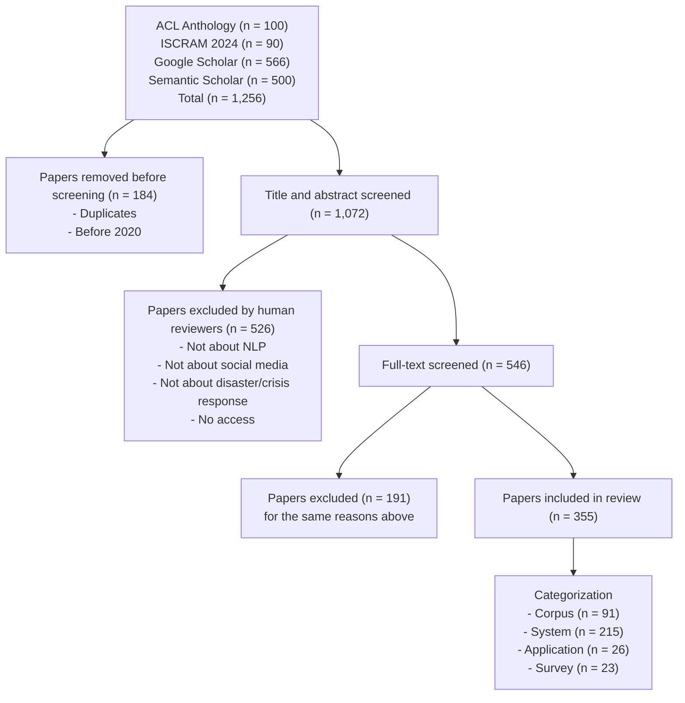

# Tapping into Social Media in Crisis: A Survey

William D. Lewis Haotian Zhu Keaton Strawn Fei Xia

University of Washington

{wlewis2, haz060, kstrawn, fxia}@uw.edu

## Abstract

When a crisis hits, people often turn to social media to ask for help, offer help, find out how others are doing, and decide what they should do. The growth of social media use during crises has been helpful to aid providers as well, giving them a nearly immediate read of the on-the-ground situation that they might not otherwise have. The amount of crisis-related content posted to social media over the past two decades has been explosive, which, in turn, has been a boon to Language Technology (LT) researchers. In this study, we conducted a systematic survey of 355 papers published in the past five years to better understand the expanding growth of LT as it is applied to crisis content, specifically focusing on corpora built over crisis social media data as well as systems and applications that have been developed on this content. We highlight the challenges and possible future directions of research in this space. Our goal is to engender interest in the LT field writ large, in particular in an area of study that can have dramatic impacts on people’s lives. Indeed, the use of LT in crisis response has already been shown to save people’s lives.

## 1 Introduction: Language Technologies and Crises

The aftermath of the Haitian Earthquake of 2010 saw the development and deployment of language technologies at a large and national scale for the first-time ever in a crisis. Most notably, language technologies were developed for a language that most in the NLP field had never heard of, and likewise most aid providers did not speak, namely, Haitian Kreyòl. At its peak, in the hours and days after the earthquake, first-responders in Haiti were receiving over 5,000 SMS messages per hour asking for help, over 80% of which were in Kreyòl. In response to the desperate need, a diverse group of individuals, notably driven by the Haitians themselves, developed and deployed technologies that could process this load, with a heavy reliance on crowdsourcing, the latter of which tapped into Haiti’s large world-wide diaspora. Although the language technologies developed at the time are archaic by today’s standards, these technologies allowed for the rapid triaging of the SMS messages (Meier, 2015), geolocation (mostly through crowdsourcing) (Munro, 2013), and even machine translation (Lewis, 2010). The infrastructure and language technologies developed for this crisis were credited with saving thousands of lives (Munro, 2013).

The Haitian earthquake, and the crisis it caused, are not unique. In fact, natural or human-caused crises happen regularly around the globe. Populations tend to use social media (and SMS) to report on how they are being affected. The data posted to social media have proven essential for providing and directing aid. Further, in notable examples and ongoing research, language technologies have proven, or can be shown, to be essential tools in the crisis preparedness and response toolkit.

## 1.1 What is a crisis?

A crisis can be described as any surprise event that adversely affects public health or disrupts the routines of daily life, puts (large) groups of people in danger, may require aid for affected populations, is often unpredictable, and typically requires rapid response (Castillo, 2016). Even so, emergency service providers generally have plans or strategies for dealing with crisis events (Akerkar, 2020). Olteanu et al. (2015b) and Castillo (2016) describe the two principal super-types of disasters: natural and human-induced (anthropogenic), with meteorological, hydrological, geophysical, etc., all being natural, and shootings, bombings, wars, derailments, etc., all falling under human-induced. To see the full list of categories from Castillo (2016), see Table 1 in Appendix A.

## 1.2 What are the research questions?

In this paper, we conduct a systematic survey of the literature on language technologies as they are applied to social media and crises. To our knowledge, this is the most extensive and thorough survey of its kind in this area: we reviewed over 350 papers published in the past five years on language technologies for crisis preparedness and response (what we call LT4CPR). The crucial research questions (RQs) we will address in this survey are as follows:

• RQ1: What kind of corpora are available for LT4CPR research? What are their properties?  
• RQ2: What kind of approaches have been proposed to build LT systems for CPR?  
• RQ3: What kinds of real-life crisis scenarios can LT systems potentially be applied to?  
• RQ4: What are the main challenges and future directions for LT4CPR research?

This survey summarizes the current breadth of language technologies in crisis preparedness and response and describes challenges and future directions for this interesting area of study.

## 2 Background and Related Work

There are a host of issues one must contend with when harvesting and processing data from social media platforms as relates to crises, much of which relies on language technologies: identifying the language and using language-specific tools for text or audio in a language (or relevant multilingual models); identifying named entities of various types within a text; identifying location information, including fine-grained mentions; extracting timeline information to provide a step-by-step view of a crisis as it unfolds; analyzing the sentiment or stance of affected populations; determining whether messages are relevant to the crisis at hand, and if so, what urgency they represent (i.e., triage); filtering out irrelevant content, such as misinformation or SPAM, or even disinformation; and, producing a summary of ongoing events for aid providers or government bodies (i.e., a situation report, or sitrep). All of the above rely on, or would benefit significantly from, the use of language technologies. Crucially, given the millions of users on social media platforms, information can be harvested to identify the need on the ground, summarize the extent of a disaster locally, and also direct aid.

The birth of the multidisciplinary field of Crisis Informatics (Hagar, 2010, 2014; Palen and Anderson, 2016) saw the first forays into the use of language technologies in crisis response, focused primarily on disaster warning, response and recovery. A notable (and likely first) example of social media use in crisis was on Twitter, where users reported localized information regarding the San Diego firestorm of 2007 (Sutton et al., 2008). However, it was not until Haiti in 2010 that the use of technologies for identifying and meeting local need demonstrated the potential for language technological solutions (albeit across SMS messages, not social media directly) (Munro, 2013). In the UK floods of 2012 it was noted that location information was discernible from tweets (Meier, 2015). This was followed by Typhoon Pablo in the Philippines in the same year where tweets were systematically analyzed and categorized (Liu, 2014). However, the first Twitter classifier was developed after the Oklahoma tornadoes of 2013. This classifier, which was deployed during the crisis, and used to classify the severity of need for directing aid appropriately (Meier, 2015).

Imran et al. (2015) is the first survey that we are aware of in the Crisis Informatics space as it relates to social media. The survey was not entirely focused on language technologies per se, but, rather, reviewed the academic literature that described the extraction of crisis-relevant content from social media, including monitoring, event detection, social media content harvesting, etc. Their survey focused on NLP as a pre-processing step, i.e., to filter out irrelevant content, with a very limited review of NLP used in tweet classification. Sun et al. (2020) reviewed the literature on applying AI in the disaster management life-cycle, thoroughly describing the life-cycle and how AI might apply, yet they gave very little background on NLP in that context. Vongkusolkit and and (2021) also surveyed the literature from the perspective of disaster management, giving a thorough survey of papers on social media for situational awareness, with extensive background on NLP as applied to classifying and processing social media, including content, sentiment, user, and temporal classification.

Müller et al. (2024) restricted their paper search to those focused on tools, their potential utility in crisis management, and recommendations for future work on adapting the technology better to the target audience of crisis management decision makers. Müller et al. (2024) is one of two papers that applied PRISMA (Tricco et al., 2018) as their paper selection methodology. The second survey paper that applied PRISMA was Edlim et al. (2024), which focused on the use of Twitter for urgency detection during crises, specifically highlighting the literature on the Indonesian language (thus quite useful for tool discovery in the context of lowerresource languages that may be affected by crises).

flowchart

Figure 1: Flowchart of paper selection following PRISMA guidelines (Tricco et al., 2018).

## 3 Paper Selection

Our systematic review follows the Preferred Reporting Items for Systematic Reviews and Meta-Analyses (PRISMA) guidelines (Tricco et al., 2018). We gathered a large number of relevant English articles published in the past five years, from January 2020 to December 2024. The process is illustrated in Figure 1, as explained below.

## 3.1 Inclusion criteria

For a study to be included in our survey, it must meet two criteria: first, it must directly pertain to a rapidly developing crisis such as natural disasters (e.g., earthquake) or the onset of pandemics (e.g., COVID-19) or human-induced crises (e.g., breakout of a war); thus, studies on long-term crises such as drug wars and the opioid epidemic in the USA are excluded. Second, the study must either build a corpus consisting of social media data produced during a crisis or build NLP systems using social media data that aim to help crisis response.

## 3.2 The initial set of papers

Our search strategy employed three groups of keywords: (a) social media, (b) crisis OR disaster, (c) Natural Language Processing (NLP) OR Machine Learning (ML) OR Language Technology (LT) OR Artificial Intelligence (AI). These groups were combined to conduct searches across three sites: the

ACL Anthology1, Google Scholar2, and Semantic Scholar3. Furthermore, we included relevant publications from CrisisNLP and ISCRAM. We found 1,256 papers from these five sources combined. After removing duplicates and papers published before 2020, there were 1,072 left, which formed our initial set of papers.

## 3.3 Two stages of screening

Although search queries were based on the inclusion criteria, many papers in the initial set failed to meet these criteria. We filtered out unqualified papers in two stages. First, four NLP graduate students manually checked the title and abstract of all papers in the initial set and removed any unqualified ones. Second, we conducted a full-text screening of the 546 remaining papers and categorized them into four categories based on their foci: (1) corpus construction papers, which focus on building a dataset using social media messages during a crisis, (2) system development papers, which focus on building NLP systems that could be applied to some crisis situations, (3) application papers, which focus on building applications for a real crisis situation, and (4) survey papers. During the full-text screening, we recorded information (e.g., the modality of a corpus), which would be needed for the various statistics reported in our study.

Ultimately, 355 articles were kept for our survey, and their distribution by year of publication and crisis type is shown in Figure 2. In the next three sections, we will discuss the first three types of papers as the 23 survey papers in our final set either concentrated on some specific NLP task (e.g., event detection (Edlim et al., 2024)), had little to no coverage of NLP (e.g., Sun et al., 2020), or were published a few years ago and thus do not capture most recent progress in this field (e.g., Baro and Palaoag, 2020).

## 4 Corpus Construction

Out of the 355 papers in our final collection, 91 (25.6%) focus on corpus construction (“corpus papers”). In this section, we discuss the properties of the corpora with respect to modality, language, social media platform, and annotation type (see Figures 3-7). Each figure in this section has two pie charts: the left shows the numbers of corpora presented in the corpora papers, and the right shows the numbers of corpora used by the system papers.

bar_stacked

| Year | Natural | Human-induced | Health | Multiple Crises | N/A |
| --- | --- | --- | --- | --- | --- |
| 2020 | 27 | ~4 | 24 | 12 | 6 |
| 2021 | 23 | -1 | 26 | 21 | 12 |
| 2022 | 27 | -2 | 19 | 16 | 11 |
| 2023 | 24 | 6 | 9 | 12 | 5 |
| 2024 | 14 | 7 | 14 | 17 | 16 |

Figure 2: The papers included in this survey by year and crisis type. The grey bar, N/A, means the crisis type cannot be easily inferred from the writing of the papers.

pie

| Category | Corpus Papers (sum=91) | System Papers (sum=215) |
| --- | --- | --- |
| Natural | 32 | 66 |
| Health | 36 | 48 |
| Multiple Crises | 14 | 58 |
| Human-induced | 7 | 13 |
| Not Sure | 2 | 30 |

Figure 3: Number of corpora by crisis type as in (a) corpus papers or (b) system papers

The full list of corpus papers and the basic information on the corresponding corpora are in Tables 2-6 in Appendix B. In addition, some wellknown datasets released before 2020 are in Table 7 in the same appendix.

## 4.1 Modalities, languages, and platforms

Most of the corpora described in the corpus papers are text only (81), English only (47), and collected from Twitter alone (63).

Crisis type: Castillo (2016) defined two major categories of crises: natural vs. human-induced (see Table 1). As there was a surge of studies on COVID-19, we added a third category, healthrelated crisis, when reporting the number of corpora by crisis type. Figure 3 shows the distribution of corpora over three crisis categories. Some corpora include data from multiple types of crises.

pie

| Category | Corpus Papers (sum=91) | System Papers (sum=215) |
| --- | --- | --- |
| N/A | 6 | 10 |
| Multilingual | 20 | 25 |
| Indonesian | 1 | 2 |
| Ukrainian | 2 | — |
| Arabic | 4 | 5 |
| French | 5 | — |
| Chinese | 6 | 10 |
| English Only | 47 | 155 |
| Japanese | — | 1 |
| Malay | — | 2 |
| German | — | 2 |
| Italian | — | 1 |
| Tamil | — | 1 |
| Finnish | — | 1 |

Figure 4: Number of corpora by language.

  
Figure 5: Corpora by modality. There are 7 system papers that did not indicate the modality of the corpora.

Languages: Figure 4 shows languages of the corpora in our study. Of the 89 corpora that include text, 47 (52.8%) are English only. The next largest percentage is for multilingual corpora, with most of these including English in addition to other languages. Good examples of robustly multilingual corpora include Chowdhury et al. (2020), Imran et al. (2021a), and Abdul-Mageed et al. (2021). The latter two are particularly noteworthy with 67 and 100+ languages represented, respectively.

Modality: As shown in Figure 5(a), the large majority (81) of the 91 newly created corpora consist of text only; 2 corpora (Hassan et al., 2020; Alam et al., 2022) are images only; 6 include both text and images; 2 consist of more than two modalities (Yuan et al., 2021; Sosa and Sharoff, 2022).

pie

| Category | Corpus Papers (sum=91) | System Papers (sum=215) |
| --- | --- | --- |
| Twitter/X | 63 | 138 |
| Multiple Sources | 14 | 45 |
| Telegram | 5 | — |
| Facebook | 1 | — |
| Youtube | 1 | 1 |
| Reddit | 1 | 2 |
| Weibo | 5 | 7 |
| Flickr | — | 2 |
| N/A | — | 20 |

Figure 6: Number of corpora by social media platforms. N/A means the platform information is unspecified.

Social Media Platforms: Figure 6 shows the sources of the data in the corpora. Most of the corpora, 63 (69.2%), were built from Twitter social media messages. This is because of the (historically) widespread use of the platform, especially for sharing microblog posts most useful for disaster situations. Additionally, Twitter is often used in research studies because its data was easy to obtain and distribute (see discussion in §7.4).

## 4.2 Types of annotation

The corpora papers vary with respect to the annotation types used over raw social media data. We group the annotation types into 6 broad categories, whose distributions are shown in Figure 7.

pie

| Category | Corpus Papers (sum=91) | System Papers (sum=215) |
| --- | --- | --- |
| Labels | 54 | 89 |
| Misc. | 13 | 38 |
| Entity/Relation/Event | 7 | 18 |
| Geo-location | 6 | 6 |
| Summary | 1 | 3 |
| N/A | 10 | 61 |

Figure 7: Number of corpora by annotation type. N/A means no additional annotation (A0).

(A0) No annotation: 10 of 91 corpora are a collection of social media messages without additional annotation. For instance, Epic (Liu et al., 2020) is a large-scale epidemic corpus containing 20M tweets crawled from 2006 to 2020, including tweets related to three diseases (Ebola, Cholera and Swine Flu) and 6 global epidemic outbreaks. Such corpora are valuable resources for LT4CPR research even without additional annotations.  
(A1) Labels: Out of 91 corpora, 54 include certain class labels. The labels can pertain to (a) Relevance and urgency of messages (e.g., (Enzo et al., 2022; Kayi et al., 2020)), (b) Information source and reliability (e.g., (Ahmed et al., 2020; Sosa and Sharoff, 2022)), (c) damage type and severity (e.g., (Li et al., 2020; Alam et al., 2022)), and (d) sentiment, stance (e.g., (Shestakov and Zaghouani, 2024; Vaid et al., 2022)), etc.  
(A2) Entities, relations, and events: 7 out of 91 corpora annotated disaster-related entities, relations, or events; such annotations can be used to train emergent event detection systems (e.g., (Hamoui et al., 2020; Fakhouri et al., 2024)).  
(A3) Geo-location: For applications such as assisting rescue efforts, geo-location needs to be finegrained to the level of geo-coordinate or physical address (e.g., (Chen et al., 2022; Faghihi et al., 2022)). In contrast, for applications such as monitoring public opinions during a pandemic, geolocation can be at the level of city, state, or even country (Arapostathis, 2021).  
(A4) Summary and timelines: Informative reports that aggregate information from social media messages can be invaluable during crises. However, creating a corpus of such reports could require tremendous amount of human effort. Only two corpora in our survey do so: Vitiugin and Castillo (2022) collected crisis-related tweets and annotated

pie

| Category | Value |
| --- | --- |
| Classification | 202 |
| NER, RE, Event | 40 |
| Geo-location | 11 |
| Summarization | 11 |
| Topic Modeling | 19 |
| Misc | 9 |

Figure 8: Number of systems by NLP tasks.

all summaries of factual claims in the messages; CrisisLTSum (Faghihi et al., 2022) contains 1,000 crisis event timelines across four domains including wildfires, local fires, traffic and storms.

(A5) Miscellaneous: 9 corpora include annotations such as propagation networks (Haouari et al., 2021), situation frames and morphosyntactic annotations (Tracey and Strassel, 2020).

Notably, while parallel datasets in general domains (e.g., news and law proceedings) are common and have been used to build MT systems in the past three decades, corpora consisting of translations of social media data are rare and none of the 20 multilingual corpora in Figure 4(a) include parallel social media data.

## 4.3 Annotation methods

For all corpora, social media messages are obtained by crawling the Internet, calling APIs offered by social media platforms, or leveraging existing datasets. The raw data are often preprocessed using filtering, removing noisy instances, etc.

Among the annotated corpora in our survey, annotation was performed manually for roughly two thirds of corpora through crowd-sourcing platforms like Amazon Mechanical Turk (e.g., (Sosea et al., 2022)) or by in-house annotators (e.g., (Sarkar et al., 2020)). The remaining were annotated automatically through associated metadata such as Twitter’s location features (e.g., (Qazi et al., 2020)) or by running NLP systems such as language I.D. (e.g., (Sosa and Sharoff, 2022)).

## 5 NLP System Development

Of 355 papers included in this survey, 215 (60.6%) focus on system development ("system papers").

## 5.1 NLP tasks

Despite the large number of system papers, they cover only a small number of NLP tasks, as shown

in Figure 8.4

(T1) Classification: This group includes classification tasks such as emergency detection (e.g., (Restrepo-Estrada et al., 2018; Gialampoukidis et al., 2021)), misinformation detection (e.g., (Apostol et al., 2023; Naeem et al., 2024)), and disaster type classification (e.g., (Lever and Arcucci, 2022; Zhang et al., 2024a)). 202 out of 292 systems (69.2%) fall into this category.  
(T2) Entity, relation, and event: This group includes named entity recognition (e.g., (Lai et al., 2022; Suleman et al., 2023)), relation extraction, and event extraction (e.g., (Alam et al., 2019; Wang et al., 2024a)). 40 systems belong to this category.  
(T3) Geo-location: This includes Geo-tagging and Location Mention Recognition (LMR) (e.g., (Essam et al., 2021; Suwaileh et al., 2022)). 11 systems belong to this group.  
(T4) Summarization: There are 11 systems on summarization, including timeline summarization (e.g., (Khatoon et al., 2021)).  
(T5) Topic modeling: 19 systems are on topic modeling (e.g., (Bukar et al., 2022; Zhang et al., 2024b)), an important task during crisis situations.  
(T6) Other tasks: There are 9 papers on various topics such as social network detection (e.g., (Momin and Kays, 2023)) and visualization (e.g., (Ma et al., 2022)).

## 5.2 Methodology

Among the 6 groups of tasks outlined above, T1, T2 and T5 have been well-studied in the NLP field; most system papers we surveyed simply applied the same methodology to the crisis domain. For T3, in order to identify Geo-locations, some studies (e.g., (Apostol et al., 2023; Ferner et al., 2020)) used external knowledge to map location names to physical addresses while others (e.g., (Belcastro et al., 2021)) took advantage of the geo-tags of content senders. For T4, summarization in the crisis domain can be very complex, as one would need to process on-going, noisy, often conflicting information from multiple information resources and/or modalities potentially in multiple languages. The summarization task often involves message classification and clustering, followed by crisis timeline extraction before a summary is generated (e.g., (Faghihi et al., 2022)).

bar_stacked

| Year | Rule-based | Statistical | NN-based | Others |
| --- | --- | --- | --- | --- |
| 2020 | ~3 | 26 | 36 | 24 |
| 2021 | ~2 | 24 | 50 | 25 |
| 2022 | ~1 | 21 | 44 | 22 |
| 2023 | ~1 | 22 | 32 | 21 |
| 2024 | ~1 | 21 | 51 | 28 |

Figure 9: Number of systems by year and approach.

Due to space limits, we cannot explore the details of all system papers. We simply place them in four groups: rule-based, statistical methods such as Random Forest and SVM, neural network (NNbased) and others which include methods such as data augmentation. Figure 9 shows the number of systems and their approaches by year.5

## 5.3 Evaluation

Tasks in T1-T4 correspond to annotation types A1- A4, as discussed in §4.2; therefore, they can be evaluated with the corresponding corpora. As shown in Figure 4(b)-6(b), the corpora used in the majority of system papers are English text from Twitter.

For T5-T6, because there are no labeled corpora serving as gold standards, the outputs (e.g., visualization of damaged regions) of those systems are rarely evaluated quantitatively.

## 6 Real-life Applications and Deployment

NLP systems can potentially be used to assist crisis management in many ways, such as message triaging for humanitarian organizations (Kozlowski et al., 2020b; Amer et al., 2024), emergent event detection (Suwaileh et al., 2023c; Simon et al., 2021), geo-location for rescue efforts and situational assessment (Khanal et al., 2022; Suwaileh et al., 2022), generation of situation reports and crisis maps (Vitiugin and Castillo, 2022; Yang et al., 2022), monitoring and analyzing public emotions and responses (Wang et al., 2024b; Sosea et al., 2022), and helping the public acquire/process information (Hossain et al., 2020; Brunila et al., 2021a).

However, there are only 26 application papers that describe systems that attempt to address the "application" of LT to real-life situations (e.g., to help aid providers). Of these, it is not clear how many have been adopted by the crisis community. This indicates a surprising gap given that one would assume that the system development work being carried out by LT researchers (described in §5) is intended to be used in actual crises.

## 7 Challenges and Future Directions

Our survey has shown that there has been a significant amount of work that has been done over just the past five years applying LT to crisis management. That said, there are still many challenges to be addressed. We highlight 6 primary challenges and possible future directions in this section.

## 7.1 Quality of social media corpora

There are many challenges in building large, highquality corpora for LT4CPR research. First, it can be difficult to gather large amounts of social media data from real crises due to factors such as paywalls, identifying the channels being used for a crisis (e.g., on Telegram, Reddit), the lack of public access to relevant content, etc. Second, social media data are noisy with misspellings, newly invented words, grammatical errors, etc., all of which complicate cleaning and annotation tasks (Derczynski et al., 2013). Third, social media data can contain inaccurate or misleading information, which is often reinforced (e.g., Starbird et al., 2014), and thus mis- and disinformation detection can be an important step for using such data (Hossain et al., 2020). Finally, social media users can be quite different from the general population and any analysis based on social media messages must take this fact into account, e.g., in order to understand the public’s reaction to, for example, a hurricane evacuation order (Roy et al., 2021; Li et al., 2022c).

## 7.2 Lack of multilinguality

Chowdhury et al. (2020) points out that "there are a lot of disaster-prone non-English speaking countries." Nothing could be truer: from 1995 to 2022, there were 11,360 natural disasters around the globe, an average of about 398 disasters per year (Tin et al., 2024). Ranking these disasters by death toll or number of injuries (descending), where we treat these figures as proxies for disaster severity, only two of the approximately 18 most severe disasters that occurred in these 17 years occurred in regions where English is an official language, namely India and Pakistan, and one which occurred in a region that considers English to be semi-official, namely Sri Lanka.6

Given that the bulk of injuries and lives lost occur where English is not spoken (as discerned from Tin et al., 2024), and that the bulk of corpora developed for LT4CPR are in English (see §4 and Appendix B), the value of resources created for non-English languages cannot be overstated, especially if these resources are intended for real-world use. Tools take a cue from available corpora and §5 shows the same English-bias. There is value in working on English; yet we miss the boat by not working on other languages too.

A related issue is the surprising gap in Machine Translation research on crisis-related social media: in our search over the past five years, only one paper focused on the use or development of MT (Amer et al., 2023). 7 If the preponderance of need is in non-English languages, and the bulk of the work in LT4CPR is on English, MT could be used as a "connective" technology, e.g., translating data from affected languages into English for further processing.8

That said, this multilingual deficiency might at least be partly addressed by the growing use of LLMs (e.g., GPT, LLaMa) and large multilingual models (e.g., XLM-RoBERTa) in this space.9 We found 8 papers using such models for crisis-related work, all from 2024. Although most of these

6That said, there are many regions of India, Pakistan and Sri Lanka where, although English has (semi-)official status, it is not widely spoken by those on the ground, indeed, by those most likely to be affected adversely by natural disasters.

7Two recent papers, Lankford and Way (2024); Roussis (2022) also address MT in crisis, specifically of COVID-19 related text, however, they do not cover social media, so we excluded them from our survey. Likewise, Anastasopoulos et al. (2020), although providing an n-way parallel corpus of COVID-related content across 38 languages, many of which are under-resourced and from the global south, was excluded because it is not focused on MT in the context of social media.

8It is easy to assume that the MT technology, having been widely commoditized by industrial MT providers, is a solved problem for many of the world’s languages. The main industry MT providers (Google, Microsoft, Amazon, Meta), however, combined cover less than 200 of the world’s 7,000+ languages. Further, it is not a given that the quality of an MT that has been shipped for any given language pair by any given provider is up to the task of supporting communication in crisis scenarios, most especially if the language is low-resource. The same issue extends to dialects of majority languages as well (see Bird, 2022 for related discussion). We feel that there is a significant research gap for MT in LT4CPR, specifically over social media content.

9As an example for MT tasks specifically, Hendy et al. (2023) shows that GPT models have caught up to, or even surpassed, the quality of existing commercial models for highresource languages.

articles focus on classification and summarization tasks using LLMs (and one on inference (Giaccaglia et al., 2024)), two do explore multilingual uses (Wang et al., 2024a; Sathvik et al., 2024).

## 7.3 Lack of multimodality

A recurring theme in a number of the system papers is the need for multimodal (image, text, audio, video) content. Applying LT techniques to multimodal content has garnered much interest in the field of late (e.g., (Salesky et al., 2024; Haralampieva et al., 2022; Hu et al., 2024)). Over 40 papers in our survey list the development of multimodal corpora or tools as relevant future directions for the field. This is motivated by the increased use of social media to post combinations of text,images and videos. However, the bulk of the research in LT4CPR thus far has been unimodal, specifically text-based. In fact, 161 of the systems papers (75%) in our survey focus solely on text, and most of the corpus papers are text-only (81 out of 91).

Some exceptions in the corpus space include CrisisMMD (Alam et al., 2018b), a text and image corpus collected from Twitter, consisting of 11,400 posts and 12,708 images, M-CATNAT (Farah et al., 2024), a text and image corpus consisting of 837 French tweets, two Weibo-based Chinese text and image corpora (Mohanty et al., 2021; Yan et al., 2024) and a Reddit dataset (Giaccaglia et al., 2024), which consists of 838 posts and 35,551 images extracted from video frames.

CrisisMMD, being the first multimodal dataset in the crisis space, has been the focus of some recent studies and systems: Giaccaglia et al. (2024), Shetty et al. (2024), Giri and Deepak (2023), Kotha et al. (2022), Liang et al. (2022), and Abavisani et al. (2020) all classify crisis-related social media data jointly across both text and image data. In the case of Giaccaglia et al. (2024), the authors include a second classification task over Reddit text and video content using an LLM (specifically LLaVa (Liu et al., 2023))

The existing multimodal work is promising, but additional and much larger, annotated multimodal crisis-focused corpora are needed to promote continued research in this space.

## 7.4 Lack of diversity in social media platforms

The data found in the corpora we surveyed is overwhelmingly from Twitter/X, and the bulk of the systems used Twitter data as well. Twitter has been the focus for so long because it was the go-to in the early days of Crisis Informatics (e.g., (Sutton et al., 2008; Hughes and Palen, 2010; Vieweg et al., 2010)), and this trend has clearly continued.

The hyperfocus on Twitter is an issue because it ignores the vast diversity of social media platforms, some much more heavily than Twitter, e.g., Tiktok. Also, after Twitter’s acquisition and shift to X, the resulting changes in policies, costs, and algorithms have driven users to flee the platform in favor of others. Thus, it will become increasingly important for researchers to acquire data from other platforms, both mainstream (e.g., Youtube, Tiktok), and alternative (e.g., Telegram, Bluesky).10

## 7.5 Lack of diversity in annotation types and NLP tasks

As shown in Figures 7-8, most of the existing corpora and NLP systems focus on three types of annotation or output: class labels, entities/relations/events, and location mentions/geolocations. More studies are needed on other types of annotation or output, which might require more extensive exploration of the needs of aid providers, emergency managers, etc. (see §7.6). Of likely benefit to the crisis community would be more work on tasks such as misinformation detection (e.g., (Starbird et al., 2014; Hossain et al., 2020)), timeline extraction (e.g., (Faghihi et al., 2022))11, casualty estimation (e.g., (Wang et al., 2024a)), summarization (e.g., (Vitiugin and Castillo, 2022)), text simplification (e.g., (Temnikova, 2012; Horiguchi et al., 2024)), visualization (e.g., (Murakami et al., 2020)), or even automated generation of situation reports (e.g., (Wang et al., 2024a)). These would vastly increase the utility of LT for aid providers and others in real-world settings. Further, as noted in §7.2, MT research in the crisis space is virtually non-existent as applied to social media.

## 7.6 Lack of engagement with the crisis community

Lewis et al. (2011) describes what they call a Crisis MT Cookbook, effectively a strategy for applying MT to future crisis events, using the Haitian crisis of 2010 as a guide. There are two crucial elements to this cookbook: (1) the content that would be most useful in crisis situations, and (2) the infrastructure to support relief workers.

As noted in §4, it could be argued that the data collected for developing corpora in the crisis domain are the content that would be useful for developing tools to battle future crises. They consist of real data from real users involved in real crises.

The next step is trickier: building the tools and infrastructure that would actually be used by relief workers, aid providers, NGOs, emergency managers, local communities, etc. What do these consumers need? In other words, what does the infrastructure that they might use look like? Would the systems described in the papers we surveyed (see §5) satisfy their need? It is clear that some of the authors of the papers reviewed in this survey have engaged directly with the crisis community (or work there themselves), as evidenced by the applications described in §6. And some have engaged with individuals who work in emergency response directly, e.g., Vitiugin and Castillo (2022), who used emergency management domain experts to review systems’ output. But, as a whole, how much of our infrastructural work thus far could be directly consumed in times of crisis? How much of our work would be accepted as useful by the consumers described above?

We believe that engagement beyond the language technology community is crucial if we want to see the corpora and tools we have developed used outside the lab. We recommend and encourage collaborations between LT researchers and those working in the crisis response space or with representatives from communities who might be affected by crises, such as regional and local governing bodies, language communities, etc. A holistic approach to involvement would include organizing joint workshops and conferences between those working on or in crises and language technologies, e.g., LT4CPR workshops, such as the one held at George Mason University in the summer of 2023; submitting to and participating in existing crisis and crisis response conferences and workshops, e.g., Information Systems for Crisis Response and Management (ISCRAM); engagement with NGOs and other organizations who regularly work in crises or provide services (such as translation, medical or logistical support, etc.) in response to crises, e.g., CLEAR Global, Doctors without Borders, the Red Cross etc.; and participation in conferences in other areas of computer science, such as HCI, that regularly engage in crisis informatics or related disciplines, e.g., SIGCHI.

## 8 Conclusion

In reviewing the hundreds of papers for this survey, it was obvious throughout almost all of them that the work was being done with good intent: most papers spoke directly to the need to provide aid in crisis situations, and many authors highlighted how their work could help. It was clear that the authors were doing their work with an eye on the greater good. This is laudable and utterly inspiring. In fact, it makes us proud to be LT researchers.

That said, good intentions cannot operate in a vacuum. An important question must be asked: is the work being done for any particular task being done based on perceived need, or being done based on actual need? If the former, then that disconnect might mean that the work we are doing, no matter how inspiring, may not be consumed by those we think might need it most. It does not diminish the work being done, but it does mean that our lofty aspirations might not be met.

The solution is simple: we should engage with the broader crisis community, e.g., aid providers, NGOs, government bodies, affected communities (including language communities), crisis informatics researchers, crisis or disaster managers (including those operating in a local theater), and any others who engage in crisis response work. This is not necessarily something each individual member of our research community would need to or should take on, but rather the LT community writ large, specifically those who wish to take on the daunting tasks of creating LT4CPR.

The mere fact that there a few hundred papers written over the past five years in the LT4CPR space (per Appendix B and Figure 2) speaks volumes. LT4CPR is not just a passing fad nor some fancy new algorithm: those of us involved are genuinely interested, as a field, in improving the lives of others; indeed, as witnessed so many years ago in Haiti, in saving the lives of others.

We hope our survey will generate even more interest across the language technology disciplines in LT4CPR and that it will offer suggestions of differing research paths for those already involved. There is much that has already been done. But there is also so much more that we can do.

## Limitations

This survey included only papers in English published in the five years of 2020-2024, and thus may have missed studies published in other languages or outside this time period.

Due to the large number of papers in the initial set, most papers were manually checked by only one annotator in each stage of screening; thus, annotation errors or inconsistencies are inevitable.

Finally, due to page limits for submission, while 355 papers are included in this survey from which we gathered our statistics, only a small subset of them are discussed individually in our paper.

## Ethical Considerations

All the papers covered in our survey are publicly available. The two-stage screening process was done by researchers on our team. We are not aware of any ethical issues that arose while conducting our work.

## Acknowledgments

This study was funded by the National Science Foundation (Grant No. CNS-2346335). We want to thank the three graduate students at the University of Washington (Gaby Corona Garza, Ju-Hui Chen and Mohamed Elkamhawy) for gathering and annotating the relevant papers. We are also grateful for the inspiring and instructive discussions with Antonios Anastasopoulos and Belu Ticona from George Mason University and Steven Bird and Angelina Aquino from Charles Darwin University. The comments and suggestions made by all the anonymous reviewers and meta-reviewers were enormously useful and helped the paper come together into its current form. Lastly, we are indebted to the students from the Spring 2025 LT4CPR seminar at the University of Washington for all of the great discussions on the use of LT4CPR throughout the term and the helpful and timely input on this paper (Priyam Basu, Melody Bechler, Jose Cols, Chelsea Kendrick, Vanesa Marar, Ije Osakwe, Yongsin Park, Benjamin Pong, Natasha Schimka and Jen Wilson).

## References

Mahdi Abavisani, Liwei Wu, Shengli Hu, Joel R. Tetreault, and Alejandro Jaimes. 2020. Multimodal categorization of crisis events in social media. CoRR, abs/2004.04917.

Muhammad Abdul-Mageed, AbdelRahim Elmadany, El Moatez Billah Nagoudi, Dinesh Pabbi, Kunal Verma, and Rannie Lin. 2021. Mega-COV: A billionscale dataset of 100+ languages for COVID-19. In Proceedings ofthe 16th Conference ofthe European Chapter of the Association for Computational Linguistics: Main Volume, pages 3402–3420, Online. Association for Computational Linguistics.  
Naseem Ahmed, Tooba Shahbaz, Asma Shamim, Kiran Shafiq Khan, Samreen Hussain, and Asad Usman. 2020. The covid-19 infodemic: A quantitative analysis through facebook. Cureus, 12.  
Rajendra Akerkar. 2020. Big Data in Emergency Management: Exploitation Techniques for Social and Mobile Data. Springer Nature, Cham, Switzerland.  
Firoj Alam, Tanvirul Alam, Md. Arid Hasan, Abul Hasnat, Muhammad Imran, and Ferda Ofli. 2022. MEDIC: A Multi-Task Learning Dataset for Disaster Image Classification. Neural Computing and Applications, 35:2609–2632.  
Firoj Alam, Shafiq Joty, and Muhammad Imran. 2018a. Domain adaptation with adversarial training and graph embeddings. Preprint, arXiv:1805.05151.  
Firoj Alam, Ferda Ofli, and Muhammad Imran. 2018b. CrisisMMD: Multimodal Twitter Datasets from Natural Disasters. In Proceedings of the 12th International AAAI Conference on Web and Social Media (ICWSM).  
Firoj Alam, Ferda Ofli, and Muhammad Imran. 2019. Descriptive and visual summaries of disaster events using artificial intelligence techniques: case studies of hurricanes harvey, irma, and maria. Behaviour & Information Technology, 39:288 – 318.  
Firoj Alam, Ferda Ofli, Muhammad Imran, Tanvirul Alam, and Umair Qazi. 2020. Deep learning benchmarks and datasets for social media image classification for disaster response. In 2020 IEEE/ACM International Conference on Advances in Social Networks Analysis and Mining (ASONAM), pages 151–158.  
Firoj Alam, Ferda Ofli, Muhammad Imran, and Michael Aupetit. 2018c. A Twitter Tale of Three Hurricanes: Harvey, Irma, and Maria. Proceedings ofISCRAM.  
Firoj Alam, Umer Qazi, Muhammad Imran, and Ferda Ofli. 2021a. HumAID: Human-Annotated Disaster Incidents Data from Twitter with Deep Learning Benchmarks. In Proceedings of the International AAAI Conference on Web and Social Media, volume 15, pages 933–942.  
Firoj Alam, Hassan Sajjad, Muhammad Imran, and Ferda Ofli. 2021b. CrisisBench: Benchmarking Crisis-related Social Media Datasets for Humanitarian Information Processing. In Proceedings of the International AAAI Conference on Web and Social Media, volume 15, pages 923–932.  
Humaid Abdulla Alhammadi. 2022. Rit using machine learning in disaster tweets classification using machine learning in disaster tweets classification.  
Alaa Alharbi and Mark Lee. 2019. Crisis detection from arabic tweets.  
Alaa Alharbi and Mark Lee. 2021. Kawarith: an Arabic Twitter corpus for crisis events. In Proceedings ofthe Sixth Arabic Natural Language Processing Workshop, pages 42–52, Kyiv, Ukraine (Virtual). Association for Computational Linguistics.  
Shareefa Al Amer, Mark Lee, and Phillip Smith. 2023. Cross-lingual Classification of Crisis-related Tweets Using Machine Translation. In Proceedings of Recent Advances in Natural Language Processing, pages 22–31.  
Shareefa Al Amer, Mark Lee, and Phillip Smith. 2024. Adopting ensemble learning for cross-lingual classification of crisis-related text on social media. In Proceedings of the The Seventh Workshop on Technologiesfor Machine Translation ofLow-Resource Languages (LoResMT 2024), pages 159–165.  
Antonios Anastasopoulos, Alessandro Cattelan, Zi Yi Dou, Marcello Federico, Christian Federman, Dmitriy Genzel, Francisco Guzmán, Junjie Hu, Macduff Hughes, Philipp Koehn, Rosie Lazar, Will Lewis, Graham Neubig, Mengmeng Niu, Alp Öktem, Eric Paquin, Grace Tang, and Sylwia Tur. 2020. TICO 19: the Translation initiative for COvid-19. In NLP COVID-19 Workshop, Online.  
Sanket Andhale, Pratik Mane, Mandar Vaingankar, Deepak Karia, and K. T. Talele. 2021. Twitter sentiment analysis for covid-19. In 2021 International Conference on Communication information and Computing Technology (ICCICT), pages 1–12.  
Elena-Simona Apostol, Ciprian-Octavian Truica, and˘ Adrian Paschke. 2023. Contcommrtd: A distributed content-based misinformation-aware community detection system for real-time disaster reporting. Preprint, arXiv:2301.12984.  
S.G. Arapostathis. 2021. A methodology for automatic acquisition of flood-event management information from social media: the flood in messinia, south greece, 2016. Information Systems Frontiers, 23:1127–1144.  
Hossein Azarpanah, Mohsen Farhadloo, and Rustam M. Vahidov. 2022. Crisis communications on social media: Insights from canadian officials twitter presence during covid-19 pandemic. In Hawaii International Conference on System Sciences.  
Rufo Baro and Thelma Palaoag. 2020. Disaster sentiment analysis: Addressing the challenges of decisionmakers in visualizing netizen tweets. IOP Conference Series: Materials Science and Engineering, 803:012039.  
Jason Baumgartner, Savvas Zannettou, Megan Squire, and Jeremy Blackburn. 2020. The pushshift telegram dataset. Preprint, arXiv:2001.08438.  
L. Belcastro, Fabrizio Marozzo, Domenico Talia, Paolo Trunfio, Francesco Branda, Themis Palpanas, and Muhammad Imran. 2021. Using social media for sub-event detection during disasters. Journal ofBig Data, 8.  
Steven Bird. 2022. Local languages, third spaces, and other high-resource scenarios. In Proceedings ofthe 60th Annual Meeting ofthe Associationfor Computational Linguistics (Volume 1: Long Papers), pages 7817–7829, Online. Association for Computational Linguistics.  
S. Boon-Itt and Y. Skunkan. 2020. Public perception of the covid-19 pandemic on twitter: Sentiment analysis and topic modeling study. JMIR Public Health and Surveillance, 6(4):e21978.  
Ryan Boston, Naeem Seliya, and Mounika Vanamala. 2024. Analyzing tweets for disaster prediction. 2024 IEEE International Conference on Electro Information Technology (eIT), pages 439–443.  
Mikael Brunila, Rosie Zhao, Andrei Mircea, Sam Lum ley, and Renee Sieber. 2021a. Bridging the gap between supervised classification and unsupervised topic modelling for social-media assisted crisis management. In Proceedings ofthe Second Workshop on Domain Adaptationfor NLP, Kyiv, Ukraine.  
Mikael Brunila, Rosie Zhao, Andrei Mircea, Sam Lumley, and Renee Sieber. 2021b. Bridging the gap between supervised classification and unsupervised topic modelling for social-media assisted crisis management. In Proceedings of the Second Workshop on Domain Adaptationfor NLP, pages 33–49, Kyiv, Ukraine. Association for Computational Linguistics.  
Umar Ali Bukar, Fatimah Sidi, Marzanah A. Jabar, Rozi Nor Haizan Binti Nor, Salfarina Abdullah, and Iskandar Ishak. 2022. A multistage analysis of predicting public resilience of impactful social media crisis communication in flooding emergencies. IEEE Access, 10:57266–57282.  
Carlos Castillo. 2016. Big Crisis Data. Cambridge University Press, New York.  
Pei Chen, Haotian Xu, Cheng Zhang, and Ruihong Huang. 2022. Crossroads, buildings and neighborhoods: A dataset for fine-grained location recognition. In Proceedings of the 2022 Conference of the North American Chapter ofthe Associationfor Computational Linguistics: Human Language Technologies, pages 3329–3339, Seattle, United States. Association for Computational Linguistics.  
Shi Chen, Lina Zhou, Yunya Song, Qian Xu, Ping Wang, Kanlun Wang, Yaorong Ge, and Daniel Janies. 2021. A novel machine learning framework for comparison of viral covid-19-related sina weibo and twitter posts: Workflow development and content analysis. J Med Internet Res, 23.  
Shi Chen, Lina Zhou, Yunya Song, Qian Xu, Ping Wang, Kanlun Wang, Yaorong Ge, and Daniel A. Janies. 2020. A novel machine learning framework for comparison of viral covid-19–related sina weibo and twitter posts: Workflow development and content analysis. Journal ofMedical Internet Research, 23.  
Jishnu Ray Chowdhury, Cornelia Caragea, and Doina Caragea. 2020. Cross-lingual disaster-related multilabel tweet classification with manifold mixup. In Proceedings ofthe 58th Annual Meeting ofthe Association for Computational Linguistics: Student Research Workshop, pages 292—298, Online. Association for Computational Linguistics.  
Alfredo Cobo, Denis Parra, and Jaime Navón. 2015. Identifying relevant messages in a twitter-based citizen channel for natural disaster situations. In Proceedings of the 24th International Conference on World Wide Web, WWW ’15 Companion, page 1189–1194, New York, NY, USA. Association for Computing Machinery.  
Stefano Cresci, Maurizio Tesconi, Andrea Cimino, and Felice Dell’Orletta. 2015. A linguistically-driven approach to cross-event damage assessment of natural disasters from social media messages. In Proceedings ofthe 24th International Conference on World Wide Web, WWW ’15 Companion, page 1195–1200, New York, NY, USA. Association for Computing Machinery.  
Hassan Dashtian and Dhiraj Murthy. 2021. Cml-covid: A large-scale covid-19 twitter dataset with latent topics, sentiment and location information. Preprint, arXiv:2101.12202.  
Leon Derczynski, Alan Ritter, Sam Clark, and Kalina Bontcheva. 2013. Twitter Part-of-Speech Tagging for All: Overcoming Sparse and Noisy Data. In Proceedings ofthe International Conference on Recent Advances in Natural Language Processing (RANLP 2013), pages 198–206.  
Shrey Desai, Cornelia Caragea, and Junyi Jessy Li. 2020. Detecting perceived emotions in hurricane disasters. In Proceedings ofthe 58th Annual Meeting ofthe Association for Computational Linguistics, pages 5290– 5305, Online. Association for Computational Linguistics.  
Wahyu Dirgantara, Fairuz Iqbal Maulana, Subairi Subairi, and Rahman Arifuddin. 2024. The performance of machine learning model bernoulli naïve bayes, support vector machine, and logistic regression on covid-19 in indonesia using sentiment analysis. Techné : Jurnal Ilmiah Elektroteknika.  
F W Edlim, Gregorius Edo, Rangga Kurnia Putra Wiratama, Riyan Mahmudin, Andi Solihin, Amelia Devi Putri Ariyanto, and Diana Purwitasari. 2024. Urgency detection of events through twitter post: A research overview. 2024 International Conference on Electrical Engineering and Computer Science (ICECOS), pages 1–6.  
E Elakkiya, Rohit Bahadur Bista, and Chandan Shah. 2024. Deep learning approach for disaster tweet classification. 2024 15th International Conference on Computing Communication and Networking Technologies (ICCCNT), pages 1–5.  
Laurenti Enzo, Bourgon Nils, Farah Benamara, Mari Alda, Véronique Moriceau, and Courgeon Camille. 2022. Speech acts and communicative intentions for urgency detection. In Proceedings ofthe 11th Joint Conference on Lexical and Computational Semantics, pages 289–298, Seattle, Washington. Association for Computational Linguistics.  
Nader Essam, Abdullah Moussa, Khaled Elsayed, Sherif Abdou, Mohsen Rashwan, Shaheen Khatoon, Md Maruf Hasan, Amna Asif, and Majed Alshamari. 2021. Location analysis for arabic covid-19 twitter data using enhanced dialect identification models. Applied Sciences, 11.  
Hossein Rajaby Faghihi, Bashar Alhafni, Ke Zhang, Shihao Ran, Joel Tetreault, and Alejandro Jaimes. 2022. CrisisLTLSum: A benchmark for local crisis event timeline extraction and summarization. In Findings of the Association for Computational Linguistics: EMNLP 2022, pages 5455–5477, Abu Dhabi, United Arab Emirates. Association for Computational Linguistics.  
M. R. Faisal, I. Budiman, F. Abadi, M. Haekal, M. K. Delimayanti, and D. T. Nugrahadi. 2022. Using social media data to monitor natural disaster: A multi dimension convolutional neural network approach with word embedding. Jurnal RESTI (Rekayasa Sistem Dan Teknologi Informasi), 6(6):1037–1046.  
Hussam N. Fakhouri, Basim Alhadidi, Khalil Omar, Sharif Naser Makhadmeh, Faten Hamad, and Niveen Z. Halalsheh. 2024. Ai-driven solutions for social engineering attacks: Detection, prevention, and response. 2024 2nd International Conference on Cyber Resilience (ICCR), pages 1–8.  
Badreddine Farah, Omar El Bachyr, Guillaume Cleuziou, Anaïs Halftermeyer, Cécile Gracianne, Samuel Auclair, Adel Hafiane, and Raphaël Canals. 2024. M-CATNAT: A Multimodal dataset to analyze French tweets during natural disasters. In Pro ceedings ofthe 21st ISCRAM Conference, Münster, Germany.  
Selim Fekih, Nicolo’ Tamagnone, Benjamin Minixhofer, Ranjan Shrestha, Ximena Contla, Ewan Oglethorpe, and Navid Rekabsaz. 2022. HumSet: Dataset of multilingual information extraction and classification for humanitarian crises response. In Findings ofthe Associationfor Computational Linguistics: EMNLP 2022, pages 4379–4389, Abu Dhabi, United Arab Emirates. Association for Computational Linguistics.  
Shihui Feng and Alec Kirkley. 2020. Online geolocalized emotion across us cities during the covid crisis: Universality, policy response, and connection with local mobility. ArXiv, abs/2009.10461.  
Cornelia Ferner, Clemens Havas, Elisabeth Birnbacher, Stefan Wegenkittl, and Bernd Resch. 2020. Auto mated seeded latent dirichlet allocation for social media based event detection and mapping. Information, 11:376.  
Akash Kumar Gautam, Luv Misra, Ajit Kumar, Kush Misra, Shashwat Aggarwal, and Rajiv Ratn Shah. 2019. Multimodal analysis of disaster tweets. 2019 IEEE Fifth International Conference on Multimedia Big Data (BigMM), pages 94–103.  
Pablo Giaccaglia, Carlo A. Bono, and Barbara Pernici. 2024. Enhancing Emergency Post Classification through Image Information Amplification via Large Language Models. In 21st International Conference on Information Systemsfor Crisis Response and Man agement, ISCRAM 2024, Münster, Germany.  
Ilias Gialampoukidis, Stelios Andreadis, Stefanos Vrochidis, and Ioannis Kompatsiaris. 2021. Multimodal data fusion of social media and satellite images for emergency response and decision-making. In 2021 IEEE International Geoscience and Remote Sensing Symposium IGARSS, pages 228–231.  
Karnati Sai Venkata Giri and Gerard Deepak. 2023. A semantic ontology infused deep learning model for disaster tweet classification. Multim. Tools Appl., 83:62257–62285.  
Robert Grace. 2020. Crisis social media data labeled for storm-related information and toponym usage. Data in Brief, 30.  
Christine Hagar. 2010. Crisis informatics: Introduction. Bulletin ofthe American Societyfor Information Science and Technology, 36(5):10–12.  
Christine Hagar. 2014. Crisis informatics. Journal of Geography and Natural Disasters, 4(1).  
Btool Hamoui, Mourad Mars, and Khaled Almotairi. 2020. FloDusTA: Saudi tweets dataset for flood, dust storm, and traffic accident events. In Proceedings ofthe Twelfth Language Resources and Evaluation Conference, pages 1391–1396, Marseille, France. European Language Resources Association.  
Fatima Haouari, Maram Hasanain, Reem Suwaileh, and Tamer Elsayed. 2021. ArCOV-19: The first Arabic COVID-19 Twitter dataset with propagation networks. In Proceedings of the Sixth Arabic Natural Language Processing Workshop, pages 82–91, Kyiv, Ukraine (Virtual). Association for Computa tional Linguistics.  
Veneta Haralampieva, Ozan Caglayan, and Lucia Specia. 2022. Supervised Visual Attention for Simultaneousmultimodal Machine Translation. Journal of Artificial Intelligence Research, 74.  
Syed Zohaib Hassan, Kashif Ahmad, Steven Alexander Hicks, P. Halvorsen, Ala Al-Fuqaha, Nicola Conci, and M. Riegler. 2020. Visual sentiment analysis from disaster images in social media. Sensors (Basel, Switzerland), 22.  
Amr Hendy, Vikas Raunak Mohamed Gabr Hitokazu Matsushita Young Jin Kim Mohamed Afify Mohamed Abdelrehim, Amr Sharaf, and Hany Hassan Awadalla. 2023. How Good are GPT Models at Machine Translation? a Comprehensive Evaluation. arXiv:2302.09210.  
Sanjana V Herur, Shalini M, Vanshika Jain, and Mamatha H R. 2023. Simple yet efficient model for disaster related data detection. 2023 IEEE 2nd International Conference on Data, Decision and Systems (ICDDS), pages 1–6.  
Koki Horiguchi, Tomoyuki Kajiwara, Yuki Arase, and Takashi Ninomiya. 2024. Evaluation Dataset for Japanese Medical Text Simplification. In Proceedings ofthe 2024 Conference ofthe North American Chapter of the Association for Computational Linguistics: Human Language Technologies (Volume 4: Student Research Workshop), pages 219—225, Mexico City, Mexico. Association for Computational Linguistics.  
Tamanna Hossain, Robert L Logan Iv, Arjuna Ugarte, Yoshitomo Matsubara, Sean Young, and Sameer Singh. 2020. COVIDLies: Detecting COVID-19 Misinformation on Social Media. In Proceedings of the 1st Workshop on NLPfor COVID-19 (Part 2) at EMNLP 2020.  
Wenbo Hu, Yifan Xu, Yi Li, Weiyue Li, Zeyuan Chen, and Zhuowen Tu. 2024. Bliva: A simple multimodal llm for better handling of text-rich visual questions. Proceedings of the AAAI Conference on Artificial Intelligence, 38(3):2256–2264.  
Amanda Lee Hughes and Leysia Palen. 2010. Twitter adoption and use in mass convergence and emergency events. International Journal ofEmergency Management, 6(3-4).  
S. Höhn, S. Mauw, and N. Asher. 2022. Belelect: A new dataset for bias research from a “dark” platform. In Proceedings ofthe International AAAI Conference on Web and Social Media, volume 16, pages 1268–1274.  
Muhammad Imran, Carlos Castillo, Fernando Diaz, and Sarah Vieweg. 2015. Processing social media messages in mass emergency: A survey. ACM Comput. Surv., 47(4).  
Muhammad Imran, Shady Elbassuoni, Carlos Castillo, Fernando Diaz, and Patrick Meier. 2013a. Practical extraction of disaster-relevant information from social media. In Proceedings ofthe 22nd international conference on World Wide Web companion, pages 1021–1024. International World Wide Web Conferences Steering Committee.  
Muhammad Imran, Shady Mamoon Elbassuoni, Carlos Castillo, Fernando Diaz, and Patrick Meier. 2013b. Extracting information nuggets from disaster-related messages in social media. Proc. ofISCRAM, Baden-Baden, Germany.  
Muhammad Imran, Prasenjit Mitra, and Carlos Castillo. 2016. Twitter as a lifeline: Human-annotated Twitter corpora for NLP of crisis-related messages. In Proceedings of the Tenth International Conference on Language Resources and Evaluation (LREC‘16), pages 1638–1643, Portorož, Slovenia. European Language Resources Association (ELRA).  
Muhammad Imran, Umair Qazi, and Ferda Ofli. 2021a. Tbcov: Two billion multilingual covid-19 tweets with sentiment, entity, geo, and gender labels. arXiv:2110.03664.  
Muhammad Imran, Umair Qazi, and Ferda Ofli. 2021b. TBCOV: two billion multilingual COVID-19 tweets with sentiment, entity, geo, and gender labels. CoRR, abs/2110.03664.  
Shaunak Inamdar, Rishikesh Chapekar, Shilpa Gite, and Biswajeet Pradhan. 2023. Machine learning driven mental stress detection on reddit posts using natural language processing. Human-Centric Intelligent Systems, 3:80 – 91.  
Becky Inkster. 2021. Early warning signs of a mental health tsunami: A coordinated response to gather initial data insights from multiple digital services providers. Frontiers in Digital Health, 2.  
Gutti Gowri Jayasurya, Sanjay Kumar, Binod Kumar Singh, and Vinay Kumar. 2022. Analysis of public sentiment on covid-19 vaccination using twitter. IEEE Transactions on Computational Social Systems, 9:1101–1111.  
Asinthara K, Meghna Jayan, and Lija Jacob. 2023. Categorizing disaster tweets using learning based models for emergency crisis management. In 2023 9th International Conference on Advanced Computing and Communication Systems (ICACCS), volume 1, pages 1133–1138.  
Mahakprit Kaur, Taylor Cargill, Kevin Hui, Minh Vu, Nicola Luigi Bragazzi, and Jude Dzevela Kong. 2023. A novel approach for the early detection of medical resource demand surges during health care emergen cies: Infodemiology study of tweets. JMIR Formative Research, 8.  
Efsun Sarioglu Kayi, Linyong Nan, Bohan Qu, Mona T. Diab, and Kathleen McKeown. 2020. Detecting urgency status of crisis tweets: A transfer learning approach for low resource languages. In International Conference on Computational Linguistics.  
Temitope Kekere, Vukosi Marivate, and Marie J. Hat tingh. 2023. Exploring covid-19 public perceptions in south africa through sentiment analysis and topic modelling of twitter posts. The African Journal of Information and Communication (AJIC).  
Sarthak Khanal, Maria Traskowsky, and Doina Caragea. 2022. Identification of fine-grained location mentions in crisis tweets. In Proceedings of the Thirteenth Language Resources and Evaluation Confer ence, pages 7164–7173, Marseille, France. European Language Resources Association.  
Shaheen Khatoon, Majed Alshamari, Amna Asif, Md Maruf Hasan, Sherif Abdou, Khaled Elsayed, and Mohsen Rashwan. 2021. Development of social media analytics system for emergency event detection and crisis management. Computers, Materials & Continua, 68:3079–3100.  
Sandeep Khurana, Ruchir Chopra, and Bharti Khurana. 2021. Automated processing of social media content for radiologists: applied deep learning to radiological content on twitter during covid-19 pandemic. Emergency Radiology, 28:477–483.  
Jannes Klaas. 2017. Disasters on social media.  
Vrushali Koli, Jun Yuan, and Aritra Dasgupta. 2024. Sensemaking of socially-mediated crisis information. In Proceedings of the Third Workshop on Bridging Human–Computer Interaction and Natural Language Processing, pages 74–81, Mexico City, Mexico. Association for Computational Linguistics.  
Saideshwar Kotha, Smitha Haridasan, Ajita Rattani, Aaron Bowen, Glyn Rimmington, and Atri Dutta. 2022. Multimodal combination of text and image tweets for disaster response assessment.  
Diego Kozlowski, Elisa Lannelongue, Frédéric Saudemont, Farah Benamara, Alda Mari, Véronique Moriceau, and Abdelmoumene Boumadane. 2020a. A three-level classification of french tweets in ecological crises. Inf. Process. Manag., 57:102284.  
Diego Kozlowski, Elisa Lannelongue, Frédéric Saudemont, Farah Benamara, Alda Mari, Véronique Moriceau, and Abdelmoumene Boumadane. 2020b. A three-level classification of French tweets in ecological crises. Information Processing and Management, 57(5).  
Sangeeta Kumawat, Gideon Sodipo, Deepak Palei, Safa Shubbar, and Kambiz Ghazinour. 2024. An evaluation of machine learning models for analyzing disaster-related tweets. 2024 7th International Conference on Information and Computer Technologies (ICICT), pages 105–110.  
Kelvin Lai, Jeremy Porter, Mike Amodeo, David Miller, Michael Marston, and Saman Armal. 2022. A natural language processing approach to understanding context in the extraction and geocoding of historical floods, storms, and adaptation measures. Information Processing & Management, 59:102735.  
Rabindra Lamsal, Maria Rodriguez Read, and Shanika Karunasekera. 2023. Billioncov: An enriched billionscale collection of covid-19 tweets for efficient hydration. Data in Brief, 48:109229.  
Séamus Lankford and Andy Way. 2024. Leveraging LLMs for MT in crisis scenarios: a blueprint for low-resource languages. arXiv:2410.23890.  
Enzo Laurenti, Nils Bourgon, Farah Benamara, Alda Mari, Véronique Moriceau, and Camille Courgeon.  
2022. Give me your intentions, I‘ll predict our actions: A two-level classification of speech acts for crisis management in social media. In Proceedings of the Thirteenth Language Resources and Evaluation Conference, pages 4333–4343, Marseille, France. European Language Resources Association.  
Jake Lever and R. Arcucci. 2022. Sentimental wildfire: a social-physics machine learning model for wildfire nowcasting. Journal of Computational Social Science, 5.  
William D. Lewis. 2010. Haitian Creole: How to Build and Ship an MT Engine from Scratch in 4 Days, 17 Hours, & 30 Minutes. In Proceedings of the 14th EAMT, Saint Raphaël, France.  
William D. Lewis, Robert Munro, and Stephan Vogel. 2011. Crisis MT: Developing A Cookbook for MT in Crisis Situations. In Proceedings ofthe Sixth Work shop on Statistical Machine Translation, Edinburgh, Scotland.  
Kai Li, Cheng Zhou, Xin (Robert) Luo, Jose Benitez, and Qinyu Liao. 2022a. Impact of information timeliness and richness on public engagement on social media during covid-19 pandemic: An empirical investigation based on nlp and machine learning. Decision Support Systems, 162:113752.  
Lifang Li, Qingpeng Zhang, Xiao Wang, Jun Zhang, Tao Wang, Tian-Lu Gao, Wei Duan, Kelvin Kamfai Tsoi, and Fei-Yue Wang. 2020. Characterizing the propagation of situational information in social media during covid-19 epidemic: A case study on weibo. IEEE Transactions on Computational Social Systems, 7(2):556–562.  
Luanying Li, Lin Hua, and Fei Gao. 2022b. What we ask about when we ask about quarantine? content and sentiment analysis on online help-seeking posts during covid-19 on a q&a platform in china. International Journal ofEnvironmental Research and Public Health, 20.  
Tong Li, Xin Wang, Yong tian Yu, Guangyuan Yu, and Xue Tong. 2023. Exploring the dynamic characteristics of public risk perception and emotional expression during the covid-19 pandemic on sina weibo. Syst., 11:45.  
Xintian Li, Samiul Hasan, and Aron Culotta. 2022c. Identifying hurricane evacuation intent on twitter. In In Proceedings ofthe 16th International AAAI Con ference on Web and Social Media.  
Tao Liang, Guosheng Lin, Mingyang Wan, Tianrui Li, Guojun Ma, and Fengmao Lv. 2022. Expanding large pre-trained unimodal models with multimodal information injection for image-text multimodal classification. In 2022 IEEE/CVF Conference on Computer Vision and Pattern Recognition (CVPR), pages 15471–15480.  
Haotian Liu, Chunyuan Li, Qingyang Wu, and Yong Jae Lee. 2023. Visual Instruction Tuning. In Proceedings ofthe 37th Conference on Neural Information Processing Systems (NeurIPS 2023).  
Junhua Liu, Trisha Singhal, Lucienne Blessing, Kristin Wood, and Kwan Hui Lim. 2020. Epic: An epidemics corpus of over 20 million relevant tweets.  
Sophia Liu. 2014. Crisis crowdsourcing framework: Designing strategic configurations of crowdsourcing for the emergency management domain. Computer Supported Cooperative Work (CSCW), 23:389–443.  
Yingdan Lu, Jennifer Pan, and Yiqing Xu. 2021. Public sentiment on chinese social media during the emergence of covid-19. Research Paper 2021-04, 21st Century China Center.  
Mingjun Ma, Qiang Gao, Zishuang Xiao, Xingshuai Hou, Beibei Hu, Lifei Jia, and Wenfang Song. 2022. Analysis of public emotion on flood disasters in south ern china in 2020 based on social media data.  
Costanza Marini and Elisabetta Jezek. 2024. What to annotate: Retrieving lexical markers of conspiracy discourse from an Italian-English corpus of telegram data. In Proceedings of the 20th Joint ACL - ISO Workshop on Interoperable Semantic Annotation @ LREC-COLING 2024, pages 47–52, Torino, Italia. ELRA and ICCL.  
E. Massaad and P. Cherfan. 2020. Social media data analytics on telehealth during the covid-19 pandemic. Cureus, 12(4):e7838.  
R. McCreadie and C. Buntain. 2023. Crisisfacts: Building and evaluating crisis timelines. In 20th International Conference on Information Systemsfor Crisis Response and Management (ISCRAM 2023), pages 320–339, Omaha, NE, USA.  
Patrick Meier. 2015. Digital Humanitarians. CRC Press, Boca Raton.  
Somya D. Mohanty, Brown Biggers, Saed Sayedahmed, Nastaran Pourebrahim, Evan B. Goldstein, Rick Bunch, Guangqing Chi, Fereidoon Sadri, Tom P. McCoy, and Arthur Cosby. 2021. A multi-modal approach towards mining social media data during natural disasters - a case study of hurricane irma. International Journal of Disaster Risk Reduction, 54:102032.  
Khondhaker Momin and H M Imran Kays. 2023. Identifying crisis response communities in online social networks for compound disasters: The case of hurricane laura and covid-19. Transportation Research Record Journal of the Transportation Research Board, 0:0.  
Hussein Mozannar, Yara Rizk, and Mariette Awad. 2018. Damage identification in social media posts using multimodal deep learning. In International Conference on Information Systemsfor Crisis Response and Management.  
Robert Munro. 2013. Crowdsourcing and the crisisaffected community: lessons learned and looking forward from mission 4636. Journal ofInformation Retrieval, 16.  
Akiko Murakami, Tetsuya Nasukawa, Kenta Watanabe, and Michinori Hatayama. 2020. Understanding requirements and issues in disaster area using geotemporal visualization of Twitter analysis. IBM Journal ofResearch and Development, 64(1/2):10:1–10:8.  
Francesca Müller, Sylvia Bach, and Fiedrich Frank. 2024. Social media analysis in sudden onset disasters and its usefulness for decision makers - excerpt of a scoping review. Proceedings of the International ISCRAM Conference.  
Javaria Naeem, I Parlak, Kostas Karpouzis, Y Salman, Seifedine Kadry, and Omer Gul. 2024. Detection of misinformation related to pandemic diseases using machine learning techniques in social media platforms. EAI Endorsed Transactions on Pervasive Health and Technology.  
Dat T. Nguyen, Ferda Ofli, Muhammad Imran, and Prasenjit Mitra. 2017. Damage assessment from social media imagery data during disasters. In 2017 IEEE/ACM International Conference on Advances in Social Networks Analysis and Mining (ASONAM), pages 569–576.  
Demola Obembe, Oluwaseun Kolade, Funmi Obembe, Adebowale Owoseni, and Oluwasoye Mafimisebi. 2021. Covid-19 and the tourism industry: An early stage sentiment analysis of the impact of social media and stakeholder communication. Journal ofInformation Management and Economics, 2021:100040.  
Alexandra Olteanu, Carlos Castillo, Nicholas A. Diakopoulos, and Karl Aberer. 2015a. Comparing events coverage in online news and social media: The case of climate change. In International Conference on Web and Social Media.  
Alexandra Olteanu, Sarah Vieweg, and Carlos Castillo. 2015b. What to expect when the unexpected happens: Social media communications across crises. In Proceedings of the Conference on Computer-Supported Cooperative Work (CSCW), Vancouver, British Columbia.  
Alexandra Olteanu, Ingmar Weber, and Daniel Gatica-Perez. 2015c. Characterizing the demographics behind the blacklivesmatter movement. Preprint, arXiv:1512.05671.  
Swati Padhee, Tanay Kumar Saha, Joel Tetreault, and Alejandro Jaimes. 2020. Clustering of social media messages for humanitarian aid response during crisis. Preprint, arXiv:2007.11756.  
Leysia Palen and Kenneth M. Anderson. 2016. Crisis informatics—new data for extraordinary times. Science, 353:224–225.  
Mohammad S. Parsa, Lukasz Golab, and S. Keshav. 2021. Climate action during covid-19 recovery and beyond: A twitter text mining study. ArXiv, abs/2105.12190.  
Udit Paul, Alexander Ermakov, Michael Nekrasov, Vivek Adarsh, and Elizabeth Belding. 2020. outage: Detecting power and communication outages from social networks. In Proceedings ofThe Web Conference 2020, WWW ’20, page 1819–1829, New York, NY, USA. Association for Computing Machinery.  
Julia Proskurnia, Karl Aberer, and Philippe Cudré- Mauroux. 2016. Please sign to save... : How online environmental petitions succeed. In EcoMo@ICWSM.  
Umair Qazi, Muhammad Imran, and Ferda Ofli. 2020. GeoCoV19: A Dataset of Hundreds of Millions of Multilingual COVID-19 Tweets with Location Information. SIGSPATIAL Special, 12(1):6–15.  
Camilo Restrepo-Estrada, Sidgley Camargo de Andrade, Narumi Abe, Maria Clara Fava, Eduardo Mario Mendiondo, and João Porto de Albuquerque. 2018. Geosocial media as a proxy for hydrometeorological data for streamflow estimation and to improve flood monitoring. Computers & Geosciences, 111:148–158.  
Dimitrios Roussis. 2022. Building End-to-End Neural Machine Translation Systems for Crisis Scenarios: The Case of COVID-19.  
Kamol Chandra Roy, Samiul Hasan, Aron Culotta, and Naveen Eluru. 2021. Predicting traffic demand dur ing hurricane evacuation using real-time data from transportation systems and social media. Transportation Research Part C: Emerging Technologies, 131.  
Elizabeth Salesky, Philipp Koehn, and Matt Post. 2024. Benchmarking visually-situated translation of text in natural images. In Proceedings of the Ninth Conference on Machine Translation, pages 1167–1182, Miami, Florida, USA. Association for Computational Linguistics.  
Rupak Sarkar, Hirak Sarkar, Sayantan Mahinder, and Ashiqur R. KhudaBukhsh. 2020. Social Media Attributions in the Context of Water Crisis. arXiv:2001.01697v1.  
M. Janina Sarol, Ly Dinh, Rezvaneh Rezapour, Chieh-Li Chin, Pingjing Yang, and Jana Diesner. 2020. An empirical methodology for detecting and prioritizing needs during crisis events. In Findings ofthe Associationfor Computational Linguistics: EMNLP 2020, pages 4102–4107, Online. Association for Computational Linguistics.  
MSVPJ Sathvik, Abhilash Dowpati, and Srreyansh Sethi. 2024. Ukrainian Resilience: A Dataset for Detection of Help-Seeking Signals Amidst the Chaos of War. In Findings of the Association for Computational Linguistics: EMNLP 2024, pages 294–300, Online. Association for Computational Linguistics.  
Anatolii Shestakov and Wajdi Zaghouani. 2024. Analyzing conflict through data: A dataset on the digital framing of sheikh jarrah evictions. In Proceedings of the Second Workshop on Natural Language Processing for Political Sciences @ LREC-COLING 2024, pages 55–67, Torino, Italia. ELRA and ICCL.  
Nisha Shetty, Yash Bijalwan, Pranav Chaudhari, Jayashree Shetty, and Balachandra Muniyal. 2024. Disaster assessment from social media using multimodal deep learning. Multimedia Tools and Applica tions, 84:18829–18854.  
Rainer Simon, Dražen Ignjatovic, Georg Neubauer,´ Clemens Gutschi, Johannes Pan, and Siegfried Vössner. 2021. Applying data mining techniques in the context of social media to improve situational awareness at large-scale events. In Proceedings ofthe International Conference on Electrical, Computer, Communications and Mechatronics Engineering (ICEC-CME), Mauritius.  
Varvara Solopova, Tatjana Scheffler, and Mihaela Popa-Wyatt. 2021. A telegram corpus for hate speech, offensive language, and online harm. Journal of Open Humanities Data, 7(0):9.  
Jose Sosa and Serge Sharoff. 2022. Multimodal Pipeline for Collection of Misinformation Data from Telegram. In Proceedings of the 13th Conference on Language Resources and Evaluation (LREC 2022), pages 1480–1489, Marseille. European Language Resources Association (ELRA).  
Tiberiu Sosea, Shrey Desai, Amitava Das, Anil Ramakrishna, Rudra Murthy, Mark Finlayson, and Eduardo Blanco. 2021. Using the image-text relationship to improve multimodal disaster tweet classification. In Proceedings ofthe 18th ISCRAM Conference – Social Mediafor Disaster Response and Resilience.  
Tiberiu Sosea, Junyi Jessy Li, and Cornelia Caragea. 2024. Sarcasm detection in a disaster context. In Proceedings ofthe 2024 Joint International Conference on Computational Linguistics, Language Resources and Evaluation (LREC-COLING 2024), pages 14313– 14324, Torino, Italia. ELRA and ICCL.  
Tiberiu Sosea, Chau Pham, Alexander Tekle, Cornelia Caragea, and Junyi Jessy Li. 2022. Emotion analysis and detection during COVID-19. In Proceedings of the Thirteenth Language Resources and Evaluation Conference, pages 6938–6947, Marseille, France. European Language Resources Association.  
Kate Starbird, Jim Maddock, Mania Orand, Peg Achterman, and Robert M. Mason. 2014. Rumors, false flags, and digital vigilantes: Misinformation on twit ter after the 2013 boston marathon bombing. In Iconference 2014 Proceedings.  
Muhammad Suleman, Muhammad Asif, Tayyab Zamir, Ayaz Mehmood, Jebran Khan, Nasir Ahmad, and Kashif Ahmad. 2023. Floods relevancy and iden tification of location from twitter posts using nlp techniques. Preprint, arXiv:2301.00321.  
Wenjuan Sun, Paolo Bocchini, and Brian D. Davison. 2020. Applications of artificial intelligence for disaster management. Natural Hazards: Journal ofthe International Societyfor the Prevention and Mitigation ofNatural Hazards, 103(3):2631–2689.  
Jeannette Sutton, Leysia Palen, and Irina Shklovski. 2008. Backchannels on the front lines: Emergent uses of social media in the 2007 southern california wildfires. In Proceedings of the 5th International ISCRAM Conference, Washington, DC.  
Reem Suwaileh, Tamer Elsayed, and Muhammad Imran. 2023a. IDRISI-D: Arabic and English datasets and benchmarks for location mention disambiguation over disaster microblogs. In Proceedings of ArabicNLP 2023, pages 158–169, Singapore (Hybrid). Association for Computational Linguistics.  
Reem Suwaileh, Tamer Elsayed, and Muhammad Imran. 2023b. Idrisi-re: A generalizable dataset with benchmarks for location mention recognition on disaster tweets. Inf. Process. Manage., 60(3).  
Reem Suwaileh, Tamer Elsayed, Muhammad Imran, and Hassan Sajjad. 2022. When a disaster happens, we are ready: Location mention recognition from crisis tweets. International Journal ofDisaster Risk Reduction, 78:103107.  
Reem Suwaileh, Muhammad Imran, and Tamer Elsayed. 2023c. IDRISI-RA: The first Arabic location mention recognition dataset of disaster tweets. In Proceedings ofthe 61st Annual Meeting ofthe Associationfor Computational Linguistics (Volume 1: Long Papers), pages 16298–16317, Toronto, Canada. Association for Computational Linguistics.  
Irina Temnikova. 2012. Text Complexity and Text Simplification in the Crisis Management Domain. Ph.D. thesis.  
D. Tin, L. Cheng, D. Le, R. Hata, and G.Ciottone. 2024. Natural disasters: a comprehensive study using EM-DAT database 1995–2022. Public Health, 226:255– 260.  
Jennifer Tracey and Stephanie Strassel. 2020. Basic language resources for 31 languages (plus English): The LORELEI representative and incident language packs. In Proceedings ofthe 1st Joint Workshop on Spoken Language Technologiesfor Under-resourced languages (SLTU) and Collaboration and Computing for Under-Resourced Languages (CCURL), pages 277–284, Marseille, France. European Language Resources association.  
A. C. Tricco, E. Lillie, W. Zarin, K. K. O’Brien, H. Colquhoun, D. Levac, D. Moher, M. D. J. Peters, T. Horsley, L. Weeks, S. Hempel, E. A. Akl, C. Chang, J. McGowan, L. Stewart, L. Hartling, A. Aldcroft, M. G. Wilson, C. Garritty, S. Lewin, C. M. Godfrey, M. T. Macdonald, E. V. Langlois, K. Soares-Weiser, J. Moriarty, T. Clifford, Tuncalp, and S. E. Straus. 2018. Prisma extension for scoping reviews (prisma-scr): Checklist and explanation. Annual Intern. Medicine, (7).  
Roopal Vaid, Kartikey Pant, and Manish Shrivastava. 2022. Towards Fine-grained Classification of Climate Change related Social Media Text. In Proceedings ofthe 60th Annual Meeting ofthe Associationfor Computational Linguistics: Student Research Workshop, pages 434–443, Dublin. Association for Computational Linguistics.  
Sarah Vieweg, Amanda Lee Hughes, Kate Starbird, and Leysia Palen. 2010. Microblogging during Two Natural Hazards Events: What Twitter May Contribute to Situational Awareness. In Proceedings of the SIGCHI Conference on Human Factors in Computing Systems.  
C. Villavicencio, J. J. Macrohon, X. A. Inbaraj, J.-H. Jeng, and J.-G. Hsieh. 2021. Twitter sentiment analysis towards covid-19 vaccines in the philippines using naïve bayes. Information, 12(5):204.  
Fedor Vitiugin and Carlos Castillo. 2022. Cross-lingual query-based summarization of crisis-related social media: An abstractive approach using transformers. In In Proceedings of Proceedings of the 33rd ACM Conference on Hypertext and Social Media (HT 2022), pages 21–31.  
Jirapa Vongkusolkit and Qunying Huang and. 2021. Situational awareness extraction: a comprehensive review of social media data classification during natural hazards. Annals ofGIS, 27(1):5–28.  
Chenguang Wang, Davis Engler, Xuechun Li, James Hou, David J. Wald, Kishor Jaiswal, and Susu Xu. 2024a. Near-real-time earthquake-induced fatality estimation using crowdsourced data and large-language models. International Journal of Disaster Risk Reduction, 111.  
Di Wang, Yuan Zhuang, Ellen Riloff, and Marina Kogan. 2024b. Recognizing social cues in crisis situations. In Proceedings ofthe 2024 Joint International Conference on Computational Linguistics, Language Resources and Evaluation (LREC-COLING 2024), pages 13677–13687, Torino, Italia. ELRA and ICCL.  
Haoyu Wang, Eduard Hovy, and Mark Dredze. 2015. The hurricane sandy twitter corpus. In The World Wide Web and Public Health Intelligence - Papers Presented at the 29th AAAI Conference on Artificial Intelligence, Technical Report, AAAI Workshop - Technical Report, pages 20–24. AI Access Foundation.  
J. Wang, Y. Zhou, W. Zhang, R. Evans, and C. Zhu. 2020. Concerns expressed by chinese social media users during the covid-19 pandemic: Content analysis of sina weibo microblogging data. Journal of Medical Internet Research, 22(11):e22152.  
Y. Wang, E. Willis, V.K. Yeruva, et al. 2023. A case study of using natural language processing to extract consumer insights from tweets in american cities for public health crises. BMC Public Health, 23:935.  
Zhuoli Xie, Ajay Jayanth, Kapil Yadav, Guanghui Ye, and Lingzi Hong. 2021. Multi-faceted classification for the identification of informative communications during crises: Case of covid-19. In 2021 IEEE 45th Annual Computers, Software, and Applications Conference (COMPSAC), pages 924–933.  
Zhiyu Yan, Xiaogang Guo, Zilong Zhao, and Luliang Tang. 2024. Achieving fine-grained urban flood perception and spatio-temporal evolution analysis based on social media. Sustainable Cities and Society, 101:105077.  
Tengfei Yang, Jibo Xie, Guoqing Li, Lianchong Zhang, Naixia Mou, Huan Wang, Xiaohan Zhang, and Xiaodong Wang. 2022. Extracting disaster-related location information through social media to assist remote sensing for disaster analysis: The case of the flood disaster in the Yangtze River Basin in China in 2020. Remote Sensing, 14(5):1199.  
Faxi Yuan, Yang Yang, Qingchun Li, and Ali Mostafavi. 2021. Unraveling the temporal importance of community-scale human activity features for rapid assessment of flood impacts. IEEE Access, 10:1138– 1150.  
Kiran Zahra, Muhammad Imran, and Frank O. Ostermann. 2020. Automatic identification of eyewitness messages on twitter during disasters. Inf. Process. Manage., 57(1).  
Jiale Zhang, Manyu Liao, Yanping Wang, Yifan Huang, Fuyu Chen, and Chiba Makiko. 2024a. Multi-modal deep learning framework for damage detection in social media posts. PeerJ Computer Science, 10.  
Yuan Zhang, Lin Fu, Xingyu Guo, and Mengkun Li. 2024b. Dynamic insights: Unraveling public demand evolution in health emergencies through integrated language models and spatial-temporal analysis. Risk Management and Healthcare Policy, 17:2443 – 2455.  
Shi Zong, Ashutosh Baheti, Wei Xu, and Alan Ritter. 2022. Extracting a knowledge base of COVID-19 events from social media. In Proceedings ofthe 29th International Conference on Computational Linguistics, pages 3810–3823, Gyeongju, Republic of Korea. International Committee on Computational Linguistics.

## A Disaster Types

Table 1 shows Crisis categories and sub-categories from (Olteanu et al., 2015b; Castillo, 2016).

## B Corpus Papers Included in this Survey

Table 2-6 show the full list of 91 corpus papers included in this survey, with the basic information about the corpora presented in these studies:

• The columns show the corpus name, the year of the publication, social media platform, crisis type, modality, language, annotation type, and the link to the corpus or the publication.  
• The crisis types are C1 (natural disaster), C2 (health-related crisis), C3 (human-induced crisis), and C4 (multiple types of crises).  
• For the Language column, we use 3-letter language codes for Arabic (ara), Belarusian (bel), Catalan (cat), Chinese (zho), Croatian (hrv), English (eng), French (fra), German (deu), Indonesian (ind), Japanese (jpn), Portuguese (por), Russian (rus), Spanish (spa), Tagalog (tgl), and Ukrainian (ukr).  
• Annotation types are A0-A6 as descibed in Section 4.2: A0 (no additional annotation), A1 (class labels), A2 (entities, relations, and events), A3 (geo-location), A4 (summary), and A5 (other types of annotation).

While our corpus papers were published in 2020- 2024, there are dozens of corpora that were released before 2020 and have been used in multiple studies since their release. We include those corpora in Table 7.

<table><tr><td>Category</td><td>Subcategory</td><td>Examples</td></tr><tr><td rowspan="6">Natural</td><td></td><td></td></tr><tr><td>Meteorological</td><td>tornado, hurricane</td></tr><tr><td>Hydrological</td><td>flood, landslide</td></tr><tr><td>Geophysical</td><td>earthquake, volcano</td></tr><tr><td>Climatological</td><td>wildfire, heat/cold wave</td></tr><tr><td>Biological</td><td>epidemic, infestation</td></tr><tr><td rowspan="3">Anthropogenic (Human-Induced)</td><td></td><td></td></tr><tr><td>Sociological (intentional)</td><td>shooting, bombing</td></tr><tr><td>Technological (accidental)</td><td>derailment, building collapse</td></tr></table>

Table 1: Crisis categories and sub-categories from (Olteanu et al., 2015b; Castillo, 2016)

<table><tr><td>Dataset</td><td>Year</td><td>Platform</td><td>Crisis Type</td><td>Language</td><td>Modality</td><td>Annotation</td><td>Link</td></tr><tr><td>ArCOV-19(Haouari et al., 2021)</td><td>2020</td><td>twitter/x</td><td>C2</td><td>ara</td><td>text</td><td>A5</td><td>link</td></tr><tr><td>COVIDLies(Hossain et al., 2020)</td><td>2020</td><td>twitter/x</td><td>C2</td><td>eng</td><td>text</td><td>A0</td><td>link</td></tr><tr><td>CrisisImage-Benchmarks(Alam et al., 2020)</td><td>2020</td><td>twitter/x, instagram</td><td>C1</td><td>N/A</td><td>image</td><td>A1</td><td>link</td></tr><tr><td>Crisis Tweets with Urgency Labels in English, Odia and Sinhala (Kayi et al., 2020)</td><td>2020</td><td>twitter/x</td><td>C1</td><td>multi</td><td>text</td><td>A1</td><td>link</td></tr><tr><td>EPIC (Liu et al., 2020)</td><td>2020</td><td>twitter/x</td><td>C2</td><td>eng</td><td>text</td><td>A0</td><td>link</td></tr><tr><td>EyewitnessTweets(Zahra et al., 2020)</td><td>2020</td><td>twitter/x</td><td>C1</td><td>eng</td><td>text</td><td>A1</td><td>link</td></tr><tr><td>FloDusTA(Hamoui et al., 2020)</td><td>2020</td><td>twitter/x</td><td>C1</td><td>ara</td><td>text</td><td>A2</td><td>link</td></tr><tr><td>French Ecological Crisis (Kozlowski et al., 2020a)</td><td>2020</td><td>twitter/x</td><td>C1</td><td>fra</td><td>text</td><td>A1</td><td>link</td></tr><tr><td>GeoCoV19(Qazi et al., 2020)</td><td>2020</td><td>twitter/x</td><td>C2</td><td>multi</td><td>text</td><td>A3</td><td>link</td></tr><tr><td>HurricaneEmo(Desai et al., 2020)</td><td>2020</td><td>twitter/x</td><td>C1</td><td>eng</td><td>text</td><td>A1</td><td>link</td></tr><tr><td>LORELEI Representative and Incident Language Packs (Tracey and Strassel, 2020)</td><td>2020</td><td>various</td><td>C1</td><td>multi</td><td>text</td><td>A1, A2, A5</td><td>link</td></tr><tr><td>Multilingual-BERT-Disaster(Chowdhury et al., 2020)</td><td>2020</td><td>twitter/x</td><td>C4</td><td>multi</td><td>text</td><td>A1</td><td>link</td></tr><tr><td>Pushshift Telegram(Baumgartner et al., 2020)</td><td>2020</td><td>telegram</td><td>C3</td><td>eng</td><td>text</td><td>A0</td><td>link</td></tr><tr><td>Social Media Attributions of Youtube Comments(Sarkar et al., 2020)</td><td>2020</td><td>youtube</td><td>C2</td><td>eng</td><td>text</td><td>A1</td><td>link</td></tr><tr><td>Storm-Related Social Media(SSM) (Grace, 2020)</td><td>2020</td><td>twitter/x</td><td>C1</td><td>eng</td><td>text</td><td>A1</td><td>link</td></tr><tr><td>#Outage (Paul et al., 2020)</td><td>2020</td><td>twitter/x</td><td>C1</td><td>eng</td><td>text</td><td>A1</td><td>link</td></tr><tr><td>(Ahmed et al., 2020)</td><td>2020</td><td>facebook</td><td>C2</td><td>eng</td><td>text</td><td>A1</td><td>link</td></tr><tr><td>(Boon-Itt and Skunkan, 2020)</td><td>2020</td><td>twitter/x</td><td>C2</td><td>eng</td><td>text</td><td>A1</td><td>link</td></tr><tr><td>(Chen et al., 2020)</td><td>2020</td><td>twitter/x, weibo</td><td>C2</td><td>multi</td><td>text</td><td>A1, A2</td><td>link</td></tr><tr><td>(Feng and Kirkley, 2020)</td><td>2020</td><td>twitter/x</td><td>C2</td><td>eng</td><td>text</td><td>A3</td><td>link</td></tr><tr><td>(Hassan et al., 2020)</td><td>2020</td><td>twitter/x, flickr, google</td><td>C1</td><td>N/A</td><td>image</td><td>A1</td><td>link</td></tr><tr><td>(Li et al., 2020)</td><td>2020</td><td>weibo</td><td>C2</td><td>zho</td><td>text</td><td>A1</td><td>link</td></tr><tr><td>(Massaad and Cherfan, 2020)</td><td>2020</td><td>twitter/x</td><td>C2</td><td>eng</td><td>text</td><td>A2, A3</td><td>link</td></tr><tr><td>(Padhee et al., 2020)</td><td>2020</td><td>twitter/x</td><td>C1</td><td>eng</td><td>text</td><td>A1</td><td>link</td></tr><tr><td>(Sarol et al., 2020)</td><td>2020</td><td>twitter/x</td><td>C2</td><td>eng</td><td>text</td><td>A2</td><td>link</td></tr><tr><td>(Wang et al., 2020)</td><td>2020</td><td>weibo</td><td>C2</td><td>zho</td><td>text</td><td>A1</td><td>link</td></tr><tr><td>CML-COVID (Dashtian and Murthy, 2021)</td><td>2021</td><td>twitter/x</td><td>C2</td><td>multi</td><td>text</td><td>A0</td><td>link</td></tr><tr><td>CrisisBench (Alam et al., 2021b)</td><td>2021</td><td>twitter/x</td><td>C4</td><td>multi</td><td>text</td><td>A1</td><td>link</td></tr><tr><td>DisRel (Sosea et al., 2021)</td><td>2021</td><td>twitter/x</td><td>C1</td><td>eng</td><td>text, image</td><td>A1</td><td>link</td></tr><tr><td>HumAID (Alam et al., 2021a)</td><td>2021</td><td>twitter/x</td><td>C4</td><td>eng</td><td>text</td><td>A1</td><td>link</td></tr><tr><td>Kawarith (Alharbi and Lee, 2021)</td><td>2021</td><td>twitter/x</td><td>C4</td><td>ara</td><td>text</td><td>A1</td><td>link</td></tr><tr><td>Mega-COV (Abdul-Mageed et al., 2021)</td><td>2021</td><td>twitter/x</td><td>C2</td><td>multi</td><td>text</td><td>A1</td><td>link</td></tr><tr><td>Telegram Chat Corpus (Solopova et al., 2021)</td><td>2021</td><td>telegram</td><td>C3</td><td>eng</td><td>text</td><td>A1</td><td>link</td></tr><tr><td>TBCOV (Imran et al., 2021b)</td><td>2021</td><td>twitter/x</td><td>C2</td><td>multi</td><td>text</td><td>A1, A2, A3</td><td>link</td></tr><tr><td>(Andhale et al., 2021)</td><td>2021</td><td>twitter/x</td><td>C2</td><td>eng</td><td>text</td><td>A1</td><td>link</td></tr><tr><td>(Arapostathis, 2021)</td><td>2021</td><td>twitter/x</td><td>C1</td><td>eng, spa, tam</td><td>text</td><td>A1, A3</td><td>link</td></tr><tr><td>(Brunila et al., 2021b)</td><td>2021</td><td>twitter/x</td><td>C1</td><td>eng</td><td>text</td><td>A1</td><td>link</td></tr><tr><td>(Chen et al., 2021)</td><td>2021</td><td>twitter/x, weibo</td><td>C2</td><td>eng, zho</td><td>text</td><td>A1</td><td>link</td></tr><tr><td>(Inkster, 2021)</td><td>2021</td><td>digital service providers</td><td>C2</td><td>eng</td><td>text</td><td>A1</td><td>link</td></tr><tr><td>(Khurana et al., 2021)</td><td>2021</td><td>twitter/x</td><td>C2</td><td>eng</td><td>text, image</td><td>A1</td><td>link</td></tr><tr><td>(Lu et al., 2021)</td><td>2021</td><td>weibo</td><td>C2</td><td>zho</td><td>text</td><td>A3</td><td>link</td></tr><tr><td>(Obembe et al., 2021)</td><td>2021</td><td>twitter/x</td><td>C2</td><td>eng</td><td>text</td><td>A1</td><td>link</td></tr><tr><td>(Parsa et al., 2021)</td><td>2021</td><td>twitter/x</td><td>C4</td><td>eng</td><td>text</td><td>A1</td><td>link</td></tr><tr><td>(Villavicencio et al., 2021)</td><td>2021</td><td>twitter/x</td><td>C2</td><td>eng, tgl</td><td>text</td><td>A1</td><td>link</td></tr><tr><td>(Xie et al., 2021)</td><td>2021</td><td>twitter/x</td><td>C2</td><td>eng</td><td>text</td><td>A1</td><td>link</td></tr><tr><td>(Yuan et al., 2021)</td><td>2021</td><td>twitter/x</td><td>C1</td><td>eng</td><td>text, image, video, audio</td><td>A1, A2</td><td>link</td></tr><tr><td>BelElect (Höhn et al., 2022)</td><td>2022</td><td>telegram</td><td>C3</td><td>rus, bel</td><td>text</td><td>A1</td><td>link</td></tr><tr><td>ClimateStance + ClimateEng (Vaid et al., 2022)</td><td>2022</td><td>twitter/x, reddit</td><td>C1</td><td>eng</td><td>text</td><td>A1</td><td>link</td></tr><tr><td>CovidEmo (Sosea et al., 2022)</td><td>2022</td><td>twitter/x</td><td>C2</td><td>eng</td><td>text</td><td>A1</td><td>link</td></tr><tr><td>CrisisLTLSum (Faghihi et al., 2022)</td><td>2022</td><td>twitter/x</td><td>C1</td><td>eng</td><td>text</td><td>A2, A3</td><td>link</td></tr><tr><td>Finegrained Location Tweets (Khanal et al., 2022)</td><td>2022</td><td>twitter/x</td><td>C4</td><td>eng</td><td>text</td><td>A3</td><td>link</td></tr><tr><td>HarveyNER (Chen et al., 2022)</td><td>2022</td><td>twitter/x</td><td>C1</td><td>eng</td><td>text</td><td>A3</td><td>link</td></tr><tr><td>HumSet (Fekih et al., 2022)</td><td>2022</td><td>various</td><td>C4</td><td>eng, fra, spa</td><td>text</td><td>A2</td><td>link</td></tr><tr><td>MEDIC (Alam et al., 2022)</td><td>2022</td><td>twitter/x, instagram, flickr, bing, google</td><td>C1</td><td>N/A</td><td>image</td><td>A1</td><td>link</td></tr><tr><td>(Alhammadi, 2022)</td><td>2022</td><td>twitter/x</td><td>C4</td><td>eng</td><td>text</td><td>A1</td><td>link</td></tr><tr><td>(Azarpanah et al., 2022)</td><td>2022</td><td>twitter/x</td><td>C2</td><td>multi</td><td>text</td><td>A1</td><td>link</td></tr><tr><td>(Faisal et al., 2022)</td><td>2022</td><td>twitter/x</td><td>C2</td><td>eng</td><td>text</td><td>A1</td><td>link</td></tr><tr><td>(Jayasurya et al., 2022)</td><td>2022</td><td>twitter/x</td><td>C2</td><td>eng</td><td>text</td><td>A1</td><td>link</td></tr><tr><td>(Laurenti et al., 2022), (Enzo et al., 2022)</td><td>2022</td><td>twitter/x</td><td>C2</td><td>fra</td><td>text</td><td>A1</td><td>link</td></tr><tr><td>(Li et al., 2022a)</td><td>2022</td><td>weibo</td><td>C2</td><td>zho</td><td>text</td><td>A2</td><td>link</td></tr><tr><td>(Li et al., 2022b)</td><td>2022</td><td>various</td><td>C2</td><td>zho</td><td>text</td><td>A1</td><td>link</td></tr><tr><td>(Li et al., 2022c)</td><td>2022</td><td>twitter/x</td><td>C1</td><td>eng</td><td>text</td><td>A1</td><td>link</td></tr><tr><td>(Shestakov and Zaghouani, 2024)</td><td>2022</td><td>twitter/x</td><td>C3</td><td>eng</td><td>text</td><td>A1</td><td>link</td></tr><tr><td>(Sosa and Sharoff, 2022)</td><td>2022</td><td>telegram</td><td>C2</td><td>eng, zho, spa, rus, deu</td><td>text, video, audio</td><td>A1</td><td>link</td></tr><tr><td>(Vitiugin and Castillo, 2022)</td><td>2022</td><td>twitter/x</td><td>C1</td><td>eng, spa, fra, cat, tgl, hrv, deu, jpn, por</td><td>text</td><td>A1, A2, A4</td><td>link</td></tr><tr><td>(Zong et al., 2022)</td><td>2022</td><td>twitter/x</td><td>C2</td><td>eng</td><td>text</td><td>A2</td><td>link</td></tr><tr><td>BillionCOV (Lamsal et al., 2023)</td><td>2023</td><td>twitter/x</td><td>C2</td><td>multi</td><td>text</td><td>A0</td><td>link</td></tr><tr><td>CrisisFACTS (McCreadie and Buntain, 2023)</td><td>2023</td><td>twitter/x, facebook, reddit</td><td>C1</td><td>eng</td><td>text, image</td><td>A4</td><td>link</td></tr><tr><td>IDRISI (Suwaileh et al., 2023a,b,c)</td><td>2023</td><td>twitter/x</td><td>C1</td><td>ara, eng</td><td>text</td><td>A2, A3</td><td>link</td></tr><tr><td>(Herur et al., 2023)</td><td>2023</td><td>twitter/x</td><td>C1</td><td>eng</td><td>text</td><td>A1</td><td>link</td></tr><tr><td>(Inamdar et al., 2023)</td><td>2023</td><td>reddit</td><td>C2</td><td>eng</td><td>text</td><td>A6</td><td>link</td></tr><tr><td>(K et al., 2023)</td><td>2023</td><td>twitter/x</td><td>C1</td><td>eng</td><td>text</td><td>A1</td><td>link</td></tr><tr><td>(Kaur et al., 2023)</td><td>2023</td><td>twitter/x</td><td>C2</td><td>eng</td><td>text</td><td>A1</td><td>link</td></tr><tr><td>(Kekere et al., 2023)</td><td>2023</td><td>twitter/x</td><td>C2</td><td>eng</td><td>text</td><td>A2</td><td>link</td></tr><tr><td>(Li et al., 2023)</td><td>2023</td><td>weibo</td><td>C2</td><td>zho</td><td>text</td><td>A1</td><td>link</td></tr><tr><td>(Wang et al., 2023)</td><td>2023</td><td>twitter/x</td><td>C1</td><td>eng</td><td>text</td><td>A1</td><td>link</td></tr><tr><td>(Wang et al., 2023)</td><td>2023</td><td>twitter/x</td><td>C2</td><td>eng</td><td>text</td><td>A1, A5</td><td>link</td></tr><tr><td>Dataset</td><td>Year</td><td>Platform</td><td>Crisis Type</td><td>Lang/Modality</td><td>Annotation</td><td>Application</td><td>Link</td></tr><tr><td>Complotto (Marini and Jezek, 2024)</td><td>2024</td><td>telegram</td><td>C3</td><td>eng, ita</td><td>text</td><td>A1</td><td>link</td></tr><tr><td>Crisis Social Cues (Wang et al., 2024b)</td><td>2024</td><td>twitter/x</td><td>C1</td><td>eng</td><td>text</td><td>A1</td><td>link</td></tr><tr><td>HurricaneSarc (Sosea et al., 2024)</td><td>2024</td><td>twitter/x</td><td>C1</td><td>eng</td><td>text</td><td>A1</td><td>link</td></tr><tr><td>M-CATNAT (Farah et al., 2024)</td><td>2024</td><td>twitter/x</td><td>C1</td><td>fra</td><td>text</td><td>A1</td><td>link</td></tr><tr><td>Ukrainian Resilience (Sathvik et al., 2024)</td><td>2024</td><td>twitter/x, reddit</td><td>C3</td><td>ukr</td><td>text</td><td>A1</td><td>link</td></tr><tr><td>(Boston et al., 2024)</td><td>2024</td><td>twitter/x</td><td>C1</td><td>eng</td><td>text</td><td>A1</td><td>link</td></tr><tr><td>(Dirgantara et al., 2024)</td><td>2024</td><td>twitter/x</td><td>C2</td><td>ind</td><td>text</td><td>A1</td><td>link</td></tr><tr><td>(Elakkiya et al., 2024)</td><td>2024</td><td>twitter/x</td><td>C4</td><td>eng</td><td>text</td><td>A1</td><td>link</td></tr><tr><td>(Fakhouri et al., 2024)</td><td>2024</td><td>twitter/x</td><td>C4</td><td>eng</td><td>text</td><td>A2</td><td>link</td></tr><tr><td>(Koli et al., 2024)</td><td>2024</td><td>twitter/x</td><td>C2</td><td>eng</td><td>text</td><td>A1</td><td>link</td></tr><tr><td>(Kumawat et al., 2024)</td><td>2024</td><td>twitter/x</td><td>C4</td><td>eng</td><td>text</td><td>A1</td><td>link</td></tr><tr><td>Joplin 2011 (Imran et al., 2013a,b)</td><td>2011</td><td>twitter/x</td><td>C1</td><td>eng</td><td>text</td><td>A1</td><td>link</td></tr><tr><td>Sandy 2012 (Imran et al., 2013a)</td><td>2012</td><td>twitter/x</td><td>C1</td><td>eng</td><td>text</td><td>A1</td><td>link</td></tr><tr><td>ChileEarthquakeT1 2015 (Cobo et al., 2015)</td><td></td><td>twitter/x</td><td>C1</td><td>spa</td><td>text</td><td>A1</td><td>link</td></tr><tr><td>ClimateCovE350 (Olteanu et al., 2015a)</td><td>2015</td><td>twitter/x</td><td>C4</td><td>eng</td><td>text</td><td>A1</td><td>link</td></tr><tr><td>CrisisLexT26 (Olteanu et al., 2015b)</td><td>2015</td><td>twitter/x</td><td>C4</td><td>eng</td><td>text</td><td>A1</td><td>link</td></tr><tr><td>SandyHurricane-GeoT1 (Wang et al., 2015)</td><td>2015</td><td>twitter/x</td><td>C1</td><td>eng</td><td>text</td><td>A3</td><td>link</td></tr><tr><td>SoSItalyT4 (Cresci et al., 2015)</td><td>2015</td><td>twitter/x</td><td>C1</td><td>ita</td><td>text</td><td>A1</td><td>link</td></tr><tr><td>BlackLivesMatter-U/T1 (Olteanu et al., 2015c)</td><td>2016</td><td>twitter/x</td><td>C3</td><td>eng</td><td>text</td><td>A1</td><td>link</td></tr><tr><td>CrisisNLP (Imran et al., 2016)</td><td>2016</td><td>twitter/x</td><td>C4</td><td>eng, spa, fra</td><td>text</td><td>A1</td><td>link</td></tr><tr><td>Environmental-PetitionTweets (Proskurnia et al., 2016)</td><td>2016</td><td>twitter/x</td><td>C3</td><td>eng</td><td>text</td><td>A1</td><td>link</td></tr><tr><td>Damage Assessment Dataset (DAD) (Nguyen et al., 2017)</td><td>2017</td><td>twitter/x</td><td>C1</td><td>N/A</td><td>image</td><td>A1</td><td>link</td></tr><tr><td>Disasters on Social Media (DSM) (Klaas, 2017)</td><td>2017</td><td>twitter/x</td><td>C4</td><td>eng</td><td>text</td><td>A1, A3</td><td>link</td></tr><tr><td>CrisisMMD (Alam et al., 2018b)</td><td>2018</td><td>twitter/x</td><td>C1</td><td>eng</td><td>text, image</td><td>A1</td><td>link</td></tr><tr><td>Damage Multimodal Dataset (DMD) (Mozannar et al., 2018)</td><td>2018</td><td>twitter/x, instagram</td><td>C1</td><td>eng</td><td>text, image</td><td>A1</td><td>link</td></tr><tr><td>Hurricane Tweets (Alam et al., 2018c)</td><td>2018</td><td>twitter/x</td><td>C1</td><td>eng</td><td>text, image</td><td>A1</td><td>link</td></tr><tr><td>NEQ + QFL (Alam et al., 2018a)</td><td>2018</td><td>twitter/x</td><td>C1</td><td>eng</td><td>text</td><td>A1</td><td>link</td></tr><tr><td>ArabicFloods (Alharbi and Lee, 2019)</td><td>2019</td><td>twitter/x</td><td>C1</td><td>ara</td><td>text</td><td>A1</td><td>link</td></tr><tr><td>CleanCrisisMMD (Gautam et al., 2019)</td><td>2019</td><td>twitter/x</td><td>C4</td><td>eng</td><td>text, image</td><td>A1, A2, A3</td><td>link</td></tr></table>

Table 2: Corpus Papers in 2020-2024 and the corresponding datasets (Part 1)

Table 3: Corpus Papers in 2020-2024 and the corresponding datasets (Part 2)

Table 4: Corpus Papers in 2020-2024 and the corresponding datasets (Part 3)

Table 5: Corpus Papers in 2020-2024 and the corresponding datasets (Part 4)

Table 6: Corpus Papers in 2020-2024 and the corresponding datasets (Part 5)

Table 7: Social media crisis datasets published before 2020