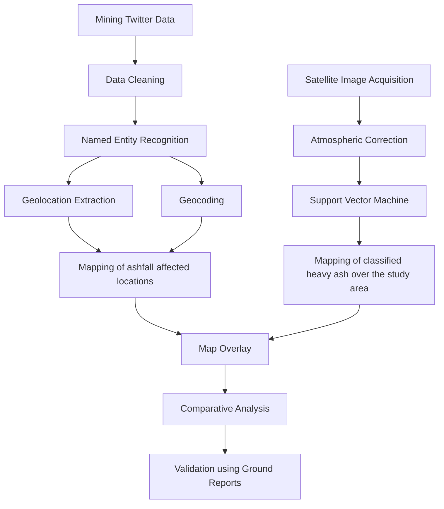
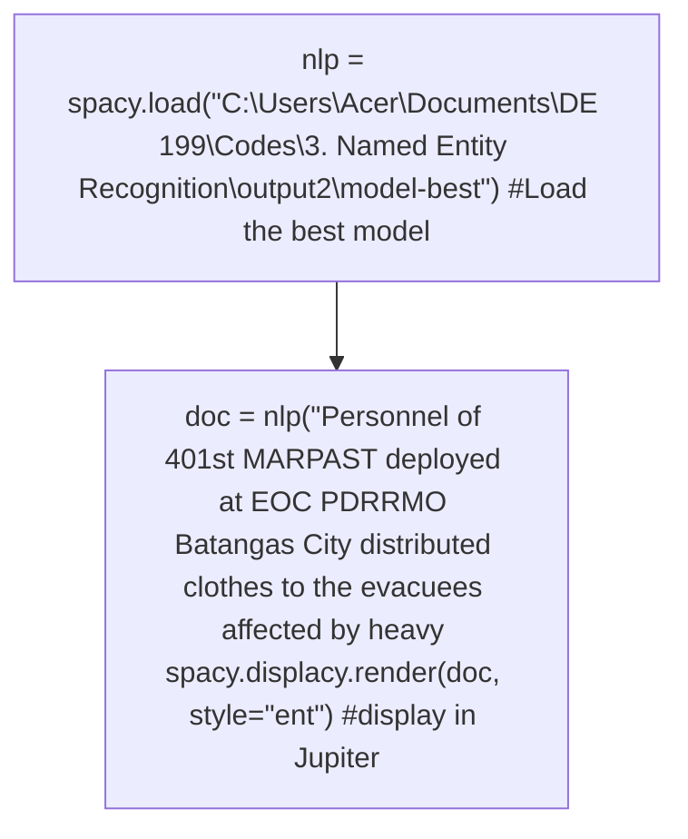

# SUPPLEMENTING SATELLITE IMAGERY WITH SOCIAL MEDIA DATA FOR REMOTE RECONNAISSANCE: A CASE STUDY OF THE 2020 TAAL VOLCANO ERUPTION

A.L.F. Yute 1\*, E.J.G. Merin 1, C.J.S. Sarmiento 1, 2, E. E. Elazagui 1, 2

1 Department of Geodetic Engineering, College of Engineering, University of the Philippines Diliman – afyute@up.edu.ph\*, egmerin@up.edu.ph 2 Training Center for Applied Geodesy and Photogrammetry, University of the Philippines Diliman – cssarmiento@up.edu.ph, eeelazegui@up.edu.ph

KEY WORDS: social sensing, remote sensing, post-disaster reconnaissance, Named Entity Recognition, Support Vector Machine, Diwata-2, volcanic ash.

## ABSTRACT:

Social sensing and satellite imagery are named as the top emerging data sources for disaster management. There is a wealth of data, both in quantity and quality that can be extracted from social media platforms such as Twitter, given that the content published by users is generally in real-time and includes a geotag or toponym. To reduce costs, risks, and time, performing reconnaissance using remote sources of information is highly suggested. This study explores how social media data can be used to supplement satellite imagery in post-disaster remote reconnaissance using the January 2020 Taal Volcano Eruption in the Philippines. Tweets about the volcanic eruption were scraped, and ashfall-affected locations mentioned in tweet content were extracted using Named Entit Recognition (NER). To visualize the progression of the tweeted locations, dot density maps and hotspot maps were generated. Additionally, a potential ashfall extent map was generated from processed DIWATA-2 satellite imagery using Support Vector Machine (SVM) classification. An intersection of both dot density map and ashfall extent map was performed for comparative analysis of both data. Validation was carried out by matching the ashfall-affected locations with ground reports from local government offices and news reports. The use of social media data complements satellite image classification in the detection of disaster damage for a quick and cost-efficient remote reconnaissance. This information can be utilized by rescue teams for faster emergency response and relief operations during and after a disaster.

## 1. INTRODUCTION

The Philippines is hit by a slew of natural disasters every year. The most difficult task in the aftermath of such events is determining the extent of the damage and destruction on the ground. Fieldwork and sending survey teams to disaster-affected areas to assess disaster damage are typically costly, risky, and time-consuming (Dashti et al., 2014). While remote sensing has become the standard for Earth observation, satellite data can have quality limitations, time delays, and information gaps (Havas et al., 2017). On the other hand, social media data is leading the way in emerging data acquisition trends for disaster resilience (Yu et al., 2018). With real-time broadcasting of an event by social sensors, social media data can be used to track and monitor the progression of disasters in affected areas in an efficient and costeffective manner. As a result, social sensing as a source will most likely address the need for remote reconnaissance by reducing the time delays, risks, logistics, and costs associated with dispatching survey teams to the site.

This study delves into the most recent phreatomagmatic eruption of the Taal Volcano in Batangas, Philippines. It ejected gases, ash, and lava into the air on January 12, 2020, resulting in heavy ashfall that blanketed the province of CALABARZON and even reached several cities 100 kilometers away in the region of Metropolitan Manila. There has been significant loss of life and property in the areas where it has made landfall (Regan and Jorgio, 2020). In response to such event, people from all over the country were quick to share updates, photos, and videos on Twitter using hashtags and keywords related to the eruption.

The overarching goal of the study is to put social sensing to the test by performing disaster remote reconnaissance of the Taal volcano eruption in 2020. The findings of the study will prompt potential considerations for fully integrating social media data mining with current post-disaster operations. Furthermore, there have been no published studies on the use of social media data to supplement DIWATA-2 satellite imagery specifically.

## 2. REVIEW OF RELATED LITERATURE

## 2.1 Taal Volcano Eruption in 2020

The Taal volcano erupted for the first time in 43 years on January 12, 2020. The explosive eruption produced plumes of hazardous particles and gases that were released into the atmosphere. A towering ash cloud almost 15 km high resulted in nearby cities and towns being buried under heavy ash (Leung et al., 2020).

Several studies were performed to thoroughly investigate the damages and hazards brought about by the eruption. Jing et al. (2020) analyzed the optical properties of volcanic aerosols, volcanic gas emission, and ocean parameters using data from several multi-satellite sensors supplemented with ground observations. The presence of finer particles has been confirmed, and they can be traced back to the volcanic plume that resulted from the eruption. There was an increase in SO2, CO, and water vapor, as well as a decrease in O3. The study's findings show that “observations combining satellite with ground data could provide important information about the changes in the atmosphere, meteorology, and ocean parameters associated with the Taal volcanic eruption”.

In another report, a U.S. Geological Survey (USGS) volcanologist named Alexa Van Eaton used the videos taken by several “citizen scientists” to educate people on how lightning evolves during an eruption and how it can be used to monitor the severity of volcanic hazards. She also remarks, “The boom in citizen scientists with mobile phones and social media is changing the way we learn about natural phenomena” (Tripathy-Lang, 2020).

## 2.2 Named Entity Recognition (NER)

Named Entity Recognition identifies and extracts “entities,” which are terms that represent real-world objects such as people, places, organizations, email addresses, dates, hashtags, and events, and so on. This algorithm's application is appropriate for any situation in which a high-level overview of a large amount of text is useful so it can be applied in a wide range of applications (Marshall, 2020).

A recent study published in October 2018 by Dela Cruz et al. used NER to filter news articles relevant to a disaster and categorize disaster-related news articles that are useful in matters of preparation, evacuation, and people's feelings about the event. According to their research, this type of information is critical for post-disaster management because it can be used to assess mistakes and deficiencies made by the rescue sector during the event and find ways to improve risk communication and decision-making for future oncoming disasters.

## 2.3 Support Vector Machine (SVM) Classification

The Support Vector Machine Classification (SVM) algorithm transforms data and then creates higher dimensional decision boundaries to effectively separate classes based on these transformations. SVMs are based on statistical learning theory and seek to locate decision boundaries that result in the best class separation (Vapnik, 2000). When the classes can be separated linearly, the SVM selects the one with the lowest generalization error from an infinite number of linear decision boundaries. When two classes cannot be separated linearly, SVM employs regularization parameters and gamma to determine the hyperplane that maximizes the margin and minimizes the number of misclassification errors, where margin is defined as the sum of the distances to the hyperplane from the two classes' closest points. (Pal and Mather, 2005).

Several studies have explored and confirmed that SVM outperforms other classification algorithms such as the Maximum Likelihood Classifier (MLC) and Nearest Neighbors in terms of its level of accuracy (Colas and Brazdil, 2006; Mondal, et al., 2012).

## 3. MATERIALS AND METHODS

## 3.1 Study Area

The CALABARZON region is located on the Philippines Southern Luzon Island. The region is made up of five (5) provinces: Cavite, Laguna, Batangas, Rizal, and Quezon. The Taal Volcano, one of the Philippines' most active volcanoes, is located in Talisay and San Nicolas, Batangas, in a crater lake. While the majority of minor eruptions are restricted to the volcanic island, violent activity can occasionally affect the entire CALABARZON region and even reach Metro Manila.

flowchart

Figure 1. General workflow for social media data and satellite imagery processing

## 3.2 Data Acquisition

Tweets about the volcanic eruption were retrieved from Twitter using TWINT, a Python-based scraping tool. To scrape tweets based on various parameters, the algorithm employs Twitter's search operators. Location-indicative tweets created between January 5 and 28, 2020 (before and after the eruption) were scraped using keyword terms and hashtags related to the volcanic eruption and ashfall in both English and Tagalog. A total of 18,987 raw tweets were scraped, with 1,863 being geotagged which is 9.81% of the mined Twitter data. The DIWATA-2 satellite imagery was taken on January 27, 2020, two weeks after the volcanic eruption. It was obtained from the Ground Receiving, Archiving, Science Product Development, and Distribution (GRASPED) project under the Space Technology and Applications Mastery, Innovation and Advancement (STAMINA4Space) Program by the Advanced Science and Technology Institute (DOST-ASTI) and the University of the Philippines Diliman.

## 3.3 Twitter Data Processing

## 3.3.1 Data Cleaning

A Python code was created to facilitate an automated data cleaning of raw tweet data. The code extracts only specific information from raw tweets, such as dates, geotags, tweet message, and associated photos or videos. Following that, duplicate tweets and tweets in languages other than English and Tagalog were removed. The code also worked on removing unnecessary characters from tweet text content, such as user mentions, URLs, and emojis, as well as normalizing the text for easier tagging of entities during NER. The tweets were divided into two categories: (1) geotagged tweets and (2) non-geotagged tweets. The total number of tweets used for the study was reduced to 3,595.

## 3.3.2 Named Entity Recognition

A Named Entity Recognition (NER) model was used to identify toponyms — place-names that denote a geographic locality mentioned in both non-geotagged and geotagged tweets. The process was applied to geotagged tweets even though geographical coordinates were already available for the following plausible reasons: (1) the user is tweeting about ashfal in an area other than their current location, or (2) the user's geospatial metadata is inaccurate.

A custom NER model was trained to handle both English and Tagalog words using a training dataset of 230 tweets — 115 in Tagalog and another 115 in English. The model used two labels: a 'Keyword' entity to identify the ashfall-related keyword, and a 'Location' entity to identify the toponym mentioned in the tweet. The NER model had an overall f-score of 0.7601626016.

flowchart

Figure 2. Custom NER model applied to ashfall-related tweets

A total of 5,701 entities were classified from 3,595 tweets, which could be attributed to the fact that some tweets include multiple keywords and locations in their tweet content. Out of the 5,701 entities, 1,558 of them were mentioned toponyms.

## 3.3.3 Geocoding

The extracted toponyms from the tweets were converted into geographic coordinates (latitude and longitude) using OpenStreetMap's (OSM) geocoder, Nominatim, which is an open-source search API that locates geographic locations by name and address. For a general toponym such as a city or province, the algorithm would provide the coordinates of the area’s geographical centroid as determined by OSM’s administrative boundaries. Out of the 1,558 toponyms, only a total of 808 geocoded locations fit within the study area.

## 3.3.4 Mapping the distribution and density of ashfallaffected locations

The geocoded toponyms were then mapped to illustrate the distribution of ashfall-affected locations in CALABARZON and Metro Manila. Several tweets had mentioned the presence of ashfall in the same general vicinity. After being mapped, these points are typically stacked on top of one another. To visualize the density of these points, hotspot heat maps were created using QGIS's Heatmap (Kernel Density Estimation) plugin. It was used to represent hotspots in the same spatial region during and after the Taal volcano eruption using clusters of geocoded toponyms.

## 3.4 Diwata-2 Processing

## 3.4.1 Image Correction

The Diwata-2 satellite images were atmospherically corrected, removing the effects of the atmosphere on the reflectance values of the satellite images. The Dark Object Subtraction (DOS) method available in the Semi-Automatic Classification Plugin in QGIS was used to complete the process.

## 3.4.2 Support Vector Machine Classification

Using training data obtained from high-resolution satellite imagery cross-referenced with reports and priori information regarding the volcanic eruption, the various land features visible in the satellite image were classified as cloud, shadow, vegetation, deep water, built-up, and heavy ash. SVM was applied to the DIWATA-2 satellite image using ENVI, specifically its Radial Basis Function (RBF) with parameters C = 100 and gamma = 0.01.

## 3.4.3 Ashfall Extent Mapping

The classified ash-covered areas were mapped, and the cities and towns affected were identified. Ground reports on ashfallaffected areas were gathered and their geographical locations were determined in order to validate the coverage of the classified ashfall over specific areas in CALABARZON.

## 3.5 Comparative Analysis

The ashfall-affected locations were then overlaid on the ashfall extent map of the DIWATA-2 satellite image to look for correlations between the density of the tweeted locations and possible ashfall extent damage caused by the volcanic eruption. The points were checked to see if they coincided with a classified heavy ash area observed on the satellite-derived ashfall extent map and if all or most of the tweets fell within the identified heavy ash hazard zones.

## 3.6 Validation Using Ground Reports

Validation was performed using a map overlay of geocoded tweets and classified satellite imagery by collecting Twitter users statements, photos, and videos and matching them with ground reports on the presence of ashfall in various parts of CALABARZON. The latter was based on narrative reports, news media articles, and photos from journalists and credible sources that were published online during and immediately following the Taal volcanic eruption.

## 4. RESULTS AND DISCUSSION

## 4.1 Distribution of Ashfall-affected Locations

The distribution of ashfall-affected locations across the region is depicted in Figure 3. A total of 808 locations were extracted from the tweet dataset. Out of these, 255 were from geotags, and 553 were geocoded locations from tweet content.

text_image

ASHFALL-AFFECTED
LOCATIONS DURING
THE 2020 TAAL
VOLCANIC ERUPTION
Legend
Taal Volcano
Ashfall-affected
Locations
Region
CALABARZON
Metropolitan Manila
Data Source: Twitter Biomarkers ES-14
Satellite Administrative Boundaries: 2021
PHILADE CDA, CRS. 953844

Figure 3. Dot density map of ashfall-affected locations during the 2020 Taal Volcano Eruption

The region of Metro Manila has the highest point density, accounting for approximately 40.35 percent of the total mapped locations. This can be attributed to the province's higher number of Internet users than the other provinces. Batangas, Laguna, and Cavite also have a high number of points, possibly due to their proximity to the Taal Volcano. This observation is also evident on the hotspot map shown in Figure 4. It is shown that the areas with the greatest concentration of points are in Metropolitan Manila and Batangas.

<table><tr><td>Province</td><td colspan="2">No. of Points</td></tr><tr><td></td><td>#</td><td>%</td></tr><tr><td>Metropolitan Manila</td><td>326</td><td>40.35</td></tr><tr><td>Batangas</td><td>176</td><td>21.78</td></tr><tr><td>Cavite</td><td>176</td><td>21.78</td></tr><tr><td>Laguna</td><td>93</td><td>11.51</td></tr><tr><td>Rizal</td><td>32</td><td>3.96</td></tr><tr><td>Quezon</td><td>5</td><td>0.62</td></tr><tr><td>Total</td><td>808</td><td>100</td></tr></table>

Table 1. Distribution of ashfall-affected locations per province.

heatmap

| Feature | Description |
| --- | --- |
| Legend | Taal Volcano (Red triangle) |
| Hotspot Areas | High Density (Dark Blue) to Low Density (Yellow/Orange) |
| Scale Bar | 25 km / 50 km |
| Location | Calabarzon and Metro Manila (KDE) |
| Data Source | Walker Boternap, IIS-II, Satellite Administrative Bouncard, 2021. Fields Daily, CDS: 962084 |

Figure 4. Hotspot map of ashfall-affected locations obtained by KDE

The implication is that two factors govern the strong detection of natural disasters by social sensors: their proximity to the affected area and the density of active Internet users in an area. More social media users were tweeting from Metro Manila, as evidenced by the spread of medium to high density hotspots in the region. Meanwhile more users were tweeting about “Batangas”, home to the Taal Volcano, because the high density hotspot is localized to a single point — the centroid of the province.

It was also observed that 79.33% of tweets were published on the first two days of the ashfall (Figure 5), after which the quantity declined considerably. This portrays the fast dissemination of information on social media during the volcanic eruption.

bar_stacked

| Date | Geocoded | Geotagged |
| --- | --- | --- |
| Jan-12 | 269 | 82 |
| Jan-13 | 176 | 104 |
| Jan-14 | 35 | 20 |
| Jan-15 | 18 | 9 |
| Jan-16 | 12 | 5 |
| Jan-17 | 10 | 5 |
| Jan-18 | 7 | 8 |
| Jan-19 | 6 | 8 |
| Jan-20 | 4 | 1 |
| Jan-21 | 1 | 2 |
| Jan-22 | 4 | 2 |
| Jan-23 | 0 | 0 |
| Jan-24 | 5 | 1 |
| Jan-25 | 1 | 1 |
| Jan-26 | 3 | 3 |
| Jan-27 | 2 | 4 |
| Jan-28 | 0 | 0 |

Figure 5. Progression of ashfall-affected locations per day from January 12-28, 2020

## 4.2 Ashfall Extent Map

According to the ash extent map (Figure 6), the classified heavy ash has a total area coverage of 125.31 m2, which is concentrated around the Taal volcano itself and over the towns north of Taal Lake and extends up to the border of Cavite and Laguna. Scattered ash can also be found in Batangas and Cavite's western regions. It can also be observed that the boundaries between land and water tend to be classified as areas with heavy ash. It is then recommended that for succeeding replications of this methodology, other methods could be undertaken for the image classification of the satellite data.

text_image

POTENTIAL ASHFALL
EXTENT MAP OF PARTS
OF CALABARZON
DERIVED FROM
DIWATA-2 SATELLITE
IMAGE
Legend
Heavy Ash
RavenMap: Ding Satellites; CRS: WGS91

Figure 6. Potential ashfall extent map over parts of CALABARZON based on DIWATA-2 satellite imagery

## 4.3 Map Overlay

The ashfall-related social media data collected from Twitter cover the entire CALABARZON and Metropolitan Manila regions, however, the DIWATA-2 satellite image only cover the entire province of Batangas, several areas in Laguna and Cavite, and a small portion of Rizal and Quezon at most. As a result, only 500 of the 808 points were within the bounds of the satellite image, and only 62 (12.4%) points intersected with the classified heavy ash on the DIWATA-2 satellite image.

The concentration of potential heavy ash in the areas northeast of the Taal volcano (Figure 7), is consistent with both satellite and social media data. They both encircle towns in the provinces of Batangas, Cavite, and Laguna.

Ashfall-affected Areas in CALABARZON Based on the Convergence of Geocoded and Geotagged Tweets and Classified Ash on DIWATA-2 Image  

geo

| Category | Description |
| --- | --- |
| Yellow Dot | Ashfall-related Trewel |
| Blue Dot | Heavy Salt |

Figure 7. Map overlay of geocoded and geotagged tweets on DIWATA-2 ash extent map

## 4.4 Validation

The photos and videos in the following tweets depict the ground situation of ashfall in their respective areas, thus validating the tweeted ashfall-affected location. A geotagged photo of an ashcovered car was taken by a Twitter user in Lucsuhin, Silang, Cavite, where the DIWATA-2 satellite image classification indicated heavy ash, as shown in Figure 8.

text_image

Keep Safe everyone. #taalvolcano
#ashfall @ Lucsuhin, Silang Cavite.

Figure 8. Geotagged tweet within the classified heavy ash reporting ashfall presence in Silang, Cavite

Geocoded tweets, on the other hand, represent a more generalized locational entity, but relevant photos from ashfall-related tweets provide more context on the specifics of the zone where the heavy ash is present, as shown in Figure 9. The Twitter user mentioned the Enchanted Kingdom in Santa Rosa, Laguna, which has a total land area of 25 hectares, in their tweet. Nonetheless, the photo included by the Twitter user depicts a specific location within the Enchanted Kingdom, making the information more accurate for remote reconnaissance purposes. It also captured the thick ash column that loomed over the area.

text_image

Ashfall in Enchanted Kingdom
14.500
14.250
14.000
121.000
121.250
121.500
121.750
14.50
14.250
14.000
121.000
121.250
121.500
121.750
0 7.5 15 22.5 km

Figure 9. Geocoded tweet within the classified heavy ash reporting ashfall presence in Santa Rosa, Laguna

It is important to note that not all geocoded tweets are based on specific locational entities such as establishments. It is also possible that any associated photo will not provide context on the possible latitude and longitude of the point to which the Twitter user is referring. Figure 10 depicts such an example.

The tweet includes references to Barangay Banyaga, Agoncillo, Batangas. The tweet includes a photo of an ash-covered rural road with no landmarks that can be used to determine the exact location within Barangay Banyaga. Nonetheless, residents or people familiar with Banyaga's roads and corners may be able to identify this area. It could be suggested that the validation for the integration of social sensing and satellite remote sensing include local institutions for context.

text_image

LOOK: Ashfall from Taal Volcano's
eruption blanketed a community in
Brgy, Banyaga, Agoncillo, Batangas

Figure 10. Geocoded tweet within the classified heavy ash reporting ashfall presence in Agoncillo, Batangas

Furthermore, the photo from the geocoded tweet in Figure 11 depicts ash scattering in the air, over the roof, and across the roads, confirming the DIWATA-2 satellite image's potentia heavy ash classification. This tweet's initial geotag was in Agoncillo, Batangas, which covers a large area. The photograph depicts some notable features, such as the houses in the background, which may be familiar to locals. There's also a sign behind the house that says "Margie's Rebonding," which may provide coordinates.

text_image

The Taal Volcano, south of the Philippine capital Manila, rumbled and roared to life on Jan. 12 as it spewed superheated ash high into the sky, in a spectacular show of nature's fury.
14.250
14.000
14.000
120.250
120.500
120.750
121.000
120.250
120.500
120.750
121.000
14.250
14.000
14.000
120.250
120.500
120.750
121.000
0
7.5
15
22.5 km

Figure 11. Geocoded tweet (with geotag on the Agoncillo, Batangas) within the classified heavy ash reporting ashfall presence

There is also a toponym in the tweet, which is the Taal Volcano. As shown in the figure, this location was correctly geocoded. I should be noted that the Twitter user was not in the middle of Taal volcano when the tweet was published, nor can the photo that was taken be found there; however, the presence of ashfall in Taal volcano is accurate according to the potential ash exten map. When using geotagged tweets that are geocoded, it is critical to provide contextualization of the tweet and photo content.

To summarize, each of the three methods for extracting location information from Twitter data — geocoding, geotagging, and geocoding the geotagged tweets — has advantages and limitations. Geocoded non-geotagged Twitter data are preferred in terms of quantity because tweets containing toponyms are more abundant on Twitter than tweets containing geotags. Geotagged tweets are better for accuracy because they provide the set of coordinates of the Twitter user's location in real-time. Meanwhile, a combination of all three can be used to produce more diverse and accurate data, provided that the data is cleaned and contextualized in the context of the given location.

## 5. CONCLUSIONS

The real-time statements and media published by the citizens onground have proven to be useful in providing initial locations and reports on the damage of the eruption. Overall, the results of the use of social media data and satellite imagery for detecting ashfall as shown in this study are indicative of its promising capabilities for remote reconnaissance immediately after or even during the eruption of the Taal volcano. This integration could also be tested and applied on other calamities such as storm surges, earthquakes, and floods for future work. This study also stresses that by applying this study’s findings, there is a need for collaboration with government institutions, civil organizations, and local offices to improve the timely detection and assessment of disasters.

## 6. RECOMMENDATIONS

For entity extraction using NER, the custom model was more accurate in identifying keywords and locations in English than in dealing with Tagalog content. It is therefore recommended to pursue a more complex methodology for future studies that focus on Natural Language Processing that involves building NER models from scratch that are specifically accustomed to Philippines languages. It is also recommended that the geocoder paramaters in order to limit the location where the geocoder looks up addresses, reducing the number of addresses that are not within the study area. For DIWATA-2 satellite image processing, it is recommended to explore other methods of atmospheric correction to further improve image quality for image classification.

## ACKNOWLEDGEMENTS

We would like to thank Sir Jayson and Sir RK of the STAMINA4Space Program for providing us with the resources we needed for our research. We would also like to thank the team behind the GRASPED project, for organizing and inviting us to the DIWATA Data Camp, which provided us with ideas for our methodology and inspired us to soar high like DIWATA-2. Lastly, we would like to thank our dearest family and friends for their unwavering support and for being our motivation to do our best.

## REFERENCES

Colas, F., Brazdil, P. 2006. Comparison of SVM and Some Older Classification Algorithms in Text Classification Tasks. Artificial Intelligence in Theory and Practice, 217, 169–178. doi.org/10.1007/978-0-387-34747-9\_18

Dashti, S., Palen, L., Heris, M., Anderson, K., Anderson, J., Anderson, S., 2014. Supporting Disaster Reconnaissance with Social Media Data: A Design-Oriented Case Study of the 2013 Colorado Floods. Proceedings of the 11th International ISCRAM Conference, University Park, Pennsylvania, USA.  
Dela Cruz, B., Montalla, C., Manansala, A., Rodriguez, R., Octaviano, M., Fabito, B. S., 2018. Named-Entity Recognition for Disaster Related Filipino News Articles. TENCON 2018 - 2018 IEEE Region 10 Conference, 1633-1636. doi.org/10.1109/tencon.2018.8650208  
Havas, C., Resch, B., Francalanci, C., Pernici, B., Scalia, G., Fernandez-Marquez, J., Van Achte, T., Zeug, G., Mondardini, M.R., Grandoni, D., Kirsch, B., Kalas, M., Lorini, V., Rüping, S., 2017. E2mC: Improving Emergency Management Service Practice through Social Media and Crowdsourcing Analysis in Near Real Time. Sensors, 17(12), 2766. doi.org/10.3390/s17122766  
Hernandez-Suarez, A., Sanchez-Perez, G., Toscano-Medina, K. Perez-Meana, H., Portillo-Portillo, J., Sanchez, V., García Villalba, L., 2019. Using Twitter Data to Monitor Natural Disaster Social Dynamics: A Recurrent Neural Network Approach with Word Embeddings and Kernel Density Estimation. Sensors, 19(7), 1746. doi.org/10.3390/s19071746  
Jing, F., Chauhan, A., P Singh, R., Dash, P., 2020. Changes in Atmospheric, Meteorological, and Ocean Parameters Associated with the 12 January 2020 Taal Volcanic Eruption. Remote Sensing, 12(6), 1026. dx.doi.org/10.3390/rs12061026  
Leung, G., Hilario, M., Betito, G., Bañaga, P., Topacio, X., Cainglet, Z., Visaga, S., Delos Reyes, I., Olaguera, L., Dado, J., Cruz, F., Maquiling, J., Cambaliza, M., Simpas, J., Narisma, G., Holz, R., Kuehn, R., Eloranta, E., 2020. Taal Volcano 2020 Eruption Impact on Air Quality. Part I: Satellite Retrievals and Ground-based, Vertically-resolved Measurements. Retrieved from http://www.observatory.ph/2020/01/17/taal-volcano-2020- eruption-impact-on-air-quality-part-i/  
Marshall, C., 2020. What is named entity recognition (NER) and how can I use Retrieved from https://medium.com/mysuperai/what-is-named-entityrecognition-ner-and-how-can-i-use-it-2b68cf6f545d  
Mondal, A., Kundu, S., Chandniha, S.K., Shukla, R., Mishra, P.K., 2021. Comparison of Support Vector Machine and Maximum Likelihood Classification Technique using Satellite Imagery. International Journal of Remote Sensing and GIS, 1(2), 116–123.  
Sothe, C., De Almeida, C.M., Schimalski, M.B., La Rosa, L.E.C., Castro, J.D.B., Feitosa, R.Q., Dalponte, M., Lima, C.L., Liesenberg, V., Miyoshi, G.T., Tommaselli, A.M.G., 2020. Comparative performance of convolutional neural network, weighted and conventional support vector machine and random forest for classifying tree species using hyperspectral and photogrammetric data. GIScience & Remote Sensing, 57(3), 369– 394. doi.org/10.1080/15481603.2020.1712102  
Pal, M., & Mather, P.M., 2005. Support vector machines for classification in remote sensing. International Journal of Remote Sensing, 26(5), 1007-1011 doi.org/10.1080/01431160512331314083  
Regan, H., Jorgio, J., 2020. Taal volcano eruption: Desolate images show horses and cows buried in ash. CNN. Retrieved from https://edition.cnn.com/2020/01/15/asia/philippines-taal volcano-animals-shelters-intl-hnk/index.html  
Sabuito, A., Canlas, C., Felix, M., Perez, G., 2020. Benguet Forest Fire Burned Area & Taal Ash Extent Estimation Using Support Vector Machine & Thresholding Techniques. 41st Asian Conference on Remote Sensing, 2, 1165-1174.  
Tripathy-Lang, A., 2020. Taal’s eruption illuminates volcanic lightning for scientists. doi.org/10.32858/temblor.076  
Vapnik, V., 2000: The Nature of Statistical Learning Theory. Springer, New York, NY.  
Yu, M., Yang, C., Li, Y., 2018. Big Data in Natural Disaster Management: A Review. Geosciences, 8(5), 165. doi.org/10.3390/geosciences8050165