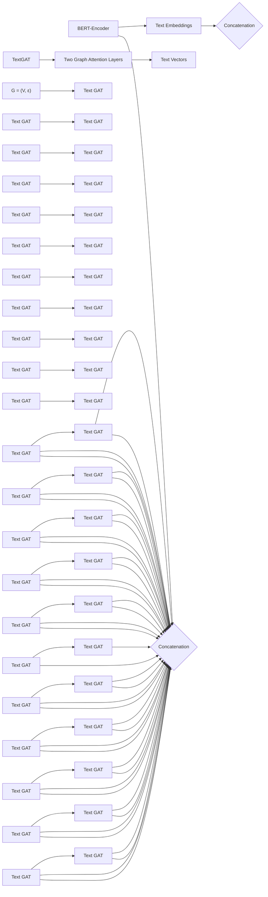

Date of publication xxxx 00, 0000, date of current version xxxx 00, 0000.

Digital Object Identifier 10.1109/ACCESS.2017.DOI

# I-AID: Identifying Actionable Information from Disaster-related Tweets

HAMADA M. ZAHERA1,2 , RRICHA JALOTA1 , MOHAMED AHMED SHERIF1 and AXEL-CYRILLE NGONGA NGOMO1

1DICE group, Department of Computer Science, Paderborn University, Germany  
2Faculty of Computers and Information, Menoufia University, Egypt

Corresponding author: Hamada M. Zahera (hamada.zahera@uni-paderborn.de)

This work has been submitted to the IEEE for possible publication. Copyright may be transferred without notice, after which this version may no longer be accessible.

ABSTRACT Social media plays a significant role in disaster management by providing valuable data about affected people, donations and help requests. Recent studies highlight the need to filter information on social media into fine-grained content labels. However, identifying useful information from massive amounts of social media posts during a crisis is a challenging task. In this paper, we propose I-AID, a multimodel approach to automatically categorize tweets into multi-label information types and filter critical information from the enormous volume of social media data. I-AID incorporates three main components: i) a BERTbased encoder to capture the semantics of a tweet and represent as a low-dimensional vector, ii) a graph attention network (GAT) to apprehend correlations between tweets’ words/entities and the corresponding information types, and iii) a Relation Network as a learnable distance metric to compute the similarity between tweets and their corresponding information types in a supervised way. We conducted several experiments on two real publicly-available datasets. Our results indicate that I-AID outperforms state-ofthe-art approaches in terms of weighted average F1 score by +6% and +4% on the TREC-IS dataset and COVID-19 Tweets, respectively.

INDEX TERMS Crisis Information, Contextualized Text Embedding, Social Media Analysis, Graph Attention Network, Meta Learning.

## I. INTRODUCTION

Social media has become a key medium for sharing information during emergencies [1]. The major difference between social media and traditional news sources is the possibility of receiving feedback from affected people in real time. Relief organizations can benefit from this two-way communication channel to inform people and gain insights from situational updates received from affected people. Hence, extracting crisis information from posts on social media (e.g., tweets) can substantially leverage situational awareness and result in faster responses.

Most previous works [2], [3] addressed information extraction from social media as a binary text classification problem (e.g., with the labels Relevant and Irrelevant). However, there is a lack of efficient systems that can map relevant posts to more fine-grained labels as, for example, defined in [4] (see Figure 1). Such fine-grained labels are particularly valuable for crisis responders as they filter critical information to deliver disaster responses quickly. In particular, labeling disaster-related tweets using multiple labels allows the rapid detection of tweets with actionable information. Table 1 shows the list of information types (which we use as labels) defined by [4]. We adopt the definition of actionable tweets as formalized in [1]. Actionable tweets are defined as the ones that would generate an immediate alert for individuals (i.e., stakeholders) responsible for the information type with which they are labeled (e.g., SearchAndRescue, MovePeople). This stands in contrast to non-actionable tweets that are labeled with labels such as Hashtags or FirstPartyObservation (see Table 1).

On the other hand, categorizing tweets is known to be a challenging short text Natural Language Processing (NLP) task [5]. This is because tweets i) does not possess sufficient contextual information, and ii) is inherently noisy (e.g., contains misspellings, acronyms, emojis, etc.). Moreover, in the multi-label case, the classification task becomes even more challenging because a tweet can belong to one or more labels simultaneously.

## @Anon.user

## FirstPartyObservation

## EmergingThreats

I hear the tornado sires going off now. Buildings in downtown Kansas City being evacuated now! Tornado Warning.

News

FIGURE 1. Example of multi-label tweet classification with assigned labels: FirstPartyObservation, EmergingThreats and News.

In this paper, we aim to i) label disaster-related tweets with fine-grained information types so as to ii) identify actionable or critical tweets that might be relevant for disaster relief and support disaster mitigation. Our approach contains three components: First, we use BERT as a sentence encoder to capture the semantics of tweets and to represent them as lowdimensional vectors. Second, we employ a graph attention network (GAT) to capture correlations between the words and entities in tweets and the labels of said tweets. Finally, we use a Relation Network [6] as a learnable distance metric to compute the similarity between the vector representation of tweets (obtained from the BERT encoder) and the vector representation of labels (obtained from the GAT) in a supervised way. By these means, our system integrates a contextualized representation of tweets with correlations between tweets and their labels. The main contributions of this paper can be summarized as follows:

• We propose a multimodel approach (dubbed I-AID) to categorize disaster-related tweets into multiple information types.  
• Our approach leverages a contextualized representation from a pretrained language model (BERT) to capture the semantics of tweets. In addition, our approach employs a GAT component to capture the structural information between the words and entities in tweets and their labels.  
• We employ a learnable distance metric, in a supervised way, to learn the similarity between a tweet’s vector and the labels’ vectors.  
• We conduct several experiments to evaluate the performance of our approach and state-of-the-art baselines in multi-label text classification.

The rest of this paper is structured as follows: In Section II, we discuss previous work on the classification of crisis information on social media. In Section III, we describe the preliminaries and architecture of our proposed approach. Finally, we discuss the experimental results in Section IV and conclude the paper in Section V.

## II. RELATED WORK

The objective of this work is to categorize disaster-related tweets into multiple information types. Therefore, we relate our work to extract disaster-related information on social media, multi-label text classification and meta learning. In the following, we briefly discuss the state of the art in each of these areas.

## A. EXTRACTING DISASTER-RELATED INFORMATION FROM SOCIAL MEDIA

Several studies demonstrate the role of social media as a primary source of information during disasters [7]. While some works [8] focused on filtering relevant information from tweets, others (e.g., [9], [10]) proposed annotation schemes to classify tweets into fine-grained labels that consider the attitude, information source and decision-making behavior of people tweeting before, during and after disasters. To advance the state of social media crisis monitoring solutions, initiatives like [11] have been rolled out in recent years. One of them is the Incident Streams (TREC-IS) track [10] of the Text REtrieval Conference, which commenced in 2018. The track aims to categorize disaster-related tweets into multiple information types. In this work, we study the TREC-IS dataset and adopt the definition of actionable information from the authors of the TREC-IS challenge. In addition, we employ their performance metric (called Accumulated Alert Worth [12]) to evaluate our system in identifying actionable information in tweets.

## B. MULTI-LABEL TEXT CLASSIFICATION

Earlier works in text classification [13] consider feature engineering and model training as different subtasks. With the advent of end-to-end deep learning approaches [14] and the attention mechanism [15], there has been a significant advancement in the field of multi-label text classification. Pretrained language models (e.g, BERT [16]) are becoming increasingly popular for text classification [14]. However, since BERT only captures the local contextual information, the BERT embeddings do not sufficiently capture the global information about the lexicon of a language. [17] To circumvent this and comprehend the global relations among words in a vocabulary, graph-based approaches such as graph convolution network (GCN) [18] and graph attention network (GAT) [19] have been promising.

Recent studies [17], [20] have exploited the advantages of combining BERT and graph networks. In VGCN-BERT [17], a GCN is used to capture the correlation between words at the vocabulary level (i.e., global information). For instance, given a vocabulary, the GCN would relate the meaning of "new" to "innovation" and "exciting", similar to contextindependent word embeddings like word2vec [21]. For an input sentence, the local contextual information is captured using BERT embeddings, while the global information pertaining to words in a sentence is extracted using graph embeddings and subsequently concatenated with BERT. The two representations of BERT and GCN then interact via the self-attention mechanism to perform the classification task.

In a similar work, Ankit Pal et al. [20] leverage the combination between BERT embeddings and GAT to learn feature representation for text in a multi-label classification task. Their proposed approach (dubbed MAGNET) employs two components: First, a BiLSTM network with BERT embedding is used to capture text representation into an embedding vector. In the second component, the authors use GAT to learn a feature vector for labels. In particular, their GAT models the correlation between words and the corresponding labels, then averages the labels’ vectors into a single output vector. Finally, the authors use a dot-product function to compute the similarity between the input’s vector from BiLSTM and the label’s vector. In contrast, our approach differs from both MAGNET and VGCN-BERT in computing the similarity between a tweet’s representation and its labels’ vectors. We employ a GAT model to explicitly infuse the correlation information of the entities and labels of a tweet with the tweet’s contextualized BERT representation. While MAGNET and VGCN-BERT use either a fixed and linear distance metric (dot-product function) or self-attention to measure the similarities, our approach benefits from a deeper end-to-end neural architecture to learn this distance function. In particular, we employ meta-learning to learn the mapping between the input features and multi-label output in a supervised way.

TABLE 1. Crisis Information Types (i.e., Labels or Classes)

<table><tr><td>Intent Type</td><td>Information Type</td><td>Description</td></tr><tr><td rowspan="3">REQUEST</td><td>GoodServices</td><td>Request for a particular service or physical good</td></tr><tr><td>SearchAndRescue</td><td>The user is requesting a rescue for themselves or others</td></tr><tr><td>InformationWanted</td><td>The user is requesting information</td></tr><tr><td rowspan="11">REPORT</td><td>Weather</td><td>Weather report</td></tr><tr><td>FirstPartyObservation</td><td>The user is giving an eyewitness account</td></tr><tr><td>ThirdPartyObservation</td><td>The user is reporting information from someone else</td></tr><tr><td>EmergingThreats</td><td>Problems that cause loss or damage</td></tr><tr><td>ServiceAvailable</td><td>Someone is providing a service</td></tr><tr><td>SignificantEventChange</td><td>New occurrence to which officers need to respond</td></tr><tr><td>MultimediaShare</td><td>Shared images or video</td></tr><tr><td>Factoid</td><td>The user is reporting some facts, typically numerical</td></tr><tr><td>Official</td><td>Report by a government or public representative</td></tr><tr><td>CleanUp</td><td>Report of the cleanup after an event</td></tr><tr><td>Hashtags</td><td>Report with hashtags correspond to each event</td></tr><tr><td rowspan="3">CALLTOACTION</td><td>Volunteer</td><td>Call for volunteers to help in response efforts</td></tr><tr><td>Donations</td><td>Call for donations of goods or money</td></tr><tr><td>MovePeople</td><td>Call to leave an area or go to another area</td></tr><tr><td rowspan="6">OTHER</td><td>PastNews</td><td>The post is reporting an event that has occurred</td></tr><tr><td>ContinuingNews</td><td>The user is providing/linking to a continuous event</td></tr><tr><td>Advice</td><td>Provide some advice to the public</td></tr><tr><td>Sentiment</td><td>The post is expressing some sentiments about an event</td></tr><tr><td>Discussion</td><td>Users are discussing an event</td></tr><tr><td>Irrelevant</td><td>The post is irrelevant</td></tr></table>

## C. META LEARNING

Meta learning (also called learning-to-learn paradigm) refers to the process of improving a learning algorithm over multiple learning episodes. In contrast to conventional machine learning approaches, which improve model prediction over multiple data instances, the meta-learning framework treats tasks as training examples to solve a new task [22]. In our study, we employ a specific branch of meta learning called metric learning. Metric learning learns a distance function between data samples so that the test instances get classified by comparing them to the labeled examples. The distance function consists of i) an embedding function, which encodes all instances into a vector space, and ii) a similarity metric, such as cosine similarity or Euclidean distance, to calculate how close two instances are in the space [23]. Recently, many approaches have been developed to perform this task, such as Siamese [24], Matching [25], Prototypical [26], and Relation Network [6]. While the embedding function in all of these approaches is a deep neural network, they differ in terms of the similarity function. Unlike its predecessors, which rely on a fixed similarity metric (such as cosine, Euclidean, etc.), Relation Network employs a flexible function approximator to learn similarity and focuses on learning a good similarity metric in a supervised way. The use of function approximators eliminates the need to manually choose the right metric (e.g., Euclidean, cosine, Manhattan). By jointly learning the embedding and a nonlinear similarity metric, Relation Network can better identify matching/mismatching pairs [27]. For this purpose, we use the Relation Network in our work for learning the similarity metric.

## III. OUR APPROACH

We begin this section by giving a formal specification of the multi-label tweet classification problem. Afterward, we discuss the details of each component of our approach in Section III-B. Figure 2 gives an overview of our approach and how its components work together.

flowchart

FIGURE 2. The I-AID architecture: BERT-Encoder embeds tweet $t ^ { ( i ) }$ into a feature vector $\tau ^ { ( i ) }$ . TextGAT builds a graph G from our dataset, employs graph attention layers and output labels vectors ι. Relation Network learns a distance metric between $\tau ^ { ( i ) }$ and ι, then outputs predicted labels $\hat { y } ^ { ( i ) }$ for $t ^ { ( \acute { i } ) }$

TABLE 2. A List of Symbols Used in This paper.

<table><tr><td>Symbol</td><td>Description</td></tr><tr><td> $S$ </td><td>Number of tweets in the dataset.</td></tr><tr><td> $w$ </td><td>Tweet tokens (e.g., word or entity).</td></tr><tr><td> $y^{(i)}$ </td><td>Ground-truth multi-label assigned to a tweet  $i$ .</td></tr><tr><td> $\hat{y}^{(i)}$ </td><td>Predicted multi-label assigned to a tweet  $i$ .</td></tr><tr><td> $\lambda_{i}$ </td><td>A single label/information type for a tweet.</td></tr><tr><td> $N$ </td><td>Number of nodes in a graph</td></tr><tr><td> $\mathcal{V}$ </td><td>Nodes of a graph</td></tr><tr><td> $\mathcal{E}$ </td><td>Edges between nodes in a graph</td></tr><tr><td> $A$ </td><td>Adjacency matrix of a graph</td></tr><tr><td> $\tau^{(i)}$ </td><td>Embedding vector of tweet  $i$  learned by BERT</td></tr><tr><td> $h^{(i)}$ </td><td>Embedding vector of node  $v^{(i)}$ </td></tr><tr><td> $F$ </td><td>Dimension of node vector</td></tr><tr><td> $\iota^{(i)}$ </td><td>Embedding vector for label  $\lambda^{(i)}$ </td></tr><tr><td> $Z$ </td><td>The concatenated vector of  $\tau^{(i)}$  and  $\iota$ </td></tr><tr><td> $\mathcal{L}$ </td><td>Binary cross-entropy loss function</td></tr><tr><td> $\alpha_{ij}$ </td><td>Attention score between nodes  $v^{(i)}$  and  $v^{(j)}$ </td></tr><tr><td> $hPW(t)$ </td><td>Scoring function for high priority tweets.</td></tr><tr><td> $hPW(l)$ </td><td>Scoring function for low priority tweets.</td></tr></table>

## A. PROBLEM FORMULATION

Let T be a set of tweets and $\Lambda ~ = ~ \{ \lambda _ { 1 } , \lambda _ { 2 } , \cdot \cdot \cdot ~ , \lambda _ { k } \}$ be a set of k predefined labels (also called information types, see Table 1). We formulate the problem of identifying crisis information from tweets as a multi-label classification task, where a tweet t can be assigned one or more labels from Λ simultaneously. Our task is to learn a multi-label classifier M : $T \to \{ 0 , { \dot { 1 } } \} ^ { k }$ that maps tweets $T$ to relevant labels from Λ. We assume a supervised learning setting where a training data $\mathrm {  ~ \mathcal { D } ~ } = \left\{ ( t ^ { ( i ) } , y ^ { ( i ) } ) \times \left\{ 0 , 1 \right\} _ { j } ^ { k } \right\} _ { i = 1 } ^ { S }$ consists of S tweets. Hence, each tweet $t ^ { ( i ) }$ is labelled with a set of corresponding labels $\boldsymbol y ^ { ( i ) }$ , where $y _ { i } ^ { ( i ) } = 1$ means that $t ^ { ( i ) }$ belongs to the class $\lambda _ { j } .$ Conversely, $y _ { j } ^ { ( i ) } = 0$ means that $t ^ { ( i ) }$ does not belong to the class $\lambda _ { j }$ . The goal of our approach is to learn the function M by using three neural networks. First, we transform tweet $t ^ { ( i ) }$ into an embedding vector $\tau ^ { ( i ) }$ using a pretrained BERT model. In parallel, our approach learns labels’ embeddings ι using a graph attention network (GAT). These are then concatenated with the tweet embedding $\tau ^ { ( i ) }$ . Finally, these vectors are fed to our last component (Relation Network) to identify relevant labels for $t ^ { ( i ) }$

## B. THE I-AID ARCHITECTURE

## 1) BERT-Encoder

This is the first component in our system that transforms an input tweet into a vector representation τ of its contextual meaning. As shown in Figure 2, the BERT-Encoder takes tweet $t ^ { ( i ) }$ with m tokens $\mathbf { \bar { \rho } } _ { [ w _ { 1 } ^ { ( i ) } , w _ { 2 } ^ { ( i ) } , \dots , w _ { m } ^ { ( i ) } ] }$ and outputs the embedding vector $\tau ^ { ( i ) }$ . We employ a BERT-base architecture with 12 encoder blocks, 768 hidden dimensions, and 12 attention heads. We refer readers to the original BERT paper [16] for a detailed description of its architecture and input representation. Furthermore, a special preprocessing is performed for BERT input. A [CLS] token is appended to the beginning of the tweet and another token [SEP] is inserted after each sentence as an indicator of sentence boundary. Each token $w ^ { ( i ) }$ is assigned three kinds of embeddings (token, segmentation, and position). These three embeddings are summed to a single output vector $\tau ^ { ( i ) }$ that captures the meaning of an input tweet.

## 2) Text-Graph Neural Network (TextGAT)

Traditional methods (e.g., word2vec [21]) can properly capture features from a text. However, these methods ignore the structural information and relationship between words in a text corpus [28]. The recently proposed graph networks [19] aim to tackle this challenge by modeling text as a graph where words are nodes and relations between them are edges. In our work, we build a graph $G = ( \vartheta , \mathcal { E } )$ from the dataset D, where V and E represent nodes set and their edges, respectively. Each node $\boldsymbol { v } ^ { ( i ) } \in \boldsymbol { \mathcal { V } }$ can be a word, named-entity1 or label (tweet’s class or information type). We represent nodes using a feature matrix ${ \bf H } = \{ h ^ { ( 1 ) } , \bar { h ^ { ( 2 ) } } , \cdot \cdot \cdot , h ^ { ( \tilde { N } ) } \}$ where $h ^ { ( i ) } \in \overline { { \mathbb { R } } } ^ { F }$ is the feature vector of node $v ^ { ( i ) }$ with $F$ dimension and N is the number of nodes. First, we initialize the nodes’ representation H with pretrained embeddings from Glove embedding [29]. Further, relations between nodes are modeled using an adjacency matrix $\mathbf { A } \in \mathbb { R } ^ { N \times N }$

As shown in Figure 2, TextGAT component has two graph attention layers. Each layer takes nodes’ features H as input and performs an attention operation [30] to learn a new feature $\hat { \mathbf { H } } ~ = ~ \{ \hat { h } ^ { ( 1 ) } , \hat { h } ^ { ( 2 ) } , \cdot \cdot \cdot ^ { \hat { } } , \hat { h } ^ { ( N ) } \}$ for each node based on its neighbours’ importance (i.e., attention from its neighbours). Hence, we employ the shared attention mechanism $a t t : \mathbb { R } ^ { \hat { F } } \times \mathbb { R } ^ { \hat { F } } \longrightarrow { \bar { \mathbb { R } } }$ over all nodes. The graph attention operated on the node representation can be written as:

$$
\alpha_ {i j} = a t t \left(\mathbf {W} v ^ {(i)}, \mathbf {W} v ^ {(j)}\right) \tag {1}
$$

where att is a single-layer feedforward network, parametrized by a weight matrix $\textbf { W } \in \ \mathbb { R } ^ { \hat { F } \times F }$ which is applied to every node. Finally, we use a softmax function to normalize the attention scores as shown in Eq. 2.

$$
\alpha_ {i j} = \frac {\exp (\alpha_ {i j})}{\sum_ {k \in N _ {i}} \exp (\alpha_ {i k})} \tag {2}
$$

To this end, TextGAT learns the structural information between nodes based on the relative importance of neighbours. The learned representations of labels are then extracted and concatenated with the tweet’s vector as input for the last component, as shown in Figure 2.

## 3) Relation Network.

In this component, we aim to learn a similarity metric in a supervised way (also called learning-to-learn or meta learning) between the tweet’s vector $\tau ^ { ( i ) }$ and labels vectors ι. Furthermore, we employ a neural network as a learnable, nonlinear distance function that learns how to match similarity (i.e., relation) between the tweet’s vector and each label. Relation Network takes as input the concatenated matrix $Z = \tau ^ { \left( i \right) } \otimes .$ ι of BERT-Encoder output with the labels’ vectors. Since our task is multi-label classification, we use the binary crossentropy as a loss function in Eq. 3. Then we use a sigmoid function in the output layer to compute the probability of

1We spot named-entities in tweets using spaCy entity recongnizer https: //spacy.io/api/entityrecognizer

each label independently over all possible labels (Λ), in contrast to a softmax function which only considers the label with highest probability. Finally, a set of relevant labels is returned as a final output of our approach.

$$
\mathcal {L} = - \frac {1}{S} \sum_ {i = 1} ^ {S} \left[ y ^ {(i)} \log \left(\hat {y} ^ {(i)}\right) + \left(1 - y ^ {(i)}\right) \log \left(1 - \left(\hat {y} ^ {(i)}\right) \right. \right] \tag {3}
$$

where $\boldsymbol y ^ { ( i ) }$ and $\hat { y } ^ { ( i ) }$ are the predicted and ground-truth labels of tweet i respectively. S is size of tweets in the training dataset.

## IV. EXPERIMENTS

In this section, we report the evaluation results of our approach and baseline methods. We aim to answer the following research questions:

$Q _ { 1 } \colon$ How does our approach perform compared with stateof-the-art multi-label models in short text (e.g., tweets) classification?  
$Q _ { 2 } \colon$ How effective is our approach in identifying tweets with actionable information?  
$Q _ { 3 } { \mathrm { : } }$ : How does each component in our approach affect the overall performance (i.e., Ablation Study)?

TABLE 3. Overview of the Datasets.

<table><tr><td>Datasets</td><td># Train</td><td># Valid</td><td># Test</td><td># Classes</td></tr><tr><td>TREC-IS</td><td>27,467</td><td>6,867</td><td>8,584</td><td>25</td></tr><tr><td>COVID-19 Tweets</td><td>4,844</td><td>1,211</td><td>1,514</td><td>12</td></tr></table>

## A. DATASETS

We conducted a set of experiments on two public datasets provided by TREC [10]. Table 3 gives an overview of each dataset: the number of tweets used in training (# Train), validating (# Valid), and testing (# Test) our approach and baselines, in addition to the total number of classes (# Classes). In particular, we split each dataset with 80%−20% ratio, where we use 80% of tweets for training and 20% for testing. During the training phase, we use 20% from the training data to validate the model. We briefly summarize each dataset as follows:

• TREC-IS: This dataset contains approximately 35K tweets collected during 33 different disasters between 2012 and 2019 (e.g., wildfires, earthquakes, hurricanes, bombings, and floods). The tweets are labeled with 25 information types by human experts and volunteers.  
• COVID-19 Tweets: This dataset contains a collection of tweets about the COVID-19 outbreak in different affected regions. In total, the data has 7, 590 tweets labeled with one or more of the full 12 information type labels (the same as for the TREC-IS dataset).

Figure 3 shows the distribution of tweets per information type in both datasets. Apparently, the datasets are highly imbalanced w.r.t. tweets’ distribution across information types. For example, in the TREC-IS dataset, there are more than 6, 000 tweets that are categorized into the information types Hashtags, News, MultimediaShare, and Location. In contrast, the information types CleanUP, InformationWanted, and MovePeople have significantly fewer tweets. Similarly in COVID-19 Tweets, the tweets’ distribution is extremely imbalanced: most tweets are categorized into Irrelevant, ContextualInformation, Advice, or News. This skewing distribution in tweets renders multi-label classification more challenging.

## B. BASELINES

We consider a set of state-of-the-art approaches in multilabel classification2 as baselines in our evaluation. We briefly describe each baseline as follows:

• TextCNN [31] uses a convolutional neural network to construct text representation.  
• HAN [32] uses a hierarchical attention neural network to encode text with word-level attention on each sentence.  
• BiLSTM [33] is a bidirectional LSTM model that parses the text from left to right and right to left, then uses the final hidden state as a feature representation for the whole text.  
• MAGNET [20] employs a bidirectional LSTM with BERT embeddings to represent tweets and GAT for labels classifiers. Then it uses a dot-product function to compute similarities between tweet vectors and labels’ vectors.

## C. IMPLEMENTATION AND PREPROCESSING

We use the open-source implementations for TextCNN, HAN, and BiLSTM models provided by the corresponding authors in their GitHub repositories. Furthermore, we implemented the code for the MAGNET model as it has not been open-sourced to date. In our approach, we use the implementation of BERT-Encoder from the Huggingface3 library.

Hyperparameters in the baselines are set with same values as mentioned in their original papers. In our model, we tune hyperparameters via the grid search method to find optimal values for best performances. Specifically, our model achieves its best performance with the following values: training-epochs to 200 with batch-size of 128 and Adam optimizer [34] with a learning-rate of $\mathrm { 2 e ^ { - 5 } }$ . To avoid overfitting, we add a dropout layer with a rate of 0.25 and apply an early-stopping technique during model’s training. The implementation of the I-AID model is opensourced and available on the project website4.

## a: Data Preprocessing

Given that the evaluation datasets are tweets, we perform adhoc preprocessing steps to capture the tweets’ semantics. In particular, we perform the following preprocessing steps: (1) We use the NLTK’s TweetTokenize5 API to tokenize tweets and retain the text content. (2) Stop-words, URLs, usernames, and Unicode-characters were removed. (3) Extra white spaces, repeated full stops, question marks, and exclamation marks are removed. (4) Emojis are converted to text using the emo $\mathrm { ~ j ~ i ~ } ^ { 6 }$ python library. Finally, (5) spaCy7 library is used, to extract named-entities from tweets.

## D. EVALUATION METRICS

We consider standard evaluation metrics for a multi-label classification task. In particular, we use a weighted average F1 score, hamming loss and Jaccard index to evaluate the system’s performance:

• Weighted average F1 score: F1 score is the harmonic mean of precision and recall scores. We use a weighted average that calculates the F1 score for each label independently, then adds them together and uses a weight relative to the number of tweets in each label.

$$
\mathrm{F1} _ {w. a v g.} = 2 \sum_ {i = 1} ^ {k} \frac {\left| T _ {\lambda_ {i}} \right|}{\left| T \right|} \frac {\text {precision} _ {\lambda_ {i}} \times \text {recall} _ {\lambda_ {i}}}{\text {precision} _ {\lambda_ {i}} + \text {recall} _ {\lambda_ {i}}} \tag {4}
$$

where $\left| { { T _ { { \lambda _ { i } } } } } \right|$ denotes the number of tweets with label $\lambda _ { i }$ and |T| is the total number of tweets. Precision $\lambda _ { i }$ and recall are the values of precision and recall for $\lambda _ { i }$

• Hamming Loss: To estimate the error rate in classification, we use the hamming loss function [35] that computes the fraction of incorrectly predicted labels out of all predicted labels. Hence, the smaller the value, the better the performance.

$$
h a m m i n g L o s s \left(y ^ {(i)}, \hat {y} ^ {(i)}\right) = \frac {1}{S} \sum_ {i = 1} ^ {S} \frac {1}{k} \left| y ^ {(i)} \oplus \hat {y} ^ {(i)} \right| \tag {5}
$$

where $S$ is the dataset size, k is the total number of labels $( \mathrm { i . e . , ~ } | \Lambda | \ )$ , ⊕ denotes the XOR operator, and $\boldsymbol y ^ { ( i ) }$ and $\hat { y } ^ { ( i ) }$ are the groundtruth and predict labels, respectively, of tweet i .

• Jaccard Index: To assess the system’s accuracy, we use the Jaccard index to evaluate the similarity between predicted labels $\hat { y } ^ { ( i ) }$ and groundtruth labels $y ^ { ( \dot { i } ) }$ . Jaccard index computes the percentage of common labels in two sets of all labels as:

$$
j a c c a r d \left(y ^ {(i)}, \hat {y} ^ {(i)}\right) = \frac {\left| y ^ {(i)} \cap \hat {y} ^ {(i)} \right|}{\left| y ^ {(i)} \cup \hat {y} ^ {(i)} \right|} \tag {6}
$$

where $y _ { i }$ and $\hat { y } _ { i }$ are the groundtruth and predicted labels for tweet i. ∩ and ∪ denote intersection and union set operations, respectively.

bar

| Category | Number of Tweets |
| --- | --- |
| Advice | ~1700 |
| CleanUp | ~200 |
| ContextualInformation | ~1800 |
| Discussion | ~2500 |
| Donations | ~700 |
| EmergingThreats | ~2400 |
| Factoid | ~6600 |
| FirstPartyObservation | ~3600 |
| GoodsServices | ~200 |
| Hashtags | ~8700 |
| InformationWanted | ~300 |
| Irrelevant | ~9000 |
| Location | ~7700 |
| MovePeople | ~300 |
| MultimediaShare | ~8800 |
| NewSubEvent | ~700 |
| News | ~9200 |
| Official | ~1300 |
| OriginalEvent | ~2700 |
| SearchAndRescue | ~200 |
| Sentiment | ~7500 |
| ServiceAvailable | ~1200 |
| ThirdPartyObservation | ~5600 |
| Volunteer | ~200 |
| Weather | ~2900 |

(a) TREC-IS Dataset

bar

| Category | Number of Tweets |
| --- | --- |
| Advice | ~400 |
| CleanUp | 0 |
| ContextualInformation | ~1400 |
| Discussion | ~150 |
| Donations | ~50 |
| EmergingThreats | ~100 |
| Factoid | ~300 |
| FirstPartyObservation | 0 |
| GoodsServices | 0 |
| Hashtags | ~50 |
| InformationWanted | 0 |
| Irrelevant | ~4100 |
| Location | ~200 |
| MultimediaShare | ~80 |
| NewSubEvent | ~50 |
| News | ~1350 |
| Official | ~350 |
| Sentiment | ~600 |
| ServiceAvailable | ~120 |
| ThirdPartyObservation | ~300 |
| Volunteer | 0 |

(b) COVID-19 Tweets Dataset  
FIGURE 3. Tweets’ distribution across all information types in both datasets (TREC-IS and COVID-19 Tweets)

## 1) Evaluating Actionable Information

We aim to evaluate the efficacy of our system in identifying tweets with actionable information, i.e., the system should trigger an alert if an input tweet includes actionable information (e.g., requests for search and rescue or reports of emerging threats). For this purpose, TREC-IS [36] introduces a new evaluation metric called Accumulated Alert Worth (AAW) to evaluate systems in detecting actionable information during crisis. The AAW score ranges from −1 to +1, where a positive value indicates highly critical information in a tweet while a negative score indicates it is less critical. More details about the AAW metric can be found in [12]. Here, we summarize the AAW metric as follows:

$$
A A W = \frac {1}{2} \sum_ {t \in T} \left\{ \begin{array}{l l} \frac {1}{| T _ {h} |} \cdot h P W (t) & \text {if} t \in T _ {h} \\ \frac {1}{| T _ {l} |} \cdot l P W (t) & \text {otherwise} \end{array} \right. \tag {7}
$$

where $T _ { h }$ and $T _ { l }$ denote the sets of tweets with high and low priorities, respectively. $h P W ( t )$ is a scoring function for tweets that should generate alerts and $l P W ( t )$ is a scoring function for tweets that should not generate alerts. Formally,

$$
h P W (t) = \left\{ \begin{array}{l l} \alpha + ((1 - \alpha) \cdot (\varphi (t) + \hat {\varphi} (t)) & \text {if} p _ {t} ^ {s} > = 0. 7 \\ - 1 & \text {otherwise} \end{array} \right.
$$

$$
l P W (t) = \left\{ \begin{array}{l l} \operatorname{argmax} (- \log (\frac {\delta}{2} + 1), - 1) & \text {if} p _ {t} ^ {s} > = 0. 7 \\ \varphi (t) + \hat {\varphi} (t) & \text {otherwise} \end{array} \right.
$$

where $p _ { t } ^ { s }$ is the priority score of a tweet by the system, and $\varphi ( t )$ and $\hat { \varphi } ( t )$ are actionable and non-actionable scores, respectively, for tweet $t ,$ .

## E. DISCUSSION

## 1) Performance Comparison (Q )

We use different metrics in multi-label classification to evaluate the performance of I-AID and baseline methods. To ensure a fair evaluation, we use the same train dataset for training all models and the test dataset for evaluation. Table 4 reports our evaluation results for each model on both datasets (TREC-IS and COVID-19 Tweets). We consider the weighted average F1 score as the primary metric to compare and rank systems. Weighted average F1 takes into account the average performance of each system across all information types. Overall, our approach (I-AID) achieves superior results to the other baselines under several metrics. In particular, our approach outperforms the weighted average F1 score of MAGNET—the state-of-the-art baseline in multilabel tweets classification—by +6% on TREC-IS and +4% on COVID-19 Tweets.

We employ the Jaccard index and Hamming loss in further analysis to evaluate accuracy and error rate. using Jaccard index, our approach outperforms all baseline methods in both datasets. In particular, I-AID achieves 43% Jaccard index for both datasets compared with MAGNET’s score of 38% for the TREC-IS dataset and 40% for COVID-19 Tweets. On the other hand, our approach achieves suboptimal results using Hamming loss. For the TREC-IS dataset, I-AID achieves the best performance with rate 0.07%. While in COVID-19 Tweets, it achieves the second best score with 0.08% compared with HAN model’s score 0.04%.

Our experiments demonstrate that I-AID performs fairly well when categorizing disaster-related tweets into multiple information types. This is due to three facts: i) we constructed a multimodel framework that leverages contextualized embeddings from the BERT model to capture contextual information in tweets. ii) Our approach enriches the semantics of tweet representation by injecting label information and integrating additional structural information between tweets tokens and labels using GAT. iii) Finally, we employ a Relation Network to learn automatically similarities between tweets and labels. By using a learnable distance function, we learn an efficient metric in a supervised way to facilitate the mapping between a tweet and multi-label output.

## 2) Actionable Information In Tweets (Q2)

To answer $Q _ { 2 } ,$ , we use the AAW metric, proposed by TREC (Eq. 7), to evaluate the I-AID’s ability to identify tweets with critical information. There are two ways to define an actionable tweet [1]: i) in terms of high priority information, commonly marked as critical by human assessors, and ii) in terms of information type, for instance, a tweet with the labels MovePeople or CleanUP is considered more actionable than News or Multimediashare. In our evaluation, we consider the second definition of actionable posts. The evaluation results of the AAW metric are presented in Table 5, where the top 6 rows show the evaluation results for the baseline approaches in multi-label classification. The rest of Table 5 shows the AAW results of the best approaches from the TREC-IS challenge (2019 edition [10] RUN B). The result of our approach (I-AID) is presented at the bottom of Table 5.

TABLE 4. Evaluation results of our approach (I-AID) and baselines on two datasets: TREC-IS and COVID-19 Tweets using weighted average F1, Hamming Loss and Jaccard Index. Best results are in bold.

<table><tr><td rowspan="2">Datasets</td><td rowspan="2">Metrics</td><td colspan="4">Baselines</td><td rowspan="2">I-AID</td></tr><tr><td>TextCNN</td><td>HAN</td><td>BiLSTM</td><td>MAGNET</td></tr><tr><td rowspan="3">TREC-IS</td><td> $F1_{w.avg.}$ </td><td>0.25</td><td>0.37</td><td>0.31</td><td>0.53</td><td>0.59</td></tr><tr><td>Jaccard Index</td><td>0.18</td><td>0.28</td><td>0.19</td><td>0.38</td><td>0.43</td></tr><tr><td>Hamming Loss</td><td>0.24</td><td>0.15</td><td>0.26</td><td>0.09</td><td>0.07</td></tr><tr><td rowspan="3">COVID-19 Tweets</td><td> $F1_{w.avg.}$ </td><td>0.47</td><td>0.40</td><td>0.43</td><td>0.51</td><td>0.55</td></tr><tr><td>Jaccard Index</td><td>0.33</td><td>0.28</td><td>0.21</td><td>0.40</td><td>0.43</td></tr><tr><td>Hamming Loss</td><td>0.11</td><td>0.04</td><td>0.07</td><td>0.12</td><td>0.08</td></tr></table>

Our approach (I-AID) substantially outperforms all baseline approaches. In particular, in high priority AWW, I-AID achieves an absolute improvement of +26% compared to the MAGNET model and +32% compared to nyu-smap (the best-achieved result in TREC-IS 2019). Furthermore, I-AID outperforms the Median score of TREC-IS participants by +28% in high priority and by +30% in overall AWW. Remarkably, our approach is the first to achieve a positive AAW score on high priority tweets. Although we outperform the state-of-the-art in both classification and AAW, the results of our evaluation suggest that a significant amount of research is still necessary to spot high priority tweets in a satisfactory manner.

## 3) Ablation Study (Q3)

As discussed in Section III, our approach employs two main components (namely, BERT-Encoder and TextGAT) for representing input tweets. We perform an ablation study to evaluate the performance of each component individually. To do so, we implement two more versions of I-AID: the I-AID-BERT and the I-AID-TGAT. In the I-AID-BERT we deploy our system with the BERT-Encoder only to classify tweets into multiple information types. In the same manner, we implement I-AID-TGAT with only the TextGAT component. Table 6 shows the evaluation results for each component in our ablation study. Evidently, the BERT-Encoder-based implementation of I-AID achieves better performance than the TextGAT version. In particular, on the TREC-IS dataset, I-AID-BERT reach 50% F1 score compared with 26% by I-AID-TGAT. These results prove that I-AID-BERT can learn rich representation features from short text better than I-

TABLE 5. Performance evaluation using the AAW metric on the test dataset from TREC-IS (RUN B). A higher AAW value indicates better prediction.

<table><tr><td rowspan="2">Systems</td><td colspan="2">Accumulated Alert Worth (AAW)</td></tr><tr><td>High Priority</td><td>All</td></tr><tr><td>TextCNN</td><td>-0.9764</td><td>-0.4884</td></tr><tr><td>HAN</td><td>-0.7816</td><td>-0.4600</td></tr><tr><td>Bi-LSTM</td><td>-0.8760</td><td>-0.4482</td></tr><tr><td>BERT (UPB_BERT)</td><td>-0.9680</td><td>-0.4882</td></tr><tr><td>TextGAT</td><td>-0.9794</td><td>-0.4897</td></tr><tr><td>MAGNET</td><td>-0.9436</td><td>-0.4726</td></tr><tr><td>Median</td><td>-0.9197</td><td>-0.4609</td></tr><tr><td>BJUTDMS-run2</td><td>-0.9942</td><td>-0.4971</td></tr><tr><td>IRIT</td><td>-0.9942</td><td>-0.4971</td></tr><tr><td>irlabISIBase</td><td>-0.2337</td><td>-0.4935</td></tr><tr><td>UCDbaseline</td><td>-0.7856</td><td>-0.4131</td></tr><tr><td>nyu-smap</td><td>-0.1213</td><td>-0.1973</td></tr><tr><td>SC-KRun28482low</td><td>-0.9905</td><td>-0.4955</td></tr><tr><td>xgboost</td><td>-0.9942</td><td>-0.4972</td></tr><tr><td>UCDrunEL2</td><td>-0.8556</td><td>-0.4382</td></tr><tr><td>cmu-rf-autothre</td><td>-0.8481</td><td>-0.4456</td></tr><tr><td>I-AID</td><td>0.2044</td><td>-0.1509</td></tr></table>

TABLE 6. Ablation Study of I-AID Model

<table><tr><td>Datasets</td><td>Metrics</td><td>I-AID-BERT</td><td>I-AID-TGAT</td><td>I-AID</td></tr><tr><td rowspan="3">TREC-IS</td><td> $F1_{w.avg.}$ </td><td>0.50</td><td>0.26</td><td>0.59</td></tr><tr><td>Jaccard Index</td><td>0.34</td><td>0.18</td><td>0.43</td></tr><tr><td>Hamming Loss</td><td>0.11</td><td>0.24</td><td>0.07</td></tr><tr><td rowspan="3">COVID-19 Tweets</td><td> $F1_{w.avg.}$ </td><td>0.47</td><td>0.36</td><td>0.55</td></tr><tr><td>Jaccard Index</td><td>0.37</td><td>0.15</td><td>0.43</td></tr><tr><td>Hamming Loss</td><td>0.10</td><td>0.17</td><td>0.05</td></tr></table>

AID-TGAT. Moreover, in our approach we demonstrate that leverageing BERT and GAT together in a multimodel framework improves the overall performance. On the TREC-IS datastet, the I-AID model achieves superior results by +9% in F1 score compared with the BERT-based model and by +33% compared with the TGAT-based model. Our experiment on COVID-19 Tweets leads to a similar conclusion. Our approach outperforms BERT-based and GAT-based systems in F1 scores by +8%, +19%, respectively. On the other hand, we observe that the GAT-based model achieves better performance with fewer output labels. In COVID-19 Tweets with 12 labels, I-AID-TGAT achieves an improved F1 score of +10% compared with its performance in TREC-IS with 25 labels.

## V. CONCLUSION

In this paper, we propose I-AID, a multimodel approach for multi-label tweets classification. Our system combines three components: BERT-Encoder, TextGAT, and Relation Network. The BERT-Encoder is used to obtain locality information, while the TextGAT component aims to find correlations between tweets’ tokens and their corresponding labels. Finally, we use a Relation Network as a last component output to learn the relevance of each label w.r.t. the tweet content. Our main findings are as follows: i) Combining local information captured by BERT-Encoder and global information by TextGAT is beneficial for rich representation in short text and significantly advances multi-label classification. ii) Leveraging transfer learning from pretrained language models can efficiently handle sparsity and noise in social media data. iii) Benchmarking multi-label classification is a challenging task that requires proper evaluation metrics for finegrained evaluation. I-AID achieves its best weighted average F-score of 0.59 on the TREC-IS dataset. This result clearly indicates the sensitivity of our approach to the dataset’s balancing. Dealing with unbalanced classes remains a future extension to our approach. We plan to use data augmentation and natural language generation to address this problem.

## REFERENCES

[1] H. Zade, K. Shah, V. Rangarajan, P. Kshirsagar, M. Imran, and K. Starbird, “From situational awareness to actionability: Towards improving the utility of social media data for crisis response,” PACMHCI, vol. 2, no. CSCW, pp. 195:1–195:18, 2018. [Online]. Available: https://doi.org/10.1145/3274464  
[2] H. To, S. Agrawal, S. H. Kim, and C. Shahabi, “On identifying disasterrelated tweets: Matching-based or learning-based?” in 2017 IEEE Third International Conference on Multimedia Big Data (BigMM). IEEE, 2017, pp. 330–337.  
[3] K. Stowe, J. Anderson, M. Palmer, L. Palen, and K. M. Anderson, “Improving classification of twitter behavior during hurricane events,” in Proceedings of the Sixth International Workshop on Natural Language Processing for Social Media, 2018, pp. 67–75.  
[4] R. McCreadie, C. Buntain, and I. Soboroff, “TREC incident streams: Finding actionable information on social media,” in Proceedings of the 16th International Conference on Information Systems for Crisis Response and Management, València, Spain, May 19-22, 2019, Z. Franco, J. J. González, and J. H. Canós, Eds. ISCRAM Association, 2019. [Online]. Available: http://idl.iscram.org/files/richardmccreadie/ 2019/1867\_RichardMcCreadie\_etal2019.pdf  
[5] G. Song, Y. Ye, X. Du, X. Huang, and S. Bie, “Short text classification: A survey,” Journal of multimedia, vol. 9, no. 5, p. 635, 2014.  
[6] F. Sung, Y. Yang, L. Zhang, T. Xiang, P. H. Torr, and T. M. Hospedales, “Learning to compare: Relation network for few-shot learning,” in Proceedings of the IEEE conference on computer vision and pattern recognition, 2018, pp. 1199–1208.  
[7] S. Cresci, A. Cimino, F. Dell’Orletta, and M. Tesconi, “Crisis mapping during natural disasters via text analysis of social media messages,” in International Conference on Web Information Systems Engineering. Springer, 2015, pp. 250–258.  
[8] G. K. Palshikar, M. Apte, and D. Pandita, “Weakly supervised and online learning of word models for classification to detect disaster reporting tweets,” Information Systems Frontiers, vol. 20, no. 5, pp. 949–959, 2018. [Online]. Available: https://doi.org/10.1007/s10796-018-9830-2  
[9] A. Olteanu, S. Vieweg, and C. Castillo, “What to expect when the unexpected happens: Social media communications across crises,” in Proceedings of the 18th ACM conference on computer supported cooperative work & social computing. ACM, 2015, pp. 994–1009.  
[10] R. Mccreadie, C. Buntain, and I. Soboroff, “Trec incident streams: Finding actionable information on social media." 2019.  
[11] M. Imran, P. Mitra, and C. Castillo, “Twitter as a lifeline: Humanannotated twitter corpora for nlp of crisis-related messages,” in Proceedings of the Tenth International Conference on Language Resources and Evaluation (LREC 2016). Paris, France: European Language Resources Association (ELRA), may 2016.  
[12] R. Mccreadie, “Accumulated alert worth for evaluating actionable information,” http://dcs.gla.ac.uk/\~richardm/TREC\_IS/2019/TREC\_IS\_ Metrics.pdf, May 2019, (Accessed on 03/17/2021).  
[13] B. Sriram, D. Fuhry, E. Demir, H. Ferhatosmanoglu, and M. Demirbas, “Short text classification in twitter to improve information filtering,” in Proceedings of the 33rd international ACM SIGIR conference on Research and development in information retrieval, 2010, pp. 841–842.  
[14] T. Miyazaki, K. Makino, Y. Takei, H. Okamoto, and J. Goto, “Label embedding using hierarchical structure of labels for twitter classification,” in Proceedings of the 2019 Conference on Empirical Methods in Natural Language Processing and the 9th International Joint Conference on Natural Language Processing (EMNLP-IJCNLP), 2019, pp. 6318–6323.  
[15] A. Vaswani, N. Shazeer, N. Parmar, J. Uszkoreit, L. Jones, A. N. Gomez, Ł. Kaiser, and I. Polosukhin, “Attention is all you need,” in Advances in neural information processing systems, 2017, pp. 5998–6008.  
[16] J. Devlin, M.-W. Chang, K. Lee, and K. Toutanova, “Bert: Pre-training of deep bidirectional transformers for language understanding,” arXiv preprint arXiv:1810.04805, 2018.  
[17] Z. Lu, P. Du, and J. Nie, “VGCN-BERT: augmenting BERT with graph embedding for text classification,” in Advances in Information Retrieval - 42nd European Conference on IR Research, ECIR 2020, Lisbon, Portugal, April 14-17, 2020, Proceedings, Part I, ser. Lecture Notes in Computer Science, J. M. Jose, E. Yilmaz, J. Magalhães, P. Castells, N. Ferro, M. J. Silva, and F. Martins, Eds., vol. 12035. Springer, 2020, pp. 369–382. [Online]. Available: https://doi.org/10.1007/978-3-030-45439-5\_25  
[18] T. N. Kipf and M. Welling, “Semi-supervised classification with graph convolutional networks,” arXiv preprint arXiv:1609.02907, 2016.  
[19] L. Yao, C. Mao, and Y. Luo, “Graph convolutional networks for text classification,” in Proceedings of the AAAI Conference on Artificial Intelligence, vol. 33, 2019, pp. 7370–7377.  
[20] A. Pal, M. Selvakumar, and M. Sankarasubbu, “MAGNET: multi-label text classification using attention-based graph neural network,” in Proceedings of the 12th International Conference on Agents and Artificial Intelligence, ICAART 2020, Volume 2, Valletta, Malta, February 22-24, 2020, A. P. Rocha, L. Steels, and H. J. van den Herik, Eds. SCITEPRESS, 2020, pp. 494–505. [Online]. Available: https://doi.org/10.5220/0008940304940505  
[21] T. Mikolov, K. Chen, G. Corrado, and J. Dean, “Efficient estimation of word representations in vector space,” in 1st International Conference on Learning Representations, ICLR 2013, Scottsdale, Arizona, USA, May 2-4, 2013, Workshop Track Proceedings, Y. Bengio and Y. LeCun, Eds., 2013. [Online]. Available: http://arxiv.org/abs/1301.3781  
[22] T. M. Hospedales, A. Antoniou, P. Micaelli, and A. J. Storkey, “Metalearning in neural networks: A survey,” CoRR, vol. abs/2004.05439, 2020. [Online]. Available: https://arxiv.org/abs/2004.05439  
[23] W. Yin, “Meta-learning for few-shot natural language processing: A survey,” CoRR, vol. abs/2007.09604, 2020. [Online]. Available: https://arxiv.org/abs/2007.09604  
[24] G. Koch, R. Zemel, and R. Salakhutdinov, “Siamese neural networks for one-shot image recognition,” in ICML deep learning workshop, vol. 2. Lille, 2015.  
[25] O. Vinyals, C. Blundell, T. Lillicrap, K. Kavukcuoglu, and D. Wierstra, “Matching networks for one shot learning,” arXiv preprint arXiv:1606.04080, 2016.  
[26] J. Snell, K. Swersky, and R. S. Zemel, “Prototypical networks for few-shot learning,” arXiv preprint arXiv:1703.05175, 2017.  
[27] V. G. Satorras and J. B. Estrach, “Few-shot learning with graph neural networks,” in International Conference on Learning Representations, 2018. [Online]. Available: https://openreview.net/forum?id=BJj6qGbRW  
[28] H. Peng, J. Li, Y. He, Y. Liu, M. Bao, L. Wang, Y. Song, and Q. Yang, “Large-scale hierarchical text classification with recursively regularized deep graph-cnn,” in Proceedings of the 2018 World Wide Web Conference, 2018, pp. 1063–1072.  
[29] J. Pennington, R. Socher, and C. D. Manning, “Glove: Global vectors for word representation,” in Proceedings of the 2014 conference on empirical methods in natural language processing (EMNLP), 2014, pp. 1532–1543.  
[30] P. Velickoviˇ c, G. Cucurull, A. Casanova, A. Romero, P. Lio, and Y. Bengio,´ “Graph attention networks,” arXiv preprint arXiv:1710.10903, 2017.  
[31] Y. Kim, “Convolutional neural networks for sentence classification,” arXiv preprint arXiv:1408.5882, 2014.  
[32] Z. Yang, D. Yang, C. Dyer, X. He, A. Smola, and E. Hovy, “Hierarchical attention networks for document classification,” in Proceedings of the 2016 conference of the North American chapter of the association for computational linguistics: human language technologies, 2016, pp. 1480– 1489.  
[33] P. Zhou, W. Shi, J. Tian, Z. Qi, B. Li, H. Hao, and B. Xu, “Attention-based bidirectional long short-term memory networks for relation classification,” in Proceedings of the 54th Annual Meeting of the Association for Computational Linguistics (Volume 2: Short Papers), 2016, pp. 207–212.  
[34] D. P. Kingma and J. Ba, “Adam: A method for stochastic optimization,” arXiv preprint arXiv:1412.6980, 2014.  
[35] R. E. Schapire and Y. Singer, “Improved boosting algorithms using confidence-rated predictions,” Machine learning, vol. 37, no. 3, pp. 297– 336, 1999.  
[36] R. McCreadie, C. Buntain, and I. Soboroff, “Incident streams 2019: Actionable insights and how to find them,” 2020.

natural_image

Portrait of a man wearing glasses and a collared shirt (no text or symbols visible)

HAMADA M. ZAHERA received the M.Sc. degree from the Computer Science Department, Faculty of Computers and Information, Menoufia University, Egypt, in 2012. He is currently a PhD student at Data Science Group, University of Paderborn, Germany. His research interests include machine learning, Knowledge Graphs, and Semantic Computing. He act as a reviewer in ESWC, EACL conferences and PeerJ computer science journal.

natural_image

Black-and-white portrait of a woman wearing a scarf and long hair (no visible text or symbols)

RRICHA JALOTA is a first-semester Master’s in Computational Linguistics student at Saarland University and works as a student assistant in the Computer Science department of Paderborn University. Her interests lie in Language Representation, Reasoning, and Language Generation.

natural_image

Portrait of a man with glasses and beard, wearing a checkered shirt, standing beside a canal with brick wall (no text or symbols visible)

DR. MOHAMED AHMED SHERIF is a postdoctoral researcher at the Data Science chair (DICE) at University of Paderborn. Mohamed’s research interests revolve around knowledge graphs and semantic web technologies, especially (explainable) machine learning for data integration. Mohamed developed number of algorithms for link specification learning, data repair, load balancing and relation discovery. Currently, he is leading the data integration tasks of many research projects.

natural_image

Portrait of a man in formal attire (no text or symbols visible)

PROF. DR. AXEL-CYRILLE NGONGA NGOMO is the Data Science chair (DICE) at the Computer Science department at University of Paderborn. His research interests revolve around knowledge graphs and semantic web technologies, especially link discovery, federated queries, machine learning and natural-language processing. Axel has (co-)authored more than 200 reviewed publications and has developed several widely used frameworks.