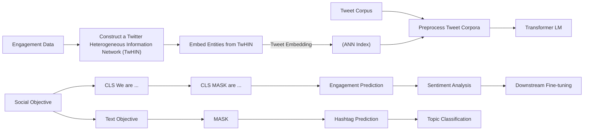
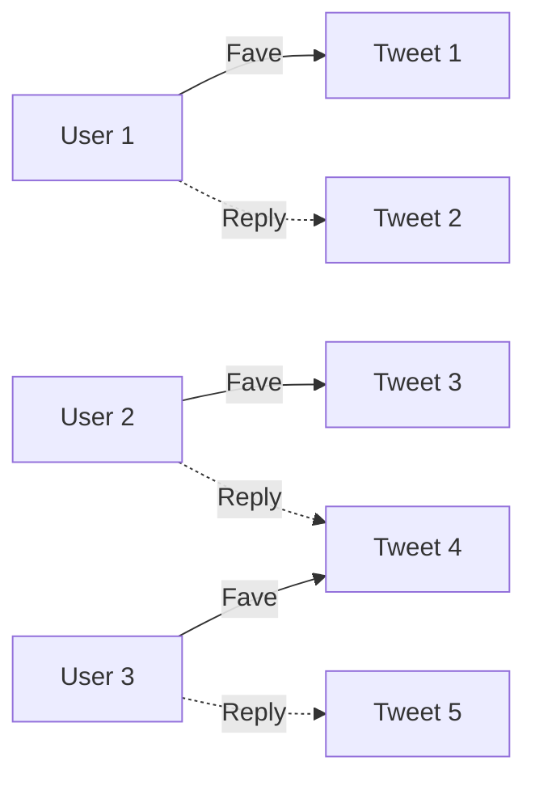

# TwHIN-BERT: A Socially-Enriched Pre-trained Language Model for Multilingual Tweet Representations at Twiter

Xinyang Zhang

xz43@illinois.edu

The University of Illinois at

Urbana-Champaign

Urbana, IL, USA

Yury Malkov

ymalkov@twitter.com

Twitter Cortex

San Francisco, CA, USA

Omar Florez

oflorez@twitter.com

Twitter Cortex

San Francisco, CA, USA

Serim Park

serimp@twitter.com

Twitter Cortex

San Francisco, CA, USA

Brian McWilliams

brimcwilliams@twitter.com

Twitter Cortex

San Francisco, CA, USA

Jiawei Han

hanj@illinois.edu

The University of Illinois at

Urbana-Champaign

Urbana, IL, USA

Ahmed El-Kishky∗

aelkishky@twitter.com

Twitter Cortex

San Francisco, CA, USA

## ABSTRACT

Pre-trained language models (PLMs) are fundamental for natural language processing applications. Most existing PLMs are not tailored to the noisy user-generated text on social media, and the pre-training does not factor in the valuable social engagement logs available in a social network. We present TwHIN-BERT, a multi lingual language model productionized at Twitter, trained on indomain data from the popular social network. TwHIN-BERT difers from prior pre-trained language models as it is trained with not only text-based self-supervision but also with a social objective based on the rich social engagements within a Twitter heterogeneous information network (TwHIN). Our model is trained on 7 billion tweets covering over 100 distinct languages, providing a valuable representation to model short, noisy, user-generated text. We eval uate our model on various multilingual social recommendation and semantic understanding tasks and demonstrate significant metric improvement over established pre-trained language models. We open-source TwHIN-BERT and our curated hashtag prediction and social engagement benchmark datasets to the research community1.

## CCS CONCEPTS

• Computing methodologies → Natural language processing;  
• Information systems → Social networks.

## KEYWORDS

language models, social media, social engagement

## 1 INTRODUCTION

The proliferation of pre-trained language models (PLMs) [12, 14] based on the Transformer architecture [47] has pushed state of the art across many tasks in natural language processing (NLP). As an application of transfer learning, these models are typically trained on massive text corpora and, when fine-tuned on downstream tasks, have demonstrated state-of-the-art performance.

Despite the success of PLMs in general-domain NLP, fewer attempts have been made in language model pre-training for usergenerated text on social media. In this work, we pre-train a language model for Twitter – a prominent social media platform where users post short messages called Tweets. Tweets contain informal diction, abbreviations, emojis, and topical tokens such as hashtags. As a result, PLMs designed for general text corpora may struggle to understand Tweet semantics accurately. Existing works [2, 32] on Twitter LM pre-training do not address these challenges and simply replicate general domain pre-training on Twitter corpora.

  
Figure 1: (a) This mock-up shows a short-text Tweet and social engagements such as Faves, Retweets, Replies, Fol-For KDD, mlows that create a social context to Tweets and signify Tweet appeal to engaging users. (b) Co-engagement is a strong indicator of Tweet similarity.

A distinctive feature of Twitter social media is the user interactions through Tweet engagements. As seen in Figure 1, when a user visits Twitter, in addition to posting Tweets, they can perform a variety of social actions such as “Favoriting”, “Replying” and “Retweeting” Tweets. The wealth of such engagement information is invaluable to Tweet content understanding. For example, the post “bottom of the ninth, two outs, and down by one!!” would be connected to baseball topics by its co-engaged Tweets, such as “three strikes and you’re out!!!”. Without the social contexts, a conventional text-only PLM objective would struggle to build this connection. As an additional benefit, a socially-enriched language model will also vastly benefit common applications on social media, such as social recommendations [53] and information difusion prediction [10, 40].

We introduce TwHIN-BERT– a multilingual language model for Twitter pre-trained with social engagements. The key idea of our method is to leverage socially similar Tweets for pre-training. Build ing on this idea, TwHIN-BERT has the following features. (1) We construct a Twitter Heterogeneous Information Network(TwHIN) [18] to unify the multi-typed user engagement logs. Then, we run scal able embedding and approximate nearest neighbor search to sift through hundreds of billions of engagement records and mine socially similar Tweet pairs. (2) In conjunction with masked language modeling, we introduce a contrastive social objective that enforces the model to tell if a pair of Tweets are socially similar or not. Our model is trained on 7 billion Tweets from over 100 distinct languages, of which 1 billion have social engagement logs.

We evaluate the TwHIN-BERT model on both social recommendation and semantic understanding downstream evaluation tasks. To comprehensively evaluate on many languages, we curate two large-scale datasets, a social engagement prediction dataset focused on social aspects and a hashtag prediction dataset focused on lan guage aspects. In addition to these two curated datasets, we also evaluate on established benchmark datasets to draw direct comparisons to other available pre-trained language models. TwHIN-BERT achieves state-of-the-art performance in our evaluations with a major advantage in the social tasks.

In summary, our contributions are as follows:

• We build the first ever socially-enriched pre-trained language model for noisy user-generated text on Twitter.  
• Our model is the strongest multilingual Twitter PLM so far, covering 100 distinct languages.  
• Our model has a major advantage in capturing the social appeal of Tweets.  
• We open-source TwHIN-BERT as well as two new Tweet bench mark datasets: (1) hashtag prediction and (2) social engagement prediction.

## 2 TWHIN-BERT

In this section, we outline how we construct training examples for our social pre-training objectives and subsequently train TwHIN-BERT with social and text objectives. As seen in Figure 2, we first construct and embed a user-Tweet engagement network. The resultant Tweet embeddings are then used to mine pairs of socially similar Tweets. These Tweet pairs and others are used to pre-train TwHIN-BERT, which can then be fine-tuned for various downstream tasks.

## 2.1 Mining Socially Similar Tweets

With abundant social engagement logs, we (informally) define socially similar Tweets as Tweets that are co-engaged by a similar set of users. The challenge lies in how to implement this social similarity by (1) fusing heterogeneous engagement types, such as “Favorite”, “Reply”, “Retweet”, and (2) eficiently mining billions of similar Tweet pairs.

To address these challenges, TwHIN-BERT first constructs a Twitter Heterogeneous Information Network (TwHIN) from the engagement logs, then runs a scalable heterogeneous network em bedding method to capture co-engagement and map Tweets and users into a vector space. With this, social similarity translates to embedding space similarity. Subsequently, we mine similar Tweet pairs via ANN search on the Tweet embeddings.

## 2.1.1 Constructing TwHIN. We define and construct TwHIN as:

Definition 2.1 (TwHIN). Our Twitter Heterogeneous Information Network is a directed bipartite graph $G = ( U , T , E , \phi )$ , where 𝑈 is the set of user nodes, 𝑇 is the set of Tweet nodes, $E = U \times T$ is the set of engagement edges. $\phi : E \mapsto \mathcal { R }$ is an edge type mapping function. Each edge $e \in E$ belongs to a type of engagement in ${ \mathcal { R } } .$

Our curated TwHIN (Figure 3) consists of approximately 200 million distinct users, 1 billion Tweets, and over 100 billion edges. We posit that our TwHIN encodes not only user preferences but also Tweet social appeal. We perform scalable network embedding to derive a social similarity metric from TwHIN. The network embedding fuses the heterogeneous engagements into a unified vector space that’s easy to operate on.

2.1.2 Embedding TwHIN Nodes. We seek to learn shallow embedding vectors (i.e., vector of learnable parameters) for each user $( u _ { j } )$ and Tweet $( t _ { k } )$ in the TwHIN; we denote these learnable embeddings for users and Tweets as $\mathbf { u _ { j } }$ and $\mathbf { t _ { k } }$ respectively. While our approach is agnostic to the exact methodology used to embed TwHIN, we follow the approach outlined in [17, 18]. A user-Tweet pair for a particular relation type $\phi ( ( u _ { j } , t _ { k } ) ) = r _ { m }$ is scored with a scoring function of the form $f ( u _ { j } , t _ { k } , r _ { m } )$ . Our training objective seeks to learn u, t and r parameters that maximize a log-likelihood constructed from the scoring function for $( u , t ) \in G$ and minimize for $( u , t ) \notin G$

For simplicity, we apply a simple dot product comparison between user and Tweet representations. For a user-tweet edge $( u _ { j } , t _ { k } )$ of relation $r _ { m }$ , this operation is defined by:

$$
f (e) = f (u _ {j}, t _ {k}, r _ {m}) = (\mathbf {u _ {j}} + \mathbf {r _ {m}}) ^ {\top} \mathbf {t _ {k}} \tag {1}
$$

As seen in Equation 1, we co-embed users and Tweets and scoring is performed by applying an engagement-specific translation embedding to user representations and computing the dot product with a Tweet representation. The task is then formulated as an edge (or link) prediction task. Following previous method [18, 20, 30], we maximize the following negative sampling objective:

$$
\underset {\mathbf {u}, \mathbf {r}, \mathbf {t}} {\operatorname{argmax}} \sum_ {e \in G} \left[ \log \sigma (f (e)) + \sum_ {e ^ {\prime} \in N (e)} \log \sigma \left(- f \left(e ^ {\prime}\right)\right) \right] \tag {2}
$$

where $N ( e )$ is a set of negatively sampled edges by corrupting positive edges via replacing either the user or Tweet in an edge with a negatively sampled user or Tweet. As user-Tweet engagement graphs are very sparse, randomly corrupting an edge in the graph is very likely to be a ‘negative’ edge absent from the graph.

Equation 2 represents the log-likelihood of predicting a binary “real" or “fake” label for the set of edges in the network (real) along with a set of the “fake” negatively sampled edges. To maximize the objective, we learn u and i parameters to diferentiate positive edges from negative, unobserved edges.

We adopt the PyTorch-Biggraph [24] framework for scalability. Following previous approaches, we train for 10 epochs and perform negative sampling both uniformly and proportional to entity prevalence in TwHIN [5, 24]. Optimization is via Adagrad.

flowchart

Figure 2: We outline the end-to-end TwHIN-BERT process. This three-step process involves (1) mining socially similar Tweet pairs by embedding a Twitter Heterogeneous Information Network (2) training TwHIN-BERT using a joint social and MLM objective and finally (3) fine-tuning TwHIN-BERT on downstream tasks.

flowchart

Figure 3: Twitter Heterogeneous Information Network (TwHIN) capturing social engagements between users and Tweets.

Upon learning dense representations of nodes in TwHIN, we utilize the Tweet representations to mine socially similar Tweets.

2.1.3 Mining Similar Tweet Pairs. Given the learned TwHIN Tweet embeddings, we seek to identify pairs of Tweets with similar social appeal – that is, Tweets that appeal to (i.e., are likely to be engaged with) similar users. We will use these socially-similar Tweet pairs as self-supervision when training TwHIN-BERT. To identify these pairs, we perform an approximate nearest neighbor (ANN) search in the TwHIN embedding space. To eficiently perform the search over 1B+ Tweets, we use the optimized $\mathrm { F A I S S ^ { 1 } }$ toolkit [23] to create a compact index of Tweets keyed by their engagement-based TwHIN embeddings. As each Tweet embedding is 256-dimensional, storing billion-scale Tweet embeddings would require more than one TB of memory. To reduce the size of the index such that it can fit on a 16 A100 GPU node, with each GPU possessing 40GB ofmemory, we ap ply product quantization [22] to discretize and reduce embeddings size. The resultant index corresponds to OPQ64,IVF65536,PQ64 in the FAISS index factory terminology.

After creating the FAISS index and populating it with TwHIN Tweet embeddings, we search the index using Tweet embedding queries to find pairs of similar Tweets $( t _ { i } , t _ { j } )$ such that $t _ { i }$ and $t _ { j }$ are close in the embedding space as defined by their cosine distance. To ensure high recall, we query the FAISS index with 2000 probes. Fi nally, we select the 𝑘 closet Tweets with the cosine distance between the query Tweet and retrieved Tweets’ embeddings. These pairs are used in our social objective when pre-training TwHIN-BERT.

## 2.2 Pre-training Objectives

Given the mined socially similar Tweets, we describe our language model training process. To train TwHIN-BERT, we first run the Tweets through the language model and then train the model with a joint contrastive social loss and masked language model loss.

Tweet Encoding with LM.. We use a Transformer language model to encode each Tweet. Similar to BERT [14], given the tokenized text $\pmb { w } _ { t } = [ w _ { 1 } , w _ { 2 } , . . . , w _ { n } ]$ of a Tweet 𝑡, we add special tokens to mark the start and end of the Tweet: $\hat { \mathbf { w } } _ { t } = [ \mathrm { C L S } ] \mathbf { w } _ { t } [ \mathrm { S E P } ]$ . As the Tweets are usually shorter than the maximum sequence length of a language model, we group multiple Tweets and feed them together into the language model when possible. We then apply CLS-pooling, which takes the [CLS] token embedding ofeach Tweet. These Tweet embeddings are passed through an MLP projection head for the social loss computation.

$$
\left[ \boldsymbol {e} _ {t _ {1}}, \boldsymbol {e} _ {t _ {2}}, \dots \right] = \operatorname{Pool} \left(\mathrm{LM} \left(\left[ \hat {\boldsymbol {w}} _ {t _ {1}}, \hat {\boldsymbol {w}} _ {t _ {2}}, \dots \right]\right)\right) \tag {3}
$$

$$
\boldsymbol {z} _ {t} = \operatorname{MLP} (\boldsymbol {e} _ {t}) \tag {4}
$$

Contrastive Social Loss. We use a contrastive loss to let our model learn whether two Tweets are socially similar or not. For each batch of 𝐵 socially similar Tweet pairs $\{ ( t _ { i } , t _ { j } ) \} _ { B } ,$ , we compute the NT-Xent loss [8] with in-batch negatives:

$$
\mathcal {L} _ {\text {social}} (i, j) = - \log \frac {\exp (\text {sim} (z _ {i} , z _ {j})) / \tau}{\sum_ {\mathcal {N} _ {B} (i)} \exp (\text {sim} (z _ {i} , z _ {k}) / \tau)} \tag {5}
$$

The negatives $N _ { B } ( i )$ of Tweet $t _ { i }$ are the (2𝐵 − 1) other Tweets in the batch that are not paired with $t _ { i } .$ We use cosine similarity for function sim(·, ·). 𝜏 is the loss temperature.

Our overall pre-training objective is a combination of the contrastive social loss and the masked language model loss [14]:

$$
\mathcal {L} = \mathcal {L} _ {\text {social}} + \lambda \mathcal {L} _ {\mathrm{MLM}} \tag {6}
$$

𝜆 is a hyperparameter that balances the social and language loss.

## 2.3 Pre-training Setup

Model Architecture. We use the same Transformer architecture as BERT [14] for our language model. We adopt the XLM-R [12] tokenizer, which ofers good capacity and coverage in all languages. The model has a vocabulary size of 250K. The max sequence length is set to 128 tokens. The detailed model setup can be found in Appen dix B. Note that although we have chosen this specific architecture, our social objective can be used in conjunction with a wide range of language model architectures.

Pre-training Data. We collect 7 billion Tweets in 100 languages from Jan. 2020 to Jun. 2022. Additionally, we collect 100 billion user-Tweet social engagement data covering 1 billion of our Tweets. We re-sample based on language frequency raised to the power of 0.7 to mitigate the under-representation of low-resource languages.

Training Procedure. Our training has two stages. In the first stage, we train the model from scratch using the 6 billion Tweets without user engagement. The model is trained for 500K steps on 16 Nvidia A100 GPUs (a2-megagpu-16g) with a total batch size of 6K. In the second stage, the model is trained for another 500K steps on the 1 billion Tweets with the joint MLM and social loss. We use mixed precision during training. Overall pre-training takes approximately five days for the base model and two weeks for the large model. We refer readers to Appendix B for the detailed hyperparameter setup.

## 3 EXPERIMENTS

In this section, we discuss baseline specifications, evaluation setup, and results from two families of downstream evaluation tasks.

## 3.1 Evaluated Methods

We evaluate TwHIN-BERT against the following baselines.

• mBERT [14] is the multilingual language variant of the popular BERT [14] language model. It is a general domain language model trained on Wikipedia dumps.  
• XLM-R [12] is a state-of-the-art general domain multilingual language model at its sizes. It is trained on over two terabytes of CommonCrawl data.  
• BERTweet [32] is the previous state-of-the-art English tweet language model. It adopts a monolingual tokenizer trained from scratch on tweets and replicates RoBERTa [27] training from scratch on 845M English tweets.  
• XLM-T [2] is a multilingual Twitter language model based on XLM-R [12]. It adopts the XLM-R tokenizer and model checkpoint and continues training on over 200M multilingual tweets.  
• TwHIN-BERT-MLM is an ablation of our model. It is trained on the same corpus and with the same protocol as our main models. It uses only an MLM objective.

We include base and large sizes of our model train on the same corpus. All baselines are base variants (with between 135M to 278M parameters depending on the size of the tokenizer). Our large model has around 550M parameters.

We note that all externally published models we compared against were trained on diferent quantities of data and the data difered temporally and linguistically. As such, we include these models to demonstrate the gap in performance between widely-used published and open-sourced models and the model we plan on opensourcing. On the other hand, our base-MLM model draws a direct comparison and isolates the efect of social engagement on the resultant model.

## 3.2 Social Engagement Prediction

Our first benchmark task is social engagement prediction. This task aims to evaluate how well the pre-trained language models capture the social aspects of user-generated text. In our task, we predict whether users modeled via a user embedding vector will perform a certain social engagement on a given Tweet.

We use diferent pre-trained language models to generate representations for Tweets, and then feed these representations into a simple prediction model alongside the corresponding user representation. The engagement prediction model is trained to predict whether a user will engage with a specific Tweet. The LM-generated embeddings are fixed when we train the downstream engagement prediction model.

Dataset. To curate our Tweet-Engagement dataset, we select the 50 popular languages on Twitter and sample 10,000 (or all if the total number is less than 10,000) Tweets of each language from a fixed time period. All Tweets are available via the Twitter public API. We then collect the user-Tweet engagement records associated with these Tweets. There are, on average, 29K engagement records per language. We ensure that there is no overlap between the evaluation and pre-training datasets.

Each engagement record consists of a pre-trained 256-dimensional user embedding [18] and a Tweet ID that indicates the user has engaged with the given Tweet. To ensure privacy, each user embedding appears only once, however, each tweet may be engaged by multiple users. We split the Tweets into train, development, and test sets with a 0.8/0.1/0.1 ratio, and then collect the respective engagement records for each subset.

Prediction Model. Given a pre-trained language model, we use it to generate an embedding for each Tweet 𝑡 given its content 𝒘𝑡: $\pmb { e } _ { t } = \operatorname { P o o l } \left( \operatorname { L M } ( \pmb { w } _ { t } ) \right)$ .

We apply the following pooling strategies to calculate the Tweet embedding from the language model. First, we take [CLS] token embedding as the first part. Then, we take the average token embedding of non-special tokens as the second part. The two parts are concatenated to form the Combined embedding of a Tweet.

With LM-derived Tweet embeddings, pre-trained user embeddings, and the user-Tweet engagement records, we build an engagement prediction model $\boldsymbol { \Theta } = \left( W _ { t } , W _ { u } \right)$ . Given a user 𝑢 and a Tweet 𝑡, the model projects the user embedding $_ { e _ { u } }$ and the Tweet embedding 𝒆𝑡 into the same space, and then calculates the probability of engagement:

$$
\begin{array}{l} \boldsymbol {h} _ {u} = \boldsymbol {W} _ {u} ^ {T} \boldsymbol {e} _ {u}, \quad \boldsymbol {h} _ {t} = \boldsymbol {W} _ {t} ^ {T} \boldsymbol {e} _ {t} \\ P (t \mid u) = \sigma \left(\boldsymbol {h} _ {u} ^ {T} \boldsymbol {h} _ {t}\right) \\ \end{array}
$$

We optimize a negative sampling loss on the training engagement records 𝑅. For each engagement pair $( u , t ) \in R$ , the loss is:

$$
\log \sigma \left(\boldsymbol {h} _ {u} ^ {T} \boldsymbol {h} _ {t}\right) + \mathbb {E} _ {t ^ {\prime} \sim P _ {n} (R)} \log \sigma \left(- \boldsymbol {h} _ {u} ^ {T} \boldsymbol {h} _ {t ^ {\prime}}\right)
$$

Table 1: Engagement prediction HITS@10 on high, mid, low-resource, and average of all languages.

<table><tr><td rowspan="2">Method</td><td colspan="4">High-Resource</td><td colspan="4">Mid-Resource</td><td colspan="4">Low-Resource</td><td>All</td></tr><tr><td>en</td><td>ja</td><td>es</td><td>ar</td><td>el</td><td>ur</td><td>tl</td><td>nl</td><td>no</td><td>te</td><td>da</td><td>ps</td><td>Avg.</td></tr><tr><td>BERTweet</td><td>.1414</td><td>-</td><td>-</td><td>-</td><td>-</td><td>-</td><td>-</td><td>-</td><td>-</td><td>-</td><td>-</td><td>-</td><td>-</td></tr><tr><td>mBERT</td><td>.0633</td><td>.0227</td><td>.0575</td><td>.0532</td><td>.0496</td><td>.0437</td><td>.0610</td><td>.0616</td><td>.0731</td><td>.0279</td><td>.1060</td><td>.0522</td><td>.0732</td></tr><tr><td>XLM-R</td><td>.0850</td><td>.0947</td><td>.0704</td><td>.0546</td><td>.0628</td><td>.0315</td><td>.0653</td><td>.0650</td><td>.1661</td><td>.0505</td><td>.1150</td><td>.0727</td><td>.0849</td></tr><tr><td>XLM-T</td><td>.1181</td><td>.1079</td><td>.1103</td><td>.1403</td><td>.0562</td><td>.0352</td><td>.0877</td><td>.0762</td><td>.1156</td><td>.0728</td><td>.1167</td><td>.0662</td><td>.1043</td></tr><tr><td>TwHIN-BERT</td><td></td><td></td><td></td><td></td><td></td><td></td><td></td><td></td><td></td><td></td><td></td><td></td><td></td></tr><tr><td>- Base-MLM</td><td>.1400</td><td>.1413</td><td>.1204</td><td>.1640</td><td>.0801</td><td>.0547</td><td>.0700</td><td>.0965</td><td>.1502</td><td>.0883</td><td>.1334</td><td>.0600</td><td>.1161</td></tr><tr><td>- Base</td><td>.1552</td><td>.2065</td><td>.1618</td><td>.2206</td><td>.0944</td><td>.0627</td><td>.1030</td><td>.1346</td><td>.1920</td><td>.1017</td><td>.1470</td><td>.0799</td><td>.1436</td></tr><tr><td>- Large</td><td>.1585</td><td>.2325</td><td>.2055</td><td>.1989</td><td>.1065</td><td>.0667</td><td>.1053</td><td>.1248</td><td>.2118</td><td>.1654</td><td>.1475</td><td>.0817</td><td>.1497</td></tr></table>

where $P _ { n } ( R )$ is a negative sampling distribution. We use the frequency of each Tweet in 𝑅 to the power of 3/4 for this distribution.

Our prediction model closely resembles classical link prediction models such as [45]. We keep the model simple, making sure it will not overpower the language model embeddings.

Evaluation Setup and Metrics. We conduct a hyperparameter search on the English development dataset and use these hyperpa rameters for the other languages. The prediction model projects user and Tweet embedding to 128 dimensions. We set the batch size to 512, and the learning rate to 1e-3. The best model on the validation set is selected for test set evaluation.

In the test set, we pair each user with 1,000 Tweets: one Tweet they have engaged with, and the rest are randomly sampled nega tives. The model ranks the Tweets by the predicted probability of engagement, and we evaluate with HITS@10. We report median results from 6 runs with diferent initialization.

Results. We show summarized results for selected high, mid, and low-resource languages (determined by language frequency on Twitter) in Table 1. Language abbreviations are ISO language codes2. We also show the average results from all 50 languages in the eval uation dataset and leave the details in Table 6. Our TwHIN-BERT model demonstrates significant improvement over the baselines on the social engagement task. Comparing our model to the ab lation without the social loss, we can see the contrastive social pre-training provides a significant lift over just MLM pre-training for social engagement prediction. An analysis of all 50 evaluation languages shows the large model to perform better than the base model on average, with more wins than losses. Additionally, we also observe that our method yields the most improvement when using the Combined [CLS] token and average non-special token embedding. We believe the [CLS] token embedding from our model captures the social aspects of the Tweet while averaging the other token embeddings captures the semantic aspects of the Tweet. Nat urally, utilizing both aspects is essential to better model a Tweet’s appeal and a user’s inclination to engage with a Tweet.

Table 2: Text classification dataset statistics. ∗Statistics for Hashtag shows the numbers for each language.

<table><tr><td>Dataset</td><td>Lang.</td><td>Label</td><td>Train</td><td>Dev</td><td>Test</td></tr><tr><td>SE2017</td><td>en</td><td>3</td><td>45,389</td><td>2,000</td><td>11,906</td></tr><tr><td>SE2018-en</td><td>en</td><td>20</td><td>45,000</td><td>5,000</td><td>50,000</td></tr><tr><td>SE2018-es</td><td>es</td><td>19</td><td>96,142</td><td>2,726</td><td>9,969</td></tr><tr><td>ASAD</td><td>ar</td><td>3</td><td>137,432</td><td>15,153</td><td>16,842</td></tr><tr><td>COVID-JA</td><td>ja</td><td>6</td><td>147,806</td><td>16,394</td><td>16,394</td></tr><tr><td>SE2020-hi</td><td>hi+en</td><td>3</td><td>14,000</td><td>3,000</td><td>3,000</td></tr><tr><td>SE2020-es</td><td>es+en</td><td>3</td><td>10,800</td><td>1,200</td><td>3,000</td></tr><tr><td>Hashtag</td><td>multi</td><td>500*</td><td>16,000*</td><td>2,000*</td><td>2,000*</td></tr></table>

## 3.3 Tweet Classification

Our second collection of downstream tasks is Tweet classification. In these tasks, we take as input the Tweet text and predict discrete labels corresponding to the label space for each task.

Datasets. We curate a multilingual Tweet hashtag prediction dataset (available via Twitter public API) to comprehensively cover the popular languages on Twitter. In addition, we evaluate on five external benchmark datasets for tasks such as sentiment classification, emoji prediction, and topic classification in selected languages. We show the dataset statistics in Table 2.

• Tweet Hashtag Prediction dataset is a multilingual hashtag prediction dataset we collected from Tweets. It contains Tweets from 50 popular languages. For each language, the 500 most popular hashtags were selected, and 100k tweets with those hashtags were sampled. We ensured each Tweet will only contain one of the 500 candidate hashtags. Similar to the work proposed in Mireshghallah et al. [31], the task is to predict the hashtag used in the Tweet.  
• SemEval2017 task 4A [38] is a English Tweet sentiment analysis dataset. The labels are three-point sentiments of “positive”, “negative”, “neutral”.  
• ASAD [1] is an Arabic Tweet sentiment dataset with the same three-point labels as SemEval2017 T4A.  
• SemEval2020 task 9 [33] contains code-mixed Tweets of Hindi + English and Spanish + English. We use the three-point sentiment analysis part of the dataset for evaluation.

Table 3: Multilingual hashtag prediction Macro-F1 on high, mid, low resource, and average of all languages.

<table><tr><td rowspan="2">Method</td><td colspan="4">High-Resource</td><td colspan="4">Mid-Resource</td><td colspan="4">Low-Resource</td><td>All</td></tr><tr><td>en</td><td>ja</td><td>es</td><td>ar</td><td>el</td><td>ur</td><td>tl</td><td>nl</td><td>no</td><td>te</td><td>da</td><td>ps</td><td>Avg.</td></tr><tr><td>BERTweet</td><td>59.01</td><td>-</td><td>-</td><td>-</td><td>-</td><td>-</td><td>-</td><td>-</td><td>-</td><td>-</td><td>-</td><td>-</td><td>-</td></tr><tr><td>mBERT</td><td>54.56</td><td>68.43</td><td>42.48</td><td>38.48</td><td>44.00</td><td>36.44</td><td>52.96</td><td>39.75</td><td>46.09</td><td>49.54</td><td>59.54</td><td>29.41</td><td>50.05</td></tr><tr><td>XLM-R</td><td>53.90</td><td>69.07</td><td>43.80</td><td>37.85</td><td>43.94</td><td>37.56</td><td>52.99</td><td>40.85</td><td>48.94</td><td>51.47</td><td>60.35</td><td>34.92</td><td>50.86</td></tr><tr><td>XLM-T</td><td>55.08</td><td>70.55</td><td>45.85</td><td>42.27</td><td>44.15</td><td>39.22</td><td>54.86</td><td>41.01</td><td>49.22</td><td>52.45</td><td>59.97</td><td>33.27</td><td>51.74</td></tr><tr><td>TwHIN-BERT</td><td></td><td></td><td></td><td></td><td></td><td></td><td></td><td></td><td></td><td></td><td></td><td></td><td></td></tr><tr><td>- Base-MLM</td><td>58.38</td><td>72.66</td><td>48.41</td><td>43.08</td><td>46.89</td><td>41.53</td><td>56.76</td><td>42.36</td><td>49.60</td><td>51.13</td><td>61.00</td><td>35.37</td><td>53.66</td></tr><tr><td>- Base</td><td>59.31</td><td>73.03</td><td>48.59</td><td>44.24</td><td>47.59</td><td>42.81</td><td>57.33</td><td>42.69</td><td>51.11</td><td>56.66</td><td>60.33</td><td>36.21</td><td>54.62</td></tr><tr><td>- Large</td><td>60.07</td><td>72.91</td><td>49.88</td><td>45.41</td><td>47.43</td><td>43.39</td><td>59.43</td><td>44.80</td><td>51.34</td><td>57.03</td><td>61.56</td><td>38.24</td><td>55.23</td></tr></table>

Table 4: External classification benchmark results.

<table><tr><td rowspan="2">Method</td><td rowspan="2">SE2017en</td><td colspan="2">SE2018</td><td rowspan="2">ASADar</td><td rowspan="2">COVID-JAja</td><td colspan="2">SE2020</td><td rowspan="2">Avg.</td></tr><tr><td>en</td><td>es</td><td>hi+en</td><td>es+en</td></tr><tr><td>BERTweet</td><td>72.97</td><td>33.27</td><td>-</td><td>-</td><td>-</td><td>-</td><td>-</td><td>-</td></tr><tr><td>mBERT</td><td>66.17</td><td>27.73</td><td>19.19</td><td>69.08</td><td>80.57</td><td>66.55</td><td>45.31</td><td>53.51</td></tr><tr><td>XLM-R</td><td>71.15</td><td>30.94</td><td>21.05</td><td>79.09</td><td>81.67</td><td>69.59</td><td>48.97</td><td>57.49</td></tr><tr><td>XLM-T</td><td>72.01</td><td>31.97</td><td>21.49</td><td>80.70</td><td>81.48</td><td>70.94</td><td>51.06</td><td>58.52</td></tr><tr><td>TwHIN-BERT</td><td></td><td></td><td></td><td></td><td></td><td></td><td></td><td></td></tr><tr><td>- Base-MLM</td><td>72.10</td><td>32.44</td><td>21.79</td><td>80.48</td><td>82.12</td><td>72.42</td><td>51.67</td><td>59.00</td></tr><tr><td>- Base</td><td>72.30</td><td>32.41</td><td>22.23</td><td>80.73</td><td>82.37</td><td>71.30</td><td>54.32</td><td>59.38</td></tr><tr><td>- Large</td><td>73.10</td><td>33.31</td><td>22.80</td><td>81.19</td><td>82.50</td><td>73.08</td><td>54.47</td><td>60.06</td></tr></table>

• SemEval2018 task 2 [3] is an emoji prediction dataset in both English and Spanish. The objective is to predict the most likely used emoji in a Tweet.  
• COVID-JA [43] is a Japanese Tweets classification dataset. The objective is to classify each Tweet into one of the six pre-defined topics around COVID-19.

Setup and Evaluation Metrics. We use the standard language model fine-tuning method as described in [14] and apply a linear prediction layer on top of the pooled output of the last transformer layer. Each model is fine-tuned for up to 30 epochs, and we evaluate the best model from the training epochs on the test set based on the development set performance. The fine-tuning hyperparameter setup can be found in Appendix B. We report the median results from 3 fine-tuning runs with diferent random seeds. Results are the evaluation metrics recommended for each benchmark dataset or challenge (Appendix C). For hashtag prediction datasets, we report macro-F1 scores. We conduct data contamination tests using character-level 50-gram overlaps [36] and found 1.56% and 1.10% contamination in the average results reported in Table 3 and Table 4.

Multilingual Hashtag Prediction. In Table 3, we show macro F1 scores on selected languages from our multilingual hashtag pre diction dataset. We also report the average performance of all 50 languages in the dataset, and leave detailed results in Table 7. We can see that TwHIN-BERT significantly outperforms the baseline methods at the same base size. Our large model is slightly better than or on par with the base model, with a better overall performance. On the English dataset, our model outperforms the BERTweet monolingual language model trained exclusively on English Tweets and with a dedicated English tokenizer. Comparing our model to the ablation with no social loss, the two models demonstrate similar performance with our model being slightly better. These results show that while our model has a major advantage on social tasks, it retains high performance on semantic understanding applications.

External Classification Benchmarks. As shown in Table 4, our TwHIN-BERT matches or outperforms the multilingual baselines on the established classification benchmarks. BERTweet fares better than our base model with its dedicated large English tokenizer and monolingual training. Our large model outperforms all the baselines. We note that it is not uncommon for a monolingual PLM to perform better than its multilingual counterpart, as observed in [13, 39, 50]. Similar to hashtag prediction, TwHIN-BERT performs on par with or slightly better than the MLM-only ablation.

## 3.4 Varying Downstream Supervision

In this set of experiments, we study how TwHIN-BERT performs when the amount ofdownstream supervision changes. We fine-tune our model and baseline models on the hashtag prediction dataset (Section 3.3). We select English and Japanese as they are the most popular languages on Twitter. We change the number of training examples given to the models during fine-tuning. It is varied from 2 to 32 labeled training examples per class. We follow the same protocols as Section 3.3 and report macro F1 scores on the test set.

Figure 4 shows the results. TwHIN-BERT holds significant performance gain across diferent amount of downstream supervision.

  
Figure 4: Macro-F1 on English and Japanese hashtag predic tion datasets w.r.t. the number of labeled training examples per class.

Table 5: Feature-based classification on hashtag prediction datasets (Macro-F1).

<table><tr><td>Method</td><td>English</td><td>Japanese</td><td>Arabic</td></tr><tr><td>BERTweet</td><td>48.56</td><td>-</td><td>-</td></tr><tr><td>XLM-R</td><td>30.88</td><td>41.14</td><td>21.55</td></tr><tr><td>XLM-T</td><td>41.66</td><td>51.56</td><td>32.46</td></tr><tr><td>TwHIN-BERT-base</td><td>51.16</td><td>64.12</td><td>37.20</td></tr><tr><td>TwHIN-BERT-large</td><td>54.12</td><td>64.03</td><td>38.78</td></tr></table>

Note that when supervision is scarce, e.g., two labeled training examples per class given, our model has an even larger relative performance improvement over the baselines. The results indicate that our model may empower weakly supervised applications on Tweet natural language understanding.

## 3.5 Feature-based Classification

In addition to language model fine-tuning experiments, we evaluate TwHIN-BERT’s performance as a feature extractor. We use the hashtag prediction datasets (Section 3.3) and select three popular languages with diferent scripts. We use our model and the baseline models to embed each Tweet into a feature vector and train a Logistic Regression classifier with the fixed feature vectors as input.

Table 5 shows TwHIN-BERT outperforming the baselines with a wide margin on all languages. This not only shows TwHIN-BERT has learned superior Tweet representations but also showcases its potential in other feature-based downstream applications.

## 4 RELATED WORKS

Pre-trained Language Models. Since their introduction [14, 35], pre-trained language models have enjoyed tremendous success in all aspects of natural language processing. Follow-up research has advanced PLMs by further scaling them with respect to the number of parameters and training data. PLM models have grown considerably in their sizes, from millions [14, 51] of parameters to billions [6, 37, 41] and even trillion-level [19]. Another avenue of improvement has been improving the training objectives used to train PLMs. A broad spectrum of pre-training objectives have been explored with diferent levels of success, Notable examples include masked language modeling [14], auto-regressive causal language modeling [51], model-based denoising [11], and corrective language modeling [29]. Despite these innovations in scaling and pre-training objectives, the vast majority of the work has focused on text-only training objectives applied to general domain corpora, e.g., Wikipedia and CommonCrawl. In this paper, we deviate from most previous works by exploring PLM training using solely Twitter in-domain data and training our model based on both text-based and social-based objectives.

Tweet Language Models. While a majority of PLMs are trained on general domain corpora, a few language models have been proposed specifically for Twitter and other social media platforms. BERTweet [32] mirrors BERT training on 850 million English Tweets. TimeLMs [28] trains a set of RoBERTa [27] models for English Tweets on diferent time ranges. XLM-T [2] continues the pretraining process from an XLM-R [12] checkpoint on 198 million multilingual Tweets. These methods mostly replicate existing general domain PLM methods and simply substitute the training data with Tweets. However, our approach utilizes additional social engagement signals to enhance the pre-trained Tweet representations.

Enriching PLMs with Additional Information. Several existing works use additional information for language model pre-training. ERNIE [54] and K-BERT [25] inject entities and their relations from knowledge graphs to augment the pre-training corpus. OAG-BERT [26] appends metadata of a document to its raw text, and designs objectives to jointly predict text and metadata. These works focus on bringing metadata and knowledge by injecting training instances, while our work leverages the rich social engagements embedded in the social media platform for text relevance. Recent work [52] has utilized document hyperlinks for LM pre-training, but does so with a simple three-way classification objective.

Network Embedding. Network embedding has emerged as a valuable tool for transferring information from relational data to other tasks [16]. Early network embedding methods such as Deep-Walk [34] and node2vec [21] embed homogeneous graphs by performing random walks and applying SkipGram modeling. With the introduction of heterogeneous information networks [42] as a formalism to model rich multi-typed, multi-relational networks, many heterogeneous network embedding approaches were developed [7, 9, 15, 44, 49]. However, many of these techniques are dificult to scale to very large networks. In this work, we apply knowledge graph embeddings [5, 46, 48], which have been shown to be both highly scalable and flexible enough to model multiple node and edge types.

## 5 CONCLUSIONS

In this work we introduce TwHIN-BERT, a multilingual language model trained on a large Tweet corpus. Unlike previous BERT-style language models, TwHIN-BERT is trained using two objectives: (1) a standard MLM pre-training objective and (2) a contrasting social objective. We perform a variety of downstream tasks using TwHIN-BERT on Tweet data. Our experiments demonstrate that TwHIN-BERT outperforms previously released language models on both semantic and social engagement prediction tasks. We release TwHIN-BERT34 to the academic community to further research in social media NLP.

Table 6: Full social engagement prediction results (HITS@10) on all evaluation Languages.

<table><tr><td rowspan="2">Language</td><td rowspan="2">mBERT</td><td rowspan="2">XLM-R</td><td rowspan="2">XLM-T</td><td colspan="3">TwHIN-BERT</td></tr><tr><td>Base-MLM</td><td>Base</td><td>Large</td></tr><tr><td>English (en)</td><td>.0633</td><td>.0850</td><td>.1181</td><td>.1400</td><td>.1552</td><td>.1585</td></tr><tr><td>Japanese (ja)</td><td>.0227</td><td>.0947</td><td>.1079</td><td>.1413</td><td>.2065</td><td>.2325</td></tr><tr><td>Turkish (tr)</td><td>.0348</td><td>.0476</td><td>.1180</td><td>.1268</td><td>.1204</td><td>.0547</td></tr><tr><td>Spanish (es)</td><td>.0575</td><td>.0704</td><td>.1103</td><td>.1204</td><td>.1618</td><td>.2055</td></tr><tr><td>Arabic (ar)</td><td>.0532</td><td>.0546</td><td>.1403</td><td>.1640</td><td>.2206</td><td>.1989</td></tr><tr><td>Portuguese (pt)</td><td>.0731</td><td>.1285</td><td>.1709</td><td>.1201</td><td>.1924</td><td>.1915</td></tr><tr><td>Persian (fa)</td><td>.0556</td><td>.1621</td><td>.1754</td><td>.1903</td><td>.2065</td><td>.2097</td></tr><tr><td>Korean (ko)</td><td>.0275</td><td>.1105</td><td>.1446</td><td>.1675</td><td>.3611</td><td>.3714</td></tr><tr><td>French (fr)</td><td>.0488</td><td>.0635</td><td>.0805</td><td>.0700</td><td>.1030</td><td>.1053</td></tr><tr><td>Russian (ru)</td><td>.0889</td><td>.1482</td><td>.1530</td><td>.0990</td><td>.1726</td><td>.1704</td></tr><tr><td>German (de)</td><td>.0852</td><td>.1071</td><td>.3019</td><td>.2189</td><td>.3020</td><td>.2621</td></tr><tr><td>Thai (th)</td><td>.0659</td><td>.1027</td><td>.1056</td><td>.1196</td><td>.2083</td><td>.2004</td></tr><tr><td>Italian (it)</td><td>.0586</td><td>.0769</td><td>.1237</td><td>.1478</td><td>.1699</td><td>.1706</td></tr><tr><td>Hindi (hi)</td><td>.0870</td><td>.0838</td><td>.1140</td><td>.1054</td><td>.1737</td><td>.1751</td></tr><tr><td>Indonesian (id)</td><td>.0809</td><td>.0735</td><td>.0921</td><td>.1014</td><td>.1021</td><td>.1115</td></tr><tr><td>Polish (pl)</td><td>.0867</td><td>.0835</td><td>.1031</td><td>.1402</td><td>.1696</td><td>.1633</td></tr><tr><td>Urdu (ur)</td><td>.0437</td><td>.0315</td><td>.0352</td><td>.0547</td><td>.0627</td><td>.0667</td></tr><tr><td>Filipino (tl)</td><td>.0610</td><td>.0653</td><td>.0877</td><td>.1045</td><td>.1332</td><td>.1400</td></tr><tr><td>Egpt. Arabic (arz)</td><td>.0669</td><td>.0749</td><td>.1049</td><td>.0943</td><td>.1159</td><td>.1122</td></tr><tr><td>Greek (el)</td><td>.0496</td><td>.0628</td><td>.0562</td><td>.0801</td><td>.0944</td><td>.1065</td></tr><tr><td>Serbian (sr)</td><td>.1013</td><td>.1144</td><td>.1359</td><td>.1394</td><td>.1647</td><td>.1556</td></tr><tr><td>Dutch (nl)</td><td>.0616</td><td>.0650</td><td>.0762</td><td>.0965</td><td>.1346</td><td>.1248</td></tr><tr><td>Hebrew (he)</td><td>.0392</td><td>.0433</td><td>.0441</td><td>.0499</td><td>.0550</td><td>.0577</td></tr><tr><td>Ukrainian (uk)</td><td>.0497</td><td>.0842</td><td>.0669</td><td>.0711</td><td>.0811</td><td>.0842</td></tr><tr><td>Catalan (ca)</td><td>.1339</td><td>.1364</td><td>.1650</td><td>.1930</td><td>.1955</td><td>.1713</td></tr><tr><td>Swedish (sv)</td><td>.0942</td><td>.0716</td><td>.1161</td><td>.1342</td><td>.1467</td><td>.1462</td></tr><tr><td>Tamil (ta)</td><td>.0556</td><td>.0691</td><td>.0929</td><td>.1005</td><td>.1037</td><td>.1060</td></tr><tr><td>Finnish (fi)</td><td>.0876</td><td>.1067</td><td>.1317</td><td>.1529</td><td>.1710</td><td>.1809</td></tr><tr><td>Czech (cs)</td><td>.1155</td><td>.0904</td><td>.0766</td><td>.0997</td><td>.1062</td><td>.1308</td></tr><tr><td>Nepali (ne)</td><td>.0421</td><td>.0555</td><td>.0486</td><td>.0589</td><td>.0787</td><td>.0851</td></tr><tr><td>Azerbaijani (az)</td><td>.1561</td><td>.1148</td><td>.1702</td><td>.1576</td><td>.1712</td><td>.1839</td></tr><tr><td>Marathi (mr)</td><td>.0506</td><td>.0600</td><td>.0519</td><td>.0597</td><td>.0780</td><td>.0906</td></tr><tr><td>Bangla (bn)</td><td>.1361</td><td>.1350</td><td>.1320</td><td>.1601</td><td>.1649</td><td>.1675</td></tr><tr><td>Norwegian (no)</td><td>.0731</td><td>.1661</td><td>.1156</td><td>.1502</td><td>.1920</td><td>.2118</td></tr><tr><td>Telugu (te)</td><td>.0279</td><td>.0505</td><td>.0728</td><td>.0883</td><td>.1017</td><td>.1654</td></tr><tr><td>Pashto (ps)</td><td>.0522</td><td>.0727</td><td>.0662</td><td>.0600</td><td>.0799</td><td>.0817</td></tr><tr><td>Danish (da)</td><td>.1060</td><td>.1150</td><td>.1167</td><td>.1334</td><td>.1470</td><td>.1475</td></tr><tr><td>Vietnamese (vi)</td><td>.0929</td><td>.1060</td><td>.1085</td><td>.1216</td><td>.1417</td><td>.1809</td></tr><tr><td>Cen. Kurdish (ckb)</td><td>.0725</td><td>.0699</td><td>.0946</td><td>.1023</td><td>.1023</td><td>.1185</td></tr><tr><td>Gujarati (gu)</td><td>.0666</td><td>.0676</td><td>.0676</td><td>.0793</td><td>.1054</td><td>.1057</td></tr><tr><td>Macedonian (mk)</td><td>.0685</td><td>.0945</td><td>.0534</td><td>.0973</td><td>.1089</td><td>.1041</td></tr><tr><td>Cebuano (ceb)</td><td>.1222</td><td>.1267</td><td>.1767</td><td>.1900</td><td>.2003</td><td>.2334</td></tr><tr><td>Romanian (ro)</td><td>.1718</td><td>.1493</td><td>.1991</td><td>.2071</td><td>.2264</td><td>.2264</td></tr><tr><td>Kannada (kn)</td><td>.0552</td><td>.1355</td><td>.0814</td><td>.1098</td><td>.1282</td><td>.2113</td></tr><tr><td>Latvian (lv)</td><td>.0480</td><td>.0297</td><td>.0493</td><td>.0642</td><td>.0655</td><td>.0750</td></tr><tr><td>Bulgarian (bg)</td><td>.1953</td><td>.0448</td><td>.0702</td><td>.1790</td><td>.2248</td><td>.2269</td></tr><tr><td>Sinhala (si)</td><td>.0504</td><td>.0142</td><td>.0378</td><td>.0630</td><td>.0709</td><td>.0661</td></tr><tr><td>Icelandic (is)</td><td>.0319</td><td>.0341</td><td>.0466</td><td>.0364</td><td>.0387</td><td>.0603</td></tr><tr><td>Sindhi (sd)</td><td>.0619</td><td>.0288</td><td>.0553</td><td>.0885</td><td>.0951</td><td>.0973</td></tr><tr><td>Amharic (am)</td><td>.0293</td><td>.0663</td><td>.0491</td><td>.0543</td><td>.0698</td><td>.0818</td></tr><tr><td>Average</td><td>.0732</td><td>.0849</td><td>.1043</td><td>.1161</td><td>.1436</td><td>.1497</td></tr></table>

Table 7: Full hashtag prediction results (Macro-F1) on all evaluation languages.

<table><tr><td rowspan="2">Language</td><td rowspan="2">mBERT</td><td rowspan="2">XLM-R</td><td rowspan="2">XLM-T</td><td colspan="3">TwHIN-BERT</td></tr><tr><td>Base-MLM</td><td>Base</td><td>Large</td></tr><tr><td>English (en)</td><td>54.56</td><td>53.90</td><td>55.08</td><td>58.38</td><td>59.31</td><td>60.07</td></tr><tr><td>Japanese (ja)</td><td>68.43</td><td>69.07</td><td>70.55</td><td>72.66</td><td>73.03</td><td>72.91</td></tr><tr><td>Turkish (tr)</td><td>42.87</td><td>46.37</td><td>47.14</td><td>48.72</td><td>49.31</td><td>51.12</td></tr><tr><td>Spanish (es)</td><td>42.48</td><td>43.80</td><td>45.85</td><td>48.41</td><td>48.59</td><td>49.88</td></tr><tr><td>Arabic (ar)</td><td>38.48</td><td>37.85</td><td>42.27</td><td>43.08</td><td>44.24</td><td>45.41</td></tr><tr><td>Portuguese (pt)</td><td>47.81</td><td>50.33</td><td>51.98</td><td>52.15</td><td>52.98</td><td>56.08</td></tr><tr><td>Persian (fa)</td><td>43.39</td><td>45.04</td><td>45.25</td><td>46.02</td><td>47.46</td><td>47.94</td></tr><tr><td>Korean (ko)</td><td>75.46</td><td>77.73</td><td>78.45</td><td>79.49</td><td>79.11</td><td>80.02</td></tr><tr><td>French (fr)</td><td>40.37</td><td>40.81</td><td>41.89</td><td>44.43</td><td>45.40</td><td>47.01</td></tr><tr><td>German (de)</td><td>40.80</td><td>41.42</td><td>41.11</td><td>41.32</td><td>41.38</td><td>42.59</td></tr><tr><td>Thai (th)</td><td>44.10</td><td>56.27</td><td>57.40</td><td>58.25</td><td>58.80</td><td>59.46</td></tr><tr><td>Italian (it)</td><td>42.36</td><td>41.82</td><td>42.76</td><td>45.11</td><td>44.18</td><td>45.72</td></tr><tr><td>Hindi (hi)</td><td>49.84</td><td>51.92</td><td>52.58</td><td>55.17</td><td>55.28</td><td>57.29</td></tr><tr><td>Chinese (zh)</td><td>72.88</td><td>72.54</td><td>72.40</td><td>73.85</td><td>73.94</td><td>72.30</td></tr><tr><td>Polish (pl)</td><td>48.97</td><td>50.20</td><td>50.50</td><td>51.20</td><td>51.81</td><td>54.49</td></tr><tr><td>Urdu (ur)</td><td>36.44</td><td>37.56</td><td>39.22</td><td>41.53</td><td>42.81</td><td>43.39</td></tr><tr><td>Filipino (tl)</td><td>52.96</td><td>52.99</td><td>54.86</td><td>56.76</td><td>57.33</td><td>59.43</td></tr><tr><td>Greek (el)</td><td>44.00</td><td>43.94</td><td>44.15</td><td>46.89</td><td>47.59</td><td>47.43</td></tr><tr><td>Serbian (sr)</td><td>42.50</td><td>42.32</td><td>40.71</td><td>44.22</td><td>45.95</td><td>47.45</td></tr><tr><td>Dutch (nl)</td><td>39.75</td><td>40.85</td><td>41.01</td><td>42.36</td><td>42.69</td><td>44.80</td></tr><tr><td>Catalan (ca)</td><td>48.61</td><td>47.85</td><td>48.79</td><td>51.72</td><td>52.60</td><td>52.90</td></tr><tr><td>Swedish (sv)</td><td>47.79</td><td>47.80</td><td>47.31</td><td>49.39</td><td>51.28</td><td>51.44</td></tr><tr><td>Tamil (ta)</td><td>48.04</td><td>49.67</td><td>50.65</td><td>52.85</td><td>54.14</td><td>54.92</td></tr><tr><td>Finnish (fi)</td><td>45.28</td><td>45.28</td><td>44.03</td><td>43.98</td><td>45.59</td><td>46.42</td></tr><tr><td>Czech (cs)</td><td>53.03</td><td>52.60</td><td>52.89</td><td>55.01</td><td>55.93</td><td>56.02</td></tr><tr><td>Nepali (ne)</td><td>44.58</td><td>47.00</td><td>46.94</td><td>49.83</td><td>51.57</td><td>51.12</td></tr><tr><td>Marathi (mr)</td><td>50.85</td><td>48.40</td><td>51.44</td><td>54.18</td><td>55.76</td><td>55.31</td></tr><tr><td>Malayalam (ml)</td><td>38.43</td><td>42.20</td><td>42.77</td><td>44.72</td><td>45.86</td><td>44.36</td></tr><tr><td>Bangla (bn)</td><td>57.79</td><td>57.08</td><td>56.74</td><td>59.11</td><td>60.32</td><td>60.92</td></tr><tr><td>Hungarian (hu)</td><td>60.29</td><td>59.94</td><td>60.08</td><td>61.86</td><td>63.81</td><td>62.68</td></tr><tr><td>Slovenian (sl)</td><td>58.79</td><td>59.68</td><td>59.13</td><td>61.18</td><td>62.34</td><td>62.74</td></tr><tr><td>Norwegian (no)</td><td>46.09</td><td>48.94</td><td>49.22</td><td>49.60</td><td>51.11</td><td>51.34</td></tr><tr><td>Telugu (te)</td><td>49.54</td><td>51.47</td><td>52.45</td><td>55.13</td><td>56.66</td><td>57.03</td></tr><tr><td>Pashto (ps)</td><td>29.41</td><td>34.92</td><td>33.27</td><td>35.37</td><td>36.21</td><td>38.24</td></tr><tr><td>Danish (da)</td><td>59.54</td><td>60.35</td><td>59.97</td><td>61.00</td><td>60.33</td><td>61.56</td></tr><tr><td>Cen. Kurdish (ckb)</td><td>40.28</td><td>37.59</td><td>39.06</td><td>42.89</td><td>45.65</td><td>45.26</td></tr><tr><td>Gujarati (gu)</td><td>52.55</td><td>54.09</td><td>54.24</td><td>57.36</td><td>58.59</td><td>58.54</td></tr><tr><td>Romanian (ro)</td><td>71.24</td><td>71.53</td><td>72.34</td><td>73.17</td><td>73.25</td><td>73.58</td></tr><tr><td>Kannada (kn)</td><td>54.19</td><td>55.76</td><td>56.68</td><td>59.09</td><td>61.34</td><td>60.19</td></tr><tr><td>Estonian (et)</td><td>57.81</td><td>58.10</td><td>59.00</td><td>61.95</td><td>61.22</td><td>62.61</td></tr><tr><td>Latvian (lv)</td><td>58.03</td><td>55.18</td><td>57.53</td><td>58.43</td><td>59.52</td><td>61.47</td></tr><tr><td>Bulgarian (bg)</td><td>65.20</td><td>65.52</td><td>66.45</td><td>67.42</td><td>66.94</td><td>68.35</td></tr><tr><td>Sinhala (si)</td><td>37.71</td><td>40.17</td><td>42.77</td><td>45.72</td><td>47.54</td><td>47.06</td></tr><tr><td>Icelandic (is)</td><td>51.32</td><td>48.53</td><td>50.16</td><td>53.39</td><td>55.53</td><td>54.61</td></tr><tr><td>Sindhi (sd)</td><td>27.28</td><td>26.46</td><td>31.08</td><td>32.42</td><td>35.05</td><td>35.28</td></tr><tr><td>Basque (eu)</td><td>58.55</td><td>56.55</td><td>56.78</td><td>59.56</td><td>60.62</td><td>61.04</td></tr><tr><td>Amharic (am)</td><td>24.10</td><td>28.57</td><td>35.01</td><td>34.20</td><td>37.47</td><td>36.87</td></tr><tr><td>Lithuanian (lt)</td><td>71.31</td><td>69.50</td><td>69.65</td><td>72.26</td><td>72.43</td><td>73.09</td></tr><tr><td>Welsh (cy)</td><td>58.36</td><td>58.50</td><td>57.56</td><td>59.66</td><td>59.95</td><td>60.24</td></tr><tr><td>Haitian Creole (ht)</td><td>68.13</td><td>67.05</td><td>67.97</td><td>70.70</td><td>71.33</td><td>71.41</td></tr><tr><td>Average</td><td>50.05</td><td>50.86</td><td>51.74</td><td>53.66</td><td>54.62</td><td>55.23</td></tr></table>

## REFERENCES

[1] Basma Alharbi, Hind Alamro, Manal Abdulaziz Alshehri, Zuhair Khayyat, Manal Kalkatawi, Inji Ibrahim Jaber, and Xiangliang Zhang. 2020. ASAD: A Twitter based Benchmark Arabic Sentiment Analysis Dataset. ArXiv abs/2011.00578 (2020).  
[2] Francesco Barbieri, Luis Espinosa Anke, and José Camacho-Collados. 2021. XLM T: A Multilingual Language Model Toolkit for Twitter. ArXiv abs/2104.12250 (2021).  
[3] Francesco Barbieri, Jose Camacho-Collados, Francesco Ronzano, Luis Espinosa Anke, Miguel Ballesteros, Valerio Basile, Viviana Patti, and Horacio Saggion. 2018. SemEval 2018 Task 2: Multilingual Emoji Prediction. In Proceedings ofThe 12th International Workshop on Semantic Evaluation. Association for Computational Linguistics, New Orleans, Louisiana, 24–33. https://doi.org/10.18653/v1/S18-1003  
[4] Piotr Bojanowski, Edouard Grave, Armand Joulin, and Tomas Mikolov. 2017. En riching Word Vectors with Subword Information. Transactions ofthe Association for Computational Linguistics 5 (2017), 135–146. https://doi.org/10.1162/tacl\_a\_0 0051  
[5] Antoine Bordes, Nicolas Usunier, Alberto Garcia-Duran, Jason Weston, and Oksana Yakhnenko. 2013. Translating embeddings for modeling multi-relational data. Advances in neural information processing systems 26 (2013).  
[6] Tom Brown, Benjamin Mann, Nick Ryder, Melanie Subbiah, Jared D Kaplan, Prafulla Dhariwal, Arvind Neelakantan, Pranav Shyam, Girish Sastry, Amanda Askell, et al. 2020. Language models are few-shot learners. Advances in neural information processing systems 33 (2020), 1877–1901.  
[7] S. Chang, W. Han, J. Tang, G. Qi, C. Aggarwal, and T. Huang. 2015. Heterogeneous network embedding via deep architectures. In SIGKDD. 119–128.  
[8] Ting Chen, Simon Kornblith, Mohammad Norouzi, and Geofrey Hinton. 2020. A Simple Framework for Contrastive Learning of Visual Representations. In Proceedings ofthe 37th International Conference on Machine Learning (Proceedings ofMachine Learning Research, Vol. 119), Hal Daumé III and Aarti Singh (Eds.). PMLR, 1597–1607. https://proceedings.mlr.press/v119/chen20j.html  
[9] T. Chen and Y. Sun. 2017. Task-guided and path-augmented heterogeneous network embedding for author identification. In WSDM. 295–304.  
[10] Justin Cheng, Lada A. Adamic, P. Alex Dow, Jon M. Kleinberg, and Jure Leskovec. 2014. Can cascades be predicted?. In 23rd International World Wide Web Conference, WWW ’14, Seoul, Republic of Korea, April 7-11, 2014, Chin-Wan Chung, Andrei Z. Broder, Kyuseok Shim, and Torsten Suel (Eds.). ACM, 925–936. https://doi.org/10.1145/2566486.2567997  
[11] Kevin Clark, Minh-Thang Luong, Quoc V. Le, and Christopher D. Manning. 2020. ELECTRA: Pre-training Text Encoders as Discriminators Rather Than Generators. In 8th International Conference on Learning Representations, ICLR 2020, Addis Ababa, Ethiopia, April 26-30, 2020. OpenReview.net. https://openrevi ew.net/forum?id=r1xMH1BtvB  
[12] Alexis Conneau, Kartikay Khandelwal, Naman Goyal, Vishrav Chaudhary, Guil laume Wenzek, Francisco Guzmán, Edouard Grave, Myle Ott, Luke Zettlemoyer, and Veselin Stoyanov. 2020. Unsupervised Cross-lingual Representation Learning at Scale. In ACL.  
[13] Alexis Conneau and Guillaume Lample. 2019. Cross-lingual Language Model Pretraining. In Advances in Neural Information Processing Systems 32: Annual Conference on Neural Information Processing Systems 2019, NeurIPS 2019, December 8-14, 2019, Vancouver, BC, Canada, Hanna M. Wallach, Hugo Larochelle, Alina Beygelzimer, Florence d’Alché-Buc, Emily B. Fox, and Roman Garnett (Eds.). 7057–7067. https://proceedings.neurips.cc/paper/2019/hash/c04c19c2c2474dbf5 f7ac4372c5b9af1-Abstract.html  
[14] Jacob Devlin, Ming-Wei Chang, Kenton Lee, and Kristina Toutanova. 2019. BERT: Pre-training of Deep Bidirectional Transformers for Language Understanding. In Proceedings of the 2019 Conference of the North American Chapter of the Association for Computational Linguistics: Human Language Technologies, NAACL-HLT 2019, Minneapolis, MN, USA, June 2-7, 2019, Volume 1 (Long and Short Papers), Jill Burstein, Christy Doran, and Thamar Solorio (Eds.). Association for Computa tional Linguistics, 4171–4186. https://doi.org/10.18653/v1/n19-1423  
[15] Y. Dong, N. Chawla, and A. Swami. 2017. metapath2vec: Scalable representation learning for heterogeneous networks. In SIGKDD. 135–144.  
[16] Ahmed El-Kishky, Michael Bronstein, Ying Xiao, and Aria Haghighi. 2022. Graph based Representation Learning for Web-scale Recommender Systems. In Proceedings of the 28th ACM SIGKDD Conference on Knowledge Discovery and Data Mining. 4784–4785.  
[17] Ahmed El-Kishky, Thomas Markovich, Kenny Leung, Frank Portman, and Aria Haghighi. 2022. kNN-Embed: Locally Smoothed Embedding Mixtures For Multi interest Candidate Retrieval. arXiv preprint arXiv:2205.06205 (2022).  
[18] Ahmed El-Kishky, Thomas Markovich, Serim Park, Chetan Verma, Baekjin Kim, Ramy Eskander, Yury Malkov, Frank Portman, Sofía Samaniego, Ying Xiao, and Aria Haghighi. 2022. TwHIN: Embedding the Twitter Heterogeneous Information Network for Personalized Recommendation. In KDD ’22: The 28th ACM SIGKDD Conference on Knowledge Discovery and Data Mining, Washington, DC, USA, August 14 - 18, 2022, Aidong Zhang and Huzefa Rangwala (Eds.). ACM, 2842– 2850. https://doi.org/10.1145/3534678.3539080  
[19] William Fedus, Barret Zoph, and Noam Shazeer. 2021. Switch Transformers: Scaling to Trillion Parameter Models with Simple and Eficient Sparsity. CoRR abs/2101.03961 (2021). arXiv:2101.03961 https://arxiv.org/abs/2101.03961  
[20] Y. Goldberg and O. Levy. 2014. word2vec Explained: deriving Mikolov et al.’s negative-sampling word-embedding method. arXiv preprint arXiv:1402.3722 (2014).  
[21] A. Grover and J. Leskovec. 2016. node2vec: Scalable feature learning for networks. In SIGKDD. 855–864  
[22] Herve Jegou, Matthijs Douze, and Cordelia Schmid. 2010. Product quantization for nearest neighbor search. IEEE transactions on pattern analysis and machine intelligence 33, 1 (2010), 117–128.  
[23] Jef Johnson, Matthijs Douze, and Hervé Jégou. 2019. Billion-scale similarity search with gpus. IEEE Transactions on Big Data 7, 3 (2019), 535–547.  
[24] Adam Lerer, Ledell Wu, Jiajun Shen, Timothee Lacroix, Luca Wehrstedt, Abhijit Bose, and Alex Peysakhovich. 2019. Pytorch-biggraph: A large-scale graph embedding system. arXiv preprint arXiv:1903.12287 (2019).  
[25] Weijie Liu, Peng Zhou, Zhe Zhao, Zhiruo Wang, Qi Ju, Haotang Deng, and Ping Wang. 2020. K-BERT: Enabling Language Representation with Knowledge Graph. In AAAI.  
[26] Xiao Liu, Da Yin, Jingnan Zheng, Xingjian Zhang, P. Zhang, Hongxia Yang, Yuxiao Dong, and Jie Tang. 2022. OAG-BERT: Towards a Unified Backbone Language Model for Academic Knowledge Services. Proceedings ofthe 28th ACM SIGKDD Conference on Knowledge Discovery and Data Mining (2022).  
[27] Yinhan Liu, Myle Ott, Naman Goyal, Jingfei Du, Mandar Joshi, Danqi Chen, Omer Levy, Mike Lewis, Luke Zettlemoyer, and Veselin Stoyanov. 2019. RoBERTa: A Robustly Optimized BERT Pretraining Approach. CoRR abs/1907.11692 (2019). arXiv:1907.11692 http://arxiv.org/abs/1907.11692  
[28] Daniel Loureiro, Francesco Barbieri, Leonardo Neves, Luis Espinosa Anke, and José Camacho-Collados. 2022. TimeLMs: Diachronic Language Models from Twit ter. In Proceedings ofthe 60th Annual Meeting ofthe Association for Computational Linguistics, ACL 2022 - System Demonstrations, Dublin, Ireland, May 22-27, 2022, Valerio Basile, Zornitsa Kozareva, and Sanja Stajner (Eds.). Association for Computational Linguistics, 251–260. https://doi.org/10.18653/v1/2022.acl-demo.25  
[29] Yu Meng, Chenyan Xiong, Payal Bajaj, Saurabh Tiwary, Paul Bennett, Jiawei Han, and Xia Song. 2021. COCO-LM: Correcting and Contrasting Text Sequences for Language Model Pretraining. In Advances in Neural Information Processing Systems 34: Annual Conference on Neural Information Processing Systems 2021, NeurIPS 2021, December 6-14, 2021, virtual, Marc’Aurelio Ranzato, Alina Beygelzimer, Yann N. Dauphin, Percy Liang, and Jennifer Wortman Vaughan (Eds.). 23102–23114. https://proceedings.neurips.cc/paper/2021/hash/c2c2a04512b35d1 3102459f8784f1a2d-Abstract.htm  
[30] T. Mikolov, I. Sutskever, K. Chen, G. Corrado, and J. Dean. 2013. Distributed representations of words and phrases and their compositionality. NeurIPS 26 (2013).  
[31] Fatemehsadat Mireshghallah, Nikolai Vogler, Junxian He, Omar Florez, Ahmed El-Kishky, and Taylor Berg-Kirkpatrick. 2022. Non-Parametric Temporal Adaptation for Social Media Topic Classification. arXiv preprint arXiv:2209.05706 (2022).  
[32] Dat Quoc Nguyen, Thanh Vu, and Anh Tuan Nguyen. 2020. BERTweet: A pretrained language model for English Tweets. In Proceedings of the 2020 Conference on Empirical Methods in Natural Language Processing: System Demonstrations, EMNLP 2020 - Demos, Online, November 16-20, 2020, Qun Liu and David Schlangen (Eds.). Association for Computational Linguistics, 9–14. https://doi.org/10.186 53/v1/2020.emnlp-demos.2  
[33] Parth Patwa, Gustavo Aguilar, Sudipta Kar, Suraj Pandey, Srinivas PYKL, Björn Gambäck, Tanmoy Chakraborty, Thamar Solorio, and Amitava Das. 2020. SemEval-2020 Task 9: Overview of Sentiment Analysis of Code-Mixed Tweets. In Proceedings ofthe Fourteenth Workshop on Semantic Evaluation, SemEval@COLING 2020, Barcelona (online), December 12-13, 2020, Aurélie Herbelot, Xiaodan Zhu, Alexis Palmer, Nathan Schneider, Jonathan May, and Ekaterina Shutova (Eds.). International Committee for Computational Linguistics, 774–790. https://doi.org/10.18653/v1/2020.semeval-1.100  
[34] B. Perozzi, R. Al-Rfou, and S. Skiena. 2014. Deepwalk: Online learning of social representations. In SIGKDD. 701–710.  
[35] Matthew E. Peters, Mark Neumann, Mohit Iyyer, Matt Gardner, Christopher Clark, Kenton Lee, and Luke Zettlemoyer. 2018. Deep Contextualized Word Rep resentations. In Proceedings of the 2018 Conference of the North American Chapter ofthe Association for Computational Linguistics: Human Language Technologies, NAACL-HLT 2018, New Orleans, Louisiana, USA, June 1-6, 2018, Volume 1 (Long Papers), Marilyn A. Walker, Heng Ji, and Amanda Stent (Eds.). Association for Computational Linguistics, 2227–2237. https://doi.org/10.18653/v1/n18-1202  
[36] Alec Radford, Jefrey Wu, Rewon Child, David Luan, Dario Amodei, Ilya Sutskever, et al. 2019. Language models are unsupervised multitask learners. OpenAI blog 1, 8 (2019), 9  
[37] Colin Rafel, Noam Shazeer, Adam Roberts, Katherine Lee, Sharan Narang, Michael Matena, Yanqi Zhou, Wei Li, and Peter J. Liu. 2020. Exploring the Limits of Transfer Learning with a Unified Text-to-Text Transformer. J. Mach. Learn. Res. 21 (2020), 140:1–140:67. http://jmlr.org/papers/v21/20-074.html  
[38] Sara Rosenthal, Noura Farra, and Preslav Nakov. 2019. SemEval-2017 Task 4: Sentiment Analysis in Twitter. CoRR abs/1912.00741 (2019). arXiv:1912.00741 http://arxiv.org/abs/1912.00741  
[39] Phillip Rust, Jonas Pfeifer, Ivan Vulic, Sebastian Ruder, and Iryna Gurevych. 2021. How Good is Your Tokenizer? On the Monolingual Performance of Multilingual Language Models. In Proceedings ofthe 59th Annual Meeting ofthe Association for Computational Linguistics and the 11th International Joint Conference on Natural Language Processing, ACL/IJCNLP 2021, (Volume 1: Long Papers), Virtual Event, August 1-6, 2021, Chengqing Zong, Fei Xia, Wenjie Li, and Roberto Navigli (Eds.). Association for Computational Linguistics, 3118–3135. https://doi.org/10.18653 /v1/2021.acl-long.243  
[40] Aravind Sankar, Xinyang Zhang, Adit Krishnan, and Jiawei Han. 2020. Inf-VAE: A Variational Autoencoder Framework to Integrate Homophily and Influence in Difusion Prediction. In WSDM ’20: The Thirteenth ACM International Conference on Web Search and Data Mining, Houston, TX, USA, February 3-7, 2020, James Caverlee, Xia (Ben) Hu, Mounia Lalmas, and Wei Wang (Eds.). ACM, 510–518. https://doi.org/10.1145/3336191.3371811  
[41] Mohammad Shoeybi, Mostofa Patwary, Raul Puri, Patrick LeGresley, Jared Casper, and Bryan Catanzaro. 2019. Megatron-LM: Training Multi-Billion Parame ter Language Models Using Model Parallelism. CoRR abs/1909.08053 (2019). arXiv:1909.08053 http://arxiv.org/abs/1909.08053  
[42] Y. Sun andJ. Han. 2013. Mining heterogeneous information networks: a structural analysis approach. Acm Sigkdd Explorations Newsletter (2013).  
[43] Yu Suzuki. 2019. Filtering Method for Twitter Streaming Data Using Human-in the-Loop Machine Learning. J. Inf. Process. 27 (2019), 404–410. https://doi.org/ 10.2197/ipsjjip.27.404  
[44] J. Tang, M. Qu, and Q. Mei. 2015. Pte: Predictive text embedding through large scale heterogeneous text networks. In SIGKDD. 1165–1174.  
[45] Jian Tang, Meng Qu, Mingzhe Wang, Ming Zhang, Jun Yan, and Qiaozhu Mei. 2015. LINE: Large-scale Information Network Embedding. In Proceedings of the 24th International Conference on World Wide Web, WWW 2015, Florence, Italy, May 18-22, 2015, Aldo Gangemi, Stefano Leonardi, and Alessandro Panconesi (Eds.). ACM, 1067–1077. https://doi.org/10.1145/2736277.2741093  
[46] T. Trouillon, J Welbl, S. Riedel, É. Gaussier, and G. Bouchard. 2016. Complex embeddings for simple link prediction. In ICML. PMLR, 2071–2080.  
[47] Ashish Vaswani, Noam Shazeer, Niki Parmar, Jakob Uszkoreit, Llion Jones, Aidan N Gomez, Łukasz Kaiser, and Illia Polosukhin. 2017. Attention is all you need. Advances in neural information processing systems 30 (2017).  
[48] Q. Wang, Z. Mao, B. Wang, and L. Guo. 2017. Knowledge graph embedding: A survey of approaches and applications. TKDE 29, 12 (2017), 2724–2743.  
[49] L. Xu, X. Wei, J. Cao, and P. Yu. 2017. Embedding of embedding (EOE) joint embedding for coupled heterogeneous networks. In WSDM. 741–749.  
[50] Linting Xue, Noah Constant, Adam Roberts, Mihir Kale, Rami Al-Rfou, Aditya Siddhant, Aditya Barua, and Colin Rafel. 2021. mT5: A Massively Multilingual Pre-trained Text-to-Text Transformer. In Proceedings ofthe 2021 Conference of the North American Chapter of the Association for Computational Linguistics: Human Language Technologies, NAACL-HLT2021, Online, June 6-11, 2021, Kristina Toutanova, Anna Rumshisky, Luke Zettlemoyer, Dilek Hakkani-Tür, Iz Beltagy, Steven Bethard, Ryan Cotterell, Tanmoy Chakraborty, and Yichao Zhou (Eds.). Association for Computational Linguistics, 483–498. https://doi.org/10.18653/v 1/2021.naacl-main.41  
[51] Zhilin Yang, Zihang Dai, Yiming Yang, Jaime G. Carbonell, Ruslan Salakhutdi nov, and Quoc V. Le. 2019. XLNet: Generalized Autoregressive Pretraining for Language Understanding. In Advances in Neural Information Processing Systems 32: Annual Conference on Neural Information Processing Systems 2019, NeurIPS 2019, December 8-14, 2019, Vancouver, BC, Canada, Hanna M. Wallach, Hugo Larochelle, Alina Beygelzimer, Florence d’Alché-Buc, Emily B. Fox, and Roman Garnett (Eds.). 5754–5764. https://proceedings.neurips.cc/paper/2019/hash/dc6 a7e655d7e5840e66733e9ee67cc69-Abstract.htm  
[52] Michihiro Yasunaga, Jure Leskovec, and Percy Liang. 2022. LinkBERT: Pretrain ing Language Models with Document Links. In Proceedings ofthe 60th Annual Meeting of the Association for Computational Linguistics (Volume 1: Long Papers). Association for Computational Linguistics, Dublin, Ireland, 8003–8016. https://doi.org/10.18653/v1/2022.acl-long.551  
[53] Rex Ying, Ruining He, Kaifeng Chen, Pong Eksombatchai, William L. Hamilton, and Jure Leskovec. 2018. Graph Convolutional Neural Networks for Web-Scale Recommender Systems. In Proceedings ofthe 24th ACM SIGKDD International Conference on Knowledge Discovery & Data Mining, KDD 2018, London, UK, August 19-23, 2018, Yike Guo and Faisal Farooq (Eds.). ACM, 974–983. https://doi.org 10.1145/3219819.3219890  
[54] Zhengyan Zhang, Xu Han, Zhiyuan Liu, Xin Jiang, Maosong Sun, and Qun Liu. 2019. ERNIE: Enhanced Language Representation with Informative Entities. In Proceedings ofthe 57th Conference ofthe Association for Computational Linguistics, ACL 2019, Florence, Italy, July 28- August 2, 2019, Volume 1: Long Papers, Anna Korhonen, David R. Traum, and Lluís Màrquez (Eds.). Association for Computational Linguistics, 1441–1451. https://doi.org/10.18653/v1/p19-1139

## A DISTRIBUTION OF LANGUAGES IN TRAINING DATASET

Figure 5 shows the distribution of languages in our pre-training dataset. Some languages with diferent variations (e.g., Hindi and Hindi Romanized) are represented with the same ISO language code. We run fastText [4] language identification model lid.176.bin5 to detect languages.

We deem a language “high-resource” if we have more than 108 Tweets during pre-training after frequency-based re-sampling (Section 2.3); “mid-resource” if we have more than 107 and less than 108 Tweets; “low-resource” if we have less than 107 Tweets.

## B HYPERPARAMETERS FOR PRE-TRAINING AND FINE-TUNING

Table 8 shows the pre-training hyperparameters. The model architecture and hyperparameters not shown in the table are the same as RoBERTa [27].

Table 9 shows the hyperparameters for classification fine-tuning. We do hyperparameter selection on the development datasets and share the same set of hyperparameters for the base models, as we find them to perform well with this setting. The weight decay for base models is set to zero. A diferent set of hyperparameters were necessary for the large model because it behaves diferently from the base models in terms of convergence.

## C EVALUATION METRICS FOR EXTERNAL CLASSIFICATION BENCHMARKS

The recommended evaluation metrics that we report in Table 4 are as follows. Average recall for ASAD, SemEval 2017 datasets; Macro-F1 for SemEval 2018 English and Spanish datasets; Accuracy for COVID-JA, SemEval 2020 datasets.

## D ENGAGEMENT PREDICTION RESULTS ON ADDITIONAL LANGUAGES

Table 6 shows the engagement prediction results on all available evaluation languages. Some languages have more examples than other languages due to data availability.

## E HASHTAG PREDICTION RESULTS ON ADDITIONAL LANGUAGES

Table 7 shows the hashtag prediction results on all available evaluation languages. A small number of languages have less examples than shown in Table 2 due to data availability. The Russian language is not evaluated as the XLM-T baseline fails on some Russian characters in our dataset.

bar

| Language | # of Tweets |
| :--- | :--- |
| ia | ~2.5e9 |
| ên | ~2.5e9 |
| pt | ~7.5e8 |
| és | ~7.5e8 |
| ko | ~6.0e8 |
| ar | ~5.0e8 |
| tr | ~4.5e8 |
| th | ~3.0e8 |
| fr | ~2.5e8 |
| id | ~2.3e8 |
| ru | ~2.2e8 |
| de | ~1.5e8 |
| fa | ~1.4e8 |
| lt | ~1.4e8 |
| zh | ~1.0e8 |
| pl | ~8.5e7 |
| hi | ~8.5e7 |
| ur | ~6.5e7 |
| nl | ~6.0e7 |
| ei | ~5.5e7 |
| ms | ~5.0e7 |
| ca | ~3.5e7 |
| sr | ~3.5e7 |
| sv | ~3.2e7 |
| uk | ~3.0e7 |
| he | ~2.8e7 |
| fi | ~2.8e7 |
| cs | ~2.7e7 |
| ta | ~2.6e7 |
| ne | ~2.5e7 |
| vi | ~1.8e7 |
| hu | ~1.6e7 |
| eo | ~1.5e7 |
| bn | ~1.4e7 |
| mr | ~1.3e7 |
| ml | ~1.2e7 |
| hr | ~1.2e7 |
| no | ~1.1e7 |
| sw | ~1.05e7 |
| si | ~1.0e7 |
| te | ~1.0e7 |
| az | ~9.5e6 |
| da | ~9.5e6 |
| ro | ~9.0e6 |
| gi | ~9.0e6 |
| gu | ~8.5e6 |
| ps | ~8.0e6 |
| mk | ~7.5e6 |
| kn | ~7.0e6 |
| bg | ~6.0e6 |
| lv | ~5.5e6 |
| eu | ~5.5e6 |
| pa | ~5.5e6 |
| et | ~5.5e6 |
| mn | ~5.0e6 |
| sq | ~5.0e6 |
| si | ~4.8e6 |
| sd | ~4.5e6 |
| la | ~4.5e6 |
| is | ~4.5e6 |
| iy | ~4.2e6 |
| jt | ~4.2e6 |
| ku | ~4.0e6 |
| am | ~3.8e6 |
| bs | ~3.8e6 |
| hy | ~3.5e6 |
| or | ~3.2e6 |
| sk | ~3.0e6 |
| uz | ~2.8e6 |
| cy | ~2.5e6 |
| my | ~2.2e6 |
| su | ~2.2e6 |
| br | ~2.0e6 |
| as | ~1.5e6 |
| af | ~1.4e6 |
| be | ~1.4e6 |
| ly | ~1.0e6 |
| kk | ~8.0e5 |
| ga | ~8.0e5 |
| io | ~6.0e5 |
| ka | ~6.0e5 |
| km | ~5.5e5 |
| sa | ~5.0e5 |
| mg | ~4.5e5 |
| so | ~4.0e5 |
| ug | ~3.5e5 |
| ky | ~3.5e5 |
| gd | ~1.8e5 |
| yi | ~1.0e5 |

Figure 5: The number of Tweets in the pre-training dataset for each language. Languages are marked by ISO language codes.

Table 8: Hyperparameters for pre-training TwHIN-BERT.

<table><tr><td>Hyperparameter</td><td>TwHIN-BERT-base</td><td>TwHIN-BERT-large</td></tr><tr><td>Max sequence length</td><td>128</td><td>128</td></tr><tr><td>Precision</td><td>BF16</td><td>BF16</td></tr><tr><td colspan="3">Stage 1: MLM</td></tr><tr><td>Total batch size</td><td>6K</td><td>8K</td></tr><tr><td>Gradient accumulation steps</td><td>1</td><td>4</td></tr><tr><td>Peak learning rate</td><td>2e-4</td><td>2e-4</td></tr><tr><td>Warmup steps</td><td>30K</td><td>30K</td></tr><tr><td>Total steps</td><td>500K</td><td>500K</td></tr><tr><td colspan="3">Stage 2: MLM + Social</td></tr><tr><td>Total batch size</td><td>6K</td><td>6K</td></tr><tr><td>Gradient checkpointing</td><td>No</td><td>Yes</td></tr><tr><td>Peak learning rate</td><td>1e-4</td><td>1e-4</td></tr><tr><td>Warmup steps</td><td>30K</td><td>30K</td></tr><tr><td>Total steps</td><td>500K</td><td>500K</td></tr><tr><td>Contrastive projection head</td><td>[768, 768]</td><td>[1024, 512]</td></tr><tr><td>Contrastive loss temperature</td><td>0.1</td><td>0.1</td></tr><tr><td>Loss balancing λ</td><td>0.05</td><td>0.05</td></tr></table>

Table 9: Hyperparameters for fine-tuning TwHIN-BERT and the baselines for classification.

<table><tr><td>Hyperparameter</td><td>Hashtag</td><td>SE2017</td><td>SE2018</td><td>ASAD</td><td>COVID-JA</td><td>SE2020</td></tr><tr><td colspan="7">Base models</td></tr><tr><td>Learning rate</td><td>4e-5</td><td>4e-5</td><td>1e-5</td><td>1e-5</td><td>2e-5</td><td>2e-5</td></tr><tr><td>Batch size</td><td>128</td><td>128</td><td>128</td><td>128</td><td>128</td><td>128</td></tr><tr><td colspan="7">TwHIN-BERT-large</td></tr><tr><td>Learning rate</td><td>2e-5</td><td>2e-5</td><td>1e-5</td><td>1e-5</td><td>1e-5</td><td>1e-5</td></tr><tr><td>Weight decay</td><td>0</td><td>0</td><td>5e-4</td><td>5e-4</td><td>0</td><td>5e-4</td></tr><tr><td>Batch size</td><td>128</td><td>128</td><td>128</td><td>128</td><td>128</td><td>128</td></tr></table>