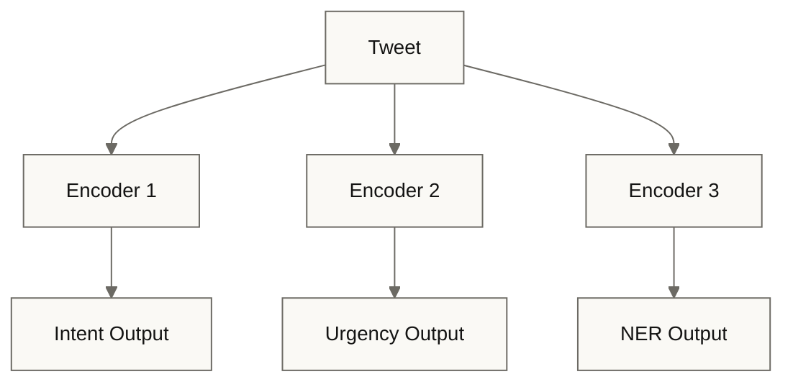
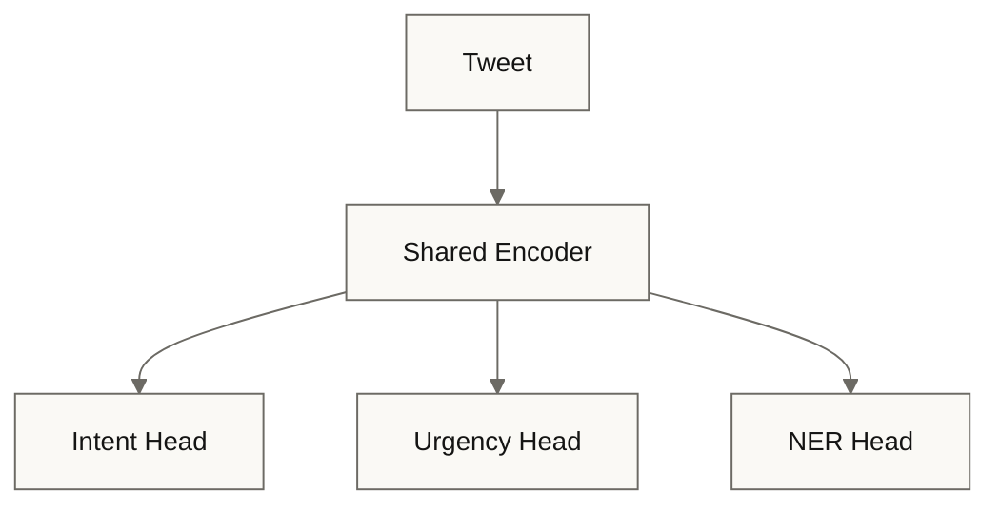
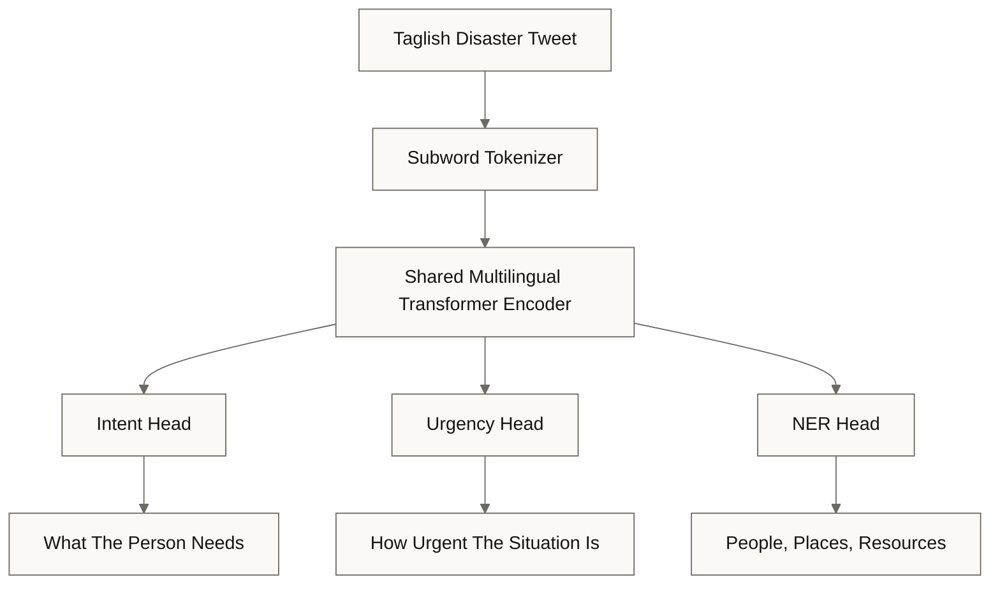
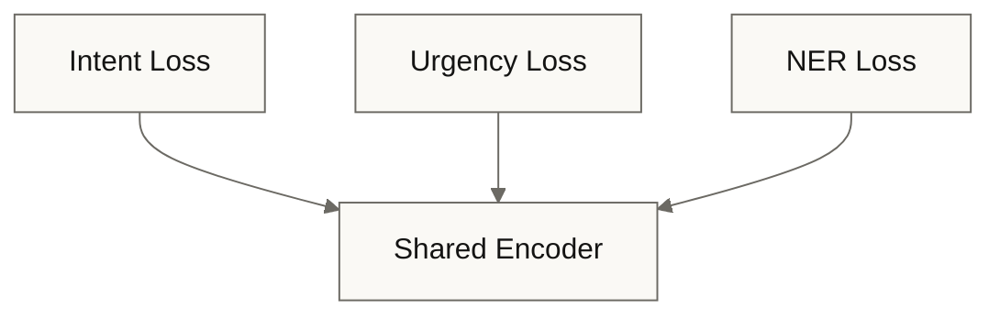
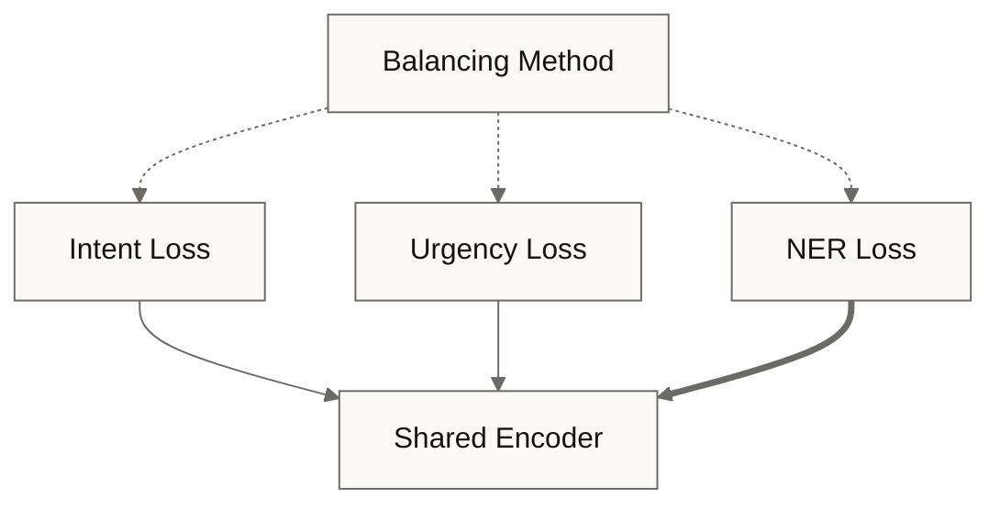
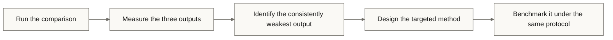
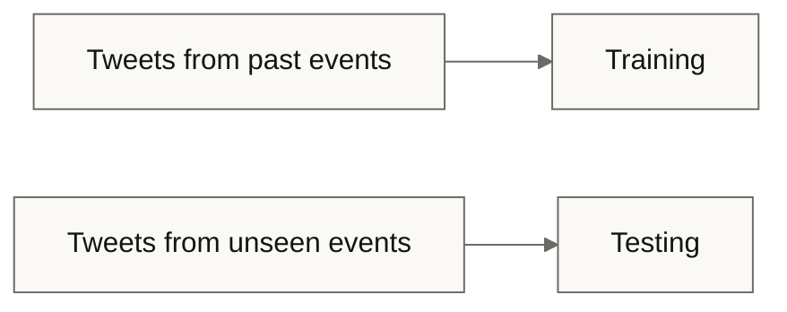

Title &amp; Problem Motivation

## Title Defense

Benchmarking Dynamic Multi-Task Balancing in a Multilingual Encoder for Joint Triage of Taglish Disaster Tweets

Group 2

---

Title &amp; Problem Motivation

## The Three Outputs

One multilingual Transformer encoder, one tweet, three outputs:

| Output | What it reads |
| --- | --- |
| Intent | What the person needs |
| Urgency | How urgent the situation is |
| NER | Which important people, places, and resources the tweet mentions |

Together, these are joint triage: intent classification, urgency prediction, and named entity recognition.

---

Title &amp; Problem Motivation

## Why Disasters

- During disasters, people use social media to request assistance, report casualties, identify locations, and describe dangerous conditions.
- Responders cannot manually interpret large volumes of time-sensitive tweets.

---

Title &amp; Problem Motivation

## Why Taglish

- Filipino-English code-switching is common in informal online communication.
- The mixing happens within a sentence, and even within one word.
- We must evaluate a disaster-response system in the language that people use to report emergencies.

---

Title &amp; Problem Motivation

## The Example Tweet

&ldquo;Pa-help naman po, stranded si lolo sa Marikina. Pataas ng pataas yung baha, di namin siya ma-evacuate.&rdquo;

- Intent: a request for evacuation or rescue assistance
- Urgency: an elderly person is stranded, and the flood continues to rise
- NER: Marikina is a location, and lolo indicates who is at risk
- "baha": the disaster-related condition

---

Title &amp; Problem Motivation

## The Multilingual Transformer Encoder

The encoder learns relationships among the words in a tweet, and it handles Filipino and English.

---

Title &amp; Problem Motivation

## One Shared Encoder Instead of Three

One pass per tweet provides the basis for all three outputs, which makes local deployment more practical.

---

Title &amp; Problem Motivation

## The Conflict

The three tasks pull the shared encoder in different directions.

- Intent and urgency need the meaning across both languages. They must understand that "ma-evacuate" means evacuation.
- NER needs the words exactly as written. It must track "ma-evacuate" with its exact spelling.
- When the adjustments conflict, one task can dominate and degrade the others. Which task loses is an open question.

If NER loses: responders know that someone is stranded, but not where. In a disaster, that mistake can delay the rescue.

---

Title &amp; Problem Motivation

## The Research Question

Which balancing method can train one shared multilingual Transformer encoder reliably for these three tasks in the Taglish disaster setting?

---

Background &amp; Research Gap

## What Exists

- Joint triage is feasible. CrisisSense-LLM classifies disaster tweets into multiple categories at once.
- Code-switched research knows the risk. A 2026 survey reports that multi-task learning can introduce negative transfer.
- Existing code-switched multi-task studies add an auxiliary task, not a balancing method.

---

Background &amp; Research Gap

## What Is Missing

- No published study benchmarks dynamic multi-task balancing on code-switched data.
- No Taglish dataset supports disaster triage. TweetTaglish labels language proportions, not disaster needs. Batayan covers no disaster response.
- Philippine disaster research is single-task. No named entity recognition, no multi-task learning, no joint triage labels.
- Results in this area are conditional. A code-switched Algerian Arabic study found that joint training helps some tasks in particular settings, and the outcome depends on the tasks, their order, and the data sizes.

---

Background &amp; Research Gap

## The Two Options and Their Costs

Responders face two options, and each has a cost.

| Option | Its cost |
| --- | --- |
| Three separate encoders | Slower, more resource-heavy |
| One shared encoder | Which balancing method to use, untested in this setting. With static equal weights, training can lose one of the three outputs |

Any choice today would be a scientific guess or a copy from research on other languages. Which one is an open question.

---

Background &amp; Research Gap

## Our Answer: A Controlled Benchmark

- No established baseline or unified workflow exists for this setting.
- We provide the benchmark: a new Taglish disaster tweet dataset, compared under a controlled protocol.

---

Proposed CS Methodology &amp; Architecture

## The System Pipeline

---

Proposed CS Methodology &amp; Architecture

## The Example Tweet Through the Diagram

- The tokenizer splits the tweet into subwords.
- "ma-evacuate" does not survive as one piece. The tokenizer splits at the hyphen, between the Tagalog prefix and the English stem.
- The encoder processes all pieces in one pass.
- The intent head reads the request for rescue, the urgency head reads how urgent the situation is, and the NER head reads Marikina and lolo.

---

Proposed CS Methodology &amp; Architecture

## Goal 1: Adapt to Fragmented Code-Switched Text

- Continue pre-training on unlabeled Taglish disaster tweets.
- Evidence exists: Gururangan and colleagues, and the code-switched pattern.
- The fragmentation problem is already demonstrated, so this goal needs no new evidence from our own results.

---

Proposed CS Methodology &amp; Architecture

## Goal 2: Balance the Three Outputs

- Train the three heads together with existing balancing methods under a controlled protocol.
- The methods include the established ones and the newer ones.
- Baselines: static equal weights, and three separate encoders.
- No output dominates the others or gets lost.

---

Proposed CS Methodology &amp; Architecture

## How Balancing Works

Each task produces its own loss during training.

Static equal weights: every loss gets the same influence at every step.

Dynamic methods: they adjust the influence while training runs.

---

Proposed CS Methodology &amp; Architecture

## The Training Loop

<pre class="font-mono text-sm leading-relaxed">
for each batch of labeled Taglish disaster tweets:
    1. Tokenize each tweet into subword pieces.
    2. Pass the pieces through the shared encoder once.
    3. Produce the three outputs with the three heads.
    4. Compute the intent, urgency, and NER losses.
    5. Combine the losses with the balancing method.
    6. Update the shared encoder and the three heads.
</pre>

---

Proposed CS Methodology &amp; Architecture

## The Example Tweet Through the Loop

The example tweet runs through the loop line by line.

- Line 1: the tweet splits into subword pieces, and "ma-evacuate" fragments.
- Lines 2 and 3: one pass through the encoder, and the three heads produce the outputs. The intent head reads a request for rescue, the urgency head reads a stranded elderly person and a rising flood, and the NER head reads Marikina and lolo.
- Line 4 is where the conflict appears. The intent and urgency losses reward the meaning across the pieces. The NER loss rewards the exact spelling of every entity.
- A token-level task produces thousands of training signals for every single signal from a sentence-level task. If NER dominates, intent or urgency degrades. Which one loses is open, and the comparison measures it.

---

Proposed CS Methodology &amp; Architecture

## From Measurement to Method

Our method is a targeted adaptation of an existing balancing method, not a new general-purpose algorithm.

It does not start from a formula. It starts from the measured weakness.

---

Experimental Evaluation &amp; Metrics Plan

## The Data and the Event Splits

New Taglish disaster tweet dataset: annotated tweets across a number of disaster events.

Random splits inflate the scores, because event-specific words leak between the training and the test sets. TREC Incident Streams follows the same event-split rule.

---

Experimental Evaluation &amp; Metrics Plan

## The Controlled Conditions

- Every method runs under the same conditions: same splits, same machines, same amount of training, repeated runs across different seeds.
- The repeated runs let us test whether the differences between methods are statistically significant, and not just random variation.
- The comparison includes the two baselines: static equal weights, and three separate encoders.
- Between the balancing methods, the only difference is line 5 of the training loop.

---

Experimental Evaluation &amp; Metrics Plan

## The Per-Output Scores

One score per output. Intent and urgency get a separate score per answer, then averaged.

  
Report of damage: appears often

  

  
Request for rescue: appears rarely

  

One overall count would let the common answer dominate, and the system could ignore the rare answer and still score high. Separate scores prevent that.

NER: how many people, places, and resources the system identifies with the exact start and end of each mention.

We report the three scores separately, because one averaged number can hide the imbalance among the three outputs. Taskonomy and PCGrad follow this rule.

---

Experimental Evaluation &amp; Metrics Plan

## The Extra Checks

- The average of the three scores, so our results can compare with studies that report one number.
- Negative transfer: how far an output falls below its single-task baseline.
- Naive baselines, such as always predicting the most common class.
- Scoring at the language switch points, on the words and phrases where Filipino and English meet, such as "ma-evacuate" from the example tweet.

---

Experimental Evaluation &amp; Metrics Plan

## The Cost Metrics

| Measurement | Setting |
| --- | --- |
| Extra memory and extra computation per step | Training on one machine with a graphics card |
| Latency per tweet, and throughput in tweets per second | Deployment on two consumer-grade laptops (Intel i5-13500HX, 32 GB DDR5, Python) |

These numbers matter because the shared encoder must stay practical for local hardware.

---

Experimental Evaluation &amp; Metrics Plan

## The Gradient Diagnostics

- During training, we record how hard each task pulls on the shared encoder, and in which direction.
- These numbers show how each method handles the conflict.
- They follow the published diagnostics from GradNorm and PCGrad.

---

Experimental Evaluation &amp; Metrics Plan

## The Decision Rule

- The weakest output is the one whose per-output score falls the most below its single-task baseline.
- The loss must repeat across the repeated runs and the event splits.
- This rule turns the comparison into a decision.

---

Experimental Evaluation &amp; Metrics Plan

## The Success Criterion

- Our method runs under the same protocol, and we report the same numbers for it.
- The method succeeds when the weakest output improves over the best score from the existing methods.
- We measure whether preventing the degradation costs anything on the other two outputs.

---

Feasibility, Timeline &amp; Expected Contributions

## Feasibility: The Resources Exist

- Training runs on one machine with a graphics card, and the deployment measurements run on our two laptops.
- The balancing methods are available in published libraries.
- The main costs are time spent annotating the tweets and reading the source papers.
- The annotation protocol is standard: multiple annotators label the same tweets, and we use the labels only after the agreement reaches the accepted level. We report the agreement number together with the dataset.
- Every claim in this defense stands on a source we can show.

---

Feasibility, Timeline &amp; Expected Contributions

## The Timeline: UR1

  

Chapters 1 to 3: problem and background, review of related literature, methodology

  

Collect and annotate the Taglish disaster tweets, with agreement checks

  

Training setup, two baselines, first balancing methods

---

Feasibility, Timeline &amp; Expected Contributions

## The Timeline: UR2

  

Finish the comparison and identify the consistently weakest output

  

Design and validate the targeted method under the same protocol

  

Chapters 4 and 5: results and discussion, summary, conclusions, recommendations

  

Build the Taglish disaster triage application

  

Release the annotated dataset, the trained system, and the code to the public

---

Feasibility, Timeline &amp; Expected Contributions

## Risks and Controls

| Risk | Control |
| --- | --- |
| Dataset: annotation effort depends on the tweet count, and labels must stay reliable | Standard annotation protocol and agreement checks before the team uses any label |
| The existing methods may already balance the three outputs well | One output is still the weakest, so the designed method still has a target, and the dataset and the benchmark stand on their own |
| Compute: the comparison multiplies methods, seeds, and event splits | A fixed training budget, published implementations, and tweet-length text, which one graphics card can handle |

---

Feasibility, Timeline &amp; Expected Contributions

## Four Contributions

1. The new Taglish disaster tweet dataset with joint intent, urgency, and NER annotations.
2. The benchmark that compares existing balancing methods under a controlled protocol.
3. The balancing method that prevents the consistently weakest output from degrading, designed from the measured weakness.
4. The software artifact, a Taglish disaster triage application.

---

Feasibility, Timeline &amp; Expected Contributions

## Closing

The study started with one question. This plan answers it in two steps.

1. The benchmark measures the three outputs and identifies the consistently weakest output.
2. We design a targeted balancing method that prevents that output from degrading, and we measure whether it costs anything on the other two outputs.

We do not answer with a guess. We answer with a measurement.

