# Chapter 1: The Problem and Its Background

## 1. Proposed Title

<!-- vale off -->
Benchmarking Dynamic Multi-Task Balancing in a Multilingual Transformer Encoder for Joint Triage of Taglish Disaster Tweets
<!-- vale on -->

## 2. Introduction to the Study

<!-- vale off -->
Natural language processing and multi-task representation learning represent essential components of modern artificial intelligence and crisis informatics. During natural disasters and humanitarian emergencies, affected populations generate extensive streams of real-time microblog posts on social media platforms to request urgent rescue, report infrastructure damage, and coordinate relief distribution. Extracting actionable computational intelligence from these incoming messages requires systems to process multiple concurrent language processing tasks, including identifying geographic location spans through Named Entity Recognition, categorizing specific humanitarian requests through intent classification, and assessing distress levels through urgency classification. In emergency operations where rapid triage determines resource allocation, developing efficient deep learning models that process these multi-faceted textual inputs simultaneously provides practical utility for disaster response systems.

Current natural language processing workflows face a direct trade-off between computational efficiency and model accuracy. Standard deployment strategies deploy separate single-task Transformer models for each individual triage task, which multiplies memory allocation and inference latency proportionally with the number of tasks and strains resource-constrained local workstations. In contrast, multi-task learning architectures share intermediate neural representations across tasks using a single Transformer encoder, enabling concurrent prediction in a single forward pass. However, optimizing shared parameters across heterogeneous loss functions causes gradient directional conflicts and gradient magnitude disparities during backpropagation. On low-resource and code-switched text, such as Tagalog-English (Taglish), these optimization conflicts frequently induce negative transfer, where parameter updates for one task degrade performance on another task and cause the joint model to underperform isolated single-task baselines.

To resolve these computational and optimization challenges, this study establishes an empirical benchmarking framework grounded in Design Science Research Methodology. The primary scientific contribution comprises the first multi-task optimization benchmark comparing dynamic loss-weighting methods and gradient-surgery techniques against tuned static scalarization on code-switched Taglish crisis text, alongside cross-task versus intra-task gradient conflict diagnostics on shared encoder layers. First, this research constructs the Multi-Task Corpus of Taglish Disaster Tweets, establishing concurrent annotations for token-level entity spans, intent categories, and urgency levels across four historical Philippine disaster events. Second, the study evaluates candidate Multi-Task Optimization algorithms, spanning dynamic loss-weighting methods and gradient-surgery and projection techniques, against isolated Single-Task Learning baselines, Uniform Equal Weighting, and Static Linear Scalarization under a 4-fold Leave-One-Event-Out cross-validation protocol across multiple random initialization seeds. Third, the framework incorporates routines for logging gradients in PyTorch alongside an intra-task baseline derived from half-batch gradients to measure the dynamics of gradient conflict and evaluate statistical significance using non-parametric tests. Finally, the research integrates the fine-tuned multi-task model into a prototype web application for disaster triage featuring an asynchronous web service backend and an interactive incident dashboard as an empirical demonstration vehicle. If empirical benchmarking reveals that candidate Multi-Task Optimization algorithms do not significantly outperform Uniform Equal Weighting across the disaster event folds, this study establishes empirical confirmation that equal weighting provides a robust, compute-efficient default for multi-task crisis triage under AdamW optimization without requiring complex gradient balancing. To ground this investigation within existing scholarship, the subsequent section reviews the theoretical, linguistic, and empirical background across global crisis informatics, multi-task optimization dynamics, and local disaster response workflows.
<!-- vale on -->

## 3. Background of the Study

<!-- vale off -->
### 3.1 Macro Level

Disaster triage systems must process incoming social media streams across three concurrent natural language processing tasks, including token-level Named Entity Recognition to locate critical geographic spans and infrastructure, sequence-level intent classification to categorize specific humanitarian requirements, and sequence-level urgency classification to prioritize life-threatening distress calls (Alam et al., 2021; Wang et al., 2021). In standard single-task learning architectures, deploying three independent Transformer models to execute these three tasks requires three separate forward passes per input message. This independent deployment multiplies inference latency and parameter memory proportionally with the number of tasks ($O(K)$ for $K$ tasks; Caruana, 1997; Ruder, 2017). In contrast, under hard parameter sharing (Caruana, 1997; Ruder, 2017), a shared neural network computes intermediate representations through a single forward pass for all tasks. This shared architecture maintains nearly constant memory and execution time because linear classification layers attached to the shared backbone contain less than one percent of total network parameters (calculated via standard pre-trained base architectures where task classification heads add fewer than 10,000 parameters to the 125M to 313M parameter shared encoder), substantially reducing computational overhead on resource-constrained local workstations (Chen et al., 2024; Zhang & Yang, 2021). Furthermore, representation sharing introduces an inductive bias that restricts the hypothesis search space to representations supporting all tasks simultaneously, improving generalization (Baxter, 2000).

Despite the computational efficiency of hard parameter sharing, joint training across heterogeneous loss functions introduces severe optimization bottlenecks. Multi-task learning functions as a multi-objective optimization problem over shared encoder parameters and task-specific classification heads (Lin & Zhang, 2023; Sener & Koltun, 2018). When models train jointly across different tasks, gradient updates computed from separate loss functions often point in opposing directions. When the inner product between task gradients is negative, updating shared parameters along the descent direction of one task increases the loss on another task, causing destructive task interference and inducing negative transfer across shared representation layers to a first-order approximation (Liu et al., 2021; Navon et al., 2022; Yu et al., 2020). Furthermore, when task loss scales and learning speeds diverge substantially, dominant tasks with larger gradient magnitudes dictate parameter updates and suppress secondary tasks during backpropagation (Chen et al., 2018; Qin et al., 2025).

Nonetheless, jointly modeling sequence-level classification and token-level sequence labeling provides strong mutual reinforcement. In task-oriented dialogue systems and spoken language understanding, Weld et al. (2022) demonstrated that joint models for utterance-level intent detection and token-level slot filling consistently outperform independent sequential pipelines by capturing mutual conditional distributions and eliminating cascading error propagation. In disaster triage operations, an analogous task synergy exists among triage tasks because sequence-level intent representations provide global semantic context to guide token-level entity extraction (such as disambiguating whether a place name indicates a flooded zone or a donation depot), while token-level entity spans provide localized evidentiary features that reinforce urgency priority classification (Wang et al., 2021; Chen et al., 2024). This theoretical synergy justifies joint multi-task modeling but requires resolving the underlying gradient optimization conflicts.

To resolve these optimization challenges, the machine learning literature developed two major algorithmic families of Multi-Task Optimization (MTO). The first family comprises dynamic loss-weighting methods, including Uncertainty Weighting (Kendall et al., 2018), which weights task losses by learned homoscedastic task uncertainties, GradNorm (Chen et al., 2018), which dynamically adjusts loss weights to balance gradient norms based on relative training rates, and Fast Adaptive Multitask Optimization (FAMO) (Liu et al., 2023), which equalizes task log-loss improvement rates. The second family comprises gradient-surgery and projection techniques, including Projecting Conflicting Gradients (PCGrad) (Yu et al., 2020), which projects conflicting gradient vectors onto orthogonal hyperplanes, Conflict-Averse Gradient Descent (CAGrad) (Liu et al., 2021), which maximizes worst-case local task improvement within a trust region, Impartial Multi-Task Learning (IMTL-G) (Liu et al., 2021b), which enforces equal-angle gradient projection across tasks, and Nash-MTL (Navon et al., 2022), which derives a scale-invariant Pareto update by modeling gradient aggregation as a cooperative bargaining game.

Despite theoretical advancements, empirical studies report conflicting evidence regarding whether complex Multi-Task Optimization algorithms consistently outperform Static Linear Scalarization (LS) or Uniform Equal Weighting (EW). Across machine translation and vision benchmarks, Xin et al. (2022) demonstrated that dynamic task weights assigned by MTO algorithms often remain nearly static during training while reducing training throughput (from 11.52 to 4.81 steps per second). Concurrently, Kurin et al. (2022) showed that specialized gradient-surgery techniques introduce substantial computational overhead, running 2x to 35x slower than Static Linear Scalarization because they require independent backward passes for each task. Furthermore, on computer vision benchmarks, Elich et al. (2024) observed that gradient magnitude disparities dominate while vector alignment modifications are often superfluous under Adam optimization, with Uniform Equal Weighting proving highly competitive. Because modern Transformer fine-tuning employs the AdamW optimizer (Loshchilov & Hutter, 2019), which preserves Adam's per-parameter first- and second-moment adaptivity while decoupling weight decay, this study investigates whether Elich et al.'s conclusions transfer to low-resource, code-switched crisis triage tasks characterized by asymmetric token-level and sequence-level supervision under AdamW optimization. To decouple genuine cross-task conflict from stochastic variance across mini-batch samples, the framework incorporates an intra-task baseline derived from half-batch gradients (following the intra-task gradient conflict analysis principle of Elich et al., 2024, operationalized here across disjoint half-batches). While global optimization literature demonstrates the theoretical friction of multi-task learning, evaluating these dynamics in real-world crisis response requires examining the specific operational and linguistic landscape of the Philippine disaster context.

### 3.2 Meso Level

Within the Philippine national context, disaster response represents a critical operational priority. The Philippine archipelago experiences an average of twenty typhoons annually, approximately five of which cause severe destruction and flooding (Ermino et al., 2022). During major historical hydrometeorological disasters (such as Typhoon Haiyan in 2013, Typhoon Vamco in 2020, Typhoon Rai in 2021, and Typhoon Paeng in 2022), affected populations generated extensive volumes of real-time microblog posts on social media platforms such as Twitter/X (NDRRMC, 2020, 2022). Citizens coordinate rescue operations and relief requests using unified crisis hashtags, prominently #RescuePH and #ReliefPH, which have structured crowdsourced disaster communications since Tropical Storm Habagat in 2012 (Lardizabal-Dado, 2020). While government disaster agencies, including the National Disaster Risk Reduction and Management Council (NDRRMC) and the Office of Civil Defense (OCD), utilize crowdsourced social media data to construct operational incident maps, manual message filtering cannot process the thousands of incoming urgent requests generated during peak landfall hours, leading to critical delays in emergency response (NDRRMC, 2020, 2022; Ermino et al., 2022).

The linguistic properties of Tagalog-English code-switching (Taglish) compound the processing of Philippine disaster messages. Taglish social media communications exhibit intra-sentential and intra-word code-mixing, attaching Tagalog bound grammatical affixes and focus markers to English root verbs (illustrated by morpho-syntactic combinations such as *ma-evacuate* or *nag-collapse*) alongside informal colloquialisms, abbreviations, and non-standard orthography (Herrera et al., 2022; Montalan et al., 2025). When multilingual Transformer tokenizers process these hybrid lexical items, subword segmentation algorithms produce extensive token over-fragmentation (inflating sequence lengths by 2x to 7x, and up to 15x on non-Latin scripts), which dilutes semantic embeddings and increases optimization variance across token-level sequence labeling and sequence-level classification heads (Ahia et al., 2023; Petrov et al., 2023). In an empirical study of low-resource, noisy code-switched text, Adouane and Bernardy (2020) demonstrated that joint multi-task training across sequence labeling and sentence classification is not universally beneficial. Specifically, pairing Named Entity Recognition with sentence-level Sentiment Analysis induced severe negative transfer, causing sequence labeling macro F1 scores to drop from 49.68% to 34.60%, whereas pairing Named Entity Recognition with Code-Switching Detection produced mutual gains in token classification accuracy and per-class identification (improving CSD macro F1 from 64.54% to 71.29%). This empirical variance demonstrates that multi-task architectures deployed on informal code-switched crisis text require principled multi-task optimization to prevent task degradation across asymmetric sequence-level and token-level objectives (Adouane & Bernardy, 2020; Zhang & Yang, 2021).

Operational constraints in local disaster response further restrict architectural choices. Local Government Units (LGUs), regional disaster coordination hubs, and non-governmental emergency teams frequently operate on commodity local workstations (such as an NVIDIA GeForce RTX 4060 GPU with 8GB VRAM, an Intel Core i5-13500HX CPU, and 32GB of system RAM) located in areas subject to electrical grid disruptions and telecommunication failures during severe typhoons. Relying on proprietary cloud-hosted Large Language Model (LLM) APIs introduces severe operational vulnerabilities during crises, including high recurring query costs, variable network transmission latency, complete service unavailability during internet outages, and potential data transmission compliance conflicts under the Philippine Data Privacy Act of 2012 (Republic Act 10173). Consequently, municipal emergency operations require an efficient, fine-tuned multilingual Transformer encoder capable of executing offline, real-time multi-task inference locally on commodity local workstations. These municipal workstation constraints and linguistic tokenization challenges necessitate examining the empirical dataset void that currently prevents training unified multi-task triage models.

### 3.3 Micro Level

**Table 1**  
*Structural Profile of Related Disaster Informatics and Philippine NLP Corpora*

| Dataset or Benchmark | Primary Domain | Language Distribution | Annotation Level and Scope | Validation and Split Protocol | Primary Limitation for Multi-Task Triage |
| :--- | :--- | :--- | :--- | :--- | :--- |
| HumAID (Alam et al., 2021) | Crisis Informatics (19 events) | Monolingual English (77,196 tweets) | Sequence-level (10 humanitarian categories) | Event-stratified and cross-event splits | Lacks token-level entity spans and code-switched morpho-syntax |
| CrisisMMD (Alam et al., 2018) | Multimodal Disaster Triage | Monolingual English (approximately 18,000 items) | Image and sequence-level category and damage | Random train, validation, and test splits | Lacks token-level sequence labeling and contains English-only text distribution |
| Batayan (Montalan et al., 2025) | General Tagalog and Taglish NLP | Tagalog and Taglish (3,800 test instances) | Multi-dataset benchmark across eight separate NLP tasks | Task-isolated benchmark splits | Tasks are hosted separately and do not support joint multi-task learning on crisis data |
| TweetTaglish (Herrera et al., 2022) | Code-Switching Analysis | Taglish social media (21,150 tweets) | Document-level language distribution regression | Standard k-fold cross-validation | Domain-agnostic and lacks operational emergency intent, urgency, and entity labels |
| TLUNIFIED-NER (Miranda, 2023) | General News Domain | Formal Tagalog (208,247 tokens) | Token-level sequence labeling (BIO entity spans) | Standard entity evaluation splits | Composed of formal news grammar and lacks crisis vocabulary, code-switching, and sequence classification labels |
| **Proposed Multi-Task Corpus** | **Philippine Disaster Triage** | **Informal Taglish (6,000 to 10,000 tweets)** | **Concurrent BIO spans (Location and Infrastructure), 4-class Intent, and 3-tier Urgency** | **4-fold Leave-One-Event-Out (LOEO)** | **Provides simultaneous token-level and sequence-level supervision for joint triage under event transfer** |

As Table 1 illustrates, existing benchmarks evaluate individual NLP tasks in isolation, focus on general non-crisis domains, or target sequence classification in English. To our knowledge (based on a systematic review of existing literature and benchmarks as of 2025), no publicly accessible dataset provides concurrent, expert-adjudicated annotations for token-level named entities, sequence-level intent categories, and sequence-level urgency tiers on code-switched Taglish disaster messages.

Current deployment approaches in disaster informatics face a direct trade-off between computational inefficiency and optimization failure. The baseline Single-Task Learning (STL) architecture deploys three separate Transformer models, which multiplies memory allocation and sequential execution overhead when hosting three independent models concurrently, straining resource-constrained local workstations. Conversely, training a single shared encoder under standard Uniform Equal Weighting creates severe gradient imbalances. Because token-level Named Entity Recognition aggregates cross-entropy loss across all subword tokens in a sequence while intent and urgency losses compute cross-entropy over a single pooled sentence representation, the gradient norm of the sequence labeling task substantially exceeds the gradient norm of the sequence classification tasks. In multi-task experiments on emergency microblogs, Pradhan et al. (2024) and Wang et al. (2021) similarly observed that dense token-level sequence labeling supervision can dominate sequence-level loss signals under uncalibrated static loss weighting, causing classification macro F1 to degrade during training. Combined with conflicting gradient directions between fine-grained token boundaries and document-level semantics, naive multi-task backpropagation degrades shared encoder layers through negative transfer, causing the joint model to underperform isolated Single-Task Learning baselines.

To resolve these computational and empirical challenges, this study designs, constructs, and empirically evaluates the Multi-Task Corpus of Taglish Disaster Tweets across four historical Philippine typhoons under a 4-fold Leave-One-Event-Out (LOEO) cross-validation protocol. By integrating PyTorch gradient diagnostic hooks and an intra-task half-batch baseline within a Design Science Research framework, the study benchmarks dynamic loss weighting and gradient surgery against linear scalarization and single-task baselines, providing principled empirical guidance and an operational triage artifact for disaster informatics.
<!-- vale on -->

## 4. Statement of the Problem

<!-- vale off -->
Disaster triage systems must process incoming social media streams across three concurrent natural language processing tasks, including token-level Named Entity Recognition (NER), sequence-level intent classification, and sequence-level urgency classification. Deploying isolated Single-Task Learning (STL) models increases computational latency and memory usage linearly ($O(K)$ for $K$ tasks) (Caruana, 1997; Ruder, 2017). In contrast, a shared Transformer encoder extracts features for the same tweet in a single forward pass ($O(1)$ relative to task count $K$). However, joint multi-task training couples token-level and sequence-level loss functions. This parameter coupling causes disparities in gradient magnitudes and gradient directional conflicts ($\cos(\mathbf{g}_i, \mathbf{g}_j) < 0$), which degrades accuracy in shared encoder layers through negative transfer to a first-order approximation (Liu et al., 2021; Yu et al., 2020). Specialized Multi-Task Optimization (MTO) algorithms, spanning dynamic loss-weighting methods and gradient-surgery and projection techniques, aim to balance conflicting gradients. Prior literature reports conflicting findings on whether dynamic balancing algorithms outperform Static Linear Scalarization (LS) or Uniform Equal Weighting (EW) (Elich et al., 2024; Kurin et al., 2022; Xin et al., 2022). Furthermore, diversity among samples within mini-batches also produces opposing gradient directions, which can confound measurements of cross-task gradient conflict (Elich et al., 2024). In addition, existing benchmarks in disaster informatics lack unified Taglish corpora containing concurrent annotations for token-level entities, message intent, and urgency. This study therefore aims to design, implement, and empirically evaluate an experimental benchmarking framework using the Multi-Task Corpus of Taglish Disaster Tweets (4-fold Leave-One-Event-Out splits across four historical Philippine typhoons), benchmarking candidate Multi-Task Optimization algorithms against isolated Single-Task Learning baselines, Uniform Equal Weighting, and Static Linear Scalarization. The experimental framework integrates routines for logging gradients in PyTorch to track per-task gradient norms and pairwise cosine similarities alongside an intra-task baseline derived from half-batch gradients to measure whether parameter sharing causes negative transfer and whether balancing algorithms restore single-task baseline accuracy. If candidate balancing algorithms fail to demonstrate statistically significant gains over Uniform Equal Weighting, the study establishes empirical confirmation that naive equal weighting remains an optimal, compute-efficient deployment baseline for code-switched crisis triage under AdamW optimization (the standard Adam-family optimizer for Transformer fine-tuning, inheriting per-parameter gradient adaptivity).

Specifically, this study addresses the following four research questions aligned with the Design Science Research (DSR) framework:

1. **Phase 1 (Baseline Analysis):** What are the baseline task F1 scores (macro-averaged F1 score for intent classification, macro-averaged F1 score for urgency classification, and span-level F1 score for Named Entity Recognition), single-instance inference latency ($t_{\text{exec}}$ at $B=1$), batched inference throughput ($B=32$), peak GPU memory allocation and reservation ($M_{\text{VRAM}}$), and host system RAM ($M_{\text{RAM}}$) of isolated Single-Task Learning baselines, and what are the corresponding task F1 scores, gradient norms ($\|\mathbf{g}_k\|_2$), ratios of gradient norms ($R_{\text{max/min}}$), and pairwise gradient cosine similarities of a shared multilingual Transformer encoder trained under Uniform Equal Weighting (EW) across four disaster event splits under a Leave-One-Event-Out protocol?
2. **Phase 2 (Design and Artifact Creation):** How can candidate Multi-Task Optimization (MTO) algorithms and shared multilingual Transformer architectures be designed and adapted in PyTorch to resolve gradient interference between token-level and sequence-level triage tasks on Taglish text, and how can the fine-tuned model be integrated into a prototype web application for disaster triage as an empirical demonstration vehicle?
3. **Phase 3 (Empirical Benchmarking):** How do candidate Multi-Task Optimization algorithms, spanning (a) dynamic loss-weighting methods (Uncertainty Weighting, GradNorm, and FAMO) and (b) gradient-surgery and projection techniques (PCGrad, CAGrad, IMTL-G, and Nash-MTL), compare to isolated Single-Task Learning baselines, Uniform Equal Weighting (EW), and Static Linear Scalarization (LS, with scalar loss weights tuned via a prior simplex grid sweep under an equal hyperparameter search budget on an internal validation split carved from training folds) across four disaster event splits under a Leave-One-Event-Out protocol in task F1 scores, relative multi-task transfer ($\Delta_m$), single-instance inference latency ($t_{\text{exec}}$ at $B=1$), batched throughput ($B=32$), peak GPU memory allocation and reservation ($M_{\text{VRAM}}$), host RAM ($M_{\text{RAM}}$), and training runtime?
4. **Phase 4 (Comparative Validation):** Do performance differences among candidate Multi-Task Optimization algorithms demonstrate statistical significance under a two-tier non-parametric validation framework, evaluating paired bootstrap 95% confidence intervals computed directly over test instances within each held-out disaster fold as primary statistical inference, alongside an omnibus repeated-measures Friedman test with Iman-Davenport correction ($p < 0.05$) and post-hoc Nemenyi testing across the 12 paired experimental runs (four disaster event splits evaluated across three random initialization seeds: seeds 42, 123, and 456) as an omnibus ranking screen while acknowledging residual correlation among seeds sharing a test fold (accompanied by an $N=4$ fold-level sensitivity analysis), and do relative multi-task transfer gains ($\Delta_m$) show Spearman rank correlation ($\rho$) across the paired experimental runs with pairwise cosine similarities of task gradients and ratios of gradient norms relative to the intra-task baseline derived from half-batch gradients?

## 5. Objectives of the Study

This study aims to design, construct, and empirically evaluate the Multi-Task Corpus of Taglish Disaster Tweets, implement candidate Multi-Task Optimization algorithms with routines for logging gradients in PyTorch, and integrate the fine-tuned multilingual Transformer encoder into a prototype web application for disaster triage as an empirical demonstration vehicle evaluated across held-out disaster events.

Aligned with the four Design Science Research (DSR) phases and paired directly with the specific problem statements, this study pursues the following four research objectives:

1. **Phase 1 (Baseline Analysis):** To measure baseline task F1 scores (macro-averaged F1 score for intent classification, macro-averaged F1 score for urgency classification, and span-level F1 score for Named Entity Recognition), single-instance inference latency ($t_{\text{exec}}$ at $B=1$), batched inference throughput ($B=32$), peak GPU memory allocation and reservation ($M_{\text{VRAM}}$), and host system RAM ($M_{\text{RAM}}$) using isolated Single-Task Learning baselines, and to measure corresponding task F1 scores, gradient norms ($\|\mathbf{g}_k\|_2$), ratios of gradient norms ($R_{\text{max/min}}$), and pairwise gradient cosine similarities using a Uniform Equal Weighting shared multilingual Transformer encoder across four disaster event splits under a Leave-One-Event-Out protocol.
2. **Phase 2 (Design and Artifact Creation):** To design and adapt the multi-task training pipeline, candidate Multi-Task Optimization (MTO) algorithms, and routines for logging gradients in PyTorch to resolve gradient interference between token-level and sequence-level triage tasks on Taglish text, and to integrate the fine-tuned model into a prototype web application for disaster triage as an empirical demonstration vehicle.
3. **Phase 3 (Empirical Benchmarking):** To benchmark candidate Multi-Task Optimization algorithms, spanning (a) dynamic loss-weighting methods (Uncertainty Weighting, GradNorm, and FAMO) and (b) gradient-surgery and projection techniques (PCGrad, CAGrad, IMTL-G, and Nash-MTL), against isolated Single-Task Learning baselines, Uniform Equal Weighting (EW), and Static Linear Scalarization (LS, with scalar loss weights tuned via a prior simplex grid sweep under an equal hyperparameter search budget on an internal validation split carved from training folds) across four disaster event splits under a Leave-One-Event-Out protocol, evaluating task F1 scores, relative multi-task transfer ($\Delta_m$), single-instance inference latency ($t_{\text{exec}}$ at $B=1$), batched throughput ($B=32$), peak GPU memory allocation and reservation ($M_{\text{VRAM}}$), host RAM ($M_{\text{RAM}}$), and training runtime.
4. **Phase 4 (Comparative Validation):** To evaluate the statistical significance of performance differences among candidate Multi-Task Optimization algorithms using a two-tier non-parametric validation framework, evaluating paired bootstrap 95% confidence intervals computed directly over test instances within each held-out disaster fold as primary statistical inference, alongside an omnibus repeated-measures Friedman test with Iman-Davenport correction ($p < 0.05$) and post-hoc Nemenyi testing across the 12 paired experimental runs (four disaster event splits evaluated across three random initialization seeds: seeds 42, 123, and 456) as an omnibus ranking screen while acknowledging residual correlation among seeds sharing a test fold (accompanied by an $N=4$ fold-level sensitivity analysis), and to evaluate whether relative multi-task transfer gains ($\Delta_m$) show Spearman rank correlation ($\rho$) across the paired experimental runs with pairwise cosine similarities of task gradients and ratios of gradient norms relative to the intra-task baseline derived from half-batch gradients.
<!-- vale on -->

## 6. Theoretical Framework

<!-- vale off -->
This study is grounded in three theoretical foundations, namely Design Science Research Methodology, computational complexity analysis of shared representations, and multi-objective optimization with gradient conflict principles.

First, this study adopts the Design Science Research Methodology (DSRM) established by Peffers et al. (2007) and the artifact evaluation principles formulated by Hevner et al. (2004). Unlike behavioral sciences that focus on observing and predicting phenomena, design science in computer science produces new scientific knowledge through the systematic design, construction, and empirical evaluation of computational artifacts. Hevner et al. (2004) establish that valid design science research requires systematic evaluation of artifact utility, problem relevance, and verifiable research contributions. Peffers et al. (2007) formulated this inquiry as an iterative six-activity lifecycle comprising (1) Problem Identification and Motivation, (2) Definition of the Objectives for a Solution, (3) Design and Development, (4) Demonstration, (5) Evaluation, and (6) Communication. To operationalize this methodology for undergraduate research in computer science, the research guidelines of CEU CSIT adapt DSRM into four sequential phases, comprising Baseline Analysis (Phase 1), Design and Artifact Creation (Phase 2), Empirical Benchmarking (Phase 3), and Comparative Validation (Phase 4). This theoretical foundation ensures that the primary research contribution resides in the novel empirical optimization knowledge and benchmark datasets, while the prototype web application for disaster triage serves as an empirical demonstration vehicle per Hevner Guideline 1 (Design as an Artifact), Hevner Guideline 3 (Design Evaluation), and the Peffers Demonstration activity.

Second, this study applies asymptotic time and space complexity analysis (Caruana, 1997; Ruder, 2017) alongside the inductive bias principles of Baxter (2000) to formalize computational trade-offs in multi-task NLP. In single-task learning architectures, deploying $K$ independent models to process $K$ natural language processing tasks requires $K$ separate forward passes for each input tweet. The computational inference latency scales linearly with task count as $O(K \cdot T_{\text{backbone}})$. Similarly, maintaining $K$ concurrent models in memory requires $O(K \cdot |\boldsymbol{\theta}_{\text{backbone}}|)$ parameter storage. In contrast, hard parameter sharing computes intermediate features once in a single shared forward pass. Total forward pass inference complexity scales as:

$$\mathcal{O}\left(T_{\text{backbone}} + \sum_{k=1}^K T_{\text{head}, k}\right)$$

where the backbone forward computation heavily dominates linear classification layers ($T_{\text{backbone}} \gg \sum_{k=1}^K T_{\text{head}, k}$), yielding effective $\mathcal{O}(1)$ execution time relative to task count $K$. Parameter memory allocation is restricted to $\mathcal{O}(|\boldsymbol{\theta}_{\text{backbone}}| + \sum_{k=1}^K |\boldsymbol{\theta}_{\text{head},k}|)$. Because task-specific classification heads contain less than one percent of total network parameters (fewer than 10,000 parameters across the linear layers attached to the 125M–313M shared encoder), hard parameter sharing substantially reduces both inference latency and memory usage compared to deploying separate models for each task. Furthermore, learning shared intermediate representations across related tasks restricts the search space of model parameters to representations that simultaneously support entity extraction, intent classification, and urgency assessment, formalizing an inductive bias that reduces sample complexity and improves generalization on code-switched Taglish text (Baxter, 2000).

Third, this study is anchored in Multi-Objective Optimization (Sener & Koltun, 2018) and Gradient Dynamics Principles (Chen et al., 2018; Elich et al., 2024; Kendall et al., 2018; Liu et al., 2021; Xin et al., 2022; Yu et al., 2020). In a hard-parameter-sharing neural network with shared encoder parameters $\boldsymbol{\theta}_{\text{sh}}$ and task-specific classification heads $\boldsymbol{\theta}_k$, joint training represents a multi-objective optimization problem.

$$\min_{\boldsymbol{\theta}_{\text{sh}}, \boldsymbol{\theta}_1, \dots, \boldsymbol{\theta}_K} \left( \mathcal{L}_1(\boldsymbol{\theta}_{\text{sh}}, \boldsymbol{\theta}_1), \mathcal{L}_2(\boldsymbol{\theta}_{\text{sh}}, \boldsymbol{\theta}_2), \dots, \mathcal{L}_K(\boldsymbol{\theta}_{\text{sh}}, \boldsymbol{\theta}_K) \right)$$

Multi-objective optimization theory establishes that multi-task learning seeks a Pareto-optimal parameter configuration where no individual task loss can be decreased without increasing the loss of another task. When updating shared parameters $\boldsymbol{\theta}_{\text{sh}}$ through gradient descent with learning rate $\eta$, applying a first-order Taylor expansion to the loss of task $j$ under a parameter step along task $i$ yields a direct mathematical relationship with higher-order curvature remainder.

$$\mathcal{L}_j(\boldsymbol{\theta}_{\text{sh}} - \eta \mathbf{g}_i) = \mathcal{L}_j(\boldsymbol{\theta}_{\text{sh}}) - \eta \langle \mathbf{g}_i, \mathbf{g}_j \rangle + \mathcal{O}(\eta^2)$$

This mathematical relationship reveals two primary modes of optimization failure in shared parameter spaces, where the linear inner product provides a first-order approximation under bounded learning rates (Yu et al., 2020), with a remainder from higher-order curvature terms.

- **Disparity in Gradient Magnitudes:** When tasks operate at different prediction levels (token-level sequence labeling versus sequence-level classification), gradient magnitudes diverge substantially ($\|\mathbf{g}_i\|_2 \gg \|\mathbf{g}_j\|_2$). The dominant task gradient controls directions of parameter updates, causing tasks with smaller gradients to learn slowly or suboptimally (Chen et al., 2018).
- **Gradient Directional Conflict:** When the inner product between task gradients is negative ($\langle \mathbf{g}_i, \mathbf{g}_j \rangle < 0$, or cosine similarity $\cos(\mathbf{g}_i, \mathbf{g}_j) < 0$), the first-order term $-\eta \langle \mathbf{g}_i, \mathbf{g}_j \rangle$ becomes positive. This condition indicates, to a first-order approximation, that parameter updates along task $i$ increase the loss on task $j$, inducing negative transfer across shared layers (Yu et al., 2020).

Specialized Multi-Task Optimization (MTO) algorithms address these optimization challenges through dynamic loss-weighting methods or gradient-surgery and projection techniques that project conflicting gradient vectors onto orthogonal hyperplanes or compute impartial descent directions. Furthermore, following the intra-task gradient conflict analysis principle of Elich et al. (2024), the framework integrates an intra-task baseline derived from half-batch gradients computed across disjoint half-batches within each task to distinguish stochastic variance across mini-batch samples from genuine cross-task gradient conflict before conducting a two-tier non-parametric validation framework, evaluating paired bootstrap 95% confidence intervals computed directly over test instances within each held-out disaster fold as primary statistical inference, alongside an omnibus repeated-measures Friedman test with Iman-Davenport correction ($p < 0.05$) and post-hoc Nemenyi testing across the 12 paired experimental runs (four disaster events evaluated across three random initialization seeds: seeds 42, 123, and 456) as an omnibus ranking screen while acknowledging residual correlation among seeds sharing a test fold (accompanied by an $N=4$ fold-level sensitivity analysis) (Demšar, 2006). If empirical evaluation demonstrates that candidate Multi-Task Optimization algorithms fail to significantly improve task accuracy over Uniform Equal Weighting across held-out disaster events, this theoretical framework confirms that the implicit gradient regularization of the AdamW optimizer combined with equal weighting provides a robust, compute-efficient default for multi-task triage on local workstations without requiring computationally expensive gradient-surgery computation. To translate these theoretical principles of design science, computational complexity, and multi-objective optimization into an actionable experimental architecture, the study adopts the Input-Process-Output conceptual framework.
<!-- vale on -->

## 7. Conceptual Framework

<!-- vale off -->
This study adopts the Input-Process-Output (IPO) model to structure the experimental design, algorithmic implementation, and empirical evaluation across the four Design Science Research (DSR) phases. Figure 1 outlines the conceptual framework of the study, mapping the input datasets, model architectures, and baseline configurations through data preprocessing, gradient diagnostic logging, multi-task training, and benchmarking processes to produce the trained multi-task model, empirical benchmark tables, statistical test results, and the prototype web application for disaster triage.

**Figure 1**  
*Input-Process-Output (IPO) Conceptual Framework of the Study*

```mermaid
flowchart LR
    subgraph INPUT["INPUT"]
        direction TB
        I1["Multi-Task Corpus of Taglish Disaster Tweets<br>(4-Fold LOEO Splits, BIO Spans, Intent, Urgency)"]
        I2["Shared Multilingual Transformer Encoders<br>(XLM-R, mBERT, SEA-LION ModernBERT, RoBERTa-Tagalog)"]
        I3["Optimization Configurations<br>(MTO Algorithms vs STL, EW, Static LS)"]
        I4["Hardware and Software Testbed<br>(RTX 4060 8GB VRAM, i5-13500HX, PyTorch 2.3)"]
    end

    subgraph PROCESS["PROCESS"]
        direction TB
        P1["Data Pipeline<br>(Tokenization, BIO Subword Alignment, LOEO Folds)"]
        P2["Optimization and Diagnostic Pipeline<br>(MTO Training, Gradient Logging Hooks, Intra-Task Baseline)"]
        P3["Standardized Benchmarking<br>(FP16 Execution, Batch 32, Latency, Peak VRAM, Host RAM)"]
        P4["Validation and Deployment Pipeline<br>(Paired Bootstrap 95% CIs, Friedman Test, FastAPI Dashboard)"]
    end

    subgraph OUTPUT["OUTPUT"]
        direction TB
        O1["Trained Multi-Task Model<br>(O(1) Joint Inference for NER, Intent, Urgency)"]
        O2["Validated Empirical Benchmark Tables<br>(Task F1, Δm, t_exec, M_VRAM, M_RAM)"]
        O3["Statistical Test Results<br>(p < 0.05, bootstrap 95% CIs, Spearman ρ)"]
        O4["Prototype Web Application<br>(Web Backend + 4-Stage Workflow Incident Dashboard)"]
    end

    INPUT --> PROCESS --> OUTPUT
```

### 7.1 Input

The input stage establishes the empirical datasets, neural network architectures, optimization algorithms, and testbed hardware specifications. Dataset inputs comprise the Multi-Task Corpus of Taglish Disaster Tweets (4-fold Leave-One-Event-Out splits across four historical Philippine typhoons, manually validated under an inter-annotator agreement protocol). Annotations include token-level named entities in BIO format for location and infrastructure spans alongside sequence-level intent and urgency labels. Architectural inputs specify a shared multilingual Transformer encoder capable of Taglish subword tokenization, evaluating candidate backbones including XLM-RoBERTa Base (278,885,778 parameters, ≈279M), multilingual BERT Base (177,853,440 parameters, ≈178M), SEA-LION ModernBERT (312,510,976 parameters, ≈313M, checkpoint aisingapore/sealion-modernbert-base adapting the ModernBERT architecture by Warner et al., 2025 with an expanded 256k vocabulary for Southeast Asian languages), and RoBERTa-Tagalog Base (≈125M parameters), with hard parameter sharing across intermediate representation layers, connected to task-specific classification heads for sequence classification and token-level sequence labeling. Algorithmic inputs specify candidate Multi-Task Optimization (MTO) methods across two algorithmic families, including dynamic loss-weighting methods (such as Uncertainty Weighting, GradNorm, and FAMO) and gradient-surgery and projection techniques (such as PCGrad, CAGrad, IMTL-G, and Nash-MTL), evaluated against isolated Single-Task Learning (STL) baselines, Uniform Equal Weighting ($w_k = 1/K$), and Static Linear Scalarization (LS, with scalar loss weights tuned via a prior simplex grid sweep under an equal hyperparameter search budget on an internal validation split carved from training folds) on a dedicated local workstation testbed equipped with an NVIDIA GeForce RTX 4060 GPU with 8GB VRAM (CUDA 12.1, cuDNN 9), an Intel Core i5-13500HX CPU (14 cores, 20 threads), and 32GB of system RAM, executing in Python 3.10 with PyTorch 2.3 and HuggingFace Transformers 4.44 on Linux Ubuntu 22.04 LTS under standardized baseline configurations (a batch size of 32 and sequence length of 128 tokens) with mixed-precision execution (FP16).

### 7.2 Process

The process stage executes the experimental pipeline across data preprocessing, multi-task model training, gradient logging, benchmarking, and web application deployment. The data pipeline performs text normalization, multilingual subword tokenization, alignment of BIO labels with subword tokens, and 4-fold Leave-One-Event-Out dataset splitting. The optimization pipeline implements candidate MTO algorithms within the PyTorch multi-task training loop, where routines for logging gradients compute per-task gradient norms ($\|\mathbf{g}_k\|_2$), ratios of gradient norms, and pairwise cosine similarities ($\cos(\mathbf{g}_i, \mathbf{g}_j)$) on shared encoder parameters. The pipeline calculates the intra-task baseline derived from half-batch gradients to decouple stochastic variance across mini-batch samples from cross-task gradient conflict. Standardized benchmarking routines evaluate models under uniform experimental parameters (a baseline batch size of 32, maximum sequence length of 128 tokens, and mixed-precision execution in FP16). The testbed records single-instance computational inference latency ($t_{\text{exec}}$ at $B=1$ in ms) and batched inference throughput ($B=32$ in tweets per second) across n=30 timed evaluation iterations (reported as mean $\pm$ 95% confidence interval) following 10 preliminary warm-up iterations, resets peak GPU memory tracking statistics before each evaluation fold, and records peak GPU memory allocation and reservation ($M_{\text{VRAM}}$ in MB) alongside host system RAM ($M_{\text{RAM}}$ in MB) observed during each evaluation fold. Finally, the validation pipeline conducts non-parametric hypothesis testing using paired bootstrap confidence intervals (95% CI) computed directly over test instances within each held-out disaster fold alongside an omnibus Friedman test with Iman-Davenport correction ($p < 0.05$, with post-hoc Nemenyi testing upon rejection of the omnibus null hypothesis) across the 12 paired experimental runs (four disaster events evaluated across three random initialization seeds: seeds 42, 123, and 456) as an omnibus ranking screen while acknowledging residual correlation among seeds sharing a test fold (accompanied by an $N=4$ fold-level sensitivity analysis), accompanied by Spearman rank correlation analysis ($\rho$) between relative multi-task transfer ($\Delta_m$) and gradient conflict metrics. The pipeline integrates the fine-tuned model into an asynchronous web service backend (implemented using FastAPI) with a relational store (implemented using SQLite or PostgreSQL) and an interactive incident dashboard (utilizing an offline gazetteer mapping dictionary with unmapped-span fallback for localized geographic visualization during telecommunication outages) tracking incidents across four workflow states (New, Acknowledged, Responding, and Resolved) as an empirical demonstration vehicle.

### 7.3 Output

The output stage delivers four concrete research deliverables across the Design Science Research lifecycle. The first deliverable is the trained multi-task model, consisting of a fine-tuned, hard-parameter-sharing multilingual Transformer encoder that executes Named Entity Recognition, intent classification, and urgency classification concurrently in a single forward pass ($O(1)$ relative to task count $K$). The second deliverable is a validated suite of empirical benchmark tables evaluating macro-averaged F1 score for intent classification, macro-averaged F1 score for urgency classification, span-level F1 score for Named Entity Recognition, relative multi-task transfer ($\Delta_m$), single-instance inference latency ($t_{\text{exec}}$ at $B=1$ in ms), batched inference throughput ($B=32$ in tweets per second), peak GPU memory allocation and reservation ($M_{\text{VRAM}}$ in MB), host RAM ($M_{\text{RAM}}$ in MB), and gradient diagnostic logs across four disaster event splits under a Leave-One-Event-Out protocol across three random initialization seeds (seeds 42, 123, and 456). If candidate balancing algorithms do not achieve statistically significant improvements over Uniform Equal Weighting ($\Delta_m \approx 0$), this benchmark confirms equal weighting as an optimal, compute-efficient deployment baseline for offline disaster triage under AdamW optimization. The third deliverable is the collection of statistical test results from non-parametric hypothesis tests (Friedman test with Iman-Davenport correction and post-hoc Nemenyi testing, paired bootstrap 95% confidence intervals, and Spearman rank correlation coefficients $\rho$) validating whether candidate Multi-Task Optimization algorithms significantly outperform baselines and confirming the relationship between gradient conflict mitigation and positive transfer. The fourth deliverable is the prototype web application for disaster triage as an empirical demonstration vehicle, featuring real-time model serving via an asynchronous web service backend (implemented using FastAPI) with a relational store (implemented using SQLite or PostgreSQL), automated multi-task predictions for replayed and manual entries, and an interactive incident dashboard tracking incident status across four workflow states (New, Acknowledged, Responding, and Resolved).
<!-- vale on -->

## 8. Scope and Delimitations

### 8.1 Scope of the Study

<!-- vale off -->
This study focuses on constructing the Multi-Task Corpus of Taglish Disaster Tweets, benchmarking Multi-Task Optimization (MTO) algorithms in a shared multilingual Transformer encoder, and deploying the trained model into a prototype web application for disaster triage as an empirical demonstration vehicle. The investigation evaluates three concurrent natural language processing tasks, including token-level Named Entity Recognition (NER) for critical location and infrastructure spans, sequence-level intent classification, and sequence-level urgency classification. The neural network architecture uses a shared multilingual Transformer encoder capable of Taglish subword tokenization (with the primary benchmark backbone selected via preliminary pilot evaluation across candidate models including XLM-RoBERTa Base at ≈279M parameters, multilingual BERT Base at ≈178M parameters, SEA-LION ModernBERT at ≈313M parameters adapting ModernBERT by Warner et al., 2025 with an expanded 256k vocabulary, and RoBERTa-Tagalog Base at ≈125M parameters), with hard parameter sharing across intermediate representation layers, connected to task-specific classification heads for sequence classification and sequence labeling.

The optimization benchmark evaluates candidate balancing algorithms across two algorithmic families, represented by dynamic loss-weighting methods (such as Uncertainty Weighting, GradNorm, and FAMO) and gradient-surgery and projection techniques (such as PCGrad, CAGrad, IMTL-G, and Nash-MTL), benchmarked against isolated Single-Task Learning baselines, Uniform Equal Weighting ($w_k = 1/K$), and Static Linear Scalarization (LS, with scalar loss weights tuned via a prior simplex grid sweep under an equal hyperparameter search budget on an internal validation split carved from the training folds to prevent data leakage into the held-out test event) within PyTorch. Because no public multi-task dataset exists for Taglish disaster triage, this study constructs and manually validates the Multi-Task Corpus of Taglish Disaster Tweets, targeting at least 6,000 code-switched Taglish disaster tweets (estimated 6,000 to 10,000, expandable as archival collection permits) collected across four historical Philippine typhoon disaster events under a 4-fold Leave-One-Event-Out (LOEO) cross-validation protocol (evaluating candidate events such as Typhoon Haiyan sourced from CrisisLexT26 by Olteanu et al., 2015, alongside subsequent archival disaster incidents such as Typhoon Vamco, Typhoon Rai, and Typhoon Paeng), with final disaster event selections and per-event distributions detailed in Chapter 3. In this study, code-switched Taglish disaster tweets are operationally defined as social media microblog posts that exhibit intra-sentential or lexical alternation between Tagalog morpho-syntactic elements (including grammatical focus markers such as mga, ng, sa, na, and ang, or Tagalog bound verbal affixes such as nag-, mag-, um-, i-, and -an) and English crisis vocabulary (such as evacuation, rescue, flood, relief, stranded, or casualties), filtering out exclusively monolingual English international news wire feeds and non-crisis social media content.

The annotation protocol employs a semi-automated pipeline combining initial pre-annotation with exhaustive manual validation and expert correction. The annotation scheme establishes three distinct operational label taxonomies: token-level Named Entity Recognition with BIO tags across two entity categories (Location and Infrastructure, comprising five token tags: B-LOC, I-LOC, B-INF, I-INF, and O), sequence-level humanitarian intent classification across distinct operational categories (such as Rescue Requests, Infrastructure Damage, Evacuation Updates, and Relief Needs), and sequence-level urgency classification across three operational priority tiers (Low, Medium, and Urgent). To establish high annotation quality, a stratified 10 to 20% sample is independently annotated by two bilingual annotators with disagreements adjudicated by a senior reviewer, targeting an inter-annotator agreement threshold of Cohen's $\kappa \ge 0.70$ for sequence-level intent and urgency categories alongside span-level F1 agreement $\ge 0.70$ for Named Entity Recognition token spans evaluated directly on the double-annotated subset. The experimental methodology partitions this corpus under a 4-fold Leave-One-Event-Out (LOEO) cross-validation protocol evaluated across three random initialization seeds (seeds 42, 123, and 456, yielding $N=12$ paired experimental runs), reserving tweets from each specific disaster incident exclusively for out-of-distribution evaluation.

The framework evaluates model performance through task-specific F1 metrics comprising macro-averaged F1 score for intent classification, macro-averaged F1 score for urgency classification, and span-level F1 score for Named Entity Recognition, alongside relative multi-task transfer ($\Delta_m$, defined as average percentage performance gain over Single-Task Learning baselines, following Maninis et al., 2019). The training framework integrates routines for logging gradients to record per-task gradient norms and pairwise cosine similarities of task gradients across flattened shared encoder parameters alongside an intra-task baseline derived from half-batch gradients computed on disjoint half-batches.

The benchmark evaluates single-instance computational inference latency ($t_{\text{exec}}$ at $B=1$ in ms across $n=30$ timed evaluation iterations, reported as mean $\pm$ 95% confidence interval, following 10 preliminary warm-up iterations), batched inference throughput ($B=32$ in tweets per second), peak GPU memory allocation and reservation ($M_{\text{VRAM}}$ in MB), host system RAM ($M_{\text{RAM}}$ in MB), and total training efficiency (measuring wall-clock duration per epoch and per-step backward pass computational counts normalized against linear scalarization) on a dedicated local workstation testbed equipped with an NVIDIA GeForce RTX 4060 GPU with 8GB VRAM (CUDA 12.1, cuDNN 9), an Intel Core i5-13500HX CPU (14 cores, 20 threads), and 32GB of system RAM, executing in Python 3.10 with PyTorch 2.3 and HuggingFace Transformers 4.44 on Linux Ubuntu 22.04 LTS under standardized baseline configurations (a batch size of 32 and sequence length of 128 tokens) with mixed-precision execution (FP16). Gradient accumulation and gradient checkpointing are established as execution contingencies for larger encoders (such as SEA-LION ModernBERT at ≈313M parameters). The experimental framework evaluates statistical significance through a two-tier statistical design: primary inferential evaluation uses paired bootstrap 95% confidence intervals computed over test instances within each held-out disaster fold, alongside an omnibus Friedman test with Iman-Davenport correction ($p < 0.05$) and post-hoc Nemenyi testing evaluated across the 12 paired experimental runs (four disaster events evaluated across three random initialization seeds: seeds 42, 123, and 456), treating each event-seed run as an experimental unit while acknowledging residual dependence among seeds sharing a test fold, accompanied by an $N=4$ fold-level sensitivity analysis. Spearman rank-correlation tests ($\rho$) evaluate monotonic relationships across the paired experimental runs between relative multi-task transfer gains ($\Delta_m$) and the dynamics of gradient conflict. If empirical benchmarking reveals that candidate Multi-Task Optimization algorithms do not significantly outperform Uniform Equal Weighting across the four disaster folds, the study concludes that equal weighting provides a robust, compute-efficient default for multi-task crisis triage under AdamW optimization without requiring expensive gradient-surgery computation.

The software deliverable integrates the fine-tuned multi-task model into a prototype web application for disaster triage as an empirical demonstration vehicle. This system consists of an asynchronous web service backend (implemented using FastAPI) with a relational store (implemented using SQLite or PostgreSQL) and an interactive incident dashboard. The backend receives text inputs from a simulated event replay stream and manual text entry, executes multi-task inference, and maintains timestamped database records with structured predictions. The dashboard visualizes extracted entity locations (utilizing a local offline gazetteer dictionary with unmapped-span fallback for localized geographic plotting during network disruptions), displays classified intent and urgency labels, and tracks incident lifecycle status across four operational workflow states (New, Acknowledged, Responding, and Resolved) with multi-attribute filtering (filtering by intent, urgency, location, and lifecycle status).
<!-- vale on -->

### 8.2 Delimitations of the Study

This study limits linguistic analysis strictly to code-switched Taglish text within the disaster management domain. The research excludes other Philippine regional languages, such as Cebuano, Ilocano, and Hiligaynon, because Taglish serves as the primary language for online disaster communications in the Philippines, and constructing multi-task annotation corpora across multiple regional languages exceeds the scope of this study.

The dataset construction is delimited to public crisis tweets collected across selected historical Philippine disaster events, excluding private messaging platforms and non-crisis social media threads.

The experimental scope restricts model architectures to encoder-only Transformer backbones with hard parameter sharing. Consequently, this investigation does not evaluate soft parameter sharing, task-specific adapter modules, or generative Large Language Models that require extensive cloud-based GPU infrastructure.

The input pipeline processes textual data exclusively and does not process non-text inputs such as satellite imagery, audio recordings, or video broadcasts.

The prototype web application for disaster triage processes replayed tweets from the Multi-Task Corpus of Taglish Disaster Tweets and accepts manual text submissions from users. The implementation does not connect to live streaming APIs of social media platforms to avoid rate limits of external APIs and ensure experimental reproducibility.

The investigation is delimited to the three core operational triage tasks and does not evaluate secondary NLP tasks such as sentiment analysis, machine translation, or automated text summarization.

The statistical evaluation uses four cross-event folds evaluated across three random initialization seeds ($N=12$ paired runs) for the omnibus Friedman test, establishing a computationally feasible benchmark on local workstation hardware while serving as a practical lower bound for neural network score variance across seeds (Reimers & Gurevych, 2017). Each event-seed run is treated as an experimental unit while acknowledging residual correlation among seeds sharing a test fold, and primary statistical inference is therefore established via non-parametric paired bootstrap confidence intervals computed directly over test instances within each held-out disaster fold. By establishing these clear operational boundaries and experimental controls, the study ensures that its empirical and practical findings directly serve its intended beneficiaries.

## 9. Significance of the Study

<!-- vale off -->
The outputs of this study provide computational, empirical, and practical utility to three groups of beneficiaries:

- **Disaster Response Agencies and Emergency Practitioners (Primary Beneficiaries):** Disaster response personnel and Local Government Units receive a shared multilingual Transformer encoder capable of processing Named Entity Recognition, intent classification, and urgency classification in a single forward pass. Because the model runs on commodity local workstations (the dedicated local workstation testbed detailed in Section 8.1), response teams can process triage messages during internet outages without relying on external cloud APIs or transmitting citizen data outside local networks (Republic Act 10173). The companion prototype web application serves as an empirical demonstration vehicle, showing how the model's structured outputs populate an interactive incident dashboard (featuring offline geographic location visualization via a local gazetteer dictionary with unmapped-span fallback) for incident tracking across the operational incident lifecycle.
- **Computer Science and Natural Language Processing Researchers (Secondary Beneficiaries):** Machine learning researchers receive the Multi-Task Corpus of Taglish Disaster Tweets, providing concurrent annotations for token-level entities, message intent, and urgency on code-switched Philippine text. Researchers also receive empirical benchmark data comparing dynamic loss-weighting methods, gradient-surgery and projection techniques, and Static Linear Scalarization (LS) under a 4-fold Leave-One-Event-Out (LOEO) cross-validation protocol across three random initialization seeds (seeds 42, 123, and 456), alongside reusable routines for logging gradients in PyTorch that use an intra-task baseline derived from half-batch gradients to distinguish cross-task gradient conflict from stochastic variance across mini-batch samples.
- **Academic Institutions and Future Researchers (Tertiary Beneficiaries):** Academic institutions and computer science students receive an open-source Design Science Research implementation and reproducible baseline benchmarks. Future researchers can use the codebase, dataset splits, and evaluation routines to test multi-task architectures on other Philippine languages, apply model quantization for mobile deployment, or incorporate multi-modal inputs.
<!-- vale on -->

## 10. Definition of Terms

<!-- vale off -->
To establish technical precision across the study, the following terms are operationally defined according to their computational, mathematical, and algorithmic roles in the experimental framework and software system.

- **AdamW Optimizer:** An adaptive stochastic gradient descent optimization algorithm with decoupled weight decay (Loshchilov & Hutter, 2019) that maintains running estimates of first moments (gradient means) and second moments (uncentered gradient variances) for each parameter. Modern Transformer fine-tuning employs AdamW, inheriting Adam's per-parameter gradient scale normalization across task loss landscapes while decoupling weight decay to improve generalization.
- **BIO Schema for Token Annotation:** A token-level tagging scheme that marks the beginning (B-), inside continuation (I-), and outside absence (O-) of named entity tokens. In this study, the schema identifies multi-token location and infrastructure entity spans in Taglish disaster tweets.
- **Cohen's Kappa ($\kappa$):** A statistical coefficient measuring inter-annotator agreement between two independent raters for categorical sequence labels (intent and urgency), adjusted for chance agreement. In this study, a stratified 10 to 20% double-annotated subsample targets Cohen's $\kappa \ge 0.70$ to estimate corpus-wide annotation reliability before expert adjudication.
- **Computational Inference Complexity ($O(1)$ versus $O(K \cdot T_{\text{backbone}})$):** The theoretical scaling of execution time relative to task count $K$. Single-Task Learning (STL) scales linearly as $O(K \cdot T_{\text{backbone}})$ because each task requires an independent Transformer forward pass. Hard parameter sharing scales according to $\mathcal{O}(T_{\text{backbone}} + \sum_{k=1}^K T_{\text{head}, k})$, where $T_{\text{backbone}} \gg \sum_{k=1}^K T_{\text{head}, k}$ yields effective $\mathcal{O}(1)$ scaling relative to task count $K$ because a single shared encoder forward pass computes intermediate representations for all task-specific classification heads.
- **Computational Inference Latency ($t_{\text{exec}}$):** The average execution time in milliseconds required for the multi-task model to perform a single forward pass and output predictions for all three triage tasks per input tweet under single-instance unbatched inference ($B=1$).
  $$t_{\text{exec}} = \frac{1}{N_{\text{iter}}} \sum_{i=1}^{N_{\text{iter}}} (t_{\text{end}, i} - t_{\text{start}, i})$$
  where $N_{\text{iter}}$ is the count of timed inference iterations. Timing is measured on the GPU testbed using CUDA event synchronization (`torch.cuda.Event(enable_timing=True)` and `torch.cuda.synchronize()`) across $n=30$ timed evaluation iterations following 10 preliminary warm-up iterations, reported as mean $\pm$ 95% confidence interval.
- **Design Science Research Methodology (DSRM):** In this study, an iterative computational engineering framework spanning four sequential phases, namely Baseline Analysis (Phase 1), Design and Artifact Creation (Phase 2), Empirical Benchmarking (Phase 3), and Comparative Validation (Phase 4), structured under the Input-Process-Output conceptual model in Section 7 to evaluate multi-task algorithms and software artifacts.
- **Disparity in Gradient Magnitudes:** The scalar ratio between the maximum and minimum norms of task gradients on shared encoder parameters at training step $t$.
  $$R_{\text{max/min}}^{(t)} = \frac{\max_{k} \|\mathbf{g}_k^{(t)}\|_2}{\min_{k} \|\mathbf{g}_k^{(t)}\|_2}$$
  This metric measures the degree to which tasks with larger gradient magnitudes dominate parameter updates.
- **Dynamic Loss-Weighting Methods:** Multi-task optimization algorithms that adaptively adjust scalar task loss weights $w_k^{(t)} > 0$ at each training step $t$ to minimize the joint loss.
  $$\mathcal{L}_{\text{total}}^{(t)} = \sum_{k=1}^K w_k^{(t)} \mathcal{L}_k$$
  In this study, candidate algorithms within this family (such as Uncertainty Weighting, GradNorm, and FAMO) balance task contributions during backpropagation without modifying gradient directions.
- **FP16 Mixed Precision Execution:** A computational execution mode using 16-bit half-precision floating-point arithmetic (`torch.cuda.amp.autocast`) for forward and backward passes while maintaining master model weights in 32-bit single-precision, reducing GPU memory footprint ($M_{\text{VRAM}}$) and accelerating tensor operations without degrading numerical stability.
- **Gradient Diagnostic Logging:** Routines for logging gradients in PyTorch that compute and record per-task gradient norms ($\|\mathbf{g}_k\|_2$), ratios of gradient norms, and pairwise cosine similarities ($\cos(\mathbf{g}_i, \mathbf{g}_j)$) on shared encoder parameters at every optimization step. These diagnostic logs quantify the dynamics of gradient conflict across training epochs.
- **Gradient Directional Conflict:** A geometric condition where gradient vectors for distinct tasks with respect to shared parameters $\boldsymbol{\theta}_{\text{sh}}$ form an obtuse angle, producing a negative inner product.
  $$\langle \mathbf{g}_i, \mathbf{g}_j \rangle < 0 \quad \text{or} \quad \cos(\mathbf{g}_i, \mathbf{g}_j) < 0$$
  This condition indicates, to a first-order approximation, that parameter updates along task $i$ increase the loss on task $j$.
- **Gradient-Surgery and Projection Techniques:** Multi-task optimization algorithms (such as PCGrad, CAGrad, IMTL-G, and Nash-MTL) that project or scale task gradient vectors $\mathbf{g}_k = \nabla_{\boldsymbol{\theta}_{\text{sh}}} \mathcal{L}_k$ into non-conflicting directions before updating shared parameters. When gradients conflict ($\langle \mathbf{g}_i, \mathbf{g}_j \rangle < 0$), these methods project conflicting vectors orthogonally or compute impartial descent directions to enforce a shared descent direction that prevents destructive task interference.
- **Hard-Parameter-Sharing Multilingual Transformer Encoder:** A deep neural network architecture where all three disaster triage tasks share the hidden layers of a single encoder-only multilingual Transformer backbone capable of Taglish subword tokenization, evaluated across candidate models (including XLM-RoBERTa Base at ≈279M parameters, multilingual BERT Base at ≈178M parameters, SEA-LION ModernBERT at ≈313M parameters, and RoBERTa-Tagalog Base at ≈125M parameters). Dedicated task-specific classification heads branch from the shared encoder to output entity spans, intent classes, and urgency tiers in a single forward pass.
- **Inductive Bias in Representation Sharing:** In this study, the mathematical constraint imposed by optimizing shared encoder parameters $\boldsymbol{\theta}_{\text{sh}}$ across the joint loss $\mathcal{L}_{\text{NER}} + \mathcal{L}_{\text{Intent}} + \mathcal{L}_{\text{Urgency}}$. This constraint restricts the parameter search space to representations that simultaneously support token-level entity extraction, sequence-level intent detection, and urgency assessment, improving generalization on unseen disaster events (Baxter, 2000).
- **Interactive Incident Dashboard:** The web frontend interface that visualizes disaster locations (plotting extracted NER spans via a local offline gazetteer dictionary with unmapped-span fallback), displays predicted intent and urgency categories, and tracks incident lifecycle status across four operational workflow states (New, Acknowledged, Responding, and Resolved) with multi-attribute filtering.
- **Intra-Task Baseline Derived from Half-Batch Gradients:** A diagnostic noise-floor control metric computed as the cosine similarity between gradient vectors from two disjoint half-batches $\mathcal{B}_k^{(1)}$ and $\mathcal{B}_k^{(2)}$ within the same task $k$.
  $$\cos_{\text{intra}, k} = \frac{\langle \mathbf{g}_k^{(1)}, \mathbf{g}_k^{(2)} \rangle}{\|\mathbf{g}_k^{(1)}\|_2 \|\mathbf{g}_k^{(2)}\|_2}$$
  This baseline provides an empirical reference noise floor to distinguish stochastic variance across mini-batch samples from genuine cross-task gradient conflict.
- **Leave-One-Event-Out (LOEO) Cross-Validation:** A 4-fold cross-validation protocol where models train on tweets from three historical disaster events and test exclusively on the fourth unseen disaster event across multiple random seeds. Repeating this process across all four disaster events evaluates how well models generalize to unseen crisis incidents.
- **Macro-Averaged F1 Score for Intent Classification:** The unweighted arithmetic mean of class-specific F1 scores across all humanitarian intent categories.
  $$\text{Macro F1}_{\text{Intent}} = \frac{1}{|C_{\text{intent}}|} \sum_{c=1}^{|C_{\text{intent}}|} \frac{2 \cdot P_c \cdot R_c}{P_c + R_c}$$
  where $P_c$ and $R_c$ represent precision and recall for intent class $c$ predicted from the pooled sequence representation $\mathbf{h}_{\text{pool}}$ (such as the $[\text{CLS}]$ or $\langle\text{s}\rangle$ token representation). This metric evaluates intent detection without bias toward majority classes.
- **Macro-Averaged F1 Score for Urgency Classification:** The unweighted arithmetic mean of class-specific F1 scores across all urgency priority levels.
  $$\text{Macro F1}_{\text{Urgency}} = \frac{1}{|C_{\text{urgency}}|} \sum_{c=1}^{|C_{\text{urgency}}|} \frac{2 \cdot P_c \cdot R_c}{P_c + R_c}$$
  where $P_c$ and $R_c$ denote precision and recall for urgency tier $c$ predicted from the pooled sequence representation $\mathbf{h}_{\text{pool}}$ (such as the $[\text{CLS}]$ or $\langle\text{s}\rangle$ token representation). This metric evaluates priority classification without distortion from imbalances in class frequency.
- **Multi-Task Corpus of Taglish Disaster Tweets:** The curated dataset targeting at least 6,000 code-switched Taglish tweets (estimated 6,000 to 10,000, expandable as archival collection permits) collected across four historical Philippine disaster events under a 4-fold Leave-One-Event-Out protocol (evaluating candidate events such as Typhoon Haiyan sourced from CrisisLexT26 by Olteanu et al., 2015, alongside subsequent archival disaster incidents such as Typhoon Vamco, Typhoon Rai, and Typhoon Paeng), with final event selections and distributions detailed in Chapter 3. Each tweet contains three concurrent annotations, namely token-level BIO tags for location and infrastructure spans, sequence-level humanitarian intent labels, and sequence-level priority tiers of urgency, manually validated under a semi-automated pipeline with a stratified 10 to 20% double-annotation sample and senior expert adjudication, targeting Cohen's $\kappa \ge 0.70$ for sequence labels and span-level agreement $\ge 0.70$ for Named Entity Recognition.
- **Multi-Task Inference Throughput:** The processing rate of disaster tweets evaluated per second during batch inference ($B=32$) on the GPU testbed.
  $$\text{Throughput} = \frac{N_{\text{eval}}}{\sum_{b=1}^{N_{\text{batches}}} t_{\text{batch}, b}}$$
  where $N_{\text{eval}}$ is the total number of evaluated tweets and $t_{\text{batch}, b}$ is the execution duration of batch $b$ under batch size $B=32$, measured across $n=30$ timed evaluation iterations following 10 preliminary warm-up iterations, reported as mean $\pm$ 95% confidence interval.
- **Multi-Task Learning (MTL):** A machine learning paradigm where a single neural network architecture with shared parameters is trained jointly across multiple related task objectives (such as token-level Named Entity Recognition, sequence-level intent classification, and urgency classification) to learn shared intermediate representations, improve generalization via inductive bias, and reduce inference latency relative to isolated single-task pipelines.
- **Multi-Task Optimization (MTO) Algorithms:** Optimization algorithms, including dynamic loss-weighting methods and gradient-surgery and projection techniques, that balance task gradients during backpropagation. These algorithms adjust scalar weights assigned to task losses $w_k^{(t)}$ or project shared gradient vectors $\mathbf{g}_k$ to optimize shared encoder parameters $\boldsymbol{\theta}_{\text{sh}}$.
- **Negative Transfer:** An empirical outcome where joint multi-task training yields lower performance on task $k$ than an isolated single-task baseline ($\text{F1}_{\text{MTL}, k} < \text{F1}_{\text{STL}, k}$). This condition produces a negative relative transfer score ($\Delta_m < 0$), indicating destructive cross-task interference.
- **Non-Parametric Hypothesis Testing:** Statistical inference procedures, specifically paired bootstrap confidence intervals (95% CI) computed directly over test instances per held-out disaster fold as primary inferential evaluation, alongside the Friedman test with Iman-Davenport correction ($p < 0.05$) and post-hoc Nemenyi testing evaluated across the 12 paired experimental runs as an omnibus benchmark ranking screen while acknowledging residual correlation among seeds sharing a test fold (accompanied by an $N=4$ fold-level sensitivity analysis), that evaluate performance differences without assuming normally distributed errors.
- **Pareto Optimality in Multi-Task Learning:** A parameter state $\boldsymbol{\theta}_{\text{sh}}^*$ where no shared parameter update can decrease the empirical loss on task $i$ without increasing the loss on at least one other task $j$. Multi-task optimization algorithms seek parameter solutions along this Pareto frontier.
- **Peak GPU Memory Usage ($M_{\text{VRAM}}$):** The maximum resident video memory in megabytes (MB) consumed by the neural network during training and batch inference on the GPU testbed. Tracking routines reset peak memory statistics (`torch.cuda.reset_peak_memory_stats()`) before each evaluation fold and record peak memory allocated (`torch.cuda.max_memory_allocated()`) and reserved (`torch.cuda.max_memory_reserved()`) observed during the fold.
- **Peak Host Memory Usage ($M_{\text{RAM}}$):** The maximum resident set size (RSS) in megabytes (MB) of system RAM consumed by the host process during execution, measured via `psutil.Process().memory_info().rss` to evaluate system-level deployment feasibility on commodity workstations.
- **Prototype Web Application for Disaster Triage:** The integrated software deliverable combining the web service backend (implemented using FastAPI) with a relational store (implemented using SQLite or PostgreSQL) and the interactive incident dashboard as an empirical demonstration vehicle to process incoming Taglish disaster messages, maintain timestamped records, and present structured triage predictions across four workflow states for emergency personnel.
- **Relative Multi-Task Transfer ($\Delta_m$):** A composite metric (Maninis et al., 2019) that measures the average percentage improvement of multi-task model $m$ over isolated single-task baselines across all $K=3$ triage tasks.
  $$\Delta_m = \frac{1}{3} \sum_{k=1}^3 \left( \frac{\text{F1}_{\text{MTL}, k} - \text{F1}_{\text{STL}, k}}{\text{F1}_{\text{STL}, k}} \right) \times 100\%$$
  Positive values ($\Delta_m > 0$) indicate positive transfer across tasks, whereas negative values ($\Delta_m < 0$) quantify net negative transfer.
- **Sequence Labeling versus Sequence Classification:** The structural distinction between token-level prediction and document-level prediction. Named Entity Recognition performs sequence labeling by aggregating cross-entropy loss over individual subword tokens $\mathbf{h}_t$, whereas intent and urgency classification perform sequence classification by predicting class distributions from the pooled sequence representation $\mathbf{h}_{\text{pool}}$ (such as the $[\text{CLS}]$ or $\langle\text{s}\rangle$ token representation). In multi-task training, this structural asymmetry causes gradient norm disparities between token-level and sequence-level tasks.
- **Single-Task Learning (STL) Baseline:** A reference training setup where an independent Transformer model $\boldsymbol{\Theta}_k = \{\boldsymbol{\theta}_{\text{enc}, k}, \boldsymbol{\theta}_{\text{head}, k}\}$ is trained separately on each individual task $k \in \{\text{NER}, \text{Intent}, \text{Urgency}\}$.
  $$\min_{\boldsymbol{\Theta}_k} \mathcal{L}_k(\boldsymbol{\Theta}_k)$$
  These models establish baseline scores of task performance ($\text{F1}_{\text{STL}, k}$) and the linear baseline for inference latency $O(K \cdot T_{\text{backbone}})$.
- **Span-Level F1 Score for Named Entity Recognition (NER):** The harmonic mean of precision and recall computed over entity spans using the CoNLL evaluation standard.
  $$\text{Span F1}_{\text{NER}} = \frac{2 \cdot P_{\text{span}} \cdot R_{\text{span}}}{P_{\text{span}} + R_{\text{span}}}$$
  A true positive requires an exact match on both the boundary span of tokens $[t_{\text{start}}, t_{\text{end}}]$ and the entity category $E \in \{\text{Location}, \text{Infrastructure}\}$, excluding outside (`O`) tokens.
- **Spearman Coefficient of Rank Correlation ($\rho$):** A non-parametric statistic measuring the monotonic association between two ranked variables.
  $$\rho = 1 - \frac{6 \sum d_i^2}{n(n^2 - 1)}$$
  where $d_i$ is the difference between ranks for observation $i$, and $n$ is the sample size of paired observations ($n=12$ across seeds and folds for primary ranking correlation, or $n=4$ for fold-aggregated sensitivity analysis). In this study, $\rho$ assesses monotonic relationships across paired experimental observations between metrics of gradient conflict and relative multi-task transfer ($\Delta_m$).
- **Static Linear Scalarization (LS):** A baseline multi-task optimization method that minimizes a fixed weighted sum of task losses.
  $$\mathcal{L}_{\text{total}} = \sum_{k=1}^K w_k \mathcal{L}_k$$
  The task weights $\mathbf{w} = (w_1, \dots, w_K)$ remain constant during training and are tuned through a prior grid sweep across the simplex $\Delta^{K-1}$ under an equal hyperparameter search budget evaluated on an internal validation split carved from the training folds to prevent data leakage into the held-out test event.
- **Tagalog-English Code-Switching (Taglish):** In this study, the target language distribution of social media disaster posts exhibiting intra-sentential and intra-word mixing of Tagalog and English grammatical units (including grammatical focus markers such as mga, ng, sa, na, and ang, alongside Tagalog bound verbal affixes attached to English root verbs), which induces subword tokenization fragmentation in multilingual Transformer tokenizers.
- **Training Runtime:** The total wall-clock duration in seconds required to complete model fine-tuning across training epochs on the GPU testbed, alongside the normalized count of backward passes per optimization step relative to Static Linear Scalarization (where gradient-surgery techniques require $K$ independent backward passes while loss-weighting and linear scalarization require one backward pass).
- **Uniform Equal Weighting (EW):** The default multi-task optimization baseline that assigns equal weight ($w_k = 1/K$) to all task losses.
  $$\mathcal{L}_{\text{total}} = \frac{1}{K} \sum_{k=1}^K \mathcal{L}_k, \quad \mathbf{g}_{\text{total}} = \frac{1}{K} \sum_{k=1}^K \nabla_{\boldsymbol{\theta}_{\text{sh}}} \mathcal{L}_k$$
  This baseline updates shared encoder parameters using the unweighted arithmetic mean of individual task gradients.
- **Web Service Backend:** The asynchronous web service component (implemented using FastAPI) of the prototype web application for disaster triage that receives input tweets from a simulated event replay stream and manual text entry, executes single-pass inference through the fine-tuned multi-task Transformer encoder, stores timestamped logs in a relational database (implemented using SQLite or PostgreSQL), and returns structured JSON predictions for entity spans, intent categories, and urgency levels.
<!-- vale on -->

