# Chapter 1: The Problem and Its Background

## 3. Background of the Study

<!-- vale off -->
Disaster triage systems must process incoming social media streams across three concurrent natural language processing tasks, including token-level Named Entity Recognition to locate critical geographic spans and infrastructure, sequence-level intent classification to categorize specific humanitarian requirements, and sequence-level urgency classification to prioritize life-threatening distress calls (Alam et al., 2021; Wang et al., 2021). In standard single-task learning architectures, deploying three independent Transformer models to execute these three tasks requires three separate forward passes per input message. This independent deployment multiplies inference latency and parameter memory proportionally with the number of tasks (Zhang & Yang, 2021; Chen et al., 2024). In contrast, under hard parameter sharing (Caruana, 1997; Baxter, 2000), a shared neural network computes intermediate representations through a single forward pass for all tasks. This shared architecture maintains nearly constant memory and execution time because task-specific classification heads contain less than one percent of total network parameters, substantially reducing computational overhead on resource-constrained deployment hardware (Zhang & Yang, 2021; Warner et al., 2025).

In natural language processing, jointly modeling sequence-level classification and token-level sequence labeling provides strong mutual reinforcement. In task-oriented dialogue systems and spoken language understanding, Weld et al. (2022) demonstrated that joint models for utterance-level intent detection and token-level slot filling consistently outperform independent sequential pipelines by capturing mutual conditional distributions and eliminating cascading error propagation. In disaster triage operations, an analogous task synergy exists among triage tasks because sequence-level intent representations provide global semantic context to guide token-level entity extraction (such as disambiguating whether a place name indicates a flooded zone or a donation depot), while token-level entity spans provide localized evidentiary features that reinforce urgency priority classification (Wang et al., 2021; Chen et al., 2024).

Despite the computational efficiency of hard parameter sharing, joint training across heterogeneous loss functions introduces severe optimization bottlenecks. Multi-task learning functions as a multi-objective optimization problem over shared encoder parameters and task-specific classification heads (Sener & Koltun, 2018; Lin & Zhang, 2023). When models train jointly across different tasks, gradient updates computed from separate loss functions often point in opposing directions. When the inner product between task gradients is negative, updating shared parameters along the descent direction of one task increases the loss on another task, causing destructive task interference and inducing negative transfer across shared representation layers (Yu et al., 2020; Liu et al., 2021; Navon et al., 2022). Furthermore, when task loss scales and learning speeds diverge substantially, dominant tasks with larger gradient magnitudes dictate parameter updates and suppress secondary tasks during backpropagation (Chen et al., 2018; Qin et al., 2025).

To resolve these optimization challenges, the machine learning literature developed two major algorithmic families of Multi-Task Optimization (MTO). The first family comprises dynamic loss-weighting methods, including Uncertainty Weighting (Kendall et al., 2018), which weights task losses by learned homoscedastic task uncertainties, GradNorm (Chen et al., 2018), which dynamically adjusts loss weights to balance gradient norms based on relative training rates, and Fast Adaptive Multitask Optimization (FAMO) (Liu et al., 2023), which equalizes task log-loss improvement rates. The second family comprises gradient-surgery and multi-objective projection techniques, including Projecting Conflicting Gradients (PCGrad) (Yu et al., 2020), which projects conflicting gradient vectors onto orthogonal hyperplanes, Conflict-Averse Gradient Descent (CAGrad) (Liu et al., 2021), which maximizes worst-case local task improvement within a trust region, Impartial Multi-Task Learning (IMTL-G) (Liu et al., 2021b), and Nash-MTL (Navon et al., 2022), which derives a scale-invariant Pareto update by modeling gradient aggregation as a cooperative bargaining game.

Despite theoretical advancements, empirical studies report conflicting evidence regarding whether complex Multi-Task Optimization algorithms consistently outperform Static Linear Scalarization (LS) or Uniform Equal Weighting (EW). Across machine translation and vision benchmarks, Xin et al. (2022) demonstrated that dynamic task weights assigned by MTO algorithms often remain nearly static during training while reducing training throughput. Concurrently, Kurin et al. (2022) showed that specialized gradient-surgery techniques introduce substantial computational overhead, running significantly slower than Static Linear Scalarization because they require independent backward passes for each task. Furthermore, Elich et al. (2024) revealed that gradient directional conflicts are not unique to multi-task learning, demonstrating that gradient directions between different data samples within a single task conflict with equal or greater frequency compared to conflicts between distinct tasks. Elich et al. (2024) also proved that the standard Adam optimizer achieves partial loss-scale invariance for classification head parameters. These conflicting findings highlight the necessity of benchmarking candidate MTO algorithms within an experimental framework that integrates an intra-task baseline derived from half-batch gradients to isolate true cross-task conflict from stochastic mini-batch sample variance.

Within the Philippine national context, disaster response represents a critical operational priority. The Philippine archipelago experiences an average of twenty typhoons annually, approximately five of which cause severe destruction and flooding (Ermino et al., 2022). During major historical hydrometeorological disasters, including Typhoon Haiyan in 2013, Typhoon Vamco in 2020, Typhoon Rai in 2021, and Typhoon Paeng in 2022, affected populations generated extensive volumes of real-time microblog posts on social media platforms such as Twitter/X (NDRRMC, 2020, 2022). Citizens coordinate rescue operations and relief requests using unified crisis hashtags, prominently #RescuePH and #ReliefPH, which have structured crowdsourced disaster communications since Tropical Storm Habagat in 2012 (Lardizabal-Dado, 2020; Ermino et al., 2022). While government disaster agencies, including the National Disaster Risk Reduction and Management Council (NDRRMC) and the Office of Civil Defense (OCD), utilize crowdsourced social media data to construct operational incident maps, manual message filtering cannot process the thousands of incoming urgent requests generated during peak landfall hours, leading to critical delays in emergency response (Lardizabal-Dado, 2020; Ermino et al., 2022).

The linguistic properties of Tagalog-English code-switching (Taglish) compound the processing of Philippine disaster messages. Taglish social media communications exhibit intra-sentential and intra-word code-mixing, attaching Tagalog bound grammatical affixes and focus markers to English root verbs (such as *ma-evacuate* or *nag-collapse*) alongside informal colloquialisms, abbreviations, and non-standard orthography (Herrera et al., 2022; Montalan et al., 2025). Multilingual Transformer tokenizers segment these hybrid lexical items into multiple subword fragments, which dilutes semantic embeddings and increases optimization variance across token-level sequence labeling and sequence-level classification heads (Winata et al., 2023; Miranda, 2023). In an empirical study of low-resource, noisy code-switched text, Adouane and Bernardy (2020) demonstrated that joint multi-task training across sequence labeling and sentence classification is not universally beneficial, as pairing incompatible tasks or training on noisy user-generated text induced severe negative transfer, causing sequence labeling macro F1 scores to drop from 49.68% to 34.60%. This empirical degradation indicates that multi-task architectures deployed on informal code-switched crisis text require principled multi-task optimization to prevent task degradation (Adouane & Bernardy, 2020; Zhang & Yang, 2021).

Operational constraints in local disaster response further restrict architectural choices. Local Government Units (LGUs), regional disaster coordination hubs, and non-governmental emergency teams frequently operate on commodity local workstations (featuring consumer-grade GPUs with 8 GB VRAM or less, or multi-core CPUs) located in areas subject to electrical grid disruptions and telecommunication failures during severe typhoons. Relying on proprietary cloud-hosted Large Language Model (LLM) APIs introduces severe operational vulnerabilities during crises, including high recurring query costs, variable transmission latency exceeding 1,500 milliseconds per call, complete service unavailability during internet outages, and potential data transmission compliance conflicts under the Philippine Data Privacy Act of 2012 (Republic Act 10173). Consequently, municipal emergency operations require an efficient, fine-tuned multilingual Transformer encoder capable of executing offline, real-time multi-task inference locally on modest workstation hardware.

A major barrier to developing multi-task disaster triage systems is the lack of unified multi-task corpora. In the international crisis informatics literature, established datasets such as HumAID (Alam et al., 2021), containing 77,196 human-annotated English tweets across 19 disaster events, and CrisisMMD (Alam et al., 2018), containing approximately 18,000 tweets across seven events, support only single-task sequence classification in English. In Philippine NLP, existing benchmarks remain similarly fragmented. Specifically, the Batayan benchmark (Montalan et al., 2025) provides 3,800 test instances across eight NLP tasks, TweetTaglish (Herrera et al., 2022) contains 21,150 tweets annotated solely for language distribution regression, and TLUNIFIED-NER (Miranda, 2023) contains approximately 7.8k formal news articles (208,247 tokens) annotated for general named entities in standard Tagalog. No publicly accessible crisis informatics dataset exists that provides concurrent, gold-standard annotations for token-level named entities, sequence-level intent categories, and sequence-level urgency tiers on code-switched Taglish disaster messages.

Current deployment approaches in disaster informatics face a direct trade-off between computational inefficiency and optimization failure. The baseline Single-Task Learning (STL) architecture deploys three separate Transformer models, which triples inference latency and triples GPU memory consumption (requiring roughly 3.3 GB of VRAM for three XLM-RoBERTa Base backbones), exceeding the memory constraints of low-tier operational hardware. Conversely, training a single shared encoder under standard Uniform Equal Weighting creates severe gradient imbalances. Because token-level Named Entity Recognition aggregates cross-entropy loss across all subword tokens in a sequence while intent and urgency losses compute cross-entropy over a single pooled sentence representation, the gradient norm of the sequence labeling task substantially exceeds the gradient norm of the sequence classification tasks. Combined with conflicting gradient directions between fine-grained token boundaries and document-level semantics, naive multi-task backpropagation degrades shared encoder layers through negative transfer, causing the joint model to underperform isolated Single-Task Learning baselines.

To address these unresolved computational and empirical challenges, this study establishes an experimental benchmarking framework grounded in Design Science Research Methodology (Hevner et al., 2004; Peffers et al., 2007). First, this study constructs and manually validates the Multi-Task Corpus of Taglish Disaster Tweets (6,000 to 10,000 tweets across four historical Philippine disaster events: Typhoon Haiyan in 2013, Typhoon Vamco in 2020, Typhoon Rai in 2021, and Typhoon Paeng in 2022), providing concurrent annotations for token-level entity spans, intent categories, and urgency priority levels. Second, the evaluation protocol partitions the corpus under a 4-fold Leave-One-Event-Out (LOEO) cross-validation protocol, testing model generalization on unseen crisis events. Third, the benchmark evaluates candidate Multi-Task Optimization algorithms, spanning dynamic loss-weighting methods (Uncertainty Weighting, GradNorm, and FAMO) and gradient-surgery techniques (PCGrad, CAGrad, IMTL-G, and Nash-MTL), against Uniform Equal Weighting, Static Linear Scalarization (LS) grid sweeps, and isolated Single-Task Learning baselines within a shared multilingual Transformer encoder (such as XLM-RoBERTa Base or mBERT Base). Fourth, routines for logging gradients in PyTorch record per-step gradient norms, ratios of gradient norms, and pairwise cosine similarities on shared encoder parameters alongside an intra-task baseline derived from half-batch gradients (Elich et al., 2024) to distinguish mini-batch sample variance from genuine cross-task conflict. Finally, following the standardized non-parametric evaluation framework of Demšar (2006), the study applies paired Wilcoxon signed-rank and Friedman tests ($p < 0.05$) and Spearman rank-correlation tests to evaluate whether Multi-Task Optimization algorithms achieve statistically significant positive relative multi-task transfer ($\Delta_m > 0$) and whether these gains correlate directly with gradient conflict mitigation.
<!-- vale on -->

## 4. Statement of the Problem

### 4.1 General Problem Statement

<!-- vale off -->
Disaster triage systems must process incoming social media streams across three concurrent natural language processing tasks, including token-level Named Entity Recognition (NER), sequence-level intent classification, and sequence-level urgency classification. Deploying isolated Single-Task Learning (STL) models increases computational latency and memory usage linearly ($O(K)$ for $K$ tasks) (Caruana, 1997; Ruder, 2017). In contrast, a shared Transformer encoder extracts features for the same tweet in a single forward pass ($O(1)$ relative to task count $K$). However, joint multi-task training couples token-level and sequence-level loss functions. This parameter coupling causes disparities in gradient magnitudes and gradient directional conflicts ($\cos(\mathbf{g}_i, \mathbf{g}_j) < 0$), which degrades accuracy in shared encoder layers through negative transfer (Yu et al., 2020; Liu et al., 2021). Specialized Multi-Task Optimization (MTO) algorithms, spanning dynamic loss-weighting methods and gradient-surgery techniques, aim to balance conflicting gradients. Prior literature reports conflicting findings on whether dynamic balancing algorithms outperform Static Linear Scalarization (LS) or Uniform Equal Weighting (EW) (Xin et al., 2022; Kurin et al., 2022; Elich et al., 2024). Furthermore, diversity among samples within mini-batches also produces opposing gradient directions, which can confound measurements of cross-task gradient conflict (Elich et al., 2024). In addition, existing benchmarks in disaster informatics lack unified Taglish corpora containing concurrent annotations for token-level entities, message intent, and urgency. This study therefore constructs the Multi-Task Corpus of Taglish Disaster Tweets (6,000 to 10,000 tweets across four historical Philippine disaster events: Typhoon Haiyan, Typhoon Vamco, Typhoon Rai, and Typhoon Paeng) partitioned under a 4-fold Leave-One-Event-Out (LOEO) cross-validation protocol, and benchmarks candidate Multi-Task Optimization algorithms against Uniform Equal Weighting and isolated Single-Task Learning baselines. The experimental framework integrates routines for logging gradients in PyTorch to track per-task gradient norms and pairwise cosine similarities alongside an intra-task baseline derived from half-batch gradients to measure whether parameter sharing causes negative transfer and whether balancing algorithms restore single-task baseline accuracy.
<!-- vale on -->

### 4.2 Specific Problem Statements

This study addresses the following four specific research questions aligned with the Design Science Research (DSR) framework.

1. **Phase 1 (Baseline Analysis):** What are the baseline F1 scores for each task (macro-averaged F1 score for intent classification, macro-averaged F1 score for urgency classification, and span-level F1 score for Named Entity Recognition), gradient norms, ratios of gradient norms, inference latency ($t_{\text{exec}}$), and peak memory usage ($M_{\text{RAM}}$) of isolated Single-Task Learning baselines compared to a shared multilingual Transformer encoder trained under Uniform Equal Weighting (EW) across four disaster event splits under a Leave-One-Event-Out protocol?
2. **Phase 2 (Design and Artifact Creation):** How does the research team implement the multi-task multilingual Transformer encoder, candidate Multi-Task Optimization (MTO) algorithms, and routines for logging gradients in PyTorch, and how does the team integrate the fine-tuned model into a prototype web application for disaster triage featuring a FastAPI backend and an interactive map dashboard?
3. **Phase 3 (Empirical Benchmarking):** How do the benchmarked Multi-Task Optimization algorithms compare to Static Linear Scalarization (LS) and isolated Single-Task Learning baselines across four disaster event splits under a Leave-One-Event-Out protocol in task F1 scores, relative multi-task transfer ($\Delta_m$), and training runtime?
4. **Phase 4 (Comparative Validation):** Do performance differences among the Multi-Task Optimization algorithms achieve statistical significance ($p < 0.05$) across disaster event splits and random seeds under non-parametric testing, and do these differences show Spearman rank correlation with pairwise cosine similarities of task gradients and ratios of gradient norms relative to the intra-task baseline derived from half-batch gradients?

## 5. Objectives of the Study

### 5.1 General Objective

This study aims to construct a Multi-Task Corpus of Taglish Disaster Tweets, implement and evaluate a multi-task optimization and gradient diagnostic logging framework, and integrate the fine-tuned multilingual Transformer model into a prototype web application for disaster triage evaluated across held-out disaster events.

### 5.2 Specific Objectives

Aligned with the four Design Science Research (DSR) phases and paired directly with the specific problem statements, this study pursues the following four research objectives.

1. **Phase 1 (Baseline Analysis):** To measure baseline F1 scores for each task (macro-averaged F1 score for intent classification, macro-averaged F1 score for urgency classification, and span-level F1 score for Named Entity Recognition), gradient norms, ratios of gradient norms, inference latency ($t_{\text{exec}}$), and peak memory usage ($M_{\text{RAM}}$) using isolated Single-Task Learning baselines and a Uniform Equal Weighting shared multilingual Transformer encoder across four disaster event splits under a Leave-One-Event-Out protocol.
2. **Phase 2 (Design and Artifact Creation):** To implement the multi-task training pipeline, candidate Multi-Task Optimization (MTO) algorithms, and routines for logging gradients in PyTorch, and to integrate the fine-tuned model into a prototype web application for disaster triage featuring a FastAPI backend and an interactive map dashboard.
3. **Phase 3 (Empirical Benchmarking):** To benchmark candidate Multi-Task Optimization algorithms against Static Linear Scalarization (LS) and isolated Single-Task Learning baselines across four disaster event splits under a Leave-One-Event-Out protocol, evaluating task F1 scores, relative multi-task transfer ($\Delta_m$), and training runtime.
4. **Phase 4 (Comparative Validation):** To test the statistical significance of performance differences among the Multi-Task Optimization algorithms across disaster event splits and random seeds using non-parametric tests ($p < 0.05$), and to evaluate whether performance gains show Spearman rank correlation with pairwise cosine similarities of task gradients and ratios of gradient norms relative to the intra-task baseline derived from half-batch gradients.

## 6. Theoretical Framework

<!-- vale off -->
This study is grounded in three theoretical foundations, namely Design Science Research Methodology, computational complexity analysis of shared representations, and multi-objective optimization with gradient conflict principles.

### 6.1 Design Science Research Methodology

This study adopts the Design Science Research Methodology (DSRM) established by Peffers et al. (2007) and the artifact evaluation principles formulated by Hevner et al. (2004). Unlike behavioral sciences that focus on observing and predicting phenomena, design science in computer science produces new scientific knowledge through the systematic design, construction, and empirical evaluation of innovative computational artifacts. Hevner et al. (2004) establish that valid design science research requires rigorous evaluation of artifact utility, problem relevance, and verifiable research contributions. Peffers et al. (2007) formulated this inquiry as an iterative six-activity lifecycle moving from problem identification to artifact design, demonstration, and evaluation.

To operationalize this methodology for undergraduate research in computer science, the research guidelines of CEU CSIT adapt DSRM into four sequential phases, comprising Baseline Analysis (Phase 1), Design and Artifact Creation (Phase 2), Empirical Benchmarking (Phase 3), and Comparative Validation (Phase 4). This theoretical foundation ensures that the prototype web application for disaster triage serves as an empirical demonstration platform to evaluate the multi-task model.

### 6.2 Computational Complexity of Shared Representations

This study applies asymptotic time and space complexity analysis alongside the inductive bias principles of Caruana (1997) and Baxter (2000) to formalize computational trade-offs in multi-task NLP. In single-task learning architectures, deploying $K$ independent models to process $K$ natural language processing tasks requires $K$ separate forward passes for each input tweet. The computational inference latency scales linearly with task count as $O(K \cdot T_{\text{backbone}})$. Similarly, maintaining $K$ concurrent models in memory requires $O(K \cdot |\boldsymbol{\theta}_{\text{backbone}}|)$ parameter storage.

In contrast, hard parameter sharing computes intermediate features once in a single shared forward pass. Feature extraction operates in $O(1)$ time relative to task count $K$, while parameter memory allocation is restricted to $O(|\boldsymbol{\theta}_{\text{backbone}}| + \sum_{k=1}^K |\boldsymbol{\theta}_{\text{head},k}|)$. Because task-specific classification heads contain less than one percent of total network parameters, hard parameter sharing substantially reduces both inference latency and memory usage compared to deploying separate models for each task. Furthermore, learning shared intermediate representations across related tasks restricts the search space of model parameters to representations that simultaneously support entity extraction, intent classification, and urgency assessment, improving model generalization on code-switched Taglish text (Baxter, 2000).

### 6.3 Multi-Objective Optimization and Gradient Conflict Principles

This study is anchored in Multi-Objective Optimization (Sener & Koltun, 2018) and Gradient Dynamics Principles (Yu et al., 2020; Liu et al., 2021; Chen et al., 2018; Kendall et al., 2018; Xin et al., 2022; Elich et al., 2024). In a hard-parameter-sharing neural network with shared encoder parameters $\boldsymbol{\theta}_{\text{sh}}$ and task-specific classification heads $\boldsymbol{\theta}_k$, joint training represents a multi-objective optimization problem.

$$\min_{\boldsymbol{\theta}_{\text{sh}}, \boldsymbol{\theta}_1, \dots, \boldsymbol{\theta}_K} \left( \mathcal{L}_1(\boldsymbol{\theta}_{\text{sh}}, \boldsymbol{\theta}_1), \mathcal{L}_2(\boldsymbol{\theta}_{\text{sh}}, \boldsymbol{\theta}_2), \dots, \mathcal{L}_K(\boldsymbol{\theta}_{\text{sh}}, \boldsymbol{\theta}_K) \right)$$

Multi-objective optimization theory establishes that multi-task learning seeks a Pareto-optimal parameter configuration where no individual task loss can be decreased without increasing the loss of another task. When updating shared parameters $\boldsymbol{\theta}_{\text{sh}}$ through gradient descent with learning rate $\eta$, applying a first-order Taylor expansion to the loss of task $j$ under a parameter step along task $i$ yields a direct mathematical relationship.

$$\mathcal{L}_j(\boldsymbol{\theta}_{\text{sh}} - \eta \mathbf{g}_i) \approx \mathcal{L}_j(\boldsymbol{\theta}_{\text{sh}}) - \eta \langle \mathbf{g}_i, \mathbf{g}_j \rangle$$

This mathematical relationship reveals two primary modes of optimization failure in shared parameter spaces.

- **Disparity in Gradient Magnitudes** When tasks operate at different prediction levels (token-level sequence labeling versus sequence-level classification), gradient magnitudes diverge substantially ($\|\mathbf{g}_i\|_2 \gg \|\mathbf{g}_j\|_2$). The dominant task gradient controls directions of parameter updates, causing tasks with smaller gradients to learn slowly or suboptimally (Chen et al., 2018).
- **Gradient Directional Conflict** When the inner product between task gradients is negative ($\langle \mathbf{g}_i, \mathbf{g}_j \rangle < 0$, or cosine similarity $\cos(\mathbf{g}_i, \mathbf{g}_j) < 0$), the term $-\eta \langle \mathbf{g}_i, \mathbf{g}_j \rangle$ becomes positive. This condition indicates, to a first-order approximation, that parameter updates along task $i$ increase the loss on task $j$, inducing negative transfer across shared layers (Yu et al., 2020).

Specialized Multi-Task Optimization (MTO) algorithms address these optimization challenges through dynamic loss-weighting methods or gradient-surgery techniques that project conflicting gradient vectors onto orthogonal hyperplanes. Furthermore, this study incorporates the findings of Elich et al. (2024), which demonstrated that diversity among samples within mini-batches also produces opposing gradient directions within a single task. The framework integrates an intra-task baseline derived from half-batch gradients to distinguish variance among mini-batch samples from true cross-task gradient conflict before conducting non-parametric statistical hypothesis testing (Demšar, 2006).
<!-- vale on -->

## 7. Conceptual Framework

<!-- vale off -->
This study adopts the Input-Process-Output (IPO) model to structure the experimental design, algorithmic implementation, and empirical evaluation across the four Design Science Research (DSR) phases. Figure 1 outlines the conceptual framework of the study, mapping the input datasets, model architectures, and baseline configurations through data preprocessing, gradient diagnostic logging, multi-task training, and benchmarking processes to produce the trained multi-task model, empirical benchmark tables, statistical significance proofs, and the prototype web application for disaster triage.

**Figure 1**  
*Input-Process-Output (IPO) Conceptual Framework of the Study*

```mermaid
flowchart LR
    subgraph INPUT["INPUT"]
        direction TB
        I1["Multi-Task Taglish Tweet Corpus<br>(6k–10k tweets; 4 typhoons)"]
        I2["BIO Entity Spans, Intent, & Urgency"]
        I3["Transformer Encoder (XLM-R, mBERT)"]
        I4["Baselines: STL, Uniform EW, Static LS"]
        I5["MTO: Dynamic Loss Weighting & Gradient Surgery"]
        I6["Local Workstation GPU Testbed"]
    end

    subgraph PROCESS["PROCESS"]
        direction TB
        P1["Phase 1: Baseline Analysis<br>(STL & EW profiling)"]
        P2["Phase 2: Design & Artifact Creation<br>(Data prep, PyTorch MTO, gradient logging,<br>intra-task baseline, FastAPI backend)"]
        P3["Phase 3: Empirical Benchmarking<br>(4-fold LOEO evaluation: F1, Δm, latency, RAM)"]
        P4["Phase 4: Comparative Validation<br>(Non-parametric tests p < 0.05, Spearman ρ)"]
    end

    subgraph OUTPUT["OUTPUT"]
        direction TB
        O1["Trained Multi-Task Model<br>(O(1) Forward Pass Inference)"]
        O2["Validated Empirical Benchmark Tables<br>(Task F1, Δm, t_exec, M_RAM, throughput)"]
        O3["Statistical Significance Proofs<br>(p < 0.05 & Spearman ρ correlation)"]
        O4["Prototype Web Application<br>(FastAPI backend + interactive map dashboard)"]
    end

    INPUT --> PROCESS --> OUTPUT
```

The input stage establishes the empirical datasets, neural network architectures, optimization algorithms, and testbed hardware specifications. Dataset inputs comprise the Multi-Task Corpus of Taglish Disaster Tweets (6,000 to 10,000 tweets across Typhoon Haiyan, Typhoon Vamco, Typhoon Rai, and Typhoon Paeng) partitioned under a 4-fold Leave-One-Event-Out cross-validation protocol. Annotations include token-level named entities in BIO format for location and infrastructure spans alongside sequence-level intent and urgency labels. Architectural inputs specify a shared multilingual Transformer encoder (XLM-RoBERTa Base with $\approx 270\text{M}$ parameters and mBERT Base with $\approx 110\text{M}$ parameters) with hard parameter sharing across intermediate representation layers, connected to task-specific classification heads for sequence classification and token-level sequence labeling. Algorithmic inputs specify two candidate Multi-Task Optimization (MTO) families, namely dynamic loss-weighting methods (Uncertainty Weighting, GradNorm, and FAMO) and gradient-surgery techniques (PCGrad, CAGrad, IMTL-G, and Nash-MTL), evaluated against isolated Single-Task Learning (STL) baselines, Uniform Equal Weighting ($w_k = 1/K$), and Static Linear Scalarization (LS) grid sweeps on a dedicated workstation testbed running Linux Ubuntu 22.04 LTS with an NVIDIA GPU ($\ge 8\text{GB}$ VRAM), multi-core CPU, and 32GB RAM.

The process stage executes the experimental pipeline across data preprocessing, multi-task model training, gradient logging, benchmarking, and web application deployment. The data pipeline performs text normalization, multilingual subword tokenization, alignment of BIO labels with subword tokens, and 4-fold Leave-One-Event-Out dataset splitting. The optimization pipeline implements candidate MTO algorithms within the PyTorch multi-task training loop, where routines for logging gradients compute per-task gradient norms ($\|\mathbf{g}_k\|_2$), ratios of gradient norms, and pairwise cosine similarities ($\cos(\mathbf{g}_i, \mathbf{g}_j)$) on shared encoder parameters. The pipeline calculates the intra-task baseline derived from half-batch gradients to decouple stochastic mini-batch variance from cross-task gradient conflict. Standardized benchmarking routines measure task-specific F1 metrics (macro-averaged F1 for intent, macro-averaged F1 for urgency, and span-level F1 for Named Entity Recognition), relative multi-task transfer ($\Delta_m$), computational inference latency ($t_{\text{exec}}$), peak memory usage ($M_{\text{RAM}}$), and throughput in tweets per second across held-out disaster event splits. Finally, the validation pipeline conducts paired Wilcoxon signed-rank and Friedman non-parametric hypothesis tests ($p < 0.05$) alongside Spearman rank correlation analysis, and integrates the fine-tuned multi-task model into a FastAPI backend with an interactive map dashboard for incidents.

The output stage delivers four concrete research deliverables across the Design Science Research lifecycle. The first deliverable is the trained multi-task model, consisting of a fine-tuned, hard-parameter-sharing multilingual Transformer encoder that executes Named Entity Recognition, intent classification, and urgency classification concurrently in a single forward pass ($O(1)$ relative to task count $K$). The second deliverable is a validated suite of empirical benchmark tables evaluating macro-averaged F1 score for intent classification, macro-averaged F1 score for urgency classification, span-level F1 score for Named Entity Recognition, relative multi-task transfer ($\Delta_m$), inference latency ($t_{\text{exec}}$ in ms), peak memory usage ($M_{\text{RAM}}$ in MB), throughput in tweets per second, and gradient diagnostic logs across four disaster event splits under a Leave-One-Event-Out protocol. The third deliverable is the collection of statistical significance results from non-parametric hypothesis tests ($p < 0.05$) and Spearman rank correlation coefficients ($\rho$) validating whether candidate Multi-Task Optimization algorithms significantly outperform baselines and confirm the relationship between gradient conflict mitigation and positive transfer. The fourth deliverable is the prototype web application for disaster triage, featuring real-time model serving via a FastAPI backend, automated multi-task predictions, and an interactive map dashboard for incidents.
<!-- vale on -->

## 8. Scope and Delimitations

### 8.1 Scope of the Study

<!-- vale off -->
This study focuses on constructing the Multi-Task Corpus of Taglish Disaster Tweets, benchmarking Multi-Task Optimization (MTO) algorithms in a shared multilingual Transformer encoder, and deploying the trained model into a prototype web application for disaster triage. The investigation evaluates three concurrent natural language processing tasks, including token-level Named Entity Recognition (NER) for critical location and infrastructure spans, sequence-level intent classification, and sequence-level urgency classification. The neural network architecture uses a shared multilingual Transformer encoder (encoder-only backbones such as XLM-RoBERTa Base with $\approx 270\text{M}$ parameters and multilingual BERT Base with $\approx 110\text{M}$ parameters) with hard parameter sharing across intermediate representation layers, connected to task-specific classification heads for sequence classification and sequence labeling.

The optimization benchmark evaluates candidate balancing algorithms across two algorithmic families, spanning dynamic loss-weighting methods (Uncertainty Weighting, GradNorm, and FAMO) and gradient-surgery techniques (PCGrad, CAGrad, IMTL-G, and Nash-MTL), benchmarked against Uniform Equal Weighting ($w_k = 1/K$), Static Linear Scalarization (LS) grid sweeps, and isolated Single-Task Learning baselines within PyTorch. Because no public multi-task dataset exists for disaster triage for Taglish tweets, this study constructs and manually validates the Multi-Task Corpus of Taglish Disaster Tweets (6,000 to 10,000 tweets) collected across four historical Philippine disaster events, namely Typhoon Haiyan (2013), Typhoon Vamco (2020), Typhoon Rai (2021), and Typhoon Paeng (2022). The experimental methodology partitions this corpus under a 4-fold Leave-One-Event-Out (LOEO) cross-validation protocol, reserving tweets from each specific disaster incident exclusively for out-of-distribution evaluation.

The framework evaluates model performance through task-specific F1 metrics comprising macro-averaged F1 score for intent classification, macro-averaged F1 score for urgency classification, and span-level F1 score for Named Entity Recognition, alongside the relative multi-task transfer metric $\Delta_m$ (defined as average percentage performance gain over Single-Task Learning baselines, following Maninis et al., 2019). The training framework integrates routines for logging gradients to record per-task gradient norms and pairwise cosine similarities of task gradients across flattened shared encoder parameters alongside an intra-task baseline derived from half-batch gradients computed on disjoint half-batches.

The benchmark evaluates single-pass inference latency in milliseconds ($t_{\text{exec}}$), peak memory usage in megabytes ($M_{\text{RAM}}$), throughput in tweets per second, and total training execution time on a dedicated local testbed (Linux Ubuntu 22.04 LTS, dedicated NVIDIA GPU with CUDA support and $\ge 8\text{GB}$ VRAM, multi-core CPU, and 32GB RAM). The experimental framework evaluates statistical significance using the non-parametric Wilcoxon signed-rank test for paired comparisons and the Friedman test across disaster event splits ($p < 0.05$), with Spearman rank-correlation tests applied to evaluate relationships between relative multi-task transfer ($\Delta_m$) and metrics of gradient conflict.

The software deliverable integrates the fine-tuned multi-task model into a prototype web application for disaster triage. This system consists of a FastAPI backend and an interactive map dashboard for incidents. The backend receives text inputs, executes multi-task inference, and returns structured predictions. The dashboard visualizes extracted entity locations on a map, displays classified intent and urgency labels, and tracks incident status (such as pending, in progress, or resolved).
<!-- vale on -->

### 8.2 Delimitations of the Study

This study limits linguistic analysis strictly to code-switched Taglish text within the disaster management domain. The research excludes other Philippine regional languages, such as Cebuano, Ilocano, and Hiligaynon, because Taglish serves as the primary language for online disaster communications in the Philippines, and constructing multi-task annotation corpora across multiple regional languages exceeds the scope of this study.

The dataset construction is delimited to public crisis tweets collected across selected historical Philippine disaster events, excluding private messaging platforms and non-crisis social media threads.

The experimental scope restricts model architectures to encoder-only Transformer backbones with hard parameter sharing. Consequently, this investigation does not evaluate soft parameter sharing, task-specific adapter modules, or generative Large Language Models that require extensive cloud-based GPU infrastructure.

The input pipeline processes textual data exclusively and does not process non-text inputs such as satellite imagery, audio recordings, or video broadcasts.

The prototype web application for disaster triage processes replayed tweets from the Multi-Task Corpus of Taglish Disaster Tweets and accepts manual text submissions from users. The implementation does not connect to live streaming APIs of social media platforms to avoid rate limits of external APIs and ensure experimental reproducibility.

The investigation is delimited to the three core operational triage tasks and does not evaluate secondary NLP tasks such as sentiment analysis, machine translation, or automated text summarization.

## 10. Definition of Terms

### 10.1 Operational Definitions

<!-- vale off -->
To establish technical precision across the study, the following terms are operationally defined according to their computational, mathematical, and algorithmic roles in the experimental framework and software system.

- **BIO Schema for Token Annotation:** A token-level tagging scheme that marks the beginning (B-), inside continuation (I-), and outside absence (O-) of named entity tokens. In this study, the schema identifies multi-token location and infrastructure entity spans in Taglish disaster tweets.
- **Computational Inference Latency ($t_{\text{exec}}$):** The average execution time in milliseconds required for the multi-task model to perform a single forward pass and output predictions for all three triage tasks.
  $$t_{\text{exec}} = \frac{1}{N} \sum_{i=1}^N \left( t_{\text{end}, i} - t_{\text{start}, i} \right)$$
  The benchmark records this metric on the GPU testbed using synchronized CUDA events after discarding warm-up runs.
- **Design Science Research Methodology (DSRM):** An iterative research framework spanning problem identification, artifact design, empirical benchmarking, and comparative validation across four sequential phases to produce verifiable computational knowledge.
- **Dynamic Loss-Weighting Methods:** Multi-task optimization algorithms that adaptively adjust scalar task loss weights $w_k^{(t)} > 0$ at each training step $t$ to minimize the joint loss.
  $$\mathcal{L}_{\text{total}}^{(t)} = \sum_{k=1}^K w_k^{(t)} \mathcal{L}_k$$
  In this study, these algorithms (Uncertainty Weighting, GradNorm, and FAMO) balance task contributions during backpropagation without modifying gradient directions.
- **FastAPI Backend:** The web service component of the prototype web application for disaster triage that receives input tweets, executes single-pass inference through the fine-tuned multi-task Transformer model, and returns structured JSON predictions for entity spans, intent categories, and urgency levels.
- **Gradient Diagnostic Logging:** Routines for logging gradients in PyTorch that compute and record per-task gradient norms ($\|\mathbf{g}_k\|_2$), ratios of gradient norms, and pairwise cosine similarities ($\cos(\mathbf{g}_i, \mathbf{g}_j)$) on shared encoder parameters at every optimization step. These diagnostic logs quantify the dynamics of gradient conflict across training epochs.
- **Gradient Directional Conflict:** A geometric condition where gradient vectors for distinct tasks with respect to shared parameters $\boldsymbol{\theta}_{\text{sh}}$ form an obtuse angle, producing a negative inner product.
  $$\langle \mathbf{g}_i, \mathbf{g}_j \rangle < 0 \quad \text{or} \quad \cos(\mathbf{g}_i, \mathbf{g}_j) < 0$$
  This condition indicates, to a first-order approximation, that parameter updates along task $i$ increase the loss on task $j$.
- **Disparity in Gradient Magnitudes:** The scalar ratio between the maximum and minimum norms of task gradients on shared encoder parameters at training step $t$.
  $$R_{\text{max/min}}^{(t)} = \frac{\max_{k} \|\mathbf{g}_k^{(t)}\|_2}{\min_{k} \|\mathbf{g}_k^{(t)}\|_2}$$
  This metric measures the degree to which tasks with larger gradient magnitudes dominate parameter updates.
- **Gradient-Surgery Techniques:** Multi-task optimization algorithms (such as PCGrad, CAGrad, IMTL-G, and Nash-MTL) that project task gradient vectors $\mathbf{g}_k = \nabla_{\boldsymbol{\theta}_{\text{sh}}} \mathcal{L}_k$ into non-conflicting directions before updating shared parameters. When gradients conflict ($\langle \mathbf{g}_i, \mathbf{g}_j \rangle < 0$), these methods project conflicting vectors orthogonally.
  $$\mathbf{g}_i \leftarrow \mathbf{g}_i - \frac{\langle \mathbf{g}_i, \mathbf{g}_j \rangle}{\|\mathbf{g}_j\|_2^2} \mathbf{g}_j$$
  This transformation enforces a shared descent direction that prevents destructive task interference.
- **Hard-Parameter-Sharing Multilingual Transformer Encoder:** A deep neural network architecture where all disaster triage tasks share the hidden layers of a single encoder-only multilingual Transformer backbone (such as XLM-RoBERTa or mBERT). Dedicated task-specific classification heads branch from the shared encoder to output entity spans, intent classes, and urgency tiers in a single forward pass.
- **Inductive Bias in Representation Sharing:** The learning constraint created by training a single shared encoder across multiple complementary tasks. This constraint restricts the search space of model parameters to representations that simultaneously support entity extraction, intent classification, and urgency assessment, improving model generalization on code-switched Taglish text.
- **Interactive Map Dashboard:** The web frontend interface that plots disaster locations on a map using extracted NER spans, displays predicted intent and urgency categories, and tracks incident status (such as pending, in progress, or resolved).
- **Intra-Task Baseline Derived from Half-Batch Gradients:** A diagnostic control metric computed as the cosine similarity between gradient vectors from two disjoint half-batches $\mathcal{B}_k^{(1)}$ and $\mathcal{B}_k^{(2)}$ within the same task $k$.
  $$\cos_{\text{intra}, k} = \frac{\langle \mathbf{g}_k^{(1)}, \mathbf{g}_k^{(2)} \rangle}{\|\mathbf{g}_k^{(1)}\|_2 \|\mathbf{g}_k^{(2)}\|_2}$$
  This baseline provides an empirical reference baseline to distinguish stochastic variance among mini-batch samples from genuine cross-task gradient conflict.
- **Leave-One-Event-Out (LOEO) Cross-Validation:** A 4-fold cross-validation protocol where models train on tweets from three historical disaster events and test exclusively on the fourth unseen disaster event. Repeating this process across all four disaster events evaluates how well models generalize to unseen crisis incidents.
- **Macro-Averaged F1 Score for Intent Classification:** The unweighted arithmetic mean of class-specific F1 scores across all humanitarian intent categories.
  $$\text{Macro F1}_{\text{Intent}} = \frac{1}{|C_{\text{intent}}|} \sum_{c=1}^{|C_{\text{intent}}|} \frac{2 \cdot P_c \cdot R_c}{P_c + R_c}$$
  where $P_c$ and $R_c$ represent precision and recall for intent class $c$ predicted from the pooled representation $\mathbf{h}_{[\text{CLS}]}$. This metric evaluates intent detection without bias toward majority classes.
- **Macro-Averaged F1 Score for Urgency Classification:** The unweighted arithmetic mean of class-specific F1 scores across all urgency priority levels.
  $$\text{Macro F1}_{\text{Urgency}} = \frac{1}{|C_{\text{urgency}}|} \sum_{c=1}^{|C_{\text{urgency}}|} \frac{2 \cdot P_c \cdot R_c}{P_c + R_c}$$
  where $P_c$ and $R_c$ denote precision and recall for urgency tier $c$ predicted from the pooled representation $\mathbf{h}_{[\text{CLS}]}$. This metric evaluates priority classification without distortion from imbalances in class frequency.
- **Multi-Task Corpus of Taglish Disaster Tweets:** The curated dataset of 6,000 to 10,000 code-switched Taglish tweets collected across four historical Philippine disaster events: Typhoon Haiyan in 2013, Typhoon Vamco in 2020, Typhoon Rai in 2021, and Typhoon Paeng in 2022. Each tweet contains three concurrent annotations, namely token-level BIO tags for location and infrastructure spans, sequence-level humanitarian intent labels, and sequence-level priority tiers of urgency.
- **Multi-Task Inference Throughput:** The processing rate of disaster tweets evaluated per second during batch inference on the testbed.
  $$\text{Throughput} = \frac{N_{\text{eval}}}{\sum_{b=1}^B t_{\text{batch}, b}}$$
  where $N_{\text{eval}}$ is the total number of evaluated tweets and $t_{\text{batch}, b}$ is the execution duration of batch $b$. This metric evaluates runtime processing scalability.
- **Multi-Task Optimization (MTO) Algorithms:** Optimization algorithms, including dynamic loss-weighting methods and gradient-surgery techniques, that balance task gradients during backpropagation. These algorithms adjust scalar weights assigned to task losses $w_k^{(t)}$ or project shared gradient vectors $\mathbf{g}_k$ to optimize shared encoder parameters $\boldsymbol{\theta}_{\text{sh}}$.
- **Negative Transfer:** An empirical outcome where joint multi-task training yields lower performance on task $k$ than an isolated single-task baseline ($\text{F1}_{\text{MTL}, k} < \text{F1}_{\text{STL}, k}$). This condition produces a negative relative transfer score ($\Delta_m < 0$), indicating destructive cross-task interference.
- **Non-Parametric Hypothesis Testing:** Statistical inference procedures, specifically the paired Wilcoxon signed-rank test and the Friedman test with post-hoc analysis, that evaluate differences without assuming normally distributed errors. In this study, these tests determine whether performance differences between multi-task optimization algorithms are statistically significant ($p < 0.05$).
- **Pareto Optimality in Multi-Task Learning:** A parameter state $\boldsymbol{\theta}_{\text{sh}}^*$ where no shared parameter update can decrease the empirical loss on task $i$ without increasing the loss on at least one other task $j$. Multi-task optimization algorithms seek parameter solutions along this Pareto frontier.
- **Peak Memory Usage ($M_{\text{RAM}}$):** The maximum resident memory in megabytes consumed during model training and batch inference. The benchmark records GPU VRAM allocation using `torch.cuda.max_memory_allocated()` and host system RAM using `psutil.Process().memory_info().rss` to assess deployment feasibility.
- **Prototype Web Application for Disaster Triage:** The prototype software application combining the FastAPI backend and the interactive map dashboard. This system demonstrates real-time triage capability by processing incoming Taglish disaster messages and presenting structured predictions to emergency personnel.
- **Relative Multi-Task Transfer ($\Delta_m$):** A composite metric (Maninis et al., 2019) that measures the average percentage improvement of multi-task model $m$ over isolated single-task baselines across all $K=3$ triage tasks.
  $$\Delta_m = \frac{1}{3} \sum_{k=1}^3 \left( \frac{\text{F1}_{\text{MTL}, k} - \text{F1}_{\text{STL}, k}}{\text{F1}_{\text{STL}, k}} \right) \times 100\%$$
  Positive values ($\Delta_m > 0$) indicate positive transfer across tasks, whereas negative values ($\Delta_m < 0$) quantify net negative transfer.
- **Single-Task Learning (STL) Baseline:** A reference training setup where an independent Transformer model $\boldsymbol{\Theta}_k = \{\boldsymbol{\theta}_{\text{enc}, k}, \boldsymbol{\theta}_{\text{head}, k}\}$ is trained separately on each individual task $k \in \{\text{NER}, \text{Intent}, \text{Urgency}\}$.
  $$\min_{\boldsymbol{\Theta}_k} \mathcal{L}_k(\boldsymbol{\Theta}_k)$$
  These models establish baseline scores of task performance ($\text{F1}_{\text{STL}, k}$) and the linear baseline for inference latency $O(K \cdot T_{\text{backbone}})$.
- **Span-Level F1 Score for Named Entity Recognition (NER):** The harmonic mean of precision and recall computed over entity spans using the CoNLL evaluation standard.
  $$\text{Span F1}_{\text{NER}} = \frac{2 \cdot P_{\text{span}} \cdot R_{\text{span}}}{P_{\text{span}} + R_{\text{span}}}$$
  A true positive requires an exact match on both the boundary span of tokens $[t_{\text{start}}, t_{\text{end}}]$ and the entity category $E \in \{\text{Location}, \text{Infrastructure}\}$, excluding outside (`O`) tokens.
- **Spearman Coefficient of Rank Correlation ($\rho$):** A non-parametric statistic measuring the monotonic association between two ranked variables.
  $$\rho = 1 - \frac{6 \sum d_i^2}{n(n^2 - 1)}$$
  where $d_i$ is the difference between ranks for observation $i$, and $n$ is the sample size. In this study, $\rho$ assesses the correlation between metrics of gradient conflict and relative multi-task transfer ($\Delta_m$).
- **Static Linear Scalarization (LS):** A baseline multi-task optimization method that minimizes a fixed weighted sum of task losses.
  $$\mathcal{L}_{\text{total}} = \sum_{k=1}^K w_k \mathcal{L}_k$$
  The task weights $\mathbf{w} = (w_1, \dots, w_K)$ remain constant during training and are selected through a prior grid sweep across the simplex $\Delta^{K-1}$.
- **Tagalog-English Code-Switching (Taglish):** The linguistic practice of intra-sentential and intra-word mixing of Tagalog and English grammatical units, including the attachment of Tagalog bound affixes to English root verbs, prevalent in Philippine social media communications.
- **Uniform Equal Weighting (EW):** The default multi-task optimization baseline that assigns equal weight ($w_k = 1/K$) to all task losses.
  $$\mathcal{L}_{\text{total}} = \frac{1}{K} \sum_{k=1}^K \mathcal{L}_k, \quad \mathbf{g}_{\text{total}} = \frac{1}{K} \sum_{k=1}^K \nabla_{\boldsymbol{\theta}_{\text{sh}}} \mathcal{L}_k$$
  This baseline updates shared encoder parameters using the unweighted arithmetic mean of individual task gradients.
<!-- vale on -->
